# ISP PQ Tool User Guide

## Overview

This document mainly introduces SpacemiT image tuning, including 
- The tuning tool
- Calibration plugins
- Image analysis tool (VRF Viewer)
- Platform debugging support

## Abbreviations

| Name      | Description                           |
|-----------|---------------------------------------|
| ISP       | Image Signal Process                  |
| VRF / vrf | RAW image with information at the end |
| BLC       | Black Level Correction                |
| LSC       | Lens Shading Correction               |
| AWB       | Auto White Balance                    |
| AEC       | Auto Exposure Control                 |
| AF        | Auto Focus                            |
| OTP       | One Time Programmable                 |
| AEM       | Auto Exposure Monitor                 |
| AFM       | Auto Focus Monitor                    |
| CCM       | Color Correction Matrix               |
| CT        | Color Temperature                     |
| BPC       | Bad Pixel Correction                  |
| CAC       | Color Aberration Correction           |
| LTM       | Local Tone Mapping                    |
| PDC       | Phase Detection Compensation          |
| PDF       | Phase Detection Correction            |
| PDAF      | Phase Detection Auto Focus            |
| SE        | Special Effect                        |
| EIS       | Electronic Image Stabilization        |
| CDAF      | Contrast Detection Auto Focus         |
| FV        | Focus Value                           |
| SAD       | Sum of absolute difference            |
| ROI       | Region of Interest                    |
| NR        | Noise Reduction                       |
| EE        | Edge Enhancement                      |
| HDR       | High Dynamic Range                    |
| Qn        | Accuracy, 2n is double                |

## Tuning Tool Overview

### Tuning Tool Architecture


### PC-Side Tuning Tool Installation

The tuning software is a portable compressed package — no installation is required. Simply extract the file named `AsrIspToolVX.X.X.X.rar` to use it.
The tool can be downloaded from the following link: [https://archive.spacemit.com/tools/isp-tunning/](https://archive.spacemit.com/tools/isp-tunning/)

After extraction, the following files are included:


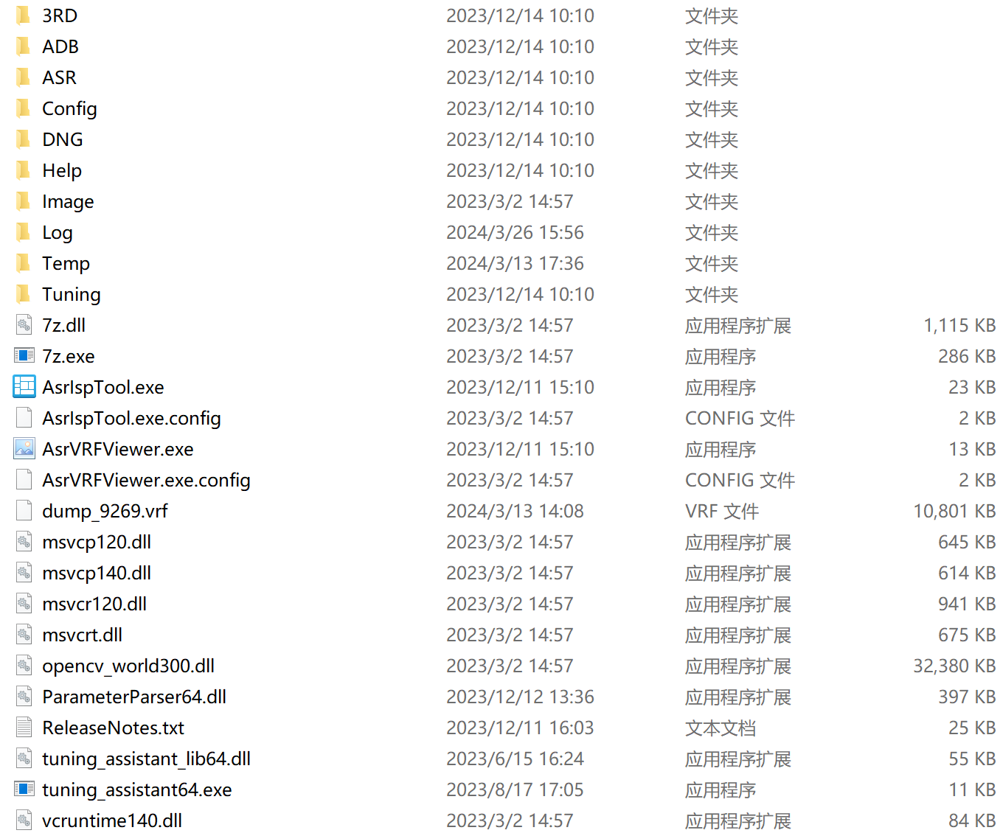

### Debugging Environment Setup

#### Hardware and Software Requirements

- **Hardware Environment**
  - Desktop or laptop computer
  - 1GHz or faster processor
  - 1GB RAM (32-bit) / 2GB RAM (64-bit)
  - At least 10GB of available hard disk space 
  - Screen resolution of 1920 × 1080 or higher
  - USB port
  - Terminal device integrated with ASR ISP

- **Software Environment**

  - Windows 7 64-bit or later version of the operating system

#### Device Connection

AsrIspTool connects to the terminal device via USB and communicates with the device through ADB.

>**Note.** Before connecting, the device must first start the tuning server thread, i.e., start the camera.

## Basic Operations of the Tuning Tool

### Main Interface of the Tuning Tool

Double-click `AsrIspTool.exe` to launch the tuning tool. The main interface is shown below:

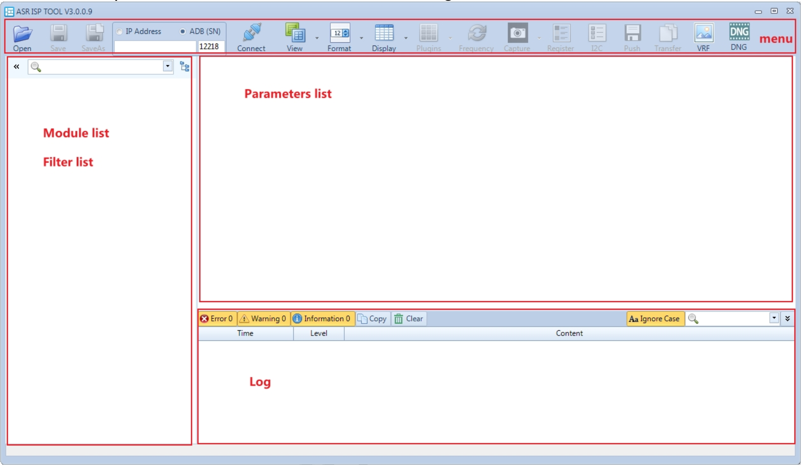

- **Menu: Functional Menu Area**
  - **Open**: Open parameter file.
  - **Save**: Save parameter file.
  - **Save As**: Save parameter file under a new name.
  - **IP Address**: Reserved.
  - **ADB (SN)**: Connect to the terminal device via ADB; supports manual input of ADB serial number.
  - **Connect**: Connect to the terminal device.
  - **View**: Switch between single-window, horizontal split, and vertical split display modes.
  - **Format**: Toggle between decimal and hexadecimal display.
  - **Display**: Switch between matrix editing, row editing, and column editing modes.
  - **Plugins**: Plugins.
  - **Frequency**: Adjust parameter refresh rate.
  - **Capture**: Capture VRF data (vrf).
  - **Register**: ISP register read/write tool.
  - **I2C**:  I2C read/write tool.
  - **Push**:  Reserved.
  - **Transfer**: Reserved.
  - **VRF**: Image viewer tool.
  - **DNG**: Reserved.

- **Module list & Filter list: Module and filter list**
- **Parameter list: List of parameter**
- **Log: Log area**

### Basic Online Operations

#### Connecting to the Terminal Device

After launching the tool, select **ADB (SN)** and click **Connect**. Once the connection is successful, the tool will automatically read the parameters of all current modules and periodically refresh the read-only parameters every 500 ms (this interval can be adjusted via the **Frequency** option in the menu).
If multiple terminal devices are connected to the PC, you can specify the serial number manually.

To enable periodic refreshing of read-write parameters as well, check the **AutoUpdate** option in the upper-right corner (Note. Parameters cannot be modified while this option is checked).

To perform a one-time read of all parameters, click the **Read** button in the upper-right corner.

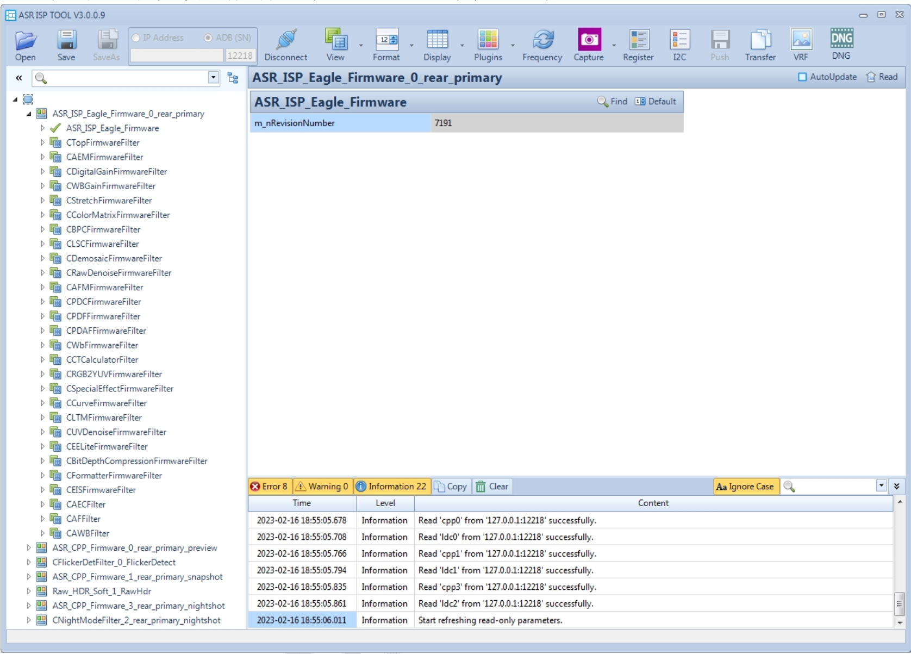

**Note**. The ADB connection method is only applicable for projects using the Android system. We primarily use TCP network connections to tune the development board.

#### Parameter Type Description

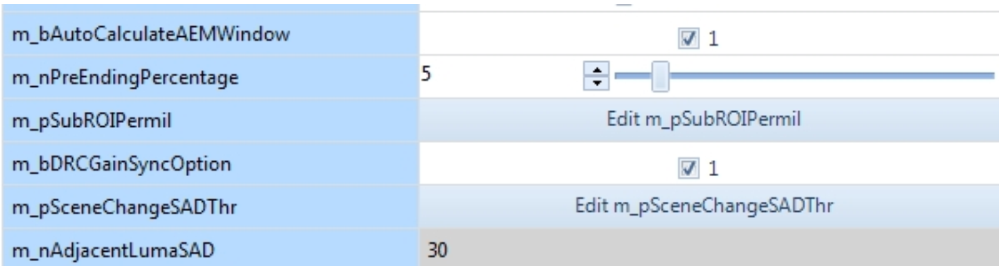

- **Adjustable Parameters**
  - Parameters that can be checked, for example, `m_bAutoCalculateAEMWindow`.
  - Editable parameters, for example, `m_nPreEndingPercentage`.
  - Editable array parameters, for example, `m_pSubROIPermil`. For two-dimensional arrays, you can switch between matrix, row, and column editing modes.

- **Read-Only (Gray)**
  - Read-only parameters, for example, `m_nAdjacentLumaSAD`.

- **Special Notes**
  - After modifying parameters in plugins or the parameter list, the changed content will be highlighted in red. Hovering the mouse over it will display the original value.

#### Real-Time Parameter Modification

1. Expand the module list for the module you want to debug.
2. Click the desired module in the module list area.
3. Adjust the parameter value using the slider or by directly editing the value in the parameter list area. The changes take effect immediately.

#### Capturing VRF Images

1. Click the **Capture** button in the menu area.
2. Select **RAW** and set the save path.
3. Click Start Capturing to generate raw images with the `.vrf` file extension.

#### Register Read/Write

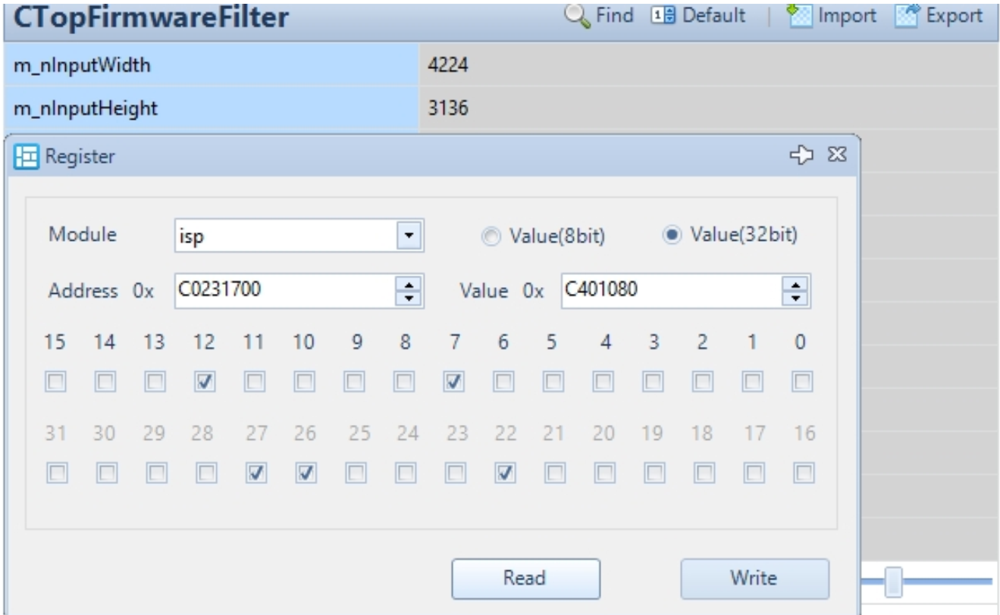

1. Click the **Register** button in the menu area.
2. Set the **Address** (register address).
3. Set the **Value (8bit)** (register value).
   - **Read**: Read the register.
   - **Write**: Write to the register.
4. Set the **Value (32bit)** (register value).
   - **Read**: Read the register.
   - **Write**: Write to the register.

#### I2C Read/Write


1. Click the **I2C** button in the menu area.
2. Set the **Device ID** (I2C device number).
3. Set the **Device Address** (slave device address).
4. Set the **Address Bytes** (register address byte width).
5. Set the **Register Address** (register address).
6. Set the **Value Bytes** (register value byte width).
7. Set the **Value** (register value).
   - **Read**: Read the register.
   - **Batch Read**: Batch read registers by importing a file.
   - **Write**: Write to the register.
   - **Batch Write**: Batch write registers by importing a file.


**Batch Register Read/Write File Format**  
The file format should be `{Address, Value}`.
When performing batch register operations, click **Batch Read** or **Batch Write** to import the `reg_batch.txt` file.
The results will be displayed in the red log area, and a file with the same name ending in `_read.txt` will be generated for later review.


  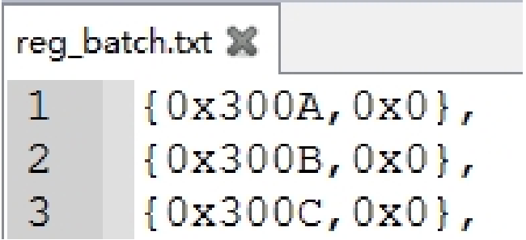

**Example of Batch Register Read/Write File Format**

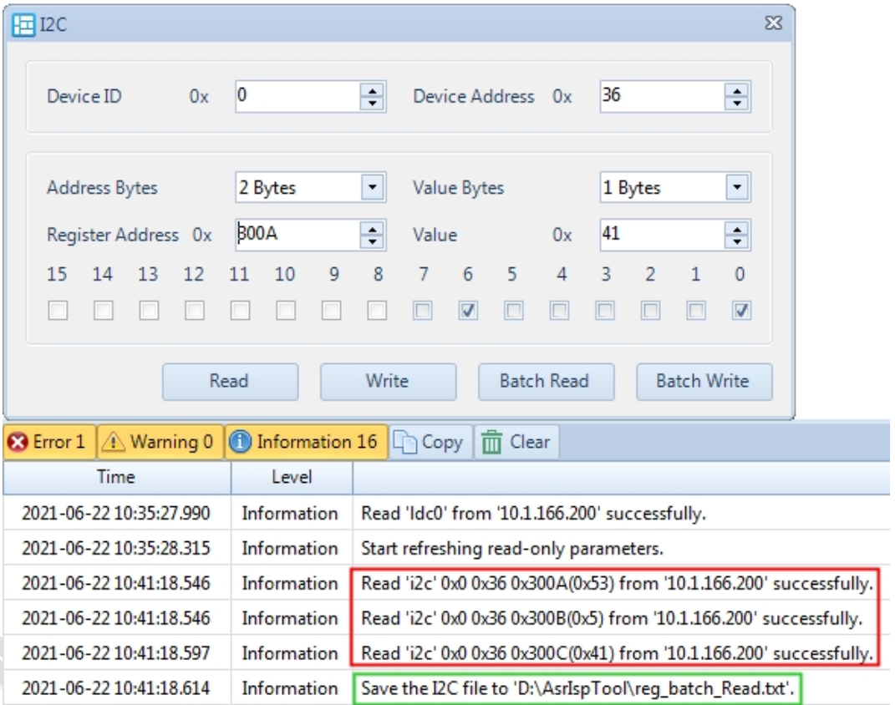

#### Saving Parameters

1. Click the **Save** button in the menu area.
2. Choose the path and set a file name.
3. Click Save to generate the parameter file.

#### Opening a Local Parameter File

Click the **Open** button in the menu area, or simply drag the parameter file into the corresponding module in the tool. This operation will directly write the parameters to the hardware.

### Basic Offline Operations

**Open a Local Parameter File**

- Click the **Open** button in the menu area, or drag the parameter file into the tool directly.

**Modify Parameters**

1. Expand the module list for the module you want to debug.
2. Click the desired module in the module list area.
3. Adjust parameter values using the slider or by directly editing the values in the parameter list.
4. If it is a one-dimensional vector, click the waveform button in the parameter editing interface to enter curve editing mode.

**Calibration Plugins**

- Click the **Plugins** drop-down menu in the menu area to select a plugin.

**Save Parameters**

- Click the **Save** button in the menu area, enter a file name, and the parameters will be saved to a local file

## ISP Plugins

This section introduces calibration and tuning for BLC, LSC, AWB, CCM, Curve, Noise, PDC, and PDAF, as well as auxiliary debugging tools like General Information and Raw Preprocessor.

Calibration plugins support both **online（connecting device)** and **offline（importing paqrameter files)** modes. The plugin can only be opened when the corresponding Filter parameters are enabled.

### BLC Calibration and Tuning

#### VRF Image Requirements for BLC Calibration

Capture VRF data in a completely dark environment or with the lens fully covered.

#### BLC Calibration Steps

The BLC calibration interface is shown below:
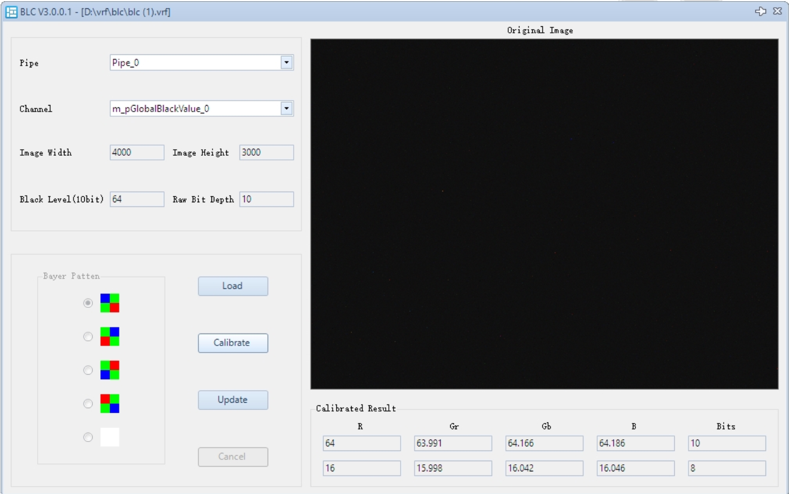

1. In the BLC plugin, click **Load** to import the VRF image.
2. Select the **Pipe ID** (optional if not a single pipeline).
3. Select the **Channel ID**.
4. Click **Calibrate**. The calibration result will be displayed in the **Calibrated Result** section. If the result is unsatisfactory, you can also manually edit the **Result**.
5. Click **Update** to apply the parameters to the parameter list. If the result is unsatisfactory, click **Cancel** to recalibrate.

#### Notes on BLC Calibration

- The **Calibrated Result panel** displays the values of 4 channels in both 10-bit and 8-bit formats. When the parameters are saved to a file, they are mapped to 12-bit values.
- **Channel ID**: Indicates the BLC parameters corresponding to a specific gain level of 2ᵅ. BLC can be adjusted dynamically with gain, ranging from 1x to 2048x gain, for a total of 12 levels (see the **Gain–BlackValue diagram** below). The final level, **manual**, takes effect only when **manual mode** is enabled; in this mode, BLC does not adjust with gain.

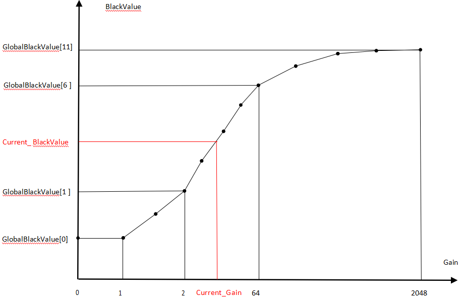

Gain – BlackValue Diagram

#### Notes on BLC Tuning

BLC parameters are located in **CDigitalGainFirmwareFilter**.

- If BLC should not change with gain, set **m_bManualMode** to 1. In this case, the BLC value is taken from **m_pGlobalBlackValueManual**.
- If BLC should change with gain, set **m_bManualMode** to 0. In this case, the BLC value is taken from **m_pGlobalBlackValue**.

### LSC Calibration and Tuning

#### VRF Image Requirements for LSC Calibration

Capture several uniformly illuminated images using a diffuse cover over the lens in a lightbox environment (D65, CWF, or A light) or any environment with shading.

#### LSC Calibration Steps

The LSC calibration interface is shown below:

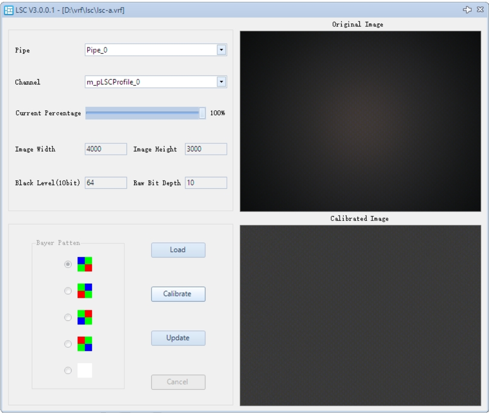

1. In the LSC plugin, click **Load** to import the VRF image.
2. Select the **Pipe ID** (optional if not a single pipeline).
3. Select the **Channel ID**.
4. Adjust the compensation ratio using **Current Percentage**. It is recommended to start with 100%; you can later fine-tune the compensation intensity using **strength**.
5. Click **Calibrate**. The simulated correction result will be displayed in **Calibrated Image**.
6. Click **Update** to apply the parameters to the parameter list. If the result is not satisfactory, click **Cancel** to recalibrate.


#### Notes on LSC Calibration

- **Channel ID**: 
  - `0`: Low color temperature compensation table
  - `1`: Medium color temperature compensation table
  - `2`: High color temperature compensation table
  - **manual**: Effective when **manual mode** is enabled; in this mode, LSC does not adjust with color temperature changes.

#### Notes on LSC Tuning

LSC can be adjusted according to **CT** or **CorrelatedCT** (see the **CT-LSCProfile diagram below**).

- **CT** Definition: 256 × AWB_RGain / AWB_BGain (can be obtained via CT info / 4 in the AWB plugin).
- **CorrelatedCT** Definition: Correlated color temperature, representing how closely the light emitted by a source matches the blackbody radiation at a certain color temperature.


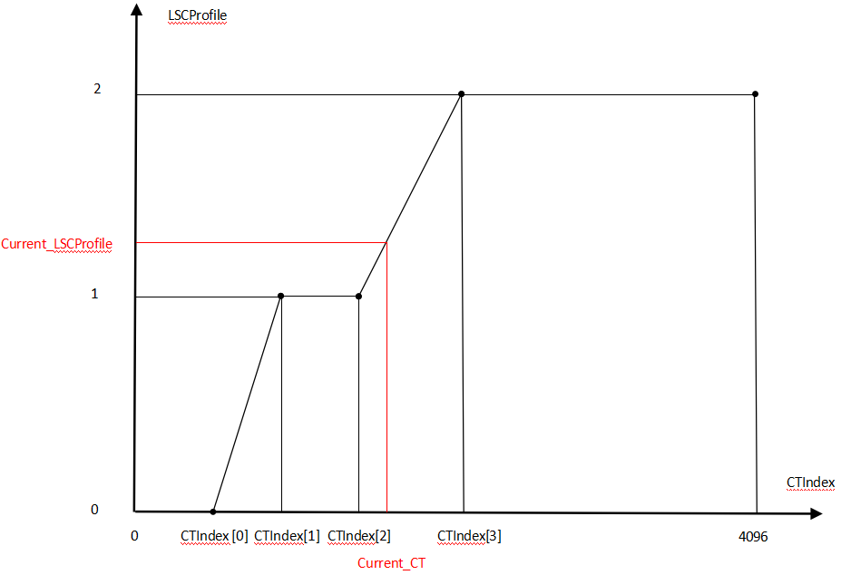

LSC parameters are located in CLSCFirmwareFilter.

- If LSC needs to change with color temperature, set an appropriate **m_pCTIndex** to select the shading table for different color temperatures.
- **Recommended to use**: **m_nCorrelationCT** (read from **CCTCalculatorFilter**).

**Note.** LSC interpolation can be based on either the CT result calculated by **AWBFilter** (read **CT** in AWB plugin) or the **CCT** result calculated by **CCTCalculatorFilter** (read **m_nCorrelationCT** in **WbFirmwareFilter**)

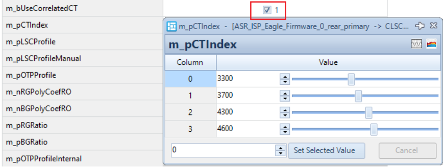

### CCM and CCT Calibration and Tuning

#### VRF Image Requirements for CCM Calibration

Capture an image of a 24-color chart in a lightbox environment. The color chart should be as centered and aligned as possible, occupying about 1/9 of the frame.
**D65**, **CWF**, and **A light sources** are required.

#### CCM Calibration Steps

The CCM calibration interface is shown below:

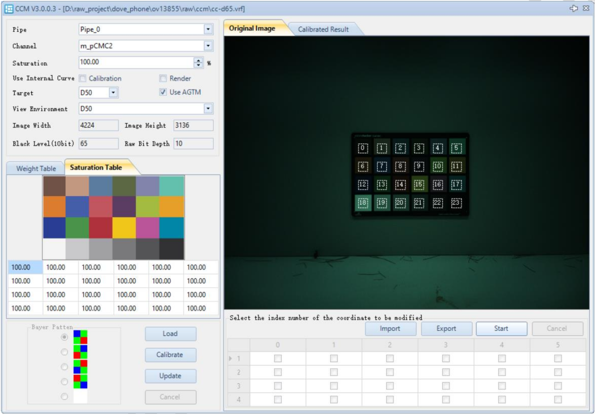

1. In the CCM plugin, click **Load** to import the VRF image. The VRF image should be compensated for LSC and PDF (if PD pixels exist) using the Raw **Preprocessor plugin**.
2. Select the entire color chart in the image by drawing a box, ensuring all 24 ROIs fall within the color patches. If the image is misaligned or heavily distorted, click **Start**, check the ROIs you want to adjust individually, and then manually drag the ROIs.
3. Set the desired saturation for calibration.
4. Click **Calibrate**. The calibration simulation result will be displayed in **Calibrated Result**.
5. Select the **Pipe ID** (optional if not a single pipeline).
6. Select the **Channel ID**.
7. Click **Update** to apply the parameters to the parameter list. If the result is not satisfactory, you can adjust the saturation of individual blocks in the **Saturation Table** and then recalibrate.

#### CCT Calibration Steps

The CCM calibration interface is shown below:

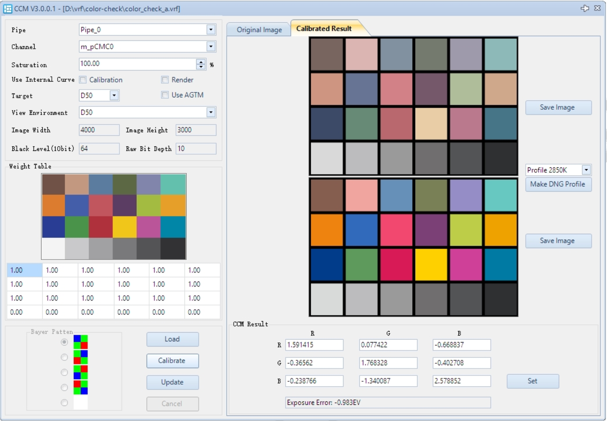

1. The CCT calibration can be performed simultaneously with CCM calibration. CCT requires only **A** and 
**D65** light sources.
2. After calibrating CCM with **A** light, select **profile 2850K** and click **UpdateCTMatrix**.
3. After calibrating CCM with **D65** light, select **profile 6500K** and click **UpdateCTMatrix**.
4. The results will automatically update in **CCTCalculatorFilter** under **m_pCTMatrix_low** / **m_pCTMatrix_high**.

#### Notes on CCM Calibration

- **Use Internal Curve – Calibration**: No need to check.
- **Use Internal Curve – Render**: No need to check.
- **Use AGTM**: Check this option.
- **Target**: Keep as **D50**。
- **View Environment**: Keep as **D50**。
- **Calibrated Result**: Displays the simulated result after calibration.
- **CCM Result**: Lists the calibrated color matrix. This can also be manually edited here. Click **Set** to apply it to the hardware。
- **Channel ID**: 
  - `0`: Low color temperature CCM parameters
  - `1`: Medium color temperature CCM parameters
  - `2`: High color temperature CCM parameters
  - **manual**: Effective when **manual mode** is enabled; CCM does not adjust with color temperature changes.
- **Make DNG Profile**: reserved
- **UpdateCTMatrix**: Update the CCT matrix
- **SaveImage**: Save the rendered image

#### Notes on CCM Tuning

CCM can be adjusted based on color temperature (see the **CCM–Color Temperature Control Curve below**).

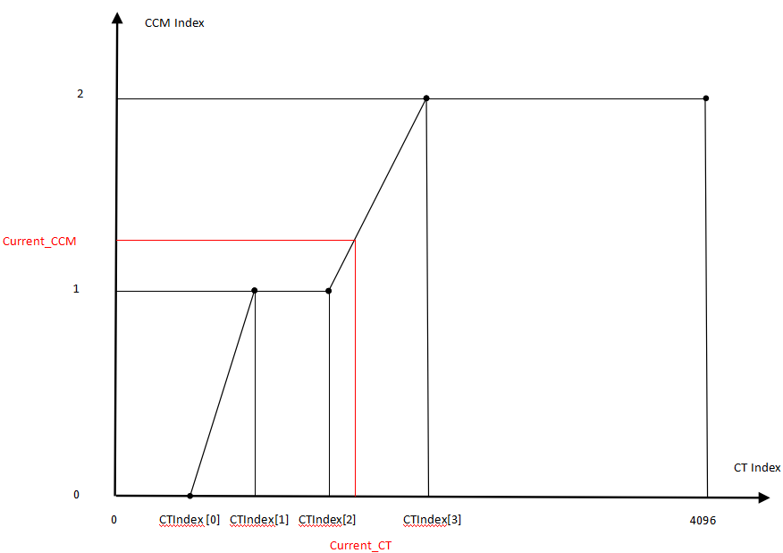

CCM parameters are located in **CColorMatrixFirmwareFilter**.

- If CCM needs to change with color temperature, set an appropriate **m_pCTIndex** to select the color matrix for different color temperatures.
- **Recommended to use**: **CorrelatedCT**.

**Note**. CCM interpolation can be based on either the CT result calculated by **AWBFilter** (read **CT** in the AWB plugin) or the **CCT** result calculated by **CCTCalculatorFilter** (read **m_nCorrelationCT** in **WbFirmwareFilter**).

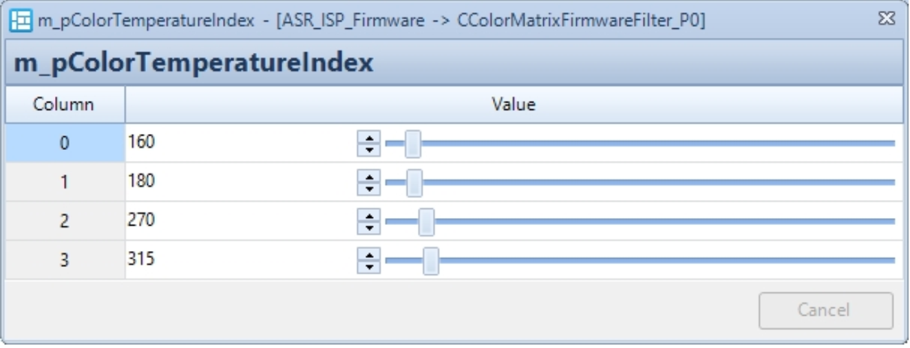

### AWB Calibration and Tuning

#### VRF Image Requirements for AWB White Point Calibration

No additional images are needed for AWB calibration; it can be performed after completing CCT calibration.

#### AWB White Point Calibration Steps

The AWB calibration interface is shown below:

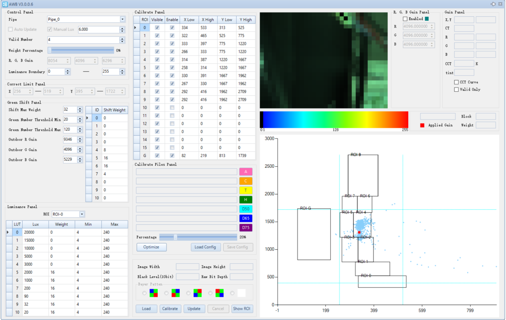

1. Open the AWB plugin.
2. Click **Optimize**. The calibration parameters will be automatically updated in the parameter interface.

#### AWB Brightness Calibration

After AE tuning is completed, brightness calibration of the module is required to obtain the Lux value needed by AWB. The calibration steps are as follows:

1. Place the camera in the lightbox and capture the lightbox wall with the light source set to **D65**.
2. Measure the lightbox illuminance using a color temperature illuminance meter and enter the value into **m_nCalibSceneLux** in the **AECFilter**.
3. Read **m_nExpIndexLong** from **AECFilter** and enter it into **m_nCalibExposureIndex** in **AECFilter**.
4. Read **m_nLumQ16** from **AECFilter** and enter it into **m_nCalibSceneLum** in **AECFilter**.

| Parameter Name        | Description                                                     | Recommended to Tune | Special Notes |
| --------------------- | ----------------------------------------------------------------| ------------------- | ------------- |
| m_nCalibExposureIndex | Exposure index for brightness calibration                       | Yes                 |               |
| m_nCalibSceneLum      | Scene brightness for brightness calibration                     | Yes                 |               |
| m_nCalibSceneLux      | Actual illuminance corresponding to calibration scene           | Yes                 |               |
| m_nSceneLux           | AWB debug parameter, current scene illuminance calculated by AE | -                   | Read-Only     |

#### AWB Debug

##### Block Debug Information

When connected to the device, open the AWB plugin. The position of each block will be displayed as a blue dot on the coordinate axis, and the AWB statistics image will be shown as a thumbnail.

You can select a region on the statistics chart (by default, points from all regions are displayed). After selection, only the points within the selected blocks will be shown.

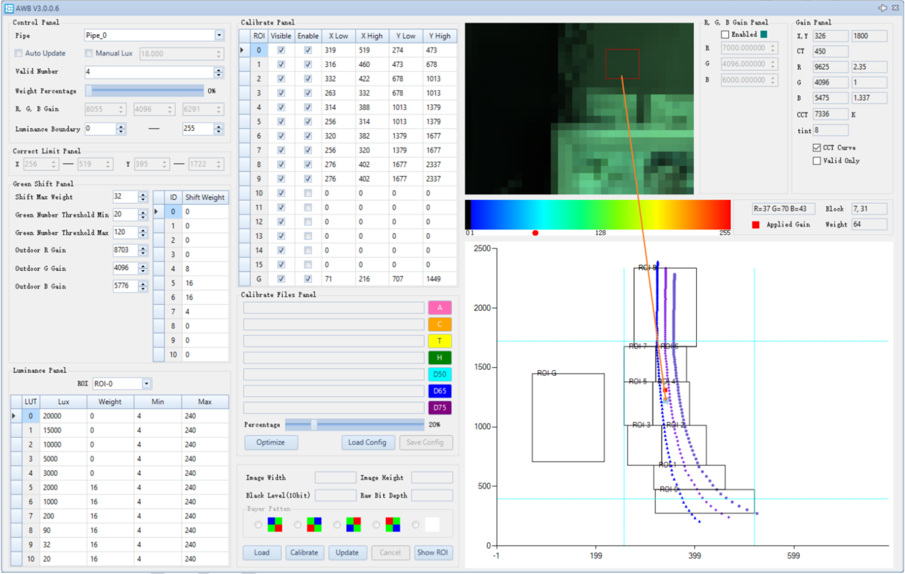

##### White Points within ROI

Click **Show ROI** to view the blocks contained within different ROIs. The white blocks are those participating in the white balance calculation, meaning the blocks that fall inside the ROI area.
The image below shows the specific affiliation of 32 x 24 blocks to their respective ROIs

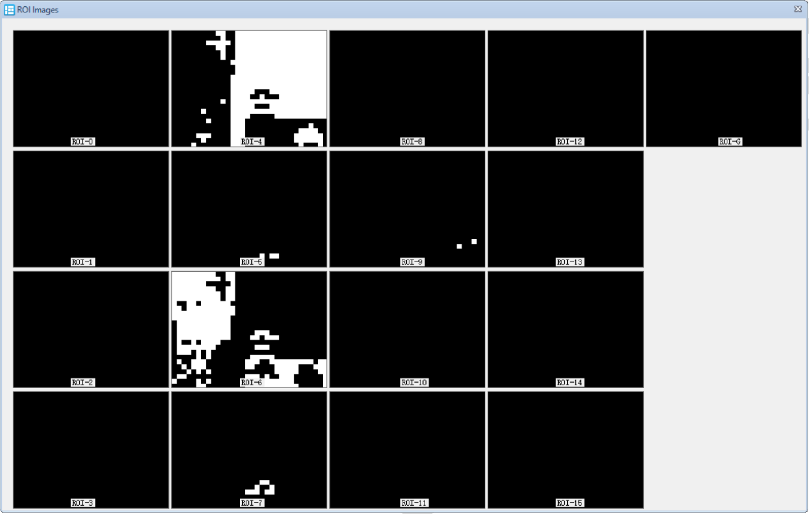

##### Block Weight

Checking **auto update** will periodically refresh the lux value and statistics chart, and calculate the block weights in real-time.

By adjusting the **Weight Percentage** slider, you can control the ratio between the actual scene and the blocks participating in the white balance calculation on the debug image.

- At 0%, the image shows the actual scene.
- At 100%, it shows the weights of blocks participating in the white balance calculation (weights are referenced in the heatmap).

If set to 100%, the screen may appear completely black, indicating that all blocks have zero weight under the current lux.

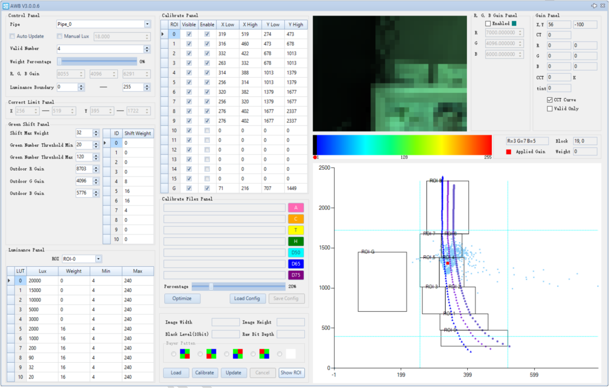

Setting **Weight Percentage** to 100% displays the block weights as a heatmap. You can hover the mouse over any block to see its weight displayed on the right side of the heatmap (debug info is also available in **AWB Frameinfo**).In the image below, the mouse is selecting block[12][2], which has a weight of 16.

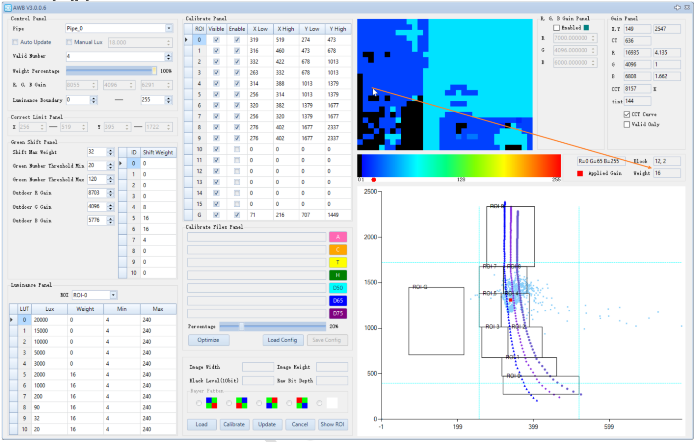

##### White Balance Gain Position

In the **RGB gain panel** module, check **enabled**, and enter RGB gain values in Q12 precision (from debug info **CurrentResult**).
The corresponding white balance gain will be displayed as a blue square in the chromaticity (color temperature) coordinate system.
You can zoom in by dragging the mouse from the top-left to the bottom-right, and zoom out by dragging from the bottom-right to the top-left.

The current white balance gain is shown as a red square in the chromaticity coordinate system.


#### AWB Debug Description

- **Calibration Panel**

  - **Calibrate Panel**
    - **Visible**: When checked, this ROI will be shown in the chromaticity coordinate system.
    - **Enable**: When checked, this ROI is enabled for calibration.
  - **Calibrate Files Panel**
    - **Percentage**: Proportion of the VRF image to be used for calibration. For example, 20% means the central 20% area of the image will be used, as the center is less affected by shading.
    - **Optimize**: Performs automatic calibration.
    - **Load config**: Reserved.
    - **Save config**: Reserved.
    - **Load**: Import VRF file.
    - **Calibrate**: Reserved.
    - **Update**: Update parameters to the parameter list.
    - **Cancel**: Cancel parameter updates.
    - **ShowROI**: Show the white points within each ROI.

- **Debugging Panel**

  - **Control Panel**
    - **Pipe ID**: Current pipeline ID (selectable when not using a single pipe).
    - **Auto Update**: Automatically updates the current brightness and statistics window when online (when checked, parameters in the plugin cannot be modified).
    - **Manual Lux**: Fixes the current brightness.
    - **Weight Percentage**: Debug parameter to adjust the display of white balance statistic blocks and their weights.
      - **0%** shows the statistic blocks;
      - **100%** shows a heatmap of block weights.
    - **RGB Gain** Debug-applied gain, corresponding to the red point in the chromaticity coordinate system.
    - **Luminance Boundary**: Brightness range (8-bit) of pixels participating in AWB statistics.
    - **Valid Number**: Minimum number of valid blocks required for white balance calculation, range [0,768]。
    - **Correct Limit Panel**: Block range limits. Blocks that exceed the limits and fall within the ROI will be remapped in the XY direction.

  - **Green Shift Panel**
    - **Shift Max Weight**: Shift weight; multiplied by exposure shift to get the final shift weight. Maximum is 32, which fully biases toward the outdoor gain.
    - **Green Number Threshold**: Threshold: The number of blocks falling into the "G region"; if within this range, green shift is activated.
    - **Outdoor RGB Gain**: Target gain for green shift.。
    - **Shift Weight**: Weight adjusted based on exposure.

  - **Luminance Panel**
    - **Lux**:  Brightness index.
    - **Weight**: The weight of the corresponding ROI at the current brightness level.
    - **Min / Max**: Luminance range (8-bit).

- **Debug Panel**

  - **RGB Gain Panel**
    - **enabled**: Used to display the white balance gain position in the color temperature coordinate system.
    - **RGB**: White balance gain.

  - **Gain Panel**: Debug information. Hovering the mouse over the color temperature coordinate system will display the corresponding debug info.
    - **X Y**: The XY coordinates of the point on the color temperature coordinate system.。
    - **CT**: The correlated color temperature (CT) value at the point, which can be used as a reference for LSC and CCM interpolation.
    - **RGB**: The white balance gain at the point on the color temperature coordinate system.
    - **CCT**、**Tint**: The correlated color temperature and tint at the point, also usable for LSC and CCM interpolation.
    - **CCT curve**: Displays the CCT curve on the color temperature coordinate system.
    - **Vaild only**: Displays only the valid statistic blocks on the color temperature coordinate system.
    - **Applied Gain**: The white balance gain point of the current scene, shown as a red dot on the color temperature coordinate system.。
    - **Block**、**Weight**: When hovering the mouse over the statistics image, the corresponding block position and weight are displayed.

### Curve Debugging

#### Curve Debugging Steps

The Curve debugging interface is shown below:

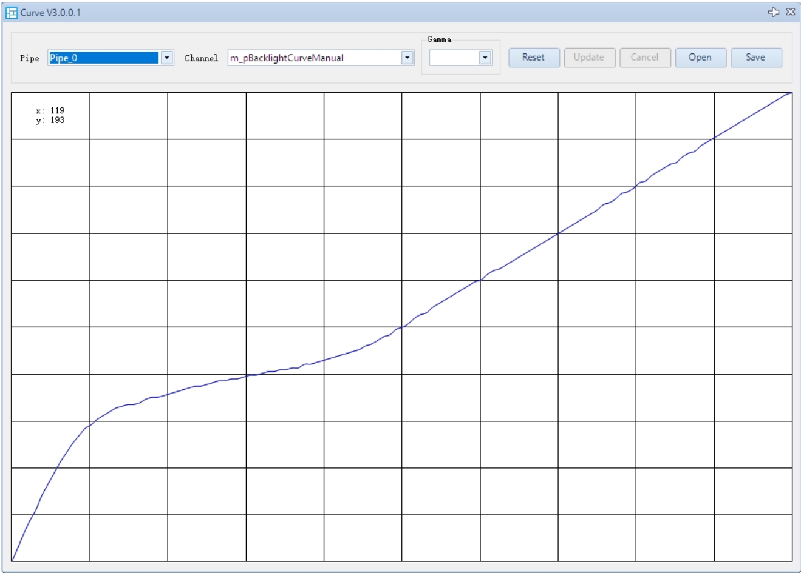

1. Open the Curve plugin.
2. Select **Pipe ID** (applicable if not using a single pipeline).
3. Select **Channel ID**.
4. Move the mouse to the point on the curve you want to adjust, then left-click and drag it to the desired position.
5. Click **Update** to apply the parameters to the parameter list. If the result is unsatisfactory, click **Cancel** to redo the calibration.

#### Curve Debugging Description

- **Channel ID**: 
  - **BacklightCurveManual**: Controls the background brightness. It is recommended to keep the curve unchanged and only adjust the **strength**.
  - **ContrastCurveManual**: Controls the contrast. It is recommended to keep the curve unchanged and only adjust the **strength**.
  - **GTMCurve0**: Curve used when the gain equals **m_pGainIndex[0]** (Q4 precision).
  - **GTMCurve1**: Curve used when the gain equals **m_pGainIndex[1]** (Q4 precision).
  - **GTMCurve2**: Curve used when the gain equals **m_pGainIndex[2]** (Q4 precision).

**Note**. When **m_nCurveSelectOption** is set to 0, the curve is interpolated based on the current gain (see diagram below: **Curve-Gain Control Curve Diagram**).

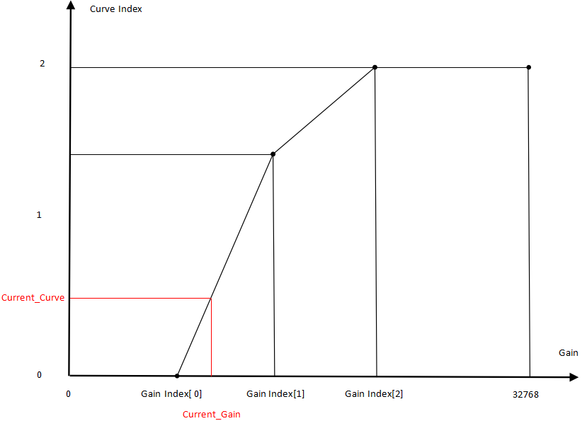

Curve parameters are located in **CCurveFirmwareFilter**.

- The curve can vary with gain. Set appropriate **m_pGainIndex** values to specify different curves for different gains.


### Noise Calibration and Debugging

#### RAW Image Requirements for Noise Calibration

In a laboratory environment, use a 24-color chart for shooting. Ensure that the color chart is as straight/aligned as possible, centered in the frame, and occupies approximately 1/9 of the image.

Adjust the lighting brightness accordingly, and sequentially capture images of the color chart under the following gain settings:
1×, 2×, 4×, 8×, 16×, 32×, 64×, 128×, 256×, 512×, 1024×, and 2048× gain.

#### Noise Calibration Steps

The calibration interface is shown in the figure below:

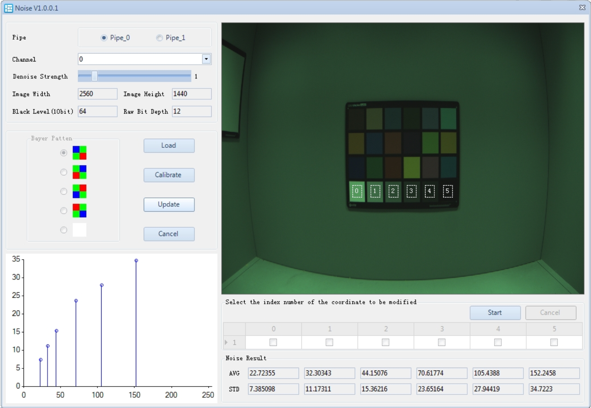

1. In the Noise plugin, click **Load** to import the RAW image. Use the **Raw Preprocessor** plugin to compensate for LSC and PDF (if there are PD pixels).
2. In the image, select the bottom 6 color patches on the color chart. Ensure that all 6 ROIs fall entirely within the color blocks. If the image is tilted or has noticeable distortion, click **Start**, check the ROIs you want to manually adjust, and drag them into the correct position.
3. Set the desired **Denoise Strength**.
4. Click **Calibrate**. The calibrated noise levels will appear under **Noise Result**.
5. Select the **Pipe ID**.
6. Select the **Channel ID**.
7. Click **Update** to apply the parameters to the parameter list. If the result is not satisfactory, click **Cancel** to re-calibrate


#### Noise Calibration Description

- **Noise Result**: Displays the calibrated noise level.
- **Channel ID**: 
  - `0`: Denoise parameters at 1× gain.
  - `1`: Denoise parameters at 2× gain.
  - And so on, up to `11`: Denoise parameters at 2048× gain.
  - **manual**: Denoise parameters used in manual mode.

### PDAF Calibration

#### PDAF Calibration VRF Image Requirements

Capture a checkerboard pattern in a laboratory environment, with the object distance at 2 meters, and the checkerboard parallel to the sensor.
Control the lighting brightness so that the gain is as close to 1× as possible.
Capture images from the motor moving from the minimum to the maximum valid position (divide the entire scan area into 30 segments, resulting in 31 positions), for a total of 31 images.
(VRF file naming convention: **position.vrf**; PD raw files naming convention: **position_L.raw**, **position_R.raw**).

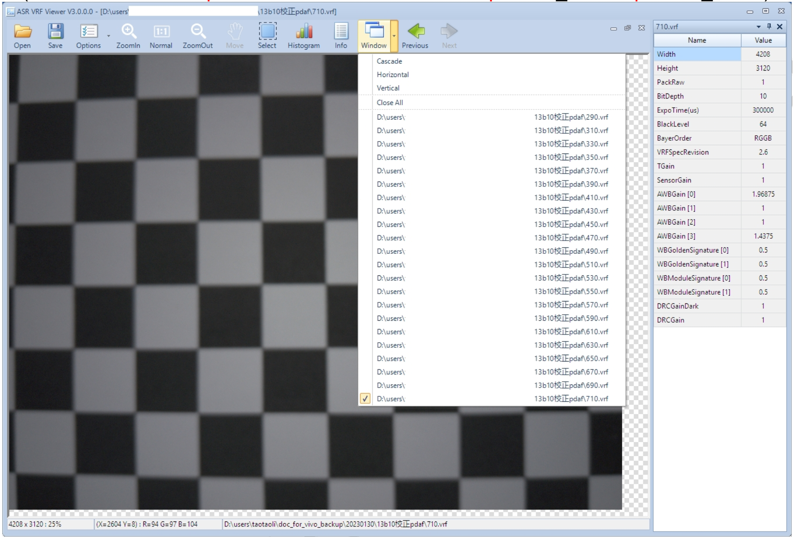

#### PDAF Calibration Steps

The PDAF calibration interface is shown below:

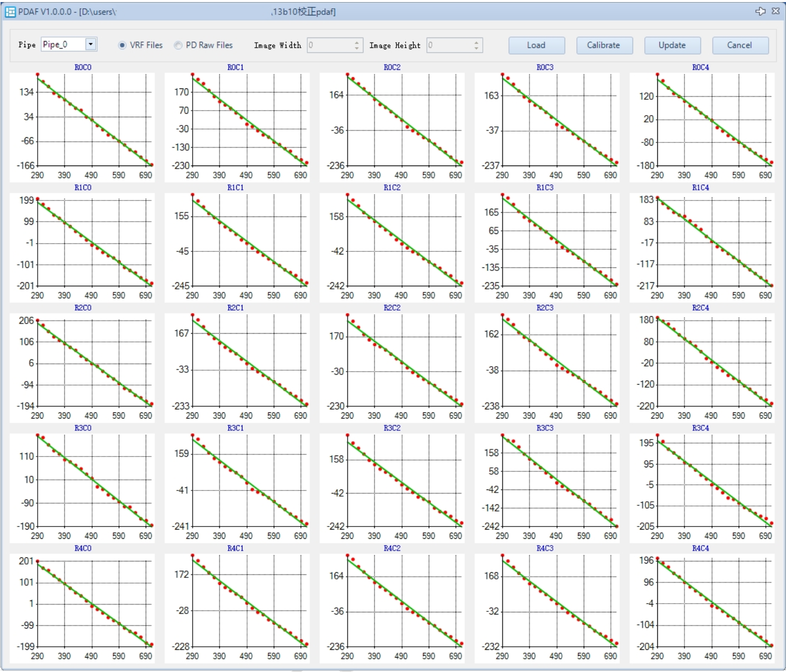

1. In the **PDC** plugin, click **Load** to select the folder containing VRF files (if importing already extracted PD raw files, you will also need to input the raw width and height).
2. Click **Calibrate**, which will display a **position – shift** map corresponding to the image divided into 5x5 blocks.
3. Select the **Pipe ID** (applicable if not a single pipeline).
4. Click **Update**, and the **m_pPDShiftPositionLUT** parameter in **CAFFilter** will be updated.
5. If the result is unsatisfactory, click **Cancel** to recalibrate.

### PDC Calibration

PDC is used to compensate the brightness of PD pixels or shadow pixels to normal brightness for use by the PDAF autofocus algorithm.
Given the known PD points and shadow distribution (via **m_pPixelMask** and **m_pPixelTypeMask**), PDC parameters **m_pRatioBMap** are calibrated using images containing the PD pixel distribution.

#### PDC Calibration VRF Image Requirements

In a lightbox environment **D65**, shoot the lightbox wall using frosted glass.

#### PDC Calibration Steps

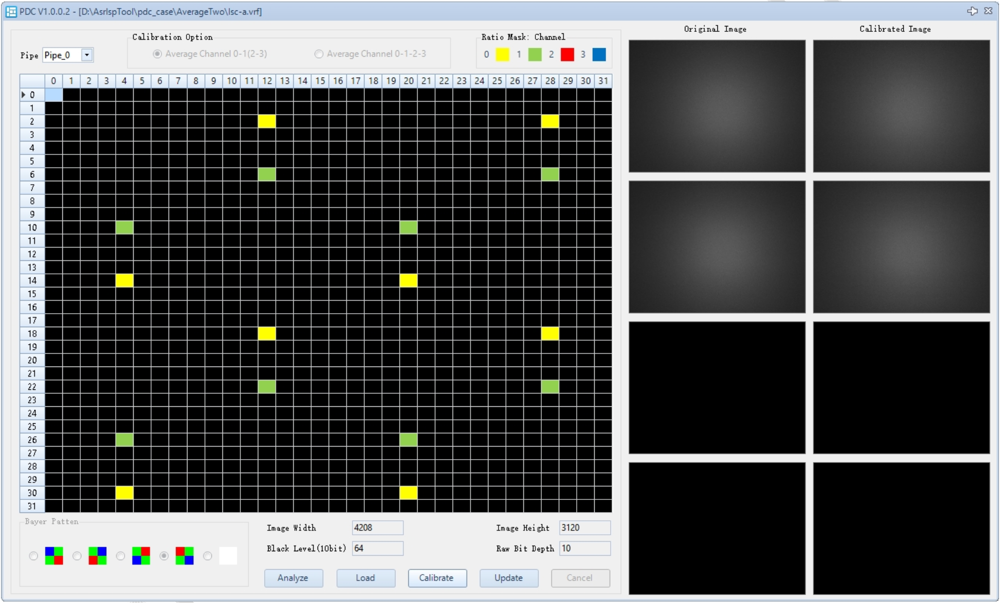

1. In the PDC plugin, click **Analyze**. The plugin will check whether the settings for **m_pPixelMask** and **m_pPixelTypeMask** are reasonable. If not, these two parameters need to be adjusted.
2. After the **Analyze** process confirms the settings are reasonable, the **Load** button becomes enabled. For QuadBayer PD, you can select the compensation mode (channel 0-1 complementary or channel 2-3 complementary; if the number of PD points in the four channels is equal, four-channel complementary compensation is also available).
3. After successfully **Loading** the image, the right panel will display small images composed of extracted PD points for the corresponding channels. Press the **Calibrate** button to calculate the **m_pRatioBMap** based on the image, and the compensated PD points using the new **m_pRatioBMap** will be displayed on the right.
4. The **Update** button updates the **m_pRatioBMap** parameter in PDC. If the result is unsatisfactory, click Cancel to recalibrate.
5. Select the **Pipe ID** (if multiple pipelines are used).
6. Click **Update** to apply the parameters to the parameter list. If the result is unsatisfactory, click **Cancel** to recalibrate.


#### PDC Calibration Explanation

**Explanation of m_pPixelMask and m_pPixelTypeMask**

1. These two parameters calibrate the distribution of PD and shadow pixels in the image, with a 32x32 periodic pattern.
- If **m_pPixelMask = 1**, the current pixel is a PD pixel, and **m_pPixelTypeMask** indicates one of four directions of pixel shadowing.
- If **m_pPixelMask = 0** and **m_pPixelTypeMask > 0**, the current pixel is a shadow pixel.
2. These two parameters are usually provided by the sensor manufacturer. If not available, manual calibration can be performed by capturing RAW images.

### Raw Preprocessor Plugin

#### Raw Preprocessor Plugin Description

The Raw Preprocessor plugin is used for raw data preprocessing. It supports PD pixel correction, LSC compensation, and unpacking VRF files (ASR RAW packed format).

#### Using the Raw Preprocessor Plugin

The Raw Preprocessor interface is shown below

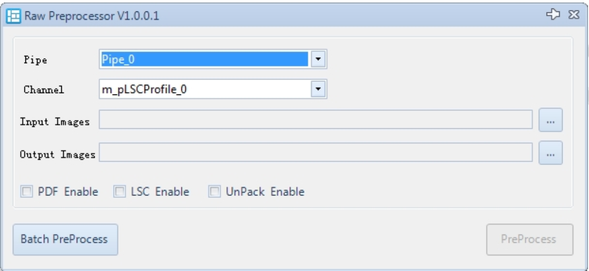

1. Set the **input** and **output** VRF files in the Raw Preprocessor plugin.
2. Select the corresponding **pipe** and **LSC channel**.
3. Choose the desired preprocessing functions: PDF, LSC, and Unpack.
4. Click **Preprocess**.
5. **Batch preprocess** supports importing folders for batch processing of VRF files.

### General Information Plugin

The General Information plugin is used to connect to the device and display some debug information in real-time.

### General Information Display

By default, the following information is configured for debugging engineers’ reference:

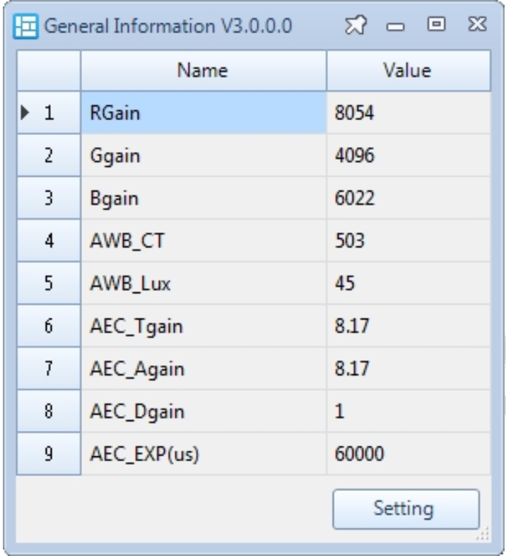

#### General Information Extension

Click **Setting** to open the information editing page as shown below. You can freely edit the information you want to monitor. Each line represents one display item. For format details, refer to the **Expression Manual**.

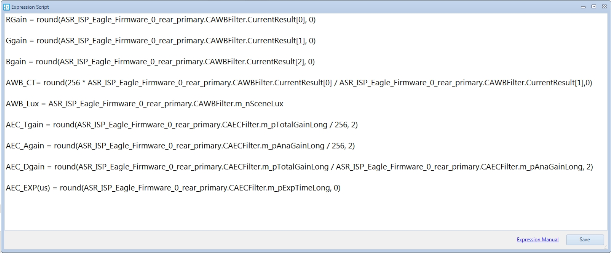

## ISP Tuning

### CTopFirmwareFilter Debug Explanation

CTopFirmwareFilter is used to configure ISP Top information.

#### TOP Parameters

| Parameter Name | Description| Recommended to Tune | Special Notes |
|---|---|---|---|
| m_nBayerPattern | Bayer pattern mode:  `0`: RGGB;   `1`: GRBG;   `2`: GBRG;   `3`: BGGR;   `4`: Monochrome mode | According to hardware settings |    |
| m_bAELinkZoom | AE window linked to zoom | User setting |   |
| m_bAFLinkZoom | AF linked to zoom | User setting |   |
| m_bAWBLinkZoom | AWB linked to zoom | User setting |   |
| m_nPreviewZoomRatio | Preview zoom ratio, Q8 format | User setting |   |
| m_bPreviewLowPowerMode | Preview low power mode | User setting |   |
| m_nAEProcessPosition | AE processing timing   `0`: eof;   `1`: sof | User setting |   |
| m_nAEProcessFrameNum | AE processing frequency:  EOF every frame  EOF every two frames  SOF every frame  SOF every three frames | User setting |   |
| m_bHighQualityPreviewZoomEnable | Reserved |   |  |

### CAEMFirmwareFilter Parameter Description

The CAEMFirmwareFilter module is used to configure the Auto Exposure (AE) statistics module.

#### AEM Enable and Parameters

| Parameter Name | Description | Recommended to Tune | Special Note |
|---|---|---|---|
| m_bEnable | AEM Enable:  `0`: Disable AE statistics module;    `1`:  Enable AE statistics module | No |   |
| m_nAEStatMode | AE statistics mode: `0`: Statistics without white balance    `1`: Statistics with white balance | No |   |
| m_bZSLHDRCapture | Zero Shutter Lag HDR capture enable   `0`: Disable   `1`: Enable zero shutter lag HDR capture | User setting |   |
| m_nInitialExpTime | vInitial exposure time | Yes |   |
| m_nInitialAnaGain | Initial analog gain | Yes |   |
| m_nInitialSnsTotalGain | Initial sensor total gain | Yes |   |
| m_nInitialTotalGain | Initial total gain | Yes |   |
| m_nStableTolerance | AE stability tolerance percentage: If the difference between current exposure and previous exposure is less than previous exposure * m_nStableTolerance%, AE StableFlag is issued for use by other modules like LTM | User setting|   |
| m_nStableToleranceExternal | AE stability tolerance percentage for external systems | User setting |   |
| m_bAutoCalculateAEMWindow | AE statistics window calculation method:   `0`: Configured by hardware;   `1`: Controlled by firmware | No |   |
| m_nPreEndingPercentage | Percentage of rows (relative to image height) excluded from AE statistics | No |   |
| m_bDRCGainSyncOption | DDRC gain synchronization:  `0`: Sync every frame;   `1`: Sync after AE stable | No |   |
| m_pSceneChangeSADThr | SAD threshold for scene change detection | User setting |   |
| m_pSubROIPermil | Start and end coordinates of 6 sub-statistics modules relative to image width and height in permille; modifiable by application (e.g., face metering or focus metering linkage) | User setting |   |
| m_nSubROIScaleFactor | Sub-window scaling percentage factor | User setting |   |
| m_nFaceLumaOption | Face luminance statistics method:   `0`: Hardware statistics (pixel) ;  `1`: Software statistics (block) | No |   |
| m_bMotionDetectEnable | Motion detection enable:  `0`: Disable   `1`:  Enable| User setting |  |
| m_bMotionDetectExt | Motion detection method:   `0`:  Use internal AEM statistics;   `1`: Use external gyro sensor | User setting |  |
| m_nMotionStrengthExt | External motion strength control, effective when motion detection method is external gyro | User setting |  |
| m_nSADIntervalFrame | Interval frame count for SAD calculation, effective when motion detection method is internal AEM statistics  | No |  |
| m_nMotionThreshold | SAD threshold to judge motion, effective when motion detection method is internal AEM statistics  | No |  |
| m_nMotionDetectFrame | Number of consecutive frames with SAD exceeding threshold to consider as motion scene | No |  |
| m_nFaceDetFrameID | Frame ID where face was detected |  - | Read-only |
| m_nAdjacentLumaSAD | Current SAD |  - | Read-only |
| m_pMainRoiCoordinate | Main window coordinates |  - | Read-only |
| m_pSubRoiCoordinate | Sub-window coordinates |  - | Read-only |

### CDigitalGainFirmwareFilter Parameter Description

The CDigitalGainFirmwareFilter module is used to configure digital gain and black level.

#### Digital Gain Enable and Parameters

| Parameter Name | Description| Recommended to Tune | Special Note |
|---|---|---|---|
| m_bEnable | Digital gain enable:   `0`: Disable digital gain;    `1`: Enable digital gain | User setting |   |
| m_nISPGlobalOffsetValue12bit | `0`: Subtract black level in stretch;   `1`: Subtract black level fully in digital gain;   `2-511`: Offset added after black level subtraction at 12-bit (this offset is subtracted in stretch) | User setting |   |
| m_bManualMode | Manual mode enable   `0`: Auto mode   `1`: Enable manual mode; black level parameters do not change with gain and use manual parameters; for debug use |   |   |
| m_pGlobalBlackValueManual | Manual mode parameters, function same as auto mode |   |   |
| m_pGlobalBlackValueManualCapture | Same as above, effective during capture |   |   |
| m_pGlobalBlackValue | Black levels for R/GR/GB/B channels (see Gain-BlackValue illustration) | Calibration result | Can vary with gain |
| m_pGlobalBlackValueCapture | Same as above, effective during capture | Calibration result | Can vary with gain |
| m_pWBGoldenSignature | White balance golden module signature |  - | Read-only |
| m_pWBCurrentSignature | White balance current module signature |  - | Read-only |

The BlackValue diagram is as follows:


### CWBGainFirmwareFilter Parameter Description

The CWBGainFirmwareFilter module is used for Auto White Balance (AWB) gain.

#### WB Gain Enable

| Parameter Name | Description | Recommended to Tune| Special Note |
|---|---|---|---|
| m_bEnable | WB gain enable:  `0`: Disable white balance gain;   `1`:  Enable white balance gain | No |  |

### CStretchFirmwareFilter Parameter Description

The CStretchFirmwareFilter module is used to compensate for pixel undersaturation after black level subtraction.

#### Stretch Enable

| Parameter Name | Description | Recommended to Tune| Special Note |
|---|---|---|---|
| m_bEnable | Stretch enable: always on, used to compensate for black level subtraction and pixel undersaturation | No |  |

### CColorMatrixFirmwareFilter Parameter Description

The CColorMatrixFirmwareFilter (CCM) module is used for color correction.

#### CCM Enable

| Parameter Name| Description | Recommended to Tune | Special Note |
|---|---|---|---|
| m_bEnable | CCM enable:  `0`: Disable the color correction matrix;    `1`: Enable the color correction matrix | No |  |

#### CCM Parameters and Tuning

| Parameter Name | Description | Recommended Tuning | Special Notes |
|---|---|---|---|
| m_bUseCorrelatedCT | Interpolation basis option: `0`: Use AWB's CT; `1`: Use `m_nCorrelationCT` from `WbFirmwareFilter` (CCT matrix needs calibration) | User-defined |   |
| m_pColorTemperatureIndex | Color temperature segmentation control points. (See example below: cmc-color temperature control curve)   If the color temperature is in the range [0, Index[0]], it is considered a low color temperature range, and CMC0 is used;   In [Index[0], Index[1]], an interpolated matrix between CMC0 and CMC1 is used;   In [Index[1], Index[2]], it is considered a medium color temperature range, and CMC1 is used;   In [Index[2], Index[3]], an interpolated matrix between CMC1 and CMC2 is used;   In [Index[3], 8192], it is considered a high color temperature range, and CMC2 is used; | Yes |   |
| m_pCMC0 | Low color temperature correction matrix, calibrated by the CCM plugin. R'G'B' to RGB, Q12 precision. | Calibration result parameter | Callable based on color temperature |
| m_pCMC1 | Medium color temperature correction matrix, calibrated by the CCM plugin. R'G'B' to RGB, Q12 precision. | Calibration result parameter | Callable based on color temperature |
| m_pCMC2 | High color temperature correction matrix, calibrated by the CCM plugin. R'G'B' to RGB, Q12 precision. | Calibration result parameter | Callable based on color temperature |


cmc-Color Temperature Control Curve (see figure below)  
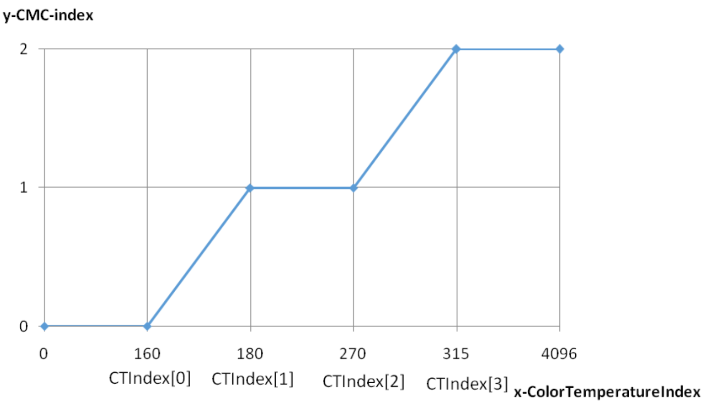

#### CCM Color Fringe Suppression Function and Parameters

| Parameter Name | Description | Recommended Tuning | Special Notes |
|---|---|---|---|
| m_bColorFringleRemoveEnable | Color fringe suppression enable:  `0`: Disable   `1`: Enable | User-defined |   |
| m_nColorFringRemovalStrength | Color fringe suppression strength: The larger the value, the stronger the suppression effect | Yes |  |

Note. Final CFR_Ratio = HueRatio\*EdgeRatio\>\>HighFreqTransShiftNum

- **Hue Control Parameters**

| Parameter Name | Description | Recommended Tuning | Special Notes |
|---|---|---|---|
| m_nHueTransShiftNum | Hue transition zone offset coefficient: (See example below: HueTrans-HueRatio control curve) Hue values falling in the range [(ColorFringeHueRange[0]-(1&lt;&lt;ShiftNum)，ColorFringeHueRange[0]]  will be smoothed; Hue values in the range [ColorFringeHueRange[1]，(ColorFringeHueRange[1]+(1&lt;&lt;ShiftNum)] will also be smoothed; | Yes |   |
| m_pColorFringeHueRange | Hue range for color fringe suppression (see example below: HueTrans-HueRatio control curve). HueRange[0] must be less than HueRange[1] | Yes |  |

ColorFringeHueRange[0],[1] is used to define the Hue range for color fringe suppression;

HueTransShiftNum is used to set the smoothing transition zone:

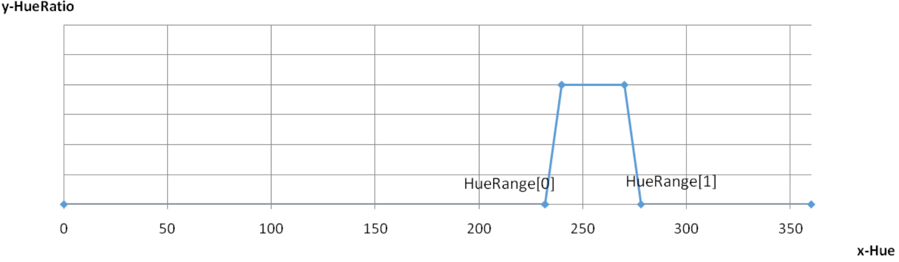


- **Freq Control Parameters**

| Parameter Name | Description | Recommended Tuning | Special Notes |
|---|---|---|---|
| m_nHighFreqThreshold    | Lower frequency threshold for color fringe suppression (see example in HighFreqTrans-EdgeRatio curve). The larger the value, the fewer edges enter the color fringe suppression area | Yes |   |
| m_nHighFreqTransShiftNum  | High-frequency transition band offset coefficient (see example in HighFreqTrans-EdgeRatio curve). Frequencies falling into the range [HighFreqThreshold, HighFreqThreshold +(1&lt;&lt;HighFreqTransShiftNum)] are smoothed | Yes |  |

HighFreqTrans-EdgeRatio curve shown below  
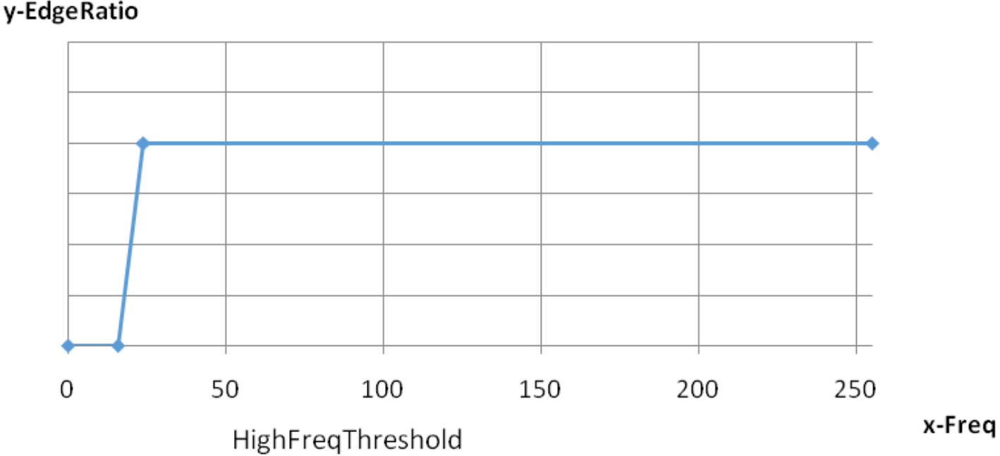


#### CCM Manual Parameters

| Parameter Name | Description | Recommended Tuning | Special Notes |
|---|---|---|---|
| m_bManualMode | Manual mode enable   `0`: Automatic mode;   `1`: Enable manual mode; in this case, the color correction matrix parameters do not change with color temperature, manual parameters are used; for debugging |  - | Debug parameter |
| m_pCMCManual | Manual mode parameters, same function as automatic |  - | Debug parameter |


#### CCM Other Parameters

| Parameter Name | Description | Recommended Tuning | Special Notes |
|---|---|---|---|
| m_bDisgardHFEnable | Discard high-frequency information enable:  `0`: Add high-frequency information;    `1`: Discard high-frequency information | User-defined |   |
| m_pCMCSaturationList | Saturation control |   | Can vary with Gain |


### CBPCFirmwareFilter Tuning Description

CBPCFirmwareFilter (BPC) module is used for bad pixel correction.

#### BPC Enable

| Parameter Name | Description | Recommended Tuning | Special Notes |
|---|---|---|---|
| m_bEnable | BPC enable   `0`: Disable bad pixel correction;   `1`: Enable bad pixel correction | User-defined |  |


#### BPC Dynamic Control Parameters

BPC strength can be dynamically adjusted according to gain and brightness.

| Parameter Name | Description | Recommended Tuning | Special Notes |
|---|---|---|---|
| m_pBpcGainIndex | Gain index, it is recommended to keep the default value | No | Gain control node |
| m_pSegG | Brightness index, the interval between adjacent levels must be a power of 2, it is recommended to keep the default value | No | Lum control node |

- The gain control parameter is m_pBpcGainIndex, with twelve groups from 0 to 11; 16 corresponds to 1x gain. When the gain is between two nodes, the parameter is the interpolation result of the two node parameters.

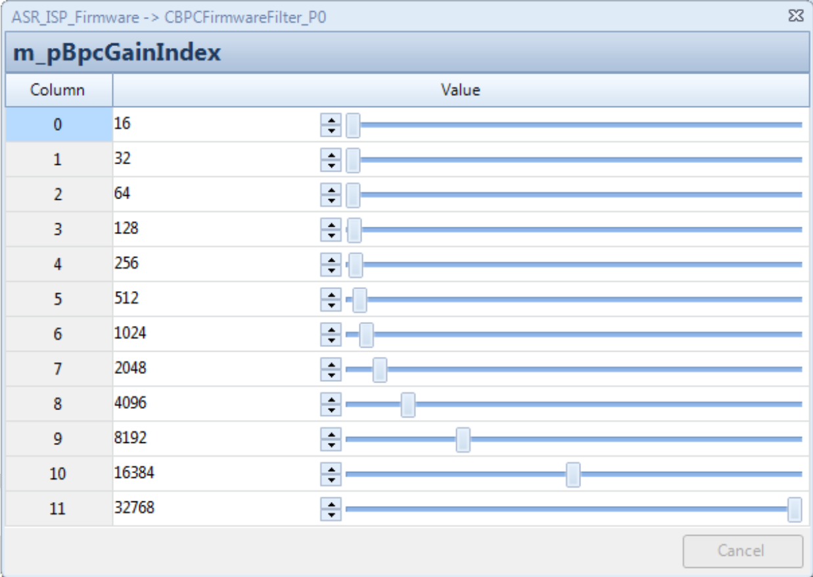

- The brightness control parameter is m_pSegG, with nine groups from 0 to 8, where the 8th group is fixed at 255 and cannot be changed, corresponding to VRF data pixel value (mapped to 8 bits). When brightness is between two nodes, the parameter is the interpolation result of the two node parameters. The interval between adjacent levels must be a power of 2, it is recommended to keep the default value.

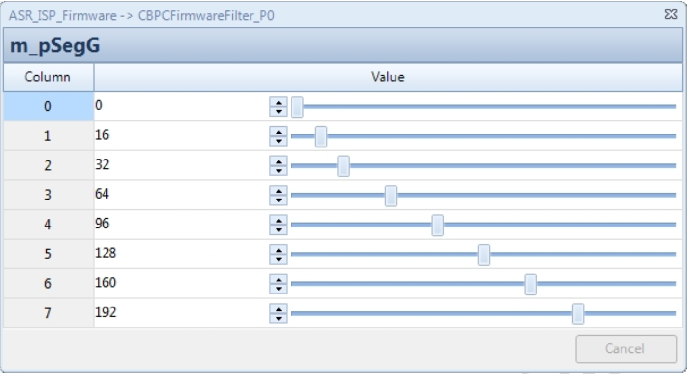

- The strength control parameter can be dynamically adjusted with changes in gain and brightness.

| Parameter Name | Description | Recommended Tuning | Special Notes |
|---|---|---|---|
| m_pCrossChnStrength | Cross-channel strength; the larger the value, the more other channel information is referenced, but it is also more susceptible to bad pixels from other channels | Yes | Can vary with Gain |
| m_pSlopeG | G channel control curve parameter; the larger the value, the greater the tolerance and the weaker the bad pixel correction ability | Yes | Can vary with Gain and Lum |
| m_pInterceptG | G channel control curve parameter; the larger the value, the greater the tolerance and the weaker the bad pixel correction ability | Yes | Can vary with Gain and Lum |
| m_pSlopeRB | RB channel control curve parameter; the larger the value, the greater the tolerance and the weaker the bad pixel correction ability | Yes | Can vary with Gain and Lum |
| m_pInterceptRB | RB channel control curve parameter; the larger the value, the greater the tolerance and the weaker the bad pixel correction ability | Yes | Can vary with Gain and Lum |

Taking m_pSlopeG as an example:

- Column represents the Gain level, corresponding one-to-one with m_pBpcGainIndex.

- Row represents the Lum level, corresponding one-to-one with m_pSegG.

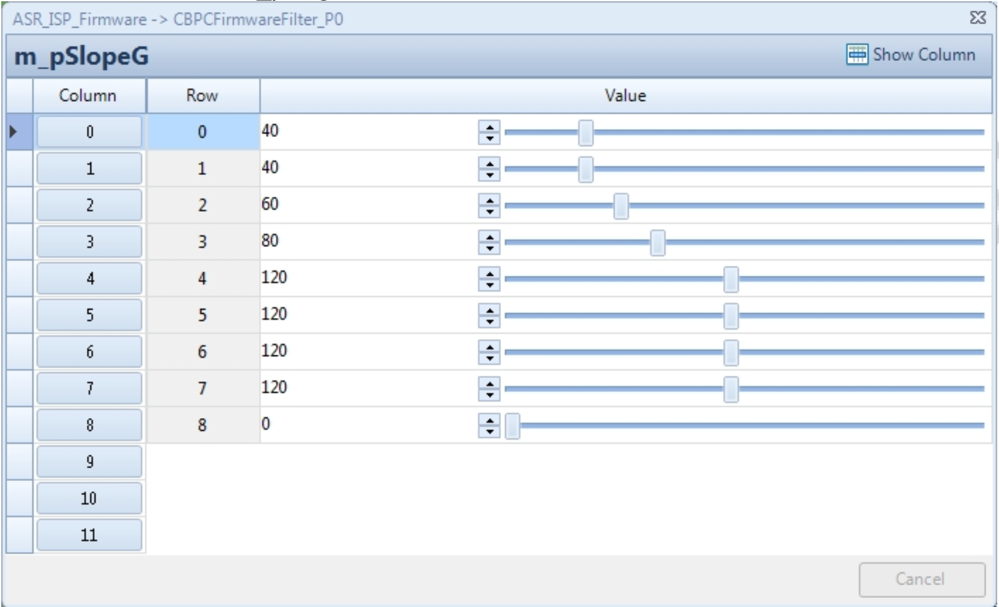

- Parameter interpolation with Lum change explanation

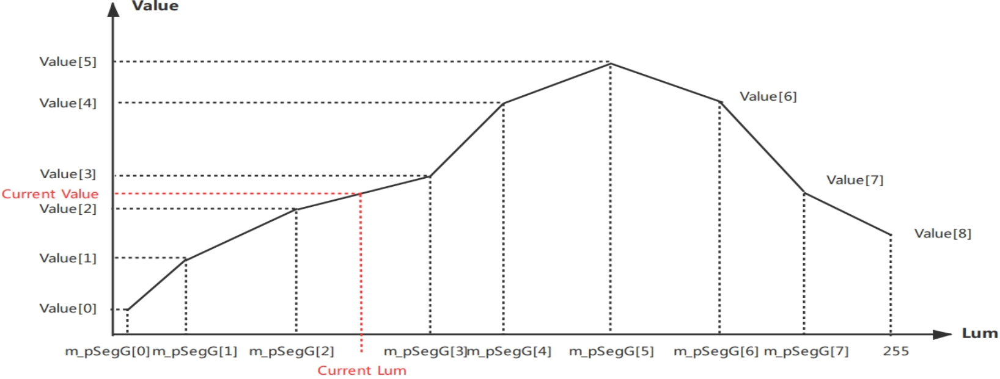

**Notes:**
- The above values changing with Lum include Slope and Intercept
- Final tolerance is jointly determined by Slope, Intercept, and Ratio. Tolerance = (Lum\*Current_Slope + Current_Intercept)\* Ratio. The greater the tolerance, the weaker the bad pixel correction

**Explanation:** Current_Slope and Current_Intercept are interpolated based on Lum and gain changes. Explanation: Ratio is divided into Dead/SpikeRatio and RB/G, totaling 4 cases.


#### BPC Functional Modules and Parameters

| Parameter Name | Description | Recommended Tuning | Special Notes |
|---|---|---|---|
| m_nMinThrEn | Dark pixel detection channel selection   Bit `0`: Enable reference to cross-channel information;  Bit `1`: Enable reference to GrGb channel information;  Bit `2`: Enable reference to the same channel information. | No |   |
| m_nMaxThrEn | Bright pixel detection channel selection   Bit `0`: Enable reference to cross-channel information;  Bit `1`: Enable reference to GrGb channel information;  Bit `2`: Enable reference to the same channel information. | No |   |
| m_nNearThr | Lower brightness threshold for using cross-channel information; cross-channel information is used only when brightness is above this threshold. | No |   |
| m_bDeadEnable | Dark pixel correction enable | User-defined |   |
| m_nDeadRatioG | G channel dark pixel coefficient; the larger the value, the greater the tolerance for G channel dark pixels and the weaker the bad pixel correction ability | Yes |   |
| m_nDeadRatioRB | RB channel dark pixel coefficient; the larger the value, the greater the tolerance for RB channel dark pixels and the weaker the bad pixel correction ability | Number |   |
| m_bSpikeEnable | Bright pixel correction enable | User-defined |   |
| m_nSpikeRatioG | G channel bright pixel coefficient; the larger the value, the greater the tolerance for G channel bright pixels and the weaker the bad pixel correction ability | Yes |   |
| m_nSpikeRatioRB | RB channel bright pixel coefficient; the larger the value, the greater the tolerance for RB channel bright pixels and the weaker the bad pixel correction ability | Yes |   |
| m_bSameChnNum | Same channel pre-correction enable; `1`: enable same channel pre-correction, which can exclude interference from bad pixels in the same channel | User-defined |   |
| m_nDeltaThr | Same channel pre-correction threshold; it is recommended to keep the default value | No |   |
| m_nRingGRatio | Same channel pre-correction threshold; it is recommended to keep the default value | No |   |
| m_nRingMeanRatio | Same channel pre-correction threshold; it is recommended to keep the default value | No |   |
| m_bCornerDetEn | Corner detection enable; can protect corners | User-defined |   |
| m_pSlopeCorner | Corner control curve parameter; the larger the value, the fewer corners are protected; unrelated to tolerance | Yes | Can vary with Gain and Lum |
| m_pInterceptCorner | Corner control curve parameter; the larger the value, the fewer corners are protected; unrelated to tolerance | Yes | Can vary with Gain and Lum |
| m_bEdgeDetEn | Edge detection enable; can protect edges | User-defined |   |
| m_nEdgeTimes | Edge determination threshold; the smaller the value, the more edges are protected | Yes |   |
| m_bGrGbNum | GrGb channel pre-correction enable; `1`: enable GrGb channel pre-correction, which can exclude interference from bad pixels in GrGb channel | User-defined |   |
| m_bAroundDetEn | Bright block detection enable; can protect pixels with sudden brightness changes | User-defined |   |
| m_bBlockDetEn | 2x2 bad block detection enable; can exclude interference from 2x2 bad blocks | User-defined |   |

---

#### BPC Manual Parameters

| Parameter Name | Description | Recommended Tuning | Special Notes |
|---|---|---|---|
| m_bManualMode | Manual mode enable   `1`: Enable manual mode; in this case, BPC parameters do not change with gain and manual parameters that are used; for debugging |  - | Debug parameter |
| m_nCrossChnStrengthManual | Manual mode parameter, functionally consistent with automatic mode |  - | Debug parameter |
| m_pSlopeGManual | Manual mode parameter, functionally consistent with automatic mode |  - | Debug parameter |
| m_pInterceptGManual | Manual mode parameter, functionally consistent with automatic mode |  - | Debug parameter |
| m_pSlopeRBManual | Manual mode parameter, functionally consistent with automatic mode |  - | Debug parameter |
| m_pInterceptRBManual | Manual mode parameter, functionally consistent with automatic mode |  - | Debug parameter |
| m_pSlopeCornerManual | Manual mode parameter, functionally consistent with automatic mode |  - | Debug parameter |
| m_pInterceptCornerManual | Manual mode parameter, functionally consistent with automatic mode |  - | Debug parameter |


### CLSCFirmwareFilter Parameter Description

CLSCFirmwareFilter module is used for lens shading correction.

#### LSC Enable

| Parameter Name | Description | Recommended Tuning | Special Notes |
|---|---|---|---|
| m_bEnable | LSC enable   `0`: Disable lens shading correction;   `1`: Enable lens shading correction | User-defined |   |
| m_bUseOTP | LSC OTP enable | User-defined |   |

#### LSC Parameters

| Parameter Name | Description | Recommended Tuning | Special Notes |
|---|---|---|---|
| m_bAutoScale | AutoScale enable:  `0`: Disable automatic scaling parameter calculation;  `1`: Enable automatic scaling parameter calculation | No |   |
| m_bEnhanceEnable | Enhance enable: Enable when the current module’s expected compensation multiple exceeds 4x  `0`: Disable shading enhancement; `1`: Enable shading enhancement | User-defined |   |
| m_nProfileSelectOption | Shading compensation table selection:  `0`: Automatically select based on color temperature;  `1`: Use LSC Profile[0];  `2`: Use LSC Profile[1];  `3`: Use LSC Profile[2] | No |   |
| m_nFOVCropRatioH | Horizontal cropping ratio | Yes | Determined by binning size |
| m_nFOVCropRatioV | Vertical cropping ratio | Yes | Determined by binning size |
| m_pLSCStrength | Shading compensation strength (see Gain-strength illustration)  64 represents 1x;  32 represents 1/2x;  16 represents 1/4x;  Other values follow similarly | Yes | Can be adjusted based on gain |
| m_bUseCorrelatedCT | Interpolation basis option:  `0`: Use AWB’s CT  `1`: Use `m_nCorrelationCT` in `WbFirmwareFilter` (CCT matrix needs calibration) | User-defined |   |
| m_pCTIndex | Color temperature segment control for LSC profile (see LSC-color temperature control curve below): Effective when m_nProfileSelectOption is set to 0.  When color temperature is in [0, CTIndex[0]], considered low color temperature range, use compensation table of LSCProfile[0];  When in [CTIndex[0], CTIndex[1]], use interpolation of LSCProfile[0] and LSCProfile[1];  When in [CTIndex[1], CTIndex[2]], considered medium color temperature range, use compensation table of LSCProfile[1];  When in [CTIndex[2], CTIndex[3]], use interpolation of LSCProfile[1] and LSCProfile[2];  When in [CTIndex[3], 8192], considered high color temperature range, use compensation table of LSCProfile[2]; | Yes |   |
| m_pLSCProfile | LSC compensation table, calibrated by LSC plugin | Calibration result parameter | Can be called based on color temperature |

LSC-color temperature control curve below  
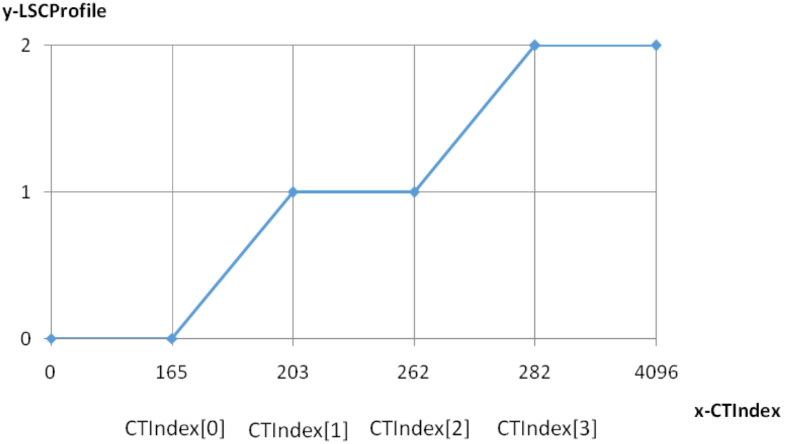

Gain-strength illustration below  
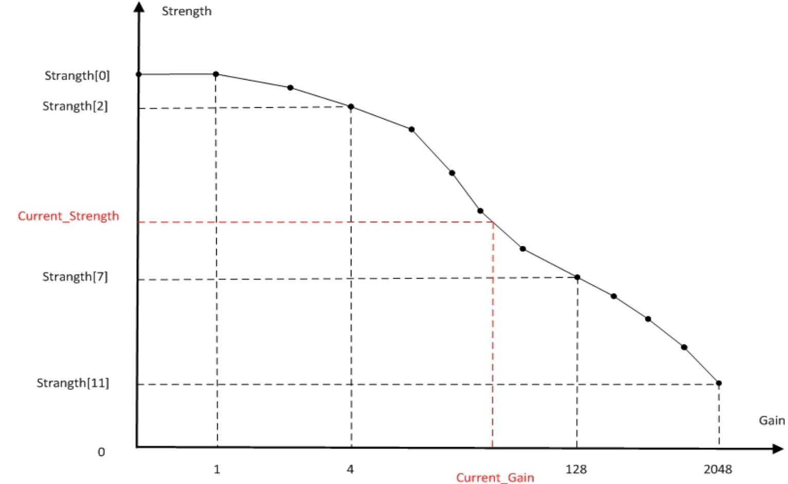


#### Adaptive Color Shading Parameters

| Parameter Name | Description | Recommended Tuning | Special Notes |
|---|---|---|---|
| m_bLSCCSCEnable | Adaptive color shading correction enable (CSC) | User-defined |   |
| m_bAdjustCSCTblMinEnable | Adjust CSC table based on minimum R/G (B/G) values | No |   |
| m_nDifThr | Dif threshold after vector median filtering; if dif is greater than this value, the block is excluded from CSC calculation | No |   |
| m_nDifThrMinPerc | Dif threshold after vector median filtering; if dif is less than DifThrMinPerc*DifThr, angle is not considered in CSC calculation | No |   |
| m_nAngleThr | Angle threshold after vector median filtering; if angle is greater than this value, the block is excluded from CSC calculation | No |   |
| m_nDifThrVMF | Dif threshold before and after vector median filtering; if dif is greater than this value, the block is excluded from CSC calculation | No |   |
| m_nAngleThrVMF | Angle threshold before and after vector median filtering; if angle is greater than this value, the block is excluded from CSC calculation | No |   |
| m_nGradThrMin | Minimum effective gradient after vector median filtering | No |   |
| m_nGradThrMax | Maximum effective gradient after vector median filtering | No |   |
| m_nGradMaxError | Maximum tolerance for error between CSC estimated gradient and real gradient statistics | Yes |   |
| m_nGradThrConv | Threshold for gradient difference between two CSC calculations; if difference is less than this value, CSC is not updated | Yes |   |
| m_nGradMax | Maximum CSC compensation strength | Yes |   |
| m_nTblAlpha | Convergence speed; the larger the value, the faster the convergence | Yes |   |
| m_nCSCGlobalStrength | CSC global strength | Yes |   |
| m_nEffPNumAll | Effective block threshold for entire image | No |   |
| m_nEffPNumHalf | Effective block threshold for half image | No |   |
| m_nEffPNumQuarter | Effective block threshold for quarter image | No |   |
| m_pEffNumRing | Effective block thresholds for three ROIs:  ROI0 is center 6x4  ROI1 is center 12x8 (excluding ROI0)  ROI2 is 12x12 (excluding ROI0, ROI1) | No |   |
| m_pCSCCTIndex | CSC color temperature control points; CSC invalid when CT &gt; CSCCTIndex[1] | Yes |   |
| m_pCSCLuxIndex | CSC brightness control points; CSC invalid when Lux &gt; CSCLuxIndex[1] | Yes |   |


#### LSC Manual and frameinfo

| Parameter Name | Description | Recommended Tuning | Special Notes |
|---|---|---|---|
| m_bManualMode | Manual mode enable:  `1`: Enable manual mode; in this case LSC parameters do not change with color temperature and manual parameters are used; for debugging |   | Debug parameter |
| m_nLSCStrengthManual | Manual mode parameter, functionally consistent with automatic mode |   | Debug parameter |
| m_pLSCProfileManual | Manual mode parameter, functionally consistent with automatic mode |   | Debug parameter |
| m_nRGPolyCoefRO | Current CSC compensation R ratio |   | Read only |
| m_nBGPolyCoefRO | Current CSC compensation B ratio |   | Read only |
| m_pRGRatio | R/G ratio corresponding to 16x12 statistical blocks |   | Read only |
| m_pBGRatio | B/G ratio corresponding to 16x12 statistical blocks |   | Read only |
| m_pOTPProfileInternal | OTP shading table |   | Read only |


### CDemosaicFirmwareFilter Parameter Description

CDemosaicFirmwareFilter (Demosaic) module is used for Bayer interpolation.

#### Demosaic Subfunction Enable

| Parameter Name | Description | Recommended Tuning | Special Notes |
|---|---|---|---|
| m_bIfEdgeGenerate | High-frequency information generation enable: can be used for inline sharpen (inline sharpen function requires cooperation with cmc module)   `0`: Disable;   `1`: Enable | User-defined |   |
| m_bIfGbGrRebalance | GbGr difference elimination enable   `0`: Disable;   `1`: Enable | No |   |
| m_bIfDNS | Inline denoise enable, recommended to disable   `0`: Disable;   `1`: Enable | No |   |


#### Demosaic Dynamic Control Parameters

Demosaic parameters can be dynamically adjusted with gain.

Gain control nodes N range from 0 to 11, twelve groups in total. The gain at node N is 2^N times, i.e., node 0 corresponds to 1x gain; node 11 corresponds to 2048x gain.

| Parameter Name | Description | Recommended Tuning | Special Notes |
|---|---|---|---|
| m_nInterpOffset | Noise tolerance in four directions | No | Can change with Gain |
| m_nInterpOffsetHV | Noise tolerance in horizontal and vertical directions | No | Can change with Gain |
| m_nNoiseSTD | Noise tolerance standard deviation | No | Can change with Gain |
| m_nLowpassGLevel | Interpolation frequency control parameter; smaller values favor 4-direction interpolation results, larger values favor directionless low-pass interpolation results | Yes | Can change with Gain |
| m_nGbGrThr | Threshold corresponding to GbGr difference elimination function; smaller values weaken the function, larger values strengthen it | Yes | Can change with Gain |
| m_nSharpenStrength | High-frequency information amplification factor; larger values mean stronger sharpening | Yes | Can change with Gain |
| m_nShpThreshold | Threshold for soft threshold processing of high-frequency information; recommended to keep default value | No | Can change with Gain |
| m_nDenoiseThreshold | Soft threshold for inline denoise function; larger values mean stronger denoise; recommended to keep default value | No | Can change with Gain |
| m_nNoiseAddbackLevel | Noise feedback strength for inline denoise; larger values weaken denoise; recommended to keep default value | No | Can change with Gain |
| m_pDenoiseLumaStrength | Luma-based scaling coefficient for denoise strength; luma levels in 8-bit [8,16,32]; for luma above 64, coefficient is 32, no scaling | No | Can change with Gain |
| m_nChromaNoiseThreshold | Threshold for chroma noise removal; larger values mean stronger removal; recommended to keep default value | No | Can change with Gain |
| m_pUSMFilter | USMFilter = conv([1 2 1], [usm2 usm1 usm0 64-2*(usm0+usm1+usm2) usm0 usm1 usm2]); recommended to keep default value | No | Can change with Gain |


Taking **m_nSharpenStrength** as an example:

Column represents the gain level

- Column[0] corresponds to the value at 1x gain  
- Column[11] corresponds to the value at 2048x gain

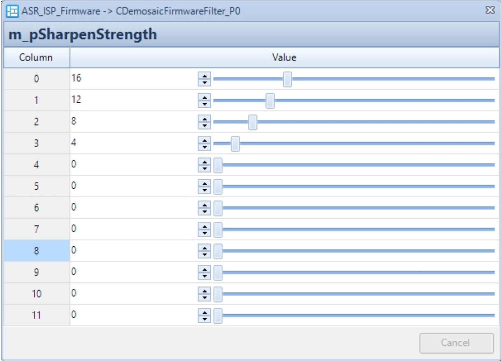

Gain – Sharpen illustrative chart as below  


#### Demosaic Other Parameters

| Parameter Name | Description | Recommended Tuning | Special Notes |
|---|---|---|---|
| m_pHFFragShiftIndex | Segment information for high-frequency segmented gain processing; recommended to keep default value | No |   |
| m_pHFFragGainIndex | Gain information for high-frequency segmented gain processing; recommended to keep default value | No |   |

#### Demosaic Manual Parameters

| Parameter Name | Description | Recommended Tuning | Special Notes |
|---|---|---|---|
| m_bManualMode | Manual mode enable   `0`: Automatic mode;   `1`: Manual mode; in this case demosaic parameters do not change with gain, manual parameters are used; for debug |  - | Debug parameter |
| Parameters ending with Manual | Manual mode parameters, functionally consistent with automatic mode |  - | Debug parameter |

### CRawDenoiseFirmwareFilter Parameter Description

CRawDenoiseFirmwareFilter (RawDenoise) module is used for RAW domain denoise.

#### RawDenoise Enable

| Parameter Name | Description | Recommended Change | Special Notes |
|---|---|---|---|
| m_bEnable | RAW denoise module enable switch   `0`: Disable RAW domain denoise;   `1`: Enable RAW domain denoise | Based on user settings |   |

#### RawDenoise Dynamic Control Parameters

RawDenoise parameters can be dynamically adjusted with gain.

Gain control nodes N range from 0 to 11, twelve groups in total. The gain at node N is 2^N times, i.e., node 0 corresponds to 1x gain; node 11 corresponds to 2048x gain. (See Gain-Denoise_strength illustrative chart)

| Parameter Name | Description | Recommended Change | Special Notes |
|---|---|---|---|
| m_pMaxSpacialDenoiseThreGain | Maximum corner denoise strength, Q8 precision; the larger the value, the stronger the denoise strength achievable at corners | Yes | Can change with Gain |
| m_pSigma | Denoise strength threshold; the larger the value, the stronger the denoise strength | Yes | Can change with Gain |
| m_pGns | G channel denoise strength; the larger the value, the stronger the denoise strength | Yes | Can change with Gain |
| m_pRbns | RB channel denoise strength; the larger the value, the stronger the denoise strength | Yes | Can change with Gain |
| m_pL0 | Denoise strength scaling coefficient at 1.5% brightness, Q5 precision; the larger the value, the stronger the denoise strength at this brightness | Yes | Can change with Gain |
| m_pL1 | Denoise strength scaling coefficient at 7.8% brightness, Q5 precision; the larger the value, the stronger the denoise strength at this brightness | Yes | Can change with Gain |
| m_pL2 | Denoise strength scaling coefficient at 20% brightness, Q5 precision; the larger the value, the stronger the denoise strength at this brightness | Yes | Can change with Gain |
| m_pL3 | Denoise strength scaling coefficient at 45% brightness, Q5 precision; the larger the value, the stronger the denoise strength at this brightness | Yes | Can change with Gain |

m_pL0 - m_pL3 correspond to denoise strength at different brightness levels, as shown in the figure below:

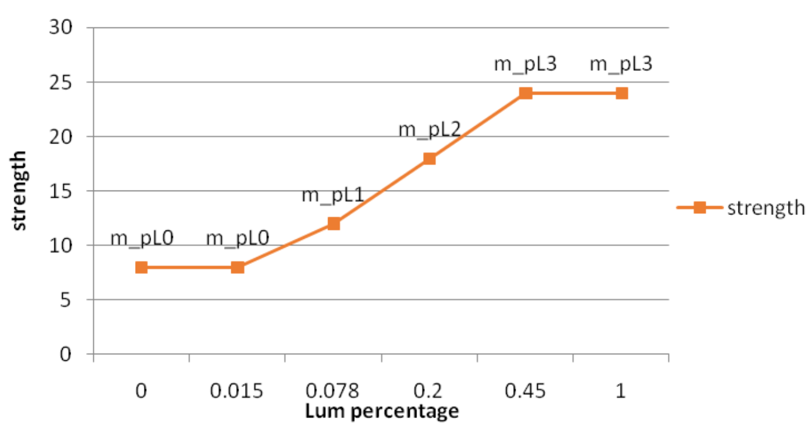


Taking **m_pSigma** as an example:

Column represents the Gain level:

- Column[0] corresponds to the parameter at 1x gain;
- Column[11] corresponds to the parameter at 2048x gain;

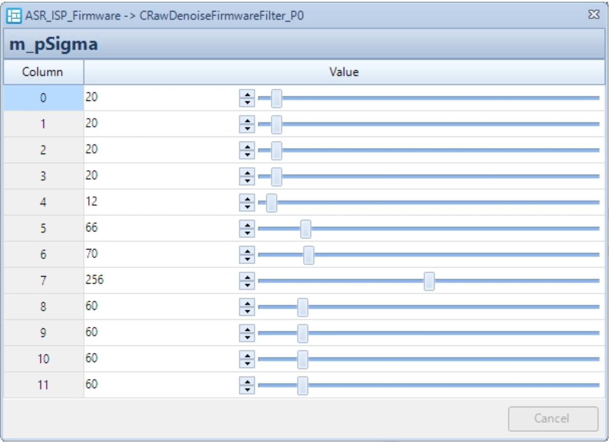

Gain - Denoise_strength illustrative chart is shown below

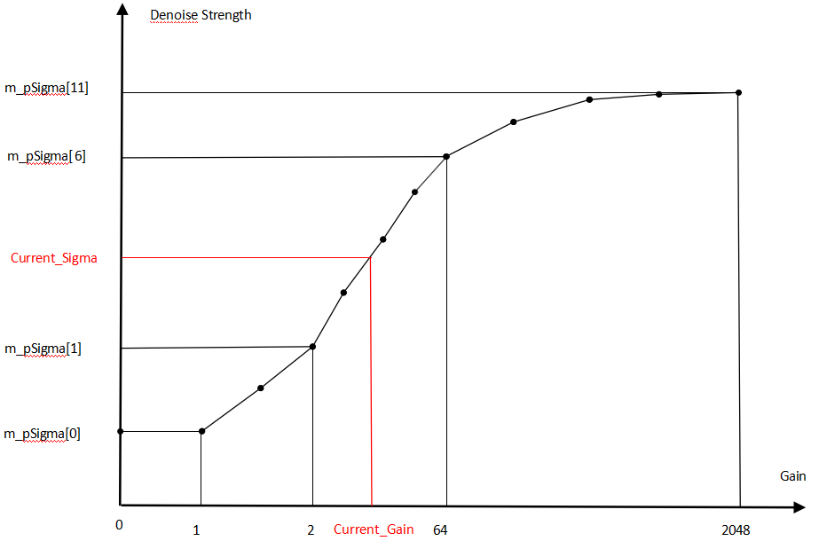

#### RawDenoise Functional Modules and Parameters

| Parameter Name | Description | Recommended Change | Special Notes |
|---|---|---|---|
| m_bMergeEnable | 2x2-&gt;1x1 conversion method when calculating denoise weight   `0`: Take lower-left corner   `1`: Take average of 2x2 | No |   |
| m_bLocalizedEnable | Enable denoise strength variation with local brightness   `1`: Disable   2: Enable | No |   |
| m_bSpacialEnable | Enable edge denoise strength enhancement:   `0`: Disable   `1`: Enable | Based on user settings |   |
| m_bSpacialAddbackEnable | Enable edge denoise add-back:   `0`: Disable   `1`: Enable | Based on user settings |   |
| m_nSpacialOffCenterPercentage | Edge denoise enhancement area control parameter; denoise strength enhancement starts from Centerpercentage*R (see R – CenterPercent illustrative chart below) | Yes |   |
| m_pMaxSpacialDenoiseThreGain | Maximum edge denoise enhancement threshold, the maximum denoise strength achievable at the farthest distance (see Distance – RadialGain illustrative chart below) | Yes |   |

R - CenterPercent illustrative chart below

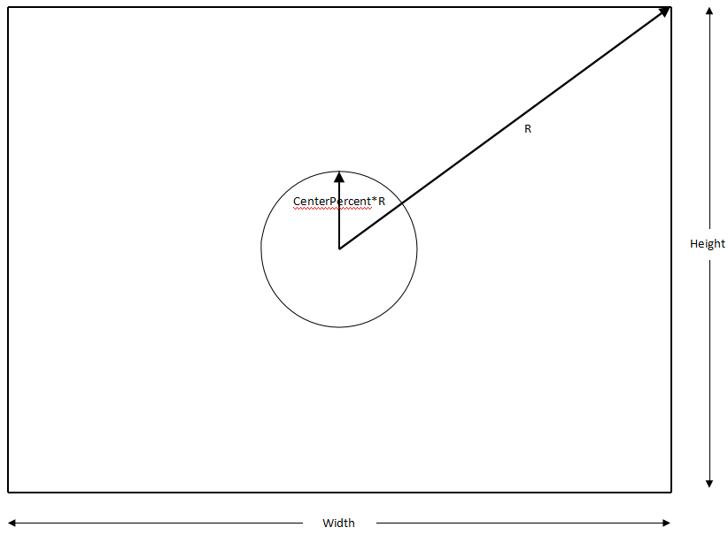

Distance - RadialGain illustrative chart below

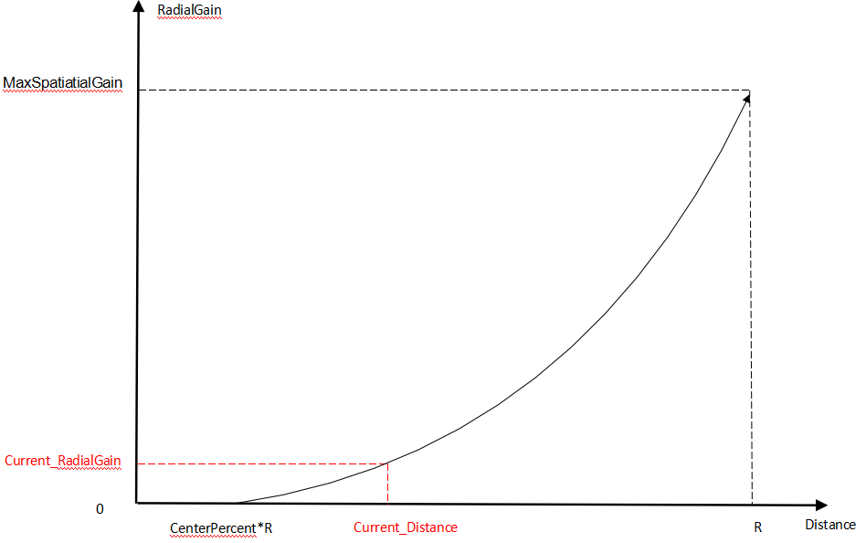


#### RawDenoise debug Parameters

| Parameter Name | Description | Recommended Change | Special Notes |
|---|---|---|---|
| m_bManualMode | Manual mode enable   `0`: Auto mode;   `1`: Enable manual mode; raw denoise parameters do not change with gain and manual parameters that are used for debug |   |   |
| m_nSigmaManual | Manual mode parameter, same function as auto mode |   |   |
| m_nGnsManual | Manual mode parameter, same function as auto mode |   |   |
| m_nRbnsManual | Manual mode parameter, same function as auto mode |   |   |
| m_nL0Manual | Manual mode parameter, same function as auto mode |   |   |
| m_nL1Manual | Manual mode parameter, same function as auto mode |   |   |
| m_nL2Manual | Manual mode parameter, same function as auto mode |   |   |
| m_nL3Manual | Manual mode parameter, same function as auto mode |   |   |

### CAFMFirmwareFilter Parameter Description

CAFMFirmwareFilter module is used for the Auto Focus Measurement (AFM) statistics module.

#### AFM Enable

| Parameter Name | Description | Recommended Tuning | Special Notes |
|---|---|---|---|
| m_bEnable | AFM enable   `0`: Disable auto focus statistics module;    `1`: Enable auto focus statistics module | User setting |  |

#### AFM Parameters

| Parameter Name | Description | Recommended Tuning | Special Notes |
|---|---|---|---|
| m_nAFStatMode | AF statistics module mode:   `0`: After white balance;    `1`: Without white balance | No |   |
| m_nWinStartXPermil | AFM horizontal start coordinate in permillage | User setting |   |
| m_nWinStartYPermil | AFM vertical start coordinate in permillage | User setting |   |
| m_nWinEndXPermil | AFM horizontal end coordinate in permillage | User setting |   |
| m_nWinEndYPermil | AFM vertical end coordinate in permillage | User setting |   |
| m_nMinWidthPermil | AFM minimum width in permillage | User setting |   |
| m_nMinHeightPermil | AFM minimum height in permillage | User setting |   |
| m_bConfigDone | FW control parameter, set to 1 when AF window configuration is done | No |   |
| m_pFVList | Focus values of each AF window |  - | Read-only |
| m_nFVAvg | Average focus value |  - | Read-only |
| m_nWinStartX | AFM horizontal start coordinate |  - | Read-only |
| m_nWinStartY | AFM vertical start coordinate |  - | Read-only |
| m_nWinWidth | AFM width |  - | Read-only |
| m_nWinHeight | AFM height |  - | Read-only |


### CPDCFirmwareFilter Parameter Description

CPDCFirmwareFilter module is used to compensate PD pixels or shadow pixels to normal brightness for PDAF algorithm usage.

#### PDC Enable

| Parameter Name | Description | Recommended Tuning | Special Notes |
|---|---|---|---|
| m_bEnable | PDC enable:   `0`: Disable PDC module;   `1`: Enable PDC module | User setting |  |


#### PDC Parameters

| Parameter Name | Description | Recommended Tuning | Special Notes |
|---|---|---|---|
| m_bOut | PD dump enable   `0`: Disable dumping all PD points inside the window;   `1`: Enable dumping all PD points inside the window | No |  |
| m_nHOffset | Horizontal offset of ISP processed image relative to sensor output image width (see window diagram below for m_nHOft) | Yes |  |
| m_nVOffset | Vertical offset of ISP processed image relative to sensor output image height (see window diagram below for m_nVOft) | Yes |  |
| m_bLRAdjust | Direction control:   `0`: Disable mirror;   `1`: Enable mirror | Yes |  |
| m_bTBAdjust | Direction control:   `0`: Disable flip;   `1`: Enable flip | Yes |  |
| m_nFullWidth | Sensor output image width | Yes |  |
| m_nFullHeight | Sensor output image height | Yes |  |
| m_nWindowMode | Window mode:   `0`: Auto-calculate PD dump region;   `1`: Calculate PD dump region via m_nWinStartXPermil, m_nWinStartYPermil, m_nWinEndXPermil, and EndYPermil | No |  |
| m_nWindowScaleFactor | Scale factor of PDC statistics window relative to AFM statistics window | User setting |  |
| m_nMinWidthPermil | Minimum width of PDC statistics window (permille) | User setting |  |
| m_nMinHeightPermil | Minimum height of PDC statistics window (permille) | User setting |  |
| m_pPDFirstX | Horizontal offset of PD region relative to sensor output image width (see window diagram below) | Yes |  |
| m_pPDFirstY | Vertical offset of PD region relative to sensor output image height (see window diagram below) | Yes |  |
| m_pRatioA | Global adjustment ratio for four channels | Yes |  |
| m_pPixelMask | Distribution of PD points within a 32x32 area | Yes |  |
| m_pPixelTypeMask | Distribution of PD point types within a 32x32 area; PD types divided into shadow up, down, left, right | Yes |  |
| m_pRatioBMap | Compensation coefficients for four-channel PD points | Yes |  |
| m_bSoftCompEnable | Software compensation switch for PD brightness difference:   `0`: Use hardware PDC compensation;   `1`: Software compensation (sensor extracts PD pixels) |  |  |
| m_nWinStartXPermil | Horizontal coordinate (permille) of PD dump region top-left corner |  - | Read-only |
| m_nWinStartYPermil | Vertical coordinate (permille) of PD dump region top-left corner |  - | Read-only |
| m_nWinEndXPermil | Horizontal coordinate (permille) of PD dump region bottom-right corner |  - | Read-only |
| m_nWinEndYPermil | Vertical coordinate (permille) of PD dump region bottom-right corner |  - | Read-only |
| m_nWinStartX | Horizontal start coordinate of PDC statistics window |  - | Read-only |
| m_nWinStartY | Vertical start coordinate of PDC statistics window |  - | Read-only |
| m_nWinWidth | Width of PDC statistics window |  - | Read-only |
| m_nWinHeight | Height of PDC statistics window |  - | Read-only |

Window diagram shown below:  
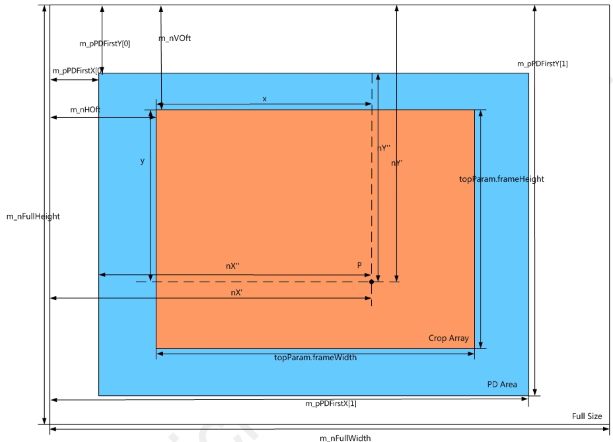


### CPDFFirmwareFilter Parameter Description

The CPDFFirmwareFilter module is used to correct PD pixels to normal pixel values.

#### PDF Enable

| Parameter Name | Description                                                  | Recommended Tuning | Special Notes |
|----------------|--------------------------------------------------------------|--------------------|---------------|
| m_bEnable      | PDF enable   `0`: Disable phase detection pixel correction;   `1`: Enable phase detection pixel correction | User setting  |            |


#### PDF Parameters

| Parameter Name | Description                                                                                  | Recommended Tuning | Special Notes |
| -------------- | -------------------------------------------------------------------------------------------- | ------------------ | ------------- |
| m_nExtPRm      | PD pixel outlier correction enable   `0`: Disable PD pixel outlier correction;   `1`: Enable PD pixel outlier correction | User setting  |    |
| m_nWA          | Center block weight; 8 corresponds to 50% weight. Usually, the center point is a compensated PD point, so weight is generally set smaller. | No |    |
| m_nWB          | Diagonal block weight; 8 corresponds to 50% weight, usually set to 50%.                      | No                 |               |
| m_nFullWidth   | Sensor output image width                                                                    | Yes                |               |
| m_nFullHeight  | Sensor output image height                                                                   | Yes                |               |
| m_nHOffset     | Horizontal offset of ISP processed image relative to sensor output image width (see window diagram m_nHOft)       | Yes           |             |
| m_nVOffset     | Vertical offset of ISP processed image relative to sensor output image height (see window diagram m_nVOft)        | Yes           |             |
| m_bLRAdjust    | Direction control:   `0`: Disable horizontal mirror   `1`: Enable horizontal mirror;  | Yes                |               |
| m_bTBAdjust    | Direction control:   `0`: Disable vertical flip;   `1`: Enable vertical flip          | Yes                |               |
| m_bRefRB       | - `0`: Green channel correction does not reference RB channel;   `1`: Green channel correction references RB channel             | No          |    |
| m_bRefCnr      | - `0`: Green channel correction does not reference corner info;   `1`: Green channel correction references corner info           | No          |    |
| m_nRefNoiseL   | Current noise level used to determine edge direction                                         | No                 |               |
| m_nExtPThre    | Threshold for PD pixel outliers                                                              | No                 |               |
| m_nExtPSft     | Soft threshold for PD pixel outliers                                                         | No                 |               |
| m_nExtPOpt     | Selection of PD pixel outlier correction                                                     | No                 |               |
| m_pPDFirstX    | Horizontal offset of PD region relative to sensor output image width (see window diagram)    | Yes                |               |
| m_pPDFirstY    | Vertical offset of PD region relative to sensor output image height (see window diagram)     | Yes                |               |
| m_pPixelMask   | Distribution of PD points within 32x32 area                                                  | Yes                |               |
| m_pPDResult    | Four-direction PD shift and confidence                                                       |                    | Read-only     |

### CPDAFFirmwareFilter Parameters Description

CPDAFFirmwareFilter module is used for Phase Detection Auto Focus (PDAF).

#### PDAF Lookup Table

| Parameter Name   | Description                                               | Recommended Tuning | Special Notes |
|------------------|-----------------------------------------------------------|-------------------|---------------|
| m_bMirrorShift   | Output phase difference inversion                         | User setting      |               |
| m_bShiftLutEn    | Lookup table enable                                       | User setting      |               |
| m_pShiftLut      | Output phase difference lookup table                      | No                |               |

#### PDAF Error Control

| Parameter Name     | Description                                                                                                     | Recommended Tuning | Special Notes |
|--------------------|-----------------------------------------------------------------------------------------------------------------|-------------------|---------------|
| m_nErrorDistWeight  | Weight of error source (see the correlation fitting curve below)   `0`: shape weight = 1;   `128`: shape and distance weights are equal;   `256`: distance weight = 1; | No   |      |
| m_nErrorDistCoef   | Adjustment coefficient for distance (correlation fitting curve distance)                                        | No                |               |
| m_nErrorShpCoef    | Adjustment coefficient for shape (correlation fitting curve shape)                                             | No                 |               |
  
Correlation fitting curve illustration:

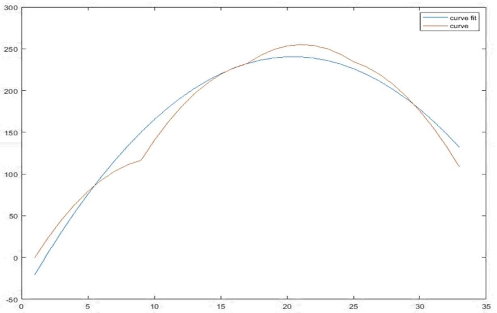


#### PDAF Dynamic Control Parameters

| Parameter Name | Description                                                                                     | Recommended Tuning | Special Notes     |
|----------------|-------------------------------------------------------------------------------------------------|-------------------|--------------------|
| m_pLumThre     | Brightness threshold at different gains (see LumThre-gain control curve below). When current brightness is below the threshold, confidence decreases. | Yes  | Adjust according to gain |
| m_pGainThre    | Basis for dividing different gain intervals, used to control LumThre and SwingThre according to gain | No                |                    |
| m_pSwingThre   | Amplitude threshold at different gains (see SwingThre-gain control curve below). When current amplitude is below this threshold, confidence decreases. | Yes | Adjust according to gain |

LumThre-Gain control curve:

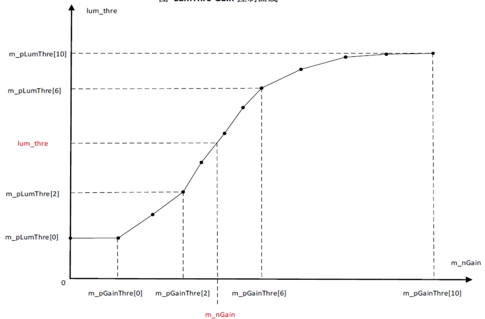

SwingThre-Gain control curve:

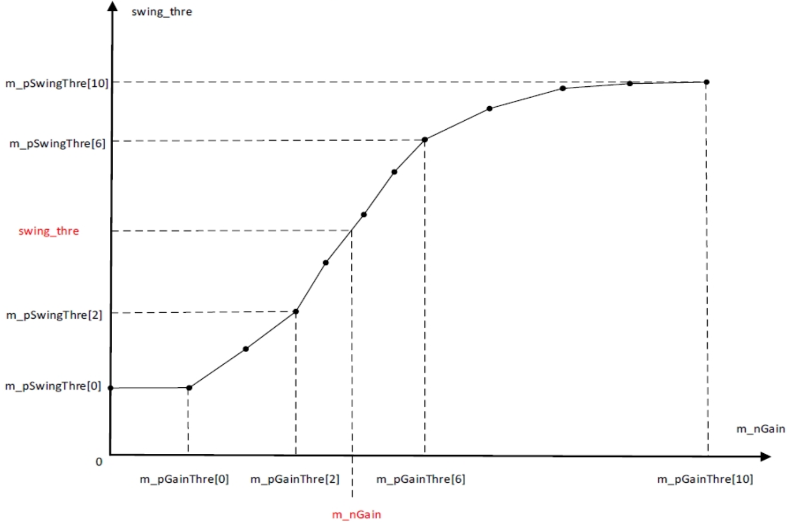

#### PDAF Confidence Control Parameters

| Parameter Name  | Description                                                                                              | Recommended Tuning | Special Notes |
|-----------------|----------------------------------------------------------------------------------------------------------|-------------------|---------------|
| m_bConfAdjust   | Confidence adjustment switch:   `1`: Increase confidence when current amplitude is above this threshold;   `0`: Confidence remains unchanged when current amplitude is above this threshold | No   |      |
| m_nConfOff     | Confidence offset, used to adjust the final confidence value                                              | No                |               |
| m_nConfLimit   | Maximum confidence (see Error-Confidence conversion curve below)                                          | No                |               |
| m_nErrorThre1  | Error threshold for confidence conversion (see Error-Confidence conversion curve below)                   | Yes               |               |
| m_nErrorThre2  | Confidence threshold for error conversion (see Error-Confidence conversion curve below)                   | Yes               |               |
| m_nSearchRange | PD shift search range. The higher the PD pixel density, the larger this value.   Usually 0 for shield pixel density   3 for Dual PD | Yes    |        |

Error-Confidence conversion curve shown below:

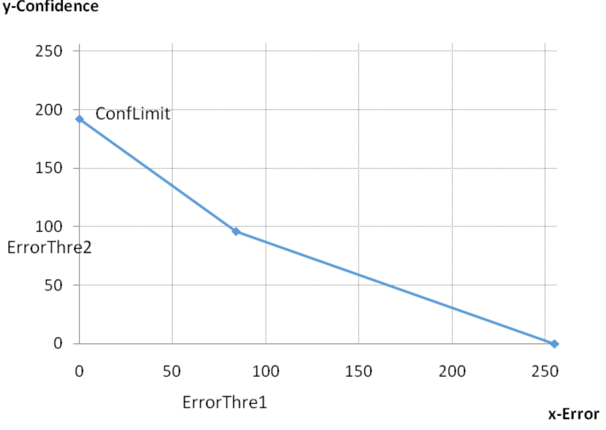

### CWbFirmwareFilter Parameter Description

The CWbFirmwareFilter module is used for white balance.

#### WB Enable

| Parameter Name | Description                                              | Recommended Tuning | Special Notes |
|----------------|----------------------------------------------------------|-------------------|---------------|
| m_bEnable      | WB enable:   `0`: Disable white balance statistics module;   `1`: Enable white balance statistics module | No   |       |

#### WB Parameters

| Parameter Name         | Description                                                                                               | Recommended Tuning | Special Notes |
|------------------------|-----------------------------------------------------------------------------------------------------------|-------------------|---------------|
| m_bSyncWB              | HDR mode white balance synchronization method:   `0`: AWB calculated separately;   `1`: Use long exposure as AWB calculation source | No       |         |
| m_bAutoWindow          | Window adjustment method: `0`: Fixed window size;   `1`: Automatically calculate window size based on zoom factor | No                |      |
| m_nMode                | White balance mode selection:   `0`: auto mode;   `1`: custom;   `2`: D75;   `3`: D65;   `4`: D50; `5`: CWF   `6`: TL84; `7`: A   `8`: H   `9`: lock | No     |        |
| m_nInitMode            | White balance initialization mode:   `0`: custom;   `1`: D75;   `2`: D65;   `3`: D50;   `4`: CWF;   `5`: TL84;   `6`: A;   `7`: H; | Yes      |           |
| m_pManualGain          | Manual WB gain: indices 0-7 correspond to custom / D75 / D65 / D50 / CWF / TL84 / A / H                   | Yes               |              |
| m_nAWBStableRange      | Threshold for AWB stable state: smaller value means harder to judge AWB as stable                         | Yes               |              |
| m_nAWBStableFrameNum   | Number of frames reference for AWB stability: stable frames exceeding this value mean AWB stable          | Yes               |              |
| m_nAWBUnStableRange    | Threshold for AWB unstable state: smaller value means easier to judge AWB as unstable                     | Yes               |              |
| m_nAWBUnStableFrameNum | Number of frames reference for AWB instability: unstable frames exceeding this value mean AWB unstable    | Yes               |              |
| m_nAWBStep1            | AWB relative step length for convergence: larger value means larger adjustment step, faster convergence but less accuracy | Yes              |      |
| m_nAWBStep2            | AWB absolute step length for convergence: larger value means larger step, faster convergence but less accuracy | Yes          |              |
| m_nLowThr              | Lower brightness threshold for AWB statistics: higher value excludes more dark regions from AWB stats    | Yes                |              |
| m_nHighThr             | Upper brightness threshold for AWB statistics: lower value excludes more bright regions from AWB stats   | Yes                |              |
| m_nCorrelationCT       | Current correlated color temperature                                                                     | -                  | Read-only    |
| m_nTint                | Current tint value                                                                                       | -                  | Read-only    |
| m_bAWBStableFlag       | Current AWB status                                                                                       | -                  | Read-only    |
| m_nDistance            | Absolute sum of difference between applied white balance gain and target gain                            | -                  | Read-only    |


### CCTCalculatorFilter Parameter Description

CCTCalculatorFilter module is used to calculate the true color temperature (CCT).

#### CCTCalculator Parameters

| Parameter Name           | Description                          | Recommended Tuning | Special Notes   |
|--------------------------|------------------------------------|-------------------|---------------|
| m_nIterateNumber         | Number of iterations for CT calculation | No           |                    |
| m_nColorTemperatureLow   | Color temperature corresponding to the low color temperature matrix |       |           |
| m_nColorTemperatureHigh  | Color temperature corresponding to the high color temperature matrix |      |           |
| m_pCTMatrixLow           | Low color temperature matrix       |                   | Calibration result |
| m_pCTMatrixHigh          | High color temperature matrix      |                   | Calibration result |


### CRGB2YUVFirmwareFilter Parameter Description

CRGB2YUVFirmwareFilter module is used for RGB to YUV conversion.

#### RGB2YUV Parameters

| Parameter Name       | Description                                                                       | Recommended Tuning | Special Notes   |
|---------------------|------------------------------------------------------------------------------------|-------------------|------------------|
| m_nOutputColorSpace  | Output color space selection:   `0`: Rec.601;   `1`: Rec.709                 | User setting      |                  |
| m_nGlobalSaturation  | Global saturation coefficient, Q7 precision                                       | Yes               |                  |
| m_pSaturationCP      | Saturation control parameters with gain (see example saturation CP-gain curve)    | Yes               | Changes with gain |


#### RGB2YUV Manual Parameters

| Parameter Name      | Description                                                                                           | Recommended Tuning | Special Notes |
|---------------------|-----------------------------------------------------------------------------------------------------|-------------------|---------------|
| m_bManualMode       | Manual mode enable:   `0`: Auto mode, saturation varies with gain;   `1`: Manual mode, saturation fixed to manual value |          | Debug parameter |
| m_nSaturationManual | Manual saturation coefficient, Q7 precision                                                        |                    | Debug parameter |

sat_CP-gain control curve is shown below:  
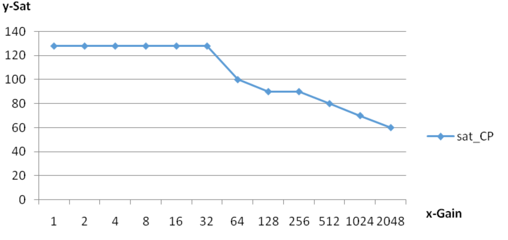


### CSpecialEffectFirmwareFilter Parameter Description

CSpecialEffectFirmwareFilter module is used for special effect tuning.

#### SE Enable

| Parameter Name | Description                                            | Recommended Tuning | Special Notes                  |
|----------------|--------------------------------------------------------|-------------------|---------------------------------|
| m_bEnable      | Special effect enable:   `0`: Disable special effect   `1`: Enable special effect with 6 control regions; regions 0-5 have decreasing priority | User setting    |         |


##### SE Parameters

Parameters are divided into zones 0-5, a total of 6 groups. Each group has the same meaning and corresponds to 6 control zones with decreasing priority from zone 0 to zone 5.

| Parameter Name  | Description                                                                                                 | Recommended Tuning | Special Notes   |
|-----------------|-------------------------------------------------------------------------------------------------------------|-------------------|-----------------|
| m_bZoneEb_0     | Zone 0 special effect enable                                                                                | User setting      |                 |
| m_pRyTable_0    | Brightness rotation parameter, calibration parameter                                                        | Calibration result|                 |
| m_nSyTable_0    | Brightness translation parameter, calibration parameter                                                     | Calibration result|                 |
| m_pRuvTable_0   | UV rotation parameter, calibration parameter                                                                | Calibration result|                 |
| m_pSuvTable_0   | UV translation parameter, calibration parameter                                                             | Calibration result|                 |
| m_pMargin_0     | Transition margin band:   [Lum_min - Margin_0[0], Lum_max + Margin_0[1]] smooth range;   [Hue_min - Margin_0[2], Hue_max + Margin_0[3]] smooth range;   [Sat_min - Margin_0[4], Sat_max + Margin_0[5]] smooth range | Yes  |      |
| m_pYTable_0     | Target adjustment area Lum range                                                                             | Yes               |                 |
| m_pHTable_0     | Target adjustment area Hue range                                                                             | Yes               |                 |
| m_pSTable_0     | Target adjustment area Saturation range                                                                      | Yes               |                 |

#### SE Dynamic Control Parameters

GainWeight_0-5 share one GainLut, used to set different intensities for different brightness ranges.

| Parameter Name   | Description                                                                                           | Recommended Tuning | Special Notes     |
|------------------|---------------------------------------------------------------------------------------------------|-------------------|------------------------|
| m_nGainLut       | GainWeight segment points, corresponding actual scene value = exposure_time(us) * total_gain(Q8) >> 8 |               |                        |
| m_pGainWeight_0  | Intensity of special effect (see GainWeight-GainLut control curve below). Larger values mean stronger special effect | Yes  | Can vary according to GainLut |

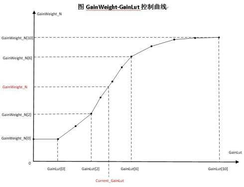

#### SE Manual Parameters

Parameters are divided into zones 0-5, total 6 groups, each with the same meaning.

| Parameter Name        | Description                    | Recommended Tuning | Special Notes |
|-----------------------|--------------------------------|-------------------|----------------|
| m_bManualMode_0       | Zone 0 manual mode enable      | -                 | Debug parameter|
| m_nManualGainWeight_0 | Special effect intensity in manual mode | -        | Debug parameter|

### CCurveFirmwareFilter Parameter Description

CCurveFirmwareFilter module is used for gamma curve.

#### Curve Enable

| Parameter Name | Description                                               | Recommended Tuning | Special Notes |
|----------------|-----------------------------------------------------------|-------------------|----------------|
| m_bEnable      | Curve enable:   `0`: Disable gamma curve;   `1`: Enable gamma curve | User setting        |        |

#### Curve Control Parameters

| Parameter Name | Description | Recommended Tuning | Special Notes |
|----------------|-------------|--------------------|---------------|
| m_bEbGtmAfterLinearcurve | GTM changes with linear curve enable:   `0`: gtm1 curve unchanged;   `1`: gtm1 curve changes with linear curve  | No     |          |
| m_nCurveSelectOption     | Curve usage selection:   `0`: Auto calculate based on gain;   `1`: Use GTMcurve0;   `2`: Use GTMcurve1;   `3`: Use GTMcurve2;   `4`: Use A-Log curve;  | No      |        |
| m_nBacklightStrengthManual | Low-light area brightness adjustment parameter: the larger the value, the more brightness is provided to the low-light area; `0` means no enhancement, and BacklightCurveManual does not affect the final curve   | User  |       |
| m_nContrastStrengthManual  | Contrast adjustment parameter: the larger the value, the higher the contrast; `128` means no contrast adjustment and ContrastsCurveManual does not affect the final curve  | User setting     |            |
| m_nBrightnessStrengthManual| Brightness adjustment parameter: the larger the value, the brighter the overall image; 4096 represents 1x brightness    | User setting      |          |    | m_nAlpha  | Iteration speed of GTM curve fusion between previous and current frames. The larger the m_nAlpha, the faster it converges to the current frame's GTM curve; 255 means immediate convergence to current frame curve   | Yes     |            |
| m_pBacklightCurveManual    | Curve used to adjust low-light area       | No                |                       |
| m_pContrastsCurveManual    | Curve used to adjust contrast             | No                |                       |
| m_pGainIndex               | Gain segment control points (see Curve-Gain control curve illustration below) Color temperature segment control points.   Gain in [128, GainIndex[0]] uses GTMCurve0 curve;   Gain in [GainIndex[0], GainIndex[1]] interpolates between GTMCurve0 and GTMCurve1;   Gain at GainIndex[1] uses GTMCurve1;   Gain in [GainIndex[1], GainIndex[2]] interpolates between GTMCurve1 and GTMCurve2;   Gain in [GainIndex[2], 2048] uses GTMCurve2 curve. | Yes       |           |
| m_pGTMCurve0               | Curve 0     | Yes               | Called based on Gain   |
| m_pGTMCurve1               | Curve 1     | Yes               | Called based on Gain   |
| m_pGTMCurve2               | Curve 2     | Yes               | Called based on Gain   |

Curve-Gain control curve illustration below:  
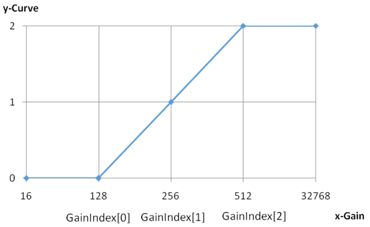

### CLTMFirmwareFilter Parameter Description

CLTMFirmwareFilter module is used for Local Tone Mapping (LTM).

#### LTM Enable

| Parameter Name | Description                                                                                   | Recommended Tuning | Special Notes |
|----------------|-----------------------------------------------------------------------------------------------|-------------------|---------------|
| m_bEnable      | LTM enable:   `0`: Disable local tone mapping;   `1`: Enable local tone mapping;          | User setting      |               |
| m_bHistEnable  | LTM histogram enable:   `0`: Disable LTM histogram;   `1`: Enable LTM histogram          | No                |               |
| m_nOffsetY     | Horizontal image offset, determined by input image size                                       | User setting      |               |
| m_nOffsetX     | Vertical image offset, determined by input image size                                         | User setting      |               |

#### LTM Parameters

| Parameter Name           | Description                                                                                                                              | Recommended Tuning | Special Notes     |
|-------------------------|------------------------------------------------------------------------------------------------------------------------------------------|-------------------|---------------|
| m_nLtmStrength          | LTM strength; the larger the value, the stronger the LTM effect                                                                          | Yes               |               |
| m_nCurveAlpha           | Convergence speed for blending the current frame's curve with the historically saved curve; smaller values converge faster               | Yes               |               |
| m_nSlopeThr             | If Drc *DrcDark &lt; Thr, equivalent to GTM; if Drc* DrcDark >= Thr, each block calculates LTM strength individually                      | No                |               |
| m_nPhicBeta             | LTM curve attenuation control point; smaller values cause earlier curve attenuation, reducing brightening of mid-high luminance blocks (see PhicBeta diagram) | No           |     |
| m_nBlendCurveFP         | First control point for tone mapping curve based on DRCGain and DrcGainDark; BlendCurveFP &lt;= BlendCurveSP. Before FP, tone mapping strength depends on DRCGain * DrcGainDark. Larger BlendCurveFP means a larger brightening range in dark areas. | No   |     |
| m_nBlendCurveSP         | Second control point; after SP, tone mapping strength depends on DRCGain; smooth transition between FP and SP. Smaller BlendCurveSP means smaller brightening range. | No    |     |
| m_nSubDarkPercThrLow    | Sub-dark area brightening adjustment parameter; smaller values mean stronger brightening in sub-dark areas                               | No                |               |
| m_nSubDarkPercThrHigh   | Sub-dark area brightening adjustment parameter; smaller values mean stronger brightening; SubDarkPercThrLow &lt; SubDarkPercThrHigh         | No                |               |
| m_nSubDarkAdjMeanThr    | Sub-dark area brightening adjustment; combined with SubDarkPercThrLow, SubDarkPercThrHigh, controls LTM strength in sub-dark areas based on percentage of sub-dark points in a block. If current block mean > SubDarkAdjMeanThr and sub-dark percentage > SubDarkPercThrLow, LTM strength increases. Maximum at SubDarkPercThrHigh. | No                |               |
| m_nDarkPercThrLow       | Dark area brightening adjustment parameter; smaller values mean stronger LTM in dark areas                                               | No                |               |
| m_nDarkPercThrHigh      | Dark area brightening adjustment parameter; smaller values mean stronger LTM; DarkPercThrLow &lt; DarkPercThrHigh                           | No                |               |
| m_nPhCDarkMaxExtraRatio | Dark area brightening adjustment parameter; combined with DarkPercThrLow and DarkPercThrHigh, controls LTM strength in darkest areas based on point percentage; larger values mean stronger LTM | No    |      |
| m_pDstAlphaGainIndex    | LTM strength gain control nodes                                                                                                          | No                |               |
| m_pDstAlphaIndex        | Controls LTM strength based on DstAlphaGainIndex; larger values mean stronger LTM                                                        | Yes               |               |

PhicBeta diagram below:  
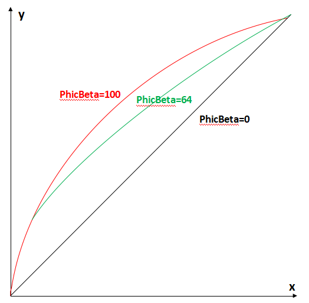

### CUVDenoiseFirmwareFilter Parameter Description

CUVDenoiseFirmwareFilter module is used for removing color noise.

#### UVDenoise Enable

| Parameter Name | Description        | Recommended Tuning | Special Notes         |
|----------------|--------------------|-------------------|------------------------|
| m_bEnable      | UVDenoise enable   | No                | Recommended to use CPP denoise |

---

### CEELiteFirmwareFilter Parameter Description

CEELiteFirmwareFilter module is used for controlling edge enhancement.

#### EE Enable

| Parameter Name | Description        | Recommended Tuning | Special Notes |
|----------------|--------------------|-------------------|---------------|
| m_bEnable      | EE enable          | User setting      |               |


#### CEELite Parameters

| Parameter Name              | Description                                                                                  | Recommended Tuning | Special Notes |
|-----------------------------|----------------------------------------------------------------------------------------------|-------------------|---------------|
| m_pCurveLumaP               | Positive edge luminance-based adaptive enhancement; larger values increase edge strength     | Yes               |               |
| m_pCurveLumaN               | Negative edge luminance-based adaptive enhancement; larger values increase edge strength     | Yes               |               |
| m_pCurveFreqTxP             | Positive edge frequency-based adaptive enhancement; larger values increase texture detail    | Yes               |               |
| m_pCurveFreqTxN             | Negative edge frequency-based adaptive enhancement; larger values increase texture detail    | Yes               |               |
| m_nNodeFreq                 | Frequency adjustment nodes                                                                   |                   |               |
| m_pGlobal_SharpenStrengthP  | Positive edge global sharpening; larger values increase edge strength                        | Yes               |               |
| m_pGlobal_SharpenStrengthN  | Negative edge global sharpening; larger values increase edge strength                        | Yes               |               |
| m_pGlobal_SharpenStrengthPCapture | Capture mode positive edge global sharpening; larger values increase edge strength     | Yes               |               |
| m_pGlobal_SharpenStrengthNCapture | Capture mode negative edge global sharpening; larger values increase edge strength     | Yes               |               |
| m_pLPF1                     | USMFilter filter parameters                                                                  | No                |               |
| m_pLPF2                     | USMFilter filter parameters; calculated as conv([(flt1[0]-flt2[0]), (flt1[1]-flt2[1]), 2*(flt2[0]+flt2[1] - flt1[0]-flt1[1]), (flt1[1]-flt2[1]), (flt1[0]-flt2[0])]) | No |    |
| m_pLPF1Capture              | Capture mode USMFilter filter parameters                                                     | No                |               |
| m_pLPF2Capture              | Capture mode USMFilter filter parameters; same calculation as m_pLPF2                        | No                |               |
| m_pFreqExpLevel1            | Low-frequency range frequency segmentation control; larger values mean denser segmentation   | No                |               |
| m_pFreqExpLevel2            | High-frequency range frequency segmentation control; larger values mean denser segmentation  | No                |               |
| m_pFreqOffsetTx             | Frequency soft threshold; larger values mean stronger noise resistance                       | Yes               |               |
| m_pTxClipP                  | Texture region positive edge sharpening clipping; larger values increase sharpening          | Yes               |               |
| m_pTxClipN                  | Texture region negative edge sharpening clipping; larger values increase sharpening          | Yes               |               |
| m_pTxThrdP                  | Texture region positive edge sharpening threshold; smaller values increase sharpening        | Yes               |               |
| m_pTxThrdN                  | Texture region negative edge sharpening threshold; smaller values increase sharpening        | Yes               |               |
| m_pClipPos                  | Positive edge sharpening clipping; larger values increase sharpening                         | Yes               |               |
| m_pClipNeg                  | Negative edge sharpening clipping; larger values increase sharpening                         | Yes               |               |
| m_pHCStrength               | Edge halo strength control; smaller values mean stronger halo suppression                    | Yes               |               |
| m_pCoffW                    | Halo region determination parameters                                                         | No                |               |
| m_pGainIndex                | Gain control nodes (Q4 format)                                                               | No                |               |

#### EE Manual Parameters

| Parameter Name    | Description               | Recommended Tuning | Special Notes |
|-------------------|---------------------------|-------------------|---------------|
| m_bManualMode     | Manual mode enable        | -                 | Debug parameter |
| Manual suffix parameters | Manual mode parameters, same as automatic mode | - | Debug parameter |

### CBitDepthCompressionFirmwareFilter Description

The CBitDepthCompressionFirmwareFilter module is used for bit depth compression.

#### Dithering Enable

| Parameter Name      | Description                                                                 | Recommended Tuning | Special Notes |
|---------------------|-----------------------------------------------------------------------------|-------------------|---------------|
| m_bEnableDithering   | Dithering enable:   `0`: Disable dithering;   `1`: Enable dithering   | No                |               |

### CFormatterFirmwareFilter Description

The CFormatterFirmwareFilter module is used for output format control.

#### Formatter Parameters

| Parameter Name               | Description                                                                    | Recommended Tuning | Special Notes |
|------------------------------|--------------------------------------------------------------------------------|-------------------|---------------|
| m_nOutputFormat              | Output format:   `0`: NV12;   `1`: P010;   `2`: RGB888                  | No                |               |
| m_nSwingOption               | - `0`: full swing;   `1`: studio swing                                         | No                |               |
| m_bConvertDitheringEnable    | - `0`: rgb2yuv dithering disable;   `1`: rgb2yuv dithering enable              | No                |               |
| m_bCompressDitheringEnable   | - `0`: full swing to studio swing dithering disable;   `1`: full swing to studio swing dithering enable | No |     |

### CEISFirmwareFilter Description

The CEISFirmwareFilter module is used for electronic image stabilization (EIS).

#### EIS Enable

| Parameter Name | Description                                | Recommended Tuning | Special Notes |
|----------------|--------------------------------------------|-------------------|---------------|
| m_bEnable      | EIS enable:   `0`: Disable EIS;   `1`: Enable EIS | User setting    |     |

##### EIS Parameters

| Parameter Name         | Description                                                                                    | Recommended Tuning | Special Notes |
|-----------------------|-------------------------------------------------------------------------------------------------|-------------------|---------------|
| m_bCalcEnable         | Firmware calculation enable   `0`: Disable;   `1`: Enable                                  | User setting      |               |
| m_bFilterEnable       | Motion smoothing filter enable   `0`: Disable motion smoothing filter (usually off when device/scenario motion is minimal) ;  `1`: Enable motion smoothing filter | Yes  |       |
| m_nRangeX             | Detection range of movement in X direction (unit: pixels)                                       | No                |               |
| m_nRangeY             | Detection range of movement in Y direction (unit: pixels)                                       | No                |               |
| m_nMarginX            | Offset X of LDC crop window                                                                     | No                |               |
| m_nMarginY            | Offset Y of LDC crop window                                                                     | No                |               |
| m_pFilterWeight       | Motion smoothing filter weights                                                                 | Yes               |               |
| m_pPeakConfLevel      | Confidence levels                                                                               | Yes               |               |
| m_pPeakErrorThre      | Error tolerance thresholds corresponding to confidence levels                                   | Yes               |               |
| m_bReverseDirectionX  | Horizontal direction reverse control                                                            | Yes               |               |
| m_bReverseDirectionY  | Vertical direction reverse control                                                              | Yes               |               |
| m_nCenterStatRatio    | Center statistics ratio, 256 equals 100%                                                        | Yes               |               |

### CAECFilter Parameters Description

CAECFilter (AEC) module is used for Auto Exposure Control.

#### AE Basic Parameters

| Parameter Name        | Description                                                                                                    | Recommended Tuning | Special Notes |
|----------------------|-----------------------------------------------------------------------------------------------------------------|-------------------|---------------|
| m_bManualAEEnable    | AEC mode selection:   `0`: Auto mode;  `1`: Manual mode, exposure value uses manual parameters;   `2`: Lock mode, exposure value locked, no AEC adjustment;   `3`: Manual exposure index mode, exposure locked to m_pExpIndexManual | User setting    |          |
| m_pMinExpTime        | Minimum exposure time (parameters with “short” annotations are reserved; applies to AE parameters here)         | Yes               |               |
| m_pMaxExpTime        | Maximum exposure time                                                                                           | Yes               |               |
| m_pMinAnaGain        | Minimum analog gain                                                                                             | Yes               |               |
| m_pMaxAnaGain        | Maximum analog gain                                                                                             | Yes               |               |
| m_pMinSnsDGain       | Minimum sensor digital gain                                                                                     | Yes               |               |
| m_pMaxSnsDGain       | Maximum sensor digital gain                                                                                     | Yes               |               |
| m_pMinTotalGain      | Minimum total gain                                                                                              | Yes               |               |
| m_pMaxTotalGain      | Maximum total gain                                                                                              | Yes               |               |
| m_pRouteNode50Hz     | 50Hz exposure table, first column: exposure time, second: total gain, third: precise gain control (reserved)    | Yes               |               |
| m_pRouteNode60Hz     | 60Hz exposure table, first column: exposure time, second: total gain, third: precise gain control (reserved)    | Yes               |               |
| m_pMeteringMatrix    | 16x12 metering weight matrix                                                                                    | User setting      |               |
| m_bLumaCalcMode      | Luma calculation method   `0`: RGB max;   `1`: Y average;                                                   | User setting      |               |
| m_bQuickResponseEnable | AE quick response enable; when enabled, AE adjusts immediately                                                | User setting      |               |

#### AE Target Brightness Control

| Parameter Name          | Description                                                                                                                       | Recommended Tuning | Special Notes      |
|------------------------|------------------------------------------------------------------------------------------------------------------------------------|-------------------|---------------------|
| m_bAdvancedAECEnable   | Target brightness control parameter:   `0`: Use m_pTargetRange[1] as target brightness;   `1`: Dynamically calculate target brightness in range [m_pTargetRange[0], m_pTargetRange[1]] | User setting    |         |
| m_nCompensation        | Target brightness compensation factor, 100 means 1x                                                                              | Yes               |                       |
| m_nSensitivityRatio    | Sensitivity ratio between capture and preview, 256 means 1x                                                                      | User setting      |                       |
| m_pSatRefBin           | Saturation reference bin; Target constrained to histogram pixels ratio in range [m_pSatRefBin[0], 255] falling within [m_pSatRefPerThr[0][0]/10000%, m_pSatRefPerThr[0][1]/10000%] | Yes    |            |
| m_pSatRefPerThr        | Saturation ratio upper and lower limits                                                                                          | Yes               |                       |
| m_pExpIndexThre        | Exposure threshold, corresponds to 4 groups of m_pLumaBlockWeight, used to select which group participates in weight calculation (see Exp_index-luma_weight diagram) | User setting      |             |
| m_pLumaBlockWeight     | Four groups of luminance block weight tables, each group:   Weight[i]`0`: low luminance   Weight[i]`1`: mid luminance   Weight[i][2]: high luminance (see Exp_index-luma_weight and Luma-Weight diagrams) | User setting    |             |
| m_pLumaBlockThre       | Luminance block threshold, controls weight curve of luminance blocks (see Luma-Weight diagram)                                    | User setting     |                       |
| m_pLuma7ZoneWeight     | Weight table for statistics window and 6 sub-ROIs                                                                                 | User setting     |                       |
| m_pTargetRange         | Target brightness range                                                                                                           | Yes              |                       |
| m_pTargetDeclineRatio  | Target brightness adjustment by gain; gain nodes are powers of 2                                                                  | Yes              | Can vary with Gain    |

---

Exp_index – luma_weight diagram:

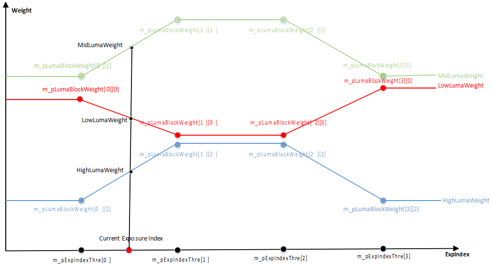

Luma – weight diagram:

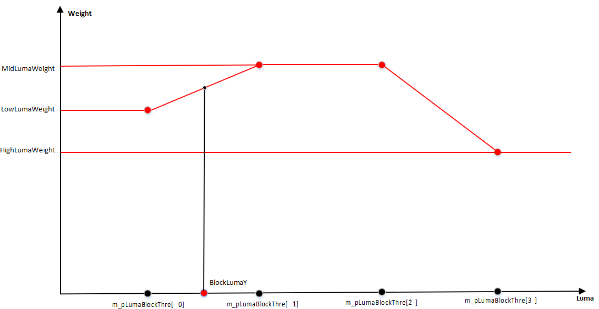

#### AE Mode Control

| Parameter Name        | Description                                                                                                     | Recommended Tuning | Special Notes       |
|----------------------|------------------------------------------------------------------------------------------------------------------|--------------------|---------------------|
| m_bLumaSelectOption  | `0`: Luminance calculation does NOT reference 6 sub-ROIs in AEM;   `1`: Luminance calculation references 6 sub-ROIs in AEM |        |                     |
| m_nStrategyMode      | AE adjustment strategy selection:   `0`: Auto mode;   `1`: Highlight priority (ensure proper exposure in bright areas)   2: Low light priority (ensure proper exposure in dark areas) |      |        |
| m_bAntiFlickerEnable | Anti-flicker enable:   `0`: Disabled, exposure time not limited by flicker;   `1`: Enabled, exposure time limited to integer multiples of flicker period |         |            |
| m_nAntiFlickerFreq   | Anti-flicker frequency selection:   `0`: 50Hz;   `1`: 60Hz                                                   |                   |                     |

#### AE Convergence Control

| Parameter Name               | Description                                                                                                                                                                              | Recommended Tuning | Notes       |
|-----------------------------|-------------------------------------------------------------------------------------------------------------------------------------------------------------------------------------------|-------------------|-------------|
| m_nTolerance                | Target brightness error tolerance. AE will not adjust when the measured brightness is within [target±m_nTolerance]                                                                        | Yes               |             |
| m_nStableRange              | Stable brightness range: when AE converges, if the difference between the measured brightness (mean) and the target brightness exceeds m_nStableRange, analog gain is adjusted to compensate | Yes            |             |
| m_nSmoothness               | AE convergence smoothness; smaller values result in smoother convergence                                                                                                                  | Yes               |             |
| m_pStableRefFrame           | Number of stable reference frames; if the count of stable frames exceeds this, AE considers the scene stable                                                                              | Yes               |             |
| m_pUnStableRefFrame         | Number of unstable reference frames; if the count of unstable frames exceeds this, AE considers the scene unstable                                                                        | Yes               |             |
| m_nDualTargetBlendWeight    | Blend ratio between the previous target brightness and the current target brightness; 8 means 1:1 blend; 16 means fully use current target                                                | Yes               |             |
| m_pFastStep                 | Large step adjustment discount ratio. When m_pFastStep = 256 (and not limited by MaxFastRatio), it means a single step adjustment to the target (see step-target diagram below)           | Yes               |             |
| m_pFastStepRangePer         | Large step threshold; large steps used when condition |current_luma – target_luma| &gt; m_nFastStepRangePer * target_luma is met                                                          | Yes               |             |
| m_pFastStepMinRange         | Lower limit of the large step threshold                                                                                                                                                   | Yes               |             |
| m_pSlowStep                 | Small step adjustment discount ratio (same as m_pFastStep, see step-target diagram below)                                                                                                 | Yes               |             |
| m_pSlowStepRangePer         | Small step threshold; used when m_nSlowStepRangePer * target &lt; |current_luma – target| &lt; m_nFastStepRangePer * target                                                               | Yes               |             |
| m_pSlowStepMinRange         | Lower limit of the small step threshold                                                                                                                                                   | Yes               |             |
| m_pFineStep                 | Fine step adjustment discount ratio (same as m_pFastStep, see step-target diagram below)                                                                                                  | Yes               |             |
| m_pMaxFastRatio             | Maximum large step adjustment ratio (Q8):  When increasing exposure, max large step ratio is m_pMaxFastRatio;  When decreasing exposure, max large step ratio is 65536/m_nMaxFastRatio; | Yes               |             |
| m_pMaxSlowRatio             | Maximum small step adjustment ratio (Q8):  When increasing exposure, small step ratio limits range is [256 + m_nMaxFineRatio, 256 + m_nMaxSlowRatio];  When decreasing exposure, range is [256 - m_nMaxSlowRatio, 256 - m_nMaxFineRatio]; | Yes       |             |
| m_pMaxFineRatio             | Maximum fine step adjustment ratio (Q8)                                                                                                                                                   | No                |             |
| m_pMinFineRatio             | Minimum fine step adjustment ratio   When increasing exposure, small step ratio limits range is [256 + m_nMinFineRatio, 256 + m_nMaxFineRatio];  When decreasing exposure, range is [256 - m_nMaxFineRatio, 256 - m_nMinFineRatio]; | No        |             |
| m_pAjustSplitFrameNum       | Number of steps required for a single adjustment (1st column reserved)                                                                                                                     | No                |             |
| m_pSingleStepAdjustLumaThr  | Single adjustment brightness threshold (1st column reserved). Together with m_pAjustSplitFrameNum determines max luma per single adjustment: Single_luma_max = max((target - mean)/AjustSplitFrameNum, SingleStepAdjustLumaThr)   When increasing exposure, if adjusted luma exceeds Single_luma_max, then adjustRatio= 256 + Single_luma_max * 256 / mean   Similarly for decreasing exposure. | No                |             |
| m_pFaceAjustSplitFrameNum   | Same meaning as m_pAjustSplitFrameNum, but only effective in face AE mode                                                                                                                  | No                |             |
| m_pFaceSingleStepAdjustLumaThr | Same meaning as m_pSingleStepAdjustLumaThr, but only effective in face AE mode                                                                                                          | No                |             |

Step–Target Illustration:

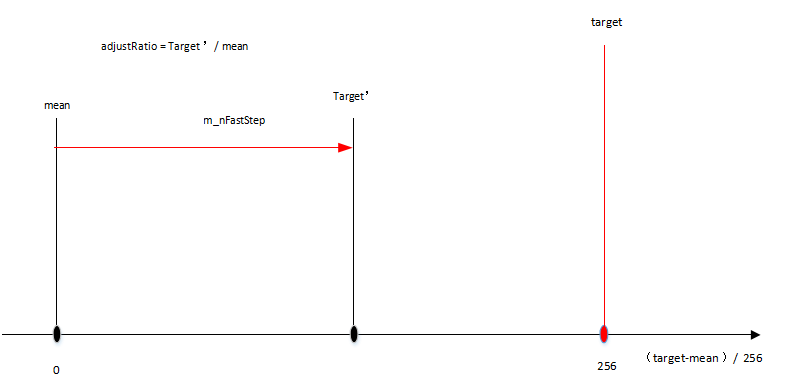

Luma–Step Illustration:

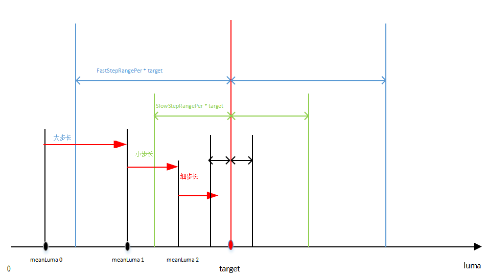


#### Automatic Dynamic Range Compensation Gain Calculation

| Parameter Name            | Description                                                                                                                                     | Recommended for Debugging | Notes |
|---------------------------|-------------------------------------------------------------------------------------------------------------------------------------------------|----------------------------|-------|
| m_nDarkRefBin             | Upper limit reference value of pixel brightness in dark areas; the brightness range for dark area statistics will not exceed this value         | Yes                        |       |
| m_bLumaPredict            | Luma prediction for DRCgain calculation: `0`: No correction during DRCgain calculation (when frame statistics are applied to current frame’s LTM) ; `1`: Correction applied during DRCgain calculation (when frame statistics are applied to next frame’s LTM) |     |       |
| m_nDarkPerThrL            | Lower threshold of dark area pixel percentage. When the percentage of dark pixels is below this value, DRCGainDark is set to 1 (see illustration: pixelNumPercent–DRCGainDark) |       |       |
| m_nDarkPerThrH            | Upper threshold of dark area pixel percentage. When the percentage of dark pixels exceeds this value, all dark pixels are used to calculate DRCGainDark (see illustration: pixelNumPercent–DRCGainDark) |       |       |
| m_nDarkTarget             | Target brightness value for dark areas. The larger the value, the higher the resulting DRCGainDark                                              |                            |       |
| m_nMaxDRCGain             | Maximum DRC gain                                                                                                                                | Yes                        |       |
| m_nMaxDRCGainDark         | Maximum DRC gain for dark areas                                                                                                                 | Yes                        |       |

PixelNumPercent–DRCGainDark Illustration:
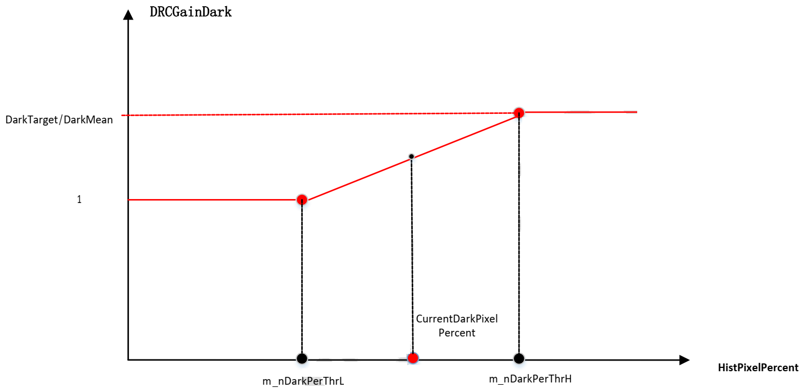

#### Lux Calibration

| Parameter Name          | Description                                              | Recommended for Debugging  | Notes  |
|------------------------|-----------------------------------------------------------|----------------------------|-------|
| m_nCalibExposureIndex  | Exposure index for brightness calibration                 | Yes                        |       |
| m_nCalibSceneLum       | Scene brightness for calibration                          | Yes                        |       |
| m_nCalibSceneLux       | Actual illumination (lux) of the calibration scene        | Yes                        |       |


#### AEC Manual Parameters

| Parameter Name        | Description                                                                 | Recommended for Debugging | Notes |
|-----------------------|-----------------------------------------------------------------------------|----------------------------|-------|
| m_pExpTimeManual      | Manual exposure time, effective when AEC is in manual mode                  |                            |       |
| m_pAnaGainManual      | Manual analog gain, effective when AEC is in manual mode                    |                            |       |
| m_pSnsDGainManual     | Manual sensor digital gain, effective when AEC is in manual mode            |                            |       |
| m_pTotalGainManual    | Manual total gain, effective when AEC is in manual mode                     |                            |       |
| m_pExpIndexManual     | Manual exposure index, effective when AEC is in manual mode                 |                            |       |

#### AEC Frame Info

| Parameter Name           | Description                                                                                       | Recommended for Debugging | Notes   |
|--------------------------|---------------------------------------------------------------------------------------------------|----------------------------|---------|
| m_nFrameCounter          | AE frame counter                                                                                  | -                          | Read-only |
| m_pExpTimeLong           | Exposure time (us)                                                                                | -                          | Read-only |
| m_pAnaGainLong           | Analog gain (Q8)                                                                                  | -                          | Read-only |
| m_pSnsDGainLong          | Sensor digital gain (Q12)                                                                         | -                          | Read-only |
| m_pIspDGainLong          | ISP digital gain (Q12)                                                                            | -                          | Read-only |
| m_pTotalGainLong         | Total gain (Q8)                                                                                   | -                          | Read-only |
| m_pExpIndexLong          | Exposure index (Exposure Time * Total Gain / 256)                                                 | -                          | Read-only |
| m_pTotalGainDBLong       | Total gain (dB)                                                                                   | -                          | Read-only |
| m_pExpTimeShort          | Reserved                                                                                          | -                          | Read-only |
| m_pAnaGainShort          | Reserved                                                                                          | -                          | Read-only |
| m_pSnsDGainShort         | Reserved                                                                                          | -                          | Read-only |
| m_pIspDGainShort         | Reserved                                                                                          | -                          | Read-only |
| m_pTotalGainShort        | Reserved                                                                                          | -                          | Read-only |
| m_pExpIndexShort         | Reserved                                                                                          | -                          | Read-only |
| m_pTotalGainDBShort      | Reserved                                                                                          | -                          | Read-only |
| m_nCurHdrRatio           | Reserved                                                                                          | -                          | Read-only |
| m_nHistPixelNum          | Number of pixels used in histogram statistics                                                     | -                          | Read-only |
| m_pMeanLuma              | AE calculated brightness   `0`: long   `1`: Reserved                                    | -                          | Read-only |
| m_pTargetLuma            | AE target brightness   `0`: long   `1`: Reserved                                        | -                          | Read-only |
| m_pLuma7Zone             | AE main and 6 sub-window luma                                                                     | -                          | Read-only |
| m_pAERouteNum            | AE exposure node   `0`: long   `1`: Reserved                                            | -                          | Read-only |
| m_pRouteNodeLong         | Long frame exposure table                                                                         | -                          | Read-only |
| m_pADNodeLong            | Sensor analog and digital gain allocation table                                                   | -                          | Read-only |
| m_pLumaMatrixLong        | Luma thumbnail                                                                                    | -                          | Read-only |
| m_pHistLong              | Histogram                                                                                         | -                          | Read-only |
| m_pRouteNodeShort        | Reserved                                                                                          | -                          | Read-only |
| m_pADNodeShort           | Reserved                                                                                          | -                          | Read-only |
| m_pLumaMatrixShort       | Reserved                                                                                          | -                          | Read-only |
| m_pHistShort             | Reserved                                                                                          | -                          | Read-only |
| m_pRefSaturateNum        | Reference overexposed pixel count   `0`: long   `1`: Reserved                           | -                          | Read-only |
| m_pCurSaturateNum        | Current overexposed pixel count   `0`: long   `1`: Reserved                             | -                          | Read-only |
| m_pEstSaturateNum        | Estimated overexposed pixel count when brightness reaches upper limit   `0`: long   `1`: Reserved | -                | Read-only |
| m_pAdjustRatio           | AE adjustment ratio                                                                               | -                          | Read-only |
| m_pStableFlag            | AE stability flag   `0`: long   `1`: Reserved                                           | -                          | Read-only |
| m_pStableFlagBuf         | AE frame sequence stability flag   `0`: long   `1`: Reserved                            | -                          | Read-only |
| m_pUnStableFlagBuf       | AE frame sequence instability flag   `0`: long   `1`: Reserved                          | -                          | Read-only |
| m_nDRCGain               | DRCGain result of AE calculation for current frame                                                | -                          | Read-only |
| m_nDRCGainDark           | DRCGainDark result of AE calculation for current frame                                            | -                          | Read-only |

### CAFFilter Parameter Description

The CAFFilter module is used for automatic focus control.

#### AF Parameters

| Parameter Name            | Description                                                                 | Recommended for Debugging  | Notes       |
|---------------------------|-----------------------------------------------------------------------------|----------------------------|-------------|
| m_nAFMode                 | Focus mode:   `0`: SAF (Single Auto Focus);   `1`: CAF (Continuous Auto Focus) | User configurable  |             |
| m_bHybridAFEnable         | Enable hybrid AF mode (CDAF + PDAF):   `0`: Disabled;   `1`: Enabled   | User configurable          |             |
| m_bAFTrigger              | AF trigger; must be enabled when using CAF                                  | User configurable          |             |
| m_bMotorManualTrigger     | Manual focus trigger, used together with ManualMotorPosition                | User configurable          |             |
| m_nManualMotorPosition    | Manual motor position                                                       | User configurable          |             |
| m_nFrameRate              | Current sensor frame rate, used to calculate AF skip frames; should be updated by software | User configurable |             |
| m_nMaxSkipFrame           | Maximum number of skipped frames                                            | No                         |             |

#### Motor Property Parameters

| Parameter Name             | Description                                                                                       | Recommended for Debugging | Notes |
|----------------------------|---------------------------------------------------------------------------------------------------|----------------------------|-------|
| m_nMinMotorPosition        | Minimum motor position                                                                            | Yes                        |       |
| m_nMaxMotorPosition        | Maximum motor position                                                                            | Yes                        |       |
| m_nMotorResponseTime       | Response time per motor step (ms); used to calculate AF skipped frames — the higher the value, the more frames are skipped | Yes |       |
| m_nHyperFocalMotorPosition | Hyperfocal position                                                                               | Yes                        |       |

#### Motor Movement Control Parameters

| Parameter Name | Description | Recommended for Debugging | Notes |
|---|---|---|---|
| m_nFirstStepDirectionJudgeRatio | First step direction judgment ratio (%). When AF algorithm is running in CDAF mode, this sets the percentage used to determine the first step direction:   If the motor's initial position is within the first X% of its full range, move from min to max position;  If it's within the last (100%-X)%, move from max to min position. | User Setting | |
| m_bPreMoveMode | Pre-move mode. When AF algorithm is running in CDAF mode, defines motor behavior for first step:   `0`: Stay at initial position;   `1`: Move to min or max motor position based on direction judgment percentage. | User Setting | |
| m_bPreMoveToInfMode | Pre-move to infinity mode. When AF algorithm is running in CDAF mode, defines motor behavior for first step:   `0`: Stay at initial position;   `1`: Move to minimum motor position. | User Setting | |
| m_bStartFromTrueCurrent | Start from actual current position. When AF algorithm is running in CDAF mode, defines motor behavior for first step:   `0`: Move to closest macro position from initial position;   `1`: Stay at initial position. | User Setting | |
| m_nBackTimeRatio | Frame skipping ratio during motor movement. Higher value means more frames are spent per motor step. Works in conjunction with m_nBackTimeDivisor. | User Setting | |
| m_nBackTimeDivisor | Motor step frame skipping control divisor. Smaller value means more frames are spent per step. Works in conjunction with m_nBackTimeRatio. | User Setting | |
| m_nPreMoveTimeRatio | Frame skipping ratio in pre-move mode. | User Setting | |
| m_nFailMotorPositionOption | Final motor position after focus failure:   `0`: Auto-selected by algorithm (requires correct hyperfocal position);   `1`: Best sharpness;   `2`: Infinity;   `3`: Hyperfocal;   `4`: Macro;   `5`: Current position | User Setting | |


#### Motor Step Control Parameters

| Parameter Name | Description | Recommended for Debugging | Notes |
|---|---|---|---|
| m_nMinMacroReverseStepNum | Minimum steps motor must move when reversing direction from max to min position upon detecting FV drop | Yes |   |
| m_nMinReverseStepNum | Minimum steps motor must move when reversing direction from min to max position upon detecting FV drop | Yes |  |
| m_nFineStepSearchNum | Number of fine step searches | Yes |   |
| m_nCoarseStep | Coarse step size in CDAF | Yes |   |
| m_nFineStep | Fine step size in CDAF | Yes |   |

| Parameter Name | Description | Recommended for Debugging | Notes |
|---|---|---|---|
| m_nSoftwareMotorCtrlMode | Target position control mode (used for first-step pre-move, manual move, fine step start, focus failure handling, etc.):   `0`: Soft landing mode;   `1`: Fixed step mode;   `2`: Direct mode | User Setting | See Figure 1 |
| m_nMinSafePosition | Minimum safe position when motor moves from max to min position in soft landing mode | User Setting | See Figure 2 |
| m_nMinStepRatio | Minimum step ratio in soft landing mode (same as above) | User Setting | See Figure 2 |
| m_nMaxSafeStep | Maximum safe step in soft landing mode (same as above) | User Setting | See Figure 2 |
| m_nMinSafePositionMacro | Minimum safe position when motor moves from min to max position in soft landing mode | User Setting | See Figure 2 |
| m_nMinStepRatioMacro | Minimum step ratio in soft landing mode (same as above) | User Setting | See Figure 2 |
| m_nMaxSafeStepMacro | Maximum safe step in soft landing mode (same as above) | User Setting | See Figure 2 |

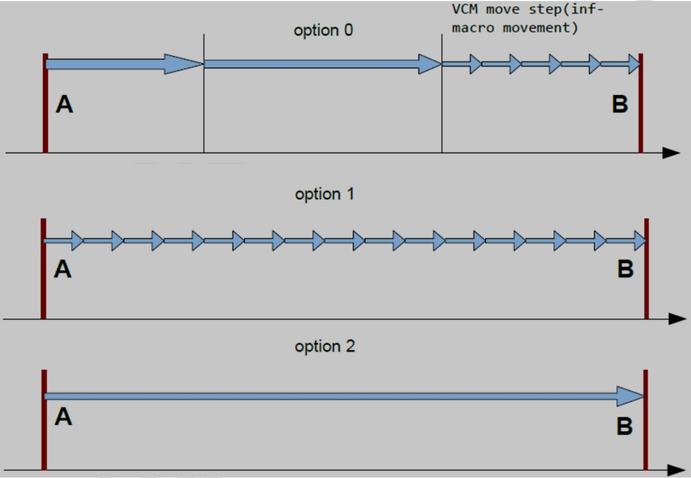

Figure 1

Description per condition group:

- Graphic: Visual demonstration
- Output: One output scenario

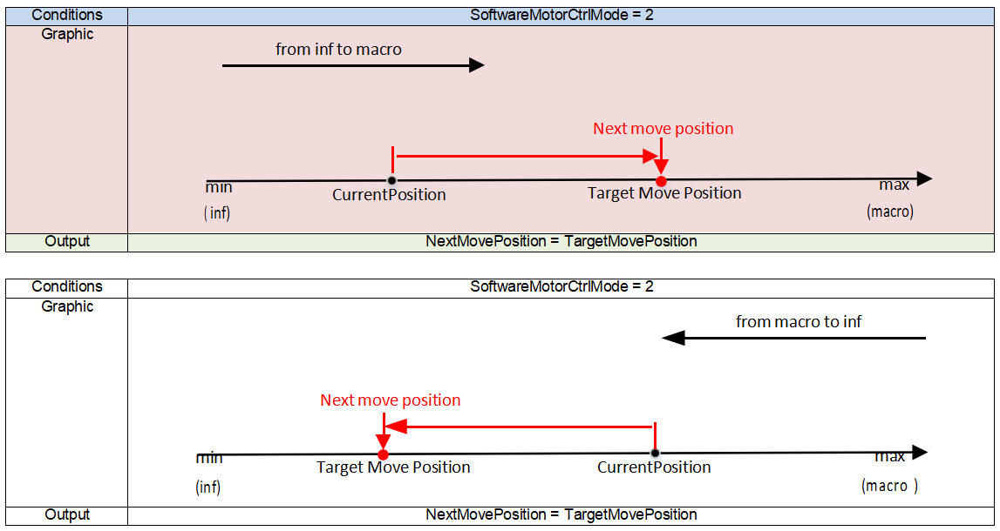

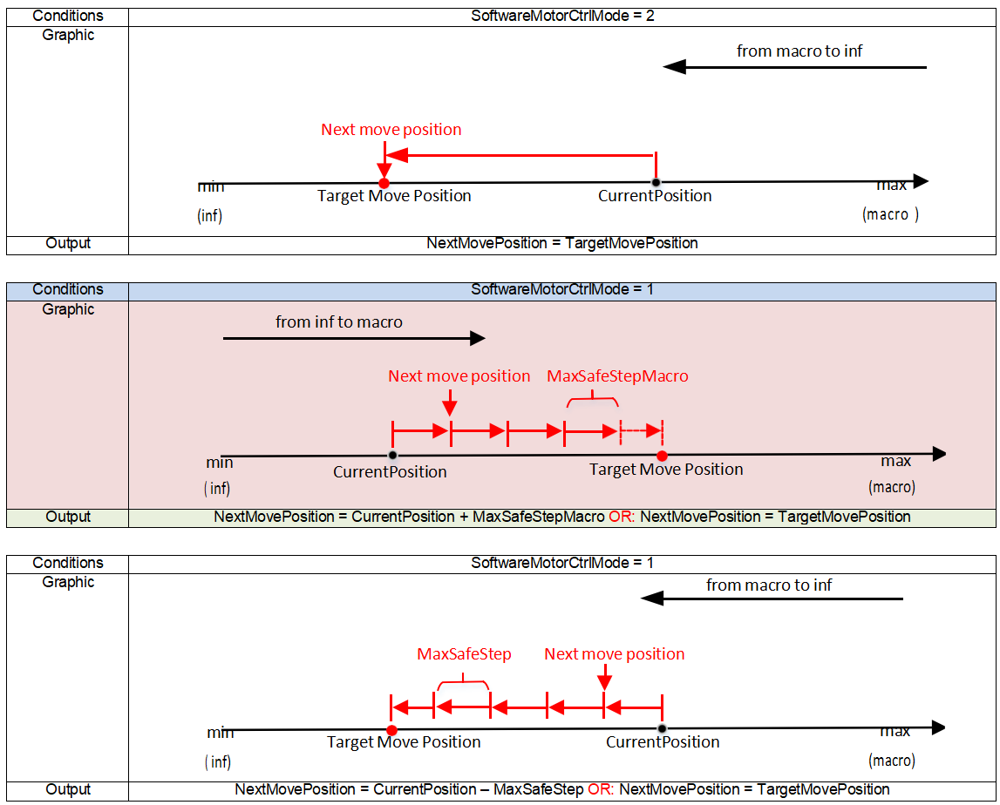

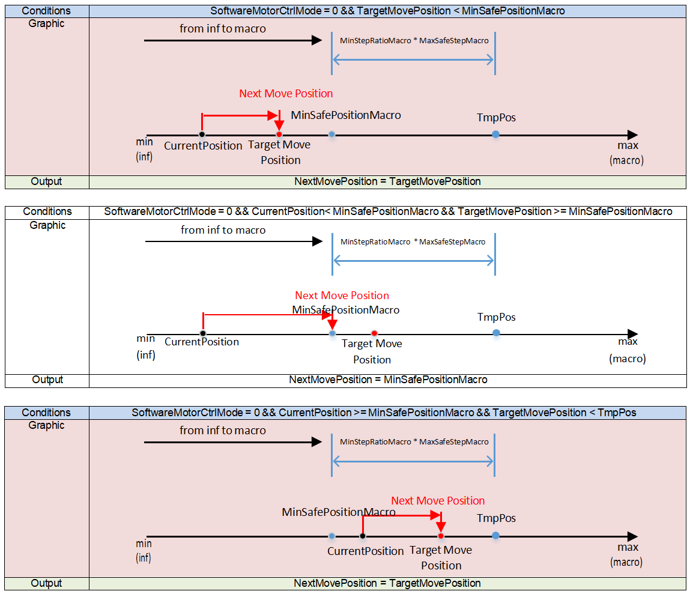

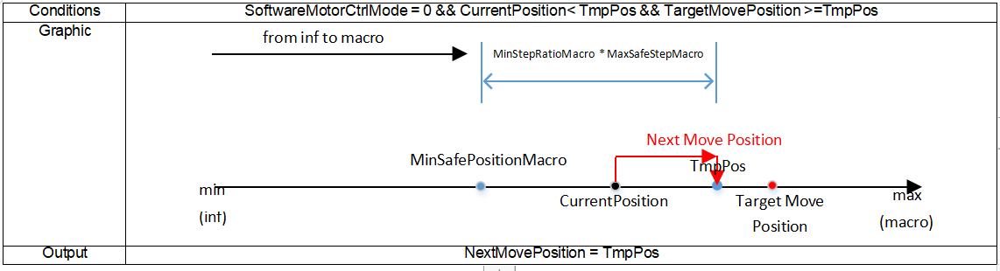

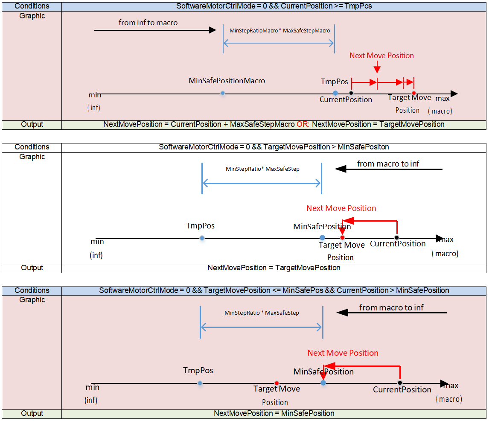

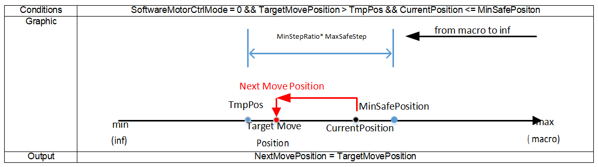

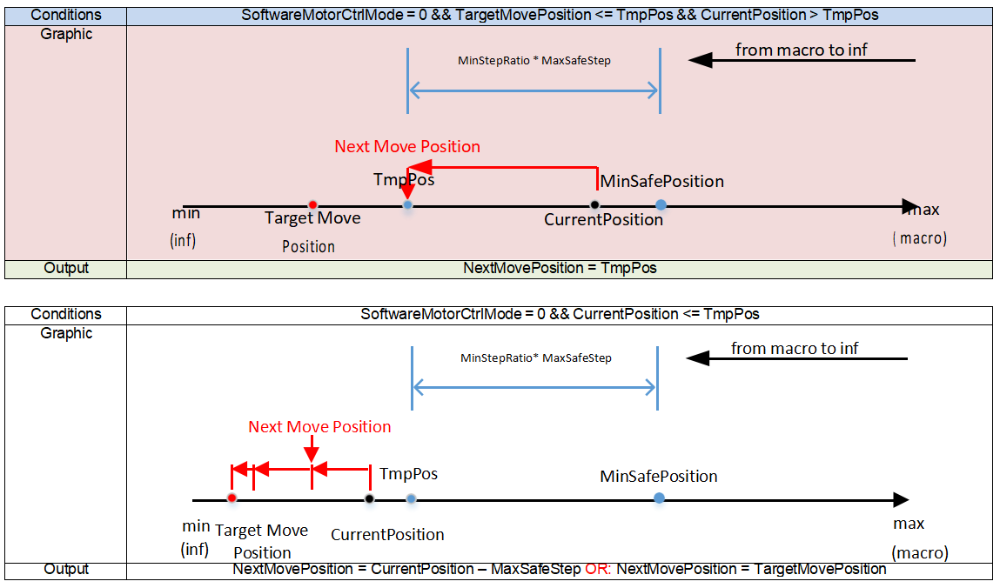

Figure 2

| Parameter Name | Description | Recommended for Debugging | Notes |
|---|---|---|---|
| m_bAdaptiveStep | Adaptive step mode   `0`: Disabled;   `1`: Enabled | User Setting |   |
| m_nVCMStep1Ratio | Motor step ratio 1, divides motor range into segments in adaptive step mode | User Setting | See Figure 3 |
| m_nVCMStep2Ratio | Motor step ratio 2, divides motor range into segments in adaptive step mode | User Setting | See Figure 3 |
| m_nVCMCoarseStep1 | Motor coarse step 1, actual step computed based on current motor position segment in adaptive mode | User Setting | See Figure 3 |
| m_nVCMCoarseStep2 | Motor coarse step 2, actual step computed based on current motor position segment in adaptive mode | User Setting | See Figure 3 |
| m_nVCMFineStep1 | Motor fine step 1, actual step computed based on current motor position segment in adaptive mode | User Setting | See Figure 3 |
| m_nVCMFineStep2 | Motor fine step 2, actual step computed based on current motor position segment in adaptive mode | User Setting | See Figure 3 |

- MotorMoveStep indicates the real-time step length, changing according to motor movement direction and whether in coarse or fine step mode; it can be positive, negative, large, or small.

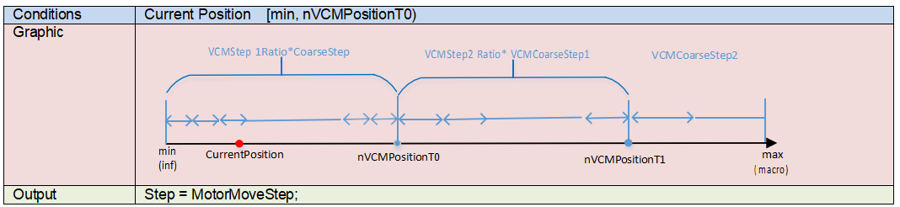

Figure 3

Description per condition group:

- Graphic: Visual demonstration
- Output: One output scenario

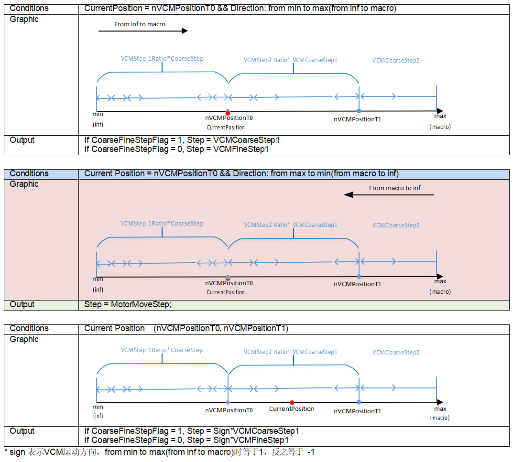

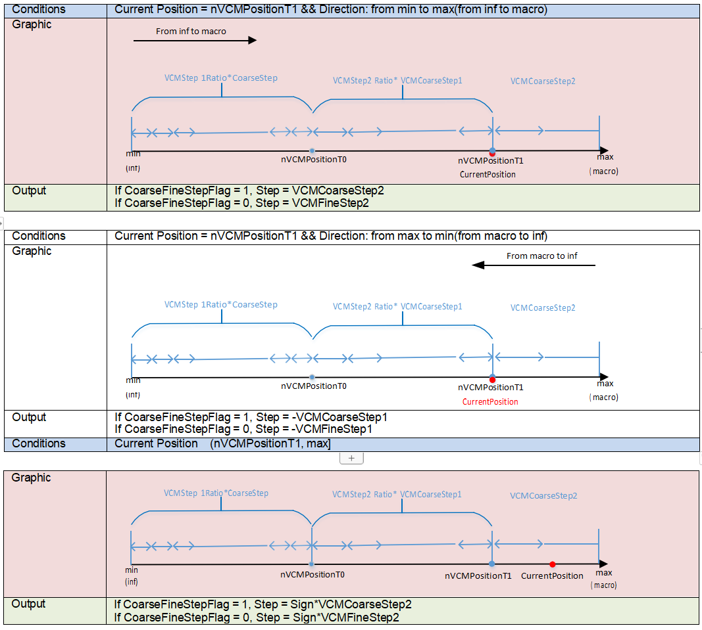


#### Focus Value (FV) Judgment Parameters

| Parameter Name     | Description  | Recommended for Debugging | Notes |
|--------------------|--------------------------------------------------------------------------------------------------------|--------------------------|-------|
| m_pFVDropPercentage    | FV drop percentage threshold for pre-move mode. Calculated separately for 6 types of FV based on gain.   | No    |       |
| m_pCurrentStartFVDropPercentage| FV drop percentage threshold for non-pre-move mode. Calculated separately for 6 types of FV based on gain.   | No    |       |
| m_pFVFailPercentage | In pre-move mode, max-min FV difference percentage to judge FV curve invalidity. If difference is below this threshold, FV curve is too flat and considered invalid. Applied separately for 6 FV types based on gain. First condition to judge focus failure. | No  |       |
| m_pCurrentStartFVFailPercentage| Same as above but for non-pre-move mode. First condition to judge focus failure.  | No   |       |
| m_pLastStepChangePercentage    | Percentage threshold for judging FV curve as invalid when FV continuously rises or falls. Calculated separately for 6 FV types based on gain.  | No   |       |
| m_pWindowWeightMatrix          | 5x5 window weights for FV statistics calculation.  | No   |       |


#### PDAF Control Parameters

| Parameter Name                | Description                                                                                                   | Recommended for Debugging | Notes        |
|------------------------------|----------------------------------------------------------------------------------------------------------------|--------------------------|--------------|
| m_bPDReverseDirectionFlag    | PDShift step direction reverse flag   `0`: No reverse;   `1`: Reverse                                   | Yes                      |              |
| m_nPDDirectConfThrRatio      | PD threshold percentage; when confidence exceeds m_nPDDirectConfThrRatio%, directly apply PD step calculated | No                         |              |
| m_nPDTryStepRatio            | Step ratio tried first in hybrid AF mode relative to CDAF coarse step                                          | No                       |              |
| m_nPDCoarseStep              | PDAF coarse step                                                                                               | Yes                      |              |
| m_nPDFineStep                | PDAF fine step                                                                                                 | Yes                      |              |
| m_nPDStepDiscountRatio       | Discount ratio applied to PDShift calculated step                                                              | No                       |              |
| m_pPDConfThr                 | PD confidence threshold                                                                                        | Yes                      |              |
| m_pPDFVIncreaseRatio         | FV increase ratio used in hybrid AF mode to judge if FV rises after PD step, determining PD info validity      | No                       |              |
| m_pPDFVDropPercentage        | FV drop percentage threshold used in PDAF mode                                                                 | No                       |              |
| m_pPDShiftPositionLUT_0_0 ~ m_pPDShiftPositionLUT_4_4 | 5x5 window PD Shift – step lookup table                                               | PDAF plugin calibration  |              |


#### Continuous Autofocus (CAF) Control

| Parameter Name              | Description                                                                                    | Recommended for Debugging | Notes  |
|-----------------------------|------------------------------------------------------------------------------------------------|--------------------------|--------|
| m_bCAFHold                  | Hold current state in continuous autofocus mode                                                | User setting             |        |
| m_bCAFForce                 | Force trigger single autofocus once in continuous autofocus mode                               | User setting             |        |
| m_nCAFHoldPDShiftThr        | PD shift threshold to judge scene stability in CAF mode; higher value means easier to judge stable | Yes                  |        |
| m_nCAFHoldPDConfThr         | PD confidence threshold to judge scene stability in CAF mode; lower value means easier to judge stable | Yes              |        |
| m_nPreFocusMode             | Prefocus mode enable in CAF:   `0`: No prefocus;   `1`: Semi-prefocus (try focus once based on PD shift) | User setting     |        |
| m_nPFPDStepDiscountRatio    | Prefocus step discount ratio                                                                   | Yes                      |        |
| m_nLumaCalcOpt              | Luma calculation method   `0`: Calculate each channel separately;   `1`: Calculate RGB max value;   `2`: Calculate weighted Y average | No     |        |
| m_bReFocusEnable            | Refocus enable in CAF mode                                                                     | User setting             |        |
| m_pRefocusLumaSADThr        | SAD threshold to decide whether to trigger SAF when CAF triggers SAF                           | Yes                      |        |
| m_nFlatSceneVarThr          | Variance threshold of thumbnail to judge flat scene in CAF mode                                | Yes                      |        |
| m_nFlatSceneLumaThr         | Luma threshold to judge flat scene in CAF mode                                                 | Yes                      |        |
| m_bStableJudgeOpt           | Condition for scene stability judgment in CAF:   `0`: FV or luma satisfies condition;   `1`: Both FV and luma satisfy condition | User setting     |        |
| m_nRefStableFrameNum        | Number of frames judged stable in reference state during CAF                                   | User setting             |        |
| m_nDetStableFrameNum        | Number of frames judged stable in detection state during CAF                                   | User setting             |        |
| m_pStableExpIndexPercentage | Percentage of exposure index change to judge stability in CAF                                  | Yes                      |        |
| m_pStableFVSADPercentage    | SAD percentage of FV to judge stability in CAF                                                 | Yes                      |        |
| m_pStableLumaSADThr         | SAD threshold of luma to judge stability in CAF                                                | Yes                      |        |
| m_bChangeJudgeOpt           | Condition for scene change judgment in CAF:   `0`: FV or luma satisfies condition;   `1`: Both FV and luma satisfy condition | No    |        |
| m_nChangeFrameNum           | Number of frames to judge scene change in CAF                                                  | Yes                      |        |
| m_nChangeStatAreaPercentage | Threshold percentage of AF statistic window area change to judge scene change in CAF; effective in face mode | No         |        |
| m_nChangeStatCenterPercentage | Threshold percentage of AF statistic window center position change to judge scene change in CAF; effective in face mode | No     |        |
| m_pChangeExpIndexPercentage | Exposure index change percentage to judge scene change in CAF                                  | Yes                      |        |
| m_pChangeFVSADPercentage    | SAD percentage of FV to judge change in CAF                                                    | Yes                      |        |
| m_pChangeLumaSADThr         | SAD threshold of luma to judge change in CAF                                                   | Yes                      |        |
| m_pChangePDShiftThr         | PDShift percentage threshold to judge change in CAF                                            | No                       |        |


#### Foreground Tracking Mode

| Parameter Name              | Description                                                                                        | Recommended for Debugging | Notes      |
|-----------------------------|----------------------------------------------------------------------------------------------------|--------------------------|------------|
| m_bForeGroundTrackInCoarse  | Foreground tracking enable during coarse step adjustment:   `0`: Disable foreground tracking;   `1`: Enable foreground tracking | User setting    |            |
| m_bForeGroundTrackInFine    | Foreground tracking enable during fine step adjustment:   `0`: Disable foreground tracking;   `1`: Enable foreground tracking | User setting      |            |
| m_nForeGroundTrackWindow    | Foreground tracking window size:   `3`: 3x3;   `4`: 4x4;   `5`: 5x5                      | User setting             |            |
| m_bForeGroundTrack          | Foreground tracking mode enable:   `0`: Disable foreground tracking;   `1`: Enable foreground tracking | User setting  |            |
| m_pFVBlkDropPercentage      | FV value drop percentage threshold when foreground tracking mode is enabled                         | No                      |            |
| m_pFVBlkIncreasePercentage  | FV value increase percentage threshold when foreground tracking mode is enabled                     | No                      |            |
| m_pFineStepStartPosSelectConf | Confidence threshold for start position when beginning fine step in foreground tracking mode      | No                      |            |
| m_pFineStepEndPosSelectConf | Confidence threshold for final position after fine step in foreground tracking mode                 | No                      |            |


#### AF Frameinfo

| Parameter Name           | Description                                                                                             | Recommended for Debugging | Notes    |
|-------------------------|----------------------------------------------------------------------------------------------------------|--------------------------|-----------|
| m_nGain                 | Current system gain, Q4 format                                                                           | -                        | Read-only |
| m_nPDShift              | PD offset                                                                                                | -                        | Read-only |
| m_nPDConf               | PD confidence                                                                                            | -                        | Read-only |
| m_nCurrentPosition      | Current motor position                                                                                   | -                        | Read-only |
| m_nFSMStatus            | AF state machine status                                                                                  | -                        | Read-only |
| m_nFocusStatFlag        | Focus status flag   `0`: Initial;   `1`: Success;   `2`: Failure                               | -                        | Read-only |
| m_nFocusFrameCost       | Number of frames taken for a single focus                                                                | -                        | Read-only |
| m_nMotorMoveStep        | Real-time motor step                                                                                     | -                        | Read-only |
| m_bCoarseFineStepFlag   | Real-time coarse/fine step flag   `0`: Fine step;   `1`: Coarse step                              | -                        | Read-only |
| m_nMotorMoveSkipFrameNum| Number of frames skipped per motor move                                                                  | -                        | Read-only |
| m_bStartFromMinFlag     | Real-time motor movement direction   `0`: From max to min motor position;   `1`: From min to max | -                         | Read-only |
| m_bStartFromCurrentFlag | Motor initial movement from current position flag   `0`: From pre-move position;   `1`: From initial position | -            | Read-only |
| m_bSoftwareMotorCtrlFlag| Flag for software control during movement from current to target position                                | -                        | Read-only |
| m_nPositionScanNum      | Count of motor movement direction scans                                                                  | -                        | Read-only |
| m_nPositionAdjustNum    | Count of motor moved positions                                                                           | -                        | Read-only |
| m_pRTFVList             | Real-time FV (Focus Value) list                                                                          | -                        | Read-only |
| m_pMinFVList            | Minimum FV values during single focus process                                                            | -                        | Read-only |
| m_pMaxFVList            | Maximum FV values during single focus process                                                            | -                        | Read-only |
| m_pMaxFVPositionList    | Positions of maximum FV values during single focus process                                               | -                        | Read-only |
| m_pFVUnchangeFlag       | FV curve invalidation flag   `0`: FV curve valid;   `1`: FV curve invalid                         | -                        | Read-only |
| m_pFailCondition        | Status of three local focus fail conditions   `0`: Success;   `1`: Fail                           | -                        | Read-only |
| m_pFSMPosSingleFocus    | Frame number - motor position - state machine info during single focus                                   | -                        | Read-only |
| m_pPosFvSingleFocus     | Frame number - 6 types of FV values during single focus                                                  | -                        | Read-only |
| m_pRefFV                | Reference FV value in continuous focus mode                                                              | -                        | Read-only |
| m_pSeqFV                | Real-time FV sequence in continuous focus mode                                                           | -                        | Read-only |
| m_pRefLumaR             | Reference R channel thumbnail in continuous focus mode                                                   | -                        | Read-only |
| m_pRefLumaG             | Reference G channel thumbnail in continuous focus mode                                                   | -                        | Read-only |
| m_pRefLumaB             | Reference B channel thumbnail in continuous focus mode                                                   | -                        | Read-only |
| m_pSeqLumaR             | Real-time R channel thumbnail in continuous focus mode                                                   | -                        | Read-only |
| m_pSeqLumaG             | Real-time G channel thumbnail in continuous focus mode                                                   | -                        | Read-only |
| m_pSeqLumaB             | Real-time B channel thumbnail in continuous focus mode                                                   | -                        | Read-only |
| m_nRefExpIndex          | Reference exposure index in continuous focus mode                                                        | -                        | Read-only |
| m_nRTExpIndex           | Real-time exposure index in continuous focus mode                                                        | -                        | Read-only |
| m_bPDInfoDisable        | Flag for PD info usage in continuous focus mode                                                          | -                        | Read-only |
| m_nLumaAverage          | Average luminance                                                                                        | -                        | Read-only |
| m_nSceneVariance        | Real-time variance of thumbnail                                                                          | -                        | Read-only |
| m_bSceneFlatFlag        | Scene flatness flag                                                                                      | -                        | Read-only |
| m_nChangeExpIndex       | Difference between current and reference exposure index in continuous focus mode                         | -                        | Read-only |
| m_nChangeExpIndexThr    | Exposure index threshold for scene change detection in continuous focus mode                             | -                        | Read-only |
| m_nChangeFVSAD          | SAD difference between real-time and reference FV in continuous focus mode                               | -                        | Read-only |
| m_nChangeFVSADThr       | SAD threshold for scene change detection in continuous focus mode                                        | -                        | Read-only |
| m_nChangeLumaSAD        | Real-time luminance SAD value                                                                            | -                        | Read-only |
| m_nChangeLumaSADThr     | Real-time luminance SAD threshold                                                                        | -                        | Read-only |
| m_nRefocusLumaSAD       | Previous frame luminance SAD when CAF triggers SAF                                                       | -                        | Read-only |
| m_nRefocusLumaSADThr    | SAD threshold deciding whether SAF is triggered by CAF                                                   | -                        | Read-only |
| m_bStableExpIndexFlag   | AE exposure table stability flag                                                                         | -                        | Read-only |
| m_bStableFVFlag         | FV stability flag                                                                                        | -                        | Read-only |
| m_bStableAFLumaFlag     | AFM luminance stability flag                                                                             | -                        | Read-only |
| m_bStableAELumaFlag     | AEM luminance stability flag                                                                             | -                        | Read-only |
| m_bPDTriggerCAF         | PD triggered AF flag                                                                                     | -                        | Read-only |
| m_bFVTriggerCAF         | FV triggered AF flag                                                                                     | -                        | Read-only |
| m_bLumaTriggerCAF       | Luma triggered AF flag                                                                                   | -                        | Read-only |
| m_bExpIndexTriggerCAF   | Exposure index triggered AF flag                                                                         | -                        | Read-only |
| m_bRefocusTriggerCAF    | CAF triggered SAF flag                                                                                   | -                        | Read-only |

### CAWBFilter Parameter Description

The CAWBFilter (AWB) module is used for automatic white balance control.

#### Gray World

| Parameter Name | Description                                                                                    | Suggested Tuning | Special Notes |
|----------------|------------------------------------------------------------------------------------------------|------------------|---------------|
| m_bGrayWorldEn | Gray World mode enable:   `0`: Disable Gray World;   `1`: Enable Gray World; in this mode, white balance gains are calculated by the Gray World algorithm | User Setting     |               |


#### ROI Control

| Parameter Name    | Description                                                                                                          | Suggested Tuning | Special Notes |
|-------------------|----------------------------------------------------------------------------------------------------------------------|------------------|---------------|
| m_pRoiBound       | Control for 16 ROI regions                                                                                           | Yes              |               |
| m_pRoiLumLutHigh  | Upper limit of brightness for statistic blocks                                                                       | No               |               |
| m_pRoiLumLutLow   | Lower limit of brightness for statistic blocks                                                                       | No               |               |
| m_pRoiEn          | ROI enable                                                                                                           | Yes              |               |
| m_pRoiWeightLut   | Weights corresponding to different brightness indices                                                                | Yes              |               |
| m_pRoiLumThre     | Brightness lux index threshold                                                                                       | Yes              |               |
| m_bRoiLimitManual | Fixed ROI enable:   `0`: Calculate white point limit area based on auto white point ROI and low color temperature block ratio;   `1`: White point limit area fixed to RoiCtHigh, RoiCtLow, RoiXMax, RoiXMin |        |          |
| m_nRoiCtHigh      | Upper Y coordinate of white point ROI; weights for blocks outside ROI area are zero when calculating white balance (CT = BlockBlue_sum(8bit) / BlockRed_sum * 1024) | Yes      |          |
| m_nRoiCtLow       | Lower Y coordinate of white point ROI                                                                                | Yes              |               |
| m_nRoiXMax        | Upper X coordinate of white point ROI (X = BlockBlue_sum x BlockRed_sum / BlockGreen_sum / BlockGreen_sum x 1024)    | Yes              |               |
| m_nRoiXMin        | Lower X coordinate of white point ROI                                                                                | Yes              |               |
| m_pRoiCtHighAuto  | Upper Y coordinate of white point ROI at different brightness levels                                                 | Yes              |               |
| m_nRoiCtLowAuto   | Lower Y coordinate of auto white point ROI at different brightness levels                                            | Yes              |               |
| m_nRoiXMaxAuto    | Upper X coordinate of auto white point ROI at different brightness levels                                            | Yes              |               |
| m_nRoiXMinAuto    | Lower X coordinate of auto white point ROI at different brightness levels                                            | Yes              |               |
| m_nValidNum       | Minimum number of valid blocks in each ROI; if the number of blocks in the brightness statistics range is less than this value, the ROI does not participate in white balance calculation | No     |        |
| m_bWeightOnSum    | Block weight calculation method:   `0`: Use total brightness sum of blocks;   `1`: Use RGB gain of blocks     | No               |               |


#### White Balance Gain Control

| Parameter Name     | Description                                                                                                                   | Suggested Tuning | Special Notes |
|--------------------|-------------------------------------------------------------------------------------------------------------------------------|------------------|---------------|
| m_pAWBGainLimit    | Final WB gain limitation range                                                                                                | Yes              |               |
| m_nAWBCTShift      | WB Gain upward shift distance, used to shift low color temperature scenes toward warmer tones                                 | Yes              |               |
| m_pAWBCTShiftThr   | WB Gain shift Y threshold:   When Y &lt; AWBCTShiftThr[0], WB Gain is shifted up by m_nAWBCTShift   When Y > AWBCTShiftThr[1], WB Gain is not shifted   Intermediate values are interpolated | Yes      |           |


#### Mixed Lighting Scene - Reduce High Color Temperature Weight

| Parameter Name        | Description                                                                                                                               | Suggested Tuning | Special Notes      |
|-----------------------|-------------------------------------------------------------------------------------------------------------------------------------------|------------------|--------------------|
| m_sRoiBoundDayLight   | Mixed high and low color temperature scene, bounding region for high color temperature statistic blocks; blocks falling in this area are counted as high color temperature blocks | Yes        |               |
| m_pLowCtNumThr        | Threshold for the ratio (per mille) of low color temperature statistic blocks (see the illustration below lowCtLightPermillage-ratio)   When the ratio of low CT blocks > LowCtNumThr[0], the weight of high CT blocks begins to decrease;   When the ratio ≥ LowCtNumThr[1], the weight of high CT blocks is reduced to the minimum. | Yes      |             |
| m_pDayLightNumThr     | Threshold for the ratio (per mille) of high color temperature statistic blocks (see the illustration below dayLightPermillage-ratio)   When the ratio of high CT blocks &lt; DayLightNumThr[1], the weight of high CT blocks begins to decrease;   When the ratio ≤ DayLightNumThr[0], the weight no longer decreases. Works together with m_pLowCtNumThr to determine the base strength (baseRatio) for reducing high CT block weights. | Yes        |               |
| m_pLowCtThr           | Y threshold for reducing the weight of high CT statistic blocks in mixed CT scenes (see CtThr – ProtectRatio illustration); blocks with Y &lt; m_pLowCtThr[1] are counted as low CT blocks | Yes         |              |
| m_pLowCtProtectRatio  | Coefficient for reducing the weight of high CT blocks; the smaller the value, the lower the weight of high CT blocks. Together with baseRatio determines block weight (see CtThr – ProtectRatio) | Yes         | Changes with CtThr  |
| m_nLog2CwtOverA       | Weight ratio of CWF to A light                                                                                                           | No           |               |

---

**CtThr – ProtectRatio illustration**

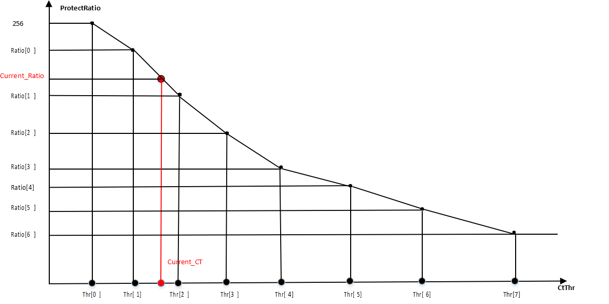

**lowCtLightPermillage-ratio illustration**

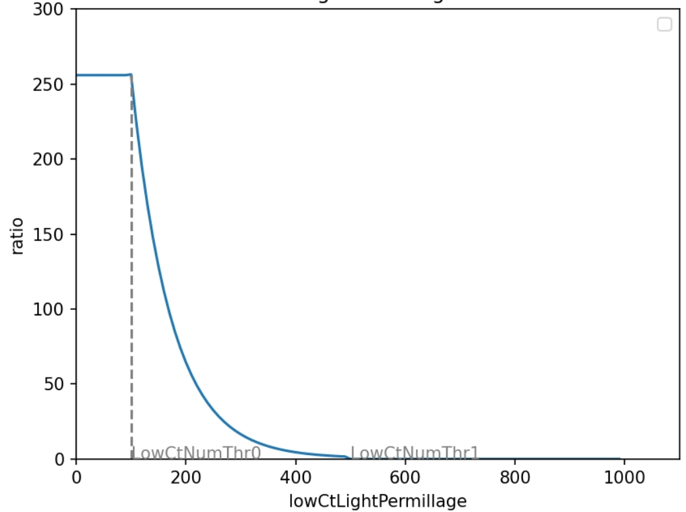

**dayLightPermillage-ratio illustration**


#### Green Zone Control

| Parameter Name      | Description                                                                                  | Suggested Tuning | Special Notes |
|---------------------|----------------------------------------------------------------------------------------------|------------------|---------------|
| m_pRoiBoundG        | Green zone ROI control                                                                       | Yes              |               |
| m_pRoiLumLutHighG   | Upper brightness limit for green zone statistic blocks                                       | Yes              |               |
| m_pRoiLumLutLowG    | Lower brightness limit for green zone statistic blocks                                       | Yes              |               |
| m_bGreenShiftEn     | Green zone ROI enable                                                                        | User setting     |               |
| m_pGreenLumThre     | Weight table for different brightness indices in the green zone                              | Yes              |               |
| m_nGreenShiftMax    | Max weight for green zone: multiplied by exposure shift to get the final shift weight; max 32, fully biased toward outdoor gain | Yes          |               |
| m_pGreenNumThre     | Threshold for green zone statistic blocks count; if the number of blocks in green zone is within this range, green shift is applied | Yes      |               |
| m_pOutdoorGain      | Target WB gain for green zone                                                                | Yes              |               |


#### AWB Frameinfo

| Parameter Name           | Description                                     | Suggested Tuning | Special Notes |
|--------------------------|-------------------------------------------------|------------------|---------------|
| m_bAwbCalStatus          | AWB calculation status                          | -                | Read-only     |
| CurrentResult            | Currently applied white balance gain            | -                | Read-only     |
| CurrentTarget            | Target white balance gain calculated by AWB     | -                | Read-only     |
| m_nSceneLux              | AWB debug parameter, current AE calculated scene illuminance | -   | Read-only     |
| m_nValidBlkNum           | Number of valid statistic blocks                | -                | Read-only     |
| m_nLowCtBlkRatio         | Low color temperature statistic block ratio (per mille) | -        | Read-only     |
| m_pCtLimit               | Current ROI range (X_Max, X_Min, CT_High, CT_Low) | -              | Read-only     |
| m_nDayLightBlkRatio      | Daylight statistic block ratio (per mille)      | -                | Read-only     |
| m_nGreenShiftWeight      | Green zone shift weight                         | -                | Read-only     |
| m_pStatBlkR              | R channel statistics                            | -                | Read-only     |
| m_pStatBlkG              | G channel statistics                            | -                | Read-only     |
| m_pStatBlkB              | B channel statistics                            | -                | Read-only     |
| m_pBlkCtX                | Statistic block horizontal coordinate X         | -                | Read-only     |
| m_pBlkCtY                | Statistic block vertical coordinate Y           | -                | Read-only     |
| m_pBlkRoiId              | ROI of statistic block                          | -                | Read-only     |
| m_pBlkWeight             | Weight of statistic block for white balance calculation | -        | Read-only     |
| m_pDebugBlcokData[23][31] | RGB values of AWB statistic blocks             | -                | Read-only     |


### C3DNRFirmwareFilter Debug Description

C3DNRFirmwareFilter (NR) module is used for 2D and 3D noise reduction.

#### NR Enable

| Parameter Name | Description                     | Suggested Modification      | Special Notes               |
|----------------|---------------------------------|-----------------------------|-----------------------------|
| m_nTnrEb       | 3DNR enable, controls 3DNR only  | User setting               |                             |
| m_pTnr3dYEb    | 3DNR luminance noise reduction enable | Yes, adjustable by Gain/Layer |                     |
| m_pTnr3dUVEb   | 3DNR chrominance noise reduction enable | Yes, adjustable by Gain/Layer |                   |
| m_pTnr2dYEb    | 2DNR luminance noise reduction enable | Yes, adjustable by Gain/Layer |                     |


#### 2D NR Basic Control Parameters

| Parameter Name       | Description     | Suggested Modification | Special Notes               |
|----------------------|-----------------|------------------------|-----------------------------|
| m_pMax_diff_thr      | Maximum luminance reference threshold, effective when Dynamic enable is on                   | No                     |                             |
| m_pSig_gain          | Luminance reference threshold; smaller values cause more areas to be denoised                | Yes                    | Adjustable by Gain/Layer    |
| m_pAback_alpha       | Luminance noise re-addition; larger values re-add more luminance noise                       | Yes                    | Adjustable by Gain/Layer    |
| m_pCnrSig_y          | CNR reference Y threshold; larger values cause more areas to be denoised                     | Yes                    | Adjustable by Gain/Layer    |
| m_pCnrSig_uv         | CNR reference UV threshold; larger values cause more areas to be denoised                    | Yes                    | Adjustable by Gain/Layer    |
| m_pCnrAback_alpha    | Chrominance noise re-addition; larger values re-add more chrominance noise                   | Yes                    | Adjustable by Gain/Layer    |
| m_pCnrSig_uv_shift   | CNR threshold left shift factor (1 means shift left by 1 bit, i.e., multiply by 2)           | Yes                    | Adjustable by Gain/Layer    |
| m_pGainIndex         | Gain index, suggested to keep default value                                                  | No                     |                             |
| m_bDynamic_en        | Adaptive denoise threshold enable; when enabled, luminance denoise ratio is dynamically calculated based on image content | No      |               |
| m_nGlobalYnrStrength | Global luminance noise reduction strength                                                    | Yes                    | Adjustable by Gain/Layer    |
| m_nGlobalCnrStrength | Global chrominance noise reduction strength                                                  | Yes                    | Adjustable by Gain/Layer    |

---

Some parameters adjust according to Gain/Layer, for example, **m_pCnrSig_y**:

- Columns represent gain levels:
  - Column[0] means 1x gain
  - Column[11] means 2048x gain
- Rows represent different layers:
  - Row[0] means parameters for layer 0
  - Row[4] means parameters for layer 4

Higher layers correspond to processing higher frequency regions of the image.

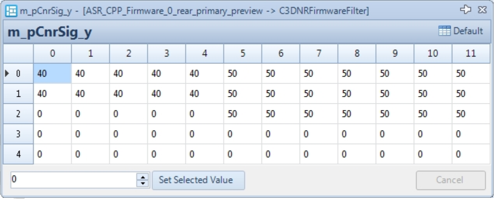


#### 2D NR Luminance Control Parameters

| Parameter Name    | Description                                                                                   | Suggested Modification | Special Notes          |
|-------------------|-----------------------------------------------------------------------------------------------|------------------------|------------------------|
| m_bLuma_en        | YNR (Y noise reduction) enable according to luminance                                         | User setting           |                        |
| m_pLuma_sig       | YNR strength varies with luminance, levels 0-16 correspond to luminance 0-255, divided into 16 | Yes                   | Adjustable by Gain/Luma |
| m_bCnrLuma_en     | CNR (color noise reduction) strength control enable according to luminance                    | User setting           |                         |
| m_pCnrLuma_sig    | CNR strength varies with luminance, levels 0-16 correspond to luminance 0-255, divided into 16 | Yes                   | Adjustable by Gain/Luma |

---

#### 2D NR Radial Noise Reduction Strength Adjustment

| Parameter Name    | Description                                                                                   | Suggested Modification | Special Notes          |
|-------------------|-----------------------------------------------------------------------------------------------|------------------------|------------------------|
| m_bRadial_en      | Enable noise reduction strength adjustment along the radius:   `0`: Disable   `1`: Enable | User setting       |                        |
| m_pRadial_ratio   | Control of noise reduction strength increase along the radius; higher values mean stronger edge noise reduction | Yes  | Adjustable by Gain/Layer |
| m_bCnrRadial_en   | Enable chroma noise reduction strength adjustment along the radius:   `0`: Disable   `1`: Enable | User setting           |               |
| m_pCnrRadial_ratio| Control of chroma noise reduction strength increase along the radius; higher values mean stronger edge chroma noise reduction | Yes               | Adjustable by Gain/Layer |


#### 3D NR Motion Area Detection and Noise Reduction Strength Control

| Parameter Name       | Description                                                                                              | Suggested Modification | Special Notes            |
|----------------------|----------------------------------------------------------------------------------------------------------|------------------------|--------------------------|
| m_pTnrDAvg           | Inter-frame luminance average difference threshold; smaller values make motion detection easier          | Yes                    | Adjustable by Gain/Layer |
| m_pTnrWAvg           | Weight of inter-frame luminance average difference; larger values increase reliance on luminance diff    | Yes                    | Adjustable by Gain/Layer |
| m_pTnrQWeightAvg     | Coefficient for inter-frame luminance average difference; larger values make motion detection easier     | Yes                    | Adjustable by Gain/Layer |
| m_pTnrDSad           | Threshold for sum of absolute inter-frame luminance differences; smaller values make motion detection easier | Yes                | Adjustable by Gain/Layer |
| m_pTnrWSad           | Weight for sum of absolute inter-frame luminance differences; larger values increase reliance on this metric | Yes                | Adjustable by Gain/Layer |
| m_pTnrQWeightSad     | Coefficient for sum of absolute inter-frame luminance differences; larger values make motion detection easier | Yes               | Adjustable by Gain/Layer |
| m_pTnrDuv            | Threshold for inter-frame UV average difference; smaller values make motion detection easier             | Yes                    | Adjustable by Gain/Layer |
| m_pTnrWuv            | Weight for inter-frame UV average difference; larger values increase reliance on UV difference           | Yes                    | Adjustable by Gain/Layer |
| m_pTnrQWeightUV      | Coefficient for inter-frame UV average difference; larger values make motion detection easier            | Yes                    | Adjustable by Gain/Layer |
| m_nTnrLumaBase       | Base luminance difference threshold; smaller values make motion detection easier                         | No                     |                          |
| m_pTnrLuma           | Threshold for luminance-based inter-frame average difference; smaller values make motion detection easier | Yes                   | Adjustable by Gain/Layer |
| m_pTnrYStrengthQ6    | TNR global luminance noise reduction strength; larger values increase luminance noise reduction in static areas | Yes             | Adjustable by Gain/Layer |
| m_pTnrUVStrengthQ6   | TNR global chroma noise reduction strength; larger values increase chroma noise reduction in static areas | Yes                   | Adjustable by Gain/Layer |
| m_pStrongSig_gain    | Reference threshold for luminance noise reduction in motion areas; smaller values increase noise reduction | Yes                  | Adjustable by Gain/Layer |
| m_pStrongAback_alpha | Luminance noise re-addition in motion areas; larger values increase re-added noise                       | Yes                    | Adjustable by Gain/Layer |


#### 3D NR Other Parameters

| Parameter Name       | Description                                               | Suggested Modification | Special Notes |
|----------------------|-----------------------------------------------------------|------------------------|---------------|
| m_nTnrLumaWeight     | Window size used for luminance calculation                | No                     |               |
| m_pTnrBlockWeight0   | Window size for luminance difference calculation in Layer 0 | No                   |               |
| m_pTnrBlockWeight1   | Window size for luminance difference calculation in Layer 1 | No                   |               |
| m_pTnrBlockWeight234 | Window size for luminance difference calculation in Layers 2, 3, and 4 | No        |               |
| m_pTnr2dMappingCurve | Fusion coefficient for noise reduction intensity between motion and still areas: 256 = full weak (still area) noise reduction, 0 = max strong (motion area) weight | No      |          |
| m_p*Ratio            | Reserved                                                  |                        |               |


##### Chromatic Aberration Suppression

The chromatic aberration suppression function is controlled jointly by overexposed points and the hue_pf interval. Color fringes that meet the overexposed points condition and fall within the hue_pf interval will be suppressed.

| Parameter Name    | Description                                                                                      | Suggested Modification | Special Notes           |
|-------------------|--------------------------------------------------------------------------------------------------|------------------------|-------------------------|
| eb                | Color detection switch; when enabled, denoising for skin and blue sky regions is enhanced        | User setting           |                         |
| m_ppf_en          | Purple fringe removal enable:    `0`: Disable     `1`: Enable                                  | User setting           |                         |
| m_nwp_en          | Overexposure area detection enable for purple fringe removal:    `0`: Disable     `1`: Enable  | User setting           |                         |
| m_nwp_th          | Threshold for overexposed pixel determination; higher value means fewer pixels considered overexposed (see Uv_wp_gain - num_wb diagram) | Yes       |                |
| m_nnum_wp_min     | Threshold to start overexposed area effect; purple fringe removal starts when overexposed points exceed this number (see Uv_wp_gain - num_wb diagram) | Yes          |         |
| m_nnum_wp_step    | Controls the transition interval (see Uv_wp_gain - num_wb diagram)                               | Yes                    |                         |
| m_nhue_pf_min     | Lower bound of the purple fringe hue interval (see Uv_pf_gain - hue_pf diagram)                  | Yes                    |                         |
| m_nhue_pf_max     | Upper bound of the purple fringe hue interval (see Uv_pf_gain - hue_pf diagram)                  | Yes                    |                         |
| m_nhue_pf_tr_step | Transition control for the purple fringe hue interval (see Uv_pf_gain - hue_pf diagram)          | Yes                    |                         |
| m_nuv_wp_gain     | Weight of overexposed points; higher value means overexposed points have greater impact on final saturation (see Uv_wp_gain - num_wb diagram) | Yes | Can vary with Gain       |
| m_nuv_pf_gain     | Weight of the purple fringe interval; higher value means greater impact on final saturation (see Uv_pf_gain - hue_pf diagram) | Yes                 | Can vary with Gain       |

---

**Uv_pf_gain – hue_pf Diagram**

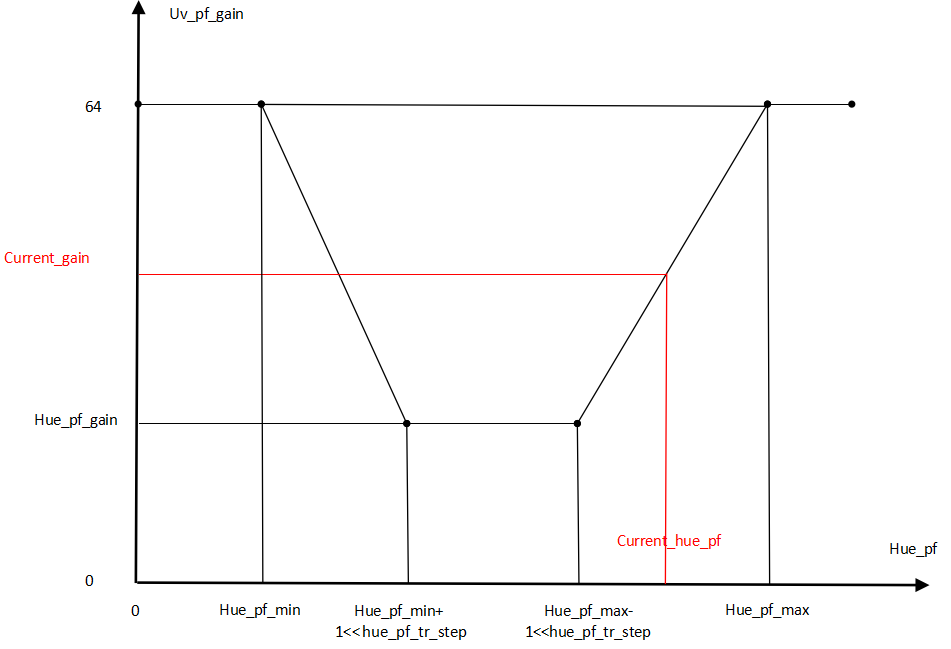

**Uv_wb_gain – num_wp Diagram**

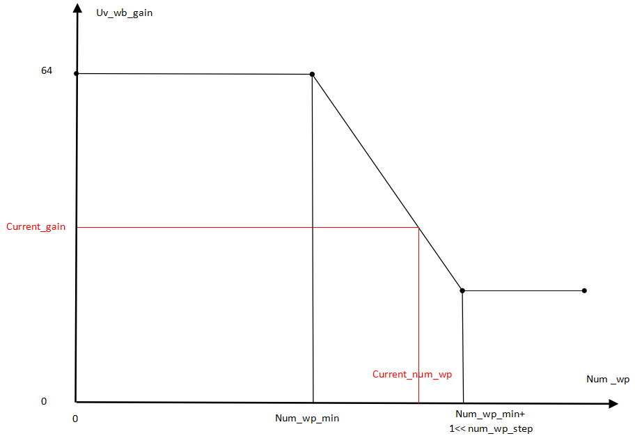

---

### Raw HDR Parameter Description

The Raw_HDR_Soft module controls software HDR processing.

#### Raw HDR Parameters

| Parameter Name   | Description                                                      | Suggested Tuning | Special Notes              |
|------------------|------------------------------------------------------------------|------------------|----------------------------|
| m_nHDRDownSampleEb | Downsampling enable; should be enabled when input image width or height exceeds 8225 pixels | No               |                  |
| m_nINTFlag       | Error handling flag                                              | No               |                            |
| m_pGTMCurveSet   | GTM curve set; 5 sets corresponding to long and short exposure multiples: 1, 4, 16, 64, 256 | No                 |                  |


## File to File

### File to File Function Description

he platform supports hardware simulation called File to File (f2f), which pushes a VRF file into the device, replacing the sensor image data, and obtains the ISP-processed image. This is suitable for single-frame simulation.

### File to File Usage Instructions

1. Connect the device to the PC via USB.
2. Use ADB to push the VRF file to the specified path with the specified filename (different filenames correspond to different tuning parameters):
   - Main camera

     ```
     adb push xxx.vrf vendor/etc/camera/rear_primary_sensor.vrf
     ```

   - 副摄

     ```
     adb push xxx.vrf vendor/etc/camera/rear_secondary_sensor.vrf
     ```

   - 前摄

     ```
     db push xxx.vrf vendor/etc/camera/front_sensor.vrf
     ```

3. Start the camera to see the VRF preview processed by the ISP. You can also capture photos saved as JPG.

## Quick Validation of Tuning Parameters

### Quick Validation Function Description

1. The platform supports quick validation of tuning parameters. Enable the following property:

   ```cpp
   adb shell setprop persist.vendor.camera.enable.settingfile 1
   ```

2. Save the tuning parameters from the Tuning Tool, then push them to the device at the specified path with the specified filename via ADB. Restart the camera for the changes to take effect:
   ```
   adb push xx.data /vendor/etc/camera/tuning_files/
   ```

**Storage Path:**

```cpp
/vendor/etc/camera/tuning_files/
```

**Common File Names:**

```cpp
FlickerSetting.data
front_cpp_nightshot_setting.data // Front Camera
front_cpp_preview_setting.data front_cpp_snapshot_setting.data front_cpp_video_setting.data front_isp_setting.data front_isp_setting_video.data front_nightshot_setting.data rawhdr_default_setting.data rear_primary_cpp_nightshot_setting.data // Main Camera
rear_primary_cpp_preview_setting.data rear_primary_cpp_snapshot_setting.data rear_primary_cpp_video_setting.data rear_primary_isp_setting.data rear_primary_isp_setting_video.data rear_primary_nightshot_setting.data
rear_secondary_cpp_nightshot_setting.data // Rear Secondary Camera
rear_secondary_cpp_preview_setting.data rear_secondary_cpp_snapshot_setting.data rear_secondary_cpp_video_setting.data rear_secondary_isp_setting.data rear_secondary_isp_setting_video.data rear_secondary_nightshot_setting.data
```

## VRF viewer

### VRF Viewer Interface

Click on a VRF file to launch the VRF viewer. The interface is shown below:

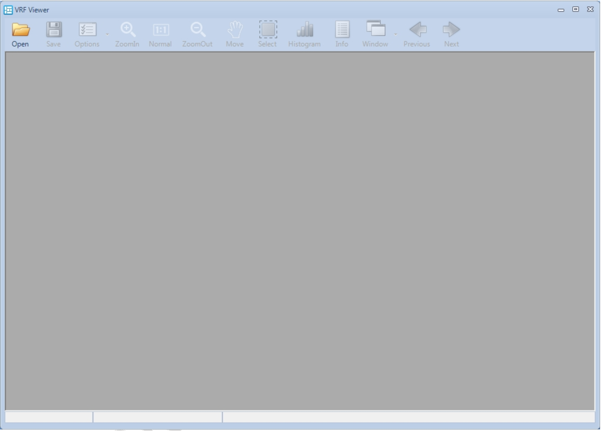

**Menu: Functional Area**

- **Open**: Open an image (supported formats: `*.vrf`, `*.nv12`, `*.nv21`, `*.yuv`, `*.bmp`, `*.jpg`, `*.jpeg`, `*.png`)
- **Save**: Save the image (supported formats: `*.bmp`, `*.jpg`, `*.jpeg`, `*.png`)
- **Options**: Image processing options (click `Apply` to apply options, click `Save` to save current settings)

- Options for VRF images:
  - `Demosaic`: Apply demosaicing
  - `Linearization`: Apply linearization processing
  - `WB`: Apply white balance gains from VRF
  - `Dgain`: Apply digital gain from VRF
  - `Gamma`: Apply sRGB Gamma curve
  - `Split Channel`: Display the four Bayer channels separately

- Options for YUV images:
  - `Color Standard`: Choose BT601 or BT709
  - `Swing`: Set YUV data range (Full range or Standard range)
  - `YUV`: NV12 / NV21 conversion
  - `Gray Image`: Display grayscale image


**Other Function Buttons**

- **ZoomIn**: Zoom in the image
- **Normal**: Display the image at original size
- **ZoomOut**: Zoom out the image
- **Move**: Drag the image to view different areas
- **Select**: Select a region in the image by drawing a rectangle
- **Histogram**: View the brightness and color histograms of the image
- **Info**: Display metadata of the VRF image (e.g., format, resolution, gain)
- **Window**: Switch between opened image windows
- **Previous**: Show the previous image
- **Next**: Show the next image
