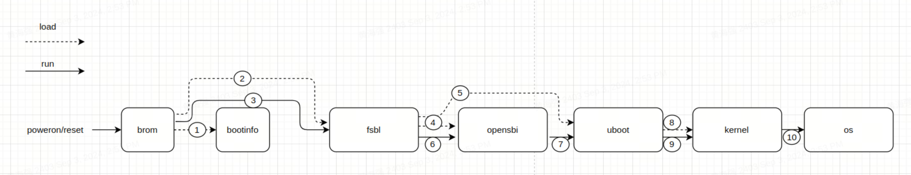
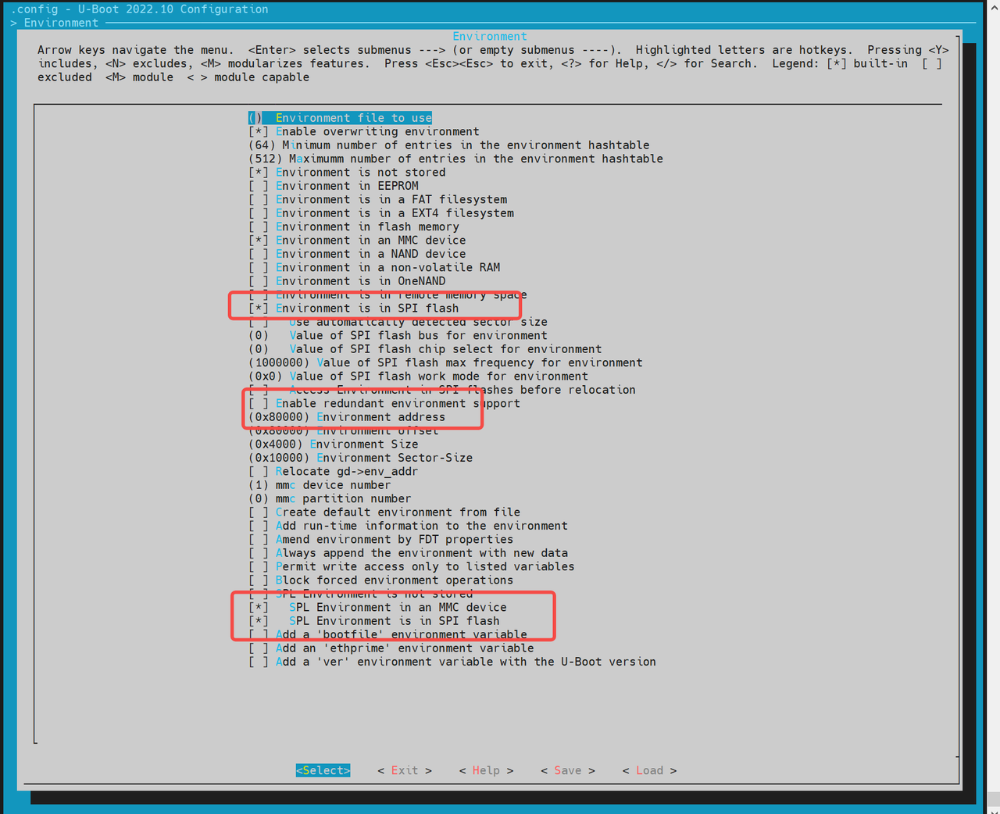
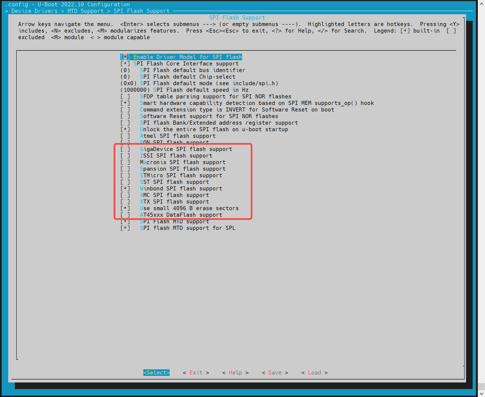
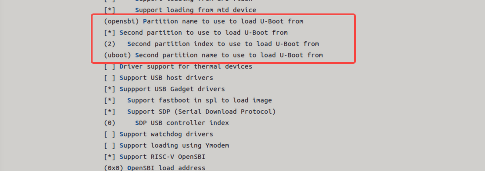
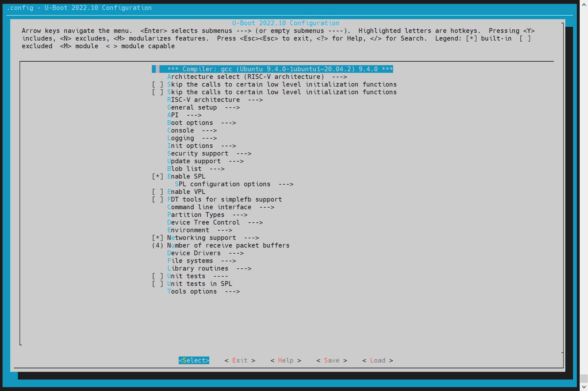
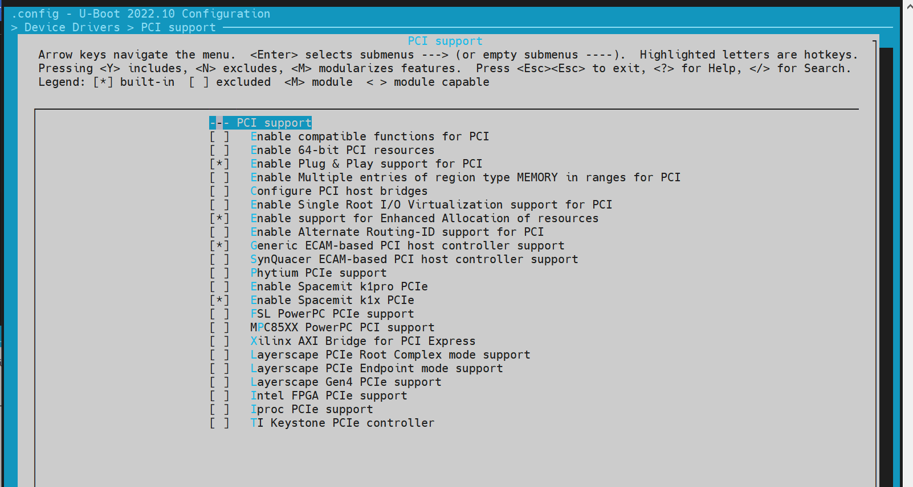
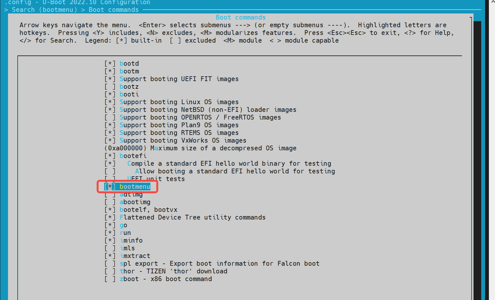

# Boot Development Guide

## Overview

### Purpose

This guide provides a comprehensive introduction to the boot and flashing process for SpacemiT platforms, including methods for custom configuration, as well as techniques for driver development and debugging within U-Boot and OpenSBI. It is designed to help developers quickly master the system boot process and streamline secondary development.

### Scope

This document is applicable to the K1 series SoC (System on Chip) of SpacemiT.

### Relevant Personnel

- Firmware flashing and boot development engineers
- Kernel development engineers

### Document Structure

1. **Boot Process and Configuration** – Describes the system boot mechanism and customization options.
2. **U-Boot / OpenSBI Development & Debugging** – Covers build configurations, driver development, and debugging techniques.
3. **Troubleshooting Guide** – Offers solutions to common issues encountered during development.

## Firmware Flashing and Boot Process

This section introduces configurations and implementation principles related to firmware flashing and booting, along with methods for custom flashing and booting setups.

> **Note:** Flashing and booting are closely connected. Customizing the flashing process may require adjusting the boot settings, and vice versa.

### 2.1 Firmware Layout

The K1 series SoC commonly supports the following **three** firmware layout schemes. Their key characteristics are described below:


1. **eMMC**

   - Consists of a `boot0` area (used to store `bootinfo_emmc.bin` and `FSBL.bin`) and a `user_data_area` managed by a GPT partition table.
   - `bootinfo_emmc.bin` and `FSBL.bin` are stored in the `boot0` area. The `fsbl` partition in the `user_data_area` typically contains no actual data.
   - After power-on, BROM loads `bootinfo_emmc.bin` and `FSBL.bin` from the `boot0` area.

2. **SD Card**

   - Similar to the eMMC layout, but only includes a `user_data_area`.
   - `bootinfo_sd.bin` occupies the first 80 bytes, and the GPT table begins at block 1.

3. **NOR + SSD**

   - Firmware on NOR includes `FSBL`, `OpenSBI`, and `U-Boot`, while, the SSD holds `bootfs` and `rootfs`.
   - Supports combinations like NOR + eMMC by default. If no SSD is inserted, NOR + eMMC can be used by setting the DIP switch to boot from NOR.
   - Only SSDs connected to the PCIe0 interface can be used to boot during flashing. If the SSD is connected to a different PCIe port, it will only work as a storage device, not for booting.
   - When flashing with the **TitanFlasher** tool, the SSD’s partition table may include `FSBL`, `U-Boot`, and `OpenSBI` entries, but these contents will not be used during boot.

### Firmware Flashing Process and Configuration

In this guide,

- **Flashing** and **Burning** mean the same thing — writing a system image to storage.
- **Mass production** is just another way of flashing — except the source image lives on an SD card, and the tool copies it to your device’s internal storage.
- **Card booting** is different: the device actually boots straight from the SD card image instead of copying it anywhere.

#### Firmware Flashing Process

Flashing uses the **Fastboot** protocol to send image files from your PC to the device.
These files are written to the corresponding storage like **MMC**, **MTD**, or **NVMe**.
The full process includes:

- Entering **Fastboot mode** in U-Boot
- Sending image files
- Detecting the storage device
- Creating a **GPT partition table**
- Writing the image data to storage

##### U-Boot Fastboot Mode

In this platform, the firmware flashing communication protocol is based on the fastboot protocol with some custom extensions. Actual firmware flashing operations occur within the **U-Boot's Fastboot mode**.

Once the device enters this mode, you can run `fastboot devices` on your PC to check if the device is detected (make sure Fastboot is set up on your PC):

```sh
~$ fastboot devices
c3bc939586f0         Android Fastboot
```

Below are three methods to enter U-Boot fastboot mode:

**1. Using Buttons on the Board**

- Hold the **FEL** button and press the **RESET** button.
- This puts the board into **BROM-Fastboot mode**, which is only used to load U-Boot.
- On the PC, run the following commands to load U-Boot Fastboot:

```sh
fastboot stage factory/FSBL.bin
fastboot continue
#sleep wait for uboot ready
#On Linux
sleep 1
#On Windows                
#timeout /t 1 >null     
fastboot stage u-boot.itb
fastboot continue
```

**2. Using ADB Command**
If the system is already running, use this command on the PC to reboot into U-Boot Fastboot:

```sh
adb reboot bootloader
```

> Note: Some firmware may not include ADB, so this method won't always work.

**3. Using the Serial Port**
During startup, hold the **S key** via serial connection to enter the **U-Boot shell**, then run:

```sh
fastboot 0
```

The following subsections introduce the different storage setups which may require different flashing commands.
The **BROM** will boot from the selected storage based on **boot pin settings** (e.g., NOR/NAND/eMMC).
Check your hardware reference design for the exact configuration.

##### eMMC Flashing

- **eMMC Flashing Process**
Flashing eMMC follows this basic flow. The first steps are the same as other storage types:
you enter **U-Boot Fastboot mode** via BROM-Fastboot and then begin flashing.

```sh
fastboot stage factory/FSBL.bin
fastboot continue

#sleep to wait for uboot ready
#linux env
sleep 1
#windows env
#timeout /t 1 >null   

fastboot stage u-boot.itb
fastboot continue

fastboot flash gpt partition_universal.json
# This step is still needed, even though bootinfo_emmc.bin content is not used. See FAQ below.
fastboot flash bootinfo factory/bootinfo_emmc.bin
fastboot flash fsbl factory/FSBL.bin
fastboot flash env env.bin
fastboot flash opensbi fw_dynamic.itb
fastboot flash uboot u-boot.itb
fastboot flash bootfs bootfs.img
fastboot flash rootfs rootfs.ext4
```

For EMMC, the content of `bootinfo_emmc.bin` is embedded within the U-Boot code. This is done to ensure compatibility with using the same `partition_universal.json` table for SD card booting, among others. Both `bootinfo_emmc.bin` and `FSBL.bin` are actually written to the EMMC's Boot0 partition.

- EMMC Partition Table Configuration
The partition table is stored in `buildroot-ext/board/spacemit/k1/partition_universal.json`. The bootinfo is not explicitly defined as a partition but is used to store information related to the boot medium.

```sh
{
  "version": "1.0",
  "format": "gpt",
  "partitions": [
    {
      "name": "bootinfo",
      "offset": "0",
      "size": "80B",
      "image": "factory/bootinfo_sd.bin"
    },
    {
      "name": "fsbl",
      "offset": "256K",
      "size": "256K",
      "image": "factory/FSBL.bin"
    },
    {
      "name": "env",
      "offset": "512K",
      "size": "128K"
    },
    {
      "name": "opensbi",
      "offset": "1M",
      "size": "1M",
      "image": "opensbi.itb"
    },
    {
      "name": "uboot",
      "offset": "2M",
      "size": "2M",
      "image": "u-boot.itb"
    },
    {
      "name": "bootfs",
      "offset": "4M",
      "size": "128M",
      "image": "bootfs.img"
    },
    {
      "name": "rootfs",
      "size": "-"
    }
  ]
}
```

##### NOR+BLK Device Flashing

- **NOR+BLK device Flashing process**
The K1 supports flashing and booting from a combination of **NOR Flash** and **block devices** (like SSD or eMMC). It works in an **adaptive** way — if both SSD and eMMC are connected, **SSD will be used as the default flashing target**.

```sh
fastboot stage factory/FSBL.bin
fastboot continue
#sleep wait for uboot ready
#linux env
sleep 1                 
#windows env
#timeout /t 1 >null      
fastboot stage u-boot.itb
fastboot continue

#flashing to spi nor
fastboot flash mtd partition_2M.json
fastboot flash bootinfo factory/bootinfo_spinor.bin
fastboot flash fsbl factory/FSBL.bin
fastboot flash env env.bin
fastboot flash opensbi fw_dynamic.itb
fastboot flash uboot u-boot.itb

#flashing to block device
fastboot flash gpt partition_universal.json
fastboot flash bootfs bootfs.img
fastboot flash rootfs rootfs.ext4
```

- **NOR + BLK Partition Table Configuration**
  - **NOR Flash Partition Table**

    - The NOR partition table is located at:
  `buildroot-ext/board/spacemit/k1/partition_2M.json`

    - For NAND/NOR devices, the partition table is nameed like `partition_xM.json`. Make sure the filename matches your actual flash size, or the system won’t find the correct table.
    - Partition tables are compatible downward — e.g., if NOR is 8MB and only `partition_2M.json` is available, it will be used.

  - **Partition Naming Convention**
    - MTD devices (e.g., NAND/NOR) use names like `partition_2M.json`.
    - BLK devices (eMMC/SD/SSD) all use `partition_universal.json`.

- **Modifying NOR Flash Partition Tables**
  1. Partition offsets and sizes are aligned to 64KB by default (ecorresponding to an erase size of 64 KB)

  2. If the soffset and size need to align with 4 KB, the U-Boot compilation configuration `CONFIG_SPI_FLASH_USE_4K_SECTORS` must be enabled.

```sh
//buildroot-ext/board/spacemit/k1/partition_2M.json
{
  "version": "1.0",
  "format": "mtd",
  "partitions": [
    {
      "name": "bootinfo",
      "offset": "0",
      "size": "128K",
      "image": "factory/bootinfo_spinor.bin"
    },
    {
      "name": "fsbl",
      "offset": "128K",
      "size": "256K",
      "image": "factory/FSBL.bin"
    },
    {
      "name": "env",
      "offset": "384K",
      "size": "64K"
    },
    {
      "name": "opensbi",
      "offset": "448K",
      "size": "192K",
      "image": "fw_dynamic.itb"
    },
    {
      "name": "uboot",
      "offset": "640K",
      "size": "-",
      "image": "u-boot.itb"
    }
  ]
}
```

- **SSD Partition Table**
All block devices (like SSDs and eMMCs) use the same partition table file `partition_universal.json`. In this case, partitions such as `bootinfo`, `fsbl`, `env`, `opensbi`, `uboot`, and the data within them, will not affect normal boot processes.

```sh
//buildroot-ext/board/spacemit/k1/partition_universal.json
{
    "version": "1.0",
    "format": "gpt",
    "partitions": [
        {
            "name": "bootinfo",
            "offset": "0K",
            "size": "512",
            "image": "factory/bootinfo_sd.bin",
            "holes": "{\"(80;512)\"}"
        },
        {
            "name": "fsbl",
            "offset": "128K",
            "size": "256K",
            "image": "factory/FSBL.bin"
        },
        {
            "name": "env",
            "offset":"384K",
            "size": "64K",
            "image": "env.bin"
        },
        {
            "name": "opensbi",
            "size": "384K",
            "image": "fw_dynamic.itb"
        },
        {
            "name": "uboot",
            "size": "2M",
            "image": "u-boot.itb"
        },
        {
            "name": "bootfs",
            "offset": "4M",
            "size": "256M",
            "image": "bootfs.img",
            "compress": "gzip-5"
        },
        {
            "name": "rootfs",
            "offset": "260M",
            "size": "-",
            "image": "rootfs.ext4",
            "compress": "gzip-5"
        }
    ]
}
```

##### NAND Flashing

- **NAND Flashing Process**
The K1 supports NAND flash booting. However, since **NAND and NOR share the same SPI interface**, only one of these schemes can be selected, with the default support being for NOR booting.

For NAND flash booting, please refer to the NAND boot configuration section in the programming boot process to configure NAND booting

```sh
fastboot stage factory/FSBL.bin
fastboot continue
#sleep wait for uboot ready
#linux env
sleep 1       
#windows env          
#timeout /t 1 >null      
fastboot stage u-boot.itb
fastboot continue

fastboot flash mtd partition_64M.json
fastboot flash bootinfo factory/bootinfo_spinand.bin
fastboot flash fsbl factory/FSBL.bin
fastboot flash env env.bin
fastboot flash opensbi fw_dynamic.itb
fastboot flash uboot u-boot.itb

fastboot flash user-bootfs bootfs.img
fastboot flash user-rootfs rootfs.img
```

- **UBIFS Image Creation**
File system management on the NAND relies on UBIFS. The methods for creating the **bootfs** and **rootfs** partitions are as follows:

```sh
#Creating bootfs.img
mkfs.ubifs -F -m 2048 -e 124KiB -c 8124 -x zlib -o output/bootfs.img -d input_bootfs/

#Creating rootfs.img
mkfs.ubifs -F -m 2048 -e 124KiB -c 8124 -x zlib -o output/rootfs.img -d input_rootfs/

#input_bootfs and input_rootfs should contain the files to be included in the bootfs and rootfs partitions, respectively.
# For example, for bootfs, include the following files: Image.itb, env_k1-x.txt, bianbu.bmp

#Different NANDs require modification of the corresponding parameters; here are some parameter descriptions:
-m 2048：Sets the minimum input/output unit size to 2048 bytes (2 KiB), which should match the page size of the NAND Flash.
-e 124KiB：Sets the logical erase block size to 124 KiB (kilobytes), which should be smaller than the actual physical erase block size to leave space for UBI management structures.
-c 8124：Sets the maximum number of logical erase blocks to 8124, which limits the maximum size of the filesystem based on the size and number of logical erase blocks.
-x zlib: Sets the compression type to zlib, which will compress the data in the filesystem using zlib.
-o output/ubifs.img: Specifies the output file name, saving the generated UBIFS filesystem image as output/ubifs.img.
-d input/: Specifies the source directory as input/, where mkfs.ubifs will create a UBIFS filesystem image from the files and directory structure in this directory.
```

- **NAND + Block Device Boot**
K1 also supports booting with a combination of **NAND and a block device** (e.g., SSD or eMMC). The flashing process is similar to the **NOR+BLK configuration**.

- **NAND Partition Table Example**
Below is an example of a 64MB partition layout for NAND (`partition_64M.json`):

```sh
//buildroot-ext/board/spacemit/k1/partition_64M.json
{
  "version": "1.0",
  "format": "mtd",
  "partitions": [
    {
      "name": "bootinfo",
      "comment": "private partition, should not overrided it",
      "offset": "0",
      "size": "128K",
      "image": "factory/bootinfo_spinand.bin"
    },
    {
      "name": "fsbl",
      "offset": "128K",
      "size": "256K",
      "image": "factory/FSBL.bin"
    },
    {
      "name": "env",
      "offset": "384K",
      "size": "128K"
    },
    {
      "name": "opensbi",
      "offset": "640K",
      "size": "384K",
      "image": "opensbi.itb"
    },
    {
      "name": "uboot",
      "offset": "1M",
      "size": "2M",
      "image": "u-boot.itb"
    },
    {
      "name": "user",
      "offset": "3M",
      "size": "-",
             "volume_images": {"bootfs": "bootfs.img", "rootfs": "rootfs.img"}
    }
  ]
}
```

##### Card Booting

Card booting refers to writing the image to an **SD card**. When the device is powered on with the SD card inserted, the system will **attempts to boot from the card first**.

The K1 platform supports card booting and defaults to first attempting to boot from the SD card. If SD boot fails, the system will fall back to another boot source as selected by the **boot pin** configuration.

> **Note:** The platform **does not support flashing SD cards via the Fastboot protocol**.

To prepare an SD card for booting, use the **TitanFlash** tool or the `dd` command.

**How to Create a Bootable SD Card (with TitanFlash)**

1. Insert a TF (microSD) card into a card reader and connect it to your PC.
2. Open the **TitanFlash** utility on your computer (installation guide: [TitanFlash Installation](https://developer.spacemit.com/documentation?token=P9EKwYIkti4EOOkvsgTcb9W3nUb)).
3. In the top menu, go to **Dev Tools → SDCard Boot Disk**.
4. Choose the **Boot Card** and select the **flashing package**.
   
5. Click **Start** to begin flashing.
6. Once done, insert the SD card into your device. Power it on to boot from the card.

##### Card Mass Production

**Card Mass Production** refers to preparing an **SD card with flashing images**, so that when the device powers on:

- It **boots from the SD card** first.
- If **mass production mode** is detected, the system will **automatically write the images from the card to the selected onboard storage** (eMMC, NOR, NAND, etc.), based on the partition table.

The **K1 supports this process**. Using the **TitanFlash tool**, you can create a mass production SD card. Once the card is inserted and the device is powered on, the system will detect it and **automatically flash the internal storage** without user interaction.

**How to Create a Mass Production SD Card**

1. Insert the TF card into a card reader and connect it to the computer's USB port.
2. Open the TitanFlash tool, and navigate to **Factory Tools → MP SDcard Programming**
3. Select the desired flashing package, then click **Start** to write it.
   
4. After the mass production card has been created, insert the SD card into the device.
5. Power on the device. It will automatically boot from the SD card and flash the internal storage according to the partition table.
6. After flashing is complete, **remove the SD card** to prevent re-flashing on the next power-up.

#### Flashing Tools

This section gives a brief introduction to the available flashing tools and how to use them.

##### Usage of Flashing Tools

The platform supports **two main methods** for flashing firmware images:

- **TitanFlash Tool**
  Designed for general developers, TitanFlash offers a **full-featured, user-friendly GUI** for flashing complete image packages.
  For installation and usage, refer to the official documentation:
  [TitanFlash User Guide](https://developer.spacemit.com/documentation?token=B9JCwRM7RiBapHku6NfcPCstnqh)

- **Fastboot Tool**
  Intended for advanced users who are comfortable with command-line tools.
  It’s best for flashing individual image partitions.
  **Note:** Incorrect usage (e.g. flashing the wrong partition) may cause boot failures. Proceed with caution.
  Flashing steps are covered in the **Flashing Process** section of this document.
  Fastboot installation guides:
  - [Guide 1](https://www.jb51.net/article/271550.htm)
  - [Guide 2](https://blog.csdn.net/qq_34459334/article/details/140128714)

> For information on how to build the firmware image, see: [Download and Build](https://bianbu-linux.spacemit.com/en/source)

##### Boot Media Selection

- The hardware platform supports boot media selection via the **Boot Download Sel Switch** (DIP switch).
  For how to use this switch, refer to the [Boot Download Sel & JTAG Sel](https://developer.spacemit.com/documentation?token=HeDkwc7vhifW9UkyDMdc86iwnbb#4.3.2-boot-download-selection-configuration-circuit) section in the MUSE Pi user guide.

- For other boards or custom solutions, please refer to their respective hardware manuals.

- The flashing process supports **auto-detection and adapts to the selected boot media**.

### Boot Configuration

This section explains how to configure booting from different storage devices such as **eMMC, SD, NOR, and NAND**, and highlights important considerations when customizing boot settings.
To successfully boot the system, both the **flashing process** and the **boot configuration** (like partition tables and image offsets) must be correctly set.

#### Boot Process

This section outlines the platform’s boot process which follows a multi-stage sequence:

**BROM → FSBL → OpenSBI → U-Boot → Kernel**

The `bootinfo` data provides key details for the FSBL, such as its offset, size, and signature.



At power-on, the system uses the **Boot Pin Select configuration** to decide which storage device (e.g., SD card, eMMC, NOR) to boot from.

> **Note:** The overall boot sequence remains the same regardless of the boot medium.

For more about the boot pin settings, refer to the **Boot Media Selection** section under **Flashing Tools**.

Upon power-on K1, the boot priority is as follows:

1. **Try to boot from the SD card first.**
2. If SD boot fails, the system will fall back to other boot media (eMMC, NAND, or NOR), according to the Boot Pin Select settings. It will attempt to load `OpenSBI` and `U-Boot` from the selected device.

The following subsections will explain the configuration details for each boot stage component:

- `bootinfo`
- `fsbl`
- `opensbi`
- `uboot`
- `kernel`

##### BROM (Boot ROM)

BROM is the boot code built into the SoC at the factory — it cannot be changed.
It runs automatically when the chip powers up or resets.

Based on the **Boot Pin** settings, BROM detects the selected boot device (e.g., SD, eMMC, NOR) and loads the `bootinfo` and `fsbl` from that storage.

> For details on how to set Boot Pins, see **Boot Media Selection** in the **Flashing Tools** section.

##### 2.3.1.2 bootinfo

After BROM starts, it reads `bootinfo` from offset **0 of the selected storage device**.
For example, on eMMC, it reads from the start of the **boot0 partition**.

`bootinfo` contains metadata about the **FSBL** and **FSBL1** — including their offsets, sizes, and checksums.

The FSBL locations for each storage type are defined in JSON files:

```sh
uboot-2022.10$ ls board/spacemit/k1-x/configs/
bootinfo_emmc.json  bootinfo_sd.json  bootinfo_spinand.json  bootinfo_spinor.json
```

Each file specifies the default locations of `fsbl` and `fsbl1` (a backup copy).
You can adjust the offsets by editing these `.json` files and recompiling U-Boot.
> If you're customizing FSBL positions, ensure they align with the requirements of the storage type.
> For example:
>
> - NAND needs sector alignment
> - eMMC only supports FSBL loading from the **boot partition**

**Default Offset Examples**

```sh
emmc:boot0:0x200, boot1:0x0
sd:0x20000/0x80000
nor:0x20000/0x70000
nand:0x20000/0x80000
```

**bootinfo Output Files**
When compiling U-Boot, the corresponding bootinfo image files (i.e. `*.bin` files) are generated in the root directory:

```sh
uboot-2022.10$ ls -l
bootinfo_emmc.bin
bootinfo_sd.bin
bootinfo_spinand.bin
bootinfo_spinor.bin
```

The generation logic is in:
`uboot-2022.10/board/spacemit/k1-x/config.mk`

##### FSBL (First Stage Boot Loader)

After BROM reads `bootinfo`, it loads the **FSBL** from the specified offset.

The FSBL is made up of:

- A **4 KB header**, which includes essential information for uboot-spl like CRC checksums, and
- The actual `uboot-spl.bin` binary (U-Boot SPL = Secondary Program Loader).

**What FSBL Does:**

1. **Initializes DDR memory**
2. **Loads OpenSBI and U-Boot** into their designated locations in memory, using information from the partition table.
3. **Runs OpenSBI**, which then
4. **Starts U-Boot**

> Note: How FSBL performs DDR initialization will not be covered in this section.

##### Booting with OpenSBI and U-Boot

Different storage media support various ways to load OpenSBI and U-Boot. The following subsections describe how SPL loads and starts OpenSBI and U-Boot for each type of storage device (eMMC, SD, NOR, NAND).

K1 supports two main ways to load **OpenSBI** and **U-Boot** during the boot process:

1. **Separate partitions** for `opensbi` and `uboot` (default)
2. A **combined image** (`uboot-opensbi.itb`)

> The default behavior is to load from partition names. For combined image booting, refer to the FAQ section below: *“Combined loading of U-Boot and OpenSBI.”*

###### eMMC and SD Card Boot

**Both eMMC and SD use the MMC driver**, and U-Boot determines which to boot from based on the Boot Pin Select configuration. The startup configurations for both are similar.

**OpenSBI and U-Boot can be stored in various formats** depending on the boot method, including raw partitions, files within a filesystem, or a single FIT (Flattened Image Tree) image.

By default, on K1, the system **attempts to boot from the SD card first**. If that fails, it falls back to other available media (eMMC, NOR, or NAND).

The **SPL device tree source (DTS)** needs to be configured to enable support for eMMC and SD. Example:

```sh
//uboot-2022.10/arch/riscv/dts/k1-x_spl.dts
        /* eMMC */
        sdh@d4281000 {
                bus-width = <8>;
                non-removable;
                mmc-hs400-1_8v;
                mmc-hs400-enhanced-strobe;
                sdh-phy-module = <1>;
                status = "okay";
                u-boot,dm-spl;
        };
        
        /* sd */
      sdh@d4280000 {
          pinctrl-names = "default";
          pinctrl-0 = <&pinctrl_mmc1 &gpio80_pmx_func0>;
          bus-width = <4>;
          cap-sd-highspeed;
          sdh-phy-module = <0>;
          status = "okay";
          u-boot,dm-spl;
      };
```

The following introduces different boot methods for eMMC/SD, with a default approach of loading by **partition name**.

1. **Raw Partition Mode**
   The FSBL loads U-Boot and OpenSBI from named partitions. Here, we use **eMMC as an example** (SD and NOR are similar and not repeated here).
   - Run `make uboot_menuconfig` to enter the **SPL configuration interface**.

     

   - Select loading via the partition table. Here, separate loading of U-Boot/OpenSBI is supported by default. SPL will first look for partitions named `opensbi` and `uboot`. If they’re missing, it falls back to loading raw images from partition index 1 and 2 respectively.

     

     

   - After SPL successfully loads OpenSBI and U-Boot, it starts OpenSBI and passes the memory address of U-Boot along with the DTB (Device Tree Blob) information. OpenSBI then boots U-Boot according to the provided address and DTB.

2. **Fixed Offset Mode**
   This method loads the image directly from a **fixed offset** on the eMMC.

   - When enabled, SPL reads a single image—containing both OpenSBI and U-Boot from the configured offset.

     > **Note:** This mode **does not support separate loading** of OpenSBI and U-Boot. They must be packaged into a **single FIT image**.
  
   - If separate loading is needed, refer to the source: `uboot-2022.10/common/spl/spl_mmc.c` under `MMCSD_MODE_RAW`.

      

3. **Filesystem Mode**
   This method allows SPL to load boot images from a **filesystem** (typically FAT).

   - U-Boot SPL can load OpenSBI and U-Boot separately as files from the filesystem (e.g., `opensbi.itb`, `uboot.itb`).

   - Run `make menuconfig`, enable the required SPL options, and turn on FAT filesystem support.

     

###### NOR Boot

K1 supports booting from **NOR flash**. Typical boot combinations include:

- **NOR (u-boot-spl / u-boot / OpenSBI) + SSD (bootfs / rootfs)**
- **NOR (u-boot-spl / u-boot / OpenSBI) + eMMC (bootfs / rootfs)**

By default, the system **attempts to boot from SSD first**. If unsuccessful, it falls back to alternative configurations.

The DTS (Device Tree Source) configuration for SPL is as follows:

```sh
//uboot-2022.10/arch/riscv/dts/k1-x_spl.dts
        spi@d420c000 {
                status = "okay";
                pinctrl-names = "default";
                pinctrl-0 = <&pinctrl_qspi>;
                u-boot,dm-spl;

                spi-max-frequency = <15140000>;
                flash@0 {
                        compatible = "jedec,spi-nor";
                        reg = <0>;
                        spi-max-frequency = <26500000>;

                        m25p,fast-read;
                        broken-flash-reset;
                        u-boot,dm-spl;
                        status = "okay";
                };
        };
```

NOR Boot Setup (Loading via SPL)
> The following options are **enabled by default**, however, you can verify or modify them by using `menuconfig`.

1. Run `make uboot_menuconfig`, and then navigate to `SPL configuration options`.

   

2. Enable the Following Options:
   Ensure the following are enabled:

   - `Support MTD drivers`
   - `Support SPI DM drivers in SPL`
   - `Support SPI drivers`
   - `Support SPI flash drivers`
   - `Support for SPI flash MTD drivers in SPL`
   - `Support loading from mtd device`
   - Ensure that the `Partition name to use to load U-Boot from` matches the partition names in the partition table.
   

3. Enable Block Device Support (SSD / eMMC)
   Navigate to `Device Drivers → Fastboot support`
   Enable:
   - `Support blk device`
   - Select appropriate device type: NVMe (for SSD) or MMC (for eMMC)

   

4. Enable MTD Environment (env) Support
   SPL uses the environment (env) to locate MTD partition information.

   Steps:
   - Go to the `Environment` configuration section.
   - Enable **SPI env loading**.
   - Set the env offset (must match the partition table), e.g.`0x80000`

     

     

5. Configure SPI Flash Driver (Based on Hardware)
   If the default build does not include your flash chip’s driver:

   - Run `make uboot_menuconfig`
   - Navigate to `Device Drivers → MTD Support → SPI Flash Support`
   - Enable the driver matching your SPI NOR Flash vendor.
   

   If the required driver is not listed, manually add it in the source:

   ```sh
   //uboot-2022.10/drivers/mtd/spi/spi-nor-ids.c
   const struct flash_info spi_nor_ids[] = {
     { INFO("flash_name",    0x1f4501, 0, 64 * 1024,  16, SECT_4K) },
   ```

   - `flash_name`: Custom name for your chip
   - `0x1f4501`: JEDEC ID for the target flash
   - Remaining fields depend on your chip’s specs (sector size, number of sectors, etc.)

There are mainly two loading methods, they are:

- **Partition-Based Loading (Recommended)**
  For NOR devices, SPL loads `opensbi` and `u-boot` based on names defined in the **MTD partition table**. Configuation can be followed as:

  

- **Fixed Offset Loading**
  SPL can also load a boot image from a **hardcoded offset** in NOR flash.
  > **Notes:**
  > - This method **does not support loading OpenSBI and U-Boot separately**.
  > - You **must** package them into a **single FIT image**.

  Enable fixed offset loading and specify the offset:

  

###### NAND Boot

K1 platform supports booting from **NAND flash**. Two main configurations are available:

- **NAND (u-boot-spl / U-Boot / OpenSBI) + SSD (bootfs / rootfs)**
- **Full NAND (u-boot-spl / U-Boot / OpenSBI / kernel)**

> By default, **NAND boot is disabled**.

The **SPL-DTS configuration** is as follows:

```sh
//uboot-2022.10/arch/riscv/dts/k1-x_spl.dts
        spi@d420c000 {
                status = "okay";
                pinctrl-names = "default";
                pinctrl-0 = <&pinctrl_qspi>;
                u-boot,dm-spl;

                spi-max-frequency = <15140000>;
                spi-nand@0 {
                       compatible = "spi-nand";
                       reg = <0>;
                       spi-tx-bus-width = <1>;
                       spi-rx-bus-width = <1>;
                       spi-max-frequency = <6250000>;
                       u-boot,dm-spl;
                       status = "okay";
               };
        };
```

**Full NAND boot configuration steps** are showing below:

1. **Enable SPL Build Options**

   - Run `make uboot_menuconfig` and navigate to `SPL configuration options` and enable the following:
   
     - `Support MTD drivers`
     - `Support SPI DM drivers in SPL`
     - `Support SPI drivers`
     - `Use standard NAND driver`
     - `Support simple NAND drivers in SPL`
     - `Support loading from mtd device`
     - `Partition name to use to load U-Boot from`should match the partition names in the partition table.

   - If you are loading OpenSBI and U-Boot **separately**, also enable:

     - `Second partition to use to load U-Boot from`
     - Ensure the load sequence is: **OpenSBI first, then U-Boot**.

     

2. Configure Environment (env) Support

   MTD(Memory Technology Device))-based systems require the env subsystem to retrieve MTD partition information after SPL (Secondary Program Loader) startup.

   - Run:

     ```bash
     make uboot_menuconfig
     ```

   - Navigate to `Environment` configuration.
   - Enable support for loading env from SPI.
   - Set env offset to `0x80000` (must match partition table).

The NAND flash driver needs to be adapted to the corresponding model of the SPI flash used on the hardware. The currently supported NAND flash drivers are listed below. If there is no corresponding driver, you can add the manufacturer's JEDEC ID (Joint Electron Devices Engineering Council ID) in the other.c driver.

3. Add or Modify NAND Flash Drivers

   - Ensure your build includes the correct SPI NAND driver matching your actual flash chip. Currently supported vendors include:

```sh
~/uboot-2022.10$ ls drivers/mtd/nand/spi/*.c
uboot-2022.10/drivers/mtd/nand/spi/core.c
uboot-2022.10/drivers/mtd/nand/spi/micron.c
uboot-2022.10/drivers/mtd/nand/spi/winbond.c
uboot-2022.10/drivers/mtd/nand/spi/gigadevice.c
uboot-2022.10/drivers/mtd/nand/spi/other.c
uboot-2022.10/drivers/mtd/nand/spi/macronix.c
uboot-2022.10/drivers/mtd/nand/spi/toshiba.c
```

- If the chip isn’t listed, add support manually in the `other.c` source file by defining the **JEDEC ID**.
   Example: Adding support for FORESEE or Dosilicon:

```c
//uboot-2022.10/drivers/mtd/nand/spi/other.c
 static int other_spinand_detect(struct spinand_device *spinand)
 {
     u8 *id = spinand->id.data;
     int ret = 0;

     /*
      * dosilicon nand flash
      */
     if (id[1] == 0xe5)
        ret = spinand_match_and_init(spinand, dosilicon_spinand_table,
                     ARRAY_SIZE(dosilicon_spinand_table),
                     id[2]);

     /*FORESEE nand flash*/
     if (id[1] == 0xcd)
        ret = spinand_match_and_init(spinand, foresee_spinand_table,
                     ARRAY_SIZE(foresee_spinand_table),
                     id[2]);
     if (ret)
         return ret;

     return 1;
 }
```

##### Kernel Boot

After the system enters **U-Boot**, it automatically loads and boots the Linux kernel based on configuration in the `env` file. Developers can customize the boot behavior as needed.

> **Note:** The file `k1-x_env.txt` takes precedence over `env.bin` — any overlapping variables in `env.bin` will be overridden.

**Kernel Boot Flow**

Once FSBL (First Stage Boot Loader) loads and boots OpenSBI, then hands off to U-Boot, the following occurs:

U-Boot executes a defined boot command to load the `kernel`, `dtb`, and other image files from either a **FAT** or **EXT4** file system into memory. It then runs the `bootm` command to boot the kernel.

All related configurations are located in:

```sh
uboot-2022.10/board/spacemit/k1-x/k1-x.env
```

This file includes multiple pre-configured boot flows (eMMC/SD/NOR+BLK, etc.), and U-Boot will auto-detect the appropriate flow based on the active boot device.

**Boot Command Examples**

1. **MMC Boot** (for SD or eMMC)
   For both **SD** and **eMMC**, the boot flow is handled via `mmc_boot`.

```sh
//uboot-2022.10/board/spacemit/k1-x/k1-x.env
run mmc_boot;

mmc_boot=echo "Try to boot from ${bootfs_devname}${boot_devnum} ..."; \
          run commonargs; \
          run set_mmc_root; \
          run set_mmc_args; \
          run detect_dtb; \
          run loadknl; \
          run loaddtb; \
          run loadramdisk; \
          bootm ${kernel_addr_r} ${ramdisk_combo} ${dtb_addr};
```

The `rootfs` is passed from U-Boot to the kernel via `bootargs`. The kernel or its `init` script uses this to mount the correct root partition.

In below example, `root=/dev/mmcblk2p6` indicates the partition for the rootfs.

```sh
bootargs=earlycon=sbi earlyprintk console=tty1 console=ttyS0,115200 loglevel=8 clk_ignore_unused swiotlb=65536 rdinit=/init root=/dev/mmcblk2p6 rootwait rootfstype=ext4
```

2. **NOR + Block Device Boot** (e.g., NOR + SSD)

```sh
//uboot-2022.10/board/spacemit/k1-x/k1-x.env
run nor_boot;

nor_boot=echo "Try to boot from ${bootfs_devname}${boot_devnum} ..."; \
         run commonargs; \
         run set_nor_root; \
         run set_nor_args; \
         run detect_dtb; \
         run loadknl; \
         run loaddtb; \
         run loadramdisk; \
         bootm ${kernel_addr_r} ${ramdisk_combo} ${dtb_addr};
```

3. **NAND Boot**

```sh
//uboot-2022.10/board/spacemit/k1-x/k1-x.env
run nand_boot;

//to be adapted
```

### Secure Boot

Secure boot is implemented using the **FIT (Flattened Image Tree)** image format. The general workflow is:

1. Package **OpenSBI**, `u-boot.itb`, and the **Linux Kernel** into a single FIT image;
2. Enable secure boot configuration in source code;
3. Sign the FIT image using a **private key**, and embed the **public key** into the DTS/DTB file for verification during the next-stage boot.

#### Verification Flow

The secure boot process follows this verification chain:


**Signing and Verification Details:**

- **BootROM** serves as the root of trust (RoT), embedded in hardware and immutable;
- The **hash of the ROTPK (Root of Trust Public Key)** must be programmed into Efuse, and can only be burned once;
- **Hash algorithm:** `SHA256`
- **Signature algorithm:** `SHA256 + RSA2048`

#### Configuration

- U-Boot compilation configuration:

```sh
CONFIG_FIT_SIGNATURE=y
CONFIG_SPL_FIT_SIGNATURE=y

CONFIG_SHA256=y
CONFIG_SPL_SHA256=y

CONFIG_RSA=y
CONFIG_SPL_RSA=y
CONFIG_SPL_RSA_VERIFY=y
CONFIG_RSA_VERIFY=y
```

- OpenSBI compilation configuration:

```sh
CONFIG_FIT_SIGNATURE=y
```

- Kernel compilation configuration:

```sh
CONFIG_FIT_SIGNATURE=y
```

#### Public and Private Keys Generation

Use `openssl` to generate RSA key pairs. The **private key must be securely stored**, and only the **certificate/public key** should be embedded or distributed.

```sh
# build private key without password
openssl genrsa -out prv-rsa.key 2048
# private key parse:
openssl rsa -in prv-rsa.key -text -noout

# build certificate that expired after 365 days
openssl req -batch -new -x509 -days 365 -key prv-rsa.key -out rsa.crt
# certificate parse:
openssl x509 -in rsa.crt -text -noout

# build public key from private key:
openssl rsa -in prv-rsa.key -pubout -out pub-rsa.key
# public key parse:
openssl rsa -in pub-rsa.key -pubin -noout -text
```

#### Image Signing

1. Modify the ITS script to enable hash and signature configurations.

```sh
/dts-v1/;

/ {
        description = "Configuration to load OpenSBI before U-Boot";
        #address-cells = <2>;
        fit,fdt-list = "of-list";

        images {
                opensbi {
                        description = "OpenSBI fw_dynamic Firmware";
                        type = "firmware";
                        os = "opensbi";
                        arch = "riscv";
                        compression = "none";
                        load = <0x0 0x0>;
                        entry = <0x0 0x0>;
                        data = /incbin/("./fw_dynamic.bin");
                        hash-1 {
                                algo = "sha256";
                        };
                };
        };
        configurations {
                default = "config_1";

                config_1 {
                        description = "opensbi FIT config";
                        firmware = "opensbi";
                        signature {
                                algo = "sha256,rsa2048";
                                key-name-hint = "uboot_key_prv";
                                sign-images = "firmware";
                        };
                };
        };
};
```

2. Using a private key and certificate, sign the FIT image file.

```sh
# build empty dtb file, for next stage public key file output
printf "/dts-v1/;\n/ {\n};" > pubkey.dts
dtc -I dts -O dtb -o pubkey.dtb pubkey.dts

# build fit image
# input: fit script, folder contain private key and certification
# output: fit image, dtb that contain public key info
mkimage -f uboot_fdt_sign.its -K pubkey.dtb -k key -r u-boot.itb

# parse dtb file that public key info
fdtdump -s pubkey.dtb
```

3. Update the public key information to the parent bootloader code.
For example, update the public key information corresponding to the private key used for U-Boot signing to the FSBL DTS.

```sh
/ {
        signature {
                key-uboot_key_prv {
                        required = "conf";
                        algo = "sha256,rsa2048";
                        rsa,r-squared = <0x5353bc86 0x7070d595 0xe2ea6280 0xb9887ae1 0xf69bb145 0x161e6675 0x6f9d37dc 0x29646b18 0x0ecc66d1 0x0ef7fa25 0xddc925cf 0xf068e5e4 0x78e5b40b 0x124095c6 0x1282d13c 0x1bdf09d0 0x7ddf7bf4 0xb4e61d0b 0x8d68f15d 0xb77282df 0xb0b371d8 0xd887288d 0x6c2ee06e 0x4124c030 0xbcdb8688 0x13a6ea0a 0xbb8dc9d1 0xd4b8a0fd 0x141c1e45 0x91c77190 0xf2685d1e 0xa44e33eb 0x38a90bdf 0x671b076b 0x0efb5223 0x72762fd2 0xcbf35219 0x833553c7 0x91382847 0xa3806134 0xb785d6f6 0x64ba98d7 0x4f01bc2e 0x78e320dc 0x9233332c 0x8be5ebec 0x60605d78 0xd5e5741c 0x2980546e 0x6332d458 0x73023036 0xb5e64449 0xc3f81911 0xc7d57cad 0xf17d98b1 0x139801a2 0x778632bd 0xfc15d9ca 0x4f5fc152 0xa49e2b4f 0x6f09a6b5 0xecd52030 0x19022428 0x5907c874>;
                        rsa,modulus = <0xaa282eab 0xc7d0a288 0x5eee2ea1 0xd7d11bc5 0xaf57d029 0x4ad6c85f 0xedc802b1 0x227775cc 0x0d57d3de 0xc8e6113c 0xd3c238fd 0x03eecd4c 0x6983e4e0 0xd71eba6b 0xcdcc3c7f 0x6f602163 0x71e25d7e 0xd3ade9b9 0x25c9b950 0x4bf4d0a5 0xa067ca9c 0x64397ed2 0xd07dfa01 0x29102b9c 0x6008c40e 0xc55cc431 0xf3422d16 0xb8ade9d2 0xa8e5d3d1 0x40aca443 0x91603617 0x4159c91f 0xa10e3ef9 0xa21c40c7 0x377dfcc6 0xd831b829 0xd645d1b1 0xb04c534e 0xfd3352ef 0xdfe19a7d 0xf90c4295 0x7e753266 0x398ade75 0x85427a33 0x79412712 0x5dcd236d 0x015d8fb6 0xdde963ad 0xb8730cf5 0x45fc281b 0x1e40a1de 0xcd1d2af6 0x45ce6740 0x42e1e705 0x274af16a 0x50a66381 0xbb815c44 0x5222fe56 0x826e4475 0xd2193598 0x967573fd 0xc814bed6 0x95db8fae 0xe519808f>;
                        rsa,exponent = <0x00000000 0x00010001>;
                        rsa,n0-inverse = <0xfba86191>;
                        rsa,num-bits = <0x00000800>;
                        key-name-hint = "uboot_key_prv";
                };
        };
};
```

## U-Boot Features and Configuration

This section introduces the key features of U-Boot and common configuration methods used in development.

### 3.1  Functions

The main functions of U-Boot are:

- **Loading the Boot Kernel**
  Loads the Linux kernel image from storage devices (eMMC / SD / NAND / NOR / SSD, etc.) into a designated memory address and initiates kernel execution.

- **Fastboot Flashing Support**
  Enables image flashing to designated partitions via the `fastboot` tool.

- **Boot Logo Display**
  Shows a boot logo and boot menu during the U-Boot boot phase.

- **Driver Debugging**
  U-Boot provides a shell interface for testing hardware drivers including MMC, SPI, NAND, NOR, NVMe, etc. All drivers are located under the `drivers/` directory of the U-Boot source tree.

### 3.2 Compilation

This section describes how to compile U-Boot images from the codebase.

- **Build Configuration**
  
  Before the first build or when switching target boards or configurations, set the appropriate defconfig (example for K1):

  ```shell
  cd ~/uboot-2022.10
  make ARCH=riscv k1_defconfig -C ~/uboot-2022.10/
  ```

  To modify the build configuration interactively, you can use the following command:

  ```shell
  make ARCH=riscv menuconfig
  ```

  

  Use **"Y"** to enable or **"N"** to disable specific features. Changes will be saved to the `.config` file in the root directory.

- **Compiling U-Boot**

```shell
cd ~/uboot-2022.10
GCC_PREFIX=riscv64-unknown-linux-gnu-
make ARCH=riscv CROSS_COMPILE=${GCC_PREFIX} -C ~/uboot-2022.10 -j4
```

- **Compiling Output**

```shell
~/uboot-2022.10$ ls u-boot* -l
u-boot
u-boot.bin           # U-Boot image
u-boot.dtb           # DTB file
u-boot-dtb.bin       # U-Boot image with DTB
u-boot.itb           # Packs u-boot-nodtb.bin and DTB into FIT format
u-boot-nodtb.bin
bootinfo_emmc.bin    # Records SPL location for eMMC boot
bootinfo_sd.bin
bootinfo_spinand.bin
bootinfo_spinor.bin
FSBL.bin             # u-boot-spl.bin with header information, loaded and started by BROM
k1-x_deb1.dtb        # DTB file for the deb1 solution
k1-x_spl.dtb         # SPL DTB file
```

### DTS Configuration

All U-Boot device tree source files (DTS) are located under:

```bash
~/uboot-2022.10/arch/riscv/dts/
```

Edit the corresponding DTS file for the specific solution (e.g., `deb1`):

```shell
~/uboot-2022.10$ ls arch/riscv/dts/k1*.dts -l
arch/riscv/dts/k1-x_deb1.dts
arch/riscv/dts/k1-x_deb2.dts
arch/riscv/dts/k1-x_evb.dts
arch/riscv/dts/k1-x_fpga_1x4.dts
arch/riscv/dts/k1-x_fpga_2x2.dts
arch/riscv/dts/k1-x_fpga.dts
arch/riscv/dts/k1-x_spl.dts
```

## U-Boot Driver Development and Debugging

This section outlines how to use and debug drivers within U-Boot.
By default, all necessary drivers are enabled in the build configuration, no manual activation is required.

---

### Booting the Linux Kernel

This part demonstrates how to boot a Linux kernel from U-Boot, including setting up custom partition configurations and executing the boot sequence.

**Step 1: Enter U-Boot Shell**

After powering on the development board, press the `s` key immediately to enter the U-Boot shell.

**Step 2: Enter Fastboot Mode**

From the U-Boot shell, run the following command to enter Fastboot mode:

```shell
=> fastboot 0
```

The device will wait for incoming image files from the host.

**Step 3: Download the Kernel Image**

On the **host PC**, run the following command to send the kernel image to the board:

```shell
C:\Users>fastboot stage Z:\k1\output\Image
```

On the **development board**, run the following command in the U-Boot shell to receive the image:

```shell
=> fastboot -l 0x40000000 0
```

**Expected Output (U-Boot):**

```shell
Starting download of 50687488 bytes
...
downloading/uploading of 50687488 bytes finished
```

**Expected Output (PC):**

```shell
Sending 'Z:\k1\output\Image' (49499 KB)           OKAY [  1.934s]
Finished. Total time: 3.358s
```

**Step 4: Download DTB**

On the **host PC**, send the DTB file with the below command:

```shell
C:\Users>fastboot stage Z:\k1\output\k1-x_deb1.dtb
```

On the **development board**, receive the DTB file with the below command::

```shell
=> fastboot -l 0x50000000 0
```

**Expected Output (U-Boot):**

```shell
Starting download of 33261 bytes
downloading/uploading of 33261 bytes finished
```

**Expected Output (PC):**

```shell
Sending 'Z:\k1\output\k1-x_deb1.dtb' (32 KB)      OKAY [  0.004s]
Finished. Total time: 0.054s
```

**Step 5: Exit Fastboot Mode**

After completing the transfers, press `CTRL+C` in the U-Boot shell to exit Fastboot mode.

**Step 6: Boot the Kernel**

Run the following command to start the Linux kernel:

```shell
=> booti 0x40000000 - 0x50000000
```

**Expected Boot Output:**

```shell
Moving Image from 0x40000000 to 0x200000, end=3d4f000
## Flattened Device Tree blob at 50000000
   Booting using the fdt blob at 0x50000000
   Using Device Tree in place at 0000000050000000, end 0000000050014896

Starting kernel ...

[    0.000000] Linux version 6.1.15+ ...
[    0.000000] OF: fdt: Ignoring memory range 0x0 - 0x200000
[    0.000000] Machine model: spacemit k1-x deb1 board
[    0.000000] earlycon: sbi0 at I/O port 0x0 (options '')
[    0.000000] printk: bootconsole [sbi0] enabled
```

### Configuring `env`

1. **Configuration via `make menuconfig`**
  During U-Boot build configuration, run the following command to open the interactive configuration menu:

   ```shell
   make menuconfig
   ```

2. **Navigate to Environment Settings**
  In the `menuconfig` interface, go to the **Environment** section to configure environment variable loading.

   

   

   **Supported Storage Devices:**
   Currently, U-Boot supports loading environment variables from:

   - **MMC devices** (e.g., SD cards or eMMC)
   - **MTD devices** (including SPI NOR and SPI NAND)

3. **Set Environment Variable Offset Address**

   The environment offset must align with the layout defined in your partition table.
   The default offset is **`0x80000`**. Configuration examples:

   - **For SPI NOR devices:**

     ```shell
     (0x80000) Environment address       # Offset for SPI NOR env
     ```

   - **For MMC devices:**

     ```shell
     (0x80000) Environment offset        # Offset for MMC env
     ```

### MMC Driver Configuration and Debugging

This section explains how to configure and debug MMC drivers in U-Boot, covering both **eMMC** and **SD card** support.

Both devices use the MMC driver but have different device numbers:

- **eMMC**: dev number = 2
- **SD card**: dev number = 0

1. **Configuration via `make menuconfig`**

   - **Enter `make menuconfig`**
     Run the following command to launch the interactive configuration menu:

     ```shell
     make menuconfig
     ```

   - **Enable MMC Host Controller Support**
     Navigate to:
     `Device Drivers` → `MMC Host controller Support`
     Enable the necessary controller options as:

     

2. **DTS Configuration**
   Define device tree nodes for eMMC and SD card interfaces in U-Boot's DTS files.

   **Example configuration:**

```dts
// uboot-2022.10/arch/riscv/dts/k1-x.dtsi
sdhci0: sdh@d4280000 {
    compatible = "spacemit,k1-x-sdhci";
    reg = <0x0 0xd4280000 0x0 0x200>;
    interrupt-parent = <&intc>;
    interrupts = <99>;
    resets = <&reset RESET_SDH_AXI>, <&reset RESET_SDH0>;
    reset-names = "sdh_axi", "sdh0";
    clocks = <&ccu CLK_SDH0>, <&ccu CLK_SDH_AXI>;
    clock-names = "sdh-io", "sdh-core";
    status = "disabled";
};

sdhci2: sdh@d4281000 {
    compatible = "spacemit,k1-x-sdhci";
    reg = <0x0 0xd4281000 0x0 0x200>;
    interrupt-parent = <&intc>;
    interrupts = <101>;
    resets = <&reset RESET_SDH_AXI>, <&reset RESET_SDH2>;
    reset-names = "sdh_axi", "sdh2";
    clocks = <&ccu CLK_SDH2>, <&ccu CLK_SDH_AXI>;
    clock-names = "sdh-io", "sdh-core";
    status = "disabled";
};
```

```dts
// uboot-2022.10/arch/riscv/dts/k1-x_deb1.dts
&sdhci0 {
    pinctrl-names = "default";
    pinctrl-0 = <&pinctrl_mmc1 &gpio80_pmx_func0>;
    bus-width = <4>;
    cd-gpios = <&gpio 80 0>;
    cd-inverted;
    cap-sd-highspeed;
    sdh-phy-module = <0>;
    status = "okay";
};

/* eMMC */
&sdhci2 {
    bus-width = <8>;
    non-removable;
    mmc-hs400-1_8v;
    mmc-hs400-enhanced-strobe;
    sdh-phy-module = <1>;
    status = "okay";
};
```

3. **Debug and Validation**
   U-Boot provides a command-line interface for MMC driver debugging.
   Make sure the `CONFIG_CMD_MMC` option is enabled in the build.

```shell
=> mmc list
sdh@d4280000: 0 (SD)
sdh@d4281000: 2 (eMMC)
=> mmc dev 2 #Switch to eMMC
switch to partitions #0, OK
mmc2(part 0) is current device

#Read 0x1000 blocks from offset 0 into memory address 0x40000000
=> mmc read 0x40000000 0 0x1000

MMC read: dev # 2, block # 0, count 4096 ... 4096 blocks read: OK

#Write 0x1000 blocks from memory address 0x40000000 to offset 0
=> mmc write 0x40000000 0 0x1000

MMC write: dev # 2, block # 0, count 4096 ... 4096 blocks written: OK

#For other usage options, refer to mmc -h
```

4. **Common Interfaces**
   For further implementation details, refer to `cmd/mmc.c`.

### NVMe Driver Configuration and Debugging

This section explains how to configure and debug the NVMe driver. The NVMe driver is primarily used for accessing and testing SSD storage.

1. **Configuration via `make menuconfig`**

   - **Enter the Configuration Menu**

     ```shell
     make menuconfig
     ```

   - **Enable NVMe Driver in Device Drivers**

     Navigate to **Device Drivers** and enable NVMe-related options:

     
     

2. **DTS Configuration**

   In the U-Boot device tree configuration, you need to define the device tree node for the NVMe driver.

   **Example configuration:**

```c
//uboot-2022.10/arch/riscv/dts/k1-x.dtsi
         pcie1_rc: pcie@ca400000 {
             compatible = "k1x,dwc-pcie";
             reg = <0x0 0xca400000 0x0 0x00001000>, /* dbi */
                   <0x0 0xca700000 0x0 0x0001ff24>, /* atu registers */
                   <0x0 0x90000000 0x0 0x00100000>, /* config space */
                   <0x0 0xd4282bd4 0x0 0x00000008>, /*k1x soc config addr*/
                   <0x0 0xc0c20000 0x0 0x00001000>, /* phy ahb */
                   <0x0 0xc0c10000 0x0 0x00001000>, /* phy addr */
                   <0x0 0xd4282bcc 0x0 0x00000008>, /* conf0 addr */
                   <0x0 0xc0b10000 0x0 0x00001000>; /* phy0 addr */
             reg-names = "dbi", "atu", "config", 
                            "k1x_conf", "phy_ahb", 
                            "phy_addr", "conf0_addr", 
                            "phy0_addr";

             k1x,pcie-port = <1>;
             clocks = <&ccu CLK_PCIE1>;
             clock-names = "pcie-clk";
             resets = <&reset RESET_PCIE1>;
             reset-names = "pcie-reset";

             bus-range = <0x00 0xff>;
             max-link-speed = <2>;
             num-lanes = <2>;
             num-viewport = <8>;
             device_type = "pci";
             #address-cells = <3>;
             #size-cells = <2>;
             ranges = <0x01000000 0x0 0x90100000 
                          0 0x90100000 0x0 0x100000>,
                  <0x02000000 0x0 0x90200000 
                      0 0x90200000 0x0 0x0fe00000>;

             interrupts = <142>, <146>;
             interrupt-parent = <&intc>;
             #interrupt-cells = <1>;
             interrupt-map-mask = <0 0 0 0x7>;
             interrupt-map = <0000 0 0 1 &pcie1_intc 1>, /* int_a */
                     <0000 0 0 2 &pcie1_intc 2>, /* int_b */
                     <0000 0 0 3 &pcie1_intc 3>, /* int_c */
                     <0000 0 0 4 &pcie1_intc 4>; /* int_d */
             linux,pci-domain = <1>;
             status = "disabled";
             pcie1_intc: interrupt-controller@0 {
                 interrupt-controller;
                 reg = <0 0 0 0 0>;
                 #address-cells = <0>;
                 #interrupt-cells = <1>;
             };
         };


//uboot-2022.10/arch/riscv/dts/k1-x_deb1.dts
 &pcie1_rc {
     pinctrl-names = "default";
     pinctrl-0 = <&pinctrl_pcie1_3>;
     status = "okay";
 };
```

3. **Debugging and Verification**
   Enable configuration `CONFIG_CMD_NVME`, follow below steps for debugging:

```shell
=> nvme scan
=> nvme detail
Blk device 0: Optional Admin Command Support:
        Namespace Management/Attachment: no
        Firmware Commit/Image download: yes
        Format NVM: yes
        Security Send/Receive: yes
Blk device 0: Optional NVM Command Support:
        Reservation: yes
        Save/Select field in the Set/Get features: yes
        Write Zeroes: yes
        Dataset Management: yes
        Write Uncorrectable: yes
Blk device 0: Format NVM Attributes:
        Support Cryptographic Erase: No
        Support erase a particular namespace: Yes
        Support format a particular namespace: Yes
Blk device 0: LBA Format Support:
        LBA Foramt 0 Support: (current)
                Metadata Size: 0
                LBA Data Size: 512
                Relative Performance: Good
Blk device 0: End-to-End DataProtect Capabilities:
        As last eight bytes: No
        As first eight bytes: No
        Support Type3: No
        Support Type2: No
        Support Type1: No
Blk device 0: Metadata capabilities:
        As part of a separate buffer: No
        As part of an extended data LBA: No
=> nvme read/write addr blk_off blk_cnt
```

4. **Common Interfaces**
   For further implementation details, refer to `cmd/nvme.c`.

### Network Configuration (Net)

1. **Configuration via `make menuconfig`**

   - **Enter menuconfig**
     Run the following command to enter the configuration menu:

      ```shell
      make menuconfig
      ```

   - **Enable network-related options**
     Navigate to **Device Drivers** and enable the necessary network options:

     

     

2. **DTS Configuration**

   In the U-Boot device tree, add the node for the Ethernet controller.

   **Example configuration**:

```c
//uboot-2022.10/arch/riscv/dts/k1-x.dtsi
         eth0: ethernet@cac80000 {
             compatible = "spacemit,k1x-emac";
             reg = <0x00000000 0xCAC80000 0x00000000 0x00000420>;
             ctrl-reg = <0x3e4>;
             dline-reg = <0x3e8>;
             clocks = <&ccu CLK_EMAC0_BUS>;
             clock-names = "emac-clk";
             resets = <&reset RESET_EMAC0>;
             reset-names = "emac-reset";
             status = "disabled";
         };

//uboot-2022.10/arch/riscv/dts/k1-x_deb1.dts
 &eth0 {
     status = "okay";
     pinctrl-names = "default";
     pinctrl-0 = <&pinctrl_gmac0>;

     phy-reset-pin = <110>;

     clk_tuning_enable;
     clk-tuning-by-delayline;
     tx-phase = <90>;
     rx-phase = <73>;

     phy-mode = "rgmii";
     phy-addr = <1>;
     phy-handle = <&rgmii>;

     ref-clock-from-phy;

     mdio {
         #address-cells = <0x1>;
         #size-cells = <0x0>;
         rgmii: phy@0 {
             compatible = "ethernet-phy-id001c.c916";
             device_type = "ethernet-phy";
             reg = <0x1>;
         };
     };
 };
```

3. **Debugging and Verification**

Make sure the build configuration includes `CONFIG_CMD_NET`, and that the board is connected to an Ethernet cable with a running TFTP server (not covered here).

**Debugging commands**:

```shell
=> dhcp #After executing dhcp, if an address is returned, it indicates a successful connection to the network server. Any other situation indicates a connection failure.
ethernet@cac80000 Waiting for PHY auto negotiation to complete...... done
emac_adjust_link link:1 speed:1000 duplex:full
BOOTP broadcast 1
BOOTP broadcast 2
BOOTP broadcast 3
BOOTP broadcast 4
BOOTP broadcast 5
BOOTP broadcast 6
BOOTP broadcast 7
DHCP client bound to address 10.0.92.130 (7982 ms)

=> tftpboot 0x40000000 site11/uImage.itb
ethernet@cac80000 Waiting for PHY auto negotiation to complete...... done
emac_adjust_link link:1 speed:1000 duplex:full
Using ethernet@cac80000 device
TFTP from server 10.0.92.134; our IP address is 10.0.92.130
Filename 'site11/uImage.itb'.
Load address: 0x40000000
Loading: ##############################################################
         ########
         1.1 MiB/s
done
Bytes transferred = 66900963 (3fcd3e3 hex)
=>

# booting kernel
=>bootm 0x40000000 
```

4. **Common Interfaces**
   For further implementation details, refer to `cmd/net.c`.

### SPI Configuration and Debugging

SPI (Serial Peripheral Interface) is a widely used serial communication protocol for connecting microcontrollers with peripheral devices. In U-Boot, the SPI driver supports NAND or NOR Flash.

1. **Configuration via `make menuconfig`**
   - **Enter menuconfig**
     Run the following command to enter the configuration menu:

      ```shell
      make menuconfig
      ```

   - **Enable SPI support**
     Navigate to Device Drivers and enable the required SPI options:

     
     

2. **DTS Configuration**
   Add SPI nodes in the U-Boot device tree to enable hardware support.

   **Example configuration:**

```c
//k1-x.dtsi
/dts-v1/;

/ {
        compatible = "spacemit,k1x", "riscv";
        #address-cells = <2>;
        #size-cells = <2>;

        soc:soc {
                compatible = "simple-bus";
                #address-cells = <2>;
                #size-cells = <2>;
                ranges;

                qspi: spi@d420c000 {
                        compatible = "spacemit,k1x-qspi";
                        #address-cells = <1>;
                        #size-cells = <0>;
                        reg = <0x0 0xd420c000 0x0 0x1000>,
                              <0x0 0xb8000000 0x0 0xd00000>;
                        reg-names = "qspi-base", "qspi-mmap";
                        qspi-sfa1ad = <0xa00000>;
                        qspi-sfa2ad = <0xb00000>;
                        qspi-sfb1ad = <0xc00000>;
                        qspi-sfb2ad = <0xd00000>;
                        clocks = <&ccu CLK_QSPI>,
                                <&ccu CLK_QSPI_BUS>;
                        clock-names = "qspi_clk", "qspi_bus_clk";
                        resets = <&reset RESET_QSPI>,
                                <&reset RESET_QSPI_BUS>;
                        reset-names = "qspi_reset", "qspi_bus_reset";
                        qspi-pmuap-reg = <0xd4282860>;
                        spi-max-frequency = <26500000>;
                        qspi-id = <4>;
                        status = "disabled";
                };
        };
};

//k1-x_deb1.dts
&qspi {
        status = "okay";
        pinctrl-names = "default";
        pinctrl-0 = <&pinctrl_qspi>;
};
```

3. **Debugging and Verification**

   Make sure `CONFIG_CMD_SPI` is enabled to access the `sspi` command in the U-Boot shell.

   **Debugging command:**

```c
sspi -h

    "SPI utility command",
    "[<bus>:]<cs>[.<mode>][@<freq>] <bit_len> <dout> - Send and receive bits\n"
    "<bus>     - Identifies the SPI bus\n"
    "<cs>      - Identifies the chip select\n"
    "<mode>    - Identifies the SPI mode to use\n"
    "<freq>    - Identifies the SPI bus frequency in Hz\n"
    "<bit_len> - Number of bits to send (base 10)\n"
    "<dout>    - Hexadecimal string that gets sent"

```

4. **Common Interfaces**
   For further implementation details, refer to `cmd/spi.c`.

### NAND Configuration and Debugging

The NAND driver in U-Boot is implemented based on the SPI interface, so SPI support must be enabled first. This section provides instructions on configuring and debugging the NAND driver.

1. **Configuration via `make menuconfig`**
   Run the following command to enter the configuration menu:

   ```shell
   make menuconfig
   ```

   Navigate to **Device Drivers → MTD Support** to enable the necessary options for SPI NAND:

   

   For adding support for a new NAND flash device, you can register its **JEDEC ID** in the corresponding vendor driver.

```shell
~/uboot-2022.10$ ls drivers/mtd/nand/spi/*.c -l
drivers/mtd/nand/spi/core.c
drivers/mtd/nand/spi/gigadevice.c
drivers/mtd/nand/spi/macronix.c
drivers/mtd/nand/spi/micron.c
drivers/mtd/nand/spi/other.c
drivers/mtd/nand/spi/toshiba.c
drivers/mtd/nand/spi/winbond.c
```

To add a new flash to the `Gigadevice` chip, follow these steps:

```c
//uboot-2022.10/drivers/mtd/nand/spi/gigadevice.c
 static const struct spinand_info gigadevice_spinand_table[] = {
     SPINAND_INFO("GD5F1GQ4UExxG", 0xd1,
              NAND_MEMORG(1, 2048, 128, 64, 1024, 1, 1, 1),
              NAND_ECCREQ(8, 512),
              SPINAND_INFO_OP_VARIANTS(&gd5fxgq4_read_cache_variants,
                           &write_cache_variants,
                           &update_cache_variants),
              0,
              SPINAND_ECCINFO(&gd5fxgqxxexxg_ooblayout,
                      gd5fxgq4xexxg_ecc_get_status)),
     SPINAND_INFO("GD5F1GQ5UExxG", 0x51,
              NAND_MEMORG(1, 2048, 128, 64, 1024, 1, 1, 1),
              NAND_ECCREQ(4, 512),
              SPINAND_INFO_OP_VARIANTS(&gd5f1gq5_read_cache_variants,
                           &write_cache_variants,
                           &update_cache_variants),
              0,
              SPINAND_ECCINFO(&gd5fxgqxxexxg_ooblayout,
                      gd5fxgq5xexxg_ecc_get_status)),
 };
```

**Note**: For other NAND vendors, refer to the structure and methods used in the Gigadevice driver.

2. **DTS Configuration**

Since SPI NAND is a child device under the SPI controller, the node must be defined under the SPI node.

**Example configuration**:

```c
 &qspi {
     status = "okay";
     pinctrl-names = "default";
     pinctrl-0 = <&pinctrl_qspi>;

     spi-nand@0 {
         compatible = "spi-nand";
         reg = <0>;
         spi-tx-bus-width = <1>;
         spi-rx-bus-width = <1>;
         spi-max-frequency = <6250000>;
         u-boot,dm-spl;
         status = "okay";
     };
 };
```

3. **Debugging and Verification**

Enable `CONFIG_CMD_MTD` in U-Boot to use the `mtd` command for interacting with NAND devices.

**Sample Commands**:

```shell
=> mtd
mtd - MTD utils

Usage:
mtd - generic operations on memory technology devices

mtd list
mtd read[.raw][.oob]                  <name> <addr> [<off> [<size>]]
mtd dump[.raw][.oob]                  <name>        [<off> [<size>]]
mtd write[.raw][.oob][.dontskipff]    <name> <addr> [<off> [<size>]]
mtd erase[.dontskipbad]               <name>        [<off> [<size>]]

Specific functions:
mtd bad                               <name>

With:
        <name>: NAND partition/chip name (or corresponding DM device name or OF path)
        <addr>: user address from/to which data will be retrieved/stored
        <off>: offset in <name> in bytes (default: start of the part)
                * must be block-aligned for erase
                * must be page-aligned otherwise
        <size>: length of the operation in bytes (default: the entire device)
                * must be a multiple of a block for erase
                * must be a multiple of a page otherwise (special case: default is a page with dump)

The .dontskipff option forces writing empty pages, don't use it if unsure.

=> mtd list
[RESET]spacemit_reset_set assert=1, id=77
[RESET]spacemit_reset_set assert=1, id=78
clk qspi_bus_clk already disabled
clk qspi_clk already disabled
ccu_mix_set_rate of qspi_clk timeout
[RESET]spacemit_reset_set assert=0, id=77
[RESET]spacemit_reset_set assert=0, id=78
SF: Detected w25q32 with page size 256 Bytes, erase size 64 KiB, total 4 MiB
Could not find a valid device for spi-nand
List of MTD devices:
* nor0
  - device: flash@0
  - parent: spi@d420c000
  - driver: jedec_spi_nor
  - path: /soc/spi@d420c000/flash@0
  - type: NOR flash
  - block size: 0x10000 bytes
  - min I/O: 0x1 bytes
  - 0x000000000000-0x000000400000 : "nor0"
          - 0x0000000a0000-0x000000100000 : "opensbi"
          - 0x000000100000-0x000000300000 : "uboot"
=> mtd read/write partname addr off size
```

4. **Common Interfaces**
   For further implementation details, refer to `cmd/mtd.c`.

### 4.8  NOR Configuration and Debugging

The NOR driver is based on SPI, so it's necessary to first enable the SPI driver functionality. This section explains how to configure and debug the NOR driver.

1. **Configuration via `make menuconfig`**
   Run the following command to enter the configuration menu:

   ```shell
   make menuconfig
   ```

   Navigate to **Device Drivers → MTD Support → SPI Flash Support**.
   Enable the following configurations:

   

   

   **Adding Support for a New SPI NOR Flash**

   - For supported NOR Flash chips from known vendors (e.g., GigaDevice), simply enable the appropriate config options.
   - **To check or extend the JEDEC ID list**:
     The JEDEC ID table is maintained in:

     ```
     uboot-2022.10/drivers/mtd/spi/spi-nor-ids.c
     ```

     If your specific NOR chip is missing from the table, you can manually add its JEDEC ID based on the datasheet.
     *(Look for the `manufac` keyword; e.g., Winbond's manufacturer ID is `0xfe`.)*

2. **DTS Configuration**

   The NOR flash device is configured as a child node under the SPI controller node in the device tree.

   **Example Configuration**:

```c
//k1/uboot-2022.10/arch/riscv/dts/k1-x_deb1.dts
 &qspi {
     status = "okay";
     pinctrl-names = "default";
     pinctrl-0 = <&pinctrl_qspi>;

     flash@0 {
         compatible = "jedec,spi-nor";
         reg = <0>;
         spi-max-frequency = <26500000>;
         m25p,fast-read;
         broken-flash-reset;
         status = "okay";
     };
 };
```

3. **Debugging and Verification**
   Ensure the following configs are enabled:

   - `CONFIG_CMD_MTD=y`
   - `CONFIG_CMD_SF=y`

**Debug NOR using `mtd` Commands**:

```shell
=> mtd list
List of MTD devices:
* nor0
  - device: flash@0
  - parent: spi@d420c000
  - driver: jedec_spi_nor
  - path: /soc/spi@d420c000/flash@0
  - type: NOR flash
  - block size: 0x1000 bytes
  - min I/O: 0x1 bytes
  - 0x000000000000-0x000000400000 : "nor0"
          - 0x0000000a0000-0x0000000e0000 : "opensbi"
          - 0x000000100000-0x000000200000 : "uboot"
=>

=> mtd
mtd - MTD utils

Usage:
mtd - generic operations on memory technology devices

mtd list
mtd read[.raw][.oob]                  <name> <addr> [<off> [<size>]]
mtd dump[.raw][.oob]                  <name>        [<off> [<size>]]
mtd write[.raw][.oob][.dontskipff]    <name> <addr> [<off> [<size>]]
mtd erase[.dontskipbad]               <name>        [<off> [<size>]]

Specific functions:
mtd bad                               <name>

With:
        <name>: NAND partition/chip name (or corresponding DM device name or OF path)
        <addr>: user address from/to which data will be retrieved/stored
        <off>: offset in <name> in bytes (default: start of the part)
                * must be block-aligned for erase
                * must be page-aligned otherwise
        <size>: length of the operation in bytes (default: the entire device)
                * must be a multiple of a block for erase
                * must be a multiple of a page otherwise (special case: default is a page with dump)

The .dontskipff option forces writing empty pages, don't use it if unsure.

=>
=> mtd read uboot 0x40000000
Reading 1048576 byte(s) at offset 0x00000000
=> mtd dump uboot 0 0x10
Reading 16 byte(s) at offset 0x00000000

Dump 16 data bytes from 0x0:
0x00000000:     d0 0d fe ed 00 0d e8 95  00 00 00 38 00 0d e4 44
=>
```

**Debug NOR using `sf` (SPI Flash) Commands**:

```shell
=> sf
sf - SPI flash sub-system

Usage:
sf probe [[bus:]cs] [hz] [mode] - init flash device on given SPI bus
                                  and chip select
sf read addr offset|partition len       - read `len' bytes starting at
                                          `offset' or from start of mtd
                                          `partition'to memory at `addr'
sf write addr offset|partition len      - write `len' bytes from memory
                                          at `addr' to flash at `offset'
                                          or to start of mtd `partition'
sf erase offset|partition [+]len        - erase `len' bytes from `offset'
                                          or from start of mtd `partition'
                                         `+len' round up `len' to block size
sf update addr offset|partition len     - erase and write `len' bytes from memory
                                          at `addr' to flash at `offset'
                                          or to start of mtd `partition'
sf protect lock/unlock sector len       - protect/unprotect 'len' bytes starting
                                          at address 'sector'
=> sf probe
SF: Detected w25q32 with page size 256 Bytes, erase size 4 KiB, total 4 MiB
=> sf read 0x40000000 0 0x10
device 0 offset 0x0, size 0x10
SF: 16 bytes @ 0x0 Read: OK
=>
```

4. Common Interfaces

```c
include <spi.h>
#include <spi_flash.h>

struct udevice *new, *bus_dev;
int ret;
static struct spi_flash *flash;

//Specify SPI bus and cs (chip select), e.g. 0，0
ret = spi_find_bus_and_cs(bus, cs, &bus_dev, &new);
flash = spi_flash_probe(bus, cs, speed, mode);

ret = spi_flash_read(flash, offset, len, buf);
```

### HDMI Configuration and Debugging

This section primarily focuses on how to enable the HDMI (High-Definition Multimedia Interface) driver.

1. **Configuration via `make uboot_menuconfig`**
   Run the following command to enter the U-Boot configuration menu:

   ```shell
   make uboot_menuconfig
   ```

   Navigate to: **Device Drivers → Graphics support**

   Enable the following configurations (enabled by default):

   

   

   

   

   

2. **DTS Configuration**
   The HDMI driver requires device tree support. The relevant nodes must be configured in the U-Boot device tree source files.

   **Example Configuration**:

```c
&dpu {
        status = "okay";
};

&hdmi {
        pinctrl-names = "default";
        pinctrl-0 = <&pinctrl_hdmi_0>;
        status = "okay";
};
```

### Boot Logo Configuration and Display

This section explains how to configure and display a boot logo during the U-Boot startup phase.

1. **Configuration via `make menuconfig`**

   - **Ensure HDMI is Enabled**
     First, confirm HDMI support is enabled in U-Boot. Refer to the section **HDMI Configuration and Debugging** for details.

   - **Enable Boot Logo Support**
     Run the following command to open the U-Boot configuration menu:

     ```shell
     make menuconfig
     ```

     Navigate to `Device Drivers → Graphics support`, and enable the following option:

    

2. **Environment Variable Setup**
   Add the following environment variables (`splashimage`、`splashpos`  and `splashfile` ) to support boot logo display. These should be defined in U-Boot’s configuration file located at `uboot-2022.10/include/configs/k1-x.h`

```c
//uboot-2022.10/include/configs/k1-x.h
    ... ...
    ... ...
 #define CONFIG_EXTRA_ENV_SETTINGS \
        ... ...
        ... ...
     "splashimage=" __stringify(CONFIG_FASTBOOT_BUF_ADDR) "\0" \
     "splashpos=m,m\0" \
     "splashfile=bianbu.bmp\0" \

        ... ...
        ... ...
     BOOTENV_DEVICE_CONFIG \
     BOOTENV

 #endif /* __CONFIG_H */
```

**Explanation**:

- `splashimage`: Memory address where the boot logo image will be loaded.
- `splashpos`: Image position on the screen. `"m,m"` means centered both horizontally and vertically.
- `splashfile`: Filename of the BMP image to be displayed. This image must be placed in the same partition as `bootfs`.

3. **Packaging the BMP Image into BootFS**
   To ensure the BMP logo is included in BootFS:

   - **Prepare the BMP Image**
     Place the `bianbu.bmp` image file under:

     ```
     ./buildroot-ext/board/spacemit/k1/
     ```

     The filename must match both:

     - `UBOOT_LOGO_FILE` in `buildroot-ext/board/spacemit/k1/prepare_img.sh`
     - The `splashfile` environment variable

   - **Update the Packaging Script**
     Check that `prepare_img.sh` correctly includes the BMP file `bianbu.bmp`:

```shell
//buildroot-ext/board/spacemit/k1/prepare_img.sh
#!/bin/bash

######################## Prepare sub-iamges and pack ####################
#$0 is this file path
#$1 is buildroot output images dir

IMGS_DIR=$1
DEVICE_DIR=$(dirname $0)

... ...

UBOOT_LOGO_FILE="$DEVICE_DIR/bianbu.bmp"

```

4. **Updating the Boot Logo**
   To update the boot logo, simply replace the existing `bianbu.bmp` file located in the following directory:

   ```
   buildroot-ext/board/spacemit/k1/
   ```

   Make sure the new image file retains the same filename (`bianbu.bmp`)

### Boot Menu Configuration and Usage

This section mainly introduces how to enable and use the Boot Menu feature in U-Boot.

1. **Configuration via `make menuconfig`**
   - **Launch the configuration menu**
     Run the following command:

     ```shell
     make menuconfig
     ```

   - **Enable Boot Menu Support**
     Navigate to **Command line interface** → **Boot commands**, and enable the following option:

     

   - **Enable Autoboot Options**
     Then go to **Boot options** → **Autoboot options**, and enable the following option:

     

2. **Environment Configuration**
   In the file `buildroot-ext/board/spacemit/k1/env_k1-x.txt`, add the environment variables `bootdelay` and `bootmenu_delay`.

   For example:
   - `bootmenu_delay=5`: the system waits 5 seconds on the boot menu for user to choose a boot option.
   - `bootdelay=5`: after a boot option is selected, the system waits another 5 seconds before starting.

```c
//buildroot-ext/board/spacemit/k1/env_k1-x.txt
bootdelay=5

# Boot menu definitions
boot_default=echo "Current Boot Device: ${boot_device}"
flash_default=echo "Returning to Boot Menu..."
spacemit_flashing_usb=echo "recovery from usb...... "; \
                      spacemit_flashing usb;
spacemit_flashing_mmc=echo "recovery from mmc...... " \
                      spacemit_flashing mmc;
spacemit_flashing_net=echo "recovery from net...... " \
                      spacemit_flashing net;
bootmenu_delay=5
bootmenu_0="-------- Boot Options --------"=run boot_default
bootmenu_1="Boot from Nor"=run nor_boot
bootmenu_2="Boot from Nand"=run nand_boot
bootmenu_3="Boot from MMC"=run try_mmc
bootmenu_4="Autoboot"=run autoboot
bootmenu_5="Show current Boot Device"=run boot_default
bootmenu_6="-------- Flash Options --------"=run flash_default
bootmenu_7="recovery from usb"=run spacemit_flashing_usb
bootmenu_8="recovery from mmc"=run spacemit_flashing_mmc
bootmenu_9="recovery from net"=run spacemit_flashing_net
```

3. **Accessing the Boot Menu**
   After powering on the board, press and hold the `Esc` key to enter the Boot Menu interface.

### Fastboot Command Configuration and Usage

This section introduces the Fastboot command support for the **K1-DEB1** solution.

#### Configuration
To enable Fastboot support, follow these steps:

- **Launch the configuration menu**

     ```shell
     make menuconfig
     ```

- Navigate to `Device Drivers → Fastboot support`, and enable the Fastboot configuration options:

     

- **Enable USB Support**
     Since Fastboot relies on USB drivers, also enable `Device Drivers → USB support`:

     

     

#### Entering Fastboot Mode

**Method 1: Using U-Boot Shell**

- **Access U-Boot Shell**
     During system boot-up, press the `s` key to enter the U-Boot shell.

- **Execute Fastboot Command**

```shell
=> fastboot 0
```

The default fastboot buffer address/size is defined by the macros `CONFIG_FASTBOOT_BUF_ADDR` and `CONFIG_FASTBOOT_BUF_SIZE`.

```shell
#or fastboot -l 0x30000000 -s 0x10000000 0，Specify the buffer address and size.
=> fastboot 0
k1xci_udc: phy_init
k1xci_udc probe
k1xci_udc: pullup 1
-- suspend --
handle setup GET_DESCRIPTOR, 0x80, 0x6 index 0x0 value 0x100 length 0x40
handle setup SET_ADDRESS, 0x0, 0x5 index 0x0 value 0x22 length 0x0
handle setup GET_DESCRIPTOR, 0x80, 0x6 index 0x0 value 0x100 length 0x12
..
```

**Method 2: From Bianbu OS**

If the device boots into Bianbu OS, it can be rebooted it into Fastboot mode using ADB:

```shell
adb reboot bootloader
```

> **Note**: This method may not be supported by all configurations.

#### Supported Fastboot Commands

For PC-side Fastboot installation, refer to the section 电脑环境安装.

```shell
#Native fastboot protocol commands
fastboot devices              # Display available devices
fastboot reboot               # Restart the device
fastboot getvar [version/product/serialno/max-download-size]
fastboot flash partname image # Flash the image to the partname partition
fastboot erase partname       # Erase the partname partition
fastboot stage file           # Download the file to the buffer address

# OEM vendor-specific commands and functionalities
fastboot getvar [mtd-size/blk-size] # Get the size of mtd/blk devices; return NULL if not available
fastboot oem read part              # Read data from part to buffer address
fastboot get_staged file            # Upload data and name it file. Depends on the oem read part command
```

### Files System

- **FAT**

```shell
=> fat
  fatinfo fatload fatls fatmkdir fatrm fatsize fatwrite
=> fatls mmc 2:5
 50896911   uImage.itb
     4671   env_k1-x.txt

2 file(s), 0 dir(s)

=> fatload mmc 2:5 0x40000000 uImage.itb #load uImage.itb到0x40000000
50896911 bytes read in 339 ms (143.2 MiB/s)
=>
```

- **EXT4**

similar to `fat` command.

```shell
=> ext4
  ext4load ext4ls ext4size
=> ext4load
ext4load - load binary file from a Ext4 filesystem

Usage:
ext4load <interface> [<dev[:part]> [addr [filename [bytes [pos]]]]]
    - load binary file 'filename' from 'dev' on 'interface'
      to address 'addr' from ext4 filesystem
=>
```

### Common U-Boot Commands

This section outlines frequently used U-Boot commands

1. **Basic Commands**

```shell
printenv  - print environment variables
md        - memory display
mw        - memory write (fill)
fdt       - flattened device tree utility commands


help      - print command description/usage
```

2. `fdt`

The `fdt` command is primarily used to print the contents of DTS (Device Tree Source), such as the DTB (Device Tree Blob) file loaded after U-Boot starts.

```shell
=> fdt
fdt - flattened device tree utility commands

Usage:
fdt addr [-c] [-q] <addr> [<size>]  - Set the [control] fdt location to <addr>
fdt move   <fdt> <newaddr> <length> - Copy the fdt to <addr> and make it active
fdt resize [<extrasize>]            - Resize fdt to size + padding to 4k addr + some optional <extrasize> if needed
fdt print  <path> [<prop>]          - Recursive print starting at <path>
fdt list   <path> [<prop>]          - Print one level starting at <path>
fdt get value <var> <path> <prop> [<index>] - Get <property> and store in <var>
                                      In case of stringlist property, use optional <index>
                                      to select string within the stringlist. Default is 0.
fdt get name <var> <path> <index>   - Get name of node <index> and store in <var>
fdt get addr <var> <path> <prop>    - Get start address of <property> and store in <var>
fdt get size <var> <path> [<prop>]  - Get size of [<property>] or num nodes and store in <var>
fdt set    <path> <prop> [<val>]    - Set <property> [to <val>]
fdt mknode <path> <node>            - Create a new node after <path>
fdt rm     <path> [<prop>]          - Delete the node or <property>
fdt header [get <var> <member>]     - Display header info
                                      get - get header member <member> and store it in <var>
fdt bootcpu <id>                    - Set boot cpuid
fdt memory <addr> <size>            - Add/Update memory node
fdt rsvmem print                    - Show current mem reserves
fdt rsvmem add <addr> <size>        - Add a mem reserve
fdt rsvmem delete <index>           - Delete a mem reserves
fdt chosen [<start> <size>]         - Add/update the /chosen branch in the tree
                                        <start>/<size> - initrd start addr/size
NOTE: Dereference aliases by omitting the leading '/', e.g. fdt print ethernet0.
=>

=> fdt addr $fdtcontroladdr
=> fdt print
/ {
        compatible = "spacemit,k1x", "riscv";
        #address-cells = <0x00000002>;
        #size-cells = <0x00000002>;
        model = "spacemit k1-x deb1 board";
... ...
        memory@0 {
                device_type = "memory";
                reg = <0x00000000 0x00000000 0x00000000 0x80000000>;
        };
        chosen {
                bootargs = "earlycon=sbi console=ttyS0,115200 debug loglevel=8,initcall_debug=1 rdinit=/init.tmp";
                stdout-path = "serial0:115200n8";
        };
};

=> fdt print /chosen
chosen {
        bootargs = "earlycon=sbi console=ttyS0,115200 debug loglevel=8,initcall_debug=1 rdinit=/init.tmp";
        stdout-path = "serial0:115200n8";
};
=>
```

3. shell command

U-Boot supports shell-style commands such as `if/fi,` `echo`, etc.

```shell
=> if test ${boot_device} = nand; then echo "nand boot"; else echo "not nand boot";fi
not nand boot
=> printenv boot_device
boot_device=nor
=> if test ${boot_device} = nor; then echo "nor boot"; else echo "not nor boot";fi
nor boot
=>
```

## OpensBI Functionality and Configuration

This section introduces the compilation configuration for OpensBI.

## OpensBI Compilation

```shell
cd ~/opensbi/

#Note: The toolchain used for compilation must be provided by spacemiT. Using a different toolchain may result in compilation errors.
GCC_PREFIX=riscv64-unknown-linux-gnu-

CROSS_COMPILE=${GCC_PREFIX} PLATFORM=generic \
PLATFORM_DEFCONFIG=k1-x_deb1_defconfig \
PLATFORM_RISCV_ISA=rv64gc \
FW_TEXT_START=0x0  \
make
```

### Generated Compilation Files

```shell
~/opensbi$ ls build/platform/generic/firmware/ -l
fw_dynamic.bin     # Dynamic firmware image; passes boot parameters to the next stage
fw_dynamic.elf
fw_dynamic.elf.dep
fw_dynamic.itb     # FIT image generated from fw_dynamic.bin
fw_dynamic.its
fw_dynamic.o
fw_jump.bin       # Jump image that only performs a jump
fw_payload.bin    # Payload image that includes the U-Boot image
```

### Configuring OpenSBI Features

To enable or disable optional OpenSBI features by running `menuconfig`:

```shell
make PLATFORM=generic PLATFORM_DEFCONFIG=k1-x_deb1_defconfig menuconfig
```


## FAQ

This section introduces common issues and their solutions, as well as common debugging methods and frequently encountered problems.

### Device Not Detected by TitanFlash During Firmware Flashing

Ensure the USB cable is securely connected to the host PC and that the serial output from the device is visible, as shown below:


If serial output indicates the device is connected but TitanFlash still fails to detect it, proceed to the next checks.

- Check Device Manager (Windows)
  Open **Device Manager** and verify whether the device appears under **ADB Interface**.
  If not, the required USB driver may be missing.


- Refer to Installation Guide
  If ADB devices are not listed in Device Manager, please refer to the **电脑环境安装** section for instructions on installing the Fastboot and ADB drivers.

### Changes to `def_config` Do Not Take Effect After Updating Code

If changes are made to the `defconfig` file but those changes are not reflected during the build process, you must run the following command to update the `.config` file accordingly:

```shell
make menuconfig
```

This ensures that the new configuration is applied before building.

### Merging U-Boot and OpensBI for Loading

The SDK design separates U-Boot and OpensBI loading. Developers can merge the two based on their requirements. Follow these steps.

**Step 1: SPL Boot Configuration**

- **Disable U-Boot "Second Partition" Setting**
  In U-Boot configuration, deselect the option **“Second partition to use to load U-Boot from.”**

- **Rename the Partition to `opensbi-uboot`**
  Update the partition name in the configuration to `opensbi-uboot` and recompile U-Boot.


**Step 2: Generate `u-boot-opensbi.itb`**

- **Create the ITS Description File**
  Create a new file named `u-boot-opensbi.its` with the following contents:

```sh
/dts-v1/;

/ {
        description = "U-boot FIT image for k1x";
        #address-cells = <2>;
        fit,fdt-list = "of-list";

        images {
                uboot {
                        description = "U-Boot";
                        type = "standalone";
                        os = "U-Boot";
                        arch = "riscv";
                        compression = "none";
                        load = <0x0 0x00200000>;
                        data = /incbin/("./u-boot-nodtb.bin");
                };

                opensbi {
                        description = "OpenSBI fw_dynamic Firmware";
                        type = "firmware";
                        os = "opensbi";
                        arch = "riscv";
                        compression = "none";
                        load = <0x0 0x0>;
                        entry = <0x0 0x0>;
                        data = /incbin/("./fw_dynamic.bin");
                };
                fdt_14 {
                        description = "k1-x_MUSE-Card";
                        type = "flat_dt";
                        compression = "none";
                        data = /incbin/("./uboot/k1-x_MUSE-Card.dtb");
                };
        };

        configurations {
                default = "conf_14";
                conf_14 {
                        description = "k1-x_MUSE-Card";
                        firmware = "opensbi";
                        loadables = "uboot";
                        fdt = "fdt_14";
                };
        };
};
```

- Generate `uboot-opensbi.itb` by placing the required files in the same directory

  - `u-boot-opensbi.its`
  - `u-boot-nodtb.bin`
  - `fw_dynamic.bin`
  - `k1-x_MUSE-Card.dtb` (Replace `k1-x_MUSE-Card.dtb` with the actual DTB name for your platform if different.)

- **Build the Unified Image**
  Run:

```sh
uboot-2022.10/tools/mkimage -f u-boot-opensbi.its -r u-boot-opensbi.itb
```

**Step 3: Modify Partition Table**

As an example, in `partition_universal.json`, remove the separate `uboot` partition and rename the `opensbi` partition to `opensbi-uboot`. Ensure the new size accommodates both images, as follows:

```sh
~$ cat partition_universal.json 
{
  "version": "1.0",
  "format": "gpt",
  "partitions": [
    {
      "name": "bootinfo",
      "offset": "0",
      "size": "80B",
      "image": "factory/bootinfo_sd.bin"
    },
    {
      "name": "fsbl",
      "offset": "128K",
      "size": "256K",
      "image": "factory/FSBL.bin"
    },
    {
      "name": "env",
      "offset": "384K",
      "size": "64K"
    },
    {
      "name": "opensbi-uboot",
      "offset": "1M",
      "size": "3M",
      "image": "u-boot-opensbi.itb"
    },
    {
      "name": "bootfs",
      "offset": "4M",
      "size": "256M",
      "image": "bootfs.img",
      "compress": "gzip-5"
    },
    {
      "name": "rootfs",
      "size": "-"
    }
  ]
}

```

**Step 4: Flashing Procedure**

**For eMMC devices**, use the following fastboot commands:

```sh
fastboot stage factory/FSBL.bin
fastboot continue
#sleep to wait for uboot ready
#linux env
sleep 1
#windows env
#timeout /t 1 >null   
fastboot stage u-boot-opensbi.itb
fastboot continue

fastboot flash gpt partition_universal.json
#bootinfo_emmc.bin # it is not used during boot, but flashing this partition is still required.
fastboot flash bootinfo factory/bootinfo_emmc.bin
fastboot flash fsbl factory/FSBL.bin
fastboot flash env env.bin
fastboot flash opensbi-uboot u-boot-opensbi.itb
fastboot flash bootfs bootfs.img
fastboot flash rootfs rootfs.ext4
```

**Using TitanFlasher**

For using the **TitanFlasher** tool provided by SpacemiT, make sure to update the `fastboot.yaml` in the flashing package. Replace any reference to `u-boot.itb` with:

```yaml
image: u-boot-opensbi.itb
```

### Define FSBL Location for eMMC Boot

Unlike NOR, NAND, or SD cards, which use a single storage region, eMMC devices have separate `boot0` and `user` regions.

By design, the hardware loads `bootinfo` and `fsbl` from the `boot0` region — not the `user` region. So they must be placed in `boot0`.

During the flashing process, the bootinfo information for eMMC is fixed in the U-Boot code inside the fastboot_oem_flash_bootinfo function. This is done so that the same partition_universal.json partition table can be used for card booting and other purposes.

When flashing the system, U-Boot generates the `bootinfo` content for eMMC using the `fastboot_oem_flash_bootinfo` function.

This design allows the same `partition_universal.json` to be reused across different boot media, such as SD cards and eMMC.

**How to Modify FSBL Load Offset on eMMC**
To change the FSBL load offset for eMMC, edit the following code directly:

```sh
//uboot-2022.10/drivers/fastboot/fb_mmc.c
516 void fastboot_mmc_flash_write(const char *cmd, void *download_buffer,
517                   u32 download_bytes, char *response)
518 {
        ... ...
        
554     if (strcmp(cmd, "bootinfo") == 0) {
555         printf("flash bootinfo\n");
556         fastboot_oem_flash_bootinfo(cmd, fastboot_buf_addr, download_bytes,
557                                     response, fdev);
558         return;
559     }


//uboot-2022.10/drivers/fastboot/fb_spacemit.c
 816 void fastboot_oem_flash_bootinfo(const char *cmd, void *download_buffer,
 817         u32 download_bytes, char *response, struct flash_dev *fdev)
 818 {

 830     /*fill up emmc bootinfo*/
 831     struct boot_parameter_info *boot_info;
 832     boot_info = (struct boot_parameter_info *)download_buffer;
 833     memset(boot_info, 0, sizeof(boot_info));
 834     boot_info->magic_code = BOOT_INFO_EMMC_MAGICCODE;
 835     boot_info->version_number = BOOT_INFO_EMMC_VERSION;
 836     boot_info->page_size = BOOT_INFO_EMMC_PAGESIZE;
 837     boot_info->block_size = BOOT_INFO_EMMC_BLKSIZE;
 838     boot_info->total_size = BOOT_INFO_EMMC_TOTALSIZE;
 839     boot_info->spl0_offset = BOOT_INFO_EMMC_SPL0_OFFSET;
 840     boot_info->spl1_offset = BOOT_INFO_EMMC_SPL1_OFFSET;
 841     boot_info->spl_size_limit = BOOT_INFO_EMMC_LIMIT;
 842     strcpy(boot_info->flash_type, "eMMC");
 843     boot_info->crc32 = crc32_wd(0, (const uchar *)boot_info, 0x40, CHUNKSZ_CRC32);
 844 
 845     /*flash bootinfo*/

```

For eMMC boot0, the Fastboot flashing service handles the `bootinfo` and `fsbl` partitions specially by writing the image files directly to the boot0 area.
This logic is implemented in `uboot-2022.10/drivers/fastboot/fb_mmc.c::fastboot_mmc_flash_write`, specifically in the `if (strcmp(cmd, "bootinfo") == 0)` and `if (strcmp(cmd, CONFIG_FASTBOOT_MMC_BOOT1_NAME) == 0)` branches.

```sh
//uboot-2022.10/drivers/fastboot/fb_mmc.c
void fastboot_mmc_flash_write(const char *cmd, void *download_buffer,
517                   u32 download_bytes, char *response)
518 {

554     if (strcmp(cmd, "bootinfo") == 0) {
555         printf("flash bootinfo\n");
556         fastboot_oem_flash_bootinfo(cmd, fastboot_buf_addr, download_bytes,
557                                     response, fdev);
558         return;
559     }

563 #ifdef CONFIG_FASTBOOT_MMC_BOOT_SUPPORT
564     if (strcmp(cmd, CONFIG_FASTBOOT_MMC_BOOT1_NAME) == 0) {
565         dev_desc = fastboot_mmc_get_dev(response);
566         if (dev_desc){
567 #ifdef CONFIG_SPACEMIT_FLASH
568             flash_mmc_boot_op(dev_desc, download_buffer, 1,
569                     download_bytes, BOOT_INFO_EMMC_SPL0_OFFSET);
570             fastboot_okay(NULL, response);
571 #else
572             fb_mmc_boot_ops(dev_desc, download_buffer, 1,
573                     download_bytes, response);
574 #endif
575         }
576         return;
577     }
```

### Will `bootinfo_sd.bin` at Address 0 Conflict with the GPT Table?

Placing `bootinfo_sd.bin` at address 0 on the SD card will **not** conflict with the GPT table.
The GPT header actually starts at offset `0x100`, and `bootinfo` is not treated as a recognized partition.

### How to Set Up Hidden Partitions

The partition table `partition_universal.json` supports hidden partitions. The hidden tag is used to mark hidden partitions. After flashing and booting, hidden partitions do not appear in the GPT table.

To flash hidden partitions, you must use **TitanFlasher** or run:

```sh
fastboot flash gpt partition_universal.json
```

After flashing the partition table, you can use Fastboot to flash images to hidden partitions.

>**Note:** Only block devices like eMMC and SSD currently support hidden partitions. The `bootinfo` partition is only supported as a hidden partition.

**Example: Partition Table with Hidden Partitions**

If `hidden` is not specified, the partition is treated as visible by default.

`cat k1/common/flash_config/partition_universal.json`

```sh
{
  "version": "1.0",
  "format": "gpt",
  "partitions": [
    {
      "name": "bootinfo",
      "hidden": true,
      "offset": "0",
      "size": "80B",
      "image": "factory/bootinfo_sd.bin"
    },
    {
      "name": "fsbl",
      "hidden": true,
      "offset": "128K",
      "size": "256K",
      "image": "factory/FSBL.bin"
    },
    {
      "name": "env",
      "hidden": true,
      "offset": "384K",
      "size": "64K",
      "image": "u-boot-env-default.bin"
    },
    {
      "name": "opensbi",
      "offset": "1M",
      "size": "1M",
      "image": "opensbi.itb"
    },
    {
      "name": "uboot",
      "offset": "2M",
      "size": "2M",
      "image": "u-boot.itb"
    },
    {
      "name": "bootfs",
      "offset": "4M",
      "size": "256M",
      "image": "bootfs.img",
      "compress": "gzip-5"
    },
    {
      "name": "rootfs",
      "size": "-"
    }
  ]
}
```

For U-Boot versions prior to v1.0.9, a patch is required to support hidden partitions.

1. Save the patch file (e.g., `support-hidden-partition.patch`).

2. Apply the patch in the U-Boot source directory.

3. Rebuild U-Boot.

`cat support-hidden-partition.patch`

```sh
From 504a003ad33b2dc90749632b4abe05a8fc3a2f21 Mon Sep 17 00:00:00 2001
From: chris <chris.huang@spacemit.com>
Date: Tue, 23 Jul 2024 20:32:54 +0800
Subject: [PATCH] [add]1.support flash hidden partition to blk dev. not support
 for mtd dev currently.

Change-Id: Ic78817a3c84e6e02829376990649b477f3c9248d
---
 drivers/fastboot/fb_blk.c      | 28 ++++++++++++++++++++++++++-
 drivers/fastboot/fb_mmc.c      | 26 +++++++++++++++++++++++++
 drivers/fastboot/fb_spacemit.c | 35 ++++++++++++++++------------------
 include/fb_spacemit.h          | 10 +++++++++-
 4 files changed, 78 insertions(+), 21 deletions(-)

diff --git a/drivers/fastboot/fb_blk.c b/drivers/fastboot/fb_blk.c
index bb756d3f99..11219bc6a6 100644
--- a/drivers/fastboot/fb_blk.c
+++ b/drivers/fastboot/fb_blk.c
@@ -186,6 +186,8 @@ void fastboot_blk_flash_write(const char *cmd, void *download_buffer,
         static char __maybe_unused part_name_t[20] = "";
         unsigned long __maybe_unused src_len = ~0UL;
         bool gzip_image = false;
+        bool is_hidden_part = false;
+        int part_index = 0;
 
         if (fdev == NULL){
                 fdev = malloc(sizeof(struct flash_dev));
@@ -202,6 +204,15 @@ void fastboot_blk_flash_write(const char *cmd, void *download_buffer,
                 printf("init fdev success\n");
         }
 
+        for (part_index = 0; part_index < MAX_PARTITION_NUM; part_index++){
+                if (fdev->parts_info[part_index].part_name != NULL
+                                && strcmp(cmd, fdev->parts_info[part_index].part_name) == 0){
+                        if (fdev->parts_info[part_index].hidden)
+                                is_hidden_part = true;
+                        break;
+                }
+        }
+
         /*blk device would not flash bootinfo except emmc*/
         if (strcmp(cmd, "bootinfo") == 0) {
                 fastboot_okay(NULL, response);
@@ -213,9 +224,24 @@ void fastboot_blk_flash_write(const char *cmd, void *download_buffer,
                                                 response, fdev);
                 return;
         }
+
+        if (is_hidden_part){
+                /*find available blk dev*/
+                do_get_part_info(&dev_desc, cmd, &info);
+                if (!dev_desc){
+                        fastboot_fail("can not get available blk dev", response);
+                        return;
+                }
+
+                strlcpy((char *)&info.name, cmd, sizeof(info.name));
+                info.size = fdev->parts_info[part_index].part_size / dev_desc->blksz;
+                info.start = fdev->parts_info[part_index].part_offset / dev_desc->blksz;
+                info.blksz = dev_desc->blksz;
+                printf("!!! flash image to hidden partition !!!\n");
+        }
 #endif
 
-        if (fastboot_blk_get_part_info(cmd, &dev_desc, &info, response) < 0)
+        if (!is_hidden_part && fastboot_blk_get_part_info(cmd, &dev_desc, &info, response) < 0)
                 return;
 
         if (check_gzip_format((uchar *)download_buffer, src_len) >= 0) {
diff --git a/drivers/fastboot/fb_mmc.c b/drivers/fastboot/fb_mmc.c
index 26e45f4a60..6b417b4ddc 100644
--- a/drivers/fastboot/fb_mmc.c
+++ b/drivers/fastboot/fb_mmc.c
@@ -528,6 +528,8 @@ void fastboot_mmc_flash_write(const char *cmd, void *download_buffer,
         static char __maybe_unused part_name_t[20] = "";
         unsigned long __maybe_unused src_len = ~0UL;
         bool gzip_image = false;
+        bool is_hidden_part = false;
+        int part_index = 0;
 
         if (fdev == NULL){
                 fdev = malloc(sizeof(struct flash_dev));
@@ -544,6 +546,15 @@ void fastboot_mmc_flash_write(const char *cmd, void *download_buffer,
                 printf("init fdev success\n");
         }
 
+        for (part_index = 0; part_index < MAX_PARTITION_NUM; part_index++){
+                if (fdev->parts_info[part_index].part_name != NULL
+                                && strcmp(cmd, fdev->parts_info[part_index].part_name) == 0){
+                        if (fdev->parts_info[part_index].hidden)
+                                is_hidden_part = true;
+                        break;
+                }
+        }
+
         if (strcmp(cmd, "bootinfo") == 0) {
                 printf("flash bootinfo\n");
                 fastboot_oem_flash_bootinfo(cmd, fastboot_buf_addr, download_bytes,
@@ -659,6 +670,21 @@ void fastboot_mmc_flash_write(const char *cmd, void *download_buffer,
         }
 #endif
 
+#ifdef CONFIG_SPACEMIT_FLASH
+        if (is_hidden_part){
+                /*find available blk dev*/
+                dev_desc = fastboot_mmc_get_dev(response);
+                if (!dev_desc)
+                        return;
+
+                strlcpy((char *)&info.name, cmd, sizeof(info.name));
+                info.size        = fdev->parts_info[part_index].part_size / dev_desc->blksz;
+                info.start = fdev->parts_info[part_index].part_offset / dev_desc->blksz;
+                info.blksz        = dev_desc->blksz;
+                printf("!!! flash image to hidden partition !!!\n");
+        }
+#endif
+
         if (!info.name[0] &&
             fastboot_mmc_get_part_info(cmd, &dev_desc, &info, response) < 0)
                 return;
diff --git a/drivers/fastboot/fb_spacemit.c b/drivers/fastboot/fb_spacemit.c
index ab25ddb1ef..3d2ae02b48 100644
--- a/drivers/fastboot/fb_spacemit.c
+++ b/drivers/fastboot/fb_spacemit.c
@@ -110,12 +110,6 @@ int _clear_env_part(void *download_buffer, u32 download_bytes,
 {
         u32 boot_mode = get_boot_pin_select();
 
-        /* char cmdbuf[64] = {"\0"}; */
-        /* sprintf(cmdbuf, "env export -c -s 0x%lx 0x%lx", (ulong)CONFIG_ENV_SIZE, (ulong)download_buffer); */
-        /* if (run_command(cmdbuf, 0)){ */
-        /*         return -1; */
-        /* } */
-
         switch(boot_mode){
 #ifdef CONFIG_ENV_IS_IN_MMC
         case BOOT_MODE_EMMC:
@@ -147,12 +141,6 @@ int _clear_env_part(void *download_buffer, u32 download_bytes,
                         ret = _fb_mtd_erase(mtd, CONFIG_ENV_SIZE);
                         if (ret)
                                 return -1;
-
-                        /*should not write env to env part*/
-                        /* ret = _fb_mtd_write(mtd, download_buffer, 0, CONFIG_ENV_SIZE, NULL); */
-                        /* if (ret){ */
-                        /*         pr_err("can not write env to mtd flash\n"); */
-                        /* } */
                 }
                 break;
 #endif
@@ -208,7 +196,7 @@ int _write_mtd_partition(struct flash_dev *fdev)
  * @brief transfer the string of size 'K' or 'M' to u32 type.
  *
  * @param reserve_size , the string of size
- * @return int , return the transfer result.
+ * @return int , return the transfer result of KB.
  */
 int transfer_string_to_ul(const char *reserve_size)
 {
@@ -303,6 +291,7 @@ int _parse_flash_config(struct flash_dev *fdev, void *load_flash_addr)
                         const char *node_file = NULL;
                         const char *node_offset = NULL;
                         const char *node_size = NULL;
+                        fdev->parts_info[part_index].hidden = false;
 
                         cJSON *arraypart = cJSON_GetArrayItem(cj_parts, i);
                         cJSON *cj_name = cJSON_GetObjectItem(arraypart, "name");
@@ -311,11 +300,12 @@ int _parse_flash_config(struct flash_dev *fdev, void *load_flash_addr)
                         else
                                 node_part = "";
 
-                        /*only blk dev would not add bootinfo partition*/
-                        if (!parse_mtd_partition){
-                                if (strlen(node_part) > 0 && !strncmp("bootinfo", node_part, 8)){
-                                        pr_info("bootinfo would not add as partition\n");
-                                        continue;
+                        cJSON *cj_hidden = cJSON_GetObjectItem(arraypart, "hidden");
+                        if (cj_hidden){
+                                if ((cj_hidden->type == cJSON_String && strcmp("true", cj_hidden->valuestring) == 0)
+                                                || cj_hidden->type == cJSON_True){
+                                        printf("!!!! patr name:%s would set to hidden part !!!!\n", node_part);
+                                        fdev->parts_info[part_index].hidden = true;
                                 }
                         }
 
@@ -374,19 +364,26 @@ int _parse_flash_config(struct flash_dev *fdev, void *load_flash_addr)
                         if (off > 0)
                                 combine_size = off;
 
+                        /*TODO: support hidden partition for mtd dev*/
                         if (parse_mtd_partition){
                                 /*parse mtd partition*/
                                 if (strlen(combine_str) == 0)
                                         sprintf(combine_str, "%s%s@%dK(%s)", combine_str, node_size, combine_size, node_part);
                                 else
                                         sprintf(combine_str, "%s,%s@%dK(%s)", combine_str, node_size, combine_size, node_part);
-                        }else if (fdev->gptinfo.fastboot_flash_gpt){
+                        }else if (!fdev->parts_info[part_index].hidden && fdev->gptinfo.fastboot_flash_gpt){
                                 /*parse gpt partition*/
                                 if (strlen(node_offset) == 0)
                                         sprintf(combine_str, "%sname=%s,size=%s;", combine_str, node_part, node_size);
                                 else
                                         sprintf(combine_str, "%sname=%s,start=%s,size=%s;", combine_str, node_part, node_offset, node_size);
                         }
+
+                        /*save part offset and size to byte*/
+                        fdev->parts_info[part_index].part_offset = combine_size * 1024;
+                        fdev->parts_info[part_index].part_size = transfer_string_to_ul(node_size) * 1024;
+
+                        /*save as the next part offset*/
                         combine_size += transfer_string_to_ul(node_size);
 
                         /*after finish recovery, it would free the malloc paramenter at func recovery_show_result*/
diff --git a/include/fb_spacemit.h b/include/fb_spacemit.h
index 801895d7d4..3f633d30a1 100644
--- a/include/fb_spacemit.h
+++ b/include/fb_spacemit.h
@@ -58,8 +58,16 @@ struct flash_volume_image {
 struct flash_parts_info {
         char *part_name;
         char *file_name;
-        /*partition size info, such as 128MiB*/
+
+        /*save partition size to string*/
         char *size;
+
+        /*partition size info*/
+        u64 part_size;
+
+        /*partition offset info*/
+        u64 part_offset;
+
         /*use for fsbl, if hidden that gpt would reserve a raw memeory
           for fsbl and the partition is not available.
         */
-- 
2.25.1
```

### 6.7 Flashing gzip format image file is not supported

To speed up USB transfers of large image files, SpacemiT’s flashing process compresses them using gzip. By default, the flashing service detects and decompresses gzip data automatically.

If you **want to flash gzip images directly** to a custom partition (without decompressing), here are two options:

- **Option 1: Skip gzip check for specific partitions**
For example, to skip gzip handling for a partition named `usbfs` as below:

```c
diff --git a/drivers/fastboot/fb_mmc.c b/drivers/fastboot/fb_mmc.c
index 88d8778376..a37cbde596 100644
--- a/drivers/fastboot/fb_mmc.c
+++ b/drivers/fastboot/fb_mmc.c
@@ -689,7 +689,7 @@ void fastboot_mmc_flash_write(const char *cmd, void *download_buffer,
            fastboot_mmc_get_part_info(cmd, &dev_desc, &info, response) < 0)
                return;
 
-       if (check_gzip_format((uchar *)download_buffer, src_len) >= 0) {
+       if (check_gzip_format((uchar *)download_buffer, src_len) >= 0 && strcmp("usbfs", cmd) != 0) {
                /*is gzip data and equal part name*/
                gzip_image = true;
                if (strcmp(cmd, part_name_t)){


```

- method 2, Turn off the compressed image brushing function(***not recommended, resulting in longer flashing time***)
- **Option 2: Disable Gzip Support for Flashing (Not Recommended: Slower Flashing)**

```c
//Disable gzip detection in U-Boot
//uboot-2022.10
diff --git a/drivers/fastboot/fb_mmc.c b/drivers/fastboot/fb_mmc.c
index 88d8778376..5f8d4f8931 100644
--- a/drivers/fastboot/fb_mmc.c
+++ b/drivers/fastboot/fb_mmc.c
@@ -689,7 +689,7 @@ void fastboot_mmc_flash_write(const char *cmd, void *download_buffer,
            fastboot_mmc_get_part_info(cmd, &dev_desc, &info, response) < 0)
                return;
 
-       if (check_gzip_format((uchar *)download_buffer, src_len) >= 0) {
+       if (false) {
                /*is gzip data and equal part name*/
                gzip_image = true;
                if (strcmp(cmd, part_name_t)){


//Disable image compression with the flash tool
//buildroot-ext: You can directly modify the partition_universal.json file inside the flashing package. Make sure the last line in the JSON file does not have a trailing comma 
diff --git a/board/spacemit/k1/partition_universal.json b/board/spacemit/k1/partition_universal.json
index e02a1d0..e9da5a9 100644
--- a/board/spacemit/k1/partition_universal.json
+++ b/board/spacemit/k1/partition_universal.json
@@ -36,15 +36,13 @@
             "name": "bootfs",
             "offset": "4M",
             "size": "256M",
-            "image": "bootfs.img",
-            "compress": "gzip-5"
+            "image": "bootfs.img"
         },
         {
             "name": "rootfs",
             "offset": "260M",
             "size": "-",
-            "image": "rootfs.ext4",
-            "compress": "gzip-5"
+            "image": "rootfs.ext4"
         }
     ]
 }
```
