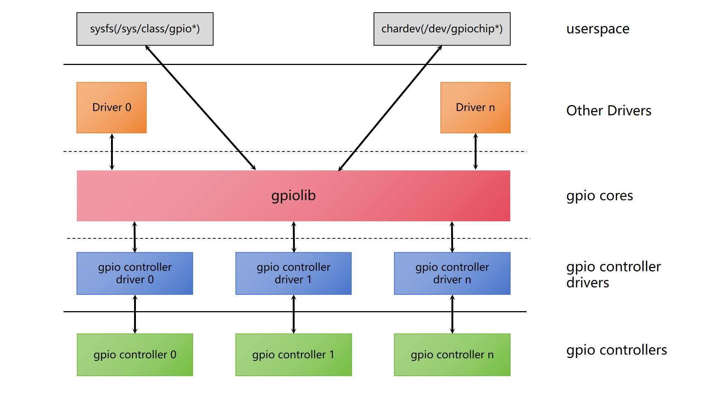

# GPIO

GPIO Functionality and Usage Guide.

## Overview

GPIO is the **controller for the GPIO module**

### Functional Description

  

The Linux GPIO subsystem driver framework mainly consists of three parts:

- **GPIO Controller Driver**: Interacts with the GPIO controller, performing initialization and operations on the controller.
- **GPIO lib Driver**: Provides standard APIs for use by other modules, such as setting GPIO direction and reading/writing GPIO level states.
- **GPIO Character Device Driver**: Exposes GPIOs to user space as character devices, allowing user space to access GPIOs through standard file interfaces.


### Source Code Structure

The controller driver code is located in the `drivers/gpio` directory:

```
|-- gpio-k1x.c  
```

## Key Features

| Feature | Description |
| :-----| :----|
| Direction Configuration Support | Supports setting GPIO as input or output |
| High/Low Level Output Support | Supports setting the level of GPIO in output mode |
| GPIO Interrupt Support | Supports GPIO interrupts triggered by rising and falling edge |

## Configuration Introduction

It mainly includes **driver CONFIG enablement configuration** and **DTS configuration**.

### CONFIG Configuration

- **CONFIG_GPIOLIB**: Provides support for GPIO controllers, with a `Y`default value of

```
Device Drivers
        GPIO Support (GPIOLIB [=y])
```

- **CONFIG_GPIO_K1X**: Provides support for the K1 GPIO controller, with a default value of `Y`

```
Device Drivers  
        GPIO Support (GPIOLIB [=y])
                Virtual GPIO drivers  
                        SPACEMIT-K1X GPIO support (GPIO_K1X [=y])
```

## Usage Guide

Using GPIO involves three steps:

1. GPIO Description
2. GPIO Pin Configuration
3. GPIO Usage

**Notes:**

1. Pin numbers are defined in the kernel directory `include/dt-bindings/pinctrl/k1-x-pinctrl.h`.
2. Pin configuration is the same when a group of pins is set to the GPIO function, meaning that the mux mode, pull-up/pull-down, edge detection, and drive strength configurations are the same.

### GPIO Description

Define all GPIOs used in the system.

The `gpio-ranges` property of the Linux GPIO framework is used for definition. If the pin numbers corresponding to a segment of GPIOs are also consecutive, they are defined as a group.

The GPIO controller definition in the solution DTS file for the example above

```c
&gpio{
        gpio-ranges = <
                &pinctrl 49  GPIO_49  2
                &pinctrl 58  GPIO_58  1
                &pinctrl 63  GPIO_63  5
                &pinctrl 70  PRI_TDI  4
                &pinctrl 74  GPIO_74  1
                &pinctrl 80  GPIO_80  4
                &pinctrl 90  GPIO_90  3
                &pinctrl 96  DVL0     2
                &pinctrl 110 GPIO_110 1
                &pinctrl 114 GPIO_114 3
                &pinctrl 123 GPIO_123 5
        >;
};
```

### GPIO Pin Configuration

Set the pins corresponding to the GPIOs used in the solution to the GPIO function and configure them (edge detection/pull-up/pull-down/drive strength).

Use the `pinctrl-single,gpio-range` property for setting. If there is a continuous range of pin numbers with the same configuration, they are configured as a group.

Refer to [Pin Configuration Parameters](01-PINCTRL.md) for pin configuration parameters.


For example:

```c
&pinctrl {
        pinctrl-single,gpio-range = <
                &range GPIO_49  2 (MUX_MODE0 | EDGE_NONE | PULL_UP   | PAD_3V_DS4)
                &range GPIO_58  1 (MUX_MODE0 | EDGE_NONE | PULL_DOWN | PAD_1V8_DS2)
                &range GPIO_63  2 (MUX_MODE0 | EDGE_NONE | PULL_DOWN | PAD_1V8_DS2)
                &range GPIO_65  1 (MUX_MODE0 | EDGE_NONE | PULL_UP   | PAD_1V8_DS2)
                &range GPIO_66  2 (MUX_MODE0 | EDGE_NONE | PULL_UP   | PAD_3V_DS4)
                &range PRI_TDI  2 (MUX_MODE1 | EDGE_NONE | PULL_UP   | PAD_1V8_DS2)
                &range PRI_TCK  1 (MUX_MODE1 | EDGE_NONE | PULL_DOWN | PAD_1V8_DS2)
                &range PRI_TDO  1 (MUX_MODE1 | EDGE_NONE | PULL_UP   | PAD_1V8_DS2)
                &range GPIO_74  1 (MUX_MODE0 | EDGE_NONE | PULL_UP   | PAD_1V8_DS2)
                &range GPIO_80  1 (MUX_MODE0 | EDGE_NONE | PULL_UP   | PAD_3V_DS4)
                &range GPIO_81  3 (MUX_MODE0 | EDGE_NONE | PULL_UP   | PAD_1V8_DS2)
                &range GPIO_90  1 (MUX_MODE0 | EDGE_NONE | PULL_DOWN | PAD_1V8_DS2)
                &range GPIO_91  2 (MUX_MODE0 | EDGE_NONE | PULL_UP   | PAD_1V8_DS2)
                &range DVL0     2 (MUX_MODE1 | EDGE_NONE | PULL_DOWN | PAD_1V8_DS2)
                &range GPIO_110 1 (MUX_MODE0 | EDGE_NONE | PULL_DOWN | PAD_1V8_DS2)
                &range GPIO_114 1 (MUX_MODE0 | EDGE_NONE | PULL_DOWN | PAD_1V8_DS2)
                &range GPIO_115 1 (MUX_MODE0 | EDGE_NONE | PULL_DOWN | PAD_1V8_DS2)
                &range GPIO_116 1 (MUX_MODE0 | EDGE_NONE | PULL_UP   | PAD_1V8_DS2)
                &range GPIO_123 1 (MUX_MODE0 | EDGE_NONE | PULL_DOWN | PAD_1V8_DS2)
                &range GPIO_124 1 (MUX_MODE0 | EDGE_NONE | PULL_UP   | PAD_1V8_DS2)
                &range GPIO_125 3 (MUX_MODE0 | EDGE_NONE | PULL_DOWN | PAD_1V8_DS2)
        >;
};
```

### GPIO Usage

For example, in the solution, eth0 uses gpio 110 as the PHY Reset signal:

```c
&eth0 {
    emac,reset-gpio = <&gpio 110 0>;
};
```

## Interface Introduction

### API

- **Request a specified GPIO**

```
int gpio_request(unsigned gpio, const char *label);
```

- **Release a specified GPIO that has been requested**

```
void gpio_free(unsigned gpio);
```

- **Set a specified GPIO to input mode**

```
int gpio_direction_input(unsigned gpio)
```

- **Set a specified GPIO to output mode and assign an initial value**

```
int gpio_direction_output(unsigned gpio, int value)
```

- **Set the output value of a specified GPIO**

```
void gpio_set_value(unsigned gpio, int value)
```

- **Get the signal value of a specified GPIO**

```
int gpio_get_value(unsigned gpio)
```

- **Get the interrupt number corresponding to the specified GPIO.**

```
int gpio_to_irq(unsigned gpio)
```

## Debugging

### sysfs

Accessing and Controlling GPIOs via sysfs.

```
/sys/class/gpio
|-- export
|-- gpiochip0 -> ../../devices/gpiochip0/gpio/gpiochip0
|-- gpiochip512 -> ../../devices/platform/soc/d401d800.i2c/i2c-8/8-0041/spacemit-pinctrl@spm8821/gpio/gpiochip512
`-- unexport
```

- **export**: Used to inform the system to export the specified GPIO pin number for control
- **unexport**: Used to inform the system to unexport (remove) the GPIO pin
- **gpiochipX**: Detailed information of GPIO chip X
- **gpioX/direction**: Direction setting of GPIO X
- **gpioX/value**: Port value of GPIO X


### debugfs

Inspect the system’s GPIO controllers and the GPIO information they manage.

```
/sys/kernel/debug/gpio
# cat gpio
gpiochip0: GPIOs 0-127, k1x-gpio:
 gpio-63  (                    |reset               ) out lo
 gpio-67  (                    |pwr                 ) out hi
 gpio-80  (                    |cd                  ) in  hi ACTIVE LOW
 gpio-96  (                    |sys-led             ) out lo
 gpio-97  (                    |vbus                ) out hi
 gpio-110 (                    |mdio-reset          ) out hi
 gpio-111 (                    |reset               ) out lo
 gpio-113 (                    |pwdn                ) out lo
 gpio-115 (                    |mdio-reset          ) out hi
 gpio-116 (                    |regon               ) out hi
 gpio-123 (                    |hub                 ) out hi
 gpio-124 (                    |hub                 ) out hi
 gpio-127 (                    |?                   ) out lo

gpiochip1: GPIOs 512-517, parent: platform/spacemit-pinctrl@spm8821, spacemit-pinctrl@spm8821, can sleep:

```

## Testing

You can use `devmem` to check register values and determine whether the GPIO configuration has taken effect.

```
devmem reg_addr
```

## FAQ
