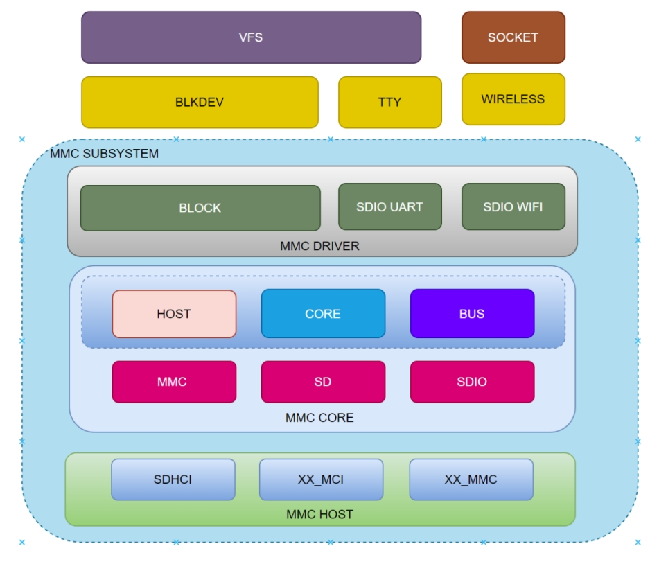

# SDHC

SDHC Functionality and Usage Guide.

## Overview

SDHC (Secure Digital High Capacity) is the controller for multimedia cards (MMC), secure digital cards (SD), and secure digital input/output (SDIO) modules。

### Functional Description



The MMC subsystem comprises three layers:  
- **MMC Host**: This is the MMC controller driver layer, responsible for initializing the MMC controller and handling low-level data transmission and reception operations, directly controlling the underlying registers.
- **MMC Core**: This is the core layer, responsible for abstracting virtual card devices and providing interfaces for upper layers to use.
- **MMC Block**: This is the block device layer, responsible for implementing the block device driver program and interfacing with other kernel frameworks (such as block devices, TTY, wifi, etc.).

These layers together form the complete framework of the MMC subsystem in the Linux system, ensuring the normal operation and data transmission of MMC devices in the system.

### Source Code Structure

The controller driver code is located in the `drivers/mmc/host`  directory:

```
drivers/mmc/host
|-- sdhci.c         # Standard sdhci code
|-- sdhci-pltfm.c   # sdhci platform laye
|-- sdhci-of-k1x.c  # K1 sdhci driver
```

## Key Features

### Features

| Feature | Description |
| :-----| :----|
| Support for eMMC5.1 | Compliant with eMMC 5.1 spec (HS400/HS200) |
| Support for SD3.0 | Supports SD3.0 protocol cards, compatible with SD2.0 protocol |
| Support for DMA | Supports DMA data transfer |

### Performance Parameters

| eeMMC Model | Sequential Read (MB/s) | Sequential Write (MB/s) | Random Read (MB/s) | Random Write (MB/s) |
| :-----| :----| :----: | :----: |:----: |
| KLMAG1JETD-B041 | 295 | 53.3 | 65.4 | 45.2 |
| EMDME008G-A8A39 | 304 | 107 | 32.3 | 44 |

Testing Methods

```
fio -name=randread -direct=1 -iodepth=64 -rw=randread -ioengine=libaio -bs=4k -size=1G -numjobs=1 -runtime=1000 -group_reporting -filename=/1
fio -name=randwrite -direct=1 -iodepth=64 -rw=randwrite -ioengine=libaio -bs=4k -size=1G -numjobs=1 -runtime=1000 -group_reporting -filename=/1
fio -name=read -direct=1 -iodepth=64 -rw=read -ioengine=libaio -bs=512k -size=1G -numjobs=1 -runtime=1000 -group_reporting -filename=/1
fio -name=write -direct=1 -iodepth=64 -rw=write -ioengine=libaio -bs=512k -size=1G -numjobs=1 -runtime=1000 -group_reporting -filename=/1
```

***Default Configuration: HS400 200M***

## Configuration

It mainly includes driver enablement configuration and dts configuration.

### CONFIG Configuration

CONFIG_MMC: Provides support for the MMC bus protocol, with a default value of `Y`

```
Device Drivers
        MMC/SD/SDIO card support (MMC [=y])     
```

CONFIG_MMC_BLOCK: Provides support for the MMC block device driver, which is necessary for mounting filesystems on MMC devices, with a default value of `Y`

```
Device Drivers
 MMC/SD/SDIO card support (MMC [=y])
     HW reset support for eMMC (PWRSEQ_EMMC [=y])
        Simple HW reset support for MMC (PWRSEQ_SIMPLE [=y])
     MMC block device driver (MMC_BLOCK [=y])
```

CONFIG_MMC_SDHCI: Provides support for the MMC controller driver. By default, this option is set to `Y`

```
Device Drivers
 MMC/SD/SDIO card support (MMC [=y])
     Secure Digital Host Controller Interface support (MMC_SDHCI [=y])
         SDHCI platform and OF driver helper (MMC_SDHCI_PLTFM [=y])
       SDHCI OF support for the Spacemit K1X SDHCI controllers (MMC_SDHCI_OF_K1X [=y])
```

### DTS Configuration

#### pinctrl

SDHC Slots Configuration:
- slot1 supports SD/SDIO (1/4 bit)
- slot2 supports SDIO/eMMC (1/4 bit)
- slot3 supports only eMMC (1/4/8 bit)

Typical Configuration for SDHC Slots. In general, the slots are used as follows:
- slot1 is used for SD cards.
- slot2 is used for SDIO.
- slot3 is used for eMMC.

SD/SDIO signal lines must be configured for mode0 (pinctrl_mmc1/pinctrl_mmc2).

mmc1 supports a fast mode (pinctrl_mmc1_fast) for clocks >100 MHz.

```c
    pinctrl_mmc1: mmc1_grp {
        pinctrl-single,pins = <
            K1X_PADCONF(MMC1_DAT3, MUX_MODE0, (EDGE_NONE | PULL_UP | PAD_3V_DS4))         /* mmc1_d3 */
            K1X_PADCONF(MMC1_DAT2, MUX_MODE0, (EDGE_NONE | PULL_UP | PAD_3V_DS4))         /* mmc1_d2 */
            K1X_PADCONF(MMC1_DAT1, MUX_MODE0, (EDGE_NONE | PULL_UP | PAD_3V_DS4))         /* mmc1_d1 */
            K1X_PADCONF(MMC1_DAT0, MUX_MODE0, (EDGE_NONE | PULL_UP | PAD_3V_DS4))         /* mmc1_d0 */
            K1X_PADCONF(MMC1_CMD,  MUX_MODE0, (EDGE_NONE | PULL_UP | PAD_3V_DS4))         /* mmc1_cmd */
            K1X_PADCONF(MMC1_CLK,  MUX_MODE0, (EDGE_NONE | PULL_DOWN | PAD_3V_DS4))       /* mmc1_clk */
        >;
    };

    pinctrl_mmc1_fast: mmc1_fast_grp {
        pinctrl-single,pins = <
            K1X_PADCONF(MMC1_DAT3, MUX_MODE0, (EDGE_NONE | PULL_UP | PAD_1V8_DS3))         /* mmc1_d3 */
            K1X_PADCONF(MMC1_DAT2, MUX_MODE0, (EDGE_NONE | PULL_UP | PAD_1V8_DS3))         /* mmc1_d2 */
            K1X_PADCONF(MMC1_DAT1, MUX_MODE0, (EDGE_NONE | PULL_UP | PAD_1V8_DS3))         /* mmc1_d1 */
            K1X_PADCONF(MMC1_DAT0, MUX_MODE0, (EDGE_NONE | PULL_UP | PAD_1V8_DS3))         /* mmc1_d0 */
            K1X_PADCONF(MMC1_CMD,  MUX_MODE0, (EDGE_NONE | PULL_UP | PAD_1V8_DS3))         /* mmc1_cmd */
            K1X_PADCONF(MMC1_CLK,  MUX_MODE0, (EDGE_NONE | PULL_DOWN | PAD_1V8_DS3))       /* mmc1_clk */
        >;
    };
```

#### GPIO

SD detection uses GPIO and the GPIO for card detection needs to be configured according to the actual schematic.

```c
&sdhci0 {
        cd-gpios = <&gpio 80 0>;
        cd-inverted;
};
```

For example, if the solution uses gpio80 for card detection, the pintcl function of gpio80 also needs to be configured.

```c
&pinctrl {
        pinctrl-single,gpio-range = <
                &range GPIO_80  1 (MUX_MODE0 | EDGE_NONE | PULL_UP   | PAD_3V_DS4)
        >;
};

&gpio{
        gpio-ranges = <
                &pinctrl 80  GPIO_80  4
        >;
};
```

#### Power Supply Configuration

SD and SDIO require two power supplies to be configured, namely **vmmc-supply** and **vqmmc-supply**, which correspond to the **card's functionality** and **IO power supply**, respectively. The **vqmmc-supply** dynamically switches the power supply based on the card's operating mode, and the hardware design must ensure support for both 3.3V and 1.8V.

For eMMC, power supply is guaranteed by the design and does not require power configuration.

```c
&sdhci0 {
        vmmc-supply = <&dcdc_4>;
        vqmmc-supply = <&ldo_1>;
};
```

#### Tuning Configuration

Signal tuning is mandatory for SD high-speed modes to optimize the performance. Different hardware versions need to adjust the TX and RX parameters accordingly.

#### dts Configuration Example

Full SD card DTS configuration:

```c
&sdhci0 {
        pinctrl-names = "default","fast";
        pinctrl-0 = <&pinctrl_mmc1>;
        pinctrl-1 = <&pinctrl_mmc1_fast>;
        bus-width = <4>;
        cd-gpios = <&gpio 80 0>;
        cd-inverted;
        vmmc-supply = <&dcdc_4>;
        vqmmc-supply = <&ldo_1>;
        no-mmc;
        no-sdio;
        spacemit,sdh-host-caps-disable = <(
                        MMC_CAP_UHS_SDR12 |
                        MMC_CAP_UHS_SDR25
                        )>;
        spacemit,sdh-quirks = <(
                        SDHCI_QUIRK_BROKEN_CARD_DETECTION |
                        SDHCI_QUIRK_INVERTED_WRITE_PROTECT |
                        SDHCI_QUIRK_BROKEN_TIMEOUT_VAL
                        )>;
        spacemit,sdh-quirks2 = <(
                        SDHCI_QUIRK2_PRESET_VALUE_BROKEN |
                        SDHCI_QUIRK2_BROKEN_PHY_MODULE |
                        SDHCI_QUIRK2_SET_AIB_MMC
                        )>;
        spacemit,aib_mmc1_io_reg = <0xD401E81C>;
        spacemit,apbc_asfar_reg = <0xD4015050>;
        spacemit,apbc_assar_reg = <0xD4015054>;
        spacemit,rx_dline_reg = <0x0>;
        spacemit,tx_dline_reg = <0x0>;
        spacemit,tx_delaycode = <0xA0>;
        spacemit,rx_tuning_limit = <50>;
        spacemit,sdh-freq = <204800000>;
        status = "okay";
};
```

The complete configuration for eMMC in the solution is as follows:

```c
/* eMMC */
&sdhci2 {
        bus-width = <8>;
        non-removable;
        mmc-hs400-1_8v;
        mmc-hs400-enhanced-strobe;
        no-sd;
        no-sdio;
        spacemit,sdh-quirks = <(
                        SDHCI_QUIRK_BROKEN_CARD_DETECTION |
                        SDHCI_QUIRK_BROKEN_TIMEOUT_VAL
                        )>;
        spacemit,sdh-quirks2 = <(
                        SDHCI_QUIRK2_PRESET_VALUE_BROKEN
                        )>;
        spacemit,sdh-freq = <375000000>;
        status = "okay";
};
```

## Interface

### API

Linux implements an MMC bus driver that implements the MMC bus protocol, an MMC block driver that handles file system read/write calls, and uses the MMC host controller interface driver to send commands to uSDHC.
The K1 MMC controller driver implements the following interfaces: init, exit, request, resume, suspend, and set_ios. The main ones are:

- The init function `sdhci_pltfm_init()` initializes the platform hardware and registers the sdhci_k1x_pdata structure.
- The exit function `spacemit_sdhci_remove()` deinitializes the platform hardware and releases allocated memory.

### Debugging

#### sysfs

`sd_card_pmux`
This node is used to switch the SD card pin to jtag function. 
- `0` indicates SD card function
- `1` indicates jtag function

`tx_delaycode`
The value of tx_delaycode is specified in the solution dts by default. It can be dynamically modified through this node under sysfs for verification during the debugging phase.

#### debugfs

Commonly used to check MMC working status, including frequency, bus width, and mode.
```
cat /sys/kernel/debug/mmc0/ios
clock:          204800000 Hz
actual clock:   204800000 Hz
vdd:            21 (3.3 ~ 3.4 V)
bus mode:       2 (push-pull)
chip select:    0 (don't care)
power mode:     2 (on)
bus width:      2 (4 bits)
timing spec:    6 (sd uhs SDR104)
signal voltage: 1 (1.80 V)
driver type:    0 (driver type B)
```

## Testing

MMC/SD storage devices can be tested for performance and functionality using third-party tools such as FIO and bonnie++. Currently, buildroot includes the FIO tool for evaluating read/write performance and conducting stress tests.

## FAQ
