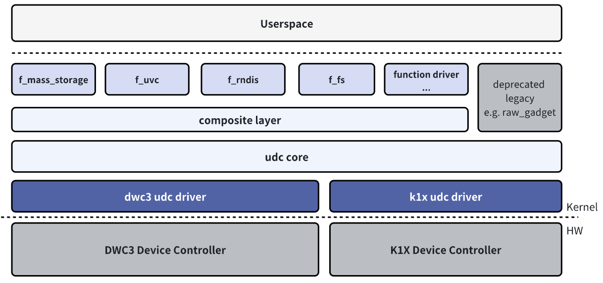

# USB

USB Functionality and Usage Guide.

## Overview

The K1 platform features three USB controllers:
- USB2.0 OTG (USB0)
- USB2.0 Host (USB1)
- USB3.0 DRD (where the USB2.0 port is USB2 and the SuperSpeed port is USB3)

In Linux, two USB roles are supported:
- **Host Mode:** This mode allows the system to connect and manage USB peripherals.
- **Device Mode:** This mode enables the system to act as a USB peripheral that can be connected to another host device.

### Features

#### USB Host


The USB Host role driver framework can be divided into the following layers:

- **USB Host Controller Driver:** This is the USB controller driver layer, responsible for initializing the controller and performing low-level data transmission and reception operations.
- **USB Core Services:** This is the core layer, responsible for abstracting the USB hierarchy and URB-based transfers, and providing interfaces for upper and lower layers.
- **USB Class Driver:** This is the USB device functionality layer, responsible for implementing USB device drivers, USB function drivers, and interfacing with other kernel frameworks (such as HID, UVC, Storage, etc.).

#### USB Device



The USB Device role driver framework can be divided into the following layers:

- **USB Device Controller Driver:** This is the USB Device role controller driver layer, responsible for initializing the controller and performing low-level data transmission and reception operations.
- **UDC Core:** This is the core layer, responsible for abstracting the USB Device hierarchy and URB-based transfers, and providing interfaces for upper and lower layers.
- **Composite:** Used to combine multiple USB Device functions into a single device, supporting configuration by userspace through configfs or hard-coded combinations of Functions in legacy drivers.
- **Function Driver:** This is the USB Device functionality layer, responsible for implementing the functional drivers for USB Device mode, and interfacing with other kernel frameworks (such as storage, V4L2, networking, etc.).

These layers together form the framework of the USB subsystem in the Linux system, ensuring the normal operation and data transfer within the USB module system.


### Source Code Structure

The USB2.0 OTG controller driver code is located in the `drivers/usb` directory:

```
drivers/usb
|-- phy/
|   |-- phy-k1x-ci-otg.c      # OTG driver, used to implement the switching between EHCI Host and K1X UDC modes.
|   |-- phy/phy-k1x-ci-usb2.c # PHY driver.
|-- host/
|   |-- ehci-k1x-ci.c         # EEHCI Host mode platform driver, needs to be used in combination with the EHCI Host driver.
|-- gadget/
    |-- udc/
        |-- k1x_udc_core.c    # Device mode driver.
```

The USB2.0 Host controller driver code is located in the `drivers/usb` directory:

```
drivers/usb
|-- phy/
|    |-- phy-k1x-ci-usb2.c # PHY driver.
|-- host/
    |-- ehci-k1x-ci.c     # The EHCI Host mode platform driver needs to be used in conjunction with the EHCI Host driver.
```

The USB3.0 DRD (Dual-Role Device) controller driver code is located in the `drivers/usb` directory.

```
drivers/usb
|-- phy/
|   |-- phy-k1x-ci-usb2.c   # USB2.0 PHY driver for the USB3.0 composite port
|-- phy/
|   |-- spacemit/
|       |-- phy-spacemit-k1x-combphy.c # USB3.0 5Gbps PHY 
|-- dwc3/
|   |-- dwc3-spacemit.c    # DWC platform driver, needs to be used in combination with the DWC3 driver
```

Other component code paths are as follows:

```
drivers/
|-- extcon/
|    |-- extcon-k1xci.c   # MicroUSB Pin detection connector driver, needs to be used with OTG and Extcon drivers
|-- usb
|    |-- misc/
|        |-- spacemit_onboard_hub.c # Helper driver for on-board USB peripheral power configuration
```

## Key Features

### USB2.0 OTG

#### Features

| Feature | Description |
| :-----| :----|
| Supports OTG | Supports switching between Host and Device modes, and supports idpin+vbuspin detection |
| Supports HS, FS Host/Device | High Speed (480Mb/s), Full Speed (12Mb/s) Host/Device modes |
| Supports LS Host Only | Supports Low Speed (1.5Mb/s) Host-only mode |
| Supports 16 Host Channels | Supports up to 16 channels for simultaneous transmission |
| Supports 16 IN + 16 OUT Device Endpoints | 16KB Tx Buffer, 2KB Rx Buffer |
| Supports Remote Wakeup| Supports High Speed, Full Speed, Low Speed Remote Wakeup in Host mode |

#### Performance Parameters

| Test Item | Tx(MB/s) | Rx(MB/s) |
| :-----| :----| :----: |
| USB Drive Speed Test (HIKISEMI S560 256GB) | 32.2 | 32.4 |
| USB Drive Speed Test in Gadget Mode | 21.8 | 14.8 |

**Testing Method**

```
# USB Drive Speed Test:
## host:
fio -name=Tx -ioengine=libaio -direct=1 -iodepth=64 -rw=write -bs=512K -size=1024M -numjobs=1 -group_reporting -filename=/dev/sda
fio -name=Rx -ioengine=libaio -direct=1 -iodepth=64 -rw=read -bs=512K -size=1024M -numjobs=1 -group_reporting -filename=/dev/sda

# USB Drive in Gadget Mode:
## device:
gadget-setup msc
## pc:
fio -name=DevRx -ioengine=libaio -direct=1 -iodepth=64 -rw=write -bs=512K -size=100M -numjobs=1 -group_reporting -filename=/dev/sda
fio -name=DevTx -ioengine=libaio -direct=1 -iodepth=64 -rw=read -bs=512K -size=100M -numjobs=1 -group_reporting -filename=/dev/sda
```

### USB2.0 Host

#### Features

| Characteristics | Feature Description |
| :-----| :----|
| Supports HS, FS, LS Host | High Speed (480Mb/s), Full Speed (12Mb/s), Low Speed (1.5Mb/s) Host mode |
| Supports 16 Host Channels | Supports up to 16 channels for simultaneous transmission |
| Supports Remote Wakeup | Supports High Speed, Full Speed, Low Speed Remote Wakeup in Host mode |

#### Performance Parameters

| Test Item | Tx(MB/s) | Rx(MB/s) |
| :-----| :----| :----: |
| USB Drive Speed Test (HIKISEMI S560 256GB) | 32.2 | 32.4 |

**Testing Method**

```
# USB Drive Speed Test:
fio -name=Tx -ioengine=libaio -direct=1 -iodepth=64 -rw=write -bs=512K -size=1024M -numjobs=1 -group_reporting -filename=/dev/sda
fio -name=Rx -ioengine=libaio -direct=1 -iodepth=64 -rw=read -bs=512K -size=1024M -numjobs=1 -group_reporting -filename=/dev/sda
```

### USB3.0 DRD

#### Feature

| Feature | Description |
| :-----| :----|
| Supports OTG | Supports switching between Host and Device modes |
| Supports SS Host/Device | Super Speed (5Gbps/s) Host/Device mode |
| Compatible with HS, FS Host/Device | High Speed (480Mb/s), Full Speed (12Mb/s) Host/Device mode |
| Supports LS Host Only | Supports Low Speed (1.5Mb/s) Host-only mode |
| Supports 32 Device Endpoint | Supports dynamic allocatio |
| Supports Low Power | USB2.0 Suspend, USB3.0 U1, U2, U3|
| Supports Remote Wakeup | Supports SuperSpeed, HighSpeed, FullSpeed, LowSpeed Remote Wakeup in Host mode |

#### Performance Parameters

| Test Item | Tx(MB/s) | Rx(MB/s) |
| :-----| :----| :----: |
| USB Drive Speed Test (HIKISEMI S560 256GB) (SuperSpeed) | 345 | 343 |
| USB Drive Speed Test (HIKISEMI X301 64GB) (HighSpeed) | 27.1 | 30.2 |
| USB Drive Speed Test in Gadget Mode (SuperSpeed) | 349 | 328 |

**Testing Method**

```
# USB Drive Speed Test:
fio -name=Tx -ioengine=libaio -direct=1 -iodepth=64 -rw=write -bs=512K -size=1024M -numjobs=1 -group_reporting -filename=/dev/sda
fio -name=Rx -ioengine=libaio -direct=1 -iodepth=64 -rw=read -bs=512K -size=1024M -numjobs=1 -group_reporting -filename=/dev/sda

# USB Drive Speed Test in Gadget Mode (SuperSpeed):
## device:
USB_UDC=c0a00000.dwc3 gadget-setup uas:/dev/nvme0n1p1
## pc:
fio -name=DevRx -rw=write -bs=512k -size=5G -numjobs=1 -iodepth=32 -group_reporting -direct=1 -ioengine=libaio -filename=/dev/sda
fio -name=DevTx -rw=read -bs=512k -size=5G -numjobs=1 -iodepth=32 -group_reporting -direct=1 -ioengine=libaio -filename=/dev/sda
```

## Configuration Introduction

This mainly includes **driver enablement configuration** and **DTS configuration**.

### USB2.0 OTG Configuration Introduction

#### CONFIG Configuration

 `CONFIG_K1XCI_USB2_PHY`: Provides support for the USB2.0 OTG PHY and defaults to `Y`.

```
Device Drivers
         -> USB support (USB_SUPPORT [=y])
           -> USB Physical Layer drivers 
             -> K1x ci USB 2.0 PHY Driver (K1XCI_USB2_PHY [=y])
```

`CONFIG_USB_K1X_UDC`: Provides support for the Device functionality of USB2.0 OTG and defaults to `Y`.

```
Device Drivers
         -> USB support (USB_SUPPORT [=y])
           -> USB Gadget Support (USB_GADGET [=y])
             -> USB Peripheral Controller
               -> Spacemit K1X USB2.0 Device Controller (USB_K1X_UDC [=y]) 
```

`CONFIG_USB_EHCI_K1X`: Provides support for the Host functionality of USB2.0 OTG and defaults to `Y`.

```
Device Drivers 
         -> USB support (USB_SUPPORT [=y])
           -> EHCI HCD (USB 2.0) support (USB_EHCI_HCD [=y])
             -> EHCI support for Spacemit k1x USB controller (USB_EHCI_K1X [=y])
```

`CONFIG_USB_K1XCI_OTG`: Provides support for the OTG role switching of USB2.0 OTG and defaults to `Y`.

```
Device Drivers 
         -> USB support (USB_SUPPORT [=y])
           -> USB Physical Layer drivers 
             -> Spacemit K1-x USB OTG support (USB_K1XCI_OTG [=y])    
```

`CONFIG_EXTCON_USB_K1XCI`: Provides support for the MicroUSB interface's ID Pin+Vbus Pin detection connector driver for USB2.0 OTG and defaults to `Y`.

```
Device Drivers
         -> External Connector Class (extcon) support (EXTCON [=y])
           -> Spacemit K1-x USB extcon support (EXTCON_USB_K1XCI [=y])
```

#### DTS Configuration

The USB2.0 OTG controller supports four configuration modes:
- Typically configured to operate in **Device Only mode**.
- If manual Host switching is supported, it is recommended to configure it to operate in **OTG mode (based on usb-role-switch)** and set the default role to Device.
- If automatic dual-role switching is supported (e.g., for Type-C OTG interfaces), it is recommended to configure it to operate in **OTG mode (based on usb-role-switch)** and connect to the Type-C driver or GPIO detection.
- If the K1 platform is used and the EXTCON framework is employed for USB role control, it also supports configuration in **OTG mode (based on K1 EXTCON)**. This method typically relies on external events (such as ID detection or VBUS status) to complete role switching.


##### Operating in Device Only Mode

The device tree node for the USB2.0 OTG controller in device mode is `udc`. To operate in device mode, configure the DTS as follows:

1. Disable the ehci and otg nodes.
2. Enable the usbphy node.
3. Set the spacemit,udc-mode property of the `udc` node to `MV_USB_MODE_UDC` to select device mode.

The DTS configuration for this setup is as follows:

```c
&usbphy {
        status = "okay";
};
&udc {
        spacemit,udc-mode = <MV_USB_MODE_UDC>;
        status = "okay";
};
&ehci { 
        status = "disabled";
};
&otg {
        status = "disabled";
};
```

##### Operating in Host Only Mode

The device tree node for the USB2.0 OTG controller in host mode is `ehci`. To operate in host mode, configure the DTS as follows

1. Disable the `udc` and `otg` nodes.
2. Set the `spacemit,udc-mode` property of the `ehci` node to `MV_USB_MODE_HOST` (default value) to select host mode.
3. If the host needs to control the VBUS switch using GPIO, the `spacemit_onboard_hub` driver can be configured.
4. Optional property `spacemit,reset-on-resume`, which is used to control whether the controller is reset after the system resumes from sleep.

```c
&usbphy {
        status = "okay";
};
&udc { 
        status = "disabled";
};
&ehci {
        spacemit,reset-on-resume;
        spacemit,udc-mode = <MV_USB_MODE_HOST>;
        status = "okay";
};
&otg {
        status = "disabled";
};
```

##### Operating in OTG Mode (Based on usb-role-switch)

This configuration mode is suitable for most schemes and can connect to Type-C role detection, GPIO role detection, and supports user manual switching, etc.

You need to configure the `usb-role-switch` property for the `otg` node to enable support for role-switch, which is typically applicable to Type-C connectors but also supports other methods such as GPIO detection. For specific integration methods, refer to the Linux kernel documentation on usb-connector and Type-C related sections. After configuration, a `mv-otg-role-switch` node will appear under `/sys/class/usb_role/`.

By enabling the `otg` node and configuring the `role-switch-user-control` property of the otg node.

The `otg` node supports configuring `vbus-gpios` to control the vbus during role switching.

The `role-switch-default-mode` property of the `otg` node determines the default role after power-on, with options being h`host` or p`peripheral`.

The `role-switch-user-control` property of the `otg` node determines whether the user can manually control role switching through the sysfs `/sys/class/usb_role/mv-otg-role-switch/role`.

```c
&usbphy {
        status = "okay";
};

&otg {
        usb-role-switch;
        role-switch-user-control;
        spacemit,reset-on-resume;
        role-switch-default-mode = "host";
        vbus-gpios = <&gpio 123 0>;
        status = "okay";
        /* Optional
        typec_connector {
             ....
        }
        */
};

&udc {
        spacemit,udc-mode = <MV_USB_MODE_OTG>;
        status = "okay";
};

&ehci {
        spacemit,udc-mode = <MV_USB_MODE_OTG>;
        status = "okay";
};

```

##### Operating in OTG Mode (Based on K1 EXTCON)

This configuration is only applicable to MicroUSB interfaces and requires support for VBUS PIN and ID PIN detection for automatic OTG role switching.

To operate in OTG mode (based on K1 EXTCON), the hardware design needs to meet the following requirements:

1. Connect the USB_ID0 Pin (INPUT) to the OTG MicroUSB ID Pin. (When ID is grounded, USB2.0 OTG works as a host; when ID is floating/high, USB2.0 OTG works as a device).

2. Connect the VBUS_ON0 Pin (INPUT) to the OTG MicroUSB VBUS Pin. VBUS_ON0 will be high when VBUS is outputting or receiving power externally.

3. Select a Pin to configure as the VBUS switch (e.g., GPIO63 or GPIO127) and set it to the `drive_vbus0_iso` function to control the 5V power supply switch based on whether the system is in host mode.

4. Before `drive_vbus0_iso` outputs high, VBUS_ON0 must not be high, and the MicroUSB must not supply power externally to prevent hardware damage.

5. When the USB2.0 OTG Port switches to device mode, VBUS_ON0 must be pulled high after the port is connected to an external VBUS power supply.

The DTS needs the following configurations:

1. Use pinctrl to configure GPIO64 (or alternatively GPIO125) as the VBUS_ON0 function and GPIO65 (or alternatively GPIO126) as the USB_ID0 function to detect the OTG interface status.

2. Enable the `usbphy`, `extcon`, `otg`, `udc`, and `ehci` nodes.

3. Set the `spacemit,udc-mode` property of the `udc`, `ehci`, and `otg` nodes in the DTS to `MV_USB_MODE_OTG`.

4. Configure the DTS to support vbus and idpin detection through the `spacemit,extern-attr` property of the `otg` and `udc` nodes, setting it to `MV_USB_HAS_VBUS_IDPIN_DETECTION`.

The DTS configuration example for the OTG node (assuming the pinctrl configuration uses the `pinctrl_usb0_1` node from `k1-x_pinctrl.dtsi`), as referenced in `k1-x_evb.dts`, is as follows:

```c
&pinctrl{
   pinctrl_usb0_1: usb0_1_grp {
       pinctrl-single,pins =<
               K1X_PADCONF(GPIO_64, MUX_MODE1, (EDGE_NONE | PULL_DOWN | PAD_1V8_DS2)) /* vbus_on0 */
               K1X_PADCONF(GPIO_65, MUX_MODE1, (EDGE_NONE | PULL_UP   | PAD_1V8_DS2)) /* usb_id0 */
               K1X_PADCONF(GPIO_63, MUX_MODE1, (EDGE_NONE | PULL_DOWN | PAD_1V8_DS2)) /* drive_vbus0_iso */ >;
   };
};
&extcon {
        status = "okay";
};
&otg {
        spacemit,udc-mode = <MV_USB_MODE_OTG>;
        spacemit,extern-attr = <MV_USB_HAS_VBUS_IDPIN_DETECTION>;
        pinctrl-names = "default";
        pinctrl-0 = <&pinctrl_usb0_1>;
        status = "okay";
};
&usbphy {
        status = "okay";
};
&udc {
        spacemit,udc-mode = <MV_USB_MODE_OTG>;
        spacemit,extern-attr = <MV_USB_HAS_VBUS_IDPIN_DETECTION>;
        status = "okay";
};
&ehci {
        spacemit,udc-mode = <MV_USB_MODE_OTG>;
        status = "okay";
};
```

##### USB Sleep and Wakeup

The K1 USB module supports two system sleep strategies:
- **reset-resume**, which maintains the lowest power consumption for USB
- **no-reset**

For USB2.0 OTG, the `spacemit,reset-on-resume` property needs to be configured in the `otg` and `ehci` nodes to enable the reset-resume strategy.

To support USB Remote Wakeup:
- The `spacemit,reset-on-resume` property must be disabled for the `ehci` and `otg` nodes.
- The `wakeup-source` property must be enabled.
- Additionally, the system PMU (Power Management Unit) must enable the USB wakeup source. For more details, refer to the relevant section below:

```c
&otg {
        /*spacemit,reset-on-resume;*/
        wakeup-source;
        .... 其 Other parameters are omitted; refer to the configurations above
};
&ehci {
        /*spacemit,reset-on-resume;*/
        wakeup-source;
        .... Other parameters are omitted; refer to the configurations above
};
```

### USB2.0 HOST Configuration

#### CONFIG Configuration

`CONFIG_K1XCI_USB2_PHY`: Provides support for the PHY of USB2.0 HOST and defaults to `Y`.

```
Device Drivers
         -> USB support (USB_SUPPORT [=y])
           -> USB Physical Layer drivers 
             -> K1x ci USB 2.0 PHY Driver (K1XCI_USB2_PHY [=y])
```

`CONFIG_USB_EHCI_K1X`: Provides support for the Host functionality of USB2.0 HOST and defaults to `Y`.

```
Device Drivers 
         -> USB support (USB_SUPPORT [=y])
           -> EHCI HCD (USB 2.0) support (USB_EHCI_HCD [=y])
             -> EHCI support for Spacemit k1x USB controller (USB_EHCI_K1X [=y])
```

#### DTS Configuration

##### Operating in Host Only Mode

USB2.0 HOST supports configuration to operate in **Host Only mode**.

The device tree node corresponding to the host mode of the USB2.0 HOST controller is `ehci1`. When operating in host mode, the DTS can be configured as follows:
1. Set the `spacemit,udc-mode` property of the `ehci1` node to `MV_USB_MODE_HOST` (default value) to select host mode.
2. If the host needs to control the VBUS switch using GPIO, the `spacemit_onboard_hub` driver can be configured.
3. Optional property `spacemit,reset-on-resume`, which is used to control whether the controller is reset after the system resumes from sleep

```c
&usbphy1 {
        status = "okay";
};
&ehci1 {
        spacemit,reset-on-resume;
        spacemit,udc-mode = <MV_USB_MODE_HOST>;
        status = "okay";
};
```

##### USB Sleep and Wakeup

The K1 USB supports two system sleep strategies:
- The **reset-resume** strategy, which maintains the lowest power consumption for USB.
- The **no-reset** strategy.

For the USB2.0 HOST controller, the `spacemit,reset-on-resume` property needs to be configured in the `ehci1` node to enable the reset-resume strategy.

To support USB Remote Wakeup:
1. The `spacemit,reset-on-resume` property must be disabled for the `ehci1` node.
2. The `wakeup-source` property must be enabled.
3. Additionally, the system PMU (Power Management Unit) must enable the USB wakeup source. For more details, refer to the relevant section below:

```c
&ehci1 {
        /*spacemit,reset-on-resume;*/
        wakeup-source;
        .... Other parameters are omitted; refer to the configurations above
};
```

### Introduction to USB3.0 DRD Configuration

#### CONFIG Configuration

`CONFIG_K1XCI_USB2_PHY`: Provides PHY support for the USB2.0 Port of USB3.0 DRD and defaults to `Y`.

```
Device Drivers
         -> USB support (USB_SUPPORT [=y])
           -> USB Physical Layer drivers 
             -> K1x ci USB 2.0 PHY Driver (K1XCI_USB2_PHY [=y])
```

`CONFIG_PHY_SPACEMIT_K1X_COMBPHY`: Provides support for the SuperSpeed PHY of USB3.0 DRD and defaults to `Y`.

```
Device Drivers 
         -> PHY Subsystem
           -> Spacemit K1-x USB3&PCIE combo PHY driver (PHY_SPACEMIT_K1X_COMBPHY [=y]) 
```

`CONFIG_USB_DWC3_SPACEMIT`: Provides platform support for the Spacemit USB3.0 DRD controller driver and defaults to `Y`.

```
Device Drivers
         -> USB support (USB_SUPPORT [=y])
           -> DesignWare USB3.0 DRD Core Support (USB_DWC3 [=y])
             -> Spacemit Platforms (USB_DWC3_SPACEMIT [=y])
```

`CONFIG_USB_DWC3_DUAL_ROLE`: Provides dual-role support for the USB3.0 DRD controller and defaults to `Y`. The actual role can be configured via the device tree. It can also be configured as a single Host mode or single Device mode.

```
Device Drivers
         -> USB support (USB_SUPPORT [=y])
           -> DesignWare USB3.0 DRD Core Support (USB_DWC3 [=y]) 
            -> DWC3 Mode Selection (<choice> [=y])
             -> Dual Role mode (USB_DWC3_DUAL_ROLE [=y]) 
```

#### DTS Configuration

##### Operating in Host Only Mode

The device tree node for the USB3.0 DRD controller is `usbdrd3`. The corresponding high-speed UTMI PHY node is `usb2phy`, and the corresponding superspeed pipe PHY node is `combphy`. When using the USB3.0 DRD controller, these two nodes need to be enabled. However, no configuration for the PHY nodes.

```
&usb2phy {
        status = "okay";
};
&combphy {
        status = "okay";
};
```

Some parameters of the USB3.0 DRD controller are configured through the `dwc3` sub-node of the `usbdrd3` node in the DTS. The following quirk parameters need to be configured.

```c
&usbdrd3 {
        status = "okay";
        dwc3@c0a00000 {
                dr_mode = "host";
                phy_type = "utmi";
                snps,hsphy_interface = "utmi";
                snps,dis_enblslpm_quirk;
                snps,dis_u2_susphy_quirk;
                snps,dis_u3_susphy_quirk;
                snps,dis-del-phy-power-chg-quirk;
                snps,dis-tx-ipgap-linecheck-quirk;
                snps,parkmode-disable-ss-quirk;
        };
};
```

If the Host needs to control the VBUS switch using GPIO, the `spacemit_onboard_hub` driver can be configured.

##### Operating in Device Only Mode

The role of the USB3.0 DRD controller is configured through the `dr_mode` property of the `dwc3` sub-node of the `usbdrd3` node. The `dr_mode` property can be set to `host`, `peripheral`, or `otg`. Setting the `dr_mode` property to `peripheral` operates in device only mode.

##### Operating in DRD Mode

When configuring `dr_mode` to `otg` mode, the DTS node needs to set the `usb-role-switch` boolean property to true. The default role can be configured through the `role-switch-default-mode` string property, with options being `host` or `peripheral`.

```c
&usbdrd3 {
dwc3@c0a00000 {
        dr_mode = "otg";
        usb-role-switch;
        .... Other parameters are omitted; please refer to the configurations above.
        role-switch-default-mode = "host";
};
};
```

After configuration, a `c0a00000.dwc3-role-switch` node will appear under `/sys/class/usb_role/`. Currently, the dwc3 driver only supports role switching via debugfs:

```c
# Check the current role of the controller:
cat /sys/kernel/debug/usb/c0a00000.dwc3/mode
# Switch to host role:
echo host > /sys/kernel/debug/usb/c0a00000.dwc3/mode
# Switch to device role:
echo device > /sys/kernel/debug/usb/c0a00000.dwc3/mode
```

The above is a configuration guide for manually switching the controller role. If automatic OTG detection is required, additional detection chip drivers need to be configured. Refer to the kernel documentation on extcon, typec, and usb-connector for more details.

If the Host needs to control the VBUS switch using GPIO, the `spacemit_onboard_hub` driver can be configured.

For USB3.0 device use cases, it is recommended that the role-switch reporting source (such as the Type-C driver) complies with reporting the `USB_ROLE_NONE` state when a device disconnect is detected (usually when VBUS is disconnected, or for Type-C, when a detach is detected). Additionally, enable the `monitor-vbus` property in the device tree node for dwc3@c0a00000.

After configuration, the controller will rely on the `USB_ROLE_NONE` state for disconnection detection and perform a software reset to achieve better compatibility. For Type-C reporting, refer to the kernel Type-C documentation.

An example based on GPIO reporting is as follows:

```c
&usbdrd3 {
dwc3@c0a00000 {
        dr_mode = "otg";
        .... Other parameters are omitted; please refer to the configurations above.
        monitor-vbus;
        usb-role-switch;
        role-switch-default-mode = "peripheral";
        connector {
                /* Report vbus connection state from MCU */
                compatible = "gpio-usb-b-connector", "usb-b-connector";
                type = "micro";
                label = "Type-C";
                vbus-gpios = <&gpio 78 GPIO_ACTIVE_HIGH>;
        };
};
};
```

##### Operating in High-Speed Only Mode / Working with PCIE0

The USB3.0 DRD controller has two physical ports:
- The USB2.0 Port is referred to as USB2.
- The SuperSpeed Port is referred to as USB3.

The SuperSpeed Port PHY is shared with PCIE0. Therefore, when enabling USB3.0 DRD and requiring SuperSpeed 5Gbps support, PCIE0 cannot be used; only the USB2 Port (480Mbps) can be shared with PCIE0.

For a design that requires separating the USB2 hardware network from the USB3/PCIE0 hardware network, the DTS can be modified as follows:
- Remove the phys and phy-names properties from the usbdrd3 node.
- Enable the maximum-speed property in the dwc3@c0a00000 node and configure it to high-speed.

This will restrict the USB3.0 DRD controller to only enable its USB2 Port.

The DTS configuration example for this setup is as follows:

```c
&usbdrd3 {
        status = "okay";
        ......(Other configurations are described above)
        /* Do not init PIPE3 phy for PCIE0 */
        /delete-property/ phys;
        /delete-property/ phy-names;
        dwc3@c0a00000 {
                maximum-speed = "high-speed";  
                ......（ Other configurations are described above）
        };
};

&pcie0_rc {
        pinctrl-names = "default";
        pinctrl-0 = <&pinctrl_pcie0_2>;
        status = "okay";
};
```


##### USB Sleep and Wakeup

The K1 USB supports two system sleep strategies:
- The **reset-resume** strategy, which maintains the lowest power consumption for USB.
- The **no-reset** strategy.

For the USB3.0 DRD controller, the reset-on-resume property needs to be configured in the `usbdrd3` node to enable the `reset-on-resume` strategy.

If USB Remote Wakeup needs to be supported:
- The `reset-on-resume` property must be disabled for the `usbdrd3` node.
- The `wakeup-source` property must be enabled.
- Additionally, the system PMU (Power Management Unit) must enable the USB wakeup source. For more details, refer to the relevant section below:

```c
&usbdrd3 {
        /*reset-on-resume;*/
        wakeup-source;
        .... Other parameters are omitted, please refer to the above configuration.
};
```

### Other USB Configuration

#### Other USB CONFIG Configurations

`CONFIG_USB`: Provides support for the USB bus protocol and defaults to `Y`.

```
Device Drivers
         -> USB support (USB_SUPPORT [=y])    
```

This configuration needs to be enabled for USB drives, USB network adapters, USB printers, etc. Commonly used options are set to `Y` by default and are not listed one by one here.


`CONFIG_USB_ROLE_SWITCH`: Provides support for mode switching based on role-switch (e.g., Type-C OTG interfaces may use this):

```
Device Drivers
       -> USB support (USB_SUPPORT [=y])
           -> USB Role Switch Support (USB_ROLE_SWITCH [=y]) 
```

`CONFIG_USB_GADGET`: Provides support for USB Device mode and defaults to `Y`.

```
Device Drivers
         -> USB support (USB_SUPPORT [=y])
           -> USB Gadget Support (USB_GADGET [=y])
```

Under `CONFIG_USB_GADGET`, optional support for Configfs-configured functions such as RNDIS can be enabled. These are configured based on actual needs, and commonly used options are enabled by default.

```
Device Drivers
         -> USB support (USB_SUPPORT [=y])
           -> USB Gadget Support (USB_GADGET [=y])
             -> USB Gadget functions configurable through configfs (USB_CONFIGFS [=y])
               -> RNDIS (USB_CONFIGFS_RNDIS [=y])
               -> Function filesystem (FunctionFS) (USB_CONFIGFS_F_FS [=y])
               -> USB Webcam function (USB_CONFIGFS_F_UVC [=y])
               -> ....
```

`CONFIG_SPACEMIT_ONBOARD_USB_HUB`: Provides support for the helper driver for on-board USB peripheral power configuration.

```
Device Drivers 
        -> USB support (USB_SUPPORT [=y])
          -> Spacemit onboard USB hub support (SPACEMIT_ONBOARD_USB_HUB [=y])
```

#### Other USB DTS Configurations

Currently, the `spacemit_onboard_hub` driver supports automatic power-up logic for USB-related components at boot, mainly used for on-board VBUS switches and hubs that require power-up.
The driver's compatible string is `spacemit,usb3-hub`, and it supports configuring two sets of GPIOs:

- hub-gpios: For powering up the hub.
- vbus-gpios: For powering the external VBUS.

Supported properties:
- `hub_inter_delay_ms`: int, delay between GPIOs in hub-gpios.
- `vbus_inter_delay_ms`: int, delay between GPIOs in vbus-gpios.
- `vbus_delay_ms`: int, delay after powering up the hub before enabling VBUS.
- `suspend_power_on`: bool, whether to keep power on during system suspend. This must be configured if USB Remote Wakeup (e.g., keyboard/mouse wakeup) is supported.

DTS configuration example:

```
usb2hub: usb2hub {
        compatible = "spacemit,usb3-hub";
        hub-gpios = <&gpio 74 0>;
        vbus-gpios = <&gpio 91 0 &gpio 92 0>;
        status = "okay";
};
```

### USB Sleep and Wakeup Configuration

#### Power Supply Design
 
For low-power scenarios during sleep, it is recommended to disable the 5V VBUS power supply for USB when the system is in sleep mode. For schemes that support USB power supply control via GPIO, refer to the configuration instructions for the `spacemit_onboard_hub` driver in the other USB DTS configurations.

For the following scenarios, the 5V VBUS power supply for USB (or on-board USB peripherals) should be retained during sleep:
- Supporting USB Remote Wakeup, such as waking up the system using a USB keyboard or mouse.
- Applications that require keeping the camera video stream active during sleep and resuming the upper-layer application video stream upon waking. Some cameras do not support recovery if power is cut during sleep.
- Devices that take a long time to initialize after power-on (more than 2 seconds from power-on to responding to enumeration, such as some 4G modules) should not be disconnected and reconnected during sleep and wake cycles. It is recommended not to cut power during sleep.
- Other scenarios where device compatibility or the need to provide power via USB requires keeping the power supply active.

For the following scenarios, the 1.8V power supply (AVDD18_USB, AVDD18_PCIE) to the SOC's USB module should be maintained during sleep:
- Supporting USB Remote Wakeup, such as waking up the system using a USB keyboard or mouse.
- When `reset-on-resume`/`spacemit,reset-on-resume` is not enabled (see individual controller sections).

#### CONFIG Configuration
`CONFIG_PM_SLEEP` needs to be enabled.

#### DTS Configuration
This section introduces how to enable the system's USB wakeup source. For DTS configurations of individual controllers, refer to the relevant sections for each controller.
If USB Remote Wakeup is required, such as waking the system from sleep using a USB keyboard or mouse, the `pmu_wakeup5` boolean property needs to be configured for the `soc->pmu->power` node in the device tree.

DTS example:

```cpp
&pmu {
	power: power-controller {
		pmu_wakeup5;
	};
};
```

## Interface

### API

#### Host API

Devices connected to the USB host typically connect to other subsystems within the system. For example, USB storage devices connect to the storage subsystem, and USB HID devices connect to the INPUT subsystem. Please refer to the relevant Linux kernel API documentation for more information.

If you need to develop a custom protocol USB peripheral driver, you can refer to the Linux kernel `driver-api/usb/writing_usb_driver` for kernel-mode driver development or refer to the libusb documentation for user-mode driver development.

#### Device API

USB Device supports configuration via Configfs. Please refer to the Linux kernel documentation `usb/gadget_configfs`. Some functions require the use of application layer service programs.

SpacemiT also provides the [buildroot/usb-gadget tool](https://gitee.com/spacemit-buildroot/usb-gadget), which includes scripts for configuring USB Device using Configfs. You can use and refer to these scripts. Please check the help documentation on the corresponding page.

If you need to develop a custom protocol USB Device mode driver, you can develop a user-mode driver based on FunctionFS. You can refer to the Linux kernel documentation `usb/functionfs` and the example in the Linux kernel source code directory `tools/usb/ffs-aio-example`.


## Debugging

### General USB Host Debugging

#### sysfs

View USB device information

```
ls /sys/bus/usb/devices/
1-0:1.0  1-1.1:1.0  1-1.3      1-1.4:1.0  2-1.1      2-1.1:1.2  2-1.5:1.0  usb1
...
```

The USB path naming in sysfs is as follows:

```
<bus>-<port[.port[.port]]>:<config>.<interface>
```

For the sysfs directory of the Device hierarchy, you can query some information about the corresponding device. Commonly used information includes:

```
idProduct, idVendor: The PID and VID of the USB device.
product: The product name string.
speed: For example, 480 for USB2.0 high-speed, 5000 for USB3.0 SuperSpeed
```

For more details, you can refer to the Linux kernel documentation `ABI/stable/sysfs-bus-usb`, `ABI/testing/sysfs-bus-usb`, etc.

#### debugfs

Query USB device information.

```
cat /sys/kernel/debug/usb/devices

T:  Bus=01 Lev=00 Prnt=00 Port=00 Cnt=00 Dev#=  1 Spd=480  MxCh= 1
B:  Alloc=  0/800 us ( 0%), #Int=  0, #Iso=  0
D:  Ver= 2.00 Cls=09(hub  ) Sub=00 Prot=01 MxPS=64 #Cfgs=  1
P:  Vendor=1d6b ProdID=0002 Rev= 6.06
S:  Manufacturer=Linux 6.6.36+ ehci_hcd
S:  Product=Spacemit EHCI
S:  SerialNumber=mv-ehci1
C:* #Ifs= 1 Cfg#= 1 Atr=e0 MxPwr=  0mA
I:* If#= 0 Alt= 0 #EPs= 1 Cls=09(hub  ) Sub=00 Prot=00 Driver=hub
E:  Ad=81(I) Atr=03(Int.) MxPS=   4 Ivl=256ms
......
```

### USB2.0 OTG Debugging

Debug information in Device mode: Not currently supported.

Debug information in Host mode:：

```
# cd /sys/kernel/debug/usb/ehci/mv-ehci/
bandwidth: View the currently allocated bandwidth of the controller.
periodic: View debug information for current periodic transfers.
register: Dump the EHCI controller registers.
```

Debug information for OTG:
If the relevant properties are configured in the DTS, you can view the current role information of the USB2.0 OTG Port at the following node, and you can manually switch roles

```
cat /sys/class/usb_role/mv-otg-role-switch/role
device

echo host > /sys/class/usb_role/mv-otg-role-switch/role
cat /sys/class/usb_role/mv-otg-role-switch/role
host
```

### USB2.0 HOST Debugging

Debug information in Host mode:

```
# cd /sys/kernel/debug/usb/ehci/mv-ehci1/
bandwidth: View the currently allocated bandwidth of the controller.
periodic: View debug information for current periodic transfers.
register: Dump the EHCI controller registers.
```

### USB3.0 DRD Debugging

Debug information in Device mode:

```
# cd /sys/kernel/debug/usb/c0a00000.dwc3
link_state: View the link state in Device mode.
```

Debug information in Host mode:

```
# cd /sys/kernel/debug/usb/xhci/xhci-hcd.0.auto
# View USB3.0 USB2.0 Port information
cat ports/port01/portsc
Powered Connected Enabled Link:U0 PortSpeed:3 Change: Wake:
# View USB3.0 SS Port information
cat ports/port02/portsc
Powered Connected Enabled Link:U3 PortSpeed:4 Change: Wake: WDE WO
```

Debug information for DRD:

```
cat /sys/kernel/debug/usb/c0a00000.dwc3/mode
device
# Manually switch data roles (requires DTS configuration dr_mode=otg)
echo host > /sys/kernel/debug/usb/c0a00000.dwc3/mode
cat /sys/kernel/debug/usb/c0a00000.dwc3/mode
host
```

### Other Debugging

Currently, the `spacemit_onboard_hub` driver supports automatic power-up logic for some USB-related components at boot and also provides some debug support:
The path is under the USB debugfs directory, named after the DTS path name of `spacemit_onboard_hub`, such as `usb2hub`.

```
# cd /sys/kernel/debug/usb/usb2hub/
hub_on: The power status of hub-gpios. Can write 0/1 to control.
vbus_on: The power status of vbus-gpios. Can write 0/1 to control.
suspend_power_on: Controls whether to turn off power during system suspend, configured by DTS with a default value.
```

## Testing

USB device recognition can be checked using the application layer tool `lsusb`, and you can also use `lsub -tv` to view the tree-shaped detailed information.
```
$ lsusb
Bus 003 Device 002: ID 2109:0817 VIA Labs, Inc. USB3.0 Hub
Bus 003 Device 001: ID 1d6b:0003 Linux Foundation 3.0 root hub
.....
```

USB device descriptors can be viewed using the application layer tool `lsusb -v`.
```
$ lsusb -v -s 001:001

Bus 001 Device 001: ID 1d6b:0002 Linux Foundation 2.0 root hub
Device Descriptor:
  bLength                18
  bDescriptorType         1
  bcdUSB               2.00
  bDeviceClass            9 Hub
.....
```

For USB peripherals, performance and functionality tests can be completed using third-party tools, for example:
- Read/write tests for USB storage can be performed using the FIO tool, which is already integrated on Buildroot.
- Mouse and keyboard functionality can be verified by examining the input subsystem (tools like evtest, getevent can be used).
- Network card functionality can be tested using commands like ping and tools like iperf3.

## FAQ
