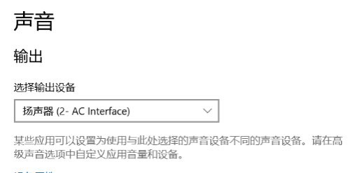

sidebar_position: 2

# USB Gadget 开发指南

适用范围：

- SpacemiT Linux 6.1
- SpacemiT Linux 6.6

## Linux USB Gadget API 框架

### 概述

Linux USB Gadget 机制使开发板能够以 USB 外设（Device） 的身份，通过 USB 接口连接到 USB 主机。

通过 USB Gadget，开发板可以被主机识别为多种常见 USB 外设，例如：

- USB U 盘
- USB 网卡
- USB 串口

在日常使用中，手机通过 USB 连接到 PC 后实现的数据传输、ADB 调试、USB 网络共享等功能，本质上也都是基于 Linux USB Gadget 框架实现的。


从底向上，USB Device 驱动框架可划分为以下几个层次：  

- **USB Device Controller (UDC) Driver**
  该层为 USB Device 控制器驱动，负责初始化控制器硬件及进行底层数据收发操作。  

- **UDC Core**
  对 USB Device 层进行抽象，基于 `usb_request` 机制完成数据传输，并向上、下层提供统一接口。

- **Composite Layer**  

  为支持单个 Linux 设备在 Gadget 模式下同时提供多个 USB 接口（即一个物理设备呈现为多功能 USB 外设），Linux USB Gadget 框架基于 USB 2.0 ECN Interface Association Descriptor（IAD） 实现了 Composite Driver 中间层。
  在该机制下：
  - 上层只需实现独立的 Function Driver
  - 用户可自由组合多个 function，形成多功能 USB 设备
  - 支持两种配置方式：
    - 用户空间通过 ConfigFS 配置（推荐）
    - Legacy 驱动硬编码组合好的 Functions（不推荐）
  
  本文后续内容均基于 **ConfigFS 配置方式** 进行说明，不建议继续使用 legacy 驱动。

- **Function Driver**
  此为 USB Device 功能层，负责实现 USB Device 模式的功能驱动，对接内核其他框架，如
  - 存储
  - V4L2
  - 网络
  
- **ConfigFs API**
  ConfigFs 是 Linux 内核中一个通过让用户创建、编辑目录结构和文件来配置内核功能的子系统。
  在 USB Gadget API 框架中，用户主要通过操作 `configfs` 的 `usb_gadget` 子目录下的目录结构、属性文件来进行 Function Driver、 USB 协议相关元信息配置（框图中省略了该部分）。
  
  更多信息可以参考内核文档 [Linux USB gadget configured through configfs | The Linux Kernel documentation](https://www.kernel.org/doc/html/latest/usb/gadget_configfs.html)。

- **Userspace**
  大部分 USB gadget function 都依赖此层（即 应用层）的配置或与 Linux 的其他子系统的 API 交互，例如：
  - 网卡 gadget：需要用户完成网络配置
  - U 盘 gadget：需要用户完成块设备或文件系统配置
  
  （框图中省略了该部分）
  
  部分 USB gadget function 还需要应用层的服务才能够正常工作，例如：
  - ADB (Android Debug Bridge) 功能
  - MTP 功能

这些层次结构共同构成了 Linux 系统中 USB 子系统的框架，确保了 USB Device 模块系统中的正常运行和数据传输。

内核文档参考资料：

- [Linux USB gadget configured through configfs | The Linux Kernel documentation](https://www.kernel.org/doc/html/latest/usb/gadget_configfs.html)：简要介绍了如何使用 ConfigFs 进行 USB Gadget 配置。
- [Linux USB Gadget Testing | The Linux Kernel documentation](https://www.kernel.org/doc/html/latest/usb/gadget-testing.html)：该文档介绍各类 function 的 ConfigFs 属性说明和简要测试方法。

### Kernel menuconfig 配置

本节仅介绍 Linux USB Gadget 相关的配置。
对于板级 DTS、 USB IP 驱动的配置，请参考 BSP 外设驱动开发文档的 USB 相关章节。

#### 启用 ConfigFS Gadget 支持

- 首先，要打开 `USB_CONFIGFS` 配置，从而用户可以使用 ConfigFs 配置启用 Function Driver。

- 启用后， `USB_CONFIGFS` 的子菜单下就会展示出各个 `USB_CONFIGFS_` 前缀开头的 Function Driver 的配置可供启用。

   ```bash
   Location:
     -> Device Drivers
       -> USB support (USB_SUPPORT)
          -> USB Gadget Support (USB_GADGET)
          -> USB Gadget functions configurable through configfs (USB_CONFIGFS)
             -> Abstract Control Model (CDC ACM) (CONFIG_USB_F_ACM)
             -> Network Control Model (CONFIG_USB_F_NCM)
             -> RNDIS (CONFIG_USB_F_RNDIS)
             -> Mass storage (CONFIG_USB_F_MASS_STORAGE)
             -> Function filesystem (FunctionFS) (CONFIG_USB_F_FS)
             -> USB Webcam function (CONFIG_USB_F_UVC)
             -> HID function (CONFIG_USB_F_HID)
             -> USB Gadget Target Fabric (CONFIG_USB_F_TCM)
   ```

以上仅列举了部分常用 Function Driver 的 menuconfig，用户配置打开时注意下也同时把相应依赖 **Depends on** 的 menuconfig 打开。

更多具体的驱动：

- 可查看 menuconfig 的 help
- 或者直接参考内核源码目录 `drivers/usb/gadget/function/`。其中，目录中以 `u_` 前缀命名的文件为 Utility 模块，用于为以 `f_` 前缀命名的 Function Driver 提供通用支持。

#### Gadget 调试相关配置（可选）

用户如果需要联合应用层和内核一起调试，可以打开以下内核配置选项。
开启后将输出更丰富的调试信息，便于问题定位（默认均为关闭）：

```bash
CONFIG_USB_GADGET_DEBUG=y
CONFIG_USB_GADGET_VERBOSE=y
CONFIG_USB_GADGET_DEBUG_FILES=y
CONFIG_USB_GADGET_DEBUG_FS=y
```

#### 关于 Precomposed Gadget 配置

其他的相关的 menuconfig 配置项用户可自行探索，如 `USB Gadget precomposed configurations` 下可以配置
开机自动配置的 function driver，默认选取第一个 UDC，只是灵活性和调试便利程度不如我们通过 ConfigFs API 进行配置，
通常不建议启用该选项，这会使得 Bianbu 系统中自带的开机自启的 ADB 服务无法正常工作。

### FunctionFS

如果用户需要在内核已有的功能之外，需要实现 **自定义端点配置**、**协议的 USB Gadget function driver**，可以基于 FunctionFS 进行开发。

与其他固定功能的 Function Driver 不同，FunctionFS 提供了一套灵活的 **User mode file system API**，允许用户在应用层实现 USB 协议逻辑，包括：

- USB 描述符
- 端点配置
- 数据传输处理

我们熟悉的手机上的 **ADB(Android Debug bridge)**， **MTP(Media Transfer protocol)** 都是基于 FunctionFS 实现的。

内核中提供了一套简单基于 bulk 传输的 demo，源文件位于 Kernel 源码的目录下

```bash
tools/usb/ffs-aio-example
```

用户可在跑通该 demo 的基础上，进行定制修改，以实现自己的 USB 协议和数据传输逻辑。

本文后续将介绍：

- 基于 FunctionFS 的 ADB Function
- MTP Function
- 用户自定义协议的示例实现

## USB Gadget 功能配置

具体详细的 configfs 配置可以参照前文[概述](#概述)中列出的内核官方文档。

本文不再逐项展开所有 ConfigFS 属性，而是结合 **[SpacemiT usb-gadget 仓库](https://gitee.com/spacemit-buildroot/usb-gadget)** 提供的 `scripts/gadget-setup.sh` 配置脚本进行讲解。

> **注意：** 请在使用前切换至 **最新发布分支**，以确保获取最新的脚本与功能支持。

为便于理解后续章节内容，建议在阅读本文时 **同时打开并对照阅读最新版本的 `scripts/gadget-setup.sh` 脚本源码**。

对于每一个 Function，其 ConfigFS 配置逻辑被划分为以下几个部分：

- `_config`
- `_link`
- `_unlink`
- `_clean`

该仓库的主要目标是帮助用户 **快速跑通 Demo**。

### 概述

在开发板系统中执行 `gadget-setup.sh` 脚本即可完成 USB Gadget 功能配置。
脚本的基本使用方法可通过以下命令查看：

```bash
gadget-setup.sh help
```

`gadget-setup.sh` 默认创建的 Gadget 实例名称为 **spacemit**。
脚本中已配置以下 USB 相关信息：

- VID / PID 序列号
- USB 厂商字符串
- USB 产品字符串

如有需要，用户可以对上述信息进行修改。
> **注意：** 需向 USB-IF 购买后分配的。

#### UDC 绑定说明

在 `/sys/kernel/config/usb_gadget/` 目录下，每一个 Gadget 实例在启用时都需要绑定一个 **UDC**。

当通过脚本成功配置并启用特定功能后，可以在 ConfigFS 中看到对应的 UDC 已被绑定。例如：

```bash
# 举例：使用 K1 的 USB3.0 控制器作为 UDC
/sys/kernel/config # cat usb_gadget/spacemit/UDC
c0a00000.dwc3
```

#### ADB 与 UDC 占用说明

注意 **Buildroot** 和 **Bianbu** 都系统自带了 **ADB**，默认在第一个 UDC 上加载
（即 K1 下载口 USB0 对应的 USB 控制器）。

如果使用脚本 `gadget-setup.sh` 时发现第一个 UDC 被占用，可以使用下面命令关闭系统的 ADB 服务解除占用：

```bash
# Buildroot
~ # /etc/init.d/S50adb-setup stop

# Bianbu 使用 systemctl 关闭 adbd 服务
~ # systemctl stop adbd
```

#### UDC 冲突检测

`gadget-setup.sh` 在运行过程中会自动检测 UDC 的占用情况。
如果扫描到目标 UDC 已被占用，脚本将打印错误信息并停止配置流程，例如：

```bash
~ # gadget-setup ncm
gadget-setup: Selected function ncm
....
gadget-setup: We are now trying to echo c0a00000.dwc3 to UDC......
gadget-setup: ERROR: Your udc is occupied by: /sys/kernel/config/usb_gadget/g1/UDC
gadget-setup: ERROR: configfs preserved, run gadget-setup resume after conflict resolved
```

### UVC (USB Video Class)

**相关的参考资料**

- [USB Video Class v1.5 document set](https://www.usb.org/document-library/video-class-v15-document-set)
- [Linux UVC Gadget Driver Document](https://docs.kernel.org/6.16/usb/gadget_uvc.html)

**需启用的配置项：** `CONFIG_USB_F_UVC`

UVC 功能是使开发板以 USB 摄像头 的形式对外提供视频流。它依赖应用程序 `uvc-gadget-new` 提供数据源。该程序源码可以在 [SpacemiT usb-gadget 仓库](https://gitee.com/spacemit-buildroot/usb-gadget) 下载。用户可根据实际需求对源码进行编译或二次开发。

#### 帧格式与 USB 带宽说明

UVC 协议采用 **USB 的同步传输**，由于 USB 总线需要保障同步传输的带宽稳定占用，必须留出带宽供其他非同步传输的设备使用，因此同步传输无法占用所有总线带宽，存在最大可用带宽限制。

**USB2.0 HighSpeed** 模式下，同步传输最大带宽可以通过 ConfigFS 参数  `streaming_maxpacket` 调整。

- 可选值：1024，2048，3072
- 这决定了 USB 总线上对该同步传输一个微帧最多可传输的数据量，对应的最大带宽为分别为 7.8125MBps， 15.625MBps， 23.4375MBps。

**USB3.0 SuperSpeed** 模式下，同步传输最大带宽为 351.5625MBps，可以通过 ConfigFS 参数 `streaming_maxpacket` 和 `streaming_maxburst` 调整。 `streaming_maxburst` 可选 1 到 15 。

以下 ConfigFS 参数会直接影响 UVC 同步传输的最大可用带宽：

- **`streaming_interval`**
  配置同步传输端点描述符中的 `bInterval`，取值范围 1..255
  数值越小，最大带宽越大。

- **`streaming_maxpacket`**
  配置同步传输端点描述符中的 `wMaxPacketSize`，可选 1024 / 2048 / 3072
  数值越大，带宽越大。

- **`streaming_maxburst`**
  配置同步传输端点描述符中的 `bMaxBurst`，取值范围 1..15
  数值越大，最大带宽越大，仅在 USB 3.0 下生效。

下表给出了常见 **YUV 格式** 的带宽需求。
**MJPEG** 由于采用压缩编码，其带宽需求显著低于 YUV，使得 USB 2.0 也可以支持全高清甚至 4K 分辨率。

| 格式（ YUV）      | 长 | 宽 | 帧率  | 带宽 (MBps)      |
|------------------|---------|--------|------|---------------|
| 240p@30          | 480     | 240    | 30   | 6.591796875   |
| 360p@15          | 360     | 640    | 15   | 6.591796875   |
| 360p@30          | 360     | 640    | 30   | 13.18359375   |
| 720p@10          | 720     | 1280   | 10   | 17.578125     |
| **640p@30**      | **640** | **640**|**30**| **23.4375**   |
| 720p@15          | 720     | 1280   | 15   | 26.3671875    |
| 360p@60          | 360     | 640    | 60   | 26.3671875    |
| 720p@15          | 720     | 1280   | 15   | 26.3671875    |
| 480p@60          | 480     | 640    | 60   | 35.15625      |
| 720p@30          | 720     | 1280   | 30   | 52.734375     |
| 1080p@15         | 1080    | 1920   | 15   | 59.32617188   |
| 720p@60          | 720     | 1280   | 60   | 105.46875     |
| 1080p@30         | 1080    | 1920   | 30   | 118.6523438   |
| 1080p@60         | 1080    | 1920   | 60   | 237.3046875   |
| 4k@30            | 3840    | 2160   | 20   | 316.40625     |

#### 测试图案 Demo 配置

开发板作为 USB Device 进行 UVC 测试时，UVC 配置可采用以下两种方式：

1. **使用专用 UVC 脚本（推荐）**

   该方式支持更丰富的 UVC 配置，便于用户自定义分辨率和帧格式。
   详细参数说明请参考脚本源码。

   独立 USB PID，配置方式如下：

   ```
   uvc-gadget-setup.sh start
   uvc-gadget-new spacemit_webcam/functions/uvc.0
   ```

2. 使用 Composite Gadget 脚本

   该方式内置常用分辨率，支持 UVC 与其他 USB 功能同时使用：

   ```
   gadget-setup.sh uvc
   uvc-gadget-new spacemit/functions/uvc.0
   ```

用户也可根据产品需求自行定制 `gadget-setup.sh` 脚本。

将开发板接入 PC 后，使用常见摄像头软件即可看到测试图案，例如：

- Windows：PotPlayer、AMCap
- Linux：guvcview


#### 真实摄像头数据通过 V4L2 接入 UVC Gadget

视频图像的数据流如下字符画所示：

```
+------------------+       +------------------+
|  Source Camera   |       |  Linux System    |
|  (MIPI/USB)      |       |                  |
|  +------------+  |       |  +------------+  |
|  | Sensor     |  |       |  | V4L2       |  |
|  |            |--+-------+->| Framework  |  |
|  +------------+  |       |  +------+-----+  |
+------------------+       |         |        |
                           |  +------v-----+  |
                           |  | App        |  |
                           |  |            |  |
                           |  | uvc-gadget-new|
                           |  +------+-----+  |    +------------------+
                           |         |        |    |  PC Host         |
                           |  +------v-----+  |    |                  |
                           |  | USB UVC    |  |    |  +------------+  |
                           |  | Gadget driver |    |  | Camera App |  |
                           |  +------+-----+  |    |  +------------+  |
                           +---------|--------+    +------|-----------+
                                     |                    |
                                     |       USB Cable    |
                                     +--------------------+
                                         Act As a Camera
```

首先配置如下：

1. **分辨率与格式匹配**
   UVC 配置中的帧格式必须与数据源摄像头在 V4L2 中支持的格式一致，包括：

   - 编码格式
   - 分辨率
   - 帧率
   - 数据缓冲区大小

2. **注册自定义 Profile**
   在 `uvc-gadget-setup.sh` 的 `setup_custom_profile()` 中，参照已有方式注册真实摄像头参数。

然后启动命令示例：

```
uvc-gadget-setup.sh start custom
uvc-gadget-new spacemit_webcam/functions/uvc.0 -d /dev/videoX 
```

**注意：** `videoX` 中的 `X` 需要替换为 **真实摄像头在 K1 开发板上对应的 V4L2 视频节点编号**。
若同一摄像头注册了多个 `/dev/video*` 设备节点，通常应选择该摄像头对应的第一个（编号最小的）视频节点，例如 `/dev/video17`。

此时若系统工作正常，在上位机打开摄像头应用后，选择该摄像头实际支持的帧格式，保持其余参数为默认值，即可正常显示视频画面。

在大多数情况下，会发现数据源 Camera 在 V4L2 框架下分配的视频缓冲区大小，与 USB Gadget 脚本中配置的 `dwMaxVideoFrameSize` 默认值不一致，从而导致如下错误信息。

```
/dev/video17: buffer 0 too small (460800 bytes required, 256000 bytes available).
Failed to import buffers on sink: Invalid argument (22)
```

这主要是由于 MJPG 等压缩编码具有较高的灵活性，使得 `dwMaxVideoFrameSize` 会随着不同摄像头及具体帧格式而变化。

当出现前述报错时

1. **记录实际可用的帧大小**
   需记录 `available` 的数据大小。
   在本例中，该值为 256000。（需要注意的是：460800 是脚本根据所选帧格式自动计算得到的 默认值）。

2. **配置自定义 `dwMaxVideoFrameBufferSize`**
   编辑 `~/.uvcg_config` 配置文件，使得对应编码 + 分辨率（前提是脚本中已配置并启用了该格式）指代的帧格式映射到自定义的 `dwMaxVideoFrameBufferSize`，填入上面报错的 256000。
   示例如下：

   ```
   ~ # cat ~/.uvcg_config
   # .uvcg_config for spacemit-uvcg, config line format:
   #     <format:[mjpeg]> <width> <height> <dwMaxVideoFrameBufferSize>
   # e.g. mjpeg 640 360 251733
   mjpeg 1280 720 25600
   ```

3. **配置在脚本中的生效机制**
   上述配置的解析与应用逻辑，位于 `uvc-gadget-setup.sh` 脚本中的 `add_uvc_fmt_resolution()` 函数。

   在本示例中，25600 最终会被写入到以下路径的配置属性文件中：

    ```
   /sys/kernel/config/usb_gadget/spacemit_webcam/functions/uvc.0/streaming/mjpeg/m/720p/dwMaxVideoFrameBufferSize
   ```

4. **重新启动**
   配置完成后再重新执行上面的启动脚本和 UVC APP 的命令即可。

最终量产方案可以定制脚本来适配， `uvc-gadget-setup` 主要目的是提供一个方便反复调试的脚本。

### UAC (USB Audio Class)

**相关的参考资料**

- [USB Audio Class v1.0](https://www.usb.org/sites/default/files/audio10.pdf)
- [USB Audio Class Rev 2.0](https://www.usb.org/document-library/audio-devices-rev-20-and-adopters-agreement)
- [ALSA Project](http://www.alsa-project.org/)

**需启动配置项：**

- `CONFIG_USB_F_UAC1`
- `CONFIG_USB_F_UAC2`

内核中有两个驱动，分别是 UAC 1.0 和 UAC 2.0 。

**使用前提与运行环境说明**

- UAC Gadget 的工作模式是：开发板作为 USB 声卡
- 上层需要配合 `alsa-utils` 工具使用
- 推荐在 Bianbu 系统 下进行调试

**UAC 1.0 与 UAC 2.0 的差异与兼容性说明**
从 USB 规范角度看：

- **UAC 2.0** 相比 UAC 1.0 在以下方面进行了增强：
  - 更高的采样精度
  - 更大的可用带宽
  - 更完善的控制接口
  - 更灵活的时钟同步机制
- 详细差异可参考前述 USB 官方规范文档

从实际系统兼容性角度看：

- Linux 内核同时支持 UAC 1.0 与 UAC 2.0 Gadget
- 不同主机操作系统对 UAC 版本的支持存在差异：

  - **Windows**：UAC 2.0 兼容性相对较差，部分功能（如音量调节）不可用
  - **macOS / Linux**：对 UAC 2.0 支持较好

**系统连接**
下文中提到的配置，都基于下图的连接关系进行：

    ALSA Audio Device -----> K1 Development Board ----USB----> Linux/Windows PC 
                                (UAC Gadget)                      USB Host

其中 ALSA Audio Device 可以使用开发板接口接入, 例如：

- 模拟耳机
- USB 耳机（支持录音）
- 其他音频设备

**依赖安装**
在开发板系统中需要安装 `alsa-utils`：

- **Bianbu 系统**
  - 使用 `apt` 安装 `alsa-utils`
- **Buildroot 系统**
  - 启用 `BR2_PACKAGE_ALSA_UTILS`
  - 并确保相关 ALSA 依赖配置已打开
  
**启动 UAC Gadget**
`gadget-setup` 脚本已集成了 UAC 功能。
首先根据需求执行以下命令拉起 UAC Gadget：

```
    # 使用 UAC 1.0
    gadget-setup.sh uac1
    # 使用 UAC 2.0
    gadget-setup.sh uac2
```

执行后，通过 USB 线将开发板连接至 PC， PC 侧即可识别到新的音频设备。

- UAC1.0 在 Windows 10 (本文档基于 21H2) 的设备名称是 AC— Interface

  

- UAC2.0 在 Windows 10 PC 上的音频设备名称是 Source/Sink
- UAC1.0/UAC2.0 在 Linux PC 上的音频设备名称是 USB Gadget 的 Product String

    ```
    root@M1-MUSE-BOOK:~# aplay -l
    **** PLAYBACK Hardware Device List ****
    card 1: Device [SpacemiT Composite Device], device 0: USB Audio [USB Audio]
        subdevice: 0/1
        subdevice #0
    ```

下文将分别介绍 UAC Gadget 的两类核心功能：

- **音频播放**
- **音频录制**

#### Windows PC 播放音频到 UAC Gadget

本节说明如何在 **Windows 主机播放音频**，并由 **K1 开发板上的 UAC Gadget 接收音频数据**，再通过本地音频设备进行回放。

1. **Windows 侧配置播放设备**

   在 Windows 任务栏中找到音量图标，右键进入 **声音设置**，将系统播放设备切换为对应的 **UAC Gadget 设备**。
  （设备名称根据前文 UAC 版本说明选择，例如 *AC-Interface* 或 *Source / Sink*）

    

2. **K1 开发板侧确认音频设备编号**

   在UAC Gadget 的 K1 开发板上，分别执行以下命令查看当前系统中的音频播放与录制设备：

   ```bash
   aplay -l
   arecord -l
   ```

   示例如下：

    ```
    root@spacemit-k1-x-deb1-board:~# aplay -l
    **** PLAYBACK 硬體裝置清單 ****
    card 0: C [H180 Plus (Type C)], device 0: USB Audio [USB Audio]
    子设备 : 0/1
    子设备 #0: subdevice #0
    card 1: sndes8326 [snd-es8326], device 0: i2s-dai0-ES8326 HiFi ES8326 HiFi-0 []
    子设备 : 1/1
    子设备 #0: subdevice #0
    card 2: UAC1Gadget [UAC1_Gadget], device 0: UAC1_PCM [UAC1_PCM]
    子设备 : 1/1
    子设备 #0: subdevice #0

    root@spacemit-k1-x-deb1-board:~# arecord -l
    **** CAPTURE 硬體裝置清單 ****
    card 0: C [H180 Plus (Type C)], device 0: USB Audio [USB Audio]
    子设备 : 1/1
    子设备 #0: subdevice #0
    card 1: sndes8326 [snd-es8326], device 0: i2s-dai0-ES8326 HiFi ES8326 HiFi-0 []
    子设备 : 1/1
    子设备 #0: subdevice #0
    card 2: UAC1Gadget [UAC1_Gadget], device 0: UAC1_PCM [UAC1_PCM]
    子设备 : 0/1
    子设备 #0: subdevice #0
    ```

   在上述输出中，请记录各音频设备对应的 `card x, device y` 编号。用于唯一标识 ALSA 音频设备，后续通过 `hw:x,y` 指定录制源与播放设备，例如 `hw:2,0` 为 UAC1Gadget，`hw:0,0` 为耳机。
   后续在构建音频录制与播放管道时，将通过 `hw:x,y` 的形式显式指定音频设备。
   例如，在本示例中：
   - `hw:2,0` 表示 **UAC1Gadget 音频设备**（来自 USB Host 的音频流）
   - `hw:0,0` 表示 **本地耳机设备（H180 Plus）**

3. **建立录制与播放管道**

   K1 开发板执行以下命令：

    ```
    arecord -f dat -t raw -D hw:2,0 | aplay -f dat -D hw:0,0
    ```

    该命令实现的功能为：

   - 从 **UAC Gadget（hw:2,0）** 录制音频数据
   - 并将音频数据实时播放到 **本地耳机（hw:0,0）**

4. **常见报错及规避方法**
    执行上述命令时，可能会遇到如下错误：

    ```
    root@spacemit-k1-x-deb1-board:~# arecord -f dat -t raw -D hw:2,0 | aplay -f dat -D hw:0,0
    arecord: main:834: aplay: main:834: 音乐打开错误： 设备或资源忙
    音乐打开错误： 设备或资源忙
    ```

   该问题是由于 **UAC Gadget 驱动与 ALSA 之间的设备状态切换不一致** 引起的。

   可通过以下方式规避：

   - 在 Windows 侧切换播放设备后，**先在该设备（如 UAC1 对应的 AC-Interface）开始播放音频**，然后再回到 K1 重新执行命令。
   - 若仍然报错：
     - 在 Windows 侧先切换到其他声卡播放音频
     - 再切换回 UAC Gadget 对应的设备（如 UAC1 对应的 AC-Interface）

   上述操作会触发 Windows 重新初始化音频流，使 Gadget 端音频设备进入正确的 **Capture 状态**。

5. **正常运行**
    若设备状态正确，执行命令将看到如下输出， 即
    - K1 开发板上会正常开始从 `hw:2,0` 设备（ UAC1Gadget）录制，并且播放到 `hw:0,0` 设备（ H180 Plus 耳机）

    ```
    root@spacemit-k1-x-deb1-board:~# arecord -f dat -t raw -D hw:2,0 | aplay -f dat -D hw:0,0
    正在录音 原始資料 'stdin' : Signed 16 bit Little Endian, 频率 48000Hz， Stereo
    正在播放 原始資料 'stdin' : Signed 16 bit Little Endian, 频率 48000Hz， Stereo
    ```

#### Linux PC 播放音频到 UAC Gadget

本节说明如何在 **Linux PC（USB Host）侧通过命令行播放音频**，
并由 **K1 开发板上的 UAC Gadget 接收音频数据**，再通过 **K1 本地耳机设备**进行回放。

> 由于不同 Linux 发行版的桌面环境差异较大，以下流程**统一采用命令行方式**。

1. **Linux PC 侧确认 UAC Gadget 设备编号**

   在 Linux PC 上执行以下命令，找到 K1 开发板模拟的 UAC 设备（即，当前可用的音频播放设备）：

   ```bash
   aplay -l
   ```

   示例如下：

   ```
    root@mbook:~# aplay -l
    **** PLAYBACK Hardware Device List ****
    card 1: Device [SpacemiT Composite Device], device 0: USB Audio [USB Audio]
        subdevice: 0/1
        subdevice #0
   ```

   记录对应的 **ALSA 设备编号**，例如：
   - `hw:1,0`：Linux PC 识别到的 **UAC Gadget 音频设备**

   该编号将在后续播放命令中使用。

2. **准备测试音频文件**
   在 Linux PC 上准备一个 WAV 格式音频文件，并重命名为 `test.wav`。
   > 该文件将作为 Host → Gadget 的音频数据源。

3. **确保桌面环境未占用 UAC 设备**

   在 Linux PC 的**图形桌面音频设置中**，**不要将系统默认输出设备绑定到 K1 开发板模拟的 UAC 设备**。否则会出现报错。

4. **Linux PC 侧播放音频到 UAC Gadget**

   Linux PC 上使用 `aplay` 命令播放 `test.wav` 发送到 UAC Gadget:

    ```
    root@mbook:~# aplay test.wav -c 2 -r 48000 -D plughw:1,0
    ```

5. **K1 开发板侧建立录制与播放管道**

   在 K1 开发板上执行以下命令，可从 **UAC Gadget 音频设备（hw:2,0）** 接收并录制来自主机的音频数据，并将其**实时转发并播放**到通过 `aplay -l` 识别的 **本地音频输出设备（hw:0,0）**。

    ```
    arecord -f dat -t raw -D hw:2,0 | aplay -f dat -D hw:0,0
    ```

#### Windows PC 从 UAC Gadget 录制音频

本节说明如何将 **K1 开发板上的音频数据** 通过 **UAC Gadget** 发送到 **Windows PC**，并在 Windows 侧使用录音软件进行采集与验证。

1. **Windows 侧配置录音设备**

   在 Windows 任务栏中找到音量图标，右键进入 **声音设置**，将系统 **录音设备** 设置为对应的 **UAC Gadget 设备**。
   （设备名称根据前文 UAC 版本说明选择，例如 *AC-Interface* 或 *Source / Sink*）

    

2. **关闭 Windows 音频增强功能**

   在步骤 1 的设备设置页面中，依次进入：

   **设备属性 → 更多设备属性 → 高级 → 信号增强**

   取消勾选 **“启用音频增强”**。

    

3. **准备测试音频文件**

   在 K1 开发板上准备一个 WAV 格式音频文件，并命名为 `test.wav`。

4. **K1 开发板侧向 UAC Gadget 播放音频**

   在 K1 开发板上执行以下命令，通过 UAC Gadget 向 Windows 发送音频数据：

    ```bash
    root@spacemit-k1-x-deb1-board:~/ffs# aplay test.wav -c 2 -r 48000 -D plughw:2,0

    # 正常情况下会看到类似输出
    正在播放 WAVE 'test.wav' : Signed 16 bit Little Endian, 频率 48000Hz， Stereo
    ```

    其中：
    - `hw:2,0` 需根据 `aplay -l` 的输出，替换为 **UAC Gadget 对应的设备编号**

    若出现如下错误：

   ```text
   aplay: pcm_write:2146: 写入错误：输入 / 输出错误
   ```

   可按以下步骤处理：
   - 先在 Windows 侧打开录音软件
   - 点击 **开始录制**
   - 再回到 K1 开发板重新执行 `aplay` 播放命令

5. **Windows 侧开始录音**

   在 Windows 上打开任意录音软件，并开始录制。

   此时应能够录制到来自 K1 开发板播放的音频内容。

6. **异常音频排查建议**
   若录制结果异常（无声音、失真等），请优先确认：

   - Windows 侧 **“音频增强”** 功能已关闭
   - 当前录音设备确实为 UAC Gadget
   - K1 侧 `aplay` 使用的设备编号正确

#### Linux PC 从 UAC gadget 录制音频

本节说明如何在 **Linux PC** 上，通过 **UAC Gadget** 录制来自 **K1 开发板** 的音频数据，并保存为 WAV 文件。

整体流程与 Windows 类似，但 Linux 侧需要重点关注 **录音音量设置**。

- 与 Windows 不同，Linux 无需关闭**音频增强**功能
- **必须关注录音音量大小**：
  - 部分 Linux 发行版中，录音音量设置为 **50** 时为正常增益
  - **大于 50 会进行放大**，可能导致 UAC Gadget 发送的音频数据失真

Linux 使用命令行 arecord 命令录制音频为 wav 文件的命令步骤如下：

1. **确认 UAC Gadget 设备编号**

   在 Linux PC 上执行：

   ```bash
   arecord -l
   ```

   从输出中找到 **K1 开发板模拟的 UAC 设备**，并记录对应的：

   - `card x`
   - `device y`

   后续命令中将使用 `hw:x,y` 形式指定该设备。

2. **确保系统未占用 UAC 设备**

   请确认 **Linux 图形界面音频系统未绑定或占用** K1 开发板模拟的 UAC 设备，否则会出现报错。

3. **使用 arecord 录制音频**

   执行以下命令，将来自 UAC Gadget 的音频录制为 `record.wav`：

   ```bash
   arecord -f dat -c 2 -D hw:1,0 -t wav -d 20 record.wav
   ```

   参数说明：
   - `-f dat`
     常用音频格式缩写（可通过 `arecord -h` 查看完整帮助说明）
   - `-D hw:1,0`
     替换为步骤 1 中查到的 UAC Gadget 设备编号
   - `-d 20`
     录制时长为 20 秒

4. **K1 开发板侧播放音频**

K1 开发板执行命令开始播放音频（具体参数的值需要参考前面的介绍，特别是 hw:2,0 要替换为实际 UAC1Gadget 对应的值）：

   在 K1 开发板上执行以下命令，通过 UAC Gadget 向 Linux PC 发送音频数据 （具体参数的值需要参考前面的介绍，特别是 `hw:2,0` 需根据 K1 侧 `aplay -l` 的输出，替换为 **UAC1Gadget 实际对应的设备编号**）：

   ```
   root@spacemit-k1-x-deb1-board:~/ffs# aplay test.wav -c 2 -r 48000 -D plughw:2,0

   # 正常情况下将看到：
   正在播放 WAVE 'test.wav' : Signed 16 bit Little Endian, 频率 48000Hz， Stereo
   ```

#### 参数配置与二次开发

UAC 支持部分参数配置，当前脚本中已对其中一部分进行了设置。

如需进行二次开发，可参考以下资料：

- UAC 相关规范
- 脚本源码实现
- Linux 官方文档：[Linux USB Gadget Testing – UAC2](https://www.kernel.org/doc/html/latest/usb/gadget-testing.html#uac2-function)

### ACM (CDC-ACM: Communication Device Class - Abstract Control Model)

#### 功能概述

ACM 是一种 USB 串口设备类协议。启用后，开发板将以 **USB 串口设备（Virtual COM Port）** 的形式呈现，实现标准串口的 Tx / Rx 数据通信。

启用 ACM 后：

- 开发板侧 Linux 系统会生成对应的 TTY 设备节点
- 主机（Host）枚举开发板时，会将其识别为串口设备
- 双方通过各自的串口设备节点进行数据通信

**需启用的核配置项：** `CONFIG_USB_F_ACM`

#### 启动 ACM Gadget

通过 gadget 脚本拉起 ACM 功能：

```bash
gadget-setup.sh acm
```

#### 设备节点说明

- **Gadget（开发板）侧**
   启动成功后，系统会在 `/dev` 目录下生成 `ttyGS*` 块设备节点，通常是 `/dev/ttyGS0` 。

- **Host（PC）侧**
  - **Linux PC**
    - 设备节点名称前缀通常为：`/dev/ttyACM*`
    - 可使用 `picocom`、`minicom` 等串口工具，或通过 命令行的 `echo` / `cat` 进行简单通信

  - **Windows PC**
    - 设备会枚举为 COM 串口
    - 可使用 SecureCRT、WindTerm 等串口工具进行通信
    - 对应的 COM 端口号可通过设备管理器或者 [USBTreeView](https://www.uwe-sieber.de/usbtreeview_e.html) 查看

#### 使用说明

ACM Gadget 启动完成后，主机与开发板两端通过各自识别到的串口设备节点，即可进行标准串口通信。

### ADB (Android Debug Bridge)

#### 功能概述

ADB（Android Debug Bridge）是一种多功能命令行工具，用于与设备进行通信。通过 ADB，用户可以：

- 使用 ADB Shell 在设备上执行命令
- 在主机与设备之间上传 / 下载文件
- 重启设备或进入刷机（fastboot）模式
- 通过 USB 或网络方式进行连接

**需启用的核配置项：**

- `CONFIG_USB_F_FS`
- `CONFIG_NET` - 相关网络配置（ADB 上层应用程序依赖网络）。

#### ADB Gadget 实现说明

`gadget-setup.sh` 通用脚本中已集成 ADB 功能，其实现方式为 **FunctionFS**。

除内核支持外，还需要上层应用 **adbd** 才能正常工作：

- **Buildroot**
  - 启用 `BR2_PACKAGE_ANDROID_TOOLS_ADBD` 以编译 adbd 服务程序
- **Bianbu**
  - 通过 `apt` 安装 `android-tools` 软件包

> **注意**
> Bianbu / Buildroot 系统中可能已默认集成 adb 功能。
> 系统自带的 ADB 与 `gadget-setup.sh` **不能同时使用**。
> 可通过查看 `/sys/kernel/config/usb_gadget` 目录下的不同 USB Gadget 实例进行区分。

#### 使用 `gadget-setup.sh` 配置 ADB

使用 `gadget-setup.sh` 脚本配置 adb 功能的步骤如下：

```bash
# 配置 adb
gadget-setup.sh adb

# 停止 adb
gadget-setup.sh stop
```

ADB 的用法简要介绍：

PC 可以通过官方途径下载 adb 软件包 [platform-tools](https://adbdownload.com/)，
下载解压后，并且把 bin 目录加入到系统 PATH 环境变量里面去。

#### PC 端 ADB 工具准备

- PC 端需安装官方 ADB 工具包 **[platform-tools](https://adbdownload.com/)**
- 下载解压后，将其 `bin` 目录加入系统 `PATH` 环境变量里

#### 常用 ADB 命令示例

```bash
# 把 PC 的文件推送到开发板：
adb push C:/xxx.yyy /home/bianbu/

# 把开发板的文件拉取到 PC：
adb pull /home/bianbu/remote_file C:/

# 进入刷机模式 ：
adb reboot fastboot
```

#### Linux PC 常见权限问题

Ubuntu(Linux) PC 上的 adb 命令行工具工具可能会出现以下报错：

```
$ adb devices
List of devices attached
735ec889dec8 no permissions(user in plugdev group;are your udev rules wrong?);see [http://developer.android.com/tools/device.html]usb:3-3.3 transport_id:1
```

**解决步骤**

1. 编辑 udev 规则文件：

   ```bash
   sudo vi /etc/udev/rules.d/51-android.rules
   ```

2. 添加以下内容：

   ```text
   SUBSYSTEM=="usb", ATTR{idVendor}=="361c", ATTR{idProduct}=="0008", MODE="0666", GROUP="plugdev"
   ```

3. 重新加载 udev 规则：

   ```bash
   sudo udevadm control --reload-rules
   ```

#### Windows 系统说明

在 Windows 系统中，SpacemiT 开发板所需的 ADB 驱动会在安装 **Titan 刷机工具** 时一并安装，无需额外配置。

### MTP (Media Transfer Protocol)

**相关的 USB 规范：** [Media Transfer Protocol v.1.1 Spec](https://www.usb.org/document-library/media-transfer-protocol-v11-spec-and-mtp-v11-adopters-agreement)

#### 功能概述

MTP（Media Transfer Protocol）是由 USB-IF 维护的一种媒体文件传输协议，广泛应用于手机、相机等设备与 PC 之间的文件传输场景。

典型使用场景为：
手机通过 USB 连接 PC 后，PC 可直接访问手机中的相册、视频等内容，即基于 MTP 实现。

**与 Mass Storage 的区别**

- **Mass Storage**
  块设备或镜像一旦被 PC 挂载，设备端（如，手机）无法再访问该文件系统
- **MTP**
  PC 与设备端（如，手机）可同时访问同一文件系统，使用更便捷。

**需启用内核配置项：** `CONFIG_USB_F_FS`

#### MTP 服务程序选择

MTP Function 基于 **FunctionFS** 实现，因此还需要配合应用层服务程序使用。

本文采用 [umtp-responder](https://github.com/viveris/uMTP-Responder) 作为我们的服务程序，这是一个轻量级的 MTP 服务器，在开发板上， Buildroot和 Bianbu 都可以直接使用。

不同系统的使用方式如下：
- **Buildroot** 
  通过 `CONFIG_BR2_PACKAGE_UMTPRD` 启用编译即可使用；
- **Bianbu** 
  通过 `apt` 安装 `umtp-responder` 软件包安装即可使用；
- **其他 OS**
  从 [Github 源码](https://github.com/viveris/uMTP-Responder) 自行构建即可。


`gadget-setup.sh` 中已经集成基于 umtp-responder 的 MTP function 配置，按照上面步骤安装完成后，执行：

```
gadget-setup.sh mtp
```

即可拉起 MTP function。

我们以 Windows PC 作为上位机举例， MTP 已经实现了免装驱动，于是在 Windows 设备管理器和资源管理器将能够看到相关的便携设备，默认脚本配置的产品名称为 SpacemiT Technologies：


其他 OS（ macOS、 Linux 各发行版）类似。

MTP 支持挂载多个 storage 对象，每个对象可以配置本机路径、名称、读写权限， `umtp-resonder` 在 `/etc/umtprd/umtprd.conf` 中进行配置：

```
storage "/var/lib/umtp" "shared folder" "rw"
# storage "/home/USER/foo"  "home folder" "rw"
# storage "/www"            "www folder" "ro,notmounted"
```

脚本默认配置了一个共享目录，
开发板本机路径是 `/var/lib/umtp`，起名为 `shared folder`（此名字和实际本机路径是独立可配置的，比如相机文件夹可以起名为 DCIM），挂载为可读写，
可用容量对应开发板中本机路径的挂载设备容量。


对比 Mass Storage 两方只有一方能独占一个块设备或镜像， MTP 协议非常的方便和灵活：
当 PC 往该目录读写文件时，会实时在开发板本机观察到更新 , 反之亦然。

通常用户对 MTP Gadget 的参数有定制需求，请用户参考以下资料帮助理解如何定制：

- `gadget-setup.sh` 脚本中如何对 `umtp-responder` 进行配置。
- `umtp-responder` 项目的 `README`。
- `umtp-responder` 安装后的默认配置文件 `/etc/umtprd/umtprd.conf`，其中可以定制产品名称、配置 PC 可访问的本机存储路径和权限。
- MTP 协议设计规范。

### Mass Storage (BOT 协议 , f_mass_storage)

**相关的 USB Spec:**

- [USB Mass Storage Class - Bulk-Only Transport](https://www.usb.org/sites/default/files/usbmassbulk_10.pdf)

**需要打开的配置：** `CONFIG_USB_F_MASS_STORAGE`

开发板作为一个 U 盘设备。 BOT 协议是 Bulk Only Transport。
支持挂载独占镜像或设备节点，此时设备节点将会无法被其他应用使用。
使用内存盘默认格式化为 fat32, Bianbu 需要先安装 `sudo apt install dosfstools`， 其他系统需要有 mkdosfs 命令支持。
具体容量配置可以查看脚本实现。

```
gadget-setup.sh msc:< 镜像或设备节点 >
# 举例
gadget-setup.sh msc:/dev/nvme0n1

# 使用内存盘
gadget-setup.sh msc
```

### Mass Storage ( 支持 UASP + BOT 协议 , f_tcm)

**相关的 USB Spec:**

- [USB Attached SCSI Protocol](https://www.usb.org/document-library/usb-attached-scsi-protocol-uasp-v10-and-adopters-agreement)

**需要打开的配置：** `CONFIG_USB_F_TCM`, `CONFIG_TARGET_CORE`, `CONFIG_TCM_IBLOCK`, `CONFIG_TCM_FILEIO`

开发板作为一个 U 盘设备。 UASP(USB Attached SCSI Protocol) 提升了传输效率。
支持挂载独占镜像或设备节点，此时设备节点将会无法被其他应用使用。
使用内存盘默认没有文件系统。

```
gadget-setup.sh uas:< 镜像或设备节点 >
# 举例
gadget-setup.sh uas:/dev/nvme0n1

# 使用内存盘
gadget-setup.sh uas
```

### RNDIS (Remote Network Driver Interface Specification)

**需要打开的配置：** `CONFIG_USB_F_RNDIS`, `CONFIG_NET` 等网络子系统相关配置。

作为一个网卡设备。 RNDIS 是微软的专利协议。微软的相关文档参考：

- [Introduction to Remote NDIS (RNDIS) | Microsoft](https://learn.microsoft.com/en-us/windows-hardware/drivers/network/remote-ndis--rndis-2)

运行以下命令拉起 rndis gadget：

```
gadget-setup.sh rndis
```

另外最新脚本增加快捷运行 dhcp 服务器功能，依赖 busybox udhcpd ( 自构建 busybox 需要启用 CONFIG_UDHCPD)，只需要执行

```
gadget-setup.sh dhcp
```

就会自动为网卡配置 ip 地址，并且支持给 PC 通过 DHCP 协议分配 IP 地址，具体请查看脚本实现。

#### PC 共享互联网给开发板

本节内容为，对于无直接网络环境只有 RNDIS USB Gadget 连接的开发板，
把 Windows 访问互联网的能力共享给开发板，使得开发板访问互联网。

1. 执行命令：

    ```bash
    gadget-setup rndis
    ```

2. 打开 Windows 网络与共享中心
3. 打开共享网络配置选择一个连接了外网的网络，如 WIFI、有线网络
4. 右键点击属性，
5. 点击共享，然后勾选允许其他网络用户通过此计算机的 Internet 连接来连接。
6. 在选择家庭网络连接列表中选择为用户的 RNDIS 设备（图中以太网 5 是用户的 USB 开发板 RNDIS 设备 , 以太网 14 是用户的 WIFI/ 有线网）：

    

7. 点击确定。
8. 开发板执行 udhcpc -i usb0 获取 Windows 为其分配的 IP 地址。

Windows 还可以基于网桥，请参考相关 Windows 官方手册。

对于 Linux PC，各图形界面不一致这里不介绍，但是网络配置非常灵活，可参考 Linux 相关网络命令工具配置教程。

### NCM (CDC-NCM: Communication Device Class - Network Control Model)

**相关的 USB Spec:**

- [USB CDC-Subclass Specifications For NCM](https://www.usb.org/sites/default/files/NCM11.pdf)

**需要打开的配置：** `CONFIG_USB_F_NCM`, `CONFIG_NET` 等网络子系统相关配置。

不同于 RNDIS 由微软维护， NCM 是 USB-IF 维护网络协议，主流操作系统（ Linux,Windows 11,macOS 等）具备支持。
注：目前 Windows 10 的 ncm 驱动实现和 Linux 6.6 中 ncm gadget 兼容性不是最佳，微软在 Windows 11 才进行修复。

```
gadget-setup.sh ncm
```

另外最新脚本增加快捷运行 dhcp 服务器功能，依赖 busybox udhcpd，只需要执行

```
gadget-setup.sh dhcp
```

就会自动为网卡配置 ip 地址，并且支持给 PC 通过 DHCP 协议分配 IP 地址，具体请查看脚本实现。

对于需要使开发板共享 Windows 的，参考 RNDIS 章节的 "Windows 共享互联网给开发板 " 内容，但是第一步命令要改成 ncm 而不是 rndis。

### HID (Human Interface Device)

**需要打开的配置：** `CONFIG_USB_F_HID`

**USB HID 相关文档：**

- [HID 类协议介绍描述](https://www.usb.org/sites/default/files/hid1_11.pdf)
- [HID Usage Page keycode 对照表](https://www.usb.org/sites/default/files/hut1_4.pdf)
- [USB-IF Report Desc 生成工具](https://www.usb.org/document-library/hid-descriptor-tool)

HID 是人体工学设备， HID Gadget 通常用于模拟键盘鼠标、游戏手柄、音量媒体控制设备，
有时候也会利用 HID 免驱特性用于传输小数据量数据。

```bash
gadget-setup.sh hid
```

脚本中值得注意的有 report 格式，在脚本中的 REPORT_DESC 定义，用户可以通过全局搜索找到他，并且做修改。

具体的 report 格式配置需要熟读 HID 协议，更多详细内容可以参考相关的内核文档、规范文档。

执行脚本后， gadget 端会生成 /dev/hidg0 节点。后续用户通过这个节点和上位机进行通信，比如用户要发送鼠标键盘模拟数据，
就要往这个设备节点写入数据，写入的数据格式遵守 HID report_desc。

**模拟键盘鼠标** 场景的细节可以参考 [这个内核文档](https://www.kernel.org/doc/html/latest/usb/gadget_hid.html)。不过要注意的是这个文档第一步讲解的是传统的基于 g_hid 做的，我们目前用的是 configfs 的配置方法（从 Configuration with configfs 章节开始），用户可以参考第一步其中的 report_desc。文档中实现了一个上报数据的 app 是 hid_gadget_test，在 gadget 端运行他，然后输入相关内容， gadget 就会给上位机报告用户所需要上报的键盘鼠标输入数据了。

除此之外最简单是测试 IO 方法可以使用 python 和 cat/hexdump 工具（不完整处理和解析 HID report 格式）：

1. 这里以 PC 发， Device 收举例，开发板 linux 系统下是打开 open 一个字符节点 read， Shell 中我们这里演示用 cat 不断读取，
通过 hexdump 解析数据打印出来：

```
cat /dev/hidg0 | hexdump -C
```

1. Windows PC 采用 python 免驱发送 helloworld： python 先安装依赖

```bash
pip install hidapi  # Windows/Linux 通用
```

1. PC 使用 python 通过 HID 协议向设备发送 hello world：

```python
import hid

"""
注意这段代码是在 PC 运行的
"""
# 查找自定义 HID 设备
device = hid.device()

# 根据厂商 ID 和产品 ID 打开设备
vendor_id = 0x361c  # SpacemiT
product_id = 0x0007  # 产品 ID
device.open(vendor_id, product_id)

# 设置非阻塞模式（可选）
device.set_nonblocking(1)

# 准备数据（开头需要添加报告 ID，通常为 0x00 ）
message = b"/x00" + b"hello world".ljust(63, b"/x00")  # 总长度 64 字节

# 发送数据
device.write(message)
print(" 已发送 : hello world")

# 接收响应（如果有）
data = device.read(64)
if data:
    print(f" 收到响应 : {bytes(data[1:]).decode('ascii').strip()}")  # 跳过报告 ID

# 关闭设备
device.close()
```

PC 脚本执行后，实测截图如下 (gadget 端 ):


### FFS Demo (FunctionFS)

这里将要介绍以下 FunctionFS demo 的跑通：

SpacemiT 基于 kernel 源码的 tools/usb/ffs-aio-example 目录下的 simple device_app 提供了
一版修改过的 app：

- 基于 [WCID](https://github.com/pbatard/libwdi/wiki/WCID-Devices) 增加 WINUSB 免驱操作系统描述符，让 Windows 能够直接绑定 WINUSB 驱动从而应用层快速验证。
- 改善打印和增加可读数据。

此代码发布于 [Gitee | SpacemiT Buildroot SDK/usb-gadget](https://gitee.com/spacemit-buildroot/usb-gadget)

把仓库 clone 到装有 bianbu/ubuntu 系统的 K1 开发板中后（为了简化验证过程，此处暂不介绍交叉编译的方法），按以下步骤执行可以跑通 ffs demo。

1. 首先在 Bianbu OS 上安装 libaio-dev 包，执行命令：

```
sudo apt update && apt install libaio-dev
```

1. 编译设备服务应用，依次执行命令：

```
make
make install
```

命令执行完成后，名为 demod 的二进制文件将被添加到 /usr/bin/ 目录下。

1. 拉起 gadget 设备，由于 Bianbu 系统内置的 adb ffs 服务会占用 UDC 资源，需先停止该服务，执行命令：

```
systemctl stop adbd
```

随后执行命令拉起 ffs-demo gadget：

```
bash ffs-setup.sh start
```

1. 将 USB 线连接到 PC 主机，此时会看到一个名为 “ K1 AIO” 的新 USB 设备；在 Windows PC 上，
可以通过设备管理器查看到。在 Linux PC 上，可以通过 lsusb 查看到。


2. 链接到 Linux 主机上，可使用 tools/usb/ffs-aio-example/ 目录下的 host_app 与该 ffs 批量传输演示 gadget 设备通信。
具体过程很简单，（ 1 ）修改 host_app 中的 PID VID 匹配 ffs-setup.sh 中的 PID、 VID，然后在 Linux Host PC 上安装 libaio-dev 依赖，然后编译后执行这里省略。

3. 链接到 Windows 主机上，可使用基于 WINUSB 和 libusb 的用户态应用（例如 host_demo.py Python 脚本）进行通信。
这里简要介绍 host_demo.py Python 脚本，该脚本不限制操作系统。这里以 Windows 为例，

    (a) 若未安装 pyusb，需先执行 `pip install pyusb` 命令安装。

    (b) 为 Windows 系统安装 libusb 后端（可从 <https://libusb.info/> 下载）；

    (c) 将 python 脚本中的 libusb 后端路径替换为实际的 libusb-1.0.dll 路径；

    (d) 使用 python3 运行该脚本。

    ```
    #### host 端执行输出 ####
    C:/ffs-demo> python ./host_demo.py
    Sending: b'hello world'
    Received: AIO

    #### device （ K1 ）端执行输出 ####
    ev=out; ret=11
    submit: out, last out: hello world
    ev=in; ret=8192
    submit: in
    ```

4. 清理 gadget 设备并恢复 Bianbu 系统内置的 adb 服务，执行命令：

```
bash ffs-setup.sh stop
# 使用 systemctl start adbd 恢复 bianbu 系统自带的 adb 服务。
```

## USB 复合设备（ USB Composite Device）

我们前面提到，为了让单个 Linux 终端作为 Gadget 时方便支持多个接口从而实现单个物理设备
作为 USB 多功能外设， Linux USB Gadget 框架依据
USB2.0 ECN Interface Association Descriptor(IAD) 实现了 Composite Driver 中间层，
从而上层只需要实现 function 驱动即可，用户可以自由组合这些 functions 形成一个多功能设备。

gadget-setup.sh 脚本已经提供了同时枚举为多个 USB Function 的支持，只需要使用逗号分隔
多个 function 即可：

```
举例： rndis + adb：
gadget-setup.sh rndis,adb
```

需要注意的是， gadget-setup.sh 中，多功能的添加顺序是固定的，并不是按照逗号分隔列表的顺序添加
function，因此端点的序号也是依据脚本中的固定顺序确定的，用户有指定端点号顺序的需求可以
直接定制修改脚本。

实现逻辑：`gadget-setup.sh` 脚本的 `glink()` 函数会分别调用各个 function 的
link 配置，把配置添加到 config 中，最终内核驱动会根据多个 function 的这个 link
调用的顺序依次分配端点号，如：

```
ln -s /sys/kernel/config/usb_gadget/spacemit/functions/rndis.0 /sys/kernel/config/usb_gadget/spacemit/configs/c.1
ln -s /sys/kernel/config/usb_gadget/spacemit/functions/ncm.0 /sys/kernel/config/usb_gadget/spacemit/configs/c.1
```

这种情况就会先给 rndis interface 的端点分配端点号，再为 ncm interface 的端点分配端点号。

如果使用 `gadget-setup` 脚本，用户可以调整 `glink()` 函数中的排列顺序来控制端点号分配的顺序：

```
glink()
{
 [ $MSC  = okay ] && msc_link
 [ $UAS  = okay ] && uas_link
 [ $RNDIS  = okay ] && rndis_link
 [ $NCM  = okay ] && ncm_link
 [ $ADB  = okay ] && adb_link
 [ $MTP  = okay ] && adb_link
 [ $FFS  = okay ] && ffs_link
 [ $UVC  = okay ] && uvc_link
 [ $HID  = okay ] && hid_link
 [ $ACM  = okay ] && hid_link
}
```

如果采用自己开发的脚本，把 function link 到 `configs/c.1` 目录的顺序按需求调整即可。

## 用户指定选用特定 UDC

由于当前硬件平台可能有多个支持 device 的 usb 控制器（ udc），可以用以下命令查看可用的 udc：

```
~ # ls /sys/class/udc/
c0900100.udc   c0980100.udc1  c0a00000.dwc3
```

默认脚本选用 /sys/class/udc/ 目录下的第一个 udc。

用户可以通过环境变量指定特定 udc，举例：

```
# 选择第二个 udc
USB_UDC_IDX=2 gadget-setup.sh ...
USB_UDC_IDX=2 uvc-gadget-setup.sh ...
# 选择 c0a00000.dwc3
USB_UDC=c0a00000.dwc3 gadget-setup.sh ...
USB_UDC=c0a00000.dwc3 uvc-gadget-setup.sh ...
```

其中 ... 省略了脚本的其他参数。
