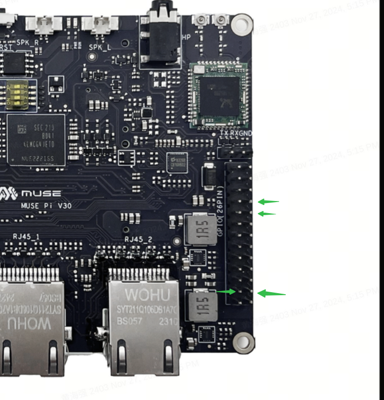

# CAN

CAN Functionality and Usage Guide.

## Overview

CAN (Controller Area Network) is a serial communication protocol designed for real-time data exchange between microcontrollers and peripherals. It is widely adopted in automotive systems, industrial automation, medical equipment, aerospace, and robotics.

### Function Description


The CAN controller supports message transmission and reception compliant with CAN 2.0 and CAN FD protocols, handling standard data frames, remote frames, and extended data frames, etc. The CAN driver registers as a network device through the network device interface. In the user layer, CAN driver calls can be made to achieve message transmission and reception using specified network tools or interfaces.

### Source Code Structure

The CAN controller driver code is located in the `drivers/net/can` directory:

```c
drivers/net/can  
|--dev.c                     # Kernel CAN framework code, including baud rate parameter calculation, CAN device registration, etc.
|--flexcan/                  # K1 CAN driver
 |--flexcan-core.c
 |--flexcan.h
```  

## Key Features  

| Feature | Description |
| :-----| :----|
| Support for CANFD | Compliant  the CANFD protocol, compatible with CAN 2.0 |
| Support for Maximum 64B Data| The CANFD protocol supports data transmission of 8, 16, 32, and 64 bytes|

### Performance Parameters

Supports a maximum data field baud rate of 8 Mbps.

## Configuration

It mainly includes driver enablement configuration and dts configuration.

### CONFIG Configuration

CONFIG_CAN_DEV
This provides support for the kernel platform CAN framework. When supporting the K1 CAN driver, this option should be set to `Y`.

```shell
Symbol: CAN_DEV [=y]
Device Drivers
    -> Network device support (NETDEVICES [=y]) 
  -> CAN Device Drivers (CAN_DEV [=y])
```

After enabling the platform layer CAN framework, set CONFIG_CAN_FLEXCAN to `Y` to enable the K1 CAN driver.

```shell
Symbol: CAN_FLEXCAN [=y]
    -> CAN device drivers with Netlink support (CAN_NETLINK [=y])
  -> Support for Freescale FLEXCAN based chips (CAN_FLEXCAN [=y])
```

### DTS Configuration

On the K1 platform, the CAN controller does not include a transceiver, and the external interface of the controller consists of TX and RX pins.

#### pinctrl

You can refer to the already configured CAN node in the Linux repository at `arch/riscv/boot/dts/spacemit/k1-x_pinctrl.dtsi`. Here is an example of how the CAN node might be configured:

```dts
    pinctrl_can_0: can_0_grp {
        pinctrl-single,pins = <
            K1X_PADCONF(GPIO_75, MUX_MODE3, (EDGE_NONE | PULL_UP | PAD_3V_DS4))     /* can_tx0 */
            K1X_PADCONF(GPIO_76, MUX_MODE3, (EDGE_NONE | PULL_UP | PAD_3V_DS4))     /* can_rx0 */
     >;
    };
```

#### dtsi Configuration Example

The CAN controller's base address and clock reset resources are configured in the dtsi file. These settings generally do not need to be changed under normal circumstances.

```dts
    flexcan0: fdcan@d4028000 {
        compatible = "spacemit,k1x-flexcan";
        reg = <0x0 0xd4028000 0x0 0x4000>;
        interrupts = <16>;
        interrupt-parent = <&intc>;
        clocks = <&ccu CLK_CAN0>,<&ccu CLK_CAN0_BUS>;
        clock-names = "per","ipg";
        resets = <&reset RESET_CAN0>;
        fsl,clk-source = <0>;
        status = "disabled";
    };
```

#### dts Configuration Example

The complete dts configuration is shown below. You can choose to configure the clock frequency to 20M, 40M, or 80M to support different baud rates.

```dts
/*can0*/
&flexcan0 {
	 pinctrl-names = "default";
	 pinctrl-0 = <&pinctrl_can_0>;
	 clock-frequency = <80000000>;
	 status = "okay";
};

/*rcan*/
&r_flexcan {
       pinctrl-names = "default";
       pinctrl-0 = <&pinctrl_r_can_0>;
       clock-frequency = <80000000>;
       status = "okay";
       mboxes = <&mailbox 2>;
       mbox-names = "mcan0";
};

```

## Interface

### API

The CAN driver mainly implements interfaces for sending and receiving messages. Commonly used APIs include:

```c
static int flexcan_open(struct net_device *dev)  
```

APIs Called When Opening a CAN Device.

```c
static netdev_tx_t flexcan_start_xmit(struct sk_buff *skb, struct net_device *dev) 
```

The function called when the CAN device starts transmission.
The parameters for configuring the CAN transmission bitrate are saved in the driver's private data structure during driver initialization.

### Demo Example

## Debugging

1. Check if the CAN device is loaded successfully.  
ifconfig -a

2. Configure the CAN arbitration and data domain baud rates on K1. 
ip link set can0 type can bitrate 125000 dbitrate 250000 berr-reporting on fd on  

3. Bring up the CAN device (while the other end is ready to receive). 
ip link set can0 up  

4. Send a message from the K1 end
cansend format: cansend can-dev id#data 
eg：cansend can0 123##3.11223344556677881122334455667788aabbccdd  

5. Receive a message on the K1 end (while the other end is sending)  
candump can0

## Testing

The K1 platform can be connected to a CAN transceiver for testing. The other end of the communication is typically connected to a USBCAN analyzer linked to a computer to simulate a CAN device. As the connected device and its configuration may vary, this section focuses on K1-specific testing procedures. The following example uses the MUSE Pi development board with the buildroot system for a demo demonstration. Please refer to the DTS configuration example section for the DTS configuration.

- Connecting CAN Devices to MUSE Pi

  

  The pin directions are indicated by the green arrows from top to bottom as shown in the figure above, which are as follows:
  1. rcan tx: gpio47, pin 8 of the 26-pin interface
  2. rcan rx: gpio48, pin 10 of the 26-pin interface
  3. can0 tx: gpio75, pin 23 of the 26-pin interface
  4. can0 rx: gpio76, pin 24 of the 26-pin interface

- Install CAN software on the PC and connect a PC CAN device (you can connect two CAN peripherals for mutual transmission and reception). In this example, we use PEAK's PCAN, which can be found on the [PEAK official website](https://www.peak-system.com). The wiring for rcan is shown in the figure below, and the wiring for can0 is similar.

  

- Check if the CAN device is loaded successfully.

  ```shell
  # ifconfig -a
  can0      Link encap:UNSPEC  HWaddr 00-00-00-00-00-00-00-00-00-00-00-00-00-00-00-00  
            NOARP  MTU:16  Metric:1
            RX packets:0 errors:0 dropped:0 overruns:0 frame:0
            TX packets:0 errors:0 dropped:0 overruns:0 carrier:0
            collisions:0 txqueuelen:10 
            RX bytes:0 (0.0 B)  TX bytes:0 (0.0 B)
            Interrupt:77 

  can1      Link encap:UNSPEC  HWaddr 00-00-00-00-00-00-00-00-00-00-00-00-00-00-00-00  
            inet addr:169.254.185.103  Mask:255.255.0.0
            UP RUNNING NOARP  MTU:72  Metric:1
            RX packets:4226044 errors:1411370 dropped:0 overruns:0 frame:1411370
            TX packets:1428220 errors:0 dropped:0 overruns:0 carrier:0
            collisions:0 txqueuelen:10 
            RX bytes:50946992 (48.5 MiB)  TX bytes:28564400 (27.2 MiB)
            Interrupt:255 
  ```

- The arbitration and data domain baud rates of CAN on the K1 platform must be configured to be the same for normal data transmission and reception.

  ```shell
  ip link set can1 up type can bitrate 4000000 sample-point 0.75 dbitrate 8000000 sample-point 0.8 fd on

  # Receiving Data
  candump can1
  ```

- Open another CAN device as the data transmitter (it can be a PC CAN or another CAN device on the development board; here, we use another CAN device for sending data, and you can verify with PC CAN on your own).

  ```shell
   cansend can1 456##3.8877665544332211aabbccddeeffaabbaabb
  ```
- Stopping the CAN Device

  ```shell
  ifconfig can1 down
  ```

## FAQ

- To debug the rcan on the MUSE-Pi development board, you need to disable the following DTS pin configurations.

  ```dts
  diff --git a/arch/riscv/boot/dts/spacemit/k1-x_MUSE-Pi.dts b/arch/riscv/boot/dts/spacemit/k1-x_MUSE-Pi.dts
  index 9107d43c3091..a34272ce8318 100644
  --- a/arch/riscv/boot/dts/spacemit/k1-x_MUSE-Pi.dts
  +++ b/arch/riscv/boot/dts/spacemit/k1-x_MUSE-Pi.dts
  @@ -578,12 +578,12 @@ &range GPIO_124 1 (MUX_MODE0 | EDGE_NONE | PULL_UP   | PAD_1V8_DS2)
                  &range GPIO_125 3 (MUX_MODE0 | EDGE_NONE | PULL_DOWN | PAD_1V8_DS2)
          >;
 
  -       pinctrl_rcpu: pinctrl_rcpu_grp {
  -               pinctrl-single,pins = <
  -                       K1X_PADCONF(GPIO_47, MUX_MODE1, (EDGE_NONE | PULL_UP | PAD_3V_DS4))     /* r_uart0_tx */
  -                       K1X_PADCONF(GPIO_48, MUX_MODE1, (EDGE_NONE | PULL_UP | PAD_3V_DS4))     /* r_uart0_rx */
  -               >;
  -       };
  +       /* pinctrl_rcpu: pinctrl_rcpu_grp { */
  +       /*      pinctrl-single,pins = < */
  +       /*              K1X_PADCONF(GPIO_47, MUX_MODE1, (EDGE_NONE | PULL_UP | PAD_3V_DS4))     /1* r_uart0_tx *1/ */
  +       /*              K1X_PADCONF(GPIO_48, MUX_MODE1, (EDGE_NONE | PULL_UP | PAD_3V_DS4))     /1* r_uart0_rx *1/ */
  +       /*      >; */
  +       /* }; */
 
          pinctrl_gmac0: gmac0_grp {
                  pinctrl-single,pins =<
  @@ -1062,7 +1062,7 @@ &vi {
 
   &rcpu {
          pinctrl-names = "default";
  -       pinctrl-0 = <&pinctrl_rcpu>;
  +       /* pinctrl-0 = <&pinctrl_rcpu>; */
          mboxes = <&mailbox 0>, <&mailbox 1>;
          mbox-names = "vq0", "vq1";
          memory-region = <&rcpu_mem_0>, <&vdev0vring0>, <&vdev0vring1>, <&vdev0buffer>, <&rsc_table>, <&rcpu_mem_snapshots>;

  ```
