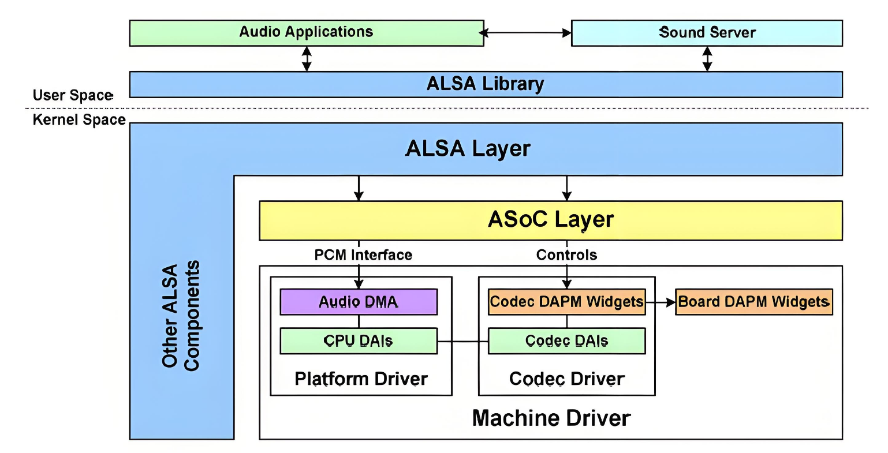

# Audio

Audio Functionality and Usage Guide.

## Overview

The Audio module includes 2 I2S interfaces and 1 HDMI audio interface.

### Functional Description



The ALSA audio framework can be divided into several layers:

- **ALSA Library**
  
  Provides a unified API interface to applications. Various applications can achieve playback, recording, and control by calling the APIs provided by the ALSA library. Two basic libraries are currently provided: tinyalsa, which is a simplified version of the ALSA library, is mainly used in Android systems.

- **ALSA CORE**
  
  The core layer of ALSA, which provides logical devices (PCM, CTL, MIDI, TIMER, etc.) for system calls and drives hardware devices (Machine, I2S, DMA, CODEC).
 
- **ASoC Core**

  The standard framework of ALSA, which is the core part of the ALSA-driver. It provides general methods and data structures for various audio device drivers.

- **Hardware Driver**

  The audio hardware device driver, which consists of three main parts: Machine, Platform, and Codec. It provides the ALSA Driver API and the initialization and workflow of the corresponding audio devices, implementing specific functional components. This is the part that driver developers need to implement specifically.

- **Machine**

  Typically refers to a specific single board that includes particular peripherals, providing a carrier for the CPU and Codec. Machine drivers are almost non-reusable. The Machine driver links the Platform driver and the Codec driver together, specifying which Platform driver to use, which SoC-side DAI (Digital Audio Interface) to use, which Codec driver to use, and which DAI interface on the Codec to use, while also performing operations specific to the single board.

- **Platform**
  
  Generally refers to a specific SoC platform, which can be understood as a particular SoC with I2S, AC97 audio interfaces, internal clocks, and DMA units for audio data transfer. The Platform driver is only related to a specific SoC, implementing the SoC's audio DMA driver and the DAI interface driver on the SoC side. It is only related to the SoC and not to the Machine, allowing the Platform to be abstracted out so that the same SoC can be used in different Machines without any modifications.

- **Codec**

  The audio codec, which includes I2S interfaces, D/A, A/D, Mixer, and PA (Power Amplifier). It typically contains multiple inputs (Mic, Line-in, I2S, PCM) and several outputs (headphones, speakers, earpiece, Line-out). The SoC usually controls the codec chip via I2C. The Codec driver is only related to the Codec and is independent of the SoC and Machine. Like the Platform, the Codec should be implemented as a reusable component, allowing the same Codec to be used in different Machines.

### Audio Solution

K1 currently supports two sound card solutions:
**Solution 1: HDMI Audio**, which supports playback.
**Solution 2: I2S0 paired with an external I2C Codec ES8326B**, which supports both playback and recording.

### Source Code Structure

The I2S/HDMIAUDIO controller driver code is located in the `sound/soc/spacemit` directory:

```
sound/soc/spacemit
├── Kconfig
├── Makefile
├── spacemit-dummy-codec.c    # Dummy codec, used with HDMI audio to create a sound card
├── spacemit-snd-card.c       # Sound card driver
├── spacemit-snd-i2s.c        # I2S driver
├── spacemit-snd-i2s.h
├── spacemit-snd-pcm-dma.c    # Platform driver, mainly related to PCM
├── spacemit-snd-sspa.c       # HDMI audio driver
├── spacemit-snd-sspa.h
```

The driver code for the Codec ES8326B is located in the `sound/soc/codec` directory:

```
sound/soc/codec
├── es8326.c
├── es8326.h
```

## I2S

### Key Features

- Supports a sampling rate of 48000, with a 16-bit sampling depth and 2 channels.
- Supports playback and recording functions.
- Supports full-duplex operation.

### Configuration

The configuration mainly includes driver enabling and DTS (Device Tree Source) configuration

#### CONFIG Configuration

##### Audio Function Support

CONFIG_SOUND, CONFIG_SND, and CONFIG_SND_SOC provide support for the ALSA audio driver framework. By default, these options are enabled (`y`).

```
Device Drivers
        Sound card support (SOUND [=y])
                Advanced Linux Sound Architecture (SND [=y])
                        ALSA for SoC audio support (SND_SOC [=y])
```

#### Audio Function Support

CONFIG_SND_SOC_SPACEMIT, CONFIG_SPACEMIT_CARD, and CONFIG_SPACEMIT_PCM provide support for the K1 audio functionality. By default, these options are enabled (`y`)

```
Device Drivers
        Sound card support (SOUND [=y])
                Advanced Linux Sound Architecture (SND [=y])
                        ALSA for SoC audio support (SND_SOC [=y])
                                SoC Audio for SPACEMIT System-on-Chip (SND_SOC_SPACEMIT [=y])
                                        Audio Simple Card (SPACEMIT_CARD [=y])
                                        Audio Platform Pcm (SPACEMIT_PCM [=y])
```

#### I2S Function Support

CONFIG_SPACEMIT_I2S provides support for the I2S functionality. By default, this option is enabled (`y`).

```
Device Drivers
        Sound card support (SOUND [=y])
                Advanced Linux Sound Architecture (SND [=y])
                        ALSA for SoC audio support (SND_SOC [=y])
                                SoC Audio for SPACEMIT System-on-Chip (SND_SOC_SPACEMIT [=y])
                                        Audio Simple Card (SPACEMIT_CARD [=y])
                                        Audio Platform Pcm (SPACEMIT_PCM [=y])
                                        Audio Cpudai I2S (SPACEMIT_I2S [=y])
```

#### DTS Configuration

##### pinctrl

- i2s0 pinctrl configuration
  There are two sets of pinctrl configurations, which should be configured according to the actual hardware design.

```
        pinctrl_sspa0_0: sspa0_0_grp {
                pinctrl-single,pins =<
                        K1X_PADCONF(GPIO_118, MUX_MODE3, (EDGE_NONE | PULL_UP | PAD_1V8_DS0))   /* sspa0_clk */
                        K1X_PADCONF(GPIO_119, MUX_MODE3, (EDGE_NONE | PULL_UP | PAD_1V8_DS0))   /* sspa0_frm */
                        K1X_PADCONF(GPIO_120, MUX_MODE3, (EDGE_NONE | PULL_UP | PAD_1V8_DS0))   /* sspa0_txd */
                        K1X_PADCONF(GPIO_121, MUX_MODE3, (EDGE_NONE | PULL_UP | PAD_1V8_DS0))   /* sspa0_rxd */
                        K1X_PADCONF(GPIO_122, MUX_MODE3, (EDGE_NONE | PULL_UP | PAD_1V8_DS0))   /* sspa0_sysclk */
                >;
        };

        pinctrl_sspa0_1: sspa0_1_grp {
                pinctrl-single,pins =<
                        K1X_PADCONF(GPIO_58,  MUX_MODE2, (EDGE_NONE | PULL_UP | PAD_1V8_DS0))   /* sspa0_sysclk */
                        K1X_PADCONF(GPIO_111, MUX_MODE2, (EDGE_NONE | PULL_UP | PAD_1V8_DS0))   /* sspa0_clk */
                        K1X_PADCONF(GPIO_112, MUX_MODE2, (EDGE_NONE | PULL_UP | PAD_1V8_DS0))   /* sspa0_frm */
                        K1X_PADCONF(GPIO_113, MUX_MODE2, (EDGE_NONE | PULL_UP | PAD_1V8_DS0))   /* sspa0_txd */
                        K1X_PADCONF(GPIO_114, MUX_MODE2, (EDGE_NONE | PULL_UP | PAD_1V8_DS0))   /* sspa0_rxd */
                >;
        }

&i2s0 {
        pinctrl-names = "default";
        pinctrl-0 = <&pinctrl_sspa0_0>;         # Using the pin set pinctrl_sspa0_0.
        status = "okay";
};

```

- i2s1 pinctrl configuration

  ```
        pinctrl_sspa1: sspa1_grp {
                pinctrl-single,pins =<
                        K1X_PADCONF(GPIO_24, MUX_MODE3, (EDGE_NONE | PULL_UP | PAD_1V8_DS0))    /* sspa1_sysclk */
                        K1X_PADCONF(GPIO_25, MUX_MODE1, (EDGE_NONE | PULL_UP | PAD_1V8_DS0))    /* sspa1_sclk */
                        K1X_PADCONF(GPIO_26, MUX_MODE1, (EDGE_NONE | PULL_UP | PAD_1V8_DS0))    /* sspa1_frm */
                        K1X_PADCONF(GPIO_27, MUX_MODE1, (EDGE_NONE | PULL_UP | PAD_1V8_DS0))    /* sspa1_txd */
                        K1X_PADCONF(GPIO_28, MUX_MODE1, (EDGE_NONE | PULL_UP | PAD_1V8_DS0))    /* sspa1_rxd */
                >;
        };

  &i2s1 {
        pinctrl-names = "default";
        pinctrl-0 = <&pinctrl_sspa1>;          #Using the pin set pinctrl_sspa1.
        status = "okay";
  };

  ```

#### I2S-Codec Sound Card Configuration

##### Codec Configuration

Using the ES8326B Codec as an example for a complete sound card configuration.

###### Config Configuration

Enable the ES8326B configuration.

```
Device Drivers│
        Sound card support (SOUND [=y])
                Advanced Linux Sound Architecture (SND [=y])
                        ALSA for SoC audio support (SND_SOC [=y])
                                CODEC drivers
                                        Everest Semi ES8326 CODEC (SND_SOC_ES8326 [=y])
```

###### DTS Configuration

- GPIO
  Configure according to the actual hardware design. For example, on some K1 development boards, the ES8326B uses GPIO129 for headphone detection and GPIO127 for speaker control.

  ```
        es8326: es8326@19{
                interrupt-parent = <&gpio>;
                interrupts = <126 1>;                 # Headphone insertion and removal detection
                spk-ctl-gpio = <&gpio 127 0>;         # Board-level speaker control GPIO
        };

  ```

###### DTS Configuration Example

The complete configuration for the ES8236B codec is as follows:

```
        es8326: es8326@19{
                compatible = "everest,es8326";
                reg = <0x19>;
                #sound-dai-cells = <0>;
                interrupt-parent = <&gpio>;
                interrupts = <126 1>;                 # Headphone plug detection
                spk-ctl-gpio = <&gpio 127 0>;         # Board-level speaker control GPIO
                everest,mic1-src = [44];              # ADC source configuration
                everest,mic2-src = [66];
                status = "okay";
        };
```

###### MCLK Configuration

The ES8326B codec's MCLK is provided by I2S0 and is configured in the sound card node sound_codec

```

&sound_codec {
        status = "okay";
        simple-audio-card,name = "snd-es8326";
        spacemit,mclk-fs = <64>;                      # Configure mclk = 64 * fs, i.e., 3.072MHz
    simple-audio-card,codec {
        simple-audio-card,codec {
                sound-dai = <&es8326>;
                };
        };
};

```
**Note.** The `spacemit,mclk-fs` only supports configurations of 64, 128, or 256, which correspond to 3.072MHz, 6.144MHz, and 12.288MHz respectively.

##### Sound Card Configuration

###### DTS Configuration


```
        sound_codec: snd-card@1 {
                compatible = "spacemit,simple-audio-card";
                simple-audio-card,format = "i2s";
                status = "disabled";
                interconnects = <&dram_range4>;
                interconnect-names = "dma-mem";
                spacemit,init-jack;
                simple-audio-card,cpu {                      # CPU DAI Configuration
                        sound-dai = <&i2s0>;
                };
                simple-audio-card,plat {
                        sound-dai = <&i2s0_dma>;             # Platform PCM Configuration
                };
        };

&sound_codec {
        status = "okay";
        simple-audio-card,name = "snd-es8326";
        spacemit,mclk-fs = <64>;
        simple-audio-card,codec {
                sound-dai = <&es8326>;                       # Codec DAI Configuration
        };
};

```

## HDMIAUDIO

### Key Features

- Supports a sample rate of 48,000 Hz, 16-bit sample depth, and 2 channels.
- Supports playback only

### Configuration

The configuration mainly consists of driver enablement and DTS settings. Since HDMIAUDIO relies on the HDMI display function, it is necessary to ensure that HDMI display is supported. Please refer to the corresponding documentation.

#### CONFIG Configuration

##### Audio Function Support

CONFIG_SOUND, CONFIG_SND, and CONFIG_SND_SOC provide support for the ALSA audio driver framework. By default, this option is set to `Y`.

```
Device Drivers
        Sound card support (SOUND [=y])
                Advanced Linux Sound Architecture (SND [=y])
                        ALSA for SoC audio support (SND_SOC [=y])
```

##### K1 Audio Function Support

CONFIG_SND_SOC_SPACEMIT, CONFIG_SPACEMIT_CARD, and CONFIG_SPACEMIT_PCM provide support for K1 audio functions. By default, this option is set to `Y`.

```
Device Drivers
        Sound card support (SOUND [=y])
                Advanced Linux Sound Architecture (SND [=y])
                        ALSA for SoC audio support (SND_SOC [=y])
                                SoC Audio for SPACEMIT System-on-Chip (SND_SOC_SPACEMIT [=y])
                                        Audio Simple Card (SPACEMIT_CARD [=y])
                                        Audio Platform Pcm (SPACEMIT_PCM [=y])
```

##### HDMIAUDIO Function Support

CONFIG_SPACEMIT_HDMIAUDIO and CONFIG_SPACEMIT_DUMMYCODEC provide support for the HDMIAUDIO function. By default, this option is set to `Y`.

```
Device Drivers
        Sound card support (SOUND [=y])
                Advanced Linux Sound Architecture (SND [=y])
                        ALSA for SoC audio support (SND_SOC [=y])
                                SoC Audio for SPACEMIT System-on-Chip (SND_SOC_SPACEMIT [=y])
                                        Audio Simple Card (SPACEMIT_CARD [=y])
                                        Audio Platform Pcm (SPACEMIT_PCM [=y])
                                        Audio Cpudai HDMI Audio (SPACEMIT_HDMIAUDIO [=y])
                                        Audio CodecDai Dummy Codec (SPACEMIT_DUMMYCODEC [=y]) 
```

#### DTS Configuration

```
&hdmiaudio {
        status = "okay";
};
```

#### HDMIAUDIO Sound Card Configuration

##### DTS Configuration

```

        sound_hdmi: snd-card@0 {
                compatible = "spacemit,simple-audio-card";
                simple-audio-card,name = "snd-hdmi";
                status = "disabled";
                interconnects = <&dram_range4>;
                interconnect-names = "dma-mem";
                simple-audio-card,plat {                        # Platform PCM Configuration
                        sound-dai = <&hdmi_dma>;
                };
                simple-audio-card,codec {                       # Codec DAI Configuration
                        sound-dai = <&dummy_codec>;
                };
        };

&sound_hdmi {
        status = "okay";
        simple-audio-card,cpu {
                sound-dai = <&hdmiaudio>;                       # CPU DAI Configuration
        };
};

```

## Interface

### API

Please refer to the relevant official Linux documentation.

## Debugging

You can perform debugging through the nodes under /proc/asound/.

### View Sound Card Devices

```
root:/# cat /proc/asound/pcm
00-00: SSPA2-dummy_codec dummy_codec-0 :  : playback 1
01-00: i2s-dai0-ES8326 HiFi ES8326 HiFi-0 :  : playback 1 : capture 1
root:/#
```

### Viewing Sound Card Status and Other Information

- CLOSED, the sound card is in a closed state.
  ```
  root:/# cat /proc/asound/card1/pcm0p/sub0/status
  closed
  root:/# cat /proc/asound/card1/pcm0p/sub0/hw_params
  closed
  root:/#
  ```

- RUNNING, the sound card is in a running state, either playing or recording. You can view the status and parameters of the sound card.
  ```
  root:/# cat /proc/asound/card1/pcm0p/sub0/status
  state: RUNNING
  owner_pid   : 3767
  trigger_time: 224110.719883196
  tstamp      : 224164.735391138
  delay       : 2048
  avail       : 2048
  avail_max   : 2048
  -----
  hw_ptr      : 2592768
  appl_ptr    : 2594816
  root:/# cat /proc/asound/card1/pcm0p/sub0/status
  state: RUNNING
  owner_pid   : 3767
  trigger_time: 224110.719883196
  tstamp      : 224166.975406348
  delay       : 3072
  avail       : 1024
  avail_max   : 2048
  -----
  hw_ptr      : 2700288
  appl_ptr    : 2703360
  root:/# cat /proc/asound/card1/pcm0p/sub0/hw_params
  access: RW_INTERLEAVED
  format: S16_LE
  subformat: STD
  channels: 2
  rate: 48000 (48000/1)
  period_size: 1024
  buffer_size: 4096
  root:/# 
  ```

## Testing

Audio functionality can be tested using the **alsa-utils** or **tinyalsa** tools, which are already integrated into buildroot.

### Playback Test

#### Viewing Playback Devices

aplay-l // List playback devices

```
root:/# aplay -l
**** PLAYBACK Hardware Devices ****
card 0: sndhdmi [snd-hdmi], device 0: SSPA2-dummy_codec dummy_codec-0 []
  Subdevices: 1/1
  Subdevice #0: subdevice #0
card 1: sndes8326 [snd-es8326], device 0: i2s-dai0-ES8326 HiFi ES8326 HiFi-0 []
  Subdevices: 1/1
  Subdevice #0: subdevice #0
root:/#
```

There are two playback devices visible:
- The HDMIAUDIO playback device has a card ID of 0 and a device ID of 0.
- The I2S-Codec playback device has a card ID of 1 and a device ID of 0.

#### Playback

Specify the card and device IDs to select a playback device

Example: Select the HDMIAUDIO sound card for playback.
```
aplay -Dhw:0,0 -r 48000 -f S16_LE --period-size=480 --buffer-size=1920 xxx.wav

```
Example: Select the I2S-Codec sound card for playback.
```
aplay -Dhw:1,0 -r 48000 -f S16_LE --period-size=1024 --buffer-size=4096 xxx.wav
```

### Recording Test

#### Viewing Capture Devices

`arecord -l` to view the capture devices

```
root@spacemit-k1-x-deb1-board:~# arecord -l
**** CAPTURE Hardware Devices ****
card 1: sndes8326 [snd-es8326], device 0: i2s-dai0-ES8326 HiFi ES8326 HiFi-0 []
  Subdevices: 1/1
  Subdevice #0: subdevice #0
root@spacemit-k1-x-deb1-board:~#
```

There is one capture device visible:
- The I2S-Codec capture device has a card ID of 1 and a device ID of 0.

#### Recording

Select a device for recording by specifying the card ID and device ID.

Example: Select the I2S-Codec sound card for recording.
```
arecord -Dhw:1,0 -r 48000 -c 2 -f S16_LE --period-size=1024 --buffer-size=4096 xxx.wav
```

## FAQ
