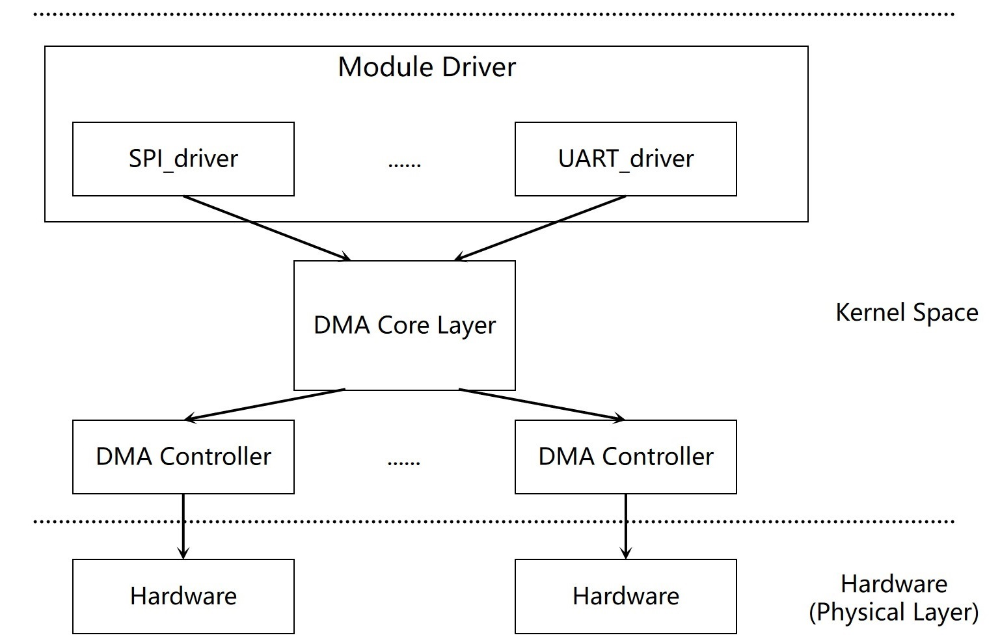

# DMA

DMA Controller Configuration and DMA Slave Usage Guide.

## Overview

**DMA (Direct Memory Access)** is a method that allows data transfer between source and destination without direct CPU control, by establishing a hardware pathway for data movement. This module implements the DMA controller (DMA master) functionality, is responsible for connecting DMA channels and completing data transfers.

### Functional Description



Through the Linux DMA framework with K1-specific DMA controller drivers, three types of data transfer directions are implemented: **memory-to-memory**, **memory-to-peripheral**, and **peripheral-to-memory**. Additionally, memory transfer, scatter-gather list transfer, and circular buffer transfer are supported.

### Source Code Structure

The DMA controller driver code is located in the drivers/dma directory:

```  
drivers/dma
|-- dmaengine.c dmaengine.h      # Kernel DMA framework code
|-- dmatest.c                    # Kernel DMA test code
|-- mmp_pdma_k1x.c               # K1 DMA controller driver
```  

## Key Features

### Features

- Supports memory-to-memory, memory-to-peripheral, and peripheral-to-memory transfers.
- 16 DMA channels available.
- Burst sizes supported: 8, 16, 32, 64.
- Maximum transfer size per descriptor: 8191 bytes.

### Performance Parameters

The maximum speed for memory-to-memory data transfer using DMA is 220MB/s.

Testing Method:
- You can use the `dmatest.c` tool for testing. For specific usage methods, refer to the debugging section below.

## Configuration

It mainly includes driver enablement configuration and DTS configuration.

### CONFIG Configuration

CONFIG_DMADEVICES
This option provides support for the kernel platform DMA framework. For supporting the K1 DMA driver, this should be set to `Y`.

```
Symbol: DMADEVICES [=y]
Device Drivers
      -> DMA Engine support (DMADEVICES [=y])
```

After enabling the platform layer DMA framework, set CONFIG_MMP_PDMA_SPACEMIT_K1X to `Y` to support the K1 DMA controller driver.

```
Symbol: MMP_PDMA_SPACEMIT_K1X [=y]
      ->Spacemit mmp_pdma support (MMP_PDMA_SPACEMIT_K1X [=y])
```

### DTS Configuration

DMA operation requires channel selection and specifies the source and destination addresses, such as memory-to-memory or memory-to-peripheral transfers. Therefore, this section introduces the DTS configuration for enabling the DMA controller and the DTS configuration for other devices like UART when they use DMA.

#### DMA Controller Configuration

You can refer to the `arch/riscv/boot/dts/spacemit/k1-x.dtsi` file in the Linux repository for the DMA node configuration, as shown below:

```dts
    pdma0: pdma@d4000000 {
  compatible = "spacemit,pdma-1.0";
  reg = <0x0 0xd4000000 0x0 0x4000>;
  interrupts = <72>;
  interrupt-parent = <&intc>;
  clocks = <&ccu CLK_DMA>;
  resets = <&reset RESET_DMA>;
  #dma-cells= <2>;
  #dma-channels = <16>;
  max-burst-size = <64>;
  reserved-channels = <15 45>;
  power-domains = <&power K1X_PMU_BUS_PWR_DOMAIN>;
  clk,pm-runtime,no-sleep;
  cpuidle,pm-runtime,sleep;
  interconnects = <&dram_range4>;
  interconnect-names = "dma-mem";
  status = "ok";
 };
```

This node configures the DMA's clock and reset resources, the number of channels, the maximum burst size, and reserves channel 15 for the device with peripheral request line 45.

#### DMA Slave Configuration Example

Here, we use UART0 as an example. Add the following properties under the UART0 node. The macros DMA_UART0_RX and DMA_UART0_TX are defined in the `include/dt-bindings/dma/k1x-dmac.h` file.

```dts
 dmas = <&pdma0 DMA_UART0_RX 1
   &pdma0 DMA_UART0_TX 1>;
 dma-names = "rx", "tx";
```

## Interface

### API

The Linux kernel provides a set of APIs for managing DMA operations, including requesting DMA channels, configuring DMA transfers, preparing resources, starting transfers, and more. Here are the commonly used APIs:

```
// Request a DMA channel
struct dma_chan *dma_request_chan(struct device *dev, const char *name);

// Configure channel parameters, such as transfer width, data size, and source/destination addresses
static inline int dmaengine_slave_config(struct dma_chan *chan,
                                         struct dma_slave_config *config);

// The following three interfaces prepare resources before starting a DMA transfer
dmaengine_prep_dma_memcpy(struct dma_chan *chan, dma_addr_t dest, dma_addr_t src, size_t len, unsigned long flags);
dmaengine_prep_slave_sg(struct dma_chan *chan, struct scatterlist *sgl, unsigned int sg_len, enum dma_transfer_direction direction, unsigned long flags);
dmaengine_prep_dma_cyclic(struct dma_chan *chan, dma_addr_t buf_addr, size_t buf_len, size_t period_len, enum dma_transfer_direction direction, unsigned long flags);

// Add the descriptor to the transfer task list
static inline dma_cookie_t dmaengine_submit(struct dma_async_tx_descriptor *desc);

// Start the transfer
static inline void dma_async_issue_pending(struct dma_chan *chan);

// Release the DMA channel
static inline void dma_release_channel(struct dma_chan *chan);

// Terminate all transfers, for example, pausing during audio playback
static inline int dmaengine_terminate_all(struct dma_chan *chan);
```

## Testing

Since data transfers from memory to device or from device to memory require coordination with the peripheral driver — for example, when UART0 transmits data, the data must be transferred via DMA from memory to the UART TX FIFO, and DMA must be triggered by the UART — testing typically focuses on memory-to-memory transfers. This allows the use of the kernel’s built-in `dmatest.c` program directly

```
echo dma0chan8 > /sys/module/dmatest/parameters/channel  # Select an unused channel
echo 1 > /sys/module/dmatest/parameters/iterations  # Set the number of transfers, using 1 as an example
echo 4096 > /sys/module/dmatest/parameters/transfer_size # Set the transfer data size (not exceeding 16k)
echo 1 > /sys/module/dmatest/parameters/run   # Start the transfer
```

First, enable the kernel configuration option CONFIG_DMATEST. After generating the new firmware, boot into the kernel.

## FAQ
