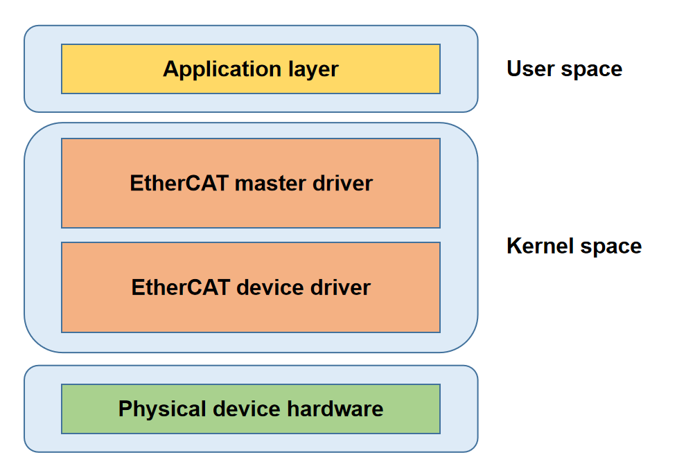

# EtherCAT

EtherCAT Master Functionality and Usage Guide.

## Overview

The IGH EtherCAT Master is a kernel module designed for high-performance real-time communication. It supports functions such as **slave scanning**, **configuration management**, and **distributed clock synchronization**. It can efficiently schedule and manage multiple Slave Devices and is widely used in industrial automation applications where high real-time performance and reliability are required.

### Functional Description

  

The architecture of the EtherCAT Master is shown in the figure above and consists of four main components:

- **Application Layer**
  
  This is where user applications reside, responsible for implementing industrial control logic. It interacts with the EtherCAT Master driver through specific interfaces.

- **EtherCAT Master Driver Layer**
  
  This layer handles core protocol implementation, monitors the bus topology, automatically configures the slaves, and synchronizes distributed clocks.

- **EtherCAT Device Driver Layer**
  
  Composed of real-time Ethernet interface drivers, this layer is responsible for the transmission and reception of ECAT data frames.

- **Physical Layer**
  
  This encompasses the physical network hardware.

### Source Code Structure

The EtherCAT Master driver code is located in the `drivers/net/ethercat` directory:  

```c
# In the codebase, there are many paired xxx.h and xxx.c files. The former is responsible for defining data structures and interfaces, while the latter handles the implementation.

├── device                     # EtherCAT device driver
│   ├── ecdev.h                
│   ├── ec_generic.c           # Generic network device driver
│   ├── ec_k1x_emac.c          # Real-time network card driver for the K1 Ethernet controller
│   ├── ec_k1x_emac.h          
│   ├── Kconfig               
│   └── Makefile
├── include                    # Include directory for global configurations and definitions
│   ├── config.h               # Global configuration items and macro definitions
│   ├── ecrt.h                 # User program interface
│   ├── ectty.h                
│   └── globals.h              # Global variables
├── Kconfig                    # Kernel configuration file
├── Makefile                   # Main Makefile for building the project
└── master                     # EtherCAT Master module
    ├── cdev.c                 # Provides the EtherCAT character device initialization interface
    ├── cdev.h                 
    ├── coe_emerg_ring.c       # Interface for handling CoE emergency messages
    ├── coe_emerg_ring.h       
    ├── datagram.c             # Interface for constructing ECAT datagrams
    ├── datagram.h             
    ├── datagram_pair.c        # Interface for constructing ECAT datagram pairs
    ├── datagram_pair.h        
    ├── debug.c                # Debugging interface
    ├── debug.h                
    ├── device.c               # Interface for network card device abstraction and management
    ├── device.h               
    ├── domain.c               # Interface for EtherCAT domain-related functions
    ├── domain.h               
    ├── doxygen.c              # Doxygen documentation source file
    ├── eoe_request.c          
    ├── eoe_request.h          
    ├── ethernet.c             # Core implementation of EoE functionality
    ├── ethernet.h             
    ├── flag.c                 
    ├── flag.h                 
    ├── fmmu_config.c          # Interface for constructing FMMU configuration messages
    ├── fmmu_config.h          
    ├── foe.h                  
    ├── foe_request.c          # FoE request handling interface
    ├── foe_request.h          
    ├── fsm_change.c           # State transition state machine implementation
    ├── fsm_change.h           
    ├── fsm_coe.c              # CoE protocol state machine implementation
    ├── fsm_coe.h              
    ├── fsm_eoe.c              # EoE protocol state machine implementation
    ├── fsm_eoe.h              
    ├── fsm_foe.c              # FoE protocol state machine implementation
    ├── fsm_foe.h              
    ├── fsm_master.c           # Main state machine implementation
    ├── fsm_master.h           
    ├── fsm_pdo.c              # PDO read/write state machine implementation
    ├── fsm_pdo_entry.c        # PDO entry read/write state machine implementation
    ├── fsm_pdo_entry.h        
    ├── fsm_pdo.h              
    ├── fsm_sii.c              # Slave information interface read/write state machine implementation
    ├── fsm_sii.h              
    ├── fsm_slave.c            # Slave state machine implementation
    ├── fsm_slave_config.c     # Slave configuration state machine implementation
    ├── fsm_slave_config.h     
    ├── fsm_slave.h            
    ├── fsm_slave_scan.c       # Slave scanning state machine implementation
    ├── fsm_slave_scan.h       
    ├── fsm_soe.c              # SoE (Servo over EtherCAT) state machine implementation
    ├── fsm_soe.h              
    ├── globals.h              
    ├── ioctl.c                # IOCTL interface for user-space interaction
    ├── ioctl.h               
    ├── Kconfig                
    ├── mailbox.c              # ECAT mailbox message interface
    ├── mailbox.h              
    ├── Makefile               
    ├── master.c               # Core logic of the EtherCAT master module
    ├── master.h               
    ├── module.c               # Initialization and cleanup of the master module
    ├── pdo.c                  # PDO management interface
    ├── pdo_entry.c            # PDO entry management interface
    ├── pdo_entry.h            
    ├── pdo.h                  
    ├── pdo_list.c             # PDO list management interface
    ├── pdo_list.h             
    ├── reg_request.c          # Interface for slave register read/write requests
    ├── reg_request.h          
    ├── rtdm.c                 # RTDM (Real-Time Driver Model) support
    ├── rtdm_details.h         
    ├── rtdm.h                 
    ├── rtdm-ioctl.c           # RTDM IOCTL interface implementation
    ├── rtdm_xenomai_v3.c      # Interface for Xenomai v3 real-time framework support
    ├── rt_locks.h             # Real-time lock implementation
    ├── sdo.c                  # SDO (Service Data Object) management
    ├── sdo_entry.c            # SDO entry management
    ├── sdo_entry.h            
    ├── sdo.h                  
    ├── sdo_request.c          # SDO request handling
    ├── sdo_request.h          
    ├── slave.c                # Slave state management logic
    ├── slave_config.c         # Interface for slave configuration
    ├── slave_config.h         
    ├── slave.h                
    ├── soe_errors.c           # Definitions for SoE protocol error codes
    ├── soe_request.c          # SoE request-related interface
    ├── soe_request.h          
    ├── sync.c                 # Interface for synchronization manager
    ├── sync_config.c          # Interface for configuring the synchronization manager
    ├── sync_config.h          
    ├── sync.h                 
    ├── voe_handler.c          # VOE (Vendor-specific over EtherCAT) request interface
    └── voe_handler.h  
```

## Key Features

| Feature | Description |
| :-----| :----|
| Automatic Slave Configuration | Supports automatic scanning and configuration of connected Slave Devices, simplifying network setup |
| Distributed Clock Synchronization | Achieves Distributed Clock (DC) synchronization with precision of less than 1 µs |
| Multi-protocol Support | Supports protocols such as CoE, SoE, FoE, etc. |
| High Real-time Performance | Supports a 1 ms DC cycle, meeting the real-time requirements of most industrial applications |
| Multi-master Combination | Supports configuration of multiple masters, each managing two network devices: primary and backup |

## Configuration Introduction

It mainly includes driver enablement configuration and DTS configuration.

### CONFIG Configuration
ETHERCAT: To enable EtherCAT services, first configure this option to `Y`.

```c
menuconfig ETHERCAT
        bool "Ethercat native network driver support"
        depends on NET
        default y
        help
          This section contains all the Ethercat drivers.
```

EC_MASTER: Enable the master driver.

```c
config EC_MASTER
        tristate "Ethercat Master driver support"
        depends on ETHERCAT
        default n
        help
          Ethercat Master driver support.

```

EC_GENERIC: Enable the generic network card driver.
EC_K1X_EMAC: Enable the real-time network card driver.  

```c
config EC_GENERIC
        tristate "Ethercat generic device driver support"
        depends on ETHERCAT
        default n
        help
          generic native ethercat device driver support.

config EC_K1X_EMAC
        tristate "k1x native thercat device driver support"
        depends on ETHERCAT
        default n
        help
          Ethercat generic device driver support.

```

**Note.** Generally, enabling the real-time network card driver provides better performance.

### DTS Configuration

The available configuration options in DTS are:

1. run-on-cpu: The available CPUs to bind are 1, 2, 3, 4, 5, 6, 7.
2. debug-level: The supported debug levels are 0, 1, 2.
3. master-count: Up to 32 masters are supported.
4. ec-devices: Network devices used for EtherCAT.
5. master-indexes: The master indices bound to EtherCAT devices, with values ranging from 0 to master-count-1.
6. modes: Working modes for EtherCAT devices, supporting two options: ec_main and ec_backup.

Currently, three configuration modes are supported:

- **Mode 1**: Configure two masters, for example, bind eth0 to master 0 and eth1 to master 1.

  ```c
  ec_master: ethercat_master {
          compatible = "igh,k1x-ec-master";
          run-on-cpu = <1>;         
          debug-level = <0>;
          master-count = <2>;   
          ec-devices = <&eth0>,<&eth1>;
          master-indexes = <0>,<1>;
          modes = "ec_main";
          status = "okay";
  };

  eth0: ethernet@cac80000 {
          compatible = "spacemit,k1x-ec-emac";
         ...

  };

  eth1: ethernet@cac81000 {
          compatible = "spacemit,k1x-ec-emac";
          ...

  };
  ```

- **Mode 2**: Configure one master, with one network card used for EtherCAT and another for Ethernet, for example, using eth0 for EtherCAT.

  ```c
  ec_master: ethercat_master {
          compatible = "igh,k1x-ec-master";
          run-on-cpu = <1>;         
          debug-level = <0>;
          master-count = <1>;   
          ec-devices = <&eth0>;
          master-indexes = <0>;
          modes = "ec_main";
          status = "okay";
  };

  # Here, eth0 is used for EtherCAT
  eth0: ethernet@cac80000 {
          compatible = "spacemit,k1x-ec-emac";
          ...

  };
  ```

- **Mode 3**: Configure one master, binding two network cards. For example, eth0 is used as the primary device, and eth1 is used as the backup device.

  ```c
  ec_master: ethercat_master {
          compatible = "igh,k1x-ec-master";
          run-on-cpu = <1>;         
          debug-level = <0>;
          master-count = <1>;   
          ec-devices = <&eth0>,<&eth1>;
          master-indexes = <0>,<0>;
          modes = "ec_main","ec_backup";
          status = "okay";
  };

  # Here, eth0 is used for EtherCAT.
  eth0: ethernet@cac80000 {
          compatible = "spacemit,k1x-ec-emac";
          ...

  };

  eth1: ethernet@cac81000 {
          compatible = "spacemit,k1x-ec-emac";
          ...

  };
  ```

## Interface

### API

Requesting a master instance.

```c
ec_master_t *ecrt_request_master(unsigned int master_id);
```

Creating process data domains.

```c
ec_domain_t *ecrt_master_create_domain(ec_master_t *master);
```

Activating the master.

```c
int ecrt_master_activate(ec_master_t *master);
```

Synchronizing the master's reference clock.

```c
int ecrt_master_sync_reference_clock_to(ec_master_t *master, uint64_t ref_time);
```

Synchronizing all slave clocks.

```c
void ecrt_master_sync_slave_clocks(ec_master_t *master);
```

Configuring slaves.

```c
ec_slave_config_t *ecrt_master_slave_config(ec_master_t *master, uint16_t alias, uint16_t position, uint32_t vendor_id, uint32_t product_code);

```

Configure slave PDO mapping.

```c
int ecrt_slave_config_pdos(ec_slave_config_t *sc, uint16_t sync_index, const ec_sync_info_t *syncs);
```

Register PDO entries to the specified data domain.

```c
int ecrt_slave_config_reg_pdo_entry(ec_slave_config_t *sc, uint16_t index, uint8_t subindex， ec_domain_t *domain, unsigned int *offset);

```

Configure distributed clock for the slave.

```c
int ecrt_slave_config_dc(ec_slave_config_t *sc, uint16_t assign_activate, uint32_t sync0_cycle_time, int32_t sync0_shift, uint32_t sync1_cycle_time, int32_t sync1_shift);
```

## Debugging

### sysfs

EtherCAT Master information.

```c
/sys/class/EtherCAT/EtherCAT0
.
|-- dev
|-- power
|   |-- autosuspend_delay_ms
|   |-- control
|   |-- runtime_active_time
|   |-- runtime_status
|   `-- runtime_suspended_time
|-- subsystem -> ../../../../class/EtherCAT
`-- uevent

```
- **dev**: Provides the master device number information.
- **power**: Manages the power state of the device.
- **subsystem**: Link: Indicates that the device belongs to the EtherCAT subsystem.
- **uevent**: Master device number and device name.

## Testing

Testing the EtherCAT Master requires Slave Devices. Once the master and slaves are connected, the Master automatically initiates slave device scanning. After a successful automatic scan, the master will be in the PRE-OP (Pre-Operational) state, at which point it is ready for the application program to run.

```c
[  966.525910] k1x_ec_emac cac80000.ethernet ecm0 (uninitialized): Link is Up - 100Mbps/Full - flow control off
[  966.535906] EtherCAT 0: Link state of ecm0 changed to UP.
[  966.552545] EtherCAT 0: 1 slave(s) responding on main device.
[  966.558389] EtherCAT 0: Slave states on main device: INIT.
[  966.564036] EtherCAT 0: Scanning bus.
[  966.739197] EtherCAT 0: Bus scanning completed in 176 ms.
[  966.745275] EtherCAT 0: Using slave 0 as DC reference clock.
[  966.756564] EtherCAT 0: Slave states on main device: PRE-OP.

```

You can use the official demo provided (source code directory: https://gitlab.com/etherlab.org/ethercat, demo path: `examples/`) to perform performance testing on the master station. Here, we use `examples/dc_user/main.c` as a template, with a 1ms DC communication cycle and two connected slaves. The test results are as follows:

```c
period         995099 ...    1004890
exec            14500 ...     106835
latency          7227 ...      13169
period         994556 ...    1005557
exec            14625 ...     105543
latency          7409 ...      13805
period         995306 ...    1004974
exec            14458 ...     105127
latency          7269 ...      13205
period         995390 ...    1004807
exec            14583 ...     137586
latency          7284 ...      13893
period         995265 ...    1005516
exec            14792 ...     108710
latency          7460 ...      13658
period         995598 ...    1004557
exec            14458 ...     112502
latency          7299 ...      12821
period         994807 ...    1005056
exec            14459 ...     105085
latency          7428 ...      13340
period         995390 ...    1005016
exec            14792 ...     110502
latency          7230 ...      13237
period         994432 ...    1007265
exec            14959 ...     110668
latency          7199 ...      15479
period         994848 ...    1004682
exec            14709 ...     113544
latency          7630 ...      13930
```

**Notes.**
- The values in the period row represent the fluctuation range of the communication cycle within one second.
- The values in the exec row represent the fluctuation range of the master's periodic task execution time within one second.
- The values in the latency row represent the fluctuation range of the master's wake-up error within one second.

## FAQ
