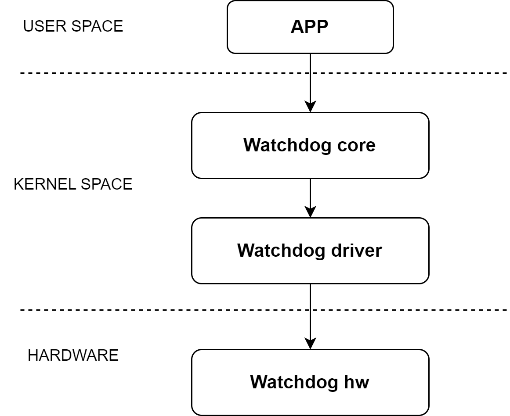

# WDT

This document introduces the basic principles, configuration methods, and debugging procedures of the WDT (Watchdog Timer).

## Module Overview

The **WDT (Watchdog Timer)** controller is a hardware component used to monitor the normal operation of the system.

After configuring a timeout value and enabling the watchdog, the system must periodically “feed” the watchdog within the specified time window.
If the watchdog is not fed within the timeout period (for example, when the system hangs or becomes unresponsive), the watchdog will trigger a reset signal to reset the **K1 chip**.

## Functional Description



The Linux kernel registers the watchdog driver with the **WDT framework** and the **User Space** through the WDT framework interfaces, and creates the device node `/dev/watchdog0`.

User-space applications can interact with this device node using `open()` and `ioctl()` operations to perform the following actions:

- Enable / disable the watchdog
- Configure the timeout value
- Feed the watchdog

## Source Code Structure

The WDT controller driver source code is located in the kernel directory `drivers/watchdog`:

```bash
drivers/watchdog
|-- watchdog_core.c     # Kernel WDT framework interface
|-- watchdog_dev.c      # Character device registration for user space
|-- k1x_wdt.c           # K1 WDT driver implementation
```

## Key Features

- Timeout-triggered system reset
- Maximum configurable timeout: **255 seconds**

## Configuration

Using the WDT requires configuration in two areas:

- **Kernel CONFIG options**
- **Device Tree (DTS) configuration**

## Kernel CONFIG Configuration

### Enable the Watchdog Framework

`CONFIG_WATCHDOG` enables the Linux kernel Watchdog framework.
This option **must be set to `y`** when using the K1 WDT driver.

```text
Symbol: WATCHDOG [=y]
Device Drivers
      -> Watchdog Timer Support (WATCHDOG [=y])
```

### Enable the SpacemiT K1 WDT Driver

After enabling the Watchdog framework, set `CONFIG_SPACEMIT_WATCHDOG` to `y` to enable support for the K1 WDT driver.

```text
Symbol: SPACEMIT_WATCHDOG [=y]
      -> Spacemit-k1x SoC Watchdog (SPACEMIT_WATCHDOG [=y])
```

## Device Tree (DTS) Configuration

### DTSI Configuration Example

In the `dtsi` file, the WDT controller’s register base addresses, clock, and reset resources are defined.
In most cases, **no modification is required**.

> **Note:**
> If the property `spa,wdt-disabled` is not specified, the WDT driver will automatically enable the watchdog when loaded and will use an `hrtimer` to periodically feed the watchdog.

```dts
watchdog: watchdog@d4080000 {
    compatible = "spacemit,soc-wdt";
    clocks = <&ccu CLK_WDT>;
    resets = <&reset RESET_WDT>;
    reg = <0x0 0xd4080000 0x0 0xff>,
          <0x0 0xd4050000 0x0 0x1024>;
    interrupts = <35>;
    interrupt-parent = <&intc>;
    spa,wdt-disabled;
    status = "disabled";
};
```

### DTS Enable Example

The complete DTS configuration to enable the watchdog is shown below:

```dts
&watchdog {
    status = "okay";
};
```

## Interface Description

### API Overview

The Linux kernel registers the watchdog as a character device and exposes the device node to user space.

Commonly used interfaces in `file_operations` include:

- This interface allows user-space applications to open the watchdog device node:

```c
static int watchdog_open(struct inode *inode, struct file *file)
```

- This interface implements the following functions through different `cmd` values:

  - Enable / disable the watchdog
  - Set / get the timeout value
  - Feed the watchdog

```c
static long watchdog_ioctl(struct file *file, unsigned int cmd, unsigned long arg)
```

## Debugging

Since the watchdog driver is exposed to user space as a character device, debugging requires a user-space watchdog test application.

The following example is verified on a **Buildroot system**:

```sh
fd = open("/dev/watchdog", O_WRONLY);
# Open the WDT device node

flags = WDIOS_ENABLECARD;
ret = ioctl(fd, WDIOC_SETOPTIONS, &flags);
# Enable the watchdog

flags = WDIOS_DISABLECARD;
ret = ioctl(fd, WDIOC_SETOPTIONS, &flags);
# Disable the watchdog

ret = ioctl(fd, WDIOC_GETTIMEOUT, &flags);
# Get the current watchdog timeout

flags = timeout;
ret = ioctl(fd, WDIOC_SETTIMEOUT, &flags);
# Set the watchdog timeout
```

## Testing

The WDT functionality can be verified as follows:

- **Normal feeding**: the system continues running without reset
- **No feeding**: the system triggers a reset after the timeout expires

## FAQ

(TBD)
