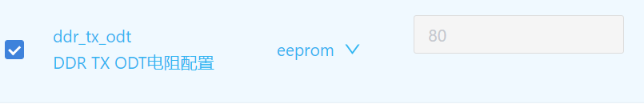
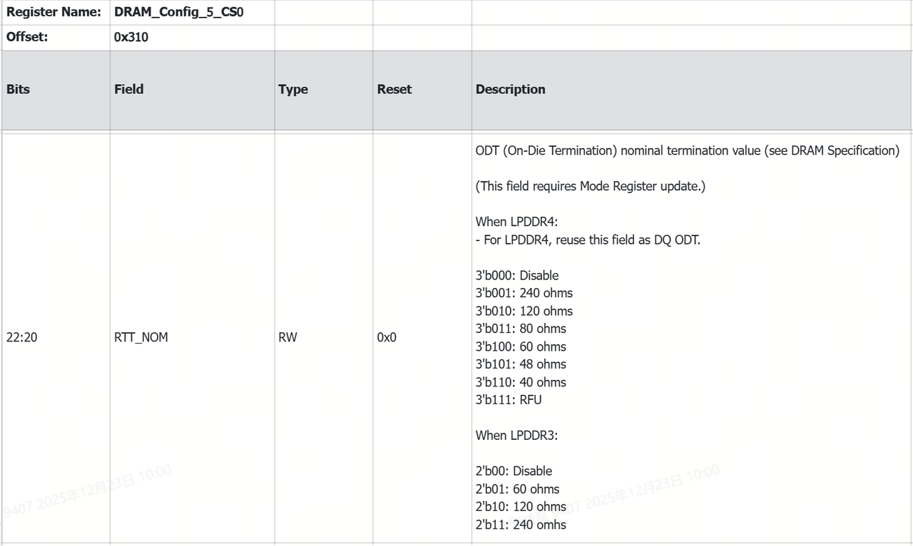
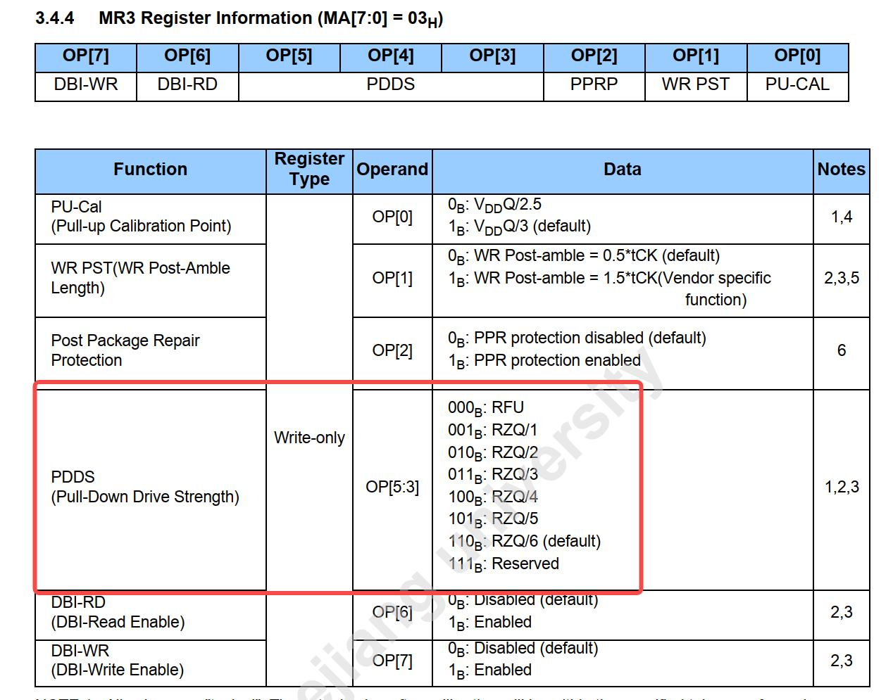
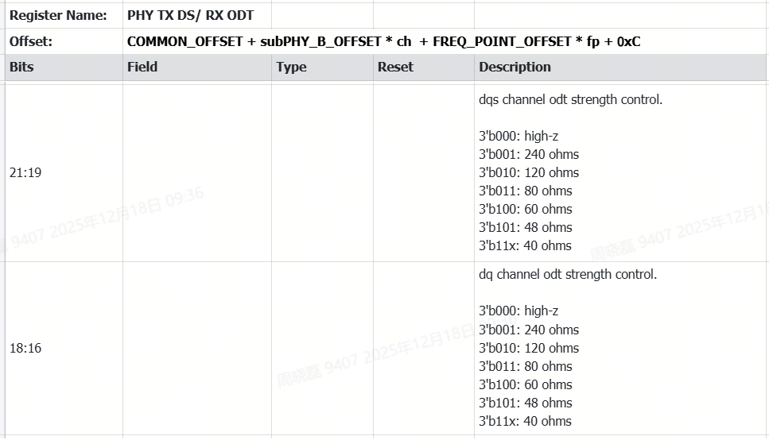
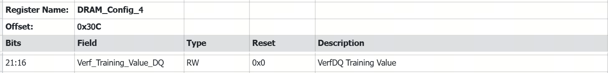
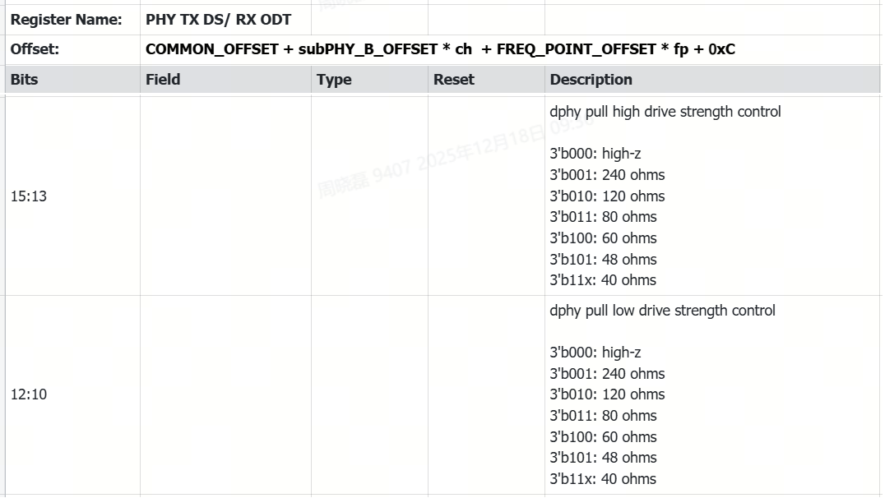

# DDR

| Version | Date       | Notes     |
| ------- | ---------- | --------------- |
| v1.0    | 2026-01-10 | Initial release |

---

## 1. Overview

This document is based on the **SpacemiT K1** platform and describes how to adapt the K1 SDK to specific DDR devices by modifying DDR driver parameters.

### Configuration Mechanism

The K1 SDK supports three DDR types:

- **LPDDR3**
- **LPDDR4**
- **LPDDR4x**

According to the specific DDR device to configure the following key parameters:

1. DDR type
2. Number of chip selects (single / dual CS)
3. Maximum data rate
4. Drive strength and related electrical parameters

As shown below, the DDR driver loads configuration parameters in the following priority order:

1. Read parameters stored in **EEPROM**
2. If no valid EEPROM data is found, read from **DTS**
3. If neither is configured, fall back to **default parameters in the code**


After modifying any parameters, the firmware image must be rebuilt and reflashed to the device for the changes to take effect.

## 2. Basic Configuration

### 2.1 DDR Type Configuration

#### Scenario 1: Single Image Supporting Multiple DDR Types (EEPROM Required)

The DDR type can be written to the on-board EEPROM using either of the following methods.

1. **Programming via Flashing Tool**

   Procedure:

   - Power on the device while holding the flashing button to enter flashing mode
   - Connect the device to the PC via USB
   - Use the **TitanFlasher** to write the DDR type, as shown below

   

2. **Programming via U-Boot Command Line**

   **Prerequisite:**
   The default DDR configuration must allow successful initialization so the system can boot into U-Boot.

   ```shell
   => tlv_eeprom read                # Read current EEPROM configuration
   => tlv_eeprom set 0x42 LPDDR4x    # Set DDR type (LPDDR4x / LPDDR4 / LPDDR3)
   => tlv_eeprom write               # Write configuration back to EEPROM
   ```

#### Scenario 2: Fixed DDR Type (No EEPROM on Board)

Modify the `type` field of the DDR node (`ddr@c0000000`) in the U-Boot DTS file `uboot/arch/riscv/dts/k1-x_spl.dts`

```dts
type = "LPDDR4X";    /* Options: LPDDR4X / LPDDR4 / LPDDR3 */
```

### 2.2 Chip Select (CS) Configuration

The K1 platform supports **single-CS** and **dual-CS** DDR configurations.

#### Scenario 1: No Image Reflash Required (EEPROM Required)

1. **Programming via Flashing Tool**

   Use the TitanFlasher programming function to write the CS number into EEPROM.

   

2. **Programming via U-Boot Command Line**

   **Prerequisite:**
   The system must boot successfully with the default DDR configuration.

   ```shell
   => tlv_eeprom read
   => tlv_eeprom set 0x41 1    # 1 = single CS, 2 = dual CS
   => tlv_eeprom write
   ```

#### Scenario 2: Fixed CS Configuration (No EEPROM on Board)

Modify the `cs-num` field in the DDR node (`ddr@c0000000`) of the U-Boot DTS file `uboot/arch/riscv/dts/k1-x_spl.dts`

```dts
cs-num = <2>;    /* Dual CS DDR */
# or
cs-num = <1>;    /* Single CS DDR */
```

> **Note:**
> For **LPDDR3**, the driver supports automatic CS detection.
> The value configured in DTS or EEPROM will be overridden by the detected result during initialization.

### 2.3 Data Rate Configuration

Supported data rates vary by DDR type:

- **LPDDR4 / LPDDR4x**: 1200 / 1600 / 2400 MT/s

  - LPDDR4x supports up to 2666 MT/s (stability verification required)
- **LPDDR3**: 1066 / 1333 / 1600 MT/s

#### Scenario 1: No Image Reflash Required (EEPROM Required)

1. **Programming via Flashing Tool**

   Use the TitanFlasher programming tool to write the DDR data rate to EEPROM.

   

2. **Programming via U-Boot Command Line**

   **Prerequisite:**
   The system must boot successfully using the default DDR configuration.

   ```shell
   => tlv_eeprom read
   => tlv_eeprom set 0x43 2400    # Data rate in MT/s
   => tlv_eeprom write
   ```

#### Scenario 2: Fixed Data Rate (No EEPROM on Board)

Modify the `datarate` field in the DDR node of the DTS file:

```dts
datarate = <2400>;    /* Must be within the supported range of the DDR device */
```

## 3. Advanced Configuration

> **Warning:**
> The parameters described in this section directly affect signal integrity.
> Incorrect settings may cause system instability or boot failure.
> It is strongly recommended to make changes under the guidance of a hardware engineer and to perform thorough memory stress testing afterward.

All DDR electrical parameters are centralized in the `ddr_io_para_table` structure.
Specific DDR devices can be supported by modifying the driver source code.

```c
/* DDR electrical parameter structure (PHY / controller related settings) */
struct io_para_info {
    u32 manufacturer;  /* DDR vendor ID (currently unused) */
    u32 devicetype;    /* DDR type (e.g., LPDDR4X) */
    u32 ca_vref;       /* Command/address reference voltage */
    u32 tx_pdrv;       /* TX pull-up drive strength */
    u32 tx_ndrv;       /* TX pull-down drive strength */
    u32 tx_odt;        /* TX on-die termination */
    u32 tx_vref;       /* TX reference voltage */
    u32 rx_drv;        /* RX drive strength */
    u32 rx_pu_cal;     /* RX pull-up calibration value */
    u32 rx_odt;        /* RX ODT (controller PHY side) */
    u32 rx_soc_odt;    /* RX ODT (DDR device side) */
    u32 rx_vref;       /* RX reference voltage */
};

const struct io_para_info ddr_io_para_table[] = {
    {DDR_MID_SK_HYNIX, LPDDR4X, 0x9D, R_40, R_40, R_80, 0x19, R_60, VOH_0P6, R_80, R_80, 0x55},
    {DDR_MID_SK_HYNIX, LPDDR4,  0xB2, R_40, R_40, R_120, 0xA7, R_60, VOH_0P6, R_80, R_80, 0x33},
};
```

### 3.1 TX ODT Configuration

Electrical characteristics vary between DDR vendors.
TX ODT (`tx_odt`) can be adjusted to better match different DDR devices.

- **Supported values**: 40Ω, 48Ω, 60Ω, 80Ω, 120Ω, 240Ω
- **Recommendation**: Use the default value **80Ω** unless there is a clear reason to change it.

#### Scenario 1: No Image Reflash Required (EEPROM Required)

1. **Programming via Flashing Tool**

   Write the TX ODT value to EEPROM using TitanFlasher.

   

2. **Programming via U-Boot Command Line**
    **Prerequisite:**
   The system must boot successfully using the default DDR configuration.

   ```shell
   => tlv_eeprom read
   # Set TX ODT to 80Ω
   => tlv_eeprom set 0x44 80   
   # Write back EEPROM
   => tlv_eeprom write
   ```

#### Scenario 2: Fixed TX ODT (No EEPROM on Board)

1. Modify the DDR node `ddr@c0000000` in the DTS file `uboot/arch/riscv/dts/k1-x_spl.dts` and rebuild the image:

   ```dts
   tx-odt = ;
   ```

2. Alternatively, modify the DDR driver source code.
   Example: change LPDDR4x TX ODT from 80Ω to 60Ω:

   ```
      diff --git a/drivers/ddr/spacemit/k1x/lpddr4_silicon_init.c b/drivers/ddr/spacemit/k1x/lpddr4_silicon_init.c
      index 751623a0e1..421b61fab5 100644
      --- a/drivers/ddr/spacemit/k1x/lpddr4_silicon_init.c
      +++ b/drivers/ddr/spacemit/k1x/lpddr4_silicon_init.c
      @@ -74,7 +74,7 @@ struct io_para_info {

      };
      
      const struct io_para_info ddr_io_para_table[] = {
        - {DDR_MID_SK_HYNIX, LPDDR4X, 0x9D, R_40, R_40, R_80, 0x19, R_60, VOH_0P6, R_60, R_60, 0x55},
        + {DDR_MID_SK_HYNIX, LPDDR4X, 0x9D, R_40, R_40, R_60, 0x19, R_60, VOH_0P6, R_60, R_60, 0x55},
        
        {DDR_MID_SK_HYNIX, LPDDR4, 0xB2, R_40, R_40, R_120, 0xA7, R_60, VOH_0P6, R_80, R_80, 0x33},
        // {DDR_MID_SK_HYNIX, LPDDR4, 0xB2, R_40, R_40, R_60, 0xA7, R_48, VOH_0P6, R_48, R_48, 0x00},
    };
   ```

The corresponding registers are configured per CS:

- `DRAM_Config_5_CS0` (offset `0x310`)
- `DRAM_Config_5_CS1` (offset `0x314`)

Each frequency point must be configured.



It will be programmed by the controller into the DDR mode register.

For LPDDR4, the value is programmed into DDR MR3 `OP[5:3]`, as shown below.



### 3.2 RX ODT

RX ODT controls DDR read-path impedance matching and includes:

- `rx_odt`: controller PHY side

- `rx_soc_odt`: DDR device side

- **Supported values**: 40Ω, 48Ω, 60Ω, 80Ω, 120Ω, 240Ω

- **Recommendation**: Set both values to the same resistance

Example: change LPDDR4x RX ODT from 60Ω to 80Ω

```
      
diff --git a/drivers/ddr/spacemit/k1x/lpddr4_silicon_init.c b/drivers/ddr/spacemit/k1x/lpddr4_silicon_init.c
index 751623a0e1..d5c5a2cfc0 100644
--- a/drivers/ddr/spacemit/k1x/lpddr4_silicon_init.c
+++ b/drivers/ddr/spacemit/k1x/lpddr4_silicon_init.c
@@ -74,7 +74,7 @@ struct io_para_info {
 };
 
 const struct io_para_info ddr_io_para_table[] = {
- {DDR_MID_SK_HYNIX, LPDDR4X, 0x9D, R_40, R_40, R_80, 0x19, R_60, VOH_0P6, R_60, R_60, 0x55},
+ {DDR_MID_SK_HYNIX, LPDDR4X, 0x9D, R_40, R_40, R_80, 0x19, R_60, VOH_0P6, R_80, R_80, 0x55},
  {DDR_MID_SK_HYNIX, LPDDR4, 0xB2, R_40, R_40, R_120, 0xA7, R_60, VOH_0P6, R_80, R_80, 0x33},
  // {DDR_MID_SK_HYNIX, LPDDR4, 0xB2, R_40, R_40, R_60, 0xA7, R_48, VOH_0P6, R_48, R_48, 0x00},
 };
```

PHY-side `rx_odt` configuration with the register mapping:



DDR device-side `rx_soc_odt` configuration with the register mapping:


### 3.3 TX VREF

TX VREF (`tx_vref`) controls the reference voltage used by the DDR device to sample incoming signals.

During initialization, the driver sets a reasonable (but not optimal) initial value.
During boot, TX training adjusts TX VREF to the center of the valid sampling window.

**Recommendation:** Do not modify this parameter unless necessary. Use the default value.



### 3.4 RX VREF

RX VREF (`rx_vref`) controls the reference voltage used by the K1 controller to sample incoming signals.

During initialization, the driver sets a reasonable (but not optimal) initial value.
During boot, TX training adjusts TX VREF to the center of the valid sampling window.

Initial RX VREF follows the formula:

```text
vref = 0.3 * vddq
```

**Recommendation:** Use the default value unless specific tuning is required.


### 3.5 TX DRIVE

TX DRIVE is used to adjust the output drive strength of CK/DQS/DQ signals on the controller side.
It is configured by setting the PHY register parameters for pull-high drive (`tx_pdrv`) and pull-low drive (`tx_ndrv`).

Refer to the figure below for the corresponding register descriptions.



### 3.6 RX DRIVE

RX DRIVE controls the output drive strength of DQS/DQ signals on the DDR device side.
Refer to the figure below for the corresponding register descriptions.


### 3.7 WDQS

WDQS compensates for write data strobe timing skew, improving write timing margin and data capture reliability.

- **Default**: WDQS is disabled for LPDDR4x (few devices support it)
- **Recommendation**: If DDR stress tests fail, consider enabling WDQS using the patch below

```
diff --git a/drivers/ddr/spacemit/k1x/lpddr4_silicon_init.c b/drivers/ddr/spacemit/k1x/lpddr4_silicon_init.c
index 751623a0e1..90c2d2082e 100644
--- a/drivers/ddr/spacemit/k1x/lpddr4_silicon_init.c
+++ b/drivers/ddr/spacemit/k1x/lpddr4_silicon_init.c
@@ -280,8 +280,7 @@ void fp_timing_init(unsigned DDRC_BASE)
  REG32(DDRC_BASE+MC_CH0_BASE+0x01c4) = 0x00000006;
  REG32(DDRC_BASE+MC_CH0_BASE+0x01d8) = 0x00010190;
  REG32(DDRC_BASE+MC_CH0_BASE+0x014c) = 0x000c4090;
- if (LPDDR4 == io_para_update->devicetype)
-  REG32(DDRC_BASE+MC_CH0_BASE+0x0200) = ((0x1 << 31) | (0x1E << 8) | (0x6 << 0)); // DRAM wdqs timing
+ REG32(DDRC_BASE+MC_CH0_BASE+0x0200) = ((0x1 << 31) | (0x90 << 16) | (0x1E << 8) | (0x6 << 0)); // DRAM wdqs timing
 
  REG32(DDRC_BASE+MC_CH0_PHY_BASE+0x03e4) = 0x15000A02;
  REG32(DDRC_BASE+MC_CH0_PHY_BASE+0x03ec) = 0x0000046c;
@@ -325,8 +324,7 @@ void fp_timing_init(unsigned DDRC_BASE)
  REG32(DDRC_BASE+MC_CH0_BASE+0x01c4) = 0x00000004;
  REG32(DDRC_BASE+MC_CH0_BASE+0x01d8) = 0x0000D94E;
  REG32(DDRC_BASE+MC_CH0_BASE+0x014c) = 0x0007204a;
- if (LPDDR4 == io_para_update->devicetype)
-  REG32(DDRC_BASE+MC_CH0_BASE+0x0200) = ((0x1 << 31) | (0x1B << 8) | (0x4 << 0)); // DRAM wdqs timing
+ REG32(DDRC_BASE+MC_CH0_BASE+0x0200) = ((0x1 << 31) | (0x78 << 16) | (0x1B << 8) | (0x4 << 0)); // DRAM wdqs timing
 
  REG32(DDRC_BASE+MC_CH0_PHY_BASE+0x03e4) = 0x13000802;
  REG32(DDRC_BASE+MC_CH0_PHY_BASE+0x03ec) = 0x00000450;
@@ -370,8 +368,7 @@ void fp_timing_init(unsigned DDRC_BASE)
  REG32(DDRC_BASE+MC_CH0_BASE+0x01c4) = 0x00000003;
  REG32(DDRC_BASE+MC_CH0_BASE+0x01d8) = 0x00008190;
  REG32(DDRC_BASE+MC_CH0_BASE+0x014c) = 0x00030848;
- if (LPDDR4 == io_para_update->devicetype)
-  REG32(DDRC_BASE+MC_CH0_BASE+0x0200) = ((0x1 << 31) | (0x15 << 8) | (0x0 << 0)); // DRAM wdqs timing
+ REG32(DDRC_BASE+MC_CH0_BASE+0x0200) = ((0x1 << 31) | (0x48 << 16) | (0x15 << 8) | (0x0 << 0)); // DRAM wdqs timing
 
  REG32(DDRC_BASE+MC_CH0_PHY_BASE+0x03e4) = 0x0a000402;
  REG32(DDRC_BASE+MC_CH0_PHY_BASE+0x03ec) = 0x00000480;
@@ -415,8 +412,7 @@ void fp_timing_init(unsigned DDRC_BASE)
  REG32(DDRC_BASE+MC_CH0_BASE+0x01c4) = 0x00000003;
  REG32(DDRC_BASE+MC_CH0_BASE+0x01d8) = 0x00008190;
  REG32(DDRC_BASE+MC_CH0_BASE+0x014c) = 0x00030848;
- if (LPDDR4 == io_para_update->devicetype)
-  REG32(DDRC_BASE+MC_CH0_BASE+0x0200) = ((0x1 << 31) | (0x15 << 8) | (0x0 << 0)); // DRAM wdqs timing
+ REG32(DDRC_BASE+MC_CH0_BASE+0x0200) = ((0x1 << 31) | (0x48 << 16) | (0x15 << 8) | (0x0 << 0)); // DRAM wdqs timing
 
  REG32(DDRC_BASE+MC_CH0_PHY_BASE+0x03e4) = 0x0a000402;
  REG32(DDRC_BASE+MC_CH0_PHY_BASE+0x03ec) = 0x00000480;

```

## 4. Debugging

1. **DDR Training Logs**

   To enable more detailed DDR initialization logs, modify the log level with `drivers/ddr/spacemit/k1x/k1_ddr.h`

   ```c
   #define LOGLEVEL 1    /* 0 = disable logs, 1 = verbose logs */
   ```

2. **SPL Debug Logs**

   - Default SPL log level is 1 (only emergency messages are printed):

     ```text
     CONFIG_SPL_LOGLEVEL=1
     ```

   - To enable more logs:

     - Increase `CONFIG_SPL_LOGLEVEL` in U-Boot `menuconfig`
       > Note: ensure `FSBL.bin` ≤ 216 KB)*
     - Or replace the logging interface with `printf`

## 5. Build and Deployment

After making changes, apply them using the following steps:

1. Rebuild U-Boot to generate `FSBL.bin` and `uboot.itb`
2. Replace the corresponding files in the image package
3. Flash the updated image to the device to complete the DDR driver update
