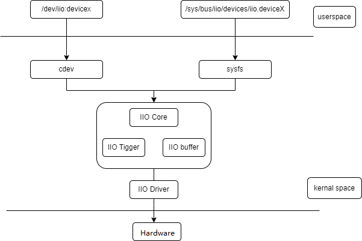

# GPADC

GPADC Functionality and Usage Guide.

## Overview

The IIO (Industrial I/O) subsystem in the Linux kernel is designed to handle data acquisition and processing for industrial control and measurement devices. It supports a wide range of device types, including:

- Analog-to-Digital Converters (ADC)
- Digital-to-Analog Converters (DAC)
- Accelerometers
- Gyroscopes
- Inertial Measurement Units (IMUs)
- Temperature sensors, and more.

The GPADC (General Purpose ADC) discussed in this section is an analog-to-digital converter embedded within the SpacemiT PMIC (Power Management IC) chip. It enables the system to sample and measure analog signals (such as voltages) through software, using the Linux IIO interface.

### Function Description

  

1. **IIO Core**: Provides the interface between the driver and user space, responsible for device enumeration, registration, and management.
2. **IIO Device Driver**: Code for controlling and reading specific IIO devices.
3. **IIO Buffer**: A memory area for storing data from sensors and other measurement devices.
4. **IIO Event Handling**: Mechanisms for handling interrupts and events from sensors and other measurement devices.

### Source Code Structure

1. **IIO Core**: `drivers/iio/industrialio-core.c` 
2. **IIO Device Driver**: `drivers/iio/adc/k1x_adc.c`
3. **IIO Buffer**: `drivers/iio/industrialio-buffer.c`
4. **IIO Event Handling**: `drivers/iio/industrialio-event.c`

## Key Features

- Supported channels: Supports up to 6 ADC channels.
- Precision: 12-bit resolution ADC with a sampling rate of 100Hz to 50kHz.

## Configuration Introduction

The configuration mainly includes **driver enablement** and **DTS (Device Tree Source) configuration**.

### CONFIG Configuration

```
Symbol: SPACEMIT_P1_ADC [=y]
Type  : tristate
Defined at drivers/iio/adc/Kconfig:1444
Prompt: Spacemit P1 adc driver
Depends on: IIO [=y] && MFD_SPACEMIT_PMIC [=y]
Location:
 -> Device Drivers
  -> Industrial I/O support (IIO [=y])
   -> Analog to digital converters
    -> Spacemit P1 adc driver (SPACEMIT_P1_ADC [=y])   
```

### DTS Configuration

The GPADC is embedded within the PMIC chip. To enable the GPADC, you need to configure two DTS (Device Tree Source) nodes:

1. GPADC Channel pinctrl Configuration

   ```
   pmic_pinctrl: pinctrl {
       compatible = "pmic,pinctrl,spm8821";
       gpio-controller;
       #gpio-cells = <2>;
       spacemit,npins = <6>;

       /* If using channel2 as the ADC input pin */
       gpadc2_pins: gpadc2-pins {
               pins = "PIN2";
               function = "adcin";
       };
   };
   ```

2. ADC Driver Enable Configuration

   ```
   ext_adc: adc {
        compatible = "pmic,adc,spm8821";
   };
   ```

## Interface

### API

```
struct iio_dev *iio_device_alloc(struct device *parent, int sizeof_priv); // Allocate an iio_dev structure
struct iio_dev *devm_iio_device_alloc(struct device *dev, int sizeof_priv); // Allocate an iio_dev structure
int iio_device_register(struct iio_dev *indio_dev); // Register an IIO device
void iio_device_unregister(struct iio_dev *indio_dev); // Unregister an IIO device

```

## Debugging

### sysfs

```
cd /sys/bus/iio/devices/iio:device0  # IIO framework directory
in_voltage2_raw  # Read the value of the ADC hardware register
in_voltage2_scale  # Read the precision of the ADC
```

## Testing

A simple test can be performed by dynamically changing the external sampling voltage. The method for reading the voltage value in software is as follows:

```
cd /sys/bus/iio/devices/iio:device0
cat in_voltage2_raw
cat in_voltage2_scale

# Multiply the values obtained from the two nodes to get the sampling voltage (in millivolts, mV).
```

## FAQ
