# Boot Development Guide

## Overview

### Purpose

This guide introduces the SpacemiT flashing and boot flows, customization methods, and driver development and debugging techniques related to U-Boot and OpenSBI. It is intended to help developers quickly understand the boot workflow and subsequent platform customization.

### Scope

This document applies to SpacemiT K3 series SoCs.

### Target Audience

- Flashing and boot development engineers
- Kernel development engineers

### Document Structure

1. **Flashing and Boot Flow Configuration**: describes the device boot mechanism and customization methods.
2. **U-Boot/OpenSBI Development and Debugging**: covers build configuration, driver development, and debugging techniques.
3. **Common Issues**: provides solutions to frequently encountered problems during development.

## Flashing and Boot

This section describes flashing- and boot-related configuration and implementation details, and provides methods for customizing both flashing and boot behavior.

> **Note:** Flashing and boot are closely related. If you customize the flashing configuration, the boot configuration may also need to be adjusted, and vice versa.

### Firmware Layout

K3 series SoCs commonly use the following three firmware layouts:


1. **eMMC/SD Card/UFS**
   - Partitions are indexed through a GPT table.
   - Only the user partition is used on eMMC.
   - The `bootinfo` address is fixed at byte offset `0x100000` or `0x110000`.
   - FSBL locates itself through the index information in `bootinfo`.

2. **SPI-NOR + UFS/SSD/eMMC**
   - The `bootinfo` address is fixed at byte offset `0` or `0x10000`.
   - FSBL locates itself through the index information in `bootinfo`.
   - Part of the firmware is stored on SPI-NOR, and the rest is stored on the secondary boot medium.
   - Multiple secondary boot media may be present, and the boot priority is configurable.
   - Partitions on the secondary boot medium are indexed through a GPT table.

3. **SPI-NAND**
   - The `bootinfo` address is fixed at byte offset `0` or `0x10000`.
   - FSBL locates itself through the index information in `bootinfo`.
   - All data can be stored in SPI-NAND, or support for a secondary boot medium can be added.

### Flashing Flow and Configuration

In the following sections, **flashing** and **burning an image** refer to the same concept. **SD card mass production** is also a flashing process in essence, except that the data source is the SD card. However, SD card mass production and **booting from an SD card** are different concepts. **SD card boot** means writing the image to the SD card and booting the system from that card.

#### Flashing Flow

The flashing process transfers images from the host PC to the target device over the Fastboot protocol, and writes them to the target storage medium through interfaces such as MMC, MTD, SCSI, or NVMe. A complete flashing flow includes entering U-Boot Fastboot mode, transferring images, detecting the storage device, creating the GPT table, and writing data to the storage medium.

##### U-Boot Fastboot Mode

The flashing communication protocol on this platform is based on Fastboot, with platform-specific extensions. All actual flashing operations are performed in U-Boot Fastboot mode. After entering U-Boot Fastboot mode, you can detect the device from the host PC by running `fastboot devices` (the Fastboot environment must be set up on the PC).

```sh
~$ fastboot devices
?         Android Fastboot
```

You can enter U-Boot Fastboot mode in any of the following three ways:

1. **Using the key combination**: Press the `FEL` and `RESET` buttons on the board to enter BROM Fastboot mode, then run the following commands on the host PC to enter the U-Boot flashing interface. BROM Fastboot is used only to load and start U-Boot Fastboot.

```sh
fastboot stage factory/FSBL.bin
fastboot continue
# sleep and wait for U-Boot to become ready
# on Linux
sleep 1
# on Windows
#timeout /t 1 >null
fastboot stage u-boot.itb
fastboot continue
```

2. **Using the ADB command**: For a device that has already booted into the operating system, run the following command on the host PC:

```sh
adb reboot bootloader
```

This puts the board into the U-Boot flashing interface. (Some firmware builds may remove ADB support, so this method is not universally available.)

3. **Using the serial console**: While the board is booting, press and hold the `s` key on the serial console to enter the U-Boot shell, then run the following command from the serial console to enter the U-Boot flashing interface:

```sh
fastboot 0
```

The following sections describe the flashing commands for different storage-medium combinations. Depending on the hardware design, BROM can switch boot media based on the boot-pin configuration (NOR/NAND/eMMC/UFS). For details, refer to the hardware reference design.

##### eMMC Flashing

- **eMMC flashing flow**
  The eMMC flashing flow is shown below. The initial steps enter `uboot-fastboot` mode from `brom-fastboot`; the same applies to the other media described later.

```sh
fastboot stage factory/FSBL.bin
fastboot continue
# sleep to wait for U-Boot to become ready
# on Linux
sleep 1
# on Windows
#timeout /t 1 >null
fastboot stage u-boot.itb
fastboot continue

fastboot flash gpt partition_universal.json
fastboot flash bootinfo factory/bootinfo_block.bin
fastboot flash fsbl factory/FSBL.bin
fastboot flash env env.bin
fastboot flash esos esos.itb
fastboot flash opensbi fw_dynamic.itb
fastboot flash uboot u-boot.itb
fastboot flash ESP esp.img
fastboot flash bootfs bootfs.img
fastboot flash rootfs rootfs.ext4

```

- **eMMC partition table configuration**
  The partition table is stored in `buildroot-ext/board/spacemit/k3/partition_universal.json`. Among these entries, `bootinfo` stores information such as the boot medium and the FSBL offset and size.

```sh
{
  "version": "1.0",
  "format": "gpt",
  "partitions": [
    {
      "name": "env",
      "comment": "uboot env data partition, MUST not change its offset and size",
      "hidden": true,
      "offset": "640K",
      "size": "64K",
      "image": "env.bin"
    },
    {
      "name": "bootinfo",
      "comment": "contain address and size info of fsbl, MUST not change its position",
      "hidden": true,
      "offset": "1M",
      "size": "128K",
      "image": "factory/bootinfo_block.bin"
    },
    {
      "name": "fsbl",
      "comment": "its offset was designated by bootinfo",
      "hidden": true,
      "offset": "1536K",
      "size": "512K",
      "image": "factory/FSBL.bin"
    },
    {
      "name": "esos",
      "hidden": true,
      "offset": "4M",
      "size": "3M",
      "image": "esos.itb"
    },
    {
      "name": "opensbi",
      "hidden": true,
      "offset": "7M",
      "size": "1M",
      "image": "fw_dynamic.itb"
    },
    {
      "name": "uboot",
      "hidden": true,
      "offset": "8M",
      "size": "4M",
      "image": "u-boot.itb"
    },
    {
      "name": "bootfs",
      "offset": "12M",
      "size": "256M",
      "image": "bootfs.vfat",
      "compress": "gzip-5"
    },
    {
      "name": "rootfs",
      "size": "-"
    }
  ]
}

```

##### NOR+BLK Device Flashing

- **NOR+BLK flashing flow**
  K3 supports combined flashing and boot from NOR + SSD/eMMC/UFS and other BLK devices, with adaptive handling.

```sh
fastboot stage factory/FSBL.bin
fastboot continue
# sleep and wait for U-Boot to become ready
# on Linux
sleep 1
# on Windows
#timeout /t 1 >null
fastboot stage u-boot.itb
fastboot continue

# flash SPI NOR
fastboot flash mtd partition_4M.json
fastboot flash bootinfo factory/bootinfo_spinor.bin
fastboot flash fsbl factory/FSBL.bin
fastboot flash env env.bin
fastboot flash esos esos.itb
fastboot flash opensbi fw_dynamic.itb
fastboot flash uboot u-boot.itb

# flash the BLK device
# the flashing tool writes images according to the actual partition table,
# so for NOR+BLK BLK devices, partitions such as fsbl/uboot on the BLK side do not have practical effect
fastboot flash gpt partition_universal.json
fastboot flash bootfs bootfs.img
fastboot flash rootfs rootfs.ext4
```

- **NOR+BLK partition table configuration**
  - The NOR partition table is located at `buildroot-ext/board/spacemit/k3/partition_4M.json`. For NAND/NOR devices, partition tables are named in the form `partition_xM.json`, and must be renamed according to the actual flash capacity. Otherwise, the flashing process will not find the correct partition table.
    - NOR/NAND partition tables are compatible downward to the minimum supported capacity. For example, if the NOR device capacity is 8 MB but the flashing package contains only `partition_4M.json`, then `partition_4M.json` will be matched and used.
  - Partition table naming conventions:
    - MTD storage media (`NAND`/`NOR` flash) use capacity-based names such as `partition_4M.json`.
    - BLK devices, including `eMMC`/`SD`/`SSD`, use `partition_universal.json`.

- **Modifying the NOR flash partition table**:
  1. The partition start address and size are aligned to 64 KB by default, corresponding to a 64 KB erase size.
  2. If you need 4 KB alignment for the start address and size, enable the U-Boot build option `CONFIG_SPI_FLASH_USE_4K_SECTORS`.

```sh
//buildroot-ext/board/spacemit/k3/partition_4M.json
{
  "version": "1.0",
  "format": "mtd",
  "partitions": [
    {
      "name": "bootinfo",
      "comment": "contain address and size info of fsbl, MUST not change its position",
      "offset": "0",
      "size": "128K",
      "image": "factory/bootinfo_spinor.bin"
    },
    {
      "name": "fsbl",
      "comment": "its offset was designated by bootinfo",
      "offset": "128K",
      "size": "512K",
      "image": "factory/FSBL.bin"
    },
    {
      "name": "env",
      "comment": "uboot env data partition, MUST not change its offset and size",
      "offset": "640K",
      "size": "64K",
      "image": "env.bin"
    },
    {
      "name": "esos",
      "offset": "704K",
      "size": "1M",
      "image": "esos.itb"
    },
    {
      "name": "opensbi",
      "offset": "1728K",
      "size": "384K",
      "image": "fw_dynamic.itb"
    },
    {
      "name": "uboot",
      "offset": "2112K",
      "size": "3M",
      "image": "u-boot.itb"
    }
  ]
}
```

- **BLK device partition table note**
  BLK devices (SSD, eMMC, UFS, SD card, and others) all use the `partition_universal.json` partition table.

##### NAND Flashing and Boot

- **NAND flashing flow**
  K3 supports flashing and booting from NAND. However, because **NAND and NOR share the same SPI interface**, only one of them can be used at a time, and the system uses NOR boot by default.
  If you need to enable NAND boot, refer to the NAND configuration instructions in the flashing and boot section and complete the required configuration.

```sh
fastboot stage factory/FSBL.bin
fastboot continue
# sleep and wait for U-Boot to become ready
# on Linux
sleep 1
# on Windows
#timeout /t 1 >null
fastboot stage u-boot.itb
fastboot continue

fastboot flash mtd partition_64M.json
fastboot flash bootinfo factory/bootinfo_spinand.bin
fastboot flash fsbl factory/FSBL.bin
fastboot flash env env.bin
fastboot flash esos esos.itb
fastboot flash opensbi fw_dynamic.itb
fastboot flash uboot u-boot.itb

fastboot flash user-bootfs bootfs.img
fastboot flash user-rootfs rootfs.img
```

- **UBIFS filesystem image generation**
  Filesystems on NAND depend on UBIFS, so `bootfs.img` and `rootfs.img` must be generated in advance. The method is as follows:

```sh
# generate bootfs.img
mkfs.ubifs -F -m 2048 -e 124KiB -c 8124 -x zlib -o output/bootfs.img -d input_bootfs/

# generate rootfs.img
mkfs.ubifs -F -m 2048 -e 124KiB -c 8124 -x zlib -o output/rootfs.img -d input_rootfs/

# input_bootfs and input_rootfs should contain the files for bootfs and rootfs
# for example, bootfs should contain files such as Image.itb, env_k3.txt, and bianbu.bmp

# parameters must be adjusted for different NAND devices; the following explains several key options
# refer to mkfs.ubifs documentation for full usage details
-m 2048: sets the minimum input/output unit size to 2048 bytes (2 KiB), which must match the NAND flash page size.
-e 124KiB: sets the logical eraseblock size to 124 KiB, which should be smaller than the actual physical eraseblock size to reserve space for UBI management structures.
-c 8124: sets the maximum number of logical eraseblocks to 8124. This limits the maximum filesystem size based on the eraseblock size and count.
-x zlib: sets the compression type to zlib, so data in the filesystem is compressed with zlib.
-o output/ubifs.img: specifies the output file name and saves the generated UBIFS image as `output/ubifs.img`.
-d input/: specifies the source directory. `mkfs.ubifs` builds the UBIFS image from the files and directory structure under `input/`.
```

- **NAND + BLK combined boot**
  This platform also supports combined boot from NAND + BLK devices. For the related flashing flow, refer to the **NOR+BLK Device Flashing** section.

- **NAND partition table configuration**
  The following example shows a partition table for NAND with a capacity of 256 MB:

```sh
//buildroot-ext/board/spacemit/k3/partition_64M.json
{
  "version": "1.0",
  "format": "mtd",
  "partitions": [
    {
      "name": "bootinfo",
      "comment": "contain address and size info of fsbl, MUST not change its position",
      "offset": "0",
      "size": "128K",
      "image": "factory/bootinfo_spinand.bin"
    },
    {
      "name": "fsbl",
      "comment": "its offset was designated by bootinfo",
      "offset": "128K",
      "size": "512K",
      "image": "factory/FSBL.bin"
    },
    {
      "name": "env",
      "comment": "uboot env data partition, MUST not change its offset and size",
      "offset": "640K",
      "size": "64K",
      "image": "env.bin"
    },
    {
      "name": "esos",
      "offset": "704K",
      "size": "1M",
      "image": "esos.itb"
    },
    {
      "name": "opensbi",
      "offset": "1728K",
      "size": "384K",
      "image": "fw_dynamic.itb"
    },
    {
      "name": "uboot",
      "offset": "2112K",
      "size": "3008K",
      "image": "u-boot.itb"
    },
    {
      "name": "bootfs",
      "offset": "5M",
      "size": "30M",
      "image": "bootfs.vfat"
    }
  ]
}
```

##### SD Card Boot

SD card boot means writing the system image to an **SD card**. When the device is started with that SD card inserted, it **prioritizes loading the system from the card at power-on**.

The K3 platform supports SD card boot and **tries the SD card first**. If SD card boot fails, the system falls back to another storage medium selected by the **boot pins**.

> **Note:** This platform **does not support writing images to an SD card through the Fastboot protocol**.

To create an SD card boot image, use the **TitanFlash tool** or the `dd` command.

**Creating an SD card boot image with the flashing tool:**

1. Insert the TF card into a card reader and connect it to the PC over USB.
2. Open the **TitanFlash** flashing tool on the PC. For installation instructions, refer to [TitanFlash Installation](https://spacemit.com/community/document/info?lang=en&nodepath=tools/user_guide/flasher_user_guide.md).
3. Click **Dev Tools → SDCard Boot Disk** in the top menu bar.
4. Choose the **Boot Card** and select the **flashing package**.
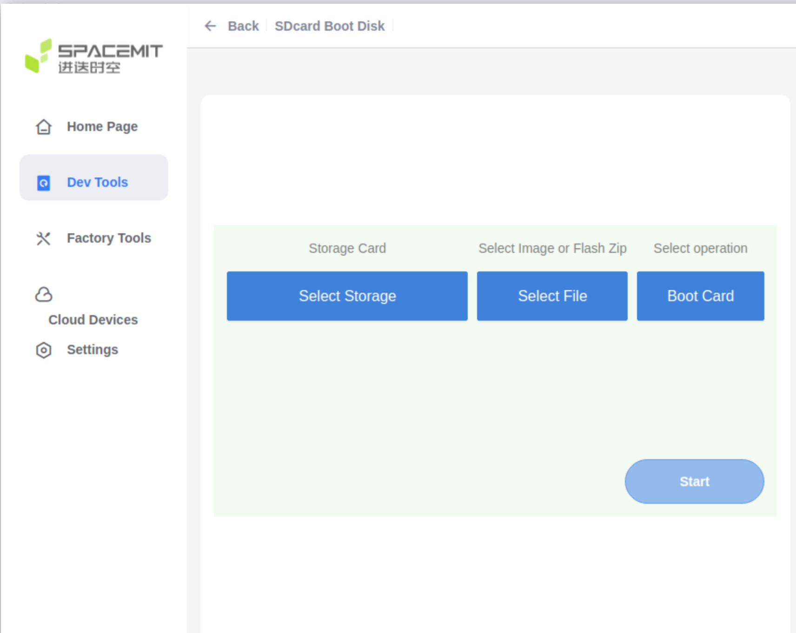
5. Click **Start** to start writing the image.
6. After the write completes successfully, insert the TF card into the device. The device can then boot from the card after power-on.

##### SD Card Mass Production

SD card mass production means writing the flashing-related image files to an **SD card**. After power-on, the device **boots from the SD card first**. When the system detects that it is in mass-production mode, it **writes the image files from the card to the storage medium selected by the boot pins according to the partition table configuration**, such as eMMC, NOR, NAND, or UFS.

The K3 platform supports SD card mass-production flashing. You can use the **TitanFlash tool** to prepare an SD card as a mass-production card. After inserting the prepared card into the device and powering it on, the system automatically flashes the images to the target storage medium.

**Steps to create a mass-production card:**

1. Insert the TF card into a card reader and connect it to the PC over USB.
2. Open the TitanFlash tool and click **Factory Tools → MP SDcard Programming**.
3. Select the flashing package to be written, then click **Start** to start creation.
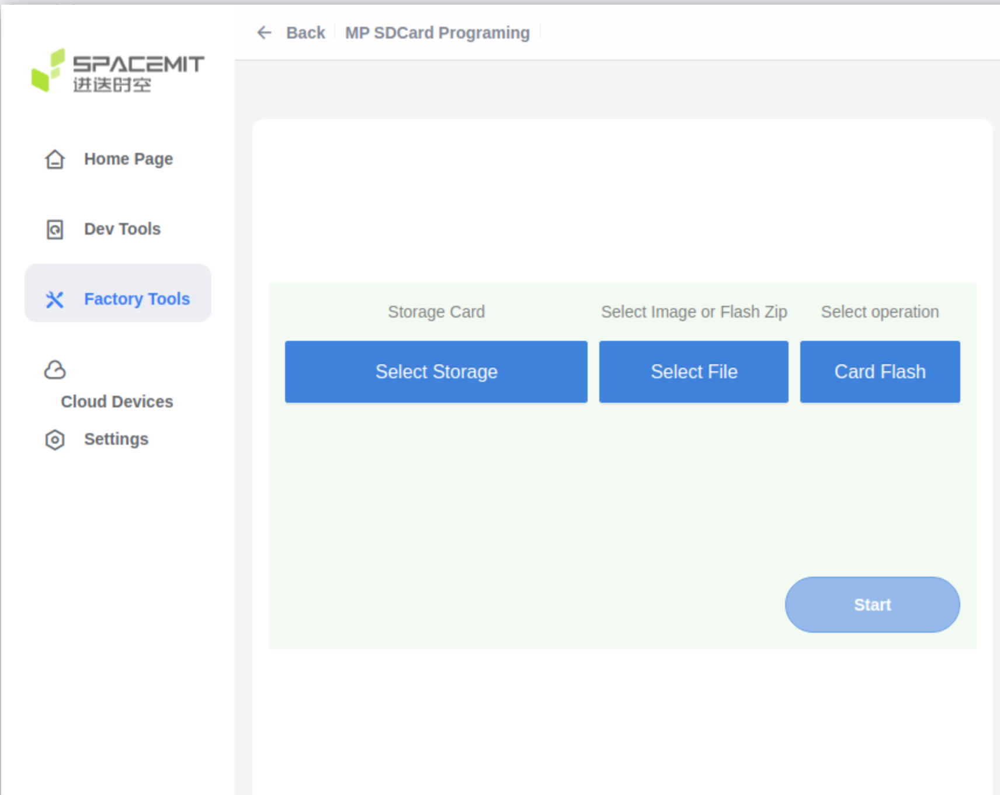
4. After creation is complete, insert the SD card into the device.
5. After power-on, the device automatically enters the SD card flashing flow and writes the images to the target storage medium.
6. After flashing completes, **be sure to remove the SD card** to avoid repeating the flashing process at the next power-on.

#### Flashing Tools

This section briefly describes how to use the flashing tools and related supporting information.

##### Using the Flashing Tools

The platform supports the following two methods for writing images:

- **TitanFlash flashing tool**:
  Intended for general developers and suitable for flashing complete image packages. It provides a user-friendly interface and complete functionality.
  For installation and usage instructions, refer to the official documentation: [TitanFlash User Guide](https://spacemit.com/community/document/info?lang=en&nodepath=tools/user_guide/flasher_user_guide.md)

- **Fastboot tool**:
  Intended for users with some development experience and suitable for flashing individual partition images.
  **Note:** If a partition image is flashed incorrectly, the system may fail to boot. Use this method with caution.
  For the flashing procedure, refer to the **Flashing Flow** section of this document. For Fastboot environment setup, see the following references:

  - [Reference Link 1](https://www.jb51.net/article/271550.htm)
  - [Reference Link 2](https://blog.csdn.net/qq_34459334/article/details/140128714)

> For how to generate firmware images, refer to: [Download and Build](https://sdk.spacemit.com/source)

##### Selecting the Flashing Medium

- On supported hardware platforms, the boot medium can be switched through the **Boot Download Sel Switch** DIP switch.
  For details, refer to the [Boot Download Sel & JTAG Sel](https://spacemit.com/community/document/info?lang=en&nodepath=hardware/eco/k1_muse_pi/pi_user_guide.md) section in the MUSE Pi User Guide.

- For other platforms or solutions, refer to the corresponding hardware user manual.

- Flashing methods are already **automatically adapted** for different boot media.

### Boot Configuration

This section describes the boot configuration for `eMMC`, `SD`, `NOR`, `NAND`, and `UFS`, as well as considerations for custom boot configuration. Flashing and booting require both the correct partition table and the correct boot configuration.

#### Boot Flow

This section describes the platform boot flow and provides guidance for boot customization.
As shown in the diagram below, the boot flow mainly consists of the following stages:
**brom -> fsbl -> opensbi -> uboot -> kernel**

In this flow, `bootinfo` provides information such as the FSBL offset and size.


According to the hardware **Boot Pin Select** configuration, the system loads the next-stage boot image from media such as an SD card, eMMC, NOR, NAND, or UFS.
**The overall boot flow is the same regardless of the boot medium.**
For details about Boot Pin Select, refer to **Selecting the Flashing Medium** in the **Using the Flashing Tools** section.

On the K3 platform, after power-on the device will:

1. **Try to boot from the SD card first**;
2. If SD card boot fails, try loading the bootloader from eMMC, NAND, NOR, or UFS according to the Boot Pin Select setting.

The following subsections describe the boot configuration for bootinfo, fsbl, opensbi, uboot, and kernel in boot order.

##### BROM (Boot ROM)

BROM is boot code built into the SoC and cannot be changed after manufacturing. It runs automatically after power-on or reset. Based on the Boot Pin configuration, it determines the boot medium, such as SD, eMMC, NOR, NAND, or UFS, and loads `bootinfo` and `fsbl` from that medium.

> For Boot Pin settings, refer to **Selecting the Flashing Medium** in the **Using the Flashing Tools** section.

##### bootinfo

After BROM starts, it reads `bootinfo` from a **fixed physical offset** on the corresponding storage medium. The `bootinfo` location for different boot media is shown in the table below. `bootinfo` contains information such as the location and size of `fsbl` and `fsbl1`, and supports backup copies.

| Boot Medium | bootinfo 0 Offset | bootinfo 1 Offset |
|:-----------:|:-----------------:|:-----------------:|
| SD Card | 0x100000 | 0x110000 |
| eMMC | 0x100000 | 0x110000 |
| UFS | 0x100000 | 0x110000 |
| SPI-NOR | 0 | 0x10000 |
| SPI-NAND | 0 | 0x10000 |

The bootinfo description files are located in the following directory and are described in `.json` format:

```sh
uboot-2022.10$ ls board/spacemit/k3/configs/
bootinfo_block.json  bootinfo_spinand.json  bootinfo_spinor.json
```

The example JSON files below record the default `fsbl` / `fsbl1` locations for different storage media. `fsbl1` is the backup copy. If you need to change the offset address, modify the `bootinfo_*.json` files and then rebuild U-Boot.

The `fsbl` location should remain at the factory default whenever possible. If customization is required, the characteristics of different storage media must be considered. For example, NAND requires sector alignment. On K3, `fsbl` is stored in the user area.

```sh
block(eMMC/SD/UFS): spl0=0x180000, spl1=0x200000
nor:  spl0=0x20000, spl1=0xA0000
nand: spl0=0x20000, spl1=0xA0000
```

When U-Boot is built, the corresponding `*.bin` and other bootinfo image files are generated in the root directory. The generation method can be found in `uboot-2022.10/board/spacemit/k3/config.mk`.

```sh
uboot-2022.10$ ls -l
bootinfo_block.bin
bootinfo_spinand.bin
bootinfo_spinor.bin
```

##### FSBL (First Stage Boot Loader)

After BROM obtains `bootinfo`, it loads `fsbl` from the specified offset.

The `fsbl` file consists of a 4 KB header plus `u-boot-spl.bin`. The header contains required information about `u-boot-spl`, such as the CRC checksum.

After `fsbl` starts, it first **initializes DDR**, then **loads `esos`, `opensbi`, and `uboot` from the partition table into their designated memory locations**, then **runs `esos` and `opensbi`**, after which **`opensbi` starts `uboot`**. (How `fsbl` initializes DDR is outside the scope of this document.)

##### Loading and Starting `esos`, `opensbi`, and `uboot`

On the K3 platform, after FSBL, SPL loads images in two stages:

1. **`opensbi` loading**: handled by the standard SPL loading framework (`spl_mmc_load`, `spl_spi_load_image`, or `spl_ufs_load_image`). `opensbi` is the SPL "main image". After loading completes, SPL jumps to `spl_invoke_opensbi()`.
2. **`esos` + `uboot` loading**: before jumping to `opensbi`, these images are additionally loaded by `board_load_extra_fits()` in `board/spacemit/k3/spl_extra_fit.c`, with `esos` loaded before `uboot`.

**esos** (Embedded SoC OS) is a K3-specific SoC firmware partition. The partition layout is as follows, using NOR as an example:

```
spi-flash: 128K@0(bootinfo), 512K@128K(fsbl), 64K@640K(env),
           1M@704K(esos), 384K@1728K(opensbi), -@2112K(uboot)
```

**opensbi loading strategy** (in priority order):

1. **Load by partition name** (default): SPL scans the partition table and looks for a partition named `opensbi`. On MTD devices, this is specified by the env variable `opensbi_partition`, which defaults to `opensbi`.
2. **Load by absolute offset**: specify the byte offset through the env variable `opensbi_offset`, which defaults to `0x700000`.

**esos / uboot loading strategy** (in priority order):

1. **Load by partition name** (default): specify the partition names through env variables `extra_esos_partition=esos` and `extra_uboot_partition=uboot`. SPL scans the partition table, finds the corresponding partitions, and loads the FIT images.
2. **Load by absolute offset**: specify byte offsets through the env variables `esos_offset` and `uboot_offset`.
3. **Load from filesystem** (MMC/UFS, requires `CONFIG_SYS_BOOTLOADER_FS_PARTITION_NAME`): read `esos.itb` and `u-boot.itb` from the specified filesystem partition. The paths are controlled by `esos_itb_path` and `uboot_itb_path`, and this behavior can be disabled with `bootloader_from_fs=0`.

**`opensbi` handoff flow** (`common/spl/spl_opensbi.c`):

After SPL loads `opensbi`, it calls `spl_invoke_opensbi()`. This function:
1. Calls `board_load_extra_fits()` to load `esos` and `uboot`, and obtains the `uboot` entry address;
2. Constructs the `fw_dynamic_info` structure and passes the `uboot` entry address (`next_addr`) to `opensbi`;
3. Jumps to the `opensbi` entry point. After initialization completes, `opensbi` starts U-Boot using `next_addr`.

Default environment configuration (`include/configs/k3.h`):

```c
“opensbi_offset=0x700000\0”
“extra_esos_partition=esos\0”
“extra_uboot_partition=uboot\0”
“esos_offset=0x400000\0”
“uboot_offset=0x800000\0”
“esos_itb_path=esos.itb\0”
“uboot_itb_path=u-boot.itb\0”
```

Memory load addresses are defined in defconfig:

```
CONFIG_SPL_OPENSBI_LOAD_ADDR=0x100000000   # opensbi load address
CONFIG_SYS_TEXT_BASE=0x102000000           # uboot load address
```

###### eMMC / SD Boot

Both eMMC and SD use the **MMC driver**, and the device is selected according to Boot Pin Select (SD = MMC0, eMMC = MMC2).

On the K3 platform, the default behavior is to try booting from SD first, and then try other media (eMMC/NOR/NAND/UFS) if SD boot fails.

**opensbi loading**: `spl_mmc_load()` first loads the `opensbi` FIT image either from `opensbi_offset` (env, default `0x700000`) or from the partition named `opensbi`.

**esos / uboot loading**: after `opensbi` is loaded, `spl_invoke_opensbi()` calls `board_load_extra_fits()` to load them either by partition name (`esos` / `uboot`) or by offset.

The SPL DTS must enable the eMMC / SD nodes:

```sh
//uboot-2022.10/arch/riscv/dts/k3_spl.dts
        /* SD */
        sdhci0: sdh@d4280000 {
            u-boot,dm-spl;
            compatible = “spacemit,k3-sdhci”;
            bus-width = <4>;
            broken-cd;
            no-1-8-v;
            cap-sd-highspeed;
            sdh-phy-module = <0>;
            status = “okay”;
        };

        /* eMMC */
        sdhci2: sdh@d4281000 {
            u-boot,dm-spl;
            compatible = “spacemit,k3-sdhci”;
            bus-width = <8>;
            non-removable;
            mmc-hs400-1_8v;
            mmc-hs400-enhanced-strobe;
            sdh-phy-module = <1>;
            status = “okay”;
        };
```

**Loading method (in priority order):**

1. **By partition name** (default)

  SPL scans the GPT partition table, finds the starting LBA of the corresponding partitions based on `extra_esos_partition` (default `esos`) and `extra_uboot_partition` (default `uboot`), and loads the FIT images.

  Load order: `esos` first, then `uboot` (including the opensbi entry point).

2. **By absolute offset**

  Set the env variables `esos_offset` and `uboot_offset` (byte offsets, which must be aligned to the block size), and SPL reads the FIT images directly from those offsets.

   ```sh
  # Example: set temporarily in the U-Boot shell
   => setenv esos_offset 0x400000
   => setenv uboot_offset 0x800000
   => saveenv
   ```

###### NOR Boot

The K3 platform supports booting from NOR media. Common boot combinations include:

- NOR (u-boot-spl / esos / uboot / opensbi) + SSD (bootfs / rootfs)
- NOR (u-boot-spl / esos / uboot / opensbi) + eMMC (bootfs / rootfs)
- NOR (u-boot-spl / esos / uboot / opensbi) + UFS (bootfs / rootfs)


If multiple block devices are present at the same time, their priority can be configured in code (`board/spacemit/k3/k3.c`). As shown below, the system **tries UFS first** by default.

```c
static struct k3_nor_boot_target k3_nor_boot_prio[] = {
#ifdef CONFIG_SCSI
    { K3_NOR_BOOT_TARGET_SCSI, "scsi", "ufs_devnum",
      K3_NOR_UFS_DEVNUM_DEFAULT },
#endif
#ifdef CONFIG_NVME
    { K3_NOR_BOOT_TARGET_NVME, "nvme", "ssd_devnum",
      K3_NOR_SSD_DEVNUM_DEFAULT },
#endif
#ifdef CONFIG_MMC
    { K3_NOR_BOOT_TARGET_MMC, "mmc", "emmc_devnum",
      K3_NOR_EMMC_DEVNUM_DEFAULT },
#endif
#if defined(CONFIG_USB) && defined(CONFIG_USB_STORAGE)
    { K3_NOR_BOOT_TARGET_UDISK, "usb", "usb_devnum",
      K3_NOR_USB_DEVNUM_DEFAULT },
#endif
};
```

Alternatively, add the following node to the U-Boot DTS to set the highest-priority boot target.

```c
{
        nor-boot-priority-helper {
                highest-priority = "ssd";
                // one of ufs/scsi, ssd/nvme, mmc ,usb
        };
};

```

For SPI-NOR, configure the SPL DTS as follows:

```c
//uboot-2022.10/arch/riscv/dts/k3_spl.dts
        qspi: spi@d420c000 {
            u-boot,dm-spl;
            compatible = "spacemit,k3-qspi";
            #address-cells = <1>;
            #size-cells = <0>;
            pinctrl-names = "default";
            pinctrl-0 = <&pinctrl_qspi>;
            reg = <0x0 0xd420c000 0x0 0x1000>,
                  <0x0 0xb8000000 0x0 0x4100000>;
            reg-names = "qspi-base", "qspi-mmap";
            qspi-sfa1ad = <0x4000000>;
            qspi-sfa2ad = <0x100000>;
            qspi-sfb1ad = <0x100000>;
            qspi-sfb2ad = <0x100000>;
            qspi-pmuap-reg = <0xd4282860>;
            qspi-mpmu-acgr-reg = <0xd4051024>;
            qspi-ahbread = <0>;
            qspi-freq = <26500000>;
            qspi-id = <4>;
            clocks = <&ccu CLK_QSPI>,
                      <&ccu CLK_QSPI_BUS>;
            clock-names = "qspi_clk", "qspi_bus_clk";
            resets = <&reset RESET_QSPI>,
                <&reset RESET_QSPI_BUS>;
            reset-names = "qspi_reset", "qspi_bus_reset";
            spi-max-frequency = <81300000>;
            status = "okay";

            flash@0 {
                u-boot,dm-spl;
                compatible = "jedec,spi-nor";
                reg = <0>;
                spi-max-frequency = <81300000>;
                m25p,fast-read;
                broken-flash-reset;
                status = "okay";
            };
        };
```

Boot configuration steps for SPL loading from NOR:

**The following options are enabled by default. If needed, verify them through `menuconfig`.**

1. **Enable basic SPL functionality**
  Run `make uboot_menuconfig` and select `SPL configuration options`.
    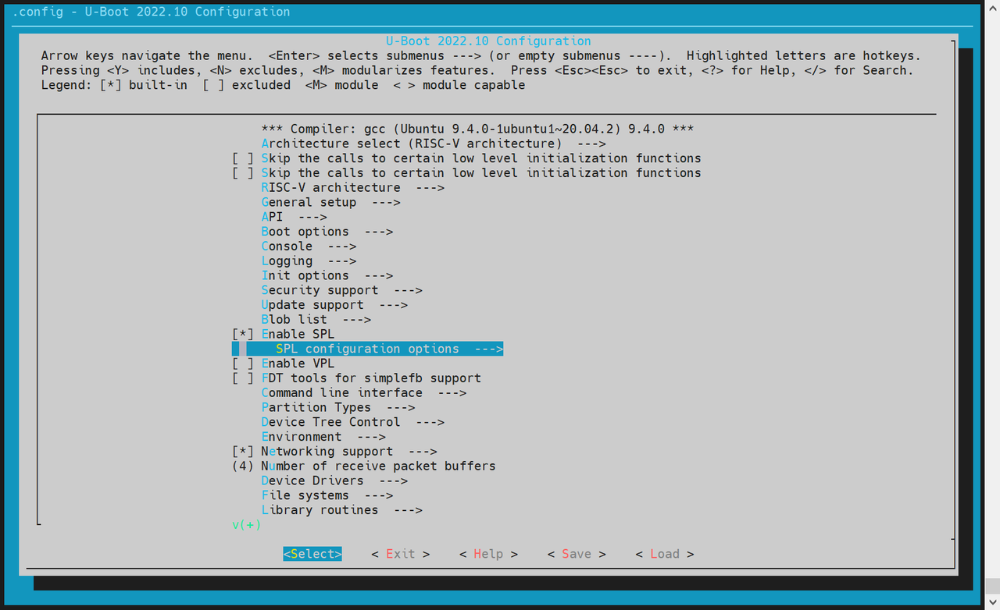

2. **Enable the following options:**

   - `Support MTD drivers`
   - `Support SPI DM drivers in SPL`
   - `Support SPI drivers`
   - `Support SPI flash drivers`
   - `Support for SPI flash MTD drivers in SPL`
   - `Support loading from mtd device`
   - Set `Partition name to use to load U-Boot from`. This value must match the actual name in the partition table.

    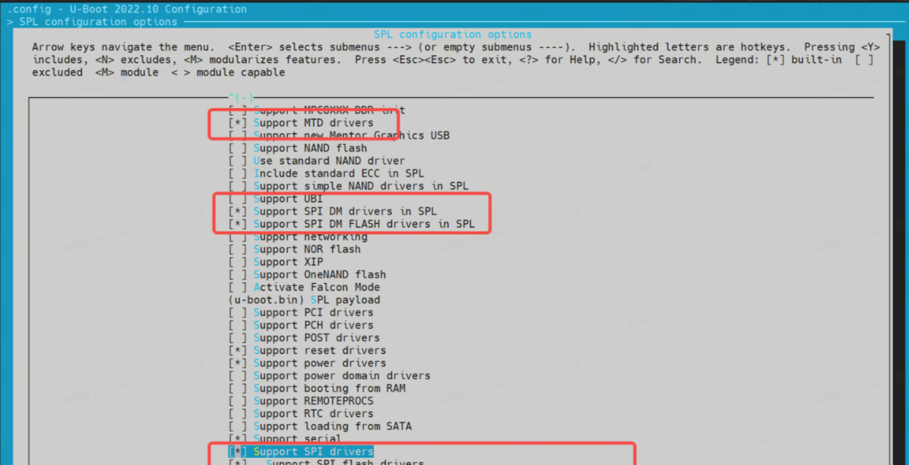

3. **Enable BLK device support** (such as SSD/eMMC)
   Go to `Device Drivers -> Fastboot support` and enable:

   - `Support blk device`
   - SSD corresponds to NVMe, and eMMC corresponds to MMC.

    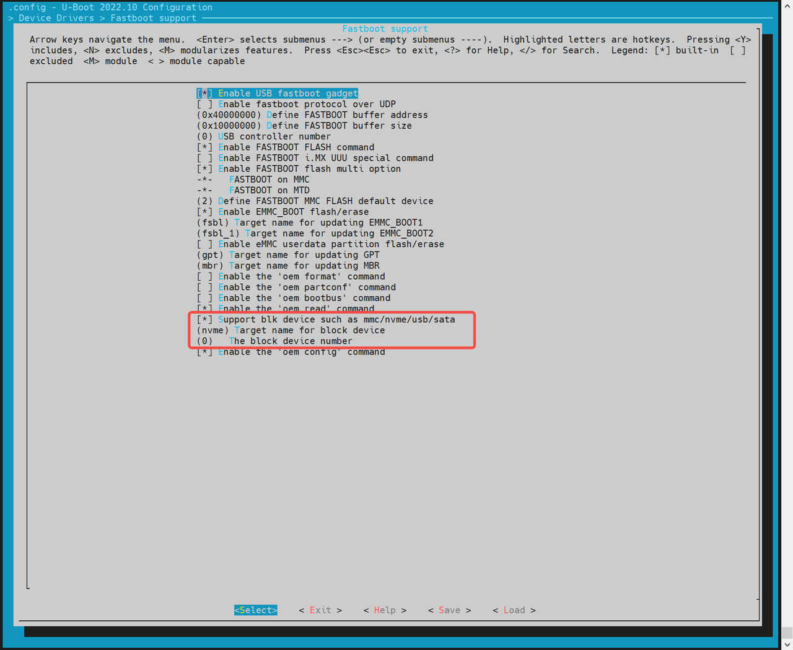

4. **Enable MTD environment variable (env) support**

  After SPL starts, it needs to obtain MTD partition information from `env`:

  - Go to the `Environment` configuration page.
  - Enable SPI env loading.
  - Set the env offset address. It must match the partition table, for example `0xA0000`.

    

    

5. **Adapt the SPI flash driver according to the hardware**
   If the target flash chip driver is not included by default:

   - Run `make uboot_menuconfig`.
   - Go to `Device Drivers -> MTD Support -> SPI Flash Support`.
   - Select the corresponding driver according to the SPI flash vendor used by the hardware.

   

  If your flash model is not listed, add it manually in the code. `flash_name` can be customized and is usually the hardware flash name. `0x1f4501` is the JEDEC ID of the flash. Other parameters should be added according to the hardware flash specifications.

```sh
//uboot-2022.10/drivers/mtd/spi/spi-nor-ids.c
const struct flash_info spi_nor_ids[] = {
     { INFO("flash_name",    0x1f4501, 0, 64 * 1024,  16, SECT_4K) },
```

**NOR loading flow**:

- **opensbi**: loaded by `spl_spi_load_image()` in `common/spl/spl_mtd.c`. It first looks for the MTD partition named `opensbi`, which can be overridden by the env variable `opensbi_partition`. If the partition is not found, it loads from the offset specified by `opensbi_offset`.
- **esos / uboot**: after `opensbi` is loaded, these are loaded by `board_load_extra_fits()`. The following two methods are supported:

- **By partition name** (default)

  SPL directly obtains the `esos` and `uboot` partitions by MTD partition name and loads the FIT images. The partition names are controlled by the env variables `extra_esos_partition` (default `esos`) and `extra_uboot_partition` (default `uboot`). If the env variables are not set, SPL automatically tries the MTD partitions named `esos` and `uboot`.

  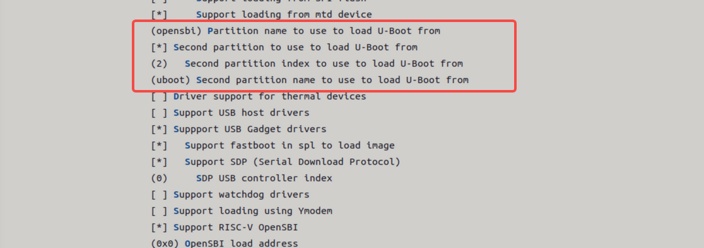

- **By absolute offset**

  Specify byte offsets through the env variables `esos_offset` and `uboot_offset`. The default values are defined in `include/configs/k3.h`.

  Enable the following configuration and enter the absolute offset address of the storage medium.
  

###### NAND Boot

The K3 platform supports booting from NAND in two main configurations:

- **NAND (`u-boot-spl` / `esos` / `uboot` / `opensbi`) + SSD (`bootfs` / `rootfs`)**
- **Pure NAND (`u-boot-spl` / `esos` / `uboot` / `opensbi` / `kernel`)**

By default, NAND boot support is disabled. Loading `opensbi`/`esos`/`uboot` from NAND is identical to the NOR flow and is handled by `spl_spi_load_image()` and `board_load_extra_fits()`. The partition names are controlled by `opensbi_partition`, `extra_esos_partition`, and `extra_uboot_partition`.

The SPL DTS configuration is as follows:

```sh
//uboot-2022.10/arch/riscv/dts/k3_spl.dts
        spi@d420c000 {
                status = "okay";
                pinctrl-names = "default";
                pinctrl-0 = <&pinctrl_qspi>;
                u-boot,dm-spl;

                compatible = "spacemit,k3-qspi";
                spi-nand@0 {
                       compatible = "spi-nand";
                       reg = <0>;
                       spi-tx-bus-width = <1>;
                       spi-rx-bus-width = <1>;
                       spi-max-frequency = <6250000>;
                       u-boot,dm-spl;
                       status = "okay";
               };
        };

```

The following describes the configuration steps for **pure NAND boot**.

1. **Configure SPL build options**
  - Run `make uboot_menuconfig`, go to `SPL configuration options`, and enable the following options:

     

     - `Support MTD drivers`
     - `Support SPI DM drivers in SPL`
     - `Support SPI drivers`
     - `Use standard NAND driver`
     - `Support simple NAND drivers in SPL`
     - `Support loading from mtd device`
     - Set `Partition name to use to load U-Boot from`. It must match the partition table entry (default: `esos`).

   - NAND loading on K3 is handled uniformly by `board_load_extra_fits()`. Partition names are controlled by the env variables `extra_esos_partition` and `extra_uboot_partition`, so no additional second-partition configuration is required.

     

2. **Configure env support**
  For MTD devices, `env` support must be enabled so that SPL can obtain MTD partition information from `env` after startup.
  - Run `make uboot_menuconfig`
  - Go to the `Environment` configuration page
  - Enable SPI `env` loading support
  - Set the offset address to `0xA0000` so that it matches the partition table

3. **Adapt the NAND flash driver**

  - The driver must match the NAND chip vendor actually used by the hardware. The NAND flash drivers currently supported are listed below.

```sh
~/uboot-2022.10$ ls drivers/mtd/nand/spi/*.c
uboot-2022.10/drivers/mtd/nand/spi/core.c
uboot-2022.10/drivers/mtd/nand/spi/micron.c
uboot-2022.10/drivers/mtd/nand/spi/winbond.c
uboot-2022.10/drivers/mtd/nand/spi/gigadevice.c
uboot-2022.10/drivers/mtd/nand/spi/other.c
uboot-2022.10/drivers/mtd/nand/spi/macronix.c
uboot-2022.10/drivers/mtd/nand/spi/toshiba.c
```

- If the required driver is not built in, you can add the vendor's **JEDEC ID** to the `other.c` driver.
  Example: add support for FORESEE or Dosilicon devices:

```sh
//uboot-2022.10/drivers/mtd/nand/spi/other.c
 static int other_spinand_detect(struct spinand_device *spinand)
 {
     u8 *id = spinand->id.data;
     int ret = 0;

     /*
      * dosilicon nand flash
      */
     if (id[1] == 0xe5)
        ret = spinand_match_and_init(spinand, dosilicon_spinand_table,
                     ARRAY_SIZE(dosilicon_spinand_table),
                     id[2]);

     /*FORESEE nand flash*/
     if (id[1] == 0xcd)
        ret = spinand_match_and_init(spinand, foresee_spinand_table,
                     ARRAY_SIZE(foresee_spinand_table),
                     id[2]);
     if (ret)
         return ret;

     return 1;
 }
```

###### UFS Boot

The K3 platform supports booting from UFS media. In SPL, UFS devices are accessed as SCSI block devices (`IF_TYPE_SCSI`, device number 0).

The UFS node must be enabled in the SPL DTS:

```sh
//uboot-2022.10/arch/riscv/dts/k3_spl.dts
        ufs: ufs@c0e00000 {
                compatible = "spacemit,k3-ufshci";
                reg = <0x0 0xc0e00000 0x0 0x30000>;
                clocks = <&ccu CLK_UFS_ACLK>;
                clock-names = "aclk";
                resets = <&reset RESET_UFS_ACLK>;
                reset-names = "aclk_reset";
                ref-clk-freq = <19200000>;
                status = "okay";
                u-boot,dm-spl;
        };
```

**UFS loading flow**:

- **opensbi**: loaded by `spl_ufs_load_image()` in `common/spl/spl_ufs.c`. It first tries to load from the offset specified by `opensbi_offset`; if not found, it loads by the partition name specified by `CONFIG_SYS_LOAD_IMAGE_PARTITION_NAME`.
- **esos / uboot**: after `opensbi` is loaded, these are loaded by `board_load_extra_fits()`, using one of the following methods:

1. **By partition name** (default)

  SPL scans the UFS GPT partition table, finds the corresponding partitions according to `extra_esos_partition` (default `esos`) and `extra_uboot_partition` (default `uboot`), and loads the FIT images.

2. **By absolute offset**

  Specify byte offsets through the env variables `esos_offset` and `uboot_offset`. These offsets must be aligned to the UFS block size.

> **Note:** During UFS boot, SPL completes `env` loading before `board_load_extra_fits()`, so repeated initialization is not required.

##### Booting the Kernel

After the system enters **U-Boot**, it automatically loads and starts the kernel according to the configuration in `env`. Developers can customize the boot method as needed.

> **Note:** `env_k3.txt` has higher priority than `env.bin` and overrides variables with the same names.

**Kernel boot flow**

After `fsbl` starts `opensbi -> uboot`, U-Boot loads images such as the kernel and DTB into memory from the FAT or EXT4 filesystem according to the configured boot commands, and finally runs `bootm` to start the kernel.

The related configuration can be found here:

```sh
uboot-2022.10/board/spacemit/k3/k3.env
```

This file already integrates multiple boot schemes, such as eMMC/SD/NOR+BLK/UFS/NAND, and can adapt automatically based on the actual boot medium. The `autoboot` variable selects the corresponding boot command based on `boot_device`.

**Boot method examples**

1. **MMC boot** (for SD / eMMC)

  Both SD and eMMC use `mmc_boot`.

```sh
//uboot-2022.10/board/spacemit/k3/k3.env
mmc_boot=echo "Try to boot from ${boot_devname}${boot_devnum} ..."; \
        run commonargs; \
        run add_bootarg; \
        run set_mmc_args; \
        run get_esp_index; \
        if test -e ${boot_devname} ${boot_devnum}:${esp_index} ${grub_file}; then \
            run boot_grub; \
        else \
            run boot_kernel; \
        fi;
```

At boot time, U-Boot passes `bootargs` to the kernel. The kernel or its `init` script parses these arguments and mounts `rootfs`. The `rootfs` partition is passed using `PARTUUID`.

- **NOR + BLK boot** (such as NOR + SSD)

```sh
//uboot-2022.10/board/spacemit/k3/k3.env
nor_boot=echo "Try to boot from ${boot_devname}${boot_devnum} ..."; \
        run commonargs; \
        run add_bootarg; \
        run set_nor_args; \
        run get_esp_index; \
        if test -e ${boot_devname} ${boot_devnum}:${esp_index} ${grub_file}; then \
            run boot_grub; \
        else \
            run boot_kernel; \
        fi;
```

- **UFS boot**

```sh
//uboot-2022.10/board/spacemit/k3/k3.env
ufs_boot=echo "Try to boot from UFS (scsi 0) ..."; \
        if test "${scsi_scanned}" != "1"; then \
            scsi scan; \
            setenv scsi_scanned 1; \
        fi; \
        setenv boot_devname scsi; \
        setenv boot_devnum 0; \
        run commonargs; \
        run add_bootarg; \
        run set_ufs_args; \
        ...
```

- **NAND boot**

```sh
//uboot-2022.10/board/spacemit/k3/k3.env
nand_boot=echo "Try to boot from nand flash..."; \
          run commonargs; \
          run add_bootarg; \
          run set_nand_args; \
          run detect_dtb; \
          run ubifs_list; \
          run ubifs_loadimg; \
          ...
```

- **Automatic `autoboot` selection**

```sh
//uboot-2022.10/board/spacemit/k3/k3.env
autoboot=if test ${boot_device} = nand; then \
                run nand_boot; \
        elif test ${boot_device} = nor; then \
                run nor_boot; \
        elif test ${boot_device} = mmc; then \
                run mmc_boot; \
        elif test ${boot_device} = ufs; then \
                run ufs_boot; \
        elif test ${boot_device} = nfs; then \
                run nfs_boot; \
        elif test ${boot_device} = udisk; then \
                run udisk_boot; \
        fi;

bootcmd=run autoboot; echo "run autoboot"
```

### Secure Boot

Secure boot is implemented based on the **FIT image** format. The main flow is as follows:

1. Package ESOS, OpenSBI, uboot, and the kernel into separate FIT images.
2. Enable the secure-boot configuration in the code.
3. Sign the FIT images with the private key, and embed the public key information into the DTS/DTB so that the previous boot stage can verify the signatures.

#### Signature Verification Flow

The secure boot verification flow is shown below:


Signature process notes:

- BootROM is the root of trust, built into the chip, and cannot be changed.
- The hash of the ROTPK must be burned into the on-chip eFuse, and it can only be programmed once.
- Hash algorithm: `SHA256`
- Signature algorithm: `SHA256 + RSA2048`

#### Configuration

- **U-Boot build configuration:**

```sh
CONFIG_FIT_SIGNATURE=y
CONFIG_SPL_FIT_SIGNATURE=y

CONFIG_SHA256=y
CONFIG_SPL_SHA256=y

CONFIG_RSA=y
CONFIG_SPL_RSA=y
CONFIG_SPL_RSA_VERIFY=y
CONFIG_RSA_VERIFY=y
```

- **OpenSBI build configuration:**

```sh
CONFIG_FIT_SIGNATURE=y
```

- **Kernel build configuration:**

```sh
CONFIG_FIT_SIGNATURE=y
```

#### Generating the Public and Private Keys

Use `openssl` to generate the private key and certificate. The private key must be stored securely, while only the certificate is made public:

```sh
# build private key without password
openssl genrsa -out prv-rsa.key 2048
# private key parse:
openssl rsa -in prv-rsa.key -text -noout

# build certificate that expired after 365 days
openssl req -batch -new -x509 -days 365 -key prv-rsa.key -out rsa.crt
# certificate parse:
openssl x509 -in rsa.crt -text -noout

# build public key from private key:
openssl rsa -in prv-rsa.key -pubout -out pub-rsa.key
# public key parse:
openssl rsa -in pub-rsa.key -pubin -noout -text
```

#### Image Signing

1. Modify the ITS script to enable hash and signature configuration:

```sh
/dts-v1/;

/ {
        description = "Configuration to load OpenSBI before U-Boot";
        #address-cells = <2>;
        fit,fdt-list = "of-list";

        images {
                opensbi {
                        description = "OpenSBI fw_dynamic Firmware";
                        type = "firmware";
                        os = "opensbi";
                        arch = "riscv";
                        compression = "none";
                        load = <0x0 0x0>;
                        entry = <0x0 0x0>;
                        data = /incbin/("./fw_dynamic.bin");
                        hash-1 {
                                algo = "sha256";
                        };
                };
        };
        configurations {
                default = "config_1";

                config_1 {
                        description = "opensbi FIT config";
                        firmware = "opensbi";
                        signature {
                                algo = "sha256,rsa2048";
                                key-name-hint = "uboot_key_prv";
                                sign-images = "firmware";
                        };
                };
        };
};
```

2. Use the private key and certificate to sign the FIT image file.

```sh
# build empty dtb file, for next stage public key file output
printf "/dts-v1/;\n/ {\n};" > pubkey.dts
dtc -I dts -O dtb -o pubkey.dtb pubkey.dts

# build fit image
# input: fit script, folder contain private key and certification
# output: fit image, dtb that contain public key info
mkimage -f uboot_fdt_sign.its -K pubkey.dtb -k key -r u-boot.itb

# parse dtb file that public key info
fdtdump -s pubkey.dtb
```

3. Update the public key information in the previous boot stage.

  Example: update the public key corresponding to the private key used to sign `uboot` into the FSBL device tree.

```sh
/ {
        signature {
                key-uboot_key_prv {
                        required = "conf";
                        algo = "sha256,rsa2048";
                        rsa,r-squared = <0x5353bc86 0x7070d595 0xe2ea6280 0xb9887ae1 0xf69bb145 0x161e6675 0x6f9d37dc 0x29646b18 0x0ecc66d1 0x0ef7fa25 0xddc925cf 0xf068e5e4 0x78e5b40b 0x124095c6 0x1282d13c 0x1bdf09d0 0x7ddf7bf4 0xb4e61d0b 0x8d68f15d 0xb77282df 0xb0b371d8 0xd887288d 0x6c2ee06e 0x4124c030 0xbcdb8688 0x13a6ea0a 0xbb8dc9d1 0xd4b8a0fd 0x141c1e45 0x91c77190 0xf2685d1e 0xa44e33eb 0x38a90bdf 0x671b076b 0x0efb5223 0x72762fd2 0xcbf35219 0x833553c7 0x91382847 0xa3806134 0xb785d6f6 0x64ba98d7 0x4f01bc2e 0x78e320dc 0x9233332c 0x8be5ebec 0x60605d78 0xd5e5741c 0x2980546e 0x6332d458 0x73023036 0xb5e64449 0xc3f81911 0xc7d57cad 0xf17d98b1 0x139801a2 0x778632bd 0xfc15d9ca 0x4f5fc152 0xa49e2b4f 0x6f09a6b5 0xecd52030 0x19022428 0x5907c874>;
                        rsa,modulus = <0xaa282eab 0xc7d0a288 0x5eee2ea1 0xd7d11bc5 0xaf57d029 0x4ad6c85f 0xedc802b1 0x227775cc 0x0d57d3de 0xc8e6113c 0xd3c238fd 0x03eecd4c 0x6983e4e0 0xd71eba6b 0xcdcc3c7f 0x6f602163 0x71e25d7e 0xd3ade9b9 0x25c9b950 0x4bf4d0a5 0xa067ca9c 0x64397ed2 0xd07dfa01 0x29102b9c 0x6008c40e 0xc55cc431 0xf3422d16 0xb8ade9d2 0xa8e5d3d1 0x40aca443 0x91603617 0x4159c91f 0xa10e3ef9 0xa21c40c7 0x377dfcc6 0xd831b829 0xd645d1b1 0xb04c534e 0xfd3352ef 0xdfe19a7d 0xf90c4295 0x7e753266 0x398ade75 0x85427a33 0x79412712 0x5dcd236d 0x015d8fb6 0xdde963ad 0xb8730cf5 0x45fc281b 0x1e40a1de 0xcd1d2af6 0x45ce6740 0x42e1e705 0x274af16a 0x50a66381 0xbb815c44 0x5222fe56 0x826e4475 0xd2193598 0x967573fd 0xc814bed6 0x95db8fae 0xe519808f>;
                        rsa,exponent = <0x00000000 0x00010001>;
                        rsa,n0-inverse = <0xfba86191>;
                        rsa,num-bits = <0x00000800>;
                        key-name-hint = "uboot_key_prv";
                };
        };
};

```

## U-Boot Features and Configuration

This section describes the main U-Boot features and common configuration methods.

### Feature Overview

U-Boot provides the following main functions:

- **Load and boot the kernel**

  U-Boot loads the kernel image from storage media such as eMMC / SD / NAND / NOR / SSD / UFS into the target memory address and then starts the kernel.

- **Fastboot flashing**
  Use the fastboot tool to write images to the target partitions.

- **Boot logo**
  During startup, U-Boot can display the boot logo and boot menu.

- **Driver debugging**
  U-Boot can be used to debug device drivers such as MMC / SPI / NAND / NOR / NVME. It provides shell commands for functional driver debugging.
  All U-Boot drivers are located in the `drivers/` directory.

### Building

This section describes how to build U-Boot images from the U-Boot source tree.

- **Build configuration**
  Before the first build, or when switching to another board configuration, select the appropriate build configuration. The following example uses K3:

  ```shell
  cd ~/uboot-2022.10
  make ARCH=riscv k3_defconfig -C ~/uboot-2022.10/
  ```

  To modify the build configuration interactively:

  ```shell
  make ARCH=riscv menuconfig
  ```

  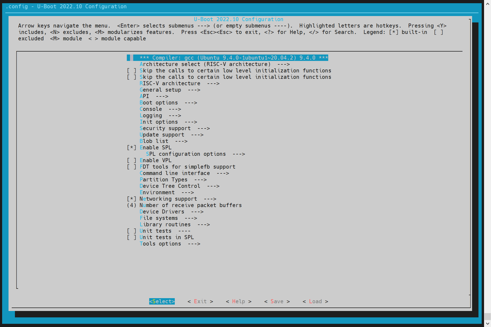

  Use the `Y` / `N` keys to enable or disable related features. After saving, the configuration is written to the `.config` file in the U-Boot root directory.

- **Build U-Boot**

  ```shell
  cd ~/uboot-2022.10
  GCC_PREFIX=riscv64-unknown-linux-gnu-
  make ARCH=riscv CROSS_COMPILE=${GCC_PREFIX} -C ~/uboot-2022.10 -j4
  ```

- **Build artifacts**

```shell
~/uboot-2022.10$ ls u-boot* -l
u-boot
u-boot.bin           # U-Boot image
u-boot.dtb           # device tree file
u-boot-dtb.bin       # complete U-Boot image including the device tree
u-boot.itb           # FIT image containing U-Boot and multiple board DTBs
u-boot-nodtb.bin
bootinfo_block.bin   # records SPL location information for eMMC/SD/UFS boot
bootinfo_spinand.bin
bootinfo_spinor.bin
FSBL.bin             # `u-boot-spl.bin` plus header information, loaded by BROM
k3_deb1.dtb          # device tree for the `deb1` board
k3_spl.dtb           # device tree for SPL
```

### DTS Configuration

U-Boot device tree files are located in:

```shell
~/uboot-2022.10/arch/riscv/dts/
```

Modify the corresponding DTS file for the board you are using, such as `deb1`:

```shell
~/uboot-2022.10$ ls arch/riscv/dts/k3*.dts -l
arch/riscv/dts/k3_com260.dts
arch/riscv/dts/k3_com260_kit_v02.dts
arch/riscv/dts/k3_dc_board.dts
arch/riscv/dts/k3_deb1.dts
arch/riscv/dts/k3_evb.dts
arch/riscv/dts/k3_evb2-1.dts
arch/riscv/dts/k3_evb2-2.dts
arch/riscv/dts/k3_spl.dts
```

## U-Boot Driver Development and Debugging

This section describes how to use and debug U-Boot drivers.
By default, all drivers are already enabled in the build configuration and do not need to be enabled manually.

### Booting the Linux Kernel

This section describes how to boot a Linux kernel from U-Boot. The kernel image uses FIT format and must include the DTB. It also covers custom partition configuration and the boot process.

**Step 1: Enter the U-Boot shell**
After powering on the board, immediately press the `s` key to enter the U-Boot shell.

**Step 2: Enter Fastboot mode**
In the U-Boot shell, run the following command to enter Fastboot mode:

```shell
=> fastboot 0
```

The device enters Fastboot mode and waits to receive files.

**Step 3: Download the kernel image**
On the **PC side**, run the following command to send the kernel image to the board:

```shell
C:\Users>fastboot stage Z:\k3\output\Image.itb
```

On the **board side**, U-Boot receives the image data:


**Expected output:**

```shell
Starting download of 50687488 bytes
...
downloading/uploading of 50687488 bytes finished
```

PC-side output:

```shell
Sending 'Z:\k3\output\Image.itb' (49499 KB)           OKAY [  1.934s]
Finished. Total time: 3.358s
```

**Step 4: Exit Fastboot mode**
After the download is complete, press `CTRL+C` in the U-Boot shell to exit Fastboot mode.

**Step 5: Boot the kernel**
Run `bootm` to boot the kernel:

```shell
=> bootm 0x140000000
```

**Expected output:**

```shell
   Loading fdt from 0x116aaa3dc to 0x128000000
   Booting using the fdt blob at 0x128000000
   Loading Kernel Image
   Loading Device Tree to 00000003ff6be000, end 00000003ff6dd774 ... OK

Starting kernel ...

[    0.000000] Booting Linux on hartid 0
[    0.000000] Linux version 6.18.3-g61bd18de599b-dirty (zhouxl@LT-ZHOUXIAOLEI) (riscv64-unknown-linux-gnu-gcc (gd094d3a8c4f) 15.2.0, GNU ld (GNU Binutils) 2.45.0.20251020) #8 SMP PREEMPT Sat Jan 24 16:52:02 CST 2026
[    0.000000] random: crng init done
[    0.000000] Machine model: spacemit,k3-deb1
```

### Loading a FIT Image Directly from the Boot Medium

**Step 1: Check the files on the storage medium**
Assume that partition 2 on the eMMC uses the FAT32 filesystem and contains the `uImage.itb` file. In the U-Boot shell, run the following command to list the files:

```shell
=> ls mmc 2:2
```

**Expected output:**

```shell
sdh@d4281000: 74 clk wait timeout(100)
 50896911   uImage.itb
     4671   env_k3.txt

2 file(s), 0 dir(s)
```

**Step 2: Load the FIT image**
Run the following command to load the FIT image:

```shell
=> load mmc 2:2 0x140000000 uImage.itb
```

**Expected output:**

```shell
50896911 bytes read in 339 ms (143.2 MiB/s)
```

**Step 3: Boot the kernel**
Run `bootm` to boot the FIT image:

```shell
=> bootm 0x140000000
```

**Expected output:**

```shell
## Loading kernel from FIT Image at 140000000 ...
Boot from fit configuration k3_deb1
   Using 'conf_3' configuration
   Trying 'kernel' kernel subimage
     Description:  Vanilla Linux kernel
     Type:         Kernel Image
     Compression:  uncompressed
     Data Start:   0x1400000e8
     Data Size:    50687488 Bytes = 48.3 MiB
     Architecture: RISC-V
     OS:           Linux
     Load Address: 0x02000000
     Entry Point:  0x02000000
   Verifying Hash Integrity ... OK
## Loading fdt from FIT Image at 140000000 ...
   Using 'conf_3' configuration
   Trying 'fdt_3' fdt subimage
     Description:  Flattened Device Tree blob for k3_deb1
     Type:         Flat Device Tree
     Compression:  uncompressed
     Data Start:   0x143067c90
     Data Size:    68940 Bytes = 67.3 KiB
     Architecture: RISC-V
     Load Address: 0x128000000
   Verifying Hash Integrity ... OK
   Loading fdt from 0x43067c90 to 0x128000000
   Booting using the fdt blob at 0x128000000
   Loading Kernel Image
   Using Device Tree in place at 0000000128000000, end 0000000128013d4b

Starting kernel ...

[    0.000000] Booting Linux on hartid 0
[    0.000000] Linux version 6.18.3-g61bd18de599b-dirty (zhouxl@LT-ZHOUXIAOLEI) (riscv64-unknown-linux-gnu-gcc (gd094d3a8c4f) 15.2.0, GNU ld (GNU Binutils) 2.45.0.20251020) #8 SMP PREEMPT Sat Jan 24 16:52:02 CST 2026
[    0.000000] random: crng init done
[    0.000000] Machine model: spacemit,k3-deb1
[    0.000000] SBI specification v2.0 detected
```

### Configuring the Boot Environment Variables (`env`)

This section describes how to load the environment variables (`env`) from a specified storage medium during the U-Boot boot stage.

1. **Enter `make menuconfig`**
  When building U-Boot, run the following command to enter the configuration menu:

   ```shell
   make menuconfig
   ```

2. **Open the Environment configuration**
  In the `make menuconfig` menu, select **Environment** to open the environment-variable configuration page.
   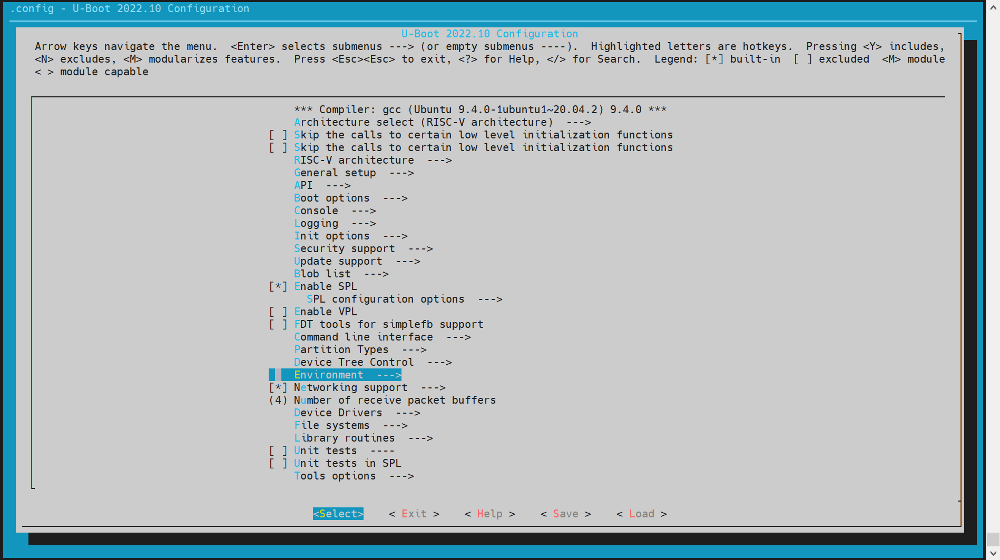

   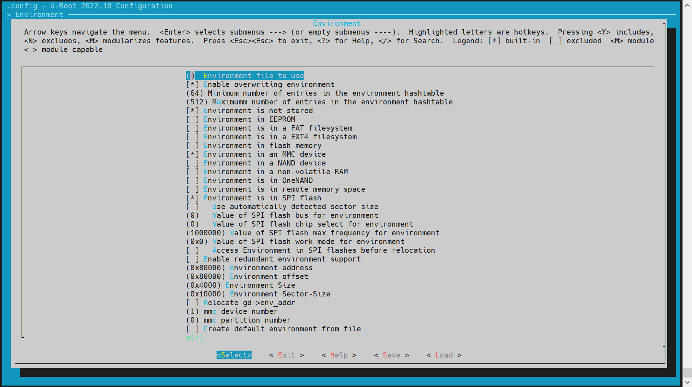

  **Supported storage media:**
  The currently supported storage media include:
  - **MMC devices**, such as SD cards or eMMC
  - **MTD devices**, including SPI NOR and SPI NAND

3. **Configure the environment-variable offset**
  The environment-variable offset must be determined from the partition-table configuration. The default offset is **`0xA0000`**. Configure it as follows:

  - **For SPI NOR devices:**

     ```shell
    (0xA0000) Environment address       # env offset for SPI NOR
     ```

  - **For MMC devices:**

     ```shell
    (0xA0000) Environment offset        # env offset for MMC devices
     ```

### MMC Driver Configuration and Debugging

This section describes how to configure and debug the MMC driver in U-Boot, including eMMC and SD card configuration.

Both eMMC and SD cards use the MMC driver. Their device numbers are:

- **eMMC**: dev number = 2
- **SD card**: dev number = 0

1. **Build configuration**
  - **Enter `make menuconfig`**
  Run the following command to enter the configuration menu:

     ```shell
     make menuconfig
     ```

  - **Open MMC Host Controller Support**
  In the `make menuconfig` menu, select **Device Drivers** -> **MMC Host Controller Support**, and enable the following configuration:

      

2. **DTS configuration**
In the U-Boot device tree, configure the device tree nodes for eMMC and the SD card.
**Example configuration:**

```c
//uboot-2022.10/arch/riscv/dts/k3.dtsi
        sdhci0: sdh@d4280000 {
            compatible = "spacemit,k3-sdhci";
            reg = <0x0 0xd4280000 0x0 0x200>;
            resets = <&reset RESET_SDH_AXI>,
                     <&reset RESET_SDH0>;
            reset-names = "sdh_axi", "sdh0";
            clocks = <&ccu CLK_SDH0>,
                     <&ccu CLK_SDH_AXI>;
            clock-names = "sdh-io", "sdh-core";
            status = "disabled";
        };

        sdhci2: sdh@d4281000 {
            compatible = "spacemit,k3-sdhci";
            reg = <0x0 0xd4281000 0x0 0x200>;
            resets = <&reset RESET_SDH_AXI>,
                     <&reset RESET_SDH2>;
            reset-names = "sdh_axi", "sdh2";
            clocks = <&ccu CLK_SDH2>,
                     <&ccu CLK_SDH_AXI>;
            clock-names = "sdh-io", "sdh-core";
            status = "disabled";
        };

//uboot-2022.10/arch/riscv/dts/k3_deb1.dts
/* SD */
&sdhci0 {
        bus-width = <4>;
        broken-cd;
        no-1-8-v;
        cap-sd-highspeed;
        sdh-phy-module = <0>;
        status = "okay";
};

/* eMMC */
&sdhci2 {
        bus-width = <8>;
        non-removable;
        mmc-hs400-1_8v;
        mmc-hs400-enhanced-strobe;
        sdh-phy-module = <1>;
        status = "okay";
};
```

3. **Debugging and validation**
The U-Boot shell provides command-line tools for debugging the MMC driver. The build option `CONFIG_CMD_MMC` must be enabled.

```shell
=> mmc list
sdh@d4280000: 0 (SD)
sdh@d4281000: 2 (eMMC)
=> mmc dev 2 # switch to eMMC
switch to partitions #0, OK
mmc2(part 0) is current device

# read 0x1000 blocks from offset 0 into memory at 0x140000000
=> mmc read 0x140000000 0 0x1000

MMC read: dev # 2, block # 0, count 4096 ... 4096 blocks read: OK

# write 0x1000 blocks from memory address 0x140000000 to offset 0
=> mmc write 0x140000000 0 0x1000

MMC write: dev # 2, block # 0, count 4096 ... 4096 blocks written: OK

# for other usage, refer to mmc -h
```

4. **Common interfaces**
Refer to the interface implementations in `cmd/mmc.c` for more details.

### NVMe Driver Configuration and Debugging

The NVMe driver is mainly used for debugging SSD devices. The following sections describe how to configure and debug the NVMe driver.

1. **Build configuration**
  **Enter `make menuconfig`**
  Run the following command to open the configuration menu:

   ```shell
   make menuconfig
   ```

  **Open Device Drivers**
  In the `make menuconfig` menu, open **Device Drivers** and enable the following configuration:

   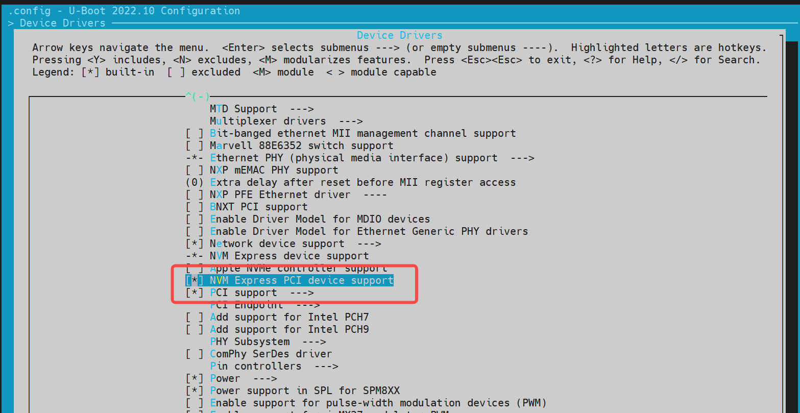

   

2. **DTS configuration**
In the U-Boot device tree, add the device tree nodes required by the NVMe driver.
**Example configuration:**

```c
//uboot-2022.10/arch/riscv/dts/k3.dtsi
        pcie0_rc: pcie@80000000 {
            compatible = "spacemit,k3-pcie";
            reg = <0x0 0x80000000 0x0 0x00001000>, /* dbi */
                  <0x0 0x80100000 0x0 0x00001000>, /* dbi2 */
                  <0x0 0x80300000 0x0 0x00003f20>, /* atu registers */
                  <0x11 0x00000000 0x0 0x00010000>, /* config space */
                  <0x0 0xd42829f0 0x0 0x00000008>, /* k3 soc config addr */
                  <0x0 0x82900000 0x0 0x00001000>; /* phy ahb */
            reg-names = "dbi", "dbi2", "atu", "config", "app", "phy_ahb";

            spacemit,pcie-mgmt = <0xd42829d8>;
            clocks = <&ccu CLK_PCIEA>;
            resets = <&reset RESET_PCIE_PORTA>;
            reset-names = "pcie-reset";

            spacemit,pcie-port = <0>;
            bus-range = <0x00 0xff>;
            max-link-speed = <3>;
            num-lanes = <8>;

            device_type = "pci";
            #address-cells = <3>;
            #size-cells = <2>;
            ranges = <0x01000000 0x0 0x00010000 0x11 0x00010000 0x0 0x00100000>,
                 <0x02000000 0x0 0x00110000 0x11 0x00110000 0x0 0x7fef0000>,
                 <0x43000000 0x18 0x00000000 0x18 0x00000000 0x1 0x00000000>;
            linux,pci-domain = <0>;
            status = "disabled";
        };

        pcie1_rc: pcie@80400000 {
            compatible = "spacemit,k3-pcie";
            reg = <0x0 0x80400000 0x0 0x00001000>, /* dbi */
                  <0x0 0x80500000 0x0 0x00001000>, /* dbi2 */
                  <0x0 0x80700000 0x0 0x00003f20>, /* atu registers */
                  <0x11 0x80000000 0x0 0x00010000>, /* config space */
                  <0x0 0xd42829d0 0x0 0x00000008>, /* k3 soc config addr */
                  <0x0 0x82c00000 0x0 0x00001000>; /* phy ahb */
            reg-names = "dbi", "dbi2", "atu", "config", "app", "phy_ahb";

            spacemit,pcie-mgmt = <0xd42829d8>;
            clocks = <&ccu CLK_PCIEB>;
            resets = <&reset RESET_PCIE_PORTB>;
            reset-names = "pcie-reset";

            spacemit,pcie-port = <1>;
            bus-range = <0x00 0xff>;
            max-link-speed = <3>;
            num-lanes = <2>;

            device_type = "pci";
            #address-cells = <3>;
            #size-cells = <2>;
            ranges = <0x01000000 0x0 0x00010000 0x11 0x80010000 0x0 0x00100000>,
                 <0x02000000 0x0 0x80110000 0x11 0x80110000 0x0 0x7fef0000>,
                 <0x43000000 0x16 0x00000000 0x16 0x00000000 0x1 0x00000000>;
            linux,pci-domain = <1>;
            status = "disabled";
        };

//uboot-2022.10/arch/riscv/dts/k3_deb1.dts
&pcie0_rc {
    pinctrl-names = "default";
    pinctrl-0 = <&pinctrl_pcie0_1>;
    num-lanes = <4>;
    phys = <&pcie_phy0>, <&pcie_phy1>;
    phy-names = "pcie-phy0", "pcie-phy1";
    spacemit,device-detect = <&gpio 89 0>;

    status = "okay";
};

&pcie1_rc {
    pinctrl-names = "default";
    pinctrl-0 = <&pinctrl_pcie1_1>;

    phys = <&pcie_phy1>;
    phy-names = "pcie-phy0";
    status = "okay";
};
```

3. **Debugging and validation**
The build option `CONFIG_CMD_NVME` must be enabled. The debugging method is as follows:

```shell
=> nvme scan
=> nvme detail
Blk device 0: Optional Admin Command Support:
        Namespace Management/Attachment: no
        Firmware Commit/Image download: yes
        Format NVM: yes
        Security Send/Receive: yes
Blk device 0: Optional NVM Command Support:
        Reservation: yes
        Save/Select field in the Set/Get features: yes
        Write Zeroes: yes
        Dataset Management: yes
        Write Uncorrectable: yes
Blk device 0: Format NVM Attributes:
        Support Cryptographic Erase: No
        Support erase a particular namespace: Yes
        Support format a particular namespace: Yes
Blk device 0: LBA Format Support:
        LBA Foramt 0 Support: (current)
                Metadata Size: 0
                LBA Data Size: 512
                Relative Performance: Good
Blk device 0: End-to-End DataProtect Capabilities:
        As last eight bytes: No
        As first eight bytes: No
        Support Type3: No
        Support Type2: No
        Support Type1: No
Blk device 0: Metadata capabilities:
        As part of a separate buffer: No
        As part of an extended data LBA: No
=> nvme read/write addr blk_off blk_cnt
```

4. **Common interfaces**
Refer to the interfaces implemented in `cmd/nvme.c` for more details.

### Network Configuration (`Net`)

This section describes how to configure and debug networking in U-Boot, including Ethernet interface configuration and validation.

1. **Build configuration**

  **Enter `make menuconfig`**
  Run the following command to open the configuration menu:

   ```shell
   make menuconfig
   ```

  **Enable networking-related configuration**
  In the `make menuconfig` menu, open **Device Drivers** and enable the following configuration:

   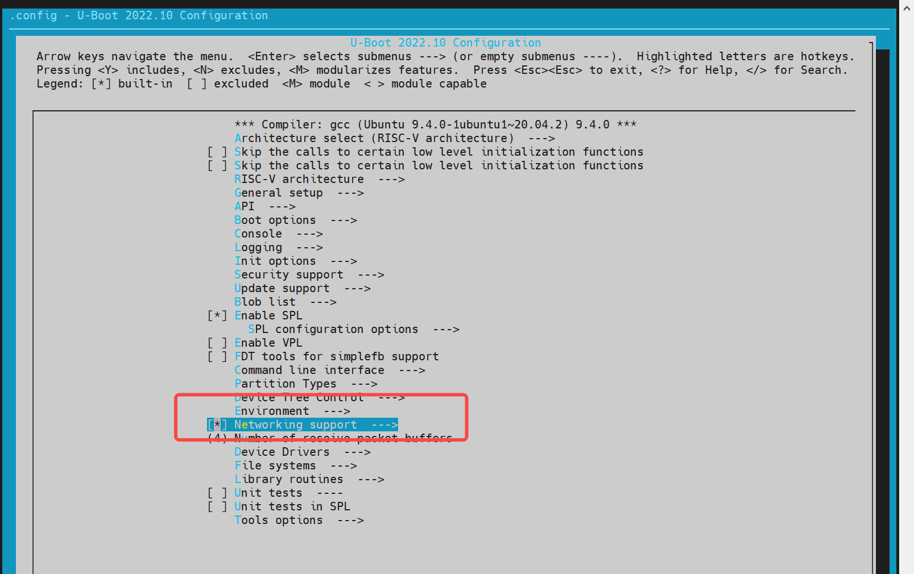

   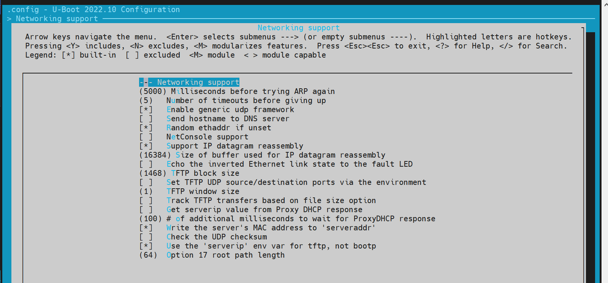

2. **DTS configuration**
In the U-Boot device tree, add device tree nodes for the Ethernet interface.
**Example configuration:**

```c
//uboot-2022.10/arch/riscv/dts/k3.dtsi
        eth0: ethernet@cac80000 {
            compatible = "spacemit,k3-dwmac-eqos";
            reg = <0x00000000 0xcac80000 0x00000000 0x00002000>;
            apmu-base-reg = <0xd4282800>;
            ctrl-reg = <0x3e4>;
            dline-reg = <0x3e8>;
            clocks = <&ccu CLK_EMAC0_BUS>;
            clock-names = "master_bus_clk";
            resets = <&reset RESET_EMAC0>;
            reset-names = "mac_reset";
            status = "disabled";
        };

//uboot-2022.10/arch/riscv/dts/k3_deb1.dts
&eth0 {
    pinctrl-names = "default";
    pinctrl-0 = <&pinctrl_gmac0>;

    phy-reset-pin = <15>;
    max-speed = <1000>;
    clk_tuning_enable;
    clk-tuning-by-delayline;

    tx-phase = <73>;
    rx-phase = <61>;

    phy-mode = "rgmii";
    phy-handle = <&rgmii0>;

    status = "okay";

    mdio {
        #address-cells = <0x1>;
        #size-cells = <0x0>;
        rgmii0: phy@0 {
            compatible = "ethernet-phy-ieee802.3-c22";
            device_type = "ethernet-phy";
            reg = <0x1>;
        };
    };
};
```

3. **Debugging and validation**
First, enable the build option `CONFIG_CMD_NET`, make sure the Ethernet cable is connected to the board's network port, and prepare a TFTP server. The TFTP setup process is not covered here.
**Example debugging command:**

```shell
=> dhcp # if DHCP returns an address, the board can communicate with the network server; otherwise, the connection failed
ethernet@cac80000 Waiting for PHY auto negotiation to complete...... done
emac_adjust_link link:1 speed:1000 duplex:full
BOOTP broadcast 1
BOOTP broadcast 2
BOOTP broadcast 3
BOOTP broadcast 4
BOOTP broadcast 5
BOOTP broadcast 6
BOOTP broadcast 7
DHCP client bound to address 10.0.92.130 (7982 ms)

=> tftpboot 0x140000000 site11/uImage.itb
ethernet@cac80000 Waiting for PHY auto negotiation to complete...... done
emac_adjust_link link:1 speed:1000 duplex:full
Using ethernet@cac80000 device
TFTP from server 10.0.92.134; our IP address is 10.0.92.130
Filename 'site11/uImage.itb'.
Load address: 0x140000000
Loading: ##############################################################
         ########
         1.1 MiB/s
done
Bytes transferred = 66900963 (3fcd3e3 hex)
=>

# boot the kernel
=>bootm 0x140000000
```

4. **Common interfaces**

Refer to the interfaces implemented in `cmd/net.c` for more details.

### SPI Configuration and Debugging

SPI (Serial Peripheral Interface) is a commonly used serial communication protocol for connecting microcontrollers to various peripheral devices. In U-Boot, the SPI driver is used to support NAND or NOR flash.

1. **Build configuration**
**Enter `make menuconfig`**
  Run the following command to open the configuration menu:

   ```shell
   make menuconfig
   ```

  **Open Device Drivers**
  In the `make menuconfig` menu, open **Device Drivers** and enable the following configuration:

   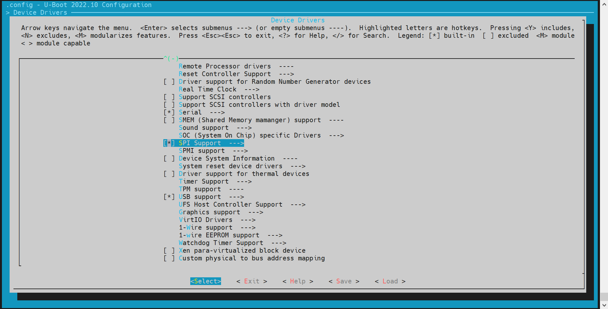

   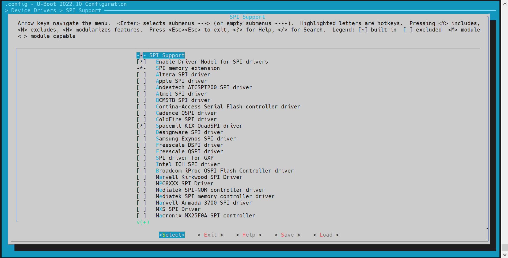

2. **DTS configuration**
  In the U-Boot device tree, add device tree nodes for the SPI interface.

  **Example configuration:**

```c
//k3.dtsi
        qspi: spi@d420c000 {
            compatible = "spacemit,k3-qspi";
            #address-cells = <1>;
            #size-cells = <0>;
            reg = <0x0 0xd420c000 0x0 0x1000>,
                  <0x0 0xb8000000 0x0 0x4100000>;
            reg-names = "qspi-base", "qspi-mmap";
            qspi-sfa1ad = <0x800000>;
            qspi-sfa2ad = <0x1000000>;
            qspi-sfb1ad = <0x1800000>;
            qspi-sfb2ad = <0x2000000>;
            qspi-pmuap-reg = <0xd4282860>;
            qspi-mpmu-acgr-reg = <0xd4051024>;
            qspi-ahbread = <1>;
            qspi-freq = <26500000>;
            qspi-id = <4>;
            clocks = <&ccu CLK_QSPI>,
                      <&ccu CLK_QSPI_BUS>;
            clock-names = "qspi_clk", "qspi_bus_clk";
            resets = <&reset RESET_QSPI>,
                <&reset RESET_QSPI_BUS>;
            reset-names = "qspi_reset", "qspi_bus_reset";
            status = "disabled";
        };

//k3_deb1.dts
&qspi {
    status = "okay";

    flash@0 {
        compatible = "jedec,spi-nor";
        reg = <0>;
        spi-max-frequency = <26500000>;
        m25p,fast-read;
        broken-flash-reset;
        status = "okay";
    };
};
```

3. **Debugging and validation**

  Enable the `sspi` command in the U-Boot shell by turning on `CONFIG_CMD_SPI`.

  **Debug command:**

```c
sspi -h

    "SPI utility command",
    "[<bus>:]<cs>[.<mode>][@<freq>] <bit_len> <dout> - Send and receive bits\n"
    "<bus>     - Identifies the SPI bus\n"
    "<cs>      - Identifies the chip select\n"
    "<mode>    - Identifies the SPI mode to use\n"
    "<freq>    - Identifies the SPI bus frequency in Hz\n"
    "<bit_len> - Number of bits to send (base 10)\n"
    "<dout>    - Hexadecimal string that gets sent"

```

4. **Common interfaces**

  Refer to the interfaces implemented in `cmd/spi.c` for more details.

### NAND Configuration and Debugging

The NAND driver is implemented on top of the SPI interface, so SPI driver support must be enabled first. The following sections describe how to configure and debug the NAND driver.

1. **Build configuration**
  Run the following command to open the configuration menu:

   ```shell
   make menuconfig
   ```

  **Open Device Drivers -> MTD Support**
  In the `make menuconfig` menu, open **Device Drivers** -> **MTD Support** and enable the following configuration:

   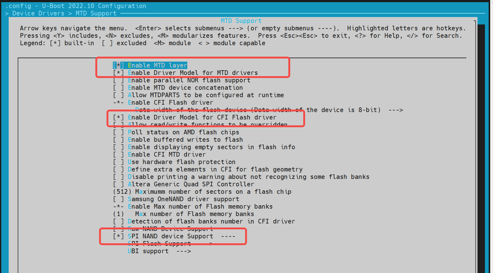

  If you need to add support for a new NAND flash device, you can add its JEDEC ID based on the already supported vendor drivers.

  **Example:**

```shell
~/uboot-2022.10$ ls drivers/mtd/nand/spi/*.c -l
drivers/mtd/nand/spi/core.c
drivers/mtd/nand/spi/gigadevice.c
drivers/mtd/nand/spi/macronix.c
drivers/mtd/nand/spi/micron.c
drivers/mtd/nand/spi/other.c
drivers/mtd/nand/spi/toshiba.c
drivers/mtd/nand/spi/winbond.c
```

For example, to add a new flash device under `gigadevice`:

```c
//uboot-2022.10/drivers/mtd/nand/spi/gigadevice.c
 static const struct spinand_info gigadevice_spinand_table[] = {
     SPINAND_INFO("GD5F1GQ4UExxG", 0xd1,
              NAND_MEMORG(1, 2048, 128, 64, 1024, 1, 1, 1),
              NAND_ECCREQ(8, 512),
              SPINAND_INFO_OP_VARIANTS(&gd5fxgq4_read_cache_variants,
                           &write_cache_variants,
                           &update_cache_variants),
              0,
              SPINAND_ECCINFO(&gd5fxgqxxexxg_ooblayout,
                      gd5fxgq4xexxg_ecc_get_status)),
     SPINAND_INFO("GD5F1GQ5UExxG", 0x51,
              NAND_MEMORG(1, 2048, 128, 64, 1024, 1, 1, 1),
              NAND_ECCREQ(4, 512),
              SPINAND_INFO_OP_VARIANTS(&gd5f1gq5_read_cache_variants,
                           &write_cache_variants,
                           &update_cache_variants),
              0,
              SPINAND_ECCINFO(&gd5fxgqxxexxg_ooblayout,
                      gd5fxgq5xexxg_ecc_get_status)),
 };
```

**Note:** For NAND flash from other vendors, you can refer to the `gigadevice` driver implementation.

2. **DTS configuration**

  The NAND driver depends on the SPI driver, so it must be configured under the SPI node.

  **Example configuration:**

```c
 &qspi {
     status = "okay";
     pinctrl-names = "default";
     pinctrl-0 = <&pinctrl_qspi>;

     spi-nand@0 {
         compatible = "spi-nand";
         reg = <0>;
         spi-tx-bus-width = <1>;
         spi-rx-bus-width = <1>;
         spi-max-frequency = <6250000>;
         u-boot,dm-spl;
         status = "okay";
     };
 };
```

3. **Debugging and validation**
The NAND driver can be debugged through MTD commands. Enable `CONFIG_CMD_MTD` in the U-Boot shell configuration.
**Debug commands:**

```shell
=> mtd
mtd - MTD utils

Usage:
mtd - generic operations on memory technology devices

mtd list
mtd read[.raw][.oob]                  <name> <addr> [<off> [<size>]]
mtd dump[.raw][.oob]                  <name>        [<off> [<size>]]
mtd write[.raw][.oob][.dontskipff]    <name> <addr> [<off> [<size>]]
mtd erase[.dontskipbad]               <name>        [<off> [<size>]]

Specific functions:
mtd bad                               <name>

With:
        <name>: NAND partition/chip name (or corresponding DM device name or OF path)
        <addr>: user address from/to which data will be retrieved/stored
        <off>: offset in <name> in bytes (default: start of the part)
                * must be block-aligned for erase
                * must be page-aligned otherwise
        <size>: length of the operation in bytes (default: the entire device)
                * must be a multiple of a block for erase
                * must be a multiple of a page otherwise (special case: default is a page with dump)

The .dontskipff option forces writing empty pages, don't use it if unsure.

=> mtd list
[RESET]spacemit_reset_set assert=1, id=77
[RESET]spacemit_reset_set assert=1, id=78
clk qspi_bus_clk already disabled
clk qspi_clk already disabled
ccu_mix_set_rate of qspi_clk timeout
[RESET]spacemit_reset_set assert=0, id=77
[RESET]spacemit_reset_set assert=0, id=78
SF: Detected w25q32 with page size 256 Bytes, erase size 64 KiB, total 4 MiB
Could not find a valid device for spi-nand
List of MTD devices:
* nor0
  - device: flash@0
  - parent: spi@d420c000
  - driver: jedec_spi_nor
  - path: /soc/spi@d420c000/flash@0
  - type: NOR flash
  - block size: 0x10000 bytes
  - min I/O: 0x1 bytes
  - 0x000000000000-0x000000400000 : "nor0"
          - 0x0000000a0000-0x000000100000 : "opensbi"
          - 0x000000100000-0x000000300000 : "uboot"
=> mtd read/write partname addr off size
```

4. **Common interfaces**
Refer to the interfaces implemented in `cmd/mtd.c` for more details.

### NOR Configuration and Debugging

The NOR driver is implemented on top of the SPI interface, so SPI driver support must be enabled first. The following sections describe how to configure and debug the NOR driver.

1. **Build configuration**

  **Enter `make menuconfig`**
  Run the following command to open the configuration menu:

   ```shell
   make menuconfig
   ```

  **Open Device Drivers -> MTD Support -> SPI Flash Support**
  In the `make menuconfig` menu, open **Device Drivers** -> **MTD Support** -> **SPI Flash Support**, and enable the following configuration:


**Adding a new SPI NOR flash**

- For NOR flash from already supported vendors, you can directly enable the corresponding build option. For example, for GigaDevice flash, enable the matching configuration.
- **Check the JEDEC ID list:** The SPI flash JEDEC ID list is maintained in `uboot-2022.10/drivers/mtd/spi/spi-nor-ids.c`. If the JEDEC ID for a specific NOR flash is not listed, you can add it manually. The JEDEC ID is the vendor/device identifier for the SPI flash. You can look up the `manufac` field in the NOR flash datasheet; for example, Winbond uses `0xfe`.

2. **DTS configuration**
  The NOR driver depends on the SPI driver interface, so the NOR flash device tree node must be added under the SPI node.

  **Example configuration:**

```c
//k3/uboot-2022.10/arch/riscv/dts/k3_deb1.dts
 &qspi {
     status = "okay";
     pinctrl-names = "default";
     pinctrl-0 = <&pinctrl_qspi>;

     flash@0 {
         compatible = "jedec,spi-nor";
         reg = <0>;
         spi-max-frequency = <26500000>;
         m25p,fast-read;
         broken-flash-reset;
         status = "okay";
     };
 };
```

3. **Debugging and validation**
  The NOR driver can be debugged with the `mtd` and `sf` commands in the U-Boot command line. Make sure `CONFIG_CMD_MTD=y` and `CONFIG_CMD_SF` are enabled in the build configuration.

  Read and write NOR flash with the `mtd` command

```shell
=> mtd list
List of MTD devices:
* nor0
  - device: flash@0
  - parent: spi@d420c000
  - driver: jedec_spi_nor
  - path: /soc/spi@d420c000/flash@0
  - type: NOR flash
  - block size: 0x1000 bytes
  - min I/O: 0x1 bytes
  - 0x000000000000-0x000000400000 : "nor0"
          - 0x000000020000-0x000000040000 : "fsbl"
          - 0x0000000a0000-0x0000000b0000 : "env"
          - 0x0000000b0000-0x0000001b0000 : "opensbi"
          - 0x0000001b0000-0x000000400000 : "uboot"
=>

=> mtd
mtd - MTD utils

Usage:
mtd - generic operations on memory technology devices

mtd list
mtd read[.raw][.oob]                  <name> <addr> [<off> [<size>]]
mtd dump[.raw][.oob]                  <name>        [<off> [<size>]]
mtd write[.raw][.oob][.dontskipff]    <name> <addr> [<off> [<size>]]
mtd erase[.dontskipbad]               <name>        [<off> [<size>]]

Specific functions:
mtd bad                               <name>

With:
        <name>: NAND partition/chip name (or corresponding DM device name or OF path)
        <addr>: user address from/to which data will be retrieved/stored
        <off>: offset in <name> in bytes (default: start of the part)
                * must be block-aligned for erase
                * must be page-aligned otherwise
        <size>: length of the operation in bytes (default: the entire device)
                * must be a multiple of a block for erase
                * must be a multiple of a page otherwise (special case: default is a page with dump)

The .dontskipff option forces writing empty pages, don't use it if unsure.

=>
=> mtd read uboot 0x140000000
Reading 1048576 byte(s) at offset 0x00000000
=> mtd dump uboot 0 0x10
Reading 16 byte(s) at offset 0x00000000

Dump 16 data bytes from 0x0:
0x00000000:     d0 0d fe ed 00 0d e8 95  00 00 00 38 00 0d e4 44
=>
```

Read and write NOR flash with the `sf` command

```shell
=> sf
sf - SPI flash sub-system

Usage:
sf probe [[bus:]cs] [hz] [mode] - init flash device on given SPI bus
                                  and chip select
sf read addr offset|partition len       - read `len' bytes starting at
                                          `offset' or from start of mtd
                                          `partition'to memory at `addr'
sf write addr offset|partition len      - write `len' bytes from memory
                                          at `addr' to flash at `offset'
                                          or to start of mtd `partition'
sf erase offset|partition [+]len        - erase `len' bytes from `offset'
                                          or from start of mtd `partition'
                                         `+len' round up `len' to block size
sf update addr offset|partition len     - erase and write `len' bytes from memory
                                          at `addr' to flash at `offset'
                                          or to start of mtd `partition'
sf protect lock/unlock sector len       - protect/unprotect 'len' bytes starting
                                          at address 'sector'
=> sf probe
SF: Detected w25q32 with page size 256 Bytes, erase size 4 KiB, total 4 MiB
=> sf read 0x140000000 0 0x10
device 0 offset 0x0, size 0x10
SF: 16 bytes @ 0x0 Read: OK
=>
```

4. **Common interfaces**

```c
include <spi.h>
#include <spi_flash.h>

struct udevice *new, *bus_dev;
int ret;
static struct spi_flash *flash;

// bus and cs correspond to the SPI bus number and chip select number, for example 0, 0
ret = spi_find_bus_and_cs(bus, cs, &bus_dev, &new);
flash = spi_flash_probe(bus, cs, speed, mode);

ret = spi_flash_read(flash, offset, len, buf);
```

### HDMI Configuration and Debugging

This subsection describes how to enable the HDMI driver.

1. **Build configuration**

  **Enter `make uboot_menuconfig`**
  Run the following command to open the configuration menu:

   ```shell
   make uboot_menuconfig
   ```

  **Open Device Drivers -> Graphics support**
  In the `make uboot_menuconfig` menu, open **Device Drivers** -> **Graphics support** and enable the following configuration. It is enabled by default.


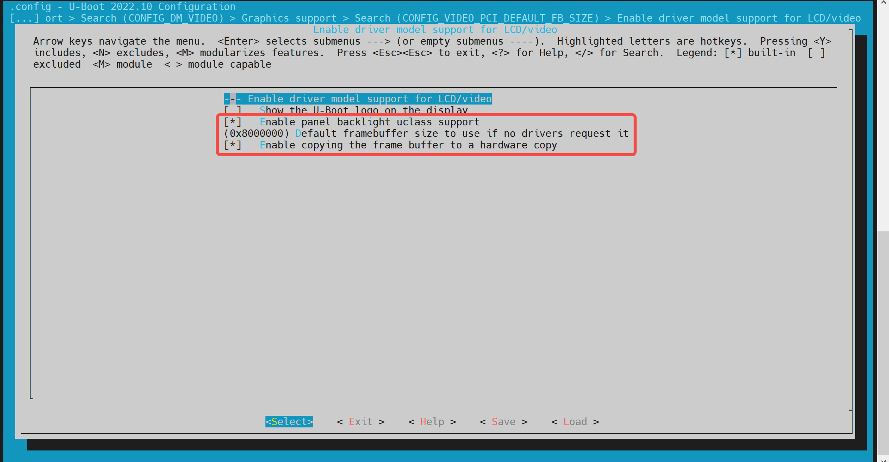

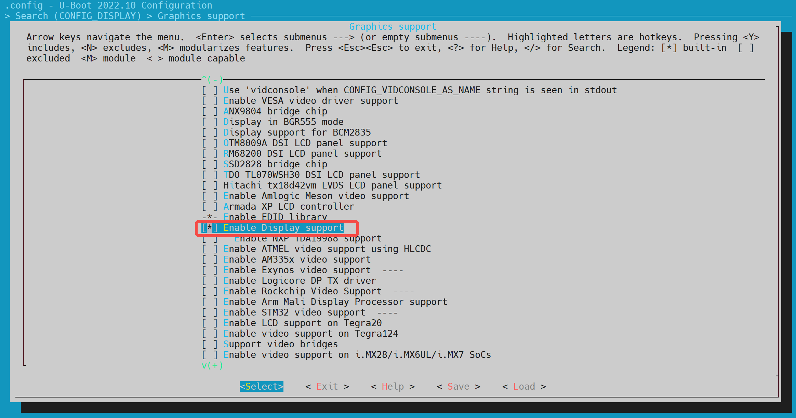


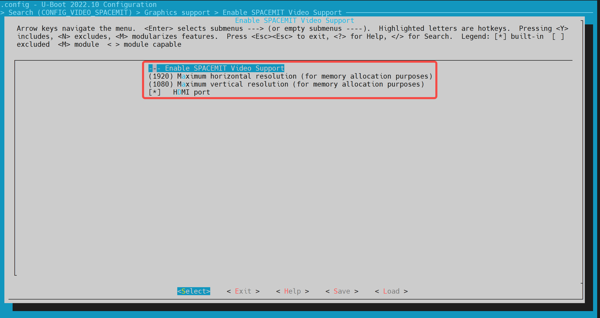

2. **DTS configuration**

  In the device tree configuration, you need to add the device tree nodes required by the HDMI driver.

  **Example configuration:**

```c
&dpu {
        status = "okay";
};

&hdmi {
        pinctrl-names = "default";
        pinctrl-0 = <&pinctrl_hdmi_0>;
        status = "okay";
};
```

### Boot Logo Configuration and Display

This subsection describes how to display the boot logo during the U-Boot startup stage.

1. **Build configuration**

  - **Enable HDMI support**: First, make sure HDMI support is enabled in U-Boot. For detailed steps, see the **HDMI Configuration and Debugging** subsection.

  - **Enable Boot Logo support**
  Run the following command to open the configuration menu:

     ```shell
     make menuconfig
     ```

    In the `make menuconfig` menu, open **Device Drivers** -> **Graphics support** and enable the following options:

     

2. **Environment configuration**

  In the U-Boot configuration file, add the environment variables required for boot-logo display. These variables include `splashimage`, `splashpos`, and `splashfile`.

  **Example configuration:** Add the three environment variables required for Boot Logo display in `k3.h` under the `uboot-2022.10\include\configs` directory: `splashimage`, `splashpos`, and `splashfile`.

```c
//uboot-2022.10/include/configs/k3.h
    ... ...
    ... ...
 #define CONFIG_EXTRA_ENV_SETTINGS \
        ... ...
        ... ...
     "splashimage=" __stringify(CONFIG_FASTBOOT_BUF_ADDR) "\0" \
     "splashpos=m,m\0" \
     "splashfile=bianbu.bmp\0" \

        ... ...
        ... ...
     BOOTENV_DEVICE_CONFIG \
     BOOTENV

 #endif /* __CONFIG_H */
```

**Notes:**

- `splashimage`: The memory address where the Boot Logo image is loaded.
- `splashpos`: The display position of the image. `"m,m"` means the image is shown at the center of the screen.
- `splashfile`: The name of the BMP file to display. This file must be placed in the partition where `bootfs` resides.

3. **Package the BMP image into BootFS**

  Package the Boot Logo BMP image into BootFS:

  - **Prepare the image file**
  Place the `bianbu.bmp` file in the `./buildroot-ext/board/spacemit/k3` directory. The filename must match both `UBOOT_LOGO_FILE` in `buildroot-ext/board/spacemit/k3/prepare_img.sh` and the `splashfile` environment variable.

  - **Modify the packaging script**
  Make sure the `prepare_img.sh` script correctly references the `bianbu.bmp` file:

  - **Build and package**
  After the build and packaging process completes, the BMP image will be packaged into BootFS.

```shell
//buildroot-ext/board/spacemit/k3/prepare_img.sh
#!/bin/bash

######################## Prepare sub-iamges and pack ####################
#$0 is this file path
#$1 is buildroot output images dir

IMGS_DIR=$1
DEVICE_DIR=$(dirname $0)

... ...

UBOOT_LOGO_FILE="$DEVICE_DIR/bianbu.bmp"

```

4. Modify the Boot Logo

  To modify the Boot Logo, replace the `bianbu.bmp` file in the `buildroot-ext/board/spacemit/k3/` directory.

### Boot Menu Configuration and Usage

This subsection describes how to enable the Boot Menu feature in U-Boot.

1. **Build configuration**

  - **Enter `make menuconfig`**
  Run the following command to open the configuration menu:

     ```shell
     make menuconfig
     ```

  - **Open Command line interface -> Boot commands**
  In the `make menuconfig` menu, open **Command line interface** -> **Boot commands** and enable the following configuration:

     

  - **Open Boot options -> Autoboot options**
  Then open **Boot options** -> **Autoboot options** and enable the following options:
     

2. **Environment configuration**
Add the `bootdelay` and `bootmenu_delay` environment variables to `buildroot-ext/board/spacemit/k3/env_k3.txt`.
For example:
  - `bootmenu_delay=5` means the system waits for 5 seconds on the boot menu screen, during which the user can select a boot option.
  - `bootdelay=5` means that after a boot method is selected, the system waits another 5 seconds before actually booting.

```c
//buildroot-ext/board/spacemit/k3/env_k3.txt
bootdelay=5

# Boot menu definitions
boot_default=echo "Current Boot Device: ${boot_device}"
flash_default=echo "Returning to Boot Menu..."
bootmenu_delay=5
bootmenu_0="-------- Boot Options --------"=run boot_default
bootmenu_1="Boot from Nor"=run nor_boot
bootmenu_2="Boot from Nand"=run nand_boot
bootmenu_3="Boot from MMC"=run mmc_boot
bootmenu_4="Boot from UFS"=run ufs_boot
bootmenu_5="Autoboot"=run autoboot
```

3. **Enter the Boot Menu**
  After powering on the development board, immediately hold down the `Esc` key on the keyboard to enter the Boot Menu.

### Fastboot Command Configuration and Usage

This subsection describes the Fastboot commands supported by the K3-DEB1 solution.

#### Build configuration
Enable Fastboot support as follows:
- **Enter `make menuconfig`**
  Run the following command to open the configuration menu:

     ```shell
     make menuconfig
     ```

- **Open Device Drivers -> Fastboot support**
  In the `make menuconfig` menu, open **Device Drivers** -> **Fastboot support** and enable the following build configuration:

     

- **Enable USB support**
  Fastboot depends on the USB driver, so the **USB support** configuration must be enabled:

     

     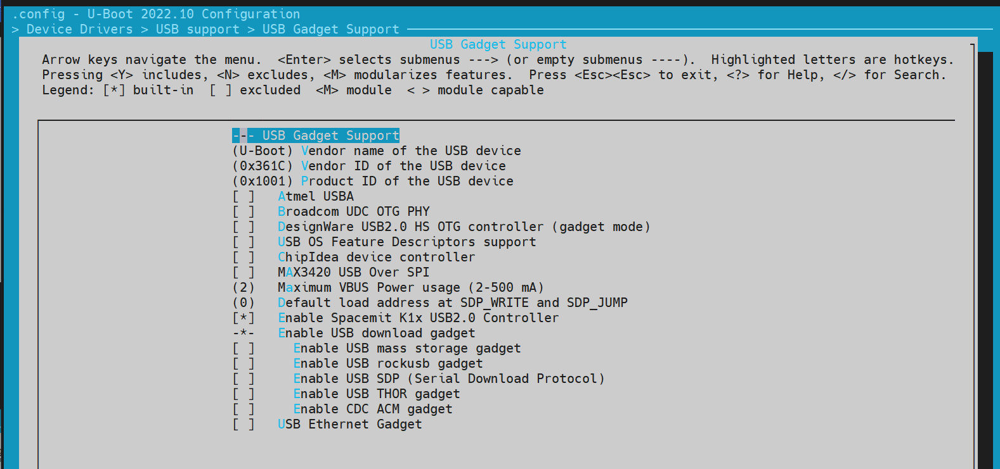

#### Enter Fastboot Mode

**Method 1**: Enter Fastboot mode from the U-Boot shell

- **Enter the U-Boot shell**
  After the system starts, press `s` to enter the U-Boot shell.

- **Run the Fastboot command**
  Run the following command to enter Fastboot mode:

       ```shell
       => fastboot 0
       ```
  The default Fastboot buffer address and size are specified by the `CONFIG_FASTBOOT_BUF_ADDR` and `CONFIG_FASTBOOT_BUF_SIZE` macro definitions.

```shell
# => fastboot -l 0x130000000 -s 0x10000000 0, specify the buffer address and size

=> fastboot 0 # Enter Fastboot mode

# Expected output:
dwc3 udc: phy_init
dwc3 udc probe
dwc3 udc: pullup 1
-- suspend --
handle setup GET_DESCRIPTOR, 0x80, 0x6 index 0x0 value 0x100 length 0x40
handle setup SET_ADDRESS, 0x0, 0x5 index 0x0 value 0x22 length 0x0
handle setup GET_DESCRIPTOR, 0x80, 0x6 index 0x0 value 0x100 length 0x12
..
```

**Method 2**: **Enter Fastboot mode from Bianbu OS**
 After the device boots into Bianbu OS, send the following command to reboot the system into Fastboot mode:

   ```shell
   adb reboot bootloader
   ```

  **Note:** Some solutions may not support this feature.

#### Supported Fastboot Commands

For Fastboot environment setup on the host PC, see the **Host Environment Installation** section.

```shell
# Native Fastboot protocol commands
fastboot devices              # Display available devices
fastboot reboot               # Reboot the device
fastboot getvar [version/product/serialno/max-download-size]
fastboot flash partname image # Flash the image to the partname partition
fastboot erase partname       # Erase the partname partition
fastboot stage file           # Download file to the buffer address in memory

# OEM vendor-specific commands and features
fastboot getvar [mtd-size/blk-size] # Get the mtd/blk device size; returns NULL if unavailable
fastboot oem read part              # Read data from part to the buffer address
fastboot get_staged file       # Upload data and name it file. Depends on the oem read part command
```

### File System Operations

- **FAT**

```shell
=> fat
  fatinfo fatload fatls fatmkdir fatrm fatsize fatwrite
=> fatls mmc 2:5
 50896911   uImage.itb
     4671   env_k3.txt

2 file(s), 0 dir(s)

=> fatload mmc 2:5 0x140000000 uImage.itb # Load uImage.itb to 0x40000000
50896911 bytes read in 339 ms (143.2 MiB/s)
=>
```

- **EXT4**
Similar to the `fat` commands.

```shell
=> ext4
  ext4load ext4ls ext4size
=> ext4load
ext4load - load binary file from a Ext4 filesystem

Usage:
ext4load <interface> [<dev[:part]> [addr [filename [bytes [pos]]]]]
    - load binary file 'filename' from 'dev' on 'interface'
      to address 'addr' from ext4 filesystem
=>
```

### Common U-Boot Commands

This subsection introduces several commonly used U-Boot commands.

1. **Common commands**

```shell
printenv  - print environment variables
md        - memory display
mw        - memory write (fill)
fdt       - flattened device tree utility commands


help      - print command description/usage
```

2. **The `fdt` command**

The `fdt` command is mainly used to manipulate and print Device Tree content, such as the DTB file loaded after U-Boot starts.

```shell
=> fdt
fdt - flattened device tree utility commands

Usage:
fdt addr [-c] [-q] <addr> [<size>]  - Set the [control] fdt location to <addr>
fdt move   <fdt> <newaddr> <length> - Copy the fdt to <addr> and make it active
fdt resize [<extrasize>]            - Resize fdt to size + padding to 4k addr + some optional <extrasize> if needed
fdt print  <path> [<prop>]          - Recursive print starting at <path>
fdt list   <path> [<prop>]          - Print one level starting at <path>
fdt get value <var> <path> <prop> [<index>] - Get <property> and store in <var>
                                      In case of stringlist property, use optional <index>
                                      to select string within the stringlist. Default is 0.
fdt get name <var> <path> <index>   - Get name of node <index> and store in <var>
fdt get addr <var> <path> <prop>    - Get start address of <property> and store in <var>
fdt get size <var> <path> [<prop>]  - Get size of [<property>] or num nodes and store in <var>
fdt set    <path> <prop> [<val>]    - Set <property> [to <val>]
fdt mknode <path> <node>            - Create a new node after <path>
fdt rm     <path> [<prop>]          - Delete the node or <property>
fdt header [get <var> <member>]     - Display header info
                                      get - get header member <member> and store it in <var>
fdt bootcpu <id>                    - Set boot cpuid
fdt memory <addr> <size>            - Add/Update memory node
fdt rsvmem print                    - Show current mem reserves
fdt rsvmem add <addr> <size>        - Add a mem reserve
fdt rsvmem delete <index>           - Delete a mem reserves
fdt chosen [<start> <size>]         - Add/update the /chosen branch in the tree
                                        <start>/<size> - initrd start addr/size
NOTE: Dereference aliases by omitting the leading '/', e.g. fdt print ethernet0.
=>

# Example operations:
=> fdt addr $fdtcontroladdr # Set the address of the control device tree
=> fdt print                # Print the entire device tree
/ {
        compatible = "spacemit,k3", "riscv";
        #address-cells = <0x00000002>;
        #size-cells = <0x00000002>;
        model = "spacemit k3 deb1 board";
... ...
        memory@0 {
                device_type = "memory";
                reg = <0x00000000 0x00000000 0x00000000 0x80000000>;
        };
        chosen {
                bootargs = "earlycon=sbi console=ttyS0,115200 debug loglevel=8,initcall_debug=1 rdinit=/init.tmp";
                stdout-path = "serial0:115200n8";
        };
};

=> fdt print /chosen # Print the content of a specific path
chosen {
        bootargs = "earlycon=sbi console=ttyS0,115200 debug loglevel=8,initcall_debug=1 rdinit=/init.tmp";
        stdout-path = "serial0:115200n8";
};
=>
```

3. **Shell commands**
U-Boot supports shell-style commands such as `if/fi` and `echo`.

```shell
=> if test ${boot_device} = nand; then echo "nand boot"; else echo "not nand boot";fi
not nand boot
=> printenv boot_device
boot_device=nor
=> if test ${boot_device} = nor; then echo "nor boot"; else echo "not nor boot";fi
nor boot
=>
```

## OpenSBI Features and Configuration

This section describes how to build and configure OpenSBI.

### Building OpenSBI

```shell
cd ~/opensbi/ # Enter the OpenSBI directory

# Note: Make sure to use the correct toolchain. The toolchain used here must be provided by SpacemiT; otherwise, build failures may occur.

GCC_PREFIX=riscv64-unknown-linux-gnu- # Set the build toolchain

CROSS_COMPILE=${GCC_PREFIX} PLATFORM=generic \
PLATFORM_DEFCONFIG=k3_deb1_defconfig \
PLATFORM_RISCV_ISA=rv64gc \
FW_TEXT_START=0x0  \
make
```

### Generated Build Files

After the build completes, the generated files are located in the `build/platform/generic/firmware/` directory:

```shell
~/opensbi$ ls build/platform/generic/firmware/ -l
fw_dynamic.bin     # The dynamic image passes configuration parameters during the jump
fw_dynamic.elf
fw_dynamic.elf.dep
fw_dynamic.itb     # Packages fw_dynamic.bin into FIT format
fw_dynamic.its
fw_dynamic.o
fw_jump.bin       # The jump image only performs the jump
fw_payload.bin    # The payload image includes the U-Boot image
```

### OpenSBI Feature Configuration

You can run `menuconfig` to enable or disable certain features.

```shell
make PLATFORM=generic PLATFORM_DEFCONFIG=k3_deb1_defconfig menuconfig
```

Example configuration:


## FAQ

This section summarizes common issues and solutions, along with commonly used debugging methods and notes on areas where errors are common.

### TitanFlash does not detect the device when flashing firmware

- **Check the USB connection**
  Make sure the USB cable is connected to the PC and the serial log is normal, as shown below:
   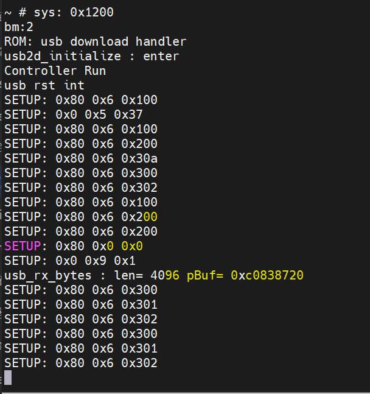

If the serial log shows that the device is connected but TitanFlash still cannot detect it, check the following:

- **Check Device Manager**
  In Windows Device Manager, check whether an ADB device is present. If not, install the corresponding driver.

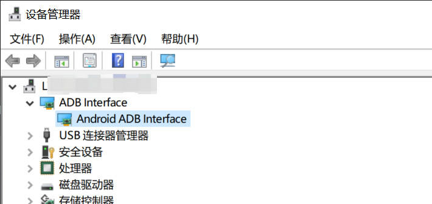

- **Refer to the installation guide**
  If no ADB device is shown in Device Manager, refer to the Fastboot environment installation section in **Host Environment Installation**.

### Changes involving `def_config` do not take effect after updating the code

You need to run `make menuconfig` to update `.config`; only then will the changes take effect during the build.

### Change FSBL information

The FSBL location and size information is specified in `bootinfo`. To change FSBL information, complete the following steps:

**1. Update `bootinfo`**

Based on the boot media, modify the corresponding `bootinfo_*.json` file and update:

```c
// board/spacemit/k3/configs/bootinfo_*.json
            "spl0_offset, 0x180000, 4",
            "spl1_offset, 0x200000, 4",
            "spl_size_limit, 0x74000, 4",
```

**2. Update the partition table**

Based on the boot media, modify the starting address of the FSBL partition in the corresponding partition table.

```c
// buildroot-ext/board/spacemit/k3/partition_*.json
    {
      "name": "fsbl",
      "comment": "its offset was designated by bootinfo",
      "hidden": true,
      "offset": "1536K",
      "size": "512K",
      "image": "factory/FSBL.bin"
    },
```

**3. Update `mtdparts`**

For MTD devices, you also need to update the `MTDPARTS_DEFAULT` configuration (`CONFIG_MTDPARTS_DEFAULT`) through `menuconfig`.

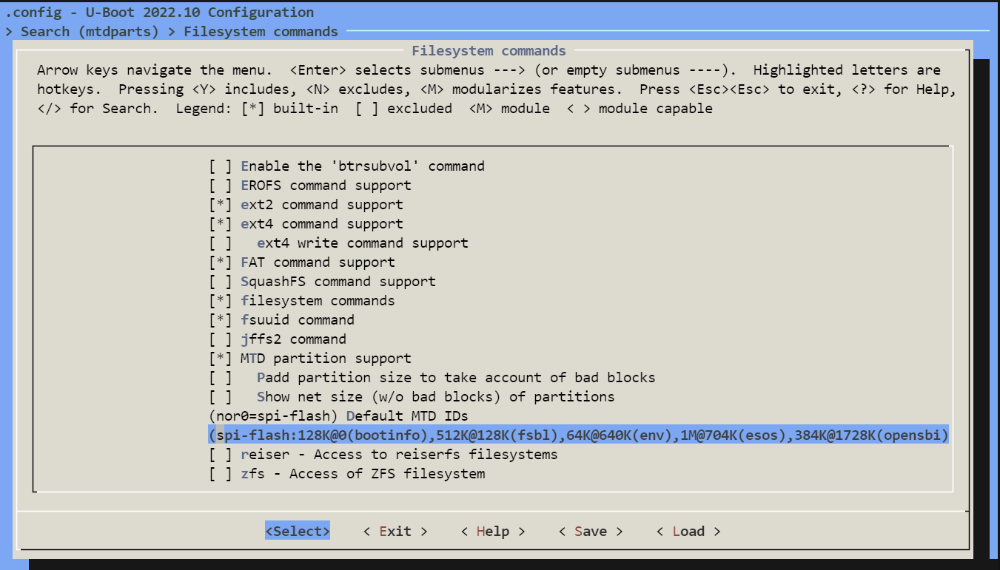

### How to set hidden partitions

The `partition_universal.json` partition table supports hidden partitions. The `hidden` tag is used to mark a hidden partition. After flashing and booting, hidden partitions do not appear in the GPT table.

For partition tables that contain hidden partitions, you must flash the image with the TitanFlasher tool, or run `fastboot flash gpt partition_universal.json` first, before using Fastboot commands to flash images to hidden partitions.

Currently, hidden partitions are supported only on BLK devices such as eMMC, SSD, and UFS.

An example partition table with hidden partitions is shown below. If the `hidden` tag is not added, the partition is visible by default.
`cat k3/common/flash_config/partition_universal.json`

```sh
    {
      "name": "fsbl",
      "comment": "its offset was designated by bootinfo",
      "hidden": true,
      "offset": "1536K",
      "size": "512K",
      "image": "factory/FSBL.bin"
    },
```

### Flashing gzip-format image files is not supported

The SpacemiT flashing mechanism compresses large image files into gzip format to address slow USB transfers for large files. The flashing service checks by default whether the data is in gzip format and decompresses it automatically. If you need to flash a gzip-format image to a custom partition, use one of the following methods:

- Method 1: Disable the gzip check for a specified partition, such as the `usbfs` partition

```c
diff --git a/drivers/fastboot/fb_mmc.c b/drivers/fastboot/fb_mmc.c
index 88d8778376..a37cbde596 100644
--- a/drivers/fastboot/fb_mmc.c
+++ b/drivers/fastboot/fb_mmc.c
@@ -689,7 +689,7 @@ void fastboot_mmc_flash_write(const char *cmd, void *download_buffer,
            fastboot_mmc_get_part_info(cmd, &dev_desc, &info, response) < 0)
                return;

-       if (check_gzip_format((uchar *)download_buffer, src_len) >= 0) {
+       if (check_gzip_format((uchar *)download_buffer, src_len) >= 0 && strcmp("usbfs", cmd) != 0) {
                /*is gzip data and equal part name*/
                gzip_image = true;
                if (strcmp(cmd, part_name_t)){


```

- Method 2: Disable compressed-image flashing (***not recommended, because it increases flashing time***)

```c
// Disable the compressed-image check in the flashing service
//uboot-2022.10
diff --git a/drivers/fastboot/fb_mmc.c b/drivers/fastboot/fb_mmc.c
index 88d8778376..5f8d4f8931 100644
--- a/drivers/fastboot/fb_mmc.c
+++ b/drivers/fastboot/fb_mmc.c
@@ -689,7 +689,7 @@ void fastboot_mmc_flash_write(const char *cmd, void *download_buffer,
            fastboot_mmc_get_part_info(cmd, &dev_desc, &info, response) < 0)
                return;

-       if (check_gzip_format((uchar *)download_buffer, src_len) >= 0) {
+       if (false) {
                /*is gzip data and equal part name*/
                gzip_image = true;
                if (strcmp(cmd, part_name_t)){


// Disable image compression processing in the flashing tool
// buildroot-ext. You can directly modify partition_universal.json in the flashing package. Note that the last line in JSON format must not end with a comma.
diff --git a/board/spacemit/k3/partition_universal.json b/board/spacemit/k3/partition_universal.json
index e02a1d0..e9da5a9 100644
--- a/board/spacemit/k3/partition_universal.json
+++ b/board/spacemit/k3/partition_universal.json
@@ -36,15 +36,13 @@
             "name": "bootfs",
             "offset": "4M",
             "size": "256M",
-            "image": "bootfs.img",
-            "compress": "gzip-5"
+            "image": "bootfs.img"
         },
         {
             "name": "rootfs",
             "offset": "260M",
             "size": "-",
-            "image": "rootfs.ext4",
-            "compress": "gzip-5"
+            "image": "rootfs.ext4"
         }
     ]
 }
```
