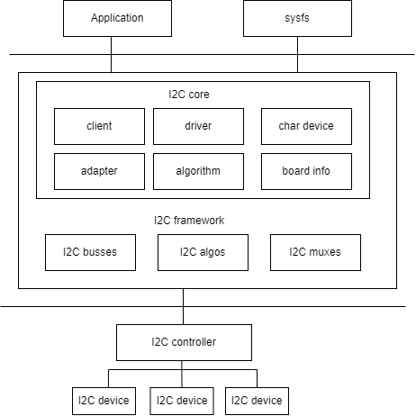
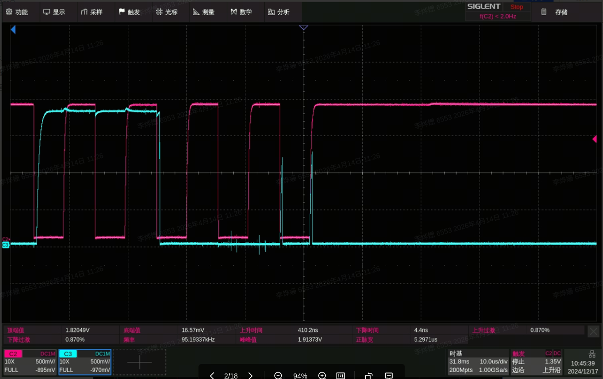

# I2C

This document describes I2C functionality and usage.

## Module Overview

The I2C bus is a two-wire serial communication bus used to connect microcontrollers and peripheral devices. It is commonly used for master-slave communication between a main controller and its peripherals in scenarios with small data volumes and short transmission distances. Each device has its own unique address, and I2C operates in half-duplex mode, allowing only one master to communicate on the bus at any given time.

### Functional Description

  
As shown in the figure, the I2C architecture in Linux is divided into three layers:

1. User space: all applications that use I2C devices
2. Kernel: the driver layer
3. Hardware: the actual physical devices, including the I2C controller and I2C peripherals

In the Linux kernel, the I2C driver logically implements the following:

- The I2C framework provides a way to access I2C slave devices. Since these slave devices are controlled by the I2C controller, this is mainly implemented by the I2C controller driver.
- Internally, the I2C framework consists of four modules: I2C core, I2C busses, I2C algos, and I2C muxes.
- The I2C core uses the I2C adapter and I2C algorithm submodules to abstract I2C controller functionality.
- I2C busses is a collection of I2C controller drivers located in the `drivers/i2c/busses/` directory, such as `i2c-k1.c`.
- I2C algos contains some common I2C algorithms. Here, an algorithm refers to the I2C protocol communication method used to implement I2C read/write operations.

### Source Code Structure

The controller driver code is located in the `drivers/i2c/` directory:

```
drivers/i2c/
|-- i2c-core-of.c       #I2C subsystem core file, providing relevant interface
|-- i2c-boardinfo.c
|-- i2c-core-base.c
|-- i2c-core-slave.c
|-- i2c-core-smbus.c
|-- i2c-dev.c           #I2C subsystem device-related file, used for registering
|-- busses/i2c-k1.c     #I2C controller driver code for the K3 platform 
```

## Key Features

### Features

| Feature | Description|
| :-----| :----|
| Support for 8 I2C groups  | Supports 8 I2C interfaces (`i2c0-6`, `i2c8`) |
| Support for 100K/400K speed modes | Supports standard mode (100KHz) and fast mode (400KHz), configurable through the `clock-frequency` property in DTS |
| Support for bus arbitration | Supports bus arbitration in multi-master mode |
| Support for SDA glitch suppression | The controller includes built-in SDA glitch repair logic, which is enabled by default and can be disabled by adding the `spacemit,sda-glitch-nofix` property in DTS |

In addition, the K3 R-domain (RCPU side) provides two independent I2C controllers, `r_i2c0` and `r_i2c1` (defined in `k3-rdomain.dtsi`). They use the same `spacemit,k1-i2c` driver, their clocks are provided by `syscon_rcpu_i2cctrl`, and their status is `disabled` by default. The available pinctrl groups are `ri2c0_0_cfg ~ ri2c0_3_cfg` and `ri2c1_0_cfg ~ ri2c1_3_cfg`.

## Configuration

Configuration mainly includes driver enablement and DTS settings.

### CONFIG Configuration

- `CONFIG_I2C` and `CONFIG_I2C_K1` are enabled in the K3 SDK defconfig

```
Device Drivers
        I2C support
                I2C support (I2C [=y])
                        I2C Hardware Bus support
                               SpacemiT K1 I2C adapter (I2C_K1 [=y])
```

- `CONFIG_I2C_CHARDEV` is the I2C character device option

```
Device Drivers
        I2C support
                I2C support (I2C [=y])
                        I2C device interface (I2C_CHARDEV [=y])
```

### DTS Configuration

The I2C controller on K3 reuses the `spacemit,k1-i2c` IP and its DT binding (see `Documentation/devicetree/bindings/i2c/spacemit,k1-i2c.yaml`). The main supported properties are:

| Configuration                      | Description                                                         |
| ------------------------- | ------------------------------------------------------------ |
| clock-frequency           | I2C bus clock frequency. Supports 100000 (standard mode) and 400000 (fast mode), defaulting to 400000. |
| spacemit,sda-glitch-nofix | Bypasses the SDA glitch repair logic. Eliminates the delay caused by repeated Start signals when connecting with some devices. |

The default bus speed is 400KHz. To switch to standard mode (100KHz), modify the `clock-frequency` property in the board-level DTS:

```c
&i2c2 {
        clock-frequency = <100000>;
};
```

#### pinctrl

Check the development board schematic to determine which pin group is used by the I2C controller.

The K3 platform provides multiple `pinctrl` configurations for each I2C controller, defined in `k3-pinctrl.dtsi`. Taking `i2c2` as an example, assuming that `i2c2_1_cfg` (PAD 106/107) is used, the board-level DTS configuration is as follows:

```c
&i2c2 {
        pinctrl-names = "default";
        pinctrl-0 = <&i2c2_1_cfg>;
};
```

The available pinctrl configuration groups for each I2C controller are as follows:

| Controller | Available Configuration Group |
| ------ | ---------- |
| i2c0   | i2c0_0_cfg ~ i2c0_4_cfg (5 groups) |
| i2c1   | i2c1_0_cfg ~ i2c1_3_cfg (4 groups) |
| i2c2   | i2c2_0_cfg ~ i2c2_3_cfg (4 groups)|
| i2c3   | i2c3_0_cfg ~ i2c3_3_cfg (4 groups) |
| i2c4   | i2c4_0_cfg ~ i2c4_3_cfg (4 groups) |
| i2c5   | i2c5_0_cfg ~ i2c5_3_cfg (4 groups) |
| i2c6   | i2c6_0_cfg ~ i2c6_3_cfg (4 groups) |
| i2c8   | i2c8_cfg (mux 0, PAD128/129 connected to AP-side `i2c8`); `i2c8_cfg_rcpu` (mux 1, the same pins switched to the RCPU-side function, commonly used in `rpmi_regulator`/PMIC scenarios, in which case AP-side `i2c8` cannot use this pin group) |

#### I2C Device Configuration

Taking EEPROM as an example to illustrate how to configure an I2C device in the DTS.

##### Device Type

Confirm the device type and the driver it uses.

For the EEPROM device, set the `compatible` property to `atmel,24c02`.

##### Device Address

Confirm the I2C communication address of the device and specify it in the `reg` property of the DTS node.

The schematic shows that the EEPROM address is `0x50`. The configuration is as follows:

```c
eeprom@50 {
        compatible = "atmel,24c02";
        reg = <0x50>;
}
```

##### Communication Frequency

Confirm the communication frequency supported by the device.

The EEPROM supports a 400KHz communication frequency and is attached to `i2c2`, using the default `clock-frequency = <400000>`.

##### Device Control Signals

Check the board schematic to determine the control signals used by the device.

EEPROM devices generally do not require additional control signals (such as `reset` or `irq`) and only need an I2C bus connection.
If the device requires write-protect control, you can configure the corresponding GPIO.

##### Device DTS

The EEPROM device address is `0x50`, and the communication frequency is 400KHz. It is configured as read-only and uses the ONIE TLV layout to store board-level information.

The device DTS configuration is as follows:

```c
eeprom@50 {
        compatible = "atmel,24c02";
        reg = <0x50>;
        read-only;
        status = "okay";

        nvmem-layout {
                compatible = "onie,tlv-layout";
        };
};
```

#### DTS Example

Based on the above information, when the EEPROM device is connected to `i2c2`, the board-level DTS configuration is as follows:

```c
&i2c2 {
        pinctrl-names = "default";
        pinctrl-0 = <&i2c2_1_cfg>;
        status = "okay";

        eeprom@50 {
                compatible = "atmel,24c02";
                reg = <0x50>;
                read-only;
                status = "okay";

                nvmem-layout {
                        compatible = "onie,tlv-layout";
                };
        };
};
```

## Interface

### API

**Kernel space**: I2C read/write communication uses standard Linux interfaces. For detailed instructions on sending and receiving, refer to `Documentation/i2c/writing-clients.rst` in the kernel source tree.

**User space**: From user space, you can access all devices on the bus through `/dev/i2c-%d` nodes. The demo example shows a simple way to read from and write to I2C devices. For more information, refer to `Documentation/i2c/dev-interface.rst`.

The I2C bus numbers on K3 are determined by device-tree aliases (see `k3.dtsi`). The corresponding user-space device nodes are `/dev/i2c-0` ~ `/dev/i2c-6` and `/dev/i2c-8` (`/dev/i2c-7` is not available).

### Demo Example

```c
#include <stdio.h>
#include <stdlib.h>
#include <stdint.h>
#include <unistd.h>
#include <sys/ioctl.h>
#include <fcntl.h>
#include <linux/i2c-dev.h>

#define I2C_DEV_FILE "/dev/i2c-1"  // I2C device file path, typically /dev/i2c-1
#define DEVICE_ADDR 0x68            // Example I2C device address; modify as needed for the actual device

// Data to the I2C device
int write_to_i2c(int file, uint8_t reg, uint8_t value) {
    uint8_t buffer[2];
    buffer[0] = reg;     // Register address
    buffer[1] = value;   // Value to write

    if (write(file, buffer, 2) != 2) {
        perror("I2C write failed");
        return -1;
    }
    return 0;
}

// Read data from the I2C device
int read_from_i2c(int file, uint8_t reg, uint8_t *data, size_t len) {
    if (write(file, &reg, 1) != 1) {
        perror("I2C write register failed");
        return -1;
    }

    if (read(file, data, len) != len) {
        perror("I2C read failed");
        return -1;
    }
    return 0;
}

int main() {
    int file;
        uint8_t data[2];  // Used to store the data read

    // Open the I2C device file
    if ((file = open(I2C_DEV_FILE, O_RDWR)) < 0) {
        perror("Failed to open I2C bus");
        exit(1);
    }

        // Set the address of the I2C slave device
    if (ioctl(file, I2C_SLAVE, DEVICE_ADDR) < 0) {
        perror("Failed to acquire bus access and/or talk to slave");
        close(file);
        exit(1);
    }

    if (write_to_i2c(file, 0x6B, 0x00) < 0) {
        close(file);
        exit(1);
    }
    printf("Write 0x00 to register 0x6B\n");

    if (read_from_i2c(file, 0x75, data, 1) < 0) {
        close(file);
        exit(1);
    }
    printf("Read data 0x%02x from register 0x75\n", data[0]);

    // Close the I2C device file
    close(file);

    return 0;
}
```

## Debugging

### sysfs

After enabling `CONFIG_I2C_CHARDEV`, adapters and their attached devices appear in the `/sys/bus/i2c/devices/` directory. You can quickly inspect them with the following commands:

```bash
ls /sys/bus/i2c/devices/i2c-*/name
cat /sys/bus/i2c/devices/2-0050/name   # Check the EEPROM client node
```

### debugfs

debugfs is enabled on K3 by default. After mounting it, you can view each adapter directory under `/sys/kernel/debug/i2c/`, then enter the corresponding directory to view attached clients (such as `2-0050`):

```bash
ls /sys/kernel/debug/i2c                  # List all I2C controllers
ls /sys/kernel/debug/i2c/i2c-2            # View clients under i2c-2; output will look like 2-0050
```

## Testing Introduction

I2C tool is an open-source utility suite that you can download and cross-compile for use. [Download link](https://mirrors.edge.kernel.org/pub/software/utils/i2c-tools/)
After compilation, tools such as **i2cdetect**, **i2cdump**, **i2cset**, and **i2cget** are generated. They can be used directly from the command line for debugging:

- **i2cdetect**: Lists all devices on an I2C bus
- **i2cdump**: Displays the values of all registers on an I2C device
- **i2cset**: Writes the value of a specific register on an I2C device
- **i2cget**: Reads the value of a specific register on an I2C device

## FAQ

### 1. I2C Transmission Timeout Issue

The abnormal log is as follows:

```c
[  126.800897] i2c-k1 d401d800.i2c: msg completion timeout
```

Troubleshooting steps:

1. Check the I2C hardware resistors. If a slave device on the SDA line requires a bypass capacitor, it is recommended to change the SDA pull-up resistor to 1k resistor.
2. Check the I2C pinctrl drive capability, and increase the drive strength of the corresponding I2C pinctrl configuration if necessary.
3. If the repeated-start signal is delayed due to the SDA glitch repair logic, try adding the `spacemit,sda-glitch-nofix` property in DTS to disable this logic. The following figure shows an abnormal waveform captured on an oscilloscope:

By default, the repair logic actively pulls SDA low and holds it after ACK. When SDA is released, the rising edge is delayed, producing a sharp glitch between ACK and Repeated Start (marked by the red arrow). As a result, the subsequent Repeated Start condition cannot be correctly recognized by the slave device, causing the controller to report `msg completion timeout`.


s
