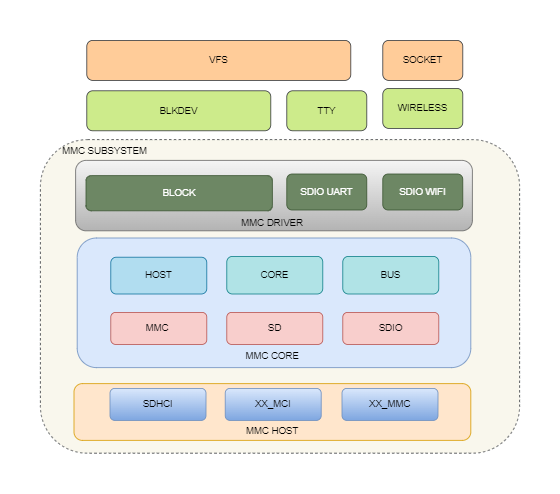

# SDHC

This section describes the K3 platform SDHC controller, including its features, device tree configuration, and debugging methods.

## Module Introduction

SDHC is the host controller for MMC/SD/SDIO devices. On the K3 platform, SDHC mainly supports the following devices or interfaces:

- **SD Card**
- **SDIO**
- **eMMC**

### Functional Overview



The Linux MMC framework can be broadly divided into three layers:

- **MMC Host**: The host controller driver layer, responsible for controller initialization, command transmission, data transfer, voltage switching, and related control logic;
- **MMC Core**: The core layer, which manages card enumeration, protocol handling, and state machines;
- **MMC Block / SDIO Functionality Layer**: The upper layer that provides interfaces for block devices or SDIO peripheral drivers.

On K3, the block devices corresponding to eMMC and SD cards are as follows:

- The eMMC block device node is `/dev/mmcblk2`;
- The SD card block device node is `/dev/mmcblk0`.

### Source Code Structure

The controller-related source code is primarily located in:

```text
linux-6.18/
|-- drivers/mmc/host/
|   |-- sdhci.c                # SDHCI generic framework
|   |-- sdhci-pltfm.c          # SDHCI platform layer
|   `-- sdhci-of-k1.c          # SpacemiT K1/K3 SDHCI driver
|-- Documentation/devicetree/bindings/mmc/
|   `-- spacemit,sdhci.yaml    # SpacemiT SDHCI binding
`-- arch/riscv/boot/dts/spacemit/
        |-- k3.dtsi                # K3 SoC-level DTS configuration
        `-- k3*.dts                # Board-level DTS configuration
```

## Key Features

### Features

| Feature | Description |
| :----- | :---- |
| Controller Count | K3 provides three host controllers: `sdcard`, `sdio`, and `emmc` |
| Supported Device Types | Supports SD, SDIO, and eMMC |
| eMMC5.1 | Supports HS400 and HS400ES |
| SD 3.0 | Supports UHS and up to SDR104 |
| SDIO | Supports SDIO Specification Version 3.00 |
| Software Tuning | Supports automatic RX tuning and independent configuration of `tx_delaycode` |

### Usage of the Three Slots on K3

Slot 1 supports SD/SDIO (1-bit or 4-bit), Slot 2 supports SDIO/eMMC (1-bit or 4-bit), and Slot 3 supports only eMMC (1-bit, 4-bit, or 8-bit). In the DTS, these three slots are described as `sdcard`, `sdio`, and `emmc`, respectively:

- **`sdcard`**: SD card configuration, supporting up to SDR104;
- **`sdio`**: SDIO interface configuration, generally used to connect Wi-Fi modules;
- **`emmc`**: eMMC configuration, supporting up to HS400ES.

## Configuration

This primarily includes kernel configuration and DTS configuration.

### CONFIG Configuration

Common K3 SDHC configuration options are as follows:

`CONFIG_MMC` provides support for the MMC bus protocol, and is usually set to `Y`:

```text
Device Drivers
    MMC/SD/SDIO card support (MMC [=y])
```

`CONFIG_MMC_BLOCK` provides support for MMC block devices and is usually set to `Y`:

```text
Device Drivers
    MMC/SD/SDIO card support (MMC [=y])
        MMC block device driver (MMC_BLOCK [=y])
```

`CONFIG_MMC_SDHCI` / `CONFIG_MMC_SDHCI_PLTFM` / `CONFIG_MMC_SDHCI_OF_K1` provide support for the SpacemiT SDHCI controller:

```text
Device Drivers
    MMC/SD/SDIO card support (MMC [=y])
        Secure Digital Host Controller Interface support (MMC_SDHCI [=y])
            SDHCI platform and OF driver helper (MMC_SDHCI_PLTFM [=y])
            SDHCI OF support for the SpacemiT SDHCI controller (MMC_SDHCI_OF_K1 [=y])
```

### DTS Configuration

#### Controller Nodes

The three controller nodes for K3 are located in `k3.dtsi`:

```dts
sdcard: mmc@d4280000 {
        compatible = "spacemit,k3-sdhci";
        reg = <0x0 0xd4280000 0x0 0x200>;
        clocks = <&syscon_apmu CLK_APMU_SDH_AXI>,
                 <&syscon_apmu CLK_APMU_SDH0>;
        clock-names = "core", "io";
        interrupts = <99 IRQ_TYPE_LEVEL_HIGH>;
        resets = <&syscon_apmu RESET_APMU_SDH_AXI>,
                 <&syscon_apmu RESET_APMU_SDH0>;
        reset-names = "sdh_axi", "sdh0";
        status = "disabled";
};
```

```dts
sdio: mmc@d4280800 {
        compatible = "spacemit,k3-sdhci";
        reg = <0x0 0xd4280800 0x0 0x200>;
        clocks = <&syscon_apmu CLK_APMU_SDH_AXI>,
                 <&syscon_apmu CLK_APMU_SDH1>;
        clock-names = "core", "io";
        interrupt-parent = <&saplic>;
        interrupts = <100 IRQ_TYPE_LEVEL_HIGH>;
        resets = <&syscon_apmu RESET_APMU_SDH_AXI>,
                 <&syscon_apmu RESET_APMU_SDH1>;
        reset-names = "sdh_axi", "sdh1";
        status = "disabled";
};
```

```dts
emmc: mmc@d4281000 {
        compatible = "spacemit,k3-sdhci";
        reg = <0x0 0xd4281000 0x0 0x200>;
        clocks = <&syscon_apmu CLK_APMU_SDH_AXI>,
                 <&syscon_apmu CLK_APMU_SDH2>;
        clock-names = "core", "io";
        interrupt-parent = <&saplic>;
        interrupts = <101 IRQ_TYPE_LEVEL_HIGH>;
        resets = <&syscon_apmu RESET_APMU_SDH_AXI>,
                 <&syscon_apmu RESET_APMU_SDH2>;
        reset-names = "sdh_axi", "sdh2";
        status = "disabled";
};
```

#### pinctrl Configuration

At the board level, the SD card controller supports three pinctrl states:

- `default`
- `uhs`
- `debug`

For example:

```dts
&sdcard {
        pinctrl-names = "default","uhs","debug";
        pinctrl-0 = <&mmc1_cfg>;
        pinctrl-1 = <&mmc1_uhs_cfg>;
        pinctrl-2 = <&mmc1_debug_cfg>;
        status = "okay";
};
```

Where:

- `default`: Default operating mode, using 3.3 V I/O;
- `uhs`: UHS mode, using 1.8 V I/O. The driver dynamically switches to this pinctrl state when required;
- `debug`: Used in debug scenarios such as external card debug daughterboards.

The SDIO controller and eMMC controller do not support 1.8 V/3.3 V I/O switching, so only one pinctrl state needs to be configured.

#### Power Configuration

For SD cards and SDIO devices, the following supplies usually need to be configured:

- `vmmc-supply`: Card power supply;
- `vqmmc-supply`: I/O power supply. For SD cards, this must support switching between 3.3 V and 1.8 V.

For example:

```dts
&sdcard {
        vmmc-supply = <&p3v3>;
        vqmmc-supply = <&aldo1>;
};
```

For eMMC, the board-level design typically guarantees the required power supply, so explicit power configuration is not required.

#### Card Detect Configuration

SD cards support hot-plug detection, so a card-detect GPIO must be configured, for example:

```dts
&sdcard {
        cd-gpios = <&gpio 0 4 GPIO_ACTIVE_HIGH>;
};
```
The active level for card detection must be adjusted according to the actual hardware design.

The card-detect GPIO also requires a corresponding pull-up configuration in pinctrl.


```dts
&pinctrl {
        mmc1_cd_cfg: mmc1-cd-cfg {
                mmc1-cd-pins {
                        pinmux = <K3_PADCONF(4, 0)>;  /* cd gpio */

                        bias-pull-up = <1>;
                        drive-strength = <8>;
                        power-source = <3300>;
                };
        };
};
```

For card detection, the pinctrl configuration must enable pull-up by default, and `power-source` must be set to 3.3 V.

#### SD Card Configuration Example

`sdcard` configuration for K3 COM260:

```dts
&sdcard {
        pinctrl-names = "default","uhs";
        pinctrl-0 = <&mmc1_cfg &mmc1_cd_cfg>;
        pinctrl-1 = <&mmc1_uhs_cfg &mmc1_cd_cfg>;
        bus-width = <4>;
        wp-inverted;
        cd-gpios = <&gpio 0 4 GPIO_ACTIVE_HIGH>;
        vmmc-supply = <&p3v3>;
        vqmmc-supply = <&aldo1>;
        no-mmc;
        no-sdio;
        clock-frequency = <204800000>;
        spacemit,tx_delaycode = <0x1f>;
        status = "okay";
};
```

Key configuration parameters:

- `bus-width = <4>`: The maximum bus width for an SD card is 4 bits. For hardware debugging, it can be reduced to 1 bit for troubleshooting;
- `wp-inverted`: Inverts the logic level of the write-protect signal. Configure this when the active level of the hardware write-protect pin is opposite to the controller's default logic;
- `cd-gpios`: The SD card detect pin, which should be configured according to the actual hardware design;
- `vmmc-supply` / `vqmmc-supply`: The power supply and I/O power supply for the SD card, configured according to the actual hardware;
- `no-mmc`: Disables the controller from enumerating eMMC devices. Required for SD card controllers;
- `no-sdio`: Disables the controller from enumerating SDIO devices. Required for SD card controllers;
- `clock-frequency`: Specifies the clock source. The SD card uses a 204 MHz clock source, and the maximum controller output frequency is 204 MHz;
- `spacemit,tx_delaycode`: Specifies the TX tuning parameter. This should be adjusted according to the actual hardware. If it is not configured, the default value is `0x7f`.

#### SDIO Configuration Example

`sdio` configuration for K3 EVB:

```dts
sdio_pwrseq: sdio-pwrseq {
        compatible = "mmc-pwrseq-simple";

        reset-gpios = <&gpio 3 4 GPIO_ACTIVE_LOW>;
};

&sdio {
        pinctrl-names = "default";
        pinctrl-0 = <&mmc2_cfg>;
        bus-width = <4>;
        non-removable;
        vmmc-supply = <&vmmc_sdio>;
        vqmmc-supply = <&p1v8>;
        mmc-pwrseq = <&sdio_pwrseq>;
        no-mmc;
        no-sd;
        keep-power-in-suspend;
        clock-frequency = <375000000>;
        spacemit,tx_delaycode = <0x7f>;
        status = "okay";
};
```

Key configuration parameters:

- `bus-width = <4>`: The maximum bus width for SDIO is 4 bits. For hardware debugging, it can be reduced to 1 bit for troubleshooting;
- `non-removable`: Indicates that the device is non-removable. This property must be configured for SDIO devices such as soldered Wi-Fi modules; otherwise, the kernel will not actively enumerate the device;
- `vmmc-supply` / `vqmmc-supply`: SDIO power supply and I/O power supply, configured according to the actual hardware design;
- `mmc-pwrseq`: SDIO power-sequence configuration, used to control the Wi-Fi `REG_ON` pin for device reset;
- `no-mmc`: Disables the controller from enumerating eMMC devices. Required for SDIO controllers;
- `no-sd`: Disables the controller from enumerating SD card devices. Required for SDIO controllers;
- `keep-power-in-suspend`: Keeps the device powered during system suspend. This is required for scenarios in which connectivity must be maintained or wake-up must be supported, such as Wi-Fi;
- `clock-frequency`: Specifies the clock source. SDIO uses a 375 MHz clock source, which is divided by 2 inside the controller, so the maximum output frequency is 187 MHz;
- `spacemit,tx_delaycode`: Specifies the TX delay parameter used for tuning. This must be adjusted according to the actual hardware layout. If not configured, the default value is `0x7f`;
- `reset-gpios`: Specifies the reset pin for the SDIO device. For Wi-Fi devices, this typically corresponds to `REG_ON`, and the active level should be configured according to actual requirements.

#### eMMC Configuration Example

`emmc` configuration for K3 EVB:


```dts
&emmc {
        bus-width = <8>;
        non-removable;
        mmc-hs400-1_8v;
        mmc-hs400-enhanced-strobe;
        no-sd;
        no-sdio;
        clock-frequency = <375000000>;
        status = "okay";
};
```

Key configuration parameters:

- `bus-width = <8>`: eMMC typically uses an 8-bit bus. For hardware debugging, it can be reduced to 1 bit or 4 bits for troubleshooting;
- `non-removable`: Indicates that the device is not removable. This property must be configured for eMMC devices soldered on the board;
- `mmc-hs400-1_8v`: Enables HS400 1.8 V mode. If signal quality is poor and a downgrade is needed, remove this property to run only in HS200 mode;
- `mmc-hs400-enhanced-strobe`: Enables Enhanced Strobe. If this property is removed, the highest supported mode becomes HS400;
- `no-sd`: Disables the controller from enumerating SD card devices. Required for eMMC controllers;
- `no-sdio`: Disables the controller from enumerating SDIO devices. Required for eMMC controllers;
- `clock-frequency`: Specifies the clock source. eMMC uses a 375 MHz clock source, which is divided by 2 inside the controller, so the maximum output frequency is 187 MHz.

### Tuning

The K3 driver supports automatic RX tuning, but `tx_delaycode` must be configured according to board-level layout differences.

The following modes require tuning:

- SDR50/SDR104
- HS200/HS400

For eMMC tuning, the default TX timing is used, so `spacemit,tx_delaycode` does not need to be set in the board DTS. For SD cards and SDIO devices, if `tx_delaycode` is not specified, the default value `0x7f` is used.

If TX CRC errors occur when using an SD card or SDIO module, `spacemit,tx_delaycode` usually needs to be adjusted for further verification.

## Interface

### API

In Linux, MMC/SD/SDIO devices are integrated through the MMC subsystem. The K3 `sdhci-of-k1.c` driver implements the following interfaces based on the standard SDHCI framework:

```c
static const struct sdhci_ops spacemit_sdhci_ops = {
        .get_max_clock           = spacemit_sdhci_clk_get_max_clock,
        .reset                   = spacemit_sdhci_reset,
        .set_bus_width           = sdhci_set_bus_width,
        .set_clock               = spacemit_sdhci_set_clock,
        .set_uhs_signaling       = spacemit_sdhci_set_uhs_signaling,
        .voltage_switch          = spacemit_sdhci_voltage_switch,
        .set_power               = sdhci_set_power_and_bus_voltage,
        .platform_execute_tuning = spacemit_sdhci_execute_sw_tuning,
};
```

The `sdhci.c` driver implements the following interfaces:

```c
static const struct mmc_host_ops sdhci_ops = {
        .request                        = sdhci_request,
        .post_req                       = sdhci_post_req,
        .pre_req                        = sdhci_pre_req,
        .set_ios                        = sdhci_set_ios,
        .get_cd                         = sdhci_get_cd,
        .get_ro                         = sdhci_get_ro,
        .card_hw_reset                  = sdhci_hw_reset,
        .enable_sdio_irq                = sdhci_enable_sdio_irq,
        .ack_sdio_irq                   = sdhci_ack_sdio_irq,
        .start_signal_voltage_switch    = sdhci_start_signal_voltage_switch,
        .prepare_hs400_tuning           = sdhci_prepare_hs400_tuning,
        .execute_tuning                 = sdhci_execute_tuning,
        .card_event                     = sdhci_card_event,
        .card_busy                      = sdhci_card_busy,
};
```

The driver calls `sdhci_pltfm_init()` and `sdhci_add_host()` in sequence to create and register `sdhci_host` with the MMC subsystem. The MMC subsystem then uses `sdhci_ops` and `spacemit_sdhci_ops` to interact with the controller.

By default, the K3 platform does not actively scan for SDIO devices. Active scanning is performed only when an SDIO function driver, such as a Wi-Fi driver, is loaded. Therefore, an interface is exported for active SDIO device scanning:

```c
void spacemit_sdio_detect_change(int enable_scan);
```

- `enable_scan = 1`: Triggers active scanning;
- `enable_scan = 0`: Stops active scanning.
The Wi-Fi driver invokes this interface with 1 during loading and with 0 during unloading.

### Debugging

#### sysfs

For SD/SDIO controllers, the K3 driver creates:

```text
/sys/devices/platform/soc/d4280000.mmc/tx_delaycode
/sys/devices/platform/soc/d4280800.mmc/tx_delaycode
```

This node can be used to view and modify the current `tx_delaycode`, making it convenient to debug issues introduced by this parameter.

For example:

```bash
cat /sys/devices/platform/soc/d4280000.mmc/tx_delaycode
echo 0x1f > /sys/devices/platform/soc/d4280000.mmc/tx_delaycode
```

#### debugfs

The MMC subsystem also supports viewing the current host operating state through debugfs, for example:

```bash
cat /sys/kernel/debug/mmc0/ios
```

This interface is commonly used to view:

- Current source clock;
- Actual operating frequency;
- Bus width;
- Timing mode;
- Signal voltage.

## Testing

MMC/SD storage devices can be validated for functionality and performance using standard Linux tools such as:

- `fio`
- `dd`
- `hdparm` (for block device scenarios only, please use with caution)

### Initialization and Identification Check

```bash
dmesg | grep -Ei "mmc|sdhci|sdio"
lsblk
cat /proc/partitions
```

### Viewing Current Host Status

```bash
cat /sys/kernel/debug/mmc0/ios
```

The example output typically includes:

- `clock`
- `actual clock`
- `bus width`
- `timing spec`
- `signal voltage`

```bash
cat /sys/kernel/debug/mmc0/ios
clock:          204800000 Hz
actual clock:   204800000 Hz
vdd:            21 (3.3 ~ 3.4 V)
bus mode:       2 (push-pull)
chip select:    0 (don't care)
power mode:     2 (on)
bus width:      2 (4 bits)
timing spec:    6 (sd uhs SDR104)
signal voltage: 1 (1.80 V)
driver type:    0 (driver type B)
```

### eMMC / SD Card Performance Testing

The following `fio` examples can be used as a reference:

```bash
#Test sequential read throughput
fio -name=read -direct=1 -iodepth=128 -rw=read -ioengine=libaio -bs=128k -size=1G -numjobs=1 -time_based=1 -runtime=60 -group_reporting -directory=/mount_point/

#Test sequential write throughput
fio -name=write -direct=1 -iodepth=128 -rw=write -ioengine=libaio -bs=128k -size=1G -numjobs=1 -time_based=1 -runtime=60 -group_reporting -directory=/mount_point/

#Test sequential read latency
fio -name=read -direct=1 -iodepth=1 -rw=read -ioengine=libaio -bs=4k -size=1G -numjobs=1 -time_based=1 -runtime=60 -group_reporting -directory=/mount_point/

#Test sequential write latency
fio -name=write -direct=1 -iodepth=1 -rw=write -ioengine=libaio -bs=4k -size=1G -numjobs=1 -time_based=1 -runtime=60 -group_reporting -directory=/mount_point/

#Test 4K random read IOPS
fio -name=randread -direct=1 -iodepth=128 -rw=randread -ioengine=libaio -bs=4k -size=1G -numjobs=1 -time_based=1 -runtime=60 -group_reporting -directory=/mount_point/

#Test 4K random write IOPS
fio -name=randwrite -direct=1 -iodepth=128 -rw=randwrite -ioengine=libaio -bs=4k -size=1G -numjobs=1 -time_based=1 -runtime=60 -group_reporting -directory=/mount_point/

#Test 4K random read latency
fio -name=randread -direct=1 -iodepth=1 -rw=randread -ioengine=libaio -bs=4k -size=1G -numjobs=1 -time_based=1 -runtime=60 -group_reporting -directory=/mount_point/

#Test 4K random write latency
fio -name=randwrite -direct=1 -iodepth=1 -rw=randwrite -ioengine=libaio -bs=4k -size=1G -numjobs=1 -time_based=1 -runtime=60 -group_reporting -directory=/mount_point/
```

### SDIO Functionality Verification

SDIO is typically used to connect external Wi-Fi modules. Functional verification is performed by checking whether the upper-layer driver enumerates the device correctly:

```bash
# Confirm SDIO device enumeration succeeded
dmesg | grep -i sdio

# Confirm the network interface appears after the Wi-Fi driver loads
ip link show
```

After SDIO enumeration succeeds, `dmesg` usually contains a log similar to `mmc1: new SDIO card`. After the Wi-Fi driver is loaded, a corresponding network interface, such as `wlan0`, is created.

## FAQ

### 1. Why does the `sdcard` controller initialize, but no block device appears after inserting a card?

Only the following log appears:

```bash
[    5.840252] mmc0: SDHCI controller on d4280000.mmc [d4280000.mmc] using ADMA 64-bit
```

The following logs are missing:

```bash
[    5.804583] sdhci-spacemit d4280000.mmc: Got CD GPIO
[    5.940901] sdhci-spacemit d4280000.mmc: mmc0: set tx_delaycode: 31
[    5.953824] sdhci-spacemit d4280000.mmc: mmc0: pass window [38 167)
[    5.961322] sdhci-spacemit d4280000.mmc: mmc0: pass window [196 218)
[    5.972641] sdhci-spacemit d4280000.mmc: mmc0: tuning done, use delay_code:102
[    5.984557] mmc0: new UHS-I speed SDR104 SDXC card at address 5048
[    5.997836] mmcblk0: mmc0:5048 SD128 116 GiB
[    6.009456]  mmcblk0: p1 p2 p3 p4 p5 p6
```

Common causes include:

- Incorrect active level for `cd-gpios`;
- Missing or incorrect pinctrl configuration;
- Incorrect configuration or abnormal voltage of `vmmc-supply` / `vqmmc-supply`;
- Hardware failure of the card or slot.

### 2. Why is eMMC recognized, but the speed is incorrect or high-speed mode is unstable?

Key points to check:

- Whether `mmc-hs400-1_8v` / `mmc-hs400-enhanced-strobe` configurations are correct;
- Whether board-level clock and power supply meet the requirements;
- Whether kernel HS400/HS400ES configurations are enabled;
- Whether there are tuning failures or CRC errors in the driver logs.

### 3. Why does the SDIO device fail to come up?

Common checks:

- Whether `non-removable` is configured;
- Incorrect configuration or abnormal voltage of `vmmc-supply` / `vqmmc-supply`;
- Whether `mmc-pwrseq` is correctly configured for the Wi-Fi module's `REG_ON`/`RESET` pins;
- Whether the corresponding Wi‑Fi/SDIO function driver and firmware exist.
