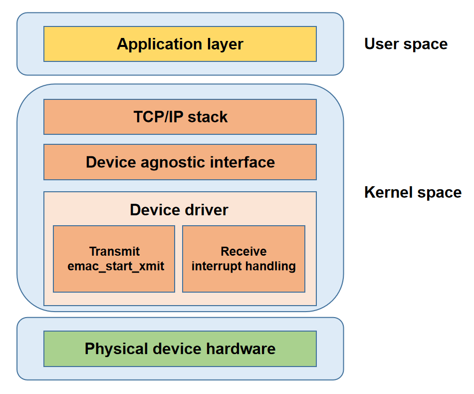

# GMAC

This document describes the K3 GMAC features and usage.

## Module Overview

The K3 GMAC module is based on the Synopsys DesignWare Ethernet QoS controller (version 5.40a). It complies with IEEE 802.3-2015, supports 10/100/1000 Mbps communication, and provides a broad set of advanced networking features.

Typical application scenarios include:

- AV bridging
- switches
- network interface cards
- data center networking equipment

### Functional Overview



- **Application layer:** Provides application-facing network services.
- **Protocol (TCP/IP) stack:** Implements network protocols and provides system call interfaces to the application layer.
- **Network Device agnostic Interface:** Hides driver implementation details and provides a unified interface to the protocol stack.
- **Network Device driver:** Handles data transmission and device management.
- **Physical device hardwares:** Consists of the networking hardware devices.

### Source Tree

The driver source code is located in `drivers/net/ethernet/stmicro/stmmac`. The main file is listed below:

```
drivers/net/ethernet/stmicro/stmmac
|-- ...
|-- dwmac-spacemit-ethqos.c         # SpacemiT platform EQoS glue-layer driver
|-- ...
```

## Key Features

### Hardware Features

| Feature | Description |
| :----- | :---- |
| Supports MII/RMII/RGMII interfaces | Supports multiple PHY interface types |
| Supports 10/100/1000 Mbps | Supports multiple link speeds |
| Supports jumbo frames | Supports Ethernet frames up to 8 KB |
| Supports source address insertion and replacement | Automatically inserts or modifies source MAC addresses |
| Supports VLAN tag insertion/replacement/removal | Processes VLAN tags in hardware |
| Supports VLAN filtering | Filters packets by VLAN ID |
| Supports destination address filtering | Filters packets by destination MAC address |
| Supports source address filtering | Filters packets by source MAC address |
| Supports hash filtering | Filters packets based on MAC address hash values |
| Supports L3 filtering | Filters packets by IP address |
| Supports L4 filtering | Filters packets by TCP/UDP port number |
| Supports IEEE 802.3x Pause | Supports Pause-frame flow control |
| Supports PFC | Supports priority flow control |
| Supports one-step timestamping | Inserts timestamps into synchronization packets |
| Supports one PPS output | Outputs a pulse-per-second signal based on the hardware clock |
| Supports WoL | Supports Wake-on-LAN |
| Supports MAC loopback mode | Useful for interface self-test and debug isolation |
| Supports programmable burst length | Configurable AXI burst transfer length |
| Supports up to 4 TX/RX queues | Supports multi-queue scheduling and traffic distribution |
| Supports Store-and-Forward | Buffers the entire frame in FIFO before transmission |
| Supports Threshold mode | Starts transmission once FIFO data reaches the threshold |
| Supports SP scheduling | Strict-priority scheduling |
| Supports WRR scheduling | Weighted round-robin scheduling |
| Supports DWRR scheduling | Deficit weighted round-robin scheduling |
| Supports WFQ scheduling | Weighted fair queuing |
| Supports CBS | Credit-based shaping |
| Supports EST | Time-aware gate scheduling |
| Supports frame preemption | High-priority frames can preempt low-priority frames |
| Supports TBS | Precise scheduling based on the hardware clock |
| Supports up to 4 DMA channels | Multi-channel parallel transfer |
| Supports TSO | Hardware TCP segmentation offload |
| Supports IPv4 checksum offload | Hardware IPv4 checksum calculation |
| Supports TCP checksum offload | Hardware TCP checksum calculation |
| Supports UDP checksum offload | Hardware UDP checksum calculation |
| Supports ICMP checksum offload | Hardware ICMP checksum calculation |
| Supports header/payload split storage | Stores Ethernet headers and payload separately |
| Supports ARP offload | Hardware response to ARP requests |
| Supports CRC offload | Hardware CRC generation and verification |
| Supports priority-based traffic distribution | Assigns channels based on priority |

> **Note:** For the first feature in the table, the K3 platform provides four GMAC instances (GMAC0 - GMAC3). Only GMAC0 and GMAC1 fully support MII, RMII, and RGMII interfaces. The remaining GMAC instances support only RGMII and RMII.

### Performance Data

| Protocol | Test Mode | TX Throughput (Mbps) | RX Throughput (Mbps) |
| :--: | :--: | :--: | :--: |
| TCP | Unidirectional | 942 | 941 |
| TCP | Bidirectional | 935 | 934 |
| UDP | Unidirectional | 956 | 956 |
| UDP | Bidirectional | 956 | 955 |

**Note:** Throughput may vary slightly during bidirectional traffic testing.

### Performance Testing

#### Test Environment

**Test hardware:** Two K3 deb1 boards, referred to as `deb1 A` and `deb1 B`

**Network topology:** The Gigabit Ethernet ports of `deb1 A` and `deb1 B` are connected directly with an Ethernet cable.

**IP configuration:** Configure the Gigabit Ethernet ports of both boards in the same subnet, then start the `iperf3` server on `deb1 A`.

```bash
# Set IP for deb1 A
ifconfig end0 192.168.0.1 netmask 255.255.255.0

# Set IP for deb1 B
ifconfig end0 192.168.0.2 netmask 255.255.255.0

# Start iperf3 server on deb1 A
iperf3 -s -B 192.168.0.1
```

#### Test Methods

##### Unidirectional TCP traffic

```bash
#TX:
iperf3 -c 192.168.0.1 -B 192.168.0.2 -t 60
#RX:
iperf3 -c 192.168.0.1 -B 192.168.0.2 -t 60 -R
```

##### Bidirectional TCP traffic

```bash
#TX\RX:
iperf3 -c 192.168.0.1 -B 192.168.0.2 -t 100 --bidir
```

##### Unidirectional UDP traffic

```bash
#TX:
iperf3 -c 192.168.0.1 -B 192.168.0.2 -u -b 1000M -t 60
#RX:
iperf3 -c 192.168.0.1 -B 192.168.0.2 -u -b 1000M -t 60 -R
```

##### Bidirectional UDP traffic

```bash
#TX\RX:
iperf3 -c 192.168.0.1 -B 192.168.0.2 -u -b 1000M -t 60 --bidir
```

## Configuration

Configuration mainly includes:

- **Kconfig settings**
- **DTS settings**

### Kconfig Settings

`DWMAC_SPACEMIT_ETHQOS`: enables the SpacemiT EQoS controller driver.

```
config DWMAC_SPACEMIT_ETHQOS
        tristate "Spacemit ETHQOS support"
        depends on OF && (SOC_SPACEMIT || COMPILE_TEST)
        help
          Support for the Spacemit ETHQOS core.

          This selects the Spacemit ETHQOS glue layer support for the
          stmmac device driver.
```

### DTS Settings

#### pinctrl

GMAC pin configuration depends on the board-level hardware design. In `k3-pinctrl.dtsi`, GMAC-related pins are grouped by function. GMAC0 is used as an example below:

- `gmac0_base_pins`: base pin group used directly in RMII mode
- `gmac0_rgmii_add_pins`: additional pins required in RGMII mode on top of the base pin group
- `gmac0_mii_add_pins`: additional pins required in MII mode on top of the RGMII configuration
- `gmac0_int_pins`: PHY interrupt pin. Some PHY devices can output an interrupt when link status changes or a wake event occurs. This is optional.
- `gmac0_pps_pins`: PPS (pulse per second) output pin. This is optional.
- `gmac0_refclk_pins`: 25 MHz reference clock output pin used to provide a working clock to the PHY. This is optional.

All of the pin groups above use `function = 1`, which selects the GMAC function.

```c
gmac0_cfg: gmac0-cfg {
	/* Base pins: - Used by RMII directly */
	gmac0_base_pins: gmac0-0-pins {
		pinmux = <K3_PADCONF(0, 1)>, /* gmac0: MII=rxdv | RMII=crs_dv | RGMII=rx_ctl */
			 <K3_PADCONF(1, 1)>,     /* gmac0 rx d0 */
			 <K3_PADCONF(2, 1)>,     /* gmac0 rx d1 */
			 <K3_PADCONF(3, 1)>,     /* gmac0: MII=rxc | RMII=ref_clk | RGMII=rxc */
			 <K3_PADCONF(6, 1)>,     /* gmac0 tx d0 */
			 <K3_PADCONF(7, 1)>,     /* gmac0 tx d1 */
			 <K3_PADCONF(11, 1)>,    /* gmac0: MII=tx_en | RMII=tx_en | RGMII=tx_ctl */
			 <K3_PADCONF(12, 1)>,    /* gmac0 mdc */
			 <K3_PADCONF(13, 1)>;    /* gmac0 mdio */

		bias-disable;                /* normal bias disable */
		drive-strength = <25>;       /* DS8 */
	};

	/* RGMII extra pins: add on top of base pins */
	gmac0_rgmii_add_pins: gmac0-1-pins {
		pinmux = <K3_PADCONF(4, 1)>, /* gmac0 rx d2 */
			 <K3_PADCONF(5, 1)>,     /* gmac0 rx d3 */
			 <K3_PADCONF(8, 1)>,     /* gmac0 tx clk */
			 <K3_PADCONF(9, 1)>,     /* gmac0 tx d2 */
			 <K3_PADCONF(10, 1)>;    /* gmac0 tx d3 */

		bias-disable;                /* normal bias disable */
		drive-strength = <25>;       /* DS8 */
	};

	/* MII extra pins: add on top of (base + rgmii extra pins) */
	gmac0_mii_add_pins: gmac0-2-pins {
		pinmux = <K3_PADCONF(15, 1)>, /* gmac0 rxer */
			 <K3_PADCONF(16, 1)>,     /* gmac0 txer */
			 <K3_PADCONF(17, 1)>,     /* gmac0 crs */
			 <K3_PADCONF(18, 1)>;     /* gmac0 col */

		bias-disable;                 /* normal bias disable */
		drive-strength = <25>;        /* DS8 */
	};

	/* Optional int pins */
	gmac0_int_pins: gmac0-3-pins {
		pinmux = <K3_PADCONF(14, 1)>; /* gmac0 int (from phy) */

		bias-disable;                 /* normal bias disable */
		drive-strength = <25>;        /* DS8 */
	};

	/* Optional pps pins */
	gmac0_pps_pins: gmac0-4-pins {
		pinmux = <K3_PADCONF(19, 1)>; /* gmac0 pps (tsn/1588) */

		bias-disable;                 /* normal bias disable */
		drive-strength = <25>;        /* DS8 */
	};

	/* Optional reference clock output */
	gmac0_refclk_pins: gmac0-5-pins {
		pinmux = <K3_PADCONF(20, 1)>; /* gmac0 clk ref */

		bias-disable;                 /* normal bias disable */
		drive-strength = <25>;        /* DS8 */
	};
};
```
During actual configuration, select the appropriate `pinmux` groups based on the board-level hardware design. For example, on K3 deb1:

- GMAC0 is connected to an external RGMII PHY
- the PHY working clock is provided by an external crystal
- GMAC0 PPS output is not enabled
- PHY interrupt is not used
- the IO voltage domain is 1.8 V

Based on this hardware design:

- `gmac0-2-pins`, `gmac0-4-pins`, and `gmac0-5-pins` can be removed from the solution DTS
- the `power-source` property should be set to 1.8 V

```c
&pinctrl {
	gmac0-cfg {
		/delete-node/ gmac0-2-pins;     // release unused pins, which may be required by other modules
		/delete-node/ gmac0-4-pins;
		/delete-node/ gmac0-5-pins;

		gmac0-0-pins {
			power-source = <1800>;      // must match the actual IO supply voltage, or back-powering and malfunction may occur
		};

		gmac0-1-pins {
			power-source = <1800>;
		};

		gmac0-3-pins {
			power-source = <1800>;
		};

		/**
		 * Add a PHY reset pin configuration.
		 * This pin uses function 0 so that it is multiplexed as GPIO.
		 * It is used to control PHY hardware reset. See the next section for details.
		 */
		gmac0-6-pins {
			pinmux = <K3_PADCONF(15, 0)>;

			bias-disable;
			drive-strength = <25>;
			power-source = <1800>;
		};
	};
}
```

Then reference the pin configuration from the Ethernet node in the board DTS:

```c
&eth0 {
	pinctrl-names = "default";
	pinctrl-0 = <&gmac0_cfg>;
	...
}
```

#### gpio

Check the board schematic to identify the GPIO used for the Ethernet PHY reset signal. On K3 deb1, the PHY reset control pin is GPIO15.

In addition to configuring the pin function as described in the previous section, add the reset-related properties to the eth0 node in the board DTS:

```c
&eth0 {
	...
	snps,reset-gpios = <&gpio 0 15 GPIO_ACTIVE_LOW>;
	snps,reset-delays-us = <0 20000 100000>;
	...
}
```
In this example, reset is held for `20 us`, and the post-reset wait time is `100 us`. The actual timing must satisfy the requirements defined in the PHY datasheet.

#### PHY Configuration

The main PHY-related settings include:

- `phy-mode`
- `phy-handle`
- the `phy` child node

Within the `phy` child node:

- device matching is performed through the PHY ID in `compatible`
- the PHY address is configured through `reg`
- optional `LED` settings can be added when needed

The following example shows the configuration used on K3 `deb1`:

```c
&eth0 {
	...
	phy-mode = "rgmii";
	phy-handle = <&gmac0_phy>;
	...
	mdio {
		#address-cells = <1>;
		#size-cells = <0>;
		compatible = "snps,dwmac-mdio";

		gmac0_phy: ethernet-phy@1 {
			compatible = "ethernet-phy-id001c.c916",
				     "ethernet-phy-ieee802.3-c22";
			reg = <1>;

			leds {
				#address-cells = <1>;
				#size-cells = <0>;

				led@1 {
					reg = <1>;
					function = LED_FUNCTION_LAN;
					color = <LED_COLOR_ID_GREEN>;
					default-state = "keep";
				};

				led@2 {
					reg = <2>;
					function = LED_FUNCTION_LAN;
					color = <LED_COLOR_ID_YELLOW>;
					default-state = "keep";
				};
			};
		};
	}
	...
};
```

#### TX Phase and RX Phase

With an RGMII interface, phase skew between clock and data signals is affected by board-level PCB routing. In severe cases, this can cause PHY sampling errors.

The K3 platform supports clock phase offset configuration to:

- optimize the sampling window
- help meet strict setup and hold timing margins

The following example shows the configuration used on K3 deb1:

```c
&eth0 {
	...
	spacemit,clk-tuning-enable;
	spacemit,clk-tuning-by-delayline;
	spacemit,tx-phase = <73>;
	spacemit,rx-phase = <61>;
	...
};
```

`spacemit,clk-tuning-enable` enables clock phase adjustment on the K3 platform.

In the following cases, this feature is usually not required:

- the PHY uses an RMII or MII interface
- delay is already provided on the PHY side

When phase adjustment is handled by the K3 side, one of the following methods can be used:

```c
spacemit,clk-tuning-by-reg
spacemit,clk-tuning-by-delayline
spacemit,clk-tuning-by-clk-revert
```

The values of `spacemit,tx-phase` and `spacemit,rx-phase` correspond to actual adjustment amounts. However, the actual effect depends heavily on factors such as board-level power conditions, so there is no exact absolute mapping between the configured value and the physical phase shift.

In practice, these values should be treated as tuning steps.

Different tuning methods provide different adjustment ranges:

- `spacemit,clk-tuning-by-reg`: `tx-phase` and `rx-phase` range from 0 to 7, providing 8 tuning steps
- `spacemit,clk-tuning-by-delayline`: `tx-phase` and `rx-phase` range from 0 to 254, providing 255 tuning steps
- `spacemit,clk-tuning-by-clk-revert`: the clock phase is inverted by 180°; this method is used only in RMII mode

#### Other Settings

1. `max-speed`: sets the maximum speed supported by the platform

```c
&eth0 {
	...
	max-speed = <1000>;
	...
};
```

2. Enable WoL interrupt support

```c
&eth0 {
	...
	spacemit,wake-irq-enable;
	...
};
```

**Note:** When this property is present, the controller can respond to wake events and generate an interrupt to notify the CPU. Without this property, the controller can still respond to wake events, but the wake interrupt remains masked.

3. Enable `TSO` to support TCP segmentation offload

```c
&eth0 {
	...
	snps,tso;
	...
};
```

**Note:** Hardware segmentation significantly reduces CPU load, so this feature is enabled by default.

4. Enable Store-and-Forward mode

```c
&eth0 {
	...
	snps,force_sf_dma_mode;
	...
};
```

**Note:** Many hardware offload features require Store-and-Forward mode. If lower latency is preferred, Threshold mode can be used instead.

#### Complete DTS Example

Based on the settings described above, a complete configuration example is shown below.

```c

&eth0 {
	pinctrl-names = "default";
	pinctrl-0 = <&gmac0_cfg>;

	max-speed = <1000>;
	tx-fifo-depth = <8192>;
	rx-fifo-depth = <8192>;
	snps,tso;
	snps,force_sf_dma_mode;
	phy-mode = "rgmii";
	phy-handle = <&gmac0_phy>;
	snps,reset-gpios = <&gpio 0 15 GPIO_ACTIVE_LOW>;
	snps,reset-delays-us = <0 20000 100000>;

	spacemit,wake-irq-enable;

	spacemit,clk-tuning-enable;
	spacemit,clk-tuning-by-delayline;
	spacemit,tx-phase = <73>;
	spacemit,rx-phase = <61>;

	status = "okay";

	mdio {
		#address-cells = <1>;
		#size-cells = <0>;
		compatible = "snps,dwmac-mdio";

		gmac0_phy: ethernet-phy@1 {
			compatible = "ethernet-phy-id001c.c916",
				     "ethernet-phy-ieee802.3-c22";
			reg = <1>;

			leds {
				#address-cells = <1>;
				#size-cells = <0>;

				led@1 {
					reg = <1>;
					function = LED_FUNCTION_LAN;
					color = <LED_COLOR_ID_GREEN>;
					default-state = "keep";
				};

				led@2 {
					reg = <2>;
					function = LED_FUNCTION_LAN;
					color = <LED_COLOR_ID_YELLOW>;
					default-state = "keep";
				};
			};
		};
	};
};
```

## Common Commands

View information for a specific network interface

```bash
ip addr show dev <INTERFACE>
```

Bring a network interface up

```bash
ip link set dev <INTERFACE> up
```

Bring a network interface down

```bash
ip link set dev <INTERFACE> down
```

View link status for a network interface

```bash
ip link show dev <INTERFACE>
```

Assign a static IP address to a network interface

```bash
ip addr add <IP>/<PREFIX> dev <INTERFACE>
```

Remove an IP address from a network interface

```bash
ip addr del <IP>/<PREFIX> dev <INTERFACE>
```

View basic NIC information

```bash
ethtool <INTERFACE>
```

View NIC driver information

```bash
ethtool -i <INTERFACE>
```

View NIC statistics

```bash
ethtool -S <INTERFACE>
```

View NIC offload features

```bash
ethtool -k <INTERFACE>
```

View NIC negotiation parameters

```bash
ethtool -a <INTERFACE>
```

Set NIC negotiation parameters

```bash
ethtool -A <INTERFACE> autoneg on rx on tx on
```

Disable NIC RX Pause

```bash
ethtool -A <INTERFACE> rx off
```

Disable NIC TX Pause

```bash
ethtool -A <INTERFACE> tx off
```

View NIC ring buffer parameters

```bash
ethtool -g <INTERFACE>
```

Set NIC ring buffer parameters

```bash
ethtool -G <INTERFACE> rx 1024 tx 1024
```

View NIC channel information

```bash
ethtool -l <INTERFACE>
```

Set NIC queue counts

```bash
ethtool -L <INTERFACE> tx 2 rx 2
```

View NIC interrupt coalescing parameters

```bash
ethtool -c <INTERFACE>
```

Set NIC interrupt coalescing parameters

```bash
ethtool -C <INTERFACE> rx-usecs 100 tx-usecs 100
```

View NIC timestamping capabilities

```bash
ethtool -T <INTERFACE>
```

View NIC EEE status

```bash
ethtool --show-eee <INTERFACE>
```

Disable NIC EEE

```bash
ethtool --set-eee <INTERFACE> eee off
```

Enable NIC EEE

```bash
ethtool --set-eee <INTERFACE> eee on
```

View NIC Wake-on-LAN status

```bash
ethtool <INTERFACE>
```

Disable NIC Wake-on-LAN

```bash
ethtool -s <INTERFACE> wol d
```

Enable NIC Wake-on-LAN

```bash
ethtool -s <INTERFACE> wol g
```

View current NIC speed and duplex settings

```bash
ethtool <INTERFACE>
```

Set NIC speed, duplex mode, and auto-negotiation parameters

```bash
ethtool -s <INTERFACE> speed 1000 duplex full autoneg on
```

View NIC self-test capability

```bash
ethtool -t <INTERFACE>
```

Run NIC self-test

```bash
ethtool -t <INTERFACE>
```

## Debugging

### debugfs

The driver provides a debugfs node that can be used to query and adjust the `tx phase` and `rx phase` parameters:

```bash
# View current phase settings
/sys/kernel/debug/cac80000.ethernet # cat clk_tuning
Emac MII Interface : RGMII
Current rx phase : 73
Current tx phase : 60

# Modify phase settings
echo tx 50 > /sys/kernel/debug/cac80000.ethernet/clk_tuning
echo rx 50 > /sys/kernel/debug/cac80000.ethernet/clk_tuning
```

## Testing

The following commands are commonly used during interface bring-up and connectivity testing.

View network interface information

```bash
ifconfig -a
```

Bring the network interface up

```bash
ip link set dev <INTERFACE> up
```

Bring the network interface down

```bash
ip link set dev <INTERFACE> down
```

Test connectivity to another host, assuming the peer IP address is `192.168.0.1`

```bash
ping 192.168.0.1
```

Obtain an IP address through DHCP

```bash
udhcpc
```

Run traffic testing with `iperf3`

```bash
iperf3 -c <server_ip> -t 84200 --bidir
```

## FAQ

### Common Issues

#### DMA engine initialization failed

If `DMA engine initialization failed` appears when the network interface is brought up, it usually indicates that the clock input from the PHY side to the GMAC side is not ready.

Check the following based on interface mode:

- For RGMII or MII mode, verify that the hardware path from PHY RXC to GMAC RXC is connected correctly.
- For RMII mode, verify that the 50 MHz reference clock is provided by the PHY and connected to GMAC REF_CLK.

```bash
~ # ifconfig eth0 up
[   43.944269] dwmac-spacemit-ethqos cac80000.ethernet eth0: Register MEM_TYPE_PAGE_POOL RxQ-0
[   43.950621] dwmac-spacemit-ethqos cac80000.ethernet eth0: Register MEM_TYPE_PAGE_POOL RxQ-1
[   43.983474] dwmac-spacemit-ethqos cac80000.ethernet eth0: PHY [stmmac-0:01] driver [RTL8211F Gigabit Ethernet] (irq=POLL)
[   44.993454] dwmac-spacemit-ethqos cac80000.ethernet eth0: Failed to reset the dma
[   44.998275] dwmac-spacemit-ethqos cac80000.ethernet eth0: stmmac_hw_setup: DMA engine initialization failed
[   45.008004] dwmac-spacemit-ethqos cac80000.ethernet eth0: __stmmac_open: Hw setup failed
```

#### Link Never Comes Up

If the network cable is connected but the link never comes up after the interface is enabled, the following checks are recommended:

1. The PHY device itself may not be operating correctly.
	- The RJ45 LEDs can be used as a quick indicator. If the LEDs remain off, the PHY is likely not working properly.

1. The pin voltage configuration may not match the actual IO voltage.

2. The GMAC MDC/MDIO signals may be abnormal.
	- Check the board-level connections carefully.

```bash
~ # ifconfig eth0 up
[   10.713066] dwmac-spacemit-ethqos cac80000.ethernet eth0: Register MEM_TYPE_PAGE_POOL RxQ-0
[   10.719441] dwmac-spacemit-ethqos cac80000.ethernet eth0: Register MEM_TYPE_PAGE_POOL RxQ-1
[   10.753582] dwmac-spacemit-ethqos cac80000.ethernet eth0: PHY [stmmac-0:01] driver [RTL8211F Gigabit Ethernet] (irq=POLL)
[   10.763126] dwmac4: Master AXI performs any burst length
[   10.767196] dwmac-spacemit-ethqos cac80000.ethernet eth0: No Safety Features support found
[   10.775655] dwmac-spacemit-ethqos cac80000.ethernet eth0: IEEE 1588-2008 Advanced Timestamp supported
[   10.784722] dwmac-spacemit-ethqos cac80000.ethernet eth0: registered PTP clock
[   10.791825] dwmac-spacemit-ethqos cac80000.ethernet eth0: configuring for phy/rgmii link mode
~ #
~ #
~ # ethtool eth0
Settings for eth0:
        Supported ports: [ TP MII ]
        Supported link modes:   10baseT/Full
                                100baseT/Full
                                1000baseT/Full
        Supported pause frame use: Symmetric Receive-only
        Supports auto-negotiation: Yes
        Advertised link modes:  10baseT/Full
                                100baseT/Full
                                1000baseT/Full
        Advertised pause frame use: Symmetric Receive-only
        Advertised auto-negotiation: Yes
        Speed: Unknown!
        Duplex: Unknown! (255)
        Port: Twisted Pair
        PHYAD: 1
        Transceiver: internal
        Auto-negotiation: on
        MDI-X: Unknown
        Supports Wake-on: ug
        Wake-on: d
        Current message level: 0x0000003f (63)
                               drv probe link timer ifdown ifup
        Link detected: no

```

#### Packet Errors During Transmission or Reception

Adjust phase settings through the debugfs node first. In most cases, a suitable `tx phase` and `rx phase` combination can be identified in one of the following ways:

1. Capture the eye diagram with an oscilloscope and determine the optimal phase configuration.

2. Start with a baseline `tx phase` and `rx phase` that allows successful `ping` to the peer, then sweep either `tx phase` or `rx phase` and select the midpoint of the valid range.

#### No Received Packets or Abnormal RX Counters

1. One possible cause is incorrect phase configuration, which introduces packet errors and causes the hardware to discard frames.

2. Another possible cause is missing or abnormal GMAC RXD signaling, usually due to a disconnected or faulty link to the PHY side.
	- This can be confirmed further with MAC loopback and PHY loopback testing.
	- In such cases, MAC loopback often passes while PHY loopback fails.