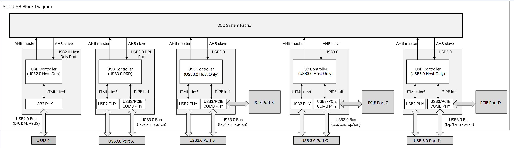
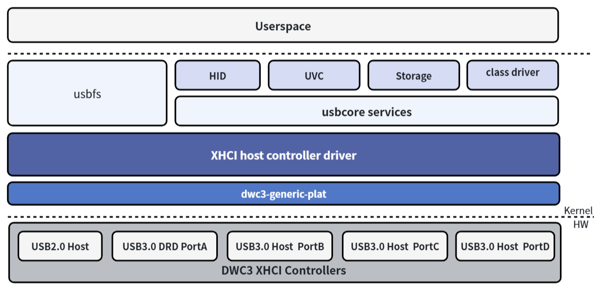
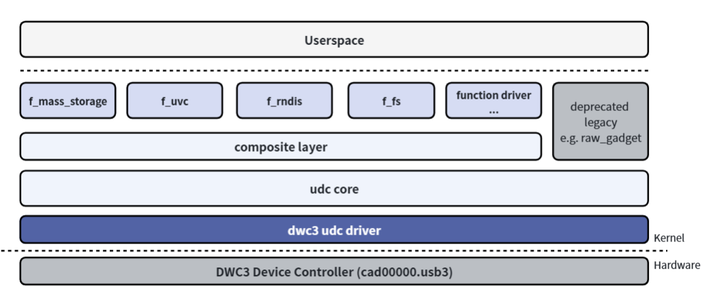
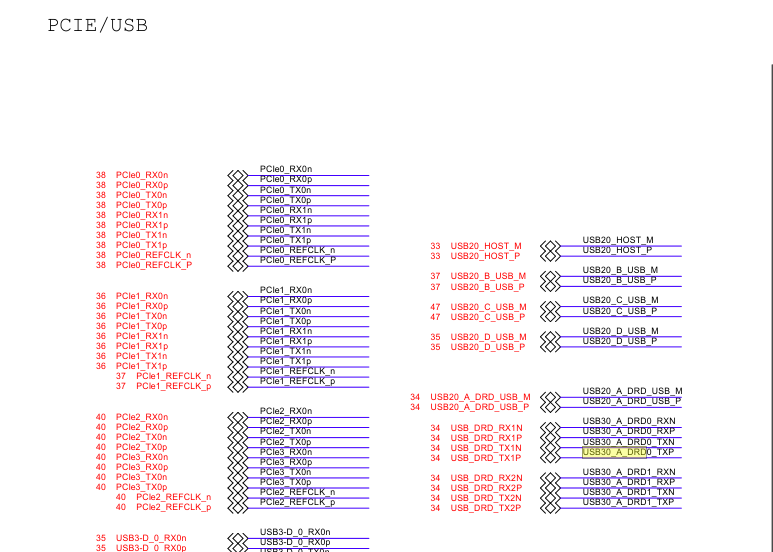
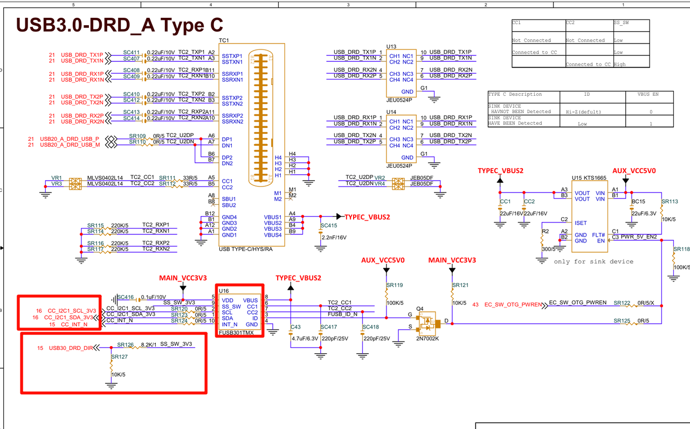
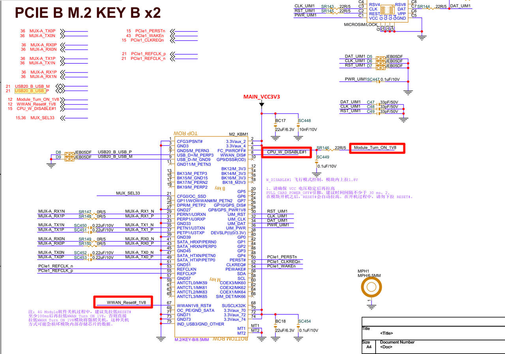

sidebar_position: 1

# USB General Developer Guide

This document describes the functionality, hardware adaptation, software configuration, debugging, and common analysis approaches for K3 USB.

Applicable for: SpacemiT Linux 6.18

## Quick Start

For board-level customization, it is recommended to adapt and validate USB according to the following workflow:

1. Review the schematic to determine which interfaces or on-board devices each of the five USB controllers is connected to.
2. Confirm whether the USB 3.0 PHY of `usb3_portb/c/d` is multiplexed with PCIe.
3. Write the DTS according to port usage: select Host, Device, OTG, or High-Speed Only configuration.
4. Check whether the corresponding PHY, DWC3, XHCI, and peripheral drivers are enabled in the Linux kernel configuration.
5. Flash and boot the system, then check the controller initialization logs and device enumeration logs.
6. Confirm the topology using tools such as `lsusb`, `/sys/kernel/debug/usb/devices`, and `k3_lsusb`.
7. Complete functional verification and performance testing according to the device type.

The corresponding sections are:

1. Review the schematic and confirm controller connections → [Solution Adaptation Description](#solution-adaption-description)
2. Write DTS → [Software Configuration](#software-configuration) / [DTS Configuration](#dts-configuration)
3. Check kernel CONFIG → [Software Configuration](#software-configuration) / [Kernel CONFIG Configuration](#kernel-config-configuration)
4. Check boot logs and enumeration logs → [Debugging and Testing](#debugging--testing) / [Log Analysis](#log-analysis)
5. Functional and performance verification → [Debugging and Testing](#debugging--testing)

## Overview

K3 USB controllers:



- USB2.0 Host (device tree node `usb2_host`)
- USB3.0 DRD PortA (device tree node `usb3_porta`) - flashing port
- USB3.0 Host PortB (device tree node `usb3_portb`)
- USB3.0 Host PortC (device tree node `usb3_portc`)
- USB3.0 Host PortD (device tree node `usb3_portd`)

The USB3.0 PHYs for USB3.0 Port B/C/D (device tree nodes `usb3_portb_u3phy`, `usb3_portc_u3phy`, and `usb3_portd_u3phy`) are multiplexed with PCIe PHY2/PHY3/PHY4 (device tree nodes `phy2`, `phy3`, and `phy4`). Board-level design must take the actual connections into account during configuration.

### Linux Software Architecture

#### USB Host



The Linux USB host-side driver framework includes three layers:

- **USB Host Controller Driver:** This is the USB controller driver layer, responsible for initializing the controller and performing low-level data transmission and reception operations.
- **USB Core Services:** This is the core layer, responsible for abstracting the USB hierarchy and URB-based transfers, and providing interfaces for upper and lower layers.
- **USB Class Driver:** This is the USB device functionality layer, responsible for implementing USB device drivers, USB function drivers, and interfacing with other kernel frameworks (such as HID, UVC, Storage, etc.).

#### USB Device



The USB device-side driver framework can be divided into the following layers:

- **USB Device Controller Driver:** This is the USB device-role controller driver layer, responsible for initializing the controller and performing low-level data transmission and reception operations.
- **UDC Core:** This is the core layer, responsible for abstracting the USB device hierarchy and `usb-request`-based transfers, and for providing interfaces to upper and lower layers.
- **Composite:** Used to combine multiple USB device functions into a single device, supporting configuration from user space through configfs or hard-coded combinations of functions in legacy drivers.
- **Function Driver:** This is the USB Device functionality layer, responsible for implementing the functional drivers for USB Device mode, and interfacing with other kernel frameworks (such as storage, V4L2, networking, etc.).

Together, these layers form the Linux USB subsystem framework, which is responsible for device enumeration, data transfer, and function driver integration.

### Source Code Structure

K3 USB-related code is located in the PHY, DWC3, and XHCI subsystems:

```text
drivers/phy/spacemit/
|-- phy-k1-usb2.c          # USB2.0 PHY driver
|-- phy-k3-usb3.c          # USB3.0 SuperSpeed PHY driver

drivers/usb/host/
|-- xhci*                  # XHCI Host driver

drivers/usb/dwc3/
|-- core.c                 # DWC3 core driver
|-- gadget.c               # DWC3 gadget mode core driver
|-- dwc3-generic-plat.c    # DWC3 platform driver, used in conjunction with DWC3/XHCI drivers
|-- ...
```

All USB controllers on K3 use DWC3 IP. The USB2.0 Host Only controller supports USB2.0 mode only at the hardware level.

Other component code paths are as follows:

```
drivers/usb/misc/
        |-- onboard_usb_device.c # Driver for auxiliary control of on-board USB devices
```

`onboard_usb_device` is a generic Linux kernel driver for auxiliary power-on and reset management of fixed on-board USB devices. It is suitable for describing soldered-on USB devices such as USB hubs, cameras, BT/Wi-Fi modules, and 4G modules, and for controlling their power supplies, clocks, resets, and sleep behavior before enumeration.

## Key Features

### USB2.0 Host

#### Features

| Feature | Description |
| :-----| :----|
| Supported Speeds | High-Speed (480Mbps), Full-Speed (12Mbps) and Low-Speed (1.5Mbps) |
| Transfer Channels | Supports up to 16 channels for simultaneous transfers |
| PHY Interface | Dedicated UTMI+ PHY interface |
| Power Supply Control | Provides a reserved VBUS DRV pin to control the external VBUS power supply |
| Sleep Wake-up | A system wake-up source (remote wake-up) |

### USB3.0 DRD Port A

#### Features

| Feature | Description |
| :-----| :----|
| Supported Modes | Host mode and Device mode (DRD). Low-Speed is supported in Host mode only. |
| Supported Speeds | Supports SuperSpeed (5Gbps), High-Speed (480Mbps), Full-Speed (12Mbps) and Low-Speed (1.5Mbps) |
| Supported Endpoints | Supports up to 32 device endpoints with dynamic allocation |
| PHY Interface | Dedicated USB2.0 UTMI+ PHY interface (supports USB2.0-only mode); dedicated dual USB3.0 SuperSpeed PIPE3 PHY interface with a built-in Type-C orientation switch (configurable via optional hardware GPIO or software) |
| Power & Detection | Provides a reserved VBUS DRV pin to control the external VBUS power supply; supports Type-C CC logic chip sideband pins; supports VBUS ON pin detection of attach/detach events in Device mode |
| Low-Power Feature | Supports USB2.0 Suspend, USB3.0 U1, U2, U3 |
| Sleep Wake-up | A system wake-up source (remote wake-up) |

### USB3.0 Host Port B/C/D

#### Features

| Feature | Description |
| :-----| :----|
| Supported Mode | Host mode |
| Supported Speeds | Supports SuperSpeed (5Gbps), High-Speed (480Mbps), Full-Speed (12Mbps) and Low-Speed (1.5Mbps) |
| PHY Interface | Dedicated UTMI+ PHY interface (supports USB2.0-only mode); shares a USB3.0 SuperSpeed/PCIe combo PHY (selects between USB3 and PCIe interfaces) |
| Power Control | Provides a reserved VBUS DRV pin to control the external VBUS power supply |
| Low-Power Feature | Supports USB2.0 Suspend, USB3.0 U1, U2, U3 |
| Sleep Wake-up | A system wake-up source (remote wake-up) |

## Software Configuration

This section covers **kernel configuration** and **DTS configuration**.

### Kernel CONFIG Configuration

In the Buildroot SDK, the Linux kernel can be configured via `make linux-menuconfig`.

After configuration, the settings can be saved by running `make linux-update-defconfig`. Refer to the relevant documentation for details.

If you do not need to customize the kernel and will use the SpacemiT SDK directly, please skip this section and proceed to [DTS Configuration](#dts-configuration).

#### USB Host/DRD Driver Kernel Configuration Enablement

`CONFIG_PHY_SPACEMIT_USB2` provides support for the USB2.0 PHY and defaults to `Y`.
`CONFIG_PHY_SPACEMIT_USB3` provides support for the USB3.0 PHY and defaults to `Y`.

```
  Device Drivers
        -> PHY Subsystem
                -> SpacemiT K1 USB 2.0 PHY support (PHY_SPACEMIT_K1_USB2 [=y])
                -> SpacemiT K3 USB 3.0 PHY support (PHY_SPACEMIT_K3_USB3 [=y])
```

`CONFIG_USB_XHCI_HCD` provides XHCI host support for K3 USB host functionality and defaults to `Y`.

```
Device Drivers
         -> USB support (USB_SUPPORT [=y])
                -> xHCI HCD (USB 3.0) support (USB_XHCI_HCD [=y])
```

`CONFIG_USB_XHCI_PLATFORM` provides support for the platform XHCI controller and defaults to `Y`.

```
Device Drivers
-> USB support (USB_SUPPORT [=y])
    -> xHCI HCD (USB 3.0) support (USB_XHCI_HCD [=y])
          -> Generic xHCI driver for a platform device (USB_XHCI_PLATFORM [=y])
```

#### DWC3 DRD/Host Driver Kernel Configuration Enablement

`CONFIG_PHY_SPACEMIT_USB2` provides support for the USB2.0 PHY and defaults to `Y`.
`CONFIG_PHY_SPACEMIT_USB3` provides support for the USB3.0 PHY and defaults to `Y`.

```
  Device Drivers
        -> PHY Subsystem
                -> SpacemiT K1 USB 2.0 PHY support (PHY_SPACEMIT_K1_USB2 [=y])
                -> SpacemiT K3 USB 3.0 PHY support (PHY_SPACEMIT_K3_USB3 [=y])
```

`CONFIG_USB_DWC3_GENERIC_PLAT` provides support for the SpacemiT DWC3 controller driver and defaults to `Y`.

```
Device Drivers
         -> USB support (USB_SUPPORT [=y])
           -> DesignWare USB3.0 DRD Core Support (USB_DWC3 [=y])
             -> DWC3 Generic Platform Driver (USB_DWC3_GENERIC_PLAT [=y])
```

`CONFIG_USB_DWC3_DUAL_ROLE` provides dual-role support for the DWC3 controller and defaults to `Y`. The actual role is configured in the device tree, or it can be configured as Host Only or Device Only mode.

```
Device Drivers
         -> USB support (USB_SUPPORT [=y])
           -> DesignWare USB3.0 DRD Core Support (USB_DWC3 [=y])
            -> DWC3 Mode Selection (<choice> [=y])
             -> Dual Role mode (USB_DWC3_DUAL_ROLE [=y])
```

#### Other Common USB CONFIG Options

`CONFIG_USB` provides support for the USB bus protocol and defaults to `Y`.

```
Device Drivers
         -> USB support (USB_SUPPORT [=y])
```

Configuration options for peripheral devices such as USB storage devices, USB network adapters, and USB printers must also be enabled. Commonly used options are enabled by default, so they are not listed here.

Most USB drivers are located under the `USB support` menu in kernel menuconfig:

```
Location: 
-> Device Drivers
  -> USB support (USB [=y])
    -> USB_XX...
```

Other drivers are located in different menus. For example, the USB sound card is located in:

```text
Location:
-> Device Drivers
        -> Sound card support (SOUND [=y])
                -> Advanced Linux Sound Architecture (SND)
                        -> USB sound devices (SND_USB [=y])
```

If a USB peripheral device is not loaded automatically after it is plugged in, follow these steps:

First, compare against a Linux PC: connect the same USB peripheral device to the PC, and compare the `/sys/kernel/debug/usb/devices` output between the SpacemiT platform and the Linux PC. Locate the corresponding device (by Bus, Dev#, and etc.) and confirm which driver it is bound to:

```
T:  Bus=03 Lev=01 Prnt=01 Port=09 Cnt=03 Dev#=  3 Spd=12   MxCh= 0
D:  Ver= 2.01 Cls=e0(wlcon) Sub=01 Prot=01 MxPS=64 #Cfgs=  1
P:  Vendor=1a86 ProdID=55d3 Rev= 0.00
C:* #Ifs= 2 Cfg#= 1 Atr=e0 MxPwr=100mA
I:* If#= 0 Alt= 0 #EPs= 3 Sub=01 Prot=01 Driver=(none)
E:  Ad=81(I) Atr=03(Int.) MxPS=  64 Ivl=1ms
E:  Ad=02(O) Atr=02(Bulk) MxPS=  64 Ivl=0ms
E:  Ad=82(I) Atr=02(Bulk) MxPS=  64 Ivl=0ms
```

In the output, locate the corresponding line starting with `I:` and check the `Driver=` field.
If it shows `Driver=(none)`, no driver is currently loaded. If the same device shows `Driver=xxx` on a Linux PC, it means the PC kernel has the corresponding driver enabled, but the SpacemiT kernel does not. You can locate the driver source code by searching the kernel source for the string after `Driver=`.
For example, for `usbhid`, search under the driver directory in the kernel code to find the corresponding `usb_driver` structure:

```c
// src: drivers/hid/usbhid/hid-core.c
struct usb_driver hid_driver = { name = "usbhid", ...};
```

Then find the `CONFIG_USB_HID` entry corresponding to this `.c` file in the Makefile, check the relevant help text in menuconfig, and enable it if the description matches your requirements:

```
linux-6.6$ grep -rn "usbhid" --include="Makefile"
drivers/hid/Makefile:161:obj-$(CONFIG_USB_HID)          += usbhid/
drivers/hid/Makefile:162:obj-$(CONFIG_USB_MOUSE)                += usbhid/
drivers/hid/Makefile:163:obj-$(CONFIG_USB_KBD)          += usbhid/
drivers/hid/usbhid/Makefile:6:usbhid-y  := hid-core.o
drivers/hid/usbhid/Makefile:7:usbhid-$(CONFIG_USB_HIDDEV)       += hiddev.o
drivers/hid/usbhid/Makefile:8:usbhid-$(CONFIG_HID_PID)  += hid-pidff.o
drivers/hid/usbhid/Makefile:10:obj-$(CONFIG_USB_HID)            += usbhid.o
```

You can also use tools like linux-hardware.org to query the required CONFIG options for USB peripherals based on their PID, VID, interface class, etc.

If both the SpacemiT platform and the Linux PC show `Driver=usbfs`, the device primarily relies on user-space drivers. If it does not work on the SpacemiT platform, further checks are needed to determine whether manufacturer-provided scripts, binary services, or `udev` rules are missing.

`CONFIG_USB_ROLE_SWITCH` provides support for role-switch-based mode switching, for example in Type-C OTG use cases:

```
Device Drivers
       -> USB support (USB_SUPPORT [=y])
           -> USB Role Switch Support (USB_ROLE_SWITCH [=y])
```

`CONFIG_USB_GADGET` provides support for USB Device mode, and is enabled by default (`Y`).

```
Device Drivers
         -> USB support (USB_SUPPORT [=y])
           -> USB Gadget Support (USB_GADGET [=y])
```

Under `CONFIG_USB_GADGET`, you can optionally enable functions configurable through configfs, such as RNDIS. Configure these according to actual requirements; common options are enabled by default.

```
Device Drivers
         -> USB support (USB_SUPPORT [=y])
           -> USB Gadget Support (USB_GADGET [=y])
             -> USB Gadget functions configurable through configfs (USB_CONFIGFS [=y])
               -> RNDIS (USB_CONFIGFS_RNDIS [=y])
               -> Function filesystem (FunctionFS) (USB_CONFIGFS_F_FS [=y])
               -> USB Webcam function (USB_CONFIGFS_F_UVC [=y])
               -> ....
```

Avoid enabling options under the `USB Gadget precomposed configurations` menu. These options cause the kernel to automatically create corresponding USB gadget configurations at system startup, which may conflict with default system scripts, ADB, or user-defined configfs-based configurations. Do not enable them unless there is a clear requirement.

```
-> Device Drivers
  -> USB support (USB_SUPPORT)
    -> USB Gadget Support (USB_GADGET)
      -> USB Gadget precomposed configurations
        -> Mass Storage Gadget (USB_MASS_STORAGE [=n])
        -> ...
```

### DTS Configuration

#### DTS Configuration Decision Flow

When adapting USB DTS for a new board, follow this flow to determine the configuration for each controller:

```text
Is this controller used?
  ├─ No → Keep disabled
  └─ Yes → Is the USB3.0 PHY occupied by PCIe?
          ├─ Yes → High-Speed Only configuration
          └─ No → Full DTS configuration
         → Is OTG/role switch supported or required?
          ├─ Yes → OTG Configuration (including Type-C detector/role-switch)
          └─ No → Select Host Only or Device Only configuration according to usage
```

#### USB2.0 Host DTS Configuration

The corresponding pins for the USB2.0 host controller port are usually marked as USB2_DP and USB2_DN in the schematic.

When the USB2.0 Host operates in Host Only mode, configure it via DTS:

1. Enable the `usb2_host_u2phy` node.
2. Enable the `usb2_host` node.
3. If the host requires GPIO control for the VBUS switch or power control for on-board USB devices, configure it with auxiliary board-level nodes such as `regulator-fixed` and `onboard_usb_device`.
4. The optional `reset-on-resume` attribute controls whether to reset the controller after system wakeup from sleep. Enabling this attribute by default helps reduce sleep power consumption.
5. The optional `wakeup-source` property specifies whether the USB device can act as a wake-up source. When the device is in a low-power state, enabling this option allows device activity to wake the system. This option is mutually exclusive with `reset-on-resume`: if `wakeup-source` is enabled, `reset-on-resume` cannot be enabled at the same time, and vice versa.
6. If the port is connected to M.2 Bluetooth, 4G/WWAN, or other devices, and the main requirement is to control power-on, power-off, reset, and other sideband GPIOs, prefer to reuse the existing `rfkill-gpio` kernel driver.

Board DTS configuration:

```c
&usb2_host_u2phy {
        status = "okay";
};

&usb2_host {
        reset-on-resume;
        status = "okay";
};
```

#### USB3.0 DRD (Port A) DTS Configuration

The pins for the USB3.0 Port A controller are typically labeled `USB20_A_DRD_USB_M/P` and `USB30_A_DRD_*` in the schematic. This port is commonly used as the K3 firmware download (flashing) port.

USB3.0 Port A supports DRD (Dual-Role Device) functionality and can be configured in Host, Device, or OTG mode.

##### Operating in Device Only Mode

To work in Device mode, configure the DTS as follows:

1. Enable the `usb3_porta_u2phy` node.
2. Enable the `usb3_porta_u3phy` node (required even if only USB2.0 speed is needed).
3. Enable the `usb3_porta` node and configure `dr_mode = "peripheral"` (`peripheral` means Device mode).
4. The optional `reset-on-resume` property controls whether the controller is reset after the system wakes from sleep. Enabling it minimizes sleep power consumption and is recommended as the default configuration for Device Only mode.
5. The optional `maximum-speed = "high-speed"` property limits the maximum negotiated speed to USB2.0 High-Speed (480 Mbps). If it is not configured, the port defaults to USB3.0 SuperSpeed (5 Gbps). For Port A, limiting operation to USB2.0 High-Speed (480 Mbps) still requires enabling `usb3_porta_u3phy`.

Board DTS configuration:

```c
&usb3_porta_u2phy {
        status = "okay";
};

&usb3_porta_u3phy {
        status = "okay";
};

&usb3_porta {
        dr_mode = "peripheral";
        reset-on-resume;
        /* maximum-speed = "high-speed"; */
        status = "okay";
};
```

Unlike Port B/C/D, limiting Port A to USB2.0 mode only requires configuring the `maximum-speed = "high-speed"` property in `usb3_porta`.

##### Operating in Host Only Mode

To operate in Host mode, configure the DTS as follows:

1. Enable the `usb3_porta_u2phy` node.
2. Enable the `usb3_porta_u3phy` node.
3. Enable the `usb3_porta` node, and configure `dr_mode = "host"`.
4. The optional `maximum-speed = "high-speed"` property limits the maximum negotiated speed to USB2.0 High-Speed (480 Mbps). If it is not set, the port defaults to USB3.0 SuperSpeed (5 Gbps). For Port A, limiting operation to USB2.0 High-Speed (480 Mbps) still requires enabling `usb3_porta_u3phy`.
5. The optional `reset-on-resume` property controls whether the controller is reset after the system wakes from sleep. Enabling it reduces sleep power consumption; if it is not enabled, the device connection state is preserved. See [USB Sleep-Wakeup Configuration](#usb-sleep-wakeup-configuration) for details.
6. See [USB Sleep-Wakeup Configuration](#usb-sleep-wakeup-configuration) for optional attribute `wakeup-source`.

```c
&usb3_porta_u2phy {
        status = "okay";
};

&usb3_porta_u3phy {
        status = "okay";
};

&usb3_porta {
        dr_mode = "host";
        reset-on-resume;
        /* maximum-speed = "high-speed"; */
        status = "okay";
};
```

Unlike Port B/C/D, limiting Port A to USB2.0 requires only the `maximum-speed = "high-speed"` property in `usb3_porta`.

##### Operating in OTG Mode (Based on `usb-role-switch`)

This configuration mode is suitable for most boards, supporting optional implementations such as Type-C role detection, GPIO role detection, or manual user switching.

1. Configure the `usb-role-switch` property in `usb3_porta` to enable role-switch support. The K3 DEB1 board uses the FUSB301 Type-C chip for role detection.
2. Configure the `dr_mode` property as `otg`.
3. The `role-switch-default-mode` property determines the default role after power-on. Options: `host` (Host mode) or `peripheral` (Device mode).
4. The optional `maximum-speed = "high-speed"` property limits the maximum speed to USB2.0 High-Speed (480 Mbps). If it is not set, the port defaults to USB3.0 SuperSpeed (5 Gbps). For Port A, limiting operation to USB2.0 High-Speed (480 Mbps) still requires enabling `usb3_porta_u3phy`.
5. The optional `reset-on-resume` property controls whether the controller is reset after the system wakes from sleep. Enabling it reduces sleep power consumption; if it is not enabled, the device connection state is preserved. See [USB Sleep-Wakeup Configuration](#usb-sleep-wakeup-configuration) for details.
6. See [USB Sleep Wakeup Configuration](#usb-sleep-wakeup-configuration) for optional attribute `wakeup-source`.

Configuration example (referencing k3_deb1.dts):

```c
&usb3_porta_u2phy {
        status = "okay";
};

&usb3_porta_u3phy {
        pinctrl-names = "default";
        pinctrl-0 = <&usb30_drd_dir_0_cfg>;
        status = "okay";
};

&usb3_porta {
        dr_mode = "otg";
        usb-role-switch;
        role-switch-default-mode = "peripheral";
        monitor-vbus;
        status = "okay";

        ports {
                #address-cells = <1>;
                #size-cells = <0>;
                port@0 {
                        reg = <0x0>;
                        porta_role_switch: endpoint {
                                remote-endpoint = <&fusb301_ep>;
                        };
                };
        };
};

/* FUSB301 Type-C chip configuration (under the i2c node) */
&i2c1 {
        pinctrl-names = "default";
        pinctrl-0 = <&i2c1_3_cfg>;
        status = "okay";

        tcpc@25 {
                compatible = "onsemi,fusb301";
                reg = <0x25>;
                pinctrl-names = "default";
                pinctrl-0 = <&fusb301_cfg>;
                irq-gpios = <&gpio 2 21 GPIO_ACTIVE_LOW>;
                wakeup-source;
                status = "okay";

                typec_0: connector@0 {
                        compatible = "usb-c-connector";
                        label = "USB-C";
                        data-role = "dual";
                        power-role = "dual";
                        try-power-role = "sink";
                        typec-power-opmode = "default";
                        pd-disable;

                        ports {
                                #address-cells = <0x1>;
                                #size-cells = <0x0>;

                                port@0 {
                                        reg = <0x0>;
                                        fusb301_ep: endpoint {
                                                remote-endpoint = <&porta_role_switch>;
                                        };
                                };
                        };
                };
        };
};
```

- `usb-role-switch` indicates that the data role of this port is managed by the role-switch framework.
- `role-switch-default-mode` specifies the default role before a peer device is detected.
- `monitor-vbus` is a mandatory configuration when SuperSpeed is used with an external Type-C chip that can report attach/detach status. Without it, attach/detach events that involve switching between different speeds (USB3.0 SuperSpeed → USB2.0 → USB3.0 SuperSpeed) will not work properly.

#### USB3.0 Host (Port B/C/D) DTS Configuration

There are three USB3.0 host controllers (Port B, Port C, and Port D) on the K3 platform. The USB2.0 signals for Port B/Port C/Port D correspond to `USB20_B/C/D_USB_M/P`, respectively, and the USB3.0 SuperSpeed signals correspond to `USB30_B/C/D_*`.

The USB3.0 PHY for Port B/Port C/Port D is shared with PCIe. When the corresponding PHY is allocated to PCIe at the board level, the USB port can operate only in High-Speed Only mode.

##### Standard USB3.0 Host Configuration

If the corresponding PHY is not used by PCIe, it can be configured as a full-featured USB3.0 host:

```c
&usb3_portb_u2phy {
        status = "okay";
};

&usb3_portb_u3phy {
        status = "okay";
};

&usb3_portb {
        reset-on-resume;
        status = "okay";
};
```

The optional `reset-on-resume` property of the `usb3_portb/c/d` node controls whether to reset the controller after the system wakes from sleep. Enabling it reduces sleep power consumption; if it is not enabled, the device connection state is preserved. See [USB Sleep-Wakeup Configuration](#usb-sleep-wakeup-configuration) for details.

The optional `wakeup-source` property for the `usb3_portb/c/d` nodes is described in [USB Sleep-Wakeup Configuration](#usb-sleep-wakeup-configuration).

##### High-Speed Only Configuration (PCIe Uses SuperSpeed PHY)

When PCIe uses the shared PHY of this port, the USB port must be configured in High-Speed Only mode:

```c
&usb3_portb_u2phy {
        status = "okay";
};

/* Disable USB3.0 PHY */
&usb3_portb_u3phy {
        status = "disabled";
};

&usb3_portb {
        /* First delete the dual-PHY references predefined in the SoC DTSI, then reconfigure the node to use only the USB2.0 PHY */
        /delete-property/ phys;
        /delete-property/ phy-names;
        maximum-speed = "high-speed";
        phys = <&usb3_portb_u2phy>;
        phy-names = "usb2-phy";
        reset-on-resume;
        status = "okay";
};
```

The reason for explicitly using `/delete-property/ phys;` and `/delete-property/ phy-names;` is that the K3 SoC-level DTSI predefines both USB2 and USB3 references for the USB3.0 host node. When switching to High-Speed Only mode, you must first delete the inherited dual-PHY configuration, then rewrite `phys` and `phy-names` to include only `usb2-phy`. Otherwise, the invalid USB3 PHY reference remains, causing the driver to fail when it tries to initialize the SuperSpeed PHY that has been allocated to PCIe.

#### Common USB DTS Configuration

##### USB PHY Configuration Description

Common ways to enable the K3 USB PHY are as follows:

- `usb2_host`: Involves only the USB2 PHY. Only `usb2_host_u2phy` needs to be enabled.
- `usb3_porta`: If the port operates in USB3.0 Host, Device, or OTG mode, enable both `usb3_port*_u2phy` and `usb3_port*_u3phy`.
- `usb3_portb/c/d`: If full USB3.0 capability is required, enable both `usb3_port*_u2phy` and `usb3_port*_u3phy`. If the USB3 PHY is multiplexed for PCIe, enable only `usb3_port*_u2phy`, disable `usb3_port*_u3phy`, and configure the controller in High-Speed Only mode.

It is recommended to review the schematics first to confirm whether each port actually has USB3 SuperSpeed differential pairs routed out, and whether the corresponding PHY is occupied by PCIe, before deciding whether to keep `u3phy`.

Port C and Port D are configured in the same way; simply replace the node name with `usb3_portc` or `usb3_portd`. If Port D in your board design is a full Type-C/USB3.0 port, enable both `u2phy` and `u3phy`, and there is no need to set `maximum-speed = "high-speed"`.

##### USB Sleep-Wakeup Configuration

K3 USB supports two system sleep strategies:

- Reset Resume strategy, which provides the lowest USB power consumption
- No Reset Resume strategy
  - Enable wake-up support
  - Disable wake-up support

To enable the Reset Resume strategy, set the `reset-on-resume` property in the corresponding USB controller node. When enabled, sleep power consumption is lower, but downstream USB devices undergo a disconnect/reconnect sequence after wake-up, which may increase wake-up time. For most devices, this reconnection is transparent to the application layer. If it is not enabled, the device connection state is preserved, but sleep power consumption increases.

To support USB Remote Wakeup (such as wakeup via keyboard/mouse/network):

- Disable `reset-on-resume` on the USB node (do not set it)
- And enable the `wakeup-source` property

```c
&usb3_porta {
        /*reset-on-resume;*/
        wakeup-source;
        .... other parameters omitted, refer to previous configurations
};
```

If a fixed on-board USB device connected to the USB port must remain powered during sleep, configure the corresponding power supply node or on-board device node to keep power enabled during sleep. This prevents the device from disconnecting and reconnecting because of power loss during sleep.

Mouse and keyboard wake-up is relatively straightforward. For detailed steps on debugging USB network adapter WOL (Wake on LAN) wake-up, refer to [Appendix E: USB Network Adapter WOL (Wake on LAN) Wakeup Debugging](#appendix-e-usb-network-adapter-wol-wake-on-lan-wakeup-debugging).

##### USB Peripheral Device Power Supply and Board-Level Auxiliary Control

Fixed on-board USB devices require additional auxiliary nodes for power supply, reset, and enable control:

- Use `regulator-fixed` to control VBUS or on-board fixed USB device power supply;
- Use board-level auxiliary control nodes such as `onboard_usb_device` to handle reset, power-on sequencing, direction control, and other board-level logic.

Typical scenarios where `onboard_usb_device` is applicable:

- Fixed on-board USB hubs that require separate control of reset pins, power pins, or reference clocks;
- Fixed on-board USB devices that must be powered on before reset is released for enumeration;
- Cases where the device must remain powered during system sleep depending on remote wake-up capability

It is necessary to distinguish:

- **USB Topology Description:** Use generic USB hub binding under the USB controller, such as `hub@N`, `peer-hub`, and `ports/port@N`.
- **Board-Level Auxiliary Control:** Use nodes such as `regulator-fixed` and `onboard_usb_device` to describe power supplies, resets, clocks, and sleep strategies.

For devices such as Bluetooth and 4G/WWAN, prefer `rfkill-gpio` if only basic GPIO power control, reset, and radio-disable control are required. Use `onboard_usb_device` only when more complex board-level power management, sequencing control, or sleep retention is required. Each device requires USB VID, PID, and power management information to be added to the `onboard_usb_device` driver; supporting new USB devices requires code changes.

According to the driver implementation, it acquires regulators, optional clocks, and reset GPIOs during probe. During suspend and resume, it decides whether to power off the device based on the device itself and the remote wake-up status of downstream devices. For paired USB2/USB3 hubs with `peer-hub`, the driver also finds the corresponding platform device through the peer node to manage the power state of the fixed USB hub consistently.

##### USB Hub Child node Configuration

Fixed USB hubs soldered onto the board should be described directly under the corresponding USB controller node according to the generic USB hub binding in the kernel.

Common properties:

- `compatible`: VID/PID-format compatible string for the USB hub, such as `"usb2109,2817"`
- `reg`: Upstream port number where the hub is located
- `peer-hub`: Pairing relationship between the USB2.0 hub and the USB3.0 hub
- `reset-gpio`: Hub reset GPIO, if the hardware design still controls reset through software

Please refer to the generic dt-binding documentation in the Linux kernel for more complete property definitions:

- `Documentation/devicetree/bindings/usb/usb-hub.yaml`

The following example shows a VL817 hub connected to `usb3_portb` on the K3 CoM260. The VL817 hub device IDs are VID `0x2109`, PID `0x0817`, and PID `0x2817`:

```dts
&usb3_portb {
        status = "okay";
        #address-cells = <1>;
        #size-cells = <0>;
        reset-on-resume;

        /* VL817 USB2.0 hub (4 ports) */
        hub_2_0: hub@1 {
                compatible = "usb2109,2817";
                reg = <1>;
                peer-hub = <&hub_3_0>;
                reset-gpio = <&gpio 1 21 GPIO_ACTIVE_LOW>;
        };

        /* VL817 USB3.0 hub (4 ports) */
        hub_3_0: hub@2 {
                compatible = "usb2109,817";
                reg = <2>;
                peer-hub = <&hub_2_0>;
                reset-gpio = <&gpio 1 21 GPIO_ACTIVE_LOW>;
        };
};
```

For fixed hubs that need to be used with `onboard_usb_device`, you should still fill in the hub VID/PID according to the actual enumeration results. The platform node can establish an association with the actual USB device only after the corresponding device is supported by the driver's internal matching table.

During actual debugging, you can first boot the system and configure the required GPIOs through `/sys/class/gpio/export` or gpiolib interfaces so that the on-board hub can be enumerated. Then confirm the corresponding hub VID/PID using `cat /sys/kernel/debug/usb/devices`, `k3_lsusb`, or `lsusb` before finalizing the DTS.

If a downstream port connects to a fixed device or connector, you can continue to add child nodes such as `device@N` or `ports/port@N` under the `hub@N` node. For the specific syntax, refer to the Linux document `usb-hub.yaml`, so that the device tree fragments can be passed to the peripheral driver.

If the hub has GPIO or regulator power dependencies, the corresponding regulator references must be added:

```c

/{
        vcc_5v: regulator-usbhub {
                compatible = "regulator-fixed";
                regulator-name = "usbhub";
                regulator-min-microvolt = <5000000>;
                regulator-max-microvolt = <5000000>;
                gpio = <&gpio 1 12 GPIO_ACTIVE_HIGH>;
                enable-active-high;
        };
}/

&usb3_portb {
        hub_3_0: hub@2 {
                compatible = "usb2109,817";
                reg = <2>;
                peer-hub = <&hub_2_0>;
                reset-gpio = <&gpio 1 21 GPIO_ACTIVE_LOW>;
                vdd-supply = <&vcc_5v>;
        };
};
```

If the root HUB of a USB port is an external connector and VBUS power is controlled by GPIO, it is recommended to configure the corresponding GPIO as `regulator-fixed` and enable regulator-always-on:

```c
usb2_host_vbus: regulator-vbus {
        compatible = "regulator-fixed";
        regulator-name = "usb2_host_vbus";
        regulator-min-microvolt = <5000000>;
        regulator-max-microvolt = <5000000>;
        gpio = <&gpio 1 11 GPIO_ACTIVE_HIGH>;
        regulator-always-on;
        enable-active-high;
};
```

#### Solution Adaptation Description

This chapter uses the K3 DEB1/Pico-ITX board (corresponding to `k3_deb1.dts` in the Buildroot source tree) as an example to explain how to adapt the software to a new hardware design.

##### 1. Confirm the Correspondence Relationship between Controllers and Schematic Nets

When performing USB board-level adaptation, first review the schematic:

1. Confirm how each controller is used;
2. Confirm the peripheral control logic.

The correspondence between the K3 USB controllers and schematic pin nets is as follows:

| Controller | DTS Node Name | Schematic Pin Net Name | Description |
| :---- | :---- | :---- | :---- |
| USB2.0 Host | usb2_host | USB20_HOST_M/P | Acts as a standard USB-A interface in most designs |
| USB3.0 DRD Port A | usb3_porta | USB20_A_DRD_USB_M/P<br>USB30_A_DRD_TXN/TXP/RXN/RXP | Used as a flashing port in most designs and configured as Type-C |
| USB3.0 Host PortB | usb3_portb | USB20_B_USB_M/P<br>USB30_B_TXN/TXP/RXN/RXP | PHY shared with PCIe |
| USB3.0 Host PortC | usb3_portc | USB20_C_USB_M/P<br>USB30_C_TXN/TXP/RXN/RXP | PHY shared with PCIe |
| USB3.0 Host PortD | usb3_portd | USB20_D_USB_M/P<br>USB30_D_TXN/TXP/RXN/RXP | PHY shared with PCIe |

**Note.** USB3.0 Port B/C/D shares the USB3.0 PHY with PCIe. If the corresponding USB3.0 PHY is allocated to PCIe in the board-level design, the USB controller can operate only in USB2.0 mode. In this case, configure `maximum-speed = "high-speed"` in the DTS and use `/delete-property/` to reconfigure the PHY-related properties.

##### 2. Confirm Controller Enablement via Block Diagram

First, check the block diagram or interface overview page to confirm which peripheral devices or connectors each USB controller is ultimately connected to.


By examining the block diagram clockwise, the USB interface configuration of the DEB1 is as follows:

- **USB_A DRD** corresponds to the `USB3.0 DRD PortA` controller (flashing port), so it must be enabled. It is connected to an external Type-C interface with an FUSB301 Type-C chip.
  - To-do: Confirm the GPIO configurations for the FUSB301's I2C control bus, interrupt pin (INT), and Type-C VBUS switch.
- **USB2.0_B** corresponds to the `USB3.0 Host PortB` controller. Since no USB3.0 Port B signals are routed out, `usb3_portb` must be enabled. Because it is connected to an M.2 slot and uses only USB2.0, the maximum speed must be limited to High-Speed.
  - To-do: Confirm whether the M.2 slot requires GPIO configurations such as reset, power enable, or W_DISABLE.
- **USB2.0_C** corresponds to the `USB3.0 Host PortC` controller. Since no USB3.0 Port C signals are routed out, `usb3_portc` must be enabled. It is connected to an on-board Bluetooth device, so the maximum speed must be limited to High-Speed.
  - To-do: Confirm the GPIO configurations for the Bluetooth chip's enable pin (e.g., BT_REG_ON), reset pin, or sleep wakeup pin.
- **USB2.0 HOST** corresponds to the `USB2.0 Host` controller, which must be enabled. It is connected to an external FE1.1S USB2.0 hub.
  - To-do: Confirm the control logic for the Hub's reset pin (RESET) and downstream port VBUS power switch GPIO.
- **USB3.0_D** corresponds to the `USB3.0 DRD PortD` controller, so it must be enabled. It is connected to an external Type-C interface with an ANX7447 Type-C chip.
  - To-do: Confirm the GPIO enable configurations for the ANX7447's I2C control bus, reset/interrupt pins, and related power management chips.

Some schematics are relatively concise and do not include a clear block diagram page. In such cases, you need to manually search for USB-related pin names to confirm which USB controllers should be enabled.

The following table lists all USB-related pins on the K3 platform. You can confirm whether the corresponding controller should be enabled by searching for the signal name in the K3 PCB Pin Name column of the schematic.

| IP Instance | Pin function | Description | K3 PCB Pin Name | Alternatives |
| :---- | :---- | :---- | :---- | :---- |
| USB2.0 Host Only | USB2.0 Data [I/O] | USB2.0 data transfer | USB20_HOST_M/P | NA |
| | Vbus Drive [O] | Controls the 5V VBUS power supply to the external USB port | USB20_HOST_DRV | All GPIOs |
| USB3.0 DRD | USB2.0 Data [I/O] | USB2.0 data transfer | USB20_A_DRD_USB_P/M | NA |
| | USB3.0 SuperSpeed Data [I/O] | USB3.0 5Gbps differential data transfer | USB30_A_DRD | NA |
| | Vbus Drive [O] | Controls the 5V Vbus power supply to the external USB port | All GPIOs |
| | OTG ID Pin Detect [I] | Floating input enters Device mode; low input enters Host mode | USB30_DRD_ID | GPIO17 Function 6、GPIO95 Function 3、GPIO116 Function 2 |
| | Device Vbus Detect [I] | Used in Device mode to detect attach/detach events; can be replaced by a Type-C chip | USB30_DRD_VBUSON | GPIO18 Function 6、GPIO96 Function 3、GPIO117 Function 2 |
| | Type-C Interrupt [I] | Reserved for the Type-C interrupt, used for USB attach/detach reporting, PD reporting, charging wake-up, and similar functions | USB30_DRD_INT | GPIO111、GPIO119、Other GPIOs |
| | TypeC Orientation Dir [I] | Detects plug orientation; 0 selects PHY8(0), 1 selects PHY9(1). Required when using a pure hardware, driverless Type-C chip. | USB30_DRD_DIR | GPIO86 Function 6、GPIO107 Function 4 |
| USB3.0 PortB Host Only | USB2.0 Data [I/O] | USB2.0 data transfer | USB20_B_USB_ | NA |
| | USB3.0 SuperSpeed Data [I/O] | USB3.0 5Gbps differential data transfer | USB3-B_ | NA |
| | Vbus Drive [O] | Controls the 5V Vbus power supply to the external USB port | USB30_B_DRV、USB30H-1_DRV | All GPIOs |
| USB3.0 PortC Host Only | USB2.0 Data [I/O] | USB2.0 data transfer | USB20_C_USB_ | NA |
| | USB3.0 SuperSpeed Data [I/O] | USB3.0 5Gbps differential data transfer | USB3-C_ | NA |
| | Vbus Drive [O] | Controls the 5V Vbus power supply to the external USB port | USB30_C_DRV、USB30H-2_DRV | All GPIOs |
| USB3.0 PortD Host Only | USB2.0 Data [I/O] | USB2.0 data transfer | USB20_D_USB_ | NA |
| | USB3.0 SuperSpeed Data [I/O] | USB3.0 5Gbps differential data transfer | USB3-D_ | NA |
| | Vbus Drive [O] | Controls the 5V Vbus power supply to the external USB port | USB30_D_DRV | All GPIOs |

##### 3. Peripheral GPIO Configuration and DTS Writing for Single Controller

After confirming how the controllers are used, check the additional control signals required by the connectors or on-board devices. The following sections provide examples based on several typical controllers:

###### 3.1 Example: K3 DEB1/Pico-ITX USB3.0 DRD Port A Controller

Search for `USB20_A_DRD_USB_P` or `USB30_A_DRD` in the schematic:


After identifying that the chip pins have been renamed, search for the renamed net `USB_DRD_TX1P` to find the connection page for the FUSB301.


Focus on the following points:

- The FUSB301 is connected to the I2C1 bus. These pins must be configured for the I2C function.
- The `USB30_DRD_DIR` pin requires the corresponding pinctrl and voltage domain configuration, such as `power-source = <1800>`.


Example Linux kernel DTS configuration:

```c
&i2c1 {
        pinctrl-names = "default";
        pinctrl-0 = <&i2c1_3_cfg>;
        status = "okay";

        tcpc@25 {
                compatible = "onsemi,fusb301";
                reg = <0x25>;
                pinctrl-names = "default";
                pinctrl-0 = <&fusb301_cfg>;
                irq-gpios = <&gpio 2 21 GPIO_ACTIVE_LOW>;
                wakeup-source;
                status = "okay";

                typec_0: connector@0 {
                        compatible = "usb-c-connector";
                        label = "USB-C";
                        data-role = "dual";
                        power-role = "dual";
                        try-power-role = "sink";
                        typec-power-opmode = "default";
                        pd-disable;

                        ports {
                                #address-cells = <0x1>;
                                #size-cells = <0x0>;

                                port@0 {
                                        reg = <0x0>;
                                        fusb301_ep: endpoint {
                                                remote-endpoint = <&porta_role_switch>;
                                        };
                                };
                        };
                };
        };
};
```

###### 3.2 Example: K3 DEB1/Pico-ITX USB2.0 Host Controller

Search for `USB20_HOST_M/P` in the schematic to confirm that an FE1.1S hub is connected.


Analyze the hub control logic:

- VDD and RST are provided by `AUX_VCC3V3`.
- The VBUS supply for the Type-A connector is provided by a current-limiting switch such as GS7615STDK, whose enable pin is `EC_SW_USB2_PWREN1`.
- Search for `EC_SW_USB2_PWREN1` to identify the corresponding `GPD0` GPIO on the EC chip. After startup, the EC firmware must drive the corresponding GPIO.


If this GPIO is controlled by SoC main controller, add a `regulator-fixed` node in the DTS:

```c
hub_vbus: regulator-hub-vbus-5v {
        compatible = "regulator-fixed";
        regulator-name = "HUB_VBUS_5V";
        regulator-min-microvolt = <5000000>;
        regulator-max-microvolt = <5000000>;
        vin-supply = <&vcc_5v>;
        gpio = <&gpio 0 18 GPIO_ACTIVE_HIGH>;
        regulator-always-on;
        regulator-boot-on;
        enable-active-high;
};
```

###### 3.3 Example: K3 DEB1/Pico-ITX USB3.0 Host PortB Controller

Port B is connected to an M.2 Key B slot for a 4G module. Search for `USB20_B_USB_` in the schematic to view the relevant section.

Refer to [M.2 Key B Standard](#appendix-c-common-usb-sideband-pins-in-pci-express-slots), and focus on pins such as `CPU_W_DISABLE#1`, `WWAN_Reset#_1V8`, and `Module_Turn_ON_1V8`.
Confirm the GPIO numbers as `GPIO 18` and `GPIO 19` from the GPIO assignment in the schematic or by tracing the signals directly.


The voltage domain for these GPIOs is 1.8 V. To ensure that the 4G module works properly at boot, the two GPIOs must be driven actively. Add an `rfkill-gpio` node to the Linux kernel DTS:

```c
rfkill-usb-wwan {
        compatible = "rfkill-gpio";
        label = "m.2 WWAN"; /* B-Key */
        radio-type = "wwan";
        /* MODULE_TURN_ON_1V8 (FC_PWROFF#) */
        shutdown-gpios = <&gpio 0 18 GPIO_ACTIVE_HIGH>;
        /* WWAN_RESET#_1V8 (WWAN1V8_RST#) */
        reset-gpios = <&gpio 0 19 GPIO_ACTIVE_HIGH>;
        /* GPIO84 for CPU_W_DISABLE#1 (WWAN_DIS#) is not needed */
};
```

## Debugging & Testing

### General USB Sleep-Wakeup

This chapter describes sleep and wake-up design considerations shared by all controllers.

#### Software/Hardware Power Supply Strategy

For low-power sleep scenarios, the external USB 5V VBUS supply should be disabled during sleep. If USB power is controlled by GPIO, implement the corresponding strategy through board-level power supply nodes or auxiliary nodes for on-board devices.

In the following scenarios, the 5V VBUS supply for USB, or the power supply for fixed on-board USB devices, should remain enabled during sleep:

- Support USB Remote Wakeup, such as wake-up via a USB keyboard or mouse.
- Applications that require a camera video stream to remain open during sleep, with the application-layer video stream restored after wake-up. Some cameras cannot recover correctly if power is cut during sleep.
- For devices with long power-on initialization times, such as some 4G modules that require more than 2 seconds from power-on to enumeration response, do not power them off during sleep. This avoids device disconnect and reconnect events during wake-up.
- Other scenarios requiring power retention for device compatibility or external power supply needs.

In the following scenarios, the 1.8 V power supply to the SoC USB module (`AVDD18_USB`, `AVDD18_PCIE`) must also remain enabled during sleep:

- Support USB Remote Wakeup, such as wake-up via a USB keyboard or mouse.
- When `reset-on-resume` is not enabled (refer to each controller section).

#### CONFIG Configuration

`CONFIG_PM_SLEEP` must be enabled.

#### DTS Configuration

Refer to the previous chapters for the DTS configuration of each controller.

### Log Analysis

This section analyzes kernel logs from a Linux 6.6 system running on the K3 development board.

#### Host-Side USB Core Logs

The `usbcore` module is the core USB framework driver in the kernel and prints log messages early during kernel startup.

```
[    0.439110] usbcore: registered new interface driver usbfs
[    0.444567] usbcore: registered new interface driver hub
[    0.449951] usbcore: registered new device driver usb
```

Three basic drivers are loaded here:

- `usbfs` interface driver: Corresponds to the kernel source file `drivers/usb/core/devio.c`. This driver is responsible for creating the USB filesystem, that is, the files under `/dev/usb/`.
- `hub` interface driver: Corresponds to the source file `drivers/usb/core/hub.c` and is responsible for initializing and controlling the basic functions of the USB root hub and downstream hub devices.
- `usb` device driver: Corresponds to the source file `drivers/usb/core/generic.c`. This is the generic driver that all USB devices bind to first, and it is responsible for enumerating the functional interfaces of USB peripheral devices.

If these three log lines do not appear in the boot log, the corresponding configuration options are not enabled, and the system will not support USB correctly. First check whether the kernel option `CONFIG_USB` is enabled.

#### Host-Side USB Peripheral Device Driver Log Analysis

In the system log, `grep` for logs including "new interface driver":

```
[    2.343080] usbcore: registered new interface driver cdc_ether
[    2.349026] usbcore: registered new interface driver cdc_subset
[    2.355059] usbcore: registered new interface driver zaurus
[    2.438968] usbcore: registered new interface driver uas
[    2.444404] usbcore: registered new interface driver usb-storage
[    2.695932] usbcore: registered new interface driver uvcvideo
[    2.813355] usbcore: registered new interface driver usbhid
[    3.331863] usbcore: registered new interface driver snd-usb-audio
```

Various built-in interface drivers, that is, drivers configured as `y` rather than `m` in kernel menuconfig, are registered during the middle stage of system startup.
If a configuration item is set to `m`, the corresponding log line usually appears after the kernel module is loaded. If it is loaded automatically by `udev` based on `modalias`, it often appears together with subsequent device enumeration logs.

You can locate the corresponding driver source code by searching the kernel source tree for the string following `new interface driver`.
For example, for `usbhid`, searching under the kernel `drivers` directory finds the corresponding `usb_driver` structure:

```c
// src: drivers/hid/usbhid/hid-core.c
struct usb_driver hid_driver = { name = "usbhid", ...};
```

When a device is plugged in, the kernel prints device enumeration information. The content following `using` indicates the name of the host controller driver corresponding to the current root hub.

```
[100384.721899] usb 2-1.3: new SuperSpeed USB device number 9 using xhci-hcd
[100384.721899] usb 2-1.3: new high-speed USB device number 9 using xhci-hcd
[100384.721899] usb 3-1.1: new low-speed USB device number 9 using xhci-hcd
[100384.721899] usb 2-1.3: new full-speed USB device number 9 using xhci-hcd
```

You can determine the negotiated device speed from the string between `new` and `USB device` in the log:

`SuperSpeed` indicates USB3.0 SuperSpeed (5 Gbps);
`high-speed` indicates USB2.0 High-Speed (480 Mbps);
`full-speed` indicates USB2.0/USB1.1 Full-Speed (12 Mbps);
`low-speed` indicates USB2.0/USB1.0 Low-Speed (1.5 Mbps).

If `CONFIG_USB_ANNOUNCE_NEW_DEVICES` is enabled in Linux kernel menuconfig, more information is printed when a device is plugged in, including vendor, product, and serial number strings. This allows users to identify which device corresponds to which port more easily, for example, the logs for `3-7.2.3` in the example below:

```
[281137.690357] usb 3-7.2.3: new full-speed USB device number 32 using xhci_hcd
[281137.809037] usb 3-7.2.3: New USB device found, idVendor=361c, idProduct=1001, bcdDevice= 0.01
[281137.809043] usb 3-7.2.3: New USB device strings: Mfr=1, Product=2, SerialNumber=10
[281137.809044] usb 3-7.2.3: Product: USB download gadget
[281137.809044] usb 3-7.2.3: Manufacturer: DFU
[281137.809045] usb 3-7.2.3: SerialNumber: dfu-device
```

The kernel prints logs when a device is disconnected:

```
[100386.106842] usb 2-1.3: USB disconnect, device number 9
```

The kernel prints logs when a device is reset by the host:

```
[100422.766151] usb 2-1.3: reset SuperSpeed USB device number 11 using xhci-hcd
[100422.766151] usb 2-1.3: reset high-speed USB device number 11 using xhci-hcd
```

The reset event typically occurs during initial enumeration or after wake-up from sleep or power-off. For some drivers, the corresponding upper-layer drivers or applications may also trigger a reset each time they initialize and open the device, for example, UVC cameras. This behavior alone should not be treated as evidence of an abnormal condition.

### Controller Log Analysis

#### USB2.0 Host Controller

```
[    0.673445] xhci-hcd xhci-hcd.0.auto: xHCI Host Controller
[    0.675989] xhci-hcd xhci-hcd.0.auto: new USB bus registered, assigned bus number 1
[    0.683767] xhci-hcd xhci-hcd.0.auto: USB3 root hub has no ports
[    0.689611] xhci-hcd xhci-hcd.0.auto: hcc params 0x0220fe6d hci version 0x110 quirks 0x0000808000000010
[    0.699007] xhci-hcd xhci-hcd.0.auto: irq 22, io mem 0xc0a00000
[    0.705021] usb usb1: New USB device found, idVendor=1d6b, idProduct=0002, bcdDevice= 6.18
[    0.713142] usb usb1: New USB device strings: Mfr=3, Product=2, SerialNumber=1
[    0.720337] usb usb1: Product: xHCI Host Controller
[    0.725218] usb usb1: Manufacturer: Linux 6.18.3-g1e7f3402350a-dirty xhci-hcd
[    0.732316] usb usb1: SerialNumber: xhci-hcd.0.auto
[    0.737430] hub 1-0:1.0: USB hub found
[    0.740924] hub 1-0:1.0: 1 port detected
```

After a successful probe, logs indicating registration of the host controller and root hub are printed. If logs such as `xHCI Host Controller` or `new USB bus registered` do not appear, the driver has failed to load. In this case, collect all logs containing keywords such as `usb`, `hub`, `xhci`, and `dwc3` for further analysis.

Because this XHCI controller supports only USB 2.0 host mode, the log `xhci-hcd xhci-hcd.0.auto: USB3 root hub has no ports` is expected.

#### USB3.0 Host PortB/C/D Controller

```
[    0.745187] xhci-hcd xhci-hcd.1.auto: xHCI Host Controller
[    0.750292] xhci-hcd xhci-hcd.1.auto: new USB bus registered, assigned bus number 2
[    0.758095] xhci-hcd xhci-hcd.1.auto: hcc params 0x0220fe6d hci version 0x110 quirks 0x0000808000000010
[    0.767325] xhci-hcd xhci-hcd.1.auto: irq 23, io mem 0x81400000
[    0.773319] xhci-hcd xhci-hcd.1.auto: xHCI Host Controller
[    0.778674] xhci-hcd xhci-hcd.1.auto: new USB bus registered, assigned bus number 3
[    0.786342] xhci-hcd xhci-hcd.1.auto: Host supports USB 3.0 SuperSpeed
[    0.792875] usb usb2: New USB device found, idVendor=1d6b, idProduct=0002, bcdDevice= 6.18
[    0.801074] usb usb2: New USB device strings: Mfr=3, Product=2, SerialNumber=1
[    0.808274] usb usb2: Product: xHCI Host Controller
[    0.813136] usb usb2: Manufacturer: Linux 6.18.3-g1e7f3402350a-dirty xhci-hcd
[    0.820250] usb usb2: SerialNumber: xhci-hcd.1.auto
[    0.825356] hub 2-0:1.0: USB hub found
[    0.828858] hub 2-0:1.0: 1 port detected
[    0.832915] usb usb3: We don't know the algorithms for LPM for this host, disabling LPM.
[    0.840873] usb usb3: New USB device found, idVendor=1d6b, idProduct=0003, bcdDevice= 6.18
[    0.849079] usb usb3: New USB device strings: Mfr=3, Product=2, SerialNumber=1
[    0.856323] usb usb3: Product: xHCI Host Controller
[    0.861136] usb usb3: Manufacturer: Linux 6.18.3-g1e7f3402350a-dirty xhci-hcd
[    0.868266] usb usb3: SerialNumber: xhci-hcd.1.auto
[    0.873335] hub 3-0:1.0: USB hub found
[    0.876860] hub 3-0:1.0: 1 port detected
```

Here, the numbers following `assigned bus number`, in this case 2 and 3 for the USB2.0 bus and USB3.0 SuperSpeed bus, respectively, indicate that all subsequent devices with bus numbers 2 and 3 are located on this USB3.0 host port. These bus numbers also appear in paths such as `/dev/bus/usb/<bus-number>/<device-number>` and in the output of `lsusb`.

#### USB3.0 DRD PortA Controller Host Mode

```
[    3.613232] xhci-hcd xhci-hcd.0.auto: xHCI Host Controller
[    3.618861] xhci-hcd xhci-hcd.0.auto: new USB bus registered, assigned bus number 2
[    3.626827] xhci-hcd xhci-hcd.0.auto: hcc params 0x0220fe6d hci version 0x110 quirks 0x0000008000000090
[    3.636575] xhci-hcd xhci-hcd.0.auto: irq 89, io mem 0xcad00000
[    3.642730] xhci-hcd xhci-hcd.0.auto: xHCI Host Controller
[    3.648310] xhci-hcd xhci-hcd.0.auto: new USB bus registered, assigned bus number 3
[    3.656064] xhci-hcd xhci-hcd.0.auto: Host supports USB 3.0 SuperSpeed
[    3.671421] usb usb3: We don't know the algorithms for LPM for this host, disabling LPM.
[    3.688555] usbcore: registered new interface driver uas
[    3.694002] usbcore: registered new interface driver usb-storage
[    3.663270] hub 2-0:1.0: USB hub found
[    3.667113] hub 2-0:1.0: 1 port detected
[    3.671421] usb usb3: We don't know the algorithms for LPM for this host, disabling LPM.
[    3.680129] hub 3-0:1.0: USB hub found
[    3.683981] hub 3-0:1.0: 1 port detected
```

DWC3/XHCI controllers with SuperSpeed capability are associated with two root hubs: one for USB 2.0 and one for USB 3.0 SuperSpeed.
The `assigned bus number` and subsequent bus numbers may change depending on driver binding order. In OTG mode, repeatedly plugging and unplugging the host adapter can cause the driver to reload, resulting in continuously changing bus numbers.

If on-board USB auxiliary control drivers are also enabled at the board level, probe information for the corresponding on-board device drivers also appears in the boot log.

#### USB3.0 DRD Port A Controller Device Only Mode

The DWC3 controller does not produce specific log output when operating in Device mode.

If the following error logs appear, check the DTS configuration:

- this is not a Design Ware USB3 DRD Core
- failed to initialize core

If the following error logs appear, check whether the corresponding configuration options are enabled:

- Controller does not support device mode.
- Controller does not support host mode.

#### USB3.0 DRD Port A Controller OTG Mode

Because the default role at startup in OTG mode is Device, there is no specific log output.
After connecting an OTG host adapter:

```
[ 5545.136804] xhci-hcd xhci-hcd.2.auto: xHCI Host Controller
[ 5545.142502] xhci-hcd xhci-hcd.2.auto: new USB bus registered, assigned bus number 2
[ 5545.150602] xhci-hcd xhci-hcd.2.auto: hcc params 0x0220fe6d hci version 0x110 quirks 0x0000008000000090
[ 5545.160258] xhci-hcd xhci-hcd.2.auto: irq 74, io mem 0xcad00000
[ 5545.166521] xhci-hcd xhci-hcd.2.auto: xHCI Host Controller
[ 5545.172115] xhci-hcd xhci-hcd.2.auto: new USB bus registered, assigned bus number 3
[ 5545.179914] xhci-hcd xhci-hcd.2.auto: Host supports USB 3.0 SuperSpeed
[ 5545.187540] hub 2-0:1.0: USB hub found
[ 5545.191438] hub 2-0:1.0: 1 port detected
[ 5545.196042] usb usb3: We don't know the algorithms for LPM for this host, disabling LPM.
[ 5545.205197] hub 3-0:1.0: USB hub found
[ 5545.209082] hub 3-0:1.0: 1 port detected
```

Ports with SuperSpeed capability have two root hubs: one for USB 2.0 and one for USB 3.0 SuperSpeed.
Note that, depending on the driver binding order, the assigned bus number and subsequent bus numbers may differ.
In OTG mode, repeated plugging and unplugging of the host adapter causes the driver to unload and reload, so the bus number may change continuously.

## Interfaces and Debugging

### API

#### Host API

Devices connected to the USB host side are typically attached to other system subsystems. For example, USB disks connect to the storage subsystem, and USB HID devices connect to the input subsystem. For details, refer to the Linux kernel API documentation.

To develop custom USB peripheral drivers for proprietary protocols, refer to the Linux kernel document `driver-api/usb/writing_usb_driver` for kernel-mode driver development, or the `libusb` documentation for user-space driver development.

#### Device API

USB device mode supports configuration through Configfs. Refer to the Linux kernel document `usb/gadget_configfs` for details. Some functions must be used together with application-layer service programs.

In addition, SpacemiT provides the [Buildroot / usb-gadget tool](https://gitee.com/spacemit-buildroot/usb-gadget), which includes scripts for configuring USB device mode through Configfs. Refer to the documentation on that page and to the [USB Gadget Developer Guide](2-USB-Gadget-Developer-Guide.md).

To develop custom USB device-mode drivers for proprietary protocols, you can implement user-space drivers based on FunctionFS. For details, refer to the Linux kernel document `usb/functionfs` and the example under `tools/usb/ffs-aio-example` in the kernel source tree.

### General USB Host Debugging Method

#### sysfs

View USB device information:

```
ls /sys/bus/usb/devices/
1-0:1.0  1-1.1:1.0  1-1.3      1-1.4:1.0  2-1.1      2-1.1:1.2  2-1.5:1.0  usb1
...
```

The USB path naming rules under sysfs are:

```
<bus>-<port[.port[.port]]>:<config>.<interface>
```

In the sysfs directory at the device level, you can query basic information about the corresponding device. Common fields include:

```
idProduct, idVendor: The PID and VID of the USB device.
product: The product name string.
speed: For example, 480 for USB2.0 High-Speed and 5000 for USB3.0 SuperSpeed.
```

For more details, refer to Linux kernel documents such as `ABI/stable/sysfs-bus-usb` and `ABI/testing/sysfs-bus-usb`.

#### debugfs

View USB device information:

```
cat /sys/kernel/debug/usb/devices

T:  Bus=01 Lev=00 Prnt=00 Port=00 Cnt=00 Dev#=  1 Spd=480  MxCh= 1
B:  Alloc=  0/800 us ( 0%), #Int=  0, #Iso=  0
D:  Ver= 2.00 Cls=09(hub  ) Sub=00 Prot=01 MxPS=64 #Cfgs=  1
P:  Vendor=1d6b ProdID=0002 Rev= 6.06
S:  Manufacturer=Linux 6.6.36+ xhci-hcd
S:  Product=xHCI Host Controller
S:  SerialNumber=xhci-hcd.1.auto
C:* #Ifs= 1 Cfg#= 1 Atr=e0 MxPwr=  0mA
I:* If#= 0 Alt= 0 #EPs= 1 Cls=09(hub  ) Sub=00 Prot=00 Driver=hub
E:  Ad=81(I) Atr=03(Int.) MxPS=   4 Ivl=256ms
......
```

### USB3.0 DRD (Port A) Debugging Method

Debug information in Device mode:

```
# cd /sys/kernel/debug/usb/cad00000.dwc3
link_state: View the link state in Device mode.
```

Debug information in Host mode:

```
# cd /sys/kernel/debug/usb/xhci/xhci-hcd.0.auto
# View USB3.0 USB2.0 Port port information
cat ports/port01/portsc
Powered Connected Enabled Link:U0 PortSpeed:3 Change: Wake:
# View USB3.0 SS Port information
cat ports/port02/portsc
Powered Connected Enabled Link:U3 PortSpeed:4 Change: Wake: WDE WOE
```

DRD debug information:

```
cat /sys/kernel/debug/usb/cad00000.dwc3/mode
device
# Manually switch the data role; requires `dr_mode=otg` in the DTS
echo host > /sys/kernel/debug/usb/cad00000.dwc3/mode
cat /sys/kernel/debug/usb/cad00000.dwc3/mode
host
```

### Other Debugging Methods

You can also enable USB-related debug output through `dynamic_debug` in `debugfs` to obtain more detailed logs. For usage details, refer to the kernel documentation for `dynamic_debug`.

### General USB Testing Method

#### Typical Performance Reference

The following table shows reference results for common test scenarios to facilitate quick comparison during board-level bring-up and joint debugging:

| Scenario | Testing Item | Tx (MB/s) | Rx (MB/s) |
| :----- | :---- | :----: | :----: |
| USB2.0 Host | USB disk speed test (HIKISEMI S560 256GB) | 32.2 | 32.4 |
| USB3.0 Host | USB disk speed test (HIKISEMI S560 256GB, SuperSpeed) | 348 | 382 |
| USB3.0 Host | USB disk speed test (HIKISEMI X301 64GB, High-Speed) | 27.1 | 30.2 |
| USB Gadget | USB disk mode Gadget speed test (SuperSpeed) | 388 | 362 |

#### Common Testing Commands

The test commands are shown below. In these examples, the USB storage device node is `/dev/sda`. In actual use, confirm the correct device node from the logs or with a tool such as `lsblk`.

```sh
# USB disk speed test:
fio -name=Tx -ioengine=libaio -direct=1 -iodepth=64 -rw=write -bs=512K -size=1024M -numjobs=1 -group_reporting -filename=/dev/sda
fio -name=Rx -ioengine=libaio -direct=1 -iodepth=64 -rw=read -bs=512K -size=1024M -numjobs=1 -group_reporting -filename=/dev/sda

# USB disk mode Gadget speed test (SuperSpeed):
## device:
# Here /dev/nvme0n1p1 is a free non-system disk block device
USB_UDC=cad00000.dwc3 gadget-setup uas:/dev/nvme0n1p1
## pc:
fio -name=DevRx -rw=write -bs=512k -size=5G -numjobs=1 -iodepth=32 -group_reporting -direct=1 -ioengine=libaio -filename=/dev/sda
fio -name=DevTx -rw=read -bs=512k -size=5G -numjobs=1 -iodepth=32 -group_reporting -direct=1 -ioengine=libaio -filename=/dev/sda
```

USB device identification information can be viewed with the user-space tool `lsusb`, or with `lsusb -tv` to display detailed information in a tree format.

```
$ lsusb
Bus 003 Device 002: ID 2109:0817 VIA Labs, Inc. USB3.0 Hub
Bus 003 Device 001: ID 1d6b:0003 Linux Foundation 3.0 root hub
.....
```

View USB device descriptors with the user-space tool `lsusb -v`.

```
$ lsusb -v -s 001:001

Bus 001 Device 001: ID 1d6b:0002 Linux Foundation 2.0 root hub
Device Descriptor:
  bLength                18
  bDescriptorType         1
  bcdUSB               2.00
  bDeviceClass            9 Hub
.....
```

When the output of `lsusb` is insufficient, or when using a stripped-down `lsusb` on Buildroot that lacks detailed information, you can download the [lsusb.py script](https://raw.githubusercontent.com/gregkh/usbutils/refs/heads/master/lsusb.py) on a platform with Python support. This script produces cleaner, more readable output and helps developers identify and resolve issues more quickly.

```
usb1              1d6b:0002 09 1IF  [USB 2.00,   480 Mbps,   0mA] (xhci-hcd xhci-hcd.1.auto) hub
  1-1               05e3:0608 09 1IF  [USB 2.00,   480 Mbps, 100mA] () hub
    1-1.1             0bda:b85b e0 2IFs [USB 1.00,    12 Mbps, 500mA] (Realtek Bluetooth Radio 00e04c000001)
    1-1.3             04f2:b65e ef 2IFs [USB 2.01,   480 Mbps, 500mA] (SunplusIT Inc USB2.0 FHD UVC WebCam ZS20220104V0)
    1-1.4             1c4f:0043 00 2IFs [USB 2.00,   1.5 Mbps, 100mA] (HS-KX312  -US-01-01- USB Keyboard)
usb2              1d6b:0002 09 1IF  [USB 2.00,   480 Mbps,   0mA] (xhci-hcd xhci-hcd.0.auto) hub
  2-1               2109:2817 09 1IF  [USB 2.10,   480 Mbps,   0mA] (VIA Labs, Inc. USB2.0 Hub 000000000) hub
usb3              1d6b:0003 09 1IF  [USB 3.00,  5000 Mbps,   0mA] (xhci-hcd xhci-hcd.0.auto) hub
  3-1               2109:0817 09 1IF  [USB 3.20,  5000 Mbps,   0mA] (VIA Labs, Inc. USB3.0 Hub 000000000) hub
usb4              1d6b:0002 09 1IF  [USB 2.00,   480 Mbps,   0mA] (xhci-hcd xhci-hcd.2.auto) hub
```

On the K3 platform, to determine directly which controller each bus number in `lsusb` corresponds to, you can use the `k3_lsusb` auxiliary script in the appendix. This script reads `/sys/bus/usb/devices/usb*/devspec` and automatically labels each bus number with a controller name such as `USB30_PortA_OTG`, `USB30_PortB`, or `USB20_Host_Only`, making it easier to locate ports during board-level debugging.

In USB host scenarios, USB peripheral performance and functionality can be tested with third-party tools, for example:

- USB mass storage read/write tests: the `fio` tool, which is already integrated into Buildroot;
- Mouse and keyboard verification: inspect the input subsystem with tools such as `evtest` or `getevent`;
- Network adapter verification: use tools such as `ping` and `iperf3`.

When configured as a USB gadget, you can use the following tools on the host PC for testing:

- USB Mass Storage Gadget: `fio`, ATTO Disk Benchmark (Windows), CrystalDiskMark (Windows).
- USB Video Class Gadget (webcam): `guvcview`, `amcap` (Windows), `potplayer` (Windows).

Refer to the USB Gadget Developer Guide for test methods for other USB gadget types.

## Performance Analysis

### Factors Affecting USB Transfer Speed

Factors that affect USB transfer speed include:

1. Protocol speed limits:
        For example, the Bulk-Only Transport protocol for USB storage has higher protocol overhead than UAS, resulting in lower maximum throughput on the USB 3.0 bus. The ISOC protocol, which requires real-time behavior and stable bus bandwidth allocation, is also limited by the maximum bandwidth defined in its specification.

2. CPU frequency and memory bandwidth:
        Much of the USB transfer path depends on the CPU and involves significant memory copying. To sustain high-speed USB transfers, the system needs sufficient CPU clock speed. If there is also heavy competing memory traffic, you can try adjusting memory bus QoS priorities.

3. Storage medium:
        For USB storage devices, the maximum read and write speeds vary widely depending on the underlying hardware, such as different types of flash memory or SSDs.

4. Link stability:
        USB 3.0 links include built-in error recovery, so poor signal quality may not appear as obvious system errors. However, it can cause repeated retransmissions and link retries, which reduce overall transfer performance.

### USB Host Transfer Performance Analysis

#### USB Storage Device Speed Analysis

When analyzing USB storage device performance, it is critical to account for the inherent performance of the storage medium itself. For USB 3.0 devices, it is also necessary to distinguish whether they use the standard Mass Storage protocol or UAS. This can be verified through `debugfs` by checking whether the bound driver is `usb-storage` or `uas`.

When testing with `fio`, caching must be disabled and sequential I/O should be used. To obtain results that more closely reflect the upper limit of the USB hardware, it is recommended to test the raw block device directly.

Common `fio` test command:

```
fio -name=seq -rw=read -bs=512k -size=8G -numjobs=1 -iodepth=32 -group_reporting -direct=1 -ioengine=libaio -filename=/dev/sda
```

The performance of different controllers on the K3 platform is described in the previous sections.

#### USB UVC Camera Performance Analysis

The maximum USB camera ISOC transfer rates supported by the tested controllers on the K3 platform are as follows:

| Bus | ISOC Maximum Speed |
| :-----| :----|
| USB 2.0 | 23.4375 MBps (protocol maximum) |
| USB 3.0 | 351 MBps |

Stable frame rates when using ISOCH transfer for video data impose strict latency and performance requirements on the entire system. If the system is also running other modules with heavy memory traffic, or if applications are performing frequent memory accesses, you can try adjusting memory bus access priority through QoS settings.

#### USB Network Adapter Performance Analysis

Network adapter performance is usually tested with `iperf3`. Typical results on the K3 platform are:

- USB 2.0 Host with 100Mbps adapters: 90~100Mbps
- USB 2.0 Host with gigabit adapters: 200~300Mbps
- USB 3.0 Host with gigabit adapters: 900~1000Mbps
- USB 3.0 Host with 2.5G adapters: about 2000Mbps to 2350Mbps

`iperf3` version 3.18 and later supports bidirectional testing to measure simultaneous transmit and receive performance.

USB network adapter performance depends on vendor driver optimization, CPU performance, and other factors, and must be analyzed case by case.

Network processing also involves protocol stack softirqs, which may compete for system resources with USB interrupt processing. If CPU performance is suspected to be a bottleneck, try the following optimizations:

- Bind `iperf3` to a non-zero CPU core with the `-A` parameter.
- Enable RX queue RPS.

You can also use tools such as `ifconfig` and `tcpdump` to verify parameters such as retransmission rate. Common causes include protocol-layer packet loss due to insufficient system performance and poor USB signal quality.

## Appendix

### Appendix A: K3 `k3_lsusb` Auxiliary Script

On the K3 platform, `lsusb` displays only the bus number. However, the bus number changes when the driver reloads or when OTG role switching occurs, making it difficult to determine whether a given bus corresponds to `usb2_host` or `usb3_porta/b/c/d`.

`k3_lsusb` script:

```sh
#!/bin/sh
get_port_name() {
        case "$1" in
                *81400000*) echo "USB30_PortB" ;;
                *81700000*) echo "USB30_PortC" ;;
                *81a00000*) echo "USB30_PortD" ;;
                *c0a00000*) echo "USB20_Host_Only" ;;
                *cad00000*) echo "USB30_PortA_OTG" ;;
                *) echo "" ;;
        esac
}
mapping_file=$(mktemp 2>/dev/null || echo "/tmp/usb_mapping_$$")
for devspec_file in /sys/bus/usb/devices/usb*/devspec; do
        [ -f "$devspec_file" ] || continue
        bus_num=$(basename "$(dirname "$devspec_file")" | sed 's/usb//')
        devspec=$(cat "$devspec_file" 2>/dev/null) || continue
        port_name=$(get_port_name "$devspec")
        [ -n "$port_name" ] && echo "${bus_num}|${port_name}" >> "$mapping_file"
done
lsusb -tv | while IFS= read -r line; do
        if echo "$line" | grep -q "Bus [0-9]"; then
                bus_num=$(echo "$line" | sed -n 's/.*Bus 0*\([0-9]\+\).*/\1/p')
                if [ -f "$mapping_file" ] && [ -n "$bus_num" ]; then
                        port_name=$(grep "^${bus_num}|" "$mapping_file" | cut -d'|' -f2)
                        if [ -n "$port_name" ]; then
                                echo "$line" | sed "s|\(Bus 0*${bus_num}\)\(\.\)|\1 (${port_name})\2|"
                        else
                                echo "$line"
                        fi
                else
                        echo "$line"
                fi
        else
                echo "$line"
        fi
done
rm -f "$mapping_file"
```

Example output:

```text
/:  Bus 001 (USB30_PortB).Port 001: Dev 001, Class=root_hub, Driver=xhci-hcd/1p, 480M
        ID 1d6b:0002 Linux Foundation 2.0 root hub
/:  Bus 002 (USB30_PortB).Port 001: Dev 001, Class=root_hub, Driver=xhci-hcd/1p, 5000M
        ID 1d6b:0003 Linux Foundation 3.0 root hub
/:  Bus 003 (USB30_PortC).Port 001: Dev 001, Class=root_hub, Driver=xhci-hcd/1p, 480M
        ID 1d6b:0002 Linux Foundation 2.0 root hub
/:  Bus 004 (USB30_PortC).Port 001: Dev 001, Class=root_hub, Driver=xhci-hcd/1p, 5000M
        ID 1d6b:0003 Linux Foundation 3.0 root hub
        |__ Port 001: Dev 002, If 0, Class=Video, Driver=uvcvideo, 5000M
                ID 2bdf:028b
        |__ Port 001: Dev 002, If 1, Class=Video, Driver=uvcvideo, 5000M
                ID 2bdf:028b
        |__ Port 001: Dev 002, If 2, Class=Audio, Driver=snd-usb-audio, 5000M
                ID 2bdf:028b
        |__ Port 001: Dev 002, If 3, Class=Audio, Driver=snd-usb-audio, 5000M
                ID 2bdf:028b
/:  Bus 005 (USB30_PortD).Port 001: Dev 001, Class=root_hub, Driver=xhci-hcd/1p, 480M
        ID 1d6b:0002 Linux Foundation 2.0 root hub
/:  Bus 006 (USB30_PortD).Port 001: Dev 001, Class=root_hub, Driver=xhci-hcd/1p, 5000M
        ID 1d6b:0003 Linux Foundation 3.0 root hub
/:  Bus 007 (USB20_Host_Only).Port 001: Dev 001, Class=root_hub, Driver=xhci-hcd/1p, 480M
        ID 1d6b:0002 Linux Foundation 2.0 root hub
        |__ Port 001: Dev 002, If 0, Class=Mass Storage, Driver=usb-storage, 480M
                ID 0781:5591 SanDisk Corp. Ultra Flair
/:  Bus 008 (USB30_PortA_OTG).Port 001: Dev 001, Class=root_hub, Driver=xhci-hcd/1p, 480M
        ID 1d6b:0002 Linux Foundation 2.0 root hub
/:  Bus 009 (USB30_PortA_OTG).Port 001: Dev 001, Class=root_hub, Driver=xhci-hcd/1p, 5000M
        ID 1d6b:0003 Linux Foundation 3.0 root hub
```

This script is useful in the following scenarios:

- After repeated OTG switching, reconfirm which physical controller corresponds to each bus number.
- Quickly determine under which USB controller a USB disk, camera, or network adapter is enumerated.
- Analyze port topology together with `assigned bus number`, `lsusb -t`, and `/sys/kernel/debug/usb/devices` information from logs.

### Appendix B: `onboard_usb_device` Driver Usage Guide

`onboard_usb_device` consists of two core modules:

- **Platform Driver**: Responsible for board-level power management through regulators, reset GPIO control, clock enablement, I2C initialization, and system sleep/wake strategies.
- **USB Device Driver**: Connects with the actual USB device after enumeration, used to track Remote Wakeup capacity and driver state.

It acts as an on-board USB device power-management assistant.

Matching on the USB device side essentially relies on the USB device ID table. The driver typically uses a mechanism similar to `usb_device_match_id()` to match the VID/PID of the enumerated device against the internal driver support table. Therefore, the on-board device information described in the DTS must match the actual enumeration results.

For soldered hub scenarios, the recommended workflow is as follows:
after configuring GPIO and power supplies correctly, first obtain the actual VID/PID of the device using `lsusb`, `k3_lsusb`, or `/sys/kernel/debug/usb/devices`, and then finalize the DTS configuration.

#### GPIO Configuration Methods

During debugging, GPIOs can be configured temporarily through sysfs or gpiolib interfaces to verify capabilities such as on-board hub reset and power management.

**Configure through the sysfs export interface**

```bash
# Export GPIO (assuming GPIO number is 53)
echo 53 > /sys/class/gpio/export

# Configure as output
echo out > /sys/class/gpio/gpio53/direction

# Set the GPIO high level; this may indicate enable or reset release, depending on the hardware design
echo 1 > /sys/class/gpio/gpio53/value

# Set the GPIO low level; this may indicate disable or reset assertion, depending on the hardware design
echo 0 > /sys/class/gpio/gpio53/value

# Unexport after use
echo 53 > /sys/class/gpio/unexport
```

**Verification Process:**

1. Manually configure the GPIO using the method above to verify that the on-board hub responds correctly, for example, reset release or power-up.
2. Confirm that the hub and its downstream devices enumerate correctly using `lsusb`.
3. After obtaining the actual VID/PID, update the hub node configuration in the DTS.
4. Configure properties such as `reset-gpio` in the final DTS to replace manual GPIO operations.

**Applicable Scenarios:**

- On-board hubs, cameras, and other devices that require power-up and reset sequencing before enumeration.
- Devices whose power-off strategy during sleep needs to be dynamically adjusted based on remote wakeup capabilities.
- HUB chips that require additional GPIO or I2C initialization operations, beyond USB topology description.

### Appendix C: Common USB Sideband Pins in PCI Express Slots

For USB devices routed through slots such as Mini PCIe and M.2 Key A/E/B/C, pay attention not only to the USB D+/D- or SuperSpeed signals, but also to the sideband pins defined by the slot. These pins determine whether Bluetooth, Wi-Fi, and 4G/WWAN modules can power up correctly, exit reset, or enter flight mode.

Common concerns:

| Pin | MINI | M.2 Key A | M.2 Key E | M.2 Key B | M.2 Key C |
| :-- | :-- | :-- | :-- | :-- | :-- |
| W_DISABLE#1 | lo=module flight mode | lo=WIFI flight mode | lo=WIFI flight mode | lo=module flight mode | — |
| W_DISABLE#2 | — | lo=Bluetooth flight mode | lo=Bluetooth flight mode | — | — |
| RESET# | lo=reset | — | — | lo=reset | lo=reset |
| FULL_CARD_POWER_OFF# | — | — | — | hi=Enabled at boot | hi=Enabled at boot |

Note:

- `W_DISABLE#1` is most often pulled up internally by the module; the host typically only actively pulls it low when entering flight mode.
- Signals such as `RESET#`, `MODULE_TURN_ON`, and `FULL_CARD_POWER_OFF#` are more commonly used for normal boot-up sequence control.
- The actual active-high/low logic and default levels must refer to the specific module datasheet and schematic.

For Bluetooth modules that are soldered directly onto the board without using a standard socket, the following additional sideband pins are commonly required:

| Pin | Description |
| :-- | :-- |
| BT_WAKE_HOST / HOST_WAKE | Used by the Bluetooth module to wake the host after system sleep |
| HOST_WAKE_BT / BT_WAKE | Pulled high during data transmission, low in idle state; often used with Bluetooth wake-up sequences |

### Appendix D: `rfkill-gpio` Driver Usage Guide

`rfkill-gpio` is a generic Linux kernel driver for managing GPIO control of wireless devices such as Bluetooth, Wi-Fi, and 4G/WWAN modules. It controls device enable and disable state through GPIOs, making it suitable for describing on-board wireless modules controlled by simple GPIO signals.

#### Applicable Scenarios

Typical `rfkill-gpio` use cases include:

- **Bluetooth module**: Controls power cycling and reset through GPIOs such as `shutdown-gpios` and `reset-gpios`.
- **Wi-Fi module**: Controls power or flight mode through `shutdown-gpios`.
- **4G/WWAN module**: Controls power on, power off, and reset through GPIOs such as `shutdown-gpios` and `reset-gpios`.
- **Simple RF switches**: Scenarios that require only GPIO control, with no complex timing or power-management requirements.

#### DTS Configuration Example

```c
rfkill-usb-bt {
        compatible = "rfkill-gpio";
        label = "rfkill-usb-bt";
        radio-type = "bluetooth";
        shutdown-gpios = <&gpio 0 30 GPIO_ACTIVE_HIGH>;
};

rfkill-usb-wwan {
        compatible = "rfkill-gpio";
        label = "m.2 WWAN";
        radio-type = "wwan";
        shutdown-gpios = <&gpio 0 18 GPIO_ACTIVE_HIGH>;
        reset-gpios = <&gpio 0 19 GPIO_ACTIVE_HIGH>;
};
```

#### GPIO Property Description

Common GPIO control properties:

| Property | Description |
| :-- | :-- |
| `shutdown-gpios` | GPIO for shutdown/disable control |
| `reset-gpios` | GPIO for hardware reset control |
| `radio-type` | Device type (`wlan`, `bluetooth`, `wwan`, `gps`) |

#### Runtime Control

After system startup, check and control device status through the `/sys/class/rfkill/` interface:

```bash
# List all rfkill devices
ls /sys/class/rfkill/

# Check Bluetooth rfkill device status (0=enabled, 1=disabled)
cat /sys/class/rfkill/rfkill0/state

# Disable Bluetooth
echo 1 > /sys/class/rfkill/rfkill0/state

# Enable Bluetooth
echo 0 > /sys/class/rfkill/rfkill0/state
```

#### Differences between `rfkill-gpio` and `onboard_usb_device`

- **`rfkill-gpio`**: A lightweight GPIO switch driver that controls only simple enable/disable states. It is suitable for scenarios without complex sequencing requirements.
- **`onboard_usb_device`**: A functional driver that supports regulators, clocks, complex timing sequences, suspend/resume strategy, and similar features. It is suitable for scenarios that require unified power management.

In the K3 board-level DTS, if control is limited to GPIO power on/off, reset, and radio disable, prefer `rfkill-gpio`. If additional power supplies, clocks, I2C initialization, or complex suspend/resume retention policies are involved, use board-level helper nodes such as `onboard_usb_device`.

### Appendix E: USB Network Adapter WOL (Wake on LAN) Wakeup Debugging

This section describes how to debug WOL wake-up for USB network adapters.

#### Step 1: Confirm the USB Network Adapter Name

There are two ways to confirm this:

**Method 1:** Run `ip a` or `ifconfig` before and after plugging in the device to identify the newly added network interface.

**Method 2:** Check the symbolic link of the network interface:

```bash
root@k3:/sys/class/net# ll /sys/class/net/
total 0
lrwxrwxrwx  1 root root 0 Mar  5 07:10 enx00e04c680164@ -> ../../devices/platform/soc/81400000.usb3/xhci-hcd.1.auto/usb3/3-1/3-1.1/3-1.1:1.0/net/enx00e04c680164
lrwxrwxrwx  1 root root 0 Jan 16  2000 lo@ -> ../../devices/virtual/net/lo
```

The interface whose path contains `usb` is the USB network adapter name, for example, `enx00e04c680164`.

#### Step 2: Check the Current WOL Configuration

Run `ethtool` to check the network adapter wake-up configuration:

```bash
root@k3:/sys/class/net# ethtool enx00e04c680164
Settings for enx00e04c680164:
        ... [Omitted]
        Supports Wake-on: pumbg
        Wake-on: g
        ...
```

Notes:

- `Supports Wake-on: pumbg` indicates support for five wake-up strategies:
  - `p`: PHY activity
  - `u`: Unicast Packet
  - `m`: Multicast Packet
  - `b`: Broadcast Packet
  - `g`: Magic Packet

- `Wake-on: g` indicates that magic packet wake-up is currently enabled.

#### Step 3: Enable PHY-Layer Wake-Up

Run the following command to enable PHY wake-up:

```bash
ethtool -s enx00e04c680164 wol p
```

#### Step 4: Test WOL Wake-Up

1. Run the following command to put the system into sleep mode:

```bash
echo mem > /sys/power/state
```

1. After the system enters sleep mode, unplug and reconnect the Ethernet cable on the network adapter to wake the system.

### What If My USB Peripheral Is Not Supported?

For devices that are already supported by the Linux kernel and do not require vendor-specific drivers, refer to [Other Common USB CONFIG Options](#other-common-usb-config-options) in this document for details.

For devices that are not yet supported by the Linux kernel, obtain vendor support for driver porting and adaptation.
