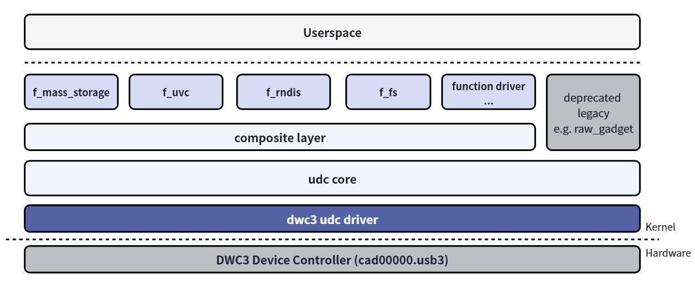
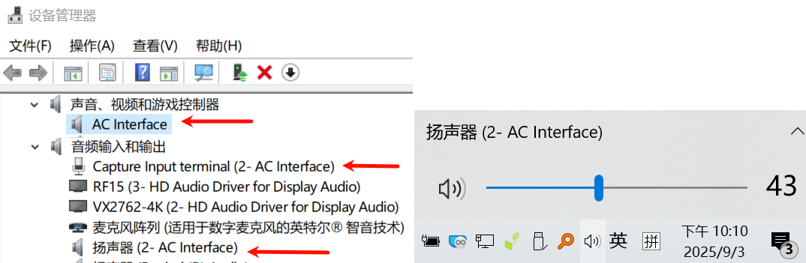
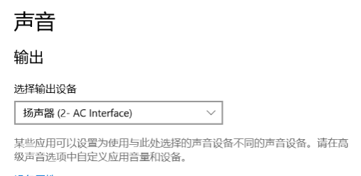
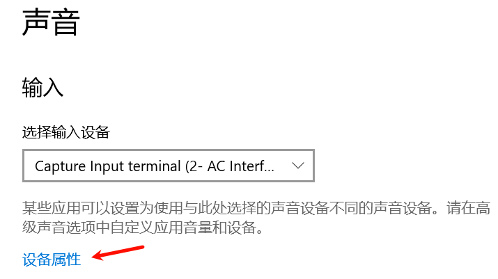
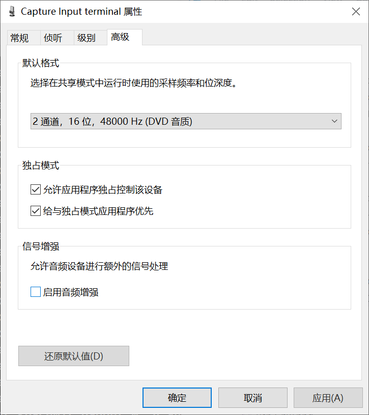
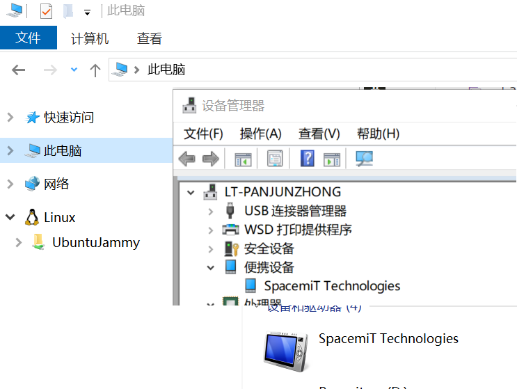
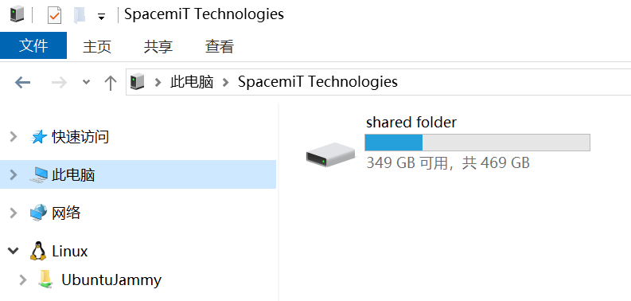
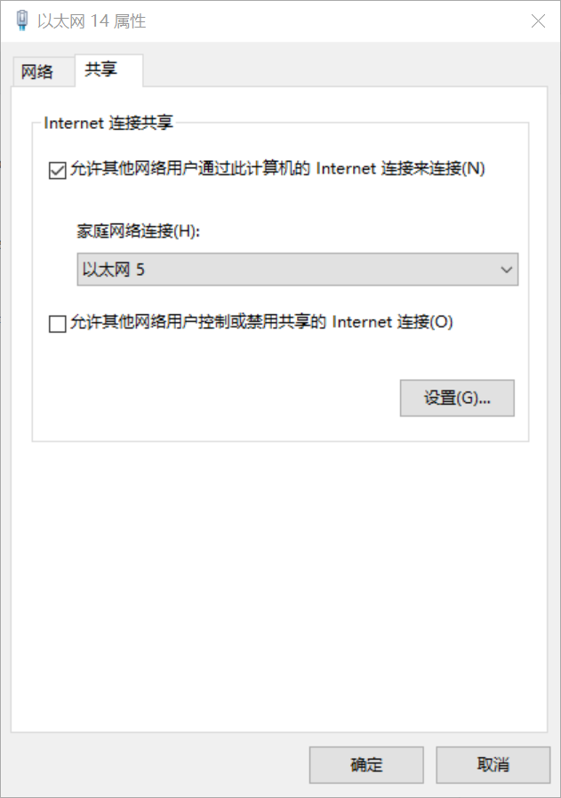
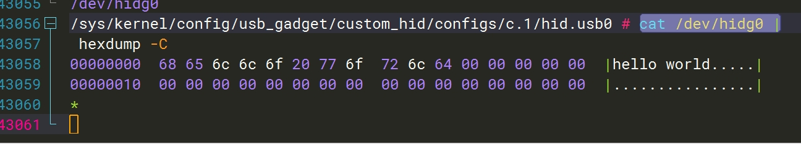
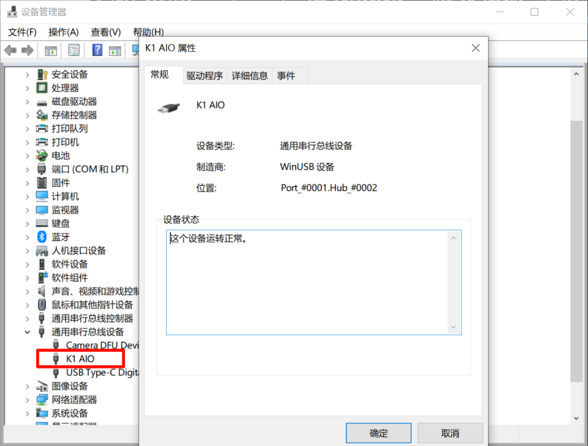

sidebar_position: 2

# USB Gadget Developer Guide

Applicable for: SpacemiT Linux 6.18

## Linux USB Gadget API Framework

### Overview

The Linux USB Gadget framework allows the development board to operate as a USB peripheral and connect to a USB host through the USB interface.

For example, it allows the development board to function as a USB mass storage device, USB Ethernet adapter, USB serial port, or other USB device.

When a mobile phone is connected to a PC through USB for data transfer, ADB debugging, network sharing, and similar functions, these features are typically implemented through the Linux USB Gadget subsystem.



The USB device-role driver stack can be divided into the following layers:

- **USB Device Controller Driver:** This layer is responsible for initializing the controller and performing low-level data transmission and reception operations.
- **UDC Core:** This core layer abstracts the USB device hierarchy and URB-based transfers, and provides interfaces to upper and lower layers.
- **Composite Layer:** To allow a single Linux device to act as a USB gadget and support multiple interfaces easily, the Linux USB Gadget framework implements a composite driver layer based on the USB 2.0 ECN Interface Association Descriptor (IAD). This allows the upper layers to implement only function drivers, which can be combined freely to create a multi-function device. The composite layer supports both configfs-based user-space configuration and hard-coded combinations of functions in legacy drivers.
- **Function Driver:** This is the USB device functionality layer, responsible for implementing USB device function drivers and interfacing with other kernel frameworks such as storage, V4L2, and networking.
- **Configfs API:** Configfs is a Linux kernel subsystem that allows users to configure kernel functions by creating and editing directory structures and files. In the USB Gadget framework, users mainly configure function drivers and USB protocol-related metadata by operating the directory structure and attribute files under the `usb_gadget` subdirectory of configfs, which is omitted from the diagram. For more information, refer to the kernel documentation for Linux USB gadget configuration through configfs.
- **Userspace:** Most USB gadget functions rely on user-space configuration or API interaction with other Linux subsystems. For example, the Ethernet gadget requires network configuration, while the mass storage gadget requires the user to configure the block device or file system; components of those subsystems are omitted from the diagram. Some USB gadget functions also require user-space services to operate correctly, such as ADB (Android Debug Bridge) and MTP.

Together, these layers form the Linux USB Gadget subsystem framework and ensure proper USB function operation and data transfer.

Kernel documentation references:

- [Linux USB gadget configured through configfs | The Linux Kernel documentation](https://www.kernel.org/doc/html/latest/usb/gadget_configfs.html): This document briefly introduces how to configure the USB gadget using configfs.
- [Linux USB Gadget Testing | The Linux Kernel documentation](https://www.kernel.org/doc/html/latest/usb/gadget-testing.html): This document describes the configfs attributes of each function and outlines test methods.

### Kernel menuconfig Configuration

This section covers only Linux USB Gadget-related configuration. For board-level DTS and USB IP driver configuration, refer to the USB section in the BSP Peripheral Driver Development documentation.

First, enable `USB_CONFIGFS` so that users can activate function drivers through configfs.
Once it is enabled, configuration options for the various function drivers associated with configfs are displayed under the `USB_CONFIGFS` submenu.

```
Location:
  -> Device Drivers
    -> USB support (USB_SUPPORT)
        -> USB Gadget Support (USB_GADGET)
        -> USB Gadget functions configurable through configfs (USB_CONFIGFS)
            -> Abstract Control Model (CDC ACM) (CONFIG_USB_F_ACM)
            -> Network Control Model (CONFIG_USB_F_NCM)
            -> RNDIS (CONFIG_USB_F_RNDIS)
            -> Mass storage (CONFIG_USB_F_MASS_STORAGE)
            -> Function filesystem (FunctionFS) (CONFIG_USB_F_FS)
            -> USB Webcam function (CONFIG_USB_F_UVC)
            -> HID function (CONFIG_USB_F_HID)
            -> USB Gadget Target Fabric (CONFIG_USB_F_TCM)
```

Only some commonly used function-driver menuconfig options are listed here. When enabling these options, make sure to also enable their corresponding `Depends on` entries.

For additional drivers, check the help text in menuconfig or the documents and source files under `drivers/usb/gadget/function/` in the kernel source tree.
Files prefixed with `u_` in that directory are utility files used by the function drivers prefixed with `f_`.

To debug the userspace layer together with the kernel, enable the following kernel configuration options. Once enabled, additional log output is generated, which helps identify root causes and troubleshoot issues. These options are disabled by default:

```
CONFIG_USB_GADGET_DEBUG=y
CONFIG_USB_GADGET_VERBOSE=y
CONFIG_USB_GADGET_DEBUG_FILES=y
CONFIG_USB_GADGET_DEBUG_FS=y
```

Other related menuconfig options can also be enabled, such as those under `USB Gadget precomposed configurations`.
Function drivers configured automatically at boot use the first UDC by default, but they are less flexible and less convenient to debug than configfs-based configuration.
Enabling these options is not recommended, because they can prevent the built-in ADB service, which starts automatically at boot in Bianbu, from working correctly.

### FunctionFS

To develop a USB gadget function driver with custom endpoint configurations and protocols beyond the existing kernel functions, base the development on FunctionFS.

This section introduces FunctionFS. Unlike other function drivers that implement fixed, specific functions, FunctionFS provides a flexible user-space filesystem API that allows users to define custom USB protocols.
With the FunctionFS driver, users can implement function drivers in userspace and provide USB descriptors, endpoint configurations, and data-transfer logic through user-space applications.
The **ADB (Android Debug Bridge)** and **MTP (Media Transfer Protocol)** on mobile phones are both implemented based on FunctionFS.

The kernel provides a simple bulk-transfer demo. Its source code is located in the `tools/usb/ffs-aio-example` directory of the kernel source tree.
A working demo can be used as a starting point and customized to implement a proprietary protocol.

This document introduces the ADB function, MTP function, and the custom protocol demo based on FunctionFS.

## USB Gadget Functionality Configuration

For detailed configfs configuration, refer to the kernel documentation referenced in the overview.

This document is based on `scripts/gadget-setup.sh` provided by the [SpacemiT usb-gadget repository](https://gitee.com/spacemit-buildroot/usb-gadget).
Switch to the latest release branch to ensure that the most up-to-date content is used.

Before reading further chapters of this document, please open the source code of the latest `gadget-setup.sh` script and refer to it alongside the document.

The script uses a modular approach to configure multiple functions. For each function, the configfs operations are divided into `_config`, `_link`, `_unlink`, and `_clean`. The primary goal of this repository is to help users bring up the demo quickly.

For detailed configfs configuration, refer to the script itself. Content can be extracted or removed as needed for customized development.

### Overview

Run `gadget-setup.sh` on the development board to complete USB function configuration. For basic usage instructions, run `gadget-setup.sh help`.

The gadget instance name configured by `gadget-setup.sh` is `spacemit`. The VID/PID, serial number, and USB manufacturer and product strings are all configured in `gadget-setup.sh`.
These values can be customized as needed, but USB VID/PID values must be obtained and assigned according to USB-IF requirements.

Each gadget instance under `/sys/kernel/config/usb_gadget` is bound to a UDC when enabled.
After configuring a specific function through the script, check configfs to confirm that the corresponding UDC is bound:

```
# Example：Use the K3 USB 3.0 controller as the UDC.
/sys/kernel/config # cat usb_gadget/spacemit/UDC
cad00000.usb3
```

Note: ADB is preinstalled in both Buildroot and Bianbu and is bound to the first UDC by default, which is the controller for K3 USB3.0 DRD Port A.

If the first UDC is already occupied when the script is run, stop the system ADB service first to free the UDC:

```
# Buildroot
~ # /etc/init.d/S50adb-setup stop
# Bianbu uses systemctl to stop adbd service
~ # systemctl stop adbd
```

`gadget-setup` checks UDC usage when it starts. If the target UDC is already occupied, it prints `ERROR: Your udc is occupied by...`.

```
~ # gadget-setup ncm
gadget-setup: Selected function ncm
....
gadget-setup: We are now trying to echo cad00000.usb3to UDC......
gadget-setup: ERROR: Your udc is occupied by: /sys/kernel/config/usb_gadget/g1/UDC
gadget-setup: ERROR: configfs preserved, run gadget-setup resume after conflict resolved
```

### UVC (USB Video Class)

**References**

- [USB Video Class v1.5 document set](https://www.usb.org/document-library/video-class-v15-document-set)
- [Linux UVC Gadget Driver Document](https://docs.kernel.org/6.16/usb/gadget_uvc.html)

**Configuration to be enabled:** `CONFIG_USB_F_UVC`

The UVC function allows the development board to operate as a USB camera and relies on the `uvc-gadget-new` application to provide the video source. The source code for this program can be downloaded from the [SpacemiT usb-gadget repository](https://gitee.com/spacemit-buildroot/usb-gadget). Compile and modify it as needed.

**Frame Format and USB Bandwidth:**

The UVC protocol uses USB isochronous transfer. Because the USB bus must guarantee stable bandwidth allocation for isochronous transfers and reserve bandwidth for non-isochronous devices, isochronous transfers cannot consume the full bus bandwidth. As a result, the available bandwidth has an upper limit.

For USB2.0 High-Speed, the maximum bandwidth for isochronous transfers can be adjusted through `streaming_maxpacket` in configfs. Valid values are 1024, 2048, and 3072. This parameter determines the maximum amount of data that can be transmitted per USB microframe for isochronous transfer. The corresponding theoretical maximum bandwidths are 7.8125 MB/s, 15.625 MB/s, and 23.4375 MB/s, respectively. Because of protocol overhead, the actual usable bandwidth is lower than the theoretical maximum.

The maximum bandwidth for isochronous transfers in USB3.0 SuperSpeed is 351.5625 MBps. It can be adjusted via `streaming_maxpacket` and `streaming_maxburst` in configfs. The valid range for `streaming_maxburst` is 1 to 15.

Configurable parameters in configfs that affect the maximum bandwidth include:

- `streaming_interval`: Configures `bInterval` in the isochronous transfer endpoint descriptor, from 1 to 255. The smaller the value, the greater the maximum bandwidth.
- `streaming_maxpacket`: Configure `wMaxPacketSize` in the isochronous transfer endpoint descriptor. Valid values are 1024, 2048, and 3072. The larger the value, the greater the bandwidth.
- `streaming_maxburst`: Configures `bMaxBurst` in the isochronous transfer endpoint descriptor, from 1 to 15. The larger the value, the greater the maximum bandwidth. This parameter is valid only for USB3.0.

The bandwidth requirements for common YUV formats are provided here. Since MJPEG uses compression, its bandwidth requirement is much lower than that of YUV, allowing full HD and 4K video to be transmitted even over USB2.0.

| Format (YUV)      | Width | Height | Frame Rate  | Bandwidth (MBps)      |
|------------------|---------|--------|------|---------------|
| 240p@30          | 480     | 240    | 30   | 6.591796875   |
| 360p@15          | 360     | 640    | 15   | 6.591796875   |
| 360p@30          | 360     | 640    | 30   | 13.18359375   |
| 720p@10          | 720     | 1280   | 10   | 17.578125     |
| **640p@30**      | **640** | **640**|**30**| **23.4375**   |
| 720p@15          | 720     | 1280   | 15   | 26.3671875    |
| 360p@60          | 360     | 640    | 60   | 26.3671875    |
| 720p@15          | 720     | 1280   | 15   | 26.3671875    |
| 480p@60          | 480     | 640    | 60   | 35.15625      |
| 720p@30          | 720     | 1280   | 30   | 52.734375     |
| 1080p@15         | 1080    | 1920   | 15   | 59.32617188   |
| 720p@60          | 720     | 1280   | 60   | 105.46875     |
| 1080p@30         | 1080    | 1920   | 30   | 118.6523438   |
| 1080p@60         | 1080    | 1920   | 60   | 237.3046875   |
| 4k@30            | 3840    | 2160   | 20   | 316.40625     |


#### Test Pattern Demo Configuration

When the development board operates as a USB device, two methods are available for UVC configuration:

1. Use the dedicated UVC script, which is recommended. It supports more UVC configuration options and makes it easier to customize resolutions. For more parameters and usage details, refer to the script source file.

    Independent USB PID:

   ```
   uvc-gadget-setup.sh start
   uvc-gadget-new spacemit_webcam/functions/uvc.0
   ```

2. Use the composite gadget script, which includes common built-in resolutions and supports using UVC together with other functions.

   ```
   gadget-setup.sh uvc
   uvc-gadget-new spacemit/functions/uvc.0
   ```

The `gadget-setup` script can also be customized according to actual product requirements.

Then connect the device to the PC and open a common camera application, such as PotPlayer or Amcap on Windows, or `guvcview` on Linux. The test pattern should then be displayed.


#### Routing a Real Camera Stream to the UVC Gadget Through V4L2

The video data flow is illustrated below:

```
+------------------+       +------------------+
|  Source Camera   |       |  Linux System    |
|  (MIPI/USB)      |       |                  |
|  +------------+  |       |  +------------+  |
|  | Sensor     |  |       |  | V4L2       |  |
|  |            |--+-------+->| Framework  |  |
|  +------------+  |       |  +------+-----+  |
+------------------+       |         |        |
                           |  +------v-----+  |
                           |  | App        |  |
                           |  |            |  |
                           |  | uvc-gadget-new|
                           |  +------+-----+  |    +------------------+
                           |         |        |    |  PC Host         |
                           |  +------v-----+  |    |                  |
                           |  | USB UVC    |  |    |  +------------+  |
                           |  | Gadget driver |    |  | Camera App |  |
                           |  +------+-----+  |    |  +------------+  |
                           +---------|--------+    +------|-----------+
                                     |                    |
                                     |       USB Cable    |
                                     +--------------------+
                                         Act As a Camera
```

First, the configured resolution must match the V4L2 data specifications of the source camera. The key parameters that must match include frame format, encoding format, image size, frame rate, and data buffer size.

Register the actual parameters of the source camera in the `setup_custom_profile()` function of `uvc-gadget-setup.sh`, following the existing registration pattern.

Then, run the following commands:

```
uvc-gadget-setup.sh start custom
uvc-gadget-new spacemit_webcam/functions/uvc.0 -d /dev/videoX 
```

Note: Replace `X` in `videoX` with the number of the first video device node corresponding to the actual camera on the K3 development board, for example, `video17`.

If startup succeeds, launch the camera application on the host computer and select the appropriate frame format, which must be supported by the physical camera. The video stream is then rendered using the default parameters.

In  cases, the size of the V4L2 data buffer for the source camera does not match the default `dwMaxVideoFrameSize` configured in the USB gadget script. This causes the following error:

```
/dev/video17: buffer 0 too small (460800 bytes required, 256000 bytes available).
Failed to import buffers on sink: Invalid argument (22)
```

This is mainly due to the flexibility of compressed formats such as MJPG, which means the `dwMaxVideoFrameSize` value varies depending on the camera model and the specific frame format.

At this stage, record the actual size shown after `available`, which is `256000` in this example. The value `460800` is the script-generated default derived from the selected frame format.

Then edit `~/.uvcg_config` to map the target encoding and resolution, which must already be configured in the script, to a custom `dwMaxVideoFrameBufferSize` value. In this example, set it to `256000`, which is the value reported in the error message above:

```
~ # cat ~/.uvcg_config
# .uvcg_config for spacemit-uvcg, config line format:
#     <format:[mjpeg]> <width> <height> <dwMaxVideoFrameBufferSize>
# e.g. mjpeg 640 360 251733
mjpeg 1280 720 25600
```

This logic is implemented in `add_uvc_fmt_resolution()` in `uvc-gadget-setup.sh`.
In this example, the value `25600` is ultimately written to the following configuration property file:

```
/sys/kernel/config/usb_gadget/spacemit_webcam/functions/uvc.0/streaming/mjpeg/m/720p/dwMaxVideoFrameBufferSize
```

After updating the configuration, rerun the startup script and the UVC application commands shown above.

For a production solution, the scripts can be further adapted as needed. The main purpose of `uvc-gadget-setup` is to provide a script that simplifies repeated debugging.

### UAC (USB Audio Class)

**References**

- [USB Audio Class v1.0](https://www.usb.org/sites/default/files/audio10.pdf)
- [USB Audio Class Rev 2.0](https://www.usb.org/document-library/audio-devices-rev-20-and-adopters-agreement)
- [ALSA Project](http://www.alsa-project.org/)

**Configurations to be enabled:** `CONFIG_USB_F_UAC1`, `CONFIG_USB_F_UAC2`

The UAC function allows the development board to operate as a USB sound card. At the user-space layer, audio management requires the `alsa-utils` package, and debugging is recommended in the Bianbu environment.

The kernel contains two drivers: UAC 1.0 and UAC 2.0.

From the perspective of the USB specification, UAC2.0 mainly improves sampling precision, maximum bandwidth, control interfaces, and clock synchronization.
For details, refer to the references listed above.

From a compatibility perspective, the UAC 1.0 and UAC 2.0 gadget implementations currently supported by the Linux kernel do not behave consistently across all platforms and functions.

For example, on Windows, UAC2.0 has compatibility issues and does not support volume control; macOS and Linux offer better compatibility.

The configurations described below are based on the connection shown in the following diagram:

    ALSA Audio Device -----> K3 Development Board ----USB----> Linux/Windows PC 
                                (UAC Gadget)                      USB Host

The ALSA audio device can use the development board interface to connect to analog headphones, USB headphones with recording support, or other audio devices.

First, install `alsa-utils` on the development board’s Bianbu system:

- In the Bianbu system, the `alsa-utils` package can be installed via apt.
- Within the Buildroot build system, ensure that the `BR2_PACKAGE_ALSA_UTILS` configuration option and all other relevant configuration entries are enabled.

The `gadget-setup` script already includes UAC support. Run one of the following commands to start the required UAC gadget configuration:

    # Use UAC 1.0
    gadget-setup.sh uac1
    # Use UAC 2.0
    gadget-setup.sh uac2

After running the command, connect the board to the PC over USB. The PC should then detect the audio device.

- The device name of UAC1.0 on Windows 10 (version 21H2 is used in this document) is AC—Interface.

  

- The device name of UAC2.0 on Windows 10 PC is Source/Sink.
- On a Linux PC, the audio device name for UAC1.0/UAC2.0 is the Product String of the USB Gadget.

    ```
    root@M1-MUSE-BOOK:~# aplay -l
    **** PLAYBACK Hardware Device List ****
    card 1: Device [SpacemiT Composite Device], device 0: USB Audio [USB Audio]
        subdevice: 0/1
        subdevice #0
    ```

The following sections describe the two main UAC gadget use cases: playback and recording.

#### Windows PC Plays Audio to the UAC Gadget

1. Find the volume icon on the taskbar, right-click it to open **Sound settings**, and set the playback device to the UAC gadget. Use the device name described above to identify it.

    

2. On the K3 development board acting as a UAC gadget, run `aplay -l` and `arecord -l`:

    ```
    root@k3:~# aplay -l
    **** PLAYBACK 硬體裝置清單 ****
    card 0: C [H180 Plus (Type C)], device 0: USB Audio [USB Audio]
    子设备 : 0/1
    子设备 #0: subdevice #0
    card 1: sndes8326 [snd-es8326], device 0: i2s-dai0-ES8326 HiFi ES8326 HiFi-0 []
    子设备 : 1/1
    子设备 #0: subdevice #0
    card 2: UAC1Gadget [UAC1_Gadget], device 0: UAC1_PCM [UAC1_PCM]
    子设备 : 1/1
    子设备 #0: subdevice #0
    root@k~# arecord -l
    **** CAPTURE 硬體裝置清單 ****
    card 0: C [H180 Plus (Type C)], device 0: USB Audio [USB Audio]
    子设备 : 1/1
    子设备 #0: subdevice #0
    card 1: sndes8326 [snd-es8326], device 0: i2s-dai0-ES8326 HiFi ES8326 HiFi-0 []
    子设备 : 1/1
    子设备 #0: subdevice #0
    card 2: UAC1Gadget [UAC1_Gadget], device 0: UAC1_PCM [UAC1_PCM]
    子设备 : 0/1
    子设备 #0: subdevice #0
    ```

    Record the `card` and `device` numbers shown here. These values are used later to create the recording and playback pipeline.
    For example, `2,0` refers to the `UAC1Gadget` audio device, and `0,0` refers to the headphone device.

3. Run the following command on the K3 development board to record audio from `2,0`, which is the `UAC1Gadget` device, and play it to `0,0`, which is the H180 Plus headphone:

    ```
    arecord -f dat -t raw -D hw:2,0 | aplay -f dat -D hw:0,0
    ```

    The following error may occur:

    ```
    root@k3:~# arecord -f dat -t raw -D hw:2,0 | aplay -f dat -D hw:0,0
    arecord: main:834: aplay: main:834: 音乐打开错误： 设备或资源忙
    音乐打开错误： 设备或资源忙
    ```

    This issue occurs because of a state mismatch between the current UAC gadget driver and ALSA.

     Use the following steps to avoid this issue. Windows needs to drive the device so that the audio device on the gadget side enters the Capture state:

    1. After switching the playback device, first start audio playback on the corresponding Windows device, for example, `AC-Interface` for UAC1, and then rerun the relevant command on the K3 development board.

    2. If the error still occurs after step 1, switch to another sound card, play audio, and then switch back to the target device, for example, `AC-Interface` for UAC1.

    After that, rerun the command. The K3 development board should then start recording audio from `hw:2,0`, which is the `UAC1Gadget` device, and play it to `hw:0,0`, which is the H180 Plus headphone:

    ```
    root@k3:~# arecord -f dat -t raw -D hw:2,0 | aplay -f dat -D hw:0,0
    正在录音 原始資料 'stdin' : Signed 16 bit Little Endian, 频率 48000Hz， Stereo
    正在播放 原始資料 'stdin' : Signed 16 bit Little Endian, 频率 48000Hz， Stereo
    ```

#### Linux PC Plays Audio to the UAC Gadget

The graphical interfaces of Linux desktop distributions vary, so this section describes a command-line method for playing audio from a Linux PC to the K3 development board and monitoring it through another headphone device connected to the board:

1. Use `aplay -l` to locate the UAC device emulated by the K3 development board, for example, `hw:1,0` in this case.

    ```
    root@mbook:~# aplay -l
    **** PLAYBACK Hardware Device List ****
    card 1: Device [SpacemiT Composite Device], device 0: USB Audio [USB Audio]
        subdevice: 0/1
        subdevice #0
    ```

2. Download a WAV audio file and rename it to `test.wav`.
3. Do not bind the UAC device emulated by the K3 development board in the desktop audio settings, or an error may occur.
4. On the Linux PC, use `aplay` to play `test.wav` to the UAC gadget device:

    ```
    root@mbook:~# aplay test.wav -c 2 -r 48000 -D plughw:1,0
    ```

5. Run the following command on the K3 development board to record audio from `2,0`, which is the `UAC1Gadget` device, and play it to `0,0`, which is the device listed by `aplay -l`:

    ```
    arecord -f dat -t raw -D hw:2,0 | aplay -f dat -D hw:0,0
    ```

#### Windows PC Records Audio from the UAC Gadget

1. Find the volume icon on the taskbar, right-click it to open **Sound settings**, and set the recording device to the UAC gadget. Use the corresponding device name described above.

    

2. In the Windows settings page from step 1, go to **Device properties -> More device properties -> Advanced -> Signal enhancements** and clear **Enable audio enhancement**.
    

3. Download a WAV audio file and rename it to `test.wav`.

4. Run the following command on the K3 development board to play the audio. Replace `hw:2,0` with the actual `UAC1Gadget` device reported by `aplay -l`.

    ```
    root@k3:~/ffs# aplay test.wav -c 2 -r 48000 -D plughw:2,0
    正在播放 WAVE 'test.wav' : Signed 16 bit Little Endian, 频率 48000Hz， Stereo
    ```

    If the error `aplay: pcm_write:2146: 写入错误：输入 / 输出错误` occurs, try opening Windows Sound Recorder first, start recording, and then return to the K3 development board and run the `aplay` command again.

5. Open Windows recording software and start recording.

6. If the recorded audio is abnormal, check whether Windows Audio Enhancements are disabled.

#### Linux PC Records Audio from the UAC Gadget

This function can be operated through the Linux PC graphical interface in a similar way to Windows.

Unlike Windows, which may require Audio Enhancements to be disabled, Linux users should pay attention to the recording volume level.

For some Linux distributions, the recording volume should be set to 50 for normal levels.
Values above 50 will amplify the audio, which may cause distortion in the audio data sent by the UAC gadget.

The command-line steps for recording audio to a WAV file on Linux by using `arecord` are as follows:

1. Locate the card and device ID of the UAC device emulated by the K3 development board using `arecord -l`.
2. Do not bind the UAC device emulated by the K3 development board in the system GUI, or an error may occur.
3. Run `arecord` to record audio to `record.wav`:

    ```
    arecord -f dat -c 2 -D hw:1,0 -t wav -d 20 record.wav
    ```

     Meaning of the parameters:
    - `-f dat` is a commonly used format abbreviation. The help information is available with `arecord -h`.
    - `-D hw:1,0` needs to be replaced with the corresponding values of the device found in the first step.
    - `-d 20` means record for 20 seconds.
4. Run the following command on the K3 development board to start audio playback. The parameter values should match the earlier descriptions. In particular, `hw:2,0` must be replaced with the actual `UAC1Gadget` device value:

   ```
   root@k3:~/ffs# aplay test.wav -c 2 -r 48000 -D plughw:2,0
    正在播放 WAVE 'test.wav' : Signed 16 bit Little Endian, 频率 48000Hz， Stereo
   ```

#### Parameter Configuration and Secondary Development

UAC provides several configurable parameters, some of which are already configured in the script.

For further customization, refer to the UAC specification, the script source code, and [Linux USB Gadget Testing - UAC2](https://www.kernel.org/doc/html/latest/usb/gadget-testing.html#uac2-function).

### ACM (CDC-ACM: Communication Device Class - Abstract Control Model)

**Configuration to be enabled：** CONFIG_USB_F_ACM

ACM is a USB serial protocol. It allows the development board to operate as a serial device, emulate a serial port, and transmit serial Tx/Rx data.

After ACM is enabled, a TTY device node is created in user space. When the host enumerates the development board, the board appears as a serial device.

Usage is straightforward. Run the gadget script to start the serial gadget:

```bash
gadget-setup.sh acm
```

On the gadget-side Linux system, a device node named `ttyGS*` is created under `/dev`, typically `/dev/ttyGS0`.

On Linux, tools such as `picocom` and `minicom`, or simple command-line tools such as `echo` and `cat`, can be used. On a Linux PC, the generated device nodes are usually named `/dev/ttyACM*`.

On Windows, common serial tools such as SecureCRT and WindTerm can be used for communication.
The corresponding COM port number can be viewed in Device Manager or via [USBTreeView](https://www.uwe-sieber.de/usbtreeview_e.html).

### ADB (Android Debug Bridge)

**Configurations to be enabled：** `CONFIG_USB_F_FS` and `CONFIG_NET` related network configurations (upper-layer applications depend on the network).

Android Debug Bridge (ADB) is a versatile command-line tool for communicating with a device.
An ADB shell can be used to run commands on the device, upload and download files, restart the device, or enter flashing mode. ADB supports both USB and network transport.

The generic `gadget-setup.sh` script integrates the ADB function and implements it through FunctionFS.
In addition, the user-space `adbd` service is required for normal operation.

In Buildroot, enable compilation of the `adbd` service with `BR2_PACKAGE_ANDROID_TOOLS_ADBD`. In the Bianbu system, install the `android-tools` package by using `apt`.

Note: Bianbu and Buildroot integrate ADB support by default, so `gadget-setup.sh` cannot be used at the same time as the system-integrated implementation.
Check the directories under `/sys/kernel/config/usb_gadget` to identify different USB gadget instances.

Steps for configuring the ADB function with `gadget-setup.sh`:

```
# Configure adb
gadget-setup.sh adb
# Stop adb
gadget-setup.sh stop
```

ADB usage:

On the PC, the ADB package can be downloaded from the official [platform-tools](https://adbdownload.com/) distribution. After extracting the package, add its `bin` directory to the system `PATH` environment variable.
Basic ADB commands:

```
# Push files from the PC to the development board:
adb push C:/xxx.yyy /home/bianbu/
# Pull files from the development board to the PC:
adb pull /home/bianbu/remote_file C:/
# Enter fastboot mode:
adb reboot fastboot
```

The ADB command-line tool on the Ubuntu (Linux) PC may report the following errors:

```
$ adb devices
List of devices attached
735ec889dec8 no permissions(user in plugdev group;are your udev rules wrong?);see [http://developer.android.com/tools/device.html]usb:3-3.3 transport_id:1
```

To resolve this issue, edit `/etc/udev/rules.d/51-android.rules` and add the following line:

```
$ sudo vi /etc/udev/rules.d/51-android.rules
SUBSYSTEM=="usb", ATTR{idVendor}=="361c", ATTR{idProduct}=="0008", MODE="0666", GROUP="plugdev"
```

Then reload the udev rule:

```
sudo udevadm control --reload-rules
```

On Windows, the ADB driver for the SpacemiT development board is installed automatically when the Titan flashing tool is installed.

### MTP (Media Transfer Protocol)

**Related USB Spec:**

- [Media Transfer Protocol v.1.1 Spec](https://www.usb.org/document-library/media-transfer-protocol-v11-spec-and-mtp-v11-adopters-agreement)

**Configuration to be enabled:** `CONFIG_USB_F_FS`。

MTP stands for Media Transfer Protocol and is currently maintained by the USB-IF. It is widely used for file transfer between phones, cameras, and computers. For example, when photos on a phone are accessed after the phone is connected to a computer over USB, MTP is typically used.

Unlike Mass Storage, where the device cannot access the file system on the corresponding block device or image while it is mounted by the host, MTP allows both the device and the PC to access the file system at the same time, which is often more convenient.

As mentioned earlier, the MTP function is also implemented through FunctionFS, so a user-space service program is required. This guide uses [umtp-responder](https://github.com/viveris/uMTP-Responder) as the service daemon. It is a lightweight MTP server that can be used directly on development boards running either Buildroot or Bianbu:

- For Buildroot, enable compilation with `CONFIG_BR2_PACKAGE_UMTPRD`.
- On desktop systems, install the `umtp-responder` package with `apt`.
- On other operating systems, build it from the [source code on GitHub](https://github.com/viveris/uMTP-Responder).

The MTP function configuration based on `umtp-responder` is already integrated in `gadget-setup.sh`. After completing the installation following the steps above, execute the following command to bring up the MTP function:

```
gadget-setup.sh mtp
```

This example uses a Windows PC as the host. MTP supports driver-free operation, so the corresponding portable device appears in Windows Device Manager and File Explorer. The product name configured in the default script is `SpacemiT Technologies`:



The same general behavior applies to other operating systems, including macOS and Linux distributions.

MTP supports mounting multiple storage objects, and each object can be configured with a local path, name, and read/write permissions. `umtp-resonder` is configured in `/etc/umtprd/umtprd.conf`:

```
storage "/var/lib/umtp" "shared folder" "rw"
# storage "/home/USER/foo"  "home folder" "rw"
# storage "/www"            "www folder" "ro,notmounted"
```

The script configures a shared directory by default. The local path on the development board is `/var/lib/umtp`, and it appears as `shared folder`. This displayed name is independent of the actual local path and can be changed. For example, a camera directory could be named `DCIM`. The directory is mounted with read/write permissions, and the available capacity corresponds to the capacity of the storage device mounted at that local path on the development board.



Unlike Mass Storage, where only one side can exclusively access a block device or image, MTP is more flexible.
When the PC reads from or writes to this directory, the changes can be observed immediately on the development board, and vice versa.

To customize MTP gadget parameters, refer to the following materials:

- The `umtp-responder` configuration in the `gadget-setup.sh` script.
- The `README` for `umtp-responder`.
- The default `umtp-responder` configuration file at `/etc/umtprd/umtprd.conf`, where the product name and the local storage paths and permissions exposed to the PC can be customized.
- MTP protocol design specification.

### Mass Storage (BOT Protocol, f_mass_storage)

**USB Spec:**

- [USB Mass Storage Class - Bulk-Only Transport](https://www.usb.org/sites/default/files/usbmassbulk_10.pdf)

**Configuration to be enabled:** `CONFIG_USB_F_MASS_STORAGE`

The development board acts as a USB device, and BOT (Bulk-Only Transport) is the underlying protocol.
It supports mounting an image or device node. In that case, the device node is no longer available to other applications.
By default, the ramdisk uses the FAT32 format. If Bianbu is used, install `dosfstools` with `sudo apt install dosfstools`. On other systems, make sure the `mkdosfs` command is available.
To change the storage capacity, refer to the implementation in the script.

```
gadget-setup.sh msc:< 镜像或设备节点 >
# Example
gadget-setup.sh msc:/dev/nvme0n1

# Use ramdisk
gadget-setup.sh msc
```

### Mass Storage ( Supports UASP + BOT Protocol, f_tcm)

**USB Spec:**

- [USB Attached SCSI Protocol](https://www.usb.org/document-library/usb-attached-scsi-protocol-uasp-v10-and-adopters-agreement)

**Configurations to be enabled:** `CONFIG_USB_F_TCM`, `CONFIG_TARGET_CORE`, `CONFIG_TCM_IBLOCK`, `CONFIG_TCM_FILEIO`

The development board acts as a USB device, and UASP (USB Attached SCSI Protocol) improves transfer efficiency.
It supports mounting an exclusive image or device node. In that case, the device node becomes unavailable to other applications.
When a ramdisk is used, it has no file system by default.

```
gadget-setup.sh uas:< 镜像或设备节点 >
# Example
gadget-setup.sh uas:/dev/nvme0n1

# Use ramdisk
gadget-setup.sh uas
```

### RNDIS (Remote Network Driver Interface Specification)

**Configurations to be enabled:** Network subsystem-related configurations such as`CONFIG_USB_F_RNDIS` and `CONFIG_NET`.

This function allows the board to act as a network device. RNDIS is a Microsoft proprietary protocol. Refer to Microsoft's official documentation:

- [Introduction to Remote NDIS (RNDIS) | Microsoft](https://learn.microsoft.com/en-us/windows-hardware/drivers/network/remote-ndis--rndis-2)

Run the following command to bring up the RNDIS gadget:

```
gadget-setup.sh rndis
```

In addition, the latest version of the script provides a shortcut for starting the DHCP server. This depends on BusyBox `udhcpd`, so `CONFIG_UDHCPD` must be enabled when BusyBox is built from source. Run the following command:

```
gadget-setup.sh dhcp
```

This automatically configures an IP address for the network device and can assign an IP address to the PC through DHCP. Refer to the script implementation for details.

#### PC Shares Internet with the Development Board

This section describes how to share a Windows PC's internet connection with a development board that has no direct network connection and only an RNDIS USB gadget connection.

1. Execute the command:

    ```bash
    gadget-setup rndis
    ```

2. Open **Network and Sharing Center** in Windows.
3. Open the network connection that has internet access, such as Wi‑Fi or Ethernet.
4. Right-click it and select **Properties**.
5. Open the **Sharing** tab, then select **Allow other network users to connect through this computer's Internet connection**.
6. In the **Home networking connection** drop-down list, select the RNDIS device. In the example below, `Ethernet 5` is the RNDIS device for the USB development board, and `Ethernet 14` is the Wi‑Fi or Ethernet connection that provides internet access:

    

7. Click **OK**.
8. On the development board, run `udhcpc -i usb0` to obtain the IP address assigned by Windows.

Windows can also use a network bridge. Refer to the official Windows documentation for details.

Linux desktop interfaces vary, so they are not covered here. However, Linux provides flexible networking tools, so refer to standard Linux network configuration documentation for details.

### NCM (CDC-NCM: Communication Device Class - Network Control Model)

**USB Spec:**

- [USB CDC-Subclass Specifications For NCM](https://www.usb.org/sites/default/files/NCM11.pdf)

**Configurations to be enabled:** Network subsystem-related configurations, such as `CONFIG_USB_F_NCM` and `CONFIG_NET`.

Unlike RNDIS, which is maintained by Microsoft, NCM is a network protocol maintained by the USB-IF. It is supported by major operating systems including Linux, Windows 11, and macOS.
Note: The current NCM driver implementation in Windows 10 is not fully compatible with the NCM gadget in Linux 6.6. Microsoft fixed this issue in Windows 11.

```
gadget-setup.sh ncm
```

In addition, the latest version of the script adds a shortcut for starting the DHCP server, which depends on BusyBox `udhcpd`. Run the following command:

```
gadget-setup.sh dhcp
```

This automatically configures an IP address for the network device and can assign an IP address to the PC through DHCP. Refer to the script implementation for details.

To share internet access from a Windows PC to the development board, refer to the section **PC Shares Internet with the Development Board** in the RNDIS section, but replace the first-step command with `ncm` instead of `rndis`.

### HID (Human Interface Device)

**Configuration to be enabled:** `CONFIG_USB_F_HID`

**USB HID Related Documents:**

- [Introduction to the HID Class Protocol](https://www.usb.org/sites/default/files/hid1_11.pdf)
- [HID Usage Page keycode Reference Table](https://www.usb.org/sites/default/files/hut1_4.pdf)
- [USB-IF Report Desc Generation Tool](https://www.usb.org/document-library/hid-descriptor-tool)

HID stands for Human Interface Device. HID gadgets are typically used to emulate keyboards, mice, game controllers, and volume or media control devices.
In some cases, HID is also used to transmit small amounts of data because it does not require a custom driver.

```bash
gadget-setup.sh hid
```
Note: The report format is defined in `REPORT_DESC`. Use a global search to locate and modify it.

Refer to the HID protocol for detailed report format configuration. For additional information, consult the relevant kernel documentation and specification documents.

After the script is executed, the gadget side creates the `/dev/hidg0` device node. Communication with the host can then take place through this node. For example, to send emulated mouse or keyboard data, write the corresponding report data to this node in the format defined by the HID `report_desc`.

For details about **keyboard and mouse emulation**, refer to [this kernel document](https://www.kernel.org/doc/html/latest/usb/gadget_hid.html). Note that the first part of that document describes the traditional `g_hid` approach. The current implementation uses configfs, so start from the **Configuration with configfs** section. The document also provides a sample reporting application named `hid_gadget_test`. Run it on the gadget side and provide the appropriate input to send keyboard or mouse data to the host.

In addition, the simplest I/O test method uses Python together with `cat` or `hexdump`, although this approach does not provide complete HID report parsing:

- Here is an example in which the PC sends data and the device receives it. On the Linux system running on the development board, open the character device node and read from it. The following shell command continuously reads data with `cat` and formats it with `hexdump`:

  ```
  cat /dev/hidg0 | hexdump -C
  ```

- To send `hello world` from a Windows PC through Python without a custom driver, first install the required Python dependency:

   ```bash
   pip install hidapi  # Windows/Linux Compatible
   ```

- The following Python example sends `hello world` from the PC to the device through HID:

   ```python
   import hid

   """
   Note: This code runs on PC
   """
   # Locate custom HID device
   device = hid.device()

   # Open a device by Vendor ID and Product ID
   vendor_id = 0x361c  # SpacemiT
   product_id = 0x0007  # Product ID
   device.open(vendor_id, product_id)

   # Set non-blocking mode (optional)
   device.set_nonblocking(1)

   # Prepare the data (a report ID must be added at the beginning, typically 0x00)
   message = b"/x00" + b"hello world".ljust(63, b"/x00")  # Total length: 64 Bytes

   # Send data
   device.write(message)
   print("Sent: hello world")

   # Receive the response (if any)
   data = device.read(64)
   if data:
       print(f"Received response: {bytes(data[1:]).decode('ascii').strip()}")  # Skip the report ID

   # Close the device
   device.close()
   ```

- After running the PC-side script, the gadget-side output should look similar to the following screenshot:
   

### FFS Demo (FunctionFS)

This section describes how to run the FunctionFS demo successfully.

SpacemiT provides a modified version of the application based on the simple `device_app` located in the `tools/usb/ffs-aio-example` directory of the kernel source tree:

- It adds a driverless WINUSB operating system descriptor based on [WCID](https://github.com/pbatard/libwdi/wiki/WCID-Devices), allowing Windows to bind the WINUSB driver directly for fast user-space verification.

This code is available at [Gitee | SpacemiT Buildroot SDK / usb-gadget](https://gitee.com/spacemit-buildroot/usb-gadget).

After cloning the repository to the K3 development board running the Bianbu or Ubuntu system, follow the steps below to run the FFS demo. To simplify verification, cross-compilation is not covered here.

1. First, install the `libaio-dev` package on Bianbu OS, then execute the following command:

   ```
   sudo apt update && apt install libaio-dev
   ```

2. Build the device-side service application by running the following commands in sequence:

   ```
   make
   make install
   ```

    After these commands complete, a binary named `demod` is installed in `/usr/bin/`.

3. Bring up the gadget device. Because the ADB FFS service built into the Bianbu system occupies UDC resources, stop that service first:

   ```
   systemctl stop adbd
   ```

    Then run the following command to start the `ffs-demo` gadget:

   ```
   bash ffs-setup.sh start
   ```

4. Connect the USB cable to the PC host. A new USB device named `K1 AIO` appears. On Windows, check it in Device Manager. On Linux, check it with `lsusb`.
   

5. When connected to a Linux host, `host_app` in the `tools/usb/ffs-aio-example/` directory can be used to communicate with this FFS bulk-transfer demo gadget device.
The general process is straightforward: 
   1. Modify the PID and VID in `host_app` to match those in `ffs-setup.sh`;
   2. Install the `libaio-dev` dependency on the Linux host PC; 
   3. Compile and run the application. Detailed steps are omitted here.

6. When connected to a Windows host, a user-mode application based on WINUSB and `libusb`, such as the `host_demo.py` Python script, can be used.
The `host_demo.py` script is not limited to a specific operating system. Windows is used here as the example:

    1. If `pyusb` is not installed, run `pip install pyusb`.

    2. Install `libusb` for Windows from <https://libusb.info/>.

    3. Replace the path to the `libusb` backend in the Python script with the actual path to `libusb-1.0.dll`.

    4. Use `python3` to run the script.

    ```
    #### host side execution output ####
    C:/ffs-demo> python ./host_demo.py
    Sending: b'hello world'
    Received: AIO

    #### device (K3) side execution output ####
    ev=out; ret=11
    submit: out, last out: hello world
    ev=in; ret=8192
    submit: in
    ```

7. Clean up the gadget device and restore the ADB service built into the Bianbu system by running the following command:

   ```
   bash ffs-setup.sh stop
   # Use systemctl start adbd to restore bianbu built-in adb service.
   ```

## USB Composite Device

As mentioned earlier, to allow a single Linux system acting as a gadget to support multiple interfaces at the same time, the Linux USB Gadget framework provides a composite driver layer based on the USB 2.0 ECN Interface Association Descriptor (IAD).
This means the upper layer only needs to implement individual function drivers, and these functions can be combined freely to create a multifunction USB device.

The `gadget-setup.sh` script already supports enumerating multiple USB functions at the same time.
Separate multiple functions with commas:

```
Example: rndis + adb:
gadget-setup.sh rndis,adb
```

Note: In `gadget-setup.sh`, the order in which multiple functions are added is fixed. It does not follow the order in the comma-separated input list.
As a result, endpoint numbers are also determined by the fixed order in the script. If control over the endpoint numbering order is required, modify the script directly.

Implementation logic: the `glink()` function in `gadget-setup.sh` calls the link configuration for each function separately and adds it to the configuration.
The kernel driver then allocates endpoint numbers in sequence according to the order of these link calls. For example:

```
ln -s /sys/kernel/config/usb_gadget/spacemit/functions/rndis.0 /sys/kernel/config/usb_gadget/spacemit/configs/c.1
ln -s /sys/kernel/config/usb_gadget/spacemit/functions/ncm.0 /sys/kernel/config/usb_gadget/spacemit/configs/c.1
```

In this case, endpoint numbers are first allocated to the endpoints of the `rndis` interface and then to those of the `ncm` interface.

If the `gadget-setup` script is used, the order inside `glink()` can be changed to control endpoint number allocation:

```
glink()
{
 [ $MSC  = okay ] && msc_link
 [ $UAS  = okay ] && uas_link
 [ $RNDIS  = okay ] && rndis_link
 [ $NCM  = okay ] && ncm_links
 [ $ADB  = okay ] && adb_link
 [ $MTP  = okay ] && mtp_link
 [ $FFS  = okay ] && ffs_link
 [ $UVC  = okay ] && uvc_link
 [ $HID  = okay ] && hid_link
 [ $ACM  = okay ] && acm_link
}
```

For custom scripts, adjust the function linking order in `configs/c.1` as needed.
