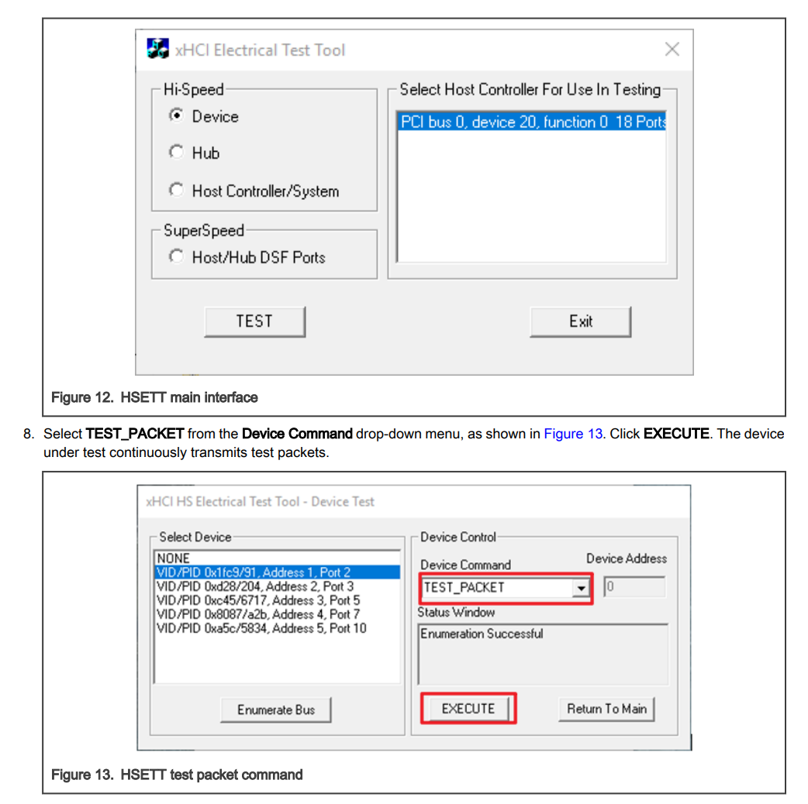

sidebar_position: 3

# USB Signal Quality Test Guide

## USB 2.0 Test Guide

Refer to the [USB 2.0 Electrical Compliance Specification | USB-IF Document Library](https://www.usb.org/document-library/usb-20-electrical-compliance-test-specification-version-107) for the complete USB 2.0 electrical signal quality test procedure.

Main test items:

- Eye Diagram
- Signal Rate
- Rise and Fall Time
- Monotonicity Test

The specific test procedure should follow the guidelines provided by the relevant test instrument, such as the oscilloscope, or by the test laboratory.
This section describes how to generate the required test waveforms using the K3 USB controller.

The USB 2.0 test pattern options are listed below. For details, refer to Section 7.1.20 of the USB 2.0 Specification:

- Test SE0 NAK
- Test J
- Test K
- Test Packet
- Test Force Enable

When testing signal quality items such as rise and fall time, eye diagram, jitter, and other dynamic waveform characteristics, use the Test Packet pattern. For the detailed test packet structure, refer to Section 7.1.20 of the USB 2.0 Specification.

### USB 2.0 Device Signal Quality Test Guide

In device mode, the test waveform can be generated by either of the following methods, depending on the test environment:
- Configure the test waveform from the host by using the [xHCI Electrical Test Tool](https://www.usb.org/document-library/xhsett): install the USB-IF standard [xHCI Electrical Test Tool](https://www.usb.org/document-library/xhsett) on the host and send the `Set Feature (Test Packet)` control request to the device.
- Configure the waveform through Linux DebugFS, as described below.

#### K3 USB3.0 DRD Controller Device Mode High-Speed Connection Test

This test applies only to development boards or product boards whose USB3.0 DRD controller supports device mode, or supports manual switching to device mode. For details, refer to the [USB General Developer Guide](1-USB-General-Developer-Guide.md).

During testing, ensure that the USB3.0 DRD controller is operating in device mode and that the test fixture, cables, and related hardware support a maximum of the USB2.0 High-Speed specification rather than the USB3.0 SuperSpeed specification.

Use `gadget-setup.sh` to configure the USB3.0 DRD controller to enter device mode:

```
USB_UDC=cad00000.usb3 gadget-setup.sh hid
```

Refer to the [USB Gadget Developer Guide](2-USB-Gadget-Developer-Guide.md) for detailed information about `gadget-setup.sh`.

##### Host Configures the Test Waveform by Using the xHCI Electrical Test Tool

Connect the USB3.0 DRD port of the K3 development board, labeled `USB2_DP/USB2_DN` in the schematic, to the host with the xHCI Electrical Test Tool installed, using a USB cable and test fixture. As shown in the figure, select the device with VID/PID `0x361c/...`, choose the `TEST_PACKET` option under **Device Command**, and click **EXECUTE**. The K3 USB3.0 DRD controller then begins transmitting the test waveform.



##### K3 Configuration via Linux DebugFS

On the K3 development board, the USB3.0 DRD controller in device mode can be configured directly through Linux DebugFS nodes to generate USB 2.0 High-Speed test waveforms:

1. Ensure that the development board is powered on and has booted into the system. The corresponding DebugFS node path for the USB3.0 DRD controller is `/sys/kernel/debug/usb/cad00000.usb3/`.

2. Enter test mode and transmit the test waveform:
   ```
   echo test_force_enable > /sys/kernel/debug/usb/cad00000.usb3/testmode
   echo test_packet > /sys/kernel/debug/usb/cad00000.usb3/testmode
   # Other options: test_j, test_k, test_se0_nak
   ```

3. Check the current high-speed test mode status:
   ```
   cat /sys/kernel/debug/usb/cad00000.usb3/testmode
   ```

4. Exit test mode and restore the normal operating status:
   ```
   echo none > /sys/kernel/debug/usb/cad00000.usb3/testmode
   ```

During operation, connect the USB3.0 DRD port of the development board to the test fixture through a USB cable. After the commands above are executed, the corresponding test waveforms can be observed on the test fixture side.

### USB 2.0 Host Signal Quality Test Guide

In host mode, configuration is supported only through application-layer tools, which are compatible with all USB 2.0 ports on the host.

K3 includes 5 USB controllers:
- USB2.0 Host
- USB3.0 DRD PortA
- USB3.0 Host PortB
- USB3.0 Host PortC
- USB3.0 Host PortD

Only the bus number (`Bus`), device number (`Dev`), and port number (`Port`) of the target port need to be identified. Whether the port is directly on the controller root hub or on a downstream hub, it can be configured to transmit test waveforms.

Use the `porttest` command-line tool for testing. Its source code is provided in the appendix. The `k3_lsusb` script, also included in the appendix, helps quickly identify the target port information.

**porttest Usage:**

```
./porttest /dev/bus/usb/<Bus Number>/<Dev Number> <Port Number> <Test PATTERN Code>
# e.g.:
# ./porttest /dev/bus/usb/001/001 1 4
# Test PATTERN codes are:
# - Reserved: 0
# - Test_J: 1
# - Test_K: 2
# - Test_SE0_NAK: 3
# - Test_Packet: 4, used for eye diagram testing
# - Test_Force_Enable: 5
```

After the Test Packet option is executed on a specific port, that port begins transmitting Test Packets.

The following figure shows the test waveform on the oscilloscope:


#### 1. Preparation (for USB3.0 DRD PortA only)

To test the USB 2.0 endpoint of USB3.0 DRD PortA, first force the controller into host mode. This requires a Type-C-to-host adapter or equivalent hardware.

```bash
echo host > /sys/kernel/debug/usb/cad00000.usb3/mode
```

This step is not required for dedicated host ports such as USB2.0 Host, PortB, PortC, or PortD.

#### 2. Find the Bus and Dev Numbers of the Corresponding Port

View the USB topology in the current system by using `k3_lsusb`:

```bash
~ # k3_lsusb
/:  Bus 001 (USB30_PortB).Port 001: Dev 001, Class=root_hub, Driver=xhci-hcd/1p, 480M
        ID 1d6b:0002 Linux Foundation 2.0 root hub
/:  Bus 002 (USB30_PortB).Port 001: Dev 001, Class=root_hub, Driver=xhci-hcd/1p, 5000M
        ID 1d6b:0003 Linux Foundation 3.0 root hub
/:  Bus 003 (USB30_PortC).Port 001: Dev 001, Class=root_hub, Driver=xhci-hcd/1p, 480M
        ID 1d6b:0002 Linux Foundation 2.0 root hub
/:  Bus 004 (USB30_PortC).Port 001: Dev 001, Class=root_hub, Driver=xhci-hcd/1p, 5000M
        ID 1d6b:0003 Linux Foundation 3.0 root hub
        |__ Port 001: Dev 002, If 0, Class=Video, Driver=uvcvideo, 5000M
                ID 2bdf:028b
        |__ Port 001: Dev 002, If 1, Class=Video, Driver=uvcvideo, 5000M
                ID 2bdf:028b
        |__ Port 001: Dev 002, If 2, Class=Audio, Driver=snd-usb-audio, 5000M
                ID 2bdf:028b
        |__ Port 001: Dev 002, If 3, Class=Audio, Driver=snd-usb-audio, 5000M
                ID 2bdf:028b
/:  Bus 005 (USB30_PortD).Port 001: Dev 001, Class=root_hub, Driver=xhci-hcd/1p, 480M
        ID 1d6b:0002 Linux Foundation 2.0 root hub
/:  Bus 006 (USB30_PortD).Port 001: Dev 001, Class=root_hub, Driver=xhci-hcd/1p, 5000M
        ID 1d6b:0003 Linux Foundation 3.0 root hub
/:  Bus 007 (USB20_Host_Only).Port 001: Dev 001, Class=root_hub, Driver=xhci-hcd/1p, 480M
        ID 1d6b:0002 Linux Foundation 2.0 root hub
        |__ Port 001: Dev 002, If 0, Class=Mass Storage, Driver=usb-storage, 480M
                ID 0781:5591 SanDisk Corp. Ultra Flair
/:  Bus 008 (USB30_PortA_OTG).Port 001: Dev 001, Class=root_hub, Driver=xhci-hcd/1p, 480M
        ID 1d6b:0002 Linux Foundation 2.0 root hub
/:  Bus 009 (USB30_PortA_OTG).Port 001: Dev 001, Class=root_hub, Driver=xhci-hcd/1p, 5000M
        ID 1d6b:0003 Linux Foundation 3.0 root hub
```

The corresponding controller names, such as `USB20_Host_Only` and `USB30_PortB`, can be identified from the output.

- **Testing controller root hub ports:**
    To test the direct USB 2.0 port on USB3.0 PortB, locate the corresponding root hub entry. In the example above, `Bus 005 (USB30_PortD)` has device number `Dev 001` and port number `1`.

- **Testing other unconnected ports on the controller:**
    When testing another unconnected port on a controller, such as `USB20_Host_Only`, specify the corresponding `Bus`, `Dev`, and target port number directly. For example, according to the output above, the bus for `USB20_Host_Only` is `007`, and the device number of its root hub is `Dev 001`. To test the second downstream port of this controller, assuming that no device is connected, use `007/001` for `Bus/Dev` and `2` for the port number.

#### 3. Execute the command to enter Test Packet mode:

Based on the Bus and Dev obtained in the previous step, run the `porttest` command to enter Test Packet mode:

```bash
porttest /dev/bus/usb/<Bus Number>/<Dev Number> <Port Number> 4
```

**Example: Testing the USB30_PortD root hub**
```bash
~ # porttest /dev/bus/usb/005/001 1 4
Setting port 1 to test mode 4 (Test_Packet)
Test mode successful
```

### USB-IF USB 2.0 Product Compliance Test

**Refer to** https://www.usb.org/usb2

For USB 2.0 products, in addition to signal quality tests, USB-IF also specifies other tests: functional tests and interoperability tests.

These tests are collectively referred to as the USB 2.0 compliance test.

The USB 2.0 compliance test is intended for USB peripheral devices such as hubs, USB flash drives, and other USB peripherals.

USB 2.0 peripheral products based on the Linux Gadget driver and developed using the K3 development board also qualify as USB 2.0 products. To use the USB trademark, they must pass the USB 2.0 compliance test and obtain certification from USB-IF.

#### Functional

The functional test phase is executed by using USB30CV, the official USB-IF tool.

This tool performs routine tests in accordance with the requirements specified in Chapter 9 of the USB 2.0 Specification.

In addition, for any product that implements a USB standard class, the tool also executes the corresponding class tests.

USB30CV is supported only on Windows PCs and requires a standard xHCI-compliant host controller.

The USB30CV package is available from [USB-IF](https://www.usb.org/document-library/usb3cv).

*Note: The older tool is USB20CV, which relies on an EHCI controller on the host PC. Most newer Windows PCs use xHCI, so USB30CV is sufficient for testing.

#### Electrical

Approved USB 2.0 oscilloscope vendors:
- Keysight
- Rohde & Schwarz
- Tektronix
- Teledyne LeCroy

The electrical test phase of the compliance program focuses on the physical layer and requires the use of various tools.

For High-Speed signal quality testing, USB-IF accepts only test data captured by using approved signal quality test fixtures.

In addition, USB-IF only accepts USB 2.0 signal quality analysis reports generated by USBET.

For other electrical tests, refer to the USB-IF low-speed and full-speed electrical test specifications and the [USB 2.0 Electrical Test Specification](https://www.usb.org/document-library/usb-20-electrical-compliance-test-specification-version-107). In addition, contact approved oscilloscope vendors to obtain the relevant test fixtures and test method instructions. Third-party laboratories are commonly engaged to assist with testing.

Download the USB 2.0 Electrical Compliance Test Specification in the USB‑IF Document Library.

#### Interoperability

The interoperability test phase of the compliance program focuses on verifying the interoperability between the device under test and known-good USB products.

USB 2.0 and USB 3.2 use the same standard for interoperability test methods. Related tools and documentation are available here: [xHCI Interoperability Test Procedures For Peripherals, Hubs and Hosts](https://www.usb.org/document-library/xhci-interoperability-test-procedures-peripherals-hubs-and-hosts-version-096).

## USB 3.0 Test Guide

USB 3.0 testing requires USB-IF-certified high-speed oscilloscopes, along with the corresponding test fixtures and instruments.

These vary by equipment vendor. Refer to the documentation and operating procedures provided by the relevant test vendor.

This section briefly describes how to configure the USB 3.0 PHY on the K3 for test mode.

### USB 3.0 Device Tx Signal Quality Test Guide

First, run the `gadget-setup` script, as described in the USB Gadget Developer Guide, to bring up the device, and then connect the test fixture.

```
USB_UDC=cad00000.usb3 gadget-setup hid
```

On the peer side of the test fixture, which is the host side, use the standard method specified in the USB 3.0 SuperSpeed LTSSM. See Section 7.5.5 of the USB 3.0 Specification.

Connect `SSTX+` and `SSTX-` to Rx termination to bring the device LTSSM into the LFPS Polling state.

At this point, the host test component does not respond, and the timeout of the first `Polling.LFPS` sent by the device causes the device state machine to enter Compliance Mode.

Check DebugFS at this point. The USB 3.0 link state should have entered compliance mode:

```
cat /sys/kernel/debug/usb/cad00000.usb3/link_state
Compliance
```

The peer side then sends `Ping.LFPS` to advance to the next pattern.

### USB 3.0 Host Tx Signal Quality Test Guide

The peer side of the test fixture uses the standard method specified in the USB 3.0 SuperSpeed LTSSM. See Section 7.5.5 of the USB 3.0 Specification.

Connect `SSTX+` and `SSTX-` to Rx termination to bring the host LTSSM into the LFPS Polling state.

At this point, the host test component does not respond. The timeout of the first `Polling.LFPS` sent by the host port causes the host port state machine to enter Compliance Mode.

The peer then sends `Ping.LFPS` to switch to the next pattern.

On K3, `k3_usb3_comp` can be used to enter compliance mode.

1. Execute the following command to enter the `CP0` pattern:
   ```
   ~ # k3_usb3_comp d
   Final Mode is:
   host
   Disabling ports on USB30_PortD (81a00000)...
   Disabling port01...
   Disabling port02...

   Entering CP0 compliance mode on USB30_PortD... /sys/kernel/debug/usb/81a00000.usb3/link_state
   Done.

   Port status (portsc):
   port01: 0x0a000080 Powered-off Not-connected Disabled Link:Disabled PortSpeed:0 Change: Wake: WCE WOE
   port02: 0x0a000140 Powered-off Not-connected Disabled Link:Compliance mode PortSpeed:0 Change: Wake: WCE WOE
   ```

2. Execute the following command to switch the pattern:
   ```
   ~ # k3_usb3_comp a toggle
   Toggling CP compliance on USB30_PortD (81a00000)..
   Done. CP compliance toggled.
   ```

### USB 3.0 Rx Signal Quality Test

The Rx compliance test places the link into loopback mode.

The entry method is similar to the Tx signal quality test described above and follows the standard method defined in the specification.

During the `Polling.Configuration` phase of link training, if the USB 3.0 controller detects that the loopback bit in the T2 pattern is set, it automatically configures the USB 3.0 link to enter loopback mode. Refer to Sections 7.5.10 and 7.5.11 of the USB 3.0 Specification for details.

### USB-IF USB 3.0 Product Compliance Test

**Refer to** https://www.usb.org/usb-32

For USB 3.0 products, in addition to electrical and signal quality tests, USB-IF also defines functional testing, interoperability testing, and link-layer testing.

#### Functional

The functional testing phase is executed by using USB30CV, the official USB-IF tool.

This tool performs routine tests in accordance with the requirements specified in Chapter 9 of the USB 3.0 Specification.

In addition, for any product that implements USB standard classes, the tool also executes the corresponding class-specific tests.

USB30CV is supported only on Windows PCs and requires the host to be equipped with a controller compliant with the xHCI specification.

The USB30CV software package is available from [USB-IF](https://www.usb.org/document-library/usb3cv).

#### Link Test

- [Link Layer Test Specification](https://www.usb.org/document-library/usb-32-link-layer-test-specification)

#### Electrical

Approved USB 3.0 oscilloscope vendors:

- Anritsu
- Keysight
- Rohde & Schwarz
- Tektronix
- Teledyne LeCroy

The electrical test phase of the compliance program focuses on the physical layer and requires various tools.

For high-speed signal quality testing, USB-IF accepts only test data captured with approved signal quality test fixtures.

In addition, USB-IF only accepts USB 3.0 signal quality analysis reports generated by its official tool USBET.

For other electrical tests, refer to the following USB-IF specifications:

- [The Electrical Compliance Test Specification for SuperSpeed USB 10 Gbps Rev. 1.0](https://www.usb.org/document-library/electrical-compliance-test-specification-superspeed-usb-10-gbps-rev-10)
- [The Electrical Compliance Test Specification for SuperSpeed USB Rev. 1.0a](https://www.usb.org/document-library/electrical-compliance-test-specification-superspeed-usb-rev-10a)

Contact approved oscilloscope vendors for relevant test fixtures and test method documentation. Testing is typically performed with the assistance of third-party laboratories.

#### Interoperability

The interoperability test phase of the compliance program focuses on verifying interoperability between the device under test and known-good USB products.

Related tools and documentation are available here: [xHCI Interoperability Test Procedures For Peripherals, Hubs and Hosts](https://www.usb.org/document-library/xhci-interoperability-test-procedures-peripherals-hubs-and-hosts-version-096).

## Appendix

### `porttest` Source Code

Copy the source code to the Bianbu system, open the directory containing the file in a terminal, and run:

```
gcc porttest.c -o porttest --static
```

This command generates the `porttest` executable.

```c
/* porttest -- put a USB hub port into TEST mode */
/* To build:  gcc -o porttest porttest.c */

#include <stdio.h>
#include <stdlib.h>
#include <unistd.h>
#include <fcntl.h>
#include <errno.h>
#include <sys/ioctl.h>

#include <linux/usbdevice_fs.h>
#include <linux/usb/ch9.h>

#define USB_MAXCHILDREN         31

#include <linux/usb/ch11.h>

char *mode_names[] = {
        "Reserved",             /* 0 */
        "Test_J",               /* 1 */
        "Test_K",               /* 2 */
        "Test_SE0_NAK",         /* 3 */
        "Test_Packet",          /* 4 */
        "Test_Force_Enable",    /* 5 */
        /* Remaining values are reserved */
};
#define MAX_TEST_MODE           5

int main(int argc, char **argv)
{
        const char *filename;
        int portnum, testmode;
        int fd;
        int rc;
        struct usbdevfs_ctrltransfer ctl;

        if (argc != 4) {
                fprintf(stderr, "Usage: porttest device-filename portnum testmode\n");
                return 1;
        }
        filename = argv[1];

        portnum = atoi(argv[2]);
        if (portnum <= 0 || portnum > USB_MAXCHILDREN) {
                fprintf(stderr, "Invalid port number: %d\n", portnum);
                return 1;
        }

        testmode = atoi(argv[3]);
        if (testmode <= 0 || testmode > MAX_TEST_MODE) {
                fprintf(stderr, "Invalid test mode: %d\n", testmode);
                return 1;
        }

        fd = open(filename, O_WRONLY);
        if (fd < 0) {
                perror("Error opening device file");
                return 1;
        }

        printf("Setting port %d to test mode %d (%s)\n", portnum, testmode,
                        mode_names[testmode]);

        ctl.bRequestType = USB_DIR_OUT | USB_RT_PORT;
        ctl.bRequest = USB_REQ_SET_FEATURE;
        ctl.wValue = USB_PORT_FEAT_TEST;
        ctl.wIndex = (testmode << 8) | portnum;
        ctl.wLength = 0;

        rc = ioctl(fd, USBDEVFS_CONTROL, &ctl);
        if (rc < 0) {
                perror("Error in ioctl");
                return 1;
        }
        printf("Test mode successful\n");

        close(fd);
        return 0;
}
```

### `k3_usb3_comp` Script

```bash
#!/bin/sh
# K3 USB3.0 Compliance Test Helper Script

get_port_name() {
    case "$1" in
        *81400000*) echo "USB30_PortB" ;;
        *81700000*) echo "USB30_PortC" ;;
        *81a00000*) echo "USB30_PortD" ;;
        *cad00000*) echo "USB30_PortA_OTG" ;;
        *) echo "" ;;
    esac
}

get_base_addr() {
    case "$1" in
        a|A|USB30_PortA_OTG) echo "cad00000" ;;
        b|B|USB30_PortB) echo "81400000" ;;
        c|C|USB30_PortC) echo "81700000" ;;
        d|D|USB30_PortD) echo "81a00000" ;;
        *) echo "" ;;
    esac
}

collect_usb_info() {
    for usb_path in /sys/devices/platform/soc/*.usb3; do
        if [ ! -d "$usb_path" ]; then
            continue
        fi

        base=$(basename "$usb_path" | sed 's/\.usb3$//')
        port_name=$(get_port_name "$base")

        if [ -z "$port_name" ]; then
            continue
        fi

        speed="SuperSpeed+HighSpeed"
        if [ -f "$usb_path/of_node/maximum-speed" ]; then
            max_speed=$(cat "$usb_path/of_node/maximum-speed" 2>/dev/null)
            if [ "$max_speed" = "high-speed" ]; then
                speed="HighSpeed Only"
            fi
        fi

        mode=""
        if [ "$port_name" = "USB30_PortA_OTG" ]; then
            if [ -f "/sys/kernel/debug/usb/${base}.usb3/mode" ]; then
                mode=$(cat "/sys/kernel/debug/usb/${base}.usb3/mode" 2>/dev/null)
            fi
        fi

        xhci_name=""
        for xhci in "$usb_path"/xhci-hcd.*.auto; do
            if [ -d "$xhci" ]; then
                xhci_name=$(basename "$xhci")
                break
            fi
        done

        echo "${base}|${port_name}|${speed}|${mode}|${xhci_name}"
    done
}

print_status() {
    echo "This board and image has enabled the following USB3.0 Controllers:"
    echo ""

    while IFS='|' read -r base port_name speed mode xhci_name; do
        if [ "$port_name" = "USB30_PortA_OTG" ]; then
            if [ -n "$mode" ]; then
                echo "  ${port_name}: ${speed},  Current Mode: ${mode}"
            else
                echo "  ${port_name}: ${speed}"
            fi
        else
            echo "  ${port_name}: ${speed}"
        fi
    done << EOF
$(collect_usb_info)
EOF
    echo ""
    echo "You can only select those with SuperSpeed enabled port!!!"
    echo "  run $0 <Port Name> to enter compliance mode"
    echo "  run $0 <Port Name> toggle to manually toggle patterns"
    echo ""
    echo "Spacemit K3 USB Compliance Test Tool v0.1"
    echo ""
}

do_cp_test() {
    target_base="$1"
    is_toggle="$2"

    found=0
    target_port_name=""
    target_xhci=""

    while IFS='|' read -r base port_name speed mode xhci_name; do
        if [ "$base" = "$target_base" ]; then
            found=1
            target_port_name="$port_name"
            target_xhci="$xhci_name"
            break
        fi
    done << EOF
$(collect_usb_info)
EOF

    if [ $found -eq 0 ]; then
        echo "Error: USB controller with base address ${target_base} not found" >&2
        return 1
    fi

    debugfs_link="/sys/kernel/debug/usb/${target_base}.usb3/link_state"
    mode_link="/sys/kernel/debug/usb/${target_base}.usb3/mode"
    echo "host" > "$mode_link"
    echo "Final Mode is:"
    cat "$mode_link"
    sleep 2

    if [ ! -f "$debugfs_link" ]; then
        echo "Error: debugfs node ${debugfs_link} not found" >&2
        echo "Please ensure debugfs is mounted and USB debug support is enabled" >&2
        return 1
    fi

    if [ "$is_toggle" = "toggle" ]; then
        echo "Toggling CP compliance on ${target_port_name} (${target_base})..."
        echo cp > "$debugfs_link"
        echo "Done. CP compliance toggled."
        return 0
    fi

    if [ -z "$target_xhci" ]; then
        echo "Warning: xhci-hcd instance not found for ${target_port_name}" >&2
        echo "Skipping port disable step, directly entering CP mode..."
    else
        xhci_ports_path="/sys/kernel/debug/usb/xhci/${target_xhci}/ports"

        if [ -d "$xhci_ports_path" ]; then
            echo "Disabling ports on ${target_port_name} (${target_base})..."

            for port_dir in "$xhci_ports_path"/port*; do
                if [ ! -d "$port_dir" ]; then
                    continue
                fi

                portsc_file="$port_dir/portsc"

                if [ -f "$portsc_file" ]; then
                    port_num=$(basename "$port_dir")
                    echo "  Disabling ${port_num}..."
                    echo disabled > "$portsc_file" 2>/dev/null
                fi
            done
        else
            echo "Warning: xhci ports path ${xhci_ports_path} not found" >&2
        fi
    fi

    echo ""
    echo "Entering CP0 compliance mode on ${target_port_name}... ${debugfs_link}"
    echo cp > "$debugfs_link"
    echo "Done."
    echo ""

    if [ -n "$target_xhci" ]; then
        if [ -d "/sys/kernel/debug/usb/xhci/${target_xhci}/ports" ]; then
            echo "Port status (portsc):"
            for port_dir in "/sys/kernel/debug/usb/xhci/${target_xhci}/ports"/port*; do
                if [ ! -d "$port_dir" ]; then
                    continue
                fi

                portsc_file="$port_dir/portsc"
                if [ -f "$portsc_file" ]; then
                    port_num=$(basename "$port_dir")
                    portsc_val=$(cat "$portsc_file" 2>/dev/null)
                    echo "  ${port_num}: ${portsc_val}"
                fi
            done
        fi
    fi
}

main() {
    if [ $# -eq 0 ]; then
        print_status
        exit 0
    fi

    port_arg="$1"
    toggle_arg="$2"

    base_addr=$(get_base_addr "$port_arg")

    if [ -z "$base_addr" ]; then
        echo "Error: Invalid port specification '${port_arg}'" >&2
        echo "Valid options: a/b/c/d or USB30_PortA_OTG/USB30_PortB/USB30_PortC/USB30_PortD" >&2
        exit 1
    fi

    do_cp_test "$base_addr" "$toggle_arg"
}

main "$@"

```

### `k3_lsusb` Source Code

```sh
#!/bin/sh
get_port_name() {
        case "$1" in
                *81400000*) echo "USB30_PortB" ;;
                *81700000*) echo "USB30_PortC" ;;
                *81a00000*) echo "USB30_PortD" ;;
                *c0a00000*) echo "USB20_Host_Only" ;;
                *cad00000*) echo "USB30_PortA_OTG" ;;
                *) echo "" ;;
        esac
}
mapping_file=$(mktemp 2>/dev/null || echo "/tmp/usb_mapping_$$")
for devspec_file in /sys/bus/usb/devices/usb*/devspec; do
        [ -f "$devspec_file" ] || continue
        bus_num=$(basename "$(dirname "$devspec_file")" | sed 's/usb//')
        devspec=$(cat "$devspec_file" 2>/dev/null) || continue
        port_name=$(get_port_name "$devspec")
        [ -n "$port_name" ] && echo "${bus_num}|${port_name}" >> "$mapping_file"
done
lsusb -tv | while IFS= read -r line; do
        if echo "$line" | grep -q "Bus [0-9]"; then
                bus_num=$(echo "$line" | sed -n 's/.*Bus 0*\([0-9]\+\).*/\1/p')
                if [ -f "$mapping_file" ] && [ -n "$bus_num" ]; then
                        port_name=$(grep "^${bus_num}|" "$mapping_file" | cut -d'|' -f2)
                        if [ -n "$port_name" ]; then
                                echo "$line" | sed "s|\(Bus 0*${bus_num}\)\(\.\)|\1 (${port_name})\2|"
                        else
                                echo "$line"
                        fi
                else
                        echo "$line"
                fi
        else
                echo "$line"
        fi
done
rm -f "$mapping_file"
```