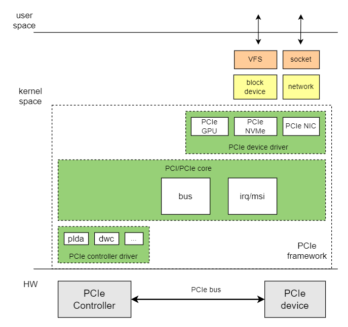

# PCIe

This document describes PCIe functionality and usage on the K3 platform.

## Overview

PCIe (Peripheral Component Interconnect Express) is a high-speed serial computer expansion bus standard that uses point-to-point, full-duplex links. Each connected device has dedicated access to link bandwidth.

The K3 platform provides five PCIe controllers (Port A through Port E) and six independent PHYs. It supports a range of PCIe peripherals, including NVMe SSDs, SATA controllers, and Wi-Fi modules.

**Note:** Port D and the USB3 controller share the same PHY hardware resource and cannot be enabled simultaneously. Enable either PCIe or USB3 in the device tree, as required.

### Functionality



The Linux PCIe subsystem framework consists of the following three components:

1. **PCIe Core**

   - Performs PCIe bus enumeration, resource allocation, and interrupt management.
   - Handles PCIe device addition and removal.
   - Manages PCIe device driver registration and deregistration.

2. **PCIe Controller Driver**

   - Operates the PCIe host controller.

3. **PCIe Device Driver**

   - Provides drivers for specific PCIe devices, such as GPUs, NICs, and NVMe devices.

### Source Code Structure

The PCIe controller driver source is located in `drivers/pci/controller/dwc`:

```
|-- pcie-designware.c           #dwc pcie common driver code
|-- pcie-designware-host.c      #dwc pcie host driver code
|-- pcie-spacemit-k1.c          #k3 pcie controller driver
|-- spacemit_pcie_phy.c         #k3 pcie phy driver
```

## Key Features

### Features

| Feature | Description |
| :-----| :----|
| Supported Modes | RC (Root Complex) mode |
| Supported Protocols and Lane Counts | Gen3x1, Gen3x2, Gen3x4, and Gen3x8 |
| Supported Devices | NVMe SSDs, PCIe-to-SATA devices, PCIe network cards, and PCIe graphics cards |

### Mapping Between Controllers and PHYs

The following table maps the five PCIe controllers to the six PHYs on the K3 platform:

| Controller | Port | Maximum Lane Number | Available PHY | Description |
| :-----| :----| :----| :----| :----|
| pcie0_rc | Port A | x8 | phy0~phy5 | Supports x8, x4, and x2 modes and can aggregate multiple PHYs |
| pcie1_rc | Port B | x2 | phy1 | Available only when Port A operates in x2 mode |
| pcie2_rc | Port C | x2 | phy2, phy3 | Supports x2 (dual-PHY) and x1 modes |
| pcie3_rc | Port D | x1 | phy4 | Shares a PHY with USB3; only one can be used |
| pcie4_rc | Port E | x1 | phy5 | Used independently |

### Performance Parameters

| SSD Model (Capacity) | Sequential Read (MB/s) | Sequential Write (MB/s) | Random Read (4K MB/s) | Random Write (4K MB/s) |
| :-----| :----: | :----: | :----: | :----: |
| Colorful CN600 128GB | 1280 | 1156 | 358 | 352 |
| HS-SSD-C2000Pro 256G | 2150 | 258 | 321 | 209 |
| MAXIO MAP1202 512G | 3470 | 3138 | 282 | 325 |

> The data was measured on `deb1` (K3) with a PCIe Gen3 x4 slot, using the Buildroot 2024.12 + Linux-6.18 SDK and the `fio` test method described below. All random workloads use a 4K block size.

**Test Method**

```
# Sequential Read
fio --name=nvme_seq_read --filename=/mnt/nvme_vfat/fiotest.bin --size=1G --bs=1M --rw=read --ioengine=libaio --direct=1 --iodepth=32 --numjobs=1 --time_based --runtime=30 --group_reporting

# Sequential Write
fio --name=nvme_seq_write --filename=/mnt/nvme_vfat/fiotest.bin --size=1G --bs=1M --rw=write --ioengine=libaio --direct=1 --iodepth=32 --numjobs=1 --time_based --runtime=30 --group_reporting

# Random Read (4K)
fio --name=nvme_rand_read --filename=/mnt/nvme_vfat/fiotest.bin --size=1G --bs=4k --rw=randread --ioengine=libaio --direct=1 --iodepth=32 --numjobs=1 --time_based --runtime=30 --group_reporting

# Random Write (4K)
fio --name=nvme_rand_write --filename=/mnt/nvme_vfat/fiotest.bin --size=1G --bs=4k --rw=randwrite --ioengine=libaio --direct=1 --iodepth=32 --numjobs=1 --time_based --runtime=30 --group_reporting
```

## Configuration

Configuration consists of **Kconfig configuration** and **DTS configuration**.

### Kconfig Configuration

`CONFIG_PCI` enables support for PCI and PCIe bus protocols. This option defaults to `Y`.

```
Device Drivers
    PCI support (PCI [=y])
```

`PCIE_SPACEMIT_K1` enables support for the K3 PCIe controller driver. This option defaults to `Y`.

```
Device Drivers
    PCI support (PCI [=y])
        PCI controller drivers
            DesignWare-based PCIe controllers
                SpacemiT K1 PCIe controller - Host Mode (PCIE_SPACEMIT_K1 [=y])
```

### DTS Configuration

#### Configuration Space Allocation

Each PCIe Root Complex on K3 declares four types of address windows in the DTS: `config` configuration space, `I/O` space, `MEM non-prefetchable` space, and `MEM prefetchable` space. The allocation for each controller in `linux-6.18/arch/riscv/boot/dts/spacemit/k3.dtsi` is as follows:

**Base Address of Each Controller Address Space:**

| Controller | config | I/O | Non-prefetchable MEM | Prefetchable MEM |
| :--- | :--- | :--- | :--- | :--- |
| Port A (`pcie0_rc`) | `0x11_0000_0000` | `0x11_0001_0000` | `0x11_0011_0000` | `0x18_0000_0000` |
| Port B (`pcie1_rc`) | `0x11_8000_0000` | `0x11_8001_0000` | `0x11_8011_0000` | `0x16_0000_0000` |
| Port C (`pcie2_rc`) | `0x12_0000_0000` | `0x12_0001_0000` | `0x12_0011_0000` | `0x15_0000_0000` |
| Port D (`pcie3_rc`) | `0x12_8000_0000` | `0x12_8001_0000` | `0x12_8011_0000` | `0x14_0000_0000` |
| Port E (`pcie4_rc`) | `0x12_c000_0000` | `0x12_c001_0000` | `0x12_c011_0000` | `0x13_0000_0000` |

**Window Sizes:**

| Window Type | Port A / B / C | Port D / E |
| :--- | :---: | :---: |
| config | 64 KiB | 64 KiB |
| I/O | 1 MiB | 1 MiB |
| Non-prefetchable MEM | ~2046.94 MiB (`0x7fef0000`) | ~1022.94 MiB (`0x3fef0000`) |
| Prefetchable MEM | 4 GiB | 4 GiB |

> The non-prefetchable MEM windows for Port D and Port E are smaller because their total address-space windows are smaller than those of Port A, Port B, and Port C. Less space remains after the config and I/O regions are allocated.

##### Configuration Space Description

Port A (`pcie0_rc`) illustrates address-space configuration in the DTS:

```c
pcie0_rc: pcie@80000000 {
        ...
        reg = <0x0 0x80000000 0x0 0x00001000>, /* dbi */
              <0x0 0x80100000 0x0 0x00001000>, /* dbi2 */
              <0x0 0x80300000 0x0 0x00003f20>, /* atu registers */
              <0x11 0x00000000 0x0 0x00010000>, /* config space */
              <0x0 0x82900000 0x0 0x00001000>; /* phy ahb (link) */
        reg-names = "dbi", "dbi2", "atu", "config", "link";
        ranges = <0x01000000 0x00 0x00010000 0x11 0x00010000 0x0 0x00100000>,
                 <0x02000000 0x0 0x00110000 0x11 0x00110000 0x0 0x7fef0000>,
                 <0x43000000 0x18 0x00000000 0x18 0x00000000 0x1 0x00000000>;
        ...
};
```

Each `ranges` entry uses the format `<flags child-bus-address cpu-physical-address size>`. The `flags` field is defined as follows:

| flags | Type |
| :--- | :--- |
| `0x01000000` | I/O space |
| `0x02000000` | 32-bit non-prefetchable memory space |
| `0x43000000` | 64-bit prefetchable memory space |

The three Port A `ranges` entries correspond to the following windows:

| Window | CPU Physical Address | Size |
| :--- | :--- | :--- |
| I/O | `0x11_0001_0000` | `0x0010_0000` (1 MiB) |
| Non-prefetchable MEM | `0x11_0011_0000` | `0x7fef_0000` (~2046.94 MiB) |
| Prefetchable MEM | `0x18_0000_0000` | `0x1_0000_0000` (4 GiB) |

The `config` space is allocated through the `reg` property, with a base address of `0x11_0000_0000` and a size of 64 KiB.

#### PHY Configuration

K3 PCIe uses independent PHY nodes. The PHY and the controller must both be enabled in the board-level DTS.

The PHY node is defined in `k3.dtsi`:

```c
phy0: phy-pcie@81d00000 {
        compatible = "spacemit,k3-pcie-phy";
        reg = <0x0 0x81d00000 0x0 0x1000>;
        spacemit,syscon-apb-spare = <&pll>;
        num-lanes = <2>;
        spacemit,phy-id = <0>;
        #phy-cells = <0>;
        status = "disabled";
};
```

#### pinctrl Configuration

PCIe `pinctrl` handles only sideband signals, not high-speed differential lanes. The data link is bound to the PCIe PHY node through `phys = <&phyX ...>`. `pinctrl` primarily handles the following signals:

- `PERST#`: Device reset signal
- `WAKE#`: Device wake signal
- `CLKREQ#`: Reference clock request signal

Perform configuration in the following order:

1. Use the schematic to identify the sideband signals routed on the board and the PAD group connected to each signal.
2. Locate the corresponding `pcie*_cfg` group in `k3-pinctrl.dtsi`.
3. If the common `pinctrl` group does not exactly match the board-level wiring, redefine the group in the board-level DTS and retain only the PADs in use.

In `K3_PADCONF(pin, func)`, `pin` is the PAD number and `func` is the mux function selected for that PAD. Properties such as `bias-disable`, `bias-pull-up`, `drive-strength`, and `power-source` must match the board-level voltage domain and pull-up configuration.

On `deb1`, the board-level DTS trims the common pinctrl group. For example, `pcie0-1-cfg` retains only `PERST#` and `CLKREQ#`; `WAKE#` is not configured:

```c
pcie0-1-cfg {
        pcie0-0-pins {
                pinmux = <K3_PADCONF(79, 5)>,
                         <K3_PADCONF(81, 5)>;
                bias-pull-up;
                drive-strength = <33>;
                power-source = <1800>;
        };
};
```

The `power-source` field is specified in mV; `<1800>` corresponds to 1.8 V. If the board-level design connects sideband signals to 3.3 V, change this value to `<3300>` according to the schematic to match the PAD voltage domain to the peripheral.

If the board does not route the `WAKE#` signal, override the default pin group in the board-level DTS as shown above rather than applying the three-signal configuration shared in `k3-pinctrl.dtsi`.

#### PERST# Control Methods

The K3 PCIe driver supports two PERST# (reset signal) control methods:

1. **GPIO Control**
2. **PMU Register Control** (default)

**Priority Rule:** The driver first checks for the `reset-gpios` property in the device tree. When the property is present, GPIO controls PERST#; otherwise, the driver uses PMU register control.

##### GPIO Control Method

This method directly controls the PERST# pin level through the GPIO subsystem. It is commonly used when the hardware PERST pin is assigned to another function and a GPIO is used for PERST#.

**Configuration Example**:

```c
&pcie0_rc {
        pinctrl-names = "default";
        pinctrl-0 = <&pcie0_1_cfg>;
        phys = <&phy0>, <&phy1>;
        phy-names = "phy0", "phy1";
        num-lanes = <4>;
        reset-gpios = <&gpio 3 28 GPIO_ACTIVE_LOW>;  /* GPIO_120, active low */
        status = "okay";
};
```

**Parameter Description**:

- `reset-gpios = <&gpio bank pin flags>`
  - `&gpio`: GPIO controller node
  - `bank pin`: GPIO number. For example, `3 28` denotes pin 28 in GPIO bank 3, or global GPIO_120.
  - `flags`: `GPIO_ACTIVE_LOW` specifies active-low operation, which drives the output low when asserted.

##### PMU Register Control Method

This method indirectly controls PERST# through PMU (Power Management Unit) registers. It is the K3 default when `reset-gpios` is not configured in the device tree.

**Configuration Example**:

```c
&pcie0_rc {
        pinctrl-names = "default";
        pinctrl-0 = <&pcie0_1_cfg>;
        phys = <&phy0>, <&phy1>;
        phy-names = "phy0", "phy1";
        num-lanes = <4>;
        /* No reset-gpios configured; driver will use PMU register control */
        status = "okay";
};
```

#### Board DTS Configuration Example (deb1)

The `deb1` board uses `k3_deb1.dts`. It enables `phy0/1/2/3/5` and `pcie0/1/2/4`, while `phy4` and `pcie3_rc` remain disabled.

Port A and Port B are interdependent. Although the `k3_deb1.dts` example sets `pcie0_rc { num-lanes = <4>; }`, the driver reduces Port A to x2 at run time when the bifurcation GPIO is asserted, making the other two lanes available to Port B. Therefore, `pcie1_rc` operation depends on the bifurcation GPIO level, not only on the static DTS `num-lanes` value.

First, enable the relevant PHYs:

```c
&phy0{
        status = "okay";
};

&phy1{
        status = "okay";
};

&phy2{
        status = "okay";
};

&phy3{
        status = "okay";
};

&phy5{
        status = "okay";
};
```

Then configure each PCIe controller:

```c
&pcie0_rc {
        pinctrl-names = "default";
        pinctrl-0 = <&pcie0_1_cfg>;
        phys = <&phy0>, <&phy1>;
        phy-names = "phy0", "phy1";
        num-lanes = <4>;
        spacemit,bifurcation-gpios = <&gpio 2 25 GPIO_ACTIVE_HIGH>;
        status = "okay";
};

&pcie1_rc {
        pinctrl-names = "default";
        pinctrl-0 = <&pcie1_1_cfg>;
        phys = <&phy1>;
        phy-names = "phy1";
        num-lanes = <2>;
        spacemit,device-detect-gpios = <&gpio 2 25 GPIO_ACTIVE_HIGH>;
        status = "okay";
};

&pcie2_rc {
        pinctrl-names = "default";
        pinctrl-0 = <&pcie2_1_cfg>;
        phys = <&phy2>, <&phy3>;
        phy-names = "phy2", "phy3";
        num-lanes = <2>;
        status = "okay";
};

&pcie4_rc {
        pinctrl-names = "default";
        pinctrl-0 = <&pcie4_0_cfg>;
        phys = <&phy5>;
        phy-names = "phy5";
        num-lanes = <1>;
        status = "okay";
};
```
The `spacemit,bifurcation-gpios` property of `pcie0_rc` controls the bifurcation mode of Port A. The `spacemit,device-detect-gpios` property of `pcie1_rc` is a board-level device-detection GPIO. During board-level porting, verify these GPIOs against the schematic together with `status` and `phys`.

**Configuration Description:**

- `pinctrl-0`: Selects the PADs physically connected to sideband signals. Confirm that PERST#/WAKE#/CLKREQ# are routed on the board. If a signal is not routed, trim the pin group as shown earlier to avoid enabling floating PADs.
- `phys` / `phy-names`: Lists the PHYs bound to the controller. The order must match the hardware lane wiring. For example, Port A on `deb1` requires `phy0` + `phy1` to operate at x4.
- `num-lanes`: Specifies the expected lane count. The count must match both the number of lanes routed to the slot and the bifurcation/retimer DIP-switch setting. Document the hardware wiring table for use during debugging.
- `spacemit,bifurcation-gpios`: Whether this property is required depends on the board design. A high level indicates that a device is connected to the other PCIe interface sharing the same PHY. On `deb1`, this determines whether lanes are assigned to Port B.
- `spacemit,device-detect-gpios`: Whether this property is required depends on the board design. A low level indicates that no device is connected to the PCIe interface, allowing the driver to disable unused controllers.
- `status`: Enables or disables the controller.

#### Complete PCIe DTS

The following DTS node defines the `pcie0_rc` (Port A) controller:

```
pcie0_rc: pcie@80000000 {
        compatible = "spacemit,k1-pcie";
        reg = <0x0 0x80000000 0x0 0x00001000>, /* dbi */
              <0x0 0x80100000 0x0 0x00001000>, /* dbi2 */
              <0x0 0x80300000 0x0 0x00003f20>, /* atu registers */
              <0x11 0x00000000 0x0 0x00010000>, /* config space */
              <0x0 0x82900000 0x0 0x00001000>; /* phy ahb (link) */
        reg-names = "dbi", "dbi2", "atu", "config", "link";

        bus-range = <0x00 0xff>;
        max-link-speed = <3>;
        num-lanes = <8>;
        device_type = "pci";
        #address-cells = <3>;
        #size-cells = <2>;
        ranges = <0x01000000 0x00 0x00010000 0x11 0x00010000 0x0 0x00100000>,
                 <0x02000000 0x0 0x00110000 0x11 0x00110000 0x0 0x7fef0000>,
                 <0x43000000 0x18 0x00000000 0x18 0x00000000 0x1 0x00000000>;

        interrupt-parent = <&saplic>;
        interrupts = <141 IRQ_TYPE_LEVEL_HIGH>;
        interrupt-names = "pcie_irq";

        clocks = <&syscon_apmu CLK_APMU_PCIE_PORTA_BUS>,
                 <&syscon_apmu CLK_APMU_PCIE_PORTA_MSTR>,
                 <&syscon_apmu CLK_APMU_PCIE_PORTA_SLV>;
        clock-names = "dbi", "mstr", "slv";
        resets = <&syscon_apmu RESET_APMU_PCIE_PORTA_DBI>,
                 <&syscon_apmu RESET_APMU_PCIE_PORTA_MSTR>,
                 <&syscon_apmu RESET_APMU_PCIE_PORTA_SLV>;
        reset-names = "dbi", "mstr", "slv";

        linux,pci-domain = <0>;
        msi-parent = <&simsic>;
        spacemit,apmu = <&syscon_apmu 0x1f0>;
        iommu-map = <0x0 &iommu 0x00000 0x10000>;

        status = "disabled";
};
```

## Interface

### API

- **Register a PCI device driver:**

```
/* Proper probing supporting hot-pluggable devices */
int __must_check __pci_register_driver(struct pci_driver *, struct module *,
                       const char *mod_name);

/* pci_register_driver() must be a macro so KBUILD_MODNAME can be expanded */
#define pci_register_driver(driver)     \
    __pci_register_driver(driver, THIS_MODULE, KBUILD_MODNAME)
```

- **Unregister a PCI device driver:**

```
void pci_unregister_driver(struct pci_driver *dev);
```

## Debugging

### sysfs

`/sys/bus/pci` provides information about PCI bus devices and drivers:

```
|-- devices                 // Devices on the PCI bus
|-- drivers                 // Drivers registered on the PCI bus
|-- drivers_autoprobe
|-- drivers_probe
|-- rescan
|-- resource_alignment
|-- slots
`-- uevent
```

## Testing

1. View PCI bus topology information.

   ```
   #lspci
   ```

2. View detailed information for a PCI device.

   ```
   lspci -vvvs <BDF>
   ```

3. Test NVMe SSD read performance.

   ```
   fio --name read --eta-newline=5s --filename=/dev/nvme0n1 --rw=read --size=2g --io_size=10g --blocksize=1024k --ioengine=libaio --fsync=10000 --iodepth=32 --direct=1 --numjobs=1 --runtime=60 --group_reporting
   ```

4. Test NVMe SSD write performance.

   ```
   fio --name write --eta-newline=5s --filename=/dev/nvme0n1 --rw=write --size=2g --io_size=60g --blocksize=1024k --ioengine=libaio --fsync=10000 --iodepth=32 --direct=1 --numjobs=1 --runtime=60 --group_reporting
   ```

## Compatibility with 32-bit PCIe EP Devices

### Background

On the K3 platform, all DDR physical addresses are above 4 GiB, beginning at `0x1_0000_0000`. Some PCIe endpoint devices, such as the MT7921E Wi-Fi card, support only 32-bit DMA addressing and cannot access system memory above 4 GiB directly, causing DMA transfer failures.

### Solution

Use a **restricted DMA pool + dma-ranges address mapping** to resolve this issue:

1. Reserve a dedicated DMA memory region.
2. Use the PCIe Address Translation Unit (ATU) to map the 32-bit bus addresses visible to the endpoint device to that physical memory region.
3. The endpoint device performs DMA operations with 32-bit bus addresses, while the PCIe controller performs address translation automatically.

### Kconfig Configuration

Enable the following kernel configurations:

```
CONFIG_SWIOTLB=y                  # Software I/O TLB, provides bounce buffer support
CONFIG_DMA_CMA=y                  # DMA contiguous memory allocation
CONFIG_DMA_RESTRICTED_POOL=y      # Support restricted DMA pool
```

### DTS Configuration

#### 1. Reserve DMA Memory Pool

Add a restricted DMA pool under the `reserved-memory` node. The following example reserves 32 MiB at `0x1_f000_0000`:

```c
reserved-memory {
        #address-cells = <2>;
        #size-cells = <2>;
        ranges;

        pcie_dma_pool: pcie-dma-pool@1f0000000 {
                compatible = "restricted-dma-pool";
                reg = <0x1 0xf0000000 0x0 0x02000000>;  /* 32 MiB */
        };
};
```

#### 2. Configure PCIe Controller Node

Add `dma-ranges` and `memory-region` to the applicable PCIe controller node:

```c
&pcie4_rc {
        /* ... other configuration ... */
        dma-ranges = <0x02000000 0x0 0x80000000 0x1 0xf0000000 0x0 0x02000000>;
        memory-region = <&pcie_dma_pool>;
        status = "okay";
};
```

The `dma-ranges` entry is defined as follows:

| Field | Value | Description |
| :--- | :--- | :--- |
| flags | `0x02000000` | 32-bit non-prefetchable memory space |
| PCIe bus address | `0x0_8000_0000` | DMA address visible to the EP device (32-bit addressable) |
| CPU physical address | `0x1_f000_0000` | Actual physical memory address |
| Size | `0x0_0200_0000` | 32 MiB |

Workflow: The EP device initiates a DMA read or write at bus address `0x8000_0000` → the PCIe ATU translates the address to CPU physical address `0x1_f000_0000` → the access reaches the reserved DMA memory pool.

## FAQ

### 1. SSD Not Detected by the System: How to Diagnose the Issue?

1. **Confirm PCIe bus enumeration.** Run `lspci | grep -i -E "nvme|non-volatile"`. No output indicates that the host has not detected the NVMe device on the PCIe bus.
2. **Verify pin configuration and voltage domains.** The DTS `pinctrl`, `power-source`, and `spacemit,*-gpios` properties must match the board schematic. Confirm the pin number, mux function, PAD power domain, voltage level, and physically connected sideband signals.
3. **Exclude SSD device failure.** Replace the SSD with a known-good NVMe SSD or test the suspected SSD on another known-working platform to determine whether the device is damaged.
4. **Check initialization timing and signal quality.** If the link intermittently drops or link training fails, use an oscilloscope or protocol analyzer to inspect the timing, voltage swing, and signal integrity (SI) of PERST#, CLKREQ#, REFCLK, and other signals. Coordinate with the vendor's engineering support when necessary.

### 2. When Should GPIO Control of PERST# Be Used?

**Recommended Scenario**:

- The schematic explicitly routes PERST# to an independent GPIO pin.

**Configuration Method**:

Add the `reset-gpios` property to the PCIe controller node:

```c
&pcie0_rc {
        reset-gpios = <&gpio 3 28 GPIO_ACTIVE_LOW>;  /* Using GPIO_120 */
        /* ... other configuration ... */
};
```

**Troubleshooting**:

If PCIe does not operate correctly after GPIO configuration:

1. **Confirm the GPIO number.** Verify the GPIO pin connected to PERST# in the schematic.
2. **Check GPIO polarity.** `GPIO_ACTIVE_LOW` indicates active-low operation, which drives the output low when asserted. `GPIO_ACTIVE_HIGH` indicates active-high operation.
3. **Verify GPIO operation.** At boot, run `cat /sys/kernel/debug/gpio` to confirm that the PCIe driver has requested and is controlling the GPIO correctly.
4. **Check kernel logs.** Run `dmesg | grep -i pcie` for GPIO request failures or incorrect GPIO direction settings.

### 3. K3 PCIe Does Not Support 16-bit MSI Message Interrupts

**Background**:

SpacemiT K3 follows the RISC-V AIA protocol specification, and its internal MSI controller (IMSIC) accepts only 32-bit configuration writes.

**Root Cause Analysis**:

Some legacy PCIe peripherals issue 16-bit legacy MSI messages by default, which causes the K3 IMSIC to drop the data directly. This results in the system correctly enumerating the PCI device and assigning it an interrupt number, while the device never actually receives a hardware interrupt response at runtime.

**Determining the Device's MSI Message Width**:

Modify the address to which the PCIe EP writes its MSI interrupt message (i.e., the MSI interrupt controller register address) to point to a specific DDR address, `mem1`, and check the MSI interrupt message value sent by the PCIe EP by reading the value at DDR `mem1`.

```diff
diff --git a/drivers/pci/msi/msi.c b/drivers/pci/msi/msi.c
index 2f647cac4cae..0ba07cbd67b9 100644
--- a/drivers/pci/msi/msi.c
+++ b/drivers/pci/msi/msi.c
@@ -184,17 +184,34 @@ void __pci_read_msi_msg(struct msi_desc *entry, struct msi_msg *msg)
 	}
 }

+static u64 *msi_vaddr = NULL;
+static dma_addr_t msi_dma_handle;
+
 static inline void pci_write_msg_msi(struct pci_dev *dev, struct msi_desc *desc,
 				     struct msi_msg *msg)
 {
 	int pos = dev->msi_cap;
 	u16 msgctl;

+	if (!msi_vaddr) {
+		msi_vaddr = dmam_alloc_coherent(&dev->dev, sizeof(u64),
+						&msi_dma_handle, GFP_KERNEL);
+		if (!msi_vaddr) {
+			pr_err("Failed to allocate MSI address\n");
+			return;
+		}
+		memset(msi_vaddr, 0, 64);
+		dev_info(&dev->dev, "MSI address allocated at 0x%llx, msi vaddr 0x%llx\n",
+				(unsigned long long)msi_dma_handle,
+				(unsigned long long)(uintptr_t)msi_vaddr);
+	}
+
 	pci_read_config_word(dev, pos + PCI_MSI_FLAGS, &msgctl);
 	msgctl &= ~PCI_MSI_FLAGS_QSIZE;
 	msgctl |= FIELD_PREP(PCI_MSI_FLAGS_QSIZE, desc->pci.msi_attrib.multiple);
 	pci_write_config_word(dev, pos + PCI_MSI_FLAGS, msgctl);

+#if 0
 	pci_write_config_dword(dev, pos + PCI_MSI_ADDRESS_LO, msg->address_lo);
 	if (desc->pci.msi_attrib.is_64) {
 		pci_write_config_dword(dev, pos + PCI_MSI_ADDRESS_HI,  msg->address_hi);
@@ -202,6 +219,20 @@ static inline void pci_write_msg_msi(struct pci_dev *dev, struct msi_desc *desc,
 	} else {
 		pci_write_config_word(dev, pos + PCI_MSI_DATA_32, msg->data);
 	}
+#else
+
+	dev_info(&dev->dev, "MSI msg orgin address 0x%08x%08x, data 0x%x\n", msg->address_hi, msg->address_lo, msg->data);
+   /* Write the raw value 0x12345678 to the pcie ep msi interrupt message address; check whether the pcie ep device wrote an msi message, including the width of the message written.
+	 * Assume msg->data is 0x0008, which is also the msi message value the pcie ep writes to the rc side.
+    * If the pcie ep writes a 32-bit message, the content at msi_vaddr will be 0x00000008;
+    * If the pcie ep writes a 16-bit message, the content at msi_vaddr will be 0x12340008
+	 */
+	*msi_vaddr = 0x12345678;
+
+	pci_write_config_dword(dev, pos + PCI_MSI_ADDRESS_LO, msi_dma_handle & 0xFFFFFFFF);
+	if (desc->pci.msi_attrib.is_64) {
+		pci_write_config_dword(dev, pos + PCI_MSI_ADDRESS_HI,  (msi_dma_handle >> 32) & 0xFFFFFFFF);
+		pci_write_config_word(dev, pos + PCI_MSI_DATA_64, msg->data);
+	} else {
+		pci_write_config_word(dev, pos + PCI_MSI_DATA_32, msg->data);
+	}
+
+#endif
 	/* Ensure that the writes are visible in the device */
 	pci_read_config_word(dev, pos + PCI_MSI_FLAGS, &msgctl);
 }
```