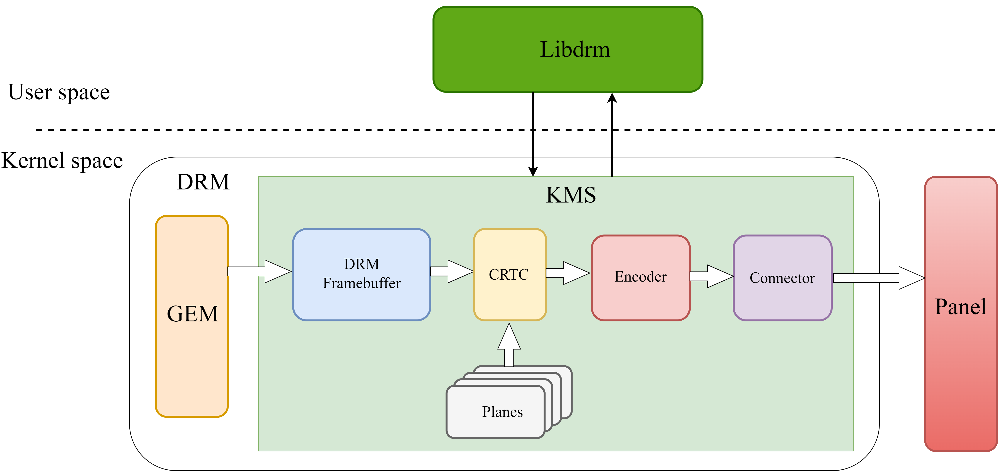
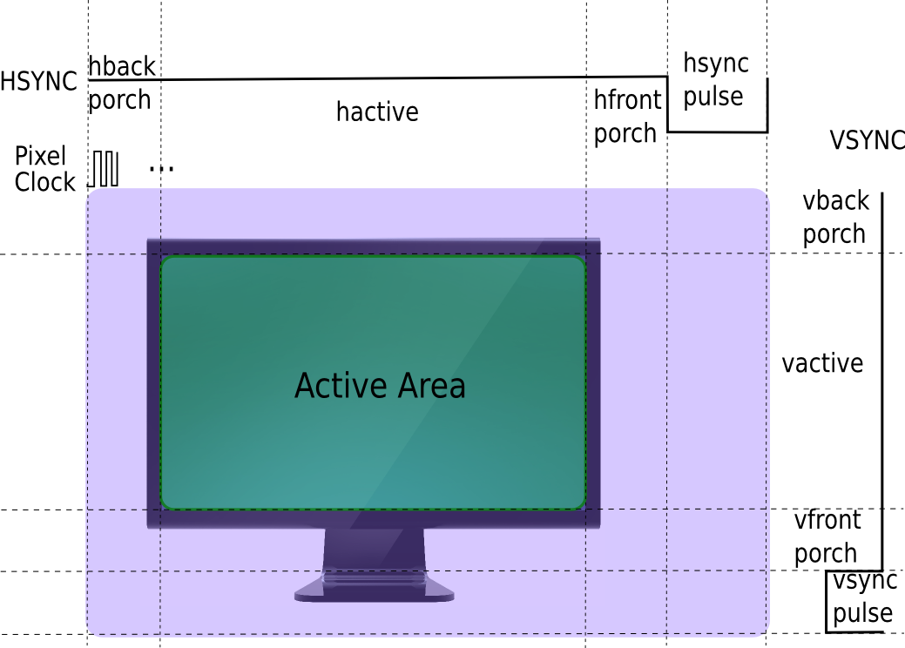

# Display

This document describes the features and usage of the Display module on the SpacemiT platform.

## Module Overview

The Display module on the SpacemiT platform is built on the **DRM framework (Direct Rendering Manager)**. DRM is the standard display subsystem architecture in Linux. It is designed for modern display hardware and supports framebuffer management, display timing configuration, layer composition, and related functions.

### Functional Overview

The DRM framework consists of both **user space** and **kernel space** components.



#### User space: libdrm

In user space, the DRM framework provides the `libdrm` library. Applications use this library to access and manage display resources.

#### Kernel space: DRM driver

The DRM driver provides a set of IOCTL interfaces. These interfaces are mainly divided into the following two categories:

1. **Graphics Execution Manager (GEM)**

	GEM mainly handles framebuffer-related memory management, including:

   - Framebuffer memory allocation and release
   - Shared memory objects
   - Memory synchronization

2. **Kernel Mode-Setting (KMS)**

	KMS is mainly responsible for **display mode configuration** and **image output**. Its core objects include the following:

   - **Framebuffer**
	 - A memory region that is accessible to both the driver and applications.
	 - Stores the display content for a single layer.

   - **CRTC (display controller)**
	 - Converts the image into the hardware timing required by the underlying display pipeline.
     - Also handles frame switching, power control, color adjustment, and related functions.

   - **Planes**
	 - Each image is associated with a plane.
     - Plane attributes control the display region, image flipping, color blending behavior, and similar properties.
	 - The final CRTC output is rendered from a combination of framebuffers and planes, enabling either composed multi-layer output or single-layer output.
     - Planes are divided into the following two types:
       1. **Primary plane:** used to display background or main image content.
       2. **Overlay plane:** typically used for additional content such as video or subtitles.

   - **Encoder**
	 - Handles power management and output video format encapsulation.
	 - Converts timing information into the signal format required by the target display interface, such as HDMI or MIPI DSI.

   - **Connector**
	 - Handles display device attachment and panel parameter detection.
     - Typical examples include HDMI and MIPI DSI.

In kernel space, the display stack also includes a **Panel** module, which converts the received image signal into the final on-screen image.

### Source Tree Overview

The SpacemiT DRM driver source tree is organized as follows:

```
spacemit
├── backlight
│   ├── built-in.a
│   ├── Kconfig
│   ├── Makefile
│   ├── modules.order
│   ├── spacemit-backlight.c
│   ├── spacemit-backlight.h
├── built-in.a
├── common
│   ├── spacemit_drm_notifier.c
│   ├── spacemit_drm_notifier.h
├── dphy
│   ├── spacemit_dphy_drv.c // MIPI DSI DPHY driver
├── dpu
│   ├── dpu_debug.c
│   ├── dpu_debug.h
│   ├── dpu_saturn.c
│   ├── dpu_saturn.h
│   ├── dpu_saturn_hee.c
│   ├── dpu_trace.h
│   ├── post_process_hee.c
│   ├── post_process_hee.h
│   ├── saturn_fbcmem.c
│   ├── saturn_fbcmem.h
│   └── saturn_regs
│       ├── acad.h
│       ├── cmdlist_top.h
│       ├── composer_x.h
│       ├── dpu_ctl_top.h
│       ├── dpu_int.h
│       ├── dpu_scene_ctl.h
│       ├── dpu_top.h
│       ├── dsc_enc_top.h
│       ├── ee.h
│       ├── ltm.h
│       ├── lut_3d.h
│       ├── mmu_tbu_x.h
│       ├── mmu_top.h
│       ├── ops_hee.h
│       ├── postpipe.h
│       ├── prepipe_x.h
│       ├── rc.h
│       ├── rdma_path.h
│       ├── rdma_top.h
│       ├── reg_map.h
│       ├── reg_map_hee.h
│       ├── scale_x.h
│       ├── tmg.h
│       ├── usr_gma.h
│       └── wb.h
├── dsi
│   ├── spacemit_dptc_drv.c
│   ├── spacemit_dptc_drv.h
│   ├── spacemit_dsi_drv.c
│   └── spacemit_dsi_hw.h
├── Kconfig
├── Makefile
├── raspberrypi_touchscreen.c
├── selftest
│   ├── Kconfig
│   ├── Makefile
│   └── test-spacemit_fbcmem.c
├── spacemit_bootloader.c
├── spacemit_bootloader.h
├── spacemit_cmdlist.c
├── spacemit_cmdlist.h
├── spacemit_crtc.c
├── spacemit_crtc.h
├── spacemit_dmmu.c
├── spacemit_dmmu.h
├── spacemit_dphy.c
├── spacemit_dphy.h
├── spacemit_dpu_reg.h
├── spacemit_drm.c
├── spacemit_drm.h
├── spacemit_dsi.c
├── spacemit_dsi.h
├── spacemit_gem.c
├── spacemit_gem.h
├── spacemit_inno_dp.c
├── spacemit_inno_dp.h
├── spacemit_lib.c
├── spacemit_lib.h
├── spacemit_mipi_panel.c
├── spacemit_mipi_panel.h
├── spacemit_planes.c
├── spacemit_wb.c
├── spacemit_wb.h
└── sysfs
    ├── sysfs_class.c
    ├── sysfs_display.h
    ├── sysfs_dphy.c
    ├── sysfs_dpu.c
    ├── sysfs_dsi.c
    └── sysfs_mipi_panel.c
```

## Key Features

### Feature Summary

| Feature | Description |
| :-- | :-- |
| MIPI DSI support | Supports MIPI DPHY v1.2, up to 8 DPHY lanes, and up to 4.5 Gbps per lane |
| DP support | Supports DP 1.2, with 1/2/4 lanes and 5.4 Gbps per lane |
| eDP support | Supports eDP 1.4, with 1/2/4 lanes and 5.4 Gbps per lane |
| Writeback support | Supports online composition with writeback and offline writeback. These two modes cannot operate at the same time |

### Performance

| Display interface | Performance specification |
| :-- | :-- |
| MIPI DSI | 2560x1400@90 FPS |
| DP | 3840x2160@60 FPS |
| DP | 2560x1400@90 FPS |
| eDP | 3840x2160@60 FPS |
| eDP | 2560x1400@90 FPS |

**Display frame rate test method:**

- View connectors:

```
# modetest -M spacemit -D /dev/dri/card0 -c
# Parameter description:
# -M spacemit: specifies the DRM driver module name as spacemit
# -D /dev/dri/card0: specifies the DRM device node path
# -c: lists all available connectors
Connectors:
id      encoder status          name            size (mm)       modes   encoders
257     256     connected       DSI-1           95x53           1       256
  modes:
        index name refresh (Hz) hdisp hss hse htot vdisp vss vse vtot
  #0 800x480 57.74 800 801 803 849 480 487 489 510 25000 flags: ; type: preferred, driver
  props:
        1 EDID:
                flags: immutable blob
                blobs:

                value:
        2 DPMS:
                flags: enum
                enums: On=0 Standby=1 Suspend=2 Off=3
                value: 0
        5 link-status:
                flags: enum
                enums: Good=0 Bad=1
                value: 0
        6 non-desktop:
                flags: immutable range
                values: 0 1
                value: 0
        4 TILE:
                flags: immutable blob
                blobs:

                value:
        258 panel_name:
                flags: immutable blob
                blobs:

                value:

```

- View encoders:

```
# modetest -M spacemit -D /dev/dri/card0 -e
# Parameter description:
# -M spacemit: specifies the DRM driver module name as spacemit
# -D /dev/dri/card0: specifies the DRM device node path
# -e: lists all available encoders
Encoders:
id      crtc    type    possible crtcs  possible clones
256     241     DSI     0x00000001      0x00000003
260     0       Virtual 0x00000001      0x00000003

```

- Test display frame rate:

```
# modetest -M spacemit -D /dev/dri/card0 -s 257@241:800x480 -v
# Parameter description:
# -M spacemit: specifies the DRM driver module name as spacemit
# -D /dev/dri/card0: specifies the DRM device node path
# -s <connector_id>@<crtc_id>:<mode>: sets the display mode
#    connector_id: connector ID from the -c output, for example 257 (DSI-1)
#    crtc_id: CRTC ID from the -e output, for example 241
#    mode: resolution in <width>x<height> format, for example 800x480
# -v: enables vertical sync and prints frame rate statistics
setting mode 800x480-57.74Hz on connectors 257, crtc 241
failed to set gamma: Function not implemented
freq: 59.34Hz
freq: 59.12Hz
freq: 59.12Hz

```

## Configuration

Configuration mainly includes **Display driver enablement** and **DTS configuration**. The K3 chip provides two display pipelines:

- Pipeline 0 supports the MIPI DSI interface or the DP/eDP interface.
- Pipeline 1 supports the DP/eDP interface.

### CONFIG Options

`CONFIG_DRM_SPACEMIT`: DRM driver option for the SpacemiT platform. By default, this option is set to `Y`.
It is also a prerequisite for enabling either the MIPI DSI driver or the DP/eDP driver.
Depending on the target design, the display output can be configured as MIPI only, DP/eDP only, or both.

```
 Device Drivers  --->
  Graphics support  ---> 
   <*> DRM Support for Spacemit
   < >   mipi panel support for SPACEMIT SOCs platform
   < >   Spacemit specific extensions for inno dp/edp
```

#### MIPI DSI CONFIG

`CONFIG_SPACEMIT_MIPI_PANEL`: MIPI DSI driver option for the SpacemiT platform. Configure this option according to the selected hardware design.

```
 Device Drivers  --->
  Graphics support  ---> 
   <*> DRM Support for Spacemit
   <*>   mipi panel support for SPACEMIT SOCs platform
```

#### DP/eDP CONFIG

`CONFIG_SPACEMIT_HDMI`: DP/eDP driver option for the SpacemiT platform. Configure this option according to the selected hardware design.

```
 Device Drivers  --->
  Graphics support  ---> 
   <*> DRM Support for Spacemit
   <*>   Spacemit specific extensions for inno dp/edp
```

### DTS Configuration

#### MIPI DSI

##### GPIO

MIPI DSI panel GPIO configuration includes the following items:

- Panel reset GPIO
- Panel backlight control GPIO
- Panel power control GPIO

**New configuration method (recommended):**

The following example uses the `k3_evb` design and configures the `reset-gpios`, `bl-gpios`, `dc0-gpios`, and `dc1-gpios` properties:

```c
// linux-6.18\arch\riscv\boot\dts\spacemit\k3_evb.dts
&dsi0 {
	status = "okay";

 panel0: panel0@0 {
  status = "ok";
  compatible = "spacemit,mipi-panel";
  reg = <0>;
  reset-gpios = <&gpio 1 31 GPIO_ACTIVE_HIGH>;  // Configures the panel reset GPIO (gpio63)
  bl-gpios = <&gpio 1 29 GPIO_ACTIVE_HIGH>;     // Configures the panel backlight control GPIO (gpio61)
  dc0-gpios = <&gpio 1 24 GPIO_ACTIVE_HIGH>;    // Configures panel power control GPIO0 (gpio56)
  dc1-gpios = <&gpio 1 25 GPIO_ACTIVE_HIGH>;    // Configures panel power control GPIO1 (gpio57)
  id = <2>;
  force-attached = "lcd_icnl9911c_mipi";
 };
};
```

#### Clock Configuration

MIPI DSI clock configuration includes the following:

- MIPI DSI DPU clock settings
- Reset settings
- MIPI DSI DPHY clock settings

The `pixel clock` and `bit clock` values are calculated from timing parameters. For the calculation method, refer to the **Display Timing Configuration** section.

- `clock-frequency` in `display-timings` is the pixel clock.
- `spacemit-dpu-bitclk` in the MIPI DSI DPU and `phy-bit-clock` in the MIPI DSI DPHY are the bit clock.
- Configure the MIPI DSI DPU ESCCLK and MIPI DSI DPHY ESCCLK as `51200000` or `76800000`. For resolutions above 1920x1080, `76800000` is recommended.
- Other clock parameters use system defaults and do not need to be specified in the DTS file.

The following example configures MIPI DSI DPU clocks and resets on the platform:

```c
// linux-6.18/arch/riscv/boot/dts/spacemit/lcd_dsi_panel.dtsi
// SPDX-License-Identifier: (GPL-2.0 OR MIT)
/* Copyright (c) 2025 Spacemit, Inc */

&soc {

 display-subsystem-dsi {
  compatible = "spacemit,saturn-hee";
  reg = <0 0xc0340000 0 0x54000>;
  hw_ver = <2>;
  ports = <&dpu_crtc0>, <&dpu_crtc1>; // dpu_crtc0 is used for online composition and writeback; dpu_crtc1 is used for offline writeback
 };

	dpu_crtc0: dpu_crtc0 {
		compatible = "spacemit,dpu-saturn";
		reg = <0x0 0xd421a800 0x0 0x200>,
			<0x0 0xd421aa00 0x0 0x200>;
		interrupt-parent = <&saplic>;
		interrupts = <90 IRQ_TYPE_LEVEL_HIGH>;
		interrupt-names = "ONLINE_IRQ";
		clocks = <&syscon_apmu CLK_APMU_LCD_PXCLK>,
			<&syscon_apmu CLK_APMU_LCD_MCLK>,
			<&syscon_apmu CLK_APMU_LCD_HCLK>,
			<&syscon_apmu CLK_APMU_DSI_ESC>,
			<&syscon_apmu CLK_APMU_DPU_ACLK>,
			<&syscon_apmu CLK_APMU_LCD_DSC>;
		clock-names = "pxclk", "mclk", "hclk", "escclk", "aclk", "dscclk";
		resets = <&syscon_apmu RESET_APMU_LCD_MCLK>,
			<&syscon_apmu RESET_APMU_LCD>,
			<&syscon_apmu RESET_APMU_DSI_ESC>,
			<&syscon_apmu RESET_APMU_DPU_ACLK>,
			<&syscon_apmu RESET_APMU_LCD_DSCCLK>;
		reset-names= "mclk_reset", "lcd_reset", "esc_reset", "aclk_reset", "dsc_reset";
		power-domains = <&power K3_PMU_LCD0_PWR_DOMAIN>;
		pipeline-id = <1>;
		is_edp = <0>;
		dpu-id = <0>;
		ip = "spacemit-saturn";
		spacemit-dpu-min-mclk = <40960000>;
		spacemit-dpu-dsipll;
		status = "disabled";

		ports {
			#address-cells = <1>;
			#size-cells = <0>;

			port@0 {
				reg = <0>;
				#address-cells = <1>;
				#size-cells = <0>;

				dpu_crtc0_out0: endpoint@0 {
					reg = <0>;
					remote-endpoint = <&dsi0_in>;
				};

				dpu_crtc0_out1: endpoint@1 {
					reg = <1>;
					remote-endpoint = <&wb0_in0>;
				};
			};
		};
	};

	dpu_crtc1: dpu_crtc1 {
		compatible = "spacemit,dpu-saturn";
		reg = <0x0 0xd421a800 0x0 0x200>,
			<0x0 0xd421aa00 0x0 0x200>;
		interrupt-parent = <&saplic>;
		interrupts = <89 IRQ_TYPE_LEVEL_HIGH>;
		interrupt-names = "OFFLINE_IRQ";
		clocks = <&syscon_apmu CLK_APMU_LCD_PXCLK>,
			<&syscon_apmu CLK_APMU_LCD_MCLK>,
			<&syscon_apmu CLK_APMU_LCD_HCLK>,
			<&syscon_apmu CLK_APMU_DSI_ESC>,
			<&syscon_apmu CLK_APMU_DPU_ACLK>,
			<&syscon_apmu CLK_APMU_LCD_DSC>;
		clock-names = "pxclk", "mclk", "hclk", "escclk", "aclk", "dscclk";
		resets = <&syscon_apmu RESET_APMU_LCD_MCLK>,
			<&syscon_apmu RESET_APMU_LCD>,
			<&syscon_apmu RESET_APMU_DSI_ESC>,
			<&syscon_apmu RESET_APMU_DPU_ACLK>,
			<&syscon_apmu RESET_APMU_LCD_DSCCLK>;
		reset-names= "mclk_reset", "lcd_reset", "esc_reset", "aclk_reset", "dsc_reset";
		power-domains = <&power K3_PMU_LCD0_PWR_DOMAIN>;
		pipeline-id = <2>;
		is_edp = <1>;
		ip = "spacemit-saturn";
		spacemit-dpu-min-mclk = <40960000>;
		status = "disabled";
		ports {
			#address-cells = <1>;
			#size-cells = <0>;

			port@0 {
				reg = <0>;
				dpu_crtc1_out0: endpoint@0 {
					remote-endpoint = <&wb0_in1>;
				};
			};
		};
	};

	dsi0: dsi0@d421a800 {
		compatible = "spacemit,dsi-host";
		#address-cells = <1>;
		#size-cells = <0>;
		reg = <0 0xd421a800 0 0x200>;
		interrupt-parent = <&saplic>;
		interrupts = <79 IRQ_TYPE_LEVEL_HIGH>;
		ip = "synopsys-dhost";
		dev-id = <2>;
		status = "disabled";

		ports {
			#address-cells = <1>;
			#size-cells = <0>;

			port@0 {
				reg = <0>;
				dsi0_out: endpoint {
					remote-endpoint = <&dphy0_in>;
				};
			};

			port@1 {
				reg = <1>;
				dsi0_in: endpoint {
					remote-endpoint = <&dpu_crtc0_out0>;
				};
			};
		};
	};

	wb0 {
		compatible = "spacemit,wb0";
		dev-id = <0>;
		status = "ok";
		ports {
			#address-cells = <1>;
			#size-cells = <0>;
			port@0 {
				reg = <0>;
				wb0_in0: endpoint {
					remote-endpoint = <&dpu_crtc0_out1>;
				};
			};
			port@1 {
				reg = <1>;
				wb0_in1: endpoint {
					remote-endpoint = <&dpu_crtc1_out0>;
				};
			};
		};
	};

	dphy0: dphy0@d421a800 {
		compatible = "spacemit,dsi-phy";
		#address-cells = <1>;
		#size-cells = <0>;
		reg = <0 0xd421a800 0 0x200>;
		ip = "spacemit-dphy";
		dev-id = <2>;
		status = "ok";

		port@0 {
			reg = <0>;
			dphy0_in: endpoint {
				remote-endpoint = <&dsi0_out>;
			};
		};
	};
};
```

The following example configures the MIPI DSI DPU `bitclk` and `escclk` for the target design.

The example below uses `k3-x_evb`:

```c
// linux-6.18/arch/riscv/boot/dts/spacemit/k3_evb.dts
&dpu_crtc0 {
	memory-region = <&dpu_resv0>;
	spacemit-dpu-bitclk = <624000000>;
	status = "okay";
};
```

The following example configures the MIPI DSI DPHY `bitclk` and `escclk` for a specific panel model.

The example below uses the `lcd_icnl9911c_mipi` panel:

```c
// linux-6.18/arch/riscv/boot/dts/spacemit/lcd/lcd_icnl9911c_mipi.dtsi
/ { lcds: lcds {
	lcd_icnl9911c_mipi: lcd_icnl9911c_mipi {

     phy-freq = <624000>;   // MIPI DSI DPHY bitclk configuration
     phy-esc-clock = <76800000>;     // MIPI DSI DPHY escclk configuration
 };

};};
```

#### Display Timing Configuration

Fill in the DPU timing configuration and MIPI DSI timing configuration based on the timing information in the MIPI DSI panel specification. The pixel clock and bit clock are then calculated from these timing parameters.



##### Display Timing Parameter Description

- **HFP**
  - Horizontal front porch.
  - The blanking interval before the horizontal sync signal, used to prepare the display device.

- **HBP**
  - Horizontal back porch.
  - The blanking interval after the horizontal sync signal, used for display reset and recovery.

- **HSYNC**
  - Horizontal sync pulse.
  - Synchronizes line scanning on the display device. The pulse width defines how long the horizontal sync signal remains active.

- **VFP**
  - Vertical front porch.
  - The blanking interval before the vertical sync signal, used to prepare the display device.

- **VBP**
  - Vertical back porch.
  - The blanking interval after the vertical sync signal, used for display reset and recovery.

- **VSYNC**
  - Vertical sync pulse.
  - Synchronizes the display refresh cycle. The pulse width defines how long the vertical sync signal remains active.

- **HACTIVE**
  - Horizontal active display period.
  - The number of valid pixels in each display line.

- **VACTIVE**
  - Vertical active display period.
  - The number of valid display lines in each frame.

#### Display Timing Calculation Method

The following parameters and formulas are used.

- **FPS (Frames Per Second)**
  - The number of frames displayed per second.

- **Bpp (Bits Per Pixel)**
  - The bit depth used for each pixel.

- **Htotal (total horizontal pixels)**
  - The total number of pixels in each line.

   ```
   Htotal = hactive + HFP + HSYNC pulse + HBP
   ```

- **Vtotal (total vertical lines)**
  - The total number of lines in each frame.

   ```
   vtotal = vactive + VFP + VSYNC pulse + VBP
   ```

- **Pixel clock**
  - The frequency at which pixel data is transmitted or processed.
  - Calculation method:

   ```
  pixel clock = htotal * vtotal * fps = (hactive + hfp + hbp + hsync) * (vactive + vfp + vbp + vsync) * fps
   ```

- **Bit clock**
  - The per-lane data transmission clock used by MIPI DSI.
  - On the SpacemiT platform, the driver uses `bitclk_min` and `bitclk_max` to constrain the PLL lock range. The `phy-bit-clock` configured in DTS must fall within this range.

  Calculation method:

   ```
   bitclk_min = (((hactive × bpp(3) + hbp × bpp(3) + 2 × lane_number) × pixel clock/1000000) / ((hsync+hbp+hactive-0.65 × pixel clock/1000000) × lane_number) + 1)×8

   bitclk_max  = pixel clock × 4 × 8 / lane_number

   Select a configuration value between bitclk_min and bitclk_max.
   ```

- **DSI clock**
  - The actual clock signal on the MIPI DSI clock lane.
  - Because dual-edge sampling is used, one clock cycle transmits two bits.

   ```
   dsi clock = bit clock / 2
   ```

**Note:**

When calculating the MIPI DSI bit clock on the SpacemiT platform, first compute the `bitclk_min` and `bitclk_max` range with the formulas above. The `phy-bit-clock` configured in DTS must fall within that range.

The following example uses the `lcd_icnl9911c_mipi` MIPI DSI panel to show how to calculate and configure the pixel clock and bit clock.

**Pixel clock calculation**

```
pixel clock = (hactive + hfp + hbp + hsync) * (vactive + vfp + vbp + vsync) * fps 
     = (720 + 48 + 48 + 4) * (1600 + 150 + 32 + 4) * 60 
     = 820 × 1786 × 60
     = 87,847,200 Hz ≈ 88 MHz
```

**Bit clock calculation**

```
bitclk_min = (((hactive × bpp + hbp × bpp + 2 × lane_number) × pixel clock/1000000) / ((hsync+hbp+hactive-0.65 × pixel clock/1000000) × lane_number) + 1) × 8
           = (((720 × 3 + 48 × 3 + 2 × 4) × 87.9012) / ((4+48+720-0.65 × 87.9012) × 4) + 1) × 8
           = (((2160 + 144 + 8) × 87.9012) / ((772 - 57.136) × 4) + 1) × 8
           = ((2312 × 87.9012) / (714.864 × 4) + 1) × 8
           = (203226.3744 / 2859.456 + 1) × 8
           = (71.06 + 1) × 8
           = 72.06 × 8
           ≈ 576.48 MHz

bitclk_max = pixel clock × 4 × 8 / lane_number
           = 87,847,200 × 4 × 8 / 4
           = 702,777,600 Hz ≈ 703 MHz

Selected configuration value: 600 MHz

The `bitclk_min` and `bitclk_max` range is obtained directly from the formulas above.
```

Based on the display timing calculation:

- The pixel clock is 87,847,200 Hz and is configured as 88,000,000 Hz.
- The bit clock must be selected between `bitclk_min` and `bitclk_max`. In this example, the configured value is 624,000,000 Hz.

DTS configuration recommendation:

- `clock-frequency = 88000000`
- `spacemit-dpu-bitclk = 624000000`

---

For MIPI DSI panels that have already completed functional bring-up, the related `.dtsi` files are stored in the `lcd` directory.

```
linux-6.6/arch/riscv/boot/dts/spacemit/lcd$ tree
.
|-- lcd_gc9503v_mipi.dtsi
|-- lcd_icnl9911c_mipi.dtsi
|-- lcd_nt36523_mipi.dtsi
|-- lcd_tc358762xbg_dpi_800x480.dtsi
```

##### Panel Configuration

To enable a MIPI DSI panel, enable the following components:

- MIPI DSI DPU
- MIPI DSI host
- LCD panel node (`lcds`)
- The selected panel model
- GPIO-based backlight control

The following example uses the `k3_evb` design. The required configuration is:

- Enable `dpu_crtc0`
- Enable `dsi0`
- Enable `lcds`
- Select the `lcd_icnl9911c_mipi` panel
- Configure GPIO backlight control, or replace it with PWM if required

```c
// linux-6.18/arch/riscv/boot/dts/spacemit/k3_evb.dts
&dpu_crtc0 {
	spacemit-dpu-bitclk = <600000000>;
	memory-region = <&dpu_resv0>;
	status = "okay";
};

&dpu_crtc1 {
 memory-region = <&dpu_resv1>;
 status = "disabled";
}; // Used for offline writeback and not required in the default configuration

&dsi0 {
	status = "okay";

	panel0: panel0@0 {
		status = "ok";
		compatible = "spacemit,mipi-panel";
		reg = <0>;
		reset-gpios = <&gpio 1 31 GPIO_ACTIVE_HIGH>;
		dc0-gpios = <&gpio 1 24 GPIO_ACTIVE_HIGH>;
		dc1-gpios = <&gpio 1 25 GPIO_ACTIVE_HIGH>;
		id = <2>;
		force-attached = "lcd_icnl9911c_mipi";
	};
};

&lcds {
	status = "okay";
};
```

##### DTS Configuration Examples

**MIPI DSI panel configuration example:**

The following example uses the `lcd_icnl9911c_mipi` MIPI DSI panel.

```c
// linux-6.18/arch/riscv/boot/dts/spacemit/lcd/lcd_icnl9911c_mipi.dtsi
// SPDX-License-Identifier: GPL-2.0

/ { lcds: lcds {
	lcd_icnl9911c_mipi: lcd_icnl9911c_mipi {
		dsi-work-mode = <1>; /* video burst mode*/
		dsi-lane-number = <4>;
		dsi-color-format = "rgb888";
		width-mm = <72>;
		height-mm = <126>;
		use-dcs-write;

		/*mipi info*/
		height = <1600>;
		width = <720>;
		hfp = <48>;
		hbp = <48>;
		hsync = <4>;
		vfp = <150>;
		vbp = <32>;
		vsync = <4>;
		fps = <60>;
		work-mode = <0>;
		rgb-mode = <3>;
		lane-number = <4>;
		phy-freq = <624000>;
		phy-escape-clock = <52000>;
		phy-bit-clock = <624000000>;
		split-enable = <0>;
		eotp-enable = <0>;
		burst-mode = <2>;
		esd-check-enable = <0>;
		vpn-tx-dly-cnt = <76>;
		vpn-dly-cnt = <540>;

		/* DSI_CMD, DSI_MODE, timeout, len, cmd */
		initial-command = [
			39 01 00 03 F0 5A 59
			39 01 00 03 F1 A5 A6
			39 01 00 21 B0 83 82 86 87 06 07 04 05 33 33 33 33 20 00 00 77 00 00 3F 05 04 03 02 01 02 03 04 00 00 00 00 00
			39 01 00 1e B1 13 91 8E 81 20 00 00 77 00 00 04 08 54 00 00 00 44 40 02 01 40 02 01 40 02 01 40 02 01
			39 01 00 12 B2 54 C4 82 05 40 02 01 40 02 01 05 05 54 0C 0C 0D 0B
			39 01 00 20 B3 12 00 00 00 00 26 26 91 91 91 91 3C 26 00 18 01 02 08 20 30 08 09 44 20 40 20 40 08 09 22 33
			39 01 00 1D B4 03 00 00 06 1E 1F 0C 0E 10 12 14 16 04 03 03 03 03 03 03 03 03 03 FF FF FC 00 00 00
			39 01 00 1D B5 03 00 00 07 1E 1F 0D 0F 11 13 15 17 05 03 03 03 03 03 03 03 03 03 FF FF FC 00 00 00
			39 01 00 19 B8 00 00 00 00 00 00 00 00 00 00 00 00 00 00 00 00 00 00 00 00 00 00 00 00
			39 01 00 03 BA 6B 6B
			39 01 00 0E BB 01 05 09 11 0D 19 1D 55 25 69 00 21 25
			39 01 00 0F BC 00 00 00 00 02 20 FF 00 03 33 01 73 33 02
			39 01 00 0B BD E9 02 4F CF 72 A4 08 44 AE 15
			39 01 00 0D BE 7D 7D 5A 46 0C 77 43 07 0E 0E 00 00
			39 01 00 09 BF 07 25 07 25 7F 00 11 04
			39 01 00 0D C0 10 FF FF FF FF FF 00 FF 00 00 00 00
			39 01 00 14 C1 C0 20 20 96 04 32 32 04 2A 40 36 00 07 CF FF FF C0 00 C0
			39 01 00 02 C2 00
			39 01 00 10 C2 CC 01 10 00 01 30 02 21 43 00 01 30 02 21 43
			39 01 00 0D C3 06 00 FF 00 FF 00 00 81 01 00 00 00
			39 01 00 0D C4 84 03 2B 41 00 3C 00 03 03 3E 00 00
			39 01 00 0C C5 03 1C C0 C0 40 10 42 44 0F 0A 14
			39 01 00 0B C6 87 A0 2A 29 29 00 64 37 08 04
			39 01 00 17 C7 F7 D3 BA A5 80 63 36 8B 56 2A FF CE 23 F4 D3 A4 86 5A 1A 7F E4 00
			39 01 00 17 C8 F7 D3 BA A5 80 63 36 8B 56 2A FF CE 23 F4 D3 A4 86 5A 1A 7F E4 00
			39 01 00 09 D0 80 0D FF 0F 61 0B 08 0C
			39 01 00 0E D2 42 0C 30 01 80 26 04 00 00 C3 00 00 00
			39 01 00 03 F1 5A 59
			39 01 00 03 F0 A5 A6
			39 01 00 02 35 00
			39 01 96 01 11
			39 01 32 01 29
		];
		sleep-in-command = [
			39 01 00 02 26 08
			39 01 78 01 28
			39 01 78 01 10
		];
		sleep-out-command = [
			39 01 96 01 11
			39 01 32 01 29
		];
		read-id-command = [
			37 01 00 01 01
			14 01 00 01 04
		];

		display-timings {
			timing0 {
				clock-frequency = <87870000>;
				hactive = <720>;
				hfront-porch = <48>;
				hback-porch = <48>;
				hsync-len = <4>;
				vactive = <1600>;
				vfront-porch = <150>;
				vback-porch = <32>;
				vsync-len = <4>;
				vsync-active = <1>;
				hsync-active = <1>;
			};
		};
	};
};};

```

**Board-level configuration example:**

The following example uses the `k3_evb` design, selects the `lcd_icnl9911c_mipi` MIPI DSI panel, and configures the board-level MIPI DSI settings.

```c
// linux-6.18/arch/riscv/boot/dts/spacemit/k3_evb.dts
&dpu_crtc0 {
	memory-region = <&dpu_resv0>;
	status = "okay";
};

&dpu_crtc1 {
	memory-region = <&dpu_resv1>;
	status = "okay";
};

&dsi0 {
	status = "okay";

	panel0: panel0@0 {
		status = "ok";
		compatible = "spacemit,mipi-panel";
		reg = <0>;
		reset-gpios = <&gpio 1 31 GPIO_ACTIVE_HIGH>;
		bl-gpios = <&gpio 1 29 GPIO_ACTIVE_HIGH>;
		dc0-gpios = <&gpio 1 24 GPIO_ACTIVE_HIGH>;
		dc1-gpios = <&gpio 1 25 GPIO_ACTIVE_HIGH>;
		id = <2>;
		force-attached = "lcd_icnl9911c_mipi";
	};
};

&lcds {
	status = "okay";
};

&pwm19 {
	pinctrl-names = "default";
	pinctrl-0 = <&pwm19_1_cfg>;
	status = "okay";
};

&pwm_bl {                                       // Backlight configuration
	pwms = <&pwm19 2000>;
	brightness-levels = <
		0   20  20  20  21  21  21  22  22  22  23  23  23  24  24  24
		25  25  25  26  26  26  27  27  27  28  28  29  29  30  30  31
		32  33  34  35  36  37  38  39  40  41  42  43  44  45  46  47
		48  49  50  51  52  53  54  55  56  57  58  59  60  61  62  63
		64  65  66  67  68  69  70  71  72  73  74  75  76  77  78  79
		80  81  82  83  84  85  86  87  88  89  90  91  92  93  94  95
		96  97  98  99  100 101 102 103 104 105 106 107 108 109 110 111
		112 113 114 115 116 117 118 119 120 121 122 123 124 125 126 127
		128 129 130 131 132 133 134 135 136 137 138 139 140 141 142 143
		144 145 146 147 148 149 150 151 152 153 154 155 156 157 158 159
		160 161 162 163 164 165 166 167 168 169 170 171 172 173 174 175
		176 177 178 179 180 181 182 183 184 185 186 187 188 189 190 191
		192 193 194 195 196 197 198 199 200 201 202 203 204 205 206 207
		208 209 210 211 212 213 214 215 216 217 218 219 220 221 222 223
		224 225 226 227 228 229 230 231 232 233 234 235 236 237 238 239
		240 241 242 243 244 245 246 247 248 249 250 251 252 253 254 255
	>;
	default-brightness-level = <50>;
	status = "okay";
};
```

#### DP

##### `pinctrl` Configuration

Four display interfaces are supported: DP0, EDP0, EDP1, and DP1. Each interface supports multiple selectable `pinctrl` groups:

- **EDP0:** `edp0_0_cfg`, `edp0_1_cfg`
- **EDP1:** `edp1_0_cfg`
- **DP0:** `dp0_0_cfg`, `dp0_1_cfg`, `dp0_2_cfg`, `dp0_3_cfg`
- **DP1:** `dp1_0_cfg`, `dp1_1_cfg`, `dp1_2_cfg`, `dp1_3_cfg`

```c
// linux-6.18/arch/riscv/boot/dts/spacemit/k3-pinctrl.dtsi
	/* edp only for edp */
	edp0_0_cfg: edp0-0-cfg {
		edp0-0-pins {
			pinmux = <K3_PADCONF(30, 6)>;	/* edp0 hpd */

			bias-disable;			/* normal bias disable */
			drive-strength = <25>;		/* DS8 */
		};
	};

	edp0_1_cfg: edp0-1-cfg {
		edp0-0-pins {
			pinmux = <K3_PADCONF(57, 4)>;	/* edp0 hpd */

			bias-disable;			/* normal bias disable */
			drive-strength = <25>;		/* DS8 */
		};
	};

	edp1_0_cfg: edp1-0-cfg {
		edp1-0-pins {
			pinmux = <K3_PADCONF(31, 6)>;	/* edp1 hpd */

			bias-disable;			/* normal bias disable */
			drive-strength = <25>;		/* DS8 */
		};
	};

	/* dp only for edp&dp */
	dp0_0_cfg: dp0-0-cfg {
		dp0-0-pins {
			pinmux = <K3_PADCONF(9, 6)>;	/* dp0 hpd */

			bias-disable;			/* normal bias disable */
			drive-strength = <25>;		/* DS8 */
		};
	};

	dp0_1_cfg: dp0-1-cfg {
		dp0-0-pins {
			pinmux = <K3_PADCONF(23, 6)>;	/* dp0 hpd */

			bias-disable;			/* normal bias disable */
			drive-strength = <25>;		/* DS8 */
		};
	};

	dp0_2_cfg: dp0-2-cfg {
		dp0-0-pins {
			pinmux = <K3_PADCONF(97, 5)>;	/* dp0 hpd */

			bias-disable;			/* normal bias disable */
			drive-strength = <25>;		/* DS8 */
			power-source= <3300>;
		};
	};

	dp0_3_cfg: dp0-3-cfg {
		dp0-0-pins {
			pinmux = <K3_PADCONF(124, 4)>;	/* dp0 hpd */

			bias-disable;			/* normal bias disable */
			drive-strength = <25>;		/* DS8 */
		};
	};

	dp1_0_cfg: dp1-0-cfg {
		dp1-0-pins {
			pinmux = <K3_PADCONF(10, 6)>;	/* dp1 hpd */

			bias-disable;			/* normal bias disable */
			drive-strength = <25>;		/* DS8 */
		};
	};

	dp1_1_cfg: dp1-1-cfg {
		dp1-0-pins {
			pinmux = <K3_PADCONF(24, 6)>;	/* dp1 hpd */

			bias-disable;			/* normal bias disable */
			drive-strength = <25>;		/* DS8 */
		};
	};

	dp1_2_cfg: dp1-2-cfg {
		dp1-0-pins {
			pinmux = <K3_PADCONF(69, 4)>;	/* dp1 hpd */

			bias-disable;			/* normal bias disable */
			drive-strength = <25>;		/* DS8 */
		};
	};

	dp1_3_cfg: dp1-3-cfg {
		dp1-0-pins {
			pinmux = <K3_PADCONF(72, 4)>;	/* dp1 hpd */

			bias-disable;			/* normal bias disable */
			drive-strength = <25>;		/* DS8 */
		};
	};

	dp1_4_cfg: dp1-4-cfg {
		dp1-0-pins {
			pinmux = <K3_PADCONF(98, 5)>;	/* dp1 hpd */

			bias-disable;			/* normal bias disable */
			drive-strength = <25>;		/* DS8 */
			power-source = <3300>;
		};
	};

	dp1_5_cfg: dp1-5-cfg {
		dp1-0-pins {
			pinmux = <K3_PADCONF(125, 4)>;	/* dp1 hpd */

			bias-disable;			/* normal bias disable */
			drive-strength = <25>;		/* DS8 */
		};
	};
```

##### Clock Configuration

DP clock configuration mainly includes the following:

- Clock and reset settings for the DP DPU (data processing unit)
- Clock and reset settings for the DP controller itself

Both the DP DPU and the DP controller clocks and resets must be explicitly configured in the DTS file.

The following example shows the relevant clock and reset configuration for the DP DPU and DP controller on the platform. The example uses `k3-dp0.dtsi`:

```c
// linux-6.18/arch/riscv/boot/dts/spacemit/k3-dp0.dtsi
&soc {
	display-subsystem-dp0 {
		compatible = "spacemit,saturn-hee";
		reg = <0 0xc0340000 0 0x54000>;
		hw_ver = <2>;
		ports = <&dpu0_crtc0>;
	};

	dpu0_crtc0: dpu0_crtc0 {
		compatible = "spacemit,dpu-saturn";
		interrupt-parent = <&saplic>;
		interrupts = <90 IRQ_TYPE_LEVEL_HIGH>,
			     <89 IRQ_TYPE_LEVEL_HIGH>;
		interrupt-names = "ONLINE_IRQ",
				  "OFFLINE_IRQ";
		clocks = <&syscon_apmu CLK_APMU_LCD_PXCLK>,
			<&syscon_apmu CLK_APMU_LCD_MCLK>,
			<&syscon_apmu CLK_APMU_LCD_HCLK>,
			<&syscon_apmu CLK_APMU_DSI_ESC>,
			<&syscon_apmu CLK_APMU_DPU_ACLK>,
			<&syscon_apmu CLK_APMU_LCD_DSC>;
		clock-names = "pxclk", "mclk", "hclk", "escclk", "aclk", "dscclk";
		resets = <&syscon_apmu RESET_APMU_LCD_MCLK>,
			<&syscon_apmu RESET_APMU_LCD>,
			<&syscon_apmu RESET_APMU_DSI_ESC>,
			<&syscon_apmu RESET_APMU_DPU_ACLK>,
			<&syscon_apmu RESET_APMU_LCD_DSCCLK>;
		reset-names= "mclk_reset", "lcd_reset", "esc_reset", "aclk_reset", "dsc_reset";
		power-domains = <&power K3_PMU_LCD0_PWR_DOMAIN>;
		pipeline-id = <1>;
		is_edp = <1>;
		dpu-id = <0>;
		ip = "spacemit-saturn";
		spacemit-dpu-min-mclk = <40960000>;
		status = "disabled";

		ports {
			#address-cells = <1>;
			#size-cells = <0>;

			port@0 {
				reg = <0>;
				dpu0_crtc0_out0: endpoint@0 {
					remote-endpoint = <&dp0_in>;
				};
			};
		};
	};

	dp0: dp0@cac84000 {
		compatible = "spacemit,inno-dp0";
		reg = <0x0 0xcac84000 0x0 0x4000>;
		spacemit,apmu = <&syscon_apmu>;
		interrupt-parent = <&saplic>;
		interrupts = <132 IRQ_TYPE_LEVEL_HIGH>;
		clocks = <&syscon_apmu CLK_APMU_EDP0_PXCLK>;
		clock-names = "pxclk";
		resets = <&syscon_apmu RESET_APMU_EDP0>;
		reset-names= "reset";
		dp-id = <0>;
		#sound-dai-cells = <0>;
		status = "disabled";

		port {
			#address-cells = <1>;
			#size-cells = <0>;

			dp0_in: endpoint@0 {
				reg = <0>;
				remote-endpoint = <&dpu0_crtc0_out0>;
			};
		};
	};
};
```

##### DTS Configuration Example

The following example uses the `k3_deb1` design to configure DP and eDP.

```c
// linux-6.18/arch/riscv/boot/dts/spacemit/k3_deb1.dts
&dpu0_crtc0 {
	memory-region = <&dpu_resv0>;
	status = "okay";
};

&edp0 {
	pinctrl-names = "default";
	pinctrl-0 = <&dp0_1_cfg>;
	backlight = <&backlight>;
	gpios-power = <101>;
	gpios-enable = <118>;
	status = "okay";
};

&dpu1_crtc0 {
	memory-region = <&dpu_resv1>;
	status = "okay";
};

&dp1 {
	pinctrl-names = "default";
	pinctrl-0 = <&dp1_1_cfg>;
	status = "okay";
};
```

## Interface Overview

### API Overview

For DRM driver APIs, refer to the Linux kernel documentation: [drm-kms](https://docs.kernel.org/gpu/drm-kms.html)

## Debugging

### `debugfs`

- **`debugfs` nodes**
The following example uses MIPI DSI:

```
# cd /sys/kernel/debug/dri/0
# ls
DSI-1             crtc-0            gem_names         state
bridge_chains     dump              internal_clients
clients           framebuffer       name
```

- **View framebuffer information**

```
# cd /sys/kernel/debug/dri/0
# cat framebuffer
framebuffer[132]:
	allocated by = weston
	refcount=2
	format=XR24 little-endian (0x34325258)
	modifier=0x0
	size=1200x1920
	layers:
		size[0]=1200x1920
		pitch[0]=4800
		offset[0]=0
		obj[0]:
			name=0
			refcount=3
			start=0010119c
			size=9216000
			imported=no
framebuffer[135]:
	allocated by = weston
	refcount=1
	format=XR24 little-endian (0x34325258)
	modifier=0x0
	size=1200x1920
	layers:
		size[0]=1200x1920
		pitch[0]=4800
		offset[0]=0
		obj[0]:
			name=0
			refcount=3
			start=001008d2
			size=9216000
			imported=no
framebuffer[134]:
	allocated by = weston
	refcount=1
	format=AR24 little-endian (0x34325241)
	modifier=0x0
	size=64x64
	layers:
		size[0]=64x64
		pitch[0]=256
		offset[0]=0
		obj[0]:
			name=0
			refcount=3
			start=001008ce
			size=16384
			imported=no
framebuffer[133]:
	allocated by = weston
	refcount=1
	format=AR24 little-endian (0x34325241)
	modifier=0x0
	size=64x64
	layers:
		size[0]=64x64
		pitch[0]=256
		offset[0]=0
		obj[0]:
			name=0
			refcount=3
			start=001008ca
			size=16384
			imported=no
framebuffer[131]:
	allocated by = [fbcon]
	refcount=1
	format=XR24 little-endian (0x34325258)
	modifier=0x0
	size=1200x1920
	layers:
		size[0]=1200x1920
		pitch[0]=4800
		offset[0]=0
		obj[0]:
			name=0
			refcount=2
			start=00100000
			size=9216000
			imported=no
```

- **Dump the currently displayed buffer**

```
# cd /sys/class/drm/card0-DSI-1
# cat dump
[  436.711209] [drm] framebuffer[135]
[  436.752130] [drm] dump framebuffer: /tmp/plane31_fb135_XR24_planes0_1200x1920.rgb
[  436.759796] [drm] framebuffer[134]
[  436.763663] [drm] dump framebuffer: /tmp/plane43_fb134_AR24_planes0_64x64.rgb
```

- **View connection status**

  ```
  # cd /sys/class/drm/card0-DSI-1
  # cat status
  connected
  ```

- **View supported display modes**

  ```
  # cd /sys/class/drm/card0-DSI-1
  # cat modes
  1200x1920
  ```

## Testing

`libdrm` is a user-space library that provides APIs for interacting with DRM drivers. It allows direct communication with DRM devices to perform operations such as creating and managing framebuffers, setting display modes, and handling planes.

**`modetest`** is a test utility built on top of `libdrm` and is commonly used to test and validate DRM driver functionality.

The following examples show how to run DRM driver tests with `modetest`.

```
# modetest -M spacemit
# Parameter description:
# -M spacemit: specifies the DRM driver module name as spacemit
# If no additional parameters are provided, all DRM information is printed by default,
# including Encoders, Connectors, CRTCs, Planes, and Framebuffers.


# modetest  -M  spacemit -s 257@241:1200x1920
# Parameter description:
# -M spacemit: specifies the DRM driver module name as spacemit
# -s <connector_id>@<crtc_id>:<mode>: sets the display mode
#    connector_id: 257 (DSI-1 connector ID)
#    crtc_id: 241 (CRTC ID)
#    mode: 1200x1920 (resolution)
setting mode 1200x1920-60.05Hz on connectors 257, crtc 241
```

## FAQ
