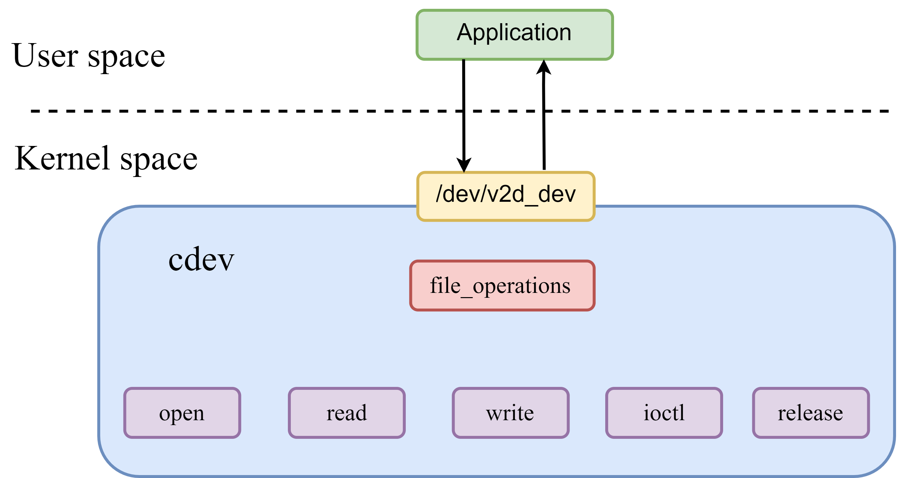

# V2D

This document describes the features and usage of the V2D module on the SpacemiT platform.

## Module Overview

The V2D driver on the SpacemiT platform provides hardware acceleration for 2D graphics processing.

### Functional Overview



**Driver model**

The V2D driver uses a character device model. User-space applications interact with the driver through the `/dev/v2d_dev` device node. Supported standard interfaces include:

- **`open()`**: called when the device is opened.
- **`read()`**: reads data from the device.
- **`write()`**: writes data to the device.
- **`ioctl()`**: handles control commands.
- **`release()`**: called when the device is closed.

**Core capabilities**

The V2D driver supports the following 2D image-processing operations:

- Region fill
- Scaling
- Rotation
- Cropping
- Image format conversion

### Source Tree Overview

The kernel source tree for the SpacemiT V2D driver is organized as follows:

```
drivers/soc/spacemit$ tree v2d
v2d
|-- csc_matrix.h
|-- Kconfig
|-- Makefile
|-- v2d_drv.c                   // V2D driver
|-- v2d_drv.h
|-- v2d_hw.c
|-- v2d_iommu.c                 // V2D IOMMU driver
|-- v2d_priv.h
|-- v2d_reg.h
```

## Key Features

### Feature Summary

| Feature | Description |
| :-- | :-- |
| Color fill | Supports image color fill operations. |
| Rotation | Supports image rotation at 0°, 90°, 180°, and 270°, as well as mirroring. |
| Cropping | Supports image cropping. |
| Scaling | Supports scaling from $1/8\times$ to $8\times$. |
| Format conversion | Supports color-space conversion between YUV and RGB formats. |

### Performance

| Function | Performance specification |
| :-- | :-- |
| Color fill | 4096x2304@60 FPS |
| Format conversion | 4096x2304@60 FPS |

## Configuration

Configuration mainly consists of **V2D driver enablement** and **DTS configuration**.

### CONFIG Options

`CONFIG_SPACEMIT_V2D`: V2D driver option for the SpacemiT platform. By default, this option is set to `Y`.

```
 Device Drivers  --->
 SOC (System On Chip) specific Drivers  --->
 	<*> Spacemit V2D Engine Driver
```
### DTS Configuration

#### Clock Configuration

V2D uses two primary clock sources: `v2d-io` and `v2d-core`.

For `v2d-io`, four clock rates are supported: 312 MHz, 499 MHz, 624 MHz, and 750 MHz. The default setting is 750 MHz. Dynamic adjustment is supported through `/sys/bus/platform/devices/c0100000.v2d/clkrate`.

The following example shows the platform clock and reset configuration for V2D.

```c
// linux-6.18/arch/riscv/boot/dts/spacemit/k3.dtsi
v2d: v2d@c0100000 {
	compatible = "spacemit,v2d";
	reg =  <0x0 0xc0100000 0x0 0x1000>;
	reg-names = "v2dreg";
	clocks = <&syscon_apmu CLK_APMU_LCD_MCLK>,
			<&syscon_apmu CLK_APMU_V2D>;
	clock-names = "v2d-io", "v2d-core";
	resets = <&syscon_apmu RESET_APMU_V2D>;
	reset-names = "v2d_reset";
	interrupt-parent = <&saplic>;
	interrupts = <86 IRQ_TYPE_LEVEL_HIGH>;
	status = "okay";
};
```

## Interface Overview

### API Overview

Applications access V2D functions through the API layer. The main capabilities are grouped into the following 2D graphics operations:

- `Fill`
- `Bitblit`
- `Blend`

#### `V2D_BeginJob`

```c
int32_t V2D_BeginJob(V2D_HANDLE *phHandle);
```

| Description | Creates a V2D job queue |
| :-- | :-- |
| Parameters | `phHandle`: handle pointer |
| Return value | `0`: success; <br>`-1`: failure |

#### `V2D_EndJob`

```c
int32_t V2D_EndJob(V2D_HANDLE hHandle);
```

| Description | Submits the job queue to the V2D driver and starts execution. |
| :-- | :-- |
| Parameters | `hHandle`: handle |
| Return value | `0`: success; <br>`-1`: failure |

#### `V2D_AddFillTask`

```c
int32_t V2D_AddFillTask(V2D_HANDLE hHandle, 
			V2D_SURFACE_S *pstDst, 
			V2D_AREA_S *pstDstRect,  
			V2D_FILLCOLOR_S *pstFillColor);

```

| Description | Adds a task to the V2D job queue to fill the target bitmap region with a specified color. |
| :-- | :-- |
| Parameters | `hHandle`: handle; <br>`pstDst`: destination bitmap; <br>`pstDstRect`: destination operation region; <br>`pstFillColor`: fill color structure |
| Return value | `0`: success; <br>`-1`: failure |

#### `V2D_AddBitblitTask`

```c
int32_t V2D_AddBitblitTask(V2D_HANDLE hHandle, 
				V2D_SURFACE_S *pstDst, 
				V2D_AREA_S *pstDstRect, 
				V2D_SURFACE_S *pstSrc,
				V2D_AREA_S *pstSrcRect, V2D_CSC_MODE_E enCSCMode);

```

| Description | Adds a task to the V2D job queue to copy the source bitmap operation region into the destination bitmap operation region. |
| :-- | :-- |
| Parameters | `hHandle`: handle; <br>`pstDst`: destination bitmap; <br>`pstDstRect`: destination operation region; <br>`pstSrc`: source bitmap; <br>`pstSrcRect`: source operation region; <br>`enCSCMode`: flag indicating whether color-space conversion is required |
| Return value | `0`: success; <br>`-1`: failure |

#### `V2D_AddBlendTask`

```c
int32_t V2D_AddBlendTask(V2D_HANDLE hHandle, 
			     V2D_SURFACE_S *pstBackGround,
			     V2D_AREA_S *pstBackGroundRect,
			     V2D_SURFACE_S *pstForeGround,
			     V2D_AREA_S *pstForeGroundRect,
			     V2D_SURFACE_S *pstMask,
			     V2D_AREA_S *pstMaskRect,
			     V2D_SURFACE_S *pstDst,
			     V2D_AREA_S *pstDstRect,
			     V2D_BLEND_CONF_S *pstBlendConf,
			     V2D_ROTATE_ANGLE_E enForeRotateAngle,
			     V2D_ROTATE_ANGLE_E enBackRotateAngle,
			     V2D_CSC_MODE_E enForeCSCMode,
			     V2D_CSC_MODE_E enBackCSCMode,
			     V2D_PALETTE_S *pstPalette,
			     V2D_DITHER_E dither);

```

| Description | Adds a task to the V2D job queue to perform cropping, rotation, format conversion, scaling, and related operations on source bitmaps and write the result to the destination bitmap. |
| :-- | :-- |
| Parameters | `hHandle`: handle; <br>`pstBackGround`: background bitmap; <br>`pstBackGroundRect`: background operation region; <br>`pstForeGround`: foreground bitmap; <br>`pstForeGroundRect`: foreground operation region;<br>`pstMask`: mask bitmap; <br>`pstMaskRect`: mask operation region; <br>`pstDst`: destination bitmap; <br>`pstDstRect`: destination operation region; <br>`pstBlendConf`: blend configuration structure; <br>`enForeRotateAngle`: foreground rotation angle; <br>`enBackRotateAngle`: background rotation angle; <br>`enForeCSCMode`: foreground CSC conversion mode; <br>`enBackCSCMode`: background CSC conversion mode; <br>`pstPalette`: pointer to the L8-format palette structure; <br>`dither`: selected dither mode |
| Return value | `0`: success; <br>`-1`: failure |

## Debugging

**View the V2D I/O clock frequency**

```
# cat /sys/bus/platform/devices/c0100000.v2d/clkrate
409600000
```

## Testing

- **Fill test case**

Runs the color fill test:
```
# cd /usr/share/v2d
# v2d_test --fill
v2d fill test case successful!
```

- **Bitblit test case**

Runs the bit-block transfer test:
```
# cd /usr/share/v2d
# v2d_test --blit
v2d blit test case successful!
```

- **Blend test case**

Runs the image blending test:
```
# cd /usr/share/v2d
# v2d_test --blend
v2d blend test case successful!
```

## FAQ