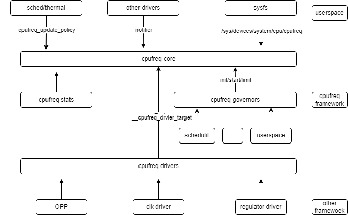

# CPUFREQ

This document describes the CPUFREQ functionality of the K3 SoC and its usage.

## Module Overview

The CPUFREQ subsystem dynamically adjusts CPU frequency and voltage while the CPUs are running. Its purpose is to minimize power consumption while maintaining the required level of performance.

### Functional Overview



1. **cpufreq core**: the core module of the cpufreq framework. It mainly provides three categories of functionality:
   - abstracts the common control logic for dynamic frequency and voltage scaling
   - exposes a unified sysfs interface to user space and sends frequency-change notifications to other drivers through notifier callbacks
   - provides the driver framework for CPU frequency and voltage control
2. **cpufreq governor**: implements the policies used for dynamic frequency and voltage scaling.
3. **cpufreq driver**: implements the platform-specific frequency and voltage scaling mechanism.
4. **cpufreq stats**: collects frequency transition information and residency statistics for each frequency point, and provides cpufreq-related statistics for each CPU.

### Source Tree Overview

The CPU frequency scaling driver source tree is organized as follows:

```
drivers/cpufreq/
├── cpufreq.c
├── cpufreq_conservative.c
├── cpufreq-dt.c
├── cpufreq-dt.h
├── cpufreq-dt-platdev.c
├── cpufreq_governor_attr_set.c
├── cpufreq_governor.c
├── cpufreq_governor.h
├── cpufreq_ondemand.c
├── cpufreq_ondemand.h
├── cpufreq_performance.c
├── cpufreq_powersave.c
├── cpufreq_stats.c
├── cpufreq_userspace.c
├── freq_table.c
├── spacemit-k3-cpufreq.c --> K3 platform driver
```

## Key Features

### Feature Summary

| Feature | Description |
| :--- | :--- |
| Dynamic frequency and voltage scaling | Frequency and voltage can be adjusted in real time according to system load |
| Independent scaling for dual clusters | The X100 and A100 clusters can scale independently without affecting each other |
| X100 maximum frequency of 2.4 GHz | The highest OPP supported by the X100 cluster is 2.4 GHz |

### K3 CPU Topology

The K3 SoC uses a 16-core heterogeneous design with two CPU clusters:

| Cluster | Cores | Core Type | Frequency Range | Voltage Scaling |
| :------ | :--- | :------- | :------- | :------- |
| X100 Cluster | cpu_0 ~ cpu_7 | SpacemiT X100 | 614.4 MHz ~ 2.4 GHz | Supported |
| A100 Cluster | cpu_8 ~ cpu_15 | SpacemiT A100 | 614.4 MHz ~ 2.0 GHz | Not supported |

Each cluster has an independent OPP (Operating Performance Point) table and clock source, allowing frequency scaling to be controlled independently.

### Performance Parameters

#### X100 Cluster (cpu_0 ~ cpu_7) OPP Table

| Frequency | Voltage |
| :--- | :---: |
| 2400000000 Hz | 1.00 V |
| 2300000000 Hz | 0.88 V |
| 2200000000 Hz | 0.88 V |
| 2150000000 Hz | 0.88 V |
| 2100000000 Hz | 0.88 V |
| 2000000000 Hz | 0.88 V |
| 1900000000 Hz | 0.88 V |
| 1850000000 Hz | 0.88 V |
| 1800000000 Hz | 0.88 V |
| 1700000000 Hz | 0.88 V |
| 1600000000 Hz | 0.88 V |
| 1500000000 Hz | 0.85 V |
| 1400000000 Hz | 0.85 V |
| 1300000000 Hz | 0.85 V |
| 1200000000 Hz | 0.85 V |
| 1100000000 Hz | 0.85 V |
| 1000000000 Hz | 0.80 V |
| 819200000 Hz  | 0.80 V |
| 614400000 Hz  | 0.80 V |

#### A100 Cluster (cpu_8 ~ cpu_15) OPP Table


| Frequency |
| :--- |
| 2000000000 Hz |
| 1900000000 Hz |
| 1850000000 Hz |
| 1800000000 Hz |
| 1700000000 Hz |
| 1600000000 Hz |
| 1500000000 Hz |
| 1400000000 Hz |
| 1300000000 Hz |
| 1200000000 Hz |
| 1100000000 Hz |
| 1000000000 Hz |
| 819200000 Hz  |
| 614400000 Hz  |

### Test Method


1. Change the governor to `userspace` mode.

   ```shell
   echo userspace > /sys/devices/system/cpu/cpufreq/policy0/scaling_governor
   ```

2. View the list of supported frequencies.

   ```shell
   cat /sys/devices/system/cpu/cpufreq/policy0/scaling_available_frequencies
   ```

3. Set the CPU frequency.

   ```shell
   echo 1600000 > /sys/devices/system/cpu/cpufreq/policy0/scaling_setspeed
   ```

4. Check whether the frequency was applied successfully.

   ```shell
   cat /sys/devices/system/cpu/cpufreq/policy0/scaling_cur_freq
   ```

5. Repeat the same procedure for the A100 cluster.

   ```shell
   echo userspace > /sys/devices/system/cpu/cpufreq/policy8/scaling_governor
   cat /sys/devices/system/cpu/cpufreq/policy8/scaling_available_frequencies
   echo 1200000 > /sys/devices/system/cpu/cpufreq/policy8/scaling_setspeed
   cat /sys/devices/system/cpu/cpufreq/policy8/scaling_cur_freq
   ```

## Configuration

Configuration mainly includes **driver enablement** and **Device Tree configuration**.

### CONFIG Options

The CPUFREQ configuration is shown below:

```
CONFIG_SPACEMIT_K3_CPUFREQ:

  This adds the CPUFreq driver support for Spacemit K3 SoC
  which are capable of changing the CPU's frequency dynamically.

  Symbol: SPACEMIT_K3_CPUFREQ [=y]
  Type  : tristate
  Defined at drivers/cpufreq/Kconfig:256
  Prompt: CPU frequency scaling driver for Spacemit K1X
  Depends on: CPU_FREQ [=y] && OF [=y] && COMMON_CLK [=y]
  Location:
   -> CPU Power Management
    -> CPU Frequency scaling
     -> CPU Frequency scaling (CPU_FREQ [=y])
      -> CPU frequency scaling driver for Spacemit K1X (SPACEMIT_K3_CPUFREQ [=y])
  Selects: CPUFREQ_DT [=y] && CPUFREQ_DT_PLATDEV [=y]
```

### DTS Configuration

The complete OPP table definitions are located in `arch/riscv/boot/dts/spacemit/k3_opp_table.dtsi`.

This file defines two OPP tables:

- `clst_core_opp_table0_x100`: OPP table for the X100 cluster, containing 19 frequency steps from 614.4 MHz to 2.4 GHz and including `opp-microvolt` voltage entries
- `clst_core_opp_table0_a100`: OPP table for the A100 cluster, containing 14 frequency steps from 614.4 MHz to 2.0 GHz and not including voltage entries

The clock sources and OPP tables are bound to the CPU nodes in `k3_opp_table.dtsi`:

```dts
/* X100 Cluster: cpu_0 ~ cpu_7 */
&cpu_0 {
    clst-supply = <&edcdc1>;
    clocks = <&syscon_apmu CLK_APMU_CPU_C0_CORE>, <&syscon_apmu CLK_APMU_CPU_C1_CORE>;
    clock-names = "cls0", "cls1";
    operating-points-v2 = <&clst_core_opp_table0_x100>;
};

/* A100 Cluster: cpu_8 ~ cpu_15 */
&cpu_8 {
    clocks = <&syscon_apmu CLK_APMU_CPU_C2_CORE>, <&syscon_apmu CLK_APMU_CPU_C3_CORE>;
    clock-names = "cls0", "cls1";
    operating-points-v2 = <&clst_core_opp_table0_a100>;
};
```

The OPP table also defines the PLL clock sources used by the driver during frequency transitions:

```dts
opp_table0_x100 {
    compatible = "operating-points-v2";
    opp-shared;
    clocks = <&pll CLK_PLL3>, <&pll CLK_PLL4>, <&pll CLK_PLL3_D1>, <&syscon_apmu CLK_APMU_CPU_C1_PLL_SRC>;
    clock-names = "pll_clst0", "pll_clst1", "pll_src", "clt_pll_src";
    ...
};
```

## Debugging

### sysfs

The X100 cluster sysfs nodes are located at:

- `/sys/devices/system/cpu/cpufreq/policy0/`

The A100 cluster sysfs nodes are located at:

- `/sys/devices/system/cpu/cpufreq/policy8/`

| Node | Description |
| :--- | :--- |
| affected\_cpus, related\_cpus | Displays the CPU cores associated with the policy |
| scaling\_governor | Shows the active frequency scaling governor |
| scaling\_available\_frequencies | Lists the supported system frequency points |
| scaling\_max\_freq | Maximum software frequency limit |
| cpuinfo\_cur\_freq | Real-time hardware CPU frequency |
| scaling\_available\_governors | Lists the governors supported by the system |
| scaling\_min\_freq | Minimum software frequency limit |
| cpuinfo\_max\_freq | Maximum hardware-supported frequency |
| scaling\_setspeed | Interface for setting CPU frequency in `userspace` mode |
| cpuinfo\_min\_freq | Minimum hardware-supported frequency |
| scaling\_cur\_freq | Shows the current CPU operating frequency |
| scaling\_driver | Name of the active CPU frequency scaling driver |

## Testing

To validate dynamic frequency and voltage scaling, repeat the steps in **Test Method** and verify correct operation at different frequency settings.

## FAQ
