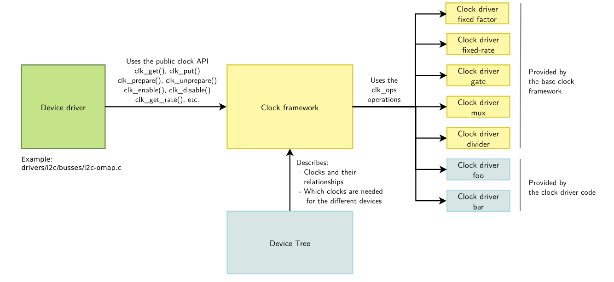

# Clock

This document describes the K3 platform clock system, including its architecture, driver implementation, Device Tree configuration, usage model, and common debugging methods.

## Module Overview

The clock system provides operating clocks for internal SoC modules and supports clock selection, division, and enable control.

### Functional Overview

#### Clock Framework

To simplify clock management, Linux provides the Common Clock Framework (CCF). It offers a unified interface to device drivers so that drivers do not need to depend on hardware-specific clock implementation details.



The CCF includes the following core components:

- **clock provider**: corresponds to the right side of the diagram, typically the clock controller, and provides the clocks required by the system.
- **clock consumer**: corresponds to the left side of the diagram and represents device drivers that use clocks. These drivers obtain, configure, and enable clocks through the generic APIs provided by CCF.
- **clock framework**: the core part of CCF. It provides generic clock control APIs to clock consumers, implements the core clock-management logic, and encapsulates hardware-specific clock control logic into operation callbacks implemented by the clock provider.
- **Device Tree**: CCF allows available clocks and their device associations to be declared in the Device Tree. The `clocks` property identifies the clock resources used by a device through a `provider + ID` format, while `clock-names` provides readable names for those resources. Device drivers use those names to obtain, configure, and manage the corresponding clock resources.

#### Clock Structure

A clock system typically contains the following components:

- Oscillator / Crystal: an active or passive crystal source that acts as the root clock source
- PLL (Phase Locked Loop): multiplies the base frequency for frequency synthesis
- Divider: generates lower frequencies through division
- MUX: selects between different clock sources
- GATE: controls whether a clock is enabled or disabled

Many such hardware modules may exist in the system and are usually arranged in a tree structure. Linux manages them as a clock tree. A typical clock tree starts from an oscillator or crystal source, then passes through PLL, MUX, DIV, and GATE stages before the final clocks are delivered to devices.

The K3 clock subsystem provides operating clocks for internal SoC modules and is responsible for the following tasks:

- derives different clock frequencies from fixed clock sources or PLLs for use by various modules
- provides clock-source selection through MUX blocks
- provides frequency division through Divider blocks
- provides clock enable and disable control through Gate blocks

CCF implements several basic clock types, including:

- fixed-rate clocks
- gate clocks
- divider clocks
- mux clocks

#### K3 Clock Architecture

The K3 platform does not use a single clock provider. Instead, the clock architecture is divided into multiple clock providers based on address domains.

| Clock provider node | Address | Typical usage |
| :--- | :--- | :--- |
| `pll` | `0xd4090000` | PLL clocks |
| `syscon_mpmu` | `0xd4050000` | MPMU-related base clocks and low-speed clocks |
| `syscon_apmu` | `0xd4282800` | APMU-domain clocks such as QSPI, SDH, USB, and CPU |
| `syscon_apbc` | `0xd4015000` | APB peripheral clocks such as UART, PWM, I2C, SPI, and RTC |
| `syscon_apbc2` | `0xf0610000` | APB peripheral clocks in the security domain |
| `syscon_dciu` | `0xd8440000` | DCIU-related control |
| `syscon_rcpu_sysctrl` | `0xc0880000` | R-domain system-control-related clocks and resets |
| `syscon_rcpu_uartctrl` | `0xc0881f00` | R-domain UART |
| `syscon_rcpu_i2sctrl` | `0xc0882000` | R-domain I2S |
| `syscon_rcpu_spictrl` | `0xc0885f00` | R-domain SPI |
| `syscon_rcpu_i2cctrl` | `0xc0886f00` | R-domain I2C |
| `syscon_rpmu` | `0xc088c000` | R-domain PMU |
| `syscon_rcpu_pwmctrl` | `0xc088d000` | R-domain PWM |

As a result, a common clock reference format in K3 DTS files is:

```dts
clocks = <&syscon_apbc CLK_APBC_SPI0>, <&syscon_apbc CLK_APBC_SPI0_BUS>;
```

This means:

- the clock provider is `syscon_apbc`
- the first clock ID is `CLK_APBC_SPI0`
- the second clock ID is `CLK_APBC_SPI0_BUS`

The correct clock provider and clock IDs must be determined according to the actual driver implementation.

#### Clocks and Resets

Clocks must be used together with reset signals to initialize hardware modules correctly. A typical K3 sequence is shown below.

**Module initialization sequence**

1. Deassert reset (`reset_control_deassert`)
2. Enable clocks (`clk_prepare_enable`)
3. Configure the operating clock frequency (`clk_set_rate`)
4. Configure module registers
5. Start module operation

**Module shutdown sequence**

When a module enters sleep or is shut down, the reverse sequence is typically used:

1. Stop module operation
2. Disable clocks (`clk_disable_unprepare`)
3. Assert reset (`reset_control_assert`)

## Source Tree Overview

### Source Locations

K3 clock and reset related code is mainly located in:

```text
linux-6.18/
|-- drivers/clk/spacemit/
|   |-- ccu_common.h              # Common clock structure definitions
|   |-- ccu_pll.c                 # PLL clock driver source
|   |-- ccu_pll.h                 # PLL clock header
|   |-- ccu_mix.c                 # MIX clock driver source
|   |-- ccu_mix.h                 # MIX clock header
|   |-- ccu_ddn.c                 # DDN clock driver source
|   |-- ccu_ddn.h                 # DDN clock header
|   |-- ccu-k3.c                  # K3 clock controller driver
|   |-- Kconfig                   # Configuration file
|   `-- Makefile                  # Build Makefile
|-- include/dt-bindings/clock/
|   `-- spacemit,k3-syscon.h      # K3 clock and reset ID definitions
|-- include/soc/spacemit
|   `-- k3-syscon.h               # K3 clock and reset register definitions
`-- arch/riscv/boot/dts/spacemit/
    |-- k3.dtsi
    |-- k3-rdomain.dtsi
    `-- k3*.dts
```

SpacemiT implements three clock types:

- PLL type: phase-locked loop clocks, including both PLL and PLLA types; K3 uses the PLLA type
- DDN type: fractional divider clocks, with one division stage for the denominator and one multiplication stage for the numerator
- MIX type: mixed clocks that support gate, mux, divider, or any combination of these functions

#### Custom Clock Types

The K3 clock driver implements three main clock types:

##### PLL Type

**Function**: phase-locked loop (PLL), used for frequency multiplication and frequency synthesis.

**Characteristics:**

- supports two PLL types: standard PLL and PLLA (fine-grained adjustable PLL)
- PLLA is a K3-specific extension that supports finer frequency adjustment
- provides multiple predefined operating frequency points

##### DDN Type

**Function**: fractional divider with fine-grained numerator and denominator adjustment.

**Characteristics:**

- one division stage for the denominator and one multiplication stage for the numerator
- supports fine-grained frequency adjustment
- commonly used for audio clocks and other scenarios that require precise frequencies

##### MIX Type

**Function**: mixed clock type supporting any combination of GATE, MUX, and DIVIDER.

**Characteristics:**

- supports any combination of GATE, MUX, and DIVIDER
- provides the highest flexibility and is suitable for most peripheral clocks
- has the most complex configuration model

## Configuration

Configuration mainly includes **kernel CONFIG options** and **Device Tree configuration**.

### CONFIG Options

- `CONFIG_COMMON_CLK`: enables support for the Common Clock Framework. By default, this option is set to `Y`.

```text
-> Device Drivers│
  │       -> Common Clock Framework (COMMON_CLK [=y])│
```

- `CONFIG_SPACEMIT_CCU`: enables clock-type driver support for SpacemiT SoCs. When `CONFIG_ARCH_SPACEMIT = Y`, this option is set to `Y`.

```text
-> Device Drivers│
  │       -> Common Clock Framework (COMMON_CLK [=y])│
  │              -> Clock support for SpacemiT SoCs (SPACEMIT_CCU [=y])│
```

- `CONFIG_SPACEMIT_K3_CCU`: enables support for the K3 clock controller driver. When `CONFIG_SOC_SPACEMIT_K3 = Y`, this option is set to `Y`.

```text
-> Device Drivers│
  │       -> Common Clock Framework (COMMON_CLK [=y])│
  │              -> Clock support for SpacemiT SoCs (SPACEMIT_CCU [=y])│
  │                     -> Support for SpacemiT K3 SoC (SPACEMIT_K3_CCU [=y])
```

### DTS Configuration

The K3 clock controller is divided into multiple clock-controller instances by address domain.
Each clock controller manages the clocks within its own address domain.
These controller nodes are defined in `k3.dtsi`, and most of them also act as reset controllers, except pll.
The DTS configuration is shown below:

```dts
/ {
        soc: soc {
                ...
                syscon_mpmu: system-controller@d4050000 {
                        compatible = "spacemit,k3-syscon-mpmu";
                        reg = <0x0 0xd4050000 0x0 0x10000>;
                        clocks = <&osc_32k>, <&vctcxo_1m>, <&vctcxo_3m>,
                                 <&vctcxo_24m>, <&reserved_clk>, <&external_clk>;
                        clock-names = "osc_32k", "vctcxo_1m", "vctcxo_3m", "vctcxo_24m",
                                      "reserved_clk", "external_clk";
                        #clock-cells = <1>;
                        #reset-cells = <1>;
                };

                pll: clock-controller@d4090000 {
                        compatible = "spacemit,k3-pll";
                        reg = <0x0 0xd4090000 0x0 0x10000>;
                        clocks = <&vctcxo_24m>;
                        spacemit,mpmu = <&syscon_mpmu>;
                        #clock-cells = <1>;
                };

                syscon_apmu: system-controller@d4282800 {
                        compatible = "spacemit,k3-syscon-apmu";
                        reg = <0x0 0xd4282800 0x0 0x400>;
                        clocks = <&osc_32k>, <&vctcxo_1m>, <&vctcxo_3m>, <&vctcxo_24m>,
                                 <&reserved_clk>, <&external_clk>;
                        clock-names = "osc_32k", "vctcxo_1m", "vctcxo_3m", "vctcxo_24m",
                                      "reserved_clk", "external_clk";
                        #clock-cells = <1>;
                        #power-domain-cells = <1>;
                        #reset-cells = <1>;
                };

                syscon_apbc: system-controller@d4015000 {
                        compatible = "spacemit,k3-syscon-apbc";
                        reg = <0x0 0xd4015000 0x0 0x1000>;
                        clocks = <&osc_32k>, <&vctcxo_1m>, <&vctcxo_3m>, <&vctcxo_24m>,
                                 <&reserved_clk>, <&external_clk>;
                        clock-names = "osc_32k", "vctcxo_1m", "vctcxo_3m", "vctcxo_24m",
                                      "reserved_clk", "external_clk";
                        #clock-cells = <1>;
                        #reset-cells = <1>;
                };

                syscon_apbc2: system-controller@f0610000 {
                        compatible = "spacemit,k3-syscon-apbc2";
                        reg = <0x0 0xf0610000 0x0 0x2000>;
                        clocks = <&osc_32k>, <&vctcxo_1m>, <&vctcxo_3m>, <&vctcxo_24m>,
                                 <&reserved_clk>, <&external_clk>;
                        clock-names = "osc_32k", "vctcxo_1m", "vctcxo_3m", "vctcxo_24m",
                                      "reserved_clk", "external_clk";
                        #clock-cells = <1>;
                        #reset-cells = <1>;
                };

                syscon_dciu: system-controller@d8440000 {
                        compatible = "spacemit,k3-syscon-dciu";
                        reg = <0x0 0xd8440000 0x0 0xc000>;
                        #clock-cells = <1>;
                        #reset-cells = <1>;
                };

                syscon_rcpu_sysctrl: system-controller@c0880000 {
                        compatible = "spacemit,k3-syscon-rcpu-sysctrl";
                        reg = <0x0 0xc0880000 0x0 0x1000>;
                        clocks = <&vctcxo_24m>, <&external_clk>;
                        clock-names = "vctcxo_24m", "external_clk";
                        #clock-cells = <1>;
                        #reset-cells = <1>;
                };

                syscon_rcpu_uartctrl: system-controller@c0881f00 {
                        compatible = "spacemit,k3-syscon-rcpu-uartctrl";
                        reg = <0x0 0xc0881f00 0x0 0x100>;
                        #clock-cells = <1>;
                        #reset-cells = <1>;
                };

                syscon_rcpu_i2sctrl: system-controller@c0882000 {
                        compatible = "spacemit,k3-syscon-rcpu-i2sctrl";
                        reg = <0x0 0xc0882000 0x0 0x1000>;
                        #clock-cells = <1>;
                        #reset-cells = <1>;
                };

                syscon_rcpu_spictrl: system-controller@c0885f00 {
                        compatible = "spacemit,k3-syscon-rcpu-spictrl";
                        reg = <0x0 0xc0885f00 0x0 0x100>;
                        #clock-cells = <1>;
                        #reset-cells = <1>;
                };

                syscon_rcpu_i2cctrl: system-controller@c0886f00 {
                        compatible = "spacemit,k3-syscon-rcpu-i2cctrl";
                        reg = <0x0 0xc0886f00 0x0 0x100>;
                        #clock-cells = <1>;
                        #reset-cells = <1>;
                };

                syscon_rpmu: system-controller@c088c000 {
                        compatible = "spacemit,k3-syscon-rpmu";
                        reg = <0x0 0xc088c000 0x0 0x800>;
                        #clock-cells = <1>;
                        #reset-cells = <1>;
                };

                syscon_rcpu_pwmctrl: system-controller@c088d000 {
                        compatible = "spacemit,k3-syscon-rcpu-pwmctrl";
                        reg = <0x0 0xc088d000 0x0 0x100>;
                        #clock-cells = <1>;
                        #reset-cells = <1>;
                };
                ...
        };
};

```

These nodes declare themselves as clock providers through the `#clock-cells = <1>` property. Device nodes reference the required clock resources through the `clocks` and `clock-names` properties.

## Interface Description

### Clock API Overview

CCF provides generic clock-operation interfaces for device drivers. These APIs are defined in `include/linux/clk.h`. Commonly used interfaces are listed below.

- `get`: obtain a clock handle

```c
/*
* clk_get - get clk
* @dev: device
* @id: clock name of dts "clock-names"
*/
struct clk *clk_get(struct device *dev, const char *id);

/*
* devm_clk_get - get clk
* @dev：device
* @id：clock name of dts "clock-names"
*/
struct clk *devm_clk_get(struct device *dev, const char *id);

/*
* of_clk_get_by_name - get clk by name
* @np：device_node
* @id：clock name of dts "clock-names"
*/
struct clk *of_clk_get_by_name(struct device_node *np, const char *name);
```

If the second parameter is omitted in the interfaces above, the first clock in the DTS `clocks` list is returned by default.

- `put`: release a clock handle

```c
/*
* clk_put - put clk
* @clk: clock source
*/
void clk_put(struct clk *clk);

/*
* devm_clk_put - put clk
* @dev: device
* @clk: clock source
*/
void devm_clk_put(struct device *dev, struct clk *clk);
```

- `prepare`: prepare a clock, typically as the setup step before it is enabled

```c
/**
 * clk_prepare - prepare a clock source
 * @clk: clock source
 * This prepares the clock source for use.
 * Must not be called from within atomic context.
 */
int clk_prepare(struct clk *clk);
```

- `unprepare`: undo clock preparation, typically as cleanup after it is disabled

```c
/**
 * clk_unprepare - undo preparation of a clock source
 * @clk: clock source
 * This undoes a previously prepared clock. The caller must balance
 * the number of prepare and unprepare calls.
 * Must not be called from within atomic context.
 */
void clk_unprepare(struct clk *clk);
```

- `enable`: enable a clock

```c
/**
 * clk_enable - inform the system when the clock source should be running.
 * @clk: clock source
 * If the clock can not be enabled/disabled, this should return success.
 * May be called from atomic contexts.
 * Returns success (0) or negative errno.
 */
int clk_enable(struct clk *clk);
```

- `disable`: disable a clock

```c
/**
 * clk_disable - inform the system when the clock source is no longer required.
 * @clk: clock source
 * Inform the system that a clock source is no longer required by
 * a driver and may be shut down.
 * May be called from atomic contexts.
 * Implementation detail: if the clock source is shared between
 * multiple drivers, clk_enable() calls must be balanced by the
 * same number of clk_disable() calls for the clock source to be
 * disabled.
 */
void clk_disable(struct clk *clk);
```

`clk_prepare_enable` combines `clk_prepare` and `clk_enable`, while `clk_disable_unprepare` combines `clk_disable` and `clk_unprepare`.

`clk_prepare` runs in a sleepable context, for example when regulators may be involved, while `clk_enable` executes quickly in atomic context, typically through direct register operations. In most driver code, the combined helper interfaces are recommended.

- `set rate`: set the clock frequency

```c
/**
 * clk_set_rate - set the clock rate for a clock source
 * @clk: clock source
 * @rate: desired clock rate in Hz
 * Updating the rate starts at the top-most affected clock and then
 * walks the tree down to the bottom-most clock that needs updating.
 * Returns success (0) or negative errno.
 */
int clk_set_rate(struct clk *clk, unsigned long rate);
```

- `get rate`: obtain the current clock frequency

```c
/**
 * clk_get_rate - obtain the current clock rate (in Hz) for a clock source.
 * This is only valid once the clock source has been enabled.
 * @clk: clock source
 */
unsigned long clk_get_rate(struct clk *clk);

```

- `set parent`: set the parent clock

```c
/**
 * clk_set_parent - set the parent clock source for this clock
 * @clk: clock source
 * @parent: parent clock source
 * Returns success (0) or negative errno.
 */
int clk_set_parent(struct clk *clk, struct clk *parent);

```

- `get parent`: obtain the current parent clock handle

```c
/**
 * clk_get_parent - get the parent clock source for this clock
 * @clk: clock source
 * Returns struct clk corresponding to parent clock source, or
 * valid IS_ERR() condition containing errno.
 */
struct clk *clk_get_parent(struct clk *clk);
```

- `round rate`: obtain the closest frequency that the clock controller can actually provide

```c
/**
 * clk_round_rate - adjust a rate to the exact rate a clock can provide
 * @clk: clock source
 * @rate: desired clock rate in Hz
 * This answers the question "if I were to pass @rate to clk_set_rate(),
 * what clock rate would I end up with?" without changing the hardware
 * in any way. In other words:
 *   rate = clk_round_rate(clk, r);
 * and:
 *   clk_set_rate(clk, r);
 *   rate = clk_get_rate(clk);
 * are equivalent except the former does not modify the clock hardware
 * in any way.
 * Returns rounded clock rate in Hz, or negative errno.
 */
long clk_round_rate(struct clk *clk, unsigned long rate);
```

## Usage Guide

This section describes usage from the perspectives of both the **provider** and the **consumer**.

### Provider

K3 clock providers are already defined in `k3.dtsi`. In most cases, board-level DTS files do not need to create new provider nodes, so this part usually requires no additional work.

### Consumer

Clock consumers generally need to complete the following tasks:

- Identify the correct clock provider and clock IDs, then configure `clocks` in the DTS node.
- Configure `clock-names` in the DTS node.
        - The values in `clock-names` vary by device and depend on clock usage.
        - Custom naming is also possible when needed.
        - These names are mainly used by the driver when obtaining clock handles.
        - Common values include `func`, `bus`, `clk`, and `gate`.
- If required, configure `assigned-clocks`, `assigned-clock-parents`, and `assigned-clock-rates` in the DTS node.
- Obtain clock handles in the device driver through the clock APIs and perform the required clock operations.

Most K3 peripheral DTS nodes use a clock configuration similar to the following:

```dts
xxx: device@addr {
 clocks = <&ClockProvider CLK_ID0>, <&ClockProvider CLK_ID1>;
 clock-names = "func", "bus";
 status = "disabled";
};
```

Clock providers and clock IDs can usually be matched by the clock ID prefix, as shown below:

| Clock ID prefix | Corresponding provider node |
|---------------------|-----------------------|
| CLK_PLL_       | pll                   |
| CLK_MPMU_     | syscon_mpmu           |
| CLK_APBC_     | syscon_apbc           |
| CLK_APMU_     | syscon_apmu           |
| CLK_DCIU_      | syscon_dciu           |
| CLK_RCPU_SYSCTRL_ | syscon_rcpu_sysctrl  |
| CLK_RCPU_UARTCTRL_ | syscon_rcpu_uartctrl |
| CLK_RCPU_I2SCTRL_ | syscon_rcpu_i2sctrl  |
| CLK_RCPU_SPICTRL_ | syscon_rcpu_spictrl  |
| CLK_RCPU_I2CCTRL_ | syscon_rcpu_i2cctrl  |
| CLK_RPMU_     | syscon_rpmu           |
| CLK_RCPU_PWMCTRL_ | syscon_rcpu_pwmctrl  |
| CLK_APBC2_    | syscon_apbc2          |

## Usage Example

To use clock functionality in a module, configure the `clocks` and `clock-names` properties in DTS, then perform clock-related operations through the CCF APIs in the driver.

- **Configure the DTS**

    Find the required clock IDs in `include/dt-bindings/clock/spacemit,k3-syscon.h`, then add them to the module DTS.

        `can0` is used as an example below.

        `can0` uses two clock IDs: `CLK_APBC_CAN0` and `CLK_APBC_CAN0_BUS`. These correspond to the functional clock and bus clock respectively. Since the prefix `CLK_APBC_` maps to `syscon_apbc`, the DTS configuration is as follows:

```dts
    flexcan0: fdcan@d4028000 {
            compatible = "spacemit,k1-flexcan";
            reg = <0x0 0xd4028000 0x0 0x4000>;
            interrupts = <161 IRQ_TYPE_LEVEL_HIGH>;
            interrupt-parent = <&saplic>;
            fsl,clk-source = <0>;
            clocks = <&syscon_apbc CLK_APBC_CAN0>,<&syscon_apbc CLK_APBC_CAN0_BUS>;
            clock-names = "per","ipg";
            resets = <&syscon_apbc RESET_APBC_CAN0>;
            status = "disabled";
    };
```

- **Add the header file and `clk` members**

    Add the required header file and structure members in the driver code:

```c
#include <linux/clk.h>
```

```c
struct flexcan_priv {

        struct clk *clk_ipg;
        struct clk *clk_per;
};
```

- **Obtain clock handles**

    In most cases, clock handles are obtained with `devm_clk_get` during the driver probe stage. If probe fails or the driver is removed, the handles are released automatically.

```c
        clk_ipg = devm_clk_get(&pdev->dev, "ipg");               // Get the handle for bus clock CLK_APBC_CAN0_BUS
        if (IS_ERR(clk_ipg)) {
                dev_err(&pdev->dev, "no ipg clock defined\n");
                return PTR_ERR(clk_ipg);
        }

        clk_per = devm_clk_get(&pdev->dev, "per");               // Get the handle for functional clock CLK_APBC_CAN0
        if (IS_ERR(clk_per)) {
                dev_err(&pdev->dev, "no per clock defined\n");
                return PTR_ERR(clk_per);
        }

```

- **Enable clocks**

    Use `clk_prepare_enable` to enable clock nodes.

```c
        if (priv->clk_ipg) {
                err = clk_prepare_enable(priv->clk_ipg);         // Enable bus clock CLK_APBC_CAN0_BUS
                if (err)
                        return err;
        }

        if (priv->clk_per) {
                err = clk_prepare_enable(priv->clk_per);         // Enable functional clock CLK_APBC_CAN0
                if (err)
                        clk_disable_unprepare(priv->clk_ipg);
        }

```

- **Get the clock frequency**

    Use `clk_get_rate` to obtain the current clock frequency.

```c
clock_freq = clk_get_rate(clk_per);                  // Get the current frequency of functional clock CLK_APBC_CAN0
```

- **Set the clock frequency**

    Use `clk_set_rate` to change the clock frequency. The first parameter is the clock handle (`struct clk *`), and the second is the target frequency.

```c
clk_set_rate(clk_per, clock_freq);                   // Set the frequency of functional clock CLK_APBC_CAN0
```

- **Disable clocks**

    Use `clk_disable_unprepare` to disable clocks.

```c
clk_disable_unprepare(priv->clk_per);                // Disable functional clock CLK_APBC_CAN0
clk_disable_unprepare(priv->clk_ipg);                // Disable bus clock CLK_APBC_CAN0_BUS
```

## Debugging

Clock behavior can be inspected and debugged through `debugfs`.

### `clk_summary`

`/sys/kernel/debug/clk/clk_summary` is commonly used to print the full clock tree and inspect clock-node status, frequency, parent clocks, and related information.

```
root# cat /sys/kernel/debug/clk/clk_summary
```

### Clock Node Information

Individual clock nodes can also be inspected separately for status, frequency, parent clock, and related properties. `can0_clk` is used as an example below:

```
root:/sys/kernel/debug/clk/can0_clk # ls -l
-r--r--r--    1 root     root             0 Jan  1 08:03 clk_accuracy
-r--r--r--    1 root     root             0 Jan  1 08:03 clk_duty_cycle
-r--r--r--    1 root     root             0 Jan  1 08:03 clk_enable_count
-r--r--r--    1 root     root             0 Jan  1 08:03 clk_flags
-r--r--r--    1 root     root             0 Jan  1 08:03 clk_max_rate
-r--r--r--    1 root     root             0 Jan  1 08:03 clk_min_rate
-r--r--r--    1 root     root             0 Jan  1 08:03 clk_notifier_count
-r--r--r--    1 root     root             0 Jan  1 08:03 clk_parent
-r--r--r--    1 root     root             0 Jan  1 08:03 clk_phase
-r--r--r--    1 root     root             0 Jan  1 08:03 clk_possible_parents
-r--r--r--    1 root     root             0 Jan  1 08:03 clk_prepare_count
-r--r--r--    1 root     root             0 Jan  1 08:03 clk_prepare_enable
-r--r--r--    1 root     root             0 Jan  1 08:03 clk_protect_count
-r--r--r--    1 root     root             0 Jan  1 08:03 clk_rate
root:/sys/kernel/debug/clk/can0_clk# cat clk_prepare_count          # Check enable state
0
root:/sys/kernel/debug/clk/can0_clk# cat clk_rate                   # Check current frequency
20000000
root:/sys/kernel/debug/clk/can0_clk# cat clk_parent                 # Check current parent clock
pll3_20
root:/sys/kernel/debug/clk/can0_clk#
```

### Dynamic Clock-Node Operations

If the `CLOCK_ALLOW_WRITE_DEBUGFS` macro is added in `drivers/clk/clk.c`, write access becomes available for some clock nodes under `debugfs`. Otherwise, only read access is allowed.

```
/sys/kernel/debug/clk/can0_clk # ls -l
-r--r--r--    1 root     root             0 Jan  1 08:03 clk_accuracy
-r--r--r--    1 root     root             0 Jan  1 08:03 clk_duty_cycle
-r--r--r--    1 root     root             0 Jan  1 08:03 clk_enable_count
-r--r--r--    1 root     root             0 Jan  1 08:03 clk_flags
-r--r--r--    1 root     root             0 Jan  1 08:03 clk_max_rate
-r--r--r--    1 root     root             0 Jan  1 08:03 clk_min_rate
-r--r--r--    1 root     root             0 Jan  1 08:03 clk_notifier_count
-rw-r--r--    1 root     root             0 Jan  1 08:03 clk_parent              # Read/write
-r--r--r--    1 root     root             0 Jan  1 08:03 clk_phase
-r--r--r--    1 root     root             0 Jan  1 08:03 clk_possible_parents
-r--r--r--    1 root     root             0 Jan  1 08:03 clk_prepare_count
-rw-r--r--    1 root     root             0 Jan  1 08:03 clk_prepare_enable      # Read/write
-r--r--r--    1 root     root             0 Jan  1 08:03 clk_protect_count
-rw-r--r--    1 root     root             0 Jan  1 08:03 clk_rate                # Read/write
/sys/kernel/debug/clk/can0_clk # cat clk_rate                                    # Check frequency
20000000
/sys/kernel/debug/clk/can0_clk # echo 40000000 > clk_rate                        # Set frequency to 40 MHz
/sys/kernel/debug/clk/can0_clk # cat clk_rate                                    # Confirm the result
40000000
/sys/kernel/debug/clk/can0_clk # cat clk_parent                                  # Check parent clock
pll3_40
/sys/kernel/debug/clk/can0_clk # echo 0 > clk_parent                             # Set the parent clock to source index 0
/sys/kernel/debug/clk/can0_clk # cat clk_parent                                  # Confirm the result
pll3_20
/sys/kernel/debug/clk/can0_clk # cat clk_prepare_enable                          # Check prepare-enable state
0
/sys/kernel/debug/clk/can0_clk # echo 1 > clk_prepare_enable                     # Prepare and enable the clock node
/sys/kernel/debug/clk/can0_clk # cat clk_prepare_enable                          # Confirm the result
1
/sys/kernel/debug/clk/can0_clk # echo 0 > clk_prepare_enable                     # Unprepare and disable the clock node

/sys/kernel/debug/clk/can0_clk # cat clk_prepare_enable                          # Confirm the result
0
/sys/kernel/debug/clk/can0_clk #
```

## FAQ

### 1. What should be checked if a module does not work?

- Verify the DTS configuration:
        - confirm that `clocks` is configured
        - confirm that the provider and clock IDs are correct
        - confirm that the `clock-names` order is correct
- Check which names are requested by `devm_clk_get()` in the driver and whether errors such as `failed to get clk` or `failed to enable clk` are reported.
- Inspect the clock tree through `debugfs`:
        - verify that the clock is enabled
        - verify the active parent clock
        - verify that the frequency matches expectations
- Confirm that reset is properly deasserted in the driver.
- Confirm that clock and reset sequencing is correct.
- Confirm that other dependencies are satisfied, such as `pinctrl`, `power-domain`, and `regulator`.

### 2. Why do some modules use `syscon_apbc` while others use `syscon_apmu`?

Because they belong to different clock, power, or bus domains. In general:

- low-speed APB peripherals are more commonly connected to `syscon_apbc`
- high-speed or more complex modules are more commonly connected to `syscon_apmu`
- R-domain modules are more commonly connected to the `syscon_rcpu_*` provider family

The methods described in the `Usage Guide` section can be used to identify the correct mapping.
