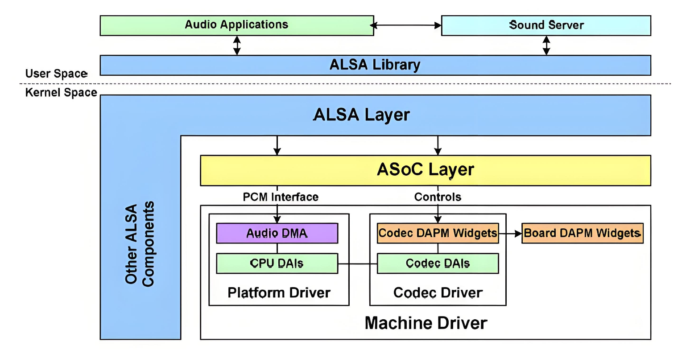

# Audio

This document describes the features and usage of K3 Audio.

## Module Overview

The K3 Audio module provides:

- 6x I2S audio interfaces
- 4x RI2S audio interfaces
  - 2 of these RI2S interfaces are used for DP audio output
- 2x DP audio interfaces

### Feature Overview

The system is based on the ALSA (Advanced Linux Sound Architecture) audio framework. The overall architecture is shown below:



The ALSA audio framework can be divided into the following layers:

- **ALSA Library**
  Provides a unified API for applications.  Applications can call the `alsa-lib` interface to implement audio playback, recording, and control.
  Two libraries are commonly used:
  - standard Linux systems use `alsa-lib`
  - Android systems typically use `tinyalsa` as a lightweight ALSA library.

- **ALSA Core**
    The ALSA core layer provides logical device interfaces such as PCM, CTL, MIDI, and TIMER to upper layers, and drives underlying hardware such as I2S, DMA, and codecs.

- **ASoC Core (ALSA System on Chip)**
    The standard ALSA framework for SoC audio. ASoC is the core of the ALSA SoC driver framework and provides common interfaces and data structures for audio device drivers.

- **Hardware Driver**
        The audio hardware driver is mainly composed of three parts: Machine, Platform, and Codec.
        Together, they provide the ALSA driver interface and implement audio device initialization and runtime behavior.
        This layer is low-level and is implemented by driver developers.

        - **Machine (board-level driver)**:
                - Usually represents a specific development board that integrates the required peripherals and serves as the runtime carrier for the CPU and codec
                - Is generally not reusable because hardware configurations differ across boards
                - Mainly connects the Platform driver and Codec driver, and completes board-specific initialization
                - Can use `snd_soc_dai_link` to specify the Platform driver, the SoC-side DAI (Digital Audio Interface), the codec driver, the codec DAI, and other hardware-dependent logic

        - **Platform (platform driver)**:
                - Usually represents a specific SoC platform that provides audio interfaces such as I2S and AC97, along with clocks, DMA, and other audio-related resources
                - Is tied only to a specific SoC and implements SoC DMA transfer and DAI interface logic
                - Is independent of the Machine driver and can therefore be reused across multiple Machine drivers
                - Allows the same SoC Platform driver to be reused on different boards without modification

        - **Codec (codec driver)**:
                - Usually corresponds to a specific codec chip
                - Commonly integrates modules such as an I2S interface, D/A converter, A/D converter, mixer, and power amplifier (PA)
                - Can support multiple input sources, such as microphone, line-in, I2S, and PCM
                - Can support multiple outputs, such as headphones, speaker, receiver, and line-out
                - Is generally controlled over I2C
                - Is independent of the SoC and Machine driver, so it can be reused across different Machine implementations

#### Audio Interfaces

The K3 Audio module includes three types of audio interfaces:

- **I2S interfaces**: 6 interfaces
- **RI2S interfaces**: 4 interfaces, including 2 used for DP audio output
- **DP audio interfaces**: 2 interfaces

#### Audio Solutions

The K3 platform currently supports the following audio solutions:

- **Solution 1**: I2S1 + external ES8326B codec over I2C, supporting audio playback and recording (deb board)
- **Solution 2**: RI2S2 + DP0 for audio output, playback only (CoM260 board)
- **Solution 3**: RI2S3 + DP1 for audio output, playback only (deb board)

### Source Tree

The I2S and RI2S controller driver code is located in `sound/soc/spacemit`:

```text
sound/soc/spacemit/
|-- k1_i2s.c               # I2S controller driver
|-- k3_ri2s.c              # RI2S controller driver
|-- Kconfig
`-- Makefile
```

The ES8326B codec driver code is located in `sound/soc/codecs`:

```text
sound/soc/codecs
|-- es8326.c              # ES8326B driver
|-- es8326.h              # ES8326B driver header
```

The DP audio driver code is located in:

```text
drivers/gpu/drm/spacemit/
|-- Kconfig
|-- Makefile
|-- spacemit_inno_dp.c      # DP driver
|-- spacemit_inno_dp.h      # DP driver header
```

## I2S

### Key Features

- Supports playback and recording
- Supports full duplex
- Supports DMA transfer
- Supports I2S, DSP_A, and DSP_B formats
  - Standard I2S: supports 8/16/48 kHz sample rates, 16-bit sample depth, and 2 channels
  - DSP_A/DSP_B: supports 8/16/48 kHz sample rates, 32-bit sample depth, and 1 channel

### Configuration

Configuration mainly includes **CONFIG settings** and **DTS settings**.

#### CONFIG Settings

- Basic audio support

`CONFIG_SOUND`, `CONFIG_SND`, and `CONFIG_SND_SOC` provide the basic support required by the ALSA audio driver framework. These options are enabled as `Y` by default.

```text
     -> Device Drivers│
  │       -> Sound card support (SOUND [=y])│
  │         -> Advanced Linux Sound Architecture (SND [=y])│
  │           -> ALSA for SoC audio support (SND_SOC [=y])
```

- I2S audio support

`CONFIG_SND_SOC_K1_I2S` enables I2S audio support. This option is enabled as `Y` by default.

```text
     -> Device Drivers│
  │       -> Sound card support (SOUND [=y])│
  │         -> Advanced Linux Sound Architecture (SND [=y])│
  │           -> ALSA for SoC audio support (SND_SOC [=y])│
  │             -> SpacemiT│
  │               -> K1 I2S Device Driver (SND_SOC_K1_I2S [=y])
```

#### DTS Settings

The main DTS work is `pinctrl` configuration, which must match the actual hardware design.

##### `pinctrl` Settings

- I2S0 `pinctrl` configuration

Two `pinctrl` groups are available: `sspa0_0_cfg` and `sspa0_1_cfg`. Select the one that matches the hardware design.

```dts
        sspa0_0_cfg: sspa0-0-cfg {
                sspa0-0-pins {
                        pinmux = <K3_PADCONF(81, 2)>,   /* sspa0 clk */
                                 <K3_PADCONF(82, 2)>,   /* sspa0 frm */
                                 <K3_PADCONF(83, 2)>,   /* sspa0 tx */
                                 <K3_PADCONF(84, 2)>,   /* sspa0 rx */
                                 <K3_PADCONF(85, 2)>;   /* sspa0 sysclk */

                        bias-pull-up;                   /* normal pull-up */
                        drive-strength = <25>;          /* DS8 */
                };
        };

        sspa0_1_cfg: sspa0-1-cfg {
                sspa0-0-pins {
                        pinmux = <K3_PADCONF(111, 2)>,  /* sspa0 clk */
                                 <K3_PADCONF(112, 2)>,  /* sspa0 frm */
                                 <K3_PADCONF(113, 2)>,  /* sspa0 tx */
                                 <K3_PADCONF(114, 2)>,  /* sspa0 rx */
                                 <K3_PADCONF(115, 2)>;  /* sspa0 sysclk */

                        bias-pull-up;                   /* normal pull-up */
                        drive-strength = <25>;          /* DS8 */
                };
        };
```

Example configuration:

```dts
&i2s0 {
        pinctrl-names = "default";
        pinctrl-0 = <&sspa0_0_cfg>;         /* use the sspa0_0_cfg pin group */
        status = "okay";
};
```

- I2S1 `pinctrl` configuration

Two `pinctrl` groups are available: `sspa1_0_cfg` and `sspa1_1_cfg`. Select the one that matches the hardware design.

```dts
        sspa1_0_cfg: sspa1-0-cfg {
                sspa1-0-pins {
                        pinmux = <K3_PADCONF(15, 2)>,   /* sspa1 clk */
                                 <K3_PADCONF(16, 2)>,   /* sspa1 frm */
                                 <K3_PADCONF(17, 2)>,   /* sspa1 tx */
                                 <K3_PADCONF(18, 2)>,   /* sspa1 rx */
                                 <K3_PADCONF(19, 2)>;   /* sspa1 sysclk */

                        bias-pull-up;                   /* normal pull-up */
                        drive-strength = <25>;          /* DS8 */
                };
        };

        sspa1_1_cfg: sspa1-1-cfg {
                sspa1-0-pins {
                        pinmux = <K3_PADCONF(122, 2)>,  /* sspa1 clk */
                                 <K3_PADCONF(123, 2)>,  /* sspa1 frm */
                                 <K3_PADCONF(124, 2)>,  /* sspa1 tx */
                                 <K3_PADCONF(125, 2)>,  /* sspa1 rx */
                                 <K3_PADCONF(126, 2)>;  /* sspa1 sysclk */

                        bias-pull-up;                   /* normal pull-up */
                        drive-strength = <25>;          /* DS8 */
                };
        };
```

Example configuration:

```dts
&i2s1 {
        pinctrl-names = "default";
        pinctrl-0 = <&sspa1_0_cfg>;          /* use the sspa1_0_cfg pin group */
        status = "okay";
};
```

- I2S2 `pinctrl` configuration

Only one `pinctrl` group is available.

```dts
        sspa2_0_cfg: sspa2-0-cfg {
                sspa2-0-pins {
                        pinmux = <K3_PADCONF(76, 2)>,   /* sspa2 clk */
                                 <K3_PADCONF(77, 2)>,   /* sspa2 frm */
                                 <K3_PADCONF(78, 2)>,   /* sspa2 tx */
                                 <K3_PADCONF(79, 2)>,   /* sspa2 rx */
                                 <K3_PADCONF(80, 2)>;   /* sspa2 sysclk */

                        bias-pull-up;                   /* normal pull-up */
                        drive-strength = <25>;          /* DS8 */
                };
        };
```

Example configuration:

```dts
&i2s2 {
        pinctrl-names = "default";
        pinctrl-0 = <&sspa2_0_cfg>;          /* use the sspa2_0_cfg pin group */
        status = "okay";
};
```

- I2S3 `pinctrl` configuration

Only one `pinctrl` group is available.

```dts
        sspa3_0_cfg: sspa3-0-cfg {
                sspa3-0-pins {
                        pinmux = <K3_PADCONF(99, 2)>,   /* sspa3 clk */
                                 <K3_PADCONF(100, 2)>,  /* sspa3 frm */
                                 <K3_PADCONF(101, 2)>,  /* sspa3 tx */
                                 <K3_PADCONF(102, 2)>,  /* sspa3 rx */
                                 <K3_PADCONF(103, 2)>;  /* sspa3 sysclk */

                        bias-pull-up;                   /* normal pull-up */
                        drive-strength = <25>;          /* DS8 */
                };
        };
```

Example configuration:

```dts
&i2s3 {
        pinctrl-names = "default";
        pinctrl-0 = <&sspa3_0_cfg>;          /* use the sspa3_0_cfg pin group */
        status = "okay";
};
```

- I2S4 `pinctrl` configuration

Only one `pinctrl` group is available.

```dts
        sspa4_0_cfg: sspa4-0-cfg {
                sspa4-0-pins {
                        pinmux = <K3_PADCONF(69, 2)>,   /* sspa4 clk */
                                 <K3_PADCONF(70, 2)>,   /* sspa4 frm */
                                 <K3_PADCONF(71, 2)>,   /* sspa4 tx */
                                 <K3_PADCONF(72, 2)>,   /* sspa4 rx */
                                 <K3_PADCONF(73, 2)>;   /* sspa4 sysclk */

                        bias-pull-up;                   /* normal pull-up */
                        drive-strength = <25>;          /* DS8 */
                };
        };
```

Example configuration:

```dts
&i2s4 {
        pinctrl-names = "default";
        pinctrl-0 = <&sspa4_0_cfg>;          /* use the sspa4_0_cfg pin group */
        status = "okay";
};
```

- I2S5 `pinctrl` configuration

Only one `pinctrl` group is available.

```dts
        sspa5_0_cfg: sspa5-0-cfg {
                sspa5-0-pins {
                        pinmux = <K3_PADCONF(0, 2)>,    /* sspa5 clk */
                                 <K3_PADCONF(1, 2)>,    /* sspa5 frm */
                                 <K3_PADCONF(2, 2)>,    /* sspa5 tx */
                                 <K3_PADCONF(3, 2)>,    /* sspa5 rx */
                                 <K3_PADCONF(4, 2)>;    /* sspa5 sysclk */

                        bias-pull-up;                   /* normal pull-up */
                        drive-strength = <25>;          /* DS8 */
                };
        };
```

Example configuration:

```dts
&i2s5 {
        pinctrl-names = "default";
        pinctrl-0 = <&sspa5_0_cfg>;          /* use the sspa5_0_cfg pin group */
        status = "okay";
};
```

##### Fixed Sample Rate Configuration

To force I2S to operate at a fixed sample rate, configure `spacemit,fixed-sample-rate`. 
Supported values are 8000Hz, 16000Hz, and 48000Hz.

When multiple I2S instances are enabled at the same time, they must be configured to use the same sample rate because they share clocks. Otherwise, data errors may occur. This is also configured through `spacemit,fixed-sample-rate`.

For example, if I2S0 and I2S1 are both enabled, each can be configured to use 8000Hz, 16000Hz, or 48000Hz, but both must use the same value.

```dts
&i2s0 {
        pinctrl-names = "default";
        pinctrl-0 = <&sspa0_0_cfg>;
        /* must set to same value when enable multi i2s: 8000/16000/48000Hz */
        spacemit,fixed-sample-rate = <48000>;
        status = "okay";
};

&i2s1 {
        pinctrl-names = "default";
        pinctrl-0 = <&sspa1_0_cfg>;
        /* must set to same value when enable multi i2s: 8000/16000/48000Hz */
        spacemit,fixed-sample-rate = <48000>;
        status = "okay";
};
```

## RI2S

### Key Features

- Supports playback and recording
- Supports half duplex
- Supports DMA transfer with dedicated DMA
- Supports I2S, left-justified, right-justified, DSP_A, and DSP_B formats
        - Standard I2S / left-justified / right-justified: supports 8/16/48 kHz sample rates, 16/32-bit sample depth, and 2 channels
        - DSP_A / DSP_B: supports 8/16/48 kHz sample rates, 16/32-bit sample depth, and up to 4 channels

### Configuration

Configuration mainly includes **CONFIG settings** and **DTS settings**.

#### CONFIG Settings

- Basic audio support

`CONFIG_SOUND`, `CONFIG_SND`, and `CONFIG_SND_SOC` provide the support required by the ALSA audio driver framework. These options are enabled as `Y` by default.

```text
     -> Device Drivers│
  │       -> Sound card support (SOUND [=y])│
  │         -> Advanced Linux Sound Architecture (SND [=y])│
  │           -> ALSA for SoC audio support (SND_SOC [=y])
```

- RI2S audio support

`CONFIG_SND_SOC_K3_RI2S` enables RI2S audio support. This option is enabled as `Y` by default.

```text
     -> Device Drivers│
  │       -> Sound card support (SOUND [=y])│
  │         -> Advanced Linux Sound Architecture (SND [=y])│
  │           -> ALSA for SoC audio support (SND_SOC [=y])│
  │             -> SpacemiT│
  │               -> K3 RI2S Device Driver (SND_SOC_K3_RI2S [=y])
```

#### DTS Settings

The main DTS work is `pinctrl` configuration, which must match the actual hardware design.

##### `pinctrl` Settings

- RI2S0 `pinctrl` configuration

Two `pinctrl` groups are available: `rsspa0_0_cfg` and `rsspa0_1_cfg`. Select the one that matches the hardware design.

```dts
        rsspa0_0_cfg: rsspa0-0-cfg {
                rsspa0-0-pins {
                        pinmux = <K3_PADCONF(6, 2)>,    /* rsspa0 clk */
                                 <K3_PADCONF(7, 2)>,    /* rsspa0 frm */
                                 <K3_PADCONF(8, 2)>,    /* rsspa0 tx */
                                 <K3_PADCONF(9, 2)>,    /* rsspa0 rx */
                                 <K3_PADCONF(10, 2)>;   /* rsspa0 sysclk */

                        bias-pull-up;                   /* normal pull-up */
                        drive-strength = <25>;          /* DS8 */
                };
        };

        rsspa0_1_cfg: rsspa0-1-cfg {
                rsspa0-0-pins {
                        pinmux = <K3_PADCONF(76, 1)>,   /* rsspa0 clk */
                                 <K3_PADCONF(77, 1)>,   /* rsspa0 frm */
                                 <K3_PADCONF(78, 1)>,   /* rsspa0 tx */
                                 <K3_PADCONF(79, 1)>,   /* rsspa0 rx */
                                 <K3_PADCONF(80, 1)>;   /* rsspa0 sysclk */

                        bias-pull-up;                   /* normal pull-up */
                        drive-strength = <25>;          /* DS8 */
                };
        };
```

Example configuration:

```dts
&ri2s0 {
        pinctrl-names = "default";
        pinctrl-0 = <&rsspa0_0_cfg>;         /* use the rsspa0_0_cfg pin group */
        status = "okay";
};
```

- RI2S1 `pinctrl` configuration

Only one `pinctrl` group is available.

```dts
        rsspa1_0_cfg: rsspa1-0-cfg {
                rsspa1-0-pins {
                        pinmux = <K3_PADCONF(36, 2)>,   /* rsspa1 clk */
                                 <K3_PADCONF(37, 2)>,   /* rsspa1 frm */
                                 <K3_PADCONF(38, 2)>,   /* rsspa1 tx */
                                 <K3_PADCONF(39, 2)>,   /* rsspa1 rx */
                                 <K3_PADCONF(40, 2)>;   /* rsspa1 sysclk */

                        bias-pull-up;                   /* normal pull-up */
                        drive-strength = <25>;          /* DS8 */
                };
        };
```

Example configuration:

```dts
&ri2s1 {
        pinctrl-names = "default";
        pinctrl-0 = <&rsspa1_0_cfg>;         /* use the rsspa1_0_cfg pin group */
        status = "okay";
};
```

- RI2S2 `pinctrl` configuration

RI2S2 is connected to DP0 by default, so no `pinctrl` configuration is required.

- RI2S3 `pinctrl` configuration

RI2S3 is connected to DP1 by default, so no `pinctrl` configuration is required.

## DP Audio Interface

### Key Features

- Supports playback only
- Supports I2S, left-justified, right-justified formats
  - Supports 16/20/24-bit sample depth, 2 channels, and sample rates up to 192 kHz
- Requirements:
  - BCLK = 64 * fs
  - MCLK = 512 * fs

### Configuration

Configuration mainly includes **CONFIG settings** and **DTS settings**.

#### CONFIG Settings

- Basic audio support

`CONFIG_SOUND`, `CONFIG_SND`, and `CONFIG_SND_SOC` provide the support required by the ALSA audio driver framework. These options are enabled as `Y` by default.

```text
     -> Device Drivers│
  │       -> Sound card support (SOUND [=y])│
  │         -> Advanced Linux Sound Architecture (SND [=y])│
  │           -> ALSA for SoC audio support (SND_SOC [=y])
```

Because DP audio depends on DP display support, make sure the relevant DP display configuration is enabled. See the DP display documentation for details.

#### DTS Settings

```dts
        dp0: dp0@cac84000 {
                compatible = "spacemit,inno-dp0";
                reg = <0x0 0xcac84000 0x0 0x4000>;
                interrupt-parent = <&saplic>;
                interrupts = <132 IRQ_TYPE_LEVEL_HIGH>;
                clocks = <&syscon_apmu CLK_APMU_EDP0_PXCLK>;
                clock-names = "pxclk";
                resets = <&syscon_apmu RESET_APMU_EDP0>;
                reset-names = "reset";
                color_format = <1>;
                ref_clock = <24000000>;
                dp-id = <0>;
                #sound-dai-cells = <0>;               /* enable digital audio interface support on dp0 */
                status = "disabled";

                port {
                        #address-cells = <1>;
                        #size-cells = <0>;

                        dp0_in: endpoint@0 {
                                reg = <0>;
                                remote-endpoint = <&dpu0_crtc0_out0>;
                        };
                };
        };

        dp1: dp1@cac88000 {
                compatible = "spacemit,inno-dp1";
                reg = <0x0 0xcac88000 0x0 0x4000>;
                interrupt-parent = <&saplic>;
                interrupts = <140 IRQ_TYPE_LEVEL_HIGH>;
                clocks = <&syscon_apmu CLK_APMU_EDP1_PXCLK>;
                clock-names = "pxclk";
                resets = <&syscon_apmu RESET_APMU_EDP1>;
                reset-names = "reset";
                color_format = <1>;
                ref_clock = <24000000>;
                dp-id = <1>;
                #sound-dai-cells = <0>;               /* enable digital audio interface support on dp1 */
                status = "disabled";

                port {
                        #address-cells = <1>;
                        #size-cells = <0>;

                        dp1_in: endpoint@0 {
                                reg = <0>;
                                remote-endpoint = <&dpu1_crtc0_out0>;
                        };
                };
        };
```

## Sound Card Configuration

### I2S-Codec Sound Card Configuration

#### Simple-Card Configuration

##### CONFIG Settings

`CONFIG_SND_SIMPLE_CARD` enables the ALSA Machine driver for `simple-audio-card`. This option is enabled as `Y` by default.

```text
     -> Device Drivers│
  │       -> Sound card support (SOUND [=y])│
  │         -> Advanced Linux Sound Architecture (SND [=y])│
  │           -> ALSA for SoC audio support (SND_SOC [=y])│
  │             -> Generic drivers│
  │               -> ASoC Simple sound card support (SND_SIMPLE_CARD [=y])
```

##### DTS Settings

```dts
                sound_card0: sound-card@0 {
                        status = "disabled";
                        compatible = "simple-audio-card";
                };

                sound_card1: sound-card@1 {
                        status = "disabled";
                        compatible = "simple-audio-card";
                };
```

#### Codec Configuration

The following example uses the ES8326B codec.

##### CONFIG Settings

`CONFIG_SND_SOC_ES8326` enables the Everest Semi `ES8326` codec driver and must be set to `Y`.

```text
     -> Device Drivers│
  │       -> Sound card support (SOUND [=y])│
  │         -> Advanced Linux Sound Architecture (SND [=y])│
  │           -> ALSA for SoC audio support (SND_SOC [=y])│
  │             -> CODEC drivers│
  │               -> Everest Semi ES8326 CODEC (SND_SOC_ES8326 [=y])
```

##### DTS Settings

On the deb board, the complete ES8326B codec configuration is as follows:

```dts
        es8326: es8326@19{
                compatible = "everest,es8326";
                reg = <0x19>;
                #sound-dai-cells = <0>;
                interrupt-parent = <&gpio>;
                interrupts = <3 31 IRQ_TYPE_EDGE_RISING>;
                /* spk-ctl-gpio = <&gpio 127 0>; */
                everest,mic1-src = [44];
                everest,mic2-src = [66];
                everest,jack-detect-inverted;
                status = "okay";
        };
```

Adjust the following settings to match the actual hardware design.

- GPIO

```dts
                spk-ctl-gpio = <&gpio 127 0>;         /* board-level speaker control GPIO */
```

This setting uses gpio127 to control the on-board speaker.

- Interrupt

```dts
                interrupt-parent = <&gpio>;
                interrupts = <3 31 IRQ_TYPE_EDGE_RISING>;     /* headset plug/unplug detection */
```

This setting uses gpio31 to monitor the headset plug/unplug interrupt. 
Both insertion and removal trigger the interrupt. 
The ES8326 driver determines the headset state from register values, then switches the playback path between the headset and on-board speaker, and switches the microphone input source accordingly.

- ADC input configuration

```dts
                everest,mic1-src = [44];
                everest,mic2-src = [66];                /* default ADC input source: on-board digital microphone */
```

```dts
                everest,mic1-src = [00];
                everest,mic2-src = [00];                /* default ADC input source: headset microphone */
```

- Headset detect polarity configuration

```
                everest,jack-detect-inverted;
```

This setting indicates that the headset detect pin is active low.

- The pin is low when a headset is inserted
- The pin is high when a headset is removed
- If this property is not present, active high is used by default

Configure this setting according to the actual hardware design.

##### MCLK Configuration

The ES8326B MCLK is provided by I2S and is configured through `simple-audio-card,mclk-fs` in the sound card node.

```dts
&sound_card1 {
        status = "okay";
        simple-audio-card,name = "snd-es8326";             /* sound card name */
        simple-audio-card,mclk-fs = <256>;                 /* set mclk = 256 * fs; the I2S controller only provides 64/128/256 * fs MCLK */
        simple-audio-card,dai-link@0 {
                format = "i2s";                            /* set standard I2S format; the I2S controller supports only I2S/DSP_A/DSP_B */
                frame-master = <&link1_cpu>;
                bitclock-master = <&link1_cpu>;            /* configure i2s as master to provide BCLK and LRCK */

                link1_cpu: cpu {
                        sound-dai = <&i2s1>;               /* configure i2s1 as the CPU DAI */
                };

                link1_codec: codec {
                        sound-dai = <&es8326>;             /* configure es8326 as the codec DAI */
                };
        };
};
```

Notes:

- The I2S controller provides only `64/128/256 * fs` MCLK, so `simple-audio-card,mclk-fs` supports only 64, 128, or 256.
- The I2S controller supports only I2S, DSP_A, and DSP_B, so `format` supports only `"i2s"`, `"dsp_a"`, and `"dsp_b"`.

#### Complete Sound Card Configuration

```dts
&sound_card1 {
        status = "okay";
        simple-audio-card,name = "snd-es8326";             /* sound card name */
        simple-audio-card,mclk-fs = <256>;                 /* set mclk = 256 * fs; the I2S controller only provides 64/128/256 * fs MCLK */
        simple-audio-card,dai-link@0 {
                format = "i2s";                            /* set standard I2S format; the I2S controller supports only I2S/DSP_A/DSP_B */
                frame-master = <&link1_cpu>;
                bitclock-master = <&link1_cpu>;            /* configure i2s as master to provide BCLK and LRCK */

                link1_cpu: cpu {
                        sound-dai = <&i2s1>;               /* configure i2s1 as the CPU DAI */
                };

                link1_codec: codec {
                        sound-dai = <&es8326>;             /* configure es8326 as the codec DAI */
                };
        };
};
```

Notes:

- The I2S controller supports only I2S, DSP_A, and DSP_B, so `format` supports only `"i2s"`, `"dsp_a"`, and `"dsp_b"`.
- `simple-audio-card,mclk-fs` supports only 64, 128, or 256.

### RI2S-DP Sound Card Configuration

#### Simple-Card Configuration

##### CONFIG Settings

`CONFIG_SND_SIMPLE_CARD` enables the ALSA Machine sound card driver. This option is enabled as `Y` by default.

```text
     -> Device Drivers│
  │       -> Sound card support (SOUND [=y])│
  │         -> Advanced Linux Sound Architecture (SND [=y])│
  │           -> ALSA for SoC audio support (SND_SOC [=y])│
  │             -> Generic drivers│
  │               -> ASoC Simple sound card support (SND_SIMPLE_CARD [=y])
```

##### DTS Settings

```dts
        sound_card_dp0: sound-card-dp0@0 {
                compatible = "simple-audio-card";
                simple-audio-card,mclk-fs = <512>;
                status = "disabled";
                simple-audio-card,dai-link@0 {
                        format = "left_j";
                        frame-master = <&dp0_link_cpu>;
                        bitclock-master = <&dp0_link_cpu>;
                        dp0_link_cpu: cpu {
                                sound-dai = <&ri2s2>;        /* configure ri2s2 as the DP0 sound card CPU DAI */
                        };
                };
        };

        sound_card_dp1: sound-card-dp1@1 {
                compatible = "simple-audio-card";
                simple-audio-card,mclk-fs = <512>;
                status = "disabled";
                simple-audio-card,dai-link@0 {
                        format = "left_j";
                        frame-master = <&dp1_link_cpu>;
                        bitclock-master = <&dp1_link_cpu>;
                        dp1_link_cpu: cpu {
                                sound-dai = <&ri2s3>;        /* configure ri2s3 as the DP1 sound card CPU DAI */
                        };
                };
        };
```

#### Complete Sound Card Configuration

RI2S2 is connected to DP0 in hardware, and RI2S3 is connected to DP1.

Therefore:

- `sound_card_dp0` corresponds to DP0
- `sound_card_dp1` corresponds to DP1
- Their CPU DAIs are configured as RI2S2 and RI2S3 respectively

```dts
        sound_card_dp0: sound-card-dp0@0 {
                compatible = "simple-audio-card";
                simple-audio-card,mclk-fs = <512>;
                status = "disabled";
                simple-audio-card,dai-link@0 {
                        format = "left_j";
                        frame-master = <&dp0_link_cpu>;
                        bitclock-master = <&dp0_link_cpu>;
                        dp0_link_cpu: cpu {
                                sound-dai = <&ri2s2>;         /* configure ri2s2 as the DP0 sound card CPU DAI */
                        };
                };
        };

        sound_card_dp1: sound-card-dp1@1 {
                compatible = "simple-audio-card";
                simple-audio-card,mclk-fs = <512>;
                status = "disabled";
                simple-audio-card,dai-link@0 {
                        format = "left_j";
                        frame-master = <&dp1_link_cpu>;
                        bitclock-master = <&dp1_link_cpu>;
                        dp1_link_cpu: cpu {
                                sound-dai = <&ri2s3>;        /* configure ri2s3 as the DP1 sound card CPU DAI */
                        };
                };
        };
```

The deb board supports DP1.

In the board-level configuration, the following nodes must be configured:

- `adma3`
- `ri2s3`
- `sound_card_dp1`

```dts
&adma3 {
        status = "okay";                                  /* enable adma3 */
};

&ri2s3 {
        status = "okay";                                  /* enable ri2s3 */
};

&sound_card_dp1 {
        status = "okay";
        simple-audio-card,name = "snd-dp1";               /* set the sound card name to snd-dp1 */
        simple-audio-card,mclk-fs = <512>;                /* set MCLK = 512 * fs because the DP audio interface requires BCLK = 64 * fs and MCLK = 512 * fs */
        simple-audio-card,dai-link@0 {
                format = "left_j";                        /* set left_j format */
                frame-master = <&dp1_link_cpu>;
                bitclock-master = <&dp1_link_cpu>;        /* configure ri2s3 as master to provide BCLK and LRCK */
                dp1_link_codec: codec {
                        playback-only;                    /* configure dp1 as playback-only */
                        sound-dai = <&dp1>;               /* configure dp1 as the DP1 sound card codec DAI */
                };
        };
};
```

Notes:

- The DP audio interface supports only `I2S`, `left_j`, and `right_j`.
- Because the DP audio interface also requires BCLK = 64 * fs and MCLK = 512 * fs, `format` can be configured only as `left_j` or `right_j`.
- `simple-audio-card,mclk-fs` must be set to `512`.

## Interface Description

### API Description

Refer to the relevant official Linux documentation.

## Debugging

Audio debugging can be performed through nodes under `/proc/asound/`.

### View Sound Card Devices (`/proc/asound/pcm`)

```shell
bianbu@bianbu-spacemitk3deb1:~$ cat /proc/asound/pcm
00-00: d4026800.i2s1-ES8326 HiFi ES8326 HiFi-0 : d4026800.i2s1-ES8326 HiFi ES8326 HiFi-0 : playback 1 : capture 1
01-00: c0883d00.ri2s3-dp audio dp audio-0 : c0883d00.ri2s3-dp audio dp audio-0 : playback 1
bianbu@bianbu-spacemitk3deb1:~$
```

### View Sound Card Status and Parameters

- `closed`: the sound card is inactive.

```shell
bianbu@bianbu-spacemitk3deb1:~$ cat /proc/asound/card0/pcm0p/sub0/status
closed
bianbu@bianbu-spacemitk3deb1:~$ cat /proc/asound/card0/pcm0p/sub0/hw_params
closed
```

- `RUNNING`: the sound card is playing or recording. Runtime status and parameters can be inspected in this state.

```shell
bianbu@bianbu-spacemitk3deb1:~$ cat /proc/asound/card0/pcm0p/sub0/status
state: RUNNING
owner_pid   : 3767
trigger_time: 224110.719883196
tstamp      : 224164.735391138
delay       : 2048
avail       : 2048
avail_max   : 2048
-----
hw_ptr      : 2592768
appl_ptr    : 2594816
bianbu@bianbu-spacemitk3deb1:~$ cat /proc/asound/card0/pcm0p/sub0/status
state: RUNNING
owner_pid   : 3767
trigger_time: 224110.719883196
tstamp      : 224166.975406348
delay       : 3072
avail       : 1024
avail_max   : 2048
-----
hw_ptr      : 2700288
appl_ptr    : 2703360
bianbu@bianbu-spacemitk3deb1:~$ cat /proc/asound/card0/pcm0p/sub0/hw_params
access: RW_INTERLEAVED
format: S16_LE
subformat: STD
channels: 2
rate: 48000 (48000/1)
period_size: 1024
buffer_size: 4096
root:/#
```

## Testing

Audio functionality can be tested with `alsa-utils` or `tinyalsa`. `alsa-utils` is already integrated in Bianbu/Buildroot.

### Playback Test

#### View Playback Devices (`aplay -l`)

`aplay -l` lists playback devices.

Example on the deb board:
```shell
bianbu@bianbu-spacemitk3deb1:~$ aplay -l
**** PLAYBACK 硬體裝置清單 ****
card 0: sndes8326 [snd-es8326], device 0: d4026800.i2s1-ES8326 HiFi ES8326 HiFi-0 [d4026800.i2s1-ES8326 HiFi ES8326 HiFi-0]
  子设备: 1/1
  子设备 #0: subdevice #0
card 1: snddp1 [snd-dp1], device 0: c0883d00.ri2s3-dp audio dp audio-0 [c0883d00.ri2s3-dp audio dp audio-0]
  子设备: 1/1
  子设备 #0: subdevice #0
bianbu@bianbu-spacemitk3deb1:~$
```

The output shows two playback devices:

- I2S-Codec playback device: `cardid = 0`, `deviceid = 0`
- RI2S-DP1 playback device: `cardid = 1`, `deviceid = 0`

#### Playback Command Examples

Select a playback device by specifying `cardid` and `deviceid`.

Example: play through the `I2S-Codec` sound card

```shell
aplay -Dhw:0,0 -r 48000 -f S16_LE --period-size=1024 --buffer-size=4096 test.wav
```

Example: play through the `RI2S-DP1` sound card

```shell
aplay -Dhw:1,0 -r 48000 -f S16_LE --period-size=1024 --buffer-size=4096 test.wav
```

### Recording Test

#### View Capture Devices (`arecord -l`)

`arecord -l` lists capture devices.

Example on the deb board:

```shell
bianbu@bianbu-spacemitk3deb1:~$ arecord -l
**** CAPTURE 硬體裝置清單 ****
card 0: sndes8326 [snd-es8326], device 0: d4026800.i2s1-ES8326 HiFi ES8326 HiFi-0 [d4026800.i2s1-ES8326 HiFi ES8326 HiFi-0]
  子设备: 1/1
  子设备 #0: subdevice #0
bianbu@bianbu-spacemitk3deb1:~$
```

The output shows one capture device:

- I2S-Codec capture device: `cardid = 0`, `deviceid = 0`

#### Recording Command Example

Select a capture device by specifying `cardid` and `deviceid`.

Example: record through the I2S-Codec sound card

```shell
arecord -Dhw:0,0 -r 48000 -c 2 -f S16_LE --period-size=1024 --buffer-size=4096 test_record.wav
```

## FAQ

### How to Confirm Whether the Sound Card Is Registered

```bash
cat /proc/asound/pcm
```

Check the registered sound card devices and confirm that the expected card is present.
If it is missing, sound card registration has failed.

Focus on the following items:

1. Whether the related DTS configuration is enabled
2. Whether the related CONFIG options are enabled
3. Whether errors such as deferred probe, clock/reset, or pinctrl failures are present

### How to Troubleshoot No Sound on I2S + Codec

1. Run `cat /proc/asound/pcm` to confirm that the sound card is registered.
2. Confirm that the DTS I2S pinctrl configuration is correct.
3. Check whether `i2cdetect` can detect the codec device.
4. Check whether `i2cdump` can read codec registers successfully.
5. Confirm that playback is using the correct codec sound card.
6. Use `amixer` to check whether the codec playback path is enabled.
7. Use `amixer` to check whether the codec DAC volume is configured correctly.
8. Plug and unplug the headset to confirm whether both the headset and on-board speaker are silent.
9. Use `i2cdump` to inspect other codec register settings. Analysis should be based on the hardware design and register definitions.

### How to Troubleshoot Recording Failure on I2S + Codec

1. Run `cat /proc/asound/pcm` to confirm that the sound card is registered.
2. Confirm that the DTS I2S pinctrl configuration is correct.
3. Check whether `i2cdetect` can detect the codec device.
4. Check whether `i2cdump` can read codec registers successfully.
5. Confirm that recording is using the correct codec sound card.
6. Use `amixer` to check whether the codec capture path is enabled.
7. Use `amixer` to check whether the codec ADC volume is configured correctly.
8. Plug and unplug the headset to confirm whether both the headset microphone and on-board microphone fail to record.
9. Use `i2cdump` to inspect other codec register settings. Analysis should be based on the hardware design and register definitions.

### How to Troubleshoot No Sound on DP Audio

1. First confirm that DP display output is working normally.
2. Run `cat /proc/asound/pcm` to confirm that the DP sound card is registered.
3. Confirm that playback is using the correct DP sound card.
4. Check whether the external display supports audio.
5. Read the EDID of the external display and confirm that the current audio format is supported.
