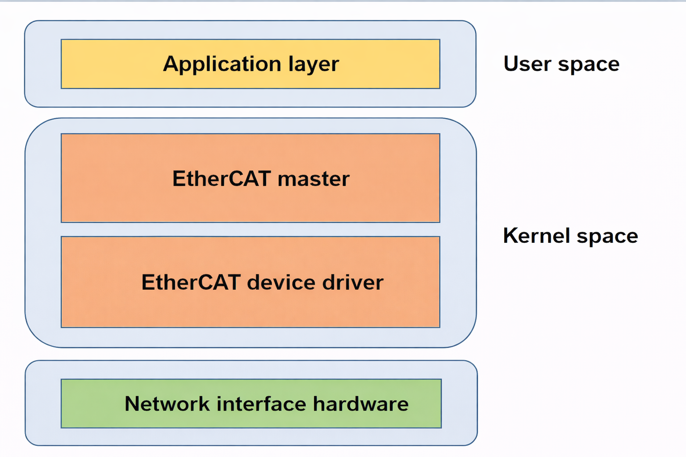

# EtherCAT

K3 EtherCAT Master Functionality and Usage Guide.

## Overview

K3 SDK integrates IGH EtherCAT 1.6.8 master protocol stack and customized real-time network card driver, providing EtherCAT master capabilities for high-performance and real-time communication. It is well-suited for high real-time application scenarios like motion control, servo drive and industrial robots.

### Functionality



The architecture of the EtherCAT Master is shown in the figure above and consists of four main components:

- **Application Layer:**
  This is where user applications reside, responsible for implementing industrial control logic. It interacts with the Master through provided interfaces.
- **EtherCAT Master Layer:**  
  This layer implements core functions such as protocol handling, bus topology management, slave configuration, and distributed clock synchronization.
- **EtherCAT Device Driver Layer:**  
  This layer consists of the real-time NIC driver and is responsible for transmitting and receiving EtherCAT data frames.
- **Hardware Layer:**  
  This layer includes the underlying network interfaces and related physical devices.

### Source Code Structure

The EtherCAT Master driver codes are located in the `drivers/net/ethercat` directory:

```bash
|-- device                              # EtherCAT device driver
|   |-- ecdev.h
|   |-- generic
|   |   |-- ec_generic.c                # Generic EtherCAT network card driver
|   |   `-- Makefile
|   |-- K1
|   |   |-- ec_k1x_emac.c               # K1 chip gigabit Ethernet EtherCAT device driver
|   |   |-- ec_k1x_emac.h
|   |   `-- Makefile
|   |-- K3                              # K3 chip gigabit Ethernet EtherCAT device driver 
|   |   |-- ...
|   |   |-- dwmac-spacemit-ethqos-ethercat.c
|   |   `-- ...
|   |-- Kconfig
|   `-- Makefile
|-- include
|   |-- config.h                        # Global configuration items and macro definitions
|   |-- ecrt.h                          # User program interfaces
|   |-- ectty.h
|   `-- globals.h                       # Global variables
|-- Kconfig
|-- Makefile
`-- master                              # IGH EtherCAT master implementation
    |-- cdev.c                          # Provides the EtherCAT character device initialization interface
    |-- cdev.h                 
    |-- coe_emerg_ring.c                # Interface for handling CoE emergent messages 
    |-- coe_emerg_ring.h       
    |-- datagram.c                      # Interface for constructing ECAT datagrams
    |-- datagram.h             
    |-- datagram_pair.c                 # Interface for constructing ECAT datagram pairs
    |-- datagram_pair.h        
    |-- debug.c                         # Debugging interface 
    |-- debug.h                
    |-- device.c                        # Interface for network card device abstraction and management
    |-- device.h               
    |-- domain.c                        # EtherCAT domain-related interface
    |-- domain.h               
    |-- doxygen.c
    |-- eoe_request.c
    |-- eoe_request.h          
    |-- ethernet.c                      # Core implementation of EOE functionality
    |-- ethernet.h             
    |-- flag.c
    |-- flag.h                 
    |-- fmmu_config.c                   # Interface for constructing FMMU configuration messages
    |-- fmmu_config.h          
    |-- foe.h                  
    |-- foe_request.c                   # FoE request handing interface
    |-- foe_request.h          
    |-- fsm_change.c                    # State transition state machine implementation 
    |-- fsm_change.h           
    |-- fsm_coe.c                       # CoE protocol state machine implementation
    |-- fsm_coe.h              
    |-- fsm_eoe.c                       # EoE protocol state machine implementation
    |-- fsm_eoe.h              
    |-- fsm_foe.c                       # FoE protocol state machine implementation
    |-- fsm_foe.h              
    |-- fsm_master.c                    # Master state machine implementation 
    |-- fsm_master.h           
    |-- fsm_pdo.c                       # PDO read/write state machine implementation
    |-- fsm_pdo_entry.c                 # PDO entry read/write state machine implementation 
    |-- fsm_pdo_entry.h        
    |-- fsm_pdo.h              
    |-- fsm_sii.c                       # Slave information interface read/write state machine implementation
    |-- fsm_sii.h              
    |-- fsm_slave.c                     # Slave state machine implementation
    |-- fsm_slave_config.c              # Slave configuration state machine implementation
    |-- fsm_slave_config.h     
    |-- fsm_slave.h            
    |-- fsm_slave_scan.c                # Slave scanning state machine implementation
    |-- fsm_slave_scan.h       
    |-- fsm_soe.c                       # SoE (Servo over EtherCAT) state machine implementation 
    |-- fsm_soe.h              
    |-- globals.h              
    |-- ioctl.c                         # IOCTL interface for user-space interaction 
    |-- ioctl.h               
    |-- Kconfig                
    |-- mailbox.c                       # ECAT mailbox message interface
    |-- mailbox.h              
    |-- Makefile               
    |-- master.c                        # Core logic of the EtherCAT master module
    |-- master.h               
    |-- module.c                        # Initialization and cleanup of the master module
    |-- pdo.c                           # PDO management interface
    |-- pdo_entry.c                     # PDO entry management interface
    |-- pdo_entry.h            
    |-- pdo.h                  
    |-- pdo_list.c                      # PDO list management interface
    |-- pdo_list.h             
    |-- reg_request.c                   # Interface for slave register read/write requests
    |-- reg_request.h          
    |-- rtdm.c                          # RTDM support
    |-- rtdm_details.h         
    |-- rtdm.h                 
    |-- rtdm-ioctl.c                    # RTDM IOCTL interface implementation
    |-- rtdm_xenomai_v3.c               # Interface for Xenomai v3 real-time framework 
    |-- rt_locks.h                      # Real-time lock implementation
    |-- sdo.c                           # SDO management
    |-- sdo_entry.c                     # SDO entry management
    |-- sdo_entry.h            
    |-- sdo.h                  
    |-- sdo_request.c                   # SDO request 
    ├── sdo_request.h          
    ├── slave.c                         # Slave state management logic
    |-- slave_config.c                  # Interface for slave configuration
    |-- slave_config.h         
    |-- slave.h                
    |-- soe_errors.c                    # Definition for SoE protocol error codes
    |-- soe_request.c                   # SoE request-related interface
    |-- soe_request.h          
    |-- sync.c                          # Interface for synchronization manager
    |-- sync_config.c                   # Interface for configuring the synchronization manager
    |-- sync_config.h          
    |-- sync.h                 
    |-- voe_handler.c                   # VOE (Vendor-specific over EtherCAT) request
    |-- voe_handler.h          
```

## Key Features

| Feature | Description |
| :-----| :----|
| Automatic Slave Configuration | Supports automatic scanning and configuration of connected slave devices, simplifying network setup |
| Distributed Clock Synchronization | Achieves Distributed Clock (DC) synchronization with precision of less than 1 µs |
| Multi-protocol Support | Supports protocols such as CoE, SoE, FoE, etc. |
| High Real-time Performance | Supports a 1 ms DC cycle, meeting the real-time requirements of most industrial applications |
| Multi-master Combination | Supports configuring multiple masters, each of which can manage two network devices: a primary device and a backup device |

## Configuration

It mainly includes **Kconfig configuration** and **DTS configuration**.

### Kconfig Configuration

- `ETHERCAT`: To enable EtherCAT services on the K3 platform, first configure this option to `Y`.

```c
menuconfig ETHERCAT
        bool "EtherCAT support"
        depends on NET && NETDEVICES && ETHERNET
        help
          EtherCAT is an industrial real-time fieldbus protocol that runs over
          Ethernet frames (Layer 2). Selecting this option enables the EtherCAT
          master subsystem and the corresponding network device interfaces.
```

- `EC_MASTER`: Enable the IgH EtherCAT master.
- `EC_MASTER_OF`: Enable the master configuration via the Device Tree. If disabled, the system falls back to passing master configuration through traditional module parameters.
- `EC_MASTER_RUN_ON_CPU`: Specify the CPU core on which the EtherCAT master runs.
- `EC_MASTER_DEBUG_LEVEL`: Sets the master debugging message output level.

```c
config EC_MASTER
    tristate "EtherCAT master (IgH)"
    depends on ETHERCAT
    help
      Say Y or M here to build the IgH EtherCAT master driver.
      The master is controlled via a character device interface.
      If unsure, say N.

config EC_MASTER_OF
    bool "Use Device Tree for EtherCAT master setup"
    depends on OF
    default y
    help
      Use Device Tree to provide EtherCAT master configuration,
      including master instances and bound Ethernet devices.

      This mode is intended for platform-integrated setups where
      EtherCAT master parameters are fixed by the board description,
      so runtime module parameters are not needed.

      If disabled, the original upstream module-parameter based
      configuration path is used instead.

config EC_MASTER_RUN_ON_CPU
    int "Run EtherCAT master on CPU"
    default 1
    range 0 7
    help
      Set the CPU (0-7) on which to run the EtherCAT master.
      If unsure, the default is 1.

config EC_MASTER_DEBUG_LEVEL
    int "Debug level for EtherCAT master"
    default 0
    range 0 2
    help
      Set the debug level for the EtherCAT master driver.
      0: No debug information.
      1: Error messages.
      2: Full debug information.
```

- `EC_GENERIC`: Enable generic EtherCAT device drivers.
- `EC_K3_GMAC`: Enables K3-specific EtherCAT device driver.

```c
config EC_GENERIC
        tristate "Generic EtherCAT device support"
        depends on EC_MASTER
        help
          Generic EtherCAT device support using the standard Linux networking
          stack. This is portable but may have higher latency/jitter.

config EC_K3_GMAC
        tristate "Spacemit K3 GMAC EtherCAT device support"
        depends on EC_MASTER && SOC_SPACEMIT_K3
        select PAGE_POOL
        help
          EtherCAT device support for Spacemit K3 GMAC controller.
```

> **Note 1:** If you need to use EtherCAT functionality on K3, EtherCAT, EC_MASTER, EC_DEVICE and EC_K3_GMAC are required.
>
> **Note 2:** On K3, the options EtherCAT, EC_MASTER, EC_DEVICE, EC_K3_GMAC and EC_MASTER_OF are enabled by default. Unless there are special requirements, users only need to enable the corresponding nodes in DTS to use the EtherCAT functions (see the next section).

Besides, it is recommended to enable `CONFIG_PREEMPT_RT` in the kernel configuration for better real-time performance.

```c
config PREEMPT_RT
        bool "Fully Preemptible Kernel (Real-Time)"
        depends on EXPERT && ARCH_SUPPORTS_RT && !COMPILE_TEST
        select PREEMPTION
        help
          This option turns the kernel into a real-time kernel by replacing
          various locking primitives (spinlocks, rwlocks, etc.) with
          preemptible priority-inheritance aware variants, enforcing
          interrupt threading and introducing mechanisms to break up long
          non-preemptible sections. This makes the kernel, except for very
          low level and critical code paths (entry code, scheduler, low
          level interrupt handling) fully preemptible and brings most
          execution contexts under scheduler control.

          Select this if you are building a kernel for systems which
          require real-time guarantees.
```

### DTS Configuration

In the DTS, the number of master can be configured via the `master-count`, and corresponding child nodes must be defined to match it. In each child node of the `master`, the primary and backup devices can be specified using `main-device` and `backup-device` respectively.
Taking the default configurations in `k3.dtsi` as an example, one EtherCAT master instance `master0` is defined by default, with its `main-device` bound to `eth0` and the current node state is `disabled`:

```c
ec_master: ethercat_master {
        compatible = "spacemit,igh-ec-master";
        master-count = <1>;
        status = "disabled";

        master0 {
                main-device = <&eth0>;
        };
};
```

The simplest way for users to enable EtherCAT functionality is to directly enable the `ec_master` node in the board-level DTS, and modify `compatible` of the corresponding network interface to `spacemit,k3-ec-gmac`. The configuration is as follows:

```c
&ec_master {
    status = "okay";
};

&eth0 {
    compatible = "spacemit,k3-ec-gmac", "snps,dwmac-5.10a";
}
```

If further customization is required, other properties in `ec_master` can be overridden in the board-level DTS. For example, to configure two masters:
`master0` and `master1`, where `master0` uses `eth1` and `master1` uses `eth0`:

```c
&ec_master {
        master-count = <2>;

        master0 {
                main-device = <&eth1>;
        };

        master1 {
                main-device = <&eth0>;
        };
};

&eth0 {
    compatible = "spacemit,k3-ec-gmac", "snps,dwmac-5.10a";
}

&eth1 {
    compatible = "spacemit,k3-ec-gmac", "snps,dwmac-5.10a";
}
```

## Interface

### API

Description of some commonly used APIs:

- Request a master instance.

```c
ec_master_t *ecrt_request_master(unsigned int master_id);
```

- Create a process data domain.

```c
ec_domain_t *ecrt_master_create_domain(ec_master_t *master);
```

- Activate the master.

```c
int ecrt_master_activate(ec_master_t *master);
```

- Synchronize the master's reference clock.

```c
int ecrt_master_sync_reference_clock_to(ec_master_t *master, uint64_t ref_time);
```

- Synchronize all slave clocks.

```c
void ecrt_master_sync_slave_clocks(ec_master_t *master);
```

- Configure a slave.

```c
ec_slave_config_t *ecrt_master_slave_config(ec_master_t *master, uint16_t alias, uint16_t position, uint32_t vendor_id, uint32_t product_code);

```

- Configure slave PDO mapping.

```c
int ecrt_slave_config_pdos(ec_slave_config_t *sc, uint16_t sync_index, const ec_sync_info_t *syncs);
```

- Register PDO entries to the specified data domain.

```c
int ecrt_slave_config_reg_pdo_entry(ec_slave_config_t *sc, uint16_t index, uint8_t subindex， ec_domain_t *domain, unsigned int *offset);

```

- Configure the distributed clock for the slave.

```c
int ecrt_slave_config_dc(ec_slave_config_t *sc, uint16_t assign_activate, uint32_t sync0_cycle_time, int32_t sync0_shift, uint32_t sync1_cycle_time, int32_t sync1_shift);
```

## Debugging

### sysfs

View master information via `/sys/class/EtherCAT/EtherCAT0`:

```c
/sys/class/EtherCAT/EtherCAT0
.
|-- dev
|-- power
|   |-- autosuspend_delay_ms
|   |-- control
|   |-- runtime_active_time
|   |-- runtime_status
|   `-- runtime_suspended_time
|-- subsystem -> ../../../../class/EtherCAT
`-- uevent

```

- dev: Provides the master device number information.
- power: Manages the power state of the device.
- subsystem: subsystem link. Indicates that the device belongs to the EtherCAT subsystem.
- uevent: Master device number and device name.

## Testing

EtherCAT master test procedure:

1. Connect the slave device to the master network interface.
2. Power on and boot the system. The kernel automatically loads EtherCAT master and real-time network card device driver.
3. The master automatically scans for slaves and outputs logs after successful identification.
4. The master enters `PREOP` state, waiting for the user applications to run.

The startup log example is as follows:

```c
[  966.525910] k1x_ec_emac cac80000.ethernet ecm0 (uninitialized): Link is Up - 100Mbps/Full - flow control off
[  966.535906] EtherCAT 0: Link state of ecm0 changed to UP.
[  966.552545] EtherCAT 0: 1 slave(s) responding on main device.
[  966.558389] EtherCAT 0: Slave states on main device: INIT.
[  966.564036] EtherCAT 0: Scanning bus.
[  966.739197] EtherCAT 0: Bus scanning completed in 176 ms.
[  966.745275] EtherCAT 0: Using slave 0 as DC reference clock.
[  966.756564] EtherCAT 0: Slave states on main device: PREOP.

```

Test cases can be developed based on `examples/dc_user/main.c` from the [EtherLab official examples](https://gitlab.com/etherlab.org/ethercat). The following example shows the output when testing with one slave under a 1 ms DC communication period:

```c
period         995180 ...    1004620
exec             4680 ...      48215
latency          3125 ...       7421

period         995420 ...    1004875
exec             4755 ...      47106
latency          3268 ...       7354

period         995060 ...    1004510
exec             4898 ...      46892
latency          3415 ...       7288

period         995330 ...    1004790
exec             4528 ...      47936
latency          3372 ...       7410

period         995210 ...    1004685
exec             4680 ...      48524
latency          3291 ...       7398

period         995560 ...    1004980
exec             4712 ...      47680
latency          3446 ...       7305

period         995140 ...    1004565
exec             4586 ...      48312
latency          3218 ...       7442

period         995470 ...    1004890
exec             4864 ...      46975
latency          3364 ...       7386

period         995090 ...    1004470
exec             4638 ...      48744
latency          3482 ...       7468

period         995380 ...    1004760
exec             4781 ...      47296
latency          3337 ...       7349
```

**Note:**

- `period`: The values in the period row represent the fluctuation range of the communication cycle within one second.
- `exec`: The values in the exec row represent the fluctuation range of the master’s periodic task execution time within one second.
- `latency`: The values in the latency row represent the fluctuation range of the master's wake-up latency within one second.

## FAQ
