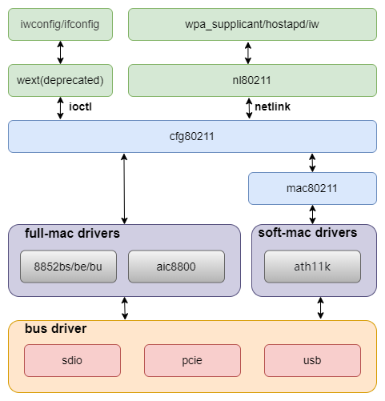

# WIFI

This document describes common Wi-Fi module porting methods for the K3 platform and summarizes the main integration considerations.

## Module Overview

The K3 platform requires an **external Wi-Fi module** to provide wireless connectivity. Supported interfaces include SDIO, PCIe, and USB.

## Functional Overview

In Linux, Wi-Fi support is typically organized into the following layers:



1. **cfg80211 / mac80211 / nl80211**  
    Provides the Linux wireless protocol stack and the user-space control interface.
2. **Module driver**  
    The Wi-Fi module driver is typically provided by the module vendor and implements the main Wi-Fi functionality.
3. **Interface controller**  
    Provides the transport interface used by the Wi-Fi module, such as PCIe, SDIO, or USB.

## Source Tree Overview

The main source locations involved are listed below:

```text
linux-6.18/
|-- drivers/net/wireless/          # Wi-Fi drivers (vendor or mainline)
|-- drivers/mmc/                   # SDIO / MMC host controllers
|-- drivers/regulator/             # Module power control
|-- drivers/mmc/core/pwrseq*       # Generic mmc-pwrseq power-up and reset logic
`-- arch/riscv/boot/dts/spacemit/  # Board-level DTS configuration
```

Wi-Fi driver source code is usually placed in the following directories:

```text
drivers/net/wireless
|-- aic8800             # AIC vendor driver
|-- realtek             # Realtek vendor driver
|    |-- rtl8852bs       # rtl8852bs
|    |-- rtw89           # rtl8852be
```

## Key Features

### SDIO Interface Features

| Feature | Description |
| :----- | :---- |
| SDIO v4.10 compatible | Supports the 4-bit SDIO 4.10 specification |
| SD 3.0 modes supported | Supports SDR12, SDR25, DDR50, SDR50, and SDR104 |
| PIO/DMA supported | Supports PIO, SDMA, ADMA, and ADMA2 transfer modes |

### Performance Data

| Module model | TX (Mb/s) | RX (Mb/s) |
| :----- | :---- | :----: |
| rtl8852bs | 460 | 480 |
| aic8800d80 | 410 | 470 |

## SDIO Module Configuration

### CONFIG Options

The main Wi-Fi-related configuration options are listed below.

`CONFIG_NET`, `CONFIG_WIRELESS`, and `CONFIG_CFG80211` provide the core Wi-Fi software stack and should be set to `Y`:

```text
Networking support (NET [=y])
    Wireless (WIRELESS [=y])
        cfg80211 - wireless configuration API (CFG80211 [=y])
```

The main SDIO-related configuration options are listed below.

`CONFIG_MMC` enables MMC bus protocol support and is typically set to `Y`:

```text
Device Drivers
    MMC/SD/SDIO card support (MMC [=y])
```

`CONFIG_MMC_SDHCI`, `CONFIG_MMC_SDHCI_PLTFM`, and `CONFIG_MMC_SDHCI_OF_K1` enable support for the SpacemiT SDHCI controller and should be set to `Y`:

```text
Device Drivers
    MMC/SD/SDIO card support (MMC [=y])
        Secure Digital Host Controller Interface support (MMC_SDHCI [=y])
            SDHCI platform and OF driver helper (MMC_SDHCI_PLTFM [=y])
                SDHCI OF support for the SpacemiT SDHCI controller (MMC_SDHCI_OF_K1 [=y])
```

### DTS Configuration

#### SDIO Controller Configuration

An example `&sdio` node in `k3_evb.dts` is shown below:

```dts
&sdio {
        pinctrl-names = "default";
        pinctrl-0 = <&mmc2_cfg>;
        bus-width = <4>;
        non-removable;
        vmmc-supply = <&vmmc_sdio>;
        vqmmc-supply = <&p1v8>;
        mmc-pwrseq = <&sdio_pwrseq>;
        no-mmc;
        no-sd;
        keep-power-in-suspend;
        clock-frequency = <375000000>;
        spacemit,tx_delaycode = <0x7f>;
        status = "okay";
};
```

On K3, the SDIO Wi-Fi driver no longer needs to manage board-level details such as regulators and GPIOs directly. These resources are managed uniformly at the bus level.

The recommended approach is as follows:

- Place power-related regulator and GPIO configuration in `vmmc-supply` and `vqmmc-supply`.
- Place Wi-Fi `REG_ON` and `RESET` configuration in `sdio_pwrseq`.

#### SDIO Power Configuration

`vmmc_sdio` is used to encapsulate the regulators and GPIOs required by the Wi-Fi module power rail. Some modules depend not only on regulators but also on specific GPIO states during power-up. For this reason, `regulator-fixed` is recommended for this configuration.

```dts
vmmc_sdio: regulator-vmmc-sdio {
        compatible = "regulator-fixed";
        regulator-name = "vmmc-sdio";
        regulator-min-microvolt = <3300000>;
        regulator-max-microvolt = <3300000>;
        enable-active-high;
        gpio = <&gpio 3 6 GPIO_ACTIVE_HIGH>;
};
```

#### Wi-Fi `REG_ON` Configuration

`sdio_pwrseq` defines the reset pin used for Wi-Fi `REG_ON`:

```dts
sdio_pwrseq: sdio-pwrseq {
        compatible = "mmc-pwrseq-simple";
        reset-gpios = <&gpio 3 4 GPIO_ACTIVE_LOW>;
};
```

## Interface Description

### User-Space Interface

For user-space access, the `nl80211` interface is recommended for Wi-Fi device management. Common tools include the following:

- `wpa_supplicant`
- `wpa_cli`
- `iw`
- `ip`

The legacy `wext` interface is not enabled by default. If required, `CONFIG_CFG80211_WEXT` can be enabled:

```text
cfg80211 wireless extensions compatibility (CFG80211_WEXT [=n])
```

## Debugging

### 1. Check the controller state

For `SDIO`:

```bash
dmesg | grep -i mmc1
```

```bash
ls /sys/kernel/debug/mmc/
```

For `USB`:

```bash
dmesg | grep -i usb
```

```bash
ls /sys/kernel/debug/usb/
```

### 2. Check whether the Wi-Fi module is detected

The following messages are typically visible in `dmesg`:

- SDIO, USB, or PCIe card/function enumeration logs
- subsequent probe logs from the vendor Wi-Fi driver

If the Wi-Fi module is not detected, check the following items:

- `vmmc-supply`
- `vqmmc-supply`
- `reset-gpios`
- `spacemit,tx_delaycode`
- `status = "okay"`

### 3. Check the bus operating state

For `SDIO`:

```bash
cat /sys/kernel/debug/mmc1/ios
```

Check the following information:

- `clock`
- `bus width`
- `timing spec`
- `signal voltage`

For `USB`:

```bash
cat /sys/kernel/debug/usb/devices
```

Check the following information:

- `Driver`
- `Spd`
- `Vendor / ProdID`
- `Manufacturer / Product`

## Test Guide

### Scan and Connection Test

First, confirm that `wpa_supplicant` is running correctly.

```bash
wpa_supplicant -iwlan0 -Dnl80211 -c/etc/wpa_supplicant.conf -B
```

An example `wpa_supplicant.conf` configuration is shown below:

```txt
ctrl_interface=/var/run/wpa_supplicant
disable_scan_offload=1
update_config=1
filter_rssi=-75
pmf=1
#sae_pwe=2
wowlan_triggers=any
#bgscan="simple:11:-70:300"
gas_rand_addr_lifetime=0
gas_rand_mac_addr=1
```

- `ctrl_interface`: specifies the control interface path used for communication between `wpa_supplicant` and userspace tools such as `wpa_cli`. If `ctrl_interface` is not the default `/var/run/wpa_supplicant`, `wpa_cli` must use `-p` to specify the path explicitly.
- `disable_scan_offload`: disables hardware scan offload, if supported by the module, and forces software-based scanning.
- `update_config`: allows `wpa_supplicant` to update the configuration file automatically.
- `filter_rssi`: filters out Wi-Fi access points with signal strength below `-75 dBm`, so that only APs with acceptable signal quality are considered.
- `pmf`: enables Protected Management Frames (802.11w) to prevent spoofing of management frames such as deauthentication frames. `1` means optional, and `2` means required.
- `sae_pwe`: controls the SAE password element derivation method. `2` means that only the H2E method is used.
- `wowlan_triggers`: enables Wake on WLAN (WoWLAN) and sets the wake-up trigger condition to any event.
- `bgscan`: configures background scanning. `simple:11:-70:300` means scanning every 300 seconds when the current signal is greater than or equal to `-70 dBm`, and every 11 seconds when the signal is below `-70 dBm`.
- `gas_rand_addr_lifetime`: sets the lifetime of the random MAC address used for GAS (Generic Advertisement Service). `0` means permanent.
- `gas_rand_mac_addr`: enables random MAC address usage during GAS interaction to improve privacy.

Scan with `wpa_cli`:

```bash
wpa_cli -iwlan0 -p/var/run/wpa_supplicant
scan
scan_results
```

A successful scan typically produces output similar to the following:

```bash
bssid / frequency / signal level / flags / ssid
f6:12:b3:d4:65:ef       2462    -37     [WPA2-PSK-CCMP][WPS][ESS][P2P]  wilson
78:85:f4:82:01:3c       2462    -66     [WPA2-PSK-CCMP][WPS][ESS]       HUAWEI-LX45AG_HiLink
02:0e:5e:76:a5:6e       2412    -69     [WPA-PSK-CCMP+TKIP][ESS]        ChinaNet-1mMr
30:8e:7a:2f:64:8c       2437    -69     [WPA-PSK-CCMP+TKIP][WPA2-PSK-CCMP+TKIP][ESS]    K03_1tlftb
dc:16:b2:57:9e:65       2437    -78     [WPA2-PSK-CCMP][ESS]    \x00\x00\x00\x00\x00\x00\x00\x00
dc:16:b2:57:9e:60       2437    -78     [WPA-PSK-CCMP][WPA2-PSK-CCMP][WPS][ESS] TK-ZJB
48:0e:ec:ad:52:4d       2462    -78     [WPA-PSK-CCMP][WPA2-PSK-CCMP][WPS][ESS] TP-LINK_524D
3c:d2:e5:c6:08:9b       2452    -83     [WPA2-PSK-CCMP][ESS]
3e:d2:e5:16:08:9b       2452    -83     [WPA-PSK-CCMP+TKIP][WPA2-PSK-CCMP+TKIP][ESS]    young
80:ea:07:dc:f2:be       2462    -88     [WPA-PSK-CCMP][WPA2-PSK-CCMP][ESS]      HZXF
9a:00:74:84:d1:60       2412    -85     [WPA-PSK-CCMP+TKIP][WPA2-PSK-CCMP+TKIP][ESS]   ChinaNet-ieR7
dc:f8:b9:46:ec:30       2472    -85     [WPA-PSK-CCMP+TKIP][WPA2-PSK-CCMP+TKIP][ESS]   ChinaNet-MiZK
```

Select the target AP and connect:

```bash
> add_network
0
> set_network 0 ssid "wilson"
OK
> set_network 0 key_mgmt WPA-PSK
OK
> set_network 0 psk "wilson2001"
OK
> enable_network 0
```

```bash
wpa_supplicant -iwlan0 -Dnl80211 -c/wpa_supplicant.conf -B
wpa_cli -iwlan0 -p/var/run/wpa_supplicant
```

### Throughput Test

Within the same local network, `iperf3` can be used for throughput testing as follows:

```bash
# Server
iperf3 -s

# Client
iperf3 -c <server-ip> -t 60
```

### Signal Strength Check

After the connection is established, the following command can be used to check the current signal strength and link status:

```bash
iw dev wlan0 link
```

More detailed statistics can be viewed with:

```bash
iw dev wlan0 station dump
```

Focus on the following fields:

- `signal` — current RSSI in dBm. In most cases, values higher than `-70 dBm` indicate acceptable signal quality.
- `tx bitrate` / `rx bitrate` — current negotiated transmit and receive rates.
- `tx failed` / `tx retries` — transmit failure and retry counters. Continuously increasing values usually indicate poor signal quality.

## FAQ

### 1. Why is the controller running, but no `wlan0` device appears after the driver is loaded?

Common causes include:

- the controller DTS node for the selected solution is not enabled
- incorrect `vmmc-supply` or `vqmmc-supply` configuration, or abnormal supply voltage
- incorrect `mmc-pwrseq` configuration for the Wi-Fi module `REG_ON` / `RESET` pins
- missing Wi-Fi firmware required by the module

### 2. Why do abnormal log messages appear during Wi-Fi operation even though Wi-Fi works?

For example:

```txt
[69686.314058] rtl8852bs mmc1:0001:1: rtw_sdio_raw_write: sdio write failed (-84)
[69686.314063] mmc1: set tx_delaycode: 127
[69686.314080] rtl8852bs mmc1:0001:1: RTW_SDIO: WRITE use CMD53
[69686.314085] rtl8852bs mmc1:0001:1: RTW_SDIO: WRITE to 0x1800a, 80 bytes
[69686.322783] mmc1: pretuned card, use select_delay[1]:200
[69686.328249] RTW_SDIO: WRITE 00000000: 00 64 48 00 00 00 00 00 1a 00 24 00 b9 23 00 00
[69686.341886] RTW_SDIO: WRITE 00000010: 00 00 00 00 00 00 00 00 00 00 00 40 00 00 00 00
[69686.349841] RTW: ERROR sdio_io: write FAIL! error(-2) addr=0x1800a 80 bytes, retry=0,0
[69686.349942] rtl8852bs mmc1:0001:1: rtw_sdio_raw_write: sdio write failed (-110)
```

Common causes include:

- `-84` indicates an SDIO TX CRC error. The SDIO `spacemit,tx_delaycode` parameter usually needs adjustment.
- `-110` indicates an SDIO operation timeout. This is commonly caused by signal integrity issues or timing mismatch. In this case, adjustment of `spacemit,tx_delaycode` or reduction of the SDIO clock frequency is recommended for troubleshooting.

### 3. Why is internet access unavailable after a successful AP connection?

Common causes include:

- no IP address has been assigned; this can be verified with `ip addr show wlan0`
- the DHCP client, such as `udhcpc` or `dhclient`, is not running correctly
- DNS is not configured correctly; check whether `/etc/resolv.conf` contains a valid `nameserver`
- no default route is present; this can be checked with `ip route`