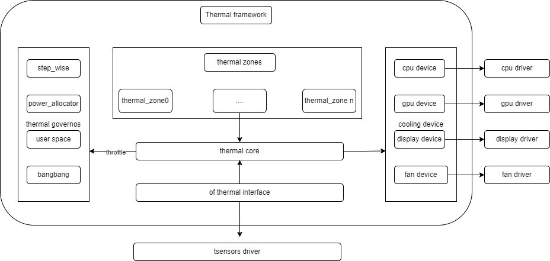

# Thermal

This document describes the thermal management functions of the K3 SoC and their usage model.

## Module Overview

Thermal refers to a driver framework for temperature monitoring and thermal control.
The Linux Thermal framework is the standard Linux architecture for temperature management and is mainly used to address the increasing thermal challenges that come with higher device performance.

### Functional Overview



1. **thermal_cooling_device**: the driver that applies cooling actions and acts as the execution layer of the thermal-control flow.
2. **thermal core**: the core thermal framework. It handles driver initialization, maintains the relationships among thermal zones, governors, and cooling devices, and interacts with user space through `sysfs`.
3. **thermal governor**: the thermal-control algorithm that determines which cooling state should be selected when thermal control is triggered.
4. **thermal zone device**: mainly used to create thermal-zone nodes and connect thermal sensors. These nodes are created under `/sys/class/thermal` based on DTS configuration.
5. **thermal sensor**: the temperature sensor that provides temperature data to the thermal framework.

### Source Tree Overview

The thermal driver directory structure is shown below:

```
drivers/thermal/
├── cpufreq_cooling.c
├── cpuidle_cooling.c
├── devfreq_cooling.c
├── gov_bang_bang.c
├── gov_fair_share.c
├── gov_power_allocator.c
├── gov_step_wise.c
├── gov_user_space.c
├── k3-thermal.c    --> K3 platform driver
├── k3-thermal.h
├── thermal_core.c
├── thermal_core.h
├── thermal_helpers.c
├── thermal_hwmon.c
├── thermal_hwmon.h
├── thermal_of.c
├── thermal_sysfs.c
```

### K3 Thermal Sensor Overview

The K3 SoC integrates 8 temperature sensors (sensor 0 to sensor 7). These sensors are distributed across different chip regions and are used to monitor the temperature of major functional blocks. The driver determines which sensors are enabled through the `sensor_range` and `tsensor_map` properties.

In DTS, the tsensor node is configured with `sensor_range = <0x0 0x7>` and `tsensor_map = <1 0 1 1 1 1 1 1>`. This means that sensors 0 and 2 to 7 are enabled, while sensor 1 is disabled.

The monitored regions associated with each sensor are shown below, using `k3_evb` as an example:

| Sensor ID | Thermal Zone | Monitored Region |
| :--- | :--- | :--- |
| 0 | thermal_top | Top-level chip region |
| 2 | thermal_vpu | VPU region |
| 3 | thermal_gpu | GPU region |
| 4 | thermal_cluster0 | CPU Cluster 0（cpu_0~cpu_3） |
| 5 | thermal_cluster1 | CPU Cluster 1（cpu_4~cpu_7） |
| 6 | thermal_cluster2 | CPU Cluster 2（cpu_8~cpu_11） |
| 7 | thermal_cluster3 | CPU Cluster 3（cpu_12~cpu_15） |

## Key Features

### Features

- Supports multi-zone temperature monitoring
- Supports CPU thermal control
- Supports over-temperature shutdown at 115°C

### Test Method

Use an external temperature measurement device or run high-load applications to create observable temperature variation. Then inspect the thermal and cpufreq nodes to confirm that thermal control behaves as expected.

1. Check the temperature of each thermal zone:
   ```
   cat /sys/class/thermal/thermal_zone1/temp
   ```

2. Check the CPU frequency-scaling nodes to confirm whether thermal throttling is taking effect:
   ```
   cat /sys/devices/system/cpu/cpufreq/policy0/scaling_cur_freq
   cat /sys/devices/system/cpu/cpufreq/policy8/scaling_cur_freq
   ```

3. Check the GPU cooling state. `CONFIG_POWERVR_THERMAL` must be enabled:
   ```
    cat /sys/class/thermal/cooling_device*/type   # Find the device whose type is devfreq
   cat /sys/class/thermal/cooling_device*/cur_state
   ```

## Configuration

Configuration mainly includes **driver enablement options** and **DTS configuration**.

### CONFIG Options

The THERMAL-related configuration is shown below:

```
CONFIG_K3_THERMAL:
Enable this option if you want to have support for thermal management
controller present in Spacemit SoCs

  Symbol: K3_THERMAL [=y]
  Type  : tristate
  Defined at drivers/thermal/Kconfig:420
  Prompt: Spacemit K3 Thermal Support
  Depends on: OF [=y] && SOC_SPACEMIT [=y]
  Location:
   -> Device Drivers
    -> Thermal drivers (THERMAL [=y])
     -> Spacemit K3 Thermal Support (K3_THERMAL [=y])
```

### DTS Configuration

The tsensor hardware node is located in `k3.dtsi`:

```dts
thermal: thermal@d4018000 {
    compatible = "spacemit,k3-tsensor";
    reg = <0x0 0xd4018000 0x0 0x100>;
    interrupt-parent = <&saplic>;
    interrupts = <61 IRQ_TYPE_LEVEL_HIGH>;
    interrupt-names = "tsensor";
    clocks = <&syscon_apbc CLK_APBC_TSEN>,
             <&syscon_apbc CLK_APBC_TSEN_BUS>;
    clock-names = "func", "bus";
    resets = <&syscon_apbc RESET_APBC_TSEN>;
    sensor_range = <0x0 0x7>;
    tsensor_map = <1 0 1 1 1 1 1 1>;
    temperature_offset = <274>;
    #thermal-sensor-cells = <1>;
    status = "okay";
};
```

Thermal-zone configuration is defined in the board-level DTS files. The example below shows only the cluster1 section from `k3_evb.dts`:

```dts
&thermal_zones {
    thermal_cluster1 {
        polling-delay = <1000>;
        polling-delay-passive = <250>;
        thermal-sensors = <&thermal 5>;

        trips {
            thermal_cluster1_trip0: thermal_cluster1-trip0 {
                temperature = <85000>;
                hysteresis = <2000>;
                type = "active";
            };

            thermal_cluster1_trip1: thermal_cluster1-trip1 {
                temperature = <95000>;
                hysteresis = <2000>;
                type = "passive";
            };

            thermal_cluster1_trip2: thermal_cluster1-trip2 {
                temperature = <105000>;
                hysteresis = <2000>;
                type = "passive";
            };

            thermal_cluster1_trip3: thermal_cluster1-trip3 {
                temperature = <115000>;
                hysteresis = <2000>;
                type = "critical";
            };
        };

        cooling-maps {
            map0 {
                trip = <&thermal_cluster1_trip0>;
                cooling-device = <&cpu_0 2 2>,
                        <&cpu_1 2 2>,
                        ...
                        <&cpu_7 2 2>;
            };
            ...
        };
    };
};
```

## Interface Description

### API Overview

Refer to the following directory in the kernel documentation:
```
Documentation/driver-api/thermal/
```

## Debugging

### `sysfs`

All thermal-zone nodes are located under `/sys/class/thermal/`.

| Node | Description |
| :--- | :--- |
| thermal\_zoneX/temp | Current temperature in milli-degrees Celsius |
| thermal\_zoneX/type | Thermal-zone name |
| thermal\_zoneX/trip\_point\_Y\_temp | Temperature threshold of trip point `Y` |
| thermal\_zoneX/trip\_point\_Y\_type | Type of trip point `Y` |
| thermal\_zoneX/policy | Active thermal governor |
| cooling\_deviceX/cur\_state | Current cooling-device state |
| cooling\_deviceX/max\_state | Maximum cooling-device state |

For more `sysfs` interfaces, refer to:
```
Documentation/driver-api/thermal/sysfs-api.rst
```

## Test Guide

Validate the thermal driver according to the procedure described in the **Test Method** section above.

## FAQ