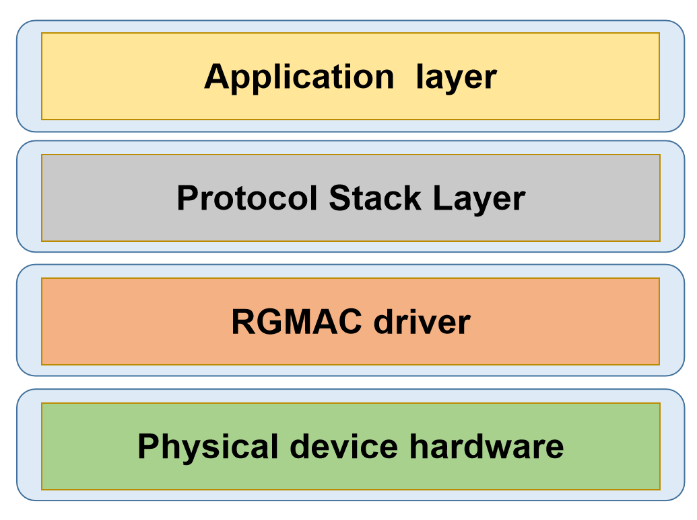

# RGMAC

This document describes the RGMAC module features and usage.

## Module Overview

The K3 RGMAC module uses the Synopsys DesignWare Ethernet QoS controller, version 5.40a, and complies with IEEE 802.3-2015.

On the K3 platform, this module can be accessed by:

- the ACPU, through the Linux GMAC driver, to provide full Ethernet interface functionality
- the RCPU, through the RT-Thread GMAC driver, to meet real-time communication requirements

This document focuses only on the RGMAC module implemented with the RT-Thread GMAC driver.

### Functional Architecture



- **Application layer:** Provides application-facing services.
- **Protocol stack layer:** Implements network protocols and provides system call interfaces for the application layer. The current secondary-core system supports EtherCAT only.
- **Device driver layer:** Handles data transmission and device management.
- **Physical layer:** Network hardware devices.

### Source Code Structure

The driver source code is located in `esos/bsp/spacemit/drivers/gmac`. The main files are listed below:

```bash
esos/bsp/spacemit/drivers/gmac
.
|-- dwc_eth_qos.c               # EQoS controller core driver
|-- dwc_eth_qos.h
|-- dwc_eth_qos_spacemit.c      # EQoS controller platform driver
|-- dwc_eth_qos_tool.c          # `macctl` tool implementation for debugging and basic functional tests
|-- genphy.c                    # Generic PHY driver
|-- genphy.h
`-- SConscript
```

## Key Features

| Feature | Description |
| :----- | :---- |
| RGMII / RMII support | Supports multiple PHY interface types |
| 10/100/1000 Mbps support | Supports multiple link speeds |
| Auto-negotiation support | Supports automatic negotiation of speed and duplex mode on the PHY side |
| Loopback test support | Supports both MAC loopback and PHY loopback tests |
| Polling-only data transfer | Packet transmission and reception must be triggered by upper-layer polling |

> **Note:** The features listed here apply only to the functionality implemented by the RT-Thread GMAC/PHY driver and do not cover all capabilities supported by the hardware itself.

## Configuration

Configuration mainly includes **Kconfig settings** and **DTS settings**.

### Kconfig Settings

1. `BSP_USING_GMAC`: Enables the RGMAC driver.

```bash
config BSP_USING_GMAC
    bool "Enable GMAC"
    default n
```

1. `BSP_USING_MACCTL_TOOL`: Enables the `macctl` tool.

```bash
if BSP_USING_GMAC
    config BSP_USING_MACCTL_TOOL
        bool "Enable MAC Control Tool"
        default n
endif
```

1. `RT_USING_ETHERCAT`: Enables the RT-Thread version of the IgH EtherCAT master.

```bash
config RT_USING_ETHERCAT
    bool "Enable IGH EtherCAT support"
    default n
```

> **Note:** To use the `macctl` tool for functional testing, `RT_USING_ETHERCAT` must be disabled.

### DTS Settings

#### pinctrl

In `k3-pinctrl.dtsi`, a default pin configuration is provided for RGMAC-related pins:

```c
  rgmac0_cfg: rgmac0-cfg {
      pinctrl-single,pins = <
          K3_PADCONF(GPIO_59, (MUX_MODE1 | EDGE_NONE | PULL_DIS | PAD_DS8))    /* rgmac0 rxdv */
          K3_PADCONF(GPIO_60, (MUX_MODE1 | EDGE_NONE | PULL_DIS | PAD_DS8))    /* rgmac0 rx d0 */
          K3_PADCONF(GPIO_61, (MUX_MODE1 | EDGE_NONE | PULL_DIS | PAD_DS8))    /* rgmac0 rx d1 */
          K3_PADCONF(GPIO_62, (MUX_MODE1 | EDGE_NONE | PULL_DIS | PAD_DS8))    /* rgmac0 rx clk */
          K3_PADCONF(GPIO_63, (MUX_MODE1 | EDGE_NONE | PULL_DIS | PAD_DS8))    /* rgmac0 rx d2 */
          K3_PADCONF(GPIO_64, (MUX_MODE1 | EDGE_NONE | PULL_DIS | PAD_DS8))    /* rgmac0 rx d3 */
          K3_PADCONF(GPIO_65, (MUX_MODE1 | EDGE_NONE | PULL_DIS | PAD_DS8))    /* rgmac0 tx d0 */
          K3_PADCONF(GPIO_66, (MUX_MODE1 | EDGE_NONE | PULL_DIS | PAD_DS8))    /* rgmac0 tx d1 */
          K3_PADCONF(GPIO_67, (MUX_MODE1 | EDGE_NONE | PULL_DIS | PAD_DS8))    /* rgmac0 tx clk */
          K3_PADCONF(GPIO_68, (MUX_MODE1 | EDGE_NONE | PULL_DIS | PAD_DS8))    /* rgmac0 tx d2 */
          K3_PADCONF(GPIO_69, (MUX_MODE1 | EDGE_NONE | PULL_DIS | PAD_DS8))    /* rgmac0 tx d3 */
          K3_PADCONF(GPIO_70, (MUX_MODE1 | EDGE_NONE | PULL_DIS | PAD_DS8))    /* rgmac0 tx en */
          K3_PADCONF(GPIO_71, (MUX_MODE1 | EDGE_NONE | PULL_DIS | PAD_DS8))    /* rgmac0 mdc */
          K3_PADCONF(GPIO_72, (MUX_MODE1 | EDGE_NONE | PULL_DIS | PAD_DS8))    /* rgmac0 mdio */
          K3_PADCONF(GPIO_73, (MUX_MODE1 | EDGE_NONE | PULL_DIS | PAD_DS8))    /* rgmac0 int */
          K3_PADCONF(GPIO_74, (MUX_MODE1 | EDGE_NONE | PULL_DIS | PAD_DS8))    /* rgmac0 clk ref */
      >;
  };
```

If the drive strength does not need to be changed, the board-level Ethernet node in the DTS only needs to reference this pin configuration:

```c
&eth0 {
 pinctrl-names = "default";
 pinctrl-0 = <&rgmac0_cfg>;
 ...
}
```

#### gpio

Check the board schematic to determine which GPIO is connected to the RGMAC PHY reset signal. For example, if the reset pin is connected to `GPIO75`, use the following configuration:

```c
&eth0 {
 ...
 phy-reset-pin = <75>;
 ...
}
```

#### phy

The PHY driver used in the RT-Thread version is a generic PHY driver with a relatively simple implementation. Only the interface type and PHY address need to be configured:

```c
&eth0 {
 ...
 phy-mode = "rgmii";
 phy-handle = <&rgmii>;
 ...
 mdio {
  #address-cells = <1>;
  #size-cells = <0>;

  rgmii: phy@0 {
   reg = <0x1>;
  };
 };
 ...
};
```

#### TX/RX Phase

On the RGMII interface, the phase offset between the clock and data signals is affected by board-level PCB routing. In severe cases, this may cause data sampling errors.
The K3 platform supports clock phase offset configuration to optimize the sampling window and ensure strict timing requirements are met, including setup and hold margins.

The following example shows the configuration used on the K3 EVB:

```c
&eth0 {
 ...
 clk-tuning-enable = <1>;
 clk-tuning-by-delayline = <1>;
 tx-phase = <51>;
 rx-phase = <54>;
 ...
};
```

Here, `spacemit,clk-tuning-enable` enables the clock phase tuning feature on the K3 platform.

- For PHYs using the RMII interface, this feature is usually not required.
- If delay is already provided by the PHY, no additional K3-side delay configuration is required.
- When phase tuning is handled on the K3 side, the following methods are available:

    ```c
    spacemit,clk-tuning-by-reg
    spacemit,clk-tuning-by-delayline
    spacemit,clk-tuning-by-clk-revert
    ```

Note: the values of `spacemit,tx-phase` and `spacemit,rx-phase` correspond to actual tuning adjustments. However, the effective adjustment is significantly influenced by board-level power conditions, so an exact absolute mapping cannot be provided. These values should therefore be treated as tuning steps.

When `spacemit,clk-tuning-by-reg` is used, `tx-phase` and `rx-phase` can be set from 0 to 7, providing 8 tuning steps.

When `spacemit,clk-tuning-by-delayline` is used, `tx-phase` and `rx-phase` can be set from 0 to 254, providing 255 tuning steps.

When `spacemit,clk-tuning-by-clk-revert` is used, the clock phase is inverted by 180°. This method is used only in RMII mode.

#### `max-speed`

This property sets the maximum speed supported by the platform.

```c
&eth0 {
 ...
 max-speed = <1000>;
 ...
};
```

#### Complete DTS Example

Based on the settings above, a complete configuration example is shown below:

```c
&eth0 {
 pinctrl-names = "default";
 pinctrl-0 = <&rgmac0_cfg>;
 phy-reset-pin = <75>;
 max-speed = <1000>;
 clk-tuning-enable = <1>;
 clk-tuning-by-delayline = <1>;
 tx-phase = <51>;
 rx-phase = <54>;
 phy-mode = "rgmii";
 phy-handle = <&rgmii>;

 status = "okay";

 mdio {
  #address-cells = <1>;
  #size-cells = <0>;

  rgmii: phy@0 {
   reg = <0x1>;
  };
 };
};
```

## Example Usage

On the secondary-core serial console, the `macctl` tool can be used to perform basic RGMAC functional tests. Common commands are listed below:

1. Register access test

```bash
macctl eqos0 test reg-access
```

1. MAC loopback test

```bash
macctl eqos0 test mac-loopback
```

1. PHY loopback test

```bash
macctl eqos0 test phy-loopback
```

1. Link up/down stress test

```bash
macctl eqos0 test up-down -c <count>
```

1. Polling send/receive stress test

```bash
macctl eqos0 test polling -c <count>
```

## Application Development

The current RGMAC driver supports EtherCAT communication only and is not integrated with the RT-Thread network protocol stack.

The following section introduces the main EtherCAT interfaces in the RT-Thread version. These interfaces are fully consistent with those provided by the Linux EtherCAT master.

- Request a master instance:

    ```c
    ec_master_t *ecrt_request_master(unsigned int master_id);
    ```

- Create a process data domain:

    ```c
    ec_domain_t *ecrt_master_create_domain(ec_master_t *master);
    ```

- Activate the master:

    ```c
    int ecrt_master_activate(ec_master_t *master);
    ```

- Synchronize the master reference clock:

    ```c
    int ecrt_master_sync_reference_clock_to(ec_master_t *master, uint64_t ref_time);
    ```

- Synchronize all slave clocks:

    ```c
    void ecrt_master_sync_slave_clocks(ec_master_t *master);
    ```

- Configure a slave device:

    ```c
    ec_slave_config_t *ecrt_master_slave_config(ec_master_t *master, uint16_t alias, uint16_t position, uint32_t vendor_id, uint32_t product_code);
    ```

- Configure slave PDO mapping:

    ```c
    int ecrt_slave_config_pdos(ec_slave_config_t *sc, uint16_t sync_index, const ec_sync_info_t *syncs);
    ```

- Register a PDO entry to a specified data domain:

    ```c
    int ecrt_slave_config_reg_pdo_entry(ec_slave_config_t *sc, uint16_t index, uint8_t subindex, ec_domain_t *domain, unsigned int *offset);
    ```

- Configure distributed clocks for a slave device:

    ```c
    int ecrt_slave_config_dc(ec_slave_config_t *sc, uint16_t assign_activate, uint32_t sync0_cycle_time, int32_t sync0_shift, uint32_t sync1_cycle_time, int32_t sync1_shift);
    ```

## Debugging

Debugging is performed mainly through the `macctl` tool.

## Appendix
>
> TBD

## FAQ

### Network Interface Activation Failure

If the `macctl eqos0 up` command fails, the 4 most common causes are listed below.

1. **The PHY device is not operating correctly**

    Check the following items:

    - If the RJ45 LED does not blink, verify that the PHY input signals, such as the working clock and supply voltage, meet the requirements.
    - If the RJ45 LED appears normal, inspect the PHY registers to further confirm that the PHY is operating correctly:

    ```bash
    macctl eqos0 phy-regs           # View common PHY registers
    ```

2. **No stable clock signal is present on RGMAC RXC**

    Check the following items:

    - Verify that the PHY RXC pin outputs a valid clock.
    - If the clock is normal, check the continuity of the board-level routing and related connections.

3. **The PHY reset timing is configured incorrectly**

    Review the PHY datasheet and configure an appropriate reset timing.

4. **The PHY device cannot be detected**

    Check whether the PHY address is configured correctly.

### Packet Transmission or Reception Contains Bit Errors

This issue may be caused by incorrect TX/RX phase settings.

Recommended approach:

- Try different phase parameter combinations.
- Use the following commands to identify suitable values:

```bash
macctl eqos0 send               # Manually send a specific packet locally and capture it on the peer side to verify the current phase setting
macctl eqos0 recv               # Send a packet from the peer side and receive it locally to verify the current phase setting
```

### No Packets Are Received

Run the `mac loopback` test first to rule out faults in the controller itself:

```bash
macctl eqos0 mac-loopback on

macctl eqos0 send

macctl eqos0 recv               # A packet containing the 0x20211102 magic number should be received
```

If the `mac loopback` test passes, check the following items:

- the continuity of the RXD signals between the MAC and PHY
- whether the sampling timing satisfies the interface setup and hold constraints
