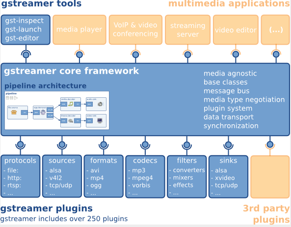
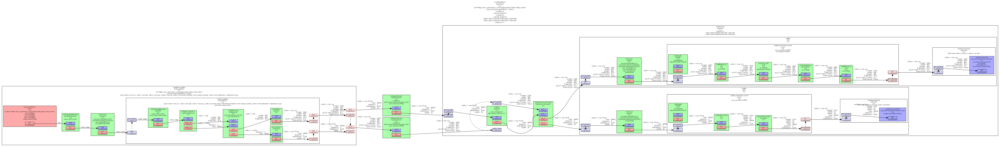

sidebar_position: 3

# GStreamer Usage Guide

## GStreamer

GStreamer is an open-source multimedia framework. Its plugin-based design allows plugins to be linked into predefined data stream pipelines.

Official Website: [https://gstreamer.freedesktop.org](https://gstreamer.freedesktop.org/)

### GStreamer Framework

By creating and linking elements, GStreamer builds pipelines that allow data streams to flow between elements and perform specific tasks such as media playback or audio recording.

GStreamer framework:



### GStreamer Source Code Distribution Structure

The GStreamer source code is divided into multiple repositories by functional module, with each repository responsible for a specific area. A brief description of each repository is provided below:

| Repo            | Functionality                                                                 |
|-------------------|------------------------------------------------------------------------|
| `gstreamer`      | Core framework repository |
| `gst-plugins-base` | Base plugin repository |
| `gst-plugins-good` | Mature and stable plugins                                |
| `gst-plugins-bad`  | Plugins under development that may be unstable |
| `gst-plugins-ugly` | Plugins with licensing restrictions that may be optional depending on local laws and regulations |
| `gst-libav`        | Codec plugins based on libav |

This structure keeps each repository relatively independent, while most components still rely on `gstreamer` and `gst-plugins-base`.

### GStreamer Installation

#### Bianbu OS

Run the following commands to install GStreamer 1.0:

```
sudo apt-get update

sudo apt-get install gstreamer1.0-tools gstreamer1.0-alsa gstreamer1.0-plugins-base gstreamer1.0-plugins-good gstreamer1.0-plugins-bad gstreamer1.0-plugins-ugly gstreamer1.0-libav

sudo apt-get install libgstreamer1.0-dev libgstreamer-plugins-base1.0-dev libgstreamer-plugins-good1.0-dev libgstreamer-plugins-bad1.0-dev
```

Run the following command to check the GStreamer 1.0 version:

```
gst-inspect-1.0 --version
```

#### Buildroot 

When compiling the system image, enable the integration options for GStreamer and related plugins. If the GStreamer package is already enabled in the system image, the related commands can be used directly. Otherwise, enable the corresponding package and rebuild the system image.

Configuration Examples:

```
BR2_PACKAGE_GSTREAMER1=y
BR2_PACKAGE_GST1_PLUGINS_BASE=y
BR2_PACKAGE_GST1_PLUGINS_GOOD=y
BR2_PACKAGE_GST1_PLUGINS_BAD=y
BR2_PACKAGE_GST1_PLUGINS_UGLY=y
BR2_PACKAGE_GST1_LIBAV=y
```

**Note:**

- `BR2_PACKAGE_GSTREAMER1`: GStreamer framework package
- `BR2_PACKAGE_GST1_PLUGINS_BASE`: Base plugin collection
- `BR2_PACKAGE_GST1_PLUGINS_GOOD`: Mature and stable plugins
- `BR2_PACKAGE_GST1_PLUGINS_BAD`: Platform-related or under-development plugins; SpacemiT-related plugins are typically included in this collection
- `BR2_PACKAGE_GST1_PLUGINS_UGLY`: Plugin collection with licensing restrictions
- `BR2_PACKAGE_GST1_LIBAV`: GStreamer plugins based on libav/FFmpeg

Run the following command to check the version of GStreamer-1.0:

```
gst-inspect-1.0 --version
```

### GStreamer Plugins

Run the following command to inspect the default GStreamer plugins supported in the current Bianbu OS or Buildroot system:

```
gst-inspect-1.0
```

Running `gst-inspect-1.0` with a specific plugin name displays detailed information about that plugin.

#### Video Decoder Plugins

A video decoder converts the source video format into a raw format that can be interpreted by the target sink, such as a display device. **SpacemiT GStreamer provides the proprietary `spacemitdec` plugin for optimized results.**

| Video Decoder | Package            | Description                                             | Bianbu OS(Y/N) | Buildroot(Y/N) |
|---------------|--------------------|---------------------------------------------------------|----------------|-------------------|
| decodebin     | gst-plugins-base   | Autoplug and decode to raw media                        | Y              | Y                 |
| spacemitdec   | gst-plugins-bad    | Decodes H264/H265/MJPEG/VP8/VP9/MPEG2/MPEG4 via MPP API | Y              | Y                 |
| avdec_xxxx    | gstreamer1.0-libav | ffmpeg plugin for GStreamer                             | Y              | Y                 |
| mpeg2dec      | gst-plugins-ugly   | mpeg1 and mpeg2 video decoder                           | Y              | N                 |
| openh264dec   | gst-plugins-bad    | OpenH264 video decoder                                  | Y              | N                 |
| jpegdec       | gst-plugins-good   | Decode images from JPEG format                          | Y              | N                 |
| vp8dec        | gst-plugins-good   | On2 VP8 Decoder                                         | Y              | N                 |
| vp9dec        | gst-plugins-good   | On2 VP9 Decoder                                         | Y              | N                 |
|               |                    |                                                         |                |                   |

#### Video Encoder Plugins

A video encoder converts raw data into an encoded video format such as H.264. **SpacemiT GStreamer provides proprietary `spacemit*enc` plugins for optimized results.**

| Video Encoder    | Package            | Description                         | Bianbu OS(Y/N) | Buildroot(Y/N) |
|------------------|--------------------|-------------------------------------|----------------|-------------------|
| encodebin        | gst-plugins-base   | Convenience encoding/muxing element | Y              | N                 |
| spacemith264enc  | gst-plugins-bad    | Encodes H264 via MPP API            | Y              | Y                 |
| spacemith265enc  | gst-plugins-bad    | Encodes H265 via MPP API            | Y              | Y                 |
| spacemitmjpegenc | gst-plugins-bad    | Encodes MJPEG via MPP API           | Y              | Y                 |
| spacemitmpegenc  | gst-plugins-bad    | Encodes MPEG2/MPEG4 via MPP API     | Y              | Y                 |
| spacemitvp8enc   | gst-plugins-bad    | Encodes vp8 via MPP API             | Y              | Y                 |
| spacemitvp9enc   | gst-plugins-bad    | Encodes vp9 via MPP API             | Y              | Y                 |
| avenc_xxxx       | gstreamer1.0-libav | ffmpeg plugin for GStreamer         | Y              | Y                 |
| mpeg2enc         | gst-plugins-ugly   | mpeg2enc video encoder              | Y              | N                 |
| openh264enc      | gst-plugins-bad    | OpenH264 video encoder              | Y              | N                 |
| jpegenc          | gst-plugins-good   | JPEG image encoder                  | Y              | N                 |
| vp8enc           | gst-plugins-good   | On2 VP8 Encoder                     | Y              | N                 |
| vp9enc           | gst-plugins-good   | On2 VP9 Encoder                     | Y              | N                 |
|                  |                    |                                     |                |                   |

#### Video Sink Plugins

Video sink plugins display processed data through visual output. **SpacemiT GStreamer optimizes plugins such as `glimagesink`, `gtkglsink`, and `waylandsink` for improved results.**

| Video Sink  | Package          | Description                                             | Bianbu OS(Y/N) | Buildroot(Y/N) |
|----------------|------------------|---------------------------------------------------------|----------------|-------------------|
| autovideosink  | gst-plugins-good | Wrapper video sink for automatically detected videosink | Y              | Y                 |
| glimagesink    | gst-plugins-base | Infrastructure to process GL textures                   | Y              | N                 |
| waylandsink    | gst-plugins-bad  | Output to wayland surface                               | Y              | Y                 |
| gtkglsink      | gst-plugins-good | A video sink that renders to a GtkWidget using OpenGL   | Y              | N                 |
| fpsdisplaysink | gst-plugins-bad  | Video sink with current and average framerate           | Y              | N                 |

#### Demux Plugins

Demux plugins separate audio and video streams from container formats into elementary streams or raw data.

| Video Demux   | Package          | Description                        | Bianbu OS(Y/N) | Buildroot(Y/N) |
|---------------|------------------|------------------------------------|----------------|-------------------|
| qtdemux       | gst-plugins-good | Demux a .mov/.mp4 file to raw data | Y              | Y                 |
| matroskedemux | gst-plugins-good | Demux a .mkv file to raw data      | Y              | N                 |
| flvdemux      | gst-plugins-good | Demux a .flv file to raw data      | Y              | N                 |
| avidemux      | gst-plugins-good | Demux a .avi file to raw data      | Y              | Y                 |

#### Mux Plugins

Mux plugins package raw or elementary data into specific audio or video container formats.

| Video Mux   | Package          | Description                   | Bianbu OS(Y/N) | Buildroot(Y/N) |
|-------------|------------------|-------------------------------|----------------|-------------------|
| qtmux       | gst-plugins-good | Mux a raw data to a .mov file | Y              | Y                 |
| matroskemux | gst-plugins-good | Mux a raw data to a .mkv file | Y              | N                 |
| flvmux      | gst-plugins-good | Mux a raw data to a .flv file | Y              | N                 |
| avimux      | gst-plugins-good | Mux a raw data to a .avi file | Y              | Y                 |
| mp4mux      | gst-plugins-good | Mux a raw data to a .mp4 file | Y              | Y                 |
|             |                  |                               |                |                   |

#### Audio Plugins

Audio plugins process raw audio or specific audio formats such as WAV.

| Audio Plugin   | Package          | Description                                     | Bianbu OS(Y/N) | Buildroot(Y/N) |
|----------------|------------------|-------------------------------------------------|----------------|-------------------|
| mpg123audiodec | gst-plugins-good | MP3 decoding plugin based on the mpg123 library | Y              | N                 |
| vorbisdec      | gst-plugins-base | Decodes raw vorbis streams to float audio       | Y              | N                 |
| vorbisenc      | gst-plugins-base | Encodes audio in Vorbis format                  | Y              | N                 |
| alsasink       | gst-plugins-base | Output to a sound card via ALSA                 | Y              | N                 |
| pulsesink      | gst-plugins-good | Plays audio to a PulseAudio server              | Y              | N                 |

#### Image Plugins

Image plugins process raw image data or specific image formats such as JPEG.

| Image Plugin     | Package          | Description                                             | Bianbu OS(Y/N) | Buildroot(Y/N) |
|------------------|------------------|---------------------------------------------------------|----------------|-------------------|
| spacemitdec      | gst-plugins-bad  | Decodes H264/H265/MJPEG/VP8/VP9/MPEG2/MPEG4 via MPP API | Y              | Y                 |
| spacemitmjpegenc | gst-plugins-bad  | Encodes MJPEG via MPP API                               | Y              | Y                 |
| imagefreeze      | gst-plugins-good | Generates a still frame stream from an image            | Y              | N                 |
| jpegdec          | gst-plugins-good | Decode images from JPEG format                          | Y              | N                 |
| jpegenc          | gst-plugins-good | JPEG image encoder                                      | Y              | N                 |
| pngdec           | gst-plugins-good | Decode a png video frame to a raw image                 | Y              | N                 |
| pngenc           | gst-plugins-good |  Encode a video frame to a .png image                   | Y              | N                 |
|                  |                  |                                                         |                |                   |

#### Network Protocol Plugins

Network protocol plugins establish connections between devices.

| Payload/Depayload Plugins | Package          | Description                                                      | Bianbu OS(Y/N) | Buildroot(Y/N) |
|-----------------|------------------|------------------------------------------------------------------|----------------|-------------------|
| udpsink         | gst-plugins-good | Send data over the network via UDP                               | Y              | Y                 |
| multiudpsink    | gst-plugins-good | Send data over the network via UDP to one or multiple recipients | Y              | Y                 |
| udpsrc          | gst-plugins-good | Receive data over the network via UDP                            | Y              | Y                 |
| tcpserversink   | gst-plugins-base | Send data as a server over the network via TCP                   | Y              | N                 |
| tcpclientsrc    | gst-plugins-base | Receive data as a client over the network via TCP                | Y              | N                 |
| rtspsrc         | gst-plugins-good | Receive data over the network via RTSP                           | Y              | N                 |

#### Payload/Depayload Plugins

Payload plugins transmit data over a network, while depayload plugins are used in conjunction with them to receive and unpack the data.

| Network Plugins | Package          | Description                                                           | Bianbu OS(Y/N) | Buildroot(Y/N) |
|-----------------|------------------|-----------------------------------------------------------------------|----------------|-------------------|
| gdppay          | gst-plugins-bad  | Payloads GStreamer Data Protocol buffers                              | Y              | N                 |
| gdpdepay        | gst-plugins-bad  | Depayloads GStreamer Data Protocol buffers                            | Y              | N                 |
| rtpvrawpay      | gst-plugins-good | Payload raw video as RTP packets                                      | Y              | Y                 |
| rtpvrawdepay    | gst-plugins-good | Extracts raw video as RTP packets                                     | Y              | Y                 |
| rtph264pay      | gst-plugins-good | Payload-encode H264 video into RTP packets                            | Y              | Y                 |
| rtph264depay    | gst-plugins-good | Extracts H264 video from RTP packets                                  | Y              | Y                 |
| rtpmpapay       | gst-plugins-good | Payload MPEG audio as RTP packets                                     | Y              | Y                 |
| rtpmpadepay     | gst-plugins-good | Extracts MPEG audio from RTP packets                                  | Y              | Y                 |
| rtpjitterbuffer | gst-plugins-good | A buffer that deals with network jitter and other transmission faults | Y              | Y                 |

## GStreamer Basic Command

### `gst-launch-1.0`

`gst-launch-1.0`: Used to initiate a pipeline to perform multimedia tasks, such as media playback and audio recording.

The following are common usage examples, mainly using GStreamer plugins adapted by SpacemiT:

#### Camera Application Scenario

##### UVC Camera

- Information about a UVC camera can be obtained with the `v4l2-ctl` command.

  `v4l2-ctl` is a tool provided by `v4l-utils` and is used to view V4L2 device information, supported formats, and control options.

  **Bianbu OS**

  Install it via `apt`:

  ```shell
  sudo apt update
  sudo apt install v4l-utils
  ```

  **Buildroot**

  When compiling the system image, enable the integration option for `v4l-utils`. If the package is already enabled in the system image, `v4l2-ctl` can be used directly. Otherwise, enable the corresponding package in the Buildroot configuration and rebuild the system image.
 

  Configuration Example:

  ```
  BR2_PACKAGE_LIBV4L_UTILS=y
  ```

  Then verify it with the following command:

  ```shell
  v4l2-ctl --version
  ```

  Check UVC camera device:

  ```shell
  v4l2-ctl --list-devices
  ```

  Output of the example:

  ```shell
  HD Pro Webcam C920 (usb-xhci-hcd.0.auto-1.3):
          /dev/video20
          /dev/video21
          /dev/media1
  ```

  View the formats, resolutions, and frame rates supported by the device:

  ```shell
  v4l2-ctl -d /dev/video20 --list-formats-ext
  ```
  
  These commands retrieve the camera's supported pixel formats, resolutions, frame rates, and corresponding video capture node information.

- The following examples use GStreamer to capture images from a UVC camera for display, discard, or file output. These examples use `/dev/video20` as the video device to capture YUY2 images at 640x480 and 30 fps.

   - Capture the image and send it to the display.

     ```
     gst-launch-1.0 v4l2src device=/dev/video20 num-buffers=600  ! "video/x-raw,framerate=30/1,format=YUY2, width=640,height=480" ! videoconvert ! glsinkbin sink=gtkglsink
     ```

   - Capture the image and send it to the display while showing frame rate.

     ```
     gst-launch-1.0 v4l2src device=/dev/video20 num-buffers=600  ! "video/x-raw,framerate=30/1,format=YUY2,width=640,height=480" ! videoconvert ! fpsdisplaysink  video-sink='glsinkbin sink='gtkglsink''
     ```

  - Capture the image and then discard it.

     ```
     gst-launch-1.0 v4l2src device=/dev/video20 num-buffers=600  ! "video/x-raw,framerate=30/1,format=YUY2,width=640,height=480" ! fakesink
     ```

  - Capture the image and save it to a file.

     ```
     gst-launch-1.0 v4l2src device=/dev/video20 num-buffers=600  ! "video/x-raw,framerate=30/1,format=YUY2,width=640,height=480" ! filesink location=output.yuv
     ```

- Using `/dev/video20` as the UVC camera device, capture 600 frames of 480p JPEG images and decode them. The resolution and frame rate can be adjusted as needed, provided that the camera supports those output settings.
  - Decode the image and send it to the display.

     ```
     gst-launch-1.0 v4l2src device=/dev/video20 num-buffers=600  ! "image/jpeg,framerate=30/1,width=640,height=480" ! typefind ! spacemitdec ! waylandsink sync=0 render-rectangle="<0,0,1280,720>"
     ```

  - Decode the image and re-encode it before saving it to a file.

     ```
     gst-launch-1.0 v4l2src device=/dev/video20 num-buffers=600  ! "image/jpeg,framerate=30/1,width=640,height=480" ! typefind ! spacemitdec !  spacemith264enc ! filesink location=test.h264
     ```


#### Decoding Application Scenarios

- Raw stream video decoding

  - h264 decoding and display

     ```
     gst-launch-1.0  filesrc location=/root/compressed/h264/h264_w1280_h720_f30_r4_p1_8bit_300f_2112kb_high_cabac.264 ! h264parse ! spacemitdec ! queue ! waylandsink render-rectangle="<0,0,1280,720>"
     ```

  - h265 decoding and display

     ```
     gst-launch-1.0  filesrc location=/root/compressed/hevc/hevc_w1920_h1080_f25_r_p1_8bit_200f_1878kb_main.265 ! queue ! h265parse ! spacemitdec ! queue ! waylandsink render-rectangle="<0,0,1280,720>"
     ```

  - vp8, vp9 decoding and display

     ```
     gst-launch-1.0  filesrc location=/root/compressed/vp9/vp9_w1280_h720_f25_r_p1_8bit_120f_1996kb.ivf ! typefind ! ivfparse ! spacemitdec ! queue ! waylandsink render-rectangle="<0,0,1280,720>"
     ```

  - mjpeg decoding and display

     ```
     gst-launch-1.0  filesrc location=/root/compressed/mjpeg/mjpeg_w1280_h720_f_r_p1_8bit_120f_kb_yuv420.mjpeg ! typefind ! spacemitdec ! queue ! waylandsink render-rectangle="<0,0,1280,720>"
     ```

  - mpeg2 decoding and display

     ```
     gst-launch-1.0  filesrc location=/root/compressed/mpeg2/mpeg2_w1920_h1080_f30_r_p1_8bit_120f_6236kb_main.mpg ! mpegpsdemux ! mpegvideoparse ! spacemitdec ! queue ! waylandsink render-rectangle="<0,0,1280,720>"
    ```

  - mpeg4 decoding and display

     ```
     gst-launch-1.0  filesrc location=/root/compressed/mpeg4/mpeg4_w1280_h720_f_r_p1_8bit_120f_3429kb_simple.mpeg4 ! mpeg4videoparse ! spacemitdec ! queue ! waylandsink sync=0 render-rectangle="<0,0,1280,720>"
     ```

- Container format video decoding

  - H.264/H.265/VP8/VP9/MJPEG/MPEG decoding and display

     ```
     gst-launch-1.0 filesrc location=C079_1080P_AVC_AAC_8M_24F.mp4 ! qtdemux name=d d.video_0 ! queue ! **h264parse** ! spacemitdec ! queue ! waylandsink  render-rectangle="<0,0,1280,720>"
     ```

     `spacemitdec` supports multiple video formats. Use the appropriate parser for the input format, such as `h264parse` for H.264 and `h265parse` for H.265.

#### Encoding Application Scenarios

Test video source: NV12 format, 720p (1280×720), 25 fps

- **encoded as H.264**

  ```
  gst-launch-1.0 videotestsrc num-buffers=100 ! 'video/x-raw,format=NV12, width=1280, height=720, framerate=25/1' ! spacemith264enc ! filesink location=test.264
  ```

  Alternatively, use a YUV file as input:
  ```
   gst-launch-1.0 filesrc location=nv12_720p_100f.yuv ! videoparse format=23 width=1280 height=720 framerate=30/1 ! spacemith264enc ! filesink location=test.264 
  ```

- **encoded as H.265**

  ```
  gst-launch-1.0 videotestsrc num-buffers=100 ! 'video/x-raw,format=NV12, width=1280, height=720, framerate=25/1' ! spacemith265enc ! filesink location=test.265
  ```

- **encoded as VP9 (muxed in WebM)**

  ```
  gst-launch-1.0 -v videotestsrc num-buffers=1000 ! spacemitvp9enc ! webmmux ! filesink location=videotestsrc.webm
  //corresponding decoding command is
  gst-launch-1.0 -v filesrc location=videotestsrc.webm ! matroskademux ! vp9dec ! videoconvert ! videoscale ! autovideosink
  ```

- **encoded as VP8 (muxed in WebM)**

  ```
  gst-launch-1.0 -v videotestsrc num-buffers=1000 ! spacemitvp8enc ! webmmux ! filesink location=videotestsrc.webm
  //corresponding decoding command is
  gst-launch-1.0 -v filesrc location=videotestsrc.webm ! matroskademux ! vp8dec ! videoconvert ! videoscale ! autovideosink
  ```

- **encoded as MJPEG**

  ```
  gst-launch-1.0 videotestsrc num-buffers=100 ! 'video/x-raw,format=NV12, width=1280, height=720, framerate=25/1' ! spacemitmjpegenc ! filesink location=test.mjpeg
  ```

#### Mux/Demux Application Scenarios

##### Mux plugins (encapsulate streams into files)

- **qtmux**
  Mux a camera JPEG stream into a `.mov` file:

```
gst-launch-1.0 v4l2src device=/dev/video20 num-buffers=600  ! "image/jpeg,framerate=30/1,width=640,height=480" ! qtmux ! filesink location=video.mov
```

- **matroskamux**  
  Mux MP3 audio into an `.mkv` file:

    ```
    gst-launch-1.0 filesrc location=test.mp3 ! mpegaudioparse ! matroskamux ! filesink location=test.mkv
    ```

- **mp4mux**  
  Encode camera video as H.264 and mux it into an `.mp4` file:

    ```
    gst-launch-1.0 videotestsrc num-buffers=50 ! video/x-raw,format=NV12,width=1280,height=720,framerate=30/1 ! spacemith264enc ! h264parse ! mp4mux ! filesink location=video.mp4
    ```

- **flvmux**  
  Merge audio and video into a `.flv` file:

    ```
    gst-launch-1.0 filesrc location=/root/K001-MPEG-16bit-44.1kHz-CBR-192kbps-stereo.mp3 ! decodebin ! queue !  flvmux name=mux ! filesink location=test.flv  filesrc location=../mp4/480p.mp4 ! decodebin ! queue ! mux.
    ```

- **avimux**  
  Generate a test video in `.avi` format:

    ```
    gst-launch-1.0 videotestsrc num-buffers=100 ! 'video/x-raw,format=I420,width=640,height=480,framerate=30/1' ! avimux ! filesink location=test.avi
    ```

##### Demux plugins

- qtdemux

    ```
    gst-launch-1.0 filesrc location=test.mov ! qtdemux name=demux  demux.audio_0 ! queue ! decodebin ! audioconvert ! audioresample ! autoaudiosink   demux.video_0 ! queue ! decodebin ! videoconvert ! videoscale ! autovideosink
    //If the video source contains only video, use the following command to perform demuxing:
    gst-launch-1.0 filesrc location=video.mov ! qtdemux name=demux   demux.video_0 ! queue ! decodebin ! videoconvert ! videoscale ! autovideosink
    ```

- matroskademux

    ```
    gst-launch-1.0 -v filesrc location=/path/to/mkv ! matroskademux ! vorbisdec ! audioconvert ! audioresample ! autoaudiosink
    ```

- flvdemux

    ```
    gst-launch-1.0 -v filesrc location=/path/to/flv ! flvdemux ! audioconvert ! autoaudiosink
    ```

- avidemux

    ```
    gst-launch-1.0 filesrc location=test.avi ! avidemux name=demux  demux.audio_00 ! decodebin ! audioconvert ! audioresample ! autoaudiosink   demux.video_00 ! queue ! decodebin ! videoconvert ! videoscale ! autovideosink
    ```

#### Audio Application Scenarios

This section describes basic GStreamer pipelines for audio output.

- Audio Playback

  Audio playback refers to playing an audio stream in its corresponding format. The pipeline below uses the `audiotestsrc` plugin to output standard audio to the headphone jack.

  ```
  gst-launch-1.0 audiotestsrc wave=5 ! alsasink device=plughw:1  
  ```

- Audio decoding

  - play mp3 format file

  ```
  gst-launch-1.0 filesrc location=test.mp3 ! mpegaudioparse ! mpg123audiodec
    ! audioconvert ! audioresample ! autoaudiosink
  ```

  - Play ogg vorbis format file

  ```
  gst-launch-1.0 -v filesrc location=test.ogg ! oggdemux ! vorbisdec ! audioconvert ! audioresample ! autoaudiosink
  ```

- Audio format conversion

  Audio conversion refers to converting one audio file format to another, such as converting `.wav` to `.aac`.

  ```
  gst-launch-1.0 -v autoaudiosrc ! audioconvert ! vorbisenc ! oggmux ! filesink location=alsasrc.ogg
  ```

#### Image Application Scenarios

This section describes basic GStreamer pipelines for image output.

- Image output

Image output includes displaying an image file on the target screen or another output device.

- Display PNG image

   ```
    gst-launch-1.0 -v filesrc location=some.png ! decodebin ! videoconvert ! imagefreeze ! autovideosink
   ```

- Display JPEG image

   ```
   gst-launch-1.0 -v filesrc location=<output_image>.jpeg ! jpegdec ! imagefreeze ! videoconvert ! autovideosink
   ```

- Image capture
  For image capture, images can be acquired from the camera.

   - JPG format

     ```
     gst-launch-1.0 v4l2src num-buffers=1 ! jpegenc ! filesink location=capture.jpg  
     ```

   - PNG format

     ```
     gst-launch-1.0 v4l2src num-buffers=1 ! pngenc ! filesink location=capture.png  
     ```

   - JPEG format

     ```
     gst-launch-1.0 v4l2src num-buffers=1 ! jpegenc ! filesink location=capture.jpeg  
     ```

#### Transcoding Application Scenarios

This section describes how to configure and run basic transcoding pipelines.

- **Video transcoding**
  Transcode MJPEG data from camera output into an MKV file:

  ```
  gst-launch-1.0 v4l2src device=/dev/video20 ! jpegparse ! spacemitdec ! queue ! videoconvert ! spacemith264enc ! h264parse ! matroskamux ! filesink location=out.mkv
  ```

#### Video Streaming Scenarios

**RTSP**

1. Download the source code
  Visit [https://github.com/GStreamer/gst-rtsp-server](https://github.com/GStreamer/gst-rtsp-server) and switch to the 1.18 branch.

2. Compile and install

3. Start the RTSP server
  Run the following command on the server side to start the RTSP server and publish the video stream:

    ```
    ./test-launch "( videotestsrc is-live=true ! video/x-raw,format=NV12,width=1280,height=720,framerate=30/1 ! spacemith264enc ! rtph264pay name=pay0 pt=96 )"
    ```

    To use a real camera as input, replace `videotestsrc` with `v4l2src`, for example:

    ```
    ./test-launch "( v4l2src device=/dev/video20 ! image/jpeg,framerate=30/1,width=640,height=480 ! jpegparse ! spacemitdec ! spacemith264enc ! rtph264pay name=pay0 pt=96 )"
    ```

4. Connect the client to the RTSP server to start video playback

#### Video Composition Scenarios

- **Multichannel data mixing and output**

    ```
    gst-launch-1.0 videotestsrc ! video/x-raw,width=1280,height=720 ! tee name=testsrc ! queue ! compositor name=comp sink_0::xpos=0 sink_0::ypos=0 \
    sink_1::xpos=100 sink_1::ypos=100 sink_1::width=200 sink_1::height=200 \
    sink_2::xpos=300 sink_2::ypos=300 sink_2::width=100 sink_2::height=200 \
    sink_3::xpos=400 sink_3::ypos=600 sink_3::width=100 sink_3::height=100 ! videoconvert ! autovideosink testsrc. ! queue ! comp.sink_1 testsrc. ! queue ! comp.sink_2 testsrc. ! queue ! comp.sink_3
    ```

- **Dual-camera mixing and output**

    ```
    gst-launch-1.0 -v compositor name=comp sink_0::xpos=0 sink_0::ypos=0 sink_0::width=640 sink_0::height=480 sink_1::xpos=0 sink_1::ypos=480 sink_1::width=640 sink_1::height=480 ! autovideosink v4l2src device=/dev/video20 ! video/x-raw,width=640,height=480 ! comp.sink_0  v4l2src device=/dev/video22 ! video/x-raw,width=640,height=480 ! comp.sink_1
    ```

## Gstreamer Debugging

This section introduces common GStreamer debugging tools and their usage scenarios.

### Use the GStreamer logging system

When a pipeline encounters errors or behaves unexpectedly, GStreamer's built-in logging system is the primary debugging tool. Analyzing key information in the logs helps identify issues quickly.

#### `GST_DEBUG`

The GStreamer framework and its plugins provide different log levels that include timestamps, process IDs, thread IDs, message types, source code line numbers, function names, element information, and corresponding log messages. For example:

```
$ GST_DEBUG=2 gst-launch-1.0 playbin uri=file:///x.mp3Setting pipeline to PAUSED ...
0:00:00.014898047 47333      0x2159d80 WARN                 filesrc gstfilesrc.c:530:gst_file_src_start:<source> error: No such file "/x.mp3"
...
```

The corresponding log information can be retrieved by setting the `GST_DEBUG` environment variable and specifying the desired log level at runtime. Because GStreamer logs can be highly detailed, enabling full logging may affect system performance. GStreamer therefore provides eight distinct log levels with increasing detail.

- Level 0: No log output
- Level 1: ERROR messages
- Level 2: WARNING messages
- Level 3: FIXME messages
- Level 4: INFO messages
- Level 5: DEBUG messages
- Level 6: LOG messages
- Level 7: TRACE messages
- Level 8: MEMDUMP messages, the highest log level

If `GST_DEBUG` is set to a specific level, all log messages at or below that level are output. For example, `GST_DEBUG=2` displays ERROR and WARNING messages.

These settings apply when all modules use the same level. To set levels for specific plugins individually, use the format `module_name:level`. For example:
`GST_DEBUG=2,audiotestsrc:6` indicates that the global level is set to 2, while the `audiotestsrc` element is set to level 6.

In this case, the value of `GST_DEBUG` consists of `module_name:level` pairs separated by commas. A default log level for all unspecified modules can be added at the beginning, and the `*` wildcard is also supported.

The value of `GST_DEBUG` supports the following features:

- A default level can be set at the beginning, and unspecified modules use that level.
- Multiple module settings can be separated by commas.
- The `*` wildcard can be used for pattern matching.

Example:
`GST_DEBUG=2,audio*:6` — All modules starting with audio use level 6, and all other modules use level 2.

Equivalent syntax:
`GST_DEBUG=*:2` has the same effect as `GST_DEBUG=2`, meaning all modules use level 2.

#### `GST_DEBUG_FILE`

During debugging, log output is often saved to a file for later analysis. Set the `GST_DEBUG_FILE` environment variable to specify the log file path, and GStreamer automatically writes debug information to that file.

```
GST_DEBUG=2 GST_DEBUG_FILE=pipeline.log GST_DEBUG=5 gst-launch-1.0 audiotestsrc ! autoaudiosink
```

### Use Graphviz tools

When a pipeline becomes complex, it is important to verify whether it is running as expected and identify which elements are being used, especially when using `playbin` or `uridecodebin`. GStreamer provides a feature that exports the current state of all elements and their interconnections to a `.dot` file, which can then be converted into an image using Graphviz.

To generate `.dot` files, set the `GST_DEBUG_DUMP_DOT_DIR` environment variable to specify the output directory. `gst-launch-1.0` generates a `.dot` file for each pipeline state. For example, the following command generates the pipeline graph when `playbin` plays a network file:

```
$ GST_DEBUG_DUMP_DOT_DIR=. gst-launch-1.0 playbin uri=https://www.freedesktop.org/software/gstreamer-sdk/data/media/sintel_trailer-480p.webm
$ ls *.dot
0.00.00.013715494-gst-launch.NULL_READY.dot    
0.00.00.170999259-gst-launch.PAUSED_PLAYING.dot  
0.00.07.642049256-gst-launch.PAUSED_READY.dot
0.00.00.162033239-gst-launch.READY_PAUSED.dot  
0.00.07.606477348-gst-launch.PLAYING_PAUSED.dot

$ apt-get install graphviz  
$ dot 0.00.00.170999259-gst-launch.PAUSED_PLAYING.dot -Tpng -o play.png
```

The generated `play.png` is shown below. Results vary depending on the installed plugins:



**Note:** In custom applications, setting only the `GST_DEBUG_DUMP_DOT_DIR` environment variable is insufficient. To generate `.dot` files, call `GST_DEBUG_BIN_TO_DOT_FILE()` or `GST_DEBUG_BIN_TO_DOT_FILE_WITH_TS()` in the application code to output pipeline structure information.

### Other Debugging Methods

The following methods are commonly used to debug GStreamer display and decoding issues in embedded environments.

1. **Run the preview by specifying the Wayland display environment**

   - **Buildroot**
     Run the command through the serial port to enable preview.
     Add `WAYLAND_DISPLAY=wayland-1 XDG_RUNTIME_DIR=/root/` before the GStreamer command. For example:

     ```
     WAYLAND_DISPLAY=wayland-1 XDG_RUNTIME_DIR=/root/ gst-launch-1.0 videotestsrc is-live=true ! video/x-raw,width=1280,height=720,framerate=30/1 ! waylandsink sync=0 render-rectangle="<0,0,1280,720>"
     ```

   - **Bianbu OS**
     Run the command through the serial port to enable preview.
     Log in to the desktop first, then add `WAYLAND_DISPLAY=wayland-0 XDG_RUNTIME_DIR=/run/user/1000` before the GStreamer command. For example:

     ```
     WAYLAND_DISPLAY=wayland-0 XDG_RUNTIME_DIR=/run/user/1000 gst-launch-1.0 filesrc location=/root/3840x2160_24bits_30fps_266p.h265 ! h265parse ! spacemitdec ! fpsdisplaysink video-sink='glsinkbin sink='gtkglsink sync=0''
     ```

2. **Troubleshooting decoding issues: rule out source stream abnormalities**

    When decoding fails with dedicated hardware decoder plugins such as `spacemitdec`, first confirm whether the source stream itself is valid. The recommended troubleshooting order is as follows:
    - Use a general GStreamer decoder plugin instead of the SpacemiT decoder plugin for debugging.
    - Use `ffplay` to decode the source stream and check for issues.
    - Use the built-in MPP test tools to decode the source stream and check for issues.
  Refer to [SpacemiT MPP](./mpp/02-MPP.md) for decoder test procedures using the provided tools.
