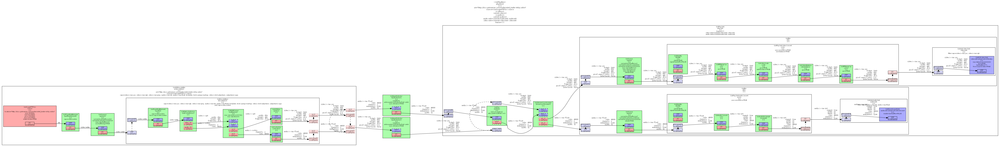

# Gstreamer 用户使用指南

## Revision History

| Revision | Date      | Author | Description   |
| ----------------- | ------------------ | --------------- | ---------------------- |
| 1.0      | 2025-1-10 | lizhirong  | Initial draft |

## GStreamer 介绍

GStreamer 是一个开源的多媒体框架。该框架基于插件进行设计，所有的插件都能够被链接到任意的已经定义了的数据流管道中。

官方网址：[https://gstreamer.freedesktop.org](https://gstreamer.freedesktop.org/)

### GStreamer 框架

gstreamer 可以通过创建一系列的元件(element)，并把它们连接起来，从而让数据流在这个被连接的各个元件(element)之间传输，从而创建一个管道(pipeline)来完成一个特殊的任务，例如：媒体播放或者录音。

gstreamer 框架如下图所示：


### Gstreamer 源码分布结构

Gstreamer 将其各个模块根据功能分为了多个 repo 分别存放。其框架和基本库分别被方在 gstreamer 和 gst-plugins-base 这两个 repo 中，其他的 repo 存放各种插件，并只依赖于这两个 repo，互相之间没有依赖。其中 gst-plugins-good 主要包含比较成熟的插件，gst-plugins-bad 则主要包含正在开发的插件，gst-plugins-ugly 不是指 code 质量差，而是主要放置了一些有 license 问题的插件，用户可以根据地域和法规，进行选择性的规避或安装。
| 仓库               | 功能                                    |
|------------------|---------------------------------------|
| gstreamer        | 框架和基本库                                |
| gst-plugins-base | 框架和基本库                                |
| gst-plugins-good | 比较成熟的插件                               |
| gst-plugins-bad  | 包含正在开发的插件，可能存在问题                      |
| gst-plugins-ugly | 有license问题的插件，用户可以根据地域和法规，进行选择性的规避或安装 |
| gst-libav        | libav 编解码库的插件                         |

### Gstreamer 安装

安装 Gstreamer-1.0 需运行命令：

```
sudo apt-get update

sudo apt-get install gstreamer1.0-tools gstreamer1.0-alsa gstreamer1.0-plugins-base gstreamer1.0-plugins-good  gstreamer1.0-plugins-bad gstreamer1.0-plugins-ugly gstreamer1.0-libav

sudo apt-get install libgstreamer1.0-dev libgstreamer-plugins-base1.0-dev libgstreamer-plugins-good1.0-dev libgstreamer-plugins-bad1.0-dev  
```

检查 Gstramer-1.0 的版本，需执行命令：

```
gst-inspect-1.0 --version  
```

### Gstreamer 插件说明

使用以下命令可以用于查询当前 Bianbu/Buildroot 系统 Gstreamer 默认支持的插件情况

```
gst-inspect-1.0
```

在gst-inspect-1.0命令后加上插件名称，可以输出对应插件的详细信息。

#### Video Decoder Plugins

视频解码器的作用是将视频源格式转换为可以被目标接收器（例如显示器）解释的原始格式。**Spacemit GStreamer 支持 spacemitdec 专有插件，该插件可以帮助用户获得更优质的结果。**

| Video Decoder | Package            | Description                                             | Bianbu OS(Y/N) | Buildroot(Y/N) |
|---------------|--------------------|---------------------------------------------------------|----------------|-------------------|
| decodebin     | gst-plugins-base   | Autoplug and decode to raw media                        | Y              | Y                 |
| spacemitdec   | gst-plugins-bad    | Decodes H264/H265/MJPEG/VP8/VP9/MPEG2/MPEG4 via MPP API | Y              | Y                 |
| avdec_xxxx    | gstreamer1.0-libav | ffmpeg plugin for GStreamer                             | Y              | Y                 |
| mpeg2dec      | gst-plugins-ugly   | mpeg1 and mpeg2 video decoder                           | Y              | N                 |
| openh264dec   | gst-plugins-bad    | OpenH264 video decoder                                  | Y              | N                 |
| jpegdec       | gst-plugins-good   | Decode images from JPEG format                          | Y              | N                 |
| vp8dec        | gst-plugins-good   | On2 VP8 Decoder                                         | Y              | N                 |
| vp9dec        | gst-plugins-good   | On2 VP9 Decoder                                         | Y              | N                 |
|               |                    |                                                         |                |                   |


#### Video Encoder Plugins

视频编码器的作用是将原始数据转换为编码的视频格式，例如 H.264 格式。**Spacemit GStreamer 支持 spacemit\*enc 专有插件，这些插件可以帮助用户获得更优质的结果。**
| Video Encoder    | Package            | Description                         | Bianbu OS(Y/N) | Buildroot(Y/N) |
|------------------|--------------------|-------------------------------------|----------------|-------------------|
| encodebin        | gst-plugins-base   | Convenience encoding/muxing element | Y              | N                 |
| spacemith264enc  | gst-plugins-bad    | Encodes H264 via MPP API            | Y              | Y                 |
| spacemith265enc  | gst-plugins-bad    | Encodes H265 via MPP API            | Y              | Y                 |
| spacemitmjpegenc | gst-plugins-bad    | Encodes MJPEG via MPP API           | Y              | Y                 |
| spacemitmpegenc  | gst-plugins-bad    | Encodes MPEG2/MPEG4 via MPP API     | Y              | Y                 |
| spacemitvp8enc   | gst-plugins-bad    | Encodes vp8 via MPP API             | Y              | Y                 |
| spacemitvp9enc   | gst-plugins-bad    | Encodes vp9 via MPP API             | Y              | Y                 |
| avenc_xxxx       | gstreamer1.0-libav | ffmpeg plugin for GStreamer         | Y              | Y                 |
| mpeg2enc         | gst-plugins-ugly   | mpeg2enc video encoder              | Y              | N                 |
| openh264enc      | gst-plugins-bad    | OpenH264 video encoder              | Y              | N                 |
| jpegenc          | gst-plugins-good   | JPEG image encoder                  | Y              | N                 |
| vp8enc           | gst-plugins-good   | On2 VP8 Encoder                     | Y              | N                 |
| vp9enc           | gst-plugins-good   | On2 VP9 Encoder                     | Y              | N                 |
|                  |                    |                                     |                |                   |


#### Video Sink Plugins

视频接收插件的作用是将处理后的数据通过显示输出进行展示。**Spacemit GStreamer 优化了 glimagesink/gtkglsink/waylandsink 插件，这些插件可以帮助用户获得更优质的结果。**
| Video Encoder  | Package          | Description                                             | Bianbu OS(Y/N) | Buildroot(Y/N) |
|----------------|------------------|---------------------------------------------------------|----------------|-------------------|
| autovideosink  | gst-plugins-good | Wrapper video sink for automatically detected videosink | Y              | Y                 |
| glimagesink    | gst-plugins-base | Infrastructure to process GL textures                   | Y              | N                 |
| waylandsink    | gst-plugins-bad  | Output to wayland surface                               | Y              | Y                 |
| gtkglsink      | gst-plugins-good | A video sink that renders to a GtkWidget using OpenGL   | Y              | N                 |
| fpsdisplaysink | gst-plugins-bad  | Video sink with current and average framerate           | Y              | N                 |


#### Demux Plugins

解复用器插件的作用是将不同的视频/音频格式转换为原始的。
| Video Demux   | Package          | Description                        | Bianbu OS(Y/N) | Buildroot(Y/N) |
|---------------|------------------|------------------------------------|----------------|-------------------|
| qtdemux       | gst-plugins-good | Demux a .mov/.mp4 file to raw data | Y              | Y                 |
| matroskedemux | gst-plugins-good | Demux a .mkv file to raw data      | Y              | N                 |
| flvdemux      | gst-plugins-good | Demux a .flv file to raw data      | Y              | N                 |
| avidemux      | gst-plugins-good | Demux a .avi file to raw data      | Y              | Y                 |


#### Mux Plugins

复用器插件负责将原始未解析的数据转换为特定的视频/音频数据。
| Video Mux   | Package          | Description                   | Bianbu OS(Y/N) | Buildroot(Y/N) |
|-------------|------------------|-------------------------------|----------------|-------------------|
| qtmux       | gst-plugins-good | Mux a raw data to a .mov file | Y              | Y                 |
| matroskemux | gst-plugins-good | Mux a raw data to a .mkv file | Y              | N                 |
| flvmux      | gst-plugins-good | Mux a raw data to a .flv file | Y              | N                 |
| avimux      | gst-plugins-good | Mux a raw data to a .avi file | Y              | Y                 |
| mp4mux      | gst-plugins-good | Mux a raw data to a .mp4 file | Y              | Y                 |
|             |                  |                               |                |                   |


#### Audio Plugins

音频插件的作用是处理来自音频原始格式或特定音频数据格式（如 WAV）的数据。
| Audio Plugin   | Package          | Description                                     | Bianbu OS(Y/N) | Buildroot(Y/N) |
|----------------|------------------|-------------------------------------------------|----------------|-------------------|
| mpg123audiodec | gst-plugins-good | MP3 decoding plugin based on the mpg123 library | Y              | N                 |
| vorbisdec      | gst-plugins-base | Decodes raw vorbis streams to float audio       | Y              | N                 |
| vorbisenc      | gst-plugins-base | Encodes audio in Vorbis format                  | Y              | N                 |
| alsasink       | gst-plugins-base | Output to a sound card via ALSA                 | Y              | N                 |
| pulsesink      | gst-plugins-good | Plays audio to a PulseAudio server              | Y              | N                 |


#### Image Plugins

图像插件的作用是处理来自图像原始格式或特定数据格式（如 JPEG）的数据。
| Image Plugin     | Package          | Description                                             | Bianbu OS(Y/N) | Buildroot(Y/N) |
|------------------|------------------|---------------------------------------------------------|----------------|-------------------|
| spacemitdec      | gst-plugins-bad  | Decodes H264/H265/MJPEG/VP8/VP9/MPEG2/MPEG4 via MPP API | Y              | Y                 |
| spacemitmjpegenc | gst-plugins-bad  | Encodes MJPEG via MPP API                               | Y              | Y                 |
| imagefreeze      | gst-plugins-good | Generates a still frame stream from an image            | Y              | N                 |
| jpegdec          | gst-plugins-good | Decode images from JPEG format                          | Y              | N                 |
| jpegenc          | gst-plugins-good | JPEG image encoder                                      | Y              | N                 |
| pngdec           | gst-plugins-good | Decode a png video frame to a raw image                 | Y              | N                 |
| pngenc           | gst-plugins-good |  Encode a video frame to a .png image                   | Y              | N                 |
|                  |                  |                                                         |                |                   |


#### Network Protocol Plugins

网络协议插件的作用是负责在设备之间建立网络连接。
| Network Plugins | Package          | Description                                                      | Bianbu OS(Y/N) | Buildroot(Y/N) |
|-----------------|------------------|------------------------------------------------------------------|----------------|-------------------|
| udpsink         | gst-plugins-good | Send data over the network via UDP                               | Y              | Y                 |
| multiudpsink    | gst-plugins-good | Send data over the network via UDP to one or multiple recipients | Y              | Y                 |
| udpsrc          | gst-plugins-good | Receive data over the network via UDP                            | Y              | Y                 |
| tcpserversink   | gst-plugins-base | Send data as a server over the network via TCP                   | Y              | N                 |
| tcpclientsrc    | gst-plugins-base | Receive data as a client over the network via TCP                | Y              | N                 |
| rtspsrc         | gst-plugins-good | Receive data over the network via RTSP                           | Y              | N                 |


#### Payload/Depayload Plugins

有效载荷插件负责在网络上传输数据，而去有效载荷插件则与这些插件结合使用，以接收和解包数据。
| Network Plugins | Package          | Description                                                           | Bianbu OS(Y/N) | Buildroot(Y/N) |
|-----------------|------------------|-----------------------------------------------------------------------|----------------|-------------------|
| gdppay          | gst-plugins-bad  | Payloads GStreamer Data Protocol buffers                              | Y              | N                 |
| gdpdepay        | gst-plugins-bad  | Depayloads GStreamer Data Protocol buffers                            | Y              | N                 |
| rtpvrawpay      | gst-plugins-good | Payload raw video as RTP packets                                      | Y              | Y                 |
| rtpvrawdepay    | gst-plugins-good | Extracts raw video as RTP packets                                     | Y              | Y                 |
| rtph264pay      | gst-plugins-good | Payload-encode H264 video into RTP packets                            | Y              | Y                 |
| rtph264depay    | gst-plugins-good | Extracts H264 video from RTP packets                                  | Y              | Y                 |
| rtpmpapay       | gst-plugins-good | Payload MPEG audio as RTP packets                                     | Y              | Y                 |
| rtpmpadepay     | gst-plugins-good | Extracts MPEG audio from RTP packets                                  | Y              | Y                 |
| rtpjitterbuffer | gst-plugins-good | A buffer that deals with network jitter and other transmission faults | Y              | Y                 |


## Gstreamer 基本命令

### gst-launch-1.0

gst-launch-1.0：用于启动一个流水线来完成一个特殊的任务，例如：媒体播放或者录音等。下面是一些常用的使用示例（以 spacemit 已适配的 gstreamer 插件为主）：

#### 摄像头应用场景

##### UVC 摄像头

- UVC 摄像头的信息可以通过以下命令进行获取：

```
$ gst-device-monitor-1.0
Device found:

        name  : UvcH264 HD Pro Webcam C920
        class : Video/CameraSource
        caps  : video/x-raw, format=YUY2, width=2304, height=1536, pixel-aspect-ratio=1/1, framerate=2/1
                video/x-raw, format=YUY2, width=2304, height=1296, pixel-aspect-ratio=1/1, framerate=2/1
                video/x-raw, format=YUY2, width=1920, height=1080, pixel-aspect-ratio=1/1, framerate=5/1
                video/x-raw, format=YUY2, width=1600, height=896, pixel-aspect-ratio=1/1, framerate={ (fraction)15/2, (fraction)5/1 }
                video/x-raw, format=YUY2, width=1280, height=720, pixel-aspect-ratio=1/1, framerate={ (fraction)10/1, (fraction)15/2, (fraction)5/1 }
                video/x-raw, format=YUY2, width=960, height=720, pixel-aspect-ratio=1/1, framerate={ (fraction)15/1, (fraction)10/1, (fraction)15/2, (fraction)5/1 }
                video/x-raw, format=YUY2, width=1024, height=576, pixel-aspect-ratio=1/1, framerate={ (fraction)15/1, (fraction)10/1, (fraction)15/2, (fraction)5/1 }
                video/x-raw, format=YUY2, width=800, height=600, pixel-aspect-ratio=1/1, framerate={ (fraction)24/1, (fraction)20/1, (fraction)15/1, (fraction)10/1, (fraction)15/2, (fraction)5/1 }
                video/x-raw, format=YUY2, width=864, height=480, pixel-aspect-ratio=1/1, framerate={ (fraction)24/1, (fraction)20/1, (fraction)15/1, (fraction)10/1, (fraction)15/2, (fraction)5/1 }
                video/x-raw, format=YUY2, width=800, height=448, pixel-aspect-ratio=1/1, framerate={ (fraction)30/1, (fraction)24/1, (fraction)20/1, (fraction)15/1, (fraction)10/1, (fraction)15/2, (fraction)5/1 }
                video/x-raw, format=YUY2, width=640, height=480, pixel-aspect-ratio=1/1, framerate={ (fraction)30/1, (fraction)24/1, (fraction)20/1, (fraction)15/1, (fraction)10/1, (fraction)15/2, (fraction)5/1 }
                video/x-raw, format=YUY2, width=640, height=360, pixel-aspect-ratio=1/1, framerate={ (fraction)30/1, (fraction)24/1, (fraction)20/1, (fraction)15/1, (fraction)10/1, (fraction)15/2, (fraction)5/1 }
                video/x-raw, format=YUY2, width=432, height=240, pixel-aspect-ratio=1/1, framerate={ (fraction)30/1, (fraction)24/1, (fraction)20/1, (fraction)15/1, (fraction)10/1, (fraction)15/2, (fraction)5/1 }
                video/x-raw, format=YUY2, width=352, height=288, pixel-aspect-ratio=1/1, framerate={ (fraction)30/1, (fraction)24/1, (fraction)20/1, (fraction)15/1, (fraction)10/1, (fraction)15/2, (fraction)5/1 }
                video/x-raw, format=YUY2, width=320, height=240, pixel-aspect-ratio=1/1, framerate={ (fraction)30/1, (fraction)24/1, (fraction)20/1, (fraction)15/1, (fraction)10/1, (fraction)15/2, (fraction)5/1 }
                video/x-raw, format=YUY2, width=320, height=180, pixel-aspect-ratio=1/1, framerate={ (fraction)30/1, (fraction)24/1, (fraction)20/1, (fraction)15/1, (fraction)10/1, (fraction)15/2, (fraction)5/1 }
                video/x-raw, format=YUY2, width=176, height=144, pixel-aspect-ratio=1/1, framerate={ (fraction)30/1, (fraction)24/1, (fraction)20/1, (fraction)15/1, (fraction)10/1, (fraction)15/2, (fraction)5/1 }
                video/x-raw, format=YUY2, width=160, height=120, pixel-aspect-ratio=1/1, framerate={ (fraction)30/1, (fraction)24/1, (fraction)20/1, (fraction)15/1, (fraction)10/1, (fraction)15/2, (fraction)5/1 }
                video/x-raw, format=YUY2, width=160, height=90, pixel-aspect-ratio=1/1, framerate={ (fraction)30/1, (fraction)24/1, (fraction)20/1, (fraction)15/1, (fraction)10/1, (fraction)15/2, (fraction)5/1 }
                image/jpeg, parsed=true, width=1920, height=1080, pixel-aspect-ratio=1/1, framerate={ (fraction)30/1, (fraction)24/1, (fraction)20/1, (fraction)15/1, (fraction)10/1, (fraction)15/2, (fraction)5/1 }
                image/jpeg, parsed=true, width=1600, height=896, pixel-aspect-ratio=1/1, framerate={ (fraction)30/1, (fraction)24/1, (fraction)20/1, (fraction)15/1, (fraction)10/1, (fraction)15/2, (fraction)5/1 }
                image/jpeg, parsed=true, width=1280, height=720, pixel-aspect-ratio=1/1, framerate={ (fraction)30/1, (fraction)24/1, (fraction)20/1, (fraction)15/1, (fraction)10/1, (fraction)15/2, (fraction)5/1 }
                image/jpeg, parsed=true, width=960, height=720, pixel-aspect-ratio=1/1, framerate={ (fraction)30/1, (fraction)24/1, (fraction)20/1, (fraction)15/1, (fraction)10/1, (fraction)15/2, (fraction)5/1 }
                image/jpeg, parsed=true, width=1024, height=576, pixel-aspect-ratio=1/1, framerate={ (fraction)30/1, (fraction)24/1, (fraction)20/1, (fraction)15/1, (fraction)10/1, (fraction)15/2, (fraction)5/1 }
                image/jpeg, parsed=true, width=800, height=600, pixel-aspect-ratio=1/1, framerate={ (fraction)30/1, (fraction)24/1, (fraction)20/1, (fraction)15/1, (fraction)10/1, (fraction)15/2, (fraction)5/1 }
                image/jpeg, parsed=true, width=864, height=480, pixel-aspect-ratio=1/1, framerate={ (fraction)30/1, (fraction)24/1, (fraction)20/1, (fraction)15/1, (fraction)10/1, (fraction)15/2, (fraction)5/1 }
                image/jpeg, parsed=true, width=800, height=448, pixel-aspect-ratio=1/1, framerate={ (fraction)30/1, (fraction)24/1, (fraction)20/1, (fraction)15/1, (fraction)10/1, (fraction)15/2, (fraction)5/1 }
                image/jpeg, parsed=true, width=640, height=480, pixel-aspect-ratio=1/1, framerate={ (fraction)30/1, (fraction)24/1, (fraction)20/1, (fraction)15/1, (fraction)10/1, (fraction)15/2, (fraction)5/1 }
                image/jpeg, parsed=true, width=640, height=360, pixel-aspect-ratio=1/1, framerate={ (fraction)30/1, (fraction)24/1, (fraction)20/1, (fraction)15/1, (fraction)10/1, (fraction)15/2, (fraction)5/1 }
                image/jpeg, parsed=true, width=432, height=240, pixel-aspect-ratio=1/1, framerate={ (fraction)30/1, (fraction)24/1, (fraction)20/1, (fraction)15/1, (fraction)10/1, (fraction)15/2, (fraction)5/1 }
                image/jpeg, parsed=true, width=352, height=288, pixel-aspect-ratio=1/1, framerate={ (fraction)30/1, (fraction)24/1, (fraction)20/1, (fraction)15/1, (fraction)10/1, (fraction)15/2, (fraction)5/1 }
                image/jpeg, parsed=true, width=320, height=240, pixel-aspect-ratio=1/1, framerate={ (fraction)30/1, (fraction)24/1, (fraction)20/1, (fraction)15/1, (fraction)10/1, (fraction)15/2, (fraction)5/1 }
                image/jpeg, parsed=true, width=320, height=180, pixel-aspect-ratio=1/1, framerate={ (fraction)30/1, (fraction)24/1, (fraction)20/1, (fraction)15/1, (fraction)10/1, (fraction)15/2, (fraction)5/1 }
                image/jpeg, parsed=true, width=176, height=144, pixel-aspect-ratio=1/1, framerate={ (fraction)30/1, (fraction)24/1, (fraction)20/1, (fraction)15/1, (fraction)10/1, (fraction)15/2, (fraction)5/1 }
                image/jpeg, parsed=true, width=160, height=120, pixel-aspect-ratio=1/1, framerate={ (fraction)30/1, (fraction)24/1, (fraction)20/1, (fraction)15/1, (fraction)10/1, (fraction)15/2, (fraction)5/1 }
                image/jpeg, parsed=true, width=160, height=90, pixel-aspect-ratio=1/1, framerate={ (fraction)30/1, (fraction)24/1, (fraction)20/1, (fraction)15/1, (fraction)10/1, (fraction)15/2, (fraction)5/1 }
                video/x-h264, stream-format=byte-stream, alignment=au, width=1920, height=1080, pixel-aspect-ratio=1/1, framerate={ (fraction)30/1, (fraction)24/1, (fraction)20/1, (fraction)15/1, (fraction)10/1, (fraction)15/2, (fraction)5/1 }
                video/x-h264, stream-format=byte-stream, alignment=au, width=1600, height=896, pixel-aspect-ratio=1/1, framerate={ (fraction)30/1, (fraction)24/1, (fraction)20/1, (fraction)15/1, (fraction)10/1, (fraction)15/2, (fraction)5/1 }
                video/x-h264, stream-format=byte-stream, alignment=au, width=1280, height=720, pixel-aspect-ratio=1/1, framerate={ (fraction)30/1, (fraction)24/1, (fraction)20/1, (fraction)15/1, (fraction)10/1, (fraction)15/2, (fraction)5/1 }
                video/x-h264, stream-format=byte-stream, alignment=au, width=960, height=720, pixel-aspect-ratio=1/1, framerate={ (fraction)30/1, (fraction)24/1, (fraction)20/1, (fraction)15/1, (fraction)10/1, (fraction)15/2, (fraction)5/1 }
                video/x-h264, stream-format=byte-stream, alignment=au, width=1024, height=576, pixel-aspect-ratio=1/1, framerate={ (fraction)30/1, (fraction)24/1, (fraction)20/1, (fraction)15/1, (fraction)10/1, (fraction)15/2, (fraction)5/1 }
                video/x-h264, stream-format=byte-stream, alignment=au, width=800, height=600, pixel-aspect-ratio=1/1, framerate={ (fraction)30/1, (fraction)24/1, (fraction)20/1, (fraction)15/1, (fraction)10/1, (fraction)15/2, (fraction)5/1 }
                video/x-h264, stream-format=byte-stream, alignment=au, width=864, height=480, pixel-aspect-ratio=1/1, framerate={ (fraction)30/1, (fraction)24/1, (fraction)20/1, (fraction)15/1, (fraction)10/1, (fraction)15/2, (fraction)5/1 }
                video/x-h264, stream-format=byte-stream, alignment=au, width=800, height=448, pixel-aspect-ratio=1/1, framerate={ (fraction)30/1, (fraction)24/1, (fraction)20/1, (fraction)15/1, (fraction)10/1, (fraction)15/2, (fraction)5/1 }
                video/x-h264, stream-format=byte-stream, alignment=au, width=640, height=480, pixel-aspect-ratio=1/1, framerate={ (fraction)30/1, (fraction)24/1, (fraction)20/1, (fraction)15/1, (fraction)10/1, (fraction)15/2, (fraction)5/1 }
                video/x-h264, stream-format=byte-stream, alignment=au, width=640, height=360, pixel-aspect-ratio=1/1, framerate={ (fraction)30/1, (fraction)24/1, (fraction)20/1, (fraction)15/1, (fraction)10/1, (fraction)15/2, (fraction)5/1 }
                video/x-h264, stream-format=byte-stream, alignment=au, width=432, height=240, pixel-aspect-ratio=1/1, framerate={ (fraction)30/1, (fraction)24/1, (fraction)20/1, (fraction)15/1, (fraction)10/1, (fraction)15/2, (fraction)5/1 }
                video/x-h264, stream-format=byte-stream, alignment=au, width=352, height=288, pixel-aspect-ratio=1/1, framerate={ (fraction)30/1, (fraction)24/1, (fraction)20/1, (fraction)15/1, (fraction)10/1, (fraction)15/2, (fraction)5/1 }
                video/x-h264, stream-format=byte-stream, alignment=au, width=320, height=240, pixel-aspect-ratio=1/1, framerate={ (fraction)30/1, (fraction)24/1, (fraction)20/1, (fraction)15/1, (fraction)10/1, (fraction)15/2, (fraction)5/1 }
                video/x-h264, stream-format=byte-stream, alignment=au, width=320, height=180, pixel-aspect-ratio=1/1, framerate={ (fraction)30/1, (fraction)24/1, (fraction)20/1, (fraction)15/1, (fraction)10/1, (fraction)15/2, (fraction)5/1 }
                video/x-h264, stream-format=byte-stream, alignment=au, width=176, height=144, pixel-aspect-ratio=1/1, framerate={ (fraction)30/1, (fraction)24/1, (fraction)20/1, (fraction)15/1, (fraction)10/1, (fraction)15/2, (fraction)5/1 }
                video/x-h264, stream-format=byte-stream, alignment=au, width=160, height=120, pixel-aspect-ratio=1/1, framerate={ (fraction)30/1, (fraction)24/1, (fraction)20/1, (fraction)15/1, (fraction)10/1, (fraction)15/2, (fraction)5/1 }
                video/x-h264, stream-format=byte-stream, alignment=au, width=160, height=90, pixel-aspect-ratio=1/1, framerate={ (fraction)30/1, (fraction)24/1, (fraction)20/1, (fraction)15/1, (fraction)10/1, (fraction)15/2, (fraction)5/1 }
        properties:
                device.path = /dev/video20
                udev-probed = false
                device.api = uvch264
                v4l2.device.driver = uvcvideo
                v4l2.device.card = HD Pro Webcam C920
                v4l2.device.bus_info = usb-xhci-hcd.0.auto-1.3
                v4l2.device.version = 394815 (0x0006063f)
                v4l2.device.capabilities = 2225078273 (0x84a00001)
                v4l2.device.device_caps = 69206017 (0x04200001)
                device.is-camerasrc = true
        gst-launch-1.0 uvch264src device=/dev/video20.vfsrc name=camerasrc ! ... camerasrc.vidsrc ! [video/x-h264] ...
```

可以看到，执行命令后输出各种重要信息，如相机分辨率、帧率和支持的格式，以及 UVC 摄像头对应 video capture 节点。

当然，也可以通过 v4l2-ctl 命令获取相关信息，此处不再赘述。

```
$ v4l2-ctl --list-devices
HD Pro Webcam C920 (usb-xhci-hcd.0.auto-1.3):
        /dev/video20
        /dev/video21
        /dev/media1
```

- UVC 摄像头以 capture video 为 video20，采集 600 帧 480p@30fps YUY2 的格式图像为例。（分辨率，帧率可以根据需求调整，只需摄像头自身支持该规格输出即可）

  - 采集图像后送显。

  ```
  gst-launch-1.0 v4l2src device=/dev/video20 num-buffers=600  ! "video/x-raw,framerate=30/1,format=YUY2,width=640,height=480" ! videoconvert ! glsinkbin sink=gtkglsink
  ```

  - 采集图像后送显，并显示帧率。

  ```
  gst-launch-1.0 v4l2src device=/dev/video20 num-buffers=600  ! "video/x-raw,framerate=30/1,format=YUY2,width=640,height=480" ! videoconvert ! fpsdisplaysink  video-sink='glsinkbin sink='gtkglsink''
  ```

  - 采集图像后直接丢弃。

  ```
  gst-launch-1.0 v4l2src device=/dev/video20 num-buffers=600  ! "video/x-raw,framerate=30/1,format=YUY2,width=640,height=480" ! fakesink
  ```

  - 采集图像后保存成文件。

  ```
  gst-launch-1.0 v4l2src device=/dev/video20 num-buffers=600  ! "video/x-raw,framerate=30/1,format=YUY2,width=640,height=480" ! filesink location=output.yuv
  ```

  -
- UVC 摄像头以 capture video 为 video20，采集 600 帧 480p JPEG 的格式图像并解码。（分辨率，帧率可以根据需求调整，只需摄像头自身支持该规格输出即可）

  - 图像解码后送显。

  ```
  gst-launch-1.0 v4l2src device=/dev/video20 num-buffers=600  ! "image/jpeg,framerate=30/1,width=640,height=480" ! typefind ! spacemitdec ! waylandsink sync=0 render-rectangle="<0,0,1280,720>"
  ```

  - 图像解码后编码保存。

  ```
  gst-launch-1.0 v4l2src device=/dev/video20 num-buffers=600  ! "image/jpeg,framerate=30/1,width=640,height=480" ! typefind ! spacemitdec !  spacemith264enc ! filesink location=test.h264
  ```

  -

##### MIPI 摄像头

- MIPI 摄像头以 OV16A10 输出 1080P@NV12 为例（假设 spacemitsrc 对应所需的 json 配置文件已设好, json 含义请参考《Camera Development Guide》文档说明）
  - 采集图像后送显，显示分辨率为 720p。（显示位置暂时没法设定）

  ```
  gst-launch-1.0  spacemitsrc location=/usr/share/camera_json/csi1_camera_auto.json close-dmabuf=0 ! "video/x-raw(memory:DMABuf),format=NV12,width=1920,height=1080" ! waylandsink sync=0 render-rectangle="<0,0,1280,720>"
  ```

  - 采集图像后直接丢弃。

  ```
  gst-launch-1.0  spacemitsrc location=/usr/share/camera_json/csi1_camera_auto.json close-dmabuf=0 ! "video/x-raw(memory:DMABuf),format=NV12,width=1920,height=1080" ! fakesink
  ```

  - 采集 10 帧图像保存成文件。

  ```
  gst-launch-1.0  spacemitsrc location=/usr/share/camera_json/csi1_camera_auto.json close-dmabuf=0 num-buffers=10 ! "video/x-raw(memory:DMABuf),format=NV12,width=1920,height=1080" ! filesink location=test.yuv
  ```

  - 采集 1000 帧图像并编码为 h264 保存。

  ```
  gst-launch-1.0  spacemitsrc location=/usr/share/camera_json/csi1_camera_auto.json close-dmabuf=0 num-buffers=1000 ! "video/x-raw(memory:DMABuf),format=NV12,width=1920,height=1080" ! spacemith264enc ! filesink location=test.h264
  ```
另外，在 Bianbu 上，可以使用opencv采集mipi摄像头视频并显示，需要
1. 先安装需要的工具和库

  ```
  sudo apt install libopencv-dev python3 python3-opencv
  ```
2. 创建py脚本capture_video_opencv.py

  ```
import cv2

gst_str = 'spacemitsrc location=/home/bianbu/camtest_ov16a10.json close-dmabuf=1 ! video/x-raw,format=NV12,width=1280,height=720 ! appsink'

cap = cv2.VideoCapture(gst_str, cv2.CAP_GSTREAMER)  # 打开默认的摄像头

while True:
    ret, frame = cap.read()  # 读取视频帧
    frame = cv2.cvtColor(frame, cv2.COLOR_YUV2BGR_NV12)
    cv2.imshow('Video', frame)  # 显示视频帧

    if cv2.waitKey(1) & 0xFF == ord('q'):  # 按下 'q' 键退出循环
        break

cap.release()  # 释放摄像头
cv2.destroyAllWindows()  # 关闭所有窗口

  ```
3. 执行脚本
  ```
  python3 capture_video_opencv.py
  ```
上述demo，opencv使用Gstreamer进行的图像采集，输出720p@NV12格式，opencv拿到数据后再转换成RGB格式，并进行显示。

#### 解码应用场景

- 裸流视频解码

  - h264 解码后显示

  ```
  gst-launch-1.0  filesrc location=/root/compressed/h264/h264_w1280_h720_f30_r4_p1_8bit_300f_2112kb_high_cabac.264 ! h264parse ! spacemitdec ! queue ! waylandsink render-rectangle="<0,0,1280,720>"
  ```

  - h265 解码后显示

  ```
  gst-launch-1.0  filesrc location=/root/compressed/hevc/hevc_w1920_h1080_f25_r_p1_8bit_200f_1878kb_main.265 ! queue ! h265parse ! spacemitdec ! queue ! waylandsink render-rectangle="<0,0,1280,720>"
  ```

  - vp8、vp9 解码后显示

  ```
  gst-launch-1.0  filesrc location=/root/compressed/vp9/vp9_w1280_h720_f25_r_p1_8bit_120f_1996kb.ivf ! typefind ! ivfparse ! spacemitdec ! queue ! waylandsink render-rectangle="<0,0,1280,720>"
  ```

  - mjpeg 解码后显示

  ```
   gst-launch-1.0  filesrc location=/root/compressed/mjpeg/mjpeg_w1280_h720_f_r_p1_8bit_120f_kb_yuv420.mjpeg ! typefind ! spacemitdec ! queue ! waylandsink render-rectangle="<0,0,1280,720>"
  ```

  - mpeg2 解码后显示

  ```
  gst-launch-1.0  filesrc location=/root/compressed/mpeg2/mpeg2_w1920_h1080_f30_r_p1_8bit_120f_6236kb_main.mpg ! mpegpsdemux ! mpegvideoparse ! spacemitdec ! queue ! waylandsink render-rectangle="<0,0,1280,720>"
  ```

  - mpeg4 解码后显示

  ```
  gst-launch-1.0  filesrc location=/root/compressed/mpeg4/mpeg4_w1280_h720_f_r_p1_8bit_120f_3429kb_simple.mpeg4 ! mpeg4videoparse ! spacemitdec ! queue ! waylandsink sync=0 render-rectangle="<0,0,1280,720>"
  ```
- 封装格式视频解码

  - H.264/H.265/VP8/VP9/MJPEG/MPEG 解码后显示

```
gst-launch-1.0 filesrc location=C079_1080P_AVC_AAC_8M_24F.mp4 ! qtdemux name=d d.video_0 ! queue ! **h264parse** ! spacemitdec ! queue ! waylandsink  render-rectangle="<0,0,1280,720>"
```

spacemitdec 支持多种视频格式。为了正确使用它，请务必正确地调用解析器，例如：H.264 格式使用 h264parse，H.265 格式使用 h265parse 等。

#### 编码应用场景

测试编码的视频源为 NV12 720P@25fps

- 编码为 h264 格式文件

```
gst-launch-1.0 videotestsrc num-buffers=100 ! 'video/x-raw,format=NV12, width=1280, height=720, framerate=25/1' ! spacemith264enc ! filesink location=test.264
或者
 gst-launch-1.0 filesrc location=nv12_720p_100f.yuv ! videoparse format=23 width=1280 height=720 framerate=30/1 ! spacemith264enc ! filesink location=test.264 
```

- 编码为 h265 格式文件

```
gst-launch-1.0 videotestsrc num-buffers=100 ! 'video/x-raw,format=NV12, width=1280, height=720, framerate=25/1' ! spacemith265enc ! filesink location=test.265
```

- 编码为 vp9 格式，并以 webm 封装视频

```
gst-launch-1.0 -v videotestsrc num-buffers=1000 ! spacemitvp9enc ! webmmux ! filesink location=videotestsrc.webm
//对应的解码命令为
gst-launch-1.0 -v filesrc location=videotestsrc.webm ! matroskademux ! vp9dec ! videoconvert ! videoscale ! autovideosink
```

- 编码为 vp8 格式，并以 webm 封装视频

```
gst-launch-1.0 -v videotestsrc num-buffers=1000 ! spacemitvp8enc ! webmmux ! filesink location=videotestsrc.webm
//对应的解码命令为
gst-launch-1.0 -v filesrc location=videotestsrc.webm ! matroskademux ! vp8dec ! videoconvert ! videoscale ! autovideosink
```

- 编码为 mjpeg 格式文件

```
gst-launch-1.0 videotestsrc num-buffers=100 ! 'video/x-raw,format=NV12, width=1280, height=720, framerate=25/1' ! spacemitmjpegenc ! filesink location=test.mjpeg
```

#### Mux/Demux 应用场景

##### Mux plugins

- qtmux

该类型的复用器转换视频（音频）到（.mov）文件。下面的管道命令将记录摄像头的视频，并保存到 video.mov 文件。

```
gst-launch-1.0 v4l2src device=/dev/video20 num-buffers=600  ! "image/jpeg,framerate=30/1,width=640,height=480" ! qtmux ! filesink location=video.mov
```

- matroskamux

该类型的复用器转换视频（音频）到（.mkv）文件。下面的管道命令将 mp3 文件复用到 mkv 文件。

```
gst-launch-1.0 filesrc location=test.mp3 ! mpegaudioparse ! matroskamux ! filesink location=test.mkv
```

- mp4mux

该类型的复用器转换视频（音频）到（.mp4）文件。下面的管道命令从 video 节点获取数据，并编码为 264，最后复用到 mp4 文件中。

```
gst-launch-1.0 v4l2src num-buffers=50 ! queue ! x264enc ! mp4mux ! filesink location=video.mp4
```

- flvmux

该类型的复用器转换视频（音频）到（.flv）文件。下面的管道命令解码一个视频和音频文件到 flv 文件

```
gst-launch-1.0 filesrc location=/root/K001-MPEG-16bit-44.1kHz-CBR-192kbps-stereo.mp3 ! decodebin ! queue !  flvmux name=mux ! filesink location=test.flv  filesrc location=../mp4/480p.mp4 ! decodebin ! queue ! mux.
```

- avimux

该类型的复用器转换视频（音频）到（.avi）文件

```
 gst-launch-1.0 videotestsrc num-buffers=100 ! 'video/x-raw,format=I420,width=640,height=480,framerate=30/1' ! avimux ! filesink location=test.avi
```

##### Demux plugins

- qtdemux

```
gst-launch-1.0 filesrc location=test.mov ! qtdemux name=demux  demux.audio_0 ! queue ! decodebin ! audioconvert ! audioresample ! autoaudiosink   demux.video_0 ! queue ! decodebin ! videoconvert ! videoscale ! autovideosink
//如果视频源只有video，则使用以下命令进行demux
 gst-launch-1.0 filesrc location=video.mov ! qtdemux name=demux   demux.video_0 ! queue ! decodebin ! videoconvert ! videoscale ! autovideosink
```

- matroskademux

```
 gst-launch-1.0 -v filesrc location=/path/to/mkv ! matroskademux ! vorbisdec ! audioconvert ! audioresample ! autoaudiosink
```

- flvdemux

```
 gst-launch-1.0 -v filesrc location=/path/to/flv ! flvdemux ! audioconvert ! autoaudiosink
```

- avidemux

```
 gst-launch-1.0 filesrc location=test.avi ! avidemux name=demux  demux.audio_00 ! decodebin ! audioconvert ! audioresample ! autoaudiosink   demux.video_00 ! queue ! decodebin ! videoconvert ! videoscale ! autovideosink
```

#### Audio 应用场景

本节描述使用 GStreamer 进行音频输出的一些基本管道。

- 音频播放

音频播放是指根据音频文件的特定格式播放确定的音频文件的过程。下面管道使用 audiotestsrc 插件输出标准的音频到耳机插孔。

```
gst-launch-1.0 audiotestsrc wave=5 ! alsasink device=plughw:1  
```

- 音频解码

  - 播放 mp3 格式文件

  ```
  gst-launch-1.0 filesrc location=test.mp3 ! mpegaudioparse ! mpg123audiodec
    ! audioconvert ! audioresample ! autoaudiosink
  ```

  - 播放 ogg vorbis 格式文件

  ```
  gst-launch-1.0 -v filesrc location=test.ogg ! oggdemux ! vorbisdec ! audioconvert ! audioresample ! autoaudiosink
  ```

  -
- 音频格式转换

音频转换是将音频文件的当前格式更改为另一种所需格式的过程，例如将.wav 更改为.aac。

```
gst-launch-1.0 -v autoaudiosrc ! audioconvert ! vorbisenc ! oggmux ! filesink location=alsasrc.ogg
```

#### 图片应用场景

本节描述使用 GStreamer 进行图片输出的一些基本管道。

- 图片输出

图片输出包括在所需屏幕或任何其他类型的输出源上显示所需图片文件的过程。

- 显示 png 图片

```
 gst-launch-1.0 -v filesrc location=some.png ! decodebin ! videoconvert ! imagefreeze ! autovideosink
```

- 显示 jpeg 图片

```
gst-launch-1.0 -v filesrc location=<output_image>.jpeg ! jpegdec ! imagefreeze ! videoconvert ! autovideosink
```

- 图片拍摄

对于图片拍摄，可以从相机获取图像。

- To jpg

```
gst-launch-1.0 v4l2src num-buffers=1 ! jpegenc ! filesink location=capture.jpg  
```

- To png

```
gst-launch-1.0 v4l2src num-buffers=1 ! pngenc ! filesink location=capture.png  
```

- To jpeg

```
gst-launch-1.0 v4l2src num-buffers=1 ! jpegenc ! filesink location=capture.jpeg  
```

#### 转码应用场景

本节展示了如何执行通用的一些转码管道，以及如何在每个管道中正确运行这些管道.

- 视频转码

将摄像头输出的 MJPEG 数据转码为 mkv 文件

```
gst-launch-1.0 v4l2src device=/dev/video20 ! jpegparse ! spacemitdec ! queue ! videoconvert ! spacemith264enc ! h264parse ! matroskamux ! filesink location=out.mkv
```

#### 视频流传输场景

- Rtsp

1. 下载项目源码 [https://github.com/GStreamer/gst-rtsp-server，并切换到 1.18 分支](https://github.com/GStreamer/gst-rtsp-server%EF%BC%8C%E5%B9%B6%E5%88%87%E6%8D%A2%E5%88%B01.18%E5%88%86%E6%94%AF)
2. 编译安装
3. 开启 server 端 rtsp，执行命令：

```
./test-launch "( spacemitsrc location=/usr/share/camera_json/csi1_camera_auto.json close-dmabuf=0 ! spacemith264enc ! rtph264pay name=pay0 pt=96 )"
```

4. client 端链接 rtsp，播放视频。

#### 视频合成场景

- 多路数据合并输出

```
gst-launch-1.0 videotestsrc ! video/x-raw,width=1280,height=720 ! tee name=testsrc ! queue ! compositor name=comp sink_0::xpos=0 sink_0::ypos=0 \
sink_1::xpos=100 sink_1::ypos=100 sink_1::width=200 sink_1::height=200 \
sink_2::xpos=300 sink_2::ypos=300 sink_2::width=100 sink_2::height=200 \
sink_3::xpos=400 sink_3::ypos=600 sink_3::width=100 sink_3::height=100 ! videoconvert ! autovideosink testsrc. ! queue ! comp.sink_1 testsrc. ! queue ! comp.sink_2 testsrc. ! queue ! comp.sink_3
```

- 两路摄像头合并输出

```
gst-launch-1.0 -v compositor name=comp sink_0::xpos=0 sink_0::ypos=0 sink_0::width=640 sink_0::height=480 sink_1::xpos=0 sink_1::ypos=480 sink_1::width=640 sink_1::height=480 ! autovideosink v4l2src device=/dev/video20 ! video/x-raw,width=640,height=480 ! comp.sink_0  v4l2src device=/dev/video22 ! video/x-raw,width=640,height=480 ! comp.sink_1
```

## Gstreamer 调试方法

本节介绍一些调试工具的功能、如何使用它们以及何时使用它们。

### 使用 GStreamer 日志系统

在很多情况下，我们需要对 GStreamer 创建的 Pipeline 进行调试，来了解其运行机制以解决所遇到的问题。为此，GStreamer 提供了相应的调试机制，方便我们快速定位问题。

- GST\_DEBUG

GStreamer 框架以及其插件提供了不同级别的日志信息，日志中包含时间戳，进程 ID，线程 ID，类型，源码行数，函数名，Element 信息以及相应的日志消息。例如：

```
$ GST_DEBUG=2 gst-launch-1.0 playbin uri=file:///x.mp3Setting pipeline to PAUSED ...
0:00:00.014898047 47333      0x2159d80 WARN                 filesrc gstfilesrc.c:530:gst_file_src_start:<source> error: No such file "/x.mp3"
...
```

我们可以发现，只需要在运行时指定 GST\_DEBUG 环境变量，并设置日志级别，即可得到相应的日志。由于 GStreamer 提供了丰富的日志，如果我们打开所有的日志，必定会对程序的性能有所影响，所以我们需要对日志进行分级，GStreamer 提供了 8 种级别，用于输出不同类型的日志。

- 级别 0：不输出任何日志信息。
- 级别 1：ERROR 信息。
- 级别 2：WARNING 信息。
- 级别 3：FIXME 信息。
- 级别 4：INFO 信息。
- 级别 5：DEBUG 信息
- 级别 6：LOG 信息。
- 级别 7：TRACE 信息。
- 级别 8：MEMDUMP 信息，最高级别日志。

在使用时，我们只需将 GST\_DEBUG 设置为相应级别，所有小于其级别的信息都会被输出，例如：设置 GST\_DEBUG=2，我们会得到 ERROR 及 WARNING 级别的日志。

上面的例子中，所有模块使用同一日志级别，除此之外，我们还可以针对某个插件设定其独有的日志级别，例如：GST\_DEBUG=2,audiotestsrc:6 只会将 audiotestsrc 的日志级别设置为 6，其他的模块仍然使用级别 2。

这样，GST\_DEBUG 的值是以逗号分隔的”模块名:级别“的键值对，可以在最开始增加其他未指定模块的默认日志级别，多个模块名可以使用逗号隔开。同时，GST\_DEBUG 的值还支持”\*“通配符。

例如：GST\_DEBUG=2,audio\*:6 会将模块名以 audio 开始的模块的日志级别设置为 6，其他的默认为 2。

同样，GST\_DEBUG=\*:2 会匹配所有的模块，与 GST\_DEBUG=2 等同。

- GST\_DEBUG\_FILE

在实际中，我们通常将日志保存在文件中，便于后续分析。我们可以使用 GST\_DEBUG\_FILE 环境变量，指定日志文件名，GStreamer 会自动将日志写入文件中

```
$ GST_DEBUG=2 GST_DEBUG_FILE=pipeline.log GST_DEBUG=5 gst-launch-1.0 audiotestsrc ! autoaudiosink
```

### 使用 Graphviz 工具

在 Pipeline 变得很复杂时，我们需要知道 Pipeline 是否按预期运行、使用到哪些 Element，尤其是使用 playbin 或 uridecodebin 时。为此，GStreamer 提供了相应的功能，能够将 Pipeline 在当前状态下所有的 Elements 及其关系输出成 dot 文件，再通过 Graphviz 等工具可以将其转换成图片文件。

为了得到.dot 文件，我们只需通过 GST\_DEBUG\_DUMP\_DOT\_DIR 环境变量，指定输出目录即可，gst-launch-1.0 会在各状态分别生成一个.dot 文件。 例如：通过下列命令，我们可以得到使用 playbin 播放网络文件时生成的 Pipeline：

```
$ GST_DEBUG_DUMP_DOT_DIR=. gst-launch-1.0 playbin uri=https://www.freedesktop.org/software/gstreamer-sdk/data/media/sintel_trailer-480p.webm
$ ls *.dot
0.00.00.013715494-gst-launch.NULL_READY.dot    
0.00.00.170999259-gst-launch.PAUSED_PLAYING.dot  
0.00.07.642049256-gst-launch.PAUSED_READY.dot
0.00.00.162033239-gst-launch.READY_PAUSED.dot  
0.00.07.606477348-gst-launch.PLAYING_PAUSED.dot

$ apt-get install graphviz  
$ dot 0.00.00.170999259-gst-launch.PAUSED_PLAYING.dot -Tpng -o play.png
```

生成的 play.png 如下（结果会根据安装的插件不同而不同）：



需要注意的是，如果需要在自己的应用中加入此功能，那就需要在想要生成 dot 文件的时候显式地在相应事件发生时调用 GST\_DEBUG\_BIN\_TO\_DOT\_FILE() 或 GST\_DEBUG\_BIN\_TO\_DOT\_FILE\_WITH\_TS()，否则即使设置了 GST\_DEBUG\_DUMP\_DOT\_DIR 环境变量也无法生成 dot 文件。

### 其他调试方法

- Buildroot 串口执行命令，实现预览画面。可以在 gstramer 命令前加上：WAYLAND\_DISPLAY=wayland-1 XDG\_RUNTIME\_DIR=/root/ ，示例如下：

```
WAYLAND_DISPLAY=wayland-1 XDG_RUNTIME_DIR=/root/  gst-launch-1.0 spacemitsrc l
ocation=k1-x_MUSE-Paper_sensor0_gc08a8.json ! waylandsink sync=0 render-rectangl
e="<0,0,1280,720>"
```

- Bianbu os 串口执行命令，实现预览画面。需要先登录桌面，然后在 gstreamer 命令前加上：WAYLAND\_DISPLAY=wayland-0 XDG\_RUNTIME\_DIR=/run/user/1000 ，示例如下：

```
WAYLAND_DISPLAY=wayland-0 XDG_RUNTIME_DIR=/run/user/1000 gst-launch-1.0 filesrc location=/root/3840x2160_24bits_30fps_266p.h265 ! h265parse ! spacemitdec ! fpsdisplaysink video-sink='glsinkbin sink='gtkglsink sync=0''
```

- 裸流片源解码，如果使用 spacemit 插件解码失败，需要先排除片源自身的问题。可以尝试以下方法，更多见 [https://bianbu-linux.spacemit.com/media/mpp](https://bianbu-linux.spacemit.com/media/mpp)
  - 使用通用的 gstreamer 插件替换 spacemit 解码插件进行调试。
  - 使用 ffplay 解码片源观察是否有问题。
  - 使用 mpp 自带的 demo test 解码片源观察是否有问题。
