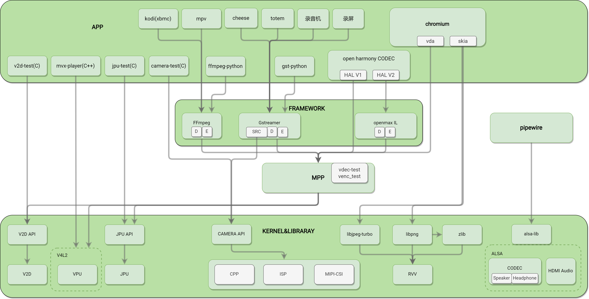

# 多媒体整体框架

## 框架层次图及说明

从框架结构上看分 4 层，从上到下依次为：

- **APP层**：包括第三方 APP 和自研 APP，第三方 APP 基本上是通过 GStreamer 和 FFmpeg 等开源框架来实现视频的编解码，例如 Bianbu 默认集成的 mpv 播放器，还有我们常用的 Video（totem）等，自研 APP 目前主要是我们提供的对接 API 的参考 demo 或者 test。
  - **mpv**：Bianbu 桌面系统默认本地播放器，对接了 K1 硬件解码器，支持 H.264/HEVC/VP8/VP9/MPEG-4/MPEG-2/MJPEG 等多种格式的硬件解码，最高支持到 4K60 视频的播放。
  - **totem**：Ubuntu 桌面系统默认本地播放器，对接了 K1 硬件解码器，支持 H.264/HEVC/VP8/VP9/MPEG-4/MPEG-2/MJPEG 等多种格式的硬件解码，目前最高支持到 4K30 视频的播放。
  - **cheese**：Bianbu/Ubuntu 桌面系统默认的 camera 应用，支持预览，拍照，录像等功能，目前已经对接了 K1 的硬件编解码器，实现 1080P30 流畅预览录像。
  - **chromium**：Bianbu 桌面系统默认浏览器，对接了 K1 的硬件解码器，支持 H.264/HEVC 等多种格式的硬件解码，最高支持到 4K30 视频的播放。
  - **kodi**：开发者和发烧友常用的开源播放器，对接了 K1 的硬件解码器，H.264/HEVC/VP8/VP9 等多种格式的硬件解码，最高支持 4K60 视频的播放。
  - **v2d-test**：V2D 模块的测试程序，也可以作为参考 demo，V2D 模块主要是进行非压缩图像的格式转换，旋转，缩放等操作。
  - **mvx-player**：VPU 模块的测试程序，也可以作为参考 demo，通过命令行进行视频的编解码操作，输出以文件的形式保存。
  - **jpu-test**：JPU 模块的测试程序，也可以作为参考 demo，通过命令行进行视频的编解码操作，输出以文件的形式保存，JPU 模块主要进行 JPEG 图像的编解码操作。
  - **camera-test**：CAMERA 通路的测试程序，也可以作为参考 demo，通过命令行进行图像的采集，该测试程序主要是针对 K1 的 CPP-ISP-MIPICSI 模块提供的 API，不包括 USB camera，USB camera 请使用 v4l-utils 等开源标准测试程序。
- **开源多媒体框架层（FRAMEWORK）**：常见的就是 GStreamer，FFmpeg，GStreamer 和 FFmpeg 是完整的多媒体解决方案，全面包含了 muxer/demuxer/decoder/encoder/display 的各种实现，是可以直接使用的开源框架。这一层，我们实现了多个插件通过 MPP 把硬件编解码库对接上。
  - **FFmpeg**：FFmpeg 对接了 K1 的硬件编解码器，支持 H.264/HEVC/VP8/VP9/MPEG-4/MPEG-2/MJPEG 等多种格式的硬件解码，最高支持到 4K60 视频的播放，同时支持 AV_PIX_FMT_DRM_PRIME 和 AV_PIX_FMT_NV12 的输出像素格式，支持 H.264/H.265/VP8/VP9/MJPEG 等多种格式的硬件编码，最高支持到 4K30 的编码。
  - **Gstreamer**：Gstreamer 对接了 K1 的硬件编解码器，支持 H.264/HEVC/VP8/VP9/MPEG-4/MPEG-2/MJPEG 等多种格式的硬件解码，最高支持到 4K30 视频的播放，支持 H.264/H.265/VP8/VP9/MJPEG 等多种格式的硬件编码，最高支持到 1080P60 的编码。
  - **Openmax IL**：编解码适配中
- **MPP**：对上提供统一多媒体 API，对下动态加载不同平台的编解码库插件来调用编解码库。
- **Driver & Library**：IP 厂商提供的驱动和 API 动态库。

## 概念术语

- **VPU**：（Video Processing Unit，视频处理单元）具有视频编解码功能的硬件，能够提高编解码效率并减少 CPU 负荷，K1 的 VPU 基于标准 V4L2 框架实现，支持 H.264/HEVC/VP8/VP9/MJPEG/MPEG4 等格式的解码和 H.264/HEVC/VP8/VP9/MJPEG 等格式的编码。
- **V2D**：K1 提供的图像处理硬件模块，支持图像格式转换，缩放，裁剪等功能。
- **JPU**：（Jpeg Processing Unit）进行 Jpeg 图像编解码的硬件，能够提高 Jpeg 的编解码效率并减少 CPU 负荷。
- **ISP**：图像处理模块，用于处理传感器输出的图像信号，经过一系列数字图像处理算法达到预期的图像效果。
- **CPP**：图像后处理模块，用于离线处理 ISP 输出的 NV12 数据，金字塔式多层分时处理，主要功能包括：镜头畸变矫正、空域和时域降噪、频域降噪、边沿增强等。
- **RVV**：基于 RISC-V 核心指令集架构的一种向量扩展。向量扩展的目的是在指令级别实现对数据的并行操作,以加速计算过程，类似 ARM 的 neon。
- **MPP**：（Multimedia Processing Platform）多媒体处理平台。
- **Gstreamer**：一个开源的多媒体框架，用于构建流媒体应用程序和处理音频/视频数据。它提供了一套库和工具，可以用来创建、处理和播放各种多媒体流，包括音频、视频、流媒体等。gstreamer 支持多种编解码器和格式，可以在不同平台上运行，是一个灵活且功能强大的多媒体处理框架。
- **FFmpeg**：开源的跨平台音视频处理工具，它可以用来录制、转换和流式传输音视频内容，以及进行音视频编辑和处理。它支持多种音视频格式和编解码器，可以在不同的操作系统上运行，包括 Windows、Mac 和 Linux。FFmpeg 是一个功能强大且灵活的工具，被广泛应用于多媒体处理领域。
- **V4L2**：Video for Linux 2 的缩写，是一个用于 Linux 系统的视频采集和输出设备的驱动程序接口。它提供了一种统一的方式来访问视频设备，包括摄像头、视频采集卡和其他视频输入/输出设备。V4L2 接口允许用户程序通过统一的 API 来控制和使用视频设备，从而实现视频的采集、处理和显示。这使得在 Linux 系统上开发视频应用程序变得更加简单和灵活。
- **ALSA**：Advanced Linux Sound Architecture（高级 Linux 音频架构）的缩写，是 Linux 系统上用于处理音频和音频设备的软件架构。它提供了一个统一的音频接口，使得应用程序可以与音频硬件进行通信，支持多种音频设备和音频格式，并提供了低延迟和高质量的音频处理功能。ALSA 还提供了一组工具和库，用于配置和管理音频设备，以及编写音频应用程序。ALSA 已经成为 Linux 系统上主流的音频架构，被广泛应用于各种 Linux 发行版中。
