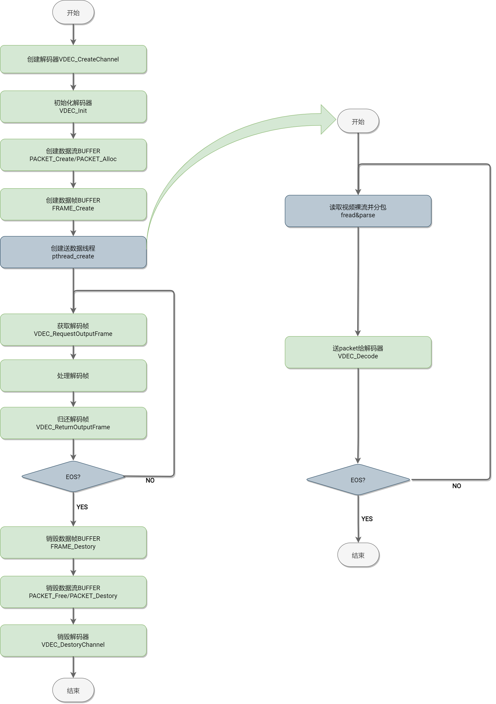
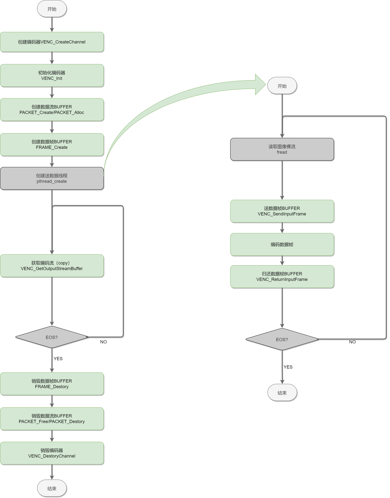

# MPP

MPP(Multimedia Processing Platform，多媒体处理平台)属于自研操作系统 Bianbu，其目的是封装多平台硬件编解码的使用差异，提供统一的 API 供开发者使用。

## 1. 模块介绍

### 1.1 概念术语

- **MPP(Multimedia Processing Platform)**：多媒体处理平台。
- **MPI(Multimedia Processing Interface)**：多媒体处理平台提供给上层的 API 调用。
- **MPP AL**: 抽象层，对不同 IP，不同 SOC，不同方案的多媒体接口进行抽象。
- **Packet**：数据包，主要表示经过压缩后的数据，即解码前或者编码后的数据，如 H.264/H.265 的视频流。
- **Frame**：数据帧，主要表示未经压缩的数据，即解码后或者编码前的数据，如 YUV420 的图像。

### 1.2 模块功能

目前 MPP 主要包含下面几个部分：

- **VDEC**: 视频解码子模块及开放 API，主要用于各种数据流 packet 的解码。
- **VENC**: 视频编码子模块及开放 API，主要用于 RGB/YUV 数据帧 frame 的编码。
- **G2D**: 2D 图形处理加速子模块及开放 API，主要进行数据帧 frame 的格式转换，缩放，旋转，裁剪等操作。
- **BIND 系统**：支持多模块动态绑定。
- **AL(Abstract Layer)**: 支持多平台。
- **VI**: 视频输入子模块及开放 API，目前仅支持文件输入及标准 V4L2 输入。
- **VO**: 视频输出子模块及开放 API，目前仅支持文件输出及 SDL2 视频输出。

未包含部分：

- **AI/AO**: 音频的输入输出，走标准的 pipewire->alsa-lib->alsa driver。
- **AENC/ADEC**: 纯软件实现，Gstreamer/FFmpeg 等开源框架都有全面支持，暂不支持。

### 1.3 配置说明

#### 1.3.1 调试配置

- **MPP_PRINT_BUFFER**：环境变量，默认 0，配置成 1 后能够实时打印 buffer 状态。
- **MPP_SAVE_OUTPUT_BUFFER**：环境变量，默认 0，配置成 1 后能够保存解码后的 YUV buffer，YUV buffer 较大，会导致播放卡顿并且保存文件会占用较大空间，请注意。
- **MPP_SAVE_OUTPUT_BUFFER_PATH**：环境变量，用于配置输出 YUV 的文件路径，默认/home/bianbu/output.yuv，MPP_SAVE_OUTPUT_BUFFER 开启后才生效。
- **MPP_FRINT_UNFREE_PACKET**：环境变量，默认 0，配置成 1 后能够实时打印 packet 的申请释放情况
- **MPP_FRINT_UNFREE_FRAME**：环境变量，默认 0，配置成 1 后能够实时打印 frame 的申请释放情况
- **MPP_FRINT_UNFREE_DMABUF**：环境变量，默认 0，配置成 1 后能够实时打印 dmabuf 的申请释放情况

使用示例：

```shell
#需要实时打印buffer状态
export MPP_PRINT_BUFFER=1

#需要保存解码后的YUV数据到/mnt/a.yuv
export MPP_SAVE_OUTPUT_BUFFER=1
export MPP_SAVE_OUTPUT_BUFFER_PATH=/mnt/a.yuv
```

#### 1.3.2 参数配置

暂未提供配置参数

### 1.4 源码

#### 1.4.1 源码位置

MPP 的源码位置位于：

```shell
buildroot-sdk/package-src/mpp
```

#### 1.4.2 源码编译

buildroot-sdk 方案中默认已经开启了编译，如果需要修改代码后需要重新编译，执行：

```shell
make mpp-rebuild
```

#### 1.4.3 源码结构

MPP 的源码结构及简要说明如下（源码结构做了精简）：

```shell
|-- al                               ；AL(Abstract Layer)层代码，对接各平台功能模块或者驱动
|   |-- CMakeLists.txt
|   |-- include
|   |   |-- al_interface_base.h      ；AL层接口基类
|   |   |-- al_interface_dec.h       ；AL层解码接口基类，继承于base
|   |   |-- al_interface_enc.h       ；AL层编码接口基类，继承于base
|   |   |-- al_interface_g2d.h       ；AL层图像转换接口基类，继承于base
|   |   |-- al_interface_vi.h        ；AL层视频输入接口基类，继承于base
|   |   `-- al_interface_vo.h        ；AL层视频输出接口基类，继承于base
|   |-- vcodec                       ；对接多平台的编解码模块或者驱动
|   |   |-- chipmedia                ；对接chipmedia IP的编解码器
|   |   |   |-- CMakeLists.txt
|   |   |   `-- starfive             ；对接starfive的编解码器API（暂未实现）
|   |   |       |-- sfdec_plugin.c
|   |   |       `-- sfenc_plugin.c
|   |   |-- CMakeLists.txt
|   |   |-- debug                    ；虚拟解码插件，输出简单纯色图，用于debug
|   |   |   |-- CMakeLists.txt
|   |   |   `-- fake_dec_plugin.c
|   |   |-- ffmpeg                   ；对接ffmpeg软件编解码，用于debug
|   |   |   |-- CMakeLists.txt
|   |   |   |-- ffmpegdec.c
|   |   |   |-- ffmpegenc.c
|   |   |   `-- ffmpegswscale.c
|   |   |-- k1
|   |   |   |-- CMakeLists.txt
|   |   |   `-- jpu                  ；对接K1的Jpu编解码（暂未实现）
|   |   |       |-- include
|   |   |       |-- jpudec.c
|   |   |       `-- jpuenc.c
|   |   |-- openh264                 ；对接openh264软件编解码库，用于debug
|   |   |   |-- CMakeLists.txt
|   |   |   |-- include
|   |   |   |   `-- wels
|   |   |   |       |-- codec_api.h
|   |   |   |       |-- codec_app_def.h
|   |   |   |       |-- codec_def.h
|   |   |   |       `-- codec_ver.h
|   |   |   |-- openh264dec.cpp
|   |   |   |-- openh264enc.cpp
|   |   |   `-- README.md
|   |   |-- openmax                  ；对接openmax
|   |   |   |-- CMakeLists.txt
|   |   |   |-- include
|   |   |   |   |-- khronos
|   |   |   |   |   |-- OMX_Audio.h
|   |   |   |   |   |-- OMX_ComponentExt.h
|   |   |   |   |   |-- OMX_Component.h
|   |   |   |   |   |-- OMX_ContentPipe.h
|   |   |   |   |   |-- OMX_CoreExt.h
|   |   |   |   |   |-- OMX_Core.h
|   |   |   |   |   |-- OMX_ImageExt.h
|   |   |   |   |   |-- OMX_Image.h
|   |   |   |   |   |-- OMX_IndexExt.h
|   |   |   |   |   |-- OMX_Index.h
|   |   |   |   |   |-- OMX_IVCommon.h
|   |   |   |   |   |-- OMX_Other.h
|   |   |   |   |   |-- OMX_Types.h
|   |   |   |   |   |-- OMX_VideoExt.h
|   |   |   |   |   `-- OMX_Video.h
|   |   |   |   |-- sfomxil_find_dec_library.h
|   |   |   |   `-- sfomxil_find_enc_library.h
|   |   |   `-- starfive             ；对接starfive的openmaxIL层视频编解码
|   |   |       |-- sfomxil_dec_plugin.c
|   |   |       `-- sfomxil_enc_plugin.c
|   |   |-- v4l2                     ；对接V4L2编解码
|   |   |   |-- CMakeLists.txt
|   |   |   |-- linlonv5v7           ；对接linlonv5v7编解码（K1）
|   |   |   |   |-- include
|   |   |   |   |   |-- linlonv5v7_buffer.h
|   |   |   |   |   |-- linlonv5v7_codec.h
|   |   |   |   |   |-- linlonv5v7_constant.h
|   |   |   |   |   |-- linlonv5v7_port.h
|   |   |   |   |   `-- mvx-v4l2-controls.h
|   |   |   |   |-- linlonv5v7_buffer.c
|   |   |   |   |-- linlonv5v7_codec.c
|   |   |   |   |-- linlonv5v7_dec.c
|   |   |   |   |-- linlonv5v7_enc.c
|   |   |   |   `-- linlonv5v7_port.c
|   |   |   `-- standard
|   |   |       |-- v4l2dec.c
|   |   |       `-- v4l2enc.c
|   |   `-- verisilicon              ；对接verisilicon编解码（未实现）
|   |       |-- CMakeLists.txt
|   |       `-- vc8000.c
|   |-- vi                           ；对接多平台视频输入模块或者驱动
|   |   |-- CMakeLists.txt
|   |   |-- file                     ；视频通过File输入
|   |   |   |-- include
|   |   |   |   |-- defaultparse.h
|   |   |   |   |-- h264parse.h
|   |   |   |   |-- h265parse.h
|   |   |   |   |-- mjpegparse.h
|   |   |   |   `-- parse.h
|   |   |   |-- parse
|   |   |   |   |-- defaultparse.c
|   |   |   |   |-- h264parse.c
|   |   |   |   |-- h265parse.c
|   |   |   |   |-- mjpegparse.c
|   |   |   |   `-- parse.c
|   |   |   `-- vi_file.c
|   |   |-- k1                       ；视频通过K1的ISP输入，暂未实现
|   |   |   `-- cam
|   |   |       |-- include
|   |   |       `-- vi_k1_cam.c
|   |   `-- v4l2                     ；视频通过标准V4L2输入
|   |       |-- include
|   |       `-- vi_v4l2.c
|   |-- vo                           ；对接多平台视频输出模块或者驱动
|   |   |-- CMakeLists.txt
|   |   |-- file                     ；视频输出到File
|   |   |   `-- vo_file.c
|   |   `-- sdl2                     ；视频通过SDL2输出
|   |       |-- include
|   |       |   |-- begin_code.h
|   |       |   |-- close_code.h
|   |       |   |-- SDL_assert.h
|   |       |   |-- SDL_atomic.h
|   |       |   `-- SDL_vulkan.h
|   |       `-- vo_sdl2.c
|   `-- vps                          ；对接多平台视频处理模块或者驱动
|       |-- CMakeLists.txt
|       `-- k1
|           |-- CMakeLists.txt
|           `-- v2d                  ；对接K1的v2d模块，实现基本框架
|               |-- include
|               |   |-- asr_v2d_api.h
|               |   `-- asr_v2d_type.h
|               `-- v2d.c
|-- cmake                            ；查找系统模块
|   `-- modules
|       |-- Findlibavcodec.cmake
|       |-- Findlibopenh264.cmake
|       |-- Findlibsfdec.cmake
|       |-- Findlibsfenc.cmake
|       `-- Findlibsf-omx-il.cmake
|-- CMakeLists.txt
|-- compile_install_completely.sh
|-- debian                           ；deb包构建目录
|   |-- bianbu.conf
|   |-- changelog
|   |-- compat
|   |-- control
|   |-- copyright
|   |-- install
|   |-- README.Debian
|   |-- rules
|   |-- source
|   |   `-- format
|   |-- usr
|   |   `-- lib
|   |       `-- udev
|   |           `-- rules.d
|   |               `-- 99-video.rules
|   `-- watch
|-- doc                              ；一些文档
|   |-- C_naming_conventions.md
|   `-- MPP Module Design Document V0.1.pdf
|-- do_test.sh
|-- format.sh
|-- include                          ；API头文件
|   |-- data.h                       ；MppData数据基类
|   |-- dataqueue.h                  ；数据队列管理API
|   |-- dmabufwrapper.h              ；dmabuf管理API
|   |-- frame.h                      ；frame帧管理API
|   |-- g2d.h                        ；图像处理API
|   |-- packet.h                     ；packet包管理API
|   |-- para.h                       ；参数结构体
|   |-- processflow.h
|   |-- ringbuffer.h                 ；环形buffer管理API
|   |-- sys.h                        ；SYS相关API
|   |-- vdec.h                       ；视频解码API
|   `-- venc.h                       ；视频解码API
|   |-- vi.h                         ；视频输入API
|   `-- vo.h                         ；视频输出API
|-- LICENSE
|-- mpi                              ；API接口实现
|   |-- CMakeLists.txt
|   |-- g2d.c
|   |-- include
|   |   `-- module.h
|   |-- module.c
|   |-- sys.c
|   |-- vdec.c
|   |-- venc.c
|   |-- vi.c
|   `-- vo.c
|-- mpp.cppcheck
|-- pack_to_tar_gz.sh
|-- pkgconfig
|   `-- spacemit_mpp.pc.cmake
|-- remove_space_end_of_line.sh
|-- test                             ；测试程序，测试脚本，测试文件等
|   |-- CMakeLists.txt
|   |-- g2d_test.c
|   |-- include
|   |   |-- argument.h
|   |   |-- const.h
|   |   |-- defaultparse.h
|   |   |-- h264parse.h
|   |   |-- h265parse.h
|   |   |-- mjpegparse.h
|   |   `-- parse.h
|   |-- parse
|   |   |-- defaultparse.c
|   |   |-- h264parse.c
|   |   |-- h265parse.c
|   |   |-- mjpegparse.c
|   |   `-- parse.c
|   |-- test_script
|   |   |-- cases
|   |   |   `-- vdec.csv
|   |   |-- streams
|   |   `-- vdec_test.sh
|   |-- test_sys_vdec_venc_one_frame.c
|   |-- test_sys_vdec_venc_vdec_one_frame.c
|   |-- test_sys_venc_vdec_one_frame.c
|   |-- vi_file_vdec_venc_sync_userptr_vo_file_test.c
|   |-- vi_file_vdec_vo_test.c
|   |-- vi_file_venc_sync_userptr_vo_file_test.c
|   `-- vi_v4l2_vo_test.c
|-- thirdparty
|   |-- ffmpeg_compile_install.md
|   `-- openh264_compile_install.md
`-- utils                            ；utils
    |-- CMakeLists.txt
    |-- dataqueue.c                  ；数据队列实现
    |-- dmabufwrapper.c              ；dmabuf管理实现
    |-- env.c
    |-- frame.c                      ；frame管理实现
    |-- include
    |   |-- env.h
    |   |-- log.h
    |   |-- resolution_utils.h
    |   |-- type.h
    |   `-- v4l2_utils.h
    |-- log.c
    |-- os
    |   |-- include
    |   |   |-- os_env.h
    |   |   `-- os_log.h
    |   `-- linux
    |       |-- os_env.c
    |       `-- os_log.c
    |-- packet.c                     ；packet管理实现
    |-- resolution_utils.c
    |-- ringbuffer.c
    |-- utils.c
    `-- v4l2_utils.c
```

## 2. MPP 框架结构图


从框架结构上，主要分 2 层，如下：

- **MPI**：接口层，主要包含对上层的 API 及其实现
- **MPP AL**：抽象层，屏蔽不同平台和硬件的差异

从功能上来看，分为：

- **MPI**：接口层
- **MPP AL**：抽象层
- **TESTS**：测试程序，测试用例及测试流
- **UTILS**：工具包，基础功能实现，包括 PACKET/FRAME 管理，日志输出，环境变量读写等
- **SYS**：主要实现动态加载插件和 BIND 系统

## 3. 关键流程

### 3.1 解码流程



### 3.2 编码流程



## 4. 数据结构

### 4.1 通用数据结构

#### 4.1.1 enum MppModuleType

该枚举类型定义了支持的插件类型，可以通过该枚举来选择插件，AUTO 表示按照默认优先级来选择插件（逻辑未完善），K1 上编解码一般选择 CODEC_V4L2_LINLONV5V7。

```c
/***
 * @description: all codec mpp support
 */

/*

+-----------------------+---------+---------+-----------+
|                       | DECODER | ENCODER | CONVERTER |
+=======================+=========+=========+===========+
| CODEC_OPENH264        | √       | √       | x         |
+-----------------------+---------+---------+-----------+
| CODEC_FFMPEG          | √       | √       | x         |
+-----------------------+---------+---------+-----------+
| CODEC_SFDEC           | √       | x       | x         |
+-----------------------+---------+---------+-----------+
| CODEC_SFENC           | x       | √       | x         |
+-----------------------+---------+---------+-----------+
| CODEC_CODADEC         | √(jpeg) | x       | x         |
+-----------------------+---------+---------+-----------+
| CODEC_SFOMX           | √       | √       | x         |
+-----------------------+---------+---------+-----------+
| CODEC_V4L2            | √       | √       | x         |
+-----------------------+---------+---------+-----------+
| CODEC_FAKEDEC         | √       | x       | x         |
+-----------------------+---------+---------+-----------+
| CODEC_V4L2_LINLONV5V7 | √       | √       | x         |
+-----------------------+---------+---------+-----------+
| CODEC_K1_JPU          | √       | √       | x         |
+-----------------------+---------+---------+-----------+
| VO_SDL2               | x       | x       | x         |
+-----------------------+---------+---------+-----------+
| VO_FILE               | x       | x       | x         |
+-----------------------+---------+---------+-----------+
| VI_V4L2               | x       | x       | x         |
+-----------------------+---------+---------+-----------+
| VI_K1_CAM             | x       | x       | x         |
+-----------------------+---------+---------+-----------+
| VI_FILE               | x       | x       | x         |
+-----------------------+---------+---------+-----------+
| VPS_K1_V2D            | x       | x       | √         |
+-----------------------+---------+---------+-----------+

*/

typedef enum _MppModuleType {
  /***
   * auto mode, mpp select suitable codec.
   */
  CODEC_AUTO = 0,

  /***
   * use openh264 soft codec api, support decoder and encoder
   */
  CODEC_OPENH264,

  /***
   * use ffmpeg avcodec api, support decoder and encoder.
   */
  CODEC_FFMPEG,

  /***
   * use starfive wave511 vpu api for video decoder.
   */
  CODEC_SFDEC,

  /***
   * use starfive wave420l vpu api for video encoder.
   */
  CODEC_SFENC,

  /***
   * use starfive codaj12 vpu api for jpeg video decoder and encoder.
   */
  CODEC_CODADEC,

  /***
   * use starfive omx-il api for video decoder and encoder.
   */
  CODEC_SFOMX,

  /***
   * use V4L2 standard codec interface for video decoder and encoder.
   */
  CODEC_V4L2,

  /***
   * a fake decoder for test, send green frame to application layer.
   */
  CODEC_FAKEDEC,

  /***
   * use ARM LINLON VPU codec interface for video decoder and encoder.(K1)
   */
  CODEC_V4L2_LINLONV5V7,

  /***
   * use jpu for jpeg decoder and encoder (K1).
   */
  CODEC_K1_JPU,

  CODEC_MAX,

  /***
   * auto mode, mpp select suitable vo.
   */
  VO_AUTO = 100,

  /***
   * use sdl2 for output
   */
  VO_SDL2,
  VO_FILE,

  VO_MAX,

  /***
   * auto mode, mpp select suitable vi.
   */
  VI_AUTO = 200,

  /***
   * use standard v4l2 framework for input
   */
  VI_V4L2,

  /***
   * use K1 ISP for input
   */
  VI_K1_CAM,
  VI_FILE,

  VI_MAX,

  /***
   * auto mode, mpp select suitable vi.
   */
  VPS_AUTO = 300,

  /***
   * use v2d for graphic 2D convert (K1).
   */
  VPS_K1_V2D,

  VPS_MAX,
} MppModuleType;
```

代码中通过下面接口来动态加载特定编解码器的插件库。

```c
/**
 * @description: dlopen the video codec library by codec_type
 * @param {MppCodecType} codec_type : input, the codec need to be opened
 * @return {MppModule*} : the module context
 */
 MppModule*  module_init(MppCodecType codec_type)
```

#### 4.1.2 enum MppCodingType

该枚举类型定义了支持的编码格式，包含解码器和编码器支持的所有格式，每种编解码器可能只支持其中的部分类型，比如 openh264 仅支持 H264 的编码和解码。

```c
typedef enum _MppCodingType {
  CODING_UNKNOWN = 0,
  CODING_H263,
  CODING_H264,

  /***
   * Multiview Video Coding, 3D, etc.
   */
  CODING_H264_MVC,

  /***
   * no start code
   */
  CODING_H264_NO_SC,
  CODING_H265,
  CODING_MJPEG,
  CODING_JPEG,
  CODING_VP8,
  CODING_VP9,
  CODING_AV1,
  CODING_AVS,
  CODING_AVS2,
  CODING_MPEG1,
  CODING_MPEG2,
  CODING_MPEG4,
  CODING_RV,

  /***
   * ANNEX_G, Advanced Profile
   */
  CODING_VC1,

  /***
   * ANNEX_L, Simple and Main Profiles
   */
  CODING_VC1_ANNEX_L,
  CODING_FWHT,
  CODING_MAX,
} MppCodingType;
```

需要特别指出的是：每一种编解码器有自己定义的格式类型，需要进行格式的转换，下面是 ffmpeg 的格式对应示例：

```c
#define CODING_TYPE_MAPPING_DEFINE(Type, format)  \
    typedef struct _AL##Type##CodingTypeMapping {  \
        MppCodingType eMppCodingType;  \
        format e##Type##CodingType;  \
    } AL##Type##CodingTypeMapping;

#define CODING_TYPE_MAPPING_CONVERT(Type, type, format)  \
    static MppCodingType get_##type##_mpp_coding_type(format src_type)  \
    {  \
        S32 i = 0;  \
        S32 mapping_length = NUM_OF(stAL##Type##CodingTypeMapping);  \
        for(i = 0; i < mapping_length; i ++)  \
        {  \
            if(src_type == stAL##Type##CodingTypeMapping[i].e##Type##CodingType)  \
                return stAL##Type##CodingTypeMapping[i].eMppCodingType;  \
        }  \
  \
        mpp_loge("Can not find the mapping format, please check it !");  \
        return CODING_UNKNOWN;  \
    }  \
  \
    static format get_##type##_codec_coding_type(MppCodingType src_type)  \
    {  \
        S32 i = 0;  \
        S32 mapping_length = NUM_OF(stAL##Type##CodingTypeMapping);  \
        for(i = 0; i < mapping_length; i ++)  \
        {  \
            if(src_type == stAL##Type##CodingTypeMapping[i].eMppCodingType)  \
                return stAL##Type##CodingTypeMapping[i].e##Type##CodingType;  \
        }  \
  \
        mpp_loge("Can not find the mapping coding type, please check it !");  \
        return CODING_UNKNOWN;  \
    }

...

CODING_TYPE_MAPPING_DEFINE(FFMpegDec, enum AVCodecID)
static const ALFFMpegDecCodingTypeMapping stALFFMpegDecCodingTypeMapping[] = {
    {CODING_H264, AV_CODEC_ID_H264},
    {CODING_H265, AV_CODEC_ID_H265},
    {CODING_MJPEG, AV_CODEC_ID_MJPEG},
    {CODING_VP8, AV_CODEC_ID_VP8},
    {CODING_VP9, AV_CODEC_ID_VP9},
    {CODING_AV1, AV_CODEC_ID_NONE},
    {CODING_AVS, AV_CODEC_ID_AVS},
    {CODING_AVS2, AV_CODEC_ID_AVS2},
    {CODING_MPEG1, AV_CODEC_ID_MPEG1VIDEO},
    {CODING_MPEG2, AV_CODEC_ID_MPEG2VIDEO},
    {CODING_MPEG4, AV_CODEC_ID_MPEG4},
};
CODING_TYPE_MAPPING_CONVERT(FFMpegDec, ffmpegdec, enum AVCodecID)
```

#### 4.1.3 enum MppPixelFormat

该枚举类型定义了支持的像素格式，包含解码器和编码器支持的所有格式，每种编解码器可能只支持其中的部分类型。

```c
/***
 * @description: pixelformat mpp or some other platform may use.
 */
typedef enum _MppPixelFormat {
  PIXEL_FORMAT_UNKNOWN = 0,

  /***
   * YYYYYYYYVVUU
   */
  PIXEL_FORMAT_YV12,

  /***
   * YYYYYYYYUUVV  YU12/YUV420P is the same
   */
  PIXEL_FORMAT_I420,

  /***
   * YYYYYYYYVUVU
   */
  PIXEL_FORMAT_NV21,

  /***
   * YYYYYYYYUVUV
   */
  PIXEL_FORMAT_NV12,

  /***
   * 11111111 11000000, 16bit only use 10bit
   */
  PIXEL_FORMAT_YV12_P010,

  /***
   * 11111111 11000000, 16bit only use 10bit
   */
  PIXEL_FORMAT_I420_P010,

  /***
   * 11111111 11000000, 16bit only use 10bit
   */
  PIXEL_FORMAT_NV21_P010,

  /***
   * 11111111 11000000, 16bit only use 10bit
   */
  PIXEL_FORMAT_NV12_P010,
  PIXEL_FORMAT_YV12_P016,
  PIXEL_FORMAT_I420_P016,
  PIXEL_FORMAT_NV21_P016,
  PIXEL_FORMAT_NV12_P016,

  /***
   * YYYYUUVV, YU16 is the same
   */
  PIXEL_FORMAT_YUV422P,

  /***
   * YYYYVVUU
   */
  PIXEL_FORMAT_YV16,

  /***
   * YYYYUVUV  NV16 is the same
   */
  PIXEL_FORMAT_YUV422SP,

  /***
   * YYYYVUVU
   */
  PIXEL_FORMAT_NV61,
  PIXEL_FORMAT_YUV422P_P010,
  PIXEL_FORMAT_YV16_P010,
  PIXEL_FORMAT_YUV422SP_P010,
  PIXEL_FORMAT_NV61_P010,

  /***
   * YYUUVV
   */
  PIXEL_FORMAT_YUV444P,

  /***
   * YYUVUV
   */
  PIXEL_FORMAT_YUV444SP,
  PIXEL_FORMAT_YUYV,
  PIXEL_FORMAT_YVYU,
  PIXEL_FORMAT_UYVY,
  PIXEL_FORMAT_VYUY,
  PIXEL_FORMAT_YUV_MB32_420,
  PIXEL_FORMAT_YUV_MB32_422,
  PIXEL_FORMAT_YUV_MB32_444,
  PIXEL_FORMAT_YUV_MAX,

  PIXEL_FORMAT_RGB_MIN,
  PIXEL_FORMAT_RGBA,
  PIXEL_FORMAT_ARGB,
  PIXEL_FORMAT_ABGR,
  PIXEL_FORMAT_BGRA,
  PIXEL_FORMAT_RGBA_5658,
  PIXEL_FORMAT_ARGB_8565,
  PIXEL_FORMAT_ABGR_8565,
  PIXEL_FORMAT_BGRA_5658,
  PIXEL_FORMAT_RGBA_5551,
  PIXEL_FORMAT_ARGB_1555,
  PIXEL_FORMAT_ABGR_1555,
  PIXEL_FORMAT_BGRA_5551,
  PIXEL_FORMAT_RGBA_4444,
  PIXEL_FORMAT_ARGB_4444,
  PIXEL_FORMAT_ABGR_4444,
  PIXEL_FORMAT_BGRA_4444,
  PIXEL_FORMAT_RGB_888,
  PIXEL_FORMAT_BGR_888,
  PIXEL_FORMAT_RGB_565,
  PIXEL_FORMAT_BGR_565,
  PIXEL_FORMAT_RGB_555,
  PIXEL_FORMAT_BGR_555,
  PIXEL_FORMAT_RGB_444,
  PIXEL_FORMAT_BGR_444,
  PIXEL_FORMAT_RGB_MAX,

  PIXEL_FORMAT_AFBC_YUV420_8,
  PIXEL_FORMAT_AFBC_YUV420_10,
  PIXEL_FORMAT_AFBC_YUV422_8,
  PIXEL_FORMAT_AFBC_YUV422_10,

  /***
   * for usb camera
   */
  PIXEL_FORMAT_H264,
  PIXEL_FORMAT_MJPEG,

  PIXEL_FORMAT_MAX,
} MppPixelFormat;
```

需要特别指出的是：每一种编解码器有自己定义的格式类型，需要进行格式的对应，下面是 ffmpeg 的格式对应示例：

```c
#define PIXEL_FORMAT_MAPPING_DEFINE(Type, format)  \
    typedef struct _AL##Type##PixelFormatMapping {  \
        MppPixelFormat eMppPixelFormat;  \
        format e##Type##PixelFormat;  \
    } AL##Type##PixelFormatMapping;

#define PIXEL_FORMAT_MAPPING_CONVERT(Type, type, format)  \
    static MppPixelFormat get_##type##_mpp_pixel_format(format src_format)  \
    {  \
        S32 i = 0;  \
        S32 mapping_length = NUM_OF(stAL##Type##PixelFormatMapping);  \
        for(i = 0; i < mapping_length; i ++)  \
        {  \
            if(src_format == stAL##Type##PixelFormatMapping[i].e##Type##PixelFormat)  \
                return stAL##Type##PixelFormatMapping[i].eMppPixelFormat;  \
        }  \
  \
        mpp_loge("Can not find the mapping format, please check it !");  \
        return PIXEL_FORMAT_UNKNOWN;  \
    }  \
  \
    static format get_##type##_codec_pixel_format(MppPixelFormat src_format)  \
    {  \
        S32 i = 0;  \
        S32 mapping_length = NUM_OF(stAL##Type##PixelFormatMapping);  \
        for(i = 0; i < mapping_length; i ++)  \
        {  \
            if(src_format == stAL##Type##PixelFormatMapping[i].eMppPixelFormat)  \
                return stAL##Type##PixelFormatMapping[i].e##Type##PixelFormat;  \
        }  \
  \
        mpp_loge("Can not find the mapping format, please check it !");  \
        return (format)0;  \
    }

...

PIXEL_FORMAT_MAPPING_DEFINE(FFMpegDec, enum AVPixelFormat)
static const ALFFMpegDecPixelFormatMapping stALFFMpegDecPixelFormatMapping[] = {
    {PIXEL_FORMAT_I420, AV_PIX_FMT_YUV420P},
    {PIXEL_FORMAT_NV12, AV_PIX_FMT_NV12},
    {PIXEL_FORMAT_YVYU, AV_PIX_FMT_YVYU422},
    {PIXEL_FORMAT_UYVY, AV_PIX_FMT_UYVY422},
    {PIXEL_FORMAT_YUYV, AV_PIX_FMT_YUYV422},
    {PIXEL_FORMAT_RGBA, AV_PIX_FMT_RGBA},
    {PIXEL_FORMAT_BGRA, AV_PIX_FMT_BGRA},
    {PIXEL_FORMAT_ARGB, AV_PIX_FMT_ARGB},
    {PIXEL_FORMAT_ABGR, AV_PIX_FMT_ABGR},
};
PIXEL_FORMAT_MAPPING_CONVERT(FFMpegDec, ffmpegdec, enum AVPixelFormat)
```

#### 4.1.4 struct MppData

数据类型基类，MppPacket 和 MppFrame 继承于 MppData。

```c
/*
 *                  +------------------------+
 *                  |       MppData          |
 *                  +------------------------+
 *                  |   eType                |
 *                  +-----------^------------+
 *                              |
 *            +-----------------+---------------+
 *            |                                 |
 * +----------+-------------+       +-----------+-----------+
 * |       MppPacket        |       |       MppFrame        |
 * +------------------------+       +-----------------------+
 * |   eBaseData            |       |   eBaseData           |
 * |   pData                |       |   nDataUsedNum        |
 * |   nLength              |       |   pData0              |
 * |                        |       |   pData1              |
 * |                        |       |   pData2              |
 * +------------------------+       +-----------------------+
 *
 */

/***
 * @description: mpp data type struct.
 *
 */
typedef enum _MppDataType {
  /***
   * stream type, bitstream, un-decoded data or encoded data maybe.
   */
  MPP_DATA_STREAM = 1,

  /***
   * frame type, YUV/RGB format, decoded data or un-encoded data maybe.
   */
  MPP_DATA_FRAME = 2,

  MPP_DATA_UNKNOWN = 1023
} MppDataType;

/***
 * @description: abstruct MppData struct.
 *
 * important struct.
 *
 * data abstruct from MppFrame and MppPacket.
 */
typedef struct _MppData {
  MppDataType eType;
} MppData;
```

#### 4.1.5 enum MppReturnValue

MPP 返回值：

```c
typedef enum _MppReturnValue {
  MPP_OK = 0,

  /***
   * error about memory
   */
  MPP_OUT_OF_MEM = -1,
  MPP_MALLOC_FAILED = -2,
  MPP_MMAP_FAILED = -3,
  MPP_MUNMAP_FAILED = -4,
  MPP_NULL_POINTER = -5,

  /***
   * error about file
   */
  MPP_FILE_NOT_EXIST = -100,
  MPP_OPEN_FAILED = -101,
  MPP_IOCTL_FAILED = -102,
  MPP_CLOSE_FAILED = -103,
  MPP_POLL_FAILED = -104,

  /***
   * error about codec
   */
  MPP_NO_STREAM = -200,
  MPP_NO_FRAME = -201,
  MPP_DECODER_ERROR = -202,
  MPP_ENCODER_ERROR = -203,
  MPP_CONVERTER_ERROR = -204,
  MPP_CODER_EOS = -205,
  MPP_CODER_NO_DATA = -206,
  MPP_RESOLUTION_CHANGED = -207,
  MPP_ERROR_FRAME = -208,
  MPP_CODER_NULL_DATA = -209,

  /***
   * error about dataqueue
   */
  MPP_DATAQUEUE_FULL = -300,
  MPP_DATAQUEUE_EMPTY = -301,

  /***
   * other
   */
  MPP_INIT_FAILED = -400,
  MPP_CHECK_FAILED = -401,
  MPP_BIND_NOT_MATCH = -402,
  MPP_NOT_SUPPORTED_FORMAT = -403,

  /*unknown error*/
  MPP_ERROR_UNKNOWN = -1023
} MppReturnValue;

```

### 4.2 解码数据结构

#### 4.2.1 struct MppVdecCtx

视频解码器上下文，通过 VDEC_CreateChannel 和 VDEC_Init 进行创建和初始化。

```c
typedef struct _MppVdecCtx {
  MppProcessNode pNode;        ；用于bind系统的pipeline的创建
  MppModuleType eCodecType;    ；选择的解码插件
  MppModule *pModule;          ；解码插件动态库的上下文
  MppVdecPara stVdecPara;      ；解码参数集
} MppVdecCtx;
```

#### 4.2.2 struct MppVdecPara

解码器参数结构体。

```c
/***
 * @description: para sent and get between application and decoder.
 */
typedef struct _MppVdecPara {
  /***
   * set to MPP
   */
  MppCodingType eCodingType;                   ；视频编码格式
  S32 nProfile;                                ；视频编码的profile

  /***
   * read from MPP
   */
  MppFrameBufferType eFrameBufferType;         ；frame帧的buffer类型
  MppDataTransmissinMode eDataTransmissinMode; ；输入输出buffer的传输类型

  /***
   * set to MPP
   */
  S32 nWidth;                                  ；视频宽
  S32 nHeight;                                 ；视频高
  S32 nAlign;                                  ；视频对齐宽度
  S32 nScale;                                  ；视频缩放比例

  /***
   * Horizontal downscale ratio, [1, 256]
   * set to MPP
   */
  S32 nHorizonScaleDownRatio;                  ；视频水平缩放比例

  /***
   * Vertical downscale ratio, [1, 128]
   * set to MPP
   */
  S32 nVerticalScaleDownRatio;                 ；视频垂直缩放比例

  /***
   * Downscaled frame width in pixels
   * set to MPP
   */
  S32 nHorizonScaleDownFrameWidth;             ；视频水平缩放宽度

  /***
   * Downscaled frame height in pixels
   * set to MPP
   */
  S32 nVerticalScaleDownFrameHeight;           ；视频垂直缩放高度

  /***
   * 0, 90, 180, 270
   * set to MPP
   */
  S32 nRotateDegree;                           ；视频旋转角度
  S32 bThumbnailMode;                          ；暂未使用
  BOOL bIsInterlaced;                          ；是否i源
  BOOL bIsFrameReordering;
  BOOL bIgnoreStreamHeaders;
  MppPixelFormat eOutputPixelFormat;           ；输出像素格式
  BOOL bNoBFrames;
  BOOL bDisable3D;
  BOOL bSupportMaf;
  BOOL bDispErrorFrame;
  BOOL bInputBlockModeEnable;                  ；bitstreem输入是否开启block模式
  BOOL bOutputBlockModeEnable;                 ；frame输出是否开启block模式

  /***
   * read from MPP
   */
  /***
   * input buffer num that APP can use
   */
  S32 nInputQueueLeftNum;
  S32 nOutputQueueLeftNum;
  S32 nInputBufferNum;
  S32 nOutputBufferNum;
  void* pFrame[64];
  S32 nOldWidth;
  S32 nOldHeight;
  BOOL bIsResolutionChanged;

  /***
   * used for chromium
   */
  BOOL bIsBufferInDecoder[64];
  S32 nOutputBufferFd[64];
} MppVdecPara;
```

### 4.3 编码数据结构

#### 4.3.1 struct MppVencCtx

视频编码器上下文，通过 VENC_CreateChannel 和 VENC_Init 进行创建和初始化。

```c
typedef struct _MppVencCtx {
  MppProcessNode pNode;        ；用于bind系统的pipeline的创建
  MppModuleType eCodecType;    ；选择的编码插件
  MppVencPara stVencPara;      ；编码参数集
  MppModule *pModule;          ；编码插件动态库的上下文
} MppVencCtx;
```

#### 4.3.2 struct MppVencPara

编码器参数结构体。

```c
/***
 * @description: para sent and get between application and encoder.
 */
typedef struct _MppVencPara {
  /***
   * set to MPP
   */
  MppCodingType eCodingType;                   ；视频编码格式
  MppPixelFormat PixelFormat;                  ；输入frame的像素格式

  /***
   * read from MPP
   */
  MppFrameBufferType eFrameBufferType;         ；frame帧的buffer类型
  MppDataTransmissinMode eDataTransmissinMode; ；输入输出buffer的传输类型

  /***
   * set to MPP
   */
  S32 nWidth;                                  ；视频宽
  S32 nHeight;                                 ；视频高
  S32 nAlign;                                  ；视频对齐宽度
  S32 nBitrate;                                ；视频码率
  S32 nFrameRate;                              ；视频帧率
  S32 nRotateDegree;                           ；视频旋转角度
} MppVencPara;
```

### 4.4 G2D 数据结构

#### 4.4.1 struct MppG2dCtx

图像处理器上下文。

```c
typedef struct _MppG2dCtx {
  MppProcessNode pNode;         ；用于bind系统的pipeline的创建
  MppModuleType eCodecType;     ；选择的图像处理插件
  MppModule *pModule;           ；图像处理插件动态库的上下文
  MppG2dPara stG2dPara;         ；图像处理参数集
} MppG2dCtx;
```

#### 4.4.2 struct MppG2dPara（待完善）

```c
typedef struct _MppG2dPara {
  /***
   * read from MPP
   */
  MppFrameBufferType eInputFrameBufferType;     ；输入frame帧的buffer类型
  MppFrameBufferType eOutputFrameBufferType;    ；输出frame帧的buffer类型
  MppDataTransmissinMode eDataTransmissinMode;  ；输入输出buffer的传输类型

  /***
   * set to MPP
   */
  MppG2dCmd eG2dCmd;                            ；处理命令
  MppPixelFormat eInputPixelFormat;             ；输入frame帧的像素格式
  MppPixelFormat eOutputPixelFormat;            ；输出frame帧的像素格式
  S32 nInputBufFd;                              ；输入frame帧的fd
  S32 nOutputBufFd;                             ；输出frame帧的fd
  S32 nInputWidth;                              ；输入frame帧的宽
  S32 nInputHeight;                             ；输入frame帧的高
  S32 nOutputWidth;                             ；输出frame帧的宽
  S32 nOutputHeight;                            ；输出frame帧的高
  S32 nInputBufSize;                            ；输入frame帧的size
  S32 nOutputBufSize;                           ；输出frrame帧的size
  union {
    MppG2dFillColorPara sFillColorPara;         ；颜色填充参数
    MppG2dCopyPara sCopyPara;                   ；复制参数
    MppG2dScalePara sScalePara;                 ；缩放参数
    MppG2dRotatePara sRotatePara;               ；旋转参数
    MppG2dMaskPara sMaskPara;
    MppG2dDrawPara sDrawPara;
  };
} MppG2dPara;
```

### 4.5 VI 数据结构

#### 4.5.1 struct MppViCtx

视频输入上下文。

```c
typedef struct _MppViCtx {
  MppProcessNode pNode;         ；用于bind系统的pipeline的创建
  MppModuleType eViType;        ；选择的视频输入插件
  MppModule *pModule;           ；视频输入插件动态库的上下文
  MppViPara stViPara;           ；视频输入参数集
} MppViCtx;
```

#### 4.5.2 struct MppViPara

```c
typedef struct _MppViPara {
  MppFrameBufferType eFrameBufferType;          ；输入frame帧的buffer类型
  MppDataTransmissinMode eDataTransmissinMode;  ；输入输出buffer的传输类型
  BOOL bIsFrame;

  /***
   * for frame
   */
  MppPixelFormat ePixelFormat;                  ；输入frame的像素格式
  S32 nWidth;                                   ；输入frame的宽
  S32 nHeight;                                  ；输入frame的高
  S32 nStride;                                  ；输入frame的水平对齐宽度

  /***
   * for packet
   */
  MppCodingType eCodingType;                    ；输入packet的视频编码格式

  /***
   * for vi v4l2
   */
  S32 nBufferNum;                               ；申请的buffer数量
  U8* pVideoDeviceName;                         ；V4L2的设备节点
  /***
   * for vi file
   */
  U8* pInputFileName;                           ；输入文件的路径
} MppViPara;
```

### 4.6 VO 数据结构

#### 4.6.1 struct MppVoCtx

视频输入上下文。

```c
typedef struct _MppVoCtx {
  MppProcessNode pNode;         ；用于bind系统的pipeline的创建
  MppModuleType eVoType;        ；选择的视频输出插件
  MppModule *pModule;           ；视频输出插件动态库的上下文
  MppVoPara stVoPara;           ；视频输出参数集
} MppVoCtx;
```

#### 4.6.2 struct MppVoPara

```c
typedef struct _MppVoPara {
  MppFrameBufferType eFrameBufferType;          ；输出frame帧的buffer类型
  MppDataTransmissinMode eDataTransmissinMode;  ；输入输出buffer的传输类型
  BOOL bIsFrame;

  /***
   * for frame
   */
  MppPixelFormat ePixelFormat;                  ；输出frame的像素格式
  S32 nWidth;                                   ；输出frame的宽
  S32 nHeight;                                  ；输出frame的高
  S32 nStride;                                  ；输出frame的水平对齐宽度

  /***
   * for vo file
   */
  U8* pOutputFileName;                          ；输出文件的路径
} MppVoPara;
```

### 4.7 SYS 数据结构（待完善）

#### 4.7.1 struct MppProcessFlowCtx

BIND 系统 pipeline 上下文。

```c
/***
 * @description: main process flow struct
 *
 * manage the whole process flow, maybe include some process nodes.
 */
typedef struct _MppProcessFlowCtx {
  /***
   * the total node num of the flow.
   */
  S32 nNodeNum;

  /***
   * every node in this flow.
   */
  MppProcessNode *pNode[MAX_NODE_NUM];

  /***
   * data transmission thread between nodes.
   */
  pthread_t pthread[MAX_NODE_NUM];
} MppProcessFlowCtx;
```

#### 4.7.2 struct MppProcessNode

BIND 系统 pipeline 的每一个 node 节点的定义。

```c
/***
 * @description: main process node struct
 *
 * manage every process node.
 */
typedef struct _MppProcessNode {
  S32 nNodeId;
  MppProcessNodeType eType;
  ALBaseContext *pAlBaseContext;
  MppOps *ops;
} MppProcessNode;
```

#### 4.7.3 struct MppOps

接口抽象。

```c
/***
 * @description: common ops for bind node
 *
 */
typedef struct _MppOps {
  /***
   * @description: send unhandled data to process node
   * @param {ALBaseContext} *base_context
   * @param {MppData} *sink_data
   * @return {*}
   */
  S32 (*handle_data)(ALBaseContext *base_context, MppData *sink_data);
  /***
   * @description: get handled result from process node
   * @param {ALBaseContext} *base_context
   * @param {MppData} *src_data
   * @return {*}
   */
  S32 (*get_result)(ALBaseContext *base_context, MppData *src_data);
  /***
   * @description: return the buffer to process node if needed
   * @param {ALBaseContext} *base_context
   * @param {MppData} *src_data
   * @return {*}
   */
  S32 (*return_result)(ALBaseContext *base_context, MppData *src_data);
} MppOps;
```

#### 4.7.4 struct MppProcessNodeType

该枚举定义了 node 节点的类型。

```c
/***
 * @description: process node type enum
 *
 */
typedef enum _MppProcessNodeType {
  /***
   * video decoder node, bitstream in and frame out
   */
  VDEC = 1,

  /***
   * video encoder node, frame in and bitstream out
   */
  VENC = 2,

  /***
   * graphic 2d node, frame in and frame out
   */
  G2D = 3,
} MppProcessNodeType;
```

### 4.8 内部关键数据结构

#### 4.8.1 struct MppFrame

```c
struct _MppFrame {
  /**
   * parent class
   */
  MppData eBaseData;              ；MppData基类

  /**
   * video parameter
   */
  MppPixelFormat ePixelFormat;    ；视频的像素格式
  S32 nWidth;                     ；视频的宽
  S32 nHeight;                    ；视频的高
  S32 nLineStride;                ；视频的对齐宽度
  S32 nFrameRate;                 ；视频的帧率

  /**
   * frame parameter
   */
  S64 nPts;                       ；frame的pts
  BOOL bEos;                      ；frame的eos flag
  MppFrameBufferType eBufferType; ；frame帧的buffer类型
  S32 nDataUsedNum;               ；planner的数量
  S32 nID;                        ；frame的ID
  U8 *pData0;                     ；planner0的地址
  U8 *pData1;                     ；planner1的地址
  U8 *pData2;                     ；planner2的地址
  U8 *pData3;                     ；planner3的地址
  void *pMetaData;
  S32 nFd[MPP_MAX_PLANES];
  U32 refCount;
  DmaBufWrapper *pDmaBufWrapper;

  // environment variable
  BOOL bEnableUnfreeFrameDebug;
};
```

#### 4.8.2 struct MppPacket

```c
struct _MppPacket {
  /**
   * parent class
   */
  MppData eBaseData;              ；MppData基类

  /**
   * video parameter
   */
  MppPixelFormat ePixelFormat;    ；视频的像素格式
  S32 nWidth;                     ；视频的宽
  S32 nHeight;                    ；视频的高
  S32 nLineStride;                ；视频的对齐宽度
  S32 nFrameRate;                 ；视频的帧率

  /**
   * packet parameter
   */
  U8 *pData;                      ；packet的地址
  S32 nTotalSize;  // total size that PACKET_Alloc
  S32 nLength;     // data length, nLength <= nTotalSize
  void *pMetaData;
  S32 nID;                        ；packet的ID
  S64 nPts;                       ；packet的pts
  S64 nDts;                       ；packet的dts
  BOOL bEos;                      ；packet的eos flag

  // environment variable
  BOOL bEnableUnfreePacketDebug;
};
```

#### 4.8.3 struct ALBaseContex/ALXxxBaseContext

```c
typedef struct _ALBaseContext ALBaseContext;
typedef struct _ALDecBaseContext ALDecBaseContext;
typedef struct _ALEncBaseContext ALEncBaseContext;
typedef struct _ALG2dBaseContext ALG2dBaseContext;
typedef struct _ALVoBaseContext ALVoBaseContext;
typedef struct _ALViBaseContext ALViBaseContext;

struct _ALBaseContext {};

struct _ALDecBaseContext {
  ALBaseContext stAlBaseContext;
};

struct _ALEncBaseContext {
  ALBaseContext stAlBaseContext;
};

struct _ALG2dBaseContext {
  ALBaseContext stAlBaseContext;
};

struct _ALVoBaseContext {
  ALBaseContext stAlBaseContext;
};

struct _ALViBaseContext {
  ALBaseContext stAlBaseContext;
```

## 5. 接口说明

### 5.1 VDEC

| 接口                    | 说明               | 参数                                                         | 返回值                    |
| ----------------------- | ------------------ | ------------------------------------------------------------ | ------------------------- |
| VDEC_CreateChannel      | 创建解码器         | 无                                                           | MppVdecCtx*：解码器上下文 |
| VDEC_Init               | 初始化解码器       | MppVdecCtx *ctx：解码器上下文                                | 0：成功 非0：错误码       |
| VDEC_SetParam           | 设置解码器参数     | MppVdecCtx *ctx：解码器上下文                                | 0：成功 非0：错误码       |
| VDEC_GetParam           | 获取解码器参数     | MppVdecCtx *ctx：解码器上下文 MppVdecPara **stVdecPara：参数 | 0：成功 非0：错误码       |
| VDEC_GetDefaultParam    | 获取默认解码器参数 | MppVdecCtx *ctx：解码器上下文                                | 0：成功 非0：错误码       |
| VDEC_Decode             | 传送码流给解码器   | MppVdecCtx *ctx：解码器上下文 MppData *sink_data：buffer     | 0：成功 非0：错误码       |
| VDEC_RequestOutputFrame | 获取解码帧         | MppVdecCtx *ctx：解码器上下文 MppData *src_data：解码出来的帧 | 0：成功 非0：错误码       |
| VDEC_ReturnOutputFrame  | 归还解码帧         | MppVdecCtx *ctx：解码器上下文 MppData *src_data：解码出来的帧 | 0：成功 非0：错误码       |
| VDEC_DestroyChannel     | 销毁解码器         | MppVdecCtx *ctx：解码器上下文                                | 0：成功 非0：错误码       |
| VDEC_ResetChannel       | 重置解码器         | MppVdecCtx *ctx：解码器上下文                                | 0：成功 非0：错误码       |

### 5.2 VENC

| 接口                       | 说明                 | 参数                                                         | 返回值                    |
| -------------------------- | -------------------- | ------------------------------------------------------------ | ------------------------- |
| VENC_CreateChannel         | 创建编码器           | 无                                                           | MppVencCtx*：编码器上下文 |
| VENC_Init                  | 初始化编码器         | MppVencCtx *ctx：编码器上下文                                | 0：成功 非0：错误码       |
| VENC_SetParam              | 设置编码器参数       | MppVencCtx *ctx：编码器上下文 MppVencPara *para：编码器参数  | 0：成功 非0：错误码       |
| VENC_GetParam              | 获取编码器参数       | MppVencCtx *ctx：编码器上下文 MppVencPara *para：编码器参数  | 0：成功 非0：错误码       |
| VENC_SendInputFrame        | 向编码器送帧         | MppVencCtx *ctx：编码器上下文 MppData *sink_data：编码帧     | 0：成功 非0：错误码       |
| VENC_ReturnInputFrame      | 向编码器回收帧       | MppVencCtx *ctx：编码器上下文 MppData *sink_data：编码帧     | 0：成功 非0：错误码       |
| VENC_GetOutputStreamBuffer | 获取编码后码流       | MppVencCtx *ctx：编码器上下文 MppData *src_data：编码出来的码流 | 0：成功 非0：错误码       |
| VENC_DestroyChannel        | 销毁编码器           | MppVencCtx *ctx：编码器上下文                                | 0：成功 非0：错误码       |
| VENC_ResetChannel          | 重置编码器           | MppVencCtx *ctx：编码器上下文                                | 0：成功 非0：错误码       |
| VENC_Flush                 | 刷掉编码器内部buffer | MppVencCtx *ctx：编码器上下文                                | 0：成功 非0：错误码       |

### 5.3 G2D（待完善）

| 接口                   | 说明           | 参数                                                   | 返回值                |
| ---------------------- | -------------- | ------------------------------------------------------ | --------------------- |
| G2D_CreateChannel      | 创建G2D        | 无                                                     | MppG2dCtx*：G2D上下文 |
| G2D_Init               | 初始化G2D      | MppG2dCtx *ctx：G2D上下文                              | 0：成功 非0：错误码   |
| G2D_SetParam           | 设置G2D参数    | MppG2dCtx*ctx：G2D上下文 MppG2dPara *para：G2D参数     | 0：成功 非0：错误码   |
| G2D_GetParam           | 获取G2D参数    | MppG2dCtx*ctx：G2D上下文 MppG2dPara *para：G2D参数     | 0：成功 非0：错误码   |
| G2D_SendInputFrame     | 传送待处理帧   | MppG2dCtx*ctx：G2D上下文 MppData *sink_data：待处理帧  | 0：成功 非0：错误码   |
| G2D_ReturnInputFrame   | 归还待处理帧帧 | MppG2dCtx*ctx：G2D上下文 MppData *sink_data：待处理帧  | 0：成功 非0：错误码   |
| G2D_RequestOutputFrame | 获取处理后的帧 | MppG2dCtx*ctx：G2D上下文 MppData *src_data：处理后的帧 | 0：成功 非0：错误码   |
| G2D_ReturnOutputFrame  | 释放处理后的帧 | MppG2dCtx*ctx：G2D上下文 MppData *src_data：处理后的帧 | 0：成功 非0：错误码   |
| G2D_DestoryChannel     | 销毁G2D        | MppG2dCtx*ctx：G2D上下文                               | 0：成功 非0：错误码   |

### 5.4 VI

| 接口                 | 说明         | 参数                                                | 返回值              |
| -------------------- | ------------ | --------------------------------------------------- | ------------------- |
| VI_CreateChannel     | 创建VI       | 无                                                  | MppViCtx*：VI上下文 |
| VI_Init              | 初始化VI     | MppViCtx *ctx：VI上下文                             | 0：成功 非0：错误码 |
| VI_SetParam          | 设置VI参数   | MppViCtx *ctx：VI上下文 MppViPara *para：VI参数     | 0：成功 非0：错误码 |
| VI_GetParam          | 获取VI参数   | MppViCtx *ctx：VI上下文 MppViPara *para：VI参数     | 0：成功 非0：错误码 |
| VI_RequestOutputData | 获取输入数据 | MppViCtx *ctx：VI上下文 MppData *src_data：输入数据 | 0：成功 非0：错误码 |
| VI_ReturnOutputData  | 释放输入数据 | MppViCtx *ctx：VI上下文 MppData *src_data：输入数据 | 0：成功 非0：错误码 |
| VI_DestoryChannel    | 销毁VI       | MppViCtx *ctx：VI上下文                             | 0：成功 非0：错误码 |

### 5.5 VO

| 接口              | 说明       | 参数                                                 | 返回值                     |
| ----------------- | ---------- | ---------------------------------------------------- | -------------------------- |
| VO_CreateChannel  | 创建VO     | 无                                                   | MppVoCtx *：图像处理上下文 |
| VO_Init           | 初始化VI   | MppVoCtx *ctx：编码器上下文                          | 0：成功 非0：错误码        |
| VO_SetParam       | 设置VI参数 | MppVoCtx *ctx：VO上下文 MppVoPara *para：VO参数      | 0：成功 非0：错误码        |
| VO_GetParam       | 获取VI参数 | MppVoCtx *ctx：VO上下文 MppVoPara **para：VO参数     | 0：成功 非0：错误码        |
| VO_Process        | 输出数据   | MppVoCtx *ctx：VO上下文 MppData *sink_data：输出数据 | 0：成功 非0：错误码        |
| VO_DestoryChannel | 销毁VO     | MppVoCtx *ctx：VO上下文                              | 0：成功 非0：错误码        |

### 5.6 SYS

| 接口           | 说明                       | 参数                                                         | 返回值                         |
| -------------- | -------------------------- | ------------------------------------------------------------ | ------------------------------ |
| SYS_GetVersion | 获取MPP版本号              | MppVersion *version：MPP版本号                               | 0：成功 非0：错误码            |
| SYS_CreateFlow | 创建BIND flow              | 无                                                           | MppProcessFlowCtx*：flow上下文 |
| SYS_CreateNode | 创建BIND node（节点）      | MppProcessNodeType type：节点类型                            | MppProcessNode*：node上下文    |
| SYS_Init       | 初始化BIND flow            | MppProcessFlowCtx *ctx：flow上下文                           | 无                             |
| SYS_Destory    | 销毁BIND flow              | MppProcessFlowCtx *ctx：flow上下文                           | 无                             |
| SYS_Bind       | 数据源绑定数据接收者       | MppProcessFlowCtx *ctx：flow上下文 MppProcessNode *src_ctx：数据源 MppProcessNode *sink_ctx：数据接受者 | 0：成功 非0：错误码            |
| SYS_UnBind     | 解绑所有数据源和数据接收者 | MppProcessFlowCtx *ctx：flow上下文                           | 无                             |
| SYS_Handledata | 处理数据                   | MppProcessFlowCtx *ctx：flow上下文 MppData *sink_data：待处理数据 | 无                             |
| SYS_Getresult  | 返回结果                   | MppProcessFlowCtx *ctx：flow上下文 MppData *src_data：处理完成的数据 | 无                             |


## 6. 测试程序

### 6.1 单路解码测试（vi_file_vdec_vo_test）

```shell
VI(file) --> VDEC(linlonv5v7) --> VO(file or sdl2)
```

#### 6.1.1 测试程序使用说明

```shell
bianbu@k1:~$ vi_file_vdec_vo_test -H
Usage:
-H       --help                    Print help
-i       --input                   Input file path
-c       --codingtype              Coding type
-m       --moduletype              Module type
-o       --save_frame_file         Saving picture file path
-w       --width                   Video width
-h       --height                  Video height
-f       --format                  Video PixelFormat
--codectype:
0        CODEC_AUTO
1        CODEC_OPENH264
2        CODEC_FFMPEG
3        CODEC_SFDEC
4        CODEC_SFENC
5        CODEC_CODADEC
6        CODEC_SFOMX
7        CODEC_V4L2
8        CODEC_FAKEDEC
9        CODEC_V4L2_LINLONV5V7
10       CODEC_K1_JPU
100      UNKNOWN
101      VO_SDL2
102      VO_FILE
200      UNKNOWN
201      VI_V4L2
202      VI_K1_CAM
203      VI_FILE
300      UNKNOWN
301      VPS_K1_V2D
--codingtype:
0        CODING_UNKNOWN
1        CODING_H263
2        CODING_H264
3        CODING_H264_MVC
4        CODING_H264_NO_SC
5        CODING_H265
6        CODING_MJPEG
7        CODING_JPEG
8        CODING_VP8
9        CODING_VP9
10       CODING_AV1
11       CODING_AVS
12       CODING_AVS2
13       CODING_MPEG1
14       CODING_MPEG2
15       CODING_MPEG4
16       CODING_RV
17       CODING_VC1
18       CODING_VC1_ANNEX_L
19       CODING_FWHT
--format:
0        PIXEL_FORMAT_UNKNOWN
1        PIXEL_FORMAT_YV12
2        PIXEL_FORMAT_I420
3        PIXEL_FORMAT_NV21
4        PIXEL_FORMAT_NV12
5        PIXEL_FORMAT_YV12_P010
6        PIXEL_FORMAT_I420_P010
7        PIXEL_FORMAT_NV21_P010
8        PIXEL_FORMAT_NV12_P010
9        PIXEL_FORMAT_YV12_P016
10       PIXEL_FORMAT_I420_P016
11       PIXEL_FORMAT_NV21_P016
12       PIXEL_FORMAT_NV12_P016
13       PIXEL_FORMAT_YUV422P
14       PIXEL_FORMAT_YV16
15       PIXEL_FORMAT_YUV422SP
16       PIXEL_FORMAT_NV61
17       PIXEL_FORMAT_YUV422P_P010
18       PIXEL_FORMAT_YV16_P010
19       PIXEL_FORMAT_YUV422SP_P010
20       PIXEL_FORMAT_NV61_P010
21       PIXEL_FORMAT_YUV444P
22       PIXEL_FORMAT_YUV444SP
23       PIXEL_FORMAT_YUYV
24       PIXEL_FORMAT_YVYU
25       PIXEL_FORMAT_UYVY
26       PIXEL_FORMAT_VYUY
27       PIXEL_FORMAT_YUV_MB32_420
28       PIXEL_FORMAT_YUV_MB32_422
29       PIXEL_FORMAT_YUV_MB32_444
31       UNKNOWN
32       PIXEL_FORMAT_RGBA
33       PIXEL_FORMAT_ARGB
34       PIXEL_FORMAT_ABGR
35       PIXEL_FORMAT_BGRA
36       PIXEL_FORMAT_RGBA_5658
37       PIXEL_FORMAT_ARGB_8565
38       PIXEL_FORMAT_ABGR_8565
39       PIXEL_FORMAT_BGRA_5658
40       PIXEL_FORMAT_RGBA_5551
41       PIXEL_FORMAT_ARGB_1555
42       PIXEL_FORMAT_ABGR_1555
43       PIXEL_FORMAT_BGRA_5551
44       PIXEL_FORMAT_RGBA_4444
45       PIXEL_FORMAT_ARGB_4444
46       PIXEL_FORMAT_ABGR_4444
47       PIXEL_FORMAT_BGRA_4444
48       PIXEL_FORMAT_RGB_888
49       PIXEL_FORMAT_BGR_888
50       PIXEL_FORMAT_RGB_565
51       PIXEL_FORMAT_BGR_565
52       PIXEL_FORMAT_RGB_555
53       PIXEL_FORMAT_BGR_555
54       PIXEL_FORMAT_RGB_444
55       PIXEL_FORMAT_BGR_444
```

使用 LINLONV5V7 解码器将文件中读取的 H.264 码流 input.264 解码为 NV12 的 output.yuv，输出到文件，如下：

```shell
vi_file_vdec_vo_test -i input.264 -m 203,9,102 -c 2 -f 4 -w 1280 -h 720 -o output.yuv

// -m 203,9,102
// 203 表示 VI_FILE
// 9 表示 CODEC_V4L2_LINLONV5V7
// 102 表示 VO_FILE
```

#### 6.1.2 测试程序代码流程

测试程序代码流程比较简单，这里不赘述，可自行查看源码，位置在：

```shell
mpp/test/vi_file_vdec_vo_test.c
```

### 6.2 编码测试（vi_file_venc_sync_userptr_vo_file_test）

```shell
VI(file) --> VENC(linlonv5v7) --> VO(file)
```

#### 6.2.1 测试程序使用说明

```shell
bianbu@k1:~$ vi_file_venc_sync_userptr_vo_file_test -H
Usage:
-H       --help                    Print help
-i       --input                   Input file path
-c       --codingtype              Coding type
-m       --moduletype              Module type
-o       --save_frame_file         Saving picture file path
-w       --width                   Video width
-h       --height                  Video height
-f       --format                  Video PixelFormat
--codectype:
0        CODEC_AUTO
1        CODEC_OPENH264
2        CODEC_FFMPEG
3        CODEC_SFDEC
4        CODEC_SFENC
5        CODEC_CODADEC
6        CODEC_SFOMX
7        CODEC_V4L2
8        CODEC_FAKEDEC
9        CODEC_V4L2_LINLONV5V7
10       CODEC_K1_JPU
100      UNKNOWN
101      VO_SDL2
102      VO_FILE
200      UNKNOWN
201      VI_V4L2
202      VI_K1_CAM
203      VI_FILE
300      UNKNOWN
301      VPS_K1_V2D
--codingtype:
0        CODING_UNKNOWN
1        CODING_H263
2        CODING_H264
3        CODING_H264_MVC
4        CODING_H264_NO_SC
5        CODING_H265
6        CODING_MJPEG
7        CODING_JPEG
8        CODING_VP8
9        CODING_VP9
10       CODING_AV1
11       CODING_AVS
12       CODING_AVS2
13       CODING_MPEG1
14       CODING_MPEG2
15       CODING_MPEG4
16       CODING_RV
17       CODING_VC1
18       CODING_VC1_ANNEX_L
19       CODING_FWHT
--format:
0        PIXEL_FORMAT_UNKNOWN
1        PIXEL_FORMAT_YV12
2        PIXEL_FORMAT_I420
3        PIXEL_FORMAT_NV21
4        PIXEL_FORMAT_NV12
5        PIXEL_FORMAT_YV12_P010
6        PIXEL_FORMAT_I420_P010
7        PIXEL_FORMAT_NV21_P010
8        PIXEL_FORMAT_NV12_P010
9        PIXEL_FORMAT_YV12_P016
10       PIXEL_FORMAT_I420_P016
11       PIXEL_FORMAT_NV21_P016
12       PIXEL_FORMAT_NV12_P016
13       PIXEL_FORMAT_YUV422P
14       PIXEL_FORMAT_YV16
15       PIXEL_FORMAT_YUV422SP
16       PIXEL_FORMAT_NV61
17       PIXEL_FORMAT_YUV422P_P010
18       PIXEL_FORMAT_YV16_P010
19       PIXEL_FORMAT_YUV422SP_P010
20       PIXEL_FORMAT_NV61_P010
21       PIXEL_FORMAT_YUV444P
22       PIXEL_FORMAT_YUV444SP
23       PIXEL_FORMAT_YUYV
24       PIXEL_FORMAT_YVYU
25       PIXEL_FORMAT_UYVY
26       PIXEL_FORMAT_VYUY
27       PIXEL_FORMAT_YUV_MB32_420
28       PIXEL_FORMAT_YUV_MB32_422
29       PIXEL_FORMAT_YUV_MB32_444
31       UNKNOWN
32       PIXEL_FORMAT_RGBA
33       PIXEL_FORMAT_ARGB
34       PIXEL_FORMAT_ABGR
35       PIXEL_FORMAT_BGRA
36       PIXEL_FORMAT_RGBA_5658
37       PIXEL_FORMAT_ARGB_8565
38       PIXEL_FORMAT_ABGR_8565
39       PIXEL_FORMAT_BGRA_5658
40       PIXEL_FORMAT_RGBA_5551
41       PIXEL_FORMAT_ARGB_1555
42       PIXEL_FORMAT_ABGR_1555
43       PIXEL_FORMAT_BGRA_5551
44       PIXEL_FORMAT_RGBA_4444
45       PIXEL_FORMAT_ARGB_4444
46       PIXEL_FORMAT_ABGR_4444
47       PIXEL_FORMAT_BGRA_4444
48       PIXEL_FORMAT_RGB_888
49       PIXEL_FORMAT_BGR_888
50       PIXEL_FORMAT_RGB_565
51       PIXEL_FORMAT_BGR_565
52       PIXEL_FORMAT_RGB_555
53       PIXEL_FORMAT_BGR_555
54       PIXEL_FORMAT_RGB_444
55       PIXEL_FORMAT_BGR_444
```

使用 LINLONV5V7 编码器将文件输入的 NV12 的 input.yuv(1280×720)编码为 H.264 码流 output.264，保存到文件，如下：

```shell
vi_file_venc_sync_userptr_vo_file_test -i input.yuv -m 293,9,102 -c 2 -f 4 -w 1280 -h 720 -o output.264

// -m 203,9,102
// 203 表示 VI_FILE
// 9 表示 CODEC_V4L2_LINLONV5V7
// 102 表示 VO_FILE
```

#### 6.2.2 测试程序代码流程

测试程序代码流程比较简单，这里不赘述，可自行查看源码，位置在：

```shell
mpp/test/vi_file_venc_sync_userptr_vo_file_test.c
```

### 6.3 解码后编码测试（vi_file_vdec_venc_sync_userptr_vo_file_test）

```shell
VI(file) --> VDEC(linlonv5v7) --> VENC(linlonv5v7) --> VO(file)
```

#### 6.3.1 测试程序使用说明

```shell
bianbu@k1:~$ vi_file_vdec_venc_sync_userptr_vo_file_test -H
Usage:
-H       --help                    Print help
-i       --input                   Input file path
-c       --codingtype              Coding type
-m       --moduletype              Module type
-o       --save_frame_file         Saving picture file path
-w       --width                   Video width
-h       --height                  Video height
-f       --format                  Video PixelFormat
--codectype:
0        CODEC_AUTO
1        CODEC_OPENH264
2        CODEC_FFMPEG
3        CODEC_SFDEC
4        CODEC_SFENC
5        CODEC_CODADEC
6        CODEC_SFOMX
7        CODEC_V4L2
8        CODEC_FAKEDEC
9        CODEC_V4L2_LINLONV5V7
10       CODEC_K1_JPU
100      UNKNOWN
101      VO_SDL2
102      VO_FILE
200      UNKNOWN
201      VI_V4L2
202      VI_K1_CAM
203      VI_FILE
300      UNKNOWN
301      VPS_K1_V2D
--codingtype:
0        CODING_UNKNOWN
1        CODING_H263
2        CODING_H264
3        CODING_H264_MVC
4        CODING_H264_NO_SC
5        CODING_H265
6        CODING_MJPEG
7        CODING_JPEG
8        CODING_VP8
9        CODING_VP9
10       CODING_AV1
11       CODING_AVS
12       CODING_AVS2
13       CODING_MPEG1
14       CODING_MPEG2
15       CODING_MPEG4
16       CODING_RV
17       CODING_VC1
18       CODING_VC1_ANNEX_L
19       CODING_FWHT
--format:
0        PIXEL_FORMAT_UNKNOWN
1        PIXEL_FORMAT_YV12
2        PIXEL_FORMAT_I420
3        PIXEL_FORMAT_NV21
4        PIXEL_FORMAT_NV12
5        PIXEL_FORMAT_YV12_P010
6        PIXEL_FORMAT_I420_P010
7        PIXEL_FORMAT_NV21_P010
8        PIXEL_FORMAT_NV12_P010
9        PIXEL_FORMAT_YV12_P016
10       PIXEL_FORMAT_I420_P016
11       PIXEL_FORMAT_NV21_P016
12       PIXEL_FORMAT_NV12_P016
13       PIXEL_FORMAT_YUV422P
14       PIXEL_FORMAT_YV16
15       PIXEL_FORMAT_YUV422SP
16       PIXEL_FORMAT_NV61
17       PIXEL_FORMAT_YUV422P_P010
18       PIXEL_FORMAT_YV16_P010
19       PIXEL_FORMAT_YUV422SP_P010
20       PIXEL_FORMAT_NV61_P010
21       PIXEL_FORMAT_YUV444P
22       PIXEL_FORMAT_YUV444SP
23       PIXEL_FORMAT_YUYV
24       PIXEL_FORMAT_YVYU
25       PIXEL_FORMAT_UYVY
26       PIXEL_FORMAT_VYUY
27       PIXEL_FORMAT_YUV_MB32_420
28       PIXEL_FORMAT_YUV_MB32_422
29       PIXEL_FORMAT_YUV_MB32_444
31       UNKNOWN
32       PIXEL_FORMAT_RGBA
33       PIXEL_FORMAT_ARGB
34       PIXEL_FORMAT_ABGR
35       PIXEL_FORMAT_BGRA
36       PIXEL_FORMAT_RGBA_5658
37       PIXEL_FORMAT_ARGB_8565
38       PIXEL_FORMAT_ABGR_8565
39       PIXEL_FORMAT_BGRA_5658
40       PIXEL_FORMAT_RGBA_5551
41       PIXEL_FORMAT_ARGB_1555
42       PIXEL_FORMAT_ABGR_1555
43       PIXEL_FORMAT_BGRA_5551
44       PIXEL_FORMAT_RGBA_4444
45       PIXEL_FORMAT_ARGB_4444
46       PIXEL_FORMAT_ABGR_4444
47       PIXEL_FORMAT_BGRA_4444
48       PIXEL_FORMAT_RGB_888
49       PIXEL_FORMAT_BGR_888
50       PIXEL_FORMAT_RGB_565
51       PIXEL_FORMAT_BGR_565
52       PIXEL_FORMAT_RGB_555
53       PIXEL_FORMAT_BGR_555
54       PIXEL_FORMAT_RGB_444
55       PIXEL_FORMAT_BGR_444
```

使用 LINLONV5V7 编解码器将文件读取的 H.264 的 input.264(1280×720)先解码为 NV12，后编码为 H.264 码流 output.264，如下：

```shell
vi_file_vdec_venc_sync_userptr_vo_file_test -i input.264 -m 203,9,9,102 -c 2 -f 4 -w 1280 -h 720 -o output.264

// -m 203,9,9,102
// 203 表示 VI_FILE
// 9 表示 CODEC_V4L2_LINLONV5V7
// 102 表示 VO_FILE
```

#### 6.3.2 测试程序代码流程

测试程序代码流程比较简单，这里不赘述，可自行查看源码，位置在：

```shell
mpp/test/vi_file_vdec_venc_sync_userptr_vo_file_test.c
```

## 7. 硬解支持与验证方法

### 7.1 Bianbu 桌面系统

#### 7.1.1 mpv 播放器

mpv 支持 H.264/HEVC/VP8/VP9/MJPEG/MPEG4 等格式的硬件解码，最高支持到 4K60fps，验证方法如下：

- 桌面系统中找到要播放的片源，鼠标右键，选择 mpv 播放
- 终端中，使用命令行播放

```
mpv  xxx.mp4
mpv -fs xxx.mp4  //全屏播放
mpv --loop xxx.mp4  //循环播放
```

#### 7.1.2 totem 播放器

totem 支持 H.264/HEVC/VP8/VP9/MJPEG 等格式的硬件解码，目前最高支持到 4K30fps，验证方法如下：

- 桌面系统中找到要播放的片源，鼠标右键，选择 totem 播放
- 终端中，使用命令行播放

```
totem  xxx.mp4
```

#### 7.1.3 chromium 浏览器

chromium 目前支持 H.264/HEVC 等格式的硬件解码，目前最高支持到 4K30fps，验证方法如下：

- 打开 chromium，播放 Bilibili 的片源
- 打开 chromium，播放优酷的片源
- 打开 chromium，播放新浪体育的片源
- 打开 chromium，播放其他视频网站片源

#### 7.1.4 kodi 播放器

kodi 支持 H.264/HEVC/VP8/VP9 等格式的硬件解码，最高支持到 4K60fps，验证方法如下：

- 打开 kodi，选择要播放的片源，点击播放即可。

#### 7.1.5 ffplay 命令行

```
ffplay -codec:v h264_stcodec xxx.mp4(H.264视频编码)
ffplay -codec:v hevc_stcodec xxx.mp4(HEVC视频编码)
...
```

#### 7.1.6 Gstreamer 命令行

```
gst-launch-1.0 playbin uri=file:///path/to/some/media/file.mp4 (H.264视频编码)
gst-launch-1.0 playbin uri=file:///path/to/some/media/file.mp4 (HEVC视频编码)
```

### 7.2 Buildroot 系统

#### 7.2.1 FFmpeg

```
ffplay -codec:v h264_stcodec xxx.mp4(H.264视频编码)
ffplay -codec:v hevc_stcodec xxx.mp4(HEVC视频编码)
...
```

#### 7.2.2 Gstreamer

```sql
gst-launch-1.0 playbin uri=file:///path/to/some/media/file.mp4 (H.264视频编码)
gst-launch-1.0 playbin uri=file:///path/to/some/media/file.mp4 (HEVC视频编码)
```
