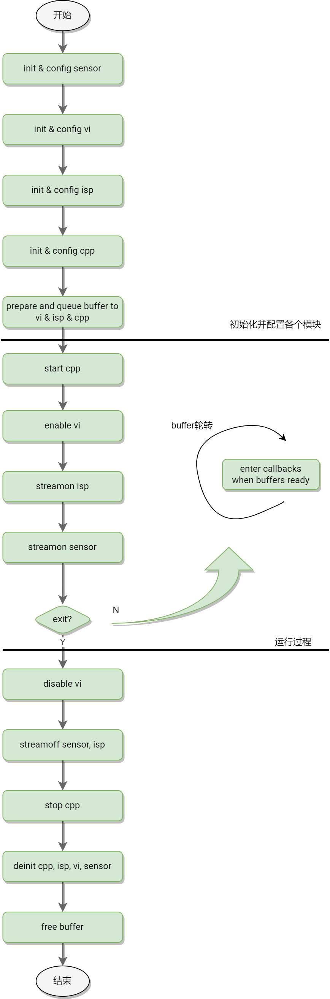
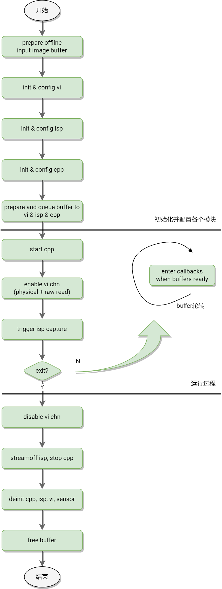

# CPP & ISP & MIPI-CSI

K1 的 CPP&ISP&MIPI-CSI 是基于标准的 V4L2 接口实现，并提供了完整的测试程序供参考。

## 1 规格

**MIPI CSI (CSI-2 V1.1) 4lane (x2)**

- 4 Lane + 4 Lane mode
- 4 Lane + 2 Lane mode
- 4 Lane + 4 Lane + 2 Lane mode（triple sensor）
- DPHY V1.1，Up to 1.5Gbps/lane
- Support RAW8/RAW10/RAW12/RAW14 and legacy yuv420 8-bit、yuv420 8-bit input foramt

**ISP 介绍**：图像信号处理器，用于处理传感器输出的图像信号，经过一系列数字图像处理算法达到预期的图像效果处理。包括坏点校正、镜头阴影校正、降噪、相位补偿与矫正、背光补偿、色彩增强等处理。

- 支持两路 pipeline（时分复用），能同时处理两路 stream，stream 的来源可以是 sensor 或者从 ddr 读取。
- 每路 pipeline 输出的最大图像为 1920x1080。
- 两路 pipeline 同时工作时，每个 pipeline 在没有开启 PDAF（相位对焦）时输入的图像最大 size 为 4748x8188；在开启 PDAF 时输入的图像最大 size 为 3264x8188。
- 只有一路 pipeline 工作时，在没有开启 PDAF（相位对焦）时输入的图像最大 size 为 9496x8188；在开启 PDAF 时输入的图像最大 size 为 6528x8188。
- 输入宽高都需要是 4 的倍数。

**CPP 介绍**：图像后处理模块，用于离线处理 ISP 输出的 NV12，金字塔式多层分时处理，主要功能包括：镜头畸变矫正、空域和时域降噪、频域降噪、边沿增强等。

- 输入支持 NV12_DWT 格式、输出支持 NV12_DWT、FBC_DWT 格式数据。NV12_DWT 格式 Buffer 是由标准的 NV12 Buffer 和 ASR 私有的 DWT Buffer 组成。
- 图像支持的最大高度：3136
- 图像支持的最大宽度：4224
- 图像支持的最小高度：288
- 图像支持的最小宽度：480
- 输入、输出 size 一致

## 2 流程框图

### 2.1 ISP online 整体流程

ISP online 时模块连接如下：

```shell
sensor –> VI_DEV -> ISP_FW –> VI_CHN -> DDR -> CPP
```

编写代码时，需要先配置 sensor, VI, ISP, CPP 各个模块，注册各个模块 buffer 回调，然后依次 streamon ISP 和 sensor。sensor 开始出流后，ISP 图像处理过程中会发生中断，各模块进行中断处理后调用模块回调处理 buffer；当程序退出时，建议先停止 vi，再停止 sensor，再依次执行 CPP, ISP, VI 的反初始化配置，并释放使用的 buffer。软件流程图如下：



Figure - 5 ISP online 整体流程图

**buffer 轮转：**

streamon 之前，准备好输入输出 buffer，并将输出 buffer queue 进各个模块 buffer list，

streamon 之后，输出 buffer list ready 之后调用各个模块对应的 buffer callback，

buffer callback 由用户实现，负责获取 buffer 数据并将 done buffer 再次 queue 入模块。

### 2.2 ISP offline 整体流程

ISP offline 时模块连接如下：

```shell
DDR -> VI_DEV -> ISP_FW –> VI_CHN -> DDR -> CPP
```

跟 ISP online 相比，ISP 从 DDR 读取输入数据，所以除了数据源配置和 buffer 回调方面有所差异，其他部分流程基本一样。下图展示的是 offline 模式下的 ISP capture mode 流程：



## 3 测试程序使用说明

k1x-cam 是一套用于测试验证 K1 芯片的 MIPI CSI + ASR ISP/CPP 功能的程序集，也可以作为客户开发自己的应用程序（需要熟悉了解 API 的使用说明）的参考。

### 3.1 安装说明

#### 3.1.1 Bianbu 桌面系统

源中已经集成了 k1x-cam，直接使用 apt 命令来安装即可。

```shell
sudo apt update
sudo apt install k1x-cam
```

#### 3.1.2 Buildroot 系统

TODO

### 3.2 使用说明

k1x-cam 的测试程序集中主要包含下面几个测试程序：

- **cam-test**：用于单路 pipeline，双路 pipeline，单 raw pipeline，单 cpp 处理等测试验证
- **cam_sensors_test**：用于简单的 sensor detect -> init -> stream on 流程调试验证

#### 3.2.1 cam-test

一些基本用法

```shell
使用实例：cam-test <file.json>

//单pipeline在线测试：imx135(4208x3120@30fps raw10 4lane) –> ISP -> DDR(1080p@30fps) -> CPP
命令：cam-test demo/cfgs/0/camtest_sensor0_mode0.json

//单pipeline在线测试：imx135(4208x2416@30fps raw10 4lane) –> ISP -> DDR(1080p@30fps) -> CPP
命令：cam-test demo/cfgs/0/camtest_sensor0_mode1.json

//单pipeline在线测试：imx135(2104x1560@30fps raw10 4lane) –> ISP -> DDR(1080p@30fps) -> CPP
命令：cam-test demo/cfgs/0/camtest_sensor0_mode2.json

//单pipeline在线测试：imx135(2104x1560@30fps raw10 4lane) –> ISP -> DDR(1080p@30fps) -> CPP
命令：cam-test demo/cfgs/0/camtest_sensor0_mode2.json

//双pipeline capture测试：imx135(2104x1560@30fps raw10 4lane) –> ISP -> DDR(1080p@30fps) -> CPP
命令：cam-test demo/cfgs/2/camtest_sensor0_mode0.json

//only raw dump pipeline测试：imx135(4208x3120@30fps raw10 4lane) –> ISP（VI） -> DDR
命令：cam-test demo/cfgs/3/camtest_sensor0_mode0.json

//only isp online pipeline测试：imx135 –> ISP -> DDR（NV12）
命令：cam-test demo/cfgs/4/camtest_sensor0_mode0_nv12.json

//only isp online pipeline测试：imx135 –> ISP -> DDR（p010）
命令：cam-test demo/cfgs/4/camtest_sensor0_mode0_p010.json

//only isp online pipeline测试：imx135 –> ISP -> DDR（p210）
命令：cam-test demo/cfgs/4/camtest_sensor0_mode0_p210.json

//only isp online pipeline测试：imx135 –> ISP -> DDR（rgb565）
命令：cam-test demo/cfgs/4/camtest_sensor0_mode0_rgb565.json

//only isp online pipeline测试：imx135 –> ISP -> DDR（rgb888）
命令：cam-test demo/cfgs/4/camtest_sensor0_mode0_rgb888.json

//only isp online pipeline测试：imx135 –> ISP -> DDR（y210）
命令：cam-test demo/cfgs/4/camtest_sensor0_mode0_y210.json

//双pipeline online测试：imx135+gc2375h –> ISP -> DDR -> CPP
命令：cam-test demo/cfgs/1/camtest_main_aux.json

```

#### 3.2.2 JSON 参数说明

以 sdktest_main_aux.json 为例进行说明：

```shell
{
    "tuning_server_enable":1, //用于isp tunning服务使能，在only isp online、单pipeline online、双pipeline online测试有效
    "show_fps":1,    //统计从0~120帧的平均帧率
    "auto_run": 1,    //自动测试，没有用户交互过程

    "cpp_node": [    //CPP模块
            {
                    "name": "cpp0",    //cpp group0
                    "enable": 1,
                    "format":"NV12",
                    "src_from_file": 0,    //如果ISP和cpp都enable了，cpp的输入就来自ISP输出

                    "src_path":"/tmp/cpp_case_in_data/1920x1080/",
                    "size_width":1920,
                    "size_height":1080,
            },
            {
                    "name": "cpp1",    //cpp group1
                    "enable": 1,
                    "format":"NV12",
                    "src_from_file": 0,    //

                    "src_path":"/vendor/etc/camera/",
                    "size_width":1920,
                    "size_height":1080,
            },
        ],

    "isp_node":[    //ISP模块，1个ISP可以接入两路video stream input
            {
                    "name": "isp0",    //isp0在线模式工作，输出1080p@30fps NV12
                    "enable": 1,
                    "work_mode":"online",
                    "format":"NV12",
                    "out_width":1920,
                    "out_height":1080,

                    "sensor_name":"imx135_asr",    //imx135对应/dev/cam_sensor0，工作在模式0
                    "sensor_id" : 0,
                    "sensor_work_mode":0,
                    "fps":30,

                    "src_file":"/tmp/1920x1080_raw12_long_packed.vrf",    //不生效(使用在其他模式)
                    "bit_depth": 12,    //不生效
                    "in_width":1920,    //不生效
                    "in_height":1080,    //不生效

            },
            {
                    "name": "isp1",    //isp1在线模式工作，输出1600x1200@30fps NV12
                    "enable": 1,
                    "work_mode":"online",
                    "format":"NV12",
                    "out_width":1600,
                    "out_height":1200,

                    "src_file":"/tmp/1920x1080_raw12_long_packed.vrf",    //不生效
                    "bit_depth": 12,    //不生效
                    "in_width":1920,    //不生效
                    "in_height":1080,    //不生效

                    "sensor_name":"gc2375h_asr",    //gc2375h对应/dev/cam_sensor1，工作在模式0
                    "sensor_id" : 1,
                    "sensor_work_mode":0,
                    "fps":30,
            },
    ]
}

```

json 参数更详细的作用，可以分析 config.c 和 online_pipeline_test.c/main.c 的具体应用场景。

#### 3.2.3 cam_sensors_test

一些基本用法

```shell
使用示例：cam_sensors_test [devId] [sensors_name]

```

输入执行命令后，在交互终端输入 s 字符后进行开流动作，如果没有报错。可以验证流程 sensor detect -> init -> stream on 基本正常。

## 4 SENSOR 调试

详见“K1 Camera 快速启动指南”。

## 5 ISP 效果调试

ISP 效果调试可能需要使用到的工具包括：调试工具（Tuning Tool）、定标插件（Calibration Plugins）、图像分析工具（VRF viewer），平台调试辅助等。

详见“K1 ISP 效果调试指南”。

## 6 API 使用说明

描述的 API 都是 ISP SDK 面向应用的，分为系统控制 API、图像效果设置 API 和 tuning 相关的 API，详细解释了相关的参数数据结构、错误码和返回值。主要面向 ISP 效果相关的 tuning 和算法工程师，以及图像相关相关的 setting 功能开发的应用工程师。

详见“K1 ISP API 开发指南”。
