# 启动开发指南

## 概述

### 编写目的

本指南主要介绍 SpacemiT 的刷机启动流程、自定义配置方法，以及 U-Boot 和 OpenSBI 相关的驱动开发与调试技巧，旨在帮助开发者快速掌握设备的启动开发与二次开发流程。

### 适用范围

本文档适用于SpacemiT的K1系列SOC。

### 相关人员

- 刷机启动开发工程师
- 内核开发工程师

### 文档结构

1. **刷机启动流程与配置**：介绍设备启动机制及自定义方法。
2. **U-Boot/OpenSBI 开发调试**：涵盖编译配置、驱动开发与调试技巧。
3. **常见问题处理**：提供开发过程中常见问题的解决方案。

## 刷机启动

本章节介绍刷机和启动相关的配置以及实现原理，并提供自定义刷机、启动的方式。
> **注意:** 刷机与启动是相互关联的，如果需要对刷机做自定义配置，启动可能也需要做相关的调整，反之亦然。

### 固件布局

K1 系列 SOC 常见的固件布局有以下三种。以下是布局特点：


1. **eMMC**
    - 包含 boot0（存储 bootinfo_emmc.bin 和 FSBL.bin）和 user_data_area（由 GPT 管理分区表）。
    - bootinfo_emmc.bin 和 FSBL.bin 存储在 boot0 区域，user_data_area 区域的 fsbl 分区实际上没有内容。
    - BROM 启动后会从 boot0 区域加载 bootinfo_emmc.bin 和 FSBL.bin。

2. **SD 卡**
    - 类似 eMMC，但 SD 卡只有 user_data_area 区域。
    - bootinfo_sd.bin 占用前 80 字节，GPT 表位于 1 blk。

3. **NOR + SSD**
    - 包含 NOR 上的固件（FSBL+OpenSBI+U-Boot）和 SSD 上的固件（bootfs+rootfs）。
    - 支持 NOR+eMMC 等块设备，默认已适配。如果未插入 SSD，仅使用 NOR+eMMC，则拨码开关拨向 NOR 启动。
    - 仅支持通过 PCIe0 接口插入的 SSD 作为刷机启动介质，如果 SSD 插入非 PCIe0 接口，则仅作为存储介质。
    - 如果使用 TitanFlasher 工具刷机，SSD 上的分区表实际会包含 FSBL/uboot/OpenSBI，但分区内容不会生效。

### 刷机流程和配置

以下内容包含的**刷机**、**烧写**为同一个概念。**卡量产**本质上也是刷机，只是数据来源于SD卡。而卡量产和卡启动为两个不同的概念，**卡启动**是将镜像烧写到SD卡里面，从SD卡里面启动系统。

#### 刷机流程

刷机流程是通过 Fastboot 协议将 PC 端的镜像传输到设备，并通过 MMC/MTD/NVMe 等接口写入到对应的存储介质。完整的刷机流程包括进入 U-Boot Fastboot 模式、镜像传输、存储介质设备检测、创建 GPT 表、写入数据到存储介质等步骤。

##### U-Boot Fastboot 模式

本平台的刷机通讯协议基于 Fastboot 协议，并进行了自定义扩展。所有实际的刷机行为都在 U-Boot Fastboot 模式下进行。进入 U-Boot Fastboot 模式后，通过 PC 端执行 `fastboot devices` 可以检测到设备（需要配置 PC 的 Fastboot 环境）。

```sh
~$ fastboot devices
c3bc939586f0         Android Fastboot
```

以下介绍进入 U-Boot Fastboot 模式的三种方法：

1. **通过按键组合进入**：按下板子上的 FEL 键和 RESET 键进入 BROM-Fastboot 模式，然后在上位机（PC）执行以下命令，使板子进入 U-Boot 刷机交互界面。BROM-Fastboot 仅用于加载启动 U-Boot Fastboot。

```sh
fastboot stage factory/FSBL.bin
fastboot continue
#sleep wait for uboot ready
#linux环境下
sleep 1
#windows环境下                
#timeout /t 1 >null     
fastboot stage u-boot.itb
fastboot continue
```

2. **通过 ADB 命令进入**：对于已经启动到操作系统的设备，可以通过上位机（PC）运行以下命令

```sh
adb reboot bootloader
```

使板子进入 U-Boot 刷机交互界面。（某些固件可能移除了 ADB 功能，因此该方法不通用。）

3. **通过串口进入**：在板子启动时，通过串口长按 S 键进入 U-Boot Shell，然后在串口执行以下命令进入 U-Boot 刷机交互界面：

```sh
fastboot 0
```

以下介绍不同存储介质组合的刷机命令。BROM 可以根据 boot pin 切换不同的启动介质（NOR/NAND/eMMC），这取决于硬件设计，具体请参考硬件参考设计。

##### eMMC 刷机

- **eMMC 刷机流程**
  对于 eMMC 的刷机流程如下，前面部分是从brom-fastboot启动到uboot-fastboot模式，下面其他的介质也一样

```sh
fastboot stage factory/FSBL.bin
fastboot continue
#sleep to wait for uboot ready
#linux环境下
sleep 1
#windows环境下
#timeout /t 1 >null   
fastboot stage u-boot.itb
fastboot continue

fastboot flash gpt partition_universal.json
#bootinfo_emmc.bin内容无实际作用，请参考FAQ 6.4章节。但刷写步骤还需执行
fastboot flash bootinfo factory/bootinfo_emmc.bin
fastboot flash fsbl factory/FSBL.bin
fastboot flash env env.bin
fastboot flash opensbi fw_dynamic.itb
fastboot flash uboot u-boot.itb
fastboot flash bootfs bootfs.img
fastboot flash rootfs rootfs.ext4

```

对于 eMMC，`bootinfo_emmc.bin` 的内容固化在 U-Boot 代码里面，这是为了用同一份 `partition_universal.json` 分区表兼容卡启动的制作等。且 `bootinfo_emmc.bin` 和 `fsbl.bin` 实际上是写入到 eMMC 的 boot0 分区

- **eMMC 分区表配置**
分区表保存在 `buildroot-ext/board/spacemit/k1/partition_universal.json`。其中，bootinfo 不作为一个显式的分区，用于保存启动介质相关信息。

```sh
{
  "version": "1.0",
  "format": "gpt",
  "partitions": [
    {
      "name": "bootinfo",
      "offset": "0",
      "size": "80B",
      "image": "factory/bootinfo_sd.bin"
    },
    {
      "name": "fsbl",
      "offset": "256K",
      "size": "256K",
      "image": "factory/FSBL.bin"
    },
    {
      "name": "env",
      "offset": "512K",
      "size": "128K"
    },
    {
      "name": "opensbi",
      "offset": "1M",
      "size": "1M",
      "image": "opensbi.itb"
    },
    {
      "name": "uboot",
      "offset": "2M",
      "size": "2M",
      "image": "u-boot.itb"
    },
    {
      "name": "bootfs",
      "offset": "4M",
      "size": "128M",
      "image": "bootfs.img"
    },
    {
      "name": "rootfs",
      "size": "-"
    }
  ]
}

```

##### NOR+BLK 设备刷机

- **NOR+BLK 刷机流程**
K1 支持 NOR+SSD/eMMC 等 BLK 设备的组合刷机启动，且为自适应方式。如果同时存在 SSD 和 eMMC，默认烧写到 SSD。

```sh
fastboot stage factory/FSBL.bin
fastboot continue
#sleep wait for uboot ready
#linux环境下
sleep 1                 
#windows环境下
#timeout /t 1 >null      
fastboot stage u-boot.itb
fastboot continue

#刷spi nor
fastboot flash mtd partition_2M.json
fastboot flash bootinfo factory/bootinfo_spinor.bin
fastboot flash fsbl factory/FSBL.bin
fastboot flash env env.bin
fastboot flash opensbi fw_dynamic.itb
fastboot flash uboot u-boot.itb

#刷block设备
#刷机工具会根据实际的分区表烧写镜像，所以对于nor+blk,blk设备的fsbl/uboot/等分区并没有实际作用
fastboot flash gpt partition_universal.json
fastboot flash bootfs bootfs.img
fastboot flash rootfs rootfs.ext4
```

- **NOR+BLK 分区表配置**
  - NOR 分区表位于 `buildroot-ext/board/spacemit/k1/partition_2M.json`。对于 NAND/NOR 设备，分区表以 `partition_xM.json` 命名，并需根据实际 Flash 容量重命名，否则会导致刷机时找不到对应的分区表。
    - NOR/NAND 的分区表会向最小容量兼容，例如 NOR 的介质容量为 8MB，刷机包中只有 `partition_2M.json`，则会匹配到 `partition_2M.json` 的分区表。
  - 对于分区表配置
    - MTD 存储介质（NAND/NOR Flash）以 `partition_2M.json` 等容量形式表示。
    - BLK 设备（包括 eMMC/SD/SSD 等）以 `partition_universal.json` 命名。

- **NOR Flash 分区表修改**：
  1. 分区起始地址和 size 默认以 64KB 对齐（对应 erase size 为 64KB）。
  2. 如果需要将起始地址和 size 更改为 4KB 对齐，则需开启 U-Boot 的编译配置 `CONFIG_SPI_FLASH_USE_4K_SECTORS`。

```sh
//buildroot-ext/board/spacemit/k1/partition_2M.json
{
  "version": "1.0",
  "format": "mtd",
  "partitions": [
    {
      "name": "bootinfo",
      "offset": "0",
      "size": "128K",
      "image": "factory/bootinfo_spinor.bin"
    },
    {
      "name": "fsbl",
      "offset": "128K",
      "size": "256K",
      "image": "factory/FSBL.bin"
    },
    {
      "name": "env",
      "offset": "384K",
      "size": "64K"
    },
    {
      "name": "opensbi",
      "offset": "448K",
      "size": "192K",
      "image": "fw_dynamic.itb"
    },
    {
      "name": "uboot",
      "offset": "640K",
      "size": "-",
      "image": "u-boot.itb"
    }
  ]
}
```

- **SSD 分区表说明**
BLK 设备（SSD、eMMC 等）统一使用 `partition_universal.json`分区表。
此时，`bootinfo`、`fsbl`、`env`、`opensbi`、`uboot` 等分区及其数据不会影响正常启动。

```sh
//buildroot-ext/board/spacemit/k1/partition_universal.json
{
    "version": "1.0",
    "format": "gpt",
    "partitions": [
        {
            "name": "bootinfo",
            "offset": "0K",
            "size": "512",
            "image": "factory/bootinfo_sd.bin",
            "holes": "{\"(80;512)\"}"
        },
        {
            "name": "fsbl",
            "offset": "128K",
            "size": "256K",
            "image": "factory/FSBL.bin"
        },
        {
            "name": "env",
            "offset":"384K",
            "size": "64K",
            "image": "env.bin"
        },
        {
            "name": "opensbi",
            "size": "384K",
            "image": "fw_dynamic.itb"
        },
        {
            "name": "uboot",
            "size": "2M",
            "image": "u-boot.itb"
        },
        {
            "name": "bootfs",
            "offset": "4M",
            "size": "256M",
            "image": "bootfs.img",
            "compress": "gzip-5"
        },
        {
            "name": "rootfs",
            "offset": "260M",
            "size": "-",
            "image": "rootfs.ext4",
            "compress": "gzip-5"
        }
    ]
}
```

##### NAND 刷机启动

- **NAND 刷机流程**
K1 支持使用 NAND 进行刷机启动。但由于 **NAND 和 NOR 共用同一个 SPI 接口**，两者只能选其一，系统默认使用 NOR 启动。
如需启用 NAND 启动，请参考刷机启动章节中的 NAND 配置说明，完成相关配置。

```sh
fastboot stage factory/FSBL.bin
fastboot continue
#sleep wait for uboot ready
#linux环境下
sleep 1       
#windows环境下          
#timeout /t 1 >null      
fastboot stage u-boot.itb
fastboot continue

fastboot flash mtd partition_64M.json
fastboot flash bootinfo factory/bootinfo_spinand.bin
fastboot flash fsbl factory/FSBL.bin
fastboot flash env env.bin
fastboot flash opensbi fw_dynamic.itb
fastboot flash uboot u-boot.itb

fastboot flash user-bootfs bootfs.img
fastboot flash user-rootfs rootfs.img
```

- **UBIFS 文件系统镜像制作说明**
NAND 上的文件系统依赖于 UBIFS，需提前生成 `bootfs.img` 和 `rootfs.img`，制作方法如下：

```sh
#制作bootfs.img
mkfs.ubifs -F -m 2048 -e 124KiB -c 8124 -x zlib -o output/bootfs.img -d input_bootfs/

#制作rootfs.img
mkfs.ubifs -F -m 2048 -e 124KiB -c 8124 -x zlib -o output/rootfs.img -d input_rootfs/

#input_bootfs和input_rootfs应该存放bootfs和rootfs中的文件
#例如对于bootfs,应该放入如下文件Image.itb、env_k1-x.txt、bianbu.bmp

#不同的nand需要修改对应的参数，以下是一些参数说明，具体可查看mkfs.ubifs的用法
-m 2048：设置最小输入/输出单元大小为 2048 字节（2 KiB），要与NAND Flash 的页大小相匹配。
-e 124KiB：设置逻辑擦除块的大小为 124 KiB（千字节），这应小于实际的物理擦除块的大小，以留出空间用于 UBI 的管理结构。
-c 8124：设置最大逻辑擦除块的数量为 8124，这个数字限制了文件系统的最大大小，基于逻辑擦除块的大小和数量计算。
-x zlib：设置压缩类型为 zlib，这将在文件系统上对数据进行 zlib 压缩。
-o output/ubifs.img：指定输出文件名，将生成的 UBIFS 文件系统镜像保存为 output/ubifs.img。
-d input/：指定源目录为 input/，mkfs.ubifs 将会把这个目录下的文件和文件结构创建成 UBIFS 文件系统镜像。
```

- **NAND + BLK 组合启动**
本平台也支持 NAND + BLK 设备组合启动方式，相关刷机流程可参考 **NOR+BLK 设备刷机** 章节。

- **NAND 分区表配置**
以下示例为适用于 256MB 容量 NAND 的分区表：`partition_256M.json`

```sh
//buildroot-ext/board/spacemit/k1/partition_64M.json
{
  "version": "1.0",
  "format": "mtd",
  "partitions": [
    {
      "name": "bootinfo",
      "comment": "private partition, should not overrided it",
      "offset": "0",
      "size": "128K",
      "image": "factory/bootinfo_spinand.bin"
    },
    {
      "name": "fsbl",
      "offset": "128K",
      "size": "256K",
      "image": "factory/FSBL.bin"
    },
    {
      "name": "env",
      "offset": "384K",
      "size": "128K"
    },
    {
      "name": "opensbi",
      "offset": "640K",
      "size": "384K",
      "image": "opensbi.itb"
    },
    {
      "name": "uboot",
      "offset": "1M",
      "size": "2M",
      "image": "u-boot.itb"
    },
    {
      "name": "user",
      "offset": "3M",
      "size": "-",
             "volume_images": {"bootfs": "bootfs.img", "rootfs": "rootfs.img"}
    }
  ]
}
```

##### 卡启动

卡启动是指将系统镜像写入到 **SD 卡** 中，当设备插入该 SD 卡后，**上电启动时会优先从卡中加载系统**。

K1 平台支持卡启动，并且在启动时会**优先尝试从 SD 卡启动**，如果启动失败，系统将退回到使用 **pin select** 选中的其他存储介质启动。

>**注：** 本平台 **不支持通过 fastboot 协议** 将镜像烧写到 SD 卡。

制作卡启动镜像需使用 **TitanFlash 工具** 或 `dd` 命令完成。

**使用刷机工具制作卡启动镜像：**

1. 将 TF 卡插入读卡器，并连接到电脑的 USB 接口。
2. 打开电脑端的 **TitanFlash 刷机工具**（安装方式请参考 [TitanFlash 安装](https://developer.spacemit.com/documentation?token=EW5mwVyi8iGXjckrnU0ccQOhnGf)）。
3. 点击顶部菜单栏中的 **研发工具 → 卡启动**。
4. 点击对应的 **选择SD卡** 和 **选择刷机包**。

5. 点击 **执行**，开始烧写镜像。
6. 烧写成功后，将 TF 卡插入设备，上电后设备即可实现卡启动。

##### 卡量产

卡量产是指：将刷机相关的镜像文件写入 **SD 卡** 中，当设备上电启动后，**首先从 SD 卡启动**，并检测到处于量产模式时，**将卡内镜像文件按分区表配置写入到 pin select 选中的存储介质**（如 eMMC、NOR、NAND 等）。

K1 平台支持卡量产烧录。通过 **TitanFlash 工具** 可将 SD 卡制作成量产卡。将量产卡插入设备并上电后，系统会自动将镜像烧录到目标存储介质。

**卡量产制作步骤：**

1. 将 TF 卡插入读卡器，并接入电脑 USB 接口。
2. 打开 TitanFlash 工具，点击 **量产工具 → 制作量产卡**。
3. 选择需要烧录的刷机包，点击 **执行** 开始制作。

4. 制作完成后，将 SD 卡插入设备。
5. 上电后设备会自动进入卡烧录流程，并将镜像写入目标存储介质。
6. 烧录完成后，**务必拔出 SD 卡**，以避免再次上电重复烧录。

#### 刷机工具

本章节简要介绍刷机工具的使用方式和相关配套内容。

##### 刷机工具使用

对于镜像的烧写，平台支持以下两种方式：

- **TitanFlash 刷机工具**：
  面向一般开发者，适用于完整刷机包的烧写，界面友好、功能完整。
  工具的安装与使用说明详见官方文档：[TitanFlash 使用手册](https://developer.spacemit.com/documentation?token=O6wlwlXcoiBZUikVNh2cczhin5d)

- **Fastboot 工具**：
  面向具备一定开发能力的用户，适合进行单个分区的镜像烧写。
  **注意：** 若分区镜像烧写错误，可能导致系统启动异常，请谨慎操作。
  相关烧写流程详见本文的 **刷机流程** 章节，fastboot 环境安装可参考以下链接：

  - [参考链接 1](https://www.jb51.net/article/271550.htm)
  - [参考链接 2](https://blog.csdn.net/qq_34459334/article/details/140128714)

> 固件镜像的生成方式，请参考文档：[下载和编译](https://sdk.spacemit.com/source)

##### 刷机介质选择

- 硬件平台支持通过 **Boot Download Sel Switch 拨码开关** 切换启动介质。
  具体使用方法可参考 MUSE Pi 用户指南中的 [Boot Download Sel & JTAG Sel](https://developer.spacemit.com/documentation?token=ZugWwIVmkiGNAik55hzc4C3Ln6d) 章节。

- 其他平台或方案，请参考对应的硬件用户使用手册。

- 对于不同的启动介质，刷机方式已做成**自动适配**。

### 启动配置

本章节介绍 eMMC、SD、NOR、NAND 启动的配置，以及自定义启动配置相关的注意事项。刷机启动需要配合正确的分区表等配置以及正确的启动配置。

#### 启动流程

本章节介绍平台芯片的启动流程，并且提供定制化启动的修改方。
如下框图，启动流程主要包括以下阶段：
**brom -> fsbl -> opensbi -> uboot -> kernel**
其中，`bootinfo` 提供 fsbl 所在偏移、大小、签名等信息。


根据硬件的 **Boot Pin Select 配置**，系统会从 SD 卡、eMMC、NOR 等介质中加载下一级启动镜像。
**不同的启动介质，整体启动流程与上图一致。**
Boot Pin Select 的详细介绍请参考 **刷机工具使用** 章节中的 **刷机介质选择** 。

在 K1 平台上，设备上电后将：

1. **优先尝试从 SD 卡启动**；
2. 若 SD 卡启动失败，则根据 Boot Pin Select 配置，依次尝试从 eMMC、NAND 或 NOR 加载 `OpenSBI` 和 `U-Boot` 镜像。

以下小节将根据启动顺序，分别介绍bootinfo、fsbl、opensbi、uboot 和 kernel 等启动配置

##### BROM (Boot ROM)

brom 是预置于 SoC 的启动代码，出厂即无法改变。芯片上电或复位后自动运行。它根据 Boot Pin 判断启动介质 (如 SD、eMMC、NOR)，并从中加载 `bootinfo` 和 `fsbl`。
> Boot Pin 设置详见 **刷机工具使用** 章节中的 **刷机介质选择** 。

##### bootinfo

brom 启动后会从对应存储介质的物理 0 地址偏移获取 bootinfo 信息（如，eMMC 会从 boot0 区域的 0 地址加载）。bootinfo 包含 fsbl、fsbl1 的位置、大小与校验 等信息。

其中，bootinfo*描述文件在如下目录的* `.json`

```sh
uboot-2022.10$ ls board/spacemit/k1-x/configs/
bootinfo_emmc.json  bootinfo_sd.json  bootinfo_spinand.json  bootinfo_spinor.json
```

JSON 文件示例说明如下，记录了各种存储介质的默认 fsbl/fsbl1 位置。fsbl1 为备份数据。如果需要修改偏移地址，可以修改 `bootinfo_*json` 文件，然后重新编译 uboot。

fsbl 的位置尽量保持原厂设置。如果需要自定义，需要考虑不同存储介质的特性，例如 NAND 需要按 sector 对齐等。eMMC 的 fsbl 只支持在 boot 分区加载。

```sh
emmc:boot0:0x200, boot1:0x0
sd:0x20000/0x80000
nor:0x20000/0x70000
nand:0x20000/0x80000
```

编译uboot时会在其根目录下生成对应的 `*.bin` 文件等 bootinfo 镜像文件，生成方式可参考 `uboot-2022.10/board/spacemit/k1-x/config.mk`

```sh
uboot-2022.10$ ls -l
bootinfo_emmc.bin
bootinfo_sd.bin
bootinfo_spinand.bin
bootinfo_spinor.bin
```

##### FSBL (First Stage Boot Loader)

brom 获取 bootinfo 后，会从指定的 offset 加载 `fsbl` 。

`fsbl` 文件是由 4K 的头信息与 `uboot-spl.bin` 组合而成，头信息包含 uboot-spl 的一些必要信息，如 CRC 校验值等。

fsbl 启动后，会先 **初始化 DDR**，然后从分区表 **加载 opensbi 和 uboot 到内存的指定位置**，再 **运行 opensbi**，接着 **opensbi 会启动 uboot**。(fsbl 如何初始化 DDR 的内容不在本文档的描述范围内)

##### opensbi 和 uboot 加载启动

不同存储介质对 opensbi 和 uboot 的加载方式是多样化的，以下按存储介质分类 (eMMC,、SD、NOR、NAND)去描述 SPL 加载启动 uboot/opensbi 的配置。

K1 平台支持 **独立分区加载** (即，加载独立分区的 opensbi 和 uboot )，也支持**打包为单镜像** (即，加载一个镜像(uboot-opensbi.itb))的方式。**默认使用分区名加载**。

加载启动一个镜像(uboot-opensbi.itb)的方式请参考本文里的FAQ部分（即，**uboot 和 opensbi 合并加载** ）。

###### eMMC / SD 启动

eMMC 与 SD 都是使用 **MMC 驱动**，uboot 的代码流程上会根据启动的 boot pin select 选择 eMMC 或 SD。两者的启动配置类似。

opensbi 和 uboot 有不同的 image 格式，根据存放的位置，可以分为裸分区、文件、fit格式等。

K1 平台默认都会先尝试从 SD 启动，失败后再尝试其他介质(eMMC/NOR/NAND等其中一个)。

SPL-DTS 需要开启 eMMC/SD 的配置，配置示例如下：

```sh
//uboot-2022.10/arch/riscv/dts/k1-x_spl.dts
        /* eMMC */
        sdh@d4281000 {
                bus-width = <8>;
                non-removable;
                mmc-hs400-1_8v;
                mmc-hs400-enhanced-strobe;
                sdh-phy-module = <1>;
                status = "okay";
                u-boot,dm-spl;
        };
        
        /* sd */
      sdh@d4280000 {
          pinctrl-names = "default";
          pinctrl-0 = <&pinctrl_mmc1 &gpio80_pmx_func0>;
          bus-width = <4>;
          cap-sd-highspeed;
          sdh-phy-module = <0>;
          status = "okay";
          u-boot,dm-spl;
      };
```

以下将介绍 eMMC / SD 的不同启动方式，**默认采用分区名加载镜像**。

1. **裸分区方式**
fsbl加载启动uboot/opensbi流程， 以 eMMC 为例（SD/NOR 等介质类似，本文不再赘述）：
   - 执行 `make uboot_menuconfig`，进入 SPL 的配置界面（SPL 相关设置的入口）。

      

   - 选择“分区表方式”加载。此模式默认支持将 `opensbi` 和 `uboot` 镜像分别存放于独立分区。
    SPL 会优先查找名为 `opensbi` 和 `uboot` 的分区名；若找不到，则会依次尝试加载分区号为 1 和 2 的原始数据（raw images）。

      

      

   - SPL 成功加载 `opensbi` 和 `uboot` 后，会先启动 OpenSBI，并传入 U-Boot 的内存地址及 dtb 信息；OpenSBI 再根据这些信息启动 U-Boot。

2. **绝对偏移方式**

   该方式通过指定 eMMC 上的物理偏移地址直接加载镜像：

   - 启用相关配置后，SPL 将按照设定的偏移地址，从 eMMC 中加载 `opensbi` 和 `uboot` 镜像。
     > 注意：**该模式不支持分开加载**，必须将 `opensbi` 和 `uboot` 打包为一个完整镜像（fit 格式）。

   - 若希望支持分开加载，可以参考源码 `uboot-2022.10/common/spl/spl_mmc.c` 中的 `MMCSD_MODE_RAW` 实现部分。

     

3. **文件系统方式**

   此方式让 SPL 通过文件系统（如 FAT）加载启动镜像：

   - uboot-spl 支持从文件系统中分别独立加载 OpenSBI 和 U-Boot 文件（例如：`opensbi.itb`、`uboot.itb`）。

   - 执行 `make menuconfig`，打开相关配置选项，并启用对 FAT 文件系统的支持。

     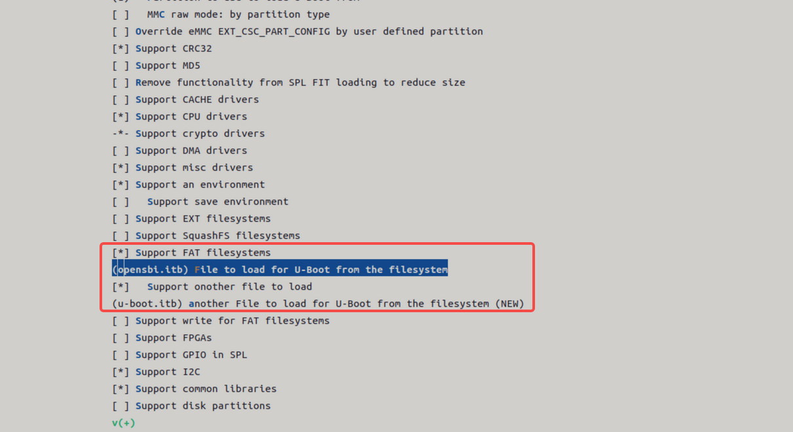

###### NOR 启动

K1 平台支持通过 NOR 介质启动，常见的启动组合包括：

- NOR (u-boot-spl / uboot / opensbi) + SSD (bootfs / rootfs)
- NOR (u-boot-spl / uboot / opensbi) + eMMC (bootfs / rootfs)

系统默认会 **优先尝试从 SSD 启动**，若失败再尝试其他配置。

SPL 的 DTS 配置如下：

```sh
//uboot-2022.10/arch/riscv/dts/k1-x_spl.dts
        spi@d420c000 {
                status = "okay";
                pinctrl-names = "default";
                pinctrl-0 = <&pinctrl_qspi>;
                u-boot,dm-spl;

                spi-max-frequency = <15140000>;
                flash@0 {
                        compatible = "jedec,spi-nor";
                        reg = <0>;
                        spi-max-frequency = <26500000>;

                        m25p,fast-read;
                        broken-flash-reset;
                        u-boot,dm-spl;
                        status = "okay";
                };
        };

```

启动配置步骤（SPL 加载 NOR）：

**默认已启用以下配置，如需确认可通过 menuconfig 检查。**

1. **SPL 基本功能开启**
   执行 `make uboot_menuconfig`，选择 `SPL configuration options`
    

2. **启用以下选项：**

   - `Support MTD drivers`
   - `Support SPI DM drivers in SPL`
   - `Support SPI drivers`
   - `Support SPI flash drivers`
   - `Support for SPI flash MTD drivers in SPL`
   - `Support loading from mtd device`
   - 设置 `Partition name to use to load U-Boot from`，该值需与分区表中的实际名称一致。

    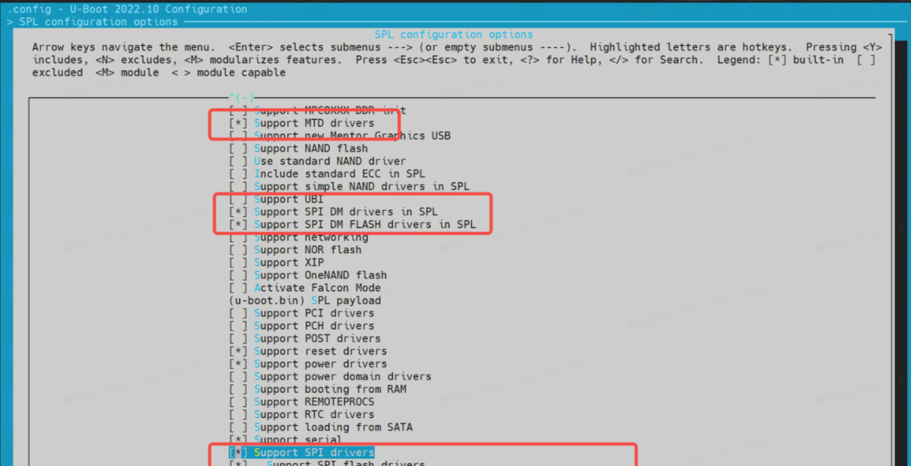

3. **启用 BLK 设备支持**（如 SSD/eMMC）
   进入 `Device Drivers -> Fastboot support`，勾选：

   - `Support blk device`
   - SSD 对应 NVMe，eMMC 对应 MMC

    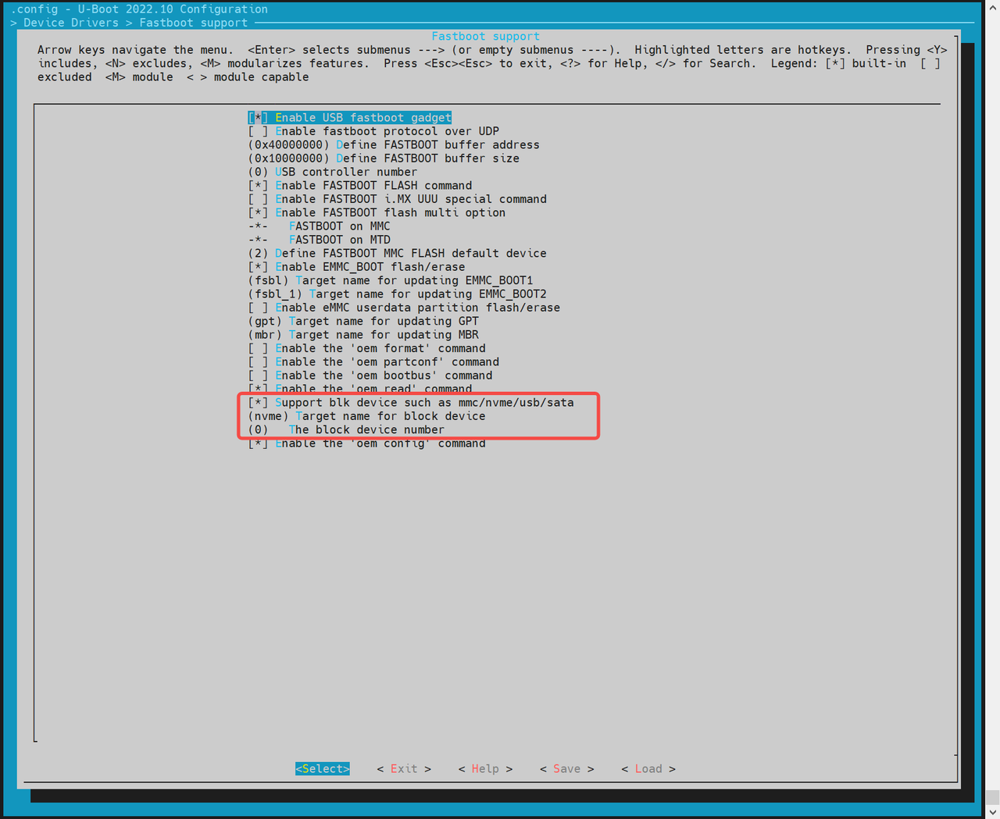

4. **启用 MTD 环境变量（env）支持**

   SPL 启动后需从 env 获取 MTD 分区信息：

   - 进入 `Environment` 配置页
   - 启用 SPI env 加载
   - 设置 env 的偏移地址，需与分区表一致（例如：`0x80000`）

    

    

5. **适配 SPI Flash 驱动（根据硬件）**
   若默认未包含目标芯片的驱动：

   - 执行 `make uboot_menuconfig`
   - 进入 `Device Drivers -> MTD Support -> SPI Flash Support`
   - 根据硬件的 SPI Flash 厂商，勾选选择对应的驱动程序

   

   如驱动列表中没有你的 Flash 型号，可以在代码上手动直接添加。`flash_name` 可以自定义，一般为硬件 FLASH 名称，`0x1f4501` 为该 FLASH 的 jedecid，其他参数可以根据该硬件的 FLASH 添加。

```sh
//uboot-2022.10/drivers/mtd/spi/spi-nor-ids.c
const struct flash_info spi_nor_ids[] = {
     { INFO("flash_name",    0x1f4501, 0, 64 * 1024,  16, SECT_4K) },
```

**支持的加载方式** 主要有两种，如下

- **裸分区方式**

  对于 NOR 设备，会根据 mtd 分区表获取 `opensbi` 和 `uboot`。配置方式如下
  

- **绝对偏移**
  NOR 启动支持以存储介质的绝对偏移加载镜像启动。
  > 注意：
  > - **不支持 opensbi / uboot 分开加载**。
  > - 需将两者打包为一个镜像（fit 格式）。

  开启以下配置，输入存储介质的绝对偏移地址。
  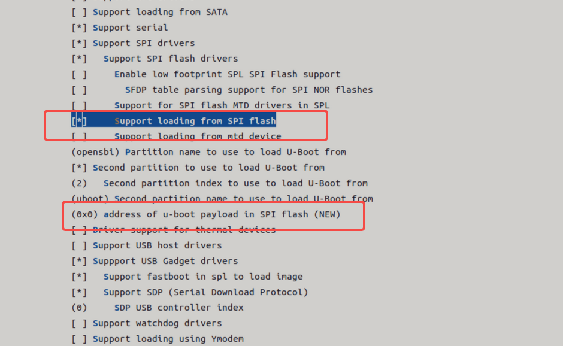

###### NAND 启动

K1 平台支持通过 NAND 启动，主要包括两种方式：

- **NAND（u-boot-spl / uboot / opensbi）+ SSD（bootfs / rootfs）**
- **纯 NAND（u-boot-spl / uboot / opensbi / kernel）**

默认情况下，NAND 启动功能是关闭的。

SPL DTS 配置如下

```sh
//uboot-2022.10/arch/riscv/dts/k1-x_spl.dts
        spi@d420c000 {
                status = "okay";
                pinctrl-names = "default";
                pinctrl-0 = <&pinctrl_qspi>;
                u-boot,dm-spl;

                spi-max-frequency = <15140000>;
                spi-nand@0 {
                       compatible = "spi-nand";
                       reg = <0>;
                       spi-tx-bus-width = <1>;
                       spi-rx-bus-width = <1>;
                       spi-max-frequency = <6250000>;
                       u-boot,dm-spl;
                       status = "okay";
               };
        };
        
```

下面将介绍 **纯 NAND 启动配置** 步骤。

1. **配置 SPL 编译选项**
   - 执行 `make uboot_menuconfig`，进入 `SPL configuration options`，启用以下选项：

     

     - `Support MTD drivers`
     - `Support SPI DM drivers in SPL`
     - `Support SPI drivers`
     - `Use standard NAND driver`
     - `Support simple NAND drivers in SPL`
     - `Support loading from mtd device`
     - 设置 `Partition name to use to load U-Boot from`，需与分区表保持一致

   - 如果开启了 **opensbi / uboot 分开加载**，还需启用：

     - `Second partition to use to load U-Boot from`
     - 并确保顺序为：先加载 opensbi，再加载 uboot

     

2. **配置 env 支持**
   对于 MTD 设备，需要开启 `env`，以确保 SPL 启动后能从 `env` 获取 MTD 分区信息
   - 执行 `make uboot_menuconfig`
   - 进入 `Environment` 配置页
   - 启用 SPI 的 `env` 加载支持
   - 设置偏移地址为 `0x80000`（需与分区表一致）

3. **适配 NAND Flash 驱动**

   - 驱动需匹配实际使用的 NAND 芯片厂商。目前已支持的 NAND FLASH 如下驱动所示。

```sh
~/uboot-2022.10$ ls drivers/mtd/nand/spi/*.c
uboot-2022.10/drivers/mtd/nand/spi/core.c
uboot-2022.10/drivers/mtd/nand/spi/micron.c
uboot-2022.10/drivers/mtd/nand/spi/winbond.c
uboot-2022.10/drivers/mtd/nand/spi/gigadevice.c
uboot-2022.10/drivers/mtd/nand/spi/other.c
uboot-2022.10/drivers/mtd/nand/spi/macronix.c
uboot-2022.10/drivers/mtd/nand/spi/toshiba.c
```

- 如果未内置相关驱动，可以在 `other.c` 驱动中添加厂商的 **JEDEC ID**。
     示例：添加 FORESEE 或 Dosilicon 芯片支持：

```sh
//uboot-2022.10/drivers/mtd/nand/spi/other.c
 static int other_spinand_detect(struct spinand_device *spinand)
 {
     u8 *id = spinand->id.data;
     int ret = 0;

     /*
      * dosilicon nand flash
      */
     if (id[1] == 0xe5)
        ret = spinand_match_and_init(spinand, dosilicon_spinand_table,
                     ARRAY_SIZE(dosilicon_spinand_table),
                     id[2]);

     /*FORESEE nand flash*/
     if (id[1] == 0xcd)
        ret = spinand_match_and_init(spinand, foresee_spinand_table,
                     ARRAY_SIZE(foresee_spinand_table),
                     id[2]);
     if (ret)
         return ret;

     return 1;
 }
```

##### 启动 Kernel

系统启动进入 **U-Boot** 后，会根据 `env` 中的配置自动加载并启动 Kernel。开发者可以按需定制启动方式。

> 注意：`k1-x_env.txt` 的优先级高于 `env.bin`，会覆盖其中的同名变量。

**Kernel 启动流程说明**

在 `fsbl` 启动 `opensbi → uboot` 后，U-Boot 会根据设定的启动命令，从 FAT 或 EXT4 文件系统中加载 kernel、dtb 等镜像至内存，最终执行 `bootm` 命令启动内核。

相关配置可参考：

```sh
uboot-2022.10/board/spacemit/k1-x/k1-x.env
```

文件中已集成多种启动方案（如 eMMC/SD/NOR+BLK），并能根据实际启动介质自动适配。

**启动方式示例**

1. **MMC 启动**（适用于 SD / eMMC）

   对于 SD/eMMC，都属于 `mmc_boot`

```sh
//uboot-2022.10/board/spacemit/k1-x/k1-x.env
run mmc_boot;

mmc_boot=echo "Try to boot from ${bootfs_devname}${boot_devnum} ..."; \
          run commonargs; \
          run set_mmc_root; \
          run set_mmc_args; \
          run detect_dtb; \
          run loadknl; \
          run loaddtb; \
          run loadramdisk; \
          bootm ${kernel_addr_r} ${ramdisk_combo} ${dtb_addr};
```

启动时，rootfs 由 U-Boot 传递 `bootargs` 给 Kernel，Kernel 或其 `init` 脚本解析并挂载 rootfs 。
如下字段 `root=/dev/mmcblk2p6`即为 rootfs 分区。

```sh
bootargs=earlycon=sbi earlyprintk console=tty1 console=ttyS0,115200 loglevel=8 clk_ignore_unused swiotlb=65536 rdinit=/init root=/dev/mmcblk2p6 rootwait rootfstype=ext4
```

- **NOR + blk 启动**（如 NOR + SSD）

```sh
//uboot-2022.10/board/spacemit/k1-x/k1-x.env
run nor_boot;

nor_boot=echo "Try to boot from ${bootfs_devname}${boot_devnum} ..."; \
         run commonargs; \
         run set_nor_root; \
         run set_nor_args; \
         run detect_dtb; \
         run loadknl; \
         run loaddtb; \
         run loadramdisk; \
         bootm ${kernel_addr_r} ${ramdisk_combo} ${dtb_addr};
```

- **NAND 启动**

```sh
//uboot-2022.10/board/spacemit/k1-x/k1-x.env
run nand_boot;

//待适配
```

### 安全启动

安全启动基于 **FIT image** 格式实现，主要流程如下：

1. 将 OpenSBI、`u-boot.itb` 和 Kernel 打包为一个 FIT 镜像；
2. 打开代码中安全启动配置；
3. 使用私钥对 FIT 镜像签名，同时将公钥信息嵌入到 DTS/DTB 中，供上一级引导程序验签使用。

#### 验签流程

启动验签流程如下图所示：

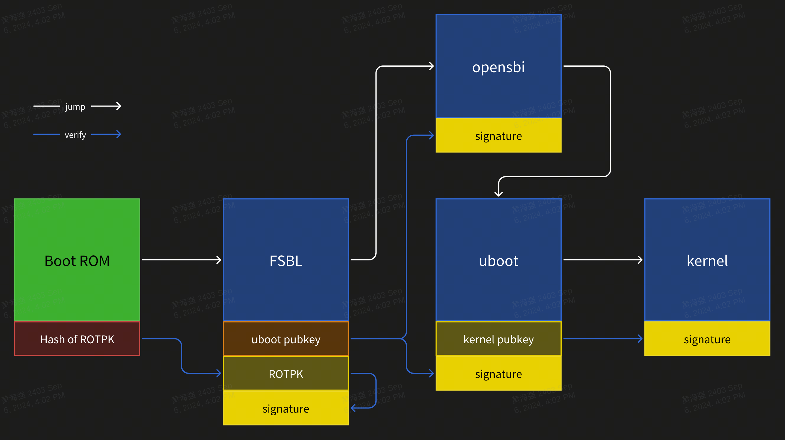

签名过程描述：

- BootROM 作为信任根，固化在芯片中，不可更改；
- Hash of ROTPK 需烧录进芯片内部Efuse，只能烧录一次；
- 哈希算法：`SHA256`；
- 签名算法：`SHA256 + RSA2048`；

#### 配置

- **U-Boot 编译配置：**

```sh
CONFIG_FIT_SIGNATURE=y
CONFIG_SPL_FIT_SIGNATURE=y

CONFIG_SHA256=y
CONFIG_SPL_SHA256=y

CONFIG_RSA=y
CONFIG_SPL_RSA=y
CONFIG_SPL_RSA_VERIFY=y
CONFIG_RSA_VERIFY=y
```

- **OpenSBI 编译配置：**

```sh
CONFIG_FIT_SIGNATURE=y
```

- **Kernel 编译配置：**

```sh
CONFIG_FIT_SIGNATURE=y
```

#### 公私钥生成

使用 `openssl` 生成私钥和证书（私钥需妥善保管，仅证书公开）：

```sh
# build private key without password
openssl genrsa -out prv-rsa.key 2048
# private key parse:
openssl rsa -in prv-rsa.key -text -noout

# build certificate that expired after 365 days
openssl req -batch -new -x509 -days 365 -key prv-rsa.key -out rsa.crt
# certificate parse:
openssl x509 -in rsa.crt -text -noout

# build public key from private key:
openssl rsa -in prv-rsa.key -pubout -out pub-rsa.key
# public key parse:
openssl rsa -in pub-rsa.key -pubin -noout -text
```

#### 镜像签名

1. 修改 ITS 脚本，启用 hash 和签名配置：

```sh
/dts-v1/;

/ {
        description = "Configuration to load OpenSBI before U-Boot";
        #address-cells = <2>;
        fit,fdt-list = "of-list";

        images {
                opensbi {
                        description = "OpenSBI fw_dynamic Firmware";
                        type = "firmware";
                        os = "opensbi";
                        arch = "riscv";
                        compression = "none";
                        load = <0x0 0x0>;
                        entry = <0x0 0x0>;
                        data = /incbin/("./fw_dynamic.bin");
                        hash-1 {
                                algo = "sha256";
                        };
                };
        };
        configurations {
                default = "config_1";

                config_1 {
                        description = "opensbi FIT config";
                        firmware = "opensbi";
                        signature {
                                algo = "sha256,rsa2048";
                                key-name-hint = "uboot_key_prv";
                                sign-images = "firmware";
                        };
                };
        };
};
```

2. 使用私钥和证书，对 FIT image 文件进行签名

```sh
# build empty dtb file, for next stage public key file output
printf "/dts-v1/;\n/ {\n};" > pubkey.dts
dtc -I dts -O dtb -o pubkey.dtb pubkey.dts

# build fit image
# input: fit script, folder contain private key and certification
# output: fit image, dtb that contain public key info
mkimage -f uboot_fdt_sign.its -K pubkey.dtb -k key -r u-boot.itb

# parse dtb file that public key info
fdtdump -s pubkey.dtb
```

3. 更新公钥信息到上一级引导代码

  示例：更新 uboot 签名所用私钥对应的公钥信息到 FSBL 设备树中

```sh
/ {
        signature {
                key-uboot_key_prv {
                        required = "conf";
                        algo = "sha256,rsa2048";
                        rsa,r-squared = <0x5353bc86 0x7070d595 0xe2ea6280 0xb9887ae1 0xf69bb145 0x161e6675 0x6f9d37dc 0x29646b18 0x0ecc66d1 0x0ef7fa25 0xddc925cf 0xf068e5e4 0x78e5b40b 0x124095c6 0x1282d13c 0x1bdf09d0 0x7ddf7bf4 0xb4e61d0b 0x8d68f15d 0xb77282df 0xb0b371d8 0xd887288d 0x6c2ee06e 0x4124c030 0xbcdb8688 0x13a6ea0a 0xbb8dc9d1 0xd4b8a0fd 0x141c1e45 0x91c77190 0xf2685d1e 0xa44e33eb 0x38a90bdf 0x671b076b 0x0efb5223 0x72762fd2 0xcbf35219 0x833553c7 0x91382847 0xa3806134 0xb785d6f6 0x64ba98d7 0x4f01bc2e 0x78e320dc 0x9233332c 0x8be5ebec 0x60605d78 0xd5e5741c 0x2980546e 0x6332d458 0x73023036 0xb5e64449 0xc3f81911 0xc7d57cad 0xf17d98b1 0x139801a2 0x778632bd 0xfc15d9ca 0x4f5fc152 0xa49e2b4f 0x6f09a6b5 0xecd52030 0x19022428 0x5907c874>;
                        rsa,modulus = <0xaa282eab 0xc7d0a288 0x5eee2ea1 0xd7d11bc5 0xaf57d029 0x4ad6c85f 0xedc802b1 0x227775cc 0x0d57d3de 0xc8e6113c 0xd3c238fd 0x03eecd4c 0x6983e4e0 0xd71eba6b 0xcdcc3c7f 0x6f602163 0x71e25d7e 0xd3ade9b9 0x25c9b950 0x4bf4d0a5 0xa067ca9c 0x64397ed2 0xd07dfa01 0x29102b9c 0x6008c40e 0xc55cc431 0xf3422d16 0xb8ade9d2 0xa8e5d3d1 0x40aca443 0x91603617 0x4159c91f 0xa10e3ef9 0xa21c40c7 0x377dfcc6 0xd831b829 0xd645d1b1 0xb04c534e 0xfd3352ef 0xdfe19a7d 0xf90c4295 0x7e753266 0x398ade75 0x85427a33 0x79412712 0x5dcd236d 0x015d8fb6 0xdde963ad 0xb8730cf5 0x45fc281b 0x1e40a1de 0xcd1d2af6 0x45ce6740 0x42e1e705 0x274af16a 0x50a66381 0xbb815c44 0x5222fe56 0x826e4475 0xd2193598 0x967573fd 0xc814bed6 0x95db8fae 0xe519808f>;
                        rsa,exponent = <0x00000000 0x00010001>;
                        rsa,n0-inverse = <0xfba86191>;
                        rsa,num-bits = <0x00000800>;
                        key-name-hint = "uboot_key_prv";
                };
        };
};

```

## U-Boot 功能与配置

本章节主要介绍 U-Boot 的功能以及常用的配置方法。

### 功能介绍

U-Boot 的主要功能有以下几点：

- **加载启动内核**

  U-Boot 从存储介质（eMMC / SD / NAND / NOR / SSD 等），加载内核镜像到内存指定位置，并启动内核。

- **fastboot 刷机功能**
  通过 fastboot 工具，烧写镜像到指定的分区位置。

- **开机 logo**
  U-Boot 启动阶段显示启动 logo 以及 boot menu 。

- **驱动调试**
  基于 U-Boot 调试设备驱动，如 MMC / SPI / NAND / NOR / NVME 等驱动，U-Boot 提供 shell 命令行对各个驱动进行功能调试。
  所有 U-Boot 驱动在 `drivers/` 目录下。

### 编译

本章节介绍基于 U-Boot 代码环境，编译生成 U-Boot 的镜像文件。

- **编译配置**
  首次编译或更换方案前，请选择对应的编译配置（以 k1 为例）：

  ```shell
  cd ~/uboot-2022.10
  make ARCH=riscv k1_defconfig -C ~/uboot-2022.10/
  ```

  可视化更改编译配置：

  ```shell
  make ARCH=riscv menuconfig
  ```

  

  通过键盘 "Y"/"N" 以 开启/关闭 相关的功能配置。保存后会更新到 U-Boot 根目录的 `.config` 文件。

- **编译 U-Boot**
  
  ```shell
  cd ~/uboot-2022.10
  GCC_PREFIX=riscv64-unknown-linux-gnu-
  make ARCH=riscv CROSS_COMPILE=${GCC_PREFIX} -C ~/uboot-2022.10 -j4
  ```

- **编译产物说明**

```shell
~/uboot-2022.10$ ls u-boot* -l
u-boot
u-boot.bin           # uboot镜像
u-boot.dtb           # 设备树文件
u-boot-dtb.bin       # 包含设备树的完整 U-Boot 镜像
u-boot.itb           # FIT 格式镜像（含 U-Boot 和 设备树）
u-boot-nodtb.bin
bootinfo_emmc.bin    # 用于 eMMC 启动时记录 SPL 位置的信息
bootinfo_sd.bin
bootinfo_spinand.bin
bootinfo_spinor.bin
FSBL.bin             # u-boot-spl.bin 加上头信息, 由 brom 加载启动
k1-x_deb1.dtb        # 方案 deb1 的设备树
k1-x_spl.dtb         # SPL 的设备树
```

### DTS 配置说明

U-Boot 的设备树文件位于：

```shell
~/uboot-2022.10/arch/riscv/dts/
```

根据所使用的方案（如 deb1）修改对应的 DTS 文件：

```shell
~/uboot-2022.10$ ls arch/riscv/dts/k1*.dts -l
arch/riscv/dts/k1-x_deb1.dts
arch/riscv/dts/k1-x_deb2.dts
arch/riscv/dts/k1-x_evb.dts
arch/riscv/dts/k1-x_fpga_1x4.dts
arch/riscv/dts/k1-x_fpga_2x2.dts
arch/riscv/dts/k1-x_fpga.dts
arch/riscv/dts/k1-x_spl.dts
```

## U-Boot 驱动开发调试

本章节主要介绍 U-Boot 的驱动使用和调试方法。
默认情况下，所有驱动已在构建配置中启用，无需手动启用。

### 启动 Linux 内核（Boot Kernel）

本节介绍如何通过 U-Boot 启动 Linux 内核，包括分区的自定义配置和启动过程。

**步骤 1：进入 U-Boot Shell**  
开发板上电启动后，立即按下键盘上的 `s` 键，进入 U-Boot Shell。

**步骤 2：进入 Fastboot 模式**  
在 U-Boot Shell 中，执行以下命令进入 Fastboot 模式：

```shell
=> fastboot 0
```

设备进入 Fastboot 模式，等待接收文件。

**步骤 3：下载 Kernel 镜像**  
在 **PC 端**，执行以下命令将 Kernel 镜像发送到开发板：

```shell
C:\Users>fastboot stage Z:\k1\output\Image
```

在 **开发板** 的 U-Boot Shell 中，执行以下命令接收镜像：

```shell
=> fastboot -l 0x40000000 0
```

**预期输出**：  

```shell
Starting download of 50687488 bytes
...
downloading/uploading of 50687488 bytes finished
```

PC 端输出：  

```shell
Sending 'Z:\k1\output\Image' (49499 KB)           OKAY [  1.934s]
Finished. Total time: 3.358s
```

**步骤 4：下载 DTB 文件**  
在 **PC 端**，执行以下命令将 DTB 文件发送到开发板：

```shell
C:\Users>fastboot stage Z:\k1\output\k1-x_deb1.dtb
```

在 **开发板** 的 U-Boot Shell 中，执行以下命令接收 DTB 文件：

```shell
=> fastboot -l 0x50000000 0
```

**预期输出**：  

```shell
Starting download of 33261 bytes
downloading/uploading of 33261 bytes finished
```

PC 端输出：  

```shell
Sending 'Z:\k1\output\k1-x_deb1.dtb' (32 KB)      OKAY [  0.004s]
Finished. Total time: 0.054s
```

**步骤 5：退出 Fastboot 模式**  
下载完成后，在 U-Boot Shell 中，通过键盘输入 `CTRL+C` 退出 Fastboot 模式。

**步骤 6：启动 Kernel**  
执行 `booti` 启动 kernel：

```shell
=> booti 0x40000000 - 0x50000000
```

**预期输出**：  

```shell
Moving Image from 0x40000000 to 0x200000, end=3d4f000
## Flattened Device Tree blob at 50000000
   Booting using the fdt blob at 0x50000000
   Using Device Tree in place at 0000000050000000, end 0000000050014896

Starting kernel ...

[    0.000000] Linux version 6.1.15+ ...
[    0.000000] OF: fdt: Ignoring memory range 0x0 - 0x200000
[    0.000000] Machine model: spacemit k1-x deb1 board
[    0.000000] earlycon: sbi0 at I/O port 0x0 (options '')
[    0.000000] printk: bootconsole [sbi0] enabled
```

### 通过 `bootm` 命令启动 FIT 格式镜像

**步骤 1：检查存储介质中的文件**  
假设 eMMC 中分区 5 为 FAT32 文件系统，且里面保存 `uImage.itb` 文件。在 U-Boot Shell 中，执行以下命令列出文件：

```shell
=> fatls mmc 2:5
```

**预期输出**：  

```shell
sdh@d4281000: 74 clk wait timeout(100)
 50896911   uImage.itb
     4671   env_k1-x.txt

2 file(s), 0 dir(s)
```

**步骤 2：加载 FIT 格式镜像**  
执行以下命令加载 FIT 格式镜像：

```shell
=> fatload mmc 2:5 0x40000000 uImage.itb
```

**预期输出**：  

```shell
50896911 bytes read in 339 ms (143.2 MiB/s)
```

**步骤 3：启动 Kernel**  
执行 `bootm` 启动 FIT 格式镜像：

```shell
=> bootm 0x40000000
```

**预期输出**：  

```shell
## Loading kernel from FIT Image at 40000000 ...
Boot from fit configuration k1_deb1
   Using 'conf_2' configuration
   Trying 'kernel' kernel subimage
     Description:  Vanilla Linux kernel
     Type:         Kernel Image
     Compression:  uncompressed
     Data Start:   0x400000e8
     Data Size:    50687488 Bytes = 48.3 MiB
     Architecture: RISC-V
     OS:           Linux
     Load Address: 0x01400000
     Entry Point:  0x01400000
   Verifying Hash Integrity ... OK
## Loading fdt from FIT Image at 40000000 ...
   Using 'conf_2' configuration
   Trying 'fdt_2' fdt subimage
     Description:  Flattened Device Tree blob for k1_deb1
     Type:         Flat Device Tree
     Compression:  uncompressed
     Data Start:   0x43067c90
     Data Size:    68940 Bytes = 67.3 KiB
     Architecture: RISC-V
     Load Address: 0x28000000
   Verifying Hash Integrity ... OK
   Loading fdt from 0x43067c90 to 0x28000000
   Booting using the fdt blob at 0x28000000
   Loading Kernel Image
   Using Device Tree in place at 0000000028000000, end 0000000028013d4b

Starting kernel ...

[    0.000000] Linux version 6.1.15+ ...
[    0.000000] OF: fdt: Ignoring memory range 0x0 - 0x1400000
[    0.000000] Machine model: spacemit k1-x deb1 board
[    0.000000] earlycon: sbi0 at I/O port 0x0 (options '')
[    0.000000] printk: bootconsole [sbi0] enabled
```

### 配置启动环境变量`env`

本章节介绍如何在 U-Boot 启动阶段，从指定存储介质加载环境变量 `env`。

1. **进入 `make menuconfig`**  
   在构建 U-Boot 时，执行以下命令进入配置菜单：

   ```shell
   make menuconfig
   ```

2. **进入 Environment 配置**  
   在 `make menuconfig` 菜单中，选择 **Environment** 选项，进入环境变量配置界面。
   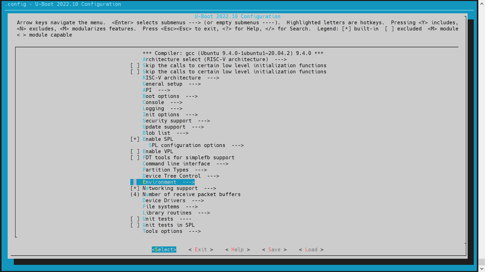

   

   **支持的存储介质**：  
   目前支持的存储介质包括：
   - **MMC 设备**（如 SD 卡或 eMMC）
   - **MTD 设备**（包括 SPI NOR 和 SPI NAND）

3. **配置环境变量的偏移地址**  
   环境变量的偏移地址需要根据分区表的配置来确定。默认偏移地址为 **`0x80000`**。具体配置如下：

   - **对于 SPI NOR 设备**：

     ```shell
     (0x80000) Environment address       # SPI NOR 的 env 偏移地址
     ```

   - **对于 MMC 设备**：

     ```shell
     (0x80000) Environment offset        # MMC 设备的 env 偏移地址
     ```

### MMC 驱动配置与调试

本章节介绍如何配置和调试 U-Boot 中的 MMC 驱动，包括 eMMC 和 SD 卡的配置。

eMMC 和 SD 卡都使用 MMC 驱动，设备编号分别为：

- **eMMC**: dev number = 2
- **SD 卡**: dev number = 0

1. **config 配置**
   - **进入 `make menuconfig`**  
   执行以下命令进入配置菜单：

     ```shell
     make menuconfig
     ```

   - **进入 MMC Host controller Support**  
   在 `make menuconfig` 菜单中，选择 **Device Drivers** -> **MMC Host controller Support**，开启以下配置：

      

2. **dts 配置**
在 U-Boot 的设备树配置中，需要为 eMMC 和 SD 卡配置设备树节点。
**示例配置**：

```c
//uboot-2022.10/arch/riscv/dts/k1-x.dtsi
         sdhci0: sdh@d4280000 {
             compatible = "spacemit,k1-x-sdhci";
             reg = <0x0 0xd4280000 0x0 0x200>;
             interrupt-parent = <&intc>;
             interrupts = <99>;
             resets = <&reset RESET_SDH_AXI>,
                      <&reset RESET_SDH0>;
             reset-names = "sdh_axi", "sdh0";
             clocks = <&ccu CLK_SDH0>,
                      <&ccu CLK_SDH_AXI>;
             clock-names = "sdh-io", "sdh-core";
             status = "disabled";
         };

         sdhci2: sdh@d4281000 {
             compatible = "spacemit,k1-x-sdhci";
             reg = <0x0 0xd4281000 0x0 0x200>;
             interrupt-parent = <&intc>;
             interrupts = <101>;
             resets = <&reset RESET_SDH_AXI>,
                      <&reset RESET_SDH2>;
             reset-names = "sdh_axi", "sdh2";
             clocks = <&ccu CLK_SDH2>,
                      <&ccu CLK_SDH_AXI>;
             clock-names = "sdh-io", "sdh-core";
             status = "disabled";
         };

//uboot-2022.10/arch/riscv/dts/k1-x_deb1.dts
&sdhci0 {
        pinctrl-names = "default";
        pinctrl-0 = <&pinctrl_mmc1 &gpio80_pmx_func0>;
        bus-width = <4>;
        cd-gpios = <&gpio 80 0>;
        cd-inverted;
        cap-sd-highspeed;
        sdh-phy-module = <0>;
        status = "okay";
};

/* eMMC */
&sdhci2 {
        bus-width = <8>;
        non-removable;
        mmc-hs400-1_8v;
        mmc-hs400-enhanced-strobe;
        sdh-phy-module = <1>;
        status = "okay";
};
```

3. **调试验证**
U-Boot Shell 提供了命令行工具用于调试 MMC 驱动。需要开启编译配置项 `CONFIG_CMD_MMC`。

```shell
=> mmc list
sdh@d4280000: 0 (SD)
sdh@d4281000: 2 (eMMC)
=> mmc dev 2 #切换到emmc
switch to partitions #0, OK
mmc2(part 0) is current device

#read 0偏移的0x1000个blk_cnt到内存0x40000000
=> mmc read 0x40000000 0 0x1000

MMC read: dev # 2, block # 0, count 4096 ... 4096 blocks read: OK

#从内存地址0x40000000 写到0x1000个blk_cnt到0偏移
=> mmc write 0x40000000 0 0x1000

MMC write: dev # 2, block # 0, count 4096 ... 4096 blocks written: OK

#其他用法可参考mmc -h
```

4. **常用接口**
参考 `cmd/mmc.c` 中的接口实现，了解更多信息。

### NVMe 驱动配置与调试

NVMe 驱动主要用于调试 SSD 硬盘。以下内容将介绍如何配置和调试 NVMe 驱动。

1. **config 配置**
   **进入 `make menuconfig`**  
   执行以下命令进入配置菜单：

   ```shell
   make menuconfig
   ```

   **进入 Device Drivers**  
   在 `make menuconfig` 菜单中，进入 **Device Drivers**，开启以下配置：

   

   

2. **dts 配置**
在 U-Boot 的设备树配置中，需要为 NVMe 驱动配置设备树节点。
**示例配置**：

```c
//uboot-2022.10/arch/riscv/dts/k1-x.dtsi
         pcie1_rc: pcie@ca400000 {
             compatible = "k1x,dwc-pcie";
             reg = <0x0 0xca400000 0x0 0x00001000>, /* dbi */
                   <0x0 0xca700000 0x0 0x0001ff24>, /* atu registers */
                   <0x0 0x90000000 0x0 0x00100000>, /* config space */
                   <0x0 0xd4282bd4 0x0 0x00000008>, /*k1x soc config addr*/
                   <0x0 0xc0c20000 0x0 0x00001000>, /* phy ahb */
                   <0x0 0xc0c10000 0x0 0x00001000>, /* phy addr */
                   <0x0 0xd4282bcc 0x0 0x00000008>, /* conf0 addr */
                   <0x0 0xc0b10000 0x0 0x00001000>; /* phy0 addr */
             reg-names = "dbi", "atu", "config", 
                            "k1x_conf", "phy_ahb", 
                            "phy_addr", "conf0_addr", 
                            "phy0_addr";

             k1x,pcie-port = <1>;
             clocks = <&ccu CLK_PCIE1>;
             clock-names = "pcie-clk";
             resets = <&reset RESET_PCIE1>;
             reset-names = "pcie-reset";

             bus-range = <0x00 0xff>;
             max-link-speed = <2>;
             num-lanes = <2>;
             num-viewport = <8>;
             device_type = "pci";
             #address-cells = <3>;
             #size-cells = <2>;
             ranges = <0x01000000 0x0 0x90100000 
                          0 0x90100000 0x0 0x100000>,
                  <0x02000000 0x0 0x90200000 
                      0 0x90200000 0x0 0x0fe00000>;

             interrupts = <142>, <146>;
             interrupt-parent = <&intc>;
             #interrupt-cells = <1>;
             interrupt-map-mask = <0 0 0 0x7>;
             interrupt-map = <0000 0 0 1 &pcie1_intc 1>, /* int_a */
                     <0000 0 0 2 &pcie1_intc 2>, /* int_b */
                     <0000 0 0 3 &pcie1_intc 3>, /* int_c */
                     <0000 0 0 4 &pcie1_intc 4>; /* int_d */
             linux,pci-domain = <1>;
             status = "disabled";
             pcie1_intc: interrupt-controller@0 {
                 interrupt-controller;
                 reg = <0 0 0 0 0>;
                 #address-cells = <0>;
                 #interrupt-cells = <1>;
             };
         };

//uboot-2022.10/arch/riscv/dts/k1-x_deb1.dts
 &pcie1_rc {
     pinctrl-names = "default";
     pinctrl-0 = <&pinctrl_pcie1_3>;
     status = "okay";
 };
```

3. **调试验证**
需要开启编译配置 `CONFIG_CMD_NVME`，调试方法如下：

```shell
=> nvme scan
=> nvme detail
Blk device 0: Optional Admin Command Support:
        Namespace Management/Attachment: no
        Firmware Commit/Image download: yes
        Format NVM: yes
        Security Send/Receive: yes
Blk device 0: Optional NVM Command Support:
        Reservation: yes
        Save/Select field in the Set/Get features: yes
        Write Zeroes: yes
        Dataset Management: yes
        Write Uncorrectable: yes
Blk device 0: Format NVM Attributes:
        Support Cryptographic Erase: No
        Support erase a particular namespace: Yes
        Support format a particular namespace: Yes
Blk device 0: LBA Format Support:
        LBA Foramt 0 Support: (current)
                Metadata Size: 0
                LBA Data Size: 512
                Relative Performance: Good
Blk device 0: End-to-End DataProtect Capabilities:
        As last eight bytes: No
        As first eight bytes: No
        Support Type3: No
        Support Type2: No
        Support Type1: No
Blk device 0: Metadata capabilities:
        As part of a separate buffer: No
        As part of an extended data LBA: No
=> nvme read/write addr blk_off blk_cnt
```

4. **常用接口**
参考 `cmd/nvme.c` 中的代码接口，了解更多信息。

### 网络配置（Net）

本节介绍如何配置和调试 U-Boot 中的网络功能，包括以太网接口的配置和调试。

1. **config 配置**

   **进入 `make menuconfig`**  
   执行以下命令进入配置菜单：

   ```shell
   make menuconfig
   ```

   **开启网络相关配置**  
   在 `make menuconfig` 菜单中，进入 **Device Drivers**，开启以下配置：

   

   

2. **dts 配置**
在 U-Boot 的设备树配置中，需要为以太网接口配置设备树节点。
**示例配置**：

```c
//uboot-2022.10/arch/riscv/dts/k1-x.dtsi
         eth0: ethernet@cac80000 {
             compatible = "spacemit,k1x-emac";
             reg = <0x00000000 0xCAC80000 0x00000000 0x00000420>;
             ctrl-reg = <0x3e4>;
             dline-reg = <0x3e8>;
             clocks = <&ccu CLK_EMAC0_BUS>;
             clock-names = "emac-clk";
             resets = <&reset RESET_EMAC0>;
             reset-names = "emac-reset";
             status = "disabled";
         };

//uboot-2022.10/arch/riscv/dts/k1-x_deb1.dts
 &eth0 {
     status = "okay";
     pinctrl-names = "default";
     pinctrl-0 = <&pinctrl_gmac0>;

     phy-reset-pin = <110>;

     clk_tuning_enable;
     clk-tuning-by-delayline;
     tx-phase = <90>;
     rx-phase = <73>;

     phy-mode = "rgmii";
     phy-addr = <1>;
     phy-handle = <&rgmii>;

     ref-clock-from-phy;

     mdio {
         #address-cells = <0x1>;
         #size-cells = <0x0>;
         rgmii: phy@0 {
             compatible = "ethernet-phy-id001c.c916";
             device_type = "ethernet-phy";
             reg = <0x1>;
         };
     };
 };
```

3. **调试验证**
需要先开启编译配置 `CONFIG_CMD_NET`，并确保网线已连接到开发板的网口，且已经准备好 TFTP 服务器（TFTP 服务器的搭建方法可参考网上资料，这里不做介绍）。
**调试命令示例**：

```shell
=> dhcp #执行dhcp后，如果返回地址，表示与网络服务器联通。其他情况为连接失败
ethernet@cac80000 Waiting for PHY auto negotiation to complete...... done
emac_adjust_link link:1 speed:1000 duplex:full
BOOTP broadcast 1
BOOTP broadcast 2
BOOTP broadcast 3
BOOTP broadcast 4
BOOTP broadcast 5
BOOTP broadcast 6
BOOTP broadcast 7
DHCP client bound to address 10.0.92.130 (7982 ms)

=> tftpboot 0x40000000 site11/uImage.itb
ethernet@cac80000 Waiting for PHY auto negotiation to complete...... done
emac_adjust_link link:1 speed:1000 duplex:full
Using ethernet@cac80000 device
TFTP from server 10.0.92.134; our IP address is 10.0.92.130
Filename 'site11/uImage.itb'.
Load address: 0x40000000
Loading: ##############################################################
         ########
         1.1 MiB/s
done
Bytes transferred = 66900963 (3fcd3e3 hex)
=>

#启动kernel
=>bootm 0x40000000 
```

4. **常用接口**

参考 `cmd/net.c` 中的代码接口，了解更多信息。

### SPI 配置与调试

SPI（Serial Peripheral Interface）是一种常用的串行通信协议，用于连接微控制器和各种外围设备。在 U-Boot 中，SPI 驱动用于支持 NAND 或 NOR Flash。

1. **config 配置**
**进入 `make menuconfig`**  
   执行以下命令进入配置菜单：

   ```shell
   make menuconfig
   ```

   **进入 Device Drivers**  
   在 `make menuconfig` 菜单中，进入 **Device Drivers**，开启以下配置：

   

   

2. **dts 配置**
   在 U-Boot 的设备树配置中，需要为 SPI 接口配置设备树节点。

   **示例配置**：

```c
//k1-x.dtsi
/dts-v1/;

/ {
        compatible = "spacemit,k1x", "riscv";
        #address-cells = <2>;
        #size-cells = <2>;

        soc:soc {
                compatible = "simple-bus";
                #address-cells = <2>;
                #size-cells = <2>;
                ranges;

                qspi: spi@d420c000 {
                        compatible = "spacemit,k1x-qspi";
                        #address-cells = <1>;
                        #size-cells = <0>;
                        reg = <0x0 0xd420c000 0x0 0x1000>,
                              <0x0 0xb8000000 0x0 0xd00000>;
                        reg-names = "qspi-base", "qspi-mmap";
                        qspi-sfa1ad = <0xa00000>;
                        qspi-sfa2ad = <0xb00000>;
                        qspi-sfb1ad = <0xc00000>;
                        qspi-sfb2ad = <0xd00000>;
                        clocks = <&ccu CLK_QSPI>,
                                <&ccu CLK_QSPI_BUS>;
                        clock-names = "qspi_clk", "qspi_bus_clk";
                        resets = <&reset RESET_QSPI>,
                                <&reset RESET_QSPI_BUS>;
                        reset-names = "qspi_reset", "qspi_bus_reset";
                        qspi-pmuap-reg = <0xd4282860>;
                        spi-max-frequency = <26500000>;
                        qspi-id = <4>;
                        status = "disabled";
                };
        };
};

//k1-x_deb1.dts
&qspi {
        status = "okay";
        pinctrl-names = "default";
        pinctrl-0 = <&pinctrl_qspi>;
};
```

3. **调试验证**

   需要开启 U-Boot Shell 中的 `sspi` 命令配置 `CONFIG_CMD_SPI`。

   **调试命令：**

```c
sspi -h

    "SPI utility command",
    "[<bus>:]<cs>[.<mode>][@<freq>] <bit_len> <dout> - Send and receive bits\n"
    "<bus>     - Identifies the SPI bus\n"
    "<cs>      - Identifies the chip select\n"
    "<mode>    - Identifies the SPI mode to use\n"
    "<freq>    - Identifies the SPI bus frequency in Hz\n"
    "<bit_len> - Number of bits to send (base 10)\n"
    "<dout>    - Hexadecimal string that gets sent"

```

4. **常用接口**

   参考 `cmd/spi.c` 中的代码接口，了解更多信息。

### NAND 配置与调试

NAND 驱动基于 SPI 接口实现，因此需要先开启 SPI 驱动功能。以下内容将介绍如何配置和调试 NAND 驱动。

1. **config 配置**
  执行以下命令进入配置菜单：

   ```shell
   make menuconfig
   ```

   **进入 Device Drivers -> MTD Support**  
   在 `make menuconfig` 菜单中，进入 **Device Drivers** -> **MTD Support**，开启以下配置：

   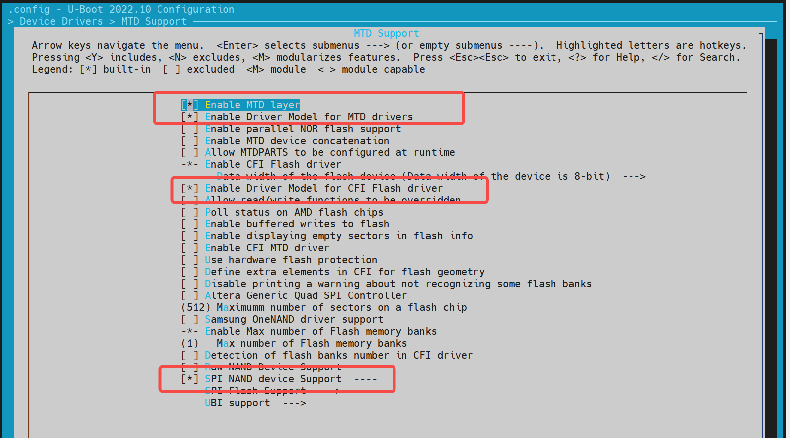

   若需要新增一个 NAND Flash，可以根据已支持的厂商驱动，添加该 NAND Flash 的 JEDEC ID。

   **示例**：

```shell
~/uboot-2022.10$ ls drivers/mtd/nand/spi/*.c -l
drivers/mtd/nand/spi/core.c
drivers/mtd/nand/spi/gigadevice.c
drivers/mtd/nand/spi/macronix.c
drivers/mtd/nand/spi/micron.c
drivers/mtd/nand/spi/other.c
drivers/mtd/nand/spi/toshiba.c
drivers/mtd/nand/spi/winbond.c
```

如在 `gigadevice` 添加新的 Flash:

```c
//uboot-2022.10/drivers/mtd/nand/spi/gigadevice.c
 static const struct spinand_info gigadevice_spinand_table[] = {
     SPINAND_INFO("GD5F1GQ4UExxG", 0xd1,
              NAND_MEMORG(1, 2048, 128, 64, 1024, 1, 1, 1),
              NAND_ECCREQ(8, 512),
              SPINAND_INFO_OP_VARIANTS(&gd5fxgq4_read_cache_variants,
                           &write_cache_variants,
                           &update_cache_variants),
              0,
              SPINAND_ECCINFO(&gd5fxgqxxexxg_ooblayout,
                      gd5fxgq4xexxg_ecc_get_status)),
     SPINAND_INFO("GD5F1GQ5UExxG", 0x51,
              NAND_MEMORG(1, 2048, 128, 64, 1024, 1, 1, 1),
              NAND_ECCREQ(4, 512),
              SPINAND_INFO_OP_VARIANTS(&gd5f1gq5_read_cache_variants,
                           &write_cache_variants,
                           &update_cache_variants),
              0,
              SPINAND_ECCINFO(&gd5fxgqxxexxg_ooblayout,
                      gd5fxgq5xexxg_ecc_get_status)),
 };
```

**说明**：如果是其他品牌的 NAND Flash，可以参考 `gigadevice` 的驱动代码实现。

2. **dts 配置**

   NAND 驱动挂在 SPI 驱动下，因此需要在 SPI 节点下配置。

   **示例配置**：

```c
 &qspi {
     status = "okay";
     pinctrl-names = "default";
     pinctrl-0 = <&pinctrl_qspi>;

     spi-nand@0 {
         compatible = "spi-nand";
         reg = <0>;
         spi-tx-bus-width = <1>;
         spi-rx-bus-width = <1>;
         spi-max-frequency = <6250000>;
         u-boot,dm-spl;
         status = "okay";
     };
 };
```

3. **调试验证**
NAND 驱动可以基于 MTD 命令进行调试。需要开启 U-Boot Shell 中的 `CONFIG_CMD_MTD` 配置。
**调试命令**：

```shell
=> mtd
mtd - MTD utils

Usage:
mtd - generic operations on memory technology devices

mtd list
mtd read[.raw][.oob]                  <name> <addr> [<off> [<size>]]
mtd dump[.raw][.oob]                  <name>        [<off> [<size>]]
mtd write[.raw][.oob][.dontskipff]    <name> <addr> [<off> [<size>]]
mtd erase[.dontskipbad]               <name>        [<off> [<size>]]

Specific functions:
mtd bad                               <name>

With:
        <name>: NAND partition/chip name (or corresponding DM device name or OF path)
        <addr>: user address from/to which data will be retrieved/stored
        <off>: offset in <name> in bytes (default: start of the part)
                * must be block-aligned for erase
                * must be page-aligned otherwise
        <size>: length of the operation in bytes (default: the entire device)
                * must be a multiple of a block for erase
                * must be a multiple of a page otherwise (special case: default is a page with dump)

The .dontskipff option forces writing empty pages, don't use it if unsure.

=> mtd list
[RESET]spacemit_reset_set assert=1, id=77
[RESET]spacemit_reset_set assert=1, id=78
clk qspi_bus_clk already disabled
clk qspi_clk already disabled
ccu_mix_set_rate of qspi_clk timeout
[RESET]spacemit_reset_set assert=0, id=77
[RESET]spacemit_reset_set assert=0, id=78
SF: Detected w25q32 with page size 256 Bytes, erase size 64 KiB, total 4 MiB
Could not find a valid device for spi-nand
List of MTD devices:
* nor0
  - device: flash@0
  - parent: spi@d420c000
  - driver: jedec_spi_nor
  - path: /soc/spi@d420c000/flash@0
  - type: NOR flash
  - block size: 0x10000 bytes
  - min I/O: 0x1 bytes
  - 0x000000000000-0x000000400000 : "nor0"
          - 0x0000000a0000-0x000000100000 : "opensbi"
          - 0x000000100000-0x000000300000 : "uboot"
=> mtd read/write partname addr off size
```

4. 常用接口
参考 `cmd/mtd.c` 中的代码接口，了解更多信息。

### NOR 配置与调试

NOR 驱动基于 SPI 接口实现，因此需要先开启 SPI 驱动功能。以下内容将介绍如何配置和调试 NOR 驱动。

1. **config 配置**

   **进入 `make menuconfig`**  
   执行以下命令进入配置菜单：

   ```shell
   make menuconfig
   ```

   **进入 Device Drivers -> MTD Support -> SPI Flash Support**  
   在 `make menuconfig` 菜单中，进入 **Device Drivers** -> **MTD Support** -> **SPI Flash Support**，开启以下配置：

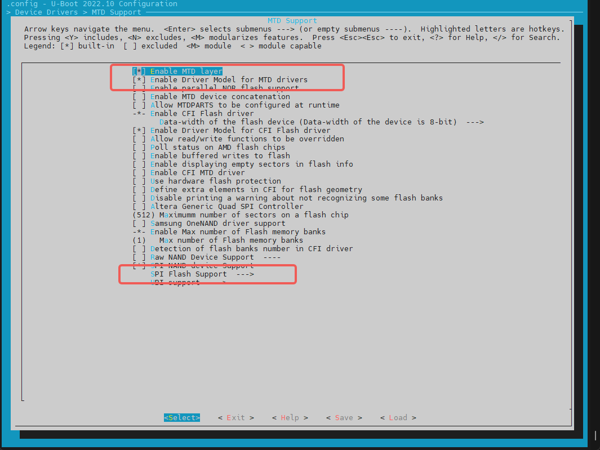

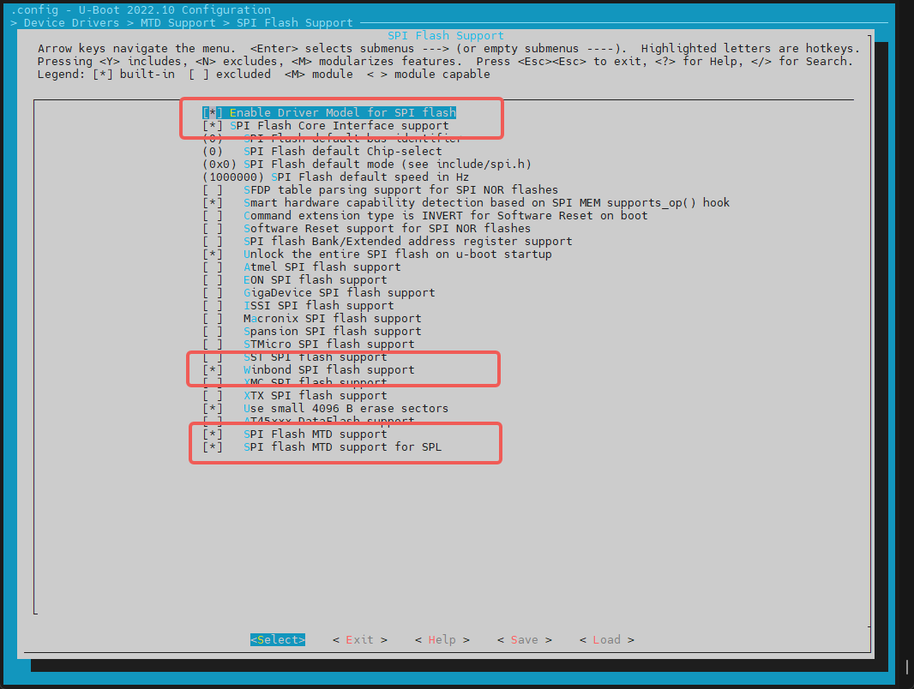

**添加一个新的  SPI NOR Flash**

- 对于已支持的厂商 NOR Flash，可以直接开启对应的编译配置。例如，对于 GigaDevice 厂商的 Flash，可以开启对应的配置。
- **检查 JEDEC ID 列表**：SPI Flash 的 JEDEC ID 列表在 `uboot-2022.10/drivers/mtd/spi/spi-nor-ids.c` 文件中维护。如果列表中没有特定的 NOR Flash JEDEC ID，可以自行添加。（JEDEC ID 为 SPI Flash 对应的厂商代号，可根据 NOR Flash 的 数据手册 中查找 `manufac` 关键字，如 winbond 为 `0xfe`）

2. **dts 配置**
   NOR 驱动依赖 SPI 驱动接口，因此需要在 SPI 节点下添加 NOR Flash 的设备树节点。

   **示例配置**：

```c
//k1/uboot-2022.10/arch/riscv/dts/k1-x_deb1.dts
 &qspi {
     status = "okay";
     pinctrl-names = "default";
     pinctrl-0 = <&pinctrl_qspi>;

     flash@0 {
         compatible = "jedec,spi-nor";
         reg = <0>;
         spi-max-frequency = <26500000>;
         m25p,fast-read;
         broken-flash-reset;
         status = "okay";
     };
 };
```

3. **调试验证**
   NOR 驱动可以通过 U-Boot 命令行的 `mtd` 和 `sf` 命令进行调试。需要确保编译配置中开启了 `CONFIG_CMD_MTD=y` 和 `CONFIG_CMD_SF`。

   基于 `mtd` 命令读写 NOR Flash

```shell
=> mtd list
List of MTD devices:
* nor0
  - device: flash@0
  - parent: spi@d420c000
  - driver: jedec_spi_nor
  - path: /soc/spi@d420c000/flash@0
  - type: NOR flash
  - block size: 0x1000 bytes
  - min I/O: 0x1 bytes
  - 0x000000000000-0x000000400000 : "nor0"
          - 0x0000000a0000-0x0000000e0000 : "opensbi"
          - 0x000000100000-0x000000200000 : "uboot"
=>

=> mtd
mtd - MTD utils

Usage:
mtd - generic operations on memory technology devices

mtd list
mtd read[.raw][.oob]                  <name> <addr> [<off> [<size>]]
mtd dump[.raw][.oob]                  <name>        [<off> [<size>]]
mtd write[.raw][.oob][.dontskipff]    <name> <addr> [<off> [<size>]]
mtd erase[.dontskipbad]               <name>        [<off> [<size>]]

Specific functions:
mtd bad                               <name>

With:
        <name>: NAND partition/chip name (or corresponding DM device name or OF path)
        <addr>: user address from/to which data will be retrieved/stored
        <off>: offset in <name> in bytes (default: start of the part)
                * must be block-aligned for erase
                * must be page-aligned otherwise
        <size>: length of the operation in bytes (default: the entire device)
                * must be a multiple of a block for erase
                * must be a multiple of a page otherwise (special case: default is a page with dump)

The .dontskipff option forces writing empty pages, don't use it if unsure.

=>
=> mtd read uboot 0x40000000
Reading 1048576 byte(s) at offset 0x00000000
=> mtd dump uboot 0 0x10
Reading 16 byte(s) at offset 0x00000000

Dump 16 data bytes from 0x0:
0x00000000:     d0 0d fe ed 00 0d e8 95  00 00 00 38 00 0d e4 44
=>
```

基于 `sf` 命令读写 NOR Flash

```shell
=> sf
sf - SPI flash sub-system

Usage:
sf probe [[bus:]cs] [hz] [mode] - init flash device on given SPI bus
                                  and chip select
sf read addr offset|partition len       - read `len' bytes starting at
                                          `offset' or from start of mtd
                                          `partition'to memory at `addr'
sf write addr offset|partition len      - write `len' bytes from memory
                                          at `addr' to flash at `offset'
                                          or to start of mtd `partition'
sf erase offset|partition [+]len        - erase `len' bytes from `offset'
                                          or from start of mtd `partition'
                                         `+len' round up `len' to block size
sf update addr offset|partition len     - erase and write `len' bytes from memory
                                          at `addr' to flash at `offset'
                                          or to start of mtd `partition'
sf protect lock/unlock sector len       - protect/unprotect 'len' bytes starting
                                          at address 'sector'
=> sf probe
SF: Detected w25q32 with page size 256 Bytes, erase size 4 KiB, total 4 MiB
=> sf read 0x40000000 0 0x10
device 0 offset 0x0, size 0x10
SF: 16 bytes @ 0x0 Read: OK
=>
```

4. **常用接口**

```c
include <spi.h>
#include <spi_flash.h>

struct udevice *new, *bus_dev;
int ret;
static struct spi_flash *flash;

//bus,cs对应spi的bus和cs编号，如0，0
ret = spi_find_bus_and_cs(bus, cs, &bus_dev, &new);
flash = spi_flash_probe(bus, cs, speed, mode);

ret = spi_flash_read(flash, offset, len, buf);
```

### HDMI 配置与调试

本小节主要介绍如何开启 HDMI 驱动。

1. **config 配置**

   **进入 `make uboot_menuconfig`**  
   执行以下命令进入配置菜单：

   ```shell
   make uboot_menuconfig
   ```

   **进入 Device Drivers -> Graphics support**  
   在 `make uboot_menuconfig` 菜单中，进入 **Device Drivers** -> **Graphics support**，开启以下配置(默认情况下已开启)。


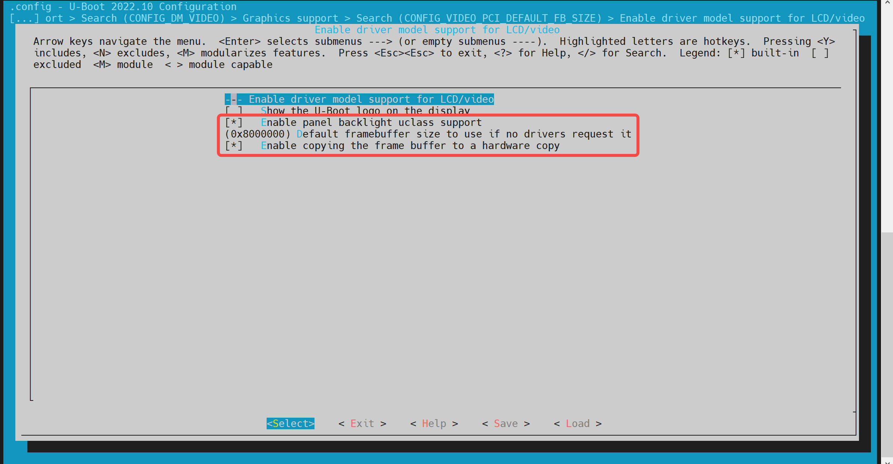


2. **dts 配置**

   在设备树配置中，需要为 HDMI 驱动配置设备树节点。

   **示例配置**：

```c
&dpu {
        status = "okay";
};

&hdmi {
        pinctrl-names = "default";
        pinctrl-0 = <&pinctrl_hdmi_0>;
        status = "okay";
};
```

### Boot Logo 配置与显示

本小节主要介绍如何在 U-Boot 启动阶段显示 Boot Logo。

1. **config 配置**

   - **开启 HDMI 支持**: 首先，确保 U-Boot 已开启 HDMI 支持。具体步骤可以参考 **HDMI 配置与调试** 小节。

   - **开启 Boot Logo 支持**  
   执行以下命令进入配置菜单：

     ```shell
     make menuconfig
     ```

     在 `make menuconfig` 菜单中，进入 **Device Drivers** -> **Graphics support**，开启以下选项：

     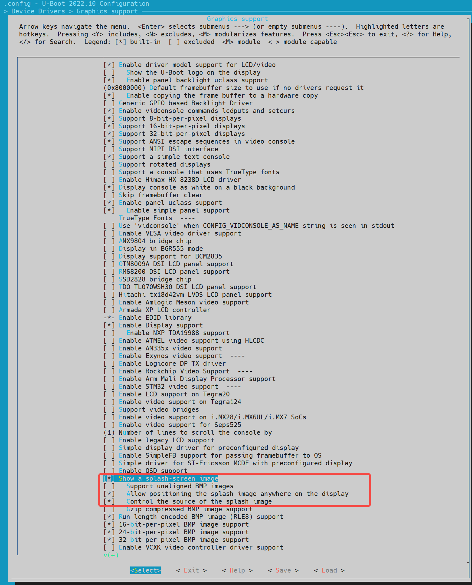

2. **env 配置**

   在 U-Boot 的配置文件中，需要添加 Boot Logo 所需的环境变量。这些变量包括 `splashimage`、`splashpos` 和 `splashfile`。

   **示例配置**：在 uboot-2022.10\include\configs 目录下的 `k1-x.h` 增加 Boot Logo 所需的 3 个 env 变量：`splashimage`、`splashpos` 和 `splashfile`。

```c
//uboot-2022.10/include/configs/k1-x.h
    ... ...
    ... ...
 #define CONFIG_EXTRA_ENV_SETTINGS \
        ... ...
        ... ...
     "splashimage=" __stringify(CONFIG_FASTBOOT_BUF_ADDR) "\0" \
     "splashpos=m,m\0" \
     "splashfile=bianbu.bmp\0" \

        ... ...
        ... ...
     BOOTENV_DEVICE_CONFIG \
     BOOTENV

 #endif /* __CONFIG_H */
```

**说明**：

- `splashimage`：Boot Logo 图片加载到内存的地址。
- `splashpos`：图片显示的位置。`"m,m"` 表示图片显示在屏幕正中间。
- `splashfile`：将要显示的 BMP 文件名。该文件需要放在 bootfs 所在的分区。

3. **打包 BMP 图片进 BootFS**

   将 Boot Logo 的 BMP 图片打包进 BootFS：

   - **准备图片文件**  
   将 `bianbu.bmp` 文件放在 `./buildroot-ext/board/spacemit/k1` 目录下。文件名需要与 `buildroot-ext/board/spacemit/k1/prepare_img.sh` 中的 `UBOOT_LOGO_FILE` 和环境变量 `splashfile` 保持一致。

   - **修改打包脚本**  
   确保 `prepare_img.sh` 脚本中正确引用了 `bianbu.bmp` 文件：

   - **编译打包**  
   在编译打包后，BMP 图片将被打包进 BootFS。

```shell
//buildroot-ext/board/spacemit/k1/prepare_img.sh
#!/bin/bash

######################## Prepare sub-iamges and pack ####################
#$0 is this file path
#$1 is buildroot output images dir

IMGS_DIR=$1
DEVICE_DIR=$(dirname $0)

... ...

UBOOT_LOGO_FILE="$DEVICE_DIR/bianbu.bmp"

```

4. 修改 Boot Logo

   如果需要修改 Boot Logo, 直接替换 `buildroot-ext/board/spacemit/k1/` 目录中的 `bianbu.bmp` 文件。

### Boot Menu 配置与使用

本小节主要介绍如何开启 U-Boot 的 Boot Menu 功能。

1. **config 配置**

   - **进入 `make menuconfig`**  
   执行以下命令进入配置菜单：

     ```shell
     make menuconfig
     ```

   - **进入 Command line interface -> Boot commands**  
   在 `make menuconfig` 菜单中，进入 **Command line interface** -> **Boot commands**，开启以下配置：

     

   - **进入 Boot options -> Autoboot options**  
   再进入 **Boot options** -> **Autoboot options**，开启以下选项：
     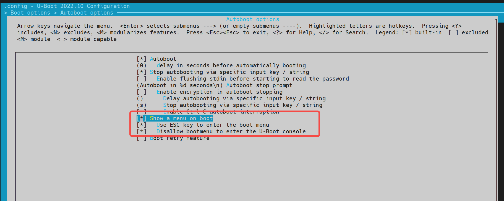

2. **env 配置**
在 `buildroot-ext/board/spacemit/k1/env_k1-x.txt` 文件中，需要添加 `bootdelay` 和 `bootmenu_delay` 环境变量。
例如：
   - `bootmenu_delay=5` 表示系统会在启动菜单界面等待 5 秒，用户可以选择启动选项。
   - `bootdelay=5` 表示选择启动方式后，系统在真正启动前再等待 5 秒。

```c
//buildroot-ext/board/spacemit/k1/env_k1-x.txt
bootdelay=5

# Boot menu definitions
boot_default=echo "Current Boot Device: ${boot_device}"
flash_default=echo "Returning to Boot Menu..."
spacemit_flashing_usb=echo "recovery from usb...... "; \
                      spacemit_flashing usb;
spacemit_flashing_mmc=echo "recovery from mmc...... " \
                      spacemit_flashing mmc;
spacemit_flashing_net=echo "recovery from net...... " \
                      spacemit_flashing net;
bootmenu_delay=5
bootmenu_0="-------- Boot Options --------"=run boot_default
bootmenu_1="Boot from Nor"=run nor_boot
bootmenu_2="Boot from Nand"=run nand_boot
bootmenu_3="Boot from MMC"=run try_mmc
bootmenu_4="Autoboot"=run autoboot
bootmenu_5="Show current Boot Device"=run boot_default
bootmenu_6="-------- Flash Options --------"=run flash_default
bootmenu_7="recovery from usb"=run spacemit_flashing_usb
bootmenu_8="recovery from mmc"=run spacemit_flashing_mmc
bootmenu_9="recovery from net"=run spacemit_flashing_net
```

3. **进入 Boot Menu**
   开发板上电启动后，立即按住键盘上的 `Esc` 键，进入 Boot Menu。

### Fastboot Command 配置与使用

本小节主要介绍 K1-DEB1 方案支持的 Fastboot 命令。

#### 编译配置
开启 Fastboot 支持如下步骤：
- **进入 `make menuconfig`**  
   执行以下命令进入配置菜单：

     ```shell
     make menuconfig
     ```

- **进入 Device Drivers -> Fastboot support**  
   在 `make menuconfig` 菜单中，进入 **Device Drivers** -> **Fastboot support**，开启以下编译配置：

     

- **开启 USB 支持**  
   Fastboot 依赖 USB 驱动，需要开启 USB 的配置 **USB support**：

     

     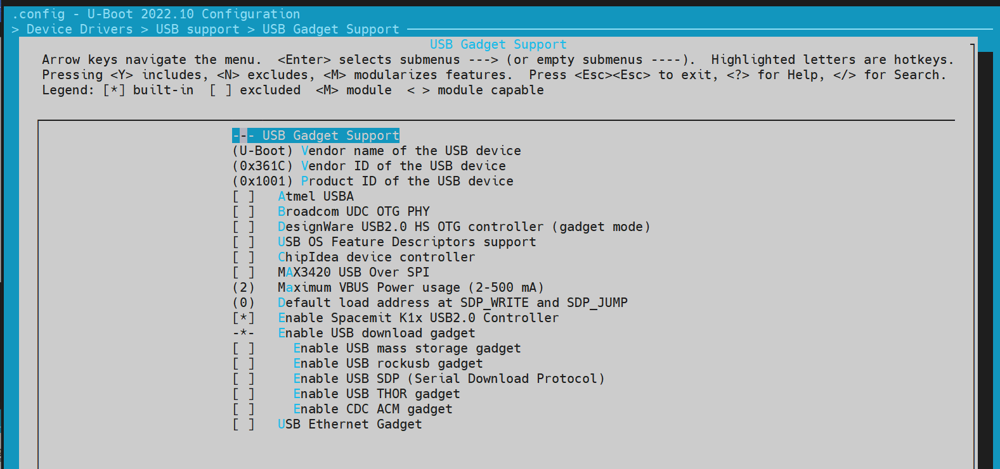

#### 进入 Fastboot 模式

**方法 1**： 通过 U-Boot Shell 进入 Fastboot 模式

- **进入 U-Boot Shell**  
     系统启动后，按 `s` 键进入 U-Boot Shell。

- **执行 Fastboot 命令**  
     执行以下命令进入 Fastboot 模式：

       ```shell
       => fastboot 0
       ```
  系统默认的 Fastboot 缓冲区地址和大小由宏定义 `CONFIG_FASTBOOT_BUF_ADDR` 和 `CONFIG_FASTBOOT_BUF_SIZE` 指定。

```shell
# => fastboot -l 0x30000000 -s 0x10000000 0，指定缓冲区地址和大小

=> fastboot 0 # 进入 Fastboot 模式

# 预期输出：
k1xci_udc: phy_init
k1xci_udc probe
k1xci_udc: pullup 1
-- suspend --
handle setup GET_DESCRIPTOR, 0x80, 0x6 index 0x0 value 0x100 length 0x40
handle setup SET_ADDRESS, 0x0, 0x5 index 0x0 value 0x22 length 0x0
handle setup GET_DESCRIPTOR, 0x80, 0x6 index 0x0 value 0x100 length 0x12
..
```

**方法 2**：**通过 Bianbu OS 进入 Fastboot 模式**
 设备启动到 Bianbu OS 后，发送以下命令使系统重启进入 Fastboot 模式：

   ```shell
   adb reboot bootloader
   ```

   **注**：某些方案可能不支持此功能。

#### 支持的 Fastboot 命令

电脑端的 Fastboot 环境配置，请参考 **电脑环境安装** 章节。

```shell
#fastboot原生协议命令
fastboot devices              #显示可用的设备
fastboot reboot               #重启设备
fastboot getvar [version/product/serialno/max-download-size]
fastboot flash partname image #烧写image镜像到partname分区
fastboot erase partname       #擦除partname分区
fastboot stage file           #下载文件file到内存的buff addr

#oem厂商自定义的命令和功能
fastboot getvar [mtd-size/blk-size] #获取mtd/blk设备size，没有则返回NULL
fastboot oem read part              #读取part中的数据到buff addr
fastboot get_staged file       #上传数据并命名为file。依赖oem read part命令
```

### 文件系统操作

- **FAT**

```shell
=> fat
  fatinfo fatload fatls fatmkdir fatrm fatsize fatwrite
=> fatls mmc 2:5
 50896911   uImage.itb
     4671   env_k1-x.txt

2 file(s), 0 dir(s)

=> fatload mmc 2:5 0x40000000 uImage.itb #load uImage.itb到0x40000000
50896911 bytes read in 339 ms (143.2 MiB/s)
=>
```

- **EXT4**
类似 `fat` 指令

```shell
=> ext4
  ext4load ext4ls ext4size
=> ext4load
ext4load - load binary file from a Ext4 filesystem

Usage:
ext4load <interface> [<dev[:part]> [addr [filename [bytes [pos]]]]]
    - load binary file 'filename' from 'dev' on 'interface'
      to address 'addr' from ext4 filesystem
=>
```

### 常用 U-Boot 命令

本小节主要介绍 U-Boot 中的一些常用命令。

1. **常用命令**

```shell
printenv  - print environment variables
md        - memory display
mw        - memory write (fill)
fdt       - flattened device tree utility commands


help      - print command description/usage
```

2. **fdt 命令**

`fdt` 命令主要用于操作和打印设备树（Device Tree）的内容，例如 U-Boot 启动后加载的 DTB 文件。

```shell
=> fdt
fdt - flattened device tree utility commands

Usage:
fdt addr [-c] [-q] <addr> [<size>]  - Set the [control] fdt location to <addr>
fdt move   <fdt> <newaddr> <length> - Copy the fdt to <addr> and make it active
fdt resize [<extrasize>]            - Resize fdt to size + padding to 4k addr + some optional <extrasize> if needed
fdt print  <path> [<prop>]          - Recursive print starting at <path>
fdt list   <path> [<prop>]          - Print one level starting at <path>
fdt get value <var> <path> <prop> [<index>] - Get <property> and store in <var>
                                      In case of stringlist property, use optional <index>
                                      to select string within the stringlist. Default is 0.
fdt get name <var> <path> <index>   - Get name of node <index> and store in <var>
fdt get addr <var> <path> <prop>    - Get start address of <property> and store in <var>
fdt get size <var> <path> [<prop>]  - Get size of [<property>] or num nodes and store in <var>
fdt set    <path> <prop> [<val>]    - Set <property> [to <val>]
fdt mknode <path> <node>            - Create a new node after <path>
fdt rm     <path> [<prop>]          - Delete the node or <property>
fdt header [get <var> <member>]     - Display header info
                                      get - get header member <member> and store it in <var>
fdt bootcpu <id>                    - Set boot cpuid
fdt memory <addr> <size>            - Add/Update memory node
fdt rsvmem print                    - Show current mem reserves
fdt rsvmem add <addr> <size>        - Add a mem reserve
fdt rsvmem delete <index>           - Delete a mem reserves
fdt chosen [<start> <size>]         - Add/update the /chosen branch in the tree
                                        <start>/<size> - initrd start addr/size
NOTE: Dereference aliases by omitting the leading '/', e.g. fdt print ethernet0.
=>

# 示例操作：
=> fdt addr $fdtcontroladdr # 设置控制设备树的地址
=> fdt print                # 打印整个设备树内容
/ {
        compatible = "spacemit,k1x", "riscv";
        #address-cells = <0x00000002>;
        #size-cells = <0x00000002>;
        model = "spacemit k1-x deb1 board";
... ...
        memory@0 {
                device_type = "memory";
                reg = <0x00000000 0x00000000 0x00000000 0x80000000>;
        };
        chosen {
                bootargs = "earlycon=sbi console=ttyS0,115200 debug loglevel=8,initcall_debug=1 rdinit=/init.tmp";
                stdout-path = "serial0:115200n8";
        };
};

=> fdt print /chosen # 打印特定路径的内容
chosen {
        bootargs = "earlycon=sbi console=ttyS0,115200 debug loglevel=8,initcall_debug=1 rdinit=/init.tmp";
        stdout-path = "serial0:115200n8";
};
=>
```

3. **Shell 命令**
U-Boot 支持 Shell 风格的命令，如 `if/fi` 和 `echo` 等。

```shell
=> if test ${boot_device} = nand; then echo "nand boot"; else echo "not nand boot";fi
not nand boot
=> printenv boot_device
boot_device=nor
=> if test ${boot_device} = nor; then echo "nor boot"; else echo "not nor boot";fi
nor boot
=>
```

## OpenSBI 功能与配置

本章节介绍 OpenSBI 的编译配置

### OpenSBI 编译

```shell
cd ~/opensbi/ # 进入 OpenSBI 目录

# 注意：确保使用正确的编译工具链。这里使用的工具链需要由 SpacemiT 提供，否则可能会引起编译异常

GCC_PREFIX=riscv64-unknown-linux-gnu- # 设置编译工具链

CROSS_COMPILE=${GCC_PREFIX} PLATFORM=generic \
PLATFORM_DEFCONFIG=k1-x_deb1_defconfig \
PLATFORM_RISCV_ISA=rv64gc \
FW_TEXT_START=0x0  \
make
```

### 生成的编译文件

编译完成后，生成的文件位于 `build/platform/generic/firmware/` 目录下：

```shell
~/opensbi$ ls build/platform/generic/firmware/ -l
fw_dynamic.bin     #dynamic镜像跳转会传递配置参数
fw_dynamic.elf
fw_dynamic.elf.dep
fw_dynamic.itb     #将fw_dynamic.bin打包成fit格式
fw_dynamic.its
fw_dynamic.o
fw_jump.bin       #jump镜像仅做跳转
fw_payload.bin    #payload镜像会包含uboot镜像
```

### OpenSBI 功能配置

可以通过执行 `menuconfig`，开启或关闭某些功能

```shell
make PLATFORM=generic PLATFORM_DEFCONFIG=k1-x_deb1_defconfig menuconfig
```

示例配置：


## FAQ

本章节介绍常见问题以及解决方式，或者常用的调试手段以及容易出错的问题记录。

### 用 TitanFlash 烧写固件时，没有检测到设备

- **检查 USB 连接**  
   确保 USB 线已接入电脑，且串口打印正常, 如下所示：
   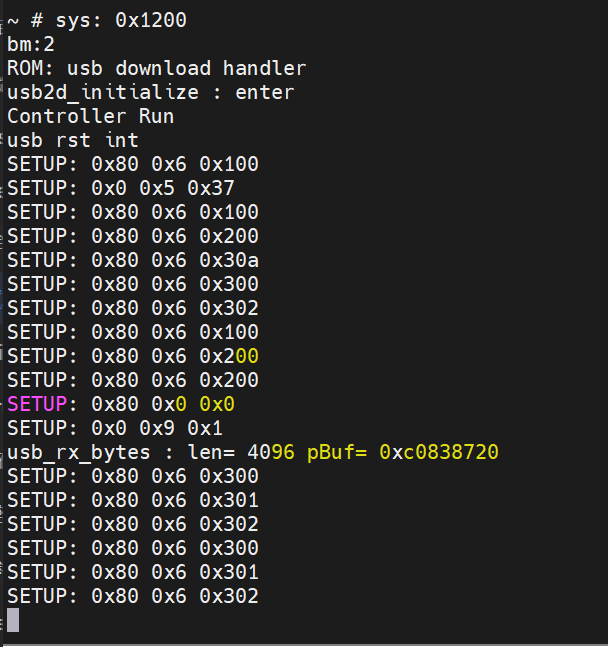

如果串口打印显示设备已连接，但 TitanFlash 仍然无法检测到设备，请检查以下内容：

- **检查设备管理器**  
  在 Windows 设备管理器中，检查是否存在 ADB 设备。如果没有，则需要安装相应的驱动程序。

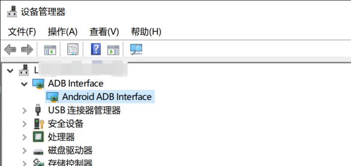

- **参考安装指南**  
  如果设备管理器中没有显示 ADB 设备，请参考 **电脑环境安装章节** 中的 Fastboot 环境安装部分。

### 更新代码后有涉及到def_config的改动，编译的时候没有生效

需要执行 `make menuconfig` 更新到 `.config`，编译才生效。

### U-Boot 和 OpenSBI 合并加载

SDK 设计将 U-Boot 和 OpenSBI 分开加载，但开发者也可以根据需求将两者合并。以下是合并加载的步骤：

**步骤一： SPL 启动配置**

- **取消 U-Boot 的 Second 分区配置**
  在 U-Boot 的配置中，取消选中 **Second partition to use to load U-Boot from**。

- **更改分区名为 `opensbi-uboot`**  
  将分区名改为 `opensbi-uboot`，并重新编译 U-Boot。


**步骤二： 生成 `uboot-opensbi.itb`**

- 创建 `uboot-opensbi.its` 文件，内容如下

```dts
/dts-v1/;

/ {
        description = "U-boot FIT image for k1x";
        #address-cells = <2>;
        fit,fdt-list = "of-list";

        images {
                uboot {
                        description = "U-Boot";
                        type = "standalone";
                        os = "U-Boot";
                        arch = "riscv";
                        compression = "none";
                        load = <0x0 0x00200000>;
                        data = /incbin/("./u-boot-nodtb.bin");
                };

                opensbi {
                        description = "OpenSBI fw_dynamic Firmware";
                        type = "firmware";
                        os = "opensbi";
                        arch = "riscv";
                        compression = "none";
                        load = <0x0 0x0>;
                        entry = <0x0 0x0>;
                        data = /incbin/("./fw_dynamic.bin");
                };
                fdt_14 {
                        description = "k1-x_MUSE-Card";
                        type = "flat_dt";
                        compression = "none";
                        data = /incbin/("./uboot/k1-x_MUSE-Card.dtb");
                };
        };

        configurations {
                default = "conf_14";
                conf_14 {
                        description = "k1-x_MUSE-Card";
                        firmware = "opensbi";
                        loadables = "uboot";
                        fdt = "fdt_14";
                };
        };
};
```

- **生成 `uboot-opensbi.itb` 文件**  
   将以下文件放在同一目录下：
  - `uboot-opensbi.its`
  - `u-boot-nodtb.bin`
  - `fw_dynamic.bin`
  - `k1-x_MUSE-Card.dtb`（根据实际方案名修改）

   执行以下命令生成 `uboot-opensbi.itb` 文件：

   ```shell
   uboot-2022.10/tools/mkimage -f uboot-opensbi.its -r u-boot-opensbi.itb
   ```

**步骤三：更改分区表**

以 `partition_universal.json` 为例，删除 `uboot` 分区，将 `opensbi` 分区名改为 `opensbi-uboot`，分区大小最好为两者的合集，如下：

```sh
~$ cat partition_universal.json 
{
  "version": "1.0",
  "format": "gpt",
  "partitions": [
    {
      "name": "bootinfo",
      "offset": "0",
      "size": "80B",
      "image": "factory/bootinfo_sd.bin"
    },
    {
      "name": "fsbl",
      "offset": "128K",
      "size": "256K",
      "image": "factory/FSBL.bin"
    },
    {
      "name": "env",
      "offset": "384K",
      "size": "64K"
    },
    {
      "name": "opensbi-uboot",
      "offset": "1M",
      "size": "3M",
      "image": "u-boot-opensbi.itb"
    },
    {
      "name": "bootfs",
      "offset": "4M",
      "size": "256M",
      "image": "bootfs.img",
      "compress": "gzip-5"
    },
    {
      "name": "rootfs",
      "size": "-"
    }
  ]
}

```

**步骤四： 更新刷机命令**

以 eMMC 为例：

```sh
fastboot stage factory/FSBL.bin
fastboot continue
#sleep to wait for uboot ready
#linux环境下
sleep 1
#windows环境下
#timeout /t 1 >null   
fastboot stage u-boot-opensbi.itb
fastboot continue

fastboot flash gpt partition_universal.json
#bootinfo_emmc.bin内容无作用。但刷写步骤还需执行
fastboot flash bootinfo factory/bootinfo_emmc.bin
fastboot flash fsbl factory/FSBL.bin
fastboot flash env env.bin
fastboot flash opensbi-uboot u-boot-opensbi.itb
fastboot flash bootfs bootfs.img
fastboot flash rootfs rootfs.ext4
```

**使用 TitanFlasher**

如果使用 SpacemiT 提供的 TitanFlasher 工具，则需将刷机包中的 `fastboot.yaml` 文件中的 `u-boot.itb` 名称改为 **`u-boot-opensbi.itb`**。

### eMMC 启动定义 FSBL 的位置

只有 eMMC 会有 boot0 和 user 区域的区别，而 NOR、NAND、SD 卡等启动介质只有一个存储区域。硬件设定从 boot 区域加载 `bootinfo` 和 `fsbl`，因此 `bootinfo` 和 `fsbl` 不能放到 user 区域。

刷机时，eMMC 的 `bootinfo` 信息是固定在 U-Boot 代码里面的 `fastboot_oem_flash_bootinfo` 函数中。目的是为了同一份 `partition_universal.json` 分区表可以用于制作卡启动等作用。

**如何修改 FSBL 的加载偏移**
如果需要修改 eMMC 的 FSBL 加载偏移，可以直接修改以下代码：

```sh
//uboot-2022.10/drivers/fastboot/fb_mmc.c
516 void fastboot_mmc_flash_write(const char *cmd, void *download_buffer,
517                   u32 download_bytes, char *response)
518 {
        ... ...
        
554     if (strcmp(cmd, "bootinfo") == 0) {
555         printf("flash bootinfo\n");
556         fastboot_oem_flash_bootinfo(cmd, fastboot_buf_addr, download_bytes,
557                                     response, fdev);
558         return;
559     }


//uboot-2022.10/drivers/fastboot/fb_spacemit.c
 816 void fastboot_oem_flash_bootinfo(const char *cmd, void *download_buffer,
 817         u32 download_bytes, char *response, struct flash_dev *fdev)
 818 {

 830     /*fill up emmc bootinfo*/
 831     struct boot_parameter_info *boot_info;
 832     boot_info = (struct boot_parameter_info *)download_buffer;
 833     memset(boot_info, 0, sizeof(boot_info));
 834     boot_info->magic_code = BOOT_INFO_EMMC_MAGICCODE;
 835     boot_info->version_number = BOOT_INFO_EMMC_VERSION;
 836     boot_info->page_size = BOOT_INFO_EMMC_PAGESIZE;
 837     boot_info->block_size = BOOT_INFO_EMMC_BLKSIZE;
 838     boot_info->total_size = BOOT_INFO_EMMC_TOTALSIZE;
 839     boot_info->spl0_offset = BOOT_INFO_EMMC_SPL0_OFFSET;
 840     boot_info->spl1_offset = BOOT_INFO_EMMC_SPL1_OFFSET;
 841     boot_info->spl_size_limit = BOOT_INFO_EMMC_LIMIT;
 842     strcpy(boot_info->flash_type, "eMMC");
 843     boot_info->crc32 = crc32_wd(0, (const uchar *)boot_info, 0x40, CHUNKSZ_CRC32);
 844 
 845     /*flash bootinfo*/

```

对于 eMMC 的 boot0，Fastboot 刷机服务会对 `bootinfo` 和 `fsbl` 分区做特殊处理，将镜像文件写到 boot0 区域。具体可以参考 `uboot-2022.10/drivers/fastboot/fb_mmc.c::fastboot_mmc_flash_write` 中的 `if (strcmp(cmd, "bootinfo") == 0)` 和 `if (strcmp(cmd, CONFIG_FASTBOOT_MMC_BOOT1_NAME) == 0)` 分支。

```sh
//uboot-2022.10/drivers/fastboot/fb_mmc.c
void fastboot_mmc_flash_write(const char *cmd, void *download_buffer,
517                   u32 download_bytes, char *response)
518 {

554     if (strcmp(cmd, "bootinfo") == 0) {
555         printf("flash bootinfo\n");
556         fastboot_oem_flash_bootinfo(cmd, fastboot_buf_addr, download_bytes,
557                                     response, fdev);
558         return;
559     }

563 #ifdef CONFIG_FASTBOOT_MMC_BOOT_SUPPORT
564     if (strcmp(cmd, CONFIG_FASTBOOT_MMC_BOOT1_NAME) == 0) {
565         dev_desc = fastboot_mmc_get_dev(response);
566         if (dev_desc){
567 #ifdef CONFIG_SPACEMIT_FLASH
568             flash_mmc_boot_op(dev_desc, download_buffer, 1,
569                     download_bytes, BOOT_INFO_EMMC_SPL0_OFFSET);
570             fastboot_okay(NULL, response);
571 #else
572             fb_mmc_boot_ops(dev_desc, download_buffer, 1,
573                     download_bytes, response);
574 #endif
575         }
576         return;
577     }
```

### SD 卡上的 `bootinfo` 在 0 地址是否会与 GPT 表冲突

`bootinfo_sd.bin` 放在 SD 卡的 0 地址，不会与 GPT 表冲突（GPT 表实际放在 0 地址偏移 0x100 之后），也不作为一个分区来识别。

### 如何设置隐藏分区

分区表 `partition_universal.json` 支持隐藏分区的功能，`hidden` 标签用来标注隐藏分区。刷机启动后，隐藏分区不会出现在 GPT 表中。

存在隐藏分区的分区表，需要用 TitanFlasher 工具烧写镜像，或者执行 `fastboot flash gpt partition_universal.json` 后，才能使用 Fastboot 命令烧写隐藏分区的镜像。

目前仅支持 blk 设备的隐藏分区功能，如 eMMC、SSD 等。`bootinfo` 分区仅支持隐藏分区。

带隐藏分区的分区表参考如下：不添加 `hidden` 标签默认为显示分区。
`cat k1/common/flash_config/partition_universal.json`

```sh
{
  "version": "1.0",
  "format": "gpt",
  "partitions": [
    {
      "name": "bootinfo",
      "hidden": true,
      "offset": "0",
      "size": "80B",
      "image": "factory/bootinfo_sd.bin"
    },
    {
      "name": "fsbl",
      "hidden": true,
      "offset": "128K",
      "size": "256K",
      "image": "factory/FSBL.bin"
    },
    {
      "name": "env",
      "hidden": true,
      "offset": "384K",
      "size": "64K",
      "image": "u-boot-env-default.bin"
    },
    {
      "name": "opensbi",
      "offset": "1M",
      "size": "1M",
      "image": "opensbi.itb"
    },
    {
      "name": "uboot",
      "offset": "2M",
      "size": "2M",
      "image": "u-boot.itb"
    },
    {
      "name": "bootfs",
      "offset": "4M",
      "size": "256M",
      "image": "bootfs.img",
      "compress": "gzip-5"
    },
    {
      "name": "rootfs",
      "size": "-"
    }
  ]
}
```

**注意**：V1.0.9 版本之前的 U-Boot 仓库需要合入补丁。保存以下补丁文件，进入 U-Boot 仓库，打入补丁，重新编译。

```sh
cat support-hidden-partition.patch
```

```diff
From 504a003ad33b2dc90749632b4abe05a8fc3a2f21 Mon Sep 17 00:00:00 2001
From: chris <chris.huang@spacemit.com>
Date: Tue, 23 Jul 2024 20:32:54 +0800
Subject: [PATCH] [add]1.support flash hidden partition to blk dev. not support
 for mtd dev currently.

Change-Id: Ic78817a3c84e6e02829376990649b477f3c9248d
---
 drivers/fastboot/fb_blk.c      | 28 ++++++++++++++++++++++++++-
 drivers/fastboot/fb_mmc.c      | 26 +++++++++++++++++++++++++
 drivers/fastboot/fb_spacemit.c | 35 ++++++++++++++++------------------
 include/fb_spacemit.h          | 10 +++++++++-
 4 files changed, 78 insertions(+), 21 deletions(-)

diff --git a/drivers/fastboot/fb_blk.c b/drivers/fastboot/fb_blk.c
index bb756d3f99..11219bc6a6 100644
--- a/drivers/fastboot/fb_blk.c
+++ b/drivers/fastboot/fb_blk.c
@@ -186,6 +186,8 @@ void fastboot_blk_flash_write(const char *cmd, void *download_buffer,
         static char __maybe_unused part_name_t[20] = "";
         unsigned long __maybe_unused src_len = ~0UL;
         bool gzip_image = false;
+        bool is_hidden_part = false;
+        int part_index = 0;
 
         if (fdev == NULL){
                 fdev = malloc(sizeof(struct flash_dev));
@@ -202,6 +204,15 @@ void fastboot_blk_flash_write(const char *cmd, void *download_buffer,
                 printf("init fdev success\n");
         }
 
+        for (part_index = 0; part_index < MAX_PARTITION_NUM; part_index++){
+                if (fdev->parts_info[part_index].part_name != NULL
+                                && strcmp(cmd, fdev->parts_info[part_index].part_name) == 0){
+                        if (fdev->parts_info[part_index].hidden)
+                                is_hidden_part = true;
+                        break;
+                }
+        }
+
         /*blk device would not flash bootinfo except emmc*/
         if (strcmp(cmd, "bootinfo") == 0) {
                 fastboot_okay(NULL, response);
@@ -213,9 +224,24 @@ void fastboot_blk_flash_write(const char *cmd, void *download_buffer,
                                                 response, fdev);
                 return;
         }
+
+        if (is_hidden_part){
+                /*find available blk dev*/
+                do_get_part_info(&dev_desc, cmd, &info);
+                if (!dev_desc){
+                        fastboot_fail("can not get available blk dev", response);
+                        return;
+                }
+
+                strlcpy((char *)&info.name, cmd, sizeof(info.name));
+                info.size = fdev->parts_info[part_index].part_size / dev_desc->blksz;
+                info.start = fdev->parts_info[part_index].part_offset / dev_desc->blksz;
+                info.blksz = dev_desc->blksz;
+                printf("!!! flash image to hidden partition !!!\n");
+        }
 #endif
 
-        if (fastboot_blk_get_part_info(cmd, &dev_desc, &info, response) < 0)
+        if (!is_hidden_part && fastboot_blk_get_part_info(cmd, &dev_desc, &info, response) < 0)
                 return;
 
         if (check_gzip_format((uchar *)download_buffer, src_len) >= 0) {
diff --git a/drivers/fastboot/fb_mmc.c b/drivers/fastboot/fb_mmc.c
index 26e45f4a60..6b417b4ddc 100644
--- a/drivers/fastboot/fb_mmc.c
+++ b/drivers/fastboot/fb_mmc.c
@@ -528,6 +528,8 @@ void fastboot_mmc_flash_write(const char *cmd, void *download_buffer,
         static char __maybe_unused part_name_t[20] = "";
         unsigned long __maybe_unused src_len = ~0UL;
         bool gzip_image = false;
+        bool is_hidden_part = false;
+        int part_index = 0;
 
         if (fdev == NULL){
                 fdev = malloc(sizeof(struct flash_dev));
@@ -544,6 +546,15 @@ void fastboot_mmc_flash_write(const char *cmd, void *download_buffer,
                 printf("init fdev success\n");
         }
 
+        for (part_index = 0; part_index < MAX_PARTITION_NUM; part_index++){
+                if (fdev->parts_info[part_index].part_name != NULL
+                                && strcmp(cmd, fdev->parts_info[part_index].part_name) == 0){
+                        if (fdev->parts_info[part_index].hidden)
+                                is_hidden_part = true;
+                        break;
+                }
+        }
+
         if (strcmp(cmd, "bootinfo") == 0) {
                 printf("flash bootinfo\n");
                 fastboot_oem_flash_bootinfo(cmd, fastboot_buf_addr, download_bytes,
@@ -659,6 +670,21 @@ void fastboot_mmc_flash_write(const char *cmd, void *download_buffer,
         }
 #endif
 
+#ifdef CONFIG_SPACEMIT_FLASH
+        if (is_hidden_part){
+                /*find available blk dev*/
+                dev_desc = fastboot_mmc_get_dev(response);
+                if (!dev_desc)
+                        return;
+
+                strlcpy((char *)&info.name, cmd, sizeof(info.name));
+                info.size        = fdev->parts_info[part_index].part_size / dev_desc->blksz;
+                info.start = fdev->parts_info[part_index].part_offset / dev_desc->blksz;
+                info.blksz        = dev_desc->blksz;
+                printf("!!! flash image to hidden partition !!!\n");
+        }
+#endif
+
         if (!info.name[0] &&
             fastboot_mmc_get_part_info(cmd, &dev_desc, &info, response) < 0)
                 return;
diff --git a/drivers/fastboot/fb_spacemit.c b/drivers/fastboot/fb_spacemit.c
index ab25ddb1ef..3d2ae02b48 100644
--- a/drivers/fastboot/fb_spacemit.c
+++ b/drivers/fastboot/fb_spacemit.c
@@ -110,12 +110,6 @@ int _clear_env_part(void *download_buffer, u32 download_bytes,
 {
         u32 boot_mode = get_boot_pin_select();
 
-        /* char cmdbuf[64] = {"\0"}; */
-        /* sprintf(cmdbuf, "env export -c -s 0x%lx 0x%lx", (ulong)CONFIG_ENV_SIZE, (ulong)download_buffer); */
-        /* if (run_command(cmdbuf, 0)){ */
-        /*         return -1; */
-        /* } */
-
         switch(boot_mode){
 #ifdef CONFIG_ENV_IS_IN_MMC
         case BOOT_MODE_EMMC:
@@ -147,12 +141,6 @@ int _clear_env_part(void *download_buffer, u32 download_bytes,
                         ret = _fb_mtd_erase(mtd, CONFIG_ENV_SIZE);
                         if (ret)
                                 return -1;
-
-                        /*should not write env to env part*/
-                        /* ret = _fb_mtd_write(mtd, download_buffer, 0, CONFIG_ENV_SIZE, NULL); */
-                        /* if (ret){ */
-                        /*         pr_err("can not write env to mtd flash\n"); */
-                        /* } */
                 }
                 break;
 #endif
@@ -208,7 +196,7 @@ int _write_mtd_partition(struct flash_dev *fdev)
  * @brief transfer the string of size 'K' or 'M' to u32 type.
  *
  * @param reserve_size , the string of size
- * @return int , return the transfer result.
+ * @return int , return the transfer result of KB.
  */
 int transfer_string_to_ul(const char *reserve_size)
 {
@@ -303,6 +291,7 @@ int _parse_flash_config(struct flash_dev *fdev, void *load_flash_addr)
                         const char *node_file = NULL;
                         const char *node_offset = NULL;
                         const char *node_size = NULL;
+                        fdev->parts_info[part_index].hidden = false;
 
                         cJSON *arraypart = cJSON_GetArrayItem(cj_parts, i);
                         cJSON *cj_name = cJSON_GetObjectItem(arraypart, "name");
@@ -311,11 +300,12 @@ int _parse_flash_config(struct flash_dev *fdev, void *load_flash_addr)
                         else
                                 node_part = "";
 
-                        /*only blk dev would not add bootinfo partition*/
-                        if (!parse_mtd_partition){
-                                if (strlen(node_part) > 0 && !strncmp("bootinfo", node_part, 8)){
-                                        pr_info("bootinfo would not add as partition\n");
-                                        continue;
+                        cJSON *cj_hidden = cJSON_GetObjectItem(arraypart, "hidden");
+                        if (cj_hidden){
+                                if ((cj_hidden->type == cJSON_String && strcmp("true", cj_hidden->valuestring) == 0)
+                                                || cj_hidden->type == cJSON_True){
+                                        printf("!!!! patr name:%s would set to hidden part !!!!\n", node_part);
+                                        fdev->parts_info[part_index].hidden = true;
                                 }
                         }
 
@@ -374,19 +364,26 @@ int _parse_flash_config(struct flash_dev *fdev, void *load_flash_addr)
                         if (off > 0)
                                 combine_size = off;
 
+                        /*TODO: support hidden partition for mtd dev*/
                         if (parse_mtd_partition){
                                 /*parse mtd partition*/
                                 if (strlen(combine_str) == 0)
                                         sprintf(combine_str, "%s%s@%dK(%s)", combine_str, node_size, combine_size, node_part);
                                 else
                                         sprintf(combine_str, "%s,%s@%dK(%s)", combine_str, node_size, combine_size, node_part);
-                        }else if (fdev->gptinfo.fastboot_flash_gpt){
+                        }else if (!fdev->parts_info[part_index].hidden && fdev->gptinfo.fastboot_flash_gpt){
                                 /*parse gpt partition*/
                                 if (strlen(node_offset) == 0)
                                         sprintf(combine_str, "%sname=%s,size=%s;", combine_str, node_part, node_size);
                                 else
                                         sprintf(combine_str, "%sname=%s,start=%s,size=%s;", combine_str, node_part, node_offset, node_size);
                         }
+
+                        /*save part offset and size to byte*/
+                        fdev->parts_info[part_index].part_offset = combine_size * 1024;
+                        fdev->parts_info[part_index].part_size = transfer_string_to_ul(node_size) * 1024;
+
+                        /*save as the next part offset*/
                         combine_size += transfer_string_to_ul(node_size);
 
                         /*after finish recovery, it would free the malloc paramenter at func recovery_show_result*/
diff --git a/include/fb_spacemit.h b/include/fb_spacemit.h
index 801895d7d4..3f633d30a1 100644
--- a/include/fb_spacemit.h
+++ b/include/fb_spacemit.h
@@ -58,8 +58,16 @@ struct flash_volume_image {
 struct flash_parts_info {
         char *part_name;
         char *file_name;
-        /*partition size info, such as 128MiB*/
+
+        /*save partition size to string*/
         char *size;
+
+        /*partition size info*/
+        u64 part_size;
+
+        /*partition offset info*/
+        u64 part_offset;
+
         /*use for fsbl, if hidden that gpt would reserve a raw memeory
           for fsbl and the partition is not available.
         */
-- 
2.25.1
```

### 不支持烧写 gzip 格式镜像文件

SpacemiT 刷机机制会将大文件镜像压缩成 gzip 格式，以解决 USB 传输大文件数据慢的问题。刷机服务会默认检测数据是否为 gzip 格式，并进行解压处理。如果需要烧写 gzip 格式的镜像到自定义分区，可以采用以下方法：

- 方式一：对指定的分区不做gzip检查，如分区usbfs

```c
diff --git a/drivers/fastboot/fb_mmc.c b/drivers/fastboot/fb_mmc.c
index 88d8778376..a37cbde596 100644
--- a/drivers/fastboot/fb_mmc.c
+++ b/drivers/fastboot/fb_mmc.c
@@ -689,7 +689,7 @@ void fastboot_mmc_flash_write(const char *cmd, void *download_buffer,
            fastboot_mmc_get_part_info(cmd, &dev_desc, &info, response) < 0)
                return;
 
-       if (check_gzip_format((uchar *)download_buffer, src_len) >= 0) {
+       if (check_gzip_format((uchar *)download_buffer, src_len) >= 0 && strcmp("usbfs", cmd) != 0) {
                /*is gzip data and equal part name*/
                gzip_image = true;
                if (strcmp(cmd, part_name_t)){


```

- 方式二：关闭压缩镜像刷机功能(***不推荐，导致刷机时间更长***)

```c
//关闭刷机服务压缩镜像的检查
//uboot-2022.10
diff --git a/drivers/fastboot/fb_mmc.c b/drivers/fastboot/fb_mmc.c
index 88d8778376..5f8d4f8931 100644
--- a/drivers/fastboot/fb_mmc.c
+++ b/drivers/fastboot/fb_mmc.c
@@ -689,7 +689,7 @@ void fastboot_mmc_flash_write(const char *cmd, void *download_buffer,
            fastboot_mmc_get_part_info(cmd, &dev_desc, &info, response) < 0)
                return;
 
-       if (check_gzip_format((uchar *)download_buffer, src_len) >= 0) {
+       if (false) {
                /*is gzip data and equal part name*/
                gzip_image = true;
                if (strcmp(cmd, part_name_t)){


//关闭刷机工具对镜像的压缩处理
//buildroot-ext，可直接改刷机包里面的partition_universal.json，注意json格式最后一行不能带逗号
diff --git a/board/spacemit/k1/partition_universal.json b/board/spacemit/k1/partition_universal.json
index e02a1d0..e9da5a9 100644
--- a/board/spacemit/k1/partition_universal.json
+++ b/board/spacemit/k1/partition_universal.json
@@ -36,15 +36,13 @@
             "name": "bootfs",
             "offset": "4M",
             "size": "256M",
-            "image": "bootfs.img",
-            "compress": "gzip-5"
+            "image": "bootfs.img"
         },
         {
             "name": "rootfs",
             "offset": "260M",
             "size": "-",
-            "image": "rootfs.ext4",
-            "compress": "gzip-5"
+            "image": "rootfs.ext4"
         }
     ]
 }
```
