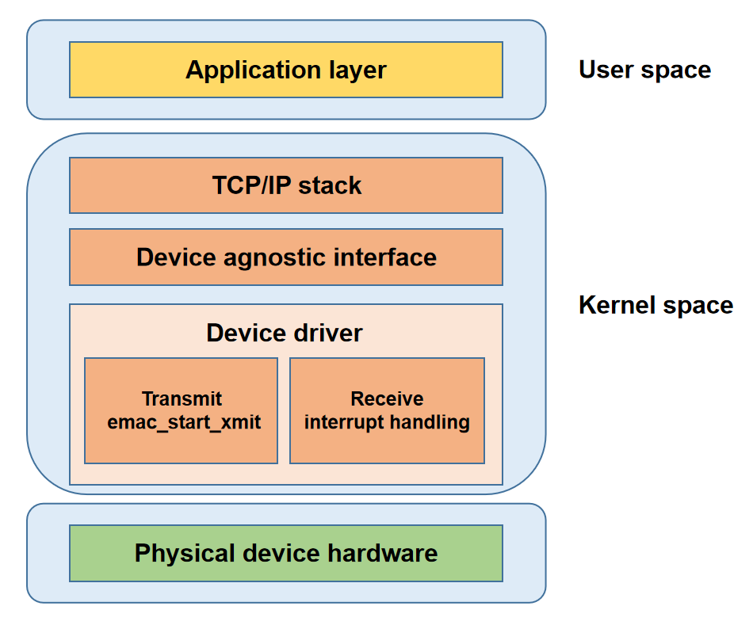

# GMAC

介绍GMAC的功能和使用方法。

## 模块介绍

GMAC（Gigabit Media Access Controller）模块是一个支持千兆以太网通信的控制器，负责数据帧的发送、接收及网络流量的管理。

### 功能介绍

   
- **应用层：** 面向用户提供应用服务。  
- **协议栈层：** 实现网络协议，为应用层提供系统调用接口。  
- **网络设备抽象层：** 屏蔽驱动实现细节，为协议栈提供统一接口。  
- **网络设备驱动层：** 负责实现数据传输和设备管理。  
- **物理层：** 网络硬件设备。

### 源码结构介绍

GMAC 驱动代码位于 `drivers\net\ethernet\spacemit` 目录下：

```
drivers\net\ethernet\spacemit
|-- emac-ptp.c          #提供 PTP 协议支持
|-- k1x-emac.c          #K1 GMAC 驱动代码
|-- k1x-emac.h          #K1 GMAC 驱动头文件
```

## 关键特性

### 特性

| 特性 | 特性说明 |
| :-----| :----|
| 支持10/100/1000M以太网 | 兼容多速率以太网连接 |
| 支持DMA | 高效数据传输降低CPU负载 |
| 支持NAPI | 提升中断处理效率减少CPU开销 |
| 中断合并机制 | 合并中断提升高负载性能 |
| 支持RGMII/RMII | 适应多应用场景 |
| 支持PTP | 实现设备间亚微秒级时间同步 |
| 支持电源管理 | 支持挂起恢复适应低功耗需求 |

### 性能参数

|  | 单网卡单工 | 单网卡双工 | 双网卡单工 | 双网卡双工 |
| :---: | :---: | :---: | :---: | :---: |
| TX速率 (Mbps) | 942 | 930 | 942 | 797 |
| RX速率 (Mbps) | 941 | 940 | 941 | 881 |  

**注：** 双工情形下测试带宽具有一定波动    

### 性能测试
#### 测试环境

**测试设备：** 一块 K1-DEB1 板卡；一台 PC（型号：HP ProBook 450 G10，操作系统：Ubuntu 22.04.4 LTS）

**网络拓扑：** K1-DEB1 eth0 口与 PC 以太网口直连；K1-DEB1 eth1 口经 2.5G USB 转以太网连接器 与 PC直连  

**IP设置：** 直连网口 IP 设置在同一个网段，PC 端开启两个 iperf 服务端

```
# Set IP for the PC
ifconfig <ethernet-interface> 192.168.1.100 netmask 255.255.255.0
ifconfig <usb-ethernet-interface> 192.168.2.100 netmask 255.255.255.0

# Set IP for the k1-deb1 net device
ifconfig eth0 192.168.1.200 netmask 255.255.255.0
ifconfig eth1 192.168.2.200 netmask 255.255.255.0

# Start iperf3 server on the PC
iperf3 -s -B 192.168.1.100 -A 10 -D
iperf3 -s -B 192.168.2.100 -A 11 -D
```

#### 性能优化
为最大化网络吞吐量，在测试前先对 K1-DEB1 板网口中断进行合理的 CPU 绑定和分配，以充分利用多核资源

**第一步：** 通过以下命令查看当前中断分配情况，确认两个网卡对应的中断号：
 ```
cat /proc/interrupts | grep eth*
 85:      11041    2332003          0          0          0          0          0          0  SiFive PLIC 131 Edge      eth0
 86:        234          0     409744          0          0          0          0          0  SiFive PLIC 133 Edge      eth1
 ```

**第二步：** 将网口硬件中断绑定到不同 CPU 核，例如 eth0 绑定至 CPU1、eth1 绑定至 CPU2
```
echo 02 > /proc/irq/85/smp_affinity
echo 04 > /proc/irq/86/smp_affinity
```

**第三步：** 启用 RPS（Receive Packet Steering）进行接收端的软中断负载均衡。例如下面命令允许 CPU4 处理 eth0 上接收数据包、CPU5 处理 eth1 接收数据包，充分利用多核优势。
```
echo 10 > /sys/devices/platform/soc/cac80000.ethernet/net/eth0/queues/rx-0/rps_cpus
echo 4096 > /sys/devices/platform/soc/cac80000.ethernet/net/eth0/queues/rx-0/rps_flow_cnt

echo 20 > /sys/devices/platform/soc/cac81000.ethernet/net/eth1/queues/rx-0/rps_cpus
echo 4096 > /sys/devices/platform/soc/cac81000.ethernet/net/eth1/queues/rx-0/rps_flow_cnt
 ```

#### 单网卡测试
使用 eth0 口进行单网卡测试，并将当前 iperf3 进程绑定到 CPU6

##### 单工/TX

```
iperf3 -c 192.168.1.100 -B 192.168.1.200 -t 100 -A 6
```

##### 单工/RX

```
iperf3 -c 192.168.1.100 -B 192.168.1.200 -t 100 -A 6 -R
```

##### 双工

```
iperf3 -c 192.168.1.100 -B 192.168.1.200 -t 100 -A 6 --bidir
```

#### 双网卡测试
双网卡测试中将两个 iperf3 进程分别绑定到CPU6、CPU7

##### 单工/TX

```
# Bind CPU6 for the first test, bind CPU7 for the second test
iperf3 -c 192.168.2.100 -B 192.168.2.200 -t 100 -A 6 > 1.txt &
iperf3 -c 192.168.1.100 -B 192.168.1.200 -t 100 -A 7 > 2.txt &

# View the test results
cat 1.txt
cat 2.txt
```

##### 单工/RX

```
iperf3 -c 192.168.2.100 -B 192.168.2.200 -t 100 -A 6 -R > 1.txt &
iperf3 -c 192.168.1.100 -B 192.168.1.200 -t 100 -A 7 -R > 2.txt &

cat 1.txt
cat 2.txt
```

##### 双工

```
iperf3 -c 192.168.2.100 -B 192.168.2.200 -t 100 -A 6 --bidir > 1.txt &
iperf3 -c 192.168.1.100 -B 192.168.1.200 -t 100 -A 7 --bidir > 2.txt &

cat 1.txt
cat 2.txt
```

## 配置介绍

主要包括 **驱动使能配置** 和 **dts配置**

### CONFIG配置

`NET_VENDOR_SPACEMIT`：如果使用的是 SpacemiT 类型的以太网芯片，请将此选项设置 `Y`

```
config NET_VENDOR_SPACEMIT
        bool "Spacemit devices"
        default y
        depends on SOC_SPACEMIT
        help
          If you have a network (Ethernet) chipset belonging to this class,
          say Y.

          Note that the answer to this question does not directly affect
          the kernel: saying N will just cause the configurator to skip all
          the questions regarding Spacemit chipsets. If you say Y, you will
          be asked for your specific chipset/driver in the following questions.
     
```

`K1X_EMAC`：启用 SpacemiT 的 GMAC 驱动

```
config K1X_EMAC
        bool "k1-x Emac Driver"
        depends on SOC_SPACEMIT_K1X
        select PHYLIB
        help
          This Driver support Spacemit k1-x Ethernet MAC
          Say Y to enable support for the Spacemit Ethernet.

```

### dts配置

GMAC dts 配置，需要确定以太网使用的 pin 组，phy 复位 GPIO，phy 型号及地址。TX phase 和 RX phase 一般采用默认值。

#### pinctrl

查看开发板原理图，找到 GMAC 使用的 pin 组。

假设 eth0 所使用的引脚为 GPIO00 至 GPIO14 以及 GPIO45，对应 pinctrl 配置可使用 `k1-x_pinctrl.dtsi` 中的 `pinctrl_gmac0`。

方案 dts 中 eth0 使用 gmac0 pinctrl 如下

```c
&eth0 {
    pinctrl-names = "default";
    pinctrl-0 = <&pinctrl_gmac0>;
};
```

#### gpio

查看开发板原理图，找到以太网 phy 复位信号 gpio，假设 eth0 phy 复位 gpio 为 gpio 110。

方案 dts 中 eth0 使用 gpio 110 如下。

```c
&eth0 {
    emac,reset-gpio = <&gpio 110 0>;
}
```

#### phy 配置

##### phy 标识

查看开发板原理图，确认以太网 phy 的型号和 phy id。

如以太网 phy RTL8821F-CG，其 phy id 为 001c.c916。

Phy id 信息可以查找 phy spec 或联系 phy 厂商提供。

##### phy 地址

查看开发板原理图，确认以太网 phy 的地址，假设为 1。

##### phy 配置

根据 5.3.1 和 5.3.2 得到的 phy 标识 id 和 phy 地址，对 phy 进行配置。

方案 dts eth0 配置如下

```c
&eth0 {
    ...
    mdio-bus {
                #address-cells = <0x1>;
                #size-cells = <0x0>;
                rgmii0: phy@0 {
                        compatible = "ethernet-phy-id001c.c916";
                        device_type = "ethernet-phy";
                        reg = <0x1>;
                        phy-mode = "rgmii";
                };
    };
};
```

#### TX phase 和 RX phase

tx-phase 默认值为 `90`，rx-phase 为 `73`。

不同的板子 tx-phase 和 rx-phase 可能需要调整。如果 eth0 端口可以 up，但是分配不到 ip 地址，需要联系进迭时空调整 tx-phase 和 rx-phase。

```c
&eth0 {
    tx-phase = <90>;
    rx-phase = <73>;
};
```

#### dts 配置

综合开发板以太网硬件信息，配置如下。

```c
&eth0 {
        pinctrl-names = "default";
        pinctrl-0 = <&pinctrl_gmac0>;

        emac,reset-gpio = <&gpio 110 0>;
        emac,reset-active-low;
        emac,reset-delays-us = <0 10000 100000>;

        /* store forward mode */
        tx-threshold = <1518>;
        rx-threshold = <12>;
        tx-ring-num = <128>;
        rx-ring-num = <128>;
        dma-burst-len = <5>;

        ref-clock-from-phy;

        clk-tuning-enable;
        clk-tuning-by-delayline;
        tx-phase = <90>;
        rx-phase = <73>;

        phy-handle = <&rgmii0>;

        status = "okay";

        mdio-bus {
                #address-cells = <0x1>;
                #size-cells = <0x0>;
                rgmii0: phy@0 {
                        compatible = "ethernet-phy-id001c.c916";
                        device_type = "ethernet-phy";
                        reg = <0x1>;
                        phy-mode = "rgmii";
                };
        };
};
```

## 接口介绍

### API介绍

#### emac_ioctl

`emac_ioctl` 用于访问 `PHY`（物理层）设备寄存器和配置硬件时间戳功能，各命令含义如下：  
- `SIOCGMIIPHY`：获取 `PHY` 设备地址。  
- `SIOCGMIIREG`：读取指定的 `PHY` 寄存器。  
- `SIOCSMIIREG`：写入指定的 `PHY` 寄存器。  
- `SIOCSHWTSTAMP`：配置设备的硬件时间戳。  

```c
static int emac_ioctl(struct net_device *ndev, struct ifreq *rq, int cmd)
{
 int ret = -EOPNOTSUPP;

 if (!netif_running(ndev))
  return -EINVAL;

 switch (cmd) {
 case SIOCGMIIPHY:
 case SIOCGMIIREG:
 case SIOCSMIIREG:
  if (!ndev->phydev)
   return -EINVAL;
  ret = phy_mii_ioctl(ndev->phydev, rq, cmd);
  break;
 case SIOCSHWTSTAMP:
  ret = emac_hwtstamp_ioctl(ndev, rq);
  break;
 default:
  break;
 }

 return ret;
}
```

#### emac_get_link_ksettings

`emac_get_link_ksettings` 函数用于获取网络设备的速度、双工模式、自协商状态等链路信息，用户使用 `ethtool <INTERFACE>` 命令时该函数会被调用：

```
# ethtool eth0
Settings for eth0:
        Supported ports: [ TP MII ]
        Supported link modes:   10baseT/Half 10baseT/Full
                                100baseT/Half 100baseT/Full
                                1000baseT/Full
        Supported pause frame use: Symmetric Receive-only
        Supports auto-negotiation: Yes
        Supported FEC modes: Not reported
        Advertised link modes:  10baseT/Half 10baseT/Full
                                100baseT/Half 100baseT/Full
                                1000baseT/Full
        Advertised pause frame use: No
        Advertised auto-negotiation: Yes
        Advertised FEC modes: Not reported
        Speed: Unknown!
        Duplex: Unknown! (255)
        Port: Twisted Pair
        PHYAD: 1
        Transceiver: external
        Auto-negotiation: on
        MDI-X: Unknown
        Link detected: no
```

`emac_get_link_ksettings` 函数实现如下：

```c
static int emac_get_link_ksettings(struct net_device *ndev,
     struct ethtool_link_ksettings *cmd)
{
 if (!ndev->phydev)
                return -ENODEV;
        /* 调用phy驱动接口获取物理层链路信息 */
 phy_ethtool_ksettings_get(ndev->phydev, cmd); 
 return 0;
}
```

#### emac_set_link_ksettings

`emac_set_link_ksettings` 函数用于设置网络设备的链路配置，如速度、双工模式、自协商状态等。当用户调用如下命令时，该接口会被调用：

```
#设置链路速度1000M、全双工、启动自动协商
ethtool -s eth0 speed 1000 duplex full autoneg on
```

`emac_set_link_ksettings`实现如下：

```c
static int emac_set_link_ksettings(struct net_device *ndev,
     const struct ethtool_link_ksettings *cmd)
{
 if (!ndev->phydev)
                return -ENODEV;
        /* 调用phy驱动接口设置物理层链路配置 */
 return phy_ethtool_ksettings_set(ndev->phydev, cmd);
}
```

#### emac_get_ethtool_stats

`emac_get_ethtool_stats` 用于获取GMAC统计信息，所有的统计项目如下：

```c
struct emac_hw_stats {
    u32 tx_ok_pkts;                // 成功发送的有效数据包数量
    u32 tx_total_pkts;             // 总共尝试发送的数据包数量，包括成功和失败的包
    u32 tx_ok_bytes;               // 成功发送的总字节数
    u32 tx_err_pkts;               // 发送时发生错误的数据包数量
    u32 tx_singleclsn_pkts;        // 发生单次冲突后成功发送的数据包数量
    u32 tx_multiclsn_pkts;         // 发生多次冲突后成功发送的数据包数量
    u32 tx_lateclsn_pkts;          // 发生晚期冲突（发送过程中检测到）后丢弃的数据包数量
    u32 tx_excessclsn_pkts;        // 由于过多冲突导致发送失败的数据包数量
    u32 tx_unicast_pkts;           // 成功发送的单播数据包数量
    u32 tx_multicast_pkts;         // 成功发送的多播数据包数量
    u32 tx_broadcast_pkts;         // 成功发送的广播数据包数量
    u32 tx_pause_pkts;             // 发送的控制数据包数量（如流量控制的暂停帧）
    u32 rx_ok_pkts;                // 成功接收的有效数据包数量
    u32 rx_total_pkts;             // 总共接收到的数据包数量，包括成功和失败的包
    u32 rx_crc_err_pkts;           // 接收时检测到CRC错误的数据包数量
    u32 rx_align_err_pkts;         // 接收时检测到对齐错误的数据包数量
    u32 rx_err_total_pkts;         // 总共发生错误的接收数据包数量
    u32 rx_ok_bytes;               // 成功接收的总字节数
    u32 rx_total_bytes;            // 总共接收到的字节数，包括成功和失败的数据包
    u32 rx_unicast_pkts;           // 成功接收的单播数据包数量
    u32 rx_multicast_pkts;         // 成功接收的多播数据包数量
    u32 rx_broadcast_pkts;         // 成功接收的广播数据包数量
    u32 rx_pause_pkts;             // 接收到的控制数据包数量（如流量控制的暂停帧）
    u32 rx_len_err_pkts;           // 由于长度错误导致接收失败的数据包数量
    u32 rx_len_undersize_pkts;     // 接收到的过短的数据包数量（小于最小以太网帧长度）
    u32 rx_len_oversize_pkts;      // 接收到的过长的数据包数量（超过最大以太网帧长度）
    u32 rx_len_fragment_pkts;      // 接收到的片段化的数据包数量（数据包不完整）
    u32 rx_len_jabber_pkts;        // 接收到的杂波数据包数量（超长且包含错误）
    u32 rx_64_pkts;                // 接收到的长度为64字节的数据包数量
    u32 rx_65_127_pkts;            // 接收到的长度在65至127字节之间的数据包数量
    u32 rx_128_255_pkts;           // 接收到的长度在128至255字节之间的数据包数量
    u32 rx_256_511_pkts;           // 接收到的长度在256至511字节之间的数据包数量
    u32 rx_512_1023_pkts;          // 接收到的长度在512至1023字节之间的数据包数量
    u32 rx_1024_1518_pkts;         // 接收到的长度在1024至1518字节之间的数据包数量
    u32 rx_1519_plus_pkts;         // 接收到的长度大于1518字节的数据包数量
    u32 rx_drp_fifo_full_pkts;     // 由于接收FIFO已满而丢弃的数据包数量
    u32 rx_truncate_fifo_full_pkts;// 由于接收FIFO已满而被截断的数据包数量
    //必须放在最后
    spinlock_t stats_lock;         // 用于保护上述统计数据访问的自旋锁，防止数据竞争
};
```

当用户使用如下命令时，该函数会被调用：

```
# ethtool -S eth0
NIC statistics:
     tx_ok_pkts: 219
     tx_total_pkts: 219
     tx_ok_bytes: 20102
     tx_err_pkts: 0
     tx_singleclsn_pkts: 0
     tx_multiclsn_pkts: 0
     tx_lateclsn_pkts: 0
     tx_excessclsn_pkts: 0
     tx_unicast_pkts: 4
     tx_multicast_pkts: 187
     tx_broadcast_pkts: 28
     tx_pause_pkts: 0
     rx_ok_pkts: 209
     rx_total_pkts: 209
     rx_crc_err_pkts: 0
     rx_align_err_pkts: 0
     rx_err_total_pkts: 0
     rx_ok_bytes: 18368
     rx_total_bytes: 18368
     rx_unicast_pkts: 3
     rx_multicast_pkts: 175
     rx_broadcast_pkts: 31
     rx_pause_pkts: 0
     rx_len_err_pkts: 0
     rx_len_undersize_pkts: 0
     rx_len_oversize_pkts: 0
     rx_len_fragment_pkts: 0
     rx_len_jabber_pkts: 0
     rx_64_pkts: 17
     rx_65_127_pkts: 177
     rx_128_255_pkts: 0
     rx_256_511_pkts: 15
     rx_512_1023_pkts: 0
     rx_1024_1518_pkts: 0
     rx_1519_plus_pkts: 0
     rx_drp_fifo_full_pkts: 0
     rx_truncate_fifo_full_pkts: 0
```

函数实现如下：

```c
static void emac_get_ethtool_stats(struct net_device *dev,
                                   struct ethtool_stats *stats, u64 *data)
{
        struct emac_priv *priv = netdev_priv(dev);
        struct emac_hw_stats *hwstats = priv->hw_stats;
        u32 *data_src;
        u64 *data_dst;
        int i;

        /* 确保网络设备存在且正在运行 */
        if (netif_running(dev) && netif_device_present(dev)) {
                if (spin_trylock_bh(&hwstats->stats_lock)) {
                        emac_stats_update(priv);  // 更新统计信息
                        spin_unlock_bh(&hwstats->stats_lock);
                }
        }

        data_dst = data; 

        /* 遍历 ethtool 统计项数组，将硬件统计数据复制到目标数据数组中 */
        for (i = 0; i < ARRAY_SIZE(emac_ethtool_stats); i++) {
                data_src = (u32 *)hwstats + emac_ethtool_stats[i].offset;
                *data_dst++ = (u64)(*data_src);
        }
}
```

#### emac_get_ts_info

`emac_get_ts_info` 函数用于提供网络设备的时间戳信息，当用户使用如下命令时该函数被调用：

```
# ethtool --show-time-stamping eth0
Time stamping parameters for eth0:
Capabilities:
        hardware-transmit     (SOF_TIMESTAMPING_TX_HARDWARE)
        software-transmit     (SOF_TIMESTAMPING_TX_SOFTWARE)
        hardware-receive      (SOF_TIMESTAMPING_RX_HARDWARE)
        software-receive      (SOF_TIMESTAMPING_RX_SOFTWARE)
        software-system-clock (SOF_TIMESTAMPING_SOFTWARE)
        hardware-raw-clock    (SOF_TIMESTAMPING_RAW_HARDWARE)
PTP Hardware Clock: 0
Hardware Transmit Timestamp Modes:
        off                   (HWTSTAMP_TX_OFF)
        on                    (HWTSTAMP_TX_ON)
Hardware Receive Filter Modes:
        none                  (HWTSTAMP_FILTER_NONE)
        all                   (HWTSTAMP_FILTER_ALL)
        ptpv1-l4-event        (HWTSTAMP_FILTER_PTP_V1_L4_EVENT)
        ptpv1-l4-sync         (HWTSTAMP_FILTER_PTP_V1_L4_SYNC)
        ptpv1-l4-delay-req    (HWTSTAMP_FILTER_PTP_V1_L4_DELAY_REQ)
        ptpv2-l4-event        (HWTSTAMP_FILTER_PTP_V2_L4_EVENT)
        ptpv2-l4-sync         (HWTSTAMP_FILTER_PTP_V2_L4_SYNC)
        ptpv2-l4-delay-req    (HWTSTAMP_FILTER_PTP_V2_L4_DELAY_REQ)
        ptpv2-event           (HWTSTAMP_FILTER_PTP_V2_EVENT)
        ptpv2-sync            (HWTSTAMP_FILTER_PTP_V2_SYNC)
        ptpv2-delay-req       (HWTSTAMP_FILTER_PTP_V2_DELAY_REQ)
```

`emac_get_ts_info` 函数实现如下：

```c
static int emac_get_ts_info(struct net_device *dev,
                              struct ethtool_ts_info *info)
{
        struct emac_priv *priv = netdev_priv(dev); 
        if (priv->ptp_support) {

                /* 设置支持的时间戳选项，包括硬件和软件的时间戳 */
                info->so_timestamping = SOF_TIMESTAMPING_TX_SOFTWARE |
                                        SOF_TIMESTAMPING_TX_HARDWARE |
                                        SOF_TIMESTAMPING_RX_SOFTWARE |
                                        SOF_TIMESTAMPING_RX_HARDWARE |
                                        SOF_TIMESTAMPING_SOFTWARE |
                                        SOF_TIMESTAMPING_RAW_HARDWARE;

                if (priv->ptp_clock)
                        info->phc_index = ptp_clock_index(priv->ptp_clock);

                /* 设置支持的传输时间戳类型 */
                info->tx_types = (1 << HWTSTAMP_TX_OFF) | (1 << HWTSTAMP_TX_ON);

                /* 设置支持的时间戳过滤器 */
                info->rx_filters = ((1 << HWTSTAMP_FILTER_NONE) |
                                    (1 << HWTSTAMP_FILTER_PTP_V1_L4_EVENT) |
                                    (1 << HWTSTAMP_FILTER_PTP_V1_L4_SYNC) |
                                    (1 << HWTSTAMP_FILTER_PTP_V1_L4_DELAY_REQ) |
                                    (1 << HWTSTAMP_FILTER_PTP_V2_L4_EVENT) |
                                    (1 << HWTSTAMP_FILTER_PTP_V2_L4_SYNC) |
                                    (1 << HWTSTAMP_FILTER_PTP_V2_L4_DELAY_REQ) |
                                    (1 << HWTSTAMP_FILTER_PTP_V2_EVENT) |
                                    (1 << HWTSTAMP_FILTER_PTP_V2_SYNC) |
                                    (1 << HWTSTAMP_FILTER_PTP_V2_DELAY_REQ) |
                                    (1 << HWTSTAMP_FILTER_ALL));
                return 0;
        } else
                /* 如果不支持PTP，则调用ethtool的默认处理函数 */
                return ethtool_op_get_ts_info(dev, info);
}

```

## Debug介绍

### debugfs

```
#用于便捷地查询或修改gmac的接口、tx phase、rx phase配置
/sys/kernel/debug/cac80000.ethernet # cat clk_tuning
Emac MII Interface : RGMII
Current rx phase : 73
Current tx phase : 60
```

## 测试介绍

查看网络接口信息

```c
ifconfig -a
```

打开网络设备

```c
ifconfig <INTERFACE> up
```

关闭网络设备

```c
ifconfig <INTERFACE> down
```

测试和另一台主机的连通性，假设其IP地址为 `192.168.0.1`

```c
ping 192.168.0.1 
```

采用 DHCP 协议分配IP地址

```c
udhcpc
```

## FAQ
