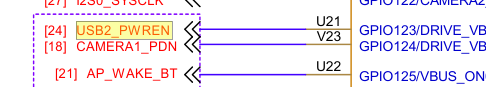

# USB 通用开发指南

介绍 K1 USB 的的基本功能和配置、使用方法。

适用范围： SpacemiT Linux 6.1, SpacemiT Linux 6.6

## 模块介绍

K1 共有三个 USB 控制器，分别为 :
- USB2.0 OTG（ USB0 ）
- USB2.0 Host（ USB1 ）
- USB3.0 DRD（其中 USB2.0 端口为 USB2 ， SuperSpeed 端口为 USB3 ）

Linux 中，支持 两种 USB 角色：
- 可以外接 USB 外设的 Host 模式
- 作为 USB 外设可以接入到其他上位机的 Device 模式

### 功能介绍

#### USB Host


USB Host 角色驱动框架图可以分为以下几个层次：

- **USB Host Controller Driver：** 这是 USB 控制器驱动层，负责初始化控制器以及进行底层数据收发操作。
- **USB Core Services：** 这是核心层，负责抽象出 USB 层次和基于 URB 的传输，并提供接口供上下使用。
- **USB Class Driver：** 这是 USB 设备功能层，负责实现 USB 设备驱动、 USB 功能驱动，对接内核其他框架（如 HID、 UVC、 Storage 等）。

#### USB Device


USB Device 角色驱动框架图可以分为以下几个层次：

- **USB Device Controller Driver：** 这是 USB Device 角色控制器驱动层，负责初始化控制器及进行底层数据收发操作。
- **UDC Core：** 这是核心层，负责抽象出 USB Device 层次和基于 usb_request 的传输，并提供接口供上下使用。
- **Composite：** 用于组合多个 USB Device 功能为一个设备，支持用户空间通过 configfs 配置，或者 legacy 驱动硬编码组合好的 Functions。
- **Function Driver：** 这是 USB Device 功能层，负责实现 USB Device 模式的功能驱动，对接内核其他框架（如存储、 V4L2 、网络等）。

这些层次结构共同构成了 Linux 系统中 USB 子系统的框架，确保了 USB 模块系统中的正常运行和数据传输。

### 源码结构介绍

USB2.0 OTG 控制器驱动代码位于 `drivers/usb` 目录下：

```
drivers/usb
|-- phy/
|   |-- phy-k1x-ci-otg.c      # OTG 驱动，用于实现 EHCI Host 和 K1X UDC 两种模式驱动切换。
|   |-- phy/phy-k1x-ci-usb2.c # PHY 驱动。
|-- host/
|   |-- ehci-k1x-ci.c         # EHCI Host 模式平台驱动 , 需要和 EHCI Host 驱动组合使用。
|-- gadget/
    |-- udc/
        |-- k1x_udc_core.c    # Device 模式驱动。
```

USB2.0 HOST 控制器驱动代码位于 `drivers/usb` 目录下：

```
drivers/usb
|-- phy/
|    |-- phy-k1x-ci-usb2.c # PHY 驱动。
|-- host/
    |-- ehci-k1x-ci.c     # EHCI Host 模式平台驱动 , 需要和 EHCI Host 驱动组合使用。
```

USB3.0 DRD 控制器驱动代码位于 `drivers/usb` 目录下：

```
drivers/usb
|-- phy/
|   |-- phy-k1x-ci-usb2.c   # USB3.0 复合端口下的 USB2.0 PHY 驱动。
|-- phy/
|   |-- spacemit/
|       |-- phy-spacemit-k1x-combphy.c # USB3.0 5Gbps PHY 驱动。
|-- dwc3/
|   |-- dwc3-spacemit.c    # DWC 平台驱动 , 需要和 DWC3 驱动搭配使用。
```

其他一些组件代码路径如下：

```
drivers/
|-- extcon/
|    |-- extcon-k1xci.c   # MicroUSB Pin 检测连接器驱动 , 需搭配 OTG 驱动、 Extcon 驱动使用。
|-- usb
|    |-- misc/
|        |-- spacemit_onboard_hub.c # 用于板载 USB 外设供电配置的帮助驱动。
```

## 关键特性

### USB2.0 OTG

#### 特性

| 特性 | 特性说明 |
| :-----| :----|
| 支持 OTG | 支持 Host 和 Device 模式切换，并支持 idpin+vbuspin 检测。 |
| 支持 HS,FS Host/Device | High Speed(480Mb/s), Full Speed(12Mb/s) Host/Device 模式 |
| 支持 LS Host Only | 支持 Low Speed(1.5Mb/s) Host only 模式 |
| 支持 16 Host Channel| 最多支持 16 Channel 同时传输 |
| 支持 16 IN + 16 OUT Device 端点 | 16KB Tx Buffer, 2KB Rx Buffer|
| 支持 Remote Wakeup| Host 模式下支持 High Speed, Full Speed, Low Speed Remote Wakeup |

#### 性能参数

| 测试项目 | Tx(MB/s) | Rx(MB/s) |
| :-----| :----| :----: |
| U 盘测速 (HIKISEMI S560 256GB) | 32.2 | 32.4 |
| U 盘模式 Gadget 测速 | 21.8 | 14.8 |

测试方法

```
# U 盘测速：
## host:
fio -name=Tx -ioengine=libaio -direct=1 -iodepth=64 -rw=write -bs=512K -size=1024M -numjobs=1 -group_reporting -filename=/dev/sda
fio -name=Rx -ioengine=libaio -direct=1 -iodepth=64 -rw=read -bs=512K -size=1024M -numjobs=1 -group_reporting -filename=/dev/sda

# U 盘模式 Gadget：
## device:
gadget-setup msc
## pc:
fio -name=DevRx -ioengine=libaio -direct=1 -iodepth=64 -rw=write -bs=512K -size=100M -numjobs=1 -group_reporting -filename=/dev/sda
fio -name=DevTx -ioengine=libaio -direct=1 -iodepth=64 -rw=read -bs=512K -size=100M -numjobs=1 -group_reporting -filename=/dev/sda
```

### USB2.0 Host

#### 特性

| 特性 | 特性说明 |
| :-----| :----|
| 支持 HS,FS,LS Host | High Speed(480Mb/s), Full Speed(12Mb/s), Low Speed(1.5Mb/s) Host 模式 |
| 支持 16 Host Channel| 最多支持 16 Channel 同时传输 |
| 支持 Remote Wakeup| Host 模式下支持 HighSpeed, FullSpeed, LowSpeed Remote Wakeup |

#### 性能参数

| 测试项目 | Tx(MB/s) | Rx(MB/s) |
| :-----| :----| :----: |
| U 盘测速 (HIKISEMI S560 256GB) | 32.2 | 32.4 |

测试方法

```
# U 盘测速：
fio -name=Tx -ioengine=libaio -direct=1 -iodepth=64 -rw=write -bs=512K -size=1024M -numjobs=1 -group_reporting -filename=/dev/sda
fio -name=Rx -ioengine=libaio -direct=1 -iodepth=64 -rw=read -bs=512K -size=1024M -numjobs=1 -group_reporting -filename=/dev/sda
```

### USB3.0 DRD

#### 特性

| 特性 | 特性说明 |
| :-----| :----|
| 支持 OTG | 支持 Host 和 Device 模式切换 |
| 支持 SS Host/Device | Super Speed(5Gbps/s) Host/Device 模式 |
| 兼容 HS,FS Host/Device | High Speed(480Mb/s), Full Speed(12Mb/s) Host/Device 模式 |
| 支持 LS Host Only | 支持 Low Speed(1.5Mb/s) Host only 模式 |
| 支持 32 Device 端点 | 支持动态分配 |
| 支持低功耗 | USB2.0 Suspend, USB3.0 U1, U2, U3|
| 支持 Remote Wakeup| Host 模式下支持 SuperSpeed, HighSpeed, FullSpeed, LowSpeed Remote Wakeup |

#### 性能参数

| 测试项目 | Tx(MB/s) | Rx(MB/s) |
| :-----| :----| :----: |
| U 盘测速 (HIKISEMI S560 256GB)(SuperSpeed) | 345 | 343 |
| U 盘测速 (HIKISEMI X301 64GB)(HighSpeed) | 27.1 | 30.2 |
| U 盘模式 Gadget 测速 (SuperSpeed) | 349 | 328 |

测试方法

```
# U 盘测速 :
fio -name=Tx -ioengine=libaio -direct=1 -iodepth=64 -rw=write -bs=512K -size=1024M -numjobs=1 -group_reporting -filename=/dev/sda
fio -name=Rx -ioengine=libaio -direct=1 -iodepth=64 -rw=read -bs=512K -size=1024M -numjobs=1 -group_reporting -filename=/dev/sda

# U 盘模式 Gadget 测速 (SuperSpeed):
## device:
USB_UDC=c0a00000.dwc3 gadget-setup uas:/dev/nvme0n1p1
## pc:
fio -name=DevRx -rw=write -bs=512k -size=5G -numjobs=1 -iodepth=32 -group_reporting -direct=1 -ioengine=libaio -filename=/dev/sda
fio -name=DevTx -rw=read -bs=512k -size=5G -numjobs=1 -iodepth=32 -group_reporting -direct=1 -ioengine=libaio -filename=/dev/sda
```

## 硬件原理图介绍

这里以 SpacemiT MUSE-Pi 来介绍在进行方案配置开发时，硬件原理图的使用方法。

### USB2.0 OTG 控制器硬件原理图介绍


USB2.0 OTG 控制器在 PCB 原理图中，对应 PIN 脚网络名命名为 USB0_DP， USB0_DN。

普通开发板方案通常作为烧录接口和开发板供电接口，不接入 VBUS 输出， VBUS 只做供电输入。

### USB2.0 Host Only 控制器硬件原理图介绍


USB2.0 Host Only 控制器在 PCB 原理图中，对应 PIN 脚网络名命名为 USB1_DP， USB1_DN，普通方案通常作为标准 USB-A 母头接口。

作为标准接口时， USB2.0 Host 接口 VBUS 在设计上通常会使用一个限流开关，因此我们需要找到限流开关的输入，他通常命名为 USB2_PWREN，但不是绝对的，
实际开发时，需要仔细找到控制器 PIN 脚所连到的 USB 接口所对应的 VBUS 开关，为了更好地兼容功耗较高的移动硬盘等 USB 外设，限流通常设置为 5V/2A。

我们找到了 VBUS 限流开关的输入是 USB2_PWREN 网络名，进行全局检索（原理图文档的 GPIO ASSIGNMENT 页也会包含 GPIO 网络名映射，但是他不一定是准确的，我们还是以实际原理图连线为准），将会找到对应的一个 GPIO123 ，
如图这里是 GPIO，稍后我们将会使用这个信息进行方案的 DTS 配置。



### USB3.0 DRD 控制器硬件原理图介绍


USB3.0 DRD 控制器在 PCB 原理图中，由于 USB3.0 是双总线架构。因此实际有更多的 PIN 脚，对应 PIN 脚网络名命名为 USB2_DP， USB2_DN； USB3_TXN， USB3_TXP， USB3_RXN， USB3_RXP（或命名为 USB3_SSTXN， USB3_SSTXP， USB3_SSRXN， USB3_SSRXP 或命名为 USB3_SSTX-， USB3_SSTX+， USB3_SSRX-， USB3_SSRX+）普通方案通常作为标准 USB-A 母头接口，模式采用 Host Only 模式，或者供开发者评估功能的非标准支持手动切换 Device 和 Host 的 Dual Role 模式（ USB-A 口做 Device 模式为非标准行为）。

作为标准接口时， USB3.0 Host 接口的 VBUS 在设计上通常会使用一个限流开关，因此我们需要找到限流开关的输入，他通常命名为 USB3_PWREN，但不是绝对的，
实际开发时，需要仔细找到控制器 PIN 脚所连到的 USB 接口所对应的 VBUS 开关，为了更好地兼容功耗较高的移动硬盘等 USB 外设，限流通常设置为 5V/2A。

我们找到了 VBUS 限流开关的输入是 USB3_PWREN 网络名，进行全局检索（原理图文档的 GPIO ASSIGNMENT 页也会包含 GPIO 网络名映射，但是他不一定是准确的，我们还是以实际原理图连线为准），将会找到对应的一个 GPIO79 ，
如图这里是 GPIO，稍后我们将会使用这个信息进行方案的 DTS 配置。


USB3.0 DRD 控制器做 Host 模式时，有的方案还会外部放置一个板载 HUB 芯片，对于这种芯片，通常是通过 GPIO 来进行上电使能，具体需要参考相关 HUB 芯片的说明书进行配置，对于顺序操作 GPIO 的实现均可使用下文将介绍的 `spacemit_onboard_hub` 驱动进行配置，请阅读相关章节内容。

## 配置介绍

主要包括 **驱动内核配置使能** 和 **DTS 配置**

### 驱动内核 CONFIG 配置使能

Buildroot SDK 中， Linux 内核配置可以通过 `make linux-menuconfig`
进行配置。

配置完成后，通过 `make linux-update-defconfig` 保存。具体请参考相关文档。

#### USB2.0 OTG 驱动内核配置使能

`CONFIG_K1XCI_USB2_PHY` 为 USB2.0 OTG 的 PHY 提供支持，默认 `Y`。

```
Device Drivers
         -> USB support (USB_SUPPORT [=y])
           -> USB Physical Layer drivers
             -> K1x ci USB 2.0 PHY Driver (K1XCI_USB2_PHY [=y])
```

`CONFIG_USB_K1X_UDC` 为 USB2.0 OTG 的 Device 功能提供支持，默认 `Y`。

```
Device Drivers
         -> USB support (USB_SUPPORT [=y])
           -> USB Gadget Support (USB_GADGET [=y])
             -> USB Peripheral Controller
               -> Spacemit K1X USB2.0 Device Controller (USB_K1X_UDC [=y])
```

`CONFIG_USB_EHCI_K1X` 为 USB2.0 OTG 的 Host 功能提供支持，默认 `Y`。

```
Device Drivers
         -> USB support (USB_SUPPORT [=y])
           -> EHCI HCD (USB 2.0) support (USB_EHCI_HCD [=y])
             -> EHCI support for Spacemit k1x USB controller (USB_EHCI_K1X [=y])
```

`CONFIG_USB_K1XCI_OTG` 为 USB2.0 OTG 的 OTG 角色切换提供支持，默认 `Y`。

```
Device Drivers
         -> USB support (USB_SUPPORT [=y])
           -> USB Physical Layer drivers
             -> Spacemit K1-x USB OTG support (USB_K1XCI_OTG [=y])
```

`CONFIG_EXTCON_USB_K1XCI` 为 USB2.0 OTG 用于 MicroUSB 接口的 ID Pin+Vbus Pin 检测连接器驱动提供支持，默认 `Y`。

```
Device Drivers
         -> External Connector Class (extcon) support (EXTCON [=y])
           -> Spacemit K1-x USB extcon support (EXTCON_USB_K1XCI [=y])
```


#### USB2.0 HOST 驱动内核配置使能

`CONFIG_K1XCI_USB2_PHY` 为 USB2.0 HOST 的 PHY 提供支持，默认 `Y`。

```
Device Drivers
         -> USB support (USB_SUPPORT [=y])
           -> USB Physical Layer drivers
             -> K1x ci USB 2.0 PHY Driver (K1XCI_USB2_PHY [=y])
```

`CONFIG_USB_EHCI_K1X` 为 USB2.0 HOST 的 Host 功能提供支持，默认 `Y`。

```
Device Drivers
         -> USB support (USB_SUPPORT [=y])
           -> EHCI HCD (USB 2.0) support (USB_EHCI_HCD [=y])
             -> EHCI support for Spacemit k1x USB controller (USB_EHCI_K1X [=y])
```

#### USB3.0 DRD 驱动内核配置使能

`CONFIG_K1XCI_USB2_PHY` 为 USB3.0 DRD 的 USB2.0 Port 提供 PHY 支持，默认 `Y`。

```
Device Drivers
         -> USB support (USB_SUPPORT [=y])
           -> USB Physical Layer drivers
             -> K1x ci USB 2.0 PHY Driver (K1XCI_USB2_PHY [=y])
```

`CONFIG_PHY_SPACEMIT_K1X_COMBPHY` 为 USB3.0 DRD 的 SuperSpeed PHY 提供支持，默认 `Y`。

```
Device Drivers
         -> PHY Subsystem
           -> Spacemit K1-x USB3&PCIE combo PHY driver (PHY_SPACEMIT_K1X_COMBPHY [=y])
```

`CONFIG_USB_DWC3_SPACEMIT` 为 SpacemiT USB3.0 DRD 控制器驱动提供平台支持，默认情况下，此选型为 `Y`

```
Device Drivers
         -> USB support (USB_SUPPORT [=y])
           -> DesignWare USB3.0 DRD Core Support (USB_DWC3 [=y])
             -> Spacemit Platforms (USB_DWC3_SPACEMIT [=y])
```

`CONFIG_USB_DWC3_DUAL_ROLE` 为 USB3.0 DRD 控制器提供双模式支持，默认情况下，此选型为 `Y`，实际角色可以由设备树配置。
也可选择配置为单 Host 模式或者单 Device 模式。

```
Device Drivers
         -> USB support (USB_SUPPORT [=y])
           -> DesignWare USB3.0 DRD Core Support (USB_DWC3 [=y])
            -> DWC3 Mode Selection (<choice> [=y])
             -> Dual Role mode (USB_DWC3_DUAL_ROLE [=y])
```


#### 其他 USB 驱动内核配置使能介绍

`CONFIG_USB` 为 USB 总线协议提供支持，默认情况，此选项为 `Y`

```
Device Drivers
         -> USB support (USB_SUPPORT [=y])
```

对于 U 盘、 USB 网卡、 USB 打印机等配置需要打开，常用的选型默认 `Y`，此处不一一列举。

大部分 USB 驱动在 kernel menuconfig 的 USB supoort 栏目下：
```
Location:
-> Device Drivers
  -> USB support (USB [=y])
    -> USB_XX...
```

其他很多驱动则是分散在不同的位置，如 USB 声卡，在：
```Location:
-> Device Drivers
    -> Sound card support (SOUND [=y])
      -> Advanced Linux Sound Architecture (SND)
        -> USB sound devices (SND_USB [=y])
```

当拿到一个 USB 外设，发现接入系统后没有自动加载驱动，应按照以下步骤进行分析：
首先，可以对标 PC 的 Linux 发行版，把 USB 外设接入到 PC 后，对比查看 SpacemiT 平台和
Linux PC 的 `/sys/kernel/debug/usb/devices` 信息，找到你的设备（可以依据 Bus， Dev#
和你的设备对应）可以找到当前绑定到了什么驱动：

```
T:  Bus=03 Lev=01 Prnt=01 Port=09 Cnt=03 Dev#=  3 Spd=12   MxCh= 0
D:  Ver= 2.01 Cls=e0(wlcon) Sub=01 Prot=01 MxPS=64 #Cfgs=  1
P:  Vendor=1a86 ProdID=55d3 Rev= 0.00
C:* #Ifs= 2 Cfg#= 1 Atr=e0 MxPwr=100mA
I:* If#= 0 Alt= 0 #EPs= 3 Sub=01 Prot=01 Driver=(none)
E:  Ad=81(I) Atr=03(Int.) MxPS=  64 Ivl=1ms
E:  Ad=02(O) Atr=02(Bulk) MxPS=  64 Ivl=0ms
E:  Ad=82(I) Atr=02(Bulk) MxPS=  64 Ivl=0ms
```

在 `devices` debug 字段的输出找到对应的 `I:` 开头的行，查看其 `Driver=` 的信息，
如果是 =(none)，说明没有加载驱动。通常，如果 Linux PC 上显示为 `Driver=xxx`，说明
存在一个驱动内核配置在 Linux PC 上的内核使能了，而 SpacemiT 内核未使能，
用户可以通过在内核代码中检索 "Driver=" 后面的字符串部分定位驱动对应源码。
如 `usbhid`，在内核代码 `drivers` 目录下检索，可以找到 对应的 `usb_driver` 结构体：

```c
// src: drivers/hid/usbhid/hid-core.c
struct usb_driver hid_driver = { name = "usbhid", ...};
```
再在 Makefile 中找到该 `.c` 文件对应的 `CONFIG_USB_HID`，从而在 menuconfig 中查看
相关 help，若其帮助符合需求使能即可 :

```
linux-6.6$ grep -rn "usbhid" --include="Makefile"
drivers/hid/Makefile:161:obj-$(CONFIG_USB_HID)          += usbhid/
drivers/hid/Makefile:162:obj-$(CONFIG_USB_MOUSE)                += usbhid/
drivers/hid/Makefile:163:obj-$(CONFIG_USB_KBD)          += usbhid/
drivers/hid/usbhid/Makefile:6:usbhid-y  := hid-core.o
drivers/hid/usbhid/Makefile:7:usbhid-$(CONFIG_USB_HIDDEV)       += hiddev.o
drivers/hid/usbhid/Makefile:8:usbhid-$(CONFIG_HID_PID)  += hid-pidff.o
drivers/hid/usbhid/Makefile:10:obj-$(CONFIG_USB_HID)            += usbhid.o
```

用户还可以借助 linux-hardware.org 等工具通过 USB 外设的 PID、 VID、 Interface 类
等信息查询相关设备对应的 CONFIG。

如果 SpacemiT 平台和 Linux PC 都显示为 `Driver=usbfs`，说明他是一个应用层驱动，
如果在 SpacemiT 平台无法工作，你可能需要检查应用层是否需要集成一些厂商开发的脚本、二进
制服务或者 udev rules，而 SpacemiT 平台 OS 未集成。

`CONFIG_USB_ROLE_SWITCH` 为基于 role-switch 的模式切换提供支持（如 Type-C 接口 OTG 可能使用）:

```
Device Drivers
       -> USB support (USB_SUPPORT [=y])
           -> USB Role Switch Support (USB_ROLE_SWITCH [=y])
```

`CONFIG_USB_GADGET` 为 USB Device 模式提供支持，默认，此选项为 `Y`

```
Device Drivers
         -> USB support (USB_SUPPORT [=y])
           -> USB Gadget Support (USB_GADGET [=y])
```

`CONFIG_USB_GADGET` 下可选支持 Configfs 配置的 function，如 RNDIS，此处根据实际需求配置，默认常用的已打开。

```
Device Drivers
         -> USB support (USB_SUPPORT [=y])
           -> USB Gadget Support (USB_GADGET [=y])
             -> USB Gadget functions configurable through configfs (USB_CONFIGFS [=y])
               -> RNDIS (USB_CONFIGFS_RNDIS [=y])
               -> Function filesystem (FunctionFS) (USB_CONFIGFS_F_FS [=y])
               -> USB Webcam function (USB_CONFIGFS_F_UVC [=y])
               -> ....
```

用户应当尽量避免使能 `USB Gadget precomposed configurations` 菜单中的选项，这些选项
会使得系统启动后从内核层面自动配置起对应的 USB Gadget，常见的问题是打开后导致系统自带的 ADB
功能失效，如果用户不清楚实际作用，请不要使能他们。

```
-> Device Drivers 
  -> USB support (USB_SUPPORT)
    -> USB Gadget Support (USB_GADGET)
      -> USB Gadget precomposed configurations
        -> Mass Storage Gadget (USB_MASS_STORAGE [=n])
        -> ...
```

`CONFIG_SPACEMIT_ONBOARD_USB_HUB` 为板载 USB 外设供电配置的帮助驱动提供支持。

```
Device Drivers
        -> USB support (USB_SUPPORT [=y])
          -> Spacemit onboard USB hub support (SPACEMIT_ONBOARD_USB_HUB [=y])
```

### DTS 配置

#### USB2.0 OTG DTS 配置

USB2.0 OTG 控制器对应端口的 PIN 在原理图中，通常命名为 USB0_DP 和 USB0_DN，且作为
K1 的唯一下载固件端口。

USB2.0 OTG 支持 4 种配置模式：
- 通常情况下配置为 **以 Device Only 模式工作**。
- 如果支持手动切换 Host，推荐配置为 **以 OTG 模式工作(基于 usb-role-switch)** 并且配置为默认 Device 角色。
- 如果支持自动切换双角色（如 Type-C OTG 接口），推荐配置为 **以 OTG 模式工作(基于 usb-role-switch)**，并接入 Type-C 驱动或者 GPIO 检测。
- 如果基于 K1 平台，且使用了 EXTCON 框架进行 USB 角色控制，也支持配置为 **以 OTG 模式工作（基于 K1 EXTCON）**，此方式通常依赖外部事件（如 ID 检测或 VBUS 状态）来完成角色切换。

##### 以 Device Only 模式工作

USB2.0 OTG 控制器 device 模式对应的设备树节点为 `udc`，作为 device 模式工作时，需要配置 DTS

1. disable `ehci` 节点，`otg` 节点。
2. enable `usbphy` 节点。
3. udc 节点的 `spacemit,udc-mode` 属性为 `MV_USB_MODE_UDC` 来选择 device 模式。

方案 DTS 配置如下：

```c
&usbphy {
        status = "okay";
};
&udc {
        spacemit,udc-mode = <MV_USB_MODE_UDC>;
        status = "okay";
};
&ehci {
        status = "disabled";
};
&otg {
        status = "disabled";
};
```

##### 以 Host Only 模式工作

USB2.0 OTG 控制器 host 模式对应的设备树节点为 `ehci`，作为 host 模式工作时，可以通过 dts 配置 :

1. disable `udc` 节点，`otg` 节点。
2. `ehci` 节点的 `spacemit,udc-mode` 属性为 `MV_USB_MODE_HOST`（默认值）来选择 host 模式。
3. 如果 host 需要适用 GPIO 控制 vbus 开关，可以使用 `spacemit_onboard_hub` 驱动配置。
4. 可选属性 `spacemit,reset-on-resume`，用于控制系统休眠唤醒后是否 reset 控制器，
   建议默认配置减少休眠功耗。
```c
&usbphy {
        status = "okay";
};
&udc {
        status = "disabled";
};
&ehci {
        spacemit,reset-on-resume;
        spacemit,udc-mode = <MV_USB_MODE_HOST>;
        status = "okay";
};
&otg {
        status = "disabled";
};

/*
可选配置，节点需要添加到 soc 节中。
具体见下文 `spacemit_onboard_hub` 驱动介绍
usb2hub {
        compatible = "spacemit,usb3-hub";
        hub-gpios = <&gpio 74 0>;
        vbus-gpios = <&gpio 91 0 &gpio 92 0>;
        status = "okay";
};
*/

```


##### 以 OTG 模式工作 ( 基于 usb-role-switch)

此配置模式适合大部分方案，可接入 Type-C 角色检测、 GPIO 角色检测、用户手动切换等可选实现。

需要为 `otg` 节点配置 `usb-role-switch` 属性，以启用对 role-switch 的支持，通常适用于 Type-C 连接器，也支持其他如 GPIO 检测，具体接入方法可参考 Linux 内核文档 usb-connector、 Type-C 相关章节。配置后，`/sys/class/usb_role/` 下会出现一个 `mv-otg-role-switch` 节点。

通过启用 `otg` 节点，并且配置 `otg` 节点的 `role-switch-user-control` 属性。

`otg` 节点支持配置 `vbus-gpios` 用于控制角色切换时的 vbus，但是注意对于 Type-C OTG 方案， vbus 通常是由 Type-C 控制器接管，此时不要再配置到 `otg` 节点中。

`otg` 节点的 `role-switch-default-mode` 属性决定开机后的默认角色，可选 `host`，`peripheral`。

`otg` 节点的 `role-switch-user-control` 属性决定用户是否可以通过 sysfs 的 `/sys/class/usb_role/mv-otg-role-switch/role` 手动控制角色切换。

```c
&usbphy {
        status = "okay";
};

&otg {
        usb-role-switch;
        role-switch-user-control;
        spacemit,reset-on-resume;
        role-switch-default-mode = "host";
        vbus-gpios = <&gpio 123 0>;
        status = "okay";
        /* 可选
        typec_connector {
             ....
        }
        */
};

&udc {
        spacemit,udc-mode = <MV_USB_MODE_OTG>;
        status = "okay";
};

&ehci {
        spacemit,udc-mode = <MV_USB_MODE_OTG>;
        status = "okay";
};
```

##### 以 OTG 模式工作 ( 基于 K1 EXTCON)

此配置 **只适用于 MicroUSB 接口**，且需要支持 VBUS PIN、 ID PIN 检测 OTG 自动切换角色的方案。

以 OTG ( 基于 K1 EXTCON) 模式工作，硬件方案需要进行如下设计：

1. USB_ID0 Pin（ INPUT） 接入 OTG MicroUSB ID Pin。（默认 ID 悬空 / 高 USB2.0 OTG 作为 device/none 工作， ID 接地 USB2.0 OTG 作为 host 工作）。
2. VBUS_ON0 Pin （ INPUT）接入 OTG MicroUSB VBUS Pin（需要根据实际情况做分压电路设计），当 VBUS 有对外输出或外部输入时， VBUS_ON0 为高。
3. 需要选择一个 Pin 配置为 VBUS 开关（可选 GPIO63 或 GPIO127 ）配置为 drive_vbus0_iso 功能，用于驱动根据是否处于 host 模式下开关的对外 5V 供电开关。
4. 在 drive_vbus0_iso 输出高以前， VBUS_ON0 不能为高， MicroUSB 也不能对外供电（遵守 1 ， 2 ， 3 即可实现），防止造成硬件损坏。
5. USB2.0 OTG Port 切换为 device 模式下时，端口接入外部 vbus 供电后， VBUS_ON0 需被拉高。

DTS 需要进行下面的配置：

1. 使用 pinctrl 把 GPIO64( 另可选 GPIO125) 配置为 VBUS_ON0 功能，把 GPIO65( 另可选 GPIO126) 配置为 USB_ID0 功能，用于检测 otg 接口状态。
2. 使能 `usbphy`、`extcon`、`otg`、`udc`、`ehci` 节点。
3. 把 DTS 中 `udc` 节点、`ehci` 节点、`otg` 节点的 `spacemit,udc-mode` 属性配置为 `MV_USB_MODE_OTG`。
4. 在 DTS 中需要通过 `otg` 节点和 `udc` 节点的 `spacemit,extern-attr` 配置 vbus 和 idpin 的检测支持，配置为 `MV_USB_HAS_VBUS_IDPIN_DETECTION`。

OTG 节点方案 DTS 配置示例如下（假设使用 pinctrl 配置采用 `k1-x_pinctrl.dtsi` 中的 `pinctrl_usb0_1` 节点），参考 `k1-x_evb.dts`：

```c
&pinctrl{
   pinctrl_usb0_1: usb0_1_grp {
       pinctrl-single,pins =<
               K1X_PADCONF(GPIO_64, MUX_MODE1, (EDGE_NONE | PULL_DOWN | PAD_1V8_DS2)) /* vbus_on0 */
               K1X_PADCONF(GPIO_65, MUX_MODE1, (EDGE_NONE | PULL_UP   | PAD_1V8_DS2)) /* usb_id0 */
               K1X_PADCONF(GPIO_63, MUX_MODE1, (EDGE_NONE | PULL_DOWN | PAD_1V8_DS2)) /* drive_vbus0_iso */ >;
   };
};
&extcon {
        status = "okay";
};
&otg {
        spacemit,udc-mode = <MV_USB_MODE_OTG>;
        spacemit,extern-attr = <MV_USB_HAS_VBUS_IDPIN_DETECTION>;
        pinctrl-names = "default";
        pinctrl-0 = <&pinctrl_usb0_1>;
        status = "okay";
};
&usbphy {
        status = "okay";
};
&udc {
        spacemit,udc-mode = <MV_USB_MODE_OTG>;
        spacemit,extern-attr = <MV_USB_HAS_VBUS_IDPIN_DETECTION>;
        status = "okay";
};
&ehci {
        spacemit,udc-mode = <MV_USB_MODE_OTG>;
        status = "okay";
};
```

##### USB 休眠唤醒

K1 USB 支持 两种 系统休眠策略：
- reset-resume 策略，保持 USB 最低功耗
- no-reset 策略

USB2.0 OTG 需要在 `otg` 节点和 `ehci` 节点配置 `spacemit,reset-on-resume` 属性使能 reset-resume。

如果需要支持 USB Remote Wakeup：
- 需要对 `ehci` 节点，`otg` 节点禁用 `spacemit,reset-on-resume` 属性
- 并且启用 `wakeup-source` 属性
- 此外系统 PMU 需要使能 USB 唤醒的唤醒源，参考下文章节。

```c
&otg {
        /*spacemit,reset-on-resume;*/
        wakeup-source;
        .... 其他参数省略，请参照上面的配置
};
&ehci {
        /*spacemit,reset-on-resume;*/
        wakeup-source;
        .... 其他参数省略，请参照上面的配置
};
&pmu {
	power: power-controller {
		pmu_wakeup5;
	};
};
```

#### USB2.0 HOST DTS 配置介绍

##### 以 Host Only 模式工作

USB2.0 HOST 支持配置为 **以 Host Only 模式工作**。

USB2.0 HOST 控制器 host 模式对应的设备树节点为 `ehci1`，作为 host 模式工作时，可以通过 DTS 配置 :

1. `ehci1` 节点的 `spacemit,udc-mode` 属性为 `MV_USB_MODE_HOST`（默认值）来选择 host 模式。
2. 如果 host 需要适用 GPIO 控制 vbus 开关，可以使用 `spacemit_onboard_hub` 驱动配置。
3. 可选属性 `spacemit,reset-on-resume`，用于控制系统休眠唤醒后是否 reset 控制器。

```c
&usbphy1 {
        status = "okay";
};
&ehci1 {
        spacemit,reset-on-resume;
        spacemit,udc-mode = <MV_USB_MODE_HOST>;
        status = "okay";
};

/*
可选配置，节点需要添加到 soc 节中。
具体见下文 `spacemit_onboard_hub` 驱动介绍
usb2hub {
        compatible = "spacemit,usb3-hub";
        hub-gpios = <&gpio 74 0>;
        vbus-gpios = <&gpio 91 0 &gpio 92 0>;
        status = "okay";
};
*/
```

##### USB 休眠唤醒

K1 USB 支持两种系统休眠策略：
- reset-resume 策略，保持 USB 最低功耗
- no-reset 策略

USB2.0 HOST 控制器需要在 `ehci1` 节点配置 `spacemit,reset-on-resume` 属性使能 reset-resume。

如果需要支持 USB Remote Wakeup：
- 需要对 ehci1 节点禁用 `spacemit,reset-on-resume` 属性
- 并且启用 `wakeup-source` 属性
- 此外系统 PMU 需要使能 USB 唤醒的唤醒源，见下文章节。

```c
&ehci1 {
        /*spacemit,reset-on-resume;*/
        wakeup-source;
        .... 其他参数省略，请参照上面的配置
};
&pmu {
	power: power-controller {
		pmu_wakeup5;
	};
};
```


如果你启用了 `spacemit_onboard_hub` 驱动配置开机自动配置部分 USB 相关上电逻辑，
需要启用 `suspend_power_on` 属性从而禁用对应节点的休眠断电策略：

```
usb2hub: usb2hub {
        compatible = "spacemit,usb3-hub";
        hub-gpios = <&gpio 74 0>;
        vbus-gpios = <&gpio 91 0 &gpio 92 0>;
        suspend_power_on;
        status = "okay";
};
```

#### USB3.0 DRD DTS 配置介绍

##### 以 Host Only 模式工作

USB3.0 DRD 控制器的设备树节点为 `usbdrd3`。对应 high-speed utmi phy 节点为 `usb2phy`，对应 superspeed pipe phy 节点为 `combphy`，使用 USB3.0 DRD 控制器时需要使能这两个节点。 phy 节点无参数配置。

USB3.0 DRD 控制器有部分参数通过 DTS 的 `usbdrd3` 节点的子节点 `dwc3` 节点配置，需要配置部分 quirk 参数如下示例 DTS 中所示。

```c
&usb2phy {
        status = "okay";
};
&combphy {
        status = "okay";
};
&usbdrd3 {
        status = "okay";
        reset-on-resume;
        dwc3@c0a00000 {
                dr_mode = "host";
                phy_type = "utmi";
                snps,hsphy_interface = "utmi";
                snps,dis_enblslpm_quirk;
                snps,dis_u2_susphy_quirk;
                snps,dis_u3_susphy_quirk;
                snps,dis-del-phy-power-chg-quirk;
                snps,dis-tx-ipgap-linecheck-quirk;
                snps,parkmode-disable-ss-quirk;
        };
};

/*
可选配置。
具体见下文 `spacemit_onboard_hub` 驱动介绍
&usb3hub {
        compatible = "spacemit,usb3-hub";
        hub-gpios = <&gpio 74 0>;
        vbus-gpios = <&gpio 91 0>;
        status = "okay";
};
*/

```

如果 Host 需要使用 GPIO 控制 vbus 开关，可以使用 `spacemit_onboard_hub` 驱动配置。

##### 以 Device Only 模式工作

USB3.0 DRD 控制器的角色通过 `usbdrd3` 节点的子节点 `dwc3` 的 `dr_mode` 属性配置，可选 `host` 、 `peripheral` 、 `otg` 。 `dr_mode` 属性配置为 `peripheral` 则以 device only 模式工作。

##### 以 DRD 模式工作

配置 `dr_mode` 为 `otg` 模式时， DTS 节点中需要配置 `usb-role-switch` 布尔属性为真。可以通过 `role-switch-default-mode` 字符串属性配置对应的默认角色，可选值为 `host` 、 `peripheral`。

```c
&usb2phy {
        status = "okay";
};

&combphy {
        status = "okay";
};

&usbdrd3 {
        status = "okay";
        reset-on-resume;
        dwc3@c0a00000 {
                dr_mode = "otg";
                usb-role-switch;
                phy_type = "utmi";
                snps,hsphy_interface = "utmi";
                snps,dis_enblslpm_quirk;
                snps,dis_u2_susphy_quirk;
                snps,dis_u3_susphy_quirk;
                snps,dis-del-phy-power-chg-quirk;
                snps,dis-tx-ipgap-linecheck-quirk;
                snps,parkmode-disable-ss-quirk;
                role-switch-default-mode = "host";
        };
};

/*
可选配置。
具体见下文 `spacemit_onboard_hub` 驱动介绍
&usb3hub {
        compatible = "spacemit,usb3-hub";
        hub-gpios = <&gpio 74 0>;
        vbus-gpios = <&gpio 91 0>;
        status = "okay";
};
*/
```

配置后，`/sys/class/usb_role/` 下会出现一个 `c0a00000.dwc3-role-switch` 节点。目前 dwc3 驱动仅支持通过 debugfs 进行角色切换：

```c
# 查看控制器当前角色：
cat /sys/kernel/debug/usb/c0a00000.dwc3/mode
# 切换至 host 角色：
echo host > /sys/kernel/debug/usb/c0a00000.dwc3/mode
# 切换至 device 角色：
echo device > /sys/kernel/debug/usb/c0a00000.dwc3/mode
```

以上是支持手动切换控制器角色的配置说明，如果需要支持自动检测 OTG 的功能需要配置额外的检测芯片驱动，参考内核文档 extcon、 typec、 usb-connector 相关内容。

如果 Host 需要适用 GPIO 控制 vbus 开关，可以使用 `spacemit_onboard_hub` 驱动配置。

对于 usb3.0 device 的使用场景，建议 role-switch 上报源（如 Type-C 驱动）遵守检测到 device disconnect 时（通常为检测到 vbus 断开， Type-C 则检测到 detach）上报 `USB_ROLE_NONE` 状态，并且在设备树节点为 dwc3@c0a00000 启用 `monitor-vbus` 属性。
配置后控制器将依赖 `USB_ROLE_NONE` 状态做断开检测进行软件重置，得到更好的兼容性，基于 Type-C 上报参考内核 Type-C 文档。

基于 GPIO 上报的示例如下：

```c
&usbdrd3 {
        status = "okay";
        reset-on-resume;
        dwc3@c0a00000 {
                dr_mode = "otg";
                phy_type = "utmi";
                snps,hsphy_interface = "utmi";
                snps,dis_enblslpm_quirk;
                snps,dis_u2_susphy_quirk;
                snps,dis_u3_susphy_quirk;
                snps,dis-del-phy-power-chg-quirk;
                snps,dis-tx-ipgap-linecheck-quirk;
                snps,parkmode-disable-ss-quirk;
                monitor-vbus;
                usb-role-switch;
                role-switch-default-mode = "peripheral";
                connector {
                        /* Report vbus connection state from MCU */
                        compatible = "gpio-usb-b-connector", "usb-b-connector";
                        type = "micro";
                        label = "Type-C";
                        vbus-gpios = <&gpio 78 GPIO_ACTIVE_HIGH>;
                };
        };
};
```


##### 以 High-Speed Only 模式工作 / 与 PCIE0 共同工作
USB3.0 DRD 控制器物理上有两个 Ports:
- USB2.0 Port 原理图中记为 USB2(USB2_DP, USB2_DN)
- SuperSpeed Port 原理图中记为 USB3(USB3_SSTXP/N, USB3_SSRXP/N)

且 SuperSpeed Port PHY 与 PCIE0 共用，因此启用 USB3.0 DRD 且需要 SuperSpeed 5Gbps 支持时，无法使用 PCIE0 ；仅支持 USB2 Port(480Mbps) 和 PCIE0 共用。

对于方案设计需要拆开 USB2 硬件网络和 USB3/PCIE0 硬件网络 , 可以对 DTS 做如下修改：

- 删除 usbdrd3 节点的 phys 和 phy-names 属性
- 启用 dwc3@c0a00000 节点的 maximum-speed 属性并配置为 high-speed

这样会限制 USB3.0 DRD 控制器只启用其 USB2 Port。

方案 DTS 配置示例如下：
```c

&usb2phy {
        status = "okay";
};

&combphy {
        status = "disabled";
};

&usbdrd3 {
        status = "okay";
        reset-on-resume;
        /* Do not init PIPE3 phy for PCIE0 */
        /delete-property/ phys;
        /delete-property/ phy-names;
        dwc3@c0a00000 {
                maximum-speed = "high-speed";
                phy_type = "utmi";
                snps,hsphy_interface = "utmi";
                snps,dis_enblslpm_quirk;
                snps,dis_u2_susphy_quirk;
                snps,dis_u3_susphy_quirk;
                snps,dis-del-phy-power-chg-quirk;
                snps,dis-tx-ipgap-linecheck-quirk;
                snps,parkmode-disable-ss-quirk;
        };
};

&pcie0_rc {
        pinctrl-names = "default";
        pinctrl-0 = <&pinctrl_pcie0_2>;
        status = "okay";
};
```


##### USB 休眠唤醒

K1 USB 支持两种系统休眠策略 :
- reset-resume 策略，保持 USB 最低功耗
- no-reset 策略。

USB2.0 OTG/Host Only 控制器需要在所

USB3.0 DRD 控制器需要在 `usbdrd3` 节点配置 `reset-on-resume` 属性使能 reset-resume。

如果需要支持 USB Remote Wakeup：
- 需要对 `usbdrd3` 节点禁用 `reset-on-resume` 属性
- 并且启用 `wakeup-source` 属性。
- 此外系统 PMU 需要使能 USB 唤醒的唤醒源，见下文章节。

```c
&usbdrd3 {
        /*reset-on-resume;*/
        wakeup-source;
        .... 其他参数省略，请参照上面的配置
};

&pmu {
	power: power-controller {
		pmu_wakeup5;
	};
};
```

如果你启用了 `spacemit_onboard_hub` 驱动配置开机自动配置部分 USB 相关上电逻辑，
需要启用 `suspend_power_on` 属性从而禁用对应节点的休眠断电策略：

```
&usb3hub {
        compatible = "spacemit,usb3-hub";
        hub-gpios = <&gpio 74 0>;
        vbus-gpios = <&gpio 91 0>;
        suspend_power_on;
        status = "okay";
};
```

#### 其他 USB DTS 配置介绍

##### USB 外设供电 DTS 配置介绍
目前支持通过 `spacemit_onboard_hub` 驱动配置开机自动配置部分 USB 相关上电逻辑，主要用于板载 VBUS 开关、板载 USB 设备供电开关、需要使用 GPIO 操作上电时序（如 Power-On、 Reset 流程）的 hub 使用。
驱动的 compatible 为 `spacemit,usb3-hub`，支持配置两组 GPIO:

- hub-gpios：可选，用于 hub 上电。
- vbus-gpios：可选，用于对外 vbus 供电。

支持属性：
- `hub_inter_delay_ms`: int, hub-gpios 中的 GPIO 之间的延迟。
- `vbus_inter_delay_ms`: int, vbus-gpios 中 GPIO 之间的延迟。
- `vbus_delay_ms`: int, 配置 hub 上电后多久才能打开 vbus。
- `suspend_power_on`: bool, 系统休眠时是否保留电源。需要支持 USB Remote Wakeup（如键盘鼠标唤醒），此项必须配置。

DTS 配置示例：

```
usb2hub: usb2hub {
        compatible = "spacemit,usb3-hub";
        hub-gpios = <&gpio 74 0>;
        vbus-gpios = <&gpio 91 0 &gpio 92 0>;
        status = "okay";
};
```

这里节点的名称 `usb2hub {}` 将会决定生成在 debugfs 中的节点名称，如果用户有自定义名称的需求，可以
根据实际开关的形态配置 DTS 节点的名称，如 pogopin 等。

### 通用 USB 休眠唤醒配置介绍

本章节介绍对各个控制器共同的与休眠唤醒相关的配置介绍。

#### 软硬件供电策略设计
休眠需要低功耗的场景，建议休眠时关闭 USB 对外 5V VBUS 供电，对于 USB 供电支持 GPIO 控制的方案，可以参考其他 USB DTS 配置中关于 `spacemit_onboard_hub` 驱动的配置说明。

对于以下场景，休眠时需要保留 USB 对外 5V VBUS（或板载 USB 外设供电）供电：
- 支持 USB Remote Wakeup 如 USB 键盘鼠标唤醒的功能。
- 需要打开摄像头视频流进入休眠，唤醒后恢复上层应用视频流的应用场景。部分摄像头如果休眠断电不支持恢复。
- 对于存在上电后初始化较久的设备（从上电到响应枚举大于 2s，如部分 4G 模组），需要休眠唤醒过程不出现设备断开重连接的行为，建议休眠时不要关闭电源供电。
- 对于适应设备兼容性及需要使用 USB 对外提供供电的其他场景。

对于以下场景，休眠时需要保持对 SOC 的 USB 模块 1.8V 供电（ AVDD18_USB, AVDD18_PCIE）：
- 支持 USB Remote Wakeup 如 USB 键盘鼠标唤醒的功能。
- 未启用 `reset-on-resume`/`spacemit,reset-on-resume` 的情况（见各控制器章节）。

#### CONFIG 配置
需要使能 `CONFIG_PM_SLEEP`。

#### DTS 配置
这里介绍如何使能系统的 USB 唤醒源，各个控制器的 DTS 配置请参考控制器相关章节。
如果需要支持 USB Remote Wakeup 如 USB 键盘鼠标从休眠唤醒系统的功能，需要为设备树下 `soc->pmu->power` 节点配置 `pmu_wakeup5` bool 属性。

DTS 示例：
```cpp
&pmu {
	power: power-controller {
		pmu_wakeup5;
	};
};
```

## USB PHY 配置介绍

K1 中的 USB 主要有两个 PHY，一个是 USB2.0 UTMI PHY，
一个是 USB3.0 SuperSpeed/PCIE Combo PIPE3 PHY。

SpacemiT 发布 SDK 时，各个 PHY 驱动已包含调优过的最佳参数，通常不需要进行二次调整。

如果基于 K1 开发的 PCB 上遇到，存在测试眼图失败，或者遇到其他的 USB 外设兼容性问题、 
K1 作为 Device 连接到 PC 的兼容性问题，请联系 SpacemiT 获取帮助。

下面介绍一些有限的可调整的 PHY 参数，注意在不清楚参数的影响时，请不要自行调节，
有问题请联系 SpacemiT 技术支持！

### USB3.0 SuperSpeed PIPE3 PHY

- lfps-threshold：可以在 DTS 中的 combphy 节点配置。默认值为 0x3 ，已经是调优值。
   该参数会影响 USB3.0 SuperSpeed PIPE3 PHY 对 LFPS 检测信号的电平阈值。如果在 M1 升压超频时
   遇到 USB 3.0 LFPS 识别问题（需要使用链路分析仪如力科 USB 协议分析仪分析），
   可以根据实际情况尝试调整到 2 。如果测试波形时，遇到 LFPS 频繁失败，也可能需要调整。

### USB2.0 UTMI PHY

暂无。

## 日志分析

本章节的分析基于 Linux-6.6 系统在 K1 开发板的内核日志。

### Host 主机侧 USB Core

`usbcore` 模块是内核的 USB 基本功能框架驱动。会在内核启动较早期进行打印。

```
[    0.439110] usbcore: registered new interface driver usbfs
[    0.444567] usbcore: registered new interface driver hub
[    0.449951] usbcore: registered new device driver usb
```

这里加载了三个基础驱动，
- `usbfs` 的接口驱动：对应内核源码的 `drivers/usb/core/devio.c`，该驱动主要是负责生成 usb 文件系统，即 `/dev/usb/` 下的文件；
- `hub` 的接口驱动，对应源码的 `drivers/usb/core/hub.c`，该驱动主要负责初始化和控制 USB Roohub、 HUB 外设的基本功能；
- `usb` 设备驱动，对应源码的 `drivers/usb/core/generic.c`，该驱动是所有 USB 设备首先绑定的通用驱动，负责用于枚举 USB 外设设备的各个功能接口。

如果没有在启动日志中看到这三行打印，说明对应 CONFIG 没有打开，
系统将无法支持 USB。请优先检查内核 CONFIG 配置 `CONFIG_USB` 是否使能。


### Host 主机侧 USB 外设功能驱动日志分析

在系统日志中 `grep` 出含有 "new interface driver" 的日志行：

```
[    2.343080] usbcore: registered new interface driver cdc_ether
[    2.349026] usbcore: registered new interface driver cdc_subset
[    2.355059] usbcore: registered new interface driver zaurus
[    2.438968] usbcore: registered new interface driver uas
[    2.444404] usbcore: registered new interface driver usb-storage
[    2.695932] usbcore: registered new interface driver uvcvideo
[    2.813355] usbcore: registered new interface driver usbhid
[    3.331863] usbcore: registered new interface driver snd-usb-audio
```

系统启动中期，会注册各类 built-in （即 kernel menuconfig 中配置为 `y` 而不是 `m`
选项的 CONFIG）的 interface 驱动。如果配置为 `m` 而不是 `y` 选项的 CONFIG），那么该
打印会在内核模块加载（通过手动 modprobe/insmod 加载或者 udev 依据 modalias 进行自动加载）
后打印，如果是自动加载的话通常会和下面介绍的插入设备枚举的相关信息一起打印。

用户可以通过在内核代码中检索 ："new interface driver" 后面的字符串部分定位驱动对应源码。
如 `usbhid`，在内核代码 `drivers` 目录下检索，可以找到 对应的 `usb_driver` 结构体：

```c
// src: drivers/hid/usbhid/hid-core.c
struct usb_driver hid_driver = { name = "usbhid", ...};
```

当用户插入设备时，将会有插入设备枚举的相关信息，注意其中 using 后面的是 host controller
的 driver name，无法基于他区分 USB2.0 OTG（ USB0 ） 和 USB2.0 Host Only（ USB1 ）控制器：

```
[100384.721899] usb 2-1.3: new SuperSpeed USB device number 9 using xhci-hcd
[100384.721899] usb 2-1.3: new high-speed USB device number 9 using xhci-hcd
[100384.721899] usb 3-1.1: new low-speed USB device number 9 using ehci-hcd
[100384.721899] usb 2-1.3: new full-speed USB device number 9 using xhci-hcd
```

可以根据该打印 `new` 和 `USB device` 之间的字符串，判断插入的 USB 外设设备握手的总线速度，`SuperSpeed` 是
USB3.0 SuperSpeed 5Gbps（超高速），`high-speed` 是 USB2.0 HighSpeed 480Mbps，
`full-speed` 是 USB2.0/USB1.1 FullSpeed 12Mbps, `low-speed` 是
USB2.0/USB1.0 LowSpeed 1.5Mbps 。

如果 Linux 内核 menuconfig 配置启用了 `CONFIG_USB_ANNOUNCE_NEW_DEVICES`，插入设备时会打印更多信息，
包括厂商、产品、序列号的字符串信息，可以方便用户确认对应端口号（如下例中的 3-7.2.3 ）的日志
对应的是什么设备：
```
[281137.690357] usb 3-7.2.3: new full-speed USB device number 32 using xhci_hcd
[281137.809037] usb 3-7.2.3: New USB device found, idVendor=361c, idProduct=1001, bcdDevice= 0.01
[281137.809043] usb 3-7.2.3: New USB device strings: Mfr=1, Product=2, SerialNumber=10
[281137.809044] usb 3-7.2.3: Product: USB download gadget
[281137.809044] usb 3-7.2.3: Manufacturer: DFU
[281137.809045] usb 3-7.2.3: SerialNumber: dfu-device
```

当设备断开连接后会有打印：
```
[100386.106842] usb 2-1.3: USB disconnect, device number 9
```

当设备被 Host reset 时，会有打印：
```
[100422.766151] usb 2-1.3: reset SuperSpeed USB device number 11 using xhci-hcd
[100422.766151] usb 2-1.3: reset high-speed USB device number 11 using xhci-hcd
```
通常 reset 只会在初次枚举，或者休眠断电后唤醒出现，其他情况根据驱动情况不同，部分驱动每次相关上层
驱动或应用初始化打开设备都会 reset 一次设备如 UVC 摄像头，不一定是有异常，也不一定没有异常。

### 各控制器驱动日志分析

#### USB2.0 OTG 的 Device Only 模式日志分析

使用 `grep` 筛选出所有含有 `udc` 关键字的日志。

```
[    3.731053] K1X_UDC: mv_udc_probe enter ...
[    3.735564] mv-udc mv-udc:  use 32bit DMA mask
[    3.740101] mv_udc: dqh size = 0x800  udc->ep_dqh_dma = 0x7d00a000
[    3.746908] mv-udc mv-udc: successful probe UDC device without clock gating.
[   13.559738] mv-udc mv-udc: mv_udc_pullup: softconnect 1, vbus_active 1
```
这里注意：
- 出现 "successful probe UDC device" 才意味着正常启动，否则是配置异常。
- "without clock gating" 意味着未绑定任何 otg、外部 vbus、 id pin 检测源，从而做断连检测 runtime 低功耗优化等功能。
- "mv_udc_pullup: softconnect 1, vbus_active 1" 中的 softconnect 是软件是否
配置了 gadget 驱动。这里注意到是 bianbu 系统在 13 秒左右启动到系统自带的 adb 服务，
从而拉起（ pull-up）了 mv-udc，让 Host 能检测到设备。
- "mv_udc_pullup: softconnect 1, vbus_active 1" 中的 vbus_active 标记着是否有
任何 otg、外部 vbus、 id pin 检测源，这里我们默认 Device Only 的配置，是没有检测源的。

当已经拉起 usb gadget，且接入数据线被 PC Host reset 时，会打印：
```
[ 5612.669589] mv-udc mv-udc: usb bus reset
```

#### USB2.0 OTG 的 Host Only 模式日志分析

```
[    2.203695] mv-usb2-phy c0940000.usbphy: phy-k1x-ci-usb2: will select HS parallel data path
[    3.568088] mv-ehci mv-ehci: Spacemit EHCI
[    3.572393] mv-ehci mv-ehci: new USB bus registered, assigned bus number 1
[    3.579658] mv-ehci mv-ehci: irq 90, io mem 0xc0900100
[    3.598144] mv-ehci mv-ehci: USB 2.0 started, EHCI 1.00
[    3.604262] hub 1-0:1.0: USB hub found
[    3.608106] hub 1-0:1.0: 1 port detected
```

为了方便辨认，我们设定了 USB2.0 Host 控制器的名称为 mv-ehci1 ，以此与 USB2.0 OTG 控制器的 Host 驱动区分开。 另一个区分方式是 `io mem 0xc0900100` 则是 USB2.0 Host Only。

probe 成功后会打印版本号，如果没有出现 "USB 2.0 started, EHCI 1.00" 一行，说明驱动加载失败了。此时建议收集 `grep` 出所有含有 `usb`， `hub`， `mv-ehci1` 等关键字的日志来进行分析。

注意这里 "assigned bus number" 后面的数字（这里是 1 ）将会说明了后面所有 bus number 为 1 都是位于 USB2.0 OTG
端口的外设。 bus number 会出现在 `/dev/bus/usb/<bus-number>/<device-number>` ， `lsusb` 的输出中。

"will select HS parallel data path" 是针对 K1 上 USB2.0 PHY 的最新提高稳定性的版本，出现在较新版本的固件中。

#### USB2.0 OTG 的 OTG 模式日志分析

这里以采用 husb239 typec 芯片驱动，通过 usb-role-switch 框架绑定通知到 OTG 驱动做
OTG 切换的方案为例：

启动时，默认 udc 将会启动为 DTS 中配置的 default-mode，这里举例为配置默认 device 模式
（值得注意的是，无论是 Micro-USB 还是 TypeC 接口，自动检测默认未配置确认模式都应该是 Device
模式或者 None 模式，我们实现为默认 Device 驱动加载，卸载 Host 驱动，且未拉起 USB2.0
控制器的能够被 Host 检测功能）。
```
[    2.203695] mv-usb2-phy c0940000.usbphy: phy-k1x-ci-usb2: will select HS parallel data path
[    2.229725] k1x-ci-otg c0900100.otg: k1x otg probe enter ...
[    2.236042] mvotg populate connector
[    2.239692] k1x-ci-otg mv-otg: successful probe OTG device.
[    2.344767] mv-ehci mv-ehci: mode: MV_USB_MODE_OTG ...
[    2.419572] mv-udc c0900100.udc: mv_udc_probe enter ...Driver: v2
[    2.426374] mv_udc_probe: max_eps = 16
[    2.430200] mv-udc mv-udc:  use 32bit DMA mask
[    2.434740] mv-udc mv-udc: dqh size = 0x800  udc->ep_dqh_dma = 0x4042000
[    2.441921] mv-udc mv-udc: successful probe UDC device with clock gating.
[    3.464331] k1x-ci-otg mv-otg: gadget on
```

这里注意：
- "without gating" 意味着已绑定任一： otg、外部 vbus、 id pin 检测源，从而做断连检
测 runtime 低功耗优化等功能。
-  "gadget on" 说明默认启动 udc 模式。

一旦接入了 Host 转接头，切换了 OTG，会打印：
```
[    13.464331] k1x-ci-otg mv-otg: host start
[    13.568088] mv-ehci mv-ehci: Spacemit EHCI
[    13.572393] mv-ehci mv-ehci: new USB bus registered, assigned bus number 2
[    13.579658] mv-ehci mv-ehci: irq 90, io mem 0xc0900100
[    13.598144] mv-ehci mv-ehci: USB 2.0 started, EHCI 1.00
[    13.604262] hub 1-0:1.0: USB hub found
[    13.608106] hub 1-0:1.0: 1 port detected
```

注意这里根据驱动绑定的顺序不同， assigned bus number 以后的 bus number 还有总线可能不同，
OTG 模式配置下，反复插拔 host 转接头的话会重新卸载加载驱动， bus number 可能会不断变化。

如果启动出现任意下列报错，说明配置出现了异常，通常是没采用相同的 OTG 参数，可以参考 MUSE-Paper
等 OTG 方案进行检查：
- otg->host is not set!
- otg->gadget is not set!
- mv otg enable error
- can't register transceiver


#### USB2.0 Host 的 Host Only 模式日志分析

```
[    2.212309] mv-usb2-phy c09c0000.usbphy1: phy-k1x-ci-usb2: will select HS parallel data path
[    3.568088] mv-ehci mv-ehci1: Spacemit EHCI
[    3.572393] mv-ehci mv-ehci1: new USB bus registered, assigned bus number 1
[    3.579658] mv-ehci mv-ehci1: irq 90, io mem 0xc0980100
[    3.598144] mv-ehci mv-ehci1: USB 2.0 started, EHCI 1.00
[    3.604262] hub 1-0:1.0: USB hub found
[    3.608106] hub 1-0:1.0: 1 port detected

```

为了方便辨认，我们设定了 USB2.0 Host 控制器的名称为 mv-ehci1 ，以此与 USB2.0 OTG 控制器的 Host 驱动区分开，这里的打印 `mv-ehci mv-ehci1` 第一个是驱动名称，第二个是控制器实例名称。 另一个区分方式是 `io mem 0xc0980100` 则是 USB2.0 Host Only。

probe 成功后会打印版本号，如果没有出现 "USB 2.0 started, EHCI 1.00" 一行，说明驱动加载失败了。此时建议收集 `grep` 出所有含有 `usb`， `hub`， `mv-ehci1` 等关键字的日志来进行分析。

注意这里 "assigned bus number" 后面的数字（这里是 1 ）将会说明了后面所有 bus number 为 1 都是位于 USB2.0 Host
端口的外设。 bus number 会出现在 `/dev/bus/usb/<bus-number>/<device-number>` ， `lsusb` 的输出中。

"will select HS parallel data path" 是针对 K1 上 USB2.0 PHY 的最新提高稳定性的版本，出现在较新版本的固件中。

#### USB3.0 DRD 的 Host Only 模式日志分析

```
[    2.220939] mv-usb2-phy c0a30000.usb2phy: phy-k1x-ci-usb2: will select HS parallel data path
[    3.560358] spacemit-k1x-combphy c0b10000.phy: USB3 PHY init.
[    3.613232] xhci-hcd xhci-hcd.0.auto: xHCI Host Controller
[    3.618861] xhci-hcd xhci-hcd.0.auto: new USB bus registered, assigned bus number 2
[    3.626827] xhci-hcd xhci-hcd.0.auto: hcc params 0x0220fe6d hci version 0x110 quirks 0x0000008000000090
[    3.636575] xhci-hcd xhci-hcd.0.auto: irq 89, io mem 0xc0a00000
[    3.642730] xhci-hcd xhci-hcd.0.auto: xHCI Host Controller
[    3.648310] xhci-hcd xhci-hcd.0.auto: new USB bus registered, assigned bus number 3
[    3.656064] xhci-hcd xhci-hcd.0.auto: Host supports USB 3.0 SuperSpeed
[    3.671421] usb usb3: We don't know the algorithms for LPM for this host, disabling LPM.
[    3.688555] usbcore: registered new interface driver uas
[    3.694002] usbcore: registered new interface driver usb-storage
[    3.700389] spacemit-usb3-hub soc:usb3hub@0: v1.0.2
[    3.722144] spacemit-usb3-hub soc:usb3hub@0: onboard usb hub driver probed, hub configured
[    3.663270] hub 2-0:1.0: USB hub found
[    3.667113] hub 2-0:1.0: 1 port detected
[    3.671421] usb usb3: We don't know the algorithms for LPM for this host, disabling LPM.
[    3.680129] hub 3-0:1.0: USB hub found
[    3.683981] hub 3-0:1.0: 1 port detected
```

USB3.0 有两个 roothub，一个是 USB2.0 的，一个是 USB3.0 SuperSpeed 的。
注意这里根据驱动绑定的顺序不同， assigned bus number 以后的 bus number 还有总线可能不同，
OTG 模式配置下，反复插拔 host 转接头的话会重新卸载加载驱动， bus number 可能会不断变化。

spacemit-usb3-hub 是如果 DTS 中配置使用了该驱动才会出现。

#### USB3.0 DRD 的 Device Only 模式日志分析

```
[    2.220939] mv-usb2-phy c0a30000.usb2phy: phy-k1x-ci-usb2: will select HS parallel data path
[    2.246561] spacemit-k1x-combphy c0b10000.phy: USB3 PHY init.
```
DWC3 控制器在 Device 模式下没有特别的日志输出。

如果出现以下错误日志，则需要检查 DTS 配置：
- this is not a DesignWare USB3 DRD Core
- failed to initialize core

如果出现以下错误日志，则需要检查对应 CONFIG 是否打开：
- Controller does not support device mode.
- Controller does not support host mode.

#### USB3.0 DRD 的 OTG 模式日志分析

```
[    2.220939] mv-usb2-phy c0a30000.usb2phy: phy-k1x-ci-usb2: will select HS parallel data path
[    2.246561] spacemit-k1x-combphy c0b10000.phy: USB3 PHY init.
```
由于 OTG 模式启动默认角色是 Device 角色，因此也没有特别的日志输出。
当接入 OTG host 转接头后：

```
[ 5545.136804] xhci-hcd xhci-hcd.2.auto: xHCI Host Controller
[ 5545.142502] xhci-hcd xhci-hcd.2.auto: new USB bus registered, assigned bus number 2
[ 5545.150602] xhci-hcd xhci-hcd.2.auto: hcc params 0x0220fe6d hci version 0x110 quirks 0x0000008000000090
[ 5545.160258] xhci-hcd xhci-hcd.2.auto: irq 74, io mem 0xc0a00000
[ 5545.166521] xhci-hcd xhci-hcd.2.auto: xHCI Host Controller
[ 5545.172115] xhci-hcd xhci-hcd.2.auto: new USB bus registered, assigned bus number 3
[ 5545.179914] xhci-hcd xhci-hcd.2.auto: Host supports USB 3.0 SuperSpeed
[ 5545.187540] hub 2-0:1.0: USB hub found
[ 5545.191438] hub 2-0:1.0: 1 port detected
[ 5545.196042] usb usb3: We don't know the algorithms for LPM for this host, disabling LPM.
[ 5545.205197] hub 3-0:1.0: USB hub found
[ 5545.209082] hub 3-0:1.0: 1 port detected
```

USB3.0 有两个 roothub，一个是 USB2.0 的，一个是 USB3.0 SuperSpeed 的。
注意这里根据驱动绑定的顺序不同， assigned bus number 以后的 bus number 还有总线可能不同，
OTG 模式配置下，反复插拔 host 转接头的话会重新卸载加载驱动， bus number 可能会不断变化。


## 接口介绍

### API 介绍

#### Host API 介绍

USB host 端接入的设备通常会接入系统其他子系统，如 U 盘存储设备接入存储子系统、 USB HID 接入 INPUT 子系统等，请参阅相关的 Linux 内核 API 介绍。

如果需要开发自定义协议的 USB 外设驱动，可参考 Linux 内核 `driver-api/usb/writing_usb_driver` 进行内核态驱动开发或参考 libusb 文档进行用户态驱动开发。

#### Device API 介绍

USB Device 支持通过 Configfs 配置，请参考 Linux 内核文档 `usb/gadget_configfs`，部分功能需要搭配应用层服务程序使用。

此外 SpacemiT 提供了 [Buildroot / usb-gadget 工具 ](https://gitee.com/bianbu-linux/usb-gadget)，其中有使用 Configfs 配置 USB Device 的脚本可供使用和参考，请参阅对应页面的帮助文档和 [USB Gadget 开发指南 ](2-USB-Gadget-Developer-Guide.md)。

如果需要开发自定义协议的 USB Device 模式驱动，可基于 FunctionFS 开发用户态驱动，可参考 Linux 内核文档 `usb/functionfs` 和 Linux 内核源码目录 `tools/usb/ffs-aio-example` 案例。

## Debug 介绍

### 通用 USB Host Debug 介绍

#### sysfs

查看 USB 设备信息

```
ls /sys/bus/usb/devices/
1-0:1.0  1-1.1:1.0  1-1.3      1-1.4:1.0  2-1.1      2-1.1:1.2  2-1.5:1.0  usb1
...
```

sysfs 下的 USB 路径命名如下：

```
<bus>-<port[.port[.port]]>:<config>.<interface>
```

其中对于 Device 层级的 sysfs 目录，可以查询到对应设备的一些信息，选取常用介绍如下：

```
idProduct, idVendor: USB 设备的 PID 和 VID。
product: 产品名称字符串。
speed: 如 480 为 USB2.0 high-speed, 5000 为 USB3.0 SuperSpeed。
```

更多内容可参考 Linux 内核 `ABI/stable/sysfs-bus-usb`, `ABI/testing/sysfs-bus-usb` 等文档。

#### debugfs

查询 USB 的设备信息

```
cat /sys/kernel/debug/usb/devices

T:  Bus=01 Lev=00 Prnt=00 Port=00 Cnt=00 Dev#=  1 Spd=480  MxCh= 1
B:  Alloc=  0/800 us ( 0%), #Int=  0, #Iso=  0
D:  Ver= 2.00 Cls=09(hub  ) Sub=00 Prot=01 MxPS=64 #Cfgs=  1
P:  Vendor=1d6b ProdID=0002 Rev= 6.06
S:  Manufacturer=Linux 6.6.36+ ehci_hcd
S:  Product=Spacemit EHCI
S:  SerialNumber=mv-ehci1
C:* #Ifs= 1 Cfg#= 1 Atr=e0 MxPwr=  0mA
I:* If#= 0 Alt= 0 #EPs= 1 Cls=09(hub  ) Sub=00 Prot=00 Driver=hub
E:  Ad=81(I) Atr=03(Int.) MxPS=   4 Ivl=256ms
......
```

### USB2.0 OTG Debug 介绍

Device 模式下的 Debug 信息：暂不支持。

Host 模式下的 Debug 信息：

```
# cd /sys/kernel/debug/usb/ehci/mv-ehci/
bandwidth: 可以查看控制器当前分配的带宽。
periodic: 可以查看当前周期性传输的 Debug 信息。
register: dump ehci 控制器寄存器。
```

OTG 的 Debug 信息：
如果 DTS 中配置了相关属性，可以在以下节点查看到 USB2.0 OTG Port 的当前角色信息，支持手动切换角色。

```
cat /sys/class/usb_role/mv-otg-role-switch/role
device

echo host > /sys/class/usb_role/mv-otg-role-switch/role
cat /sys/class/usb_role/mv-otg-role-switch/role
host
```

### USB2.0 HOST Debug 介绍

Host 模式下的 Debug 信息：

```
# cd /sys/kernel/debug/usb/ehci/mv-ehci1/
bandwidth: 可以查看控制器当前分配的带宽。
periodic: 可以查看当前周期性传输的 Debug 信息。
register: dump ehci 控制器寄存器。
```

### USB3.0 DRD Debug 介绍

Device 模式下的 Debug 信息：

```
# cd /sys/kernel/debug/usb/c0a00000.dwc3
link_state: 查看 Device 模式下时的链路状态。
```

Host 模式下的 Debug 信息：

```
# cd /sys/kernel/debug/usb/xhci/xhci-hcd.0.auto
# 查看 USB3.0 USB2.0 Port 端口信息
cat ports/port01/portsc
Powered Connected Enabled Link:U0 PortSpeed:3 Change: Wake:
# 查看 USB3.0 的 SS Port 信息
cat ports/port02/portsc
Powered Connected Enabled Link:U3 PortSpeed:4 Change: Wake: WDE WOE
```

DRD 的 Debug 信息：

```
cat /sys/kernel/debug/usb/c0a00000.dwc3/mode
device
# 手动切换数据角色 ( 需要 DTS 配置 dr_mode=otg)
echo host > /sys/kernel/debug/usb/c0a00000.dwc3/mode
cat /sys/kernel/debug/usb/c0a00000.dwc3/mode
host
```

### 其他 Debug 介绍

目前支持通过 `spacemit_onboard_hub` 驱动配置开机自动配置部分 USB 相关上电逻辑，也提供了部分 debug 支持：
路径在 USB 的 debugfs 目录下，名称为 `spacemit_onboard_hub` 的 DTS 路径名称 , 如 `usb2hub`。

```
# cd /sys/kernel/debug/usb/usb2hub/
hub_on: hub-gpios 的开关情况。可写入 0/1 控制。
vbus_on: vbus-gpios 的开关情况。可写入 0/1 控制。
suspend_power_on: 控制系统休眠时是否关闭电源，由 DTS 配置默认值。
```

另外，用户可以通过打开 debugfs 中的 dynamic_debug 中 usb 相关文件的 debug 打印获取更多
日志信息，这部分细节可以参考 kernel 中关于 dynamic_debug 的相关文档。

## 测试介绍

USB 设备识别可以通过应用层工具 `lsusb` 查看，还可以使用 `lsub -tv` 查看树形详细信息。
```
$ lsusb
Bus 003 Device 002: ID 2109:0817 VIA Labs, Inc. USB3.0 Hub
Bus 003 Device 001: ID 1d6b:0003 Linux Foundation 3.0 root hub
.....
```

USB 设备描述符可以通过应用层工具 `lsusb -v` 查看。
```
$ lsusb -v -s 001:001

Bus 001 Device 001: ID 1d6b:0002 Linux Foundation 2.0 root hub
Device Descriptor:
  bLength                18
  bDescriptorType         1
  bcdUSB               2.00
  bDeviceClass            9 Hub
.....
```

如果用户觉得 lsusb 的输出不够直观，或者在 buildroot 上的是简化版的 lsusb 根本就没有详细信息，
我们建议在有 Python 的 OS 平台下载
[lsusb.py 脚本 ](https://raw.githubusercontent.com/gregkh/usbutils/refs/heads/master/lsusb.py)，
他会提供更好的可读性和供开发者视角对应的信息展示：

```
usb1              1d6b:0002 09 1IF  [USB 2.00,   480 Mbps,   0mA] (Linux 6.6.63 ehci_hcd Spacemit EHCI mv-ehci1) hub
  1-1               05e3:0608 09 1IF  [USB 2.00,   480 Mbps, 100mA] () hub
    1-1.1             0bda:b85b e0 2IFs [USB 1.00,    12 Mbps, 500mA] (Realtek Bluetooth Radio 00e04c000001)
    1-1.3             04f2:b65e ef 2IFs [USB 2.01,   480 Mbps, 500mA] (SunplusIT Inc USB2.0 FHD UVC WebCam ZS20220104V0)
    1-1.4             1c4f:0043 00 2IFs [USB 2.00,   1.5 Mbps, 100mA] (HS-KX312  -US-01-01- USB Keyboard)
usb2              1d6b:0002 09 1IF  [USB 2.00,   480 Mbps,   0mA] (xhci-hcd xhci-hcd.0.auto) hub
  2-1               2109:2817 09 1IF  [USB 2.10,   480 Mbps,   0mA] (VIA Labs, Inc. USB2.0 Hub 000000000) hub
usb3              1d6b:0003 09 1IF  [USB 3.00,  5000 Mbps,   0mA] (xhci-hcd xhci-hcd.0.auto) hub
  3-1               2109:0817 09 1IF  [USB 3.20,  5000 Mbps,   0mA] (VIA Labs, Inc. USB3.0 Hub 000000000) hub
usb4              1d6b:0002 09 1IF  [USB 2.00,   480 Mbps,   0mA] (Linux 6.6.63 ehci_hcd Spacemit EHCI mv-ehci) hub
```

USB Host 针对 USB 外设可以通过第三方工具完成性能和功能测试，例如：
- USB 存储的读写测试可以使用 FIO 工具，目前 buildroot 上已集成 FIO
- 鼠标键盘功能验证可以通过查看 input 子系统（可选用 evtest、 getevent 等工具）
- 网卡功能可以使用 ping 命令、 iperf3 等测试。

当作为 USB Gadget 时， PC 端可以使用如下工具进行测试：
- USB Mass Storage Gadget: fio, ATTO Disk Benchmark(Windows), CrystalDiskMark(Windows).
- USB Video Class Gadget (Webcam): guvcview, amcap(Windows), potplayer(Windows).

其他 Gadget 的测试方法参考 USB Gadget 开发指南 文档。

## 性能分析

### 影响 USB 传输速率因素

主要有几种因素会影响 USB 传输速率：

1. 协议本身支持的速率限制：如 USB Storage 的 Bulk Only 协议在协议开销上比 UAS 协议开销更多，导致 USB 3.0 总线上最大速率不如后者；
   又如 ISOC 协议本身需要保证实时性稳定占用总线带宽，协议规定了最大可占用的带宽大小。

2. CPU 频率、内存带宽的性能： USB 传输很大一部分流程依赖 CPU 参与，建议使用 K1 需要高频率使用 USB 的场景，以最高频率运行；以及涉及大量内存的拷贝操作。如果使用场景涉及其他大量内存操作的模块（或者类似应用程序大量进行内存访问），可以尝试调整内存总线访问优先级 QOS。

3. 存储介质：如 USB 存储设备，不同 FLASH、 SSD 作为介质，其读写最大速率会参差不齐。

4. 链路稳定性： USB 3.0 链路有自我恢复机制，对于信号质量差的情况，可能并不会反应错误到上层，但是可能出现频繁重传、链路恢复等影响传输性能。

### USB Host 传输性能分析

#### USB 存储设备速率分析

USB 存储设备特别要注意介质本身性能的影响， USB 3.0 设备还要留意是采用普通 Mass Storage 协议还是 UAS 协议（可以通过 debugfs 查看绑定的相关驱动是 `usb-storage` 还是 `uas`）。

使用 fio 测试，需要关闭缓存（建议直接测试裸读写块设备），并且要使用顺序测试，才能测出 USB 硬件的最大值。

常用的 fio 测试命令：

```
fio -name=seq -rw=read -bs=512k -size=8G -numjobs=1 -iodepth=32 -group_reporting -direct=1 -ioengine=libaio -filename=/dev/sda
```

K1 的不同控制器性能在上面章节中已列出。

#### USB UVC 摄像头性能分析

K1 已经测试的各控制器支持的 USB Camera（ ISOC 传输）的最大速率：

| 总线 | ISOC 最高速率 |
| :-----| :----|
| USB 2.0| 23.4375MBps（协议最大） |
| USB 3.0 |  351MBps |

使用 ISOC 传输视频数据的帧率稳定对系统各部分性能延迟要求较高，如果同时还涉及其他大量内存操作的模块（或者类似应用程序大量进行内存访问），可以尝试调整内存总线访问优先级 QOS。

#### USB 网卡性能分析

网卡性能通常采用 iperf3 进行测试，目前 K1 上：

- USB 2.0 Host 各类百兆网卡基本达到 90~100Mbps
- USB 2.0 Host 各类千兆网卡基本达到 200~300Mbps
- USB 3.0 Host 各类千兆网卡可以达到 600~900Mbps
- USB 3.0 Host 2.5G 网卡可以达到 1600Mbps 到 2000Mbps 左右。

3.18 版本或更新的 iperf3 支持 bidirectional 测试，可以测试同时收发的性能。

USB 网卡的性能和各个厂家驱动优化、 CPU 性能等都有关系，需要具体分析。

由于网络还涉及协议栈 softirq 等的处理，可能和 USB 中断处理共享系统资源，
对于怀疑是否此因素 CPU 性能导致，可以尝试 iperf3 通过 -A 参数绑定核心到非 0 核，启用 rx queue rps、开启 threaded 等方式尝试是否会提高性能。

另外可以通过 ifconfig 和 tcpdump 工具，确认重传率等参数，可能的原因有：系统性能不足导致协议层丢包、 USB 信号质量。


## FAQ

### 我的 USB 外设不支持怎么办？
对于 Linux 内核已支持的设备（不需要安装指定厂商定制驱动），请查阅本文档的 “其他 USB 驱动内核配置使能介绍” 章节，内含详细介绍。

对于 Linux 内核尚未支持的设备，请获取厂商支持进行驱动移植和调试适配。
