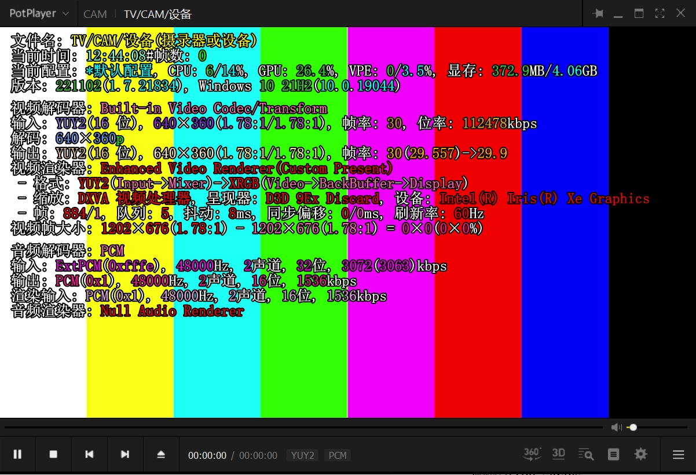
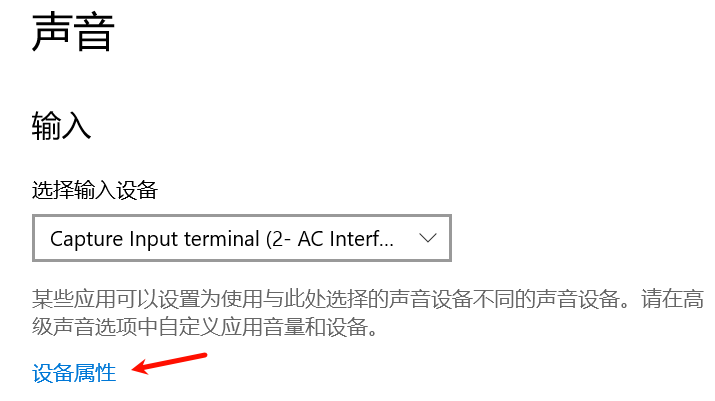
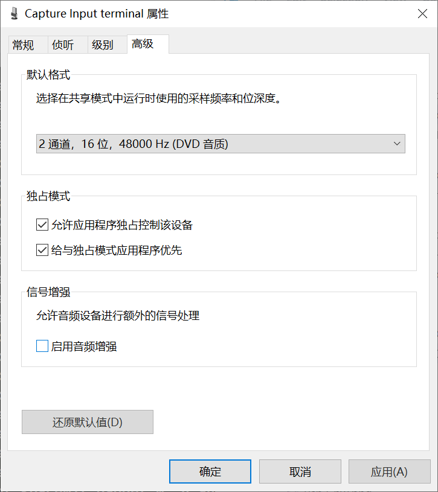
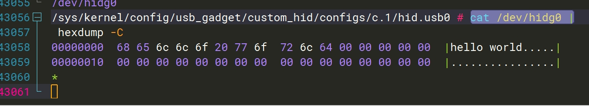

# USB Gadget 开发指南

适用范围： SpacemiT Linux 6.1, SpacemiT Linux 6.6

## Linux USB Gadget API 框架

### 概述

USB Linux Gadget 功能使得开发板可以作为一个 USB 外设通过 USB 接口接入到 USB 主机。

如使开发板作为一个 U 盘， USB 网卡， USB 串口等设备。

我们生活中把手机通过 USB 连接到 PC 上，可以传输数据、 ADB 调试、共享网络等功能，就是基于 USB Linux Gadget 实现。


USB Device 角色驱动框架自底向上可以分为以下几个层次：  
- **USB Device Controller Driver：** 这是 USB Device 角色控制器驱动层，负责初始化控制器硬件及进行底层数据收发操作。  
- **UDC Core：** 这是核心层，负责抽象出 USB Device 层次和基于 usb_request 的传输，并提供接口供上下交互使用。  
- **Composite Layer：** 为了让单个 Linux 终端作为 Gadget 时方便支持多个接口从而实现单个物理设备作为 USB 多功能外设， Linux USB Gadget 框架依据 USB2.0 ECN Interface Association Descriptor(IAD) 实现了 Composite Driver 中间层，从而上层只需要实现 function 驱动即可，用户可以自由组合这些 functions 形成一个多功能设备。 Composite layer 支持用户空间通过 configfs 配置，或者 legacy 驱动硬编码组合好的 Functions，我们下文都是基于 configfs 配置方法进行说明，不建议再使用 legacy 驱动。  
- **Function Driver：** 这是 USB Device 功能层，负责实现 USB Device 模式的功能驱动，对接内核其他框架（如存储、 V4L2 、网络等）。  
- **Configfs API：** configfs 是 Linux 内核中一个通过让用户创建、编辑目录结构和文件来配置内核功能的子系统， USB Gadget API 框架中，用户主要通过操作 configfs 的 usb_gadget 子目录下的目录结构、属性文件来进行 function driver、 USB 协议相关元信息配置（图中省去）。更多信息可以参考内核中的 Linux USB gadget configured through configfs 文档。
- **Userspace：** 大部分 USB gadget function 都依赖应用层的配置或与 Linux 的其他子系统的 API 交互，如网卡 gadget 需要用户完成网络配置， U 盘 gadget 需要用户完成块设备或文件系统配置（框图中省去这部分子系统的部分）。部分 USB gadget function 还需要应用层的服务才能够正常工作，如 ADB (Android Debug Bridge) 功能、 MTP 功能等。

这些层次结构共同构成了 Linux 系统中 USB 子系统的框架，确保了 USB 模块系统中的正常运行和数据传输。

内核文档参考资料：
- [Linux USB gadget configured through configfs | The Linux Kernel documentation ](https://www.kernel.org/doc/html/latest/usb/gadget_configfs.html)：简要介绍了如何使用 configfs 进行 gadget 配置。
- [Linux USB Gadget Testing | The Linux Kernel documentation ](https://www.kernel.org/doc/html/latest/usb/gadget-testing.html)：该文档介绍了各个 function 的 configfs 属性的介绍和简要的测试方法介绍。


### Kernel menuconfig 配置

这里仅介绍 Linux USB Gadget 相关的配置，板级 DTS、 USB IP 驱动的配置请参考 BSP 外设驱动开发文档的 USB 相关章节。

首先，要打开 `USB_CONFIGFS` 配置，从而用户可以使用 Configfs 配置启用 function driver。
打开后， `USB_CONFIGFS` 的子菜单下就会展示出各个 `USB_CONFIGFS_` 前缀开头的 Function Driver 的配置可供启用。

```
Location:
  -> Device Drivers
    -> USB support (USB_SUPPORT)
        -> USB Gadget Support (USB_GADGET)
        -> USB Gadget functions configurable through configfs (USB_CONFIGFS)
            -> Abstract Control Model (CDC ACM) (CONFIG_USB_F_ACM)
            -> Network Control Model (CONFIG_USB_F_NCM)
            -> RNDIS (CONFIG_USB_F_RNDIS)
            -> Mass storage (CONFIG_USB_F_MASS_STORAGE)
            -> Function filesystem (FunctionFS) (CONFIG_USB_F_FS)
            -> USB Webcam function (CONFIG_USB_F_UVC)
            -> HID function (CONFIG_USB_F_HID)
            -> USB Gadget Target Fabric (CONFIG_USB_F_TCM)
```

这里仅列举了一些比较常用的 Function Driver 的 menuconfig，用户配置打开时注意下也同时把相应依赖 Depends on 的 menuconfig 打开即可 .

更多具体的驱动，可以到 menuconfig 的 help 或者内核的 drivers/usb/gadget/function/ 目录查看，目录的 `u_` 前缀的文件
是服务于 `f_` 前缀的 function driver 的 Utility 的意思。

用户如果需要联合应用层和内核一起调试，可以打开以下内核配置选项，打开后，将会有更多打印信息，方便定位报错的原因等，这些选项都是默认关闭的：

```
CONFIG_USB_GADGET_DEBUG=y
CONFIG_USB_GADGET_VERBOSE=y
CONFIG_USB_GADGET_DEBUG_FILES=y
CONFIG_USB_GADGET_DEBUG_FS=y
```

其他的相关的 menuconfig 配置项用户可自行探索，如 `USB Gadget precomposed configurations` 下可以配置
开机自动配置的 function driver，默认选取第一个 UDC，只是灵活性和调试便利程度不如我们通过 configfs API 进行配置，
通常不建议打开，这会使得 Bianbu 系统中自带的开机自启的 ADB 服务无法正常工作。

### FunctionFS

如果用户需要在内核已有的功能之外，开发自定义端点配置、协议的 USB Gadget function driver，可以基于 FunctionFS 开发。

介绍以下 FunctionFS, 不同于其他确定的特定功能的 Function Driver, FunctionFS 实现
了一套灵活的 User mode file system API 机制供用户自定义 USB 协议使用。
通过 FunctionFS 驱动，用户可以实现应用层的 Function Driver，通过应用程序提供 USB 
描述符、端点配置、数据传输。我们熟悉的
手机上的 **ADB(Android Debug bridge)**， **MTP(Media Transfer protocol)** 都是基于 FunctionFS 实现的。

内核中提供了一套简单 bulk 传输 demo，源文件位于 kernel 源码的 tools/usb/ffs-aio-example 目录下。
用户在跑通 demo 的基础上，可以定制修改该 demo 实现自己的自定义协议传输。

本文会介绍基于 FunctionFS 的 ADB function、 MTP function 以及用户自定义协议的 demo。 

## USB Gadget 功能配置

具体详细的 configfs 配置可以参照概述中提到的内核文档参考资料。

本文档主要基于 [SpacemiT usb-gadget 仓库 ](https://gitee.com/bianbu-linux/usb-gadget) 
提供的 `scripts/gadget-setup.sh` 配置脚本进行讲解，注意切换至最新的发布分支，保证获取最新内容。

请用户在继续阅读本文档的更多章节前，可以打开最新的 `gadget-setup.sh` 脚本源码搭配阅读更易于理解。

脚本采用模块化配置多 function。把每个 function 的 configfs 配置分为 _config，
_link，_unlink，_clean 部分。该仓库的主要作用是帮助用户快速跑通 demo。

具体细节的 configfs 配置可查看脚本代码，可根据需求摘取删减内容定制开发。

### 概述

在开发板的系统中执行 gadget-setup.sh 脚本可以完成 USB 功能的配置，基本使用方法可以
执行命令 gadget-setup.sh help 查看。

gadget-setup.sh 脚本配置的 gadget 实例名称为
spacemit， VID/PID 序列号和 USB 厂商、产品名称字符串均在脚本中配置，用户有需要可以进行定制修改（但是需要注意这是需要向 USB-IF 购买后分配的）。

每个 /sys/kernel/config/usb_gadget 下的 gadget 实例，启用时都会绑定一个 UDC,
使用脚本配置特定功能后，可以在 configfs 中发现对应 UDC 已经被绑定：
```
# 举例：使用 K1 的 USB3.0 控制器作为 UDC
/sys/kernel/config # cat usb_gadget/spacemit/UDC
c0a00000.dwc3
```

注意 Buildroot 和 Bianbu 都系统自带了 ADB，默认在第一个 UDC 上加载
（即 K1 的下载 USB0 口对应的控制器）。

如果使用脚本时发现第一个 UDC 被占用，可以使用下面命令关闭系统的 ADB 服务解除占用：
```
# Buildroot
~ # /etc/init.d/S50adb-setup stop
# Bianbu 使用 systemctl 关闭 adbd 服务
~ # systemctl stop adbd
```

gadget-setup 运行时也会检查 UDC 占用情况，扫描到目标 UDC 被占用后，会打印 `ERROR: Your udc is occupied by...`
```
~ # gadget-setup ncm
gadget-setup: Selected function ncm
....
gadget-setup: We are now trying to echo c0a00000.dwc3 to UDC......
gadget-setup: ERROR: Your udc is occupied by: /sys/kernel/config/usb_gadget/g1/UDC
gadget-setup: ERROR: configfs preserved, run gadget-setup resume after conflict resolved
```

### UVC (USB Video Class)

**相关的参考资料**
- [USB Video Class v1.5 document set](https://www.usb.org/document-library/video-class-v15-document-set)
- [Linux UVC Gadget Driver Document](https://docs.kernel.org/6.16/usb/gadget_uvc.html)

**需要打开的配置：** `CONFIG_USB_F_UVC`

UVC 功能是开发板作为摄像头，依赖应用程序 uvc-gadget-new 提供数据源，该程序源码可以在
[SpacemiT usb-gadget 仓库 ](https://gitee.com/bianbu-linux/usb-gadget) 下载，用户根据自己需求可对源码进行编译、二次开发。

**帧格式和 USB 带宽介绍：**

UVC 协议采用 USB 的同步传输，由于 USB 总线需要保障同步传输的带宽稳定占用，必须留出带宽供其他非同步传输的设备使用，因此同步传输无法占用所有总线带宽，存在最大可用带宽限制。

USB2.0 HighSpeed 同步传输最大带宽可以通过 configfs 中的 `streaming_maxpacket` 调整，可选： 1024 ， 2048 ， 3072 ，这决定了 USB 总线上对该同步传输一个微帧最多传输多少数据，对应的最大带宽为分别为 7.8125MBps， 15.625MBps， 23.4375MBps。

USB3.0 SuperSpeed 同步传输最大带宽为 351.5625MBps，可以通过 configfs 中的 `streaming_maxpacket` 和 `streaming_maxburst` 调整。 `streaming_maxburst` 可选 1 到 15 。

configfs 中可配置的影响最大带宽的参数有：
- `streaming_interval`： 配置同步传输端点描述符中的 `bInterval`， 1..255 ，越小最大带宽越大。
- `streaming_maxpacket`： 配置同步传输端点描述符中的 `wMaxPacketSize`，可选 1024/2048/3072 ，越大带宽越大。
- `streaming_maxburst`： 配置同步传输端点描述符中的 `bMaxBurst`， 1..15 ，越大最大带宽越大，仅限 USB3.0 有效。

这里给出常见的 YUV 格式数据的带宽需求， MJPEG 由于有压缩，会比 YUV 带宽需求小很多，使得 USB2.0 也可以传输全高清、 4K 格式。

| 格式（ YUV）      | 长 | 宽 | 帧率  | 带宽 (MBps)      |
|------------------|---------|--------|------|---------------|
| 240p@30          | 480     | 240    | 30   | 6.591796875   |
| 360p@15          | 360     | 640    | 15   | 6.591796875   |
| 360p@30          | 360     | 640    | 30   | 13.18359375   |
| 720p@10          | 720     | 1280   | 10   | 17.578125     |
| **640p@30**      | **640** | **640**|**30**| **23.4375**   |
| 720p@15          | 720     | 1280   | 15   | 26.3671875    |
| 360p@60          | 360     | 640    | 60   | 26.3671875    |
| 720p@15          | 720     | 1280   | 15   | 26.3671875    |
| 480p@60          | 480     | 640    | 60   | 35.15625      |
| 720p@30          | 720     | 1280   | 30   | 52.734375     |
| 1080p@15         | 1080    | 1920   | 15   | 59.32617188   |
| 720p@60          | 720     | 1280   | 60   | 105.46875     |
| 1080p@30         | 1080    | 1920   | 30   | 118.6523438   |
| 1080p@60         | 1080    | 1920   | 60   | 237.3046875   |
| 4k@30            | 3840    | 2160   | 20   | 316.40625     |

**首先介绍测试图案 demo 配置方法：**

板子做 usb device， UVC 配置可选用两种方法：

1. 使用专用 uvc 脚本（推荐），支持更多 uvc 配置，方便用户定制分辨率（详情和更多参数用法请查看
脚本源文件），
独立 USB PID：
```
$ uvc-gadget-setup.sh start
$ uvc-gadget-new spacemit_webcam/functions/uvc.0
```

1. 使用 composite gadget 脚本，内置常用分辨率，支持 uvc 与其他功能同时使用。
```
$ gadget-setup.sh uvc
$ uvc-gadget-new spacemit/functions/uvc.0
```

用户也可以根据实际产品需求自己定制 gadget-setup 脚本。

随后接入 PC，打开常用的摄像头软件（如 Windows 下 potplayer,amcap， Linux 下 guvcview），
即可看到彩色图案：


**再介绍如何把真实摄像头的数据流通过 V4L2 框架接入到 uvc gadget 中**，视频图像的数据流如下字符画所示：

```
+------------------+       +------------------+
|  Source Camera   |       |  Linux System    |
|  (MIPI/USB)      |       |                  |
|  +------------+  |       |  +------------+  |
|  | Sensor     |  |       |  | V4L2       |  |
|  |            |--+-------+->| Framework  |  |
|  +------------+  |       |  +------+-----+  |
+------------------+       |         |        |
                           |  +------v-----+  |
                           |  | App        |  |
                           |  |            |  |
                           |  | uvc-gadget-new|
                           |  +------+-----+  |    +------------------+
                           |         |        |    |  PC Host         |
                           |  +------v-----+  |    |                  |
                           |  | USB UVC    |  |    |  +------------+  |
                           |  | Gadget driver |    |  | Camera App |  |
                           |  +------+-----+  |    |  +------------+  |
                           +---------|--------+    +------|-----------+
                                     |                    |
                                     |       USB Cable    |
                                     +--------------------+
                                         Act As a Camera
```

首先，配置中的分辨率要匹配数据源摄像头的 V4L2 的数据规格，主要是帧格式（含编码格式、图像大小、帧率）、
数据缓冲区大小。

用户需要在 `uvc-gadget-setup.sh` 中的 `setup_custom_profile()` 
中参照已有注册方式注册数据源摄像头的实际参数。

然后，跑以下命令：
```
$ uvc-gadget-setup.sh start custom
$ uvc-gadget-new spacemit_webcam/functions/uvc.0 -d /dev/videoX 
```
注意其中 videoX 的 X 要替换为用户真实的摄像头在 K1 开发板上的 video 设备节点的第一个，
如 video17 。

此时如果顺利，上位机打开摄像头选择对应帧格式（必须是真实摄像头支持的帧格式）默认参数就可以
出图。

大部分情况，我们会发现数据源 Camera 的 V4L2 数据缓冲区大小
和 USB Gadget 脚本配置的 `dwMaxVideoFrameSize` 的 Default 值不对等，
从而会出现如下报错：

```
/dev/video17: buffer 0 too small (460800 bytes required, 256000 bytes available).
Failed to import buffers on sink: Invalid argument (22)
```

这主要是由于 MJPG 等压缩编码的灵活性使得 `dwMaxVideoFrameSize` 会因摄像头、特定帧格式而异。

此时我们需要记录 `available` 的数据大小，这里是 256000 （ 460800 是根据特定帧格式脚本自己
计算的默认值）。

然后，编辑 `~/.uvcg_config` 配置文件，使得对应编码 + 分辨率（需要脚本中已配置了相应的格式）指代的帧格式映射到
自定义的 `dwMaxVideoFrameBufferSize`，填入上面报错的 256000 ：
```
~ # cat ~/.uvcg_config
# .uvcg_config for spacemit-uvcg, config line format:
#     <format:[mjpeg]> <width> <height> <dwMaxVideoFrameBufferSize>
# e.g. mjpeg 640 360 251733
mjpeg 1280 720 25600
```

该逻辑在 `uvc-gadget-setup.sh` 脚本中的 `add_uvc_fmt_resolution()` 实现。
以这里为例， 25600 最终会被写入到以下这个路径的配置属性文件中：
```
/sys/kernel/config/usb_gadget/spacemit_webcam/functions/uvc.0/streaming/mjpeg/m/720p/dwMaxVideoFrameBufferSize
```

配置完成后再重新执行上面的启动脚本和 UVC APP 的命令即可。

最终量产方案可以定制脚本来适配， `uvc-gadget-setup` 主要目的是提供一个方便反复调试的脚本。

### UAC (USB Audio Class)

**相关的参考资料**
- [USB Audio Class v1.0](https://www.usb.org/sites/default/files/audio10.pdf)
- [USB Audio Class Rev 2.0](https://www.usb.org/document-library/audio-devices-rev-20-and-adopters-agreement)
- [ALSA Project](http://www.alsa-project.org/)

**需要打开的配置：** `CONFIG_USB_F_UAC1`, `CONFIG_USB_F_UAC2`

UAC 功能是开发板作为声卡，上层需要 `alsa-utils` 应用程序管理音频，建议在 Bianbu 下调试。

内核中有两个驱动，分别是 UAC 1.0 和 UAC 2.0 。

从 USB 规范上看， UAC2.0 主要是在
采样精度、最大带宽、控制接口、时钟同步等进行了优化，更多具体信息可以参阅上面给出的资料。

从兼容性的角度看， Linux 内核目前支持的 UAC 1.0 和 UAC 2.0 Gadget，在不同平台和
不同功能的兼容性不一致。

如在 Windows 操作系统上， UAC2.0 的兼容性存在问题，无法支持
音量调节等； macOS 和 Linux 的兼容性更好。

下文中提到的配置，都基于下图的连接关系进行：

    ALSA Audio Device -----> K1 Development Board ----USB----> Linux/Windows PC 
                                (UAC Gadget)                      USB Host

其中 ALSA Audio Device 可以使用开发板的接口接入模拟耳机或 USB 耳机（支持录音）或其他音频设备。

在开发板 Bianbu 系统上首先需要安装 `alsa-utils`：
- Bianbu 使用 apt 安装 `alsa-utils` 软件包。
- Buildroot 系统启用 `BR2_PACKAGE_ALSA_UTILS` 和其他相关配置。

`gadget-setup` 脚本已集成了 UAC 功能，首先根据需求执行以下命令拉起 UAC Gadget：

    # 使用 UAC 1.0
    gadget-setup.sh uac1
    # 使用 UAC 2.0
    gadget-setup.sh uac2

执行后，通过 USB 连接到 PC， PC 即可看到音频设备。

- UAC1.0 在 Windows 10 ( 本文档采用 21H2) 的设备名称是 AC— Interface

  

- UAC2.0 在 Windows 10 PC 上的音频设备名称是 Source/Sink
- UAC1.0/UAC2.0 在 Linux PC 上的音频设备名称是 USB Gadget 的 Product String
    ```
    root@M1-MUSE-BOOK:~# aplay -l
    **** PLAYBACK Hardware Device List ****
    card 1: Device [SpacemiT Composite Device], device 0: USB Audio [USB Audio]
        subdevice: 0/1
        subdevice #0
    ```

接下来分别介绍 UAC Gadget 的主要功能：播放和录音。

**Windows PC 播放音频到 UAC gadget**

1. 任务栏找到音量图标，右键打开声音设置，先配置播放设备为我们的 UAC Gadget（根据上文的介绍找到对应名称的设备）：

    

2. 在作为 UAC Gadget 的 K1 开发板命令行执行 `aplay -l` 命令和 `arecord -l` 命令：

    ```
    root@spacemit-k1-x-deb1-board:~# aplay -l
    **** PLAYBACK 硬體裝置清單 ****
    card 0: C [H180 Plus (Type C)], device 0: USB Audio [USB Audio]
    子设备 : 0/1
    子设备 #0: subdevice #0
    card 1: sndes8326 [snd-es8326], device 0: i2s-dai0-ES8326 HiFi ES8326 HiFi-0 []
    子设备 : 1/1
    子设备 #0: subdevice #0
    card 2: UAC1Gadget [UAC1_Gadget], device 0: UAC1_PCM [UAC1_PCM]
    子设备 : 1/1
    子设备 #0: subdevice #0
    root@spacemit-k1-x-deb1-board:~# arecord -l
    **** CAPTURE 硬體裝置清單 ****
    card 0: C [H180 Plus (Type C)], device 0: USB Audio [USB Audio]
    子设备 : 1/1
    子设备 #0: subdevice #0
    card 1: sndes8326 [snd-es8326], device 0: i2s-dai0-ES8326 HiFi ES8326 HiFi-0 []
    子设备 : 1/1
    子设备 #0: subdevice #0
    card 2: UAC1Gadget [UAC1_Gadget], device 0: UAC1_PCM [UAC1_PCM]
    子设备 : 0/1
    子设备 #0: subdevice #0
    ```

    这里记录 card x, device y 数字。后续我们会使用它们来建立录制和播放管道，
    如这里 "2,0" 是我们的 UAC1Gadget 音频设备，"0,0" 是我们的耳机。

3. K1 开发板执行以下命令即可从 "2,0"(UAC1Gadget) 录制，并且播放到 "0,0"(H180 Plus 耳机 )：
    ```
    arecord -f dat -t raw -D hw:2,0 | aplay -f dat -D hw:0,0
    ```

    可能会出现报错：

    ```
    root@spacemit-k1-x-deb1-board:~# arecord -f dat -t raw -D hw:2,0 | aplay -f dat -D hw:0,0
    arecord: main:834: aplay: main:834: 音乐打开错误： 设备或资源忙
    音乐打开错误： 设备或资源忙
    ```

    这是因为目前 UAC Gadget 驱动和 ALSA 交互实现上细节导致音频设备状态不匹配导致的。

    我们可以以下操作进行规避， Windows 会操作设备让 Gadget 端的音频设备进入 Capture 状态：

    (1) 切换播放设备后，先开始在对应设备（如 UAC1 是 AC-Interface）播放音乐，再重新在 K1 执行命令。

    (2) 如果 (1) 后执行上面的命令还是报错，先切换到其他声卡，播放音乐再切换到对应设备（如 UAC1 是 AC-Interface）。

    此时再执行命令， K1 开发板上就会正常开始从 `hw:2,0` 设备（ UAC1Gadget）录制，
    并且播放到 `hw:0,0` 设备（ H180 Plus 耳机）：

    ```
    root@spacemit-k1-x-deb1-board:~# arecord -f dat -t raw -D hw:2,0 | aplay -f dat -D hw:0,0
    正在录音 原始資料 'stdin' : Signed 16 bit Little Endian, 频率 48000Hz， Stereo
    正在播放 原始資料 'stdin' : Signed 16 bit Little Endian, 频率 48000Hz， Stereo
    ```

**Linux PC 播放音频到 UAC gadget**

Linux 桌面系统各发行版图形界面并不一致，
这里简要介绍 Linux PC 命令行播放音频到 K1 开发板，并且使用 K1 开发板上的另一个耳机设备收听：

1. 通过  `aplay -l` 找到 K1 开发板模拟的 UAC 设备，如这里是 hw:1,0 。
    ```
    root@mbook:~# aplay -l
    **** PLAYBACK Hardware Device List ****
    card 1: Device [SpacemiT Composite Device], device 0: USB Audio [USB Audio]
        subdevice: 0/1
        subdevice #0
    ```
2. 下载一个 wav 音频文件重命名为 test.wav。
3. 系统图形界面不要绑定 K1 开发板模拟的 UAC 设备，否则会出现报错。
4. Linux PC 上使用 aplay 命令播放 test.wav 到 UAC gadget:
    ```
    root@mbook:~# aplay test.wav -c 2 -r 48000 -D plughw:1,0
    ```
5. K1 开发板执行以下命令即可从 "2,0"(UAC1Gadget) 录制，并且播放到 aplay -l 列出的 "0,0" 设备：
    ```
    arecord -f dat -t raw -D hw:2,0 | aplay -f dat -D hw:0,0
    ```

**Windows PC 从 UAC gadget 录制音频**

1. 任务栏找到音量图标，右键打开声音设置，先配置录音设备为我们的 UAC Gadget（根据上文的介绍找到对应名称的设备）：

    

2. 务必在 1. 的 Windows 设置页面进入 -> 设备属性 -> 更多设备属性 -> 高级 -> 信号增强，取消勾选“启用音频增强”：
    

3. 下载一个 wav 音频文件重命名为 test.wav。

4. K1 开发板上执行以下命令进行播放（ hw:2,0 要根据 aplay -l 中找到对应的 UAC1Gadget）
    
    ```
    root@spacemit-k1-x-deb1-board:~/ffs# aplay test.wav -c 2 -r 48000 -D plughw:2,0
    正在播放 WAVE 'test.wav' : Signed 16 bit Little Endian, 频率 48000Hz， Stereo
    ```
    如果出现报错：“ aplay: pcm_write:2146: 写入错误：输入 / 输出错误，可以尝试先打开 Windows 录音软件，
    开始录制再回到 K1 开发板执行 aplay 播放命令。

5. 打开 Windows 录音软件，开始录制。

6. 如果录制的音频有问题，请检查 Windows 的“音频增强” 功能是否关闭。

**Linux PC 从 UAC gadget 录制音频**

此功能 Linux PC 图形界面操作和 Windows PC 步骤类似。

只是不同于 Windows 需要注意关闭 “音频增强” 功能， Linux PC 需要注意录音音量大小。

部分 Linux 发行版的录音音量要设置为 50 才是正常音量，大于 50 会进行放大，
此时可能会导致 UAC gadget 发送的音频数据发生失真。

Linux 使用命令行 arecord 命令录制音频为 wav 文件的命令步骤如下：

1. 通过  `arecord -l` 找到 K1 开发板模拟的 UAC 设备的 card、 device id 。
2. 系统图形界面不要绑定 K1 开发板模拟的 UAC 设备，否则会出现报错。
4. 执行 arecord 命令进行录制到 record.wav 文件：
    ```
    arecord -f dat -c 2 -D hw:1,0 -t wav -d 20 record.wav
    ```
    介绍其中参数的含义，
    - `-f dat` 是常用格式缩写（ arecord -h 可以看到帮助）
    - `-D hw:1,0` 要替换为第一步找到的设备对应值。
    - `-d 20` 是录制 20 秒。
5. K1 开发板执行命令开始播放音频（具体参数的值需要参考前面的介绍，特别是 hw:2,0 要替换为实际 UAC1Gadget 对应的值）：
   ```
   root@spacemit-k1-x-deb1-board:~/ffs# aplay test.wav -c 2 -r 48000 -D plughw:2,0
    正在播放 WAVE 'test.wav' : Signed 16 bit Little Endian, 频率 48000Hz， Stereo
   ```

**参数配置和二次开发**

UAC 有一些可配置的参数，脚本中进行了部分配置。

用户可参阅 UAC 规范、脚本源码和 [Linux USB Gadget Testing - UAC2 ](https://www.kernel.org/doc/html/latest/usb/gadget-testing.html#uac2-function) 等资料做二次开发。

### ACM (CDC-ACM: Communication Device Class - Abstract Control Model)

**需要打开的配置：** CONFIG_USB_F_ACM

ACM 是一类 USB 串口协议，即开发板作为一个串口设备，模拟串口设备，可以进行串口 Tx/Rx 传输。

启用 ACM 功能后，会在应用层生成 TTY 设备节点， Host 枚举开发板时也会枚举为串口设备，
两端可以通过操作串口设备节点进行通信。

使用也非常简单，运行 gadget 脚本拉起串口 gadget 后，

```bash
gadget-setup.sh acm
```

gadget board 这边的 Linux 中会在 /dev 下生成 `ttyGS*` 块设备节点，通常是 `/dev/ttyGS0` 。

Linux 下可以使用 picocom、 minicom 工具或者命令行的 echo/cat 命令， Linux PC 下通常生成的设备节点名称前缀为
`/dev/ttyACM*`。

Windows 下可以使用常用的串口工具如 SecureCRT、 WindTerm 等通信，串口对应的 COM 序号
可以通过设备管理器或者 [USBTreeView](https://www.uwe-sieber.de/usbtreeview_e.html) 
查看。

### ADB (Android Debug Bridge)

**需要打开的配置：** `CONFIG_USB_F_FS`, `CONFIG_NET` 相关网络配置（上层应用程序依赖网络）。

Android 调试桥（ ADB）是一种多功能命令行工具，可让您与设备进行通信，使用 ADB Shell 
在设备上运行各种命令，上传下载文件、
重启、进入刷机模式等。 ADB 支持 USB 传输和网络传输。

`gadget-setup.sh` 通用脚本集成了 ADB 功能，是基于 FunctionFS 实现的，此外需要上层应用
adbd 才能正常运行。

Buildroot 中可以通过 `BR2_PACKAGE_ANDROID_TOOLS_ADBD` 启用 adbd 服务程序的编译，
Bianbu 系统中可以通过 apt 命令行工具安装 `android-tools` 包。

注： Bianbu / Buildroot 有默认集成 adb 功能， gadget-setup.sh 不能和系统集成的同时使用。
可以通过查看 `/sys/kernel/config/usb_gadget` 中的目录找到不同的 usb gadget 实例。

下面介绍使用 `gadget-setup.sh` 脚本配置 adb 功能的步骤：

```
# 配置 adb
gadget-setup.sh adb
# 停止 adb
gadget-setup.sh stop
```

ADB 的用法简要介绍：

PC 可以通过官方途径下载 adb 软件包 [platform-tools](https://adbdownload.com/)，
下载解压后，并且把 bin 目录加入到系统 PATH 环境变量里面去。

基本的 adb 命令：

```
# 把 PC 的文件推送到开发板：
adb push C:/xxx.yyy /home/bianbu/
# 把开发板的文件拉取到 PC：
adb pull /home/bianbu/remote_file C:/
# 进入刷机模式 ：
adb reboot fastboot
```

Ubuntu(Linux) PC 上的 adb 命令行工具工具可能会出现以下报错：

```
$ adb devices
List of devices attached
735ec889dec8 no permissions(user in plugdev group;are your udev rules wrong?);see [http://developer.android.com/tools/device.html]usb:3-3.3 transport_id:1
```

解决办法是，编辑 /etc/udev/rules.d/51-android.rules，加入这一行：

``` 
$ sudo vi /etc/udev/rules.d/51-android.rules
SUBSYSTEM=="usb", ATTR{idVendor}=="361c", ATTR{idProduct}=="0008", MODE="0666", GROUP="plugdev"
```

然后重新加载 udev rule:

```
$ sudo udevadm control --reload-rules
```

Windows 系统中， SpacemiT 开发板的 adb 驱动会在安装 titan 刷机工具时一并安装。

### MTP (Media Transfer Protocol)

**相关的 USB Spec:**
- [Media Transfer Protocol v.1.1 Spec](https://www.usb.org/document-library/media-transfer-protocol-v11-spec-and-mtp-v11-adopters-agreement)

**需要打开的配置：** `CONFIG_USB_F_FS`。

MTP 是媒体文件传输协议，目前 USB-IF 维护。广泛应用于手机、相机与电脑的文件传输中，如手机通过 USB 接入电脑后可以查看相册就是使用 MTP。

对比 Mass Storage 的一旦挂载后手机就无法访问对应块设备或镜像的文件系统， MTP 可以让手机和 PC 同时访问对应文件系统，使用更加便捷。

前面已经提到， MTP function 也是基于 FunctionFS 实现的，因此需要应用层服务程序。我们这里将采用 [umtp-responder](https://github.com/viveris/uMTP-Responder) 作为我们的服务程序，这是一个轻量级的 MTP 服务器，在开发板上， Buildroot 和 Bianbu 都可以直接使用：
- Buildroot 通过 `CONFIG_BR2_PACKAGE_UMTPRD` 启用编译即可使用；
- Desktop 中通过 apt 安装 `umtp-responder` 软件包安装即可使用；
- 其他 OS，可以从 [Github 的源码 ](https://github.com/viveris/uMTP-Responder) 自行构建即可。

`gadget-setup.sh` 中已经集成基于 umtp-responder 的 MTP function 配置，按照上面步骤安装完成后，执行：

```
gadget-setup.sh mtp
```

即可拉起 MTP function。

我们以 Windows PC 作为上位机举例， MTP 已经实现了免装驱动，于是在 Windows 设备管理器和资源管理器将能够看到相关的便携设备，默认脚本配置的产品名称为 SpacemiT Technologies：


其他 OS（ macOS、 Linux 各发行版）类似。

MTP 支持挂载多个 storage 对象，每个对象可以配置本机路径、名称、读写权限， `umtp-resonder` 在 `/etc/umtprd/umtprd.conf` 中进行配置：

```
storage "/var/lib/umtp" "shared folder" "rw"
# storage "/home/USER/foo"  "home folder" "rw"
# storage "/www"            "www folder" "ro,notmounted"
```

脚本默认配置了一个共享目录，
开发板本机路径是 `/var/lib/umtp`，起名为 `shared folder`（此名字和实际本机路径是独立可配置的，比如相机文件夹可以起名为 DCIM），挂载为可读写，
可用容量对应开发板中本机路径的挂载设备容量。


对比 Mass Storage 两方只有一方能独占一个块设备或镜像， MTP 协议非常的方便和灵活：
当 PC 往该目录读写文件时，会实时在开发板本机观察到更新 , 反之亦然。

通常用户对 MTP Gadget 的参数有定制需求，请用户参考以下资料帮助理解如何定制：
-  `gadget-setup.sh` 脚本中如何对 `umtp-responder` 进行配置。
-  `umtp-responder` 项目的 `README`。
- `umtp-responder` 安装后的默认配置文件 `/etc/umtprd/umtprd.conf`，其中可以定制产品名称、配置 PC 可访问的本机存储路径和权限。
- MTP 协议设计规范。

### Mass Storage (BOT 协议 , f_mass_storage)

**相关的 USB Spec:**
- [USB Mass Storage Class - Bulk-Only Transport](https://www.usb.org/sites/default/files/usbmassbulk_10.pdf)

**需要打开的配置：** `CONFIG_USB_F_MASS_STORAGE`

开发板作为一个 U 盘设备。 BOT 协议是 Bulk Only Transport。
支持挂载独占镜像或设备节点，此时设备节点将会无法被其他应用使用。
使用内存盘默认格式化为 fat32, Bianbu 需要先安装 `sudo apt install dosfstools`， 其他系统需要有 mkdosfs 命令支持。
具体容量配置可以查看脚本实现。

```
gadget-setup.sh msc:< 镜像或设备节点 >
# 举例
gadget-setup.sh msc:/dev/nvme0n1

# 使用内存盘
gadget-setup.sh msc
```

### Mass Storage ( 支持 UASP + BOT 协议 , f_tcm)

**相关的 USB Spec:**

- [USB Attached SCSI Protocol](https://www.usb.org/document-library/usb-attached-scsi-protocol-uasp-v10-and-adopters-agreement)

**需要打开的配置：** `CONFIG_USB_F_TCM`, `CONFIG_TARGET_CORE`, `CONFIG_TCM_IBLOCK`, `CONFIG_TCM_FILEIO`

开发板作为一个 U 盘设备。 UASP(USB Attached SCSI Protocol) 提升了传输效率。
支持挂载独占镜像或设备节点，此时设备节点将会无法被其他应用使用。
使用内存盘默认没有文件系统。

```
gadget-setup.sh uas:< 镜像或设备节点 >
# 举例
gadget-setup.sh uas:/dev/nvme0n1

# 使用内存盘
gadget-setup.sh uas
```

### RNDIS (Remote Network Driver Interface Specification)

**需要打开的配置：** `CONFIG_USB_F_RNDIS`, `CONFIG_NET` 等网络子系统相关配置。

作为一个网卡设备。 RNDIS 是微软的专利协议。微软的相关文档参考：
- [Introduction to Remote NDIS (RNDIS) | Microsoft](https://learn.microsoft.com/en-us/windows-hardware/drivers/network/remote-ndis--rndis-2)

运行以下命令拉起 rndis gadget：
```
gadget-setup.sh rndis
```

另外最新脚本增加快捷运行 dhcp 服务器功能，依赖 busybox udhcpd ( 自构建 busybox 需要启用 CONFIG_UDHCPD)，只需要执行

```
gadget-setup.sh dhcp
```

就会自动为网卡配置 ip 地址，并且支持给 PC 通过 DHCP 协议分配 IP 地址，具体请查看脚本实现。

#### PC 共享互联网给开发板
本节内容为，对于无直接网络环境只有 RNDIS USB Gadget 连接的开发板，
把 Windows 访问互联网的能力共享给开发板，使得开发板访问互联网。

1. 执行命令：
    ```bash
    gadget-setup rndis
    ```
2. 打开 Windows 网络与共享中心
3. 打开共享网络配置选择一个连接了外网的网络，如 WIFI、有线网络
4. 右键点击属性，
5. 点击共享，然后勾选允许其他网络用户通过此计算机的 Internet 连接来连接。
6. 在选择家庭网络连接列表中选择为用户的 RNDIS 设备（图中以太网 5 是用户的 USB 开发板 RNDIS 设备 , 以太网 14 是用户的 WIFI/ 有线网）：

    

1. 点击确定。
2. 开发板执行 udhcpc -i usb0 获取 Windows 为其分配的 IP 地址。

Windows 还可以基于网桥，请参考相关 Windows 官方手册。

对于 Linux PC，各图形界面不一致这里不介绍，但是网络配置非常灵活，可参考 Linux 相关网络命令工具配置教程。

### NCM (CDC-NCM: Communication Device Class - Network Control Model)

**相关的 USB Spec:**
- [USB CDC-Subclass Specifications For NCM](https://www.usb.org/sites/default/files/NCM11.pdf)

**需要打开的配置：** `CONFIG_USB_F_NCM`, `CONFIG_NET` 等网络子系统相关配置。

不同于 RNDIS 由微软维护， NCM 是 USB-IF 维护网络协议，主流操作系统（ Linux,Windows 11,macOS 等）具备支持。
注：目前 Windows 10 的 ncm 驱动实现和 Linux 6.6 中 ncm gadget 兼容性不是最佳，微软在 Windows 11 才进行修复。

```
gadget-setup.sh ncm
```

另外最新脚本增加快捷运行 dhcp 服务器功能，依赖 busybox udhcpd，只需要执行

```
gadget-setup.sh dhcp
```

就会自动为网卡配置 ip 地址，并且支持给 PC 通过 DHCP 协议分配 IP 地址，具体请查看脚本实现。

对于需要使开发板共享 Windows 的，参考 RNDIS 章节的 "Windows 共享互联网给开发板 " 内容，但是第一步命令要改成 ncm 而不是 rndis。

### HID (Human Interface Device)

**需要打开的配置：** `CONFIG_USB_F_HID`

**USB HID 相关文档：**
- [HID 类协议介绍描述 ](https://www.usb.org/sites/default/files/hid1_11.pdf)
- [HID Usage Page keycode 对照表 ](https://www.usb.org/sites/default/files/hut1_4.pdf)
- [USB-IF Report Desc 生成工具 ](https://www.usb.org/document-library/hid-descriptor-tool)

HID 是人体工学设备， HID Gadget 通常用于模拟键盘鼠标、游戏手柄、音量媒体控制设备，
有时候也会利用 HID 免驱特性用于传输小数据量数据。

```bash
gadget-setup.sh hid
```

脚本中值得注意的有 report 格式，在脚本中的 REPORT_DESC 定义，用户可以通过全局搜索找到他，并且做修改。

具体的 report 格式配置需要熟读 HID 协议，更多详细内容可以参考相关的内核文档、规范文档。

执行脚本后， gadget 端会生成 /dev/hidg0 节点。后续用户通过这个节点和上位机进行通信，比如用户要发送鼠标键盘模拟数据，
就要往这个设备节点写入数据，写入的数据格式遵守 HID report_desc。

**模拟键盘鼠标** 场景的细节可以参考 [ 这个内核文档 ](https://www.kernel.org/doc/html/latest/usb/gadget_hid.html)。不过要注意的是这个文档第一步讲解的是传统的基于 g_hid 做的，我们目前用的是 configfs 的配置方法（从 Configuration with configfs 章节开始），用户可以参考第一步其中的 report_desc。文档中实现了一个上报数据的 app 是 hid_gadget_test，在 gadget 端运行他，然后输入相关内容， gadget 就会给上位机报告用户所需要上报的键盘鼠标输入数据了。

除此之外最简单是测试 IO 方法可以使用 python 和 cat/hexdump 工具（不完整处理和解析 HID report 格式）：

1. 这里以 PC 发， Device 收举例，开发板 linux 系统下是打开 open 一个字符节点 read， Shell 中我们这里演示用 cat 不断读取，
通过 hexdump 解析数据打印出来：
```
cat /dev/hidg0 | hexdump -C
```

1. Windows PC 采用 python 免驱发送 helloworld： python 先安装依赖

```bash
pip install hidapi  # Windows/Linux 通用
```

4. PC 使用 python 通过 HID 协议向设备发送 hello world：
```python
import hid

"""
注意这段代码是在 PC 运行的
"""
# 查找自定义 HID 设备
device = hid.device()

# 根据厂商 ID 和产品 ID 打开设备
vendor_id = 0x361c  # SpacemiT
product_id = 0x0007  # 产品 ID
device.open(vendor_id, product_id)

# 设置非阻塞模式（可选）
device.set_nonblocking(1)

# 准备数据（开头需要添加报告 ID，通常为 0x00 ）
message = b"/x00" + b"hello world".ljust(63, b"/x00")  # 总长度 64 字节

# 发送数据
device.write(message)
print(" 已发送 : hello world")

# 接收响应（如果有）
data = device.read(64)
if data:
    print(f" 收到响应 : {bytes(data[1:]).decode('ascii').strip()}")  # 跳过报告 ID

# 关闭设备
device.close()
```

PC 脚本执行后，实测截图如下 (gadget 端 ):


### FFS Demo (FunctionFS)

这里将要介绍以下 FunctionFS demo 的跑通：

SpacemiT 基于 kernel 源码的 tools/usb/ffs-aio-example 目录下的 simple device_app 提供了
一版修改过的 app：

  - 基于 [WCID](https://github.com/pbatard/libwdi/wiki/WCID-Devices) 增加 WINUSB 免驱操作系统描述符，让 Windows 能够直接绑定 WINUSB 驱动从而应用层快速验证。
  - 改善打印和增加可读数据。

此代码发布于 [Gitee | SpacemiT Buildroot SDK / usb-gadget](https://gitee.com/bianbu-linux/usb-gadget)

把仓库 clone 到装有 bianbu/ubuntu 系统的 K1 开发板中后（为了简化验证过程，此处暂不介绍交叉编译的方法），按以下步骤执行可以跑通 ffs demo。

1. 首先在 Bianbu OS 上安装 libaio-dev 包，执行命令：
```
sudo apt update && apt install libaio-dev
```
2. 编译设备服务应用，依次执行命令：
```
make
make install
```
命令执行完成后，名为 demod 的二进制文件将被添加到 /usr/bin/ 目录下。 

3. 拉起 gadget 设备，由于 Bianbu 系统内置的 adb ffs 服务会占用 UDC 资源，需先停止该服务，执行命令：
```
systemctl stop adbd
```
随后执行命令拉起 ffs-demo gadget：
```
bash ffs-setup.sh start
```

4. 将 USB 线连接到 PC 主机，此时会看到一个名为 “ K1 AIO” 的新 USB 设备；在 Windows PC 上，
可以通过设备管理器查看到。在 Linux PC 上，可以通过 lsusb 查看到。


5. 链接到 Linux 主机上，可使用 tools/usb/ffs-aio-example/ 目录下的 host_app 与该 ffs 批量传输演示 gadget 设备通信。
具体过程很简单，（ 1 ）修改 host_app 中的 PID VID 匹配 ffs-setup.sh 中的 PID、 VID，然后在 Linux Host PC 上安装 libaio-dev 依赖，然后编译后执行这里省略。

6. 链接到 Windows 主机上，可使用基于 WINUSB 和 libusb 的用户态应用（例如 host_demo.py Python 脚本）进行通信。
这里简要介绍 host_demo.py Python 脚本，该脚本不限制操作系统。这里以 Windows 为例，

    (a) 若未安装 pyusb，需先执行 `pip install pyusb` 命令安装。

    (b) 为 Windows 系统安装 libusb 后端（可从 https://libusb.info/ 下载）； 

    (c) 将 python 脚本中的 libusb 后端路径替换为实际的 libusb-1.0.dll 路径；

    (d) 使用 python3 运行该脚本。
    ```
    #### host 端执行输出 ####
    C:/ffs-demo> python ./host_demo.py
    Sending: b'hello world'
    Received: AIO

    #### device （ K1 ）端执行输出 ####
    ev=out; ret=11
    submit: out, last out: hello world
    ev=in; ret=8192
    submit: in
    ```
7. 清理 gadget 设备并恢复 Bianbu 系统内置的 adb 服务，执行命令：
```
bash ffs-setup.sh stop
# 使用 systemctl start adbd 恢复 bianbu 系统自带的 adb 服务。
```


## USB 复合设备（ USB Composite Device）

我们前面提到，为了让单个 Linux 终端作为 Gadget 时方便支持多个接口从而实现单个物理设备
作为 USB 多功能外设， Linux USB Gadget 框架依据
USB2.0 ECN Interface Association Descriptor(IAD) 实现了 Composite Driver 中间层，
从而上层只需要实现 function 驱动即可，用户可以自由组合这些 functions 形成一个多功能设备。 

gadget-setup.sh 脚本已经提供了同时枚举为多个 USB Function 的支持，只需要使用逗号分隔
多个 function 即可：

```
举例： rndis + adb：
gadget-setup.sh rndis,adb
```
需要注意的是， gadget-setup.sh 中，多功能的添加顺序是固定的，并不是按照逗号分隔列表的顺序添加
function，因此端点的序号也是依据脚本中的固定顺序确定的，用户有指定端点号顺序的需求可以
直接定制修改脚本。

实现逻辑：`gadget-setup.sh` 脚本的 `glink()` 函数会分别调用各个 function 的
link 配置，把配置添加到 config 中，最终内核驱动会根据多个 function 的这个 link 
调用的顺序依次分配端点号，如：

```
ln -s /sys/kernel/config/usb_gadget/spacemit/functions/rndis.0 /sys/kernel/config/usb_gadget/spacemit/configs/c.1
ln -s /sys/kernel/config/usb_gadget/spacemit/functions/ncm.0 /sys/kernel/config/usb_gadget/spacemit/configs/c.1
```
这种情况就会先给 rndis interface 的端点分配端点号，再为 ncm interface 的端点分配端点号。

如果使用 `gadget-setup` 脚本，用户可以调整 `glink()` 函数中的排列顺序来控制端点号分配的顺序：

```
glink()
{
	[ $MSC  = okay ] && msc_link
	[ $UAS  = okay ] && uas_link
	[ $RNDIS  = okay ] && rndis_link
	[ $NCM  = okay ] && ncm_link
	[ $ADB  = okay ] && adb_link
	[ $MTP  = okay ] && adb_link
	[ $FFS  = okay ] && ffs_link
	[ $UVC  = okay ] && uvc_link
	[ $HID  = okay ] && hid_link
	[ $ACM  = okay ] && hid_link
}
```

如果采用自己开发的脚本，把 function link 到 `configs/c.1` 目录的顺序按需求调整即可。

## 用户指定选用特定 UDC
由于当前硬件平台可能有多个支持 device 的 usb 控制器（ udc），可以用以下命令查看可用的 udc：
```
~ # ls /sys/class/udc/
c0900100.udc   c0980100.udc1  c0a00000.dwc3
```

默认脚本选用 /sys/class/udc/ 目录下的第一个 udc。

用户可以通过环境变量指定特定 udc，举例：

```
# 选择第二个 udc
USB_UDC_IDX=2 gadget-setup.sh ...
USB_UDC_IDX=2 uvc-gadget-setup.sh ...
# 选择 c0a00000.dwc3
USB_UDC=c0a00000.dwc3 gadget-setup.sh ...
USB_UDC=c0a00000.dwc3 uvc-gadget-setup.sh ...
```
其中 ... 省略了脚本的其他参数。