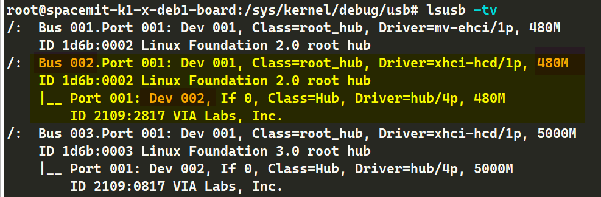

# USB 信号质量测试指南

## USB 2.0 测试指南


完整的 USB 2.0 电气信号质量测试内容可以在 USB-IF 官网中找到：

- [USB 2.0 Electrical Compliance Specification | USB-IF Document Library](https://www.usb.org/document-library/usb-20-electrical-compliance-test-specification-version-107)

主要有：

- 眼图
- 信号速率
- 上升下降时间
- 单调性测试
  
等测试项。

具体测试步骤根据相应测试仪器（示波器）或对应测试实验室的指南进行，
这里介绍如何让 K1 USB 控制器产生相应的测试波形。

USB2.0 的测试波形 (Test pattern) 选项有以下几种（具体可参考 USB 2.0 Spec 7.1.20 ）：

- Test SE0 NAK
- Test J
- Test K
- Test Packet 
- Test Force Enable

测试上升下降时间、眼图、抖动、其他动态波形规范等信号质量时选用的是 Test Packet 的 Test pattern，具体的测试包组成，参阅 USB 2.0 Spec 7.1.20 。


### USB 2.0 Device 信号质量测试指南

Device 模式下，测试波形是支持以下两种方式，根据测试环境遍历任选其一即可：
-  上位机使用 xHCI Electrical Test Tool 配置测试波形： Host 安装 USB-IF 的标准测试工具 [xHCI Electrical Test Tool](https://www.usb.org/document-library/xhsett) ，向设备发送控制包 Set Feature(Test Packet) 实现。
-  K1 使用 Linux DebugFS 进行配置： Device 端直接操作控制器，进行配置， K1 SDK 上是通过 linux debugfs 节点进行配置。

#### K1 USB2.0 OTG 控制器 Device 模式测试

测试时，请先保证 USB2.0 OTG 控制器工作在 Device 模式，
目前 Buildroot / Bianbu 都开机启动 USB2.0 OTG 控制器作为一个 USB ADB 设备。

如果采用特殊固件，可以使用 gadget-setup.sh 脚本进行配置：

```
USB_UDC=c0900100.udc gadget-setup.sh adb
```

具体的该脚本介绍可参考 [ USB Gadget 开发指南 ](2-USB-Gadget-Developer-Guide.md)

##### 上位机使用 xHCI Electrical Test Tool 配置测试波形

将 K1 开发板的 USB2.0 OTG 端口（原理图中的 USB0_DP/USB0_DN）通过 USB 线材和测试治具接入安装有 xHCI Electrical Test Tool 的上位机，
如图选择 VID/PID 0x361c/... 的 Device，选择
Device Command 发送 TEST_PACKET 选项，点击 EXECUTE 即可让 K1 USB2.0 OTG 控制器发送测试波形。


##### K1 使用 Linux DebugFS 进行配置

注：需要较新版本的 SpacemiT 内核才提供本节对 USB2.0 OTG 控制器 DebugFS 的支持

K1 开发板的 USB2.0 OTG 控制器在 Device 模式下，可通过 Linux DebugFS 节点直接操作控制器进行测试波形配置，具体操作如下：

1. 确保开发板已启动并进入系统， USB2.0 OTG 控制器对应的 DebugFS 节点路径为 `/sys/kernel/debug/usb/c0900100.udc/`。

2. 进入测试模式并发送测试波形：
   ```
   echo test_packet > /sys/kernel/debug/usb/c0900100.udc/testmode
   # 其他可选： test_j, test_k, test_se0_nak, test_force_enable
   ```

3. 查看当前高速测试模式状态：
   ```
   cat /sys/kernel/debug/usb/c0900100.udc/testmode
   ```

4. 退出测试模式，恢复正常工作状态：
   ```
   echo none > /sys/kernel/debug/usb/c0900100.udc/testmode
   ```

操作时，需将开发板的 USB2.0 OTG 端口通过 USB 线材连接至测试治具，执行上述命令后即可在测试治具端观测到对应的测试波形。

#### K1 USB3.0 DRD 控制器 Device 模式（ HighSpeed 连接）测试

此测试只适用开发板 / 产品板有该 USB3.0 DRD 控制器做 Device 模式的规格，或者支持手动切换到 device 模式，
具体请参考 [USB 通用开发指南 ](1-USB-General-Developer-Guide.md) 。

测试时，须保证 USB3.0 DRD 控制器工作在 Device 模式，
且测试夹具线材等为最大支持 USB2.0 High-Speed 规格，而不是 USB3.0 SuperSpeed 规格。

可以使用 gadget-setup.sh 脚本配置 USB3.0 DRD 控制器进入 Device 工作模式：

```
USB_UDC=c0a00000.dwc3 gadget-setup.sh hid
```

具体的该脚本介绍可参考 [ USB Gadget 开发指南 ](2-USB-Gadget-Developer-Guide.md)

##### 上位机使用 xHCI Electrical Test Tool 配置测试波形

将 K1 开发板的 USB3.0 DRD 端口（原理图中的 USB2_DP/USB2_DN）通过 USB 线材和测试治具接入安装有 xHCI Electrical Test Tool 的上位机，
如图选择 VID/PID 0x361c/... 的 Device，选择
Device Command 发送 TEST_PACKET 选项，点击 EXECUTE 即可让 K1 USB3.0 DRD 控制器发送测试波形。


##### K1 使用 Linux DebugFS 进行配置

K1 开发板的 USB3.0 DRD 控制器在 Device 模式下，可通过 Linux DebugFS 节点直接操作控制器进行 USB 2.0 HighSpeed 测试波形配置，具体操作如下：

1. 确保开发板已启动并进入系统， USB3.0 DRD 控制器对应的 DebugFS 节点路径为 `/sys/kernel/debug/usb/c0a00000.dwc3/`。

2. 进入测试模式并发送测试波形：
   ```
   echo test_force_enable > /sys/kernel/debug/usb/c0a00000.dwc3/testmode
   echo test_packet > /sys/kernel/debug/usb/c0a00000.dwc3/testmode
   # 其他可选： test_j, test_k, test_se0_nak
   ```

3. 查看当前高速测试模式状态：
   ```
   cat /sys/kernel/debug/usb/c0a00000.dwc3/testmode
   ```

4. 退出测试模式，恢复正常工作状态：
   ```
   echo none > /sys/kernel/debug/usb/c0a00000.dwc3/testmode
   ```

操作时，需将开发板的 USB3.0 DRD 端口通过 USB 线材连接至测试治具，执行上述命令后即可在测试治具端观测到对应的测试波形。


### USB 2.0 Host 信号质量测试指南

Host 模式下，只支持使用应用层工具进行配置，该工具支持所有 Host 的所有 USB 2.0 端口。

用户只需要找到对应的端口的总线号、设备号、端口号，无论是控制器 roothub 直出的端口还是下游 HUB 端口，均可以配置让对应端口发送测试波形。

测试需要使用命令行工作 porttest 工具源码在附录 - porttest 源码提供。

**porttest 使用方法：**

```
./porttest /dev/bus/usb/《 Bus 号码》/《 Dev 号码》 《端口号》 《测试 PATTERN 代号》
# e.g.:
# ./porttest /dev/bus/usb/001/001 1 4
# 其中测试 PATTERN 代号：
# - Reserved: 0
# - Test_J: 1
# - Test_K: 2
# - Test_SE0_NAK: 3
# - Test_Packet: 4 ，通常测试眼图等选用此波形
# - Test_Force_Enable: 5
```


如对特定端口执行了 Test Packet 的选项后，此时对应端口就会开始发送 Test Packet。

示波器看到的测试波形如下图所示：


#### K1 USB2.0 OTG 控制器 Host 模式测试

1. 首先让 USB2.0 OTG 控制器对外端口（原理图中为 USB0_DN/USB0_DP） 进入 Host 模式，根据实际方案的端口形态做配置（如 Type-C 口，需接入 TypeC 转 Host 转接头）。

   手动切换方案强制进入方法：

   ```
   echo host > /sys/class/usb_role/mv-otg-role-switch/role
   ```

2. 找到该控制器 Host 模式下 RootHub Port 的设备路径。
   
   首先执行命令

   ```
   cat /sys/kernel/debug/usb/devices
   ```

   在输出中：

   ```
   ~ # cat /sys/kernel/debug/usb/devices

   T:  Bus=01 Lev=00 Prnt=00 Port=00 Cnt=00 Dev#=  1 Spd=480  MxCh= 1
   B:  Alloc=  0/800 us ( 0%), #Int=  0, #Iso=  0
   D:  Ver= 2.00 Cls=09(hub  ) Sub=00 Prot=01 MxPS=64 #Cfgs=  1
   P:  Vendor=1d6b ProdID=0002 Rev= 6.01
   S:  Manufacturer=Linux 6.1.15+ ehci_hcd
   S:  Product=Spacemit EHCI
   S:  SerialNumber=mv-ehci
   C:* #Ifs= 1 Cfg#= 1 Atr=e0 MxPwr=  0mA
   I:* If#= 0 Alt= 0 #EPs= 1 Cls=09(hub  ) Sub=00 Prot=00 Driver=hub
   E:  Ad=81(I) Atr=03(Int.) MxPS=   4 Ivl=256ms
   ```

   找到其中 `SerialNumber=mv-ehci` 的段落。记录下第一行 T: Bus.... 中的 Bus 和 Dev#=。如这里是：

   ```
   T:  Bus=01 Lev=00 Prnt=00 Port=00 Cnt=00 Dev#=  1 Spd=480  MxCh= 1
   # 这里是 01 ， 1
   ```

3. 执行命令进入 Test Packet 模式：
   
   ```
   porttest  /dev/bus/usb/< 上一步中得到的 Bus 序号 >/< 上一步中得到的 Dev# 序号 > 1 4
   # 这里的 1 是指 roothub 的第一个 port， K1 的所有 roothub 都只有一个 port。
   ```

   举例（请按照本节完整步骤确定最终命令，不要直接运行举例中的命令！）：

   ```
   ~ # porttest /dev/bus/usb/001/001 1 4
   Setting port 1 to test mode 4 (Test_Packet)
   Test mode successful
   ```
   
#### K1 USB2.0 HOST ONLY 控制器 Host 模式测试

1. 找到该控制器 Host 模式下 RootHub Port 的设备路径。
   
   首先执行命令

   ```
   cat /sys/kernel/debug/usb/devices
   ```

   在输出中：

   ```
   ~ # cat /sys/kernel/debug/usb/devices

   T:  Bus=02 Lev=00 Prnt=00 Port=00 Cnt=00 Dev#=  1 Spd=480  MxCh= 1
   B:  Alloc=  0/800 us ( 0%), #Int=  0, #Iso=  0
   D:  Ver= 2.00 Cls=09(hub  ) Sub=00 Prot=01 MxPS=64 #Cfgs=  1
   P:  Vendor=1d6b ProdID=0002 Rev= 6.01
   S:  Manufacturer=Linux 6.1.15+ ehci_hcd
   S:  Product=Spacemit EHCI
   S:  SerialNumber=mv-ehci1
   C:* #Ifs= 1 Cfg#= 1 Atr=e0 MxPwr=  0mA
   I:* If#= 0 Alt= 0 #EPs= 1 Cls=09(hub  ) Sub=00 Prot=00 Driver=hub
   E:  Ad=81(I) Atr=03(Int.) MxPS=   4 Ivl=256ms
   ```

   找到其中 `SerialNumber=mv-ehci1` 的段落。记录下第一行 T: Bus.... 中的 Bus= 和 Dev#= 后面的数字。如这里是：

   ```
   T:  Bus=02 Lev=00 Prnt=00 Port=00 Cnt=00 Dev#=  1 Spd=480  MxCh= 1
   # 这里是 02 ， 1
   ```

2. 执行命令进入 Test Packet 模式：
   
   ```
   porttest  /dev/bus/usb/< 上一步中得到的 Bus 序号 >/< 上一步中得到的 Dev# 序号 > 1 4
   # 这里的 1 是指 roothub 的第一个 port， K1 的所有 roothub 都只有一个 port。
   ```

   举例（请按照本节完整步骤确定最终命令，不要直接运行举例中的命令！）：

   ```
   ~ # porttest /dev/bus/usb/001/001 1 4
   Setting port 1 to test mode 4 (Test_Packet)
   Test mode successful
   ```


#### K1 USB3.0 DRD 控制器 Host 模式（ HighSpeed 连接）测试

1. 首先让 USB3.0 DRD 控制器进入 Host 模式 （原理图中是 USB2_DN/DP） 进入 Host 模式。
   
   DRD 模式时，强制进入方法：

   ```
   echo host > /sys/kernel/debug/usb/c0a00000.dwc3/mode
   ```

2. 找到该控制器 Host 模式下 RootHub Port 的设备路径。
   
   首先执行命令

   ```
   cat /sys/kernel/debug/usb/devices
   ```

   在输出中：

   ```
   ~ # cat /sys/kernel/debug/usb/devices

   T:  Bus=03 Lev=00 Prnt=00 Port=00 Cnt=00 Dev#=  1 Spd=480  MxCh= 1
   B:  Alloc=  0/800 us ( 0%), #Int=  0, #Iso=  0
   D:  Ver= 2.00 Cls=09(hub  ) Sub=00 Prot=01 MxPS=64 #Cfgs=  1
   P:  Vendor=1d6b ProdID=0002 Rev= 6.01
   S:  Manufacturer=Linux 6.1.15+ xhci-hcd
   S:  Product=xHCI Host Controller
   S:  SerialNumber=xhci-hcd.2.auto
   C:* #Ifs= 1 Cfg#= 1 Atr=e0 MxPwr=  0mA
   I:* If#= 0 Alt= 0 #EPs= 1 Cls=09(hub  ) Sub=00 Prot=00 Driver=hub
   E:  Ad=81(I) Atr=03(Int.) MxPS=   4 Ivl=256ms
   ```

   找到其中 `Product=xHCI Host Controller`  的段落，并且第一行 T 开头的行有 `Spd=480`。
   
   记录下第一行 T: Bus.... 中的 Bus= 和 Dev#= 后面的数字，如这里是：

   ```
   T:  Bus=03 Lev=00 Prnt=00 Port=00 Cnt=00 Dev#=  1 Spd=480  MxCh= 1
   # 这里是 03 ， 1
   ```

3. 执行命令进入 Test Packet 模式：
   
   ```
   porttest  /dev/bus/usb/< 上一步中得到的 Bus 序号 >/< 上一步中得到的 Dev# 序号 > 1 4
   # 这里的 1 是指 roothub 的第一个 port， K1 的所有 roothub 都只有一个 port。
   ```

   举例（请按照本节完整步骤确定最终命令，不要直接运行举例中的命令！）：

   ```
   ~ # porttest /dev/bus/usb/003/001 1 4
   Setting port 1 to test mode 4 (Test_Packet)
   Test mode successful
   ```

#### K1 开发板其他 USB 2.0 HUB 端口信号测试

对最终产品测试时，需要测试开发板最外层的 USB 端口，部分方案的最外层 USB 端口是经过
USB HUB 扩展而来。此时需要打开他们的测试模式，同样使用 porttest 程序进行配置。

可以参考上面的方法，只是把找的 Vendor、 ProdID、 Manufacturer、 Product 的对应信息换成
你要测试的 HUB 的信息去找到对应的 Bus number 和 Device number 即可。

这里再介绍如何使用 lsusb （不适用于 buildroot，因为 buildroot 的 lsusb 是精简版）
查找对应的 Bus number 和 Dev number。

以 K1 开发板 bpi-banana-f3 为例，在 USB3.0 DRD 控制器上板载了一款 VIA Labs 的 VL817 型号
的 USB 3.0 HUB。由于 USB 3.0 是双总线架构，因此他也包含一个 USB 2.0 HUB。

首先执行 `lsusb -tv` 命令：



如图橙色高亮部分，我们找到一个产品描述是 `VIA Labs, Inc` 的 480M 速率的 Hub 设备。

记录要测试的 hub **所在** 的总线号（ `Bus XX`，这里是 002 ）， hub 设备号（ `Dev xx`，这里是 002 ），记录下来备用。

并且留意， `Driver=hub/4p` 的 4 意味着他有 4 个端口，测试时需要依次执行对应命令配置 1~4 的端口号发送测试波形。

随后根据实际情况，执行 porttest 命令传递正确的参数即可：

```
./porttest /dev/bus/usb/《 Bus 号码》/《 Dev 号码》 《端口号》 《测试 PATTERN 代号， 4 为眼图包》
# e.g.:
# ./porttest /dev/bus/usb/001/001 1 4
```

### USB-IF USB 2.0 产品合规测试介绍

**参考：** https://www.usb.org/usb2

针对 USB 2.0 产品，除了信号质量测试， USB-IF 还规定了其他的一些测试：功能测试、互操作性测试。

这些测试集合统称为 USB 2.0 产品合规测试（ USB 2.0 Compliance Test）。

USB 2.0 合规测试是针对 USB 外设产品的测试，如 HUB、 U 盘、等 USB 外设产品。

使用 K1 开发板开发的基于 Linux Gadget 驱动的 USB 2.0 外设成品也属于 USB 2.0 产品，如果要使用 USB 商标，必须通过 USB 2.0 产品合规测试，拿到 USB-IF 的认证。 

#### 功能（ Functional）
功能测试环节通过 USB-IF（ USB 实施者论坛）的工具 USB30CV 执行。

该工具会针对《 USB 2.0 规范》第 9 章的要求进行常规测试；

此外，对于任何实现了 USB 标准类的产品，该工具还会执行相应的类测试。 

USB30CV 工具是仅支持 Windows PC，并且要求上位机是标准 xHCI 规范控制器。

USB30CV 软件包可在 USF-IF 官方网站下载： https://www.usb.org/document-library/usb3cv。

*Note：更老版本是 USB20CV，这是基于上位机采用 EHCI 控制器，目前新款 Windows PC 基本都是采用 XHCI，因此使用 USB30CV 测试即可。

#### 电气（ Electrical）

经批准的 USB 2.0 示波器供应商
- Keysight
- Rohde & Schwarz
- Tektronix
- Teledyne LeCroy

合规计划的电气测试环节聚焦于物理层，需使用多种工具。

在高速信号质量测试中， USB-IF 仅认可使用经批准的信号质量测试治具所采集的测试数据。

此外， USB-IF 仅接受通过其工具 USBET 生成的 USB 2.0 信号质量分析报告。

对于其他电气测试，需要参考 USB-IF 的 Low/Full-speed electrical test specification 和 [USB 2.0 Electrical test specification](https://www.usb.org/document-library/usb-20-electrical-compliance-test-specification-version-107)，并联系经批准的示波器供应商，获取相关测试治具及测试方法说明。通常是采用第三方实验室协助进行测试。

《 USB 2.0 电气合规测试规范》可在 USB-IF 的文档库中下载。

#### 互操作性（ Interoperability）

合规计划的互操作性测试环节，重点验证被测产品与 “已知合格的 USB 产品” 之间的协同工作能力。 

USB 2.0 的互操作性测试方法与 USB 3.2 采用相同标准。相关的工具资料 [xHCI Interoperability Test Procedures For Peripherals, Hubs and Hosts](https://www.usb.org/document-library/xhci-interoperability-test-procedures-peripherals-hubs-and-hosts-version-096)

## USB 3.0 测试指南

USB 3.0 测试涉及使用经过 USB-IF 认证的高速示波器和相关测试治具、仪器。

这些因不同设备供应商而差异，请参考相关测试供应商的文档和操作步骤。

这里只简要介绍如何配置 K1 的 USB 3.0 PHY 进入测试模式。

### USB 3.0 Device Tx 信号质量测试指南

首先启动 gadget-setup 脚本（参考 USB Gadget 开发指南）拉起 device，连接测试夹具。

```
USB_UDC=c0a00000.dwc3 gadget-setup hid
```

测试夹具对端（上位机）使用 USB 3.0 SuperSpeed LTSSM 规定的标准方法（见 USB 3.0 Spec 7.5.5 ）：

SSTX+、 SSTX- 接入 Rx Termination，让 Device 端 LSTTM 进入 LFPS Polling 状态。

此时上位机测试组件不响应， Device 发出的第一个 Polling.LFPS 超时让 Device 状态机进入 Compliance Mode。

此时查看 DebugFS， USB 3.0 Link State 进入 Compliance 模式：

```
cat /sys/kernel/debug/usb/c0a00000.dwc3/link_state
Compliance
```

后续对端发送 Ping.LFPS 切换下下一个 pattern。

### USB 3.0 Host Tx 信号质量测试指南


测试夹具对端使用 USB 3.0 SuperSpeed LTSSM 规定的标准方法（见 USB 3.0 Spec 7.5.5 ）：

SSTX+、 SSTX- 接入 Rx Termination，让 Host 端口 LSTTM 进入 LFPS Polling 状态。

此时上位机测试组件不响应， Host 端口发出的第一个 Polling.LFPS 超时让 Host 端口状态机进入 Compliance Mode。

后续对端发送 Ping.LFPS 切换下下一个 pattern。

此外 K1 上可以使用 tx-compliance 脚本配置强制进入 Compliance 模式。

1. 执行命令进入 cp0 pattern
   ```
   ~ # tx-compliance.sh cp0
   XHCI and DWC3 Register Info:
   GUSB3PIPECTL0_BASE_ADDRESS: 0xc0a0c2c0
   PORTSC_BASE_ADDRESS: 0xc0a00420
   XHCI_PORTSC1_ADDRESS: 0xc0a00430

   Initializing CP0 pattern...
   Before clearing bit 9 at address 0xc0a00420:
   0x0A0002A0
   Clearing bit 9 at address 0xc0a00420
   After clearing bit 9 at address 0xc0a00420:
   0x0A000080
   Before clearing bit 9 at address 0xc0a00430:
   0x0A0002A0
   Clearing bit 9 at address 0xc0a00430
   After clearing bit 9 at address 0xc0a00430:
   0x0A000080
   Setting bit 30 at address 0xc0a0c2c0
   Powered-off Not-connected Disabled Link:Disabled PortSpeed:0 Change: Wake: WCE WOE
   Powered-off Not-connected Disabled Link:Compliance mode PortSpeed:0 Change: Wake: WCE WOE
   ```

2. 执行命令切换 pattern：
   ```
   tx-compliance toggle
   ```

### USB 3.0 Rx 信号质量测试指南

Rx Compliance 测试是使链路进入 Loopback mode。

进入方法和上文提到的 Tx 信号质量测试类似，也是基于规范定义的标准方法进入。

USB 3.0 控制器在 link training 的 Polling.Configuration 阶段，
如果检测到 T2 pattern 中 Loopback bit 位置位，
就会自动配置 USB 3.0 链路进入 Loopback mode（具体可参考 USB 3.0 规范的 7.5.10 和 7.5.11 章节）。


### USB-IF USB 3.0 产品合规测试介绍


**参考：** https://www.usb.org/usb-32

针对 USB 3.0 产品，除了电气信号质量测试， USB-IF 还规定了其他的一些测试：功能测试、互操作性测试、链路层测试。

#### 功能（ Functional）
功能测试环节通过 USB-IF（ USB 实施者论坛）的工具 USB30CV 执行。

该工具会针对《 USB 3.0 规范》第 9 章的要求进行常规测试；

此外，对于任何实现了 USB 标准类的产品，该工具还会执行相应的类测试。 

USB30CV 工具是仅支持 Windows PC，并且要求上位机是标准 xHCI 规范控制器。

USB30CV 软件包可在 USF-IF 官方网站下载： https://www.usb.org/document-library/usb3cv。

#### 链路层测试（ Link Test）

- [Link Layer Test Specification ](https://www.usb.org/document-library/usb-32-link-layer-test-specification)

#### 电气（ Electrical）

经批准的 USB 3.0 示波器供应商

- Anritsu
- Keysight
- Rohde & Schwarz
- Tektronix
- Teledyne LeCroy

合规计划的电气测试环节聚焦于物理层，需使用多种工具。

在高速信号质量测试中， USB-IF 仅认可使用经批准的信号质量测试治具所采集的测试数据。

此外， USB-IF 仅接受通过其工具 USBET 生成的 USB 3.0 信号质量分析报告。

对于其他电气测试，需要参考 USB-IF 的以下规范 :

- [The Electrical Compliance Test Specification for SuperSpeed USB 10 Gbps Rev. 1.0](https://www.usb.org/document-library/electrical-compliance-test-specification-superspeed-usb-10-gbps-rev-10)
- [The Electrical Compliance Test Specification for SuperSpeed USB Rev. 1.0a](https://www.usb.org/document-library/electrical-compliance-test-specification-superspeed-usb-rev-10a)

并联系经批准的示波器供应商，获取相关测试治具及测试方法说明。通常是采用第三方实验室协助进行测试。

#### 互操作性（ Interoperability）

合规计划的互操作性测试环节，重点验证被测产品与 “已知合格的 USB 产品” 之间的协同工作能力。 

相关的工具资料 [xHCI Interoperability Test Procedures For Peripherals, Hubs and Hosts](https://www.usb.org/document-library/xhci-interoperability-test-procedures-peripherals-hubs-and-hosts-version-096)

## 附录

### porttest 源码


推送源码到 Bianbu 中，终端打开文件所在目录执行：

```
gcc porttest.c -o porttest --static
```

生成目标文件： porttest。

```c
/* porttest -- put a USB hub port into TEST mode */
/* To build:  gcc -o porttest porttest.c */

#include <stdio.h>
#include <stdlib.h>
#include <unistd.h>
#include <fcntl.h>
#include <errno.h>
#include <sys/ioctl.h>

#include <linux/usbdevice_fs.h>
#include <linux/usb/ch9.h>

#define USB_MAXCHILDREN         31

#include <linux/usb/ch11.h>

char *mode_names[] = {
        "Reserved",             /* 0 */
        "Test_J",               /* 1 */
        "Test_K",               /* 2 */
        "Test_SE0_NAK",         /* 3 */
        "Test_Packet",          /* 4 */
        "Test_Force_Enable",    /* 5 */
        /* Remaining values are reserved */
};
#define MAX_TEST_MODE           5

int main(int argc, char **argv)
{
        const char *filename;
        int portnum, testmode;
        int fd;
        int rc;
        struct usbdevfs_ctrltransfer ctl;

        if (argc != 4) {
                fprintf(stderr, "Usage: porttest device-filename portnum testmode\n");
                return 1;
        }
        filename = argv[1];

        portnum = atoi(argv[2]);
        if (portnum <= 0 || portnum > USB_MAXCHILDREN) {
                fprintf(stderr, "Invalid port number: %d\n", portnum);
                return 1;
        }

        testmode = atoi(argv[3]);
        if (testmode <= 0 || testmode > MAX_TEST_MODE) {
                fprintf(stderr, "Invalid test mode: %d\n", testmode);
                return 1;
        }

        fd = open(filename, O_WRONLY);
        if (fd < 0) {
                perror("Error opening device file");
                return 1;
        }

        printf("Setting port %d to test mode %d (%s)\n", portnum, testmode,
                        mode_names[testmode]);

        ctl.bRequestType = USB_DIR_OUT | USB_RT_PORT;
        ctl.bRequest = USB_REQ_SET_FEATURE;
        ctl.wValue = USB_PORT_FEAT_TEST;
        ctl.wIndex = (testmode << 8) | portnum;
        ctl.wLength = 0;

        rc = ioctl(fd, USBDEVFS_CONTROL, &ctl);
        if (rc < 0) {
                perror("Error in ioctl");
                return 1;
        }
        printf("Test mode successful\n");

        close(fd);
        return 0;
}
```

### tx-compliance 脚本

```
#!/bin/sh
# filename: tx-compliance
# ./tx-compliance cp0 : enter compliance mode, switch to cp0 pattern。
# ./tx-compliance : toggle test pattern
# run with root user

echo "Check IF you are are host mode!"
echo "current mode(should be host):"
cat /sys/kernel/debug/usb/c0a00000.dwc3/mode

GUSB3PIPECTL0_BASE_ADDRESS="0xc0a0c2c0"
PORTSC_BASE_ADDRESS="0xc0a00420"
XHCI_PORTSC1_ADDRESS="0xc0a00430"
GUSB3PIPECTL0_PATTERN_BIT=30

echo "XHCI and DWC3 Register Info:"
printf "GUSB3PIPECTL0_BASE_ADDRESS: 0x%x\n" $GUSB3PIPECTL0_BASE_ADDRESS
printf "PORTSC_BASE_ADDRESS: 0x%x\n" $PORTSC_BASE_ADDRESS
printf "XHCI_PORTSC1_ADDRESS: 0x%x\n" $XHCI_PORTSC1_ADDRESS
printf "GUSB3PIPECTL0_PATTERN_BIT: %d\n" $GUSB3PIPECTL0_PATTERN_BIT
echo ""

clear_bit() {
    local address="$1"
    local bit="$2"
    printf "Before clearing bit %d at address %#x:\n" "$bit" "$address"
    busybox devmem $address 32

    local value=$(busybox devmem $address 32)
    local cleared_value=$((value & ~(1 << bit)))
    printf "Clearing bit %d at address %#x\n" "$bit" "$address"
    busybox devmem $address 32 $cleared_value

    printf "After clearing bit %d at address %#x:\n" "$bit" "$address"
    busybox devmem $address 32
}

set_bit() {
    local address="$1"
    local bit="$2"
    printf "Setting bit %d at address %#x\n" "$bit" "$address"

    local value=$(busybox devmem $address 32)
    local set_value=$((value | (1 << bit)))
    busybox devmem $address 32 $set_value
    
    printf "After setting bit %d at address %#x:\n" "$bit" "$address"
    busybox devmem $address 32
}

initialize_cp0_pattern() {
    clear_bit $PORTSC_BASE_ADDRESS 9
    clear_bit $XHCI_PORTSC1_ADDRESS 9
    set_bit $GUSB3PIPECTL0_BASE_ADDRESS $GUSB3PIPECTL0_PATTERN_BIT
    cat /sys/kernel/debug/usb/xhci/xhci-hcd.*.auto/ports/port*/portsc
}

toggle_pattern() {
    clear_bit $GUSB3PIPECTL0_BASE_ADDRESS $GUSB3PIPECTL0_PATTERN_BIT
    sleep 1
    set_bit $GUSB3PIPECTL0_BASE_ADDRESS $GUSB3PIPECTL0_PATTERN_BIT
    cat /sys/kernel/debug/usb/xhci/xhci-hcd.*.auto/ports/port*/portsc
}

case "$1" in
    "cp0")
        echo "Initializing CP0 pattern..."
        initialize_cp0_pattern
        ;;
    "toggle")
        echo "Toggling pattern..."
        toggle_pattern
        ;;
    *)
        echo "Usage: $0 {cp0|toggle}"
        exit 1
        ;;
esac

exit 0

```