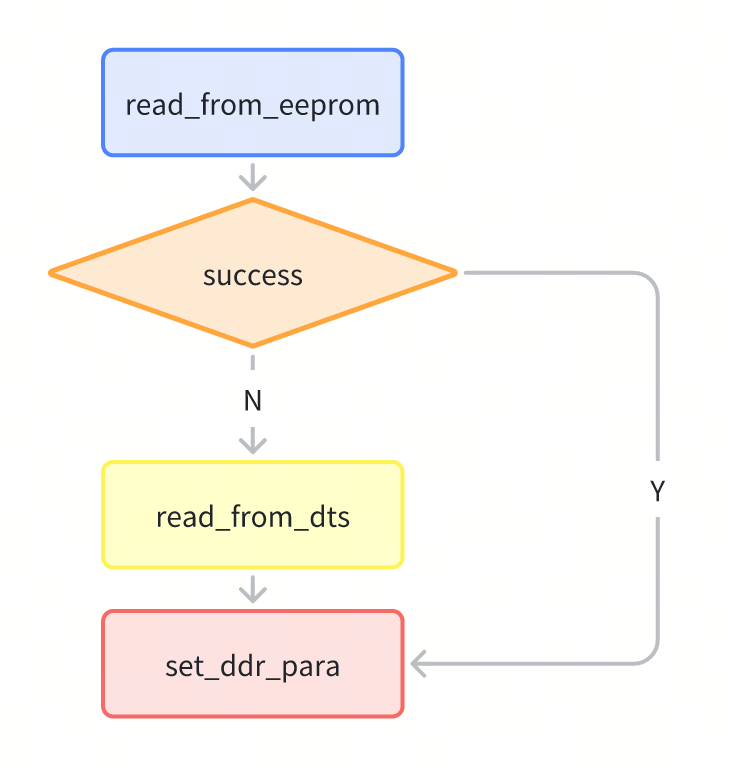
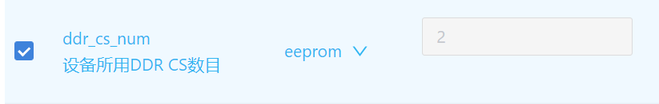
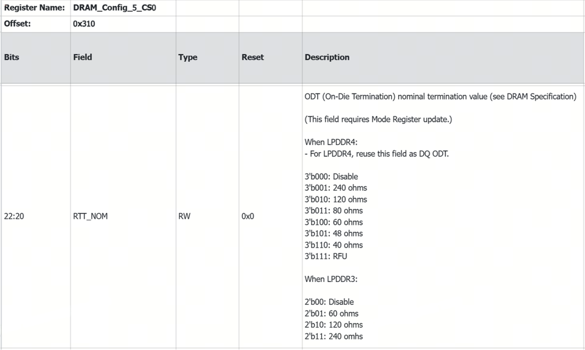
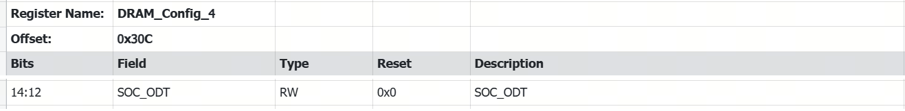
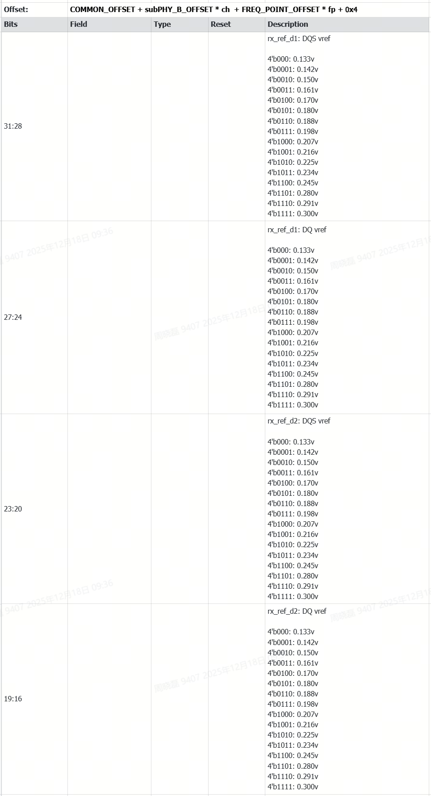
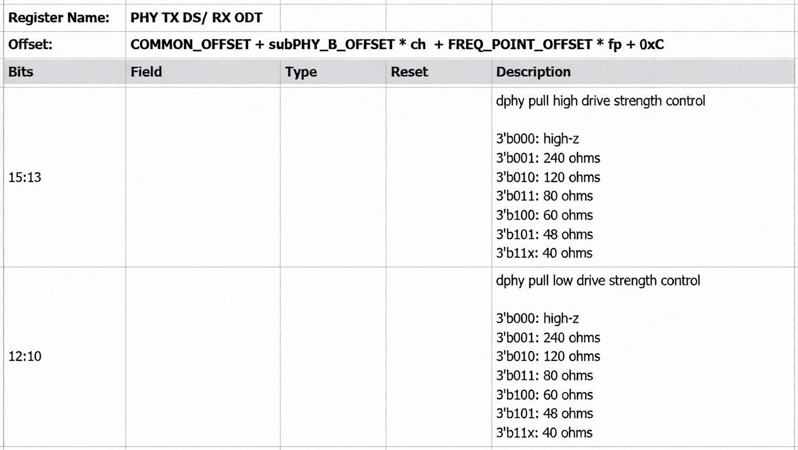
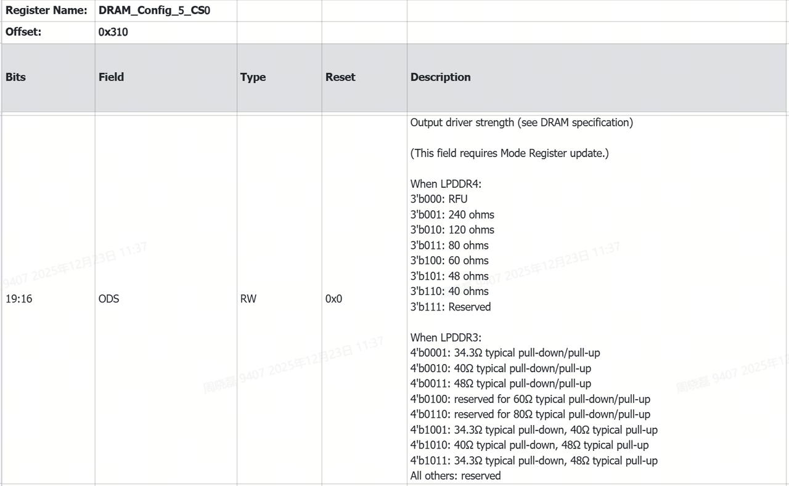

# DDR

| 版本 |修改日期 | 说明   |
|-----|-----|----|
| v1.0       | 2026-01-10   | 初版发布     |

## 1. 概述

本文档基于 **SpacemiT K1** 平台，介绍通过修改 DDR 驱动参数实现 K1 SDK 与特定 DDR 颗粒适配的方法。

### 配置机制

K1 SDK 支持 **LPDDR3**、**LPDDR4**、**LPDDR4x** 三种 DDR 类型，需根据具体 DDR 型号配置以下核心参数：

1. DDR 类型；
2. CS 数量（单/双 CS）；
3. 最高速率；
4. 驱动能力等；

如下图，DDR 驱动按以下顺序加载配置参数：

1. 优先读取 EEPROM 中存储的参数
2. 若 EEPROM 无有效配置，则从 DTS 节点中获取
3. 如前两者都没有设置，则使用代码中配置的参数



修改参数后，需重新编译生成烧录镜像，更新至设备端以使修改生效。

## 2. 基本配置

### 2.1 DDR 类型配置

K1 上支持的 DDR 型号包含 **LPDDR3**、**LPDDR4**、**LPDDR4x** 三种类型。

#### 场景 1：单个镜像支持多种 DDR 类型（需 EEPROM 支持）

通过以下任一方式将 DDR 类型写入板上 EEPROM。

1. **烧号方式写入**  
   操作流程如下：
   - 按住设备烧录按键上电，进入烧录模式
   - 通过 USB 连接 PC
   - 在 PC 上使用 **TitanFlasher 工具集** 的写号功能写入需要使用的 DDR 类型, 如下图。
     

2. **U-Boot 命令行写入**  
   - **前提**：DDR 使用默认配置能够完成初始化，设备能够启动到 U-Boot；

   ```shell
   => tlv_eeprom read                # 读取当前 EEPROM 配置
   => tlv_eeprom set 0x42 LPDDR4x    # 设置 DDR 类型（可选值：LPDDR4x / LPDDR4 / LPDDR3）
   => tlv_eeprom write               # 保存配置至 EEPROM
   ```

#### 场景 2：固定 DDR 类型（板上无需有EEPROM）

修改 U-Boot DTS 文件（`uboot/arch/riscv/dts/k1-x_spl.dts`）中 DDR 节点（`ddr@c0000000`）的 `type` 字段：

```dts
type = "LPDDR4X";    /* 可选值：LPDDR4X / LPDDR4 / LPDDR3 */
```

### 2.2 CS 数量配置

K1 支持 **单 CS / 双 CS** DDR。

#### 场景 1：无需重烧镜像（需 EEPROM 支持）

1. **烧号模式写入**：通过 TitanFlasher 写号功能，将 CS 数量写入板上 EEPROM， 如下图。
   

2. **U-Boot 命令行写入**
   依赖：设备能启动，DDR使用默认配置能够完成初始化。

   ```shell
   => tlv_eeprom read
   => tlv_eeprom set 0x41 1    # 单 CS（可选值：1=单CS / 2=双CS）
   => tlv_eeprom write
   ```

#### 场景 2：固定 DDR CS number（板上无需有 EEPROM）

修改 U-Boot DTS 文件（`uboot/arch/riscv/dts/k1-x_spl.dts`）中 DDR 节点（`ddr@c0000000`）的 `cs-num` 字段：

```dts
cs-num = ;    /* 双 CS DDR */
// 或
cs-num = ;    /* 单 CS DDR */
```

> **注意**：对于 LPDDR3 类型，驱动支持 CS 数量的自动识别，DTS 或 EEPROM 中的配置值将在初始化时被实际检测值覆盖。

### 2.3 速率配置

不同 DDR 型号支持的速率范围：

- **LPDDR4 / LPDDR4x**：1200 / 1600 / 2400 MT/s（LPDDR4x 最高支持 2666 MT/s，需验证稳定性）
- **LPDDR3**：1066 / 1333 / 1600 MT/s

#### 场景 1：无需重烧镜像（需 EEPROM 支持）

1. **烧号模式写入**：通过TitanFlasher中的写号工具，更改 DDR 速率至板上 EEPROM, 如下图。
   

2. **U-Boot 命令行写入**
     依赖：设备能够启动，DDR 使用默认配置能够完成初始化；

   ```shell
   => tlv_eeprom read
   => tlv_eeprom set 0x43 2400    # 设置速率（单位：MT/s）
   => tlv_eeprom write
   ```

#### 场景 2：固定速率（板上无需有 EEPROM）

修改 DTS 文件中 DDR 节点的 `datarate` 字段：

```dts
datarate = <2400>;    /* 速率值需符合 DDR 型号支持范围 */
```

## 3. 高阶配置

> **警告**：本章节涉及的参数直接影响信号完整性，不当修改可能导致系统不稳定或无法启动。建议在硬件工程师指导下进行，修改后务必执行严格的内存稳定性测试。

DDR 驱动参数已集中在 `ddr_io_para_table` 结构体中，可通过修改源码适配特定 DDR 型号：

```c
/* DDR 电气参数结构体（各字段对应 PHY / 控制器配置） */
struct io_para_info {
    u32 manufacturer;  /* DDR 厂商 ID，当前未使用 */
    u32 devicetype;    /* DDR 类型（如 LPDDR4X） */
    u32 ca_vref;       /* 地址命令参考电压 */
    u32 tx_pdrv;       /* TX 端上拉驱动能力 */
    u32 tx_ndrv;       /* TX 端下拉驱动能力 */
    u32 tx_odt;        /* TX 端终端电阻 */
    u32 tx_vref;       /* TX 端参考电压 */
    u32 rx_drv;        /* RX 端驱动能力 */
    u32 rx_pu_cal;     /* RX 端上拉校准值 */
    u32 rx_odt;        /* RX 端终端电阻（主控 PHY 侧） */
    u32 rx_soc_odt;    /* RX 端终端电阻（DDR 颗粒侧） */
    u32 rx_vref;       /* RX 端参考电压 */
};

const struct io_para_info ddr_io_para_table[] = {
    {DDR_MID_SK_HYNIX, LPDDR4X, 0x9D, R_40, R_40, R_80, 0x19, R_60, VOH_0P6, R_80, R_80, 0x55},
    {DDR_MID_SK_HYNIX, LPDDR4,  0xB2, R_40, R_40, R_120, 0xA7, R_60, VOH_0P6, R_80, R_80, 0x33},
};
```

### 3.1 TX ODT 配置

不同厂家的 DDR 电气特性会有差别，可以通过调整 TX ODT (`tx_odt`)电阻值，来适配不同型号的DDR。

- **电阻支持值**：40Ω、48Ω、60Ω、80Ω、120Ω、240Ω
- **建议**：若无特殊需求，使用默认值 **80Ω**，不要轻易去修改此配置。

#### 场景 1：无需重烧镜像（需 EEPROM 支持）

1. **烧号模式写入**：通过 TitanFlasher 中的写号工具，将 DDR TX ODT 配置写入 EEPROM, 如下图。
   

2. **U-Boot 命令行写入**：
     依赖：设备能够启动，DDR使用默认配置能够完成初始化。

   ```shell
   => tlv_eeprom read
   # 设置 TX ODT 为 80Ω
   => tlv_eeprom set 0x44 80    
   # 回写到EEPROM
   => tlv_eeprom write
   ```

#### 场景 2：固定 TX ODT（板上无需有 EEPROM）

1. 在 DTS（`uboot/arch/riscv/dts/k1-x_spl.dts`）中修改 DDR 节点（`ddr@c0000000`），重新生成镜像并烧写：

   ```dts
   tx-odt = ;
   ```

2. 在 DDR 驱动源码中修改（如下示例中将 LPDDR4x 的 TX ODT 配置由 80Ω 修改为 60Ω），重新生成镜像并烧写：

   ```
      diff --git a/drivers/ddr/spacemit/k1x/lpddr4_silicon_init.c b/drivers/ddr/spacemit/k1x/lpddr4_silicon_init.c
      index 751623a0e1..421b61fab5 100644
      --- a/drivers/ddr/spacemit/k1x/lpddr4_silicon_init.c
      +++ b/drivers/ddr/spacemit/k1x/lpddr4_silicon_init.c
      @@ -74,7 +74,7 @@ struct io_para_info {

      };
      
      const struct io_para_info ddr_io_para_table[] = {
        - {DDR_MID_SK_HYNIX, LPDDR4X, 0x9D, R_40, R_40, R_80, 0x19, R_60, VOH_0P6, R_60, R_60, 0x55},
        + {DDR_MID_SK_HYNIX, LPDDR4X, 0x9D, R_40, R_40, R_60, 0x19, R_60, VOH_0P6, R_60, R_60, 0x55},
        
        {DDR_MID_SK_HYNIX, LPDDR4, 0xB2, R_40, R_40, R_120, 0xA7, R_60, VOH_0P6, R_80, R_80, 0x33},
        // {DDR_MID_SK_HYNIX, LPDDR4, 0xB2, R_40, R_40, R_60, 0xA7, R_48, VOH_0P6, R_48, R_48, 0x00},
    };
   ```

对应寄存器位描述如下图，两个 CS 对应两个寄存器：DRAM_Config_5_CS0（offset 0x310）、DRAM_Config_5_CS1（offset 0x314），每个频点都需要配置。



会被控制器配置到 DDR mode register。
以 LPDDR4 为例，会被 DDR 控制器配置到 DDR MR3 OP[5:3]，如下图所示位置。


### 3.2 RX ODT

Rx ODT 是调节 DDR 的 Read 方向上，主控端信号匹配电阻值；分为主控PHY端配置 `rx_odt`，与DDR颗粒端配置`rx_soc_odt`；

- **电阻支持值**：40Ω、48Ω、60Ω、80Ω、120Ω、240Ω
- **建议**：两个 ODT 通常设为相同值

如下示例：将 LPDDR4x RX ODT 从 60Ω 修改为 80Ω

```
      
diff --git a/drivers/ddr/spacemit/k1x/lpddr4_silicon_init.c b/drivers/ddr/spacemit/k1x/lpddr4_silicon_init.c
index 751623a0e1..d5c5a2cfc0 100644
--- a/drivers/ddr/spacemit/k1x/lpddr4_silicon_init.c
+++ b/drivers/ddr/spacemit/k1x/lpddr4_silicon_init.c
@@ -74,7 +74,7 @@ struct io_para_info {
 };
 
 const struct io_para_info ddr_io_para_table[] = {
- {DDR_MID_SK_HYNIX, LPDDR4X, 0x9D, R_40, R_40, R_80, 0x19, R_60, VOH_0P6, R_60, R_60, 0x55},
+ {DDR_MID_SK_HYNIX, LPDDR4X, 0x9D, R_40, R_40, R_80, 0x19, R_60, VOH_0P6, R_80, R_80, 0x55},
  {DDR_MID_SK_HYNIX, LPDDR4, 0xB2, R_40, R_40, R_120, 0xA7, R_60, VOH_0P6, R_80, R_80, 0x33},
  // {DDR_MID_SK_HYNIX, LPDDR4, 0xB2, R_40, R_40, R_60, 0xA7, R_48, VOH_0P6, R_48, R_48, 0x00},
 };
```

PHY 端配置 `rx_odt`，对应的寄存器位描述如下图。


颗粒端配置 `rx_soc_odt`，对应的寄存器位描述如下图。



### 3.3 TX VREF

TX VREF(`tx_vref`)是调节 Device 接收颗粒端参考电压，是 DDR 颗粒用于信号电平判决的关键参考电压；DDR 驱动初始化时，会通过手动的方式调节设置一个“合适”但非最佳的初始值，启动过程中主控通过 TX Training 流程，将 TX VREF 值调整至采样区间的正中间（理论上的最佳值）。
**建议：** 该参数一般不需要调节，使用默认配置值即可，对应寄存器描述参见下图。


### 3.4 RX VREF

RX VREF(`rx_vref`)是调节主控接收端参考电压，是主控（K1）端用于信号电平判决的关键参考电压；DDR 驱动初始化时，会通过手动的方式调节设置一个“合适”但非最佳的初始值，启动过程中主控通过 RX Training 流程，将 RX VREF 值调整至采样区间的正中间（理论上的最佳值）。
VREF 初始值的配置遵循如下公式

```
vref = 0.3 * vddq
```

该参数一般不需要调节，使用默认配置值即可，对应寄存器描述参见下图。



### 3.5 TX DRIVE

TX DRIVE 用于调节主控端 CK/DQS/DQ 对外输出的驱动能力，通过设置 PHY 寄存器中的 pull high drive（`tx_pdrv`）与 pull low driver（`tx_ndrv`）来完成配置。对应寄存器描述参见下图。



### 3.6 RX DRIVE

RX DRIVE 是调节 Device 端 DQS/DQ 对外输出的驱动能力。对应寄存器描述参见下图。



### 3.7 WDQS

通过调节 WDQS，来补偿数据写信号传输延迟差异，优化时序裕量，为写入内存的数据提供精准的时序参考，确保数据被正确捕获。
**默认:** LPDDR4x 没有打开 WDQS（支持WDQS的颗粒比较少）
**启动建议：** DDR 压力测试难以 pass 时，可考虑通过如下 patch 来启动 WDQS。

```
diff --git a/drivers/ddr/spacemit/k1x/lpddr4_silicon_init.c b/drivers/ddr/spacemit/k1x/lpddr4_silicon_init.c
index 751623a0e1..90c2d2082e 100644
--- a/drivers/ddr/spacemit/k1x/lpddr4_silicon_init.c
+++ b/drivers/ddr/spacemit/k1x/lpddr4_silicon_init.c
@@ -280,8 +280,7 @@ void fp_timing_init(unsigned DDRC_BASE)
  REG32(DDRC_BASE+MC_CH0_BASE+0x01c4) = 0x00000006;
  REG32(DDRC_BASE+MC_CH0_BASE+0x01d8) = 0x00010190;
  REG32(DDRC_BASE+MC_CH0_BASE+0x014c) = 0x000c4090;
- if (LPDDR4 == io_para_update->devicetype)
-  REG32(DDRC_BASE+MC_CH0_BASE+0x0200) = ((0x1 << 31) | (0x1E << 8) | (0x6 << 0)); // DRAM wdqs timing
+ REG32(DDRC_BASE+MC_CH0_BASE+0x0200) = ((0x1 << 31) | (0x90 << 16) | (0x1E << 8) | (0x6 << 0)); // DRAM wdqs timing
 
  REG32(DDRC_BASE+MC_CH0_PHY_BASE+0x03e4) = 0x15000A02;
  REG32(DDRC_BASE+MC_CH0_PHY_BASE+0x03ec) = 0x0000046c;
@@ -325,8 +324,7 @@ void fp_timing_init(unsigned DDRC_BASE)
  REG32(DDRC_BASE+MC_CH0_BASE+0x01c4) = 0x00000004;
  REG32(DDRC_BASE+MC_CH0_BASE+0x01d8) = 0x0000D94E;
  REG32(DDRC_BASE+MC_CH0_BASE+0x014c) = 0x0007204a;
- if (LPDDR4 == io_para_update->devicetype)
-  REG32(DDRC_BASE+MC_CH0_BASE+0x0200) = ((0x1 << 31) | (0x1B << 8) | (0x4 << 0)); // DRAM wdqs timing
+ REG32(DDRC_BASE+MC_CH0_BASE+0x0200) = ((0x1 << 31) | (0x78 << 16) | (0x1B << 8) | (0x4 << 0)); // DRAM wdqs timing
 
  REG32(DDRC_BASE+MC_CH0_PHY_BASE+0x03e4) = 0x13000802;
  REG32(DDRC_BASE+MC_CH0_PHY_BASE+0x03ec) = 0x00000450;
@@ -370,8 +368,7 @@ void fp_timing_init(unsigned DDRC_BASE)
  REG32(DDRC_BASE+MC_CH0_BASE+0x01c4) = 0x00000003;
  REG32(DDRC_BASE+MC_CH0_BASE+0x01d8) = 0x00008190;
  REG32(DDRC_BASE+MC_CH0_BASE+0x014c) = 0x00030848;
- if (LPDDR4 == io_para_update->devicetype)
-  REG32(DDRC_BASE+MC_CH0_BASE+0x0200) = ((0x1 << 31) | (0x15 << 8) | (0x0 << 0)); // DRAM wdqs timing
+ REG32(DDRC_BASE+MC_CH0_BASE+0x0200) = ((0x1 << 31) | (0x48 << 16) | (0x15 << 8) | (0x0 << 0)); // DRAM wdqs timing
 
  REG32(DDRC_BASE+MC_CH0_PHY_BASE+0x03e4) = 0x0a000402;
  REG32(DDRC_BASE+MC_CH0_PHY_BASE+0x03ec) = 0x00000480;
@@ -415,8 +412,7 @@ void fp_timing_init(unsigned DDRC_BASE)
  REG32(DDRC_BASE+MC_CH0_BASE+0x01c4) = 0x00000003;
  REG32(DDRC_BASE+MC_CH0_BASE+0x01d8) = 0x00008190;
  REG32(DDRC_BASE+MC_CH0_BASE+0x014c) = 0x00030848;
- if (LPDDR4 == io_para_update->devicetype)
-  REG32(DDRC_BASE+MC_CH0_BASE+0x0200) = ((0x1 << 31) | (0x15 << 8) | (0x0 << 0)); // DRAM wdqs timing
+ REG32(DDRC_BASE+MC_CH0_BASE+0x0200) = ((0x1 << 31) | (0x48 << 16) | (0x15 << 8) | (0x0 << 0)); // DRAM wdqs timing
 
  REG32(DDRC_BASE+MC_CH0_PHY_BASE+0x03e4) = 0x0a000402;
  REG32(DDRC_BASE+MC_CH0_PHY_BASE+0x03ec) = 0x00000480;

```

## 4. 调试

1. DDR Training 日志

   如需更多 DDR 初始化日志，需要修改代码 `drivers/ddr/spacemit/k1x/k1_ddr.h` 中日志等级。

   ```c
    #define LOGLEVEL 1    /* 0=关闭日志，1=详细日志 */
   ```

2. SPL 调试日志

   - 默认 SPL 日志等级为 1（仅 emergency level 日志才会被打印出来。）

     ```
     CONFIG_SPL_LOGLEVEL=1
     ```

   - 如需更多日志：
     - 在 U-Boot `menuconfig` 中调高 `CONFIG_SPL_LOGLEVEL`（注意 `FSBL.bin` ≤ 216KB）
     - 或将打印接口改为 `printf`

## 5. 编译与部署

修改完成后，按以下步骤生效：

1. 重新编译 U-Boot，生成 `FSBL.bin` 和 `uboot.itb`
2. 替换镜像包中的对应文件
3. 烧录镜像至设备，完成 DDR 驱动更新
