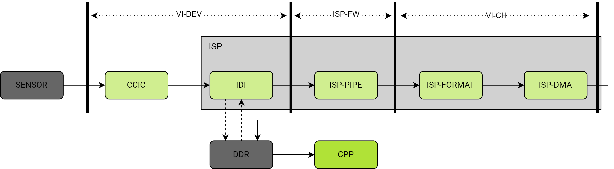
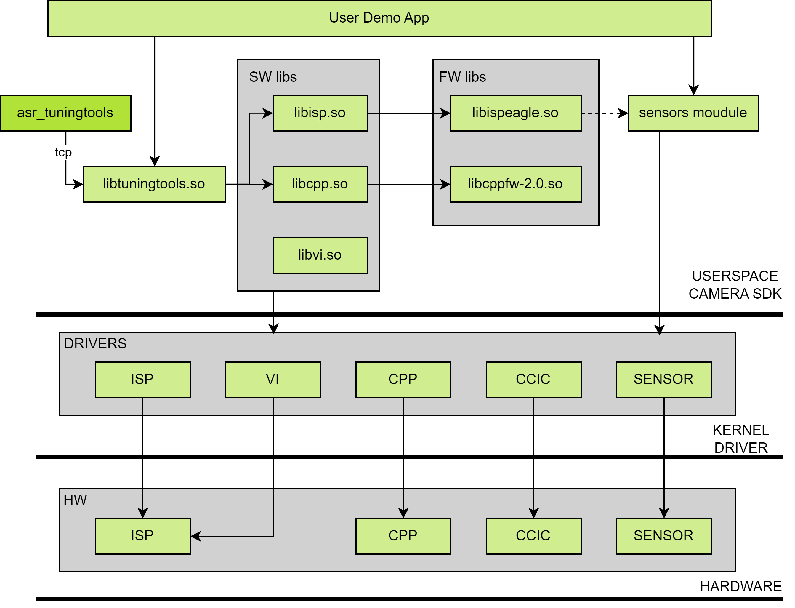
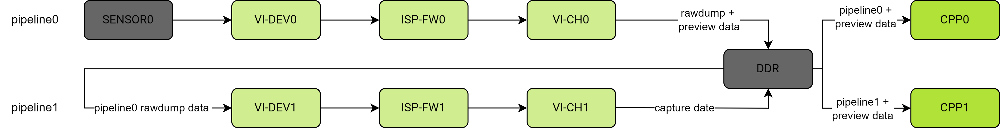

# 相机开发指南

本文主要介绍 SpacemiT K1 平台 Camera 模块的快速上手开发。

K1 仅支持 MIPI 类型接口，使用 SpacemiT camera 驱动框架。

## Camera 快速点亮导览

### 点亮已支持的摄像头（两步）

**第一步：确定摄像头接口并运行命令**
确定摄像头连接的 MIPI CSI 接口（如 CSI1），运行以下命令（以 CSI1 为例）：

```
cam-test /usr/share/camera_json/csi1_camera_detect.json
```

如果成功，如下示例输出，系统会自动生成可用的 JSON 文件到 `/usr/share/camera_json/` 目录。如果失败，说明没有支持此摄像头，或者硬件有问题，建议联系进迭时空的技术支持。

```
......
I: ./sensors/cam_sensors_module.c(235): "detect ov16a10_spm sensors in csi1: success, set 3840x2160 to 1920x1080"
I: auto_detect_camera(1401): "auto detect sensor ===================== finish "
I: update_json_file(672): "save json to /usr/share/camera_json/csi1_camera_auto.json success"
```

从上述运行 log 还可以得出：  

- ov16a10 sensor 生成的 json 默认使用模式 0  
- sensor 输出分辨率为 3840x2160  
- isp 输出分辨率为 1920x1080  

json 配置文件的更多描述，请参阅下文的 **JSON 参数说明**。  

**第二步：启动摄像头出图测试**  
运行下列命令，启动摄像头出图 500 帧，并保存第 250 帧。  

```
cam-test /usr/share/camera_json/csi1_camera_auto.json
```

- 正常运行的输出 log 请参阅 **正常运行单路在线测试 log** 章节  
- 如果运行失败，建议联系进迭时空的技术支持

**第三步（可选）：屏幕预览**  
如果摄像头需要实现屏幕预览，可以参考 **gstreamer_user_guide** 文档里的摄像头应用章节里的 MIPI 摄像头说明。  

### 点亮一款新的摄像头  

通常仅需要调整 `cam-test` 应用层的代码即可快速支持，所有 camera 相关的内核配置、DTS 无需修改。  

> 点亮 sensor 所依赖的上下电 GPIO、MCLK 时钟、MIPI lane 配置等硬件功能，在方案对外发布前已由内部工程师验证完毕。极少数情况下需要修改 DTS 和驱动（如因外部不可抗拒原因必须修改主板 MIPI CSI 接口电路，上电 GPIOA 更改为 GPIOB，MCLKA 更改为 MCLKB 等），此情况下建议联系进迭工程师支持。

#### 新摄像头点亮步骤  

如果不考虑特殊情况，点亮一款新摄像头，建议按照以下步骤展开：

1. **复用相近型号代码**  
   - 根据当前摄像头型号，复用列表中已支持的相近型号的应用代码  
   - 主要复用摄像头应用的代码结构排布（减少开发工作量）  
   - 修改函数名称、结构体名称为当前摄像头型号  
   - 详情参阅本文里的 **Bring up** 章节

2. **配置传感器参数**  
   - 阅读摄像头数据手册，确定：  
     - 寄存器位数  
     - I2C 地址  
     - 上电流程  
     - ID 寄存器及 ID 值  
   - 修改 sensor 应用代码  
   - 上电流程可参阅本文里的 **[Sensor 驱动]** 章节  

3. **配置寄存器参数**  
   - 配置 setting tab 寄存器数组  
   - 根据原厂提供的信息或计算值，确定：  
     - lane 数 / HTS / VTS / MCLK / FPS / PCLK / 分辨率 / data Lane 等  
   - 完善函数内容（重点关注 `xxx_spm_get_sensor_capbility` 和 `xxx_spm_get_sensor_work_info` 函数）  

4. **调整寄存器地址**  
   - 修改 `xxx_sensor.c` 中的曝光、增益等寄存器地址  

5. **读 ID 测试**  
   - 尝试上电读 ID  
   - 如果失败，重新检查步骤 1  

6. **出图测试**  
   - 使用 `single online test` 测试（参阅本文里的 **场景介绍** 章节  
   - 如果失败，可使用 `only viisp case` 再测试  
   - 仍失败则检查步骤 3、4，或联系工程师分析  

7. **验证 log**  
   - `single online test` 正常出图的 log 可参阅本文里的 **实操 log** 章节  

> **备注：**  
> 关于测试应用及各 test 的介绍，可参阅本文里的 **场景介绍** 章节。  

**参考文档**  

- **Camera 模块规格特性**  
  [芯片规格说明书](https://developer.spacemit.com/documentation?token=BWbGwbx7liGW21kq9lucSA6Vnpb#part779)  

- **ISP 效果调试**  
  [ISP PQ 工具用户指南](isp_api_development_guide.md)  

- **ISP API 开发**  
  [ISP API 开发指南](isp_api_development_guide.md)  

## Camera 子系统硬件框图



核心功能模块说明：

1. **SENSOR（图像传感器）**  
   - 将从镜头传导过来的光线转换为电信号，再通过内部的 AD 转换为数字信号，最终输出 MIPI RAW 数据。

2. **CCIC（CMOS Camera Image Controller）**  
   - 解析接收 Sensor 发送的 MIPI 数据。

3. **IDI（ISP 数据输入模块）**  
   - 接收 CCIC 发送的数据或者从 DDR 读取数据，发送到 ISP Pipeline
   - 同时将 CCIC 数据转存至 DDR

4. **ISP-PIPE（图像处理流水线）**
   - ISP 硬件内部 pipeline
   - 进行一系列图像相关算法的处理

5. **ISP-FORMAT（输出格式控制）**  
   - ISP 硬件内部模块
   - 控制输出的图像格式

6. **ISP-DMA（直接内存访问）** 
   - ISP 硬件内部模块
   - 将图像输出到 DDR 中

7. **CPP（后处理单元）** 
   - 图像降噪处理和边缘增强。

> **系统数据流说明**  
> 原始光信号 → SENSOR（光电转换）→ CCIC（数据接收）→ IDI（数据路由）→ ISP-PIPE（图像处理）→ ISP-FORMAT（格式转换）→ ISP-DMA（内存写入）→ CPP（后处理）→ 最终输出

## Camera 驱动框架

> **说明：**  
> 本章节内容仅需了解即可，实际开发中除 Sensor 驱动部分外，其他内容在 sensor bring up 时基本不会涉及。

### 框架简介

SpacemiT camera 驱动基于 Linux 内核 V4L2 框架实现，主要功能包括：

- 硬件寄存器访问
- 中断响应处理
- 缓冲区与事件管理
- 用户空间 SDK 接口提供

在 Camera 子系统中各个模块之间的关系如下图所示：



从软件调用关系来看，从上到下依次分为以下三层：

- **用户空间（Userspace）**：运行在用户空间。
  - 主要包括 ISP、CPP、VI 和 tuningtools 软件库，以及 ISP、CPP 的 firmware 库和 sensor 模块的源码。
  - 用户主要通过调用 ISP、CPP、VI 和 sensor 模块的接口来实现 camera 应用场景。Firmware 库中的接口由 ISP 和 CPP 软件库在内部调用。
  - 另外，如果用户需要使用 ASR 的 tuning tool 来调试 ISP/CPP 的输出图像效果，需要在应用程序中调用 `libtuningtools.so` 的接口来创建 tuning server。

- **内核空间（Kernel Space）**：
  - 运行在内核空间。
  - 主要提供 ISP、CPP、VI、CCIC 和 sensor 的驱动。

- **硬件层（Hardware Layer）**：
  - 这是驱动实际调用的硬件模块。

> 对于 sensor bring up 需求，主要关注用户空间的 APP demo 实现，即如何调用 SDK 接口满足场景需求。

### 源码结构

```
~/k1x/linux-6.6/drivers/media/platform/spacemit/camera$ tree
.
|-- built-in.a
|-- cam_ccic
|   |-- ccic_drv.c
|   |-- ccic_drv.h
|   |-- ccic_hwreg.c
|   |-- ccic_hwreg.h
|   |-- csiphy.c
|   |-- csiphy.h
|   |-- dptc_drv.c
|   |-- dptc_drv.h
|   `-- dptc_pll_setting.h
|-- cam_cpp 
|   |-- cpp_compat_ioctl32.c
|   |-- cpp_compat_ioctl32.h
|   |-- cpp_dmabuf.c
|   |-- cpp_dmabuf.h
|   |-- cpp_iommu.c
|   |-- cpp_iommu.h
|   |-- cpp-v2p0.c
|   |-- k1x_cpp.c
|   |-- k1x_cpp.h
|   |-- regs-cpp-iommu.h
|   |-- regs-cpp-v2p0.h
|   `-- regs-fbc-v2p0.h
|-- cam_isp
|   |-- k1x_isp_drv.c
|   |-- k1x_isp_drv.h
|   |-- k1x_isp_pipe.c
|   |-- k1x_isp_pipe.h
|   |-- k1x_isp_reg.c
|   |-- k1x_isp_reg.h
|   |-- k1x_isp_statistic.c
|   `-- k1x_isp_statistic.h
|-- cam_plat
|   |-- cam_plat.c
|   `-- cam_plat.h
|-- cam_sensor
|   |-- cam_sensor.c
|   `-- cam_sensor.h
|-- cam_util
|   |-- cam_dbg.c
|   `-- cam_dbg.h
|-- Kconfig
|-- Makefile
|-- modules.order
`-- vi
    |-- cam_block.c
    |-- cam_block.h
    |-- k1xvi
    |   |-- fe_isp.c
    |   |-- fe_isp.h
    |   |-- hw-seq
    |   |   |-- hw_ccic.c
    |   |   |-- hw_ccic.h
    |   |   |-- hw_dma.c
    |   |   |-- hw_dma.h
    |   |   |-- hw_iommu.c
    |   |   |-- hw_iommu.h
    |   |   |-- hw_isp.c
    |   |   |-- hw_isp.h
    |   |   |-- hw_postpipe.c
    |   |   |-- hw_postpipe.h
    |   |   |-- hw_reg.h
    |   |   `-- hw_reg_iommu.h
    |   |-- k1xvi.c
    |   `-- k1xvi.h
    |-- mlink.c
    |-- mlink.h
    |-- spacemit_videobuf2.h
    |-- subdev.c
    |-- subdev.h
    |-- vdev.c
    |-- vdev.h
    |-- vsensor.c
    `-- vsensor.h

```

### 驱动配置

执行以下命令进入 buildroot 的内核配置

```bash
make linux-menuconfig
```

找到对应的宏配置，依次打开即可。

```bash
 Symbol: SPACEMIT_K1X_CAMERA_V2 [=y]                                                                                                                                                                                                                                                   │
  │ Type  : tristate                                                                                                                                                                                                                                                                      │
  │ Defined at drivers/media/platform/spacemit/camera/Kconfig:8                                                                                                                                                                                                                           │
  │   Prompt: SPACEMIT K1X camera and video capture V2 support                                                                                                                                                                                                                            │
  │   Depends on: MEDIA_SUPPORT [=y] && MEDIA_PLATFORM_SUPPORT [=y] && MEDIA_PLATFORM_DRIVERS [=y]                                                                                                                                                                                        │
  │   Location:                                                                                                                                                                                                                                                                           │
  │     -> Device Drivers                                                                                                                                                                                                                                                                 │
  │       -> Multimedia support (MEDIA_SUPPORT [=y])                                                                                                                                                                                                                                      │
  │         -> Media drivers                                                                                                                                                                                                                                                              │
  │           -> Media platform devices (MEDIA_PLATFORM_DRIVERS [=y])                                                                                                                                                                                                                     │
  │ (1)         -> SPACEMIT K1X camera and video capture V2 support (SPACEMIT_K1X_CAMERA_V2 [=y])                                                                                                                                                                                         │
  │ Selects: MEDIA_CONTROLLER [=y] && VIDEO_V4L2_SUBDEV_API [=y]
```

上面是 `CONFIG_SPACEMIT_K1X_CAMERA_V2` 配置的路径，选择打开之后，在把剩余的 Camera 相关配置打开即可。打开并保存完毕后，可以通过输出保存的 `./output/k1/build/linux-custom/.config` 文件确认，如下所示。

```bash
#
# SPACEMIT K1X Camera And Video V2
#
CONFIG_SPACEMIT_K1X_CAMERA_V2=y
CONFIG_SPACEMIT_K1X_CCIC_V2=y
CONFIG_SPACEMIT_K1X_VI_V2=y
CONFIG_SPACEMIT_K1X_VI_IOMMU=y
CONFIG_SPACEMIT_K1X_ISP_V2=y
CONFIG_SPACEMIT_K1X_CPP_V2=y
CONFIG_SPACEMIT_K1X_SENSOR_V2=y

```

### Sensor 驱动

Sensor 相关的驱动代码位于 `linux/drivers/media/platform/spacemit/camera/cam_sensor` 目录。驱动加载后会在系统中生成设备节点 `/dev/cam_sensorX`，其中 `X` 为 sensor device ID，也就是下文提到的 camera ID。

Sensor 驱动是一个轻量级的字符驱动，主要功能包括：

- 控制 sensor 的电源（power）。
- 封装 I2C 的读写操作。

在 bring up（首次启动或初始化）过程中，需要特别注意以下两个函数：

- `camsnr_of_parse()` 函数表明了当前支持解析的 sensor dts 节点中的属性内容。
- `cam_sensor_power_set()` 函数内定义的 power on/off 流程是否和新 sensor 操作流程一致。

在实际操作中，需要根据具体 sensor 的硬件设计和 Datasheet 来调整上电和下电流程：

- **操作一致的情况**  
  如果新 sensor 的上电和下电流程与现有代码一致（例如 `imx135` sensor），可以直接调用 `ioctl CAM_SENSOR_UNRESET` 来完成上电操作。例如：
  - 在 `imx135_init` 函数中调用 `sensor_hw_unreset` 函数完成上电操作。
  - 在 `imx135_deinit` 函数中调用 `sensor_hw_reset` 函数完成下电操作。

- **操作不一致的情况**  
  如果新 sensor 的上电和下电流程与现有代码不一致（例如 `gc2375h` sensor），需要结合 sensor 字符串驱动透出的 `ioctl` 接口，自定义上电和下电函数。例如：
  - 自定义 `gc2375h_power_on` 函数，组合出满足 `gc2375h` sensor 上电要求的操作。
  - 自定义 `gc2375h_power_off` 函数，组合出满足 `gc2375h` sensor 下电要求的操作。

### DTS 介绍

和 Camera 相关的 DTS 配置主要分布在以下几个文件(方案间可能会有细微差别)：

```bash
路径:arch/riscv/boot/dts/spacemit/k1-x-camera-sensor.dtsi
作用:各类sensor的配置信息

路径:arch/riscv/boot/dts/spacemit/k1-x-camera-sdk.dtsi
作用:ccic、csiphy、isp、vi、cpp的配置信息

路径:arch/riscv/boot/dts/spacemit/k1-x_pinctrl.dtsi
作用:camera所依赖的pinctr1配置信息

路径:arch/riscv/boot/dts/spacemit/k1-xxxx.dts
作用:不同方案的board相关配置
```

#### Pinctrl

目前仅有 camera MCLK 引脚的配置是通过 pinctrl 进行定义的。

```
路径: arch/riscv/boot/dts/spacemit/k1-x_pinctrl.dtsi

pinctrl_camera0: camera0_grp {
    pinctrl-single,pins =<
        K1X_PADCONF(GPIO_53,    MUX_MODE1, (EDGE_NONE | PULL_DOWN | PAD_1V8_DS2))  /* cam_mclk0 */
    >;
};

pinctrl_camera1: camera1_grp {
    pinctrl-single,pins =<
        K1X_PADCONF(GPIO_58,    MUX_MODE1, (EDGE_NONE | PULL_DOWN | PAD_1V8_DS2))  /* cam_mclk1 */
    >;
};

pinctrl_camera2: camera2_grp {
    pinctrl-single,pins =<
        K1X_PADCONF(GPIO_120,    MUX_MODE1, (EDGE_NONE | PULL_DOWN | PAD_1V8_DS2))  /* cam_mclk2 */
    >;
};

路径: arch/riscv/boot/dts/spacemit/k1-x-camera-sensor.dtsi

/* imx315 */
backsensor: cam_sensor@0 {
    ......

    pinctrl-names = "default";
    pinctrl-0 = <&pinctrl_camera0>;

    ......
    status = "okay";
};

```

#### GPIO

**查看开发板原理图**
在开发板上，MIPI CSI 接口（如 CSI0、CSI1、CSI2）通常会使用 GPIO 来控制摄像头模块的复位信号和上下电信号。通常至少会有一组 GPIO 用于这些功能。假设 MIPI CSI0 接口的复位信号 GPIO 为 GPIO 111，上下电信号 GPIO 为 GPIO 113，并且该接口连接的是 camera0:imx135 摄像头模块（建议 camera ID 和 MIPI CSI 接口编号一致）。

方案 DTS 中 backsensor 配置如下。

```bash
路径:arch/riscv/boot/dts/spacemit/k1-xxxx.dts

//为了提高效率，需要如下使用GPIO
//GPIO_111 后边的2表示连续要配置的GPIO，示例中表示GPIO_111，GPIO_112。
&pinctrl {
        pinctrl-single,gpio-range = <
                &range GPIO_111 2 (MUX_MODE0 | EDGE_NONE | PULL_DOWN | PAD_1V8_DS2)
        >;
};

&gpio {
        gpio-ranges = <
                &pinctrl 111  GPIO_111  2
        >;
};

/* imx315 */
&backsensor {
        pwdn-gpios = <&gpio 113 0>;
        reset-gpios = <&gpio 111 0>;

        ......
        status = "okay";
};

路径:arch/riscv/boot/dts/spacemit/k1-x-camera-sensor.dtsi
//camera ID0对应imx135
&soc {

    /*imx315 */
    backsensor: cam sensor@0 {
        cell-index =<0>;
        status ="okay";
    };
};
```

pwdn-gpios,reset-gpios 跟 sensor 模组的供电配置有关，sensor 驱动中使用这组配置完成 sensor 的上、下电和 reset 操作。不同的 sensor 模组配置可能不一样，bring up 时需要仔细修改。

#### Sesnor dts 配置

k1-x-camera-sensor.dtsi 内定义的 sensor 配置如下

```bash
        /* imx315 */
        backsensor: cam_sensor@0 {
                cell-index = <0>;
                twsi-index = <0>;
                dphy-index = <0>;
                compatible = "spacemit,cam-sensor";
                clocks = <&ccu CLK_CAMM0>;
                clock-names = "cam_mclk0";

                /* 该部分内容已经被移动到顶层的dts
                afvdd28-supply = <&ldo_12>;
                avdd28-supply = <&ldo_10>;
                dvdd12-supply = <&ldo_20>;
                iovdd18-supply = <&ldo_11>;
                cam-supply-names = "afvdd28", "avdd28", "dvdd12", "iovdd18";
                */

                ......
                status = "okay";
        };
```

- `cell-index` 表示整个 sensor 所在的 device ID，这个 device ID 和上层使用的 sensor device ID 完全匹配
- `twsi-index` 表示 sensor 使用的 I2C core 的 ID，使用前要确保对应的 i2c bus dts 配置已经开启，具体请参阅 [I2C](../device/peripheral_driver/06-I2C.md) 章节。
- `dphy-index` 表示 sensor 使用的 PHY ID。
- `clocks/clock-names` 表示 sensor 使用的 MCLK 的时钟源。

### Bring up 总结

在 bring up 过程中，对驱动的修改主要有以下几步：

1. **检查硬件平台的 CSI PHY 和 CCIC 配置**  
   如果是硬件平台上首次 bring up 当前位置的 sensor 模组，需要检查 `k1-x-camera-sdk.dtsi` 中定义的 csiphy 和 ccic 配置是否正确。如果不是首次 bring up，或者相关配置已经正确，可以跳过此步骤。

2. **修改 sensor 配置**  
   根据新 sensor 的需求，修改 `k1-x-camera-sensor.dtsi` 或顶层 DTS 文件中定义的 sensor 配置，以适配新的 sensor。

3. **检查并调整 sensor 驱动的电源管理流程**  
   检查 sensor 驱动中的 power on/off 流程是否适配新的 sensor。如果不适配，可能需要修改 sensor 驱动代码，以确保电源管理流程符合新 sensor 的要求。

## User 层 cam_sensors 库

在 User 层，sensor 模组的操作经过编译后会封装在 `libcam_sensors` 库中。该模块的源码目录位于 `xxxx/package-src/k1x-cam/sensors`。

### 公共操作

Sensor 的公共操作代码位于 `sensor` 子目录内。`cam_sensor.c` 文件定义了所有 sensor 的通用操作，通常不需要修改。对于具体型号的 sensor，`xxx_sensor.c` 文件定义了该 sensor 的通用操作。

- 如果 `sensor` 子目录下已经存在待 bring up 的 sensor 的 `xxx_sensor.c` 文件，则无需修改；
- 如果没有，需要为新的 sensor 添加 `xxx_sensor.c` 文件。

#### 操作函数集

`xxx_sensor.c` 文件定义了 `struct SENSOR_OBJ` 结构体，作为 sensor 对外的操作函数集。该结构体包含以下成员变量：

- `const char* name;`  
  sensor 的名字。

- `int (*pfnInit)(void** pHandle, int sns_id, uint8_t sns_addr);`  
  sensor 初始化。

- `int (*pfnDeinit)(void* handle);`  
  sensor 清除初始化。

- `int (*pfnGlobalConfig)(void* handle, SENSOR_WORK_INFO_S* work_info);`  
  根据输入的 work info 全局配置 sensor。

- `int (*pfnSetParam)(void* handle, const SENSOR_INIT_ATTR_S* init_attr);`  
  在初始化前设置 sensor 的 3A 参数。

- `int (*pfnStreamOn)(void* handle);`  
  sensor 开始数据流。

- `int (*pfnStreamOff)(void* handle);`  
  sensor 停止数据流。

- `int (*pfnGetSensorOps)(void* handle, ISP_SENSOR_REGISTER_S* pSensorFuncOps);`  
  获取 sensor 注册给 ISP 的回调操作函数集。

- `int (*pfnDetectSns)(void* handle, SENSOR_VENDOR_ID_S* vendor_id);`  
  检测 sensor。

- `int (*pfnWriteReg)(void* handle, uint16_t regAddr, uint16_t value);`  
  写寄存器。

- `int (*pfnReadReg)(void* handle, uint16_t regAddr, uint16_t* value);`  
  读寄存器。

##### ISP 回调操作函数集

`xxx_sensor.c` 文件定义了 `struct spmISP_SENSOR_FUNC_S` 结构体，作为 sensor 注册给 ISP 的回调函数集。该结构体包含以下成员变量：

- `int (*pfn_sensor_write_reg)(void*snsHandle, uint32_t regAddr, uint32_t value);`
  写 sensor 寄存器。

- `int (*pfn_sensor_get_isp_default)(void*snsHandle, uint32_t u32ChanelId, uint32_t camScene, ISP_SENSOR_DEFAULT_S *pstDef);`
  获取 ISP 使用的 Tuning data 参数。

- `int (*pfn_sensor_get_isp_black_level)(void*snsHandle, uint32_t u32ChanelId, ISP_SENSOR_BLACK_LEVEL_S *pstBlackLevel);`
  获取 sensor 默认的 Black level。

- `int (*pfn_sensor_get_reg_info)(void*snsHandle, ISP_SENSOR_REGS_INFO_S *pstSensorRegsInfo);`
  获取 sensor 寄存器操作的基本配置。

- `int (*pfn_sensor_dump_info)(void*snsHandle);`
  在 debug 时 dump 需要的 sensor 信息。

- `int (*pfn_sensor_group_regs_start)(void*snsHandle);`
  sensor group writer 的 start 操作。

- `int (*pfn_sensor_group_regs_done)(void*snsHandle);`
  sensor group writer 的 end 操作。

##### ISP AE 回调操作函数集

`xxx_sensor.c` 文件定义了 `struct spmISP_SENSOR_AE_FUNC_S` 结构体作为 sensor 注册给 ISP AE 算法的回调函数集。结构体包含以下成员变量：

- `int (*pfn_sensor_get_ae_default)(void* snsHandle, uint32_t u32ChanelId, ISP_SENSOR_AE_DEFAULT_S *pstSensorAeDft);`  
  获取 sensor 默认的 AE 参数。

- `int (*pfn_sensor_fps_set)(void* snsHandle, float f32Fps);`  
  设置 sensor 的 fps。

- `int (*pfn_sensor_get_expotime_by_fps)(void* snsHandle, float f32Fps);`  
  根据设置的 fps 获取 sensor 的最大曝光时间。

- `int (*pfn_sensor_expotime_update)(void* snsHandle, uint32_t u32ChanelId, uint32_t u32ExpoTime, ISP_SENSOR_VTS_INFO_S *pstSensorVtsInfo);`  
  更新 sensor 和 exposure time 相关的寄存器值，仅更新软件的值，不实际写寄存器。

- `int (*pfn_sensor_gain_update)(void* snsHandle, uint32_t u32ChanelId, uint32_t *pAgainVal, uint32_t *pDgainVal);`  
  更新 sensor 和 gain 相关的寄存器值，仅更新软件的值，不实际写寄存器。

- `int (*pfn_get_aelib_default_settings)(void* snsHandle, uint32_t u32ChanelId, AE_LIB_DEFAULT_SETTING_S **ppstAeLibDefault);`  
  获取指定 ISP pipeline AE 算法使用的 Tuning data 参数。

##### ISP AWB 回调操作函数集

`xxx_sensor.c` 文件定义了 `struct spmISP_SENSOR_AWB_FUNC_S` 结构体作为 sensor 注册给 ISP AWB 算法的回调函数集。结构体包含以下成员变量：

- `int (*pfn_sensor_get_awb_default)(void* snsHandle, uint32_t u32ChanelId, ISP_SENSOR_AWB_DEFAULT_S *pstSensorAwbDft);`  
  获取 sensor 默认的 AWB 参数。

- `int (*pfn_get_awblib_default_settings)(void* snsHandle, uint32_t u32ChanelId, AWB_LIB_DEFAULT_SETTING_S **ppstAwbLibDefault);`  
  获取指定 ISP pipeline AWB 算法使用的 Tuning data 参数。。

### 差异化操作

对于一个 sensor 模组来说，即使使用的是同一个 sensor，不同的模组在不同项目上可能需要很多差异化的配置，例如 sensor setting 或适配的 ISP tuning data。这些差异化的代码位于 `module` 子目录内。对于一个新的 sensor 模组，需要创建一个子目录来定义相关操作。

子目录内 `xxx_setting.h` 文件定义了当前模组 sensor 支持的几组 sensor setting 配置。

子目录内 `xxx.c` 文件定义了 `struct MODULE_OBJ` 结构体，作为模组对外的操作函数集。该结构体包含以下变量：

- `const char* name;`
   模组名字。

- `int (*pfnGetsnrCapSize)(int32_t* capArraySize);`
   获取模组 sensor 的工作模式个数（与 sensor setting 一一对应）。

- `int (*pfnGetsnrCapbility)(int32_t capArraySize, SENSOR_CAPABILITY_S* sensor_capability);`
   获取模组 sensor 的所有工作模式的 capability（与 sensor setting 一一对应）。

- `int (*pfnGetSnrWorkInfo)(int32_t work_mode, SENSOR_WORK_INFO_S* snr_info);`
   获取模组 sensor 的指定工作模式的 capability。与 sensor setting 一一对应）。

- `int (*pfnGetSnrVendorId)(SENSOR_VENDOR_ID_S* vendor_id);`
   获取模组 sensor 的 vendor ID。

- `int (*pfnGetSnrI2cAddr)(uint8_t* i2c_addr);`
   获取模组 sensor 的 I2C 地址。

### SENSORS_MODULE_OBJ_S

每个 sensor 模组包含 sensor、镜头马达和 Flash（闪光灯）。在 `cam_sensors_module_list.h` 头文件中定义了 `struct SENSORS_MODULE_OBJ` 结构体，该结构体定义了一个 sensor 模组的具体组成部分，包含以下 4 个部分：

- `MODULE_OBJ_S* module_obj_p;`  
  模组 sensor，对应 `module` 子目录。模组 sensor 的名字就是整个 sensor 模组的名字。

- `SENSOR_OBJ_S* sensor_obj_p;`  
  sensor 公共操作集，对应 `sensor` 子目录。

- `VCM_OBJ_S* vcm_obj_p;`  
  马达，对应 `vcm` 子目录。

- `FLASH_OBJ_S* flash_obj_p;`  
  Flash（闪光灯），对应 `flash` 子目录。

每添加一个新的 sensor 模组，都需要在 `SENSORS_MODULE_OBJ_S sensors_module_list[]` 数组中添加这个新的 sensor 模组。这个列表代表了目前软件支持的 sensor 模组列表。

### Bring up 总结

在 bring up 过程中，对 User 层 `cam_sensors` 库的修改主要有以下几步：

1. 在 `sensor` 子目录内检查是否已经定义了待 bring up sensor 的相关文件。如果没有，需要添加新 sensor 的公共操作代码。
2. 在 `module` 子目录内添加待 bring up sensor 的差异化操作的子目录，主要是针对需要支持的 sensor setting 和 tuning data 的相关操作。
3. 在 `SENSORS_MODULE_OBJ_S sensors_module_list[]` 中添加这个新的模组。
4. （若有）将新的源文件加入到 Makefile 文件的 `CUR_SOURCE` 变量中。

## User 层 demo 示例

### 源码结构

```bash
lizhirong@lnode1:~/buildroot-sdk/package-src/k1x-cam$ tree
.
|-- CMakeLists.txt
|-- Config.in
|-- debian
|   |-- bianbu.conf
|   |-- changelog
|   |-- compat
|   |-- control
|   |-- copyright
|   |-- README.Debian
|   |-- rules
|   |-- source
|   |   |-- format
|   |   `-- local-options
|   `-- watch
|-- demo
|   |-- camtest.sh
|   |-- cfgs
|   |   |-- 0
|   |   |   |-- camtest_sensor0_mode0.json
|   |   |   |-- camtest_sensor0_mode1.json
|   |   |   |-- camtest_sensor0_mode2.json
|   |   |   |-- camtest_sensor1_mode0.json
|   |   |   `-- camtest_sensor2_mode0.json
|   |   |-- 1
|   |   |   |-- camtest_main_aux.json
|   |   |   `-- camtest_main_front.json
|   |   |-- 2
|   |   |   |-- camtest_sensor0_mode0.json
|   |   |   |-- camtest_sensor1_mode0.json
|   |   |   `-- camtest_sensor2_mode0.json
|   |   |-- 3
|   |   |   |-- camtest_sensor0_mode0.json
|   |   |   |-- camtest_sensor1_mode0.json
|   |   |   `-- camtest_sensor2_mode0.json
|   |   |-- 4
|   |   |   |-- camtest_sensor0_mode0_nv12.json
|   |   |   |-- camtest_sensor0_mode0_p010.json
|   |   |   |-- camtest_sensor0_mode0_p210.json
|   |   |   |-- camtest_sensor0_mode0_rgb565.json
|   |   |   |-- camtest_sensor0_mode0_rgb888.json
|   |   |   `-- camtest_sensor0_mode0_y210.json
|   |   |-- 5
|   |   |   `-- camtest_1920x1080_raw12.json
|   |   |-- 6
|   |   |   `-- camtest_1920x1080.json
|   |   `-- files
|   |       |-- 1920x1080_raw12_long_packed.vrf
|   |       `-- cpp_case_in_data
|   |           `-- 1920x1080
|   |               |-- L0.nv12
|   |               |-- L1.raw
|   |               |-- L2.raw
|   |               |-- L3.raw
|   |               `-- L4.raw
|   |-- CMakeLists.txt
|   |-- config.c
|   |-- config.h
|   |-- cpp_common.c
|   |-- cpp_common.h
|   |-- dual_pipeline_capture_test.c
|   |-- dual_pipeline_capture_test.h
|   |-- extern
|   |   |-- cjson.c
|   |   |-- cjson.h
|   |   |-- sstr.c
|   |   `-- sstr.h
|   |-- gst_cam_api.c
|   |-- gst_cam_api.h
|   |-- include
|   |   |-- bufferPool.c
|   |   |-- bufferPool.h
|   |   |-- cam_interface.h
|   |   |-- dmabufheap
|   |   |   |-- BufferAllocator.cpp
|   |   |   |-- BufferAllocator.h
|   |   |   |-- BufferAllocatorWrapper.cpp
|   |   |   |-- BufferAllocatorWrapper.h
|   |   |   `-- dmabufheap-defs.h
|   |   |-- dmabufheapAllocator.c
|   |   `-- dmabufheapAllocator.h
|   |-- main.c
|   |-- online_pipeline_test.c
|   |-- online_pipeline_test.h
|   |-- sensor_common.c
|   |-- sensor_common.h
|   |-- tuning_server.c
|   |-- tuning_server.h
|   |-- utils
|   |   |-- cam_list.c
|   |   |-- cam_list.h
|   |   |-- cam_log.h
|   |   |-- condition.c
|   |   `-- condition.h
|   |-- viisp_common.c
|   `-- viisp_common.h
|-- libs
|   |-- include
|   |   |-- cam_cpp.h
|   |   |-- cam_module_interface.h
|   |   |-- CPPGlobalDefine.h
|   |   |-- ISPGlobalDefine.h
|   |   |-- spm_cam_isp.h
|   |   |-- spm_cam_tuning_assistant.h
|   |   |-- spm_cam_vi.h
|   |   |-- spm_comm_cam.h
|   |   |-- spm_comm_tuning.h
|   |   |-- spm_comm_vi.h
|   |   |-- spm_isp_comm.h
|   |   `-- spm_isp_sensor_comm.h
|   `-- lib64
|       |-- libcppfw-2.0.so
|       |-- libcpp.so
|       |-- libispeagle.so
|       |-- libisp.so
|       |-- libtuningtools.so
|       `-- libvi.so
|-- pkgconfig
|   `-- k1x-cam.pc.cmake
`-- sensors
    |-- camera_base.h
    |-- cam_log.h
    |-- cam_sensors_module.c
    |-- cam_sensors_module.h
    |-- cam_sensors_module_list.h
    |-- cam_sensor_uapi.h
    |-- cam_spm_otp_handle.c
    |-- cam_spm_otp_handle.h
    |-- CMakeLists.txt
    |-- flash
    |   |-- aw36515_led.c
    |   |-- cam_led.h
    |   `-- flash_aw36515.h
    |-- include
    |   |-- spm_cam_sensors.h
    |   `-- spm_comm_sensors.h
    |-- module
    |   |-- common
    |   |   |-- common_FlickerSetting.h
    |   |   `-- common_rawhdr_default_setting.h
    |   |-- gc2375h_spm
    |   |   |-- gc2375h_spm.c
    |   |   |-- gc2375h_spm.h
    |   |   |-- gc2375h_spm_rear_secondary_cpp_nightshot_setting.h
    |   |   |-- gc2375h_spm_rear_secondary_cpp_preview_setting.h
    |   |   |-- gc2375h_spm_rear_secondary_cpp_snapshot_setting.h
    |   |   |-- gc2375h_spm_rear_secondary_cpp_video_setting.h
    |   |   |-- gc2375h_spm_rear_secondary_isp_setting.h
    |   |   |-- gc2375h_spm_rear_secondary_isp_setting_video.h
    |   |   |-- gc2375h_spm_rear_secondary_nightshot_setting.h
    |   |   `-- gc2375h_spm_setting.h
    |   |-- gc5035_spm
    |   |   |-- gc5035_spm.c
    |   |   |-- gc5035_spm.h
    |   |   |-- gc5035_spm_rear_secondary_cpp_nightshot_setting.h
    |   |   |-- gc5035_spm_rear_secondary_cpp_preview_setting.h
    |   |   |-- gc5035_spm_rear_secondary_cpp_snapshot_setting.h
    |   |   |-- gc5035_spm_rear_secondary_cpp_video_setting.h
    |   |   |-- gc5035_spm_rear_secondary_isp_setting.h
    |   |   |-- gc5035_spm_rear_secondary_isp_setting_video.h
    |   |   |-- gc5035_spm_rear_secondary_nightshot_setting.h
    |   |   `-- gc5035_spm_setting.h
    |   |-- imx135_spm
    |   |   |-- imx135_spm.c
    |   |   |-- imx135_spm.h
    |   |   |-- imx135_spm_rear_primary_cpp_nightshot_setting.h
    |   |   |-- imx135_spm_rear_primary_cpp_preview_setting.h
    |   |   |-- imx135_spm_rear_primary_cpp_snapshot_setting.h
    |   |   |-- imx135_spm_rear_primary_cpp_video_setting.h
    |   |   |-- imx135_spm_rear_primary_isp_setting.h
    |   |   |-- imx135_spm_rear_primary_isp_setting_video.h
    |   |   |-- imx135_spm_rear_primary_nightshot_setting.h
    |   |   `-- imx135_spm_setting.h
    |   |-- os05a10_spm
    |   |   |-- os05a10_spm.c
    |   |   |-- os05a10_spm.h
    |   |   `-- os05a10_spm_setting.h
    |   |-- ov08d10_spm
    |   |   |-- ov08d10_spm.c
    |   |   |-- ov08d10_spm_front_cpp_nightshot_setting.h
    |   |   |-- ov08d10_spm_front_cpp_preview_setting.h
    |   |   |-- ov08d10_spm_front_cpp_snapshot_setting.h
    |   |   |-- ov08d10_spm_front_cpp_video_setting.h
    |   |   |-- ov08d10_spm_front_isp_setting.h
    |   |   |-- ov08d10_spm_front_isp_setting_video.h
    |   |   |-- ov08d10_spm_front_nightshot_setting.h
    |   |   |-- ov08d10_spm.h
    |   |   `-- ov08d10_spm_setting.h
    |   |-- ov13b10_spm
    |   |   |-- ov13b10_spm.c
    |   |   |-- ov13b10_spm.h
    |   |   |-- ov13b10_spm_rear_primary_cpp_nightshot_setting.h
    |   |   |-- ov13b10_spm_rear_primary_cpp_preview_setting.h
    |   |   |-- ov13b10_spm_rear_primary_cpp_snapshot_setting.h
    |   |   |-- ov13b10_spm_rear_primary_cpp_video_setting.h
    |   |   |-- ov13b10_spm_rear_primary_isp_setting.h
    |   |   |-- ov13b10_spm_rear_primary_isp_setting_video.h
    |   |   |-- ov13b10_spm_rear_primary_nightshot_setting.h
    |   |   `-- ov13b10_spm_setting.h
    |   |-- ov16a10_spm
    |   |   |-- ov16a10_spm.c
    |   |   |-- ov16a10_spm.h
    |   |   |-- ov16a10_spm_rear_primary_cpp_nightshot_setting.h
    |   |   |-- ov16a10_spm_rear_primary_cpp_preview_setting.h
    |   |   |-- ov16a10_spm_rear_primary_cpp_snapshot_setting.h
    |   |   |-- ov16a10_spm_rear_primary_cpp_video_setting.h
    |   |   |-- ov16a10_spm_rear_primary_isp_setting.h
    |   |   |-- ov16a10_spm_rear_primary_isp_setting_video.h
    |   |   |-- ov16a10_spm_rear_primary_nightshot_setting.h
    |   |   `-- ov16a10_spm_setting.h
    |   `-- s5k5e3yx_spm
    |       |-- s5k5e3yx_spm.c
    |       |-- s5k5e3yx_spm_front_cpp_nightshot_setting.h
    |       |-- s5k5e3yx_spm_front_cpp_preview_setting.h
    |       |-- s5k5e3yx_spm_front_cpp_snapshot_setting.h
    |       |-- s5k5e3yx_spm_front_cpp_video_setting.h
    |       |-- s5k5e3yx_spm_front_isp_setting.h
    |       |-- s5k5e3yx_spm_front_isp_setting_video.h
    |       |-- s5k5e3yx_spm_front_nightshot_setting.h
    |       |-- s5k5e3yx_spm.h
    |       `-- s5k5e3yx_spm_setting.h
    |-- sensor
    |   |-- cam_sensor.c
    |   |-- cam_sensor.h
    |   |-- gc2375h_sensor.c
    |   |-- gc5035_sensor.c
    |   |-- imx135_sensor.c
    |   |-- os05a10_sensor.c
    |   |-- ov08d10_sensor.c
    |   |-- ov13b10_sensor.c
    |   |-- ov16a10_sensor.c
    |   `-- s5k5e3yx_sensor.c
    |-- test
    |   |-- cam_sensors_test.c
    |   `-- CMakeLists.txt
    `-- vcm
        |-- cam_vcm.c
        |-- cam_vcm.h
        |-- dw9714_vcm.c
        |-- dw9763_vcm.c
        |-- gt9772_vcm.c
        `-- i2c
            |-- i2c_common.c
            `-- i2c_common.h

```

### demo 编译

**清理应用**

```
~/buildroot-sdk$ make k1x-cam-dirclean
```

**编译应用**

```
~/buildroot-sdk$ make k1x-cam
```

**重新编译应用**

```go
~/buildroot-sdk$ make k1x-cam-rebuild
```

从输出 log 中可以看到生成文件有：

```go
>>> k1x-cam 1.0.0 Installing to target
GIT_DIR=. PATH="/home/lizhirong/buildroot-sdk/output/k1/host/bin:/home/lizhirong/buildroot-sdk/output/k1/host/sbin:/home/lizhirong/k1x/out/toolchain/bin:/home/lizhirong/k1x/vendor/tool/sign-tools:/home/lizhirong/bin/spacemit-gcc-linux-glibc-x86_64-jdsk-v0.1.8-20230609T064501/bin:/home/lizhirong/.local/bin:/home/lizhirong/bianbu-dev/scripts:/usr/share/safe-rm/bin:/usr/local/sbin:/usr/local/bin:/usr/sbin:/usr/bin:/sbin:/bin:/usr/games:/usr/local/games:/snap/bin:/home/lizhirong/bianbu-devscripts"  /usr/bin/make -j65  DESTDIR=/home/lizhirong/buildroot-sdk/output/k1/target install/fast -C /home/lizhirong/buildroot-sdk/output/k1/build/k1x-cam-1.0.0/
Install the project...
-- Install configuration: "Release"
-- Installing: /home/lizhirong/buildroot-sdk/output/k1/target/usr/lib/libsdkcam.so
-- Set runtime path of "/home/lizhirong/buildroot-sdk/output/k1/target/usr/lib/libsdkcam.so" to ""
-- Installing: /home/lizhirong/buildroot-sdk/output/k1/target/usr/bin/cam-test
-- Set runtime path of "/home/lizhirong/buildroot-sdk/output/k1/target/usr/bin/cam-test" to ""
-- Up-to-date: /home/lizhirong/buildroot-sdk/output/k1/target/usr/lib
-- Installing: /home/lizhirong/buildroot-sdk/output/k1/target/usr/lib/libcpp.so
-- Installing: /home/lizhirong/buildroot-sdk/output/k1/target/usr/lib/libcppfw-2.0.so
-- Installing: /home/lizhirong/buildroot-sdk/output/k1/target/usr/lib/libtuningtools.so
-- Installing: /home/lizhirong/buildroot-sdk/output/k1/target/usr/lib/libisp.so
-- Installing: /home/lizhirong/buildroot-sdk/output/k1/target/usr/lib/libispeagle.so
-- Installing: /home/lizhirong/buildroot-sdk/output/k1/target/usr/lib/libvi.so
-- Installing: /home/lizhirong/buildroot-sdk/output/k1/target/usr/include
-- Installing: /home/lizhirong/buildroot-sdk/output/k1/target/usr/include/include
-- Installing: /home/lizhirong/buildroot-sdk/output/k1/target/usr/include/include/bufferPool.h
-- Installing: /home/lizhirong/buildroot-sdk/output/k1/target/usr/include/include/cam_interface.h
-- Installing: /home/lizhirong/buildroot-sdk/output/k1/target/usr/include/include/dmabufheapAllocator.h
-- Installing: /home/lizhirong/buildroot-sdk/output/k1/target/usr/include/include/dmabufheap
-- Installing: /home/lizhirong/buildroot-sdk/output/k1/target/usr/include/include/dmabufheap/dmabufheap-defs.h
-- Installing: /home/lizhirong/buildroot-sdk/output/k1/target/usr/include/include/dmabufheap/BufferAllocator.h
-- Installing: /home/lizhirong/buildroot-sdk/output/k1/target/usr/include/include/dmabufheap/BufferAllocatorWrapper.h
-- Installing: /home/lizhirong/buildroot-sdk/output/k1/target/usr/include/dual_pipeline_capture_test.h
-- Installing: /home/lizhirong/buildroot-sdk/output/k1/target/usr/include/config.h
-- Installing: /home/lizhirong/buildroot-sdk/output/k1/target/usr/include/cfgs
-- Installing: /home/lizhirong/buildroot-sdk/output/k1/target/usr/include/cfgs/files
-- Installing: /home/lizhirong/buildroot-sdk/output/k1/target/usr/include/cfgs/files/cpp_case_in_data
-- Installing: /home/lizhirong/buildroot-sdk/output/k1/target/usr/include/cfgs/files/cpp_case_in_data/1920x1080
-- Installing: /home/lizhirong/buildroot-sdk/output/k1/target/usr/include/cfgs/1
-- Installing: /home/lizhirong/buildroot-sdk/output/k1/target/usr/include/cfgs/2
-- Installing: /home/lizhirong/buildroot-sdk/output/k1/target/usr/include/cfgs/0
-- Installing: /home/lizhirong/buildroot-sdk/output/k1/target/usr/include/cfgs/3
-- Installing: /home/lizhirong/buildroot-sdk/output/k1/target/usr/include/cfgs/6
-- Installing: /home/lizhirong/buildroot-sdk/output/k1/target/usr/include/cfgs/4
-- Installing: /home/lizhirong/buildroot-sdk/output/k1/target/usr/include/cfgs/5
-- Installing: /home/lizhirong/buildroot-sdk/output/k1/target/usr/include/gst_cam_api.h
-- Installing: /home/lizhirong/buildroot-sdk/output/k1/target/usr/include/CMakeFiles
-- Installing: /home/lizhirong/buildroot-sdk/output/k1/target/usr/include/CMakeFiles/cam-test.dir
-- Installing: /home/lizhirong/buildroot-sdk/output/k1/target/usr/include/CMakeFiles/sdkcam.dir
-- Installing: /home/lizhirong/buildroot-sdk/output/k1/target/usr/include/CMakeFiles/sdkcam.dir/include
-- Installing: /home/lizhirong/buildroot-sdk/output/k1/target/usr/include/CMakeFiles/sdkcam.dir/include/dmabufheap
-- Installing: /home/lizhirong/buildroot-sdk/output/k1/target/usr/include/CMakeFiles/sdkcam.dir/utils
-- Installing: /home/lizhirong/buildroot-sdk/output/k1/target/usr/include/CMakeFiles/sdkcam.dir/extern
-- Installing: /home/lizhirong/buildroot-sdk/output/k1/target/usr/include/utils
-- Installing: /home/lizhirong/buildroot-sdk/output/k1/target/usr/include/utils/condition.h
-- Installing: /home/lizhirong/buildroot-sdk/output/k1/target/usr/include/utils/cam_list.h
-- Installing: /home/lizhirong/buildroot-sdk/output/k1/target/usr/include/utils/cam_log.h
-- Installing: /home/lizhirong/buildroot-sdk/output/k1/target/usr/include/online_pipeline_test.h
-- Installing: /home/lizhirong/buildroot-sdk/output/k1/target/usr/include/sensor_common.h
-- Installing: /home/lizhirong/buildroot-sdk/output/k1/target/usr/include/viisp_common.h
-- Installing: /home/lizhirong/buildroot-sdk/output/k1/target/usr/include/cpp_common.h
-- Installing: /home/lizhirong/buildroot-sdk/output/k1/target/usr/include/extern
-- Installing: /home/lizhirong/buildroot-sdk/output/k1/target/usr/include/extern/sstr.h
-- Installing: /home/lizhirong/buildroot-sdk/output/k1/target/usr/include/extern/cjson.h
-- Installing: /home/lizhirong/buildroot-sdk/output/k1/target/usr/include/tuning_server.h
-- Up-to-date: /home/lizhirong/buildroot-sdk/output/k1/target/usr/include
-- Installing: /home/lizhirong/buildroot-sdk/output/k1/target/usr/include/spm_cam_isp.h
-- Installing: /home/lizhirong/buildroot-sdk/output/k1/target/usr/include/spm_comm_vi.h
-- Installing: /home/lizhirong/buildroot-sdk/output/k1/target/usr/include/spm_comm_cam.h
-- Installing: /home/lizhirong/buildroot-sdk/output/k1/target/usr/include/spm_cam_vi.h
-- Installing: /home/lizhirong/buildroot-sdk/output/k1/target/usr/include/spm_isp_sensor_comm.h
-- Installing: /home/lizhirong/buildroot-sdk/output/k1/target/usr/include/spm_isp_comm.h
-- Installing: /home/lizhirong/buildroot-sdk/output/k1/target/usr/include/cam_module_interface.h
-- Installing: /home/lizhirong/buildroot-sdk/output/k1/target/usr/include/CPPGlobalDefine.h
-- Installing: /home/lizhirong/buildroot-sdk/output/k1/target/usr/include/spm_comm_tuning.h
-- Installing: /home/lizhirong/buildroot-sdk/output/k1/target/usr/include/spm_cam_tuning_assistant.h
-- Installing: /home/lizhirong/buildroot-sdk/output/k1/target/usr/include/ISPGlobalDefine.h
-- Installing: /home/lizhirong/buildroot-sdk/output/k1/target/usr/include/cam_cpp.h
-- Up-to-date: /home/lizhirong/buildroot-sdk/output/k1/target/usr/include
-- Installing: /home/lizhirong/buildroot-sdk/output/k1/target/usr/include/spm_cam_sensors.h
-- Installing: /home/lizhirong/buildroot-sdk/output/k1/target/usr/include/spm_comm_sensors.h
-- Up-to-date: /home/lizhirong/buildroot-sdk/output/k1/target/usr/include
-- Installing: /home/lizhirong/buildroot-sdk/output/k1/target/usr/include/bufferPool.h
-- Installing: /home/lizhirong/buildroot-sdk/output/k1/target/usr/include/cam_interface.h
-- Installing: /home/lizhirong/buildroot-sdk/output/k1/target/usr/include/dmabufheapAllocator.h
-- Installing: /home/lizhirong/buildroot-sdk/output/k1/target/usr/include/dmabufheap
-- Installing: /home/lizhirong/buildroot-sdk/output/k1/target/usr/include/dmabufheap/dmabufheap-defs.h
-- Installing: /home/lizhirong/buildroot-sdk/output/k1/target/usr/include/dmabufheap/BufferAllocator.h
-- Installing: /home/lizhirong/buildroot-sdk/output/k1/target/usr/include/dmabufheap/BufferAllocatorWrapper.h
-- Up-to-date: /home/lizhirong/buildroot-sdk/output/k1/target/usr/include
-- Installing: /home/lizhirong/buildroot-sdk/output/k1/target/usr/include/dmabufheap-defs.h
-- Installing: /home/lizhirong/buildroot-sdk/output/k1/target/usr/include/BufferAllocator.h
-- Installing: /home/lizhirong/buildroot-sdk/output/k1/target/usr/include/BufferAllocatorWrapper.h
-- Up-to-date: /home/lizhirong/buildroot-sdk/output/k1/target/usr/include
-- Installing: /home/lizhirong/buildroot-sdk/output/k1/target/usr/include/condition.h
-- Installing: /home/lizhirong/buildroot-sdk/output/k1/target/usr/include/cam_list.h
-- Installing: /home/lizhirong/buildroot-sdk/output/k1/target/usr/include/cam_log.h
-- Up-to-date: /home/lizhirong/buildroot-sdk/output/k1/target/usr/include
-- Installing: /home/lizhirong/buildroot-sdk/output/k1/target/usr/include/sstr.h
-- Installing: /home/lizhirong/buildroot-sdk/output/k1/target/usr/include/cjson.h
-- Installing: /home/lizhirong/buildroot-sdk/output/k1/target/usr/lib/pkgconfig/k1x-cam.pc
-- Installing: /home/lizhirong/buildroot-sdk/output/k1/target/usr/lib/libcam_sensors.so
-- Installing: /home/lizhirong/buildroot-sdk/output/k1/target/usr/usr/bin/cam_sensors_test
-- Set runtime path of "/home/lizhirong/buildroot-sdk/output/k1/target/usr/usr/bin/cam_sensors_test" to ""
make[1]: Leaving directory '/home/lizhirong/buildroot-sdk/output/k1'

```

### 场景介绍

本章节将以三种典型场景为例，围绕 demo code，重点介绍其实现过程

#### Case1: single_pipeline_online_test

该 case 用于实现单条 pipeline 在线处理图像功能，图像会依次经过 ISP 和 CPP 处理，并且支持 ISP rawdump 功能。

在该 case 中，ISP 使用 firmware0，CPP 使用 pipeline0，VI work mode 使用 dev0 及其关联的 physical、rawdump CHN。

数据流如下图所示：


在配置各个模块时，要注意填充输入输出信息。如下表所示：

**Table - case1 输入输出**

| 模块    | 输入      | 输出               | note                    |
| ------- | --------- | ------------------ | ----------------------- |
| senosor | NA        | 1920x1080          | NA                      |
| ISP     | 1920x1080 | 1920x1080,NV12_DWT | CAM_ISP_CH_ID_PREVIEW   |
| VI      | 1920x1080 | 1920x1080          | CAM_VI_WORK_MODE_ONLINE |
| CPP     | 1920x1080 | 1920x1080          | NA                      |

对于该 case 的 buffer 处理，有如下几个 callback 需要注意：

- **isp_buffer_callback**：ISP 的 frameInfo callback，当 ISP firmware 获取到图像 frameInfo 之后调用该回调。用户可以通过该回调拿到 online 图像的 frameInfo 并进行特定操作。
- **vi_buffer_callback**：VI 的 PHYSICAL CHN buffer callback，在 VI 用户层拿到了 ISP 处理结果 buffer 之后被调用。因为 ISP 还有后级模块 CPP，所以该 callback 应负责把输出 buffer 送给 CPP 模块作为其输入（调用 `cpp_post_buffer` 实现该功能）。
- **vi_rawdump_buffer_callback**：VI 应用层拿到 ISP rawdump 的数据之后，会调用该回调，用户可以在该回调中执行保存 rawdump 数据一类的操作。
- **cpp_buffer_callback**：CPP buffer 回调。对于 CPP 输入 buffer，应在该回调中，将该 buffer 返回给资源池，继续作为 ISP 输出 buffer 使用；对于 CPP 输出 buffer，用户可以从该 buffer 拿到 CPP 处理的结果数据。

#### Case2: dual_pipeline_online_test

该 case 实现双 pipeline 在线处理功能，在 single_pipeline_online_test 的 pipeline0 的基础上，增加了 **pipeline1** 的处理。数据流如下图所示：


除了 sensor 的数据来源于两个不同的物理设备，在软件上，两条 pipeline 的处理方式完全一样，即 Sensor、ISP、VI、CPP 均按 pipeline 配置双份即可。每条 pipeline 的 buffer 回调处理也跟 single pipeline 时一样。

对于第一条 pipeline：
- ISP 使用 firmware0
- CPP 使用 pipeline0
- VI 使用 DEV0 及其相关 CHN

对于第二条 pipeline：
- ISP 使用 firmware1
- CPP 使用 pipeline1
- VI 使用 DEV1 及其相关 CHN

#### Case3: dual_pipeline_capture_test

在该 case 中，ISP pipeline0 工作在 online 状态，ISP pipeline1 工作在 offline 状态。ISP pipeline0 rawdump 的结果会作为 ISP pipeline1 的输入数据，执行 `ASR_ISP_TriggerRawCapture` 操作后实现拍照功能。数据流如下图所示：



相较于前两个 case，需要注意 pipeline1 的流程稍有差别。

- pipeline1 的 VI 模块使用 DEV1 的 bayerRead CHN 从 DDR 中读取 pipeline0 的 rawdump 结果，使用 physical CHN 输出 capture 的结果数据至 DDR，而 pipeline1 中的 rawdump CHN 没有工作。
- 与此相关地，两条 pipeline 的 callback 处理也会有所变化：

  - **vi_buffer_callback**：pipeline0 和 pipeline1 的 VI PHYSICAL CHN buffer callback，跟前两个 case 类似，主要是负责把输出 buffer 送给各自的 CPP 模块作为其输入（调用 `cpp_post_buffer` 实现该功能）。
  - **isp_buffer_callback**：pipeline0 的 ISP frameInfo callback。跟前两个 case 一样。
  - **vi_rawdump_buffer_callback**：pipeline0 的 rawdump callback，除了可以进行存储 rawdump 图片等常规操作外，还需要将 rawdump 的结果通知给 pipeline1，使其 bayerRead CHN 读取 rawdump 数据并 trigger ISP 执行 capture 指令。
  - **cpp_buffer_callback**：pipeline0 和 pipeline1 的 CPP buffer 回调。跟前两个 case 类似。

### 可执行应用

k1x-cam 的测试程序集中主要包含下面几个测试程序：

- **cam-test：** 用于单路 pipeline、双路 pipeline、单 raw pipeline、单 cpp 处理等测试验证。
- **cam_sensors_test：** 用于简单的 sensor detect -> init -> stream on 流程调试验证。

#### cam-test

**基本用法示例：**

```bash
使用实例：cam-test <file.json>

//单pipeline在线测试：imx135(4208x3120@30fps raw10 4lane) –> ISP -> DDR(1080p@30fps) -> CPP
命令：cam-test demo/cfgs/0/camtest_sensor0_mode0.json

//单pipeline在线测试：imx135(4208x2416@30fps raw10 4lane) –> ISP -> DDR(1080p@30fps) -> CPP
命令：cam-test demo/cfgs/0/camtest_sensor0_mode1.json

//单pipeline在线测试：imx135(2104x1560@30fps raw10 4lane) –> ISP -> DDR(1080p@30fps) -> CPP
命令：cam-test demo/cfgs/0/camtest_sensor0_mode2.json

//单pipeline在线测试：imx135(2104x1560@30fps raw10 4lane) –> ISP -> DDR(1080p@30fps) -> CPP
命令：cam-test demo/cfgs/0/camtest_sensor0_mode2.json

//双pipeline capture测试：imx135(2104x1560@30fps raw10 4lane) –> ISP -> DDR(1080p@30fps) -> CPP
命令：cam-test demo/cfgs/2/camtest_sensor0_mode0.json

//only raw dump pipeline测试：imx135(4208x3120@30fps raw10 4lane) –> ISP（VI） -> DDR
命令：cam-test demo/cfgs/3/camtest_sensor0_mode0.json

//only isp online pipeline测试：imx135 –> ISP -> DDR（NV12）
命令：cam-test demo/cfgs/4/camtest_sensor0_mode0_nv12.json

//only isp online pipeline测试：imx135 –> ISP -> DDR（p010）
命令：cam-test demo/cfgs/4/camtest_sensor0_mode0_p010.json

//only isp online pipeline测试：imx135 –> ISP -> DDR（p210）
命令：cam-test demo/cfgs/4/camtest_sensor0_mode0_p210.json

//only isp online pipeline测试：imx135 –> ISP -> DDR（rgb565）
命令：cam-test demo/cfgs/4/camtest_sensor0_mode0_rgb565.json

//only isp online pipeline测试：imx135 –> ISP -> DDR（rgb888）
命令：cam-test demo/cfgs/4/camtest_sensor0_mode0_rgb888.json

//only isp online pipeline测试：imx135 –> ISP -> DDR（y210）
命令：cam-test demo/cfgs/4/camtest_sensor0_mode0_y210.json

//双pipeline online测试：imx135+gc2375h –> ISP -> DDR -> CPP
命令：cam-test demo/cfgs/1/camtest_main_aux.json
```

**JSON 参数说明，以 camtest_main_aux.json 为例进行说明：**

```bash
{
    "tuning_server_enable":1, //用于isp tunning服务使能，在only isp online、单pipeline online、双pipeline online测试有效
    "show_fps":1,    //统计从0~120帧的平均帧率
    "auto_run": 1,    //自动测试，没有用户交互过程，默认关闭
    "cpp_node": [    //CPP模块
            {
                    "name": "cpp0",    //cpp group0
                    "enable": 1,
                    "format":"NV12",
                    "src_from_file": 0,    //如果ISP和cpp都enable了，cpp的输入就来自ISP输出
                    "src_path":"/tmp/cpp_case_in_data/1920x1080/",
                    "size_width":1920,
                    "size_height":1080,
            },
            {
                    "name": "cpp1",    //cpp group1
                    "enable": 1,
                    "format":"NV12",
                    "src_from_file": 0,    //
                    "src_path":"/vendor/etc/camera/",
                    "size_width":1920,
                    "size_height":1080,
            },
        ],
    "isp_node":[    //ISP模块，1个ISP可以接入两路video stream input
            {
                    "name": "isp0",    //isp0在线模式工作，输出1080p@30fps NV12
                    "enable": 1,
                    "work_mode":"online",
                    "format":"NV12",
                    "out_width":1920,
                    "out_height":1080,
                    "sensor_name":"imx135_asr",    //imx135对应/dev/cam_sensor0，工作在模式0
                    "sensor_id" : 0,
                    "sensor_work_mode":0,
                    "fps":30,
                    "src_file":"/tmp/1920x1080_raw12_long_packed.vrf",    //不生效(使用在其他模式)
                    "bit_depth": 12,    //不生效
                    "in_width":1920,    //不生效
                    "in_height":1080,    //不生效
            },
            {
                    "name": "isp1",    //isp1在线模式工作，输出1600x1200@30fps NV12
                    "enable": 1,
                    "work_mode":"online",
                    "format":"NV12",
                    "out_width":1600,
                    "out_height":1200,
                    "src_file":"/tmp/1920x1080_raw12_long_packed.vrf",    //不生效
                    "bit_depth": 12,    //不生效
                    "in_width":1920,    //不生效
                    "in_height":1080,    //不生效
                    "sensor_name":"gc2375h_asr",    //gc2375h对应/dev/cam_sensor1，工作在模式0
                    "sensor_id" : 1,
                    "sensor_work_mode":0,
                    "fps":30,
            },
    ]
}
```

**查看出图情况**

如果 JSON 配置文件中没有开启 `auto_run`，则需要用户通过输入交互指令来进行测试。以下是常用的交互方式（以 `camtest_sensor0_mode0.json` 为例）：

```bash
~ # cam-test camtest_sensor0_mode0.json
....
...
s    //输入字符s，然后回车，激活pipeline开流

...
...    //经过一段时间，可以从log中观察到帧率信息打印，表明已经接收到图像数据，类似“I: cpp_client_receive_mctf_buffers(1833): "CPP0: frameid 342, fps 16.9"”

d    //输入字符d，然后回车，可以dump出一帧CPP处理后的NV12数据（CPP输入输出只能处理NV12）

...
...
r    //输入字符r，然后回车，可以dump出一帧未经处理的RAW数据，该RAW数据头部包含自定义数据，需要使用AsrVRFViewer.exe工具进行观察

...
...
c    //输入字符c，然后回车，使得pipeline关流

...
...
q    //输入字符q，然后回车，退出应用

```

>**注意事项**
>- **交互指令**：测试程序实际支持的交互指令以代码为准。
>- **JSON 参数**：JSON 参数的详细作用可以通过分析 `config.c` 和 `online_pipeline_test.c` 或 `main.c` 的具体应用场景来了解。

## 实操 log（仅供参考）

### Kernel 启动 camera 相关 log

```bash
......

[    3.084917] d420a000.csiphy begin to probe
[    3.089254] d420a000.csiphy probed
[    3.089375] d420a800.csiphy begin to probe
[    3.097208] d420a800.csiphy probed
[    3.097322] d4206000.csiphy begin to probe
[    3.105140] d4206000.csiphy probed
[    3.116857] d420a000.ccic begin to probe
[    3.124589] k1xccic d420a000.ccic: ipe irq: 21
[    3.129299] d420a000.ccic probed
[    3.148853] d420a800.ccic begin to probe
[    3.156341] k1xccic d420a800.ccic: ipe irq: 22
[    3.161199] d420a800.ccic probed
[    3.180854] d4206000.ccic begin to probe
[    3.188371] k1xccic d4206000.ccic: ipe irq: 23
[    3.193052] d4206000.ccic probed
[    3.255478] acquire ccic0 ctrl dev succeed
[    3.263109] acquire ccic1 ctrl dev succeed
[    3.267377] acquire ccic2 ctrl dev succeed

......

[    4.573603] cam_sensor soc:cam_sensor@1: supply af_2v8 not found, using dummy regulator
[    4.582230] cam_sensor soc:cam_sensor@1: supply dvdd_1v2 not found, using dummy regulator
[    4.591115] cam_sensor soc:cam_sensor@2: supply af_2v8 not found, using dummy regulator

```

正常启动后，可以查看注册的设备节点情况：

**字符设备节点**

Sensor（最多可以有 3 个）

```bash
~ # ls /dev/cam_sensor*
/dev/cam_sensor0  /dev/cam_sensor1  /dev/cam_sensor2
```

ISP（一个 ISP 节点对应两个 pipe）

```bash
~ # ls /dev/mars11isp-pipe*
/dev/mars11isp-pipe0  /dev/mars11isp-pipe1
```

**v4l2 相关的节点**

```bash
~ # ./test.sh
Name for /sys/class/video4linux/v4l-subdev0: mars-cpp
Name for /sys/class/video4linux/v4l-subdev1: sensor0
Name for /sys/class/video4linux/v4l-subdev10: dwt0_layer1
Name for /sys/class/video4linux/v4l-subdev11: dwt0_layer2
Name for /sys/class/video4linux/v4l-subdev12: dwt0_layer3
Name for /sys/class/video4linux/v4l-subdev13: dwt0_layer4
Name for /sys/class/video4linux/v4l-subdev14: dwt1_layer1
Name for /sys/class/video4linux/v4l-subdev15: dwt1_layer2
Name for /sys/class/video4linux/v4l-subdev16: dwt1_layer3
Name for /sys/class/video4linux/v4l-subdev17: dwt1_layer4
Name for /sys/class/video4linux/v4l-subdev18: pipe0
Name for /sys/class/video4linux/v4l-subdev19: pipe1
Name for /sys/class/video4linux/v4l-subdev2: sensor1
Name for /sys/class/video4linux/v4l-subdev20: hdr_combine
Name for /sys/class/video4linux/v4l-subdev21: csi0_main
Name for /sys/class/video4linux/v4l-subdev22: csi1_main
Name for /sys/class/video4linux/v4l-subdev23: csi2_main
Name for /sys/class/video4linux/v4l-subdev24: csi0_vcdt
Name for /sys/class/video4linux/v4l-subdev25: csi1_vcdt
Name for /sys/class/video4linux/v4l-subdev26: csi2_vcdt
Name for /sys/class/video4linux/v4l-subdev3: sensor2
Name for /sys/class/video4linux/v4l-subdev4: rawdump0
Name for /sys/class/video4linux/v4l-subdev5: rawdump1
Name for /sys/class/video4linux/v4l-subdev6: offline_channel0
Name for /sys/class/video4linux/v4l-subdev7: offline_channel1
Name for /sys/class/video4linux/v4l-subdev8: formatter0
Name for /sys/class/video4linux/v4l-subdev9: formatter1
~ # cat test.sh
#!/bin/sh

for directory in /sys/class/video4linux/v4l-subdev*; do
    echo -n "Name for $directory: "
    cat "$directory/name"
done

```

### 正常运行单路在线测试 log

执行命令 `cat /proc/sys/kernel/printk`，可以得知当前内核的打印等级为：`4 4 1 7`。以下测试 log 是在 `auto_run` 设置为 `1` 的情况下生成的测试输出。如果在执行 `cam-test` 命令过程中出现带有 `E:` 字样的打印信息，请联系相关工程师确认是否正常。

```bash
root@spacemit-k1-x-deb1-board:~# cam-test /usr/share/camera_json/csi1_camera_auto.json
I: getTestConfig(438): "json size:1141"
I: getCppNodeConfig(31): "cpp node num: 2"
I: getIspNodeConfig(138): "isp node num: 2"
I: getSensorNodeConfig(323): "no sensor_node, use default config"
tuningServerScene: 1
show_fps: 1
auto_run: 1
test_frame: 500                 //表示需要测试的帧数
dump_one_frame: 250             //表示需要保存第几帧
use_v4l: 0
auto_detect: 0
cpp0 enable: 1
cpp0 src_path: /tmp/cpp_case_in_data/1920x1080/
cpp0 size_width: 1920
cpp0 size_height: 1080
cpp1 enable: 0
cpp1 src_path:
cpp1 size_width: 0
cpp1 size_height: 0
isp0 enable: 1
isp0 work_mode: 0
isp0 format: NV12               //表示ISP输出的YUV格式
isp0 out_width: 1920            //表示ISP输出的分辨率大小
isp0 out_height: 1080
isp0 sensor_name: ov16a10_spm   //表示该摄像头的类型
isp0 sensor_id: 0
isp0 sensor_work_mode: 0
isp0 fps: 30
isp0 src_file:
isp0 bit_depth: 0
isp0 in_width: 0
isp0 in_height: 0
isp1 enable: 0
isp1 work_mode: 0
isp1 format:
isp1 out_width: 0
isp1 out_height: 0
isp1 sensor_name:
isp1 sensor_id: 0
isp1 sensor_work_mode: 0
isp1 fps: 0
isp1 src_file:
isp1 bit_depth: 0
isp1 in_width: 0
isp1 in_height: 0
I: single_pipeline_online_test(1420): "test start"
I: ./sensors/sensor/cam_sensor.c(28): "open device /dev/cam_sensor0"
I: ./sensors/sensor/ov16a10_sensor.c(867): "detect sensor0 success"
I: testSensorInit(75): "sensor config info number 1"
I: testSensorInit(77): "sensor_config_info[0].width 3840"
I: testSensorInit(78): "sensor_config_info[0].height 2160"
I: testSensorInit(80): "sensor_config_info[0].bitDepth 10"
I: testSensorInit(82): "sensor_config_info[0].fps 30.000000"
I: testSensorInit(83): "sensor_config_info[0].image_mode 0"
I: testSensorInit(85): "sensor_config_info[0].lane_num 4"
I: testSensorInit(87): "sensor_config_info[0].work_mode 0"
I: ./sensors/sensor/cam_sensor.c(28): "open device /dev/cam_sensor0"
I: VI_ConfigDev(341): "map viDev(0) workMode(0) bindSensorIdx0(0) bindSensorIdx1(0) to topology:online_offline"
I: VI_ConfigDev(344): "VI switch to topology:online_offline"
I: VI_HAL_SmartSwitchTopologyWithoutApply(2053): "switch topology to online_offline"
I: SetupTopologyPipelineLinks(1402): "enable link(sensor0==>csi0_main)"
I: SetupTopologyPipelineLinks(1402): "enable link(csi0_main==>rawdump0)"
I: SetupTopologyPipelineLinks(1402): "enable link(rawdump0==>aout12)"
I: SetupTopologyPipelineLinks(1402): "enable link(csi0_main==>pipe0)"
I: SetupTopologyPipelineLinks(1402): "enable link(pipe0==>formatter0)"
I: SetupTopologyPipelineLinks(1402): "enable link(formatter0==>aout0)"
I: SetupTopologyPipelineLinks(1402): "enable link(formatter0==>dwt0_layer1)"
I: SetupTopologyPipelineLinks(1402): "enable link(formatter0==>dwt0_layer2)"
I: SetupTopologyPipelineLinks(1402): "enable link(formatter0==>dwt0_layer3)"
I: SetupTopologyPipelineLinks(1402): "enable link(formatter0==>dwt0_layer4)"
I: SetupTopologyPipelineLinks(1402): "enable link(dwt0_layer1==>aout6)"
I: SetupTopologyPipelineLinks(1402): "enable link(dwt0_layer2==>aout7)"
I: SetupTopologyPipelineLinks(1402): "enable link(dwt0_layer3==>aout8)"
I: SetupTopologyPipelineLinks(1402): "enable link(dwt0_layer4==>aout11)"
I: SetupTopologyPipelineLinks(1402): "enable link(ain1==>offline_channel1)"
I: SetupTopologyPipelineLinks(1402): "enable link(offline_channel1==>pipe1)"
I: SetupTopologyPipelineLinks(1402): "enable link(pipe1==>formatter1)"
I: SetupTopologyPipelineLinks(1402): "enable link(formatter1==>aout1)"
I: SetupTopologyPipelineLinks(1402): "enable link(formatter1==>dwt1_layer1)"
I: SetupTopologyPipelineLinks(1402): "enable link(formatter1==>dwt1_layer2)"
I: SetupTopologyPipelineLinks(1402): "enable link(formatter1==>dwt1_layer3)"
I: SetupTopologyPipelineLinks(1402): "enable link(formatter1==>dwt1_layer4)"
I: SetupTopologyPipelineLinks(1402): "enable link(dwt1_layer1==>aout2)"
I: SetupTopologyPipelineLinks(1402): "enable link(dwt1_layer2==>aout3)"
I: SetupTopologyPipelineLinks(1402): "enable link(dwt1_layer3==>aout4)"
I: SetupTopologyPipelineLinks(1402): "enable link(dwt1_layer4==>aout5)"
I: VI_ConfigDev(361): "map viDev(0) workMode(0) to pipe:pipe0"
I: VI_ConfigDev(362): "setup pipe(pipe0) input(mcode:12557 3840x2160)"
I: VI_ConfigDev(372): "apply pipe(pipe0) input"
I: ApplyTopologyPipelineInput(1701): "mipi_lane_num:4"
I: VI_ConfigDev(379): "apply pipe(pipe0)"
I: VI_OpenChnFds(506): "open video6"
I: VI_OpenChnFds(506): "open video12"
I: VI_OpenChnFds(506): "open video13"
I: VI_OpenChnFds(506): "open video14"
I: VI_OpenChnFds(506): "open video17"
I: VI_ConfigChn(562): "VI_ConfigChn set fmt(fourcc:0x3231564e 1920x1080 planes:2) for viChn(0) viChnData(0)"
I: VI_ConfigChn(562): "VI_ConfigChn set fmt(fourcc:0x31313044 960x540 planes:2) for viChn(0) viChnData(1)"
I: VI_ConfigChn(562): "VI_ConfigChn set fmt(fourcc:0x32313044 480x270 planes:2) for viChn(0) viChnData(2)"
I: VI_ConfigChn(562): "VI_ConfigChn set fmt(fourcc:0x33313044 240x135 planes:2) for viChn(0) viChnData(3)"
I: VI_ConfigChn(562): "VI_ConfigChn set fmt(fourcc:0x34313044 120x68 planes:2) for viChn(0) viChnData(4)"
I: CAM_ISP_FwCreate(23): "create isp firmware(version=10326)!"
open /dev/ion failed!
Using DMA-BUF heap named: system
I: CAM_ISP_FWGetStatsSize(48): "all stat size(ae:3864,awb:3456,ltm:6144,af:1300!"
Using DMA-BUF heap named: linux,cma
I: CAM_ISP_FwCreate(23): "create isp firmware(version=10326)!"
I: _ISP_PIPELINE_ConfigFwFromSensor(199): "isp pipeline0 use sensor scene0 setting."
I: CAM_ISP_SensorGetExpoTimeByFps(412): "get fps(25.000000) exposure time from sensor return exp:40014!"
I: CAM_ISP_SensorSetFps(383): "set fps(30.000000) to sensor success!"
I: _ISP_PIPELINE_LoadFwSettingFile(495): "no isp setting file, use settings from user or sensor!"
I: CAM_ISP_DRV_OpenDev(31): "open /dev/mars11isp-pipe0 success, fd=59!"
I: CAM_ISP_3A_InitAeParams(92): "isp use init ae from sensor default exp=33332,again=256,tgain=256,snsdgain=4096,!"
I: _ISP_PIPELINE_InitChannel(633): "no af motor callback for isp init on pipeline0!"
I: CAM_ISP_FwGetAeProcessMode(789): "isp fw ae process at eof with 1 frame!"
I: CAM_ISP_SensorGetExpoTimeByFps(412): "get fps(25.000000) exposure time from sensor return exp:40014!"
I: _ISP_PIPELINE_LoadFwSettingFile(495): "no isp setting file, use settings from user or sensor!"
I: CAM_ISP_DRV_OpenDev(31): "open /dev/mars11isp-pipe0 success, fd=60!"
I: CAM_ISP_SensorUpdateInitAeInfo(125): "isp update sensor init ae exp=20000,again=426,snsdgain=4096,sensor default is (33332-256-4096)!"
I: _ISP_PIPELINE_SetCaptureSliceWidth(1758): "set isp slice width(1728), pad(36), in_w=3840, sns_line_time=13.000000us"
I: cpp_fw_inst_create(429): "Firmware Version: 9333"
I: subdev_node_find_by_name(52): "mars-cpp device node found: /dev/v4l-subdev0"
I: cpp_hardware_create(219): "Hardware Version: 0x00020001"
I: cam_cpp_create_grp(440): "CPP0: cam_cpp_create_grp: X"
I: cpp_init(28): "cpp attr.mode is 0\n"
I: cam_cpp_set_grp_attr(721): "CPP0: cam_cpp_set_grp_attr: 1920x1080, format 1, workmode 0"
I: cam_cpp_set_callback(623): "CPP0: cam_cpp_set_callback: X"
I: buffer_pool_continous_alloc(346): "pool(vi channel0 out buffer) buffer_size=4421120 buffer_count=4 block_size=0\n"
I: buffer_pool_continous_alloc(346): "pool(cpp channel0 out buffer) buffer_size=4421120 buffer_count=4 block_size=0\n"
I: buffer_pool_continous_alloc(346): "pool(vi rawdump channel0 out buffer) buffer_size=11059200 buffer_count=1 block_size=0\n"
I: cam_cpp_load_settingfile(746): "CPP0: cam_cpp_load_settingfile: /usr/share/camera_json/sensor_rear_primary_cpp_preview_setting.data X"
I: cpp_load_fw_settingfile(103): "cpp: load setting file OK\n"
open /dev/ion failed!
Using DMA-BUF heap named: linux,cma
I: cam_cpp_start_grp(502): "CPP0: cam_cpp_start_grp 1920x1080, mctf"
I: VI_EnableDev(467): "start pipe(pipe0)"
I: VI_OpenChnFds(506): "open video6"
I: VI_OpenChnFds(506): "open video12"
I: VI_OpenChnFds(506): "open video13"
I: VI_OpenChnFds(506): "open video14"
I: VI_OpenChnFds(506): "open video17"
I: VI_ConfigChn(562): "VI_ConfigChn set fmt(fourcc:0x3231564e 1920x1080 planes:2) for viChn(0) viChnData(0)"
I: VI_ConfigChn(562): "VI_ConfigChn set fmt(fourcc:0x31313044 960x540 planes:2) for viChn(0) viChnData(1)"
I: VI_ConfigChn(562): "VI_ConfigChn set fmt(fourcc:0x32313044 480x270 planes:2) for viChn(0) viChnData(2)"
I: VI_ConfigChn(562): "VI_ConfigChn set fmt(fourcc:0x33313044 240x135 planes:2) for viChn(0) viChnData(3)"
I: VI_ConfigChn(562): "VI_ConfigChn set fmt(fourcc:0x34313044 120x68 planes:2) for viChn(0) viChnData(4)"
I: VI_NormalCaptureLoop(797): "VI_NormalCaptureLoop chnDataTypeCnt=5\n"
I: VI_OpenChnFds(506): "open video18"
I: VI_ConfigChn(562): "VI_ConfigChn set fmt(fourcc:0x41575270 3840x2160 planes:1) for viChn(2) viChnData(0)"
I: VI_OpenChnFds(506): "open video18"
I: VI_ConfigChn(562): "VI_ConfigChn set fmt(fourcc:0x41575270 3840x2160 planes:1) for viChn(2) viChnData(0)"
I: VI_NormalCaptureLoop(797): "VI_NormalCaptureLoop chnDataTypeCnt=1\n"
I: single_pipeline_online_test(1504): "sensor stream on"

//开流后输出的帧率，以及保存帧数据的log
I: cpp_client_receive_mctf_buffers(1833): "CPP0: frameid 1, fps 0.0"
I: vi_buffer_callback(508): "chn0 preview fps: 29.961245"
I: vi_buffer_callback(499): "dump one raw frame"
I: image_buffer_save(204): "save img fileName /tmp/cpp0_output_1920x1080_s1920.nv12"
I: vi_rawdump_buffer_callback(904): "VI chn 2 rawdump buffer frameId 252, buffer 0x3f96be0000, closeDown: 0"
I: raw_buffer_save(258): "save raw img fileName /tmp/raw_output0_3840x2160.raw"
I: cpp_client_receive_mctf_buffers(1833): "CPP0: frameid 301, fps 29.9"

I: VI_DisableDev(487): "stop pipe(pipe0)"
I: _ISP_PIPELINE_DeinitThreads(1672): "start thread exit"
I: _ISP_PIPELINE_DeinitThreads(1676): "end thread exit"
I: _ISP_PIPELINE_DeinitThreads(1680): "af thread exit"
I: _ISP_PIPELINE_DeinitThreads(1684): "capture thread exit"
I: cpp_client_fsm_fn_working(237): "wait for flush, event ident 0x00000000"
I: cpp_client_fsm_fn_working(243): "flush complete"
I: cam_cpp_stop_grp(527): "CPP0: cam_cpp_stop_grp X"
I: single_pipeline_online_test(1513): "sensor stream off"
I: VI_HAL_SmartSwitchTopologyWithoutApply(2069): "detach current topology(online_offline)"
I: SetupTopologyPipelineLinks(1409): "disable link(sensor0==>csi0_main)"
I: SetupTopologyPipelineLinks(1409): "disable link(csi0_main==>rawdump0)"
I: SetupTopologyPipelineLinks(1409): "disable link(rawdump0==>aout12)"
I: SetupTopologyPipelineLinks(1409): "disable link(csi0_main==>pipe0)"
I: SetupTopologyPipelineLinks(1409): "disable link(pipe0==>formatter0)"
I: SetupTopologyPipelineLinks(1409): "disable link(formatter0==>aout0)"
I: SetupTopologyPipelineLinks(1409): "disable link(formatter0==>dwt0_layer1)"
I: SetupTopologyPipelineLinks(1409): "disable link(formatter0==>dwt0_layer2)"
I: SetupTopologyPipelineLinks(1409): "disable link(formatter0==>dwt0_layer3)"
I: SetupTopologyPipelineLinks(1409): "disable link(formatter0==>dwt0_layer4)"
I: SetupTopologyPipelineLinks(1409): "disable link(dwt0_layer1==>aout6)"
I: SetupTopologyPipelineLinks(1409): "disable link(dwt0_layer2==>aout7)"
I: SetupTopologyPipelineLinks(1409): "disable link(dwt0_layer3==>aout8)"
I: SetupTopologyPipelineLinks(1409): "disable link(dwt0_layer4==>aout11)"
I: SetupTopologyPipelineLinks(1409): "disable link(ain1==>offline_channel1)"
I: SetupTopologyPipelineLinks(1409): "disable link(offline_channel1==>pipe1)"
I: SetupTopologyPipelineLinks(1409): "disable link(pipe1==>formatter1)"
I: SetupTopologyPipelineLinks(1409): "disable link(formatter1==>aout1)"
I: SetupTopologyPipelineLinks(1409): "disable link(formatter1==>dwt1_layer1)"
I: SetupTopologyPipelineLinks(1409): "disable link(formatter1==>dwt1_layer2)"
I: SetupTopologyPipelineLinks(1409): "disable link(formatter1==>dwt1_layer3)"
I: SetupTopologyPipelineLinks(1409): "disable link(formatter1==>dwt1_layer4)"
I: SetupTopologyPipelineLinks(1409): "disable link(dwt1_layer1==>aout2)"
I: SetupTopologyPipelineLinks(1409): "disable link(dwt1_layer2==>aout3)"
I: SetupTopologyPipelineLinks(1409): "disable link(dwt1_layer3==>aout4)"
I: SetupTopologyPipelineLinks(1409): "disable link(dwt1_layer4==>aout5)"
I: cam_cpp_destroy_grp(478): "CPP0: cam_cpp_destroy_grp: X"
I: single_pipeline_online_test(1577): "test end"


```
