# ISP PQ 工具用户指南

## 概述

本文档主要介绍 SpacemiT 图像调试，包含调试工具（Tuning Tool）、定标插件（Calibration Plugins）、图像分析工具（VRF viewer），平台调试辅助等。

## 缩略语

| Name      | Description                           |
|-----------|---------------------------------------|
| ISP       | Image Signal Process                  |
| VRF / vrf | RAW image with information at the end |
| BLC       | Black Level Correction                |
| LSC       | Lens Shading Correction               |
| AWB       | Auto White Balance                    |
| AEC       | Auto Exposure Control                 |
| AF        | Auto Focus                            |
| OTP       | One Time Programmable                 |
| AEM       | Auto Exposure Monitor                 |
| AFM       | Auto Focus Monitor                    |
| CCM       | Color Correction Matrix               |
| CT        | Color Temperature                     |
| BPC       | Bad Pixel Correction                  |
| CAC       | Color Aberration Correction           |
| LTM       | Local Tone Mapping                    |
| PDC       | Phase Detection Compensation          |
| PDF       | Phase Detection Correction            |
| PDAF      | Phase Detection Auto Focus            |
| SE        | Special Effect                        |
| EIS       | Electronic Image Stabilization        |
| CDAF      | Contrast Detection Auto Focus         |
| FV        | Focus Value                           |
| SAD       | Sum of absolute difference            |
| ROI       | Region of Interest                    |
| NR        | Noise Reduction                       |
| EE        | Edge Enhancement                      |
| HDR       | High Dynamic Range                    |
| Qn        | Accuracy, 2n is double                |

## Tuning Tool 概述

### Tuning Tool 框架


### PC 端 tuning tool 安装

调试软件是免安装的压缩文件，解压即可使用，文件名为 `AsrIspToolVX.X.X.X.rar`
调试工具可通过该链接获取：[https://archive.spacemit.com/tools/isp-tunning/](https://archive.spacemit.com/tools/isp-tunning/)

解压后包含如下文件：


### 调试环境准备

#### 软硬件需求

- **硬件环境**

  - 台式电脑或笔记本电脑
  - 1GHz 或更快的处理器
  - 1GB RAM（32 位） 2GB RAM（64 位）
  - 至少 10GB 可用硬盘空间
  - 1920 x 1080 屏幕分辨率或更高
  - USB 端口
  - 集成了 ASR ISP 的终端设备

- **软件环境**

  - Windows 7 64 位或以上版本的操作系统

#### 设备连接

AsrIspTool 通过 USB 与终端设备连接,通过 ADB 与设备交互。

>**注意：** 连接之前，设备需先启动 tuning server 线程，即启动 camera。

## Tuning Tool 基本操作

### Tuning Tool 主界面

双击 `AsrIspTool.exe`，启动调试工具，主界面下图所示

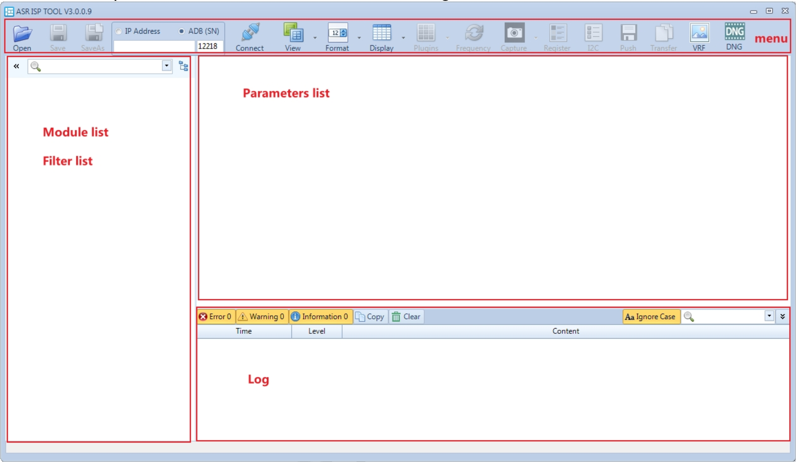

- **Menu: 菜单功能区**
  - **Open**: 打开参数文件。
  - **Save**: 保存参数文件。
  - **Save As**: 参数文件另存为。
  - **IP Address**: 保留。
  - **ADB (SN)**: ADB 方式连接终端设备，支持输入 ADB serial。
  - **Connect**: 连接终端设备。
  - **View**: 单窗口/水平叠加/垂直叠加显示。
  - **Format**: 十进制/十六进制显示切换。
  - **Display**: 矩阵编辑/行编辑/列编辑模式切换。
  - **Plugins**: 插件。
  - **Frequency**: 参数刷新速度调节。
  - **Capture**: 抓取 VRF 数据（vrf）。
  - **Register**: ISP 寄存器读写工具。
  - **I2C**: I2C 读写工具。
  - **Push**: 保留。
  - **Transfer**: 保留。
  - **VRF**: 看图工具。
  - **DNG**: 保留。

- **Module list & Filter list: 模块列表**
- **Parameter list: 参数列表**
- **Log: 日志区**

### Online 基本操作

#### 连接终端设备

打开工具后，选择 **ADB (SN)**，点击 **Connect**，连接成功后会自动读取当前所有模块的参数，并以 500ms（可在功能菜单中修改 **Frequency**）为周期定时刷新只读参数。（如果多台终端与 PC 相连，可指定 serial。）

如果想将可读写参数也定时刷新，勾选右上角的 **AutoUpdate** 即可（勾选后参数不可设置）。

如果想单次读取所有参数，点击右上角的 **Read** 按钮。

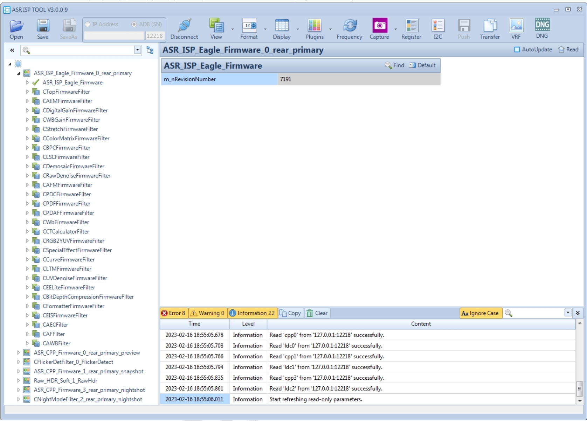

**注意：** ADB 连接方式只适用于使用 Android 系统的项目，我们主要使用 TCP 网络连接开发板进行 tunning。

#### 参数类型说明


- **可调参数**
  - 可勾选参数，例如 `m_bAutoCalculateAEMWindow`。
  - 可编辑参数，例如 `m_nPreEndingPercentage`。
  - 可编辑数组参数，例如 `m_pSubROIPermil`，如果是二维数组，可切换矩阵/行/列编辑模式。

- **只读（灰色）**
  - 只读参数，例如 `m_nAdjacentLumaSAD`。

- **特别说明**
  - 在插件或参数列表中修改参数后，会标红显示修改的内容，鼠标悬停时会显示原值。

#### 实时修改参数

1. 在模块列表区展开想要调试的模块列表。
2. 在模块列表区点击想要修改的模块。
3. 在参数列表区通过滑动条或者直接修改参数值，参数即时生效。

#### 抓取 VRF 图

1. 在菜单功能区点击 **Capture** 按钮。
2. 选择 **RAW**，设置保存路径。
3. 点击 **Start Capturing**，可生成后缀为 `.vrf` 的原始图像。

#### Register 读写


1. 在菜单功能区点击 **Register** 按钮。
2. 设置 **Address**（寄存器地址）。
3. 设置 **Value (8bit)**（寄存器值）。
   - **Read**：读取寄存器。
   - **Write**：写入寄存器。
4. 设置 **Value (32bit)**（寄存器值）。
   - **Read**：读取寄存器。
   - **Write**：写入寄存器。

#### I2C 读写

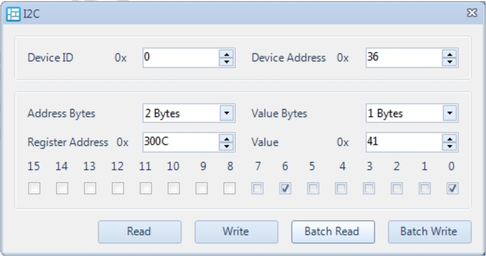

1. 在菜单功能区点击 **I2C** 按钮。
2. 设置 **Device ID**（I2C 设备号）。
3. 设置 **Device Address**（从设备地址）。
4. 设置 **Address Bytes**（寄存器地址位宽）。
5. 设置 **Register Address**（寄存器地址）。
6. 设置 **Value Bytes**（寄存器值位宽）。
7. 设置 **Value**（寄存器值）。
   - **Read**：读取寄存器。
   - **Batch Read**：文件导入批量读寄存器。
   - **Write**：写入寄存器。
   - **Batch Write**：文件导入批量写寄存器。

**批量读写寄存器文件格式**  
文件格式为 `{Address, Value}`，批量读写寄存器时，点击 **Batch Read** 或 **Batch Write** 导入 `reg_batch.txt`。读取结果会在红色框中显示对应的日志，同时会生成同名 `_read.txt` 文件用于后续查看。

  

**批量读写寄存器文件格式示例**

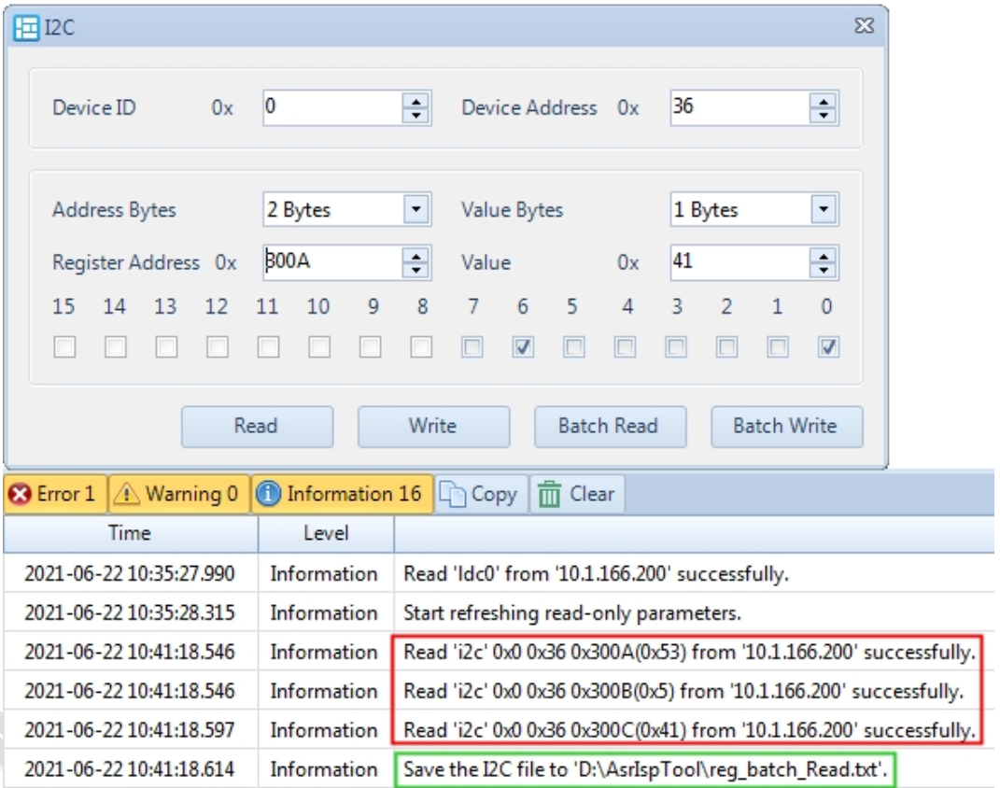

#### 保存参数

1. 在菜单功能区点击 **Save** 按钮。
2. 选择路径并设置文件名。
3. 点击保存生成参数文件。

#### 打开本地参数文件

在菜单功能区点击 **Open** 按钮，或者直接将参数文件拖曳到工具的对应模块中，该操作将把参数直接写入硬件。

### Offline 基本操作

**打开本地参数文件**

- 在菜单功能区点击 **Open** 按钮，或者直接拖曳参数文件到工具中;

**修改参数**

1. 在模块列表区展开想要调试的模块列表。
2. 在模块列表区点击想要修改的模块。
3. 在参数列表区通过滑动条或者直接修改参数值。
4. 如果是一维向量，在参数编辑界面点击波形按钮可进入曲线编辑模式。

**定标插件**

- 在菜单功能区点击 **Plugins** 下拉菜单选择插件。

**保存参数**

- 在菜单功能区点击 **Save** 按钮，输入文件名，参数将保存至本地文件。

## ISP 插件

本节介绍 BLC、LSC、AWB、CCM、Curve、Noise、PDC、PDAF 定标调试，以及调试辅助工具 General Information、Raw preprocessor。

标定插件支持 **online（连接设备）** 与 **offline（导入参数文件）**，只有打开对应 Filter 参数时，插件才能打开。

### BLC 定标与调试

#### BLC 定标 VRF 图要求

在全黑环境或将镜头完全遮挡采集 VRF 数据。

#### BLC 定标步骤

BLC 定标界面如下图
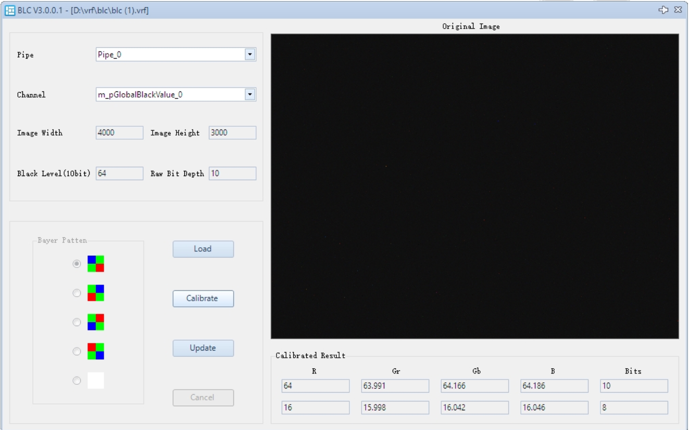

1. 在 BLC 插件中点击 **Load** 导入 VRF 图。
2. 选择 **Pipe ID**（非单 pipeline 可选）。
3. 选择 **Channel ID**。
4. 点击 **Calibrate**，校正结果显示在 **Calibrated Result** 界面。若结果不理想，也可手动修改 **Result**。
5. 点击 **Update**，参数将更新到参数列表。若结果不理想，可点击 **Cancel** 重新校正。

#### BLC 定标说明

- **Calibrated Result panel** 显示 4 个通道，10bits 与 8bits 的值。参数保存到文件中会映射到 12bits。
- **Channel ID**：表示对应 2 ᵅ[倍 gain 下的 BLC 参数。BLC 可随 Gain 调整，从 1x 倍 gain 到 2048 倍 gain，共 12 个等级（见下图 **Gain-BlackValue 示意图**）。最后一档 **manual** 在 **manual mode** 使能时生效，此时 BLC 不随 gain 调整。


Gain – BlackValue 示意图

#### BLC 调试说明

BLC 参数位于 **CDigitalGainFirmwareFilter**。

- 若 BLC 不随增益变化，将 **m_bManualMode** 置为 1，此时 BLC 值为 **m_pGlobalBlackValueManual**。
- 若 BLC 随增益变化，将 **m_bManualMode** 置为 0，此时 BLC 值为 **m_pGlobalBlackValue**。

### LSC 定标与调试

#### LSC 定标 VRF 图要求

在灯箱环境（D65、 CWF、 A 光）或存在 shading 的环境中，使用 diffuse 挡住镜头，拍摄若干进光均匀的图片。

#### LSC 定标步骤

LSC 定标界面如下图

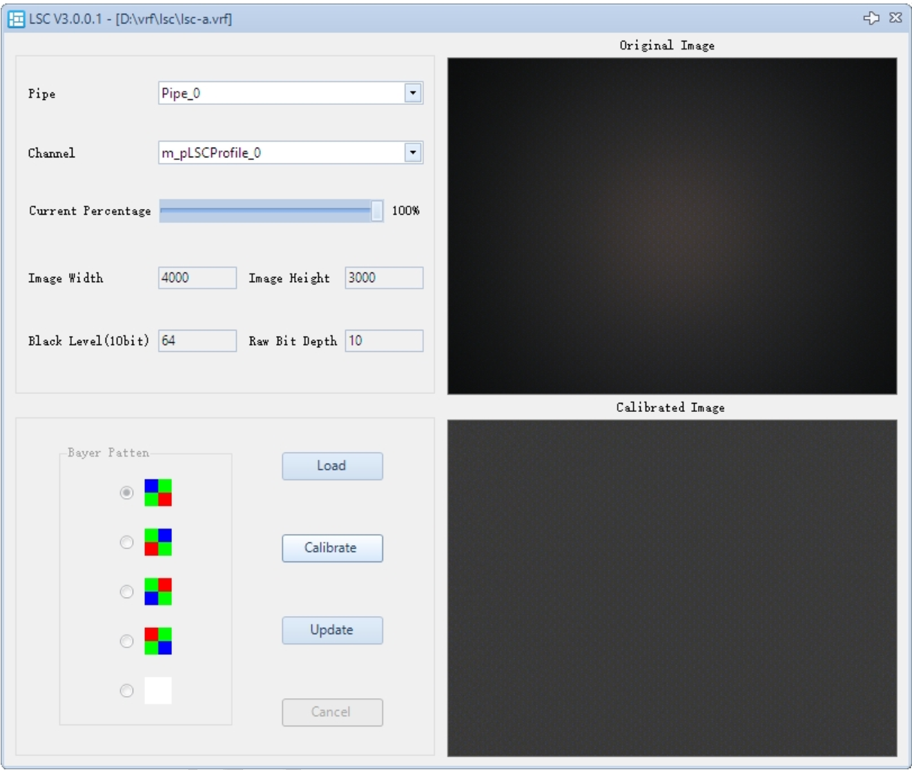

1. 在 LSC 插件中点击 **Load** 导入 VRF 图。
2. 选择 **Pipe ID**（非单 pipeline 可选）。
3. 选择 **Channel ID**。
4. 调整补偿的比例 **Current Percentage**，建议先设为 100%，后期可修改 **strength** 控制补偿强度。
5. 点击 **Calibrate**，校正仿真结果显示在 **Calibrated Image**。
6. 点击 **Update**，参数将更新到参数列表。若结果不理想，可点击 **Cancel** 重新校正。

#### LSC 定标说明

- **Channel ID**：
  - 0：低色温补偿表
  - 1：中色温补偿表
  - 2：高色温补偿表
  - **manual**：在 **manual mode** 使能时生效，此时 LSC 不随色温调整。

#### LSC 调试说明

LSC 可随 **CT** 或 **CorrelatedCT** 调整（见下图 **CT-LSCProfile 示意图**）。

- **CT** 定义：256 \* AWB_RGain / AWB_BGain（可通过 AWB plugin 中的 CT 信息 / 4 获得）。
- **CorrelatedCT** 定义：相关色温，光源发出的光与某一色温的黑体辐射光相似的程度。

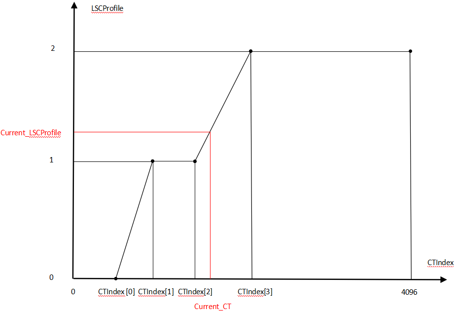

LSC 参数位于 CLSCFirmwareFilter

- LSC 需随色温变化，设置合适的 **m_pCTIndex**，以设置不同色温下的 Shading 表。
- **推荐使用**：**m_nCorrelationCT**（在 **CCTCalculatorFilter** 中读取）。

**注**：LSC 插值依据可选择 **AWBFilter** 计算结果 **CT**（在 AWB 插件中读取 CT）或 **CCTCalculatorFilter** 计算结果 **CCT**（在 **WbFirmwareFilter** 中读取 **m_nCorrelationCT**）。


### CCM 与 CCT 定标与调试

#### CCM 定标 VRF 图要求

在灯箱环境中使用拍摄 24 色卡，画面中色卡尽量对正，色卡居中，占画面约 1/9。  
**D65**、**CWF**、**A 光** 是必要的光源。

#### CCM 定标步骤

CCM 定标界面如下图

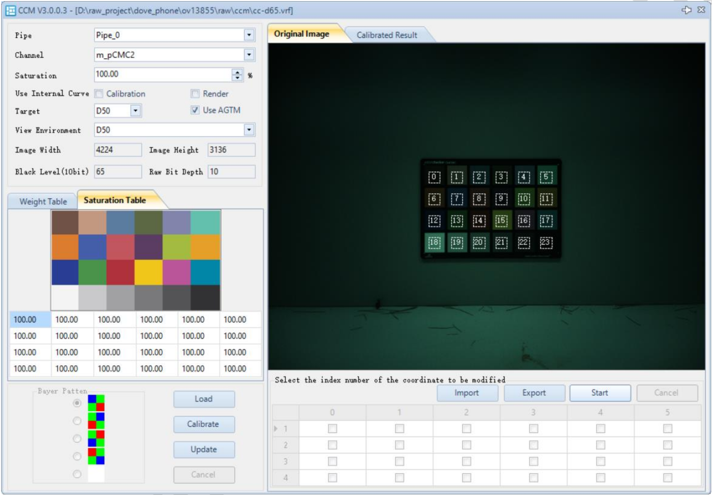

1. 在 CCM 插件中点击 **Load** 导入 VRF 图，VRF 使用 **Raw preprocessor** 插件补偿 LSC 和 PDF（如存在 PD 像素）。
2. 在图中框选完整的色卡，保证 24 个 ROI 都落在色块之内。若拍摄图片不正或畸变严重，可点击 **start**，勾选期望单独调整的 ROI，然后手动拖动 ROI。
3. 设定期望校正的饱和度。
4. 点击 **Calibrate**，校正仿真结果显示在 **Calibrated Result**。
5. 选择 **Pipe ID**（非单 pipeline 可选）。
6. 选择 **Channel ID**。
7. 点击 **Update**，参数将更新到参数列表。若结果不理想，可在 **Saturation Table** 中针对修改某一个 block 的饱和度，然后重新 **calibrate**。

#### CCT 定标步骤

CCM 定标界面如下图


1. 定标步骤与 CCM 定标可同时进行，CCT 只需要 **A** 与 **D65**。
2. CCM Calibrate **A** 光之后，选择 **profile 2850K**，点击 **UpdateCTMatrix**。
3. CCM Calibrate **D65** 光之后，选择 **profile 6500K**，点击 **UpdateCTMatrix**。
4. 结果将自动更新到 **CCTCaluatorFilter** 中 **m_pCTMatrix_low** / **high** 中。

#### CCM 定标说明

- **Use Internal Curve – Calibration**：无需勾选。
- **Use Internal Curve – Render**：无需勾选。
- **Use AGTM**：勾选。
- **Target**：保持 **D50**。
- **View Environment**：保持 **D50**。
- **Calibrated Result**：显示校正之后的仿真结果。
- **CCM Result**：列出了校正之后的色彩矩阵，此处亦可手动修改，点击 **set** 设到硬件中。
- **Channel ID**：
  - 0：低色温 CCM 参数
  - 1：中色温 CCM 参数
  - 2：高色温 CCM 参数
  - **manual**：在 **manual mode** 使能时生效，此时 CCM 不随色温调整。
- **Make DNG Profile**：reserved
- **UpdateCTMatrix**：更新 CCT matrix
- **SaveImage**：保存 render 出的图片

#### CCM 调试说明

CCM 可随色温调整（见下图 **CCM-色温控制曲线**）。

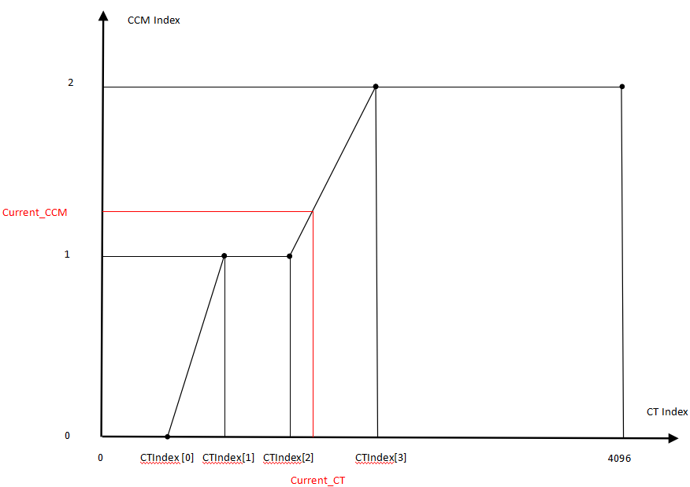

CCM 参数位于 **CColorMatrixFirmwareFilter**。

- CCM 需随色温变化，设置合适的 **m_pCTIndex**，以设置不同色温下的色彩矩阵。
- **推荐使用**：**CorrelatedCT**。

**注**：CCM 插值依据可选择 **AWBFilter** 计算结果 **CT**（在 AWB 插件中读取 CT）或 **CCTCalculatorFilter** 计算结果 **CCT**（在 **WbFirmwareFilter** 中读取 **m_nCorrelationCT**）。


### AWB 定标与调试

#### AWB 白点定标 VRF 图要求

AWB 定标无需额外拍图，完成 CCT 定标即可进行。

#### AWB 白点定标步骤

AWB 定标界面如下图


1. 打开 AWB 插件。
2. 点击 **Optimize**，定标参数将自动更新到参数界面

#### AWB 亮度定标

在 AE 调试完成之后，需对模组亮度进行定标, 从而得到 AWB 需要的 Lux，定标步骤如下:

在 AE 调试完成之后，需对模组亮度进行定标，从而得到 AWB 需要的 Lux，定标步骤如下：

1. 相机置于灯箱，拍摄灯箱壁，光源选择 **D65**。
2. 使用色温照度计测量灯箱照度，填入 **AECFilter** 中 **m_nCalibSceneLux**。
3. 在 **AECFilter** 中读取 **m_nExpIndexLong**，填入 **AECFilter** 中 **m_nCalibExposureIndex**。
4. 在 **AECFilter** 中读取 **m_nLumQ16**，填入 **AECFilter** 中 **m_nCalibSceneLum**。

| 参数名                | 说明                                   | 建议调试 | 特殊性 |
| --------------------- | -------------------------------------- | -------- | ------ |
| m_nCalibExposureIndex | 亮度定标的曝光索引                     | 是       |        |
| m_nCalibSceneLum      | 亮度定标的场景亮度                     | 是       |        |
| m_nCalibSceneLux      | 定标场景对应的实际照度                 | 是       |        |
| m_nSceneLux           | AWB debug参数,当前AE计算得到的场景照度 | -        | 只读   |

#### AWB Debug

##### Block debug 信息

连接设备，点击 AWB 插件，每个 block 的落点将以蓝色点显示在坐标轴上，AWB 统计图像显示为缩略图。

统计图上可框选区域(默认展示所有区域的落点)，框选之后只会显示框中 block 的落点。

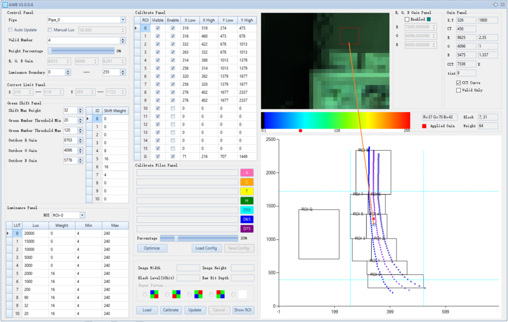

##### ROI 中的白点

点击 **Show ROI**，可以看到不同 ROI 中包含的 block 情况，白色为参与白平衡计算的 block，即落入 ROI 区域的 block。  
下图可见具体 32X24 个 block 所属 ROI。


##### Block 的权重

勾选 **auto update** 会定时更新 lux 及统计图，并实时计算 block 的权重。

拖动 **Weight Percentage**，可以调整 debug 图上实际场景与参与白平衡计算的 block 的比例。0% 显示实际场景，100% 显示参与白平衡计算的 block 的权重（权重参考热力图）。  

若设为 100%，画面显示为全黑，表示该 lux 下所有 block 权重为 0。

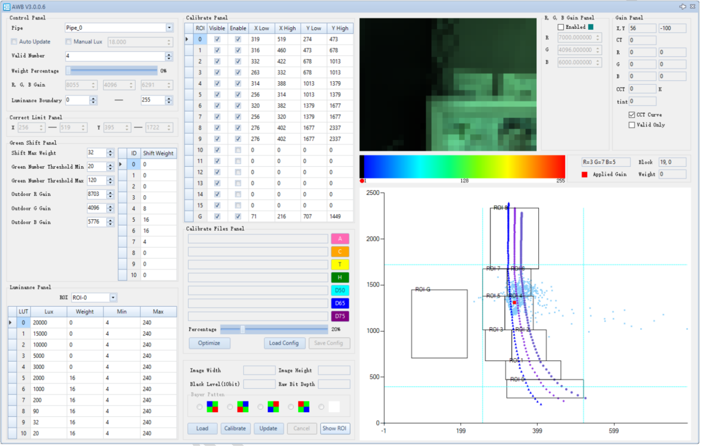

设置 **Weight Percentage** 为 100%，以热力图形式显示 block 的权重，可以将鼠标拖动到期望了解的 block，热力图右侧会显示对应 block 的权重（**AWB Frameinfo** 也可以看到 debug 信息），下图鼠标选择的是 block[12][2]，权重为 16。


##### 白平衡 gain 的落点

**RGB gain panel** 模块，勾选 **enabled**，填入 Q12 精度的 RGB gain（debug 信息 **CurrentResult**），对应白平衡 gain 在色温坐标系中以蓝色方块呈现，色温坐标系通过鼠标从左上到右下框选放大，从右下到左上框选缩小。  

当前白平衡 gain 在色温坐标系中以红色方块呈现。


#### AWB 调试说明

- **定标 Panel**

  - **Calibrate Panel**
    - **Visible**：勾选将在坐标中显示该 ROI。
    - **Enable**：勾选将使能该 ROI。
  - **Calibrate Files Panel**
    - **Percentage**：选取 VRF 图的比例。20%，表示选择中心 20% 的区域用于定标，图像中心的区域受到 shading 的影响较小。
    - **Optimize**：自动定标。
    - **Load config**：(reserved)
    - **Save config**：(reserved)
    - **Load**：导入 VRF。
    - **Calibrate**：reserved。
    - **Update**：更新参数到参数列表。
    - **Cancel**：取消参数更新。
    - **ShowROI**：显示各个 ROI 的百点情况。

- **调试 Panel**

  - **Control Panel**
    - **Pipe ID**：当前的 pipeline ID（非单 pipe 可选）。
    - **Auto Update**：online 状态自动更新当前亮度与统计窗口（勾选时，在插件中将不能修改参数）。
    - **Manual Lux**：固定当前亮度。
    - **Weight Percentage**：debug 参数，调整显示白平衡统计块与块的权重。0% 显示统计块，100% 显示块权重热力图。
    - **RGB Gain**：debug apply 的 gain，对应色温坐标系中红色的点。
    - **Luminance Boundary**：参与 AWB 统计的像素的亮度区间(8 bit)。
    - **Valid Number**：白平衡计算所需最少有效 block，[0,768]。
    - **Correct Limit Panel**：block 限制区间，超出 Limit 且处于 ROI 的 block 将会在 XY 上方向映射。

  - **Green Shift Panel**
    - **Shift Max Weight**：shift 权重，与 exposure shift 相乘得到最终的 shift 权重，最大 32，完全偏向 outdoor gain。
    - **Green Number Threshold**：落在 G 区的 block 的数目，在此区间则进入 green shift。
    - **Outdoor RGB Gain**：green shift 目标 gain。
    - **Shift Weight**：依据 exposure 调整 weight。

  - **Luminance Panel**
    - **Lux**：亮度索引。
    - **Weight**：对应 ROI 在当前亮度下的权重。
    - **Min / Max**：luma 区间(8 bit)。

- **Debug Panel**

  - **RGB Gain Panel**
    - **enabled**：用于展示白平衡 gain 在色温坐标系的位置。
    - **RGB**：白平衡 gain。

  - **Gain Panel**：debug 信息，鼠标在色温坐标系上滑动，可显示对应位置的 debug 信息。
    - **X Y**：色温坐标系上点对应 XY 坐标。
    - **CT**：色温坐标系上点对应 CT 值，可用于提供 LSC、CCM 插值依据。
    - **RGB**：色温坐标系上点对应白平衡 gain。
    - **CCT**、**Tint**：色温坐标系上点对应 CCT 与 Tint，可用于提供 LSC、CCM 插值依据。
    - **CCT curve**：色温坐标系上显示 CCT curve。
    - **Vaild only**：色温坐标系上只展示有效统计块。
    - **Applied Gain**：当前场景白平衡 gain 落点，对应色温坐标系中红色的点。
    - **Block**、**Weight**：鼠标在统计图上滑动，可显示对应 block 的位置及权重。

### Curve 调试

#### Curve 调试步骤

Curve 调试界面如下图


1. 打开 Curve 插件。
2. 选择 **Pipe ID**（非单 pipeline 可选）。
3. 选择 **Channel ID**。
4. 鼠标滑至 Curve 上想要调节的点，左键拖动到期望位置。
5. 点击 **Update**，参数将更新到参数列表。若结果不理想，可点击 **Cancel** 重新校正。

#### Curve 调试说明

- **Channel ID**：
  - **BacklightCurveManual**：用于控制背景亮度，建议保持曲线不变，调整 **strength** 即可。
  - **ContrastCurveManual**：用于控制对比度，建议保持曲线不变，调整 **strength** 即可。
  - **GTMCurve0**：gain 为 **m_pGainIndex[0]** (Q4 精度)时的曲线。
  - **GTMCurve1**：gain 为 **m_pGainIndex[1]** (Q4 精度)时的曲线。
  - **GTMCurve2**：gain 为 **m_pGainIndex[2]** (Q4 精度)时的曲线。

**注**：当 **m_nCurveSelectOption** 设为 0 时，curve 依据当前 gain 做插值（见下图 **Curve-Gain 控制曲线示意图**）。

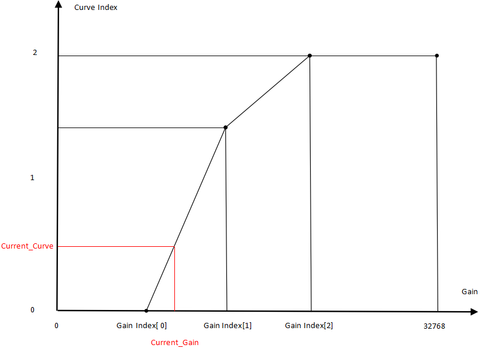

Curve 参数位于 **CCurveFirmwareFilter**。

- Curve 可随 gain 变化，设置合适的 **m_pGainIndex**，以设置不同 gain 下的 curve。


### Noise 定标与调试

#### Noise 定标 RAW 图要求

在实验室环境中使用拍摄 24 色卡，画面中色卡尽量对正，色卡居中，占比约 1/9。

控制灯光亮度，依次拍摄 1、2、4、8、16、32、64、128、256、512、1024、2048 倍 Gain 下的色卡。

#### Noise 定标步骤

定标界面如下图

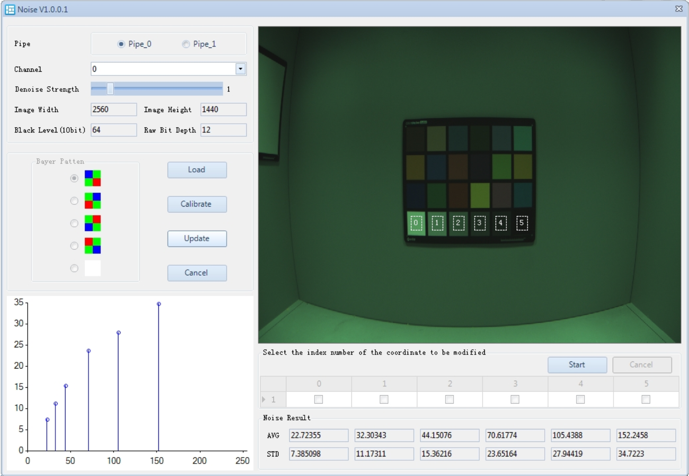

1. 在 Noise 插件中点击 **Load** 导入 RAW 图，VRF 使用 **Raw preprocessor** 插件补偿 LSC 和 PDF（如存在 PD 像素）。
2. 在图中框选色卡最下方的 6 个块，保证 6 个 ROI 都落在色块之内。若拍摄图片不正或畸变严重，可点击 **start**，勾选期望单独调整的 ROI，然后手动拖动 ROI。
3. 设定期望 **Denois Strength**。
4. 点击 **Calibrate**，标定噪声水平显示在 **Noise Result**。
5. 选择 **Pipe ID**。
6. 选择 **Channel ID**。
7. 点击 **Update**，参数将更新到参数列表。若结果不理想，可点击 **Cancel** 重新校正。

#### Noise 定标说明

- **Noise Result**：显示标定的噪声水平。
- **Channel ID**：
  - 0：1 倍 gain 下的去噪参数。
  - 1：2 倍 gain 下的去噪参数。
  - 以此类推，11：2048 倍 gain 下的去噪参数。
  - **manual**：manual mode 下的去噪参数。

### PDAF 定标

#### PDAF 定标 VRF 图要求

在实验室环境中拍摄棋盘格，拍摄物距 2 米，棋盘格和 sensor 平行。  
控制灯光亮度，使得增益尽量接近 1 倍。  
拍摄马达从有效位置最小值到有效位置最大值的图像（将整个扫描区域均分成 30 段，31 个位置），共 31 张（vrf 文件名命名规范为 **position.vrf**，PD raw files 文件名 **position_L.raw**，**position_R.raw**）。

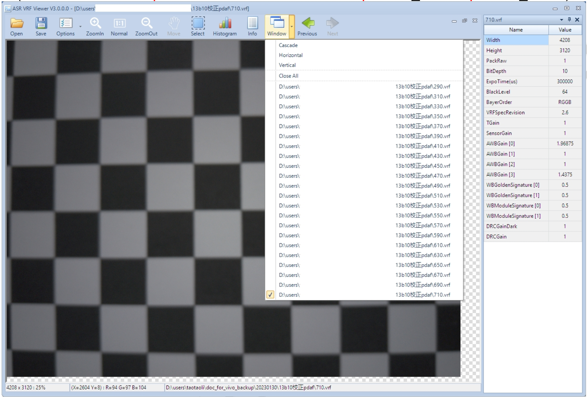

#### PDAF 定标步骤

PDAF 定标界面如下图


1. 在 **PDC** 插件中点击 **Load** 选择 VRF 文件夹（若导入的是已抽出 PD 的 raw files，还需填写 raw 的宽高）。
2. 点击 **Calibrate**，将显示图像分割为 5x5 的块所对应的块的 **position – shift** 图。
3. 选择 **Pipe ID**（非单 pipeline 可选）。
4. 点击 **Update**，**CAFFilter** 中 **m_pPDShiftPositionLUT** 参数将更新。
5. 若结果不理想，可点击 **Cancel** 重新校正。

### PDC 定标

PDC 用于将 PD 像素或 shadow 像素亮度补偿到正常亮度供 PDAF 对焦算法使用。  
已知 PD 点，shadow 分布情况（**m_pPixelMask** 和 **m_pPixelTypeMask**）下，通过含 PD 点分布的图像，对 PDC 参数 **m_pRatioBMap** 进行标定。

#### PDC 定标 VRF 图要求

在灯箱环境 **D65** 中，使用毛玻璃拍摄灯箱壁。

#### PDC 定标步骤

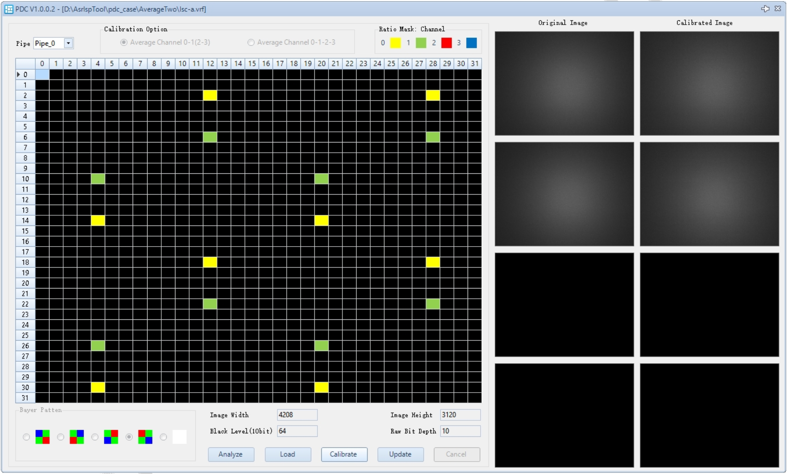

1. 在 PDC 插件中点击 **Analyze**，PDC plugin 判断 setting 中 **m_pPixelMask** 和 **m_pPixelTypeMask** 设置是否合理。如果不合理，需要调整这两个参数。
2. **Analyze** 分析 setting，合理后，**Load** 按钮有效化。QuadBayer PD 可选择补偿方式（0-1 通道互补或 2-3 通道互补，四通道 PD 点数目相同时，还可选择四通道互补）。
3. **Load** 图像成功后，右边会显示对应通道抽取的 PD 点组成的小图像。按下 **Calibrate** 按钮，会计算根据图像计算得到的 **m_pRatioBMap**，并将用新的 **m_pRatioBMap** 补偿过的 PD 点组成的小图像显示在右图中。
4. **Update** 按钮会更新 PDC 参数中 **m_pRatioBMap**。若结果不理想，可点击 **Cancel** 重新校正。
5. 选择 **Pipe ID**（非单 pipeline 可选）。
6. 点击 **Update**，参数将更新到参数列表。若结果不理想，可点击 **Cancel** 重新校正。

#### PDC 定标说明

**m_pPixelMask，m_pPixelTypeMask 说明**

1. 两个参数标定图像 PD，shadow 分布，分布以 32x32 周期分布。
   - 如果 **m_pPixelMask=1**，则当前点为 PD 点，**m_pPixelTypeMask** 表示像素遮蔽的四种方向。
   - 如果 **m_pPixelMask=0**，**m_pPixelTypeMask>0**，则当前点为 shadow 点。
2. 两个参数一般由 sensor 厂商提供，如果没有则拍摄 RAW 图手工标定。

### Raw preprocessor 插件

#### Raw preprocessor 插件说明

Raw preprocessor 插件用于 raw 预处理，支持 PD 点矫正，LSC 补偿，Unpack VRF(ASR RAW packed format)功能。

#### Raw preprocessor 插件使用

Raw preprocessor 界面如下图


1. 在 Raw preprocessor 插件中设置 **input** 和 **output** VRF 文件。
2. 选择对应的 **pipe** 以及 **LSC channel**。
3. 选择期望的预处理功能，PDF，LSC，Unpack。
4. 点击 **Preprocess**。
5. **Batch preprocess** 支持文件夹导入，批处理 VRF 文件。

### General Information 插件

General Information 插件用于连接设备实时显示一些 debug 信息。

### General Information 显示

默认配置了如下图信息供调试工程师参考：

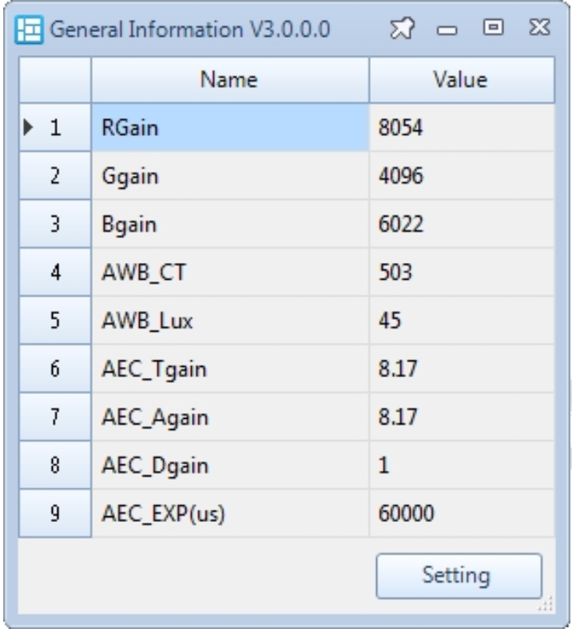

#### General Information 拓展

点击 **setting**，出现如下图信息编辑页，可以自由编辑想要关注的信息。一行为一个显示条目，格式说明详见 **Expression Manual**。

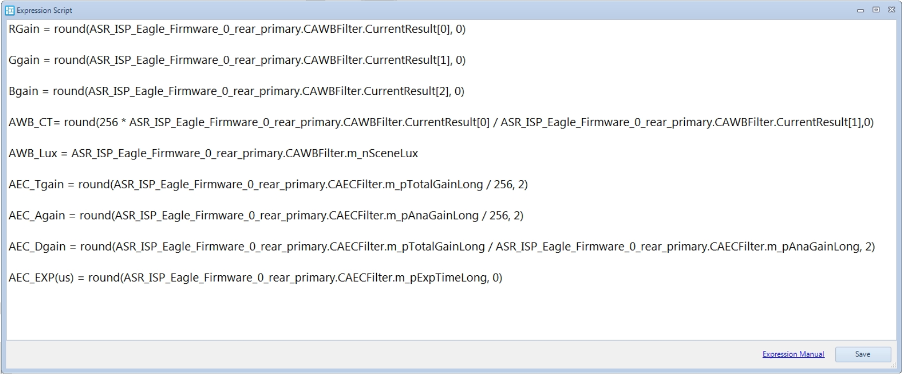

## ISP Tuning

### CTopFirmwareFilter 调试说明

CTopFirmwareFilter 用于配置 ISP Top 信息。

#### TOP 参数

| 参数名 | 说明 | 建议调试 | 特殊性 |
|---|---|---|---|
| m_nBayerPattern | Bayer阵列模式：`0` RGGB `1` GRBG   2: GBRG   3: BGGR   4: 单色模式 | 依据硬件设置 |   |
| m_bAELinkZoom | AE窗口关联zoom | 用户设置 |   |
| m_bAFLinkZoom | AF关联zoom | 用户设置 |   |
| m_bAWBLinkZoom | AWB关联zoom | 用户设置 |   |
| m_nPreviewZoomRatio | 预览zoom系数，Q8 格式 | 用户设置 |   |
| m_bPreviewLowPowerMode | 预览低功耗模式 | 用户设置 |   |
| m_nAEProcessPosition | AE处理时机 `0` eof        `1` sof | 用户设置 |   |
| m_nAEProcessFrameNum | AE处理频率：  EOF每帧处理  EOF每两帧处理  SOF每帧处理  SOF每三帧处理 | 用户设置 |   |
| m_bHighQualityPreviewZoomEnable | Reserved |   |  |

### CAEMFirmwareFilter 参数说明

CAEMFirmwareFilter 模块用于配置自动曝光统计模块。

#### AEM 使能及参数

| 参数名 | 说明 | 建议调试 | 特殊性 |
|---|---|---|---|
| m_bEnable | AEM使能：`0`：关闭自动曝光统计模块  `1`：使能自动曝光统计模块 | 否 |   |
| m_nAEStatMode | AE统计模块模式：`0`：统计信息不经过白平衡  `1`：统计信息经过白平衡 | 否 |   |
| m_bZSLHDRCapture | 零延迟HDR抓拍使能 `0`：不启动 `1`：启动零延迟HDR抓拍功能 | 用户设置 |   |
| m_nInitialExpTime | 初始化曝光时间 | 是 |   |
| m_nInitialAnaGain | 初始化模拟增益 | 是 |   |
| m_nInitialSnsTotalGain | 初始化sensor总增益 | 是 |   |
| m_nInitialTotalGain | 初始化总增益 | 是 |   |
| m_nStableTolerance | AE稳定容忍度百分比：若当前曝光量与前一次曝光量的差值小于前一次曝光量的m_nStableTolerance%，则给出AE StableFlag信号，供其他模块如LTM参考 | 用户设置 |   |
| m_nStableToleranceExternal | AE稳定容忍度百分比，共外部系统使用 | 用户设置 |   |
| m_bAutoCalculateAEMWindow | AE统计窗口计算方式：`0`：由hardware配置        `1`：由firmware控制 | 否 |   |
| m_nPreEndingPercentage | 不参与AE统计模块的行数相对于图像高的百分比 | 否 |   |
| m_bDRCGainSyncOption | DRCgain同步：`0`：每帧同步 `1`：AE稳定后同步 | 否 |   |
| m_pSceneChangeSADThr | 判断场景变化的SAD门限 | 用户设置 |   |
| m_pSubROIPermil | 6个子统计模块的起始坐标及结束坐标相对于图像宽高的千分比可根据人脸测光或对焦测光联动，由application修改 | 用户设置 |   |
| m_nSubROIScaleFactor | 副窗口缩放百分比系数 | 用户设置 |   |
| m_nFaceLumaOption | 人脸亮度统计方式：`0`：硬件统计（pixel） `1`：软件统计（block） | 否 |   |
| m_bMotionDetectEnable | 运动检测开关：`0`：关闭运动检测 `1`：使能运动检测 | 用户设置 |  |
| m_bMotionDetectExt | 运动检测方式：`0`： 使用内部 AEM 统计 `1`：使用外部 gyro sensor | 用户设置 |  |
| m_nMotionStrengthExt | 外部运动强度控制，运动检测方式为外部 gyro 时有效 | 用户设置 |  |
| m_nSADIntervalFrame | 计算 SAD 的间隔帧数，运动检测方式内部 AEM 统计时有效  | 否 |  |
| m_nMotionThreshold | 判断运动的 SAD 门限，运动检测方式内部 AEM 统计时有效  | 否 |  |
| m_nMotionDetectFrame | 连续 m_nMotionDetectFrame 帧检测到 SAD 超过门限，则认为是运动场景  | 否 |  |
| m_nFaceDetFrameID | 侦测到人脸的帧号 |  - | 只读 |
| m_nAdjacentLumaSAD | 当前SAD |  - | 只读 |
| m_pMainRoiCoordinate | 主窗口坐标 |  - | 只读 |
| m_pSubRoiCoordinate | 副窗口坐标 |  - | 只读 |

### CDigitalGainFirmwareFilter 参数说明

CDigitalGainFirmwareFilter 模块用于配置数字增益和黑电平。

#### DigitalGain 使能及参数

| 参数名 | 说明 | 建议调试 | 特殊性 |
|---|---|---|---|
| m_bEnable | digital gain使能：`0`：关闭数字gain  `1`：使能数字gain | 用户设置 |   |
| m_nISPGlobalOffsetValue12bit | `0`：在stretch中扣除黑电平 `1`：在digital gain 中完全扣除黑电平   `2-511`：完全扣除黑电平后, 12bit添加的offset（此offset会在stretch扣除） | 用户设置 |   |
| m_bManualMode | 手动模式使能 `0` 自动模式 `1` 打开手动模式，此时黑电平参数不随 gain 变化，使用 manual 参数，用于 debug |   |   |
| m_pGlobalBlackValueManual | 手动模式参数，作用和自动一致 |   |   |
| m_pGlobalBlackValueManualCapture | 同上，拍照起效 |   |   |
| m_pGlobalBlackValue | R/ GR/ GB/ B 四个通道的黑电平（见 Gain-BlackValue 示意图） | 定标结果参数 | 可随gain变化 |
| m_pGlobalBlackValueCapture | 同上，拍照起效 | 定标结果参数 | 可随 gain 变化 |
| m_pWBGoldenSignature | 白平衡 golden 模组特征 |  - | 只读 |
| m_pWBCurrentSignature | 白平衡当前模组特征 |  - | 只读 |

BlackValue 示意图如下
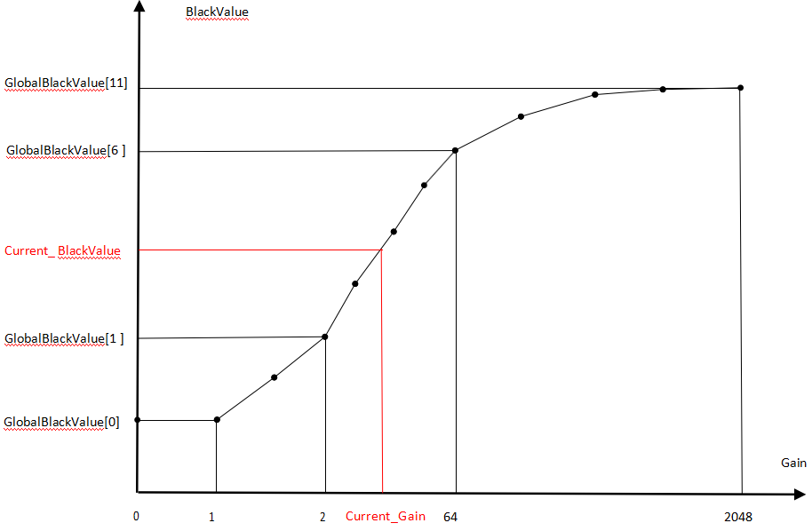

### CWBGainFirmwareFilter 参数说明

CWBGainFirmwareFilter 模块用于自动白平衡增益。

#### WBGain 使能

| 参数名 | 说明 | 建议调试 | 特殊性 |
|---|---|---|---|
| m_bEnable | WB gain 使能：`0`：关闭白平衡 gain `1`： 使能白平衡gain | 否 |  |

### CStretchFirmwareFilter 参数说明

CStretchFirmwareFilter 模块用于弥补扣除黑电平之后像素不饱和。

#### Stretch 使能

| 参数名 | 说明 | 建议调试 | 特殊性 |
|---|---|---|---|
| m_bEnable | stretch使能：常开，用于弥补扣除黑电平，并补偿像素不饱和 | 否 |  |

### CColorMatrixFirmwareFilter 参数说明

CColorMatrixFirmwareFilter（CCM）模块用于色彩校正。

#### CCM 使能

| 参数名 | 说明 | 建议调试 | 特殊性 |
|---|---|---|---|
| m_bEnable | CMC使能：`0`：关闭色彩校正矩阵  `1`：使能色彩校正矩阵 | 否 |  |

#### CCM 参数及调试

| 参数名 | 说明 | 建议调试 | 特殊性 |
|---|---|---|---|
| m_bUseCorrelatedCT | 插值依据选项：`0`：使用AWB的CT `1`：使用 `WbFirmwareFilter` 中的 `m_nCorrelationCT`（CCT matrix 需要标定） | 用户设置 |   |
|  m_pColorTemperatureIndex | 色温分段控制点。（示例见下图 cmc-色温控制曲线）  色温位于[0，Index[0]]区间，认定为低色温区间，使用CMC0的色彩校正矩阵；  色温位于[Index[0]，Index[1]]区间，使用CMC0与CMC1插值的色彩校正矩阵；  色温位于[Index[1]，Index[2]]区间，认定为中色温区间，使用CMC1的色彩校正矩阵；  色温位于[Index[2]，Index[3]]区间，使用CMC1与CMC2插值的色彩校正矩阵；  色温位于[Index[3]，8192]区间，认定为高色温区间，使用CMC2的色彩校正矩阵； |  是 |   |
| m_pCMC0 | 低色温色彩校正矩阵，由CCM插件定标得到。R'G'B' to RGB ，Q12 精度。 | 定标结果参数 | 可依据色温调用 |
| m_pCMC1 | 中色温色彩校正矩阵，由CCM插件定标得到。R'G'B' to RGB ，Q12 精度。 | 定标结果参数 | 可依据色温调用 |
| m_pCMC2 | 高色温色彩校正矩阵，由CCM插件定标得到。R'G'B' to RGB ，Q12 精度。 | 定标结果参数 | 可依据色温调用 |

cmc-色温控制曲线如下图


#### CCM 彩边抑制功能及参数

| 参数名 | 说明 | 建议调试 | 特殊性 |
|---|---|---|---|
| m_bColorFringleRemoveEnable | 彩边抑制使能：`0`：关闭 `1`： 使能 | 用户设置 |   |
| m_nColorFringRemovalStrength | 彩边抑制强度: 值越大，彩边抑制效果越强 | 是 |  |

备注：Final CFR_Ratio=HueRatio\*EdgeRatio\>\>HighFreqTransShiftNum

- **Hue 控制参数**

| 参数名 | 说明 | 建议调试 | 特殊性 |
|---|---|---|---|
| m_nHueTransShiftNum | Hue过渡带偏移系数:（示例见下图 HueTrans-HueRatio 控制曲线）Hue 落入[(ColorFringeHueRange[0]-(1&lt;&lt;ShiftNum)，ColorFringeHueRange[0]] 区间做平滑处理；Hue 落入 [ColorFringeHueRange[1]，(ColorFringeHueRange[1]+(1&lt;&lt;ShiftNum)] 区间做平滑处理； | 是 |   |
| m_pColorFringeHueRange | 彩边抑制的 Hue 区间（示例见下图 HueTrans-HueRatio 控制曲线）HueRange[0] 需小于 HueRange[1] | 是 |  |

ColorFringeHueRange[0],[1] 用于选定彩边抑制的 Hue 区间;

HueTransShiftNum 用于设定平滑过渡带：

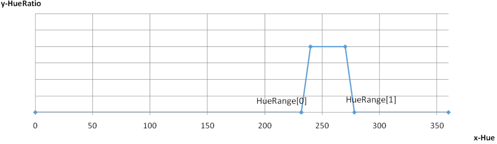

- **Freq 控制参数**

| 参数名 | 说明 | 建议调试 | 特殊性 |
|---|---|---|---|
| m_nHighFreqThreshold    | 彩边抑制频率下限（示例见 HighFreqTrans-EdgeRatio 曲线）值越大，更少边缘进入彩边抑制区域 | 是 |   |
| m_nHighFreqTransShiftNum  | 高频过渡带偏移系数（示例见 HighFreqTrans-EdgeRatio 曲线）频率落入 [HighFreqThreshold, HighFreqThreshold +(1&lt;&lt;HighFreqTransShiftNum)] 区间做平滑处理 | 是 |  |

HighFreqTrans-EdgeRatio 曲线如下图
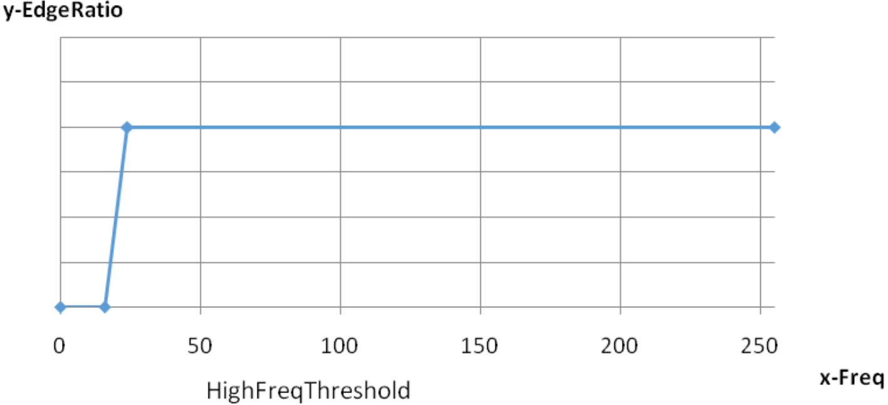

#### CCM Manual 参数

| 参数名 | 说明 | 建议调试 | 特殊性 |
|---|---|---|---|
| m_bManualMode | 手动模式使能 `0` 自动模式 `1` 打开手动模式，此时色彩校正矩阵参数不随色温变化，使用 manual 参数，用于 debug |  - | Debug参数 |
| m_pCMCManual | 手动模式参数，作用和自动一致 |  - | Debug参数 |

#### CCM 其他参数

| 参数名 | 说明 | 建议调试 | 特殊性 |
|---|---|---|---|
| m_bDisgardHFEnable | 丢弃高频信息使能：`0`：添加高频信息  `1`：丢弃高频信息 | 用户设置 |   |
| m_pCMCSaturationList | 饱和度控制 |   | 可随 Gain 变化 |

### CBPCFirmwareFilter 调试说明

CBPCFirmwareFilter（BPC）模块用于去坏点。

#### BPC 使能

| 参数名 | 说明 | 建议调试 | 特殊性 |
|---|---|---|---|
| m_bEnable | BPC使能 `0` 关闭坏点校正 `1` 打开坏点校正 | 用户设置 |  |

#### BPC 动态控制参数

BPC 强度可随增益与亮度动态调节。

| 参数名 | 说明 | 建议调试 | 特殊性 |
|---|---|---|---|
| m_pBpcGainIndex | 增益索引，建议保持缺省值 | 否 | Gain控制节点 |
| m_pSegG | 亮度索引，相邻两档间跨度须保证为2的整数幂，建议保持缺省值 | 否 | Lum控制节点 |

- 增益控制参数为 m_pBpcGainIndex ，0-11 共十二组，16 为 1 倍增益，增益处于两个节点之间时，参数为两个节点参数插值的结果。


- 亮度控制参数为 m_pSegG，0-8 共九组，其中第 8 组固定为 255 不可改，对应 VRF 数据像素值（映射到 8 比特），亮度处于两个节点之间时，参数为两个节点参数插值的结果，相邻两档间跨度须保证为 2 的整数幂，建议保持缺省值。

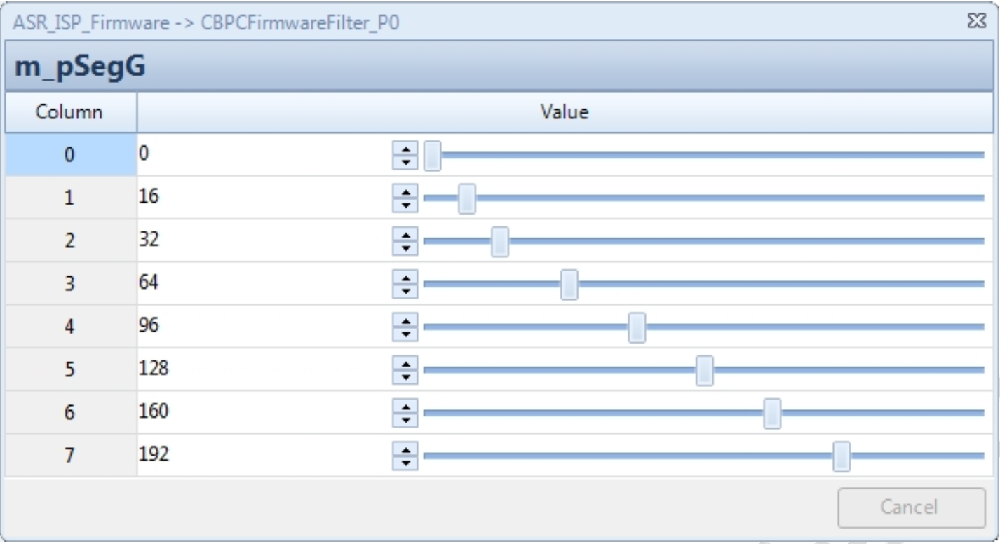

- 强度控制参数，可随增益和亮度的变化动态调节。

| 参数名 | 说明 | 建议调试 | 特殊性 |
|---|---|---|---|
| m_pCrossChnStrength | 跨通道强度，值越大，参考更多其他通道信息,也更容易受其他通道的坏像素干扰 | 是 | 可随Gain变化 |
| m_pSlopeG | G通道控制曲线参数，值越大，容忍度越大，去坏点能力越弱 | 是 | 可随Gain和Lum变化 |
| m_pInterceptG | G通道控制曲线参数，值越大，容忍度越大，去坏点能力越弱 | 是 | 可随Gain和Lum变化 |
| m_pSlopeRB | RB通道控制曲线参数，值越大，容忍度越大，去坏点能力越弱 | 是 | 可随Gain和Lum变化 |
| m_pInterceptRB | RB通道控制曲线参数，值越大，容忍度越大，去坏点能力越弱 | 是 | 可随Gain和Lum变化 |

以 m_pSlopeG 为例：

- Column 表示 Gain 的档位，与 m_pBpcGainIndex 一一对应。

- Row 表示 Lum 档位，与 m_pSegG 一一对应。

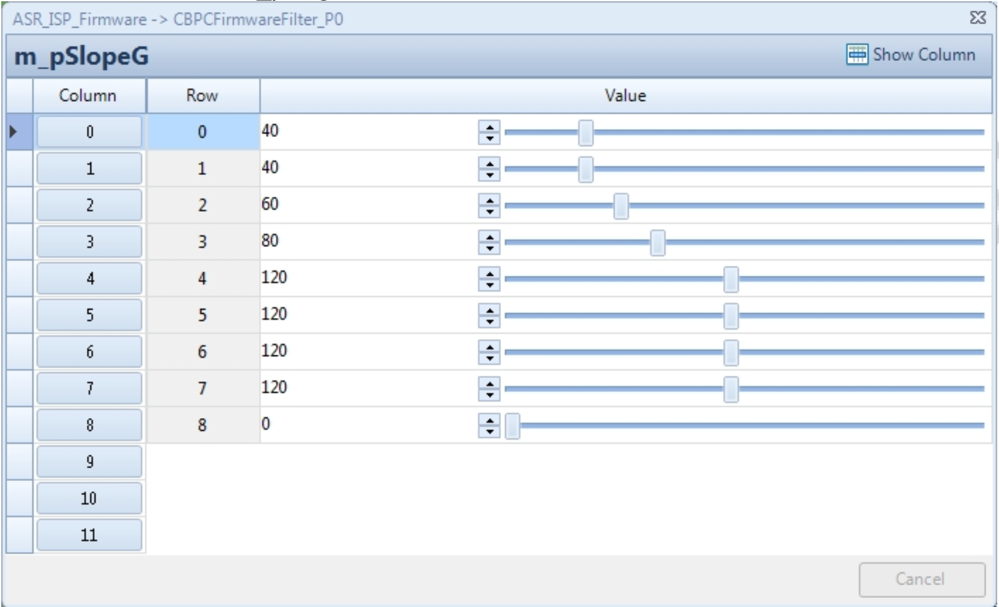

- 参数随 Lum 变化插值说明


【注：上述随 Lum 变化的 Value 包含 Slope, Intercept】

【注：最终容忍度由 Slope, Intercept, Ratio 共同决定，容忍度 = (Lum\*Current_Slope+Current_Intercept)\*Ratio. 容忍度越大，去坏点越弱】

说明：Current_Slope 与 Current_Intercept 均根据 Lum 和 gain 变化插值得出说明：Ratio 分为 Dead/SpikeRatio 与 RB/G，共 4 种情况

#### BPC 功能模块及参数

| 参数名 | 说明 | 建议调试 | 特殊性 |
|---|---|---|---|
| m_nMinThrEn | 暗点检测通道选择   Bit 0:参考跨通道信息使能；  Bit 1:参考GrGb通道信息使能；  Bit 2:参考相同通道信息使能。 | 否 |   |
| m_nMaxThrEn | 亮点检测通道选择   Bit 0:参考跨通道信息使能；  Bit 1:参考GrGb通道信息使能；  Bit 2:参考相同通道信息使能。 | 否 |   |
| m_nNearThr | 使用跨通道的亮度下限值，只有亮度大于此阈值时，才会使用跨通道信息。 | 否 |   |
| m_bDeadEnable | 暗点矫正使能 | 用户设置 |   |
| m_nDeadRatioG | G通道暗点系数，值越大，G通道暗点容忍度越大，去坏点能力越弱 | 是 |   |
| m_nDeadRatioRB | RB通道暗点系数，值越大，RB通道暗点容忍度越大，去坏点能力越弱 | 数 |   |
| m_bSpikeEnable | 亮点矫正使能 | 用户设置 |   |
| m_nSpikeRatioG | G通道亮点系数，值越大，G通道亮点容忍度越大，去坏点能力越弱 | 是 |   |
| m_nSpikeRatioRB | RB通道亮点系数，值越大，RB通道亮点容忍度越大，去坏点能力越弱 | 是 |   |
| m_bSameChnNum | 相同通道预矫正使能1：打开相同通道预矫正，开启后可排除相同通道坏点干扰 | 用户设置 |   |
| m_nDeltaThr | 相同通道预矫正阈值，建议保持缺省值 | 否 |   |
| m_nRingGRatio | 相同通道预矫正阈值，建议保持缺省值 | 否 |   |
| m_nRingMeanRatio | 相同通道预矫正阈值，建议保持缺省值 | 否 |   |
| m_bCornerDetEn | 拐角检测使能使能可保护拐角 | 用户设置 |   |
| m_pSlopeCorner | 拐角控制曲线参数，值越大，保护的拐角越少，与容忍度无关 | 是 | 可随Gain和Lum变化 |
| m_pInterceptCorner | 拐角控制曲线参数，值越大，保护的拐角越少，与容忍度无关 | 是 | 可随Gain和Lum变化 |
| m_bEdgeDetEn | 边缘检测使能使能可保护边缘 | 用户设置 |   |
| m_nEdgeTimes | 边缘判定门限，值越小，边缘保护的越多 | 是 |   |
| m_bGrGbNum | GrGb通道预矫正使能1：打开GrGb通道预矫正，开启后可排除GrGb通道坏点干扰 | 用户设置 |   |
| m_bAroundDetEn | 亮块检测使能使能可保护亮度突变的像素块 | 用户设置 |   |
| m_bBlockDetEn | 2x2 坏块检测使能使能可排除 2x2 坏块干扰 | 用户设置 |   |

---

#### BPC Manual 参数

| 参数名 | 说明 | 建议调试 | 特殊性 |
|---|---|---|---|
| m_bManualMode | 手动模式使能 `1` 打开手动模式，此时bpc参数不随gain变化，使用manual参数，用于debug |  - | Debug参数 |
| m_nCrossChnStrengthManual | 手动模式参数, 具体功能和自动功能一致 |  - | Debug参数 |
| m_pSlopeGManual | 手动模式参数, 具体功能和自动功能一致 |  - | Debug参数 |
| m_pInterceptGManual | 手动模式参数, 具体功能和自动功能一致 |  - | Debug参数 |
| m_pSlopeRBManual | 手动模式参数, 具体功能和自动功能一致 |  - | Debug参数 |
| m_pInterceptRBManual | 手动模式参数, 具体功能和自动功能一致 |  - | Debug参数 |
| m_pSlopeCornerManual | 手动模式参数, 具体功能和自动功能一致 |  - | Debug参数 |
| m_pInterceptCornerManual | 手动模式参数, 具体功能和自动功能一致 |  - | Debug参数 |

### CLSCFirmwareFilter 参数说明

CLSCFirmwareFilter 模块用于镜头阴影矫正。

#### LSC 使能

| 参数名 | 说明 | 建议调试 | 特殊性 |
|---|---|---|---|
| m_bEnable | LSC使能 `0` 关闭镜头阴影校正 `1` 打开镜头阴影校正 | 用户设置 |   |
| m_bUseOTP | LSC OTP使能 | 用户设置 |  |

#### LSC 参数

| 参数名 | 说明 | 建议调试 | 特殊性 |
|---|---|---|---|
| m_bAutoScale | AutoScale使能：`0` 关闭自动计算缩放参数功能； `1` 打开自动计算缩放参数功能 | 否 |   |
| m_bEnhanceEnable | Enhance使能：当前模组期望补偿倍数超过4倍时需要打开 `0` 关闭shading增强功能；  `1` 打开shading增强功能 | 用户设置 |   |
| m_nProfileSelectOption | shading补偿表选择：`0`：依据色温自动选择；  `1`：使用LSC Profile[0] ；  `2`：使用LSC Profile[2] ；   `3`：使用LSC Profile[2] | 否 |   |
| m_nFOVCropRatioH | 水平方向裁剪比例 | 是 | binning尺寸决定 |
| m_nFOVCropRatioV | 垂直方向裁剪比例 | 是 | binning尺寸决定 |
| m_pLSCStrength | shading补偿强度：（示例见 Gain-strength 示意图）  64表示1倍；   32表示1/2倍；   16表示1/4倍；   其他值以此类推 | 是 | 可依据gain调整 |
| m_bUseCorrelatedCT | 插值依据选项：`0`：使用AWB的CT； `1`：使用`WbFirmwareFilter` 中的 `m_nCorrelationCT`（CCT matrix 需要标定） | 用户设置 |   |
|  m_pCTIndex | 色温分段控制选择 LSC profile（示例见下图 LSC-色温控制曲线）：当m_nProfileSelectOption设置为 0 时有效。  色温位于[0，CTIndex[0]]区间，认定为低色温区间，使用LSCProfile[0]的补偿表；  色温位于[CTIndex[0]，CTIndex[1]]区间，使用LSCProfile[0]与LSCProfile[1]插值的补偿表；  色温位于[CTIndex[1]，CTIndex[2]]区间，认定为中色温区间，使用LSCProfile[1]的补偿表；  色温位于[CTIndex[2]，CTIndex[3]]区间，使用LSCProfile[1]与LSCProfile[2]插值的补偿表；  色温位于[CTIndex[3]，8192]区间，认定为高色温区间，使用LSCProfile[2]的补偿表； |  是 |   |
| m_pLSCProfile | LSC补偿表，由LSC插件定标得到 | 定标结果参数 | 可依据色温调用 |

LSC-色温控制曲线如下
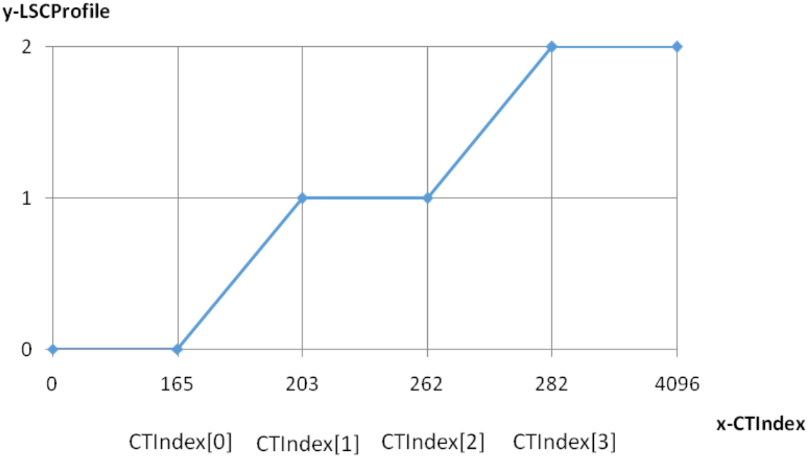

Gain-strength 示意图如下
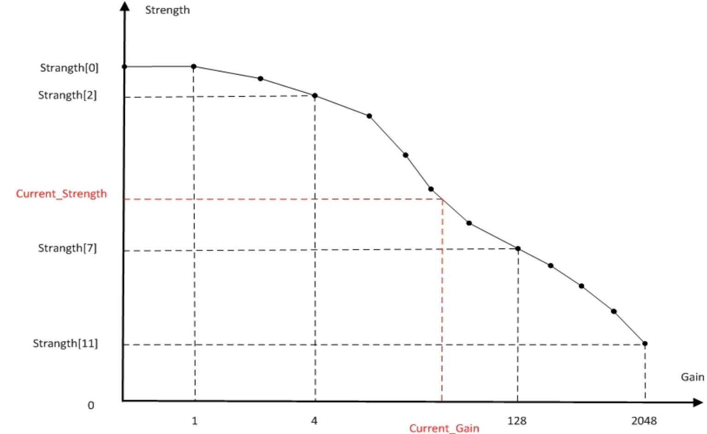

#### 自适应 color shading 参数

| 参数名 | 说明 | 建议调试 | 特殊性 |
|---|---|---|---|
| m_bLSCCSCEnable | 自适应color shading校正使能（CSC） | 用户设置 |   |
| m_bAdjustCSCTblMinEnable | 依据R/G（B/G）最小值调节 CSC 表 | 否 |   |
| m_nDifThr | 向量中值滤波后 dif 阈值，dif 大于该值，则该块不参与计算 CSC | 否 |   |
| m_nDifThrMinPerc | 向量中值滤波后 dif 阈值，dif 小于 DifThrMinPerc*DifThr ，则计算 CSC 不考虑角度 | 否 |   |
| m_nAngleThr | 向量中值滤波后角度阈值，角度大于该值，则该块不参与计算 CSC | 否 |   |
| m_nDifThrVMF | 向量中值滤波前后 dif 阈值，dif 大于该值，则该块不参与计算 CSC | 否 |   |
| m_nAngleThrVMF | 向量中值滤波前后角度阈值，角度大于该值，则该块不参与计算 CSC | 否 |   |
| m_nGradThrMin | 向量中值滤波后有效梯度最小值 | 否 |   |
| m_nGradThrMax | 向量中值滤波后有效梯度最大值 | 否 |   |
| m_nGradMaxError | CSC 估计统计值梯度与真实统计值梯度最大误差容忍值 | 是 |   |
| m_nGradThrConv | CSC 两次计算的梯度差异门限，梯度差异小于该值，不更新CSC | 是 |   |
| m_nGradMax | CSC 最大补偿强度 | 是 |   |
| m_nTblAlpha | 收敛速度，值越大收敛越快 | 是 |   |
| m_nCSCGlobalStrength | CSC 全局强度 | 是 |   |
| m_nEffPNumAll | 全图像有效块门限 | 否 |   |
| m_nEffPNumHalf | 1/2图像有效块门限 | 否 |   |
| m_nEffPNumQuarter | 1/4图像有效块门限 | 否 |   |
| m_pEffNumRing | 三个 ROI 对应的有效块门限：  ROI0 为中心 6x4   ROI1为中心12x8(不包含ROI0)   ROI2为12x12（不包含ROI0,ROI1） | 否 |   |
| m_pCSCCTIndex | CSC色温控制点，CT &gt; CSCCTIndex[1] 时 CSC 失效 | 是 |   |
| m_pCSCLuxIndex | CSC亮度控制点，Lux &gt; CSCLuxIndex[1] 时 CSC 失效 | 是 |   |

#### LSC Manual 及 frameinfo

| 参数名 | 说明 | 建议调试 | 特殊性 |
|---|---|---|---|
| m_bManualMode | 手动模式使能：`1` 打开手动模式，此时LSC参数不随色温变化，使用manual参数，用于 debug |   | Debug 参数 |
| m_nLSCStrengthManual | 手动模式参数, 具体功能和自动功能一致 |   | Debug 参数 |
| m_pLSCProfileManual | 手动模式参数, 具体功能和自动功能一致 |   | Debug 参数 |
| m_nRGPolyCoefRO | 当前 CSC 补偿R ratio |   | 只读 |
| m_nBGPolyCoefRO | 当前 CSC 补偿B ratio |   | 只读 |
| m_pRGRatio | 16x12 统计块对应 R/G ratio |   | 只读 |
| m_pBGRatio | 16x12 统计块对应 B/G ratio |   | 只读 |
| m_pOTPProfileInternal | OTP shading表 |   | 只读 |

### CDemosaicFirmwareFilter 调试说明

CDemosaicFirmwareFilter（Demosaic）模块用于 Bayer 插值。

#### Demosaic 子功能使能

| 参数名 | 说明 | 建议调试 | 特殊性 |
|---|---|---|---|
| m_bIfEdgeGenerate | 高频信息生成功能开关:可用于 inline sharpen(inline sharpen 功能需要 cmc 模块配合使用) `0`：关闭；  `1`：打开 | 用户设置 |   |
| m_bIfGbGrRebalance | GbGr差异消除功能开关 `0`：关闭； `1`：打开 | 否 |   |
| m_bIfDNS | inline 去噪功能开关, 建议关闭 `0`：关闭； `1`：打开 | 否 |  |

#### Demosaic 动态控制参数

Demosaic 参数可随 gain 动态调节。

增益控制节点 N 从 0-11，共十二组，节点为 2 的 N 次方倍 gain，即第 0 档为 1 倍 gain；第 11 档为 2048 倍 gain。

| 参数名 | 说明 | 建议调试 | 特殊性 |
|---|---|---|---|
| m_nInterpOffset | 四方向噪声容忍度 | 否 | 可随 Gain 变化 |
| m_nInterpOffsetHV | 水平垂直噪声容忍度 | 否 | 可随 Gain 变化 |
| m_nNoiseSTD | 噪声容忍度标准差 | 否 | 可随 Gain 变化 |
| m_nLowpassGLevel | 插值频率控制参数, 越小越倾向于 4 方向插值结果, 越大越倾向于无方向低通插值的结果 | 是 | 可随 Gain 变化 |
| m_nGbGrThr | GbGr 差异消除功能对应的阈值,越小 GbGr 差异消除功能越弱, 反之则越强 | 是 | 可随 Gain 变化 |
| m_nSharpenStrength | 高频信息放大倍率，值越大，锐化越强 | 是 | 可随 Gain 变化 |
| m_nShpThreshold | 高频信息软阈值处理时的阈值, 建议保持缺省值 | 否 | 可随 Gain 变化 |
| m_nDenoiseThreshold | inline 去噪功能软阈值, 越大去噪能力越强, 建议保持缺省值 | 否 | 可随 Gain 变化 |
| m_nNoiseAddbackLevel | inline 去噪功能噪声回加强度, 越大去噪能力越弱, 建议保持缺省值 | 否 | 可随 Gain 变化 |
| m_pDenoiseLumaStrength | 依据亮度控制去噪强度缩放系数，亮度区间为8bit下 [8，16，32]，亮度 64 以上系数为 32，不缩放 | 否 | 可随 Gain 变化 |
| m_nChromaNoiseThreshold | 去除彩噪功能阈值, 越大去除彩噪能力越强, 建议保持缺省值 | 否 | 可随 Gain 变化 |
| m_pUSMFilter | USMFilter = conv([1 2 1], [usm2 usm1 usm0 64-2*(usm0+usm1+usm2) usm0 usm1 usm2]), 建议保持缺省值 | 否 | 可随 Gain 变化 |

以 **m_nSharpenStrength** 为例：

Column 表示 Gain 的档位

- Column[0]表示 1 倍 Gain 下对应的值
- Column[11]表示 2048 倍 Gain 下对应的值

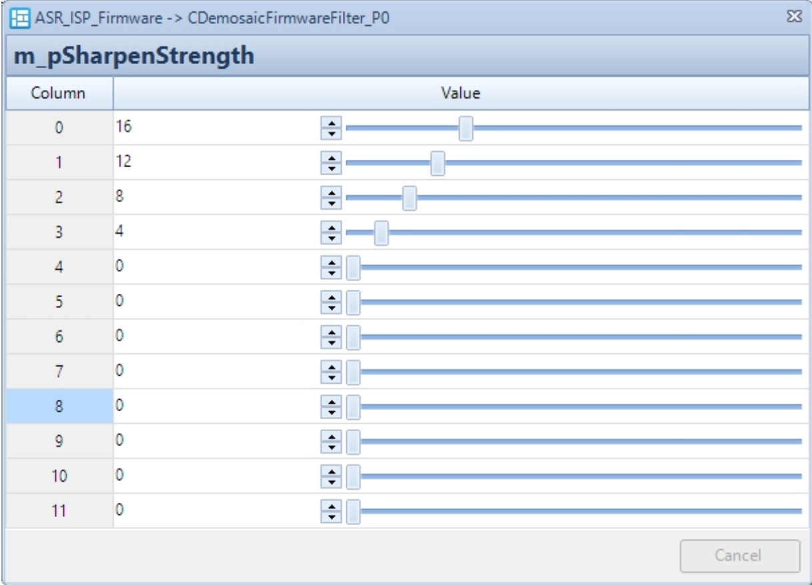

Gain – Sharpen 示意图如下


#### Demosic 其他参数

| 参数名 | 说明 | 建议调试 | 特殊性 |
|---|---|---|---|
| m_pHFFragShiftIndex | 高频信息分段增益处理的分段信息, 建议保持缺省值 | 否 |   |
| m_pHFFragGainIndex | 高频信息分段增益处理的增益信息, 建议保持缺省值 | 否 |   |

#### Demosaic Manual 参数

| 参数名 | 说明 | 建议调试 | 特殊性 |
|---|---|---|---|
| m_bManualMode | 手动模式使能 `0` 自动模式； `1` 手动模式，此时 demosaic 参数不随 gain 变化，使用 manual 参数，用于 debug |  - | Debug 参数 |
| Manual 结尾参数 | 手动模式参数, 具体功能和自动功能一致 |  - | Debug 参数 |

### CRawDenoiseFirmwareFilter 调试说明

CRawDenoiseFirmwareFilter（RawDenoise）模块用于 RAW 域去噪。

#### RawDenoise 使能

| 参数名 | 说明 | 建议修改 | 特殊性 |
|---|---|---|---|
| m_bEnable | RAW denoise 模块使能开关 `0` 关闭RAW域去噪；  `1` 打开RAW域去噪 | 依据用户设置 |  |

#### RawDenoise 动态控制参数

RawDenoise 参数可随 gain 动态调节。

增益控制节点 N 从 0-11，共十二组，节点为 2 的 N 次方倍 gain，即第 0 档为 1 倍 gain；第 11 档为 2048 倍 gain.（见 Gain-Denoise_strength 示意图）

| 参数名 | 说明 | 建议修改 | 特殊性 |
|---|---|---|---|
| m_pMaxSpacialDenoiseThreGain | 边角最大去噪强度, Q8 精度, 值越大, 边角能达到的去噪强度越强 | 是 | 可随 Gain 变化 |
| m_pSigma | 去噪强度阈值, 值越大去噪强度越强 | 是 | 可随 Gain 变化 |
| m_pGns | G 通道去噪强度, 值越大去噪强度越强 | 是 | 可随 Gain 变化 |
| m_pRbns | RB 通道去噪强度, 值越大去噪强度越强 | 是 | 可随 Gain 变化 |
| m_pL0 | 对应 1.5% 亮度下的去噪强度伸缩系数, Q5 精度, 值越大, 该亮度下去噪强度越强 | 是 | 可随 Gain 变化 |
| m_pL1 | 对应 7.8% 亮度下的去噪强度伸缩系数, Q5 精度, 值越大, 该亮度下去噪强度越强 | 是 | 可随 Gain 变化 |
| m_pL2 | 对应 20% 亮度下的去噪强度伸缩系数, Q5 精度, 值越大, 该亮度下去噪强度越强 | 是 | 可随 Gain 变化 |
| m_pL3 | 对应 45% 亮度下的去噪强度伸缩系数, Q5 精度, 值越大, 该亮度下去噪强度越强 | 是 | 可随 Gain 变化 |

m_pL0 - m_pL3 对应不同亮度下的去噪强度，如下图所示

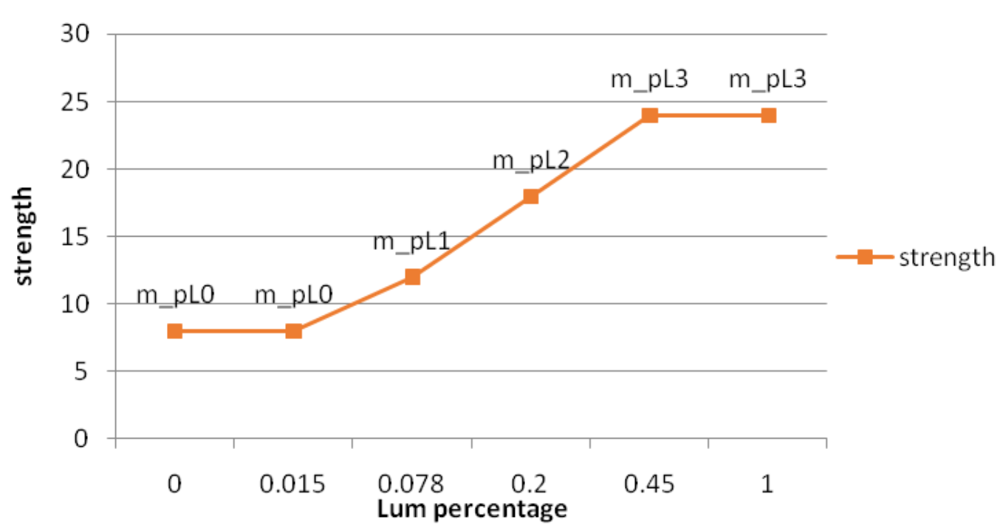

以 **m_pSigma** 为例：

Column 表示 Gain 的档位：

- Column[0]表示 1 倍 gain 下对应的参数；
- Column[11]表示 2048 倍 gain 下对应的参数；

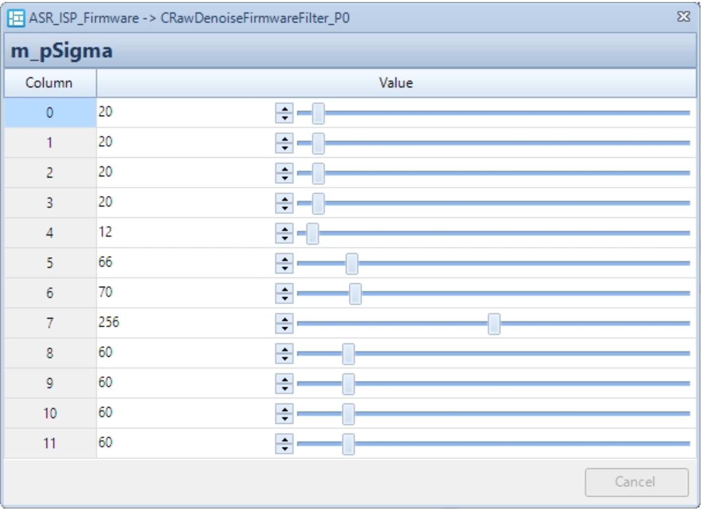

Gain - Denoise_strength 示意图如下


#### RawDenoise 功能模块及参数

| 参数名 | 说明 | 建议修改 | 特殊性 |
|---|---|---|---|
| m_bMergeEnable | 计算去噪权重时 2x2-&gt;1x1 的转换方式 `0` 取左下角；  1: 取2x2的均值 | 否 |   |
| m_bLocalizedEnable | 去噪强度跟随局部亮度变化功能使能 `1` 关闭；   2: 打开 | 否 |   |
| m_bSpacialEnable | 边缘去噪强度增强使能：`0`：关闭； `1`：打开 | 依据用户设置 |   |
| m_bSpacialAddbackEnable | 边缘去噪回加使能：`0`：关闭； `1`：打开 | 依据用户设置 |   |
| m_nSpacialOffCenterPercentage | 边缘去噪增强区域控制参数，去噪强度从Centerpercentage*R开始增强 (见下图 R – CenterPercent 示意图) | 是 |   |
| m_pMaxSpacialDenoiseThreGain | 边缘去噪最大增强门限，最远距离所能达到的最大去噪强度(见下图 Distance – RadialGain 示意图) | 是 |  |

R - CenterPercent 示意图如下
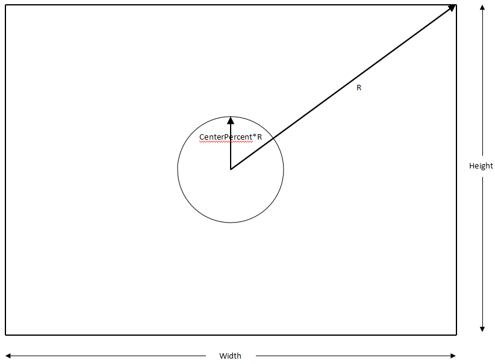

Distance - RadialGain 示意图如下

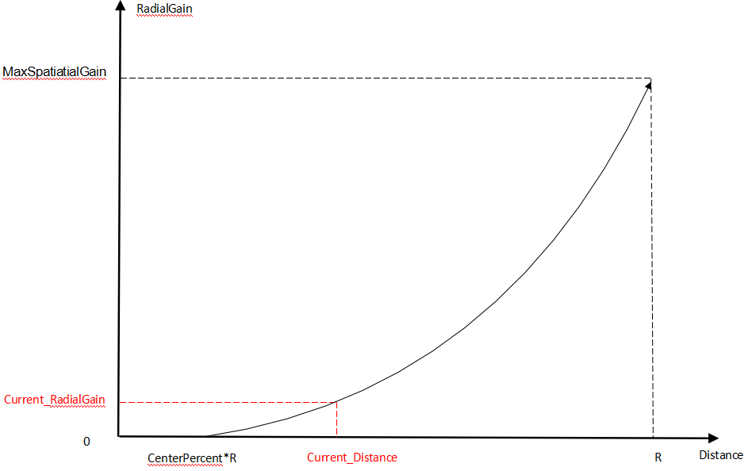

#### RawDenoise debug 参数

| 参数名 | 说明 | 建议修改 | 特殊性 |
|---|---|---|---|
| m_bManualMode | 手动模式使能 `0` 自动模式； `1` 打开手动模式，此时 raw denoise 参数不随 gain 变化，使用 manual 参数，用于 debug |   |   |
| m_nSigmaManual | 手动模式参数,作用和自动一致 |   |   |
| m_nGnsManual | 手动模式参数,作用和自动一致 |   |   |
| m_nRbnsManual | 手动模式参数,作用和自动一致 |   |   |
| m_nL0Manual | 手动模式参数,作用和自动一致 |   |   |
| m_nL1Manual | 手动模式参数,作用和自动一致 |   |   |
| m_nL2Manual | 手动模式参数,作用和自动一致 |   |   |
| m_nL3Manual | 手动模式参数,作用和自动一致 |   |   |

### CAFMFirmwareFilter 参数说明

CAFMFirmwareFilter 模块用于自动对焦统计模块。

#### AFM 使能

| 参数名 | 说明 | 建议调试 | 特殊性 |
|---|---|---|---|
| m_bEnable | AFM使能 `0` 关闭自动对焦统计模块；  `1` 打开自动对焦统计模块 | 用户设置 |  |

#### AFM 参数

| 参数名 | 说明 | 建议调试 | 特殊性 |
|---|---|---|---|
| m_nAFStatMode | AF 统计模块模式：`0`：经过白平衡；  `1`：不经过白平衡 | 否 |   |
| m_nWinStartXPermil | AFM 水平方向起始点坐标千分比 | 用户设置 |   |
| m_nWinStartYPermil | AFM 垂直方向起始点坐标千分比 | 用户设置 |   |
| m_nWinEndXPermil | AFM 水平方向结束点坐标千分比 | 用户设置 |   |
| m_nWinEndYPermil | AFM 垂直方向结束点坐标千分比 | 用户设置 |   |
| m_nMinWidthPermil | AFM 最小宽度千分比 | 用户设置 |   |
| m_nMinHeightPermil | AFM 最小高度千分比 | 用户设置 |   |
| m_bConfigDone | FW 控制参数，AF 窗口设置完成时设 1 | 否 |   |
| m_pFVList | 各对焦窗口 Focus value 值 |  - | 只读 |
| m_nFVAvg | Focus value 平均值 |  - | 只读 |
| m_nWinStartX | AFM 水平方向起始点坐标 |  - | 只读 |
| m_nWinStartY | AFM 垂直方向起始点坐标 |  - | 只读 |
| m_nWinWidth | AFM 宽度 |  - | 只读 |
| m_nWinHeight | AFM 高度 |  - | 只读 |

### CPDCFirmwareFilter 参数说明

CPDCFirmwareFilter 模块用于将 PD 像素或 shadow 像素补偿至正常亮度供 PDAF 算法使用。

#### PDC 使能

| 参数名 | 说明 | 建议调试 | 特殊性 |
|---|---|---|---|
| m_bEnable | PDC使能：`0` 关闭PDC模块； `1` 打开 PDC 模块 | 用户设置 |  |

#### PDC 参数

| 参数名 | 说明 | 建议调试 | 特殊性 |
|---|---|---|---|
| m_bOut | PD dump 使能 `0` 关闭 dump 窗口内所有 PD 点；  `1` 打开 dump 窗口内所有 PD 点 | 否 |   |
| m_nHOffset | 水平方向 ISP 处理图像相对于 sensor 输出图像宽度的偏移量（见下图 窗口示意图 m_nHOft） | 是 |   |
| m_nVOffset | 垂直方向 ISP 处理图像相对于 sensor 输出图像高度的偏移量（见下图 窗口示意图 m_nVOft） | 是 |   |
| m_bLRAdjust | 方向控制：`0` 关闭镜像； `1` 打开镜像 | 是 |   |
| m_bTBAdjust | 方向控制：`0` 关闭翻转； `1` 打开翻转 | 是 |   |
| m_nFullWidth | sensor 输出图像宽度 | 是 |   |
| m_nFullHeight | sensor 输出图像高度 | 是 |   |
| m_nWindowMode | 窗口模式：`0` 自动计算PD dump区域；`1` 通过m_nWinStartXPermil, m_nWinStartYPermil, m_nWinEndXPermil 和 EndYPermil 计算 PD dump 区域； | 否 |   |
| m_nWindowScaleFactor | PDC 统计窗相对于 AFM 统计窗的缩放比例 | 用户设置 |   |
| m_nMinWidthPermil | PDC 统计窗最小宽度千分比 | 用户设置 |   |
| m_nMinHeightPermil | PDC 统计窗最小高度千分比 | 用户设置 |   |
| m_pPDFirstX | 水平方向 PD 区域相对于 sensor 输出图像宽度的偏移量（见下图 窗口示意图） | 是 |   |
| m_pPDFirstY | 垂直方向PD区域相对于sensor输出图像高度的偏移量（见下图 窗口示意图） | 是 |   |
| m_pRatioA | 四通道全局调节比例 | 是 |   |
| m_pPixelMask | 32x32 的区域内 PD 点的分布 | 是 |   |
| m_pPixelTypeMask | 32x32 的区域内 PD 点类型的分布 PD 点类型分为遮蔽上下左右四种 | 是 |   |
| m_pRatioBMap | 四通道PD点补偿系数 | 是 |   |
| m_bSoftCompEnable | 软件补偿PD亮度差异开关：`0`：使用硬件PDC补偿； `1`：软件补偿（sensor抽出PD像素） |   |   |
| m_nWinStartXPermil | 水平方向 PD dump 区域左上角坐标千分比 |  - | 只读 |
| m_nWinStartYPermil | 垂直方向 PD dump 区域左上角坐标千分比 |  - | 只读 |
| m_nWinEndXPermil | 水平方向 PD dump 区域右下角坐标千分比 |  - | 只读 |
| m_nWinEndYPermil | 垂直方向 PD dump 区域右下角坐标千分比 |  - | 只读 |
| m_nWinStartX | PDC 统计窗水平方向起始点坐标 |  - | 只读 |
| m_nWinStartY | PDC 统计窗垂直方向起始点坐标 |  - | 只读 |
| m_nWinWidth | PDC 统计窗宽度 |  - | 只读 |
| m_nWinHeight | PDC 统计窗高度 |  - | 只读 |

窗口示意图如下
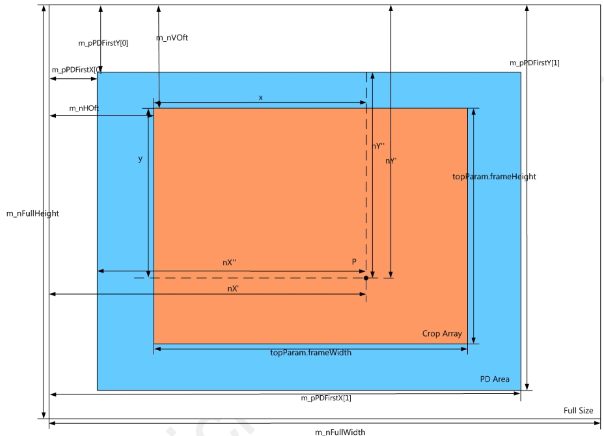

### CPDFFirmwareFilter 参数说明

CPDFFirmwareFilter 模块用于将 PD 像素矫正到正常像素值。

#### PDF 使能

| 参数名 | 说明 | 建议调试 | 特殊性 |
|---|---|---|---|
| m_bEnable | PDF使能 `0` 关闭相位对焦像素矫正； `1` 打开相位对焦像素矫正 | 用户设置 |   |

#### PDF 参数

| 参数名        | 说明                                                                       | 建议调试 | 特殊性 |
| ------------- | -------------------------------------------------------------------------- | -------- | ------ |
| m_nExtPRm     | PD 像素奇异点矫正使能 `0` 关闭PD像素奇异点矫正； `1` 打开PD像素奇异点矫正        | 用户设置 |        |
| m_nWA         | 中心块权重 8 为 50% 权重，一般中心点本身是被补偿的 PD 点，故权重一般设小一些。   | 否       |        |
| m_nWB         | 对角块权重 8 为 50% 权重，一般设为50%                                          | 否       |        |
| m_nFullWidth  | sensor 输出图像宽度                                                         | 是       |        |
| m_nFullHeight | sensor 输出图像高度                                                         | 是       |        |
| m_nHOffset    | 水平方向 ISP 处理图像相对于 sensor 输出图像宽度的偏移量（见窗口示意图 m_nHOft） | 是       |        |
| m_nVOffset    | 垂直方向 ISP 处理图像相对于 sensor 输出图像高度的偏移量（见窗口示意图 m_nVOft） | 是       |        |
| m_bLRAdjust   | 方向控制：`0` 关闭镜像； `1` 打开镜像                                          | 是       |        |
| m_bTBAdjust   | 方向控制：`0` 关闭翻转； `1` 打开翻转                                          | 是       |        |
| m_bRefRB      | `0`: 绿色通道矫正不参考RB通道 ；`1` 绿色通道矫正参考RB通道                      | 否       |        |
| m_bRefCnr     | `0`: 绿色通道矫正不参考角点信息； `1` 绿色通道矫正参考角点信息                  | 否       |        |
| m_nRefNoiseL  | 用于判断边缘方向的当前噪声水平                                             | 否       |        |
| m_nExtPThre   | PD 像素奇异点的门限                                                         | 否       |        |
| m_nExtPSft    | PD 像素奇异点的软阈值                                                       | 否       |        |
| m_nExtPOpt    | PD 像素奇异点矫正选择                                                       | 否       |        |
| m_pPDFirstX   | 水平方向 PD 区域相对于 sensor 输出图像宽度的偏移量（见窗口示意图）             | 是       |        |
| m_pPDFirstY   | 垂直方向 PD 区域相对于 sensor 输出图像高度的偏移量（见窗口示意图）             | 是       |        |
| m_pPixelMask  | 32x32 的区域内 PD 点的分布               | 是       |        |
| m_pPDResult   | 四方向 PD shift 与 confidence                                              |          | 只读   |

### CPDAFFirmwareFilter 参数说明

CPDAFFirmwareFilter 模块用于相位对焦。

#### PDAF 查找表

| 参数名 | 说明 | 建议调试 | 特殊性 |
|---|---|---|---|
| m_bMirrorShift | 输出相位差取反 | 用户设置 |   |
| m_bShiftLutEn | 查找表使能 | 用户设置 |   |
| m_pShiftLut | 输出相位差查找表 | 否 |   |

#### PDAF 误差控制

| 参数名 | 说明 | 建议调试 | 特殊性 |
|---|---|---|---|
| m_nErrorDistWeight | 误差来源的权重（见下图 相关性拟合曲线示意图）`0` 表示shape的权重为 1；  `128`: 表示 shape 和 distance 各占一半；  `256`: 表示 distance 的权重为 1； | 否 |   |
| m_nErrorDistCoef | distance（相关性拟合曲线距离）调节系数 | 否 |   |
| m_nErrorShpCoef | shape（相关性拟合曲线形状）调节系数 | 否 |  |

相关性拟合曲线示意图如下
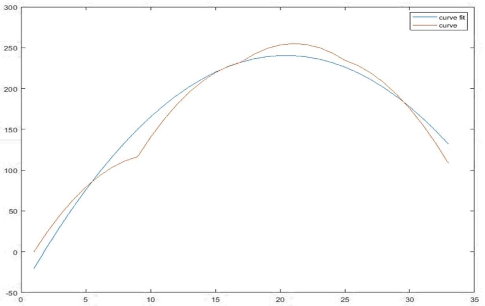

#### PDAF 动态控制参数

| 参数名 | 说明 | 建议调试 | 特殊性 |
|---|---|---|---|
| m_pLumThre | 不同 gain 下的亮度阈值，（见下图 LumThre-gain 控制曲线）当前亮度低于阈值时，置信度会降低 | 是 | 依据 gain 调整 |
| m_pGainThre | 划分不同 gain 的区间的依据，用于依据 Gain 控制 LumThre 和 SwingThre | 否 |   |
| m_pSwingThre | 不同 Gain 下的幅度门限，（见下图 SwingThre-gain 控制曲线）当前幅度值低于此门限时，置信度会降低 | 是 | 依据 gain 调整 |

LumThre-Gain 控制曲线如下图
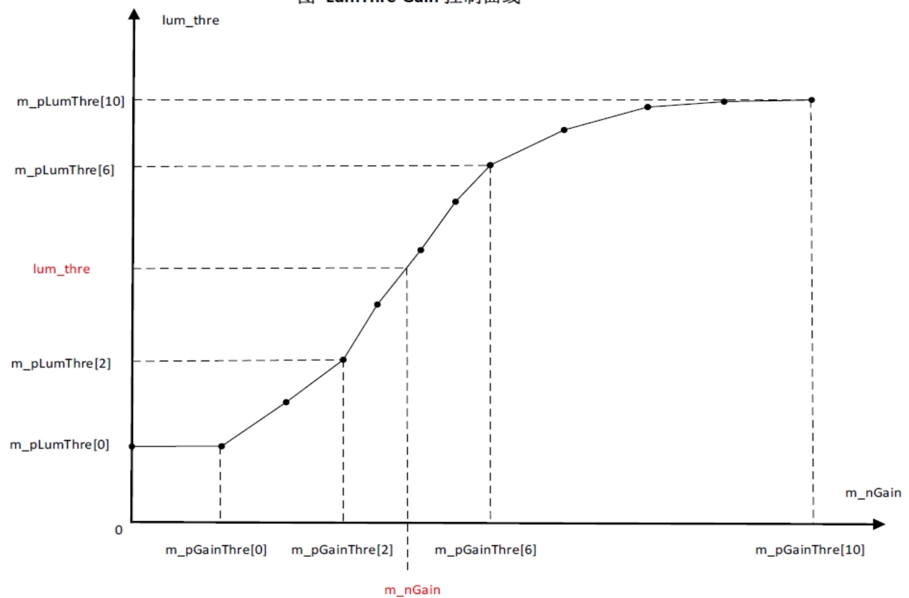

SwingThre-Gain 控制曲线如下图


#### PDAF 置信度控制参数

| 参数名 | 说明 | 建议调试 | 特殊性 |
|---|---|---|---|
| m_bConfAdjust | 置信度适配开关：  `1` ：当前幅度值高于此门限时，置信度增大; `0`：当前幅度值高于此门限时，置信度不变 | 否 |   |
| m_nConfOff | 置信度 offset，用于调整最终置信度 | 否 |   |
| m_nConfLimit | 最大置信度（见下图 Error-Confidence 转换曲线） | 否 |   |
| m_nErrorThre1 | 误差转为置信度的 erro r门限（见下图 Error-Confidence 转换曲线） | 是 |   |
| m_nErrorThre2 | 误差转为置信度的 confidence 门限（见下图 Error-Confidence 转换曲线） | 是 |   |
| m_nSearchRange | PD shift 搜索范围，PD 像素密度越大，该值越大。  一般密度 shield pixel 设 0   Dual PD 设 3 | 是 |  |

Error-Confidence 转换曲线 如下图


### CWbFirmwareFilter 参数说明

CWbFirmwareFilter 模块用于白平衡。

#### WB 使能

| 参数名 | 说明 | 建议调试 | 特殊性 |
|---|---|---|---|
| m_bEnable | WB使能: `0` 关闭白平衡统计模块 ; `1` 打开白平衡统计模块 | 否 |  |

#### WB 参数

| 参数名 | 说明 | 建议调试 | 特殊性 |
|---|---|---|---|
| m_bSyncWB | HDR模式白平衡同步方式选择：`0`：AWB单独计算;  `1`：使用长曝光作为AWB计算源 | 否 |   |
| m_bAutoWindow | 窗口调整方式：`0`：固定窗口大小;  `1`：依据 zoom 系数自动计算窗口大小 | 否 |   |
| m_nMode | 白平衡模式选择：`0` auto mode; `1` custom;   `2`: D75;   `3`: D65;   `4`: D50;   `5`: CWF;   `6`: TL84;   `7`: A;   `8`: H;   `9`: lock | 否 |   |
| m_nInitMode | 白平衡初始化模式：`0` custom `1`:D75;   `2`: D65;   `3`: D50;   `4`: CWF;   `5`: TL84;   `6`: A;   `7`: H | 是 |   |
| m_pManualGain | 手动WB gain：`0-7` 对应 custom / D75 / D65 / D50 / CWF / TL84 / A / H | 是 |   |
| m_nAWBStableRange | AWB 进入稳定状态的门限：值越小，越不容易判定为 AWB 稳定 | 是 |   |
| m_nAWBStableFrameNum | AWB 进入稳定状态的参考帧数：稳定帧数大于改值，判定为 AWB 稳定 | 是 |   |
| m_nAWBUnStableRange | AWB 进入不稳定状态的门限：值越小，越容易判定为 AWB 不稳定 | 是 |   |
| m_nAWBUnStableFrameNum | AWB 进入不稳定状态的参考帧数：不稳定帧数大于改值，判定为 AWB 不稳定 | 是 |   |
| m_nAWBStep1 | AWB 收敛的相对步长按比例计算步长，值越大，调整的比例越大，收敛的越快，准确性越低 | 是 |   |
| m_nAWBStep2 | AWB 收敛的绝对步长值越大，步长越大，调整的越快，准确性越低 | 是 |   |
| m_nLowThr | 参与 AWB 统计的亮度下限值越大，越多偏暗的区域不进行AWB统计 | 是 |   |
| m_nHighThr | 参与 AWB 统计的亮度上限值越小，越多偏亮的区域不进行AWB统计 | 是 |   |
| m_nCorrelationCT | 当前色温 |  - | 只读 |
| m_nTint | 当前色调 |  - | 只读 |
| m_bAWBStableFlag | AWB当前状态 |  - | 只读 |
| m_nDistance | 当前应用的白平衡 gain 与 target gain 差的绝对值之和 |  - | 只读 |

### CCTCalculatorFilter 参数说明

CCTCalculatorFilter 模块用于计算真实色温。

#### CCTCalculator 参数

| 参数名 | 说明 | 建议调试 | 特殊性 |
|---|---|---|---|
| m_nIterateNumber | 计算 CT 的迭代次数 | 否 |   |
| m_nColorTemperatureLow | 低色温矩阵对应色温 |   |   |
| m_nColorTemperatureHigh | 高色温矩阵对应色温 |   |   |
| m_pCTMatrixLow | 低色温矩阵 |   | 定标结果 |
| m_pCTMatrixHigh | 高色温矩阵 |   | 定标结果 |

### CRGB2YUVFirmwareFilter 参数说明

CRGB2YUVFirmwareFilter 模块用于 RGB 转 YUV。

#### RGB2YUV 参数

| 参数名 | 说明 | 建议调试 | 特殊性 |
|---|---|---|---|
| m_nOutputColorSpace | 输出色彩空间选择：`0`：Rec.601; `1`：Rec.709 | 用户设置 |   |
| m_nGlobalSaturation | 全局饱和度系数，Q7 精度 | 是 |   |
| m_pSaturationCP | 饱和度随gain控制参数（示例见图 sat_CP-gain 控制曲线） | 是 | 可随gain变化 |

#### RGB2YUV Manual 参数

| 参数名 | 说明 | 建议调试 | 特殊性 |
|---|---|---|---|
| m_bManualMode | 手动模式使能：`0`：自动模式, 饱和度可随 gain 变化;  `1`：手动模式，饱和度固定为 manual 所设系数 |   | Debug 参数 |
| m_nSaturationManual | 手动饱和度系数，Q7 精度 |   | Debug 参数 |

sat_CP-gain 控制曲线如下
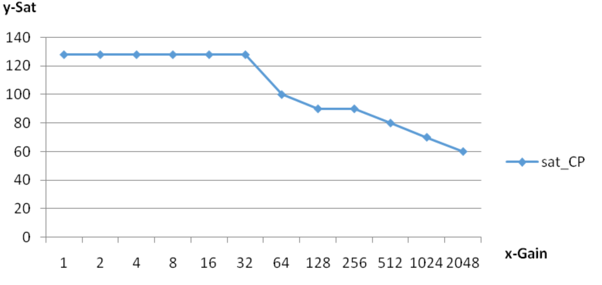

### CSpecialEffectFirmwareFilter 参数说明

CSpecialEffectFirmwareFilter 模块用于特殊效果调试。

#### SE 使能

| 参数名 | 说明 | 建议调试 | 特殊性 |
|---|---|---|---|
| m_bEnable | Special effect使能 `0` 关闭特殊效果; `1` 打开特殊效果共 6 个控制区域，区域 0-5 优先级逐渐降低 | 用户设置 |   |

##### SE 参数

参数分为区域 0-5，共 6 组，每组含义一样，针对 6 个控制区域，区域 0-5 优先级逐渐降低。

| 参数名 | 说明 | 建议调试 | 特殊性 |
|---|---|---|---|
| m_bZoneEb_0 | 区域 0 特效使能 | 用户设置 |   |
| m_pRyTable_0 | 亮度旋转参数，定标参数 | 定标结果参数 |   |
| m_nSyTable_0 | 亮度平移参数，定标参数 | 定标结果参数 |   |
| m_pRuvTable_0 | UV 旋转参数，定标参数 | 定标结果参数 |   |
| m_pSuvTable_0 | UV 平移参数，定标参数 | 定标结果参数 |   |
|  m_pMargin_0 | 渐变过渡带   [Lum_min - Margin_0[0],Lum_max + Margin_0[1]] 是平滑区间；   [Hue_min - Margin_0[2],Hue_max + Margin_0[3]] 是平滑区间；   [Sat_min - Margin_0[4],Sat_max + Margin_0[5]] 是平滑区间； |  是 |   |
| m_pYTable_0 | 目标调整区域的 Lum 范围 | 是 |   |
| m_pHTable_0 | 目标调整区域的 Hue 范围 | 是 |   |
| m_pSTable_0 | 目标调整区域的 Saturation 范围 | 是 |   |

#### SE 动态控制参数

GainWeight_0-5 共用一组 GainLut，用于针对不同亮度区间设置不同的强度。

| 参数名 | 说明 | 建议调试 | 特殊性 |
|---|---|---|---|
| m_nGainLut | GainWeight 分段点，对应实际场景的值为 exposure_time(us)*total_gain(Q8)&gt;&gt;8 |   |   |
| m_pGainWeight_0 | 特殊效果的强度，（见下图 GainWeight-GainLut 控制曲线）值越大，特殊效果越强 | 是 | 可依据 Gainlut 变化 |

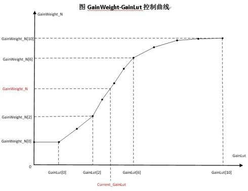

#### SE Manual 参数

参数分为区域 0-5，共 6 组，每组含义一样

| 参数名 | 说明 | 建议调试 | 特殊性 |
|---|---|---|---|
| m_bManualMode_0 | 区域 0 手动模式使能 |  - | Debug 参数 |
| m_nManualGainWeight_0 | 手动模式下特殊效果的强度 |  - | Debug 参数 |

### CCurveFirmwareFilter 参数说明

CCurveFirmwareFilter 模块用于伽马曲线。

#### Curve 使能

| 参数名 | 说明 | 建议调试 | 特殊性 |
|---|---|---|---|
| m_bEnable | Curve使能 `0` 关闭伽马曲线  `1` 打开伽马曲线 | 用户设置 |   |

#### Curve 控制参数

| 参数名 | 说明 | 建议调试 | 特殊性 |
|---|---|---|---|
| m_bEbGtmAfterLinearcurve | GTM随线性曲线改变使能：`0`：gtm1 curve 不变; `1`：gtm1 curve 随线性曲线改变 | 否 |   |
| m_nCurveSelectOption | Curve使用选择：`0`： 基于gain自动计算; `1`：使用GTMcurve0;   `2`：使用 GTMcurve1;   `3`：使用 GTMcurve2;   `4`：使用 A-Log curve | 否 |   |
| m_nBacklightStrengthManual | 低亮区域亮度调节参数：值越大，低亮区域的亮度提供的越多，0 表示不增强低亮区域，此时 BacklightCurveManual 不作用于最终的曲线 | 用户设置 |   |
| m_nContrastStrengthManual | 对比度调节参数：值越大，对比度越高，128 表示不调节对比度，此时 ContrastsCurveManual 不作用于最终的曲线 | 用户设置 |   |
| m_nBrightnessStrengthManual | 亮度调节参数：值越大，整体亮度越高，4096表示一倍 | 用户设置 |   |
| m_nAlpha | 前后帧 GTM 曲线融合的迭代速度。m_nAlpha 值越大，越快收敛到当前帧计算得到的 GTM 曲线，255 表示立即收敛到当前帧曲线。 | 是 |   |
| m_pBacklightCurveManual | 用于调节低亮区域的曲线 | 否 |   |
| m_pContrastsCurveManual | 用于调节对比度的曲线 | 否 |   |
|  m_pGainIndex | Gain 分段控制点（见下图 Curve-Gain 控制曲线示意图） 色温分段控制点。  gain 位于 [128，GainIndex[0]] 区间，使用 GTMCurve0 的曲线；  gain位于 [GainIndex[0]，GainIndex[1] ]区间，使用 GTMCurve0 与 GTMCurve1 插值的曲线；   gain 位于 GainIndex[2]，使用 GTMCurve1 的曲线；  gain 位于 [GainIndex[1]，GainIndex[2]] 区间，使用 GTMCurve1 与 GTMCurve2 插值的曲线；  gain 位于[GainIndex[2]，2048] 区间，使用 GTMCurve2 的曲线； |  是 |   |
| m_pGTMCurve0 | 曲线0 | 是 | 可依据Gain调用 |
| m_pGTMCurve1 | 曲线1 | 是 | 可依据Gain调用 |
| m_pGTMCurve2 | 曲线2 | 是 | 可依据Gain调用 |

Curve-Gain 控制曲线示意图如下
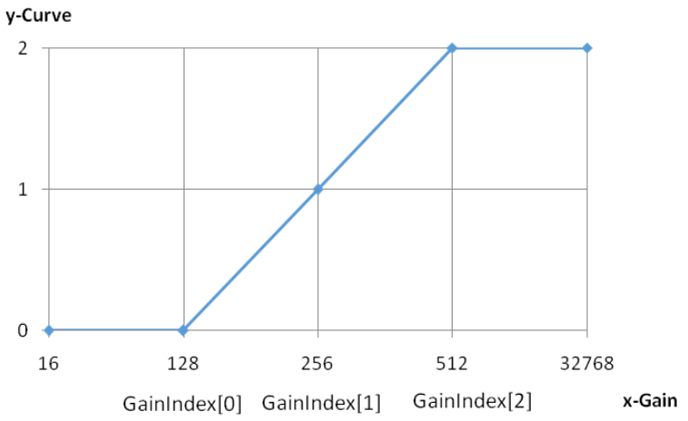

### CLTMFirmwareFilter 参数说明

CLTMFirmwareFilter 模块用于局部色调映射。

#### LTM 使能

| 参数名 | 说明 | 建议调试 | 特殊性 |
|---|---|---|---|
| m_bEnable | LTM使能：`0` 关闭局部色调映射; `1` 打开局部色调映射 | 用户设置 |   |
| m_bHistEnable | LTM 直方图使能：`0` 关闭LTM 直方图;  `1` 打开LTM 直方图 | 否 |   |
| m_nOffsetY | 图像水平方向偏移，由输入图像大小确定 | 用户设置 |   |
| m_nOffsetX | 图像垂直方向偏移，由输入图像大小确定 | 用户设置 |   |

#### LTM 参数

| 参数名 | 说明 | 建议调试 | 特殊性 |
|---|---|---|---|
| m_nLtmStrength | Ltm 强度，值越大，Ltm 效果越强 | 是 |   |
| m_nCurveAlpha | 当前帧计算得到的曲线与历史保存曲线进行融合的收敛速度，值越小，收敛越快 | 是 |   |
| m_nSlopeThr | Drc*DrcDark &lt; Thr，等效于GTM；Drc*DrcDark &gt;= Thr，每个块单独计算LTM强度 | 否 |   |
| m_nPhicBeta | LTM曲线衰减控制点，值越小，曲线越早衰减，越多中高亮的块不会提亮(PhicBeta示意图) | 否 |   |
| m_nBlendCurveFP | 根据 DRCGain 和 DrcGainDark 计算 gtm 曲线，BlendCurveFP 和 BlendCurveSP 为两个控制节点，BlendCurveFP &lt;= BlendCurveSP。第一个节点 FP 之前，tone mapping 强度与 DRCGain*DrcGainDark 有关。BlendCurveFP 越大，暗区提亮范围越大。 | 否 |   |
| m_nBlendCurveSP | 第二个节点SP之后，tone mapping 强度与 DRCGain 有关，两个节点之间平滑过渡。BlendCurveSP 越小，亮度提升范围越小。 | 否 |   |
| m_nSubDarkPercThrLow | 次暗区提亮调整参数，值越小，次暗区提亮强度越大。 | 否 |   |
| m_nSubDarkPercThrHigh | 次暗区提亮调整参数，值越小，次暗区提亮强度越大。SubDarkPercThrLow &lt; SubDarkPercThrHigh | 否 |   |
| m_nSubDarkAdjMeanThr | 次暗区提亮调整参数, SubDarkPercThrLow，SubDarkPercHigh 和 SubDarkAdjMeanThr 与块的次暗区的点占所有点的百分比，控制次暗区 LTM 强度。如果当前块均值大于 SubDarkAdjMeanThr 并且当前块次暗区百分比大于 SubDarkPercThrLow，则会提高次暗区 LTM 强度。当次暗区百分比达到 SubDarkPercThrHigh，次暗区 LTM 强度最大。 | 否 |   |
| m_nDarkPercThrLow | 暗区提亮调整参数，值越小，暗区 LTM 强度越大。 | 否 |   |
| m_nDarkPercThrHigh | 暗区提亮调整参数，值越小，暗区 LTM 强度越大。DarkPercThrLow &lt; DarkPercThrHigh。 | 否 |   |
| m_nPhCDarkMaxExtraRatio | 暗区提亮调整参数，DarkPercThrLow，DarkPercThrHigh 和 PhCDarkMaxExtraRatio 与 block 的最暗区占所有点的百分比，控制暗区 LTM 强度。当前块暗区百分比大于 DarkPercThrLow，则会提高暗区 LTM 强度，当最暗区百分比达到DarkPercThrHigh，暗区LTM强度最大。PhCDarkMaxExtraRatio 越大，暗区 LTM 强度越大。 | 否 |   |
| m_pDstAlphaGainIndex | LTM 强度 gain 控制节点 | 否 |   |
| m_pDstAlphaIndex | 依据 DstAlphaGainIndex 控制节点调整 LTM 强度：值越大，LTM 强度越大 | 是 |  |

PhicBeta 示意图如下
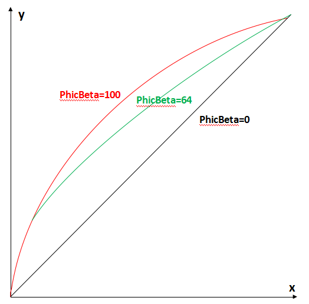

### CUVDenoiseFirmwareFilter 参数说明

CUVDenoiseFirmwareFilter 模块用于去除颜色噪声。

#### UVDenoise 使能

| 参数名 | 说明 | 建议调试 | 特殊性 |
|---|---|---|---|
| m_bEnable | UVDenoise 使能 | 否 | 建议使用 CPP 去噪 |

### CEELiteFirmwareFilter 参数说明

CEELiteFirmwareFilter 模块用于控制边缘增强。

#### EE 使能

| 参数名 | 说明 | 建议调试 | 特殊性 |
|---|---|---|---|
| m_bEnable | EE 使能 | 用户设置 |   |

#### CEELite 参数

| 参数名 | 说明 | 建议调试 | 特殊性 |
|---|---|---|---|
| m_pCurveLumaP | 正边基于亮度自适应增强，值越大边越强 | 是 |   |
| m_pCurveLumaN | 负边基于亮度自适应增强，值越大边越强 | 是 |   |
| m_pCurveFreqTxP | 正边基于频率自适应增强，值越大纹理越多 | 是 |   |
| m_pCurveFreqTxN | 负边基于频率自适应增强，值越大纹理越多 | 是 |   |
| m_nNodeFreq | 频率调节节点 |   |   |
| m_pGlobal_SharpenStrengthP | 正边全局增强，值越大边越强 | 是 |   |
| m_pGlobal_SharpenStrengthN | 负边全局增强，值越大边越强 | 是 |   |
| m_pGlobal_SharpenStrengthPCapture | 拍照参数，正边全局增强，值越大边越强 | 是 |   |
| m_pGlobal_SharpenStrengthNCapture | 拍照参数，负边全局增强，值越大边越强 | 是 |   |
| m_pLPF1 | USMFilter 滤波器参数 | 否 |   |
| m_pLPF2 | USMFilter 滤波器参数 USMFilter = conv([(flt1[0]-flt2[0]), (flt1[1]-flt2[1]), 2*(flt2[0]+flt2[1] - flt1[0]-flt1[1]), (flt1[1]-flt2[1]), (flt1[0]-flt2[0])]) | 否 |   |
| m_pLPF1Capture | 拍照参数，USMFilter 滤波器参数 | 否 |   |
| m_pLPF2Capture | 拍照模式下的 USMFilter 滤波器参数，计算方式同 m_pLPF2 | 否 |   |
| m_pFreqExpLevel1 | 低频区间频率分段控制,值越大,分段越密 | 否 |   |
| m_pFreqExpLevel2 | 高频区间频率分段控制,值越大,分段越密 | 否 |   |
| m_pFreqOffsetTx | 频率软阈值,值越大,抗噪水平越强 | 是 |   |
| m_pTxClipP | 纹理区域正边锐化截断处理，值越大，锐化越强 | 是 |   |
| m_pTxClipN | 纹理区域负边锐化截断处理，值越大，锐化越强 | 是 |   |
| m_pTxThrdP | 纹理区域正边锐化门限，值越小，锐化越强 | 是 |   |
| m_pTxThrdN | 纹理区域负边锐化门限，值越小，锐化越强 | 是 |   |
| m_pClipPos | 正边锐化截断处理，值越大，锐化越强 | 是 |   |
| m_pClipNeg | 负边锐化截断处理，值越大，锐化越强 | 是 |   |
| m_pHCStrength | 边沿 Halo 强度控制，值越小，Halo 抑制越强 | 是 |   |
| m_pCoffW | Halo 区域判定参数 | 否 |   |
| m_pGainIndex | 增益控制节点（Q4 格式） | 否 |  |

#### EE Manual 参数

| 参数名 | 说明 | 建议调试 | 特殊性 |
|---|---|---|---|
| m_bManualMode | 手动模式使能 |  - | Debug参数 |
| Manual结尾参数 | 手动模式参数，与自动一致 |  - | Debug参数 |

### CBitDepthCompressionFirmwareFilter 参数说明

CBitDepthCompressionFirmwareFilter 模块用于降位深压缩。

#### Dithering 使能

| 参数名 | 说明 | 建议调试 | 特殊性 |
|---|---|---|---|
| m_bEnableDithering | Dithering使能 `0`: 关闭 Dithering;  `1`: 打开 Dithering | 否 |   |

### CFormatterFirmwareFilter 参数说明

CFormatterFirmwareFilter 模块用于输出格式控制。

#### Formatter 参数

| 参数名 | 说明 | 建议调试 | 特殊性 |
|---|---|---|---|
| m_nOutputFormat | 输出格式：`0`: NV12; `1`: P010;   `2`: RGB888 | 否 |   |
| m_nSwingOption | `0`: full swing; `1`: studio swing | 否 |   |
| m_bConvertDitheringEnable | `0`: rgb2yuv dithering disable; `1`: rgb2yuv dithering enable | 否 |   |
| m_bCompressDitheringEnable | `0`: full swing to studio swing dithering disable; `1` full swing to studio swing dithering enable | 否 |   |

### CEISFirmwareFilter 参数说明

CEISFirmwareFilter 模块用于电子防抖。

#### EIS 使能

| 参数名 | 说明 | 建议调试 | 特殊性 |
|---|---|---|---|
| m_bEnable | EIS使能: `0` 关闭EIS计; `1` 打开EIS | 用户设置 |   |

##### EIS 参数

| 参数名 | 说明 | 建议调试 | 特殊性 |
|---|---|---|---|
| m_bCalcEnable | Firmware计算使能: `0`: 关闭; `1`: 打开 | 用户设置 |   |
| m_bFilterEnable | 运动平滑滤波使能: `0`: 关闭运动平滑滤波（一般设备与场景相对运动较少时关闭）; `1`: 打开运动平滑滤波 | 是 |   |
| m_nRangeX | X 方向检测移动的范围（单位为像素） | 否 |   |
| m_nRangeY | Y 方向检测移动的范围（单位为像素） | 否 |   |
| m_nMarginX | LDC crop 窗口的 offset X | 否 |   |
| m_nMarginY | LDC crop 窗口的 offset Y | 否 |   |
| m_pFilterWeight | 运动平滑滤波权重 | 是 |   |
| m_pPeakConfLevel | 置信度等级 | 是 |   |
| m_pPeakErrorThre | 置信度等级对应误差容忍门限 | 是 |   |
| m_bReverseDirectionX | 水平方向反转控制 | 是 |   |
| m_bReverseDirectionY | 垂直方向反转控制 | 是 |   |
| m_nCenterStatRatio | 中心统计比例，256 为 100% | 是 |   |

### CAECFilter 参数说明

CAECFilter（AEC）模块用于自动曝光控制。

#### AE 基础参数

| 参数名 | 说明 | 建议调试 | 特殊性 |
|---|---|---|---|
|  m_bManualAEEnable | AEC 模式选择: `0`：自动模式; `1`：手动模式，此时曝光值使用 manual 参数;   `2`：锁定模式，此时曝光值锁定，不受 AEC 调节;   `3`：手动曝光index，此时曝光锁定为 m_pExpIndexManual |  用户设置 |   |
| m_pMinExpTime | 最小曝光时间（参数注释包含 short 部分均为 reserverd，以下 AE 参数适用此规则） | 是 |   |
| m_pMaxExpTime | 最大曝光时间 | 是 |   |
| m_pMinAnaGain | 最小模拟增益 | 是 |   |
| m_pMaxAnaGain | 最大模拟增益 | 是 |   |
| m_pMinSnsDGain | 最小 sensor 数字增益 | 是 |   |
| m_pMaxSnsDGain | 最大 sensor 数字增益 | 是 |   |
| m_pMinTotalGain | 最小总体增益 | 是 |   |
| m_pMaxTotalGain | 最大总体增益 | 是 |   |
| m_pRouteNode50Hz | 50Hz 曝光表,第一列为曝光时间,第二列为总体增益,第三列为精确增益控制 (reserverd) | 是 |   |
| m_pRouteNode60Hz | 60Hz 曝光表,第一列为曝光时间,第二列为总体增益,第三列为精确增益控制 (reserverd) | 是 |   |
| m_pMeteringMatrix | 16x12 测光权重表 | 用户设置 |   |
| m_bLumaCalcMode | Luma 计算方式: `0`：RGB max; `1`：Y average | 用户设置 |   |
| m_bQuickResponseEnable | AE 快速响应开关，使能时立刻调节 AE | 用户设置 |   |

#### AE 目标亮度控制

| 参数名 | 说明 | 建议调试 | 特殊性 |
|---|---|---|---|
| m_bAdvancedAECEnable | 目标亮度控制参数: `0`：使用 m_pTargetRange[1] 作为目标亮度; `1`：动态计算目标亮度，目标亮度区间 [m_pTargetRange[0], m_pTargetRange[1]] | 用户设置 |   |
| m_nCompensation | 目标亮度补偿系数，100 为一倍 | 是 |   |
| m_nSensitivityRatio | 拍照与预览感光度比，256 为一倍 | 用户设置 |   |
| m_pSatRefBin | 饱和点参考值，Target 约束为直方图 [m_pSatRefBin[0],255] 之间的像素占比落入 [m_pSatRefPerThr [0][0]/10000)%, m_ pSatRefPerThr [0][1]/10000)%] | 是 |   |
| m_pSatRefPerThr | 饱和点占比上下限 | 是 |   |
| m_pExpIndexThre | 曝光门限,与四组 m_pLumaBlockWeight 对应,用于选择哪组 m_pLumaBlockWeight 参与计算权重,(见下图 Exp_index-luma_weight 示意图) | 用户设置 |   |
| m_pLumaBlockWeight | 四组亮度块权重表,每组中   Weight[i][0] 对应 low_luma;   Weight[i][1]对应mid_luma;   Weight[i][2]对应high_luma; (见  Exp_index-luma_weight 示意图 / Luma-Weight 示意图) | 用户设置 |   |
| m_pLumaBlockThre | 亮度块门限,用于控制亮度块的权重曲线 (Luma-Weight示意图) | 用户设置 |   |
| m_pLuma7ZoneWeight | 统计窗口与 6 个 sub ROI 权重表 | 用户设置 |   |
| m_pTargetRange | 目标亮度门限 | 是 |   |
| m_pTargetDeclineRatio | 目标亮度随 gain 调整参数，gain 的节点为 2 的 N 次方 | 是 | 可随 Gain 变化 |

Exp_index – luma_weight 示意图如下


Luma – weight 示意图如下

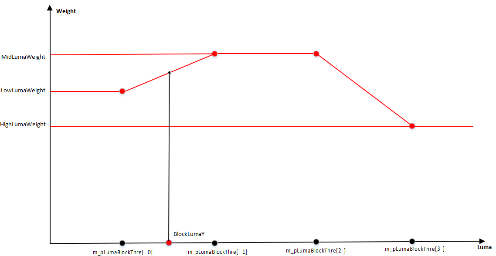

#### AE 模式控制

| 参数名 | 说明 | 建议调试 | 特殊性 |
|---|---|---|---|
| m_bLumaSelectOption | `0`：亮度计算不参考AEM中的 6 个 sub ROI; `1`：亮度计算参考AEM中的 6 个 sub ROI |   |   |
| m_nStrategyMode | AE 调整策略选择: `0`：自动模式; `1`：高光优先，即优先保证高亮部分曝光适合   2：低光优先，即优先保证低亮部分曝光适合 |   |   |
| m_bAntiFlickerEnable | 去抖使能: `0`：关闭去抖动，此时曝光时间不受灯光闪烁限制;`1`：使能去抖动，此时曝光时间限制为灯光闪烁周期的整数倍 |   |   |
| m_nAntiFlickerFreq | 去抖频率选择: `0`：50Hz; `1`：60Hz |   |   |

#### AE 收敛控制

| 参数名 | 说明 | 建议调试 | 特殊性 |
|---|---|---|---|
| m_nTolerance | 目标亮度误差容忍度，统计亮度处于 [target±m_nTolerance] 时 AE 将不做调整 | 是 |   |
| m_nStableRange | 稳定亮度区间：当 AE 收敛时，若统计亮度（mean）与目标亮度（target）的差值大于 m_nStableRange，则调整模拟增益用于补偿 | 是 |   |
| m_nSmoothness | AE 收敛平滑度调节，值越小，收敛越平滑 | 是 |   |
| m_pStableRefFrame | 稳定参考帧数，当稳定帧数大于 m_pStableRefFrame，AE认为当前场景 AE 稳定 | 是 |   |
| m_pUnStableRefFrame | 不稳定参考帧数，当不稳定帧数大于 m_pUnStableRefFrame，AE 认为当前场景 AE 不稳定 | 是 |   |
| m_nDualTargetBlendWeight | 上一次目标亮度与当前目标亮度融合比例，8 为 1：1；16表示全用当前目标亮度 | 是 |   |
| m_pFastStep | 大步长调整折扣比例， m_pFastStep = 256（且不受 MaxFastRatio 钳制时）表示一步调整到 target（ 见下图 step-target 示意图） | 是 |   |
| m_pFastStepRangePer | 大步长门限，满足下述条件使用大步长|current_luma – target_luma| &gt; m_nFastStepRangePer * target_luma | 是 |   |
| m_pFastStepMinRange | 大步长门限下限值 | 是 |   |
| m_pSlowStep | 小步长调整折扣比例，（同 m_pFastStep，见下图 step-target 示意图） | 是 |   |
| m_pSlowStepRangePer | 小步长门限，满足下述条件使用小步长m_nSlowStepRangePer*target &lt; |current_luma – target | &lt; m_nFastStepRangePer*target | 是 |   |
| m_pSlowStepMinRange | 小步长门限下限值 | 是 |   |
| m_pFineStep | 细步长调整折扣比例，（同 m_pFastStep，见下图 step-target 示意图） | 是 |   |
| m_pMaxFastRatio | 最大大步调整比例（Q8）：  增曝光时，最大大步调整比例为m_pMaxFastRatio；  减曝光时，最大大步调整比例为 65536/m_nMaxFastRatio； | 是 |   |
| m_pMaxSlowRatio | 最大小步调节比例（Q8）：  增曝光时，小步调节比例限制区间 [256 + m_nMaxFineRatio, 256 + m_nMaxSlowRatio]；  减曝光时，小步调节比例限制区间 [256 - m_nMaxSlowRatio, 256 - m_nMaxFineRatio]； | 是 |   |
| m_pMaxFineRatio | 最大细步调节比例（Q8） | 否 |   |
| m_pMinFineRatio | 最小细步调节比例   增曝光时，小步调节比例限制区间 [256 + m_nMinFineRatio, 256 + m_nMaxFineRatio]；  减曝光时，小步调节比例限制区间 [256 - m_nMaxFineRatio, 256 - m_nMinFineRatio]； | 否 |   |
| m_pAjustSplitFrameNum | 单步调整所需次数 (第 1 列 reserved) | 否 |   |
| m_pSingleStepAdjustLumaThr | 单次调节亮度阈值 (第 1 列 reserved)。与 m_pAjustSplitFrameNum 共同决定单次调节最大 luma 值：Single_luma_max = max((target - mean)/AjustSplitFrameNum,SingleStepAdjustLumaThr)   增曝光时，若依据adjustRatio 调整的 luma 超过 Single_luma_max，则 adjustRatio= 256 + Single_luma_max * 256 / mean   减曝光同理。 |  否 |   |
| m_pFaceAjustSplitFrameNum | 参数含义同 m_pAjustSplitFrameNum，仅在人脸 AE 模式下生效。 | 否 |   |
| m_pFaceSingleStepAdjustLumaThr | 参数含义同 m_pSingleStepAdjustLumaThr，仅在人脸 AE 模式下生效。 | 否 |   |

Step – target 示意图如下


Luma – stpe 示意图如下

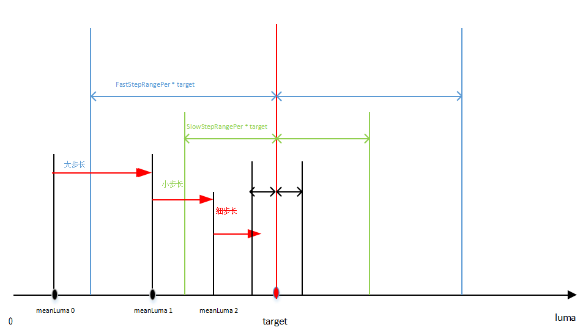

#### 自动动态范围补偿增益计算

| 参数名 | 说明 | 建议调试 | 特殊性 |
|---|---|---|---|
| m_nDarkRefBin | 暗区像素亮度上限参考值，计算暗区亮度时，统计范围不会超过该值 | 是 |   |
| m_bLumaPredict | DRCgain计算亮度预测：`0`：计算DRCgain时不修正（当帧统计当帧apply LTM时）; `1`：计算DRCgain时修正（当帧统计下帧apply LTM时） |  |   |
| m_nDarkPerThrL |  暗区像素亮度百分比下限，暗区像素数目百分比低于该值时，DRCGainDark为1，（见图示pixelNumPercent-DRCGainDark示意图） |  |   |
| m_nDarkPerThrH | 暗区像素亮度百分比上限，暗区像素数目百分比高于该值时，暗区像素全部参与计算DRCGainDark，（见图示pixelNumPercent-DRCGainDark示意图） |  |  |
| m_nDarkTarget | 暗区期望达到的亮度值，值越大 ，最终计算出的DRCGainDark越大 |  |  |
| m_nMaxDRCGain | 最大 DRC 增益 | 是 |  |
| m_nMaxDRCGainDark | 最大 DRC Dark 增益  | 是 |  |

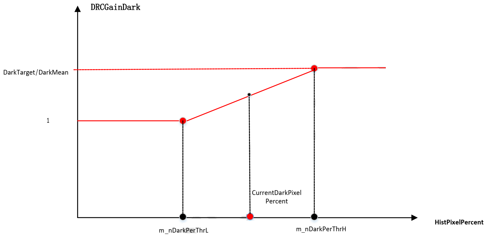

PixelNumPercent - DRCGainDark 示意图

#### Lux 定标

| 参数名 | 说明 | 建议调试 | 特殊性 |
|---|---|---|---|
| m_nCalibExposureIndex | 亮度定标的曝光索引 | 是 |   |
| m_nCalibSceneLum | 亮度定标的场景亮度 | 是 |   |
| m_nCalibSceneLux | 定标场景对应的实际照度 | 是 |   |

#### AEC manual 参数

| 参数名 | 说明 | 建议调试 | 特殊性 |
|---|---|---|---|
| m_pExpTimeManual | 手动曝光时间, AEC 处于手动模式时生效 |   |   |
| m_pAnaGainManual | 手动模拟增益, AEC 处于手动模式时生效 |   |   |
| m_pSnsDGainManual | 手动 sensor 数字增益, AEC 处于手动模式时生效 |   |   |
| m_pTotalGainManual | 手动总体增益, AEC 处于手动模式时生效 |   |   |
| m_pExpIndexManual | 手动曝光 index, AEC 处于手动模式时生效 |   |   |

#### AEC frameinfo

| 参数名 | 说明 | 建议调试 | 特殊性 |
|---|---|---|---|
| m_nFrameCounter | AE帧计数 |  - | 只读 |
| m_pExpTimeLong | 曝光时间(us) |  - | 只读 |
| m_pAnaGainLong | 模拟增益(Q8) |  - | 只读 |
| m_pSnsDGainLong | sensor 数字增益(Q12) |  - | 只读 |
| m_pIspDGainLong | ISP 数字增益(Q12) |  - | 只读 |
| m_pTotalGainLong | 总增益(Q8) |  - | 只读 |
| m_pExpIndexLong | 曝光索引(曝光时间 * 总增益 / 256) |  - | 只读 |
| m_pTotalGainDBLong | 总增益(db) |  - | 只读 |
| m_pExpTimeShort | Reserved |  - | 只读 |
| m_pAnaGainShort | Reserved |  - | 只读 |
| m_pSnsDGainShort | Reserved |  - | 只读 |
| m_pIspDGainShort | Reserved |  - | 只读 |
| m_pTotalGainShort | Reserved |  - | 只读 |
| m_pExpIndexShort | Reserved |  - | 只读 |
| m_pTotalGainDBShort | Reserved |  - | 只读 |
| m_nCurHdrRatio | Reserved |  - | 只读 |
| m_nHistPixelNum | 参与直方图统计的像素数 |  - | 只读 |
| m_pMeanLuma | AE 计算亮度   `0`: long   `1`: Reserved |  - | 只读 |
| m_pTargetLuma | AE 目标亮度   `0`: long   `1`: Reserved |  - | 只读 |
| m_pLuma7Zone | AE 主窗口及 6 个副窗口 luma |  - | 只读 |
| m_pAERouteNum | AE 曝光节点   `0`: long   `1`: Reserved |  - | 只读 |
| m_pRouteNodeLong | 长帧曝光表 |  - | 只读 |
| m_pADNodeLong | Sensor again 与 dgain 分配表 |  - | 只读 |
| m_pLumaMatrixLong | 亮度缩略图 |  - | 只读 |
| m_pHistLong | 直方图 |  - | 只读 |
| m_pRouteNodeShort | Reserved |  - | 只读 |
| m_pADNodeShort | Reserved |  - | 只读 |
| m_pLumaMatrixShort | Reserved |  - | 只读 |
| m_pHistShort | Reserved |  - | 只读 |
| m_pRefSaturateNum | 参考过曝像素数   `0`: long   `1`: Reserved |  - | 只读 |
| m_pCurSaturateNum | 当前过曝像素数   `0`: long   `1`: Reserved |  - | 只读 |
| m_pEstSaturateNum | 预估过曝像素数，预估当统计亮度达到目标亮度上限时过曝像素数   `0`:long   `1`:Reserved |  - | 只读 |
| m_pAdjustRatio | AE 调节比例 |  - | 只读 |
| m_pStableFlag | AE 稳定标志   `0`: long   `1`: Reserved |  - | 只读 |
| m_pStableFlagBuf | AE 帧序列稳定标志   `0`: long   `1`: Reserved |  - | 只读 |
| m_pUnStableFlagBuf | AE 帧序列不稳定标志   `0`: long   `1`: Reserved |  - | 只读 |
| m_nDRCGain | DRCGain 当前帧 AE 计算结果 |  - | 只读 |
| m_nDRCGainDark | DRCGainDark 当前帧 AE 计算结果 |  - | 只读 |

### CAFFilter 参数说明

CAFFilter 模块用于自动对焦控制。

#### AF 参数

| 参数名 | 说明 | 建议调试 | 特殊性 |
|---|---|---|---|
| m_nAFMode | 对焦模式：`0`：SAF 单次聚集; `1`：CAF 连续聚焦 | 用户设置 |   |
| m_bHybridAFEnable | CDAF 与 PDAF 混合对焦模式使能：`0`：关闭; `1`：开启 | 用户设置 |   |
| m_bAFTrigger | 自动对焦触发，CAF 时需要使能 | 用户设置 |   |
| m_bMotorManualTrigger | 手动对焦触发，配合 ManualMotorPosition 使用 | 用户设置 |   |
| m_nManualMotorPosition | 手动电机位置 | 用户设置 |   |
| m_nFrameRate | 当前 sensor 帧率，用于计算 AF 跳帧数，建议由软件更新 | 用户设置 |   |
| m_nMaxSkipFrame | 最大跳过帧数 | 否 |   |

#### 电机属性参数

| 参数名 | 说明 | 建议调试 | 特殊性 |
|---|---|---|---|
| m_nMinMotorPosition | 最小电机位置 | 是 |   |
| m_nMaxMotorPosition | 最大电机位置 | 是 |   |
| m_nMotorResponseTime | 电机走一步的响应时间(ms)，用于计算 AF 跳帧数，值越大，跳帧数越多 | 是 |   |
| m_nHyperFocalMotorPosition | 超焦距位置 | 是 |   |

#### 电机运动控制参数

| 参数名 | 说明 | 建议调试 | 特殊性 |
|---|---|---|---|
| m_nFirstStepDirectionJu dgeRatio | 首步方向判断百分比。AF算法运行在CDAF时，判断电机走第一步的方向所需的百分比:   当电机初始位置位于整个电机范围的前百分比之内时，方向为从最小电机位置到最大电机位置；  当电机初始位置位于整个电机范围的后(100%-百分比)之内时，方向为从最大电机位置到最小电机位置 |  用户设置 |   |
| m_bPreMoveMode | 预运动模式。AF 算法运行在 CDAF 时，电机走第一步时 `0`：保持初始位置; `1`：走到最小电机位置或者最大电机位置，具体根据初始位置与首步方向判断百分比而定 | 用户设置 |   |
| m_bPreMoveToInfMode | 预运动模式，运动最小电机位置。AF 算法运行在 CDAF 时，电机走第一步时 `0`：保持初始位置; `1`：走到最小电机位置 | 用户设置 |   |
| m_bStartFromTrueCurrent | 从当前实际位置开始使能。AF算法运行在 CDAF 时，电机走第一步时 `0`：走到距离初始位置最近的微距位置;  `1`：保持初始位置 | 用户设置 |   |
| m_nBackTimeRatio | 电机运动时跳帧比例，值越大，电机走一步花费的帧数越多。与 m_nBackTimeDivisor 共同控制电机跳帧 | 用户设置 |   |
| m_nBackTimeDivisor | 电机运动时跳帧控制参数，值越小，电机走一步花费的帧数越多。与 m_nBackTimeRatio 共同控制电机跳帧 | 用户设置 |   |
| m_nPreMoveTimeRatio | 预运动模式下的电机跳帧比例 | 用户设置 |   |
| m_nFailMotorPositionOpt ion | 聚焦失败后最终位置选择：`0`：算法自动选择(需正确填写超焦距马达位置); `1`：最清晰;   `2`：无穷远;  `3`：超焦距;   `4`：微距;   `5`：当前位置 | 用户设置 |   |

#### 电机步长控制参数

| 参数名 | 说明 | 建议调试 | 特殊性 |
|---|---|---|---|
| m_nMinMacroReverseStepNum | 当电机由最大电机位置到最小电机位置运动，检测到 FV 下降需要反向时，电机必须走过的步数 | 是 |   |
| m_nMinReverseStepNum | 当电机由最小电机位置到最大电机位置运动，检测到 FV 下降需要反向时，电机必须走过的步数 | 是 |  |
| m_nFineStepSearchNum | 细步长搜索的步数 | 是 |   |
| m_nCoarseStep | CDAF 下粗步长 | 是 |   |
| m_nFineStep | CDAF 下细步长 | 是 |   |

| 参数名 | 说明 | 建议调试 | 特殊性 |
|---|---|---|---|
| m_nSoftwareMotorCtrlMode | 目标位置控制方式（用于首步预移动、手动移动、小步开始、聚焦失败处理等）：`0`：软着陆模式; `1`：固定步长模式;   `2`：直达模式 | 用户设置 | 见图1 |
| m_nMinSafePosition | 在软着陆模式下，电机由最大电机位置到最小电机位置移动时的最小安全位置 | 用户设置 | 见图2 |
| m_nMinStepRatio | 同上，最小步长比例 | 用户设置 | 见图2 |
| m_nMaxSafeStep | 同上，最大安全步长 | 用户设置 | 见图2 |
| m_nMinSafePositionMacro | 在软着陆模式下，电机由最小电机位置到最大电机位置移动时的最小安全位置 | 用户设置 | 见图2 |
| m_nMinStepRatioMacro | 同上，最小步长比例 | 用户设置 | 见图2 |
| m_nMaxSafeStepMacro | 同上，最大安全步长 | 用户设置 | 见图2 |

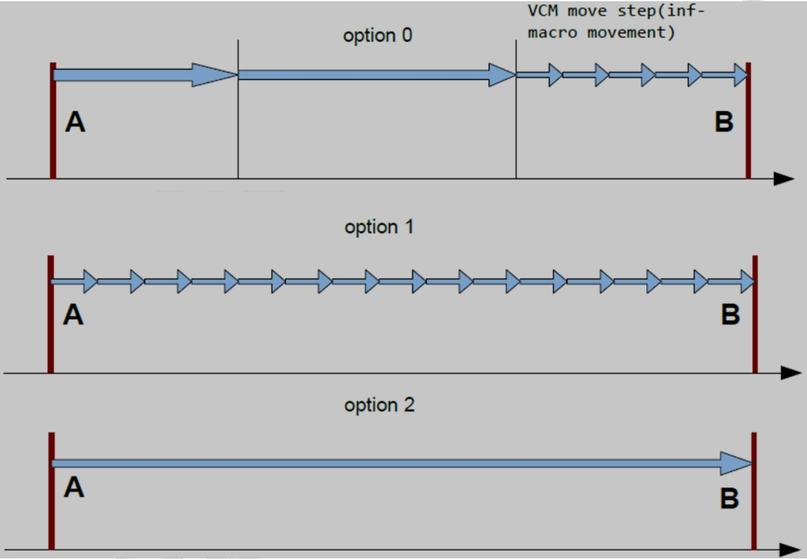

图 1

每组条件描述:

- Graphic 图形演示
- Output 输出一种情况


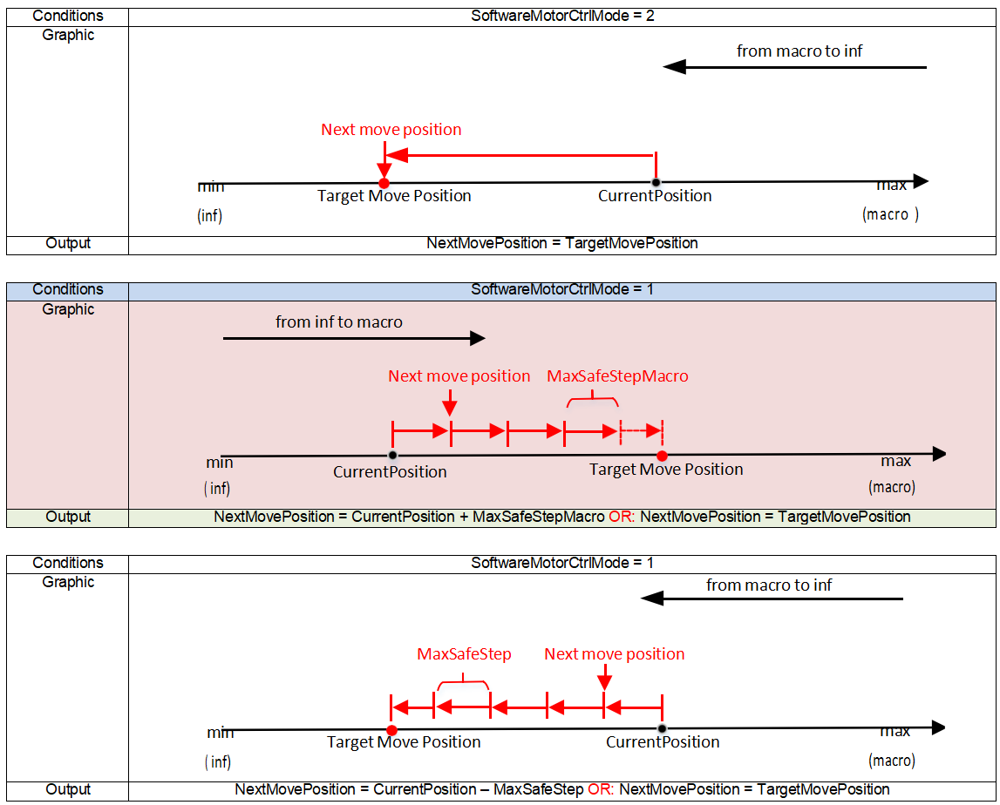

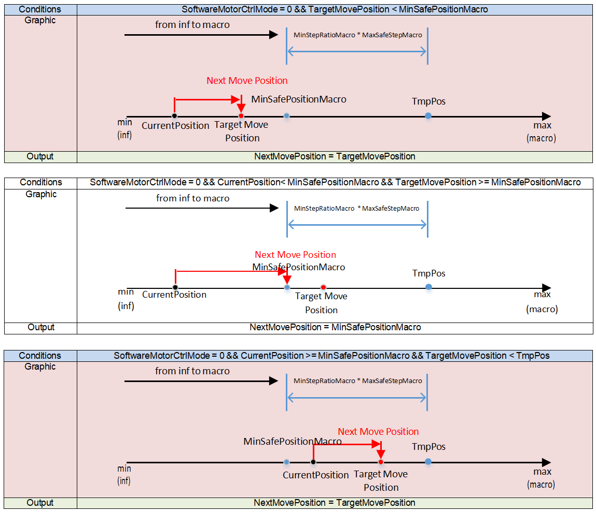


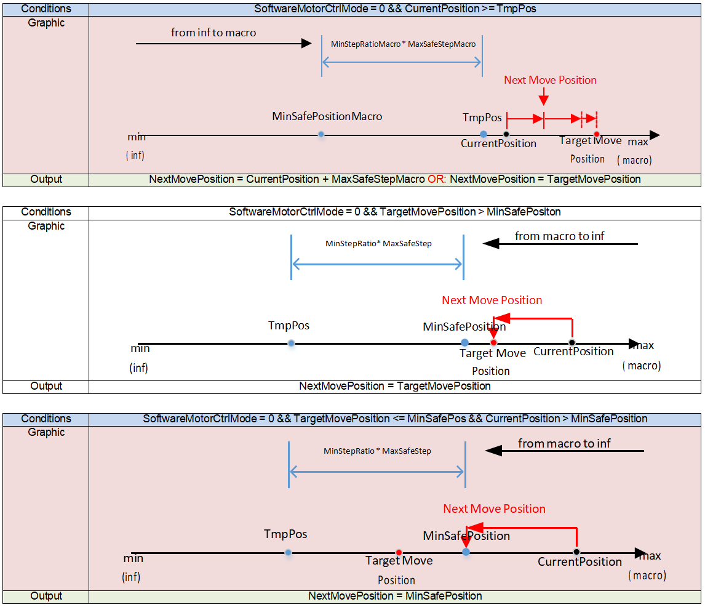


图 2

| 参数名 | 说明 | 建议调试 | 特殊性 |
|---|---|---|---|
| m_bAdaptiveStep | 可变步长模式 `0`：不使能; `1`：使能 | 用户设置 |   |
| m_nVCMStep1Ratio | 电机步长比例 1，在可变步长模式下，将电机范围划分为多个区间 | 用户设置 | 见图3 |
| m_nVCMStep2Ratio | 电机步长比例 2，在可变步长模式下，将电机范围划分位多个区间 | 用户设置 | 见图3 |
| m_nVCMCoarseStep1 | 电机粗步长 1，在可变步长模式下，根据当前电机位置在不同区间计算实际步长 | 用户设置 | 见图3 |
| m_nVCMCoarseStep2 | 电机粗步长 2，在可变步长模式下，根据当前电机位置在不同区间计算实际步长 | 用户设置 | 见图3 |
| m_nVCMFineStep1 | 电机细步长 1，在可变步长模式下，根据当前电机位置在不同区间计算实际步长 | 用户设置 | 见图3 |
| m_nVCMFineStep2 | 电机细步长 2，在可变步长模式下，根据当前电机位置在不同区间计算实际步长 | 用户设置 | 见图3 |

- MotorMoveStep 表示实时的步长，它根据当前电机运动方向、当前处于粗步长还是细步长模式改变，是一个变量，符号可为正，可为负，可为较大值，可为较小值

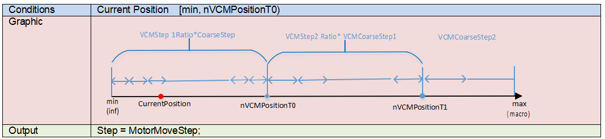

图 3

每组 Conditions 描述:

- Graphic 图形演示
- Output 输出一种情况

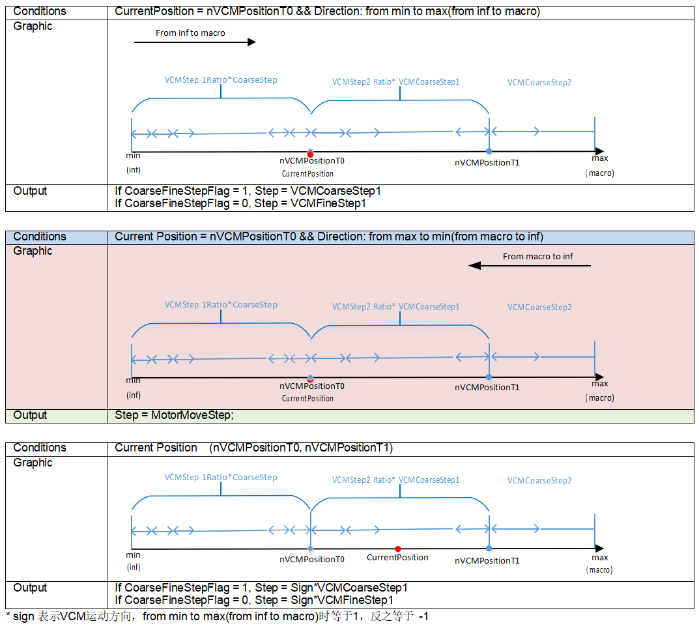


#### Focus Value 判定参数

| 参数名 | 说明 | 建议调试 | 特殊性 |
|---|---|---|---|
| m_pFVDropPercentage | 预运动模式下，判定 FV 曲线下降的百分比。6 种类型的 FV 各自根据增益计算 | 否 |   |
| m_pCurrentStartFVDropPercentage | 非预运动模式下，判定 FV 曲线下降的百分比。6 种类型的 FV 各自根据增益计算 | 否 |   |
| m_pFVFailPercentage | 预运动模式下，判定 FV 曲线无效的最大 FV 值与最小 FV 值的差异百分比。若最大 FV 值与最小 FV 值差异小于阈值，则认为 FV 曲线过于平滑而无效。6 种类型的 FV 各自根据增益计算。是判定聚焦失败的第一种条件。 | 否 |   |
| m_pCurrentStartFVFailPe rcentage | 非预运动模式下，判定 FV 曲线无效的最大 FV 值与最小FV值的差异百分比。若最大 FV 值与最小 FV 值差异小于阈值，则认为 FV 曲线过于平滑而无效。6 种类型的 FV 各自根据增益计算。是判定聚焦失败的第一种条件。 | 否 |   |
| m_pLastStepChangePercentage | FV 曲线一直上升或一直下降判定为失效的百分比，6 种类型的 FV 各自根据增益计算 | 否 |   |
| m_pWindowWeightMatrix | 5x5 统计窗的 FV 的权重 | 否 |   |

#### PDAF 控制参数

| 参数名 | 说明 | 建议调试 | 特殊性 |
|---|---|---|---|
| m_bPDReverseDirectionFlag | PDShift 计算的步长反向标志 `0`：不反向; `1`：反向 | 是 |   |
| m_nPDDirectConfThrRatio | PD 阈值百分比，当置信度大于阈值的 m_nPDDirectConfThrRatio% 时，直接走出 PD 计算的步长 | 否 |   |
| m_nPDTryStepRatio | AF 算法运行在混合对焦模式时，首先尝试走出的一步相对于 CDAF 大步的比例 | 否 |   |
| m_nPDCoarseStep | PDAF 粗步长 | 是 |   |
| m_nPDFineStep | PDAF 细步长 | 是 |   |
| m_nPDStepDiscountRatio | PDAF 对由 PDShift 计算出的步长的打折比例 | 否 |   |
| m_pPDConfThr | PD 信息置信度阈值 | 是 |   |
| m_pPDFVIncreaseRatio | AF 算法运行在混合对焦模式时，FV 上升的比例，用于判定尝试的一步走出后 FV 值是否上升，从而判定 PD 信息是否可信 | 否 |   |
| m_pPDFVDropPercentage | FV 值下降的判定百分比，当 AF 运行在 PDAF 下 | 否 |   |
| m_pPDShiftPositionLUT_0_0m_pPDShiftPositionLUT_4_4 | 5x5 窗口，PD Shift – step 查找表 | PDAF 插件标定 |   |

#### 连续聚焦控制

| 参数名 | 说明 | 建议调试 | 特殊性 |
|---|---|---|---|
| m_bCAFHold | 在连续聚焦模式下，保持当前状态不变 | 用户设置 |   |
| m_bCAFForce | 在连续聚焦模式下，强制触发一次单次聚焦 | 用户设置 |   |
| m_nCAFHoldPDShiftThr | 连续聚焦模式下，判断场景稳定的 PD shift 门限，值越大，越容易判断为稳定 | 是 |   |
| m_nCAFHoldPDConfThr | 连续聚焦模式下，判断场景稳定的 PD confidence 门限，值越小，越容易判断为稳定 | 是 |   |
| m_nPreFocusMode | 在连续聚焦模式下，追焦模式使能：`0`：不追焦; `1`：半追焦（基于 PD shift 先尝试一次对焦） | 用户设置 |   |
| m_nPFPDStepDiscountRatio | Prefocus 步长折扣比 | 是 |   |
| m_nLumaCalcOpt | Luma 计算方式 `0`：三通道分别计算; `1`：计算 RGB 最大值;   `2`：计算加权的 Y 均值 | 否 |   |
| m_bReFocusEnable | 连续聚焦模式下，refocus 使能 | 用户设置 |   |
| m_pRefocusLumaSADThr | CAF 触发 SAF 时，决定是否触发的 SAD 门限 | 是 |   |
| m_nFlatSceneVarThr | 连续聚焦模式下，判断是否为平坦场景的缩略图的方差门限 | 是 |   |
| m_nFlatSceneLumaThr | 连续聚焦模式下，判断是否为平坦场景的亮度门限 | 是 |   |
| m_bStableJudgeOpt | 连续聚焦模式下，判断场景稳定的条件：`0`：FV 或 luma 满足其一; `1`：FV 与 luma 均满足 | 用户设置 |   |
| m_nRefStableFrameNum | 在连续聚焦模式下，参考态中判定场景已经稳定的帧数 | 用户设置 |   |
| m_nDetStableFrameNum | 在连续聚焦模式下，检测态中判定场景已经稳定的帧数 | 用户设置 |   |
| m_pStableExpIndexPercentage | 在连续聚焦模式下，判定当前帧稳定的曝光量变化百分比 | 是 |   |
| m_pStableFVSADPercentage | 在连续聚焦模式下，判定当前帧稳定的 FV 的 SAD 百分比 | 是 |   |
| m_pStableLumaSADThr | 在连续聚焦模式下，判定当前帧稳定的亮度的 SAD 百分比 | 是 |   |
| m_bChangeJudgeOpt | 连续聚焦模式下，判断场景变化的条件：`0`：FV 或 luma 满足其一; `1`：FV 与 luma 均满足 | 否 |   |
| m_nChangeFrameNum | 连续聚焦模式下，判断场景变化的帧数 | 是 |   |
| m_nChangeStatAreaPercentage | 连续聚焦模式下，判断场景变化的 AF 统计窗口面积改变门限百分比，超出此门限认为场景发生改变，人脸模式有效 | 否 |   |
| m_nChangeStatCenterPercentage | 连续聚焦模式下，判断场景变化的 AF 统计窗口位置改变门限百分比，超出此门限认为场景发生改变，人脸模式有效 | 否 |   |
| m_pChangeExpIndexPercentage | 连续聚焦模式下，判断场景变化的曝光量变化百分比 | 是 |   |
| m_pChangeFVSADPercentage | 在连续聚焦模式下，判定当前帧变化的 FV 的 SAD 百分比 | 是 |   |
| m_pChangeLumaSADThr | 在连续聚焦模式下，判定当前帧变化的亮度的 SAD 百分比 | 是 |   |
| m_pChangePDShiftThr | 在连续聚焦模式下，判定当前帧变化的 PDShift 的百分比 | 否 |   |

#### 前景追踪模式

| 参数名 | 说明 | 建议调试 | 特殊性 |
|---|---|---|---|
| m_bForeGroundTrackInCoarse | 粗步长调节时前景追踪模式使能：`0`：不使能前景追踪; `1`：使能前景追踪 | 用户设置 |   |
| m_bForeGroundTrackInFine | 细步长调节时前景追踪模式使能：`0`：不使能前景追踪; `1`：使能前景追踪 | 用户设置 |   |
| m_nForeGroundTrackWindow | 前景追踪窗口：  `3`：3x3;   `4`：4x4;   `5`：5x5 | 用户设置 |   |
| m_bForeGroundTrack | 前景追踪模式使能：`0`：不使能前景追踪; `1`：使能前景追踪 | 用户设置 |   |
| m_pFVBlkDropPercentage | 前景追踪模式使能下的 FV 值下降的判定百分比 | 否 |   |
| m_pFVBlkIncreasePercentage | 前景追踪模式使能下的 FV 值上升的判定百分比 | 否 |   |
| m_pFineStepStartPosSelectConf | 前景追踪模式使能下，开始走细步长时的起始位置的置信度阈值 | 否 |   |
| m_pFineStepEndPosSelectConf | 前景追踪模式使能下，细步长走完后最终位置的置信度阈值 | 否 |   |

#### AF frameinfo

| 参数名 | 说明 | 建议调试 | 特殊性 |
|---|---|---|---|
| m_nGain | 当前系统增益，Q4 格式 |  - | 只读 |
| m_nPDShift | PD 偏移 |  - | 只读 |
| m_nPDConf | PD 置信度 |  - | 只读 |
| m_nCurrentPosition | 当前电机位置 |  - | 只读 |
| m_nFSMStatus | AF 状态机 |  - | 只读 |
| m_nFocusStatFlag | 聚焦状态标志 `0`：初始; `1`：成功;   `2`：失败 |  - | 只读 |
| m_nFocusFrameCost | 一次单次聚焦完成所花费的帧数 |  - | 只读 |
| m_nMotorMoveStep | 实时电机步长 |  - | 只读 |
| m_bCoarseFineStepFlag | 实时处于粗/细步长标志 `0`：当前处于细步长; `1`：当前处于粗步长 |  - | 只读 |
| m_nMotorMoveSkipFrameNum | 电机每次移动跳过的帧数 |  - | 只读 |
| m_bStartFromMinFlag | 实时电机运动方向 `0`：从最大电机位置到最小电机位置; `1`：从最小电机位置到最大电机位置 |  - | 只读 |
| m_bStartFromCurrentFlag | 电机初始从当前位置开始运动的标志 `0`：从预运动位置出发; `1`：从初始位置出发 |  - | 只读 |
| m_bSoftwareMotorCtrlFlag | 从当前位置向目标位置运动过程中受到软件控制改变的标志 |  - | 只读 |
| m_nPositionScanNum | 电机扫描过的方向计数 |  - | 只读 |
| m_nPositionAdjustNum | 电机走过的位置计数 |  - | 只读 |
| m_pRTFVList | 实时FV值 |  - | 只读 |
| m_pMinFVList | 单次聚焦过程中的最小 FV 值 |  - | 只读 |
| m_pMaxFVList | 单次聚焦过程中的最大 FV 值 |  - | 只读 |
| m_pMaxFVPositionList | 单次聚焦城中的最大 FV 值所在的位置 |  - | 只读 |
| m_pFVUnchangeFlag | FV 曲线过于平滑而失效的标志 `0`：FV曲线可信; `1`：FV曲线失效 |  - | 只读 |
| m_pFailCondition | 判定本地聚焦失败的三个条件的状态 `0`：当前条件判定聚焦成功; `1`：当前条件判定聚焦失败 |  - | 只读 |
| m_pFSMPosSingleFocus | 单次聚焦过程中，帧号-电机位置-状态机信息记录 |  - | 只读 |
| m_pPosFvSingleFocus | 单次聚焦过程中，帧号-6种类型FV值信息记录 |  - | 只读 |
| m_pRefFV | 连续聚焦模式下，记录的 FV 参考值 |  - | 只读 |
| m_pSeqFV | 连续聚焦模式下，实时 FV 值序列 |  - | 只读 |
| m_pRefLumaR | 连续聚焦模式下，记录的 R 通道缩略图参考值 |  - | 只读 |
| m_pRefLumaG | 连续聚焦模式下，记录的 G 通道缩略图参考值 |  - | 只读 |
| m_pRefLumaB | 连续聚焦模式下，记录的 B 通道缩略图参考值 |  - | 只读 |
| m_pSeqLumaR | 连续聚焦模式下，实时 R 通道缩略图 |  - | 只读 |
| m_pSeqLumaG | 连续聚焦模式下，实时 G 通道缩略图 |  - | 只读 |
| m_pSeqLumaB | 连续聚焦模式下，实时 B 通道缩略图 |  - | 只读 |
| m_nRefExpIndex | 连续聚焦模式下，参考曝光 index |  - | 只读 |
| m_nRTExpIndex | 连续聚焦模式下，实时曝光 index |  - | 只读 |
| m_bPDInfoDisable | 连续聚焦模式下，使用 PD 信息标志位 |  - | 只读 |
| m_nLumaAverage | 亮度均值 |  - | 只读 |
| m_nSceneVariance | 缩略图实时方差 |  - | 只读 |
| m_bSceneFlatFlag | 场景平坦标志位 |  - | 只读 |
| m_nChangeExpIndex | 连续聚焦模式下，当前曝光 index 与参考曝光 index 的差 |  - | 只读 |
| m_nChangeExpIndexThr | 连续聚焦模式下，判断场景变化的曝光 index 门限 |  - | 只读 |
| m_nChangeFVSAD | 连续聚焦模式下，实时 FV 与参考 FV 之间的 SAD 差 |  - | 只读 |
| m_nChangeFVSADThr | 连续聚焦模式下，判断场景变化的 SAD 门限 |  - | 只读 |
| m_nChangeLumaSAD | 连续聚焦模式下，实时亮度 SAD 值 |  - | 只读 |
| m_nChangeLumaSADThr | 连续聚焦模式下，实时亮度 SAD 门限 |  - | 只读 |
| m_nRefocusLumaSAD | CAF 触发 SAF 时，前帧亮度 SAD |  - | 只读 |
| m_nRefocusLumaSADThr | CAF 触发 SAF 时，决定是否触发的 SAD 门限 |  - | 只读 |
| m_bStableExpIndexFlag | AE 曝光表稳定标志位 |  - | 只读 |
| m_bStableFVFlag | FV 稳定标志位 |  - | 只读 |
| m_bStableAFLumaFlag | AFM luma 稳定标志位 |  - | 只读 |
| m_bStableAELumaFlag | AEM luma 稳定标志位 |  - | 只读 |
| m_bPDTriggerCAF | PD 触发 AF 标志位 |  - | 只读 |
| m_bFVTriggerCAF | FV 触发 AF 标志位 |  - | 只读 |
| m_bLumaTriggerCAF | Luma 触发 AF 标志位 |  - | 只读 |
| m_bExpIndexTriggerCAF | ExpIndex 触发 AF 标志位 |  - | 只读 |
| m_bRefocusTriggerCAF | CFA 触发 SAF 标志位 |  - | 只读 |

### CAWBFilter 参数说明

CAWBFilter（AWB）模块用于自动白平衡控制。

#### 灰度世界

| 参数名 | 说明 | 建议调试 | 特殊性 |
|---|---|---|---|
| m_bGrayWorldEn | 灰度世界模式使能: `0`：关闭灰度世界;  `1`：使能灰度世界，此时由灰度世界算法计算白平衡增益 | 用户设置 |   |

#### ROI 控制

| 参数名 | 说明 | 建议调试 | 特殊性 |
|---|---|---|---|
| m_pRoiBound | 16 个 ROI 区域控制 | 是 |   |
| m_pRoiLumLutHigh | 统计块亮度上限 | 否 |   |
| m_pRoiLumLutLow | 统计块亮度下限 | 否 |   |
| m_pRoiEn | ROI 使能 | 是 |   |
| m_pRoiWeightLut | 不同亮度索引对应的权重 | 是 |   |
| m_pRoiLumThre | 亮度 lux 索引门限 | 是 |   |
| m_bRoiLimitManual | 固定 ROI 使能：`0`：依据自动白点ROI及低色温统计块占比计算白点限制区域;  `1`：白点限制区域固定为 RoiCtHigh，RoiCtLow，RoiXMax，RoiXMin |   |   |
| m_nRoiCtHigh | 白点 ROI 纵坐标 Y 上限，在 ROI 区域以外的 block 计算白平衡时权重为 0 (CT（color temperature）= BlockBlue_sum(8bit) / BlockRed_sum * 1024) | 是 |   |
| m_nRoiCtLow | 白点 ROI 纵坐标 Y 下限 | 是 |   |
| m_nRoiXMax | 白点 ROI 横坐标 X 上限 (X = BlockBlue_sum x BlockRed_sum / BlockGreen_sum / BlockGreen_sum x 1024) | 是 |   |
| m_nRoiXMin | 白点 ROI 横坐标 X 下限 | 是 |   |
| m_pRoiCtHighAuto | 不同亮度下白点 ROI 纵坐标 Y 上限 | 是 |   |
| m_nRoiCtLowAuto | 不同亮度下自动白点 ROI 纵坐标 Y 下限 | 是 |   |
| m_nRoiXMaxAuto | 不同亮度下自动白点 ROI 横坐标 X 上限 | 是 |   |
| m_nRoiXMinAuto | 不同亮度下自动白点 ROI 横坐标 X 下限 | 是 |   |
| m_nValidNum | 每个 ROI 生效的最小块数,处于统计亮度区间的块的数目小于该值时,该 ROI 不参与白平衡计算 | 否 |   |
| m_bWeightOnSum | Block 权重计算方式：`0`：使用 Block 亮度总和;         `1`：使用 Block 的 RGB 增益计算 | 否 |   |

#### 白平衡 Gain 控制

| 参数名 | 说明 | 建议调试 | 特殊性 |
|---|---|---|---|
| m_pAWBGainLimit | 最终 WB gain 限制区域 | 是 |   |
| m_nAWBCTShift | WB Gain 向上偏移距离，用于将低色温场景往暖色调偏移 | 是 |   |
| m_pAWBCTShiftThr | WB Gain 偏移 Y 门限：  若 Y ＜ AWBCTShiftThr[0] 时, WB Gain 向上偏移m_nAWBCTShift   若 Y ＞ AWBCTShiftThr[1] 时, WB Gain 不偏移  中间为插值区域 | 是 |   |

#### 混光场景降高色温权重

| 参数名 | 说明 | 建议调试 | 特殊性 |
|---|---|---|---|
| m_sRoiBoundDayLight | 高低色温混合场景，高色温统计块框选区域，落入该区域的统计块为高色温统计块 | 是 |   |
| m_pLowCtNumThr | 低色温统计块所占千分比门限，（见下图示 lowCtLightPermillage-ratio）  低色温统计块所占千分比 ＞ LowCtNumThr[0] 时，高色温统计块权重开始降低；  低色温统计块所占千分比 ≥ LowCtNumThr[1]时，高色温统计块权重降到最低。 | 是 |   |
| m_pDayLightNumThr | 高色温统计块所占千分比门限，（见下图示 dayLightPermillage-ratio）  高色温统计块所占千分比 ＜ DayLightNumThr[1] 时, 高色温统计块权重开始降低；  高色温统计块所占千分比 ≤ DayLightNumThr[0] 时，高色温统计块权重不再降低，与 m_pLowCtNumThr 共同作用决定高色温统计块权重降低的基础强度 baseRatio。 | 是 |   |
| m_pLowCtThr | 高低色温混合场景，降高色温统计块权重的 Y 门限（见下图示 CtThr – ProtectRatio ）Y ＜ m_pLowCtThr[1] 的统计块为低色温统计块 | 是 |   |
| m_pLowCtProtectRatio | 降高色温统计块权重系数，值越小，高色温统计块权重越低，与 baseRatio 共同决定统计块的权重（见下图示 CtThr – ProtectRatio） | 是 | 随 CtThr 变化 |
| m_nLog2CwtOverA | CWF 与 A 光权重比 | 否 |  |

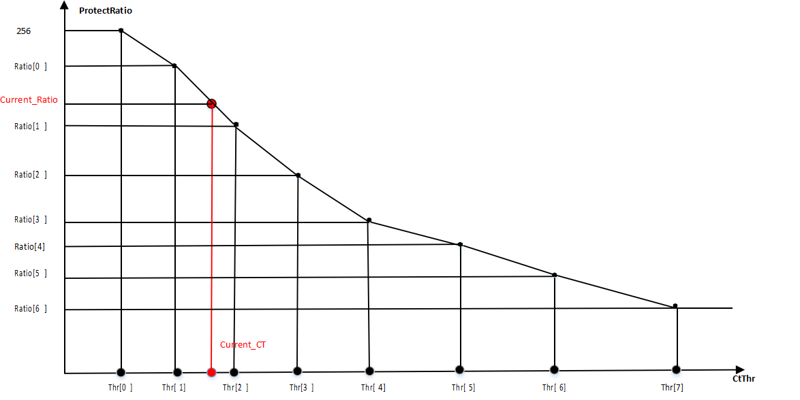

CtThr – ProtectRatio 示意图


lowCtLightPermillage-ratio 示意图


dayLightPermillage-ratio 示意图

#### 绿区控制

| 参数名 | 说明 | 建议调试 | 特殊性 |
|---|---|---|---|
| m_pRoiBoundG | 绿区 ROI 控制 | 是 |   |
| m_pRoiLumLutHighG | 绿区统计块亮度上限 | 是 |   |
| m_pRoiLumLutLowG | 绿区统计块亮度下限 | 是 |   |
| m_bGreenShiftEn | 绿区 ROI 使能 | 用户设置 |   |
| m_pGreenLumThre | 绿区不同亮度索引下的权重表 | 是 |   |
| m_nGreenShiftMax | 绿区权重上限: 与 exposure shift 相乘得到最终的 shift 权重,最大32，完全偏向 outdoor gain | 是 |   |
| m_pGreenNumThre | 绿区统计块门限, 落在绿区的统计块的数目在此区间则进入 green shift | 是 |   |
| m_pOutdoorGain | 绿区白平衡目标增益 | 是 |   |

#### AWB frameinfo

| 参数名 | 说明 | 建议调试 | 特殊性 |
|---|---|---|---|
| m_bAwbCalStatus | AWB 计算状态 |  - | 只读 |
| CurrentResult | 当前应用白平衡增益 |  - | 只读 |
| CurrentTarget | AWB 计算得到的目标白平衡增益 |  - | 只读 |
| m_nSceneLux | AWB debug 参数,当前AE计算得到的场景照度 |  - | 只读 |
| m_nValidBlkNum | 有效统计块数 |  - | 只读 |
| m_nLowCtBlkRatio | 低色温统计块占千分比 |  - | 只读 |
| m_pCtLimit | 当前 ROI 范围（X_Max,X_Min,CT_High,CT_Low） |  - | 只读 |
| m_nDayLightBlkRatio | D 光统计块占千分比 |  - | 只读 |
| m_nGreenShiftWeight | 绿区偏移权重 |  - | 只读 |
| m_pStatBlkR | R 通道统计值 |  - | 只读 |
| m_pStatBlkG | G 通道统计值 |  - | 只读 |
| m_pStatBlkB | B 通道统计值 |  - | 只读 |
| m_pBlkCtX | 统计块横坐标 X |  - | 只读 |
| m_pBlkCtY | 统计块纵坐标 Y |  - | 只读 |
| m_pBlkRoiId | 统计块所处 ROI |  - | 只读 |
| m_pBlkWeight | 统计块参与白平衡计算的权重 |  - | 只读 |
| m_pDebugBlcokData[23][31] | AWB统计块的 RGB 值 |  - | 只读 |

### C3DNRFirmwareFilter 调试说明

C3DNRFirmwareFilter（NR）模块用于 2D 与 3D 去噪。

#### NR 使能

| 参数名 | 说明 | 建议修改 | 特殊性 |
|---|---|---|---|
| m_nTnrEb | 3DNR 使能，仅用于控制 3DNR | 用户设置 |   |
| m_pTnr3dYEb | 3DNR 亮度去噪开关 | 是 | 可随 Gain/Layer 变化 |
| m_pTnr3dUVEb | 3DNR 颜色去噪开关 | 是 | 可随 Gain/Layer 变化 |
| m_pTnr2dYEb | 2DNR 亮度去噪开关 | 是 | 可随 Gain/Layer 变化 |

#### 2D NR 基础控制参数

| 参数名 | 说明 | 建议修改 | 特殊性 |
|---|---|---|---|
| m_pMax_diff_thr | 最大亮度参考门限，Dynamic 使能时有效 | 否 |   |
| m_pSig_gain | 亮度参考门限，值越小，越多区域被去噪 | 是 | 可随 Gain/Layer 变化 |
| m_pAback_alpha | 亮度噪声回加,值越大,回加的亮度噪声的越多 | 是 | 可随 Gain/Layer 变化 |
| m_pCnrSig_y | CNR 参考 Y 门限，值越大，越多区域被去噪 | 是 | 可随 Gain/Layer 变化 |
| m_pCnrSig_uv | CNR 参考 UV 门限，值越大，越多区域被去噪 | 是 | 可随 Gain/Layer 变化 |
| m_pCnrAback_alpha | 颜色噪声回加,值越大,回加的颜色噪声的越多 | 是 | 可随 Gain/Layer 变化 |
| m_pCnrSig_uv_shift | CNR 门限左移系数，（ 1 表示门限左移一位，即乘 2） | 是 | 可随 Gain/Layer 变化 |
| m_pGainIndex | 增益索引，建议保持缺省值 | 否 |   |
| m_bDynamic_en | 去噪门限自适应使能，打开时亮度去噪门限的 ratio 依据图像内容动态计算 | 否 |   |
| m_nGlobalYnrStrength | 全局亮度噪声去噪强度 | 是 | 可随 Gain/Layer 变化 |
| m_nGlobalCnrStrength | 全局颜色噪声去噪强度 | 是 | 可随 Gain/Layer 变化 |

部分参数可随 Gain/Layer 调整，以 m_pCnrSig_y 为例：

Column 表示 Gain 的档位：

- Column[0]表示 1 倍 gain
- Column[11]表示 2048 倍 gain

Row 表示不同 layer 的参数：

- Row[0]表示 layer 0 的参数
- Row[4]表示 layer 4 的参数

Layer 越高，对应处理图像越高频的区域。


#### 2D NR 亮度控制参数

| 参数名 | 说明 | 建议修改 | 特殊性 |
|---|---|---|---|
| m_bLuma_en | YNR 随亮度变化使能 | 用户设置 |   |
| m_pLuma_sig | 随亮度变化, 2D YNR 强度，level 0-16 对应亮度 0-255, 16 等分 | 是 | 可随 Gain/Luma 变化 |
| m_bCnrLuma_en | CNR 强度随亮度控制使能 | 用户设置 |   |
| m_pCnrLuma_sig | 随亮度变化, 2D CNR 强度，level 0-16 对应亮度 0-255, 16 等分 | 是 | 可随 Gain/Luma 变化 |

#### 2D NR 沿半径调节去噪强度

| 参数名 | 说明 | 建议修改 | 特殊性 |
|---|---|---|---|
| m_bRadial_en | 去噪强度沿半径调节使能: `0`: 关闭;  `1`: 使能 | 用户设置 |   |
| m_pRadial_ratio | 去噪强度随沿半径增强强度控制，值越大，边缘去噪强度越强 | 是 | 可随Gain/Layer变化 |
| m_bCnrRadial_en | 去彩噪强度沿半径调节使能: `0`: 关闭;  `1`: 使能 | 用户设置 |   |
| m_pCnrRadial_ratio | 去彩噪强度随沿半径增强强度控制，值越大，边缘去彩噪强度越强 | 是 | 可随 Gain/Layer 变化 |

#### 3D NR 运动区域检测及去噪强度控制

| 参数名 | 说明 | 建议修改 | 特殊性 |
|---|---|---|---|
| m_pTnrDAvg | 帧间亮度平均差门限，值越小，越容易判断为运动 | 是 | 可随 Gain/Layer 变化 |
| m_pTnrWAvg | 帧间亮度平均差权重，值越大，依据亮度帧间平均差检测运动的权重越大 | 是 | 可随 Gain/Layer 变化 |
| m_pTnrQWeightAvg | 帧间亮度平均差系数，值越大，越容易判断为运动 | 是 | 可随 Gain/Layer 变化 |
| m_pTnrDSad | 帧间亮度绝对差和门限，值越小，越容易判断为运动 | 是 | 可随 Gain/Layer 变化 |
| m_pTnrWSad | 帧间亮度绝对差和权重，值越大，依据帧间亮度绝对差和检测运动的权重越大 | 是 | 可随 Gain/Layer 变化 |
| m_pTnrQWeightSad | 帧间亮度绝对差和系数，值越大，越容易判断为运动 | 是 | 可随 Gain/Layer 变化 |
| m_pTnrDuv | 帧间 UV 平均差门限，值越小，越容易判断为运动 | 是 | 可随 Gain/Layer 变化 |
| m_pTnrWuv | 帧间 UV 平均差权重，值越大，依据 UV 帧间平均差检测运动的权重越大 | 是 | 可随 Gain/Layer 变化 |
| m_pTnrQWeightUV | 帧间 UV 平均差，值越大，越容易判断为运动 | 是 | 可随 Gain/Layer 变化 |
| m_nTnrLumaBase | 基准亮度差阈值，值越小，越容易判断为运动 | 否 |   |
| m_pTnrLuma | 依据亮度控制帧间亮度平均差门限，值越小，越容易判断为运动 | 是 | 可随 Gain/Layer 变化 |
| m_pTnrYStrengthQ6 | Tnr 亮度去噪全局强度，值越大，静止区域亮度去噪强度越大 | 是 | 可随 Gain/Layer 变化 |
| m_pTnrUVStrengthQ6 | Tnr 颜色去噪全局强度，值越大，静止区域颜色去噪强度越大 | 是 | 可随 Gain/Layer 变化 |
| m_pStrongSig_gain | 运动区域亮度去噪参考门限，值越小，越多区域被去噪 | 是 | 可随 Gain/Layer 变化 |
| m_pStrongAback_alpha | 运动区域亮度噪声回加，值越大，回加噪声越多 | 是 | 可随 Gain/Layer 变化 |

#### 3D NR 其他参数参数

| 参数名 | 说明 | 建议修改 | 特殊性 |
|---|---|---|---|
| m_nTnrLumaWeight | 计算 luma 的窗口大小 | 否 |   |
| m_pTnrBlockWeight0 | Layer0 计算亮度差的窗口大小 | 否 |   |
| m_pTnrBlockWeight1 | Layer1 计算亮度差的窗口大小 | 否 |   |
| m_pTnrBlockWeight234 | Layer2,3,4 计算亮度差的窗口大小 | 否 |   |
| m_pTnr2dMappingCurve | 运动区域不同亮度去噪强度融合系数，值为 256 全用 weak (静止区域) 去噪强度，值为 0 时 strong (运动区域) 权重最大 | 否 |   |
| m_p*Ratio | Reserved |   |  |

##### 彩边抑制

彩边抑制功能由过曝点和 hue_pf 区间共同控制，满足过曝点且落入 hue_pf 区间的色边将被抑制。

| 参数名 | 说明 | 建议修改 | 特殊性 |
|---|---|---|---|
| eb | 颜色检测开关，开启时对肤色和蓝天区域的去噪会加强 | 用户设置 |   |
| m_ppf_en | 紫边去除使能: `0`: 关闭;  `1`: 使能 | 用户设置 |   |
| m_nwp_en | 紫边去除过曝区域检测使能: `0`: 关闭;   `1`: 使能 | 用户设置 |   |
| m_nwp_th | 过曝像素判定门限,值越大,越少像素被判定为过曝点（见 Uv_wp_gain- num_wb 示意图） | 是 |   |
| m_nnum_wp_min | 过曝区域作用起始阈值，过曝点数目大于该阈值时，紫边去除开始起作用（见 Uv_wp_gain- num_wb 示意图） | 是 |   |
| m_nnum_wp_step | 过渡区间控制，（见 Uv_wp_gain- num_wb 示意图） | 是 |   |
| m_nhue_pf_min | 紫边 hue 区间下限（见 Uv_pf_gain- hue_pf 示意图） | 是 |   |
| m_nhue_pf_max | 紫边 hue 区间上限（见 Uv_pf_gain- hue_pf 示意图） | 是 |   |
| m_nhue_pf_tr_step | 紫边 hue 过渡区间控制，（见 Uv_pf_gain- hue_pf 示意图） | 是 |   |
| m_nuv_wp_gain | 过曝点的权重，值越大，过曝点对最终饱和度的影响越大（见 Uv_wp_gain- num_wb 示意图） | 是 | 可随 Gain 变化 |
| m_nuv_pf_gain | 紫边区间的权重，值越大，紫边区间对最终饱和度的影响越大（见 Uv_pf_gain- hue_pf 示意图） | 是 | 可随 Gain 变化 |


Uv_pf_gain – hue_pf 示意图


Uv_wb_gain – num_wp 示意图

### Raw HDR 参数说明

Raw_HDR_Soft 模块用于控制软件 HDR。

#### Raw HDR 参数

| 参数名 | 说明 | 建议调试 | 特殊性 |
|---|---|---|---|
| m_nHDRDownSampleEb | 降采样使能，输入图像宽或高大于 8225 时需打开 | 否 |   |
| m_nINTFlag | 错误处理标志位 | 否 |   |
| m_pGTMCurveSet | GTM曲线，5组对应长短曝光倍数 1,4,16,64,256 | 否 |   |

## File to File

### File to File 功能说明

平台支持硬件仿真，即 File to File(f2f)，将 VRF 文件推送到设备中，替换 sensor 图像数据，得到 ISP 处理之后的图像，适用于单帧仿真。

### File to File 使用说明

1. 通过 USB 将设备与 PC 相连；
2. 通过 ADB 将 VRF 文件 push 到指定路径，指定文件名(不同文件名对应不同 tuning 参数)；
   - 主摄

   ```
   adb push xxx.vrf vendor/etc/camera/rear_primary_sensor.vrf
   ```

   - 副摄

   ```
   adb push xxx.vrf vendor/etc/camera/rear_secondary_sensor.vrf
   ```

   - 前摄

   ```
   db push xxx.vrf vendor/etc/camera/front_sensor.vrf
   ```

3. 启动 camera，即可看到经过 ISP 处理的 VRF 预览效果，也可拍摄为 JPG；

## Tuning 参数快速验证

### Tuning 参数快速验证功能说明

1. 平台支持 tuning 参数快速验证功能，打开如下 property

   ```cpp
   adb shell setprop persist.vendor.camera.enable.settingfile 1
   ```

2. 从 Tuning Tool 中保存 tuning 参数，并通过 ADB push 到设备指定路径，指定文件名，重启相机即可生效。
   ```
   adb push xx.data /vendor/etc/camera/tuning_files/
   ```

**存放路径：**

```cpp
/vendor/etc/camera/tuning_files/
```

**常用文件名：**

```cpp
FlickerSetting.data
front_cpp_nightshot_setting.data // 前摄
front_cpp_preview_setting.data front_cpp_snapshot_setting.data front_cpp_video_setting.data front_isp_setting.data front_isp_setting_video.data front_nightshot_setting.data rawhdr_default_setting.data rear_primary_cpp_nightshot_setting.data // 主摄
rear_primary_cpp_preview_setting.data rear_primary_cpp_snapshot_setting.data rear_primary_cpp_video_setting.data rear_primary_isp_setting.data rear_primary_isp_setting_video.data rear_primary_nightshot_setting.data
rear_secondary_cpp_nightshot_setting.data // 副摄
rear_secondary_cpp_preview_setting.data rear_secondary_cpp_snapshot_setting.data rear_secondary_cpp_video_setting.data rear_secondary_isp_setting.data rear_secondary_isp_setting_video.data rear_secondary_nightshot_setting.data
```

## VRF viewer

### VRF viewer 界面

单击 VRF，启动 VRF viewer，界面如下


**menu:菜单功能区**

- **Open**：打开图像（支持格式：`*.vrf`, `*.nv12`, `*.nv21`, `*.yuv`, `*.bmp`, `*.jpg`, `*.jpeg`, `*.png`）
- **Save**：保存图像（支持格式：`*.bmp`, `*.jpg`, `*.jpeg`, `*.png`）
- **Options**：图像处理选项（单击 `Apply` 应用选项，单击 `Save` 保存当前设置）

  
- 针对 VRF 图像的处理选项：
    - `Demosaic`：去马赛克处理
    - `Linearization`：线性化处理
    - `WB`：应用 VRF 中的白平衡增益
    - `Dgain`：应用 VRF 中的数字增益
    - `Gamma`：应用 sRGB Gamma 曲线
    - `Split Channel`：分别显示 Bayer 四个通道

- 针对 YUV 图像的处理选项：
    - `色彩标准`：选择 BT601 或 BT709
    - `Swing`：设置 YUV 数据范围（全范围或标准范围）
    - `YUV`：NV12 / NV21 转换
    - `Gray Image`：显示灰度图像

**其他功能按钮**

- **ZoomIn**：图像放大
- **Normal**：显示图像原始尺寸
- **ZoomOut**：图像缩小
- **Move**：拖动图像查看不同区域
- **Select**：框选图像区域
- **Histogram**：查看图像亮度和颜色直方图
- **Info**：显示 VRF 图像的元信息（如格式、分辨率、增益等）
- **Window**：切换已打开的图像窗口
- **Previous**：显示前一张图像
- **Next**：显示后一张图像
