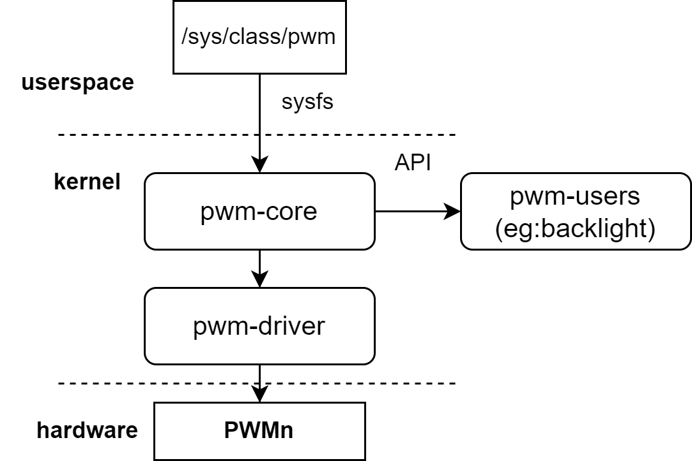

# PWM

介绍PWM的配置和调试方式

## 模块介绍  

**PWM控制器**是一种通过改变电脉冲宽度来控制输出信号的电子元件。  

### 功能介绍  

 

内核通过 **PWM框架层接口** 使其他模块可以申请PWM控制器，并控制PWM信号的输出高低。
如：**内核的风扇调速和背光亮度**都可以用PWM来控制。  

### 源码结构介绍

PWM控制器驱动代码在 `drivers/pwm` 目录下：  

```
drivers/pwm  
|--core.c            #内核pwm框架接口代码
|--pwm-sysfs.c       #内核pwm框架注册到sysfs代码
|--pwm-pxa.c         #k1 pwm驱动  
```  

## 关键特性  

- 可生成 **200Hz** 到 **6.4MHz** 的PWM信号 
- K1平台支持 **20路** 可配置的PWM 

## 配置介绍

主要包括 **驱动使能配置** 和 **dts配置**

### CONFIG配置

**CONFIG_PWM**
此为内核平台PWM框架提供支持，支持K1 PWM驱动情况下，应为 **Y**

```
Symbol: PWM [=y]
Device Drivers
      -> Pulse-Width Modulation (PWM) Support (PWM [=y])
```

在支持平台层PWM框架后，配置 **CONFIG_PWM_PXA** 为 **Y**，支持 K1 PWM驱动

```
Symbol: PWM_PXA [=y]
      ->PXA PWM support (PWM_PXA [=y])
```

### dts配置

由于20路PWM的使用方法和配置方法类似，这里以 **pwm0** 为例

#### pinctrl

可查看linux仓库的`arch/riscv/boot/dts/spacemit/k1-x_pinctrl.dtsi`，参考已配置好的PWM节点配置，如下：

```dts
      pinctrl_pwm0_1: pwm0_1_grp {
         pinctrl-single,pins =<
            K1X_PADCONF(GPIO_14, MUX_MODE3, (EDGE_NONE | PULL_UP | PAD_1V8_DS2))    /* pwm0 */
         >;
      };
```

#### dtsi配置示例

dtsi中配置PWM控制器基地址和时钟复位资源，正常情况无需改动

```dts
pwm0: pwm@d401a000 {
       compatible = "spacemit,k1x-pwm";
       reg = <0x0 0xd401a000 0x0 0x10>;
       #pwm-cells = <1>;
       clocks = <&ccu CLK_PWM0>;
       resets = <&reset RESET_PWM0>;
       k1x,pwm-disable-fd;
       status = "disabled";
};
```

#### dts配置示例

dts完整配置，如下所示

```dts
 &pwm0 {
     pinctrl-names = "default";
     pinctrl-0 = <&pinctrl_pwm0_1>;
     status = "okay";
 };
```

## 接口介绍

### API介绍

linux内核实现了其他设备或框架如背光，led灯，背光等对PWM的引用和调节。
常用：

```
struct pwm_device *devm_pwm_get(struct device *dev, const char *con_id)
# 该接口实现了从pwm框架中获取pwm资源
int pwm_apply_state(struct pwm_device *pwm, const struct pwm_state *state)
# 该接口实现了对pwm状态的设置
```

## Debug介绍

PWM通过sysfs提供给用户层一个非编程的使用方法，可以依据上述PWM对应pin外接可调速风扇进行测试，过程如下
以下基于 **Buildroot 系统** 验证

```sh
# cd /sys/class/pwm/
# ls # 每个节点代表一组pwm
pwmchip0  pwmchip1  pwmchip2  pwmchip3  pwmchip4  pwmchip5  pwmchip6

# echo 0 > pwmchip0/export
# ls pwmchip0/pwm0/
capture     enable      polarity    uevent
duty_cycle  period      power

# 设置PWM一个周期的时间，单位为ns，即一个周期为1KHZ
# echo 1000000 > pwmchip0/pwm0/period 

# 设置PWM占空比
# echo 500000 > pwmchip0/pwm0/duty_cycle 

# 使能PWM
# echo 1 > pwmchip0/pwm0/enable 

# 调节占空比，此时风扇转速降低
# echo 50000 > pwmchip0/pwm0/duty_cycle 

# 关闭PWM
# echo 0 > pwmchip0/pwm0/enable 
```

>**注意**: sysfs里可用的pwmchipx均为没有使用的PWM，若内核驱动中已将该PWM通过类似pwm_get的接口申请，则该PWM无法通过sysfs配置  

## 测试介绍

PWM输出的信号 **电平高低** 可以通过控制**占空比** 来调节。  
实际测试可使用sysfs下的PWM节点和可调速的PWM风扇进行测试。

## FAQ
