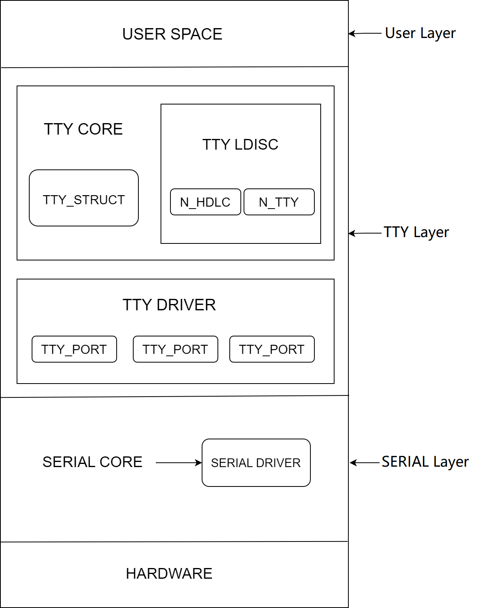

# UART

介绍UART的配置和调试方式

## 模块介绍  

UART 是一种通用串行数据总线，用于异步通信。该总线双向通信，可以实现全双工传输和接收。

### 功能介绍  


内核通过UART实现控制台，同时某些外设如蓝牙可通过UART与主控进行通信。
K1平台支持 **9路** uart设备可根据需要配置开启UART后连接外设使用

### 源码结构介绍

UART控制器驱动代码在 `drivers/tty/serial` 目录下：  

```  
drivers/tty/serial  
|--serial_core.c        #内核UART框架接口代码
|--pxa_k1x.c        #k1 UART驱动 
```  

## 关键特性  

### 特性

- 支持硬件流控(uart2，uart3) 
- 支持DMA传输模式 
- 支持中断模式 
- 支持RS485/RS232串口协议 
- 支持64B RX/TX fifo 
- 支持9路可配置的UART

### 性能参数

- 波特率最高支持3M

## 配置介绍

主要包括驱动使能配置和 dts 配置

### CONFIG配置

CONFIG_SERIAL_PXA_SPACEMIT_K1X=y 


```
Symbol: SERIAL_PXA_SPACEMIT_K1X [=y]
Device Drivers
    -> Character devices
  -> Serial drivers
   -> PXA serial driver (<choice> [=y])
    -> Spacemit PXA driver suppor (SERIAL_PXA_SPACEMIT_K1X [=y])
```

### dts配置

由于9路UART的使用方法和配置方法类似，这里以uart2为例

#### pinctrl

可查看 linux 仓库的`arch/riscv/boot/dts/spacemit/k1-x_pinctrl.dtsi`，参考已配置好的UART节点配置，如下：

```dts
 pinctrl_uart2: uart2_grp {
  pinctrl-single,pins =<
   K1X_PADCONF(GPIO_21, MUX_MODE1, (EDGE_NONE | PULL_UP | PAD_1V8_DS2))    /* uart2_txd */
   K1X_PADCONF(GPIO_22, MUX_MODE1, (EDGE_NONE | PULL_UP | PAD_1V8_DS2))    /* uart2_rxd */
   K1X_PADCONF(GPIO_23, MUX_MODE1, (EDGE_NONE | PULL_UP | PAD_1V8_DS2))    /* uart2_cts_n */
   K1X_PADCONF(GPIO_24, MUX_MODE1, (EDGE_NONE | PULL_UP | PAD_1V8_DS2))    /* uart2_rts_n */
  >;
 };
```

#### dtsi配置示例

dtsi 中配置 UART 控制器基地址和时钟复位资源，正常情况无需改动

```dts
 uart2: uart@d4017100 {
          compatible = "spacemit,pxa-uart";
          reg = <0x0 0xd4017100 0x0 0x100>;
          interrupt-parent = <&intc>;
          interrupts = <44>;
          clocks = <&ccu CLK_UART2>, <&ccu CLK_SLOW_UART>;
          clock-names = "func", "gate";
          clk-fpga = <14750000>;
          resets = <&reset RESET_UART2>;
          /*dmas = <&pdma0 DMA_UART2_RX 1
            &pdma0 DMA_UART2_TX 1>;
          dma-names = "rx", "tx";*/
          power-domains = <&power K1X_PMU_BUS_PWR_DOMAIN>;
          clk,pm-runtime,no-sleep;
          cpuidle,pm-runtime,sleep;
          interconnects = <&dram_range4>;
          interconnect-names = "dma-mem";
          status = "disabled";
 }
```

#### dts配置示例

dts完整配置，如下所示

```dts
 &uart2 {
  pinctrl-names = "default";
  pinctrl-0 = <&pinctrl_uart2>;
  status = "okay";
 };
```

## 接口介绍

### API介绍

K1 UART驱动实现了发送数据，设置传输模式，设置奇偶校验位等接口并注册进UART框架
常用：

```
static void serial_pxa_start_tx(struct uart_port *port)
该接口实现了开启uart传输(中断模式)
static void serial_pxa_set_mctrl(struct uart_port *port, unsigned int mctrl)
该接口实现了设置uart传输模式
static void serial_pxa_set_termios(struct uart_port *port, struct ktermios *termios,
                           const struct ktermios *old)
该接口实现了设置uart停止位奇偶校验位等属性的功能
```

## 测试介绍

UART测试可通过tx连接本设备rx信号以loopback模式完成测试

```
程序实现思路：
1. 以uart3为例，dts配置uart3打开后，首先确认/dev/ttyS2是否存在，存在即uart3加载成功
2. 打开ttyS3节点，设置波特率，设置停止位奇偶校验位等属性
3. 发送数据，数据从txfifo通过外部loopback搬运到rxfifo中来，读取ttyS3收到的信息，与发送数据比对，一致则认为uart功能正常
```

## FAQ
