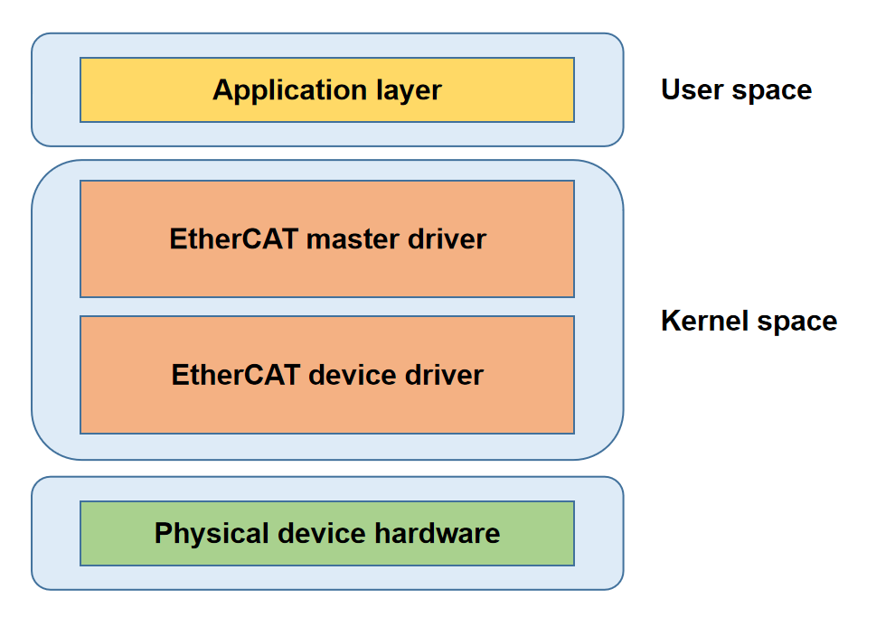

# EtherCAT

介绍 EtherCAT 主站功能和使用方法。

## 模块介绍

IGH EtherCAT 主站是一个用于高性能实时通信的内核模块，支持从站扫描、配置管理、分布式时钟同步等功能，能够高效调度和管理多个从站设备，广泛应用于工业自动化等对实时性与可靠性要求较高的应用场景。

### 功能介绍

  

EtherCAT主站架构如上图所示，由四个部分构成：  
- **应用层：** 用户应用程序，负责实现工业控制逻辑，通过接口与 EtherCAT 主站驱动交互。  
- **EtherCAT 主站驱动层：** 实现核心协议、监测总线拓扑、自动配置从站、同步分布式时钟。  
- **EtherCAT 设备驱动层：** 由实时网卡驱动构成，负责 EtherCAT 数据帧收发。  
- **物理层：** 网络硬件设备。

### 源码结构介绍

EtherCAT 主站驱动代码位于 `drivers/net/ethercat` 目录下：  

```c
# 代码中出现大量配对的xxx.h + xxx.c文件，前者负责数据结构和接口定义，后者负责实现

├── device                     # EtherCAT device driver
│   ├── ecdev.h                
│   ├── ec_generic.c           # 通用网络设备驱动
│   ├── ec_k1x_emac.c          # 针对 K1 以太网控制器的实时网卡驱动
│   ├── ec_k1x_emac.h          
│   ├── Kconfig               
│   └── Makefile
├── include                   
│   ├── config.h               # 全局配置项和宏定义
│   ├── ecrt.h                 # 用户程序接口
│   ├── ectty.h                
│   └── globals.h              # 全局变量
├── Kconfig                  
├── Makefile                  
└── master                
    ├── cdev.c                 # 提供EtherCAT字符设备初始化接口
    ├── cdev.h                 
    ├── coe_emerg_ring.c       # 提供处理 CoE 紧急消息接口
    ├── coe_emerg_ring.h       
    ├── datagram.c             # 提供构造 ECAT 数据报接口
    ├── datagram.h             
    ├── datagram_pair.c        # 提供构造 ECAT 数据报对的接口
    ├── datagram_pair.h        
    ├── debug.c                # 提供调试接口
    ├── debug.h                
    ├── device.c               # 提供网卡设备抽象及管理设备的接口
    ├── device.h               
    ├── domain.c               # 提供 EtherCAT domain 相关接口
    ├── domain.h               
    ├── doxygen.c
    ├── eoe_request.c
    ├── eoe_request.h          
    ├── ethernet.c             # 实现EOE功能的核心文件
    ├── ethernet.h             
    ├── flag.c
    ├── flag.h                 
    ├── fmmu_config.c          # 提供构造 FMMU 配置报文接口
    ├── fmmu_config.h          
    ├── foe.h                  
    ├── foe_request.c          # FoE 请求处理接口
    ├── foe_request.h          
    ├── fsm_change.c           # 状态切换状态机实现
    ├── fsm_change.h           
    ├── fsm_coe.c              # CoE 协议状态机实现
    ├── fsm_coe.h              
    ├── fsm_eoe.c              # EoE 协议状态机实现
    ├── fsm_eoe.h              
    ├── fsm_foe.c              # FoE 协议状态机实现
    ├── fsm_foe.h              
    ├── fsm_master.c           # 主状态机实现
    ├── fsm_master.h           
    ├── fsm_pdo.c              # PDO 读写状态机实现
    ├── fsm_pdo_entry.c        # PDO 条目读写状态机实现
    ├── fsm_pdo_entry.h        
    ├── fsm_pdo.h              
    ├── fsm_sii.c              # 从站信息接口读写状态机实现
    ├── fsm_sii.h              
    ├── fsm_slave.c            # 从状态机实现
    ├── fsm_slave_config.c     # 从站配置状态机实现
    ├── fsm_slave_config.h     
    ├── fsm_slave.h            
    ├── fsm_slave_scan.c       # 从站扫描状态机实现
    ├── fsm_slave_scan.h       
    ├── fsm_soe.c              # SoE（Servo over EtherCAT）状态机实现
    ├── fsm_soe.h              
    ├── globals.h              
    ├── ioctl.c                # 提供 IOCTL 接口以支持用户态交互
    ├── ioctl.h               
    ├── Kconfig                
    ├── mailbox.c              # ECAT 邮箱报文接口
    ├── mailbox.h              
    ├── Makefile               
    ├── master.c               # 主站模块核心逻辑
    ├── master.h               
    ├── module.c               # 主站模块的初始化和清理
    ├── pdo.c                  # PDO 管理接口
    ├── pdo_entry.c            # PDO 条目管理接口
    ├── pdo_entry.h            
    ├── pdo.h                  
    ├── pdo_list.c             # PDO 链表管理接口
    ├── pdo_list.h             
    ├── reg_request.c          # 从站寄存器读写请求接口 
    ├── reg_request.h          
    ├── rtdm.c                 # RTDM 支持
    ├── rtdm_details.h         
    ├── rtdm.h                 
    ├── rtdm-ioctl.c           # RTDM IOCTL 接口实现
    ├── rtdm_xenomai_v3.c      # 支持 Xenomai v3 实时框架的接口
    ├── rt_locks.h             # 实时锁实现
    ├── sdo.c                  # SDO 管理
    ├── sdo_entry.c            # SDO 条目管理
    ├── sdo_entry.h            
    ├── sdo.h                  
    ├── sdo_request.c          # SDO 请求
    ├── sdo_request.h          
    ├── slave.c                # 从站状态管理逻辑
    ├── slave_config.c         # 提供从站配置接口
    ├── slave_config.h         
    ├── slave.h                
    ├── soe_errors.c           # 定义 SoE 协议错误码
    ├── soe_request.c          # SoE 请求相关接口
    ├── soe_request.h          
    ├── sync.c                 # 同步管理器相关接口
    ├── sync_config.c          # 配置同步管理器接口
    ├── sync_config.h          
    ├── sync.h                 
    ├── voe_handler.c          # VOE（Vendor-specific over EtherCAT）请求
    └── voe_handler.h          
```

## 关键特性

| 特性 | 特性说明 |
| :-----| :----|
| 自动从站配置 | 支持自动扫描并配置连接的从站设备，简化网络配置 |
| 分布式时钟同步 | 实现小于 1 µs 精度的分布式时钟（DC）同步 |
| 多协议支持 | 支持 CoE、SoE、FoE 等协议 |
| 高实时性能 | 支持 1ms DC 周期，满足大部分工业应用的实时性要求 |
| 多主站组合 | 支持配置多个主站，每个主站可管理两个网络设备：主设备和备用设备 |

## 配置介绍

主要包括 **驱动使能配置** 和 **DTS 配置**

### CONFIG 配置

- `ETHERCAT`：如果要启用 EtherCAT 服务，首先将此选项配置为 `Y`

```c
menuconfig ETHERCAT
        bool "Ethercat native network driver support"
        depends on NET
        default y
        help
          This section contains all the Ethercat drivers.
```

- `EC_MASTER`：启用 Master 驱动

```c
config EC_MASTER
        tristate "Ethercat master driver support"
        depends on ETHERCAT
        default n
        help
          Ethercat master driver support.

```

- `EC_GENERIC`：启用通用网卡驱动; `EC_K1X_EMAC`：启用实时网卡驱动  

```c
config EC_GENERIC
        tristate "Ethercat generic device driver support"
        depends on ETHERCAT
        default n
        help
          generic native ethercat device driver support.

config EC_K1X_EMAC
        tristate "k1x native thercat device driver support"
        depends on ETHERCAT
        default n
        help
          Ethercat generic device driver support.

```

> **注：** 建议启用 `EC_K1X_EMAC` 实时网卡驱动，能获得更好的性能表现。

### DTS 配置

DTS 中可供配置的选项有：  

1. `run-on-cpu`：可绑定的 CUP 选项有 1、2、3、4、5、6、7  
2. `debug-level`：支持的 debug-level 有 0、1、2  
3. `master-count`：最多支持 32 个主站
4. `ec-devices`： 用于 ethercat 的网络设备
5. `master-indexes`：ethercat 设备绑定的主站号，master-indexes 取值范围是 0 ~ master-count-1  
6. `modes`：ethercat 设备工作模式，支持 `ec_main` 和 `ec_backup` 两种选项

目前支持以下三种配置模式：  
1. 配置两个主站，例如将 eth0 和 eth1 分别绑定主站 0 和主站 1

```c
ec_master: ethercat_master {
        compatible = "igh,k1x-ec-master";
        run-on-cpu = <1>;         
        debug-level = <0>;
        master-count = <2>;   
        ec-devices = <&eth0>,<&eth1>;
        master-indexes = <0>,<1>;
        modes = "ec_main";
        status = "okay";
};

eth0: ethernet@cac80000 {
        compatible = "spacemit,k1x-ec-emac";
        ...

};

eth1: ethernet@cac81000 {
        compatible = "spacemit,k1x-ec-emac";
        ...

};
```

2. 配置一个主站、一张网卡用于 EtherCAT、一张网卡用于以太网，如 eth0 用于 EtherCAT

```c
ec_master: ethercat_master {
        compatible = "igh,k1x-ec-master";
        run-on-cpu = <1>;         
        debug-level = <0>;
        master-count = <1>;   
        ec-devices = <&eth0>;
        master-indexes = <0>;
        modes = "ec_main";
        status = "okay";
};

# 这里将eth0用于ethercat
eth0: ethernet@cac80000 {
        compatible = "spacemit,k1x-ec-emac";
        ...

};
```

3. 配置一个主站、绑定两张网卡。如 eth0 用于主设备、eth1 用作备份设备

```c
ec_master: ethercat_master {
        compatible = "igh,k1x-ec-master";
        run-on-cpu = <1>;         
        debug-level = <0>;
        master-count = <1>;   
        ec-devices = <&eth0>,<&eth1>;
        master-indexes = <0>,<0>;
        modes = "ec_main","ec_backup";
        status = "okay";
};

# 这里将eth0用于ethercat
eth0: ethernet@cac80000 {
        compatible = "spacemit,k1x-ec-emac";
        ...

};

eth1: ethernet@cac81000 {
        compatible = "spacemit,k1x-ec-emac";
        ...

};
```

## 接口介绍

### API 介绍

- 请求主站实例

```c
ec_master_t *ecrt_request_master(unsigned int master_id);
```

- 创建过程数据域

```c
ec_domain_t *ecrt_master_create_domain(ec_master_t *master);
```

- 激活主站

```c
int ecrt_master_activate(ec_master_t *master);
```

- 同步主站参考时钟

```c
int ecrt_master_sync_reference_clock_to(ec_master_t *master, uint64_t ref_time);
```

- 同步所有从站时钟

```c
void ecrt_master_sync_slave_clocks(ec_master_t *master);
```

- 配置从站

```c
ec_slave_config_t *ecrt_master_slave_config(ec_master_t *master, uint16_t alias, uint16_t position, uint32_t vendor_id, uint32_t product_code);

```

- 配置从站 PDO 映射

```c
int ecrt_slave_config_pdos(ec_slave_config_t *sc, uint16_t sync_index, const ec_sync_info_t *syncs);
```

- 注册 PDO 条目到指定数据域

```c
int ecrt_slave_config_reg_pdo_entry(ec_slave_config_t *sc, uint16_t index, uint8_t subindex， ec_domain_t *domain, unsigned int *offset);

```

- 为从站配置分布式时钟

```c
int ecrt_slave_config_dc(ec_slave_config_t *sc, uint16_t assign_activate, uint32_t sync0_cycle_time, int32_t sync0_shift, uint32_t sync1_cycle_time, int32_t sync1_shift);
```

## Debug 介绍

### sysfs

可通过 `/sys/class/EtherCAT/EtherCAT0` 查看主站信息：

```c
/sys/class/EtherCAT/EtherCAT0
.
|-- dev
|-- power
|   |-- autosuspend_delay_ms
|   |-- control
|   |-- runtime_active_time
|   |-- runtime_status
|   `-- runtime_suspended_time
|-- subsystem -> ../../../../class/EtherCAT
`-- uevent

```

- dev：提供主站设备号信息
- power：管理设备的电源状态
- subsystem：子系统链接，表明设备属于 EtherCAT 子系统
- uevent：主站设备号与设备名

## 测试介绍

EtherCAT 主站测试步骤：
1. 连接从站设备 至主站网口。
2. 上电启动系统，内核自动加载 EtherCAT 主站驱动。
3. 主站自动扫描从站，识别成功后输出日志。
4. 主站进入 `PREOP` 状态，等待用户应用程序下发控制命令。

启动日志示例如下：

```c
[  966.525910] k1x_ec_emac cac80000.ethernet ecm0 (uninitialized): Link is Up - 100Mbps/Full - flow control off
[  966.535906] EtherCAT 0: Link state of ecm0 changed to UP.
[  966.552545] EtherCAT 0: 1 slave(s) responding on main device.
[  966.558389] EtherCAT 0: Slave states on main device: INIT.
[  966.564036] EtherCAT 0: Scanning bus.
[  966.739197] EtherCAT 0: Bus scanning completed in 176 ms.
[  966.745275] EtherCAT 0: Using slave 0 as DC reference clock.
[  966.756564] EtherCAT 0: Slave states on main device: PREOP.

```

测试可使用 [EtherLab 官方示例](https://gitlab.com/etherlab.org/ethercat) 中的 `examples/dc_user/main.c`，在 1ms DC 通讯周期下，连接 2 个从站运行测试。
以下为示例输出：

```c
period         995099 ...    1004890
exec            14500 ...     106835
latency          7227 ...      13169
period         994556 ...    1005557
exec            14625 ...     105543
latency          7409 ...      13805
period         995306 ...    1004974
exec            14458 ...     105127
latency          7269 ...      13205
period         995390 ...    1004807
exec            14583 ...     137586
latency          7284 ...      13893
period         995265 ...    1005516
exec            14792 ...     108710
latency          7460 ...      13658
period         995598 ...    1004557
exec            14458 ...     112502
latency          7299 ...      12821
period         994807 ...    1005056
exec            14459 ...     105085
latency          7428 ...      13340
period         995390 ...    1005016
exec            14792 ...     110502
latency          7230 ...      13237
period         994432 ...    1007265
exec            14959 ...     110668
latency          7199 ...      15479
period         994848 ...    1004682
exec            14709 ...     113544
latency          7630 ...      13930
```

**注：**  
- `period`：给出的数值是每秒内通讯周期波动范围  
- `exec`：给出的数值是每秒内主站周期任务执行时间波动范围  
- `latency`：给出的数值是每秒内主站唤醒误差波动范围

## FAQ
