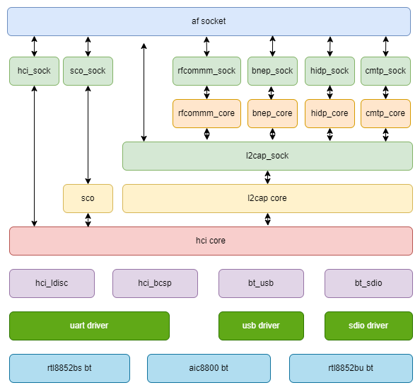

# BT

介绍 BT 的移植和使用方法。

## 模块介绍

K1 平台主要通过外部 BT (Bluetooth) 模块（UART/USB 接口）实现无线通信功能。

### 功能介绍

BT 框架图可以分为以下几个层次：



### 源码结构介绍

BT 相关的源码可以分为以下几个部分：

1. **蓝牙协议栈：** 以 BlueZ 协议栈为例，代码分为两部分：**内核空间** 和 **用户空间**。
2. **BT HCI 驱动：** 主要实现 HCI 层。
3. **平台支持：** 主要实现 **模组供电** 以及 **使能等相关接口**，供 RFKILL 驱动调用。
4. **接口驱动：** 主要实现 **BT 数据传输接口功能** ，如UART，USB等接口。

- **BlueZ 协议栈源码** 在以下目录：

```
drivers/net/bluetooth
|-- af_bluetooth.c
|-- af_bluetooth.o
|-- bnep                #Bluetooth网络封装协议
│   |-- bnep.h
│   |-- core.c
│   |-- Kconfig
│   |-- Makefile
│   |-- netdev.c
│   |-- sock.c
|-- hci_codec.c
|-- hci_codec.h
|-- hci_conn.c
|-- hci_core.c          #Hci core实现
|-- hci_debugfs.c
|-- hci_debugfs.h
|-- hci_event.c
|-- hci_request.c
|-- hci_request.h
|-- hci_sock.c
|-- hci_sync.c
|-- hci_sysfs.c
|-- hidp                #Bluetooth hid实现
│   |-- core.c
│   |-- hidp.h
│   |-- Kconfig
│   |-- Makefile
│   |-- sock.c
|-- iso.c
|-- Kconfig
|-- l2cap_core.c        #l2cap core实现
|-- l2cap_sock.c
|-- lib.c
|-- Makefile
|-- mgmt.c              #mgmt蓝牙管理实现
|-- mgmt_config.c
|-- mgmt_config.h
|-- mgmt_util.c
|-- mgmt_util.h
|-- rfcomm              #rfcomm协议
│   |-- core.c
│   |-- Kconfig
│   |-- Makefile
│   |-- sock.c
│   |-- tty.c
|-- sco.c
|-- selftest.c
|-- selftest.h
|-- smp.c
|-- smp.h
```

- **HCI 驱动的源码** 在以下目录：

```
drivers/bluetooth
|-- btbcm.c             #broadcom厂商实现
|-- btrtl.c             #realtek厂商实现
|-- btusb.c             #hci uart实现
|-- hci_h4.c            #hci h4实现
|-- hci_h5.c            #hci h5实现
|-- hci_ldisc.c         #蓝牙hci的线路规程

```

- **平台相关的源码**：

```
drivers/soc/spacemit/spacemit-rf
|-- spacemit-pwrseq.c   #WIFI 和蓝牙等公共部分实现
|-- spacemit-wlan.c     #WIFI 供电，gpio以及时钟相关接口实现
|-- spacemit-bt.c       #BT 供电，gpio以及时钟相关接口实现
```

- **接口相关的源码** 参考各个接口驱动说明文档。

## 关键特性

### 平台 UART 接口特性

| 特性 | 特性说明 |
| :-----| :----|
| 支持 4 线流控 | 最高支持 3.6Mbps |
| 支持 DMA | 支持 DMA 传输模式 |

### 模组性能规格

| 模组型号 | 规格 |
| :-----| :----|
| rtl8852bs | 支持 Bluetooth 5.2 |
|             | 支持 Bluetooth 2.0 UART HCI H4/H5 |
| aic8800d80 | 支持 Bluetooth 5.3 |
|             | 支持 Bluetooth 2.0 UART HCI H4 |

## 配置介绍

主要包括 **驱动使能配置** 和 **DTS 配置**

### CONFIG 配置

- **协议栈配置**

```
Networking support (NET [=y])
        Bluetooth subsystem support (BT [=y])
                Bluetooth Classic (BR/EDR) features (BT_BREDR [=y])
                        RFCOMM protocol support (BT_RFCOMM [=y])
                                RFCOMM TTY support (BT_RFCOMM_TTY [=y])
                        BNEP protocol support (BT_BNEP [=y])
                        HIDP protocol support (BT_HIDP [=y])
                Bluetooth Low Energy (LE) features (BT_LE [=y])
        Export Bluetooth internals in debugfs (BT_DEBUGFS [=y])
```

- **UART HCI 配置**

```
Networking support (NET [=y])
        Bluetooth subsystem support (BT [=y])
                Bluetooth device drivers
                        HCI UART driver (BT_HCIUART [=y])
                                UART (H4) protocol support (BT_HCIUART_H4 [=y])
                        Three-wire UART (H5) protocol support (BT_HCIUART_3WIRE [=y])
                        Realtek protocol support (BT_HCIUART_RTL [=y]) 
```

默认支持 H4 和 H5，其中 Realtek BT 串口使用 H5 协议。

- **USB HCI 配置**

```
Networking support (NET [=y])
        Bluetooth subsystem support (BT [=y])
                Bluetooth device drivers
                        HCI USB driver (BT_HCIBTUSB [=m])
                                Broadcom protocol support (BT_HCIBTUSB_BCM [=y])
                                Realtek protocol support (BT_HCIBTUSB_RTL [=y])  
```

BT_HCIBTUSB_BCM和BT_HCIBTUSB_RTL分别对应Broadcom和Realtek的支持。

- **AVRCP 配置**

```
Device Drivers
        Input device support
                Generic input layer (needed for keyboard, mouse, ...) (INPUT [=y])
                        Miscellaneous devices (INPUT_MISC [=y])
                                User level driver support (INPUT_UINPUT [=y])
```

如果要把 AVRCP 的按键值等信息通过 input device 送给用户态程序，则需要打开 `INPUT_UINPUT`。

- **HOGP 配置**

```
Device Drivers
        HID bus support (HID_SUPPORT [=y])
                HID bus core support (HID[=y])
                        User-space I/O driver support for HID subsystem (UHID [=y]) 
```

如果要把 HOGP 的 `KEY_1`, `KEY_2`, `KEY_ESC` 等按键值通过 input device 送给用户态程序，则需要打开 `UHID` 。

- **平台 RFKILL 配置**

```
Device Drivers
        SOC (System On Chip) specific Drivers
                Spacemit rfkill driver (SPACEMIT_RFKILL [=y])
```

CONFIG_SPACEMIT_RFKILL 为BT模组提供平台相关支持，默认情况，此选项为Y

### DTS 配置

#### UART 配置

通常使用 `uart2` 连接蓝牙，设备节点为 `/dev/ttyS1`：

```
&uart2 {
        pinctrl-names = "default";
        pinctrl-0 = <&pinctrl_uart2>;
        status = "okay";
};
```

#### UART2 pinctrl 配置

蓝牙 pinctl 配置以实际硬件为准，**默认开启流控**。

```
pinctrl_uart2: uart2_grp {
        pinctrl-single,pins =<
                K1X_PADCONF(GPIO_21, MUX_MODE1, (EDGE_NONE | PULL_UP | PAD_1V8_DS2)) /* uart2_txd */
                K1X_PADCONF(GPIO_22, MUX_MODE1, (EDGE_NONE | PULL_UP | PAD_1V8_DS2)) /* uart2_rxd */
                K1X_PADCONF(GPIO_23, MUX_MODE1, (EDGE_NONE | PULL_UP | PAD_1V8_DS2)) /* uart2_cts_n */
                K1X_PADCONF(GPIO_24, MUX_MODE1, (EDGE_NONE | PULL_UP | PAD_1V8_DS2)) /* uart2_rts_n */
        >;
};
```

#### 平台部分 DTS 配置

平台完整方案配置如下：

```
rf_pwrseq: rf-pwrseq {
        compatible = "spacemit,rf-pwrseq";
        //vdd-supply = <&ldo_7>;
        //vdd_voltage = <3300000>;
        io-supply = <&dcdc_3>;
        io_voltage = <1800000>;
        pwr-gpios  = <&gpio 67 0>;
        status = "okay";

        wlan_pwrseq: wlan-pwrseq {
                compatible = "spacemit,wlan-pwrseq";
                regon-gpios = <&gpio 116 0>;
                interrupt-parent = <&pinctrl>;
                interrupts = <268>;
                pinctrl-names = "default";
                pinctrl-0 = <&pinctrl_wlan_wakeup>;
        };

        bt_pwrseq: bt-pwrseq {
                compatible = "spacemit,bt-pwrseq";
                reset-gpios     = <&gpio 63 0>;
        };
};
```

- rf_pwrseq：
  - `vdd-supply` 是配置模组的供电，具体按实际硬件配置。
  - `vdd_voltage` 用于设定模组供电的电压。
  - `io-supply` 是配置模组 IO 的供电，具体按实际硬件配置。
  - `io_voltage` 用于设定模组 IO 供电的电压。
  - `pwr-gpios` 是模组使能脚，配置后会默认拉高，支持多个 GPIO 的配置。
  - `clock` 是模组共用的时钟配置。
  - `power-on-delay-ms` 是设置模组上电后的延时，默认是 100ms。

- bt_pwrseq：
  - `reset-gpios` 是蓝牙的使能脚，使能蓝牙对应的rfkill时会将该gpio拉高。
  - `clock` 是蓝牙的时钟配置。
  - `power-on-delay-ms` 是设置蓝牙上电后的延时，默认是10ms。

目前市面上很多模组都是 **Wi-Fi 和蓝牙二合一**，Wi-Fi 和蓝牙的供电部分很多是共用的。针对这种情况，建议按照以下方式进行 DTS 配置：

- **共用部分**（同时影响 Wi-Fi 和蓝牙）建议放到 `rf_pwrseq` 中进行配置。
- **仅影响蓝牙** 的部分，放到 `bt_pwrseq` 中进行配置。

如果是**仅蓝牙模组**，只需要配置 `bt_pwrseq`，不需要配置 `rf_pwrseq`，但仍需**使能 `rf_pwrseq` 节点**。

**电源控制逻辑说明**

- 在打开蓝牙电源时：
  - 系统会先使能共用部分的电源（即 `rf_pwrseq`）和相关 GPIO 状态。
  - 平台内部会维护引用计数。
- 在关闭蓝牙电源时：只有当 **Wi-Fi 和蓝牙都关闭** 后，才会真正关闭共用部分的电源及 GPIO 状态。

## 接口介绍

### UART hciattach

**hciattach** 是 BlueZ 为 UART 接口蓝牙控制器提供的初始化工具，对于 USB 接口的蓝牙直接忽略此部分。

- Realtek Bluetooth UART
进入 `rtk_hciattach/` 目录，生成可执行文件 `rtk_hciattach`，然后运行：

   ```
   rtk_hciattach -n -s 115200 ttyS1 rtk_h5 &
   ```

- AIC8800 Bluetooth UART
使用 `hciattach` 如下, 进行初始化

   ```
   hciattach -s 1500000 /dev/ttyS1 any 1500000 flow nosleep
   ```

### API 介绍

平台部分将 **BT 上下电** 封装在 `rfkill` 子系统中，可以直接通过 `rfkill` 操作蓝牙的供电。

```
# rfkill list
0: spacemit-bt: Bluetooth
        Soft blocked: no
        Hard blocked: no
1: phy0: Wireless LAN
        Soft blocked: no
        Hard blocked: no
2: hci0: Bluetooth
        Soft blocked: no
        Hard blocked: no

# rfkill block blutooth
# rfkill list
0: spacemit-bt: Bluetooth
        Soft blocked: yes
        Hard blocked: no
1: phy0: Wireless LAN
        Soft blocked: no
        Hard blocked: no
2: hci0: Bluetooth
        Soft blocked: yes
        Hard blocked: no
```

其中：

- `spacemit-bt` 是 平台注册的 rfkill 蓝牙设备。
- `hci0` 是 蓝牙协议栈注册的 rfkill 设备

平台初始化时只需要主动打开 `spacemit-bt` 对应的蓝牙设备即可：

```
cat /sys/class/rfkill/rfkill0/type
bluetooth
cat /sys/class/rfkill/rfkill0/name
spacemit-bt
echo 1 > /sys/class/rfkill/rfkill0/state
```

操作 `rfkill` 时需要确认 `type` 和 `name` 是否为 **spacemit-bt 的蓝牙设备**。

## Debug 介绍

### sysfs

在 `sysfs` 下可以查询 `rfkill` 的状态信息：

```
cat /sys/class/rfkill/rfkill0/state
1
```

sysfs 也可以查询对应 UART 的信息。

```
/sys/devices/platform/soc/d4017100.uart
```

### debugfs

在 `debugfs` 下可以查询蓝牙协议栈相关组件的信息

```
/sys/kernel/debug/bluetooth# ls
hci0  l2cap  rfcomm  rfcomm_dlc  sco
```

## 测试介绍

使用 `bluetoothctl` 与 `bluetoothd` 服务进行交互。

首先确保 `bluetoothd` 服务正常运行，然后输入以下命令进入命令行：

```
[bluetooth]# power on
[bluetooth]# Changing power on succeeded
[bluetooth]# scan on
[bluetooth]# SetDiscoveryFilter success
[bluetooth]# Discovery started
[bluetooth]# [CHG] Controller 5C:8A:AE:67:62:04 Discovering: yes
[bluetooth]# [NEW] Device 45:DC:1E:BC:2C:77 45-DC-1E-BC-2C-77
[bluetooth]# [NEW] Device 4C:30:B8:02:7F:7A 4C-30-B8-02-7F-7A
[bluetooth]# [NEW] Device DC:28:67:9A:70:8E DC-28-67-9A-70-8E
[bluetooth]# [NEW] Device 58:FB:F1:17:D4:19 58-FB-F1-17-D4-19
[bluetooth]# [NEW] Device 84:7B:57:FB:20:8D 84-7B-57-FB-20-8D
[bluetooth]# [CHG] Device 84:7B:57:FB:20:8D TxPower: 0x000c (12)
[bluetooth]# [CHG] Device 84:7B:57:FB:20:8D Name: LT-ZHENGHONG
[bluetooth]# [CHG] Device 84:7B:57:FB:20:8D Alias: LT-ZHENGHONG
[bluetooth]# [CHG] Device 84:7B:57:FB:20:8D UUIDs: 0000110c-0000-1000-8000-00805f9b34fb
[bluetooth]# [CHG] Device 84:7B:57:FB:20:8D UUIDs: 0000110a-0000-1000-8000-00805f9b34fb
[bluetooth]# [CHG] Device 84:7B:57:FB:20:8D UUIDs: 0000110e-0000-1000-8000-00805f9b34fb
[bluetooth]# [CHG] Device 84:7B:57:FB:20:8D UUIDs: 0000110b-0000-1000-8000-00805f9b34fb
[bluetooth]# [CHG] Device 84:7B:57:FB:20:8D UUIDs: 0000111f-0000-1000-8000-00805f9b34fb
[bluetooth]# [CHG] Device 84:7B:57:FB:20:8D UUIDs: 0000111e-0000-1000-8000-00805f9b34fb
[bluetooth]#
[bluetooth]# pair 84:7B:57:FB:20:8D
Attempting to pair with 84:7B:57:FB:20:8D
[CHG] Device 84:7B:57:FB:20:8D Connected: yes
[LT-ZHENGHONG]# Request confirmation
[LT-ZHENGHONG]#   1;39m[agent] Confirm passkey 947781 (yes/no): yes
[DEL] Device 58:FB:F1:17:D4:19 58-FB-F1-17-D4-19
[bluetooth]# info 84:7B:57:FB:20:8D
Device 84:7B:57:FB:20:8D (public)
        Name: LT-ZHENGHONG
        Alias: LT-ZHENGHONG
        Class: 0x002a010c (2752780)
        Icon: computer
        Paired: no
        Bonded: no
        Trusted: no
        Blocked: no
        Connected: yes
        LegacyPairing: no
        UUID: A/V Remote Control Target (0000110c-0000-1000-8000-00805f9b34fb)
        UUID: Audio Source              (0000110a-0000-1000-8000-00805f9b34fb)
        UUID: A/V Remote Control        (0000110e-0000-1000-8000-00805f9b34fb)
        UUID: Audio Sink                (0000110b-0000-1000-8000-00805f9b34fb)
        UUID: Handsfree Audio Gateway   (0000111f-0000-1000-8000-00805f9b34fb)
        UUID: Handsfree                 (0000111e-0000-1000-8000-00805f9b34fb)
        RSSI: 0xffffffae (-82)
        TxPower: 0x000c (12)
[LT-ZHENGHONG]# [DEL] Device DC:28:67:9A:70:8E DC-28-67-9A-70-8E
[LT-ZHENGHONG]# [DEL] Device 45:DC:1E:BC:2C:77 45-DC-1E-BC-2C-77
[LT-ZHENGHONG]# [DEL] Device 53:84:3E:02:79:84 53-84-3E-02-79-84
[LT-ZHENGHONG]# [CHG] Device 84:7B:57:FB:20:8D Bonded: yes
[LT-ZHENGHONG]# info 84:7B:57:FB:20:8D
Device 84:7B:57:FB:20:8D (public)
        Name: LT-ZHENGHONG
        Alias: LT-ZHENGHONG
        Class: 0x002a010c (2752780)
        Icon: computer
        Paired: no
        Bonded: yes
        Trusted: no
        Blocked: no
        Connected: yes
        LegacyPairing: no
        UUID: A/V Remote Control Target (0000110c-0000-1000-8000-00805f9b34fb)
        UUID: Audio Source              (0000110a-0000-1000-8000-00805f9b34fb)
        UUID: A/V Remote Control        (0000110e-0000-1000-8000-00805f9b34fb)
        UUID: Audio Sink                (0000110b-0000-1000-8000-00805f9b34fb)
        UUID: Handsfree Audio Gateway   (0000111f-0000-1000-8000-00805f9b34fb)
        UUID: Handsfree                 (0000111e-0000-1000-8000-00805f9b34fb)
        RSSI: 0xffffffae (-82)
        TxPower: 0x000c (12)

```

## FAQ

**问题 1: 蓝牙初始化失败**

现象：`hciattach` 初始化失败。

**日志打印**：

```
Realtek Bluetooth :Realtek Bluetooth init uart with init speed:115200, type:HCI UART H5
Realtek Bluetooth :Realtek hciattach version 3.1.4796cb2.20230921-183414
Realtek Bluetooth :Use epoll
Realtek Bluetooth WARN: Writev partially, ret 0
Realtek Bluetooth WARN: OP_H5_SYNC Transmission timeout
Realtek Bluetooth WARN: Writev partial, 0
Realtek Bluetooth WARN: OP_H5_SYNC Transmission timeout
Realtek Bluetooth WARN: Writev partial, 0
Realtek Bluetooth WARN: OP_H5_SYNC Transmission timeout
Realtek Bluetooth WARN: Writev partial, 0
```

**解决办法**：

- 确认蓝牙的供电是否正常。
