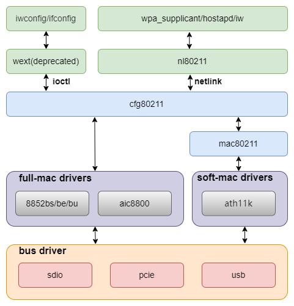

# WIFI
本文介绍 WIFI 的移植和使用方法。

## 模块介绍
K1平台上主要通过外部WIFI模块来实现WIFI功能，主要支持PCIE，SDIO以及USB等接口的模块。
K1 平台主要通过外部 WiFi 模组实现无线连接，支持接口包括：**PCIe**、**SDIO** 以及 **USB**。

### 功能介绍

WiFi 架构分为多个层次，如下图所示：




### 源码结构介绍

WIFI 相关的源码可以分为三个部分：
1. **WIFI驱动：** WIFI厂商提供，主要实现WIFI功能。
2. **平台相关部分：** 主要实现模组供电以及使能等相关接口，供WIFI驱动调用。
3. **接口驱动：** 主要实现 WIFI 数据传输接口功能，如**PCIe**、**SDIO** 以及 **USB** 等接口。

**WIFI 驱动的源码** 一般放到以下目录：
```
drivers/net/wireless
|-- aic8800             #aic厂商驱动
|-- realtek             #realtek厂商驱动
    |-- rtl8852be       #rtl8852be
    |-- rtl8852bs       #rtl8852bs
|-- wuqi                #wuqi厂商驱动
```

**平台相关的源码**：
```
drivers/soc/spacemit/spacemit-rf
|-- spacemit-pwrseq.c   #WIFI和蓝牙等公共部分实现
|-- spacemit-wlan.c     #WIFI供电，gpio以及时钟相关接口实现
|-- spacemit-bt.c       #bt供电，gpio以及时钟相关接口实现
```

**接口相关的源码**参考各个接口驱动说明文档。

## 关键特性
### SDIO 接口支持

| 特性 | 特性说明 |
| :-----| :----|
| 兼容 SDIO v4.10 | 兼容 4bit SDIO 4.10 规范 |
| 支持 SD 3.0模式 | 支持 SDR12/SDR25/DDR50/SDR50/SDR104 模式 |
| 支持 PIO/DMA | 支持 PIO,SDMA,ADMA,ADMA2 传输模式 |

### 性能参数
| 模组型号 | TX(Mb/s) | RX(Mb/s) |
| :-----| :----| :----: |
| rtl8852bs | 460 | 480 |
| aic8800d80 | 410 | 470 |

**测试方法**

```
同一局域网段

# 服务端
iperf3 -s

# 客户端
iperf3 -c 192.168.1.xxx -t 72000
```

## 配置介绍
主要包括 **驱动使能配置** 和 **DTS 配置**

### CONFIG 配置
`CONFIG_SPACEMIT_RFKILL` 为 WIFI 模组提供平台相关支持，默认情况，此选项为 `Y`
```
Device Drivers
        SOC (System On Chip) specific Drivers
                Spacemit rfkill driver (SPACEMIT_RFKILL [=y])
```


### DTS 配置
#### SDIO pinctrl

通常使用 `slot2` (用于 SDIO) 对应 `pinctrl_mmc2`：

```
pinctrl_mmc2: mmc2_grp {
        pinctrl-single,pins =<
                K1X_PADCONF(GPIO_15, MUX_MODE1, (EDGE_NONE | PULL_UP | PAD_1V8_DS2))	/* mmc2_data3 */
                K1X_PADCONF(GPIO_16, MUX_MODE1, (EDGE_NONE | PULL_UP | PAD_1V8_DS2))	/* mmc2_data2 */
                K1X_PADCONF(GPIO_17, MUX_MODE1, (EDGE_NONE | PULL_UP | PAD_1V8_DS2))	/* mmc2_data1 */
                K1X_PADCONF(GPIO_18, MUX_MODE1, (EDGE_NONE | PULL_UP | PAD_1V8_DS2))	/* mmc2_data0 */
                K1X_PADCONF(GPIO_19, MUX_MODE1, (EDGE_NONE | PULL_UP | PAD_1V8_DS2))	/* mmc2_cmd */
                K1X_PADCONF(GPIO_20, MUX_MODE1, (EDGE_NONE | PULL_UP | PAD_1V8_DS2))	/* mmc2_clk */
        >;
};
```

如果需要支持 WIFI 唤醒，需要将 `wlan_hostwake` 配置为 pinctl 模式：
```
pinctrl_wlan_wakeup: wlan_wakeup_grp {
        pinctrl-single,pins =<
                K1X_PADCONF(GPIO_66, MUX_MODE0, (EDGE_FALL | PULL_DOWN | PAD_3V_DS2))   /* wifi edge detect */
        >;
};
```

#### 电源配置

SDIO 需要配置两个电源，分别是 `vmmc-supply` 和 `vqmmc-supply`，分别对应卡的功能和 IO 供电，`vqmmc-supply` 建议 1.8V，具体根据 SDIO 卡的模式选择实际电压。


```
&sdhci1 {
        vmmc-supply = <&dcdc_3>;
        vqmmc-supply = <&ldo_1>;
};
```

#### tuning 配置

SDIO 跑高速模式下需要进行 tuning，不同的硬件版型都需要调整 TX 的相关参数。

#### SDIO DTS 配置示例

SDIO 的完整方案配置如下：

```
/* SDIO */
&sdhci1 {
        pinctrl-names = "default";
        pinctrl-0 = <&pinctrl_mmc2>;
        bus-width = <4>;
        non-removable;
        vqmmc-supply = <&dcdc_3>;
        no-mmc;
        no-sd;
        keep-power-in-suspend;

        spacemit,sdh-host-caps-disable = <(
                        MMC_CAP_UHS_DDR50 |
                        MMC_CAP_NEEDS_POLL
                        )>;
        spacemit,sdh-quirks = <(
                        SDHCI_QUIRK_BROKEN_CARD_DETECTION |
                        SDHCI_QUIRK_BROKEN_TIMEOUT_VAL
                        )>;
        spacemit,sdh-quirks2 = <(
                        SDHCI_QUIRK2_PRESET_VALUE_BROKEN |
                        SDHCI_QUIRK2_BROKEN_PHY_MODULE
                        )>;
        spacemit,rx_dline_reg = <0x0>;
        spacemit,tx_delaycode = <0x7f>;
        spacemit,rx_tuning_limit = <50>;
        spacemit,sdh-freq = <375000000>;
        status = "okay";
};
```
`sdio tx_delaycode` 的默认值是 `0x7f`，实际上需要根据具体的方案走线等差异进行调整。

#### 平台部分 DTS 配置

平台完整方案配置如下：
```
rf_pwrseq: rf-pwrseq {
        compatible = "spacemit,rf-pwrseq";
        //vdd-supply = <&ldo_7>;
        //vdd_voltage = <3300000>;
        io-supply = <&dcdc_3>;
        io_voltage = <1800000>;
        pwr-gpios  = <&gpio 67 0>;
        status = "okay";

        wlan_pwrseq: wlan-pwrseq {
                compatible = "spacemit,wlan-pwrseq";
                regon-gpios = <&gpio 116 0>;
                interrupt-parent = <&pinctrl>;
                interrupts = <268>;
                pinctrl-names = "default";
                pinctrl-0 = <&pinctrl_wlan_wakeup>;
        };

        bt_pwrseq: bt-pwrseq {
                compatible = "spacemit,bt-pwrseq";
                reset-gpios     = <&gpio 63 0>;
        };
};
```

`rf_pwrseq` 配置说明：
- `vdd-supply`：模组主电源，具体根据实际硬件配置；
- `vdd_voltage`：用于设定模组供电的电压。
- `io-supply`：是配置模组 IO 的供电，具体按实际硬件配置。
- `io_voltage`：用于设定模组 IO 供电的电压。
- `pwr-gpios`：模组主使能脚，默认上电时拉高，支持多个 GPIO；
- `clock`：模组共用的时钟配置；
- `power-on-delay-ms`：模组上电后的延时，默认 100ms。

`wlan_pwrseq` 配置说明：
- `regon-gpios`：Wi-Fi 模块使能脚，调用 `spacemit_wlan_set_power(1)` 时拉高；
- `interrupts`：Wi-Fi 模块的唤醒中断引脚，表示采用pinctl的方式进行唤醒；
- `power-on-delay-ms`：Wi-Fi 上电延时，默认 10ms。

`bt_pwrseq` 配置说明：
- `reset-gpios`：蓝牙模块复位脚，使能蓝牙对应 `rfkill` 节点时拉高；
- `clock`：蓝牙时钟配置；
- `power-on-delay-ms`：蓝牙上电延时，默认 10ms。

当前市面上大多数模组为 Wi-Fi 和蓝牙二合一，其供电部分通常共用。建议将共用部分配置在 `rf_pwrseq` 节点中，Wi-Fi 专属部分配置在 `wlan_pwrseq` 节点中。

如果使用的是单 Wi-Fi 模组，仅需配置 `wlan_pwrseq`，不需要配置 `rf_pwrseq`，但要使能`rf_pwrseq`节点。

在打开 Wi-Fi 电源时，平台会优先启用共用电源及 GPIO 状态，并维护相应的引用计数。关闭时，只有 Wi-Fi 和蓝牙都关闭后，平台才会真正关闭共用电源及 GPIO 状态。

## 接口介绍

### API 介绍
平台部分的接口，包含 Wi-Fi 上下电控制、中断获取及 SDIO 扫描等功能：
- `void spacemit_wlan_set_power(bool on_off);`
   设置WIFI电源，`0` 为关闭，`1` 为打开。

- `int spacemit_wlan_get_oob_irq(void);`
   获取平台中断请求（IRQ）号。

- `void spacemit_sdio_detect_change(int enable_scan);`
   扫描 SDIO 总线。

## Debug介绍

### sysfs

SDIO 的 `tx_delaycode` 参数默认在方案的 DTS 中指定。
调试时，可以通过 sysfs 下对应节点动态修改该值，方便验证。  

```
echo 0x7f > /sys/devices/platform/soc/d4280800.sdh
```

**注意：** 动态修改必须在 WiFi 驱动加载之前完成，才能生效。

### debugfs

常用于查询 SDIO 的工作状态，包括频率，位宽，模式等信息。

```
cat /sys/kernel/debug/mmc1/ios
clock:          204800000 Hz
actual clock:   187500000 Hz
vdd:            21 (3.3 ~ 3.4 V)
bus mode:       2 (push-pull)
chip select:    0 (don't care)
power mode:     2 (on)
bus width:      2 (4 bits)
timing spec:    6 (sd uhs SDR104)
signal voltage: 1 (1.80 V)
driver type:    0 (driver type B)
```

## 测试介绍

**步骤 1：** 确保 `wpa_supplicant` 服务有正常运行。
```
wpa_supplicant -iwlan0 -Dnl80211 -c/wpa_supplicant.conf -B
```

**步骤 2：** 配置 `wpa_supplicant.conf` 参考如下：
```
ctrl_interface=/var/run/wpa_supplicant
wowlan_triggers=any
```
`wowlan_triggers` 是 wow 相关的配置，用于支持WIFI唤醒功能。

**步骤 3：** 使用 `wpa_cli` 与 `wpa_supplicant` 服务进行交互。

如果 `wpa_supplicant.conf` 的 `ctrl_interface` 路径不是默认的 `/var/run/wpa_supplicant`，则 `wpa_cli` 运行时需要使用 `-p` 进行指定路径。
   
```
 wpa_cli -iwlan0 -p/var/run/wpa_supplicant
```

扫描周围可用的无线网络：
```
 scan
 scan_results
```

正常扫描会有类似如下输出：
```
bssid / frequency / signal level / flags / ssid
f6:12:b3:d4:65:ef       2462    -37     [WPA2-PSK-CCMP][WPS][ESS][P2P]  wilson
78:85:f4:82:01:3c       2462    -66     [WPA2-PSK-CCMP][WPS][ESS]       HUAWEI-LX45AG_HiLink
02:0e:5e:76:a5:6e       2412    -69     [WPA-PSK-CCMP+TKIP][ESS]        ChinaNet-1mMr
30:8e:7a:2f:64:8c       2437    -69     [WPA-PSK-CCMP+TKIP][WPA2-PSK-CCMP+TKIP][ESS]    K03_1tlftb
dc:16:b2:57:9e:65       2437    -78     [WPA2-PSK-CCMP][ESS]    \x00\x00\x00\x00\x00\x00\x00\x00
dc:16:b2:57:9e:60       2437    -78     [WPA-PSK-CCMP][WPA2-PSK-CCMP][WPS][ESS] TK-ZJB
48:0e:ec:ad:52:4d       2462    -78     [WPA-PSK-CCMP][WPA2-PSK-CCMP][WPS][ESS] TP-LINK_524D
3c:d2:e5:c6:08:9b       2452    -83     [WPA2-PSK-CCMP][ESS]
3e:d2:e5:16:08:9b       2452    -83     [WPA-PSK-CCMP+TKIP][WPA2-PSK-CCMP+TKIP][ESS]    young
80:ea:07:dc:f2:be       2462    -88     [WPA-PSK-CCMP][WPA2-PSK-CCMP][ESS]      HZXF
9a:00:74:84:d1:60       2412    -85     [WPA-PSK-CCMP+TKIP][WPA2-PSK-CCMP+TKIP][ESS]   ChinaNet-ieR7
dc:f8:b9:46:ec:30       2472    -85     [WPA-PSK-CCMP+TKIP][WPA2-PSK-CCMP+TKIP][ESS]   ChinaNet-MiZK
```

**步骤 4：** 选择需要连接的 AP 网络进行连接
```
> add_network
0
> set_network 0 ssid "wilson"
OK
> set_network 0 key_mgmt WPA-PSK
OK
> set_network 0 psk "wilson2001"
OK
> enable_network 0
```

## FAQ

**问题 1:**

**现象：** 能检测到 SDIO 设备，但是初始化失败。

**打印信息：**
```
mmc1: error -110 whilst initialising SDIO card
```

**解决办法：**
1. 修改sdio的tx_delaycode参数进行验证。

**问题 2：**

**现象：** SDIO 读写报错。

**打印信息：**
```
[ 23.662558] rtl8852bs mmc1:0001:1: rtw_sdio_raw_read: sdio read failed (-110)
[ 23.669829] rtl8852bs mmc1:0001:1: RTW_SDI0: READ use CMD53
[ 23.675507] rtl8852bs mmc1:0001:1: RTW_SDIO: READ from 0x00270, 4 bytes
[ 23.682193] RTW SDIO: READ 0000000: 63 00 00 81
```
**解决办法：**
1. 修改 SDIO 的 `tx_delaycode` 参数进行验证。
2. 如果方法1无效，尝试降低频率验证。
在 `sdh-host-caps-disable` 中增加 `MMC_CAP_UHS_SDR104`，禁掉 SDR104 模式。
