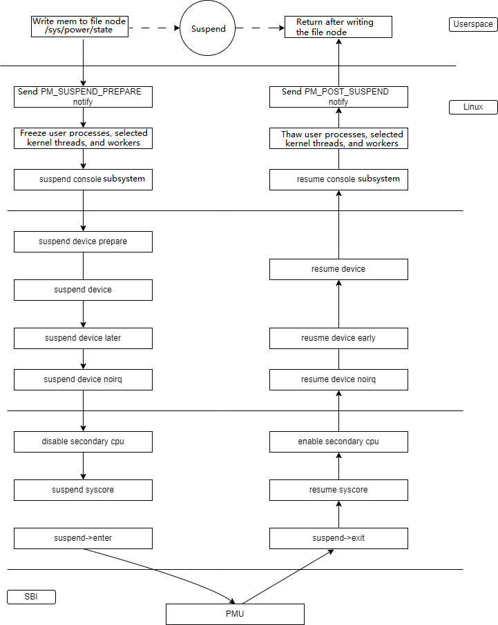

# Standby

**Linux Standby** 模式是一种省电模式。在这种模式下，计算机进入睡眠状态以节省功耗。当系统处于 Standby 模式时：
- **系统会自动将大部分硬件设备关闭**或者**置于低功耗状态**
- **同时 DDR 进入自刷新状态**

## 模块介绍
### 功能介绍

系统休眠唤醒框图如下：
  

系统的休眠唤醒分为四层：  

1. **用户空间层：** 主要是系统休眠的发起方。
2. **内核层：** 主要处理冻结用户进程、内核线程，以及各个设备的休眠唤醒等操作。
3. **OPENSBI 层：** 该层会操作 PMU，让系统进入休眠状态。
4. **硬件层：** PMU 硬件处理系统休眠唤醒的硬件逻辑。

### 源码结构介绍

控制器驱动代码在 `drivers/soc/spacemit/pm/` 目录下：

```
drivers/soc/spacemit/pm/
├── Makefile
├── platform_hibernation_pm.c
├── platform_hibernation_pm_ops.c
├── platform_pm.c
├── platform_pm_ops.c

```

休眠唤醒核心层代码位于 `kernel/power` 目录下：

```
kernel/power/
├── Kconfig
├── main.c
├── suspend.c
└── wakelock.c
```

## 关键特性

### 特性

无

### 性能参数

| 休眠时间 | 唤醒时间 | 休眠功耗 |  
| :-----| :----| :----: | 
| 3s | 1s | 32.3 mw |

## 配置介绍

主要包括 **驱动使能配置** 和 **DTS 配置**

### CONFIG 配置

```
 CONFIG_SUSPEND:
 Allow the system to enter sleep states in which main memory is
 powered and thus its contents are preserved, such as the
 suspend-to-RAM state (e.g. the ACPI S3 state).
 
 Symbol: SUSPEND [=y]
 Type  : bool
 Defined at kernel/power/Kconfig:2
  Prompt: Suspend to RAM and standby
  Depends on: ARCH_SUSPEND_POSSIBLE [=y]
  Location:
   -> Power management options
   -> Suspend to RAM and standby (SUSPEND [=y]) 
```

### 典型唤醒源配置  

#### power-key

本唤醒源使用的是 PMIC 上面的 ONEKEY，其基本配置如下：

##### DTS

```
&i2c8 {
        pinctrl-names = "default";
        pinctrl-0 = <&pinctrl_i2c8>;
        status = "okay";

        spm8821@41 {
                compatible = "spacemit,spm8821";
                reg = <0x41>;
                interrupt-parent = <&intc>;
                interrupts = <64>;
                status = "okay";

    ...
    
                pwr_key: key {
                        compatible = "pmic,pwrkey,spm8821";
                };
        };
};
```  

##### 驱动源码

```
drivers/input/misc/
├── spacemit-pwrkey.c

使能唤醒地方：
vi drivers/soc/spacemit/pm_domain/k1x-pm_domain.c +825
```  

#### Pinctrl Edge-Detect 唤醒

利用 Pinctrl Edge-Detect 功能实现唤醒源的场景包括 hall 元件开关盖、sdio-wifi 唤醒等。
以下以 hall 元件实现开盖唤醒为例，展示 edge-detect 唤醒功能的实现。hall 元件正常工作状态使用 gpio 中断上报开关盖事件，系统休眠时使用 pinctrl 上升沿触发系统唤醒。

##### DTS

```
        spacemit_lid:spacemit_lid {
                compatible = "spacemit,k1x-lid";
                pinctrl-names = "default";
                pinctrl-0 = <&pinctrl_hall_wakeup>;
                lid-gpios = <&gpio 74 0>;
                interrupts-extended = <&gpio 74 1
                                &pinctrl 300>;
        };
```

##### 源码目录结构

```
drivers/soc/spacemit/
├── spacemit_lid.c
```

代码实现如下：

```
static int spacemit_lid_probe(struct platform_device *pdev)
{
  ....
        hall->normal_irq = platform_get_irq(pdev, 0);
        if (hall->normal_irq < 0)
                return -EINVAL;

        hall->wakeup_irq = platform_get_irq(pdev, 1);
        if (hall->wakeup_irq < 0) {
                return -EINVAL;
        }

  /* 正常功能使用 GPIO 中断 */
        error = devm_request_irq(&pdev->dev, hall->normal_irq,
                        hall_wakeup_detect,
                        IRQF_NO_SUSPEND | IRQF_TRIGGER_FALLING | IRQF_TRIGGER_RISING,
                        "hall-detect", (void *)hall);
        if (error) {
                pr_err("request hall pinctrl dectect failed\n");
                return -EINVAL;
        }

  /* 唤醒源使用 pinctrl 中断 */
        dev_pm_set_dedicated_wake_irq_spacemit(&pdev->dev, hall->wakeup_irq, IRQ_TYPE_EDGE_RISING);
        device_init_wakeup(&pdev->dev, true);

        return 0;
}
```

## 接口描述

### 测试介绍

通过 RTC 唤醒方式测试 Standby 功能，示例如下：

```
#!/bin/sh
echo 9 > /proc/sys/kernel/printk
echo N > /sys/module/printk/parameters/console_suspend
counter=1

while [ $counter -le 5000 ]
do
        echo +120 > /sys/class/rtc/rtc0/wakealarm
        echo mem > /sys/power/state
        counter=$(($counter+1))
        echo "----->counter:$counter"
        sleep 20
done
``` 

## Debug 介绍

### sysfs

休眠唤醒的 sysfs 遵循 Linux 标准规范，具体请参考 Linux 内核文档：
``` 
Documentation/admin-guide/pm/sleep-states.rst
```

## FAQ
