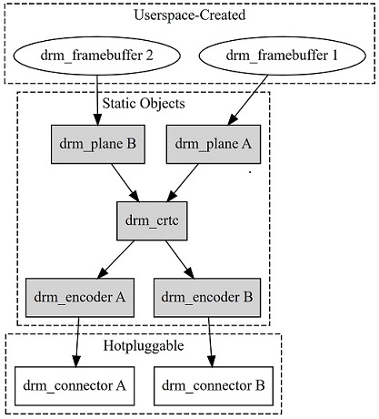

sidebar_position: 5

# SpacemiT 屏幕调试文档

本文介绍 SpacemiT K1 平台 Uboot 和 Kernel 的 MIPI DSI 与 HDMI 屏幕驱动用例和调试方法。

## 模块介绍

SpacemiT 平台的 Display 模块基于 **DRM** 框架实现。DRM 全称为 Direct Rendering Manager，是 Linux 内核中的图形显示子系统。它负责管理显示硬件、显存、图层合成、显示模式设置，以及用户空间与 GPU、显示控制器之间的交互，能够很好地适应现代显示硬件的特性。


在 Linux 内核中，DRM 作为显示设备管理的子系统，主要负责以下工作：
- 管理显示控制器设备
- 分配、映射和共享图形缓冲区
- 配置分辨率、刷新率和显示时序
- 管理硬件图层及图层合成
- 控制 HDMI、MIPI DSI、eDP 等输出接口
- 处理垂直同步和 page flip
- 支持显示器热插拔及 EDID
- 为 Wayland、Xorg、Android HWC、Openharmony Display HDI和直接 DRM 应用提供内核接口



Linux DRM/KMS 显示pipeline中核心对象：

**framebuffer:**
drm_framebuffer 表示一块可以用于显示的图像缓冲区，通常由用户空间创建。
它描述的信息主要包括：
- 图像宽度和高度
- 像素格式，例如 XR24、AR24、NV12
- 每行数据长度 pitch
- GEM buffer 或 DMA buffer
- modifier 和内存布局

**plane:**
drm_plane 是硬件图层，负责从 framebuffer 读取图像，并将图像送入 CRTC。
每个 Plane 可以配置：
- 使用哪个 framebuffer
- 源图像裁剪区域
- 屏幕显示位置
- 缩放尺寸
- 像素格式
- 透明度
- 图层顺序 zpos
- 旋转或镜像

**crtc:**
drm_crtc 表示一条独立的显示扫描pipeline。
其主要职责是：
- 合成一个或多个 Plane
- 生成水平和垂直扫描时序
- 设置分辨率和刷新率
- 产生 pixel clock
- 控制 vblank
- 将最终像素流发送给 Encoder

**encoder:**
drm_encoder 负责把 CRTC 输出的通用像素流转换成具体显示接口所需要的信号形式。

**connector:**
drm_connector 表示显示接口对外呈现的连接端点。
Connector 负责保存和检测：
- 当前连接状态
- 支持的显示模式
- EDID
- 显示器物理尺寸
- 色彩格式
- HDR、音频等能力
- Connector 属性


## uboot 开发环境

### 源码结构介绍

#### uboot-2022.10

| 类别 | 路径 |
| --- | --- |
| 方案 DTS | `bsp-src/uboot-2022.10/arch/riscv/dts/k1-x_***.dts` |
| SoC DTSI | `bsp-src/uboot-2022.10/arch/riscv/dts/k1-x.dtsi` |
| DPU驱动 | `bsp-src/uboot-2022.10/drivers/video/spacemit/spacemit_dpu.c` |
| HDMI驱动 | `bsp-src/uboot-2022.10/drivers/video/spacemit/spacemit_hdmi.c` |
| DSI驱动| `bsp-src/uboot-2022.10/drivers/video/spacemit/spacemit_mipi.c` 和 `drivers/video/spacemit/dsi/drv/` |
| DSI Panel注册 |`bsp-src/uboot-2022.10/drivers/video/spacemit/dsi/video/spacemit_mipi_port.c` |
| DSI Panel支持列表 | `bsp-src/uboot-2022.10/drivers/video/spacemit/dsi/video/lcd/lcd_***.c`|

### uboot HDMI 配置

#### CONFIG 配置

1. 执行 `make uboot-menuconfig`。

2. 进入 **Device Drivers -> Graphics support**，启用 SpacemiT 显示驱动和 HDMI 端口。默认配置通常已经启用这些选项。

```text
Device Drivers  --->
  Graphics support  --->
     <*> Enable SPACEMIT Video Support
     <*>    HDMI port
```

对应的主要配置项为：

```text
CONFIG_VIDEO=y
CONFIG_DISPLAY=y
CONFIG_VIDEO_SPACEMIT=y
CONFIG_DISPLAY_SPACEMIT_HDMI=y
```

实际配置名称以当前 SDK 的 `bsp-src/uboot-2022.10/drivers/video/spacemit/Kconfig` 为准。

#### DTS 配置

方案 DTS 需要使能 DPU 和 HDMI 节点，并配置 HDMI pinctrl。以下示例基于 `k1-x_deb1.dts`：

```c
// bsp-src/uboot-2022.10/arch/riscv/dts/k1-x_deb1.dts
&dpu {
	status = "okay";
};

&hdmi {
	pinctrl-names = "default";
	pinctrl-0 = <&pinctrl_hdmi_0>;
	status = "okay";
};
```

#### 常见问题

若uboot 下HDMI界面没有显示LOGO，应该先确认方案DTS文件中已使能HDMI功能，并确认显示器在上电前已经连接。


检测到HDMI已经连接启动的日志：

```text
hdmi get hpd signal
```

检测到HDMI未连接启动的日志：

```text
HDMI cannot get HPD signal
```

### uboot MIPI DSI 配置

#### CONFIG 配置

1. 执行 `make uboot-menuconfig`。

2. 进入 **Device Drivers -> Graphics support**，使能 SpacemiT 显示驱动和 MIPI 端口：

```text
Device Drivers  --->
  Graphics support  --->
     <*> Enable SPACEMIT Video Support
     <*>    MIPI Port
```

对应的主要配置项为：

```text
CONFIG_VIDEO=y
CONFIG_DISPLAY=y
CONFIG_VIDEO_SPACEMIT=y
CONFIG_DISPLAY_SPACEMIT_MIPI=y
```

如果需要在同一镜像中支持多个 DSI Panel，（通过Panel id区分不同的MIPI Panel）还应使能：

```text
CONFIG_DISPLAY_SPACEMIT_MULTIPLE_MIPI_PANELS=y
```

然后选择目标 Panel，例如：

```text
CONFIG_LCD_GX09INX101_MIPI=y
```

默认不支持多个DSI Panel功能，Panel 配置项定义在：

```text
bsp-src/uboot-2022.10/drivers/video/spacemit/dsi/Kconfig
```

#### DTS 配置

方案 DTS 需要使能DSI电源、DSI Panel电源，DPU、MIPI DSI、Panel 和背光。以下示例基于 `k1-x_deb1.dts`：

```c
// bsp-src/uboot-2022.10/arch/riscv/dts/k1-x_deb1.dts
// uboot开发环境下，DSI的两路电源AVDD18_DSI(1.8v)和AVDD12_DSI(1.2v)默认已开启
&dpu {
	status = "okay";
};

&mipi_dsi {
	status = "okay";
};

&panel {
	force-attached = "lcd_gx09inx101_mipi";	// DSI Panel 名称
	dcp-gpios = <&gpio 82 0>;		// Panel 电源控制 GPIO
	dcn-gpios = <&gpio 83 0>;		// Panel 电源控制 GPIO
	backlight = <&backlight>;
	reset-gpios = <&gpio 81 0>;		// Panel 复位 GPIO
	status = "okay";
};

&pwm14 {
	pinctrl-names = "default";
	pinctrl-0 = <&pinctrl_pwm14_1>;
	status = "okay";
};

&backlight {
	pwms = <&pwm14 0 2000>;
	default-brightness-level = <6>;		// backlight 背光亮度等级
	status = "okay";
};
```

GPIO电平控制、PWM 通道和周期必须根据实际原理图修改。背光亮只表示背光电路工作，不能证明 DPU、DSI Host、DPHY 或 Panel 初始化成功。

MIPI DSI节点属性支持从方案 DTS文件 覆盖：

例如：

```c
&mipi_dsi {
	pix-clk = <153000000>;
	bit-clk = <1000000000>;
	esc-clk = <76800000>;
	status = "okay";
};
```

如果 DTS 没有这些属性，当前驱动使用以下默认值：

| 属性 | 默认值 | 说明 |
| --- | ---: | --- |
| `pix-clk` | 88 MHz | DPU pixel clock 默认值 |
| `bit-clk` | 614.4 MHz | DSI lane bit clock 默认值 |
| `esc-clk` | 51.2 MHz | DSI escape clock 默认值 |

默认值不代表适合所有 Panel。应根据屏幕 timing、像素格式和 lane 数计算目标时钟频率。

```text
htotal = hactive + hfp + hbp + hsync
vtotal = vactive + vfp + vbp + vsync
pixel_clock = htotal x vtotal x fps
bit_clock = pixel_clock x bpp / lane_number x 1.1
```

DSI 驱动默认输出格式 RGB888 使用 `bpp=24`。最终选择的 bit clock 应不低于 `bit_clock`。

### DSI Panel 驱动配置

DSI Panel 配置文件位于：

```text
bsp-src/uboot-2022.10/drivers/video/spacemit/dsi/video/lcd/
```

每个DSI Panel 文件主要包含以下几类数据：

| 配置 | 作用 |
| --- | --- |
| `struct spacemit_mode_modeinfo` | 描述 DPU 输出分辨率、显示时序、pixel clock、像素格式和物理尺寸 |
| `struct spacemit_mipi_info` | 描述 DSI Host 和 DPHY 的工作模式、lane、链路速率及视频/命令模式参数 |
| `struct spacemit_dsi_cmd_desc` 数组 | 描述DSI Panel屏幕初始化、休眠、唤醒、读Panel ID 和电源状态命令 |
| `struct lcd_mipi_panel_info` | 汇总 Panel 名称、ID、命令数组、mode 和 MIPI 参数，并注册给框架 |

##### spacemit_mode_modeinfo 配置

结构体定义位于：

```text
bsp-src/uboot-2022.10/drivers/video/spacemit/dsi/include/spacemit_video_tx.h
```

| 成员 | 单位 | 说明 | DSI Panel移植要求 |
| --- | --- | --- | --- |
| `name` | 字符串 | 显示模式名称，例如 `1200x1920-60` | 建议包含分辨率和刷新率信息 |
| `refresh` | Hz | 目标刷新率 | 按 Panel 规格填写，通常为 60 |
| `xres` | pixel | DPU 输出水平有效像素 | 对应 `hactive` |
| `yres` | line | DPU 输出垂直有效行数 | 对应 `vactive` |
| `real_xres` | pixel | Panel 实际水平分辨率 | 无旋转或特殊映射时通常等于 `xres` |
| `real_yres` | line | Panel 实际垂直分辨率 | 无旋转或特殊映射时通常等于 `yres` |
| `left_margin` | pixel | 水平后肩 | 对应 `hbp` 或 `hback-porch` |
| `right_margin` | pixel | 水平前肩 | 对应 `hfp` 或 `hfront-porch` |
| `upper_margin` | line | 垂直后肩 | 对应 `vbp` 或 `vback-porch` |
| `lower_margin` | line | 垂直前肩 | 对应 `vfp` 或 `vfront-porch` |
| `hsync_len` | pixel | 水平同步脉宽 | 对应 `hsync` 或 `hsync-len` |
| `vsync_len` | line | 垂直同步脉宽 | 对应 `vsync` 或 `vsync-len` |
| `hsync_invert` | 布尔值 | 水平同步极性反转控制 | 根据 Panel 时序极性填写，不能凭参考屏复制 |
| `vsync_invert` | 布尔值 | 垂直同步极性反转控制 | 根据 Panel 时序极性填写 |
| `invert_pixclock` | 布尔值 | pixel clock 采样边沿反转控制 | 仅在硬件要求相反采样边沿时使能 |
| `pixclock_freq` | kHz | 目标 pixel clock | 使用总时序计算，单位 kHz，默认值88*1000kHZ|
| `pix_fmt_out` | 枚举 | DPU 输出像素格式 | 默认格式RGB888 |
| `width` | mm | Panel 可视区域物理宽度 | 来自规格书，不是水平分辨率 |
| `height` | mm | Panel 可视区域物理高度 | 来自规格书，不是垂直分辨率 |

Pixel clock 计算公式：

```text
htotal = xres + left_margin + right_margin + hsync_len
vtotal = yres + upper_margin + lower_margin + vsync_len
pixel_clock_hz = htotal x vtotal x refresh
pixclock_freq = pixel_clock_hz / 1000
```

##### spacemit_mipi_info 配置

结构体定义位于：

```text
bsp-src/uboot-2022.10/drivers/video/spacemit/dsi/include/spacemit_dsi_common.h
```

| 成员 | 单位 | 说明 | DSI Panel移植要求 |
| --- | --- | --- | --- |
| `height` | line | DSI 输入图像高度 | 对应 DSI Panel 垂直有效分辨率 |
| `width` | pixel | DSI 输入图像宽度 | 对应 DSI Panel 水平有效分辨率 |
| `hfp` | pixel | 水平前肩 | 应与 `right_margin` 一致 |
| `hbp` | pixel | 水平后肩 | 应与 `left_margin` 一致 |
| `hsync` | pixel | 水平同步脉宽 | 应与 `hsync_len` 一致 |
| `vfp` | line | 垂直前肩 | 应与 `lower_margin` 一致 |
| `vbp` | line | 垂直后肩 | 应与 `upper_margin` 一致 |
| `vsync` | line | 垂直同步脉宽 | 应与 `vsync_len` 一致 |
| `fps` | Hz | DSI 目标帧率 | 应与 `refresh` 一致 |
| `work_mode` | 枚举 | DSI 工作模式 | 视频模式使用 `SPACEMIT_DSI_MODE_VIDEO`，命令模式使用对应 CMD 枚举 |
| `rgb_mode` | 枚举 | DSI 输入颜色格式 | 默认格式 RGB888 使用 `DSI_INPUT_DATA_RGB_MODE_888` |
| `lane_number` | lane | 数据 lane 数量 | 根据原理图和 Panel 能力填写，常见为1 或 2 或 4 |
| `phy_bit_clock` | Hz | 每条 data lane 的 bit clock | 按 pixel clock、bpp 和 lane 数计算，对应方案 DTS 文件中配置的 bit-clk 值，默认值614400000HZ |
| `phy_esc_clock` | Hz | DPHY escape clock | 用于 LP 命令传输，对应方案 DTS 文件中配置的 esc-clk 值，默认值51200000HZ|
| `split_enable` | 布尔值 | DSI split 模式使能 | 单 Panel 单链路通常为 0 |
| `eotp_enable` | 布尔值 | End Of Transmission Packet 使能 | 根据 Panel 是否要求 eotp 设置 |
| `burst_mode` | 枚举 | 视频模式传输类型 | burst 屏可使用 `DSI_BURST_MODE_BURST`，其他模式按规格选择 |

RGB888输出格式 的最低 lane bit clock 可按下式估算：

```text
bit_clock = pixel_clock_hz x 24 / lane_number x 1.1
```

选择的 `phy_bit_clock` 应不低于估算值时钟频率，并且必须是 K1芯片平台 clock tree 可以产生或接受误差的频率。`spacemit_mode_modeinfo` 和 `spacemit_mipi_info` 中的分辨率、porch、sync、fps 必须保持一致。


### DSI Panel 调试实例
以 `lcd_gx09inx101_mipi` 为参考，uboot开发环境下调试DSI Panel时按以下步骤操作：

**1. 新增 DSI Panel 文件**

新增文件
```text
bsp-src/uboot-2022.10/drivers/video/spacemit/dsi/video/lcd/lcd_gx09inx101.c
```

lcd_gx09inx101_mipi主要参数如下：

| 参数 | 配置值 |
| --- | ---: |
| 分辨率 | 1200 x 1920 |
| 刷新率 | 30 Hz |
| 水平时序 | hbp=40、hfp=50、hsync=10 |
| 垂直时序 | vbp=16、vfp=20、vsync=4 |
| 输出格式 | RGB888 |
| DSI 工作模式 | Video Burst Mode |
| Lane 数 | 4 |
| `pixclock_freq` | 76800 kHz |
| `phy_bit_clock` | 614400000 Hz |
| `phy_esc_clock` | 51200000 Hz |
| 物理尺寸 | 142 mm x 228 mm |


按上述时序计算：

```text
htotal = 1200 + 40 + 50 + 10 = 1300
vtotal = 1920 + 16 + 20 + 4 = 1960
pixel_clock = 1300 x 1960 x 30 = 76440000 Hz
```

当前实例中选择K1芯片平台支持的 pixel clock `76800000 Hz`

因此 `.pixclock_freq = 76800` 是接近理论值的 kHz 配置。对于 RGB888、4 lane，含 10% 余量的bit clock 约为：

```text
bit_clock = 76800000 x 24 / 4 x 1.1 = 506880000 Hz
```

当前实例中选择K1芯片平台支持的 bit clock `614400000 Hz` 大于估算bit clock时钟频率。

根据新 DSI Panel 规格书修改 `spacemit_mode_modeinfo`：

- 修改分辨率、hfp/hbp/hsync、vfp/vbp/vsync 和刷新率。
- 计算 `.pixclock_freq`，单位为 kHz。
- 修改同步极性和输出像素格式。
- 将 `.width`、`.height` 填为 Panel 物理尺寸 mm。

```c
struct spacemit_mode_modeinfo gx09inx101_spacemit_modelist[] = {
	{
		.name = "1200x1920-60",
		.refresh = 30,
		.xres = 1200,
		.yres = 1920,
		.real_xres = 1200,
		.real_yres = 1920,
		.left_margin = 40,
		.right_margin = 50,
		.hsync_len = 10,
		.upper_margin = 16,
		.lower_margin = 20,
		.vsync_len = 4,
		.hsync_invert = 0,
		.vsync_invert = 0,
		.invert_pixclock = 0,
		.pixclock_freq = 78 * 1000,
		.pix_fmt_out = OUTFMT_RGB888,
		.width = 142,
		.height = 228,
	},
};
```

同步修改 `spacemit_mipi_info`：

- `width/height`、porch、sync 和 fps 必须与 modeinfo 一致。
- 根据接口规格设置 video/command mode、burst mode、RGB 格式和 lane 数。
- 计算 `phy_bit_clock`，并选择 K1 芯片平台支持且不低于最低估算值的时钟频率。
- 根据K1芯片平台与 DSI Panel 要求设置 `phy_esc_clock`、eotp 和 TE 参数。

```c
struct spacemit_mipi_info gx09inx101_mipi_info = {
	.height = 1920,
	.width = 1200,
	.hfp = 50,
	.hbp = 40,
	.hsync = 10,
	.vfp = 20,
	.vbp = 16,
	.vsync = 4,
	.fps = 30,
	.work_mode = SPACEMIT_DSI_MODE_VIDEO,
	.rgb_mode = DSI_INPUT_DATA_RGB_MODE_888,
	.lane_number = 4,
	.phy_bit_clock = 614400000,
	.phy_esc_clock = 51200000,
	.split_enable = 0,
	.eotp_enable = 0,
	.burst_mode = DSI_BURST_MODE_BURST,
};
```

配置DSI Panel厂商提供的Panel driver ic初始化命令和信息：

- 将DSI Panel厂商初始化序列写入 `init_cmds[]`。
- 配置 `sleep_in_cmds[]`、`sleep_out_cmds[]`。
- 如需自动识别 DSI Panel，配置 `set_id_cmds[]`、`read_id_cmds[]` 和Panel id。
- 如需检测电源状态（ESD），配置`set_power_cmds[]`、`read_power_cmds[]`。
- 核对命令类型、LP/HS 模式、延时（ms）、payload 长度和 payload 数据。

```c
static struct spacemit_dsi_cmd_desc gx09inx101_set_id_cmds[] = {
	{SPACEMIT_DSI_SET_MAX_PKT_SIZE, SPACEMIT_DSI_LP_MODE, UNLOCK_DELAY, 1, {0x01}},
};

static struct spacemit_dsi_cmd_desc gx09inx101_read_id_cmds[] = {
	{SPACEMIT_DSI_GENERIC_READ1, SPACEMIT_DSI_LP_MODE, UNLOCK_DELAY, 1, {0xfb}},
};

static struct spacemit_dsi_cmd_desc gx09inx101_set_power_cmds[] = {
	{SPACEMIT_DSI_SET_MAX_PKT_SIZE, SPACEMIT_DSI_HS_MODE, UNLOCK_DELAY, 1, {0x1}},
};

static struct spacemit_dsi_cmd_desc gx09inx101_read_power_cmds[] = {
	{SPACEMIT_DSI_GENERIC_READ1, SPACEMIT_DSI_HS_MODE, UNLOCK_DELAY, 1, {0xA}},
};

static struct spacemit_dsi_cmd_desc gx09inx101_init_cmds[] = {
	// 8279 + INX10.1
	{SPACEMIT_DSI_DCS_LWRITE, SPACEMIT_DSI_LP_MODE, 0,   2, {0xB0,0x01}},
	{SPACEMIT_DSI_DCS_LWRITE, SPACEMIT_DSI_LP_MODE, 0,   2, {0xC3,0x4F}},
	{SPACEMIT_DSI_DCS_LWRITE, SPACEMIT_DSI_LP_MODE, 0,   2, {0xC4,0x40}},
	{SPACEMIT_DSI_DCS_LWRITE, SPACEMIT_DSI_LP_MODE, 0,   2, {0xC5,0x40}},
	{SPACEMIT_DSI_DCS_LWRITE, SPACEMIT_DSI_LP_MODE, 0,   2, {0xC6,0x40}},
	{SPACEMIT_DSI_DCS_LWRITE, SPACEMIT_DSI_LP_MODE, 0,   2, {0xC7,0x40}},
	{SPACEMIT_DSI_DCS_LWRITE, SPACEMIT_DSI_LP_MODE, 0,   2, {0xC8,0x4D}},
	{SPACEMIT_DSI_DCS_LWRITE, SPACEMIT_DSI_LP_MODE, 0,   2, {0xC9,0x52}},
	{SPACEMIT_DSI_DCS_LWRITE, SPACEMIT_DSI_LP_MODE, 0,   2, {0xCA,0x51}},
	{SPACEMIT_DSI_DCS_LWRITE, SPACEMIT_DSI_LP_MODE, 0,   2, {0xCD,0x5D}},
	{SPACEMIT_DSI_DCS_LWRITE, SPACEMIT_DSI_LP_MODE, 0,   2, {0xCE,0x5B}},
	{SPACEMIT_DSI_DCS_LWRITE, SPACEMIT_DSI_LP_MODE, 0,   2, {0xCF,0x4B}},
	{SPACEMIT_DSI_DCS_LWRITE, SPACEMIT_DSI_LP_MODE, 0,   2, {0xD0,0x49}},
	{SPACEMIT_DSI_DCS_LWRITE, SPACEMIT_DSI_LP_MODE, 0,   2, {0xD1,0x47}},
	{SPACEMIT_DSI_DCS_LWRITE, SPACEMIT_DSI_LP_MODE, 0,   2, {0xD2,0x45}},
	{SPACEMIT_DSI_DCS_LWRITE, SPACEMIT_DSI_LP_MODE, 0,   2, {0xD3,0x41}},
	{SPACEMIT_DSI_DCS_LWRITE, SPACEMIT_DSI_LP_MODE, 0,   2, {0xD7,0x50}},
	{SPACEMIT_DSI_DCS_LWRITE, SPACEMIT_DSI_LP_MODE, 0,   2, {0xD8,0x40}},
	{SPACEMIT_DSI_DCS_LWRITE, SPACEMIT_DSI_LP_MODE, 0,   2, {0xD9,0x40}},
	{SPACEMIT_DSI_DCS_LWRITE, SPACEMIT_DSI_LP_MODE, 0,   2, {0xDA,0x40}},
	{SPACEMIT_DSI_DCS_LWRITE, SPACEMIT_DSI_LP_MODE, 0,   2, {0xDB,0x40}},
	{SPACEMIT_DSI_DCS_LWRITE, SPACEMIT_DSI_LP_MODE, 0,   2, {0xDC,0x4E}},
	{SPACEMIT_DSI_DCS_LWRITE, SPACEMIT_DSI_LP_MODE, 0,   2, {0xDD,0x52}},
	{SPACEMIT_DSI_DCS_LWRITE, SPACEMIT_DSI_LP_MODE, 0,   2, {0xDE,0x51}},
	{SPACEMIT_DSI_DCS_LWRITE, SPACEMIT_DSI_LP_MODE, 0,   2, {0xE1,0x5E}},
	{SPACEMIT_DSI_DCS_LWRITE, SPACEMIT_DSI_LP_MODE, 0,   2, {0xE2,0x5C}},
	{SPACEMIT_DSI_DCS_LWRITE, SPACEMIT_DSI_LP_MODE, 0,   2, {0xE3,0x4C}},
	{SPACEMIT_DSI_DCS_LWRITE, SPACEMIT_DSI_LP_MODE, 0,   2, {0xE4,0x4A}},
	{SPACEMIT_DSI_DCS_LWRITE, SPACEMIT_DSI_LP_MODE, 0,   2, {0xE5,0x48}},
	{SPACEMIT_DSI_DCS_LWRITE, SPACEMIT_DSI_LP_MODE, 0,   2, {0xE6,0x46}},
	{SPACEMIT_DSI_DCS_LWRITE, SPACEMIT_DSI_LP_MODE, 0,   2, {0xE7,0x42}},
	// Page 0x03
	{SPACEMIT_DSI_DCS_LWRITE, SPACEMIT_DSI_LP_MODE, 0,   2, {0xB0,0x03}},
	{SPACEMIT_DSI_DCS_LWRITE, SPACEMIT_DSI_LP_MODE, 0,   2, {0xBE,0x03}},
	{SPACEMIT_DSI_DCS_LWRITE, SPACEMIT_DSI_LP_MODE, 0,   2, {0xCC,0x44}},
	{SPACEMIT_DSI_DCS_LWRITE, SPACEMIT_DSI_LP_MODE, 0,   2, {0xC8,0x07}},
	{SPACEMIT_DSI_DCS_LWRITE, SPACEMIT_DSI_LP_MODE, 0,   2, {0xC9,0x05}},
	{SPACEMIT_DSI_DCS_LWRITE, SPACEMIT_DSI_LP_MODE, 0,   2, {0xCA,0x42}},
	{SPACEMIT_DSI_DCS_LWRITE, SPACEMIT_DSI_LP_MODE, 0,   2, {0xCD,0x3E}},
	{SPACEMIT_DSI_DCS_LWRITE, SPACEMIT_DSI_LP_MODE, 0,   2, {0xCF,0x60}},
	{SPACEMIT_DSI_DCS_LWRITE, SPACEMIT_DSI_LP_MODE, 0,   2, {0xD2,0x04}},
	{SPACEMIT_DSI_DCS_LWRITE, SPACEMIT_DSI_LP_MODE, 0,   2, {0xD3,0x04}},
	{SPACEMIT_DSI_DCS_LWRITE, SPACEMIT_DSI_LP_MODE, 0,   2, {0xD4,0x01}},
	{SPACEMIT_DSI_DCS_LWRITE, SPACEMIT_DSI_LP_MODE, 0,   2, {0xD5,0x00}},
	{SPACEMIT_DSI_DCS_LWRITE, SPACEMIT_DSI_LP_MODE, 0,   2, {0xD6,0x03}},
	{SPACEMIT_DSI_DCS_LWRITE, SPACEMIT_DSI_LP_MODE, 0,   2, {0xD7,0x04}},
	{SPACEMIT_DSI_DCS_LWRITE, SPACEMIT_DSI_LP_MODE, 0,   2, {0xD9,0x01}},
	{SPACEMIT_DSI_DCS_LWRITE, SPACEMIT_DSI_LP_MODE, 0,   2, {0xDB,0x01}},
	{SPACEMIT_DSI_DCS_LWRITE, SPACEMIT_DSI_LP_MODE, 0,   2, {0xE4,0xF0}},
	{SPACEMIT_DSI_DCS_LWRITE, SPACEMIT_DSI_LP_MODE, 0,   2, {0xE5,0x0A}},
	// Page 0x00
	{SPACEMIT_DSI_DCS_LWRITE, SPACEMIT_DSI_LP_MODE, 0,   2, {0xB0,0x00}},
	{SPACEMIT_DSI_DCS_LWRITE, SPACEMIT_DSI_LP_MODE, 0,   2, {0xBD,0x50}},
	{SPACEMIT_DSI_DCS_LWRITE, SPACEMIT_DSI_LP_MODE, 0,   2, {0xC2,0x08}},
	{SPACEMIT_DSI_DCS_LWRITE, SPACEMIT_DSI_LP_MODE, 0,   2, {0xC4,0x10}},
	{SPACEMIT_DSI_DCS_LWRITE, SPACEMIT_DSI_LP_MODE, 0,   2, {0xCC,0x00}},
	// Page 0x02
	{SPACEMIT_DSI_DCS_LWRITE, SPACEMIT_DSI_LP_MODE, 0,   2, {0xB0,0x02}},
	{SPACEMIT_DSI_DCS_LWRITE, SPACEMIT_DSI_LP_MODE, 0,   2, {0xC0,0x00}},
	{SPACEMIT_DSI_DCS_LWRITE, SPACEMIT_DSI_LP_MODE, 0,   2, {0xC1,0x0A}},
	{SPACEMIT_DSI_DCS_LWRITE, SPACEMIT_DSI_LP_MODE, 0,   2, {0xC2,0x20}},
	{SPACEMIT_DSI_DCS_LWRITE, SPACEMIT_DSI_LP_MODE, 0,   2, {0xC3,0x24}},
	{SPACEMIT_DSI_DCS_LWRITE, SPACEMIT_DSI_LP_MODE, 0,   2, {0xC4,0x23}},
	{SPACEMIT_DSI_DCS_LWRITE, SPACEMIT_DSI_LP_MODE, 0,   2, {0xC5,0x29}},
	{SPACEMIT_DSI_DCS_LWRITE, SPACEMIT_DSI_LP_MODE, 0,   2, {0xC6,0x23}},
	{SPACEMIT_DSI_DCS_LWRITE, SPACEMIT_DSI_LP_MODE, 0,   2, {0xC7,0x1C}},
	{SPACEMIT_DSI_DCS_LWRITE, SPACEMIT_DSI_LP_MODE, 0,   2, {0xC8,0x19}},
	{SPACEMIT_DSI_DCS_LWRITE, SPACEMIT_DSI_LP_MODE, 0,   2, {0xC9,0x17}},
	{SPACEMIT_DSI_DCS_LWRITE, SPACEMIT_DSI_LP_MODE, 0,   2, {0xCA,0x17}},
	{SPACEMIT_DSI_DCS_LWRITE, SPACEMIT_DSI_LP_MODE, 0,   2, {0xCB,0x18}},
	{SPACEMIT_DSI_DCS_LWRITE, SPACEMIT_DSI_LP_MODE, 0,   2, {0xCC,0x1A}},
	{SPACEMIT_DSI_DCS_LWRITE, SPACEMIT_DSI_LP_MODE, 0,   2, {0xCD,0x1E}},
	{SPACEMIT_DSI_DCS_LWRITE, SPACEMIT_DSI_LP_MODE, 0,   2, {0xCE,0x20}},
	{SPACEMIT_DSI_DCS_LWRITE, SPACEMIT_DSI_LP_MODE, 0,   2, {0xCF,0x23}},
	{SPACEMIT_DSI_DCS_LWRITE, SPACEMIT_DSI_LP_MODE, 0,   2, {0xD0,0x07}},
	{SPACEMIT_DSI_DCS_LWRITE, SPACEMIT_DSI_LP_MODE, 0,   2, {0xD1,0x00}},
	{SPACEMIT_DSI_DCS_LWRITE, SPACEMIT_DSI_LP_MODE, 0,   2, {0xD2,0x00}},
	{SPACEMIT_DSI_DCS_LWRITE, SPACEMIT_DSI_LP_MODE, 0,   2, {0xD3,0x0A}},
	{SPACEMIT_DSI_DCS_LWRITE, SPACEMIT_DSI_LP_MODE, 0,   2, {0xD4,0x13}},
	{SPACEMIT_DSI_DCS_LWRITE, SPACEMIT_DSI_LP_MODE, 0,   2, {0xD5,0x1C}},
	{SPACEMIT_DSI_DCS_LWRITE, SPACEMIT_DSI_LP_MODE, 0,   2, {0xD6,0x1A}},
	{SPACEMIT_DSI_DCS_LWRITE, SPACEMIT_DSI_LP_MODE, 0,   2, {0xD7,0x13}},
	{SPACEMIT_DSI_DCS_LWRITE, SPACEMIT_DSI_LP_MODE, 0,   2, {0xD8,0x17}},
	{SPACEMIT_DSI_DCS_LWRITE, SPACEMIT_DSI_LP_MODE, 0,   2, {0xD9,0x1C}},
	{SPACEMIT_DSI_DCS_LWRITE, SPACEMIT_DSI_LP_MODE, 0,   2, {0xDA,0x19}},
	{SPACEMIT_DSI_DCS_LWRITE, SPACEMIT_DSI_LP_MODE, 0,   2, {0xDB,0x17}},
	{SPACEMIT_DSI_DCS_LWRITE, SPACEMIT_DSI_LP_MODE, 0,   2, {0xDC,0x17}},
	{SPACEMIT_DSI_DCS_LWRITE, SPACEMIT_DSI_LP_MODE, 0,   2, {0xDD,0x18}},
	{SPACEMIT_DSI_DCS_LWRITE, SPACEMIT_DSI_LP_MODE, 0,   2, {0xDE,0x1A}},
	{SPACEMIT_DSI_DCS_LWRITE, SPACEMIT_DSI_LP_MODE, 0,   2, {0xDF,0x1E}},
	{SPACEMIT_DSI_DCS_LWRITE, SPACEMIT_DSI_LP_MODE, 0,   2, {0xE0,0x20}},
	{SPACEMIT_DSI_DCS_LWRITE, SPACEMIT_DSI_LP_MODE, 0,   2, {0xE1,0x23}},
	{SPACEMIT_DSI_DCS_LWRITE, SPACEMIT_DSI_LP_MODE, 0,   2, {0xE2,0x07}},
	{SPACEMIT_DSI_DCS_LWRITE, SPACEMIT_DSI_LP_MODE, 200, 2, {0x11, 0x00}},
	{SPACEMIT_DSI_DCS_LWRITE, SPACEMIT_DSI_LP_MODE,  50, 2, {0x29, 0x00}},
};

static struct spacemit_dsi_cmd_desc gx09inx101_sleep_out_cmds[] = {
	{SPACEMIT_DSI_DCS_SWRITE,SPACEMIT_DSI_LP_MODE,200,1,{0x11}},
	{SPACEMIT_DSI_DCS_SWRITE,SPACEMIT_DSI_LP_MODE,50,1,{0x29}},
};

static struct spacemit_dsi_cmd_desc gx09inx101_sleep_in_cmds[] = {
	{SPACEMIT_DSI_DCS_SWRITE,SPACEMIT_DSI_LP_MODE,50,1,{0x28}},
	{SPACEMIT_DSI_DCS_SWRITE,SPACEMIT_DSI_LP_MODE,200,1,{0x10}},
};
```

初始化DSI Panel 的`struct lcd_mipi_panel_info`数据结构

```c
struct lcd_mipi_panel_info lcd_gx09inx101_mipi = {
	.lcd_name = "lcd_gx09inx101_mipi",
	.lcd_id = 0x8279,
	.panel_id0 = 0x1,
	.power_value = 0x14,
	.panel_type = LCD_MIPI,
	.width_mm = 142,
	.height_mm = 228,
	.set_id_cmds_num = ARRAY_SIZE(gx09inx101_set_id_cmds),
	.read_id_cmds_num = ARRAY_SIZE(gx09inx101_read_id_cmds),
	.init_cmds_num = ARRAY_SIZE(gx09inx101_init_cmds),
	.set_power_cmds_num = ARRAY_SIZE(gx09inx101_set_power_cmds),
	.read_power_cmds_num = ARRAY_SIZE(gx09inx101_read_power_cmds),
	.sleep_out_cmds_num = ARRAY_SIZE(gx09inx101_sleep_out_cmds),
	.sleep_in_cmds_num = ARRAY_SIZE(gx09inx101_sleep_in_cmds),
	.spacemit_modeinfo = gx09inx101_spacemit_modelist,
	.mipi_info = &gx09inx101_mipi_info,
	.set_id_cmds = gx09inx101_set_id_cmds,
	.read_id_cmds = gx09inx101_read_id_cmds,
	.set_power_cmds = gx09inx101_set_power_cmds,
	.read_power_cmds = gx09inx101_read_power_cmds,
	.init_cmds = gx09inx101_init_cmds,
	.sleep_out_cmds = gx09inx101_sleep_out_cmds,
	.sleep_in_cmds = gx09inx101_sleep_in_cmds,
};

int lcd_gx09inx101_mipi_init(void)
{
	int ret;

	ret = lcd_mipi_register_panel(&lcd_gx09inx101_mipi);
	return ret;
}
```

**2. Makefile加入DSI Panel文件**


```
// bsp-src/uboot-2022.10/drivers/video/spacemit/dsi/Makefile
obj-y += video/lcd/lcd_gx09inx101.o
```

**3. 声明DSI Panel初始化函数**

```c
// bsp-src/uboot-2022.10/drivers/video/spacemit/dsi/include/spacemit_dsi_common.h
int lcd_gx09inx101_mipi_init(void);
```

**4. 注册 DSI Panel**

```c
// bsp-src/uboot-2022.10/drivers/video/spacemit/dsi/video/spacemit_mipi_port.c
static const struct panel_config panel_configs[] = {
	/* ... */
	{"lcd_gx09inx101_mipi", LCD_MIPI, lcd_gx09inx101_mipi_init},
};
```

**5. 初始化DSI Panel**
如果需要同一个镜像支持多DSI Panel，还需要在 `Kconfig` 中增加 Panel 配置项。

```c
// bsp-src/uboot-2022.10/drivers/video/spacemit/dsi/Kconfig
config LCD_GX09INX101_MIPI
	bool "Add lcd gx09inx101 mipi panel"
	depends on DISPLAY_SPACEMIT_MULTIPLE_MIPI_PANELS
	help
	  support lcd_gx09inx101_mipi panel
```

并在多 Panel 初始化分支中调用DSI Panel的初始化函数。

```c
// bsp-src/uboot-2022.10/drivers/video/spacemit/dsi/video/spacemit_mipi_port.c
#if defined(CONFIG_LCD_GX09INX101_MIPI)
                tx_device_client.panel_type = LCD_MIPI;
                tx_device.panel_type = tx_device_client.panel_type;
                lcd_gx09inx101_mipi_init();
#endif
```

**6. 方案 DTS 文件中配置 DSI Panel**
方案 DTS 文件中，配置DPU、MIPI DSI、Panel、电源、复位和背光。若不使用DSI驱动默认的时钟，可配置 `pix-clk`、`esc-clk` 和 `bit-clk`，修改时钟频率。DSI Panel 名称必须在 DSI Panel 文件、`panel_configs[]` 和方案 DTS 文件中保持完全一致。

```c
// bsp-src/uboot-2022.10/arch/riscv/dts/k1-x_deb1.dts

&dpu {
	status = "okay";
};

&mipi_dsi {
	pix-clk = <76800000>;			// pixel clock
	bit-clk = <614400000>;			// bit clock
	status = "okay";
};

&panel {
	force-attached = "lcd_gx09inx101_mipi"; // DSI Panel 名称
	dcp-gpios = <&gpio 82 0>;		// Panel 电源控制 GPIO
	dcn-gpios = <&gpio 83 0>;		// Panel 电源控制 GPIO
	backlight = <&backlight>;
	reset-gpios = <&gpio 81 0>;		// Panel 复位 GPIO
	status = "okay";
};

&pwm14 {
	pinctrl-names = "default";
	pinctrl-0 = <&pinctrl_pwm14_1>;
	status = "okay";
};

&backlight {
	pwms = <&pwm14 0 2000>;
	default-brightness-level = <6>;		// backlight 背光亮度等级
	status = "okay";
};
```

#### 常见问题

若uboot 下DSI Panle界面没有显示LOGO，应该先确认方案DTS文件中已使能DSI Panel功能；并确认硬件DSI Panel连接正常；电源，复位，DSI初始化时序配置正确。


检测到DSI Panel通信正常启动日志：

```text
[   0.850] Found device 'mipi@d421a800', disp_uc_priv=000000007dea6b60
[   0.854] spacemit_panel_of_to_plat panel lcd_gx09inx101_mipi
[   1.058] read panel id OK: read value = 0x1, 0x0, 0x0
[   1.060] Panel is lcd_gx09inx101_mipi
[   1.318] spacemit_display_init: lcd name lcd_gx09inx101_mipi
[   1.321] fb=7f700000, size=1200x1920
```

检测到DSI Panel通信异常启动日志：

```text
[   0.855] Found device 'mipi@d421a800', disp_uc_priv=000000007dea6b60
[   0.859] spacemit_panel_of_to_plat panel lcd_gx09inx101_mipi
[   1.083] dsi_write_cmd: DSI send out packet maybe failed.
[   1.086] dsi_read_cmd_array: dsi didn't receive packet, irq status 0x1001
[   1.092] lcd_mipi_readid failed!
[   1.095] lcd_port (0) is not the corrected video_tx!
[   1.100] Can not found the corrected panel!
[   1.104] probe: failed to find video tx
[   1.108] spacemit_display_init: Failed to init panel
```

| 现象 | 可能原因 | 检查与处理 |
| --- | --- | --- |
| 背光不亮 | PWM、GPIO 或 backlight 节点未使能 | 检查 `pwm`、`backlight`、pinctrl 和有效电平 |
| 背光亮但黑屏 | DPU/DSI 未使能、DSI Panel 未初始化、时钟错误、lane物理连接或信号原因 | 检查Panel 注册、初始化日志和实际时钟频率，clock请求值不一定等于硬件可以输出的时钟频率，应以 clk_get_rate() 获取的时钟频率值为准，检查lane的硬件连接，使用示波器查看lane信号，正常点屏前可尝试先点亮DSI Panel的BIST模式，确保硬件通路正常 |
| 读取 Panel id 失败 | reset 时序、供电、LP 命令或 ID 不匹配 | 示波器确认供电和 reset，检查 `read_id_cmds`、Panel ID 值和延时 |
| 总是加载默认 DSI Panel | DSI Panel 名称未匹配或未注册 | 检查 `panel_configs[]`、Kconfig 和初始化函数名称 |
| 花屏或颜色异常 | RGB 格式、lane 数、时序或初始化命令错误 | 核对主控输出格式及DSI Panel接收格式是否一致、lane 配置、porch 和DSI Panel厂商初始化命令是否正确 |
| 画面滚动或刷新率异常 | pixel clock 与总时序不匹配，或porch参数原因 | 重新计算 `htotal x vtotal x fps`，检查实际 pxclk，并调整porch参数验证 |
| 高分辨率黑屏或闪烁 | bit clock 原因或MIPI DSI时序原因 | 按 bpp/lane 计算 bitclk，选择不低于估算值的时钟频率，并配置esc-clk = <76800000>; |


## kernel 开发环境

### 源码结构介绍

#### linux-6.6

| 类别 | 路径 |
| --- | --- |
| 方案 DTS | `bsp-src/linux-6.6/arch/riscv/boot/dts/spacemit/k1-x_***.dts` |
| SoC DTSI | `bsp-src/linux-6.6/arch/riscv/boot/dts/spacemit/k1-x.dtsi` |
| DRM 主驱动 | `bsp-src/linux-6.6/drivers/gpu/drm/spacemit/spacemit_drm.c` |
| HDMI DTS 节点 | `bsp-src/linux-6.6/arch/riscv/boot/dts/spacemit/k1-x-hdmi.dtsi` |
| HDMI 驱动 | `bsp-src/linux-6.6/drivers/gpu/drm/spacemit/spacemit_hdmi.c` |
| DSI DTS 节点 | `bsp-src/linux-6.6/arch/riscv/boot/dts/spacemit/k1-x-lcd.dtsi` |
| DSI Panel 支持列表 | `bsp-src/linux-6.6/arch/riscv/boot/dts/spacemit/lcd/lcd_***.dtsi` |
| DPU 驱动| `bsp-src/linux-6.6/drivers/gpu/drm/spacemit/dpu/dpu_saturn.c` |
| DSI Host 驱动 | `bsp-src/linux-6.6/drivers/gpu/drm/spacemit/dsi/spacemit_dsi_drv.c` |
| DSI DPHY 驱动| `bsp-src/linux-6.6/drivers/gpu/drm/spacemit/dphy/spacemit_dphy_drv.c` |
| DSI Panel 驱动 | `bsp-src/linux-6.6/drivers/gpu/drm/spacemit/spacemit_mipi_panel.c` |

### kernel HDMI 配置

#### CONFIG 配置

执行以下命令进入 Linux 内核配置界面：

```bash
make linux-menuconfig
```

进入 **Device Drivers -> Graphics support -> DRM Support for Spacemit**，使能 SpacemiT DRM 和 HDMI：

```text
Device Drivers  --->
  Graphics support  --->
    DRM Support for Spacemit  --->
      <*> HDMI Support For Spacemit
```

对应的主要配置项为：

```text
CONFIG_DRM=y
CONFIG_DRM_SPACEMIT=y
CONFIG_SPACEMIT_HDMI=y
```

`CONFIG_DRM_SPACEMIT` 会选择 DRM/KMS、CMA GEM、MIPI DSI、Panel 和背光等公共依赖。配置项的准确名称和依赖关系以当前 SDK 的下列文件为准：

```text
bsp-src/linux-6.6/drivers/gpu/drm/spacemit/Kconfig
```

#### DTS 配置

方案 DTS 需要包含 HDMI 公共节点，并使能 HDMI 对应的 DPU 输出通路和 HDMI 节点。以下示例基于 `k1-x_deb1.dts`：

```c
// linux-6.6/arch/riscv/boot/dts/spacemit/k1-x_deb1.dts
#include "k1-x-hdmi.dtsi"

&dpu_online2_hdmi {
	memory-region = <&dpu_resv>;
	status = "okay";
};

&hdmi {
	pinctrl-names = "default";
	pinctrl-0 = <&pinctrl_hdmi_0>;
	status = "okay";
};
```

如需 HDMI 音频，还应使能 HDMI audio 和声卡节点：

```c
&hdmiaudio {
	status = "okay";
};

&sound_hdmi {
	status = "okay";
	simple-audio-card,cpu {
		sound-dai = <&hdmiaudio>;
	};
};
```

### 运行检查

```bash
# 查看 DRM、HDMI、HPD 和 EDID 相关日志
dmesg

# 查看 DRM connector 状态和显示器支持的模式
cat /sys/class/drm/card*-HDMI-A-*/status
cat /sys/class/drm/card*-HDMI-A-*/modes

# 系统安装 libdrm-tests 后可查看完整 KMS 资源
modetest -c

modetest -p

modetest -e
```

### 常见问题

| 现象 | 可能原因 | 检查与处理 |
| --- | --- | --- |
| 无 HDMI connector | 驱动 CONFIG 未使能，或 DRM component 未绑定成功 | 检查 `CONFIG_DRM_SPACEMIT`、`CONFIG_SPACEMIT_HDMI` 和 `dmesg` 中的 probe/bind 错误 |
| connector 一直 disconnected | 线缆、显示器、HPD pinctrl 或硬件连接异常 | 检查 `/sys/class/drm/*HDMI*/status`，测量 HPD 电平并核对HDMI pinctrl配置 |
| HPD 正常但无 mode | DDC 读取 EDID 失败 | 检查 EDID 日志 |
| 有模式但黑屏 | DPU 输出通路未使能、时钟或 PHY 配置失败 | 确认 `dpu_online2_hdmi` 为 `okay`，检查 atomic commit 和 HDMI PHY 日志 |
| HDMI 有图无声 | HDMI audio 或声卡节点未使能 | 检查 `hdmiaudio`、`sound_hdmi`、ALSA card 和音频路由 |

### kernel MIPI DSI 配置

#### CONFIG 配置

执行 `make linux-menuconfig`，进入 **Device Drivers -> Graphics support -> DRM Support for Spacemit**，使能 SpacemiT DRM 和 MIPI Panel：

```text
Device Drivers  --->
  Graphics support  --->
    DRM Support for Spacemit  --->
      <*> MIPI Panel Support For Spacemit
```

对应的主要配置项为：

```text
CONFIG_DRM=y
CONFIG_DRM_SPACEMIT=y
CONFIG_SPACEMIT_MIPI_PANEL=y
```

#### DTS 配置

Linux 侧的 DSI Panel 参数放在独立 DTSI 中，方案 DTS 负责选择 Panel、GPIO、电源、背光和显示链路，以下示例基于 `k1-x_deb1.dts`：


```c
// bsp-src/linux-6.6/arch/riscv/boot/dts/spacemit/k1-x_deb1.dts
// kernel开发环境下，DSI的电源AVDD18_DSI(1.8v)默认已开启
#include "k1-x-lcd.dtsi"
#include "lcd/lcd_gx09inx101_mipi.dtsi"

&dpu_online2_dsi {
	memory-region = <&dpu_resv>;		// DPU预留内存
	spacemit-dpu-bitclk = <1000000000>;	// bit clock
	spacemit-dpu-escclk = <76800000>;	// escape clock
	dsi_1v2-supply = <&ldo_5>;		// 配置AVDD12_DSI(1.2v)
	vin-supply-names = "dsi_1v2";
	status = "okay";
};

&dsi2 {
	status = "okay";

	panel2: panel2@0 {
		compatible = "spacemit,mipi-panel2";
		reg = <0>;
		gpios-reset = <81>;			// Panel 复位 GPIO
		gpios-dc = <82 83>;			// Panel 电源控制 GPIO
		id = <2>;				// 配置 panel id
		delay-after-reset = <10>;		// Panel 复位后延时（ms）
		force-attached = "lcd_gx09inx101_mipi";	// 配置DSI Panel 名称
		status = "okay";
	};
};

&lcds {
	status = "okay";				// 使能 DSI Panel配置
};

&pwm14 {						// 配置pwm
	pinctrl-names = "default";
	pinctrl-0 = <&pinctrl_pwm14_1>;
	status = "okay";
};

&pwm_bl {						// 配置背光亮度
	pwms = <&pwm14 2000>;
	brightness-levels = <
		0   40  40  40  40  40  40  40  40  40  40  40  40  40  40  40
		40  40  40  40  40  40  40  40  40  40  40  40  40  40  40  40
		40  40  40  40  40  40  40  40  40  41  42  43  44  45  46  47
		48  49  50  51  52  53  54  55  56  57  58  59  60  61  62  63
		64  65  66  67  68  69  70  71  72  73  74  75  76  77  78  79
		80  81  82  83  84  85  86  87  88  89  90  91  92  93  94  95
		96  97  98  99  100 101 102 103 104 105 106 107 108 109 110 111
		112 113 114 115 116 117 118 119 120 121 122 123 124 125 126 127
		128 129 130 131 132 133 134 135 136 137 138 139 140 141 142 143
		144 145 146 147 148 149 150 151 152 153 154 155 156 157 158 159
		160 161 162 163 164 165 166 167 168 169 170 171 172 173 174 175
		176 177 178 179 180 181 182 183 184 185 186 187 188 189 190 191
		192 193 194 195 196 197 198 199 200 201 202 203 204 205 206 207
		208 209 210 211 212 213 214 215 216 217 218 219 220 221 222 223
		224 225 226 227 228 229 230 231 232 233 234 235 236 237 238 239
		240 241 242 243 244 245 246 247 248 249 250 251 252 253 254 255
	>;
	default-brightness-level = <100>;

	status = "okay";
};
```

DSI电源、DSI Panel 电源、复位、PWM、背光亮度以及GPIO有效电平必须按原理图修改。`force-attached` 的字符串必须与 Panel DTSI 中的DSI Panel 名称一致。

### DSI Panel 配置说明

DSI Panel 文件位于：

```text
bsp-src/linux-6.6/arch/riscv/boot/dts/spacemit/lcd/lcd_<panel>_mipi.dtsi
```

#### 主要属性

| 属性 | 说明 | 移植要求 |
| --- | --- | --- |
| `dsi-work-mode` | MIPI DSI 传输模式 | 按 Panel 规格选择 command/video burst 等模式 |
| `dsi-lane-number` | DSI data lane 数 | 与原理图和 DSI Panel 能力一致，常见为1 或 2 或 4 |
| `dsi-color-format` | DSI 输出格式 | 默认 `rgb888`，必须与DSI Panel 接收格式一致 |
| `width-mm`、`height-mm` | DSI Panel 物理尺寸 | 单位 mm，用于 DRM mode 的物理尺寸信息 |
| `use-dcs-write` | 是否使用 DSI DCS 数据格式 | 使用DCS数据格式时配置，否则使用 Generic 数据格式 |
| `width`、`height` | 有效显示分辨率 | 分别对应水平和垂直有效像素 |
| `hfp/hbp/hsync` | 水平前肩、后肩、同步宽度 | 与 `display-timings` 保持一致 |
| `vfp/vbp/vsync` | 垂直前肩、后肩、同步宽度 | 与 `display-timings` 保持一致 |
| `fps` | 目标刷新率 | 与总时序及 pixel clock 匹配 |
| `lane-number` | DPHY lane 数 | 应与 `dsi-lane-number` 一致 |
| `phy-bit-clock` | DPHY data lane 的 bit clock | 单位 Hz，应不低于链路最低带宽需求 |
| `phy-esc-clock` | DPHY escape clock | 单位 Hz，用于 LP 命令传输 |
| `eotp-enable` | eotp 开关 | 按 DSI Panel 要求设置 |
| `esd-check-enable` | ESD 状态检测开关 | 开启前必须配置正确的读状态命令和期望ESD状态值 |
| `initial-command` | DSI Panel 初始化命令序列 | 依次按 DSI 数据类型、LP/HS模式、延时、payload数据长度、payload数据的格式发送 |
| `sleep-in-command`、`sleep-out-command` | 休眠和唤醒命令序列 | 依次按DSI 数据类型、LP/HS模式、延时、payload数据长度，payload数据的格式发送 |
| `read-id-command` | Panel ID 读取命令序列 | 用于识别或验证DSI Panel 通信 |
| `display-timings` | DRM 显示模式 | 配置 pixel clock、active、porch、sync 和极性 |

时钟频率计算公式为：

```text
htotal = hactive + hfront-porch + hback-porch + hsync-len
vtotal = vactive + vfront-porch + vback-porch + vsync-len
pixel_clock = htotal x vtotal x fps
bit_clock = pixel_clock x bpp / lane_number x 1.1
```

RGB888 使用 `bpp=24`。`clock-frequency` 应接近 `pixel_clock` 计算值；`phy-bit-clock` 和方案 DTS 的 `spacemit-dpu-bitclk` 应保持一致，`phy-esc-clock` 和方案 DTS 的 `spacemit-dpu-escclk` 应保持一致，并选择 K1 芯片平台 clock tree 实际可输出时钟频率。驱动请求的时钟频率不一定等于硬件最终输出时钟频率，调试时应读取实际 clock rate 或测量 MIPI CLOCK 波形。
因为 MIPI D-PHY 的高速数据采用 DDR（Double Data Rate，双沿采样）传输：时钟上升沿和下降沿各传输 1 bit，`bit_clock`时钟频率是MIPI CLOCK测量时钟频率的2倍。

#### DSI 命令编码

DSI Panel 命令序列采用“DSI数据类型、传输模式、延时、长度、payload”的格式：

```text
DATA_TYPE  DSI_MODE  DELAY  LENGTH  PAYLOAD...
```

各字段说明如下：

| 字段 | 长度 | 说明 |
| --- | ---: | --- |
| `DATA_TYPE` | 1 byte | MIPI DSI packet data type，例如 `0x39` 表示 DCS long write |
| `DSI_MODE` | 1 byte | 命令传输模式，LP mode 或是 HS mode
| `DELAY` | 1 byte | 当前命令发送完成后的等待时间，单位 ms，按十六进制解析 |
| `LENGTH` | 1 byte | 后续 payload 的字节数，按十六进制解析 |
| `PAYLOAD` | `LENGTH` bytes | DCS/Generic 命令及参数 |

常用 DCS 和 Generic 请求包的 `DATA_TYPE`：

| 命令类别 | Data Type | 二进制 | Payload 内容 | Packet 类型 |
| --- | ---: | --- | --- | --- |
| DCS Write | `0x05` | `00 0101` | 1 byte：DCS command，不带参数 | Short Packet |
| DCS Write | `0x15` | `01 0101` | 2 bytes：DCS command + 1 个参数 | Short Packet |
| DCS Write | `0x39` | `11 1001` | DCS command + 2 个及以上参数 | Long Packet |
| DCS Read | `0x06` | `00 0110` | 1 byte：待读取的 DCS command | Short Packet |
| Generic Write | `0x13` | `01 0011` | 1 个参数 | Short Packet |
| Generic Write | `0x23` | `10 0011` | 2 个参数 | Short Packet |
| Generic Write | `0x29` | `10 1001` | 3 个及以上参数 | Long Packet |
| Generic Read | `0x14` | `01 0100` | 1 个参数 | Short Packet |

其中，DCS Write 的 payload 第一个字节始终是 DCS command，后面的字节才是命令参数；Generic Write 的 payload 全部作为 Generic 参数处理。例如：

```text
05 01 00 01 11       # DCS Short Write：Sleep Out，无参数
15 01 00 02 51 FF    # DCS Short Write：Write Display Brightness，1 个参数 0xFF
39 01 00 03 B0 01 02 # DCS Long Write：DCS command 0xB0，带 2 个参数

13 01 00 01 B0       # Generic Short Write：1 个参数
23 01 00 02 B0 01    # Generic Short Write：2 个参数
29 01 00 03 B0 01 02 # Generic Long Write：3 个参数

06 01 00 01 0A       # DCS Read：读取 DCS Power Mode 寄存器 0x0A
14 01 00 01 FB       # Generic Read：1 个参数 0xFB
```

Read 命令表描述的是主机发出的读取请求。读取前若需要限定最大返回字节数，可先发送 `Set Maximum Return Packet Size`（Data Type `0x37`）；DSI Panel 返回的 short/long response Data Type 由 DSI Host 接收路径解析，不要与上述读请求 Data Type 混用。

例如：

```text
39 01 78 01 28
|  |  |  |  +-- payload：0x28，DCS Display OFF
|  |  |  +----- payload 长度：0x01，即 1 byte
|  |  +-------- 延时：0x78，即 120 ms
|  +----------- 传输模式：0x01，LP mode
+-------------- 数据类型：0x39，DCS long write
```

需要特别注意，DTS 字节数组中的延时和长度均为十六进制字节：

```text
0x78 = 7 x 16 + 8 = 120 ms
```

移植 DSI Panel 厂商命令序列时，应逐条检查以下内容：

1. `DATA_TYPE` 与 DCS/Generic、short/long write 或 read 类型是否匹配。
2. 命令应使用 LP mode 还是 HS mode。
3. `DELAY` 是否已按十六进制编码，且满足 Panel 规格书要求。
4. `LENGTH` 是否等于实际 payload 字节数，避免驱动解析到下一条命令。
5. payload 命令和参数是否完整，顺序是否与DSI Panel厂商命令表一致。

尤其注意 Sleep Out（`0x11`）和 Display On（`0x29`）之间的等待时间。

### DSI Panel 调试实例
以 `lcd_gx09inx101_mipi` 为参考，kernel开发环境下调试DSI Panel时按以下步骤操作：

**1. 新增 DSI Panel 文件**
```text
bsp-src/linux-6.6/arch/riscv/boot/dts/spacemit/lcd/lcd_gx09inx101_mipi.dtsi
```

**2. 配置pixel clock及bit clock**
根据DSI Panel规格书修改分辨率、porch、sync、刷新率、同步极性和物理尺寸，根据输出 RGB 格式和 lane 数。
计算 pixel clock、最低 bit clock，选择 K1 芯片平台可输出的时钟频率。

- **Pixel Clock**
pixel clock = (hactive + hfp + hbp + hsync) * (vactive + vfp + vbp + vsync) * fps = （1200 + 50 + 40 + 10）* (1920 + 20 + 16 + 4) * 60 = 152880000 HZ

- **Bit Clock**
bit clock = (((hactive + hfp + hbp + hsync) * (vactive + vfp + vbp + vsync) * fps  * bpp) / lane bumber) * 1.1 = (（（1200 + 50 + 40 + 10）* (1920 + 20 + 16 + 4) * 60 * 24）/ 4) * 1.1 = 1009008000 HZ

当前实例中选择K1芯片平台支持的 pixel clock `153000000 Hz`, 以及bit clock `1000000000 Hz`

- **Pixel Clock** 系统配置为 153000000 HZ
- **Bit Clock** 系统配置为 1000000000 HZ
- **Esc Clock** 系统配置为 76800000 HZ

```c
// bsp-src/linux-6.6/arch/riscv/boot/dts/spacemit/lcd/lcd_gx09inx101_mipi.dtsi
lcd_gx09inx101_mipi: lcd_gx09inx101_mipi {
		dsi-work-mode = <1>;		// panel中配置 mipi dsi工作模式：1 DSI_MODE_VIDEO_BURST;
		dsi-lane-number = <4>;		// panel中配置mipi dsi lane数量
		dsi-color-format = "rgb888";	// DSI 输出格式
		width-mm = <142>;		//panel中配置DSI Panel 物理尺寸（单位：mm）
		height-mm = <228>;		// panel中配置DSI Panel 物理尺寸 (单位：mm)
		use-dcs-write;			// panel中配置是否使用dcs命令模式

		/*mipi info*/
		height = <1920>;
		width = <1200>;
		hfp = <50>;
		hbp = <40>;
		hsync = <10>;
		vfp = <20>;
		vbp = <16>;
		vsync = <4>;
		fps = <60>;
		work-mode = <0>;
		rgb-mode = <3>;
		lane-number = <4>;
		phy-bit-clock = <1000000000>;
		phy-esc-clock = <76800000>;
		split-enable = <0>;
		eotp-enable = <0>;
		burst-mode = <2>;
		esd-check-enable = <0>;

		......

		display-timings {
			timing0 {
				clock-frequency = <153000000>;
				hactive = <1200>;
				hfront-porch = <50>;
				hback-porch = <40>;
				hsync-len = <10>;
				vactive = <1920>;
				vfront-porch = <20>;
				vback-porch = <16>;
				vsync-len = <4>;
				vsync-active = <1>;
				hsync-active = <1>;
			};
		};
	};
```


**3. 配置DSI Panel命令序列**

将 DSI Panel 厂商提供的DSI 初始化代码、休眠、唤醒和读 ID 命令转换为 DSI 命令序列。

```c
// bsp-src/linux-6.6/arch/riscv/boot/dts/spacemit/lcd/lcd_gx09inx101_mipi.dtsi

/* DATA_TYPE, DSI_MODE, DELAY, LENGTH, PAYLOAD... */
	initial-command = [
		39 01 00 02 B0 01
		39 01 00 02 C3 4F
		39 01 00 02 C4 40
		39 01 00 02 C5 40
		39 01 00 02 C6 40
		39 01 00 02 C7 40
		39 01 00 02 C8 4D
		39 01 00 02 C9 52
		39 01 00 02 CA 51
		39 01 00 02 CD 5D
		39 01 00 02 CE 5B
		39 01 00 02 CF 4B
		39 01 00 02 D0 49
		39 01 00 02 D1 47
		39 01 00 02 D2 45
		39 01 00 02 D3 41
		39 01 00 02 D7 50
		39 01 00 02 D8 40
		39 01 00 02 D9 40
		39 01 00 02 DA 40
		39 01 00 02 DB 40
		39 01 00 02 DC 4E
		39 01 00 02 DD 52
		39 01 00 02 DE 51
		39 01 00 02 E1 5E
		39 01 00 02 E2 5C
		39 01 00 02 E3 4C
		39 01 00 02 E4 4A
		39 01 00 02 E5 48
		39 01 00 02 E6 46
		39 01 00 02 E7 42
		39 01 00 02 B0 03
		39 01 00 02 BE 03
		39 01 00 02 CC 44
		39 01 00 02 C8 07
		39 01 00 02 C9 05
		39 01 00 02 CA 42
		39 01 00 02 CD 3E
		39 01 00 02 CF 60
		39 01 00 02 D2 04
		39 01 00 02 D3 04
		39 01 00 02 D4 01
		39 01 00 02 D5 00
		39 01 00 02 D6 03
		39 01 00 02 D7 04
		39 01 00 02 D9 01
		39 01 00 02 DB 01
		39 01 00 02 E4 F0
		39 01 00 02 E5 0A
		39 01 00 02 B0 00
		39 01 00 02 BD 50
		39 01 00 02 C2 08
		39 01 00 02 C4 10
		39 01 00 02 CC 00
		// 39 01 00 02 B2 41 // BIST pattern
		39 01 00 02 B0 02
		39 01 00 02 C0 00
		39 01 00 02 C1 0A
		39 01 00 02 C2 20
		39 01 00 02 C3 24
		39 01 00 02 C4 23
		39 01 00 02 C5 29
		39 01 00 02 C6 23
		39 01 00 02 C7 1C
		39 01 00 02 C8 19
		39 01 00 02 C9 17
		39 01 00 02 CA 17
		39 01 00 02 CB 18
		39 01 00 02 CC 1A
		39 01 00 02 CD 1E
		39 01 00 02 CE 20
		39 01 00 02 CF 23
		39 01 00 02 D0 07
		39 01 00 02 D1 00
		39 01 00 02 D2 00
		39 01 00 02 D3 0A
		39 01 00 02 D4 13
		39 01 00 02 D5 1C
		39 01 00 02 D6 1A
		39 01 00 02 D7 13
		39 01 00 02 D8 17
		39 01 00 02 D9 1C
		39 01 00 02 DA 19
		39 01 00 02 DB 17
		39 01 00 02 DC 17
		39 01 00 02 DD 18
		39 01 00 02 DE 1A
		39 01 00 02 DF 1E
		39 01 00 02 E0 20
		39 01 00 02 E1 23
		39 01 00 02 E2 07
		39 01 F0 01 11
		39 01 28 01 29
	];

	sleep-in-command = [
		39 01 78 01 28
		39 01 78 01 10
	];

	sleep-out-command = [
		39 01 96 01 11
		39 01 32 01 29
	];

	read-id-command = [
		37 01 00 01 05
		14 01 00 05 fb fc fd fe ff
	];
```

**4. 方案 DTS 文件中配置 DSI Panel**

在方案 DTS文件 中配置 `force-attached` 为DSI Panel 名称，并按原理图配置DSI电源、DSI Panel 电源，reset、PWM，背光亮度，以及时钟频率。

```c
// bsp-src/linux-6.6/arch/riscv/boot/dts/spacemit/k1-x_deb1.dts
// kernel开发环境下，DSI的电源AVDD18_DSI(1.8v)默认已开启
#include "k1-x-lcd.dtsi"
#include "lcd/lcd_gx09inx101_mipi.dtsi"

&dpu_online2_dsi {
	memory-region = <&dpu_resv>;		// DPU预留内存
	spacemit-dpu-bitclk = <1000000000>;	// bit clock
	spacemit-dpu-escclk = <76800000>;	// escape clock
	dsi_1v2-supply = <&ldo_5>;		// 配置AVDD12_DSI(1.2v)
	vin-supply-names = "dsi_1v2";
	status = "okay";
};

&dsi2 {
	status = "okay";

	panel2: panel2@0 {
		compatible = "spacemit,mipi-panel2";
		reg = <0>;
		gpios-reset = <81>;			// Panel 复位 GPIO
		gpios-dc = <82 83>;			// Panel 电源控制 GPIO
		id = <2>;				// 配置 panel id
		delay-after-reset = <10>;		// Panel 复位后延时（ms）
		force-attached = "lcd_gx09inx101_mipi";	// 配置DSI Panel 名称
		status = "okay";
	};
};

&lcds {
	status = "okay";				// 使能 DSI Panel配置
};

&pwm14 {						// 配置pwm
	pinctrl-names = "default";
	pinctrl-0 = <&pinctrl_pwm14_1>;
	status = "okay";
};

&pwm_bl {						// 配置背光亮度
	pwms = <&pwm14 2000>;
	brightness-levels = <
		0   40  40  40  40  40  40  40  40  40  40  40  40  40  40  40
		40  40  40  40  40  40  40  40  40  40  40  40  40  40  40  40
		40  40  40  40  40  40  40  40  40  41  42  43  44  45  46  47
		48  49  50  51  52  53  54  55  56  57  58  59  60  61  62  63
		64  65  66  67  68  69  70  71  72  73  74  75  76  77  78  79
		80  81  82  83  84  85  86  87  88  89  90  91  92  93  94  95
		96  97  98  99  100 101 102 103 104 105 106 107 108 109 110 111
		112 113 114 115 116 117 118 119 120 121 122 123 124 125 126 127
		128 129 130 131 132 133 134 135 136 137 138 139 140 141 142 143
		144 145 146 147 148 149 150 151 152 153 154 155 156 157 158 159
		160 161 162 163 164 165 166 167 168 169 170 171 172 173 174 175
		176 177 178 179 180 181 182 183 184 185 186 187 188 189 190 191
		192 193 194 195 196 197 198 199 200 201 202 203 204 205 206 207
		208 209 210 211 212 213 214 215 216 217 218 219 220 221 222 223
		224 225 226 227 228 229 230 231 232 233 234 235 236 237 238 239
		240 241 242 243 244 245 246 247 248 249 250 251 252 253 254 255
	>;
	default-brightness-level = <100>;

	status = "okay";
};
```

GPIO电平控制、PWM 通道和周期必须根据实际原理图修改。背光亮只表示背光电路工作，不能证明 DPU、DSI Host、DPHY 或 Panel 初始化成功。

#### 运行检查

```bash
# 查看 DRM、DSI Host、DPHY、DSI Panel相关日志
dmesg

# 查看 DRM connector 状态和显示器支持的模式
cat /sys/class/drm/card*-DSI-*/status
cat /sys/class/drm/card*-DSI-*/modes

# 系统安装 libdrm-tests 后可查看完整 KMS 资源
modetest -c

modetest -p

modetest -e
```

#### 常见问题

| 现象 | 可能原因 | 检查与处理 |
| --- | --- | --- |
| Panel 驱动未 probe | CONFIG 未使能、节点 disabled、compatible 或 component 链路错误 | 检查最终 DTB、`CONFIG_SPACEMIT_MIPI_PANEL` 和 deferred probe 日志 |
| 背光不亮 | PWM、pinctrl、背光节点或电源 GPIO 配置错误 | 测量 PWM/电源，核对pinctrl配置、周期、极性 |
| 背光亮但黑屏 | Panel 初始化失败，DPU/DSI/DPHY 未启动，时钟频率错误、lane物理连接或信号原因 | 检查 reset、电源时序、DSI 初始化命令、检测实际 pixel clock、bit clock时钟频率，检查lane的硬件连接，使用示波器查看lane信号，正常点屏前可尝试先点亮DSI Panel的BIST模式，确保硬件通路正常 |
| 花屏或颜色异常 | RGB 格式、lane 数、lane 映射或初始化寄存器错误 | 检查 DSI Panel 数据格式、物理连线及lane 配置、porch、并确认DSI Panel厂商初始化序列是否正确， |
| 画面滚动、抖动 | pixel clock 与总时序不匹配，porch/sync 参数错误 | 确认DSI Panel厂商初始化序列是否正确，调整porch参数 |
| 高分辨率黑屏或闪烁 | bit clock 带宽不足、DPHY 时序不稳定或lane信号原因 | 按 bpp/lane 计算 bit clk，选择不低于估算值的时钟频率，并配置esc-clk = <76800000>，使用示波器查看lane信号 |
| suspend/resume 后黑屏 | sleep 命令、电源/复位恢复顺序或背光时序错误 | 检查 `sleep-in/out-command`、runtime PM 和恢复阶段日志 |

## FAQ

### 1. 只配置 HDMI

以 k1-x_deb1 方案为例，如果只启用 HDMI 输出，可以在驱动 DTS 中关闭 LCD，打开 HDMI。

下面为默认配置：

```c
// bsp-src/linux-6.6/arch/riscv/boot/dts/spacemit/k1-x_deb1.dts
&dpu_online2_dsi {
	memory-region = <&dpu_resv>;
	spacemit-dpu-bitclk = <1000000000>;
	spacemit-dpu-escclk = <76800000>;
	dsi_1v2-supply = <&ldo_5>;
	vin-supply-names = "dsi_1v2";
	status = "disabled"; // 禁用 MIPI DSI
};

&dsi2 {
	status = "disabled"; // 禁用 DSI 面板

	panel2: panel2@0 {
		status = "ok";
		compatible = "spacemit,mipi-panel2";
		reg = <0>;

		gpios-reset = <81>;
		gpios-dc = <82 83>;
		id = <2>;
		delay-after-reset = <10>;
		force-attached = "lcd_gx09inx101_mipi";
	};
};

&lcds {
	status = "disabled";  // 禁用 LCD
};

&dpu_online2_hdmi {
	memory-region = <&dpu_resv>;
	status = "okay"; // 启用 HDMI DPU
};

&hdmi{
	pinctrl-names = "default";
	pinctrl-0 = <&pinctrl_hdmi_0>;
	status = "okay";  // 启用 HDMI
};
```

### 2. 同时配置 HDMI 与 DSI

如果需要同时启用 LCD (MIPI DSI) 和 HDMI，需要在 DTS 中将两个相关节点的 `status` 属性均设置为 `"okay"`。

示例如下（以 k1-x_deb1 方案为例）：

```c
// bsp-src/linux-6.6/arch/riscv/boot/dts/spacemit/k1-x_deb1.dts
&dpu_online2_dsi {
	memory-region = <&dpu_resv>;
	spacemit-dpu-bitclk = <1000000000>;
	spacemit-dpu-escclk = <76800000>;
	dsi_1v2-supply = <&ldo_5>;
	vin-supply-names = "dsi_1v2";
	status = "okay"; // 启用 MIPI DSI
};

&dsi2 {
	status = "okay";  // 启用 DSI 面板

	panel2: panel2@0 {
		status = "ok";
		compatible = "spacemit,mipi-panel2";
		reg = <0>;

		gpios-reset = <81>;
		gpios-dc = <82 83>;
		id = <2>;
		delay-after-reset = <10>;
		force-attached = "lcd_gx09inx101_mipi";
	};
};

&lcds {
	status = "okay"; // 启用 LCD 模块
};

&dpu_online2_hdmi {
	memory-region = <&dpu_resv>;
	status = "okay"; // 启用 HDMI DPU
};

&hdmi{
	pinctrl-names = "default";
	pinctrl-0 = <&pinctrl_hdmi_0>;
	status = "okay"; // 启用 HDMI
};
```

### 3. 只配置 DSI

如果只需要使用 MIPI DSI LCD，需将 DSI 相关节点启用 (`status = "okay"`)，同时关闭 HDMI 相关节点 (`status = "disabled"`)。

以下为 k1-x_deb1 方案示例：

```c
// bsp-src/linux-6.6/arch/riscv/boot/dts/spacemit/k1-x_deb1.dts
&dpu_online2_dsi {
	memory-region = <&dpu_resv>;
	spacemit-dpu-bitclk = <1000000000>;
	spacemit-dpu-escclk = <76800000>;
	dsi_1v2-supply = <&ldo_5>;
	vin-supply-names = "dsi_1v2";
	status = "okay"; // 启用 MIPI DSI
};

&dsi2 {
	status = "okay"; // 启用 DSI 面板

	panel2: panel2@0 {
		status = "ok";
		compatible = "spacemit,mipi-panel2";
		reg = <0>;

		gpios-reset = <81>;
		gpios-dc = <82 83>;
		id = <2>;
		delay-after-reset = <10>;
		force-attached = "lcd_gx09inx101_mipi";
	};
};

&lcds {
	status = "okay";  // 启用 LCD 模块
};

&dpu_online2_hdmi {
	memory-region = <&dpu_resv>;
	status = "disabled"; // 关闭 HDMI DPU
};

&hdmi{
	pinctrl-names = "default";
	pinctrl-0 = <&pinctrl_hdmi_0>;
	status = "disabled"; // 禁用 HDMI
};
```

### 4. DSI Panel自适配方案
实现一个镜像适配多个 DSI Panel，前提是多个 DSI Panel已在硬件上复用相同的电源，复位，以及MIPI DSI接口, 以 k1-x_MUSE-Paper2 方案为例。

#### uboot开发环境配置

uboot 可通过 `CONFIG_DISPLAY_SPACEMIT_MULTIPLE_MIPI_PANELS` 将多个 DSI Panel 驱动编译进同一镜像，并在启动阶段依次读取 Panel ID，自动选择实际连接的屏幕。

##### CONFIG 配置

执行 `make uboot-menuconfig`，进入 **Device Drivers -> Graphics support ->  Enable driver model support for LCD/video -> MIPI Port**，使能多 DSI Panel 支持和需要兼容的 DSI Panel：

```text
CONFIG_DISPLAY_SPACEMIT_MIPI=y
CONFIG_DISPLAY_SPACEMIT_MULTIPLE_MIPI_PANELS=y

CONFIG_LCD_ICNL9951C_MIPI=y
CONFIG_LCD_ICNL9951R_MIPI=y
```

##### DTS 配置

在uboot开发环境下的方案 DTS 文件中配置任意一款 DSI Panel 
```c

// bsp-src/uboot-2022.10/arch/riscv/dts/k1-x_MUSE-Paper2.dts

&dpu {
	status = "okay";
};

&mipi_dsi {
	esc-clk = <76800000>;
	bit-clk = <1000000000>;
	pix-clk = <153000000>;
	status = "okay";
};

&panel {
	force-attached = "lcd_icnl9951r_mipi";
	dcp-gpios = <&gpio 34 0>;
	dcn-gpios = <&gpio 42 0>;
	avee-gpios = <&gpio 35 0>;
	avdd-gpios = <&gpio 36 0>;
	backlight = <&backlight>;
	enable-gpios = <&gpio 31 0>;
	reset-gpios = <&gpio 30 0>;
	status = "okay";
};

&backlight {
	pwms = <&pwm14 0 2000>;
	default-brightness-level = <4>;
	status = "okay";
};

```

uboot启动过程中，系统会修改kernel下的dts节点（/soc/dsi2@d421a800/panel2@0/force-attached），获得正确的 DSI Panel。

#### kernel开发环境配置

##### DTS 配置

在kernel开发环境下的方案 DTS 文件中，添加DSI Panel dtsi文件，并配置任意一款 DSI Panel 。

```c
// bsp-src/linux-6.6/arch/riscv/boot/dts/spacemit/k1-x_MUSE-Paper2.dts

#include "lcd/lcd_icnl9951r_mipi.dtsi"
#include "lcd/lcd_icnl9951c_mipi.dtsi"

&dpu_online2_dsi {
	memory-region = <&dpu_resv>;
	spacemit-dpu-bitclk = <1000000000>;
	spacemit-dpu-escclk = <76800000>;
	dsi_1v2-supply = <&ldo_5>;
	dsi_1v8-supply = <&ldo_11>;
	vin-supply-names = "dsi_1v2", "dsi_1v8";
	status = "okay";
};

&dsi2 {
	status = "okay";

	panel2: panel2@0 {
		status = "okay";
		compatible = "spacemit,mipi-panel2";
		reg = <0>;

		gpios-reset = <30>;
		gpios-dc = <34 42>;
		gpios-avdd = <35 36>;
		gpios-bl = <31>;
		id = <2>;
		delay-after-reset = <10>;
		force-attached = "lcd_icnl9951r_mipi";
	};
};

&lcds {
	status = "okay";
};

&pwm14 {
	pinctrl-names = "default";
	pinctrl-0 = <&pinctrl_pwm14_1>;
	status = "okay";
};

&pwm_bl {
	pwms = <&pwm14 10000>;
	brightness-levels = <
		0   20  20  20  21  21  21  22  22  22  23  23  23  24  24  24
		25  25  25  26  26  26  27  27  27  28  28  29  29  30  30  31
		32  33  34  35  36  37  38  39  40  41  42  43  44  45  46  47
		48  49  50  51  52  53  54  55  56  57  58  59  60  61  62  63
		64  65  66  67  68  69  70  71  72  73  74  75  76  77  78  79
		80  81  82  83  84  85  86  87  88  89  90  91  92  93  94  95
		96  97  98  99  100 101 102 103 104 105 106 107 108 109 110 111
		112 113 114 115 116 117 118 119 120 121 122 123 124 125 126 127
		128 129 130 131 132 133 134 135 136 137 138 139 140 141 142 143
		144 145 146 147 148 149 150 151 152 153 154 155 156 157 158 159
		160 161 162 163 164 165 166 167 168 169 170 171 172 173 174 175
		176 177 178 179 180 181 182 183 184 185 186 187 188 189 190 191
		192 193 194 195 196 197 198 199 200 201 202 203 204 205 206 207
		208 209 210 211 212 213 214 215 216 217 218 219 220 221 222 223
		224 225 226 227 228 229 230 231 232 233 234 235 236 237 238 239
		240 241 242 243 244 245 246 247 248 249 250 251 252 253 254 255
	>;
	default-brightness-level = <100>;

	status = "okay";
};
```

### 5. Weston 主屏配置

Weston 的启动脚本位于：

```c
// buildroot/package/weston/run_weston.sh
```

**默认脚本**

```c
#export EGL_LOG_LEVEL=debug
export MESA_LOADER_DRIVER_OVERRIDE=pvr
export XDG_RUNTIME_DIR=/root
export QT_QPA_PLATFORM_PLUGIN_PATH=/usr/lib/qt/plugins/platforms
export QT_QPA_PLATFORM=wayland
weston --log=/var/log/weston --tty=1 --idle-time=0
```

在 HDMI 和 LCD 同时配置为 `okay` 时，Weston 默认会使用 **第一个 DRM 显示设备**（即 `/sys/class/drm` 中检测到的第一个 card）。

**查看 DRM 设备**

```bash
cd /sys/class/drm
ls
```

- `card1`：默认绑定 LCD
- `card2`：默认绑定 HDMI

**指定 HDMI 为主屏**
若希望 Weston 默认在 HDMI 上显示，则需修改 `run_weston.sh` 脚本，在启动参数中显式指定 DRM 设备：

```c
//buildroot/package/weston/run_weston.sh
#export EGL_LOG_LEVEL=debug
export MESA_LOADER_DRIVER_OVERRIDE=pvr
export XDG_RUNTIME_DIR=/root
export QT_QPA_PLATFORM_PLUGIN_PATH=/usr/lib/qt/plugins/platforms
export QT_QPA_PLATFORM=wayland
weston --log=/var/log/weston --tty=1 --drm-device=card2 --idle-time=0
```

通过 `--drm-device=card2` 参数，Weston 将直接使用 HDMI 作为主屏显示。

### 6. Bianbu 主屏配置

在 **Bianbu** 环境中，`mutter` 默认将 **DSI** 识别为主显示器。
若需将主显示器修改为 **HDMI**，需要调整 `mutter` 源码并重新编译。

```c
//mutter/src/backends/meta-monitor.c
meta_monitor_is_laptop_panel (MetaMonitor *monitor)
{
  const MetaOutputInfo *output_info =
    meta_monitor_get_main_output_info (monitor);

  switch (output_info->connector_type)
    {
    case META_CONNECTOR_TYPE_eDP:
    case META_CONNECTOR_TYPE_LVDS:
    case META_CONNECTOR_TYPE_HDMIA: //原默认配置为 META_CONNECTOR_TYPE_DSI
      return TRUE;
    default:
      return FALSE;
    }
}
```

修改说明
- 将 `META_CONNECTOR_TYPE_HDMIA` 保留在 `TRUE` 返回分支，同时移除或屏蔽 `META_CONNECTOR_TYPE_DSI`。

修改后重新编译并安装 mutter，即可生效。